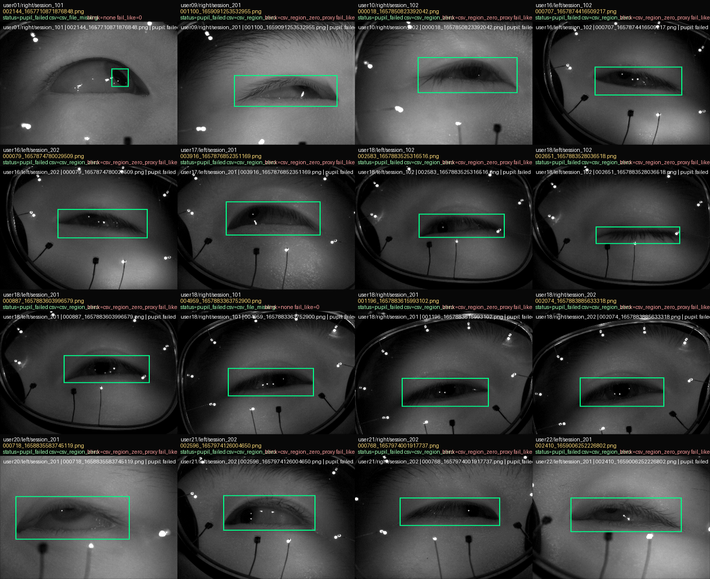
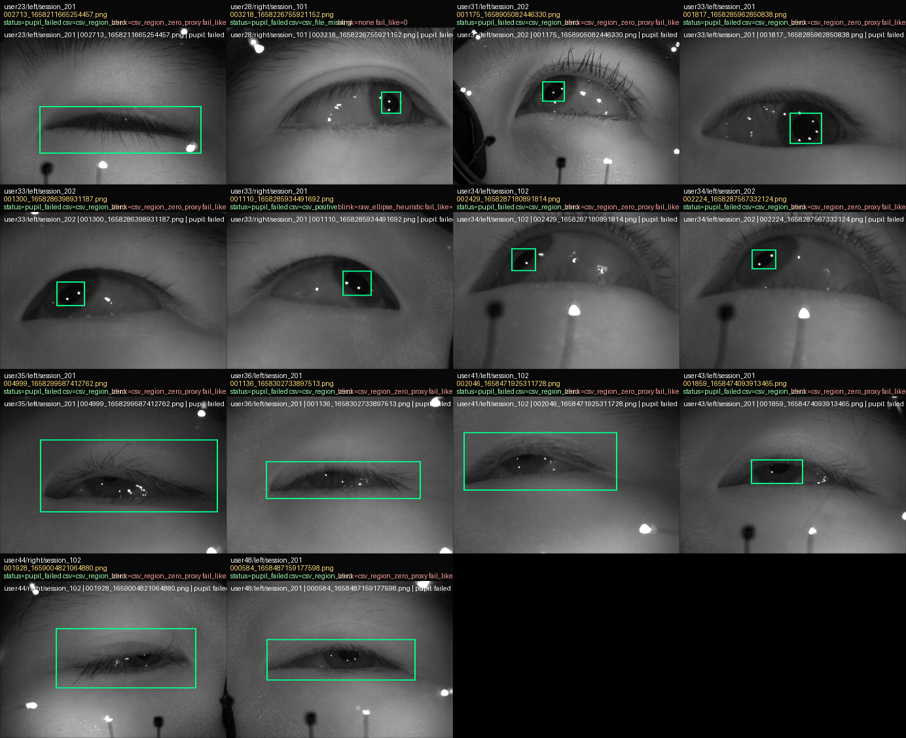
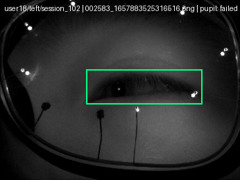
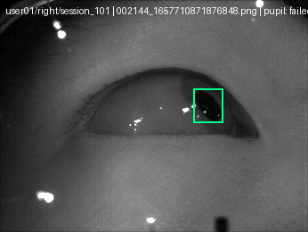
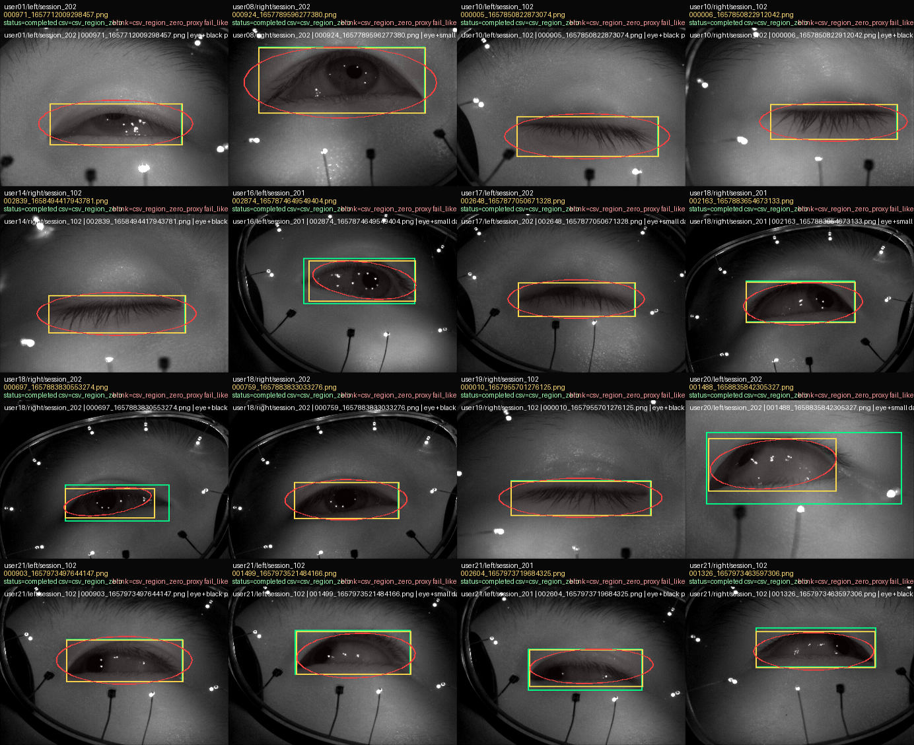
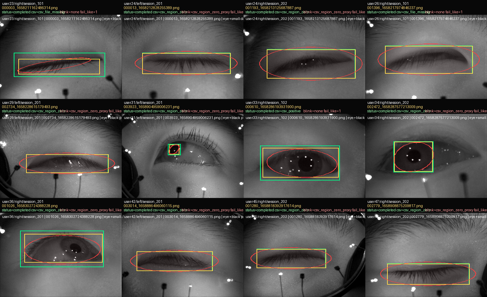
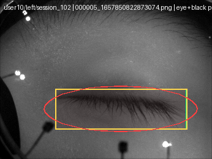
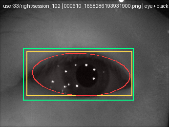
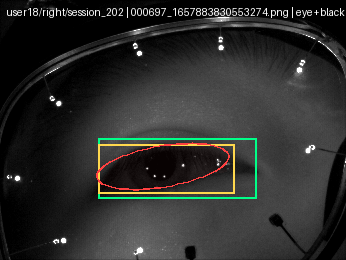

# All-48 / 4-Session `v2` Baseline 실패 검토

이 문서는 `48 users x 4 official sessions x 2 eyes x 4 frames = 1536` 이미지로 구성된 all-user `v2` baseline 실행의 최종 실패 검토를 정리한다.

이번 검토의 목적은 `v2` operating point 이후에도 남아 있던 두 실패군을 직접 확인하는 것이다.

- `pupil_failed`
- `fail_like`

## 실험 설정

- runtime
  - WSL GPU
- option config
  - [`configs/groundedsam/roi_crop_prompted_pupil_v2_eye_prompted.json`](../../configs/groundedsam/roi_crop_prompted_pupil_v2_eye_prompted.json)
- batch workspace
  - [`workspace_session_samples_2/roi_crop_prompted_all48_v2_baseline`](../../workspace_session_samples_2/roi_crop_prompted_all48_v2_baseline)
- final review root
  - [`workspace_session_samples_2/roi_crop_prompted_all48_v2_baseline_review_live`](../../workspace_session_samples_2/roi_crop_prompted_all48_v2_baseline_review_live)
- final numeric summary
  - [`review_summary.json`](../../workspace_session_samples_2/roi_crop_prompted_all48_v2_baseline_review_live/review_summary.json)
- 문서 전용 figure resource
  - [`docs/experiments/resources/08_all48_v2_baseline_failure_review`](resources/08_all48_v2_baseline_failure_review)

주의:

- 이 문서의 figure는 모두 위 doc-local resource 경로에 commit되어 있다.
- 대용량 local batch root는 의도적으로 git에서 제외한다.
  - `dataset_session_samples_1/`
  - `dataset_session_samples_2/`
  - `workspace_session_samples_1/`
  - `workspace_session_samples_2/`
- 다른 서버에서 이 문서를 열면 figure는 렌더링되지만, ignored local JSON batch root는 수동 복사 또는 재생성이 필요하다.

## 집계 결과

| 지표 | 값 |
| --- | ---: |
| sampled frames | 1536 |
| completed | 1506 |
| eye_failed | 0 |
| pupil_failed | 30 |
| fail_like | 28 |
| csv_positive | 12 |
| no_raw_csv_supervision | 1524 |
| blink_labeled | 1143 |

해석:

- `v2` operating point는 전체 sweep에서 stage-1 eye ROI detection을 안정적으로 유지했다.
  - `eye_failed = 0`
- 남은 문제는 stage-2 pupil 처리에 집중되어 있다.
  - 보수적 miss: `pupil_failed = 30`
  - 과도하게 큰 또는 비현실적인 pupil geometry: `fail_like = 28`

## Figure 1. `pupil_failed` gallery

Page 1:

Page 2:

### `pupil_failed` 평가

정량 분해:

- total
  - `30`
- `csv_status`
  - `csv_region_zero = 26`
  - `csv_file_missing = 3`
  - `csv_positive = 1`
- `blink_labeled = true`
  - `27 / 30`
- `predicted_class_name = None`
  - `30 / 30`
- eye-box area ratio `< 0.05`인 작은 eye ROI 사례
  - `9 / 30`

평가:

- 대부분의 `pupil_failed`는 catastrophic model failure라기보다 보수적 no-detection에 가깝다.
- 시각적으로 자주 보이는 패턴은 다음과 같다.
  - 거의 감긴 눈
  - 매우 얇은 slit
  - crop ROI 내부에 신뢰할 수 있는 pupil evidence가 거의 없음
- 이런 경우에는 억지 false positive보다 “유효한 pupil mask 없음”이 더 바람직하다.

다만 일부는 성격이 다르다.

- eye image 자체는 괜찮아 보이지만 stage-1 eye ROI가 지나치게 작고 국소적이다.
- 이 경우 downstream pupil stage는 전체 eye opening을 포함하지 못한 crop 때문에 실패한다.
- 이런 사례는 진짜 pupil-stage miss가 아니라 숨겨진 eye-stage failure로 봐야 한다.

### Figure 2. 대표 `pupil_failed` 사례

#### 2A. 거의 감긴 눈에서의 보수적 no-detection

평가:

- eye ROI는 보이는 slit를 적절히 덮고 있다.
- dark region은 매우 좁다.
- `csv_status = csv_region_zero`
- 이 경우는 허용 가능한 보수적 miss다.

#### 2B. `pupil_failed`로 위장된 숨겨진 eye-stage failure

평가:

- eye ROI가 너무 작다.
- crop이 눈의 전체 opening을 담지 못한다.
- 이 경우는 pupil-stage miss보다 stage-1 ROI escape로 재분류하는 편이 맞다.

## Figure 3. `fail_like` gallery

Page 1:

Page 2:

### `fail_like` 평가

정량 분해:

- total
  - `28`
- `csv_status`
  - `csv_region_zero = 25`
  - `csv_file_missing = 2`
  - `csv_positive = 1`
- `blink_labeled = true`
  - `25 / 28`
- predicted class 분포
  - `black pupil = 18`
  - `small dark circular pupil = 10`

Geometry 통계:

- `crop_mask_area_ratio`
  - min: `0.189`
  - max: `0.985`
  - mean: `0.788`
- `crop_bbox_fill_width_ratio`
  - min: `0.653`
  - max: `1.000`
  - mean: `0.961`
- `crop_bbox_fill_height_ratio`
  - min: `0.627`
  - max: `0.986`
  - mean: `0.923`

평가:

- `fail_like`는 전반적으로 올바른 warning bucket이다.
- 예측된 pupil이 eye ROI 대부분을 차지하는 경우가 많다.
- 시각적으로는 두 하위 유형이 있다.
  - narrow-slit over-segmentation
  - open-eye over-segmentation

### Figure 4. 대표 `fail_like` 사례

#### 4A. narrow-slit over-segmentation

평가:

- 모델이 slit 거의 전체를 pupil로 라벨링했다.
- 측정 geometry
  - `crop_mask_area_ratio = 0.970`
  - `fill_width = 1.000`
  - `fill_height = 0.985`
- 진짜 false positive이며 `fail_like` flag는 타당하다.

#### 4B. CSV-positive frame에서의 open-eye over-segmentation

평가:

- 얼핏 보면 plausible해 보일 수 있다.
- 그러나 예측된 pupil 영역이 eye interior 대부분을 덮고 있다.
  - `crop_pupil_bbox = 216 x 91`
  - `crop_mask_area_ratio = 0.547`
  - `fill_width = 0.952`
  - `fill_height = 0.843`
- 이 frame은 `csv_positive`이므로 진짜 hard false positive다.

#### 4C. 경계 사례지만 geometry로 올바르게 거부된 경우

평가:

- 위 narrow-slit failure보다 부드러워 보이지만, pupil region이 여전히 ROI를 과도하게 차지한다.
  - `crop_mask_area_ratio = 0.434`
  - `fill_width = 0.855`
  - `fill_height = 0.803`
- 현재 geometry warning은 여전히 타당하다.

## 종합 해석

현재 `v2` operating point의 실패 양상은 좁고 해석 가능하다.

1. 광범위한 stage-1 collapse는 없다.
   - `eye_failed = 0`
2. 대부분의 `pupil_failed`는 허용 가능한 보수적 miss다.
3. 대부분의 `fail_like`는 실제 geometry violation이다.
4. 일부 `pupil_failed`는 숨겨진 eye-stage error다.
5. hard open-eye false positive는 존재하지만 드물다.

## 권장 후속 작업

- 기본 baseline은 `v2`를 유지한다.
- 현재 `fail_like` geometry warning도 유지한다.
- minimum stage-1 eye ROI size 또는 eye-area sanity gate를 추가한다.
- `csv_region_zero`와 close-eye frame을 위한 blink-aware policy를 추가한다.
- 드문 `csv_positive + fail_like` 사례는 계속 수동 점검한다.
