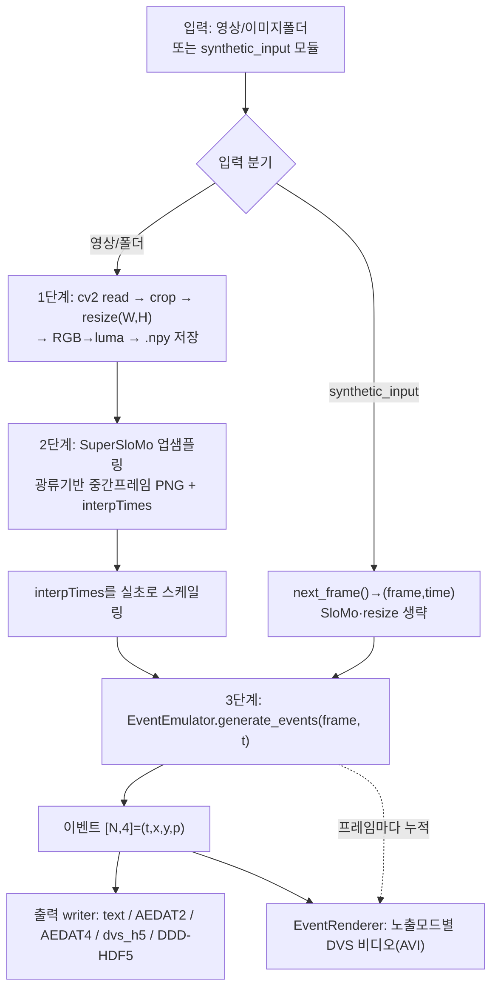
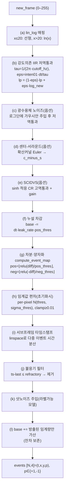

# 01 · v2e 코드베이스 심층 분석

**대상:** `third/v2e` (SensorsINI/v2e v1.5.1, MIT) — Video→DVS 이벤트 합성기
**근거:** `v2e.py`, `v2ecore/*`(emulator/slomo/model/renderer/utils/args/output) 직접 정독, `README.md`, `setup.py`, EV-Eye/논문 대조.

---

## 1. 한 줄 정의와 위상

v2e는 **일반 강도 영상(저프레임레이트 .avi/.mp4/이미지폴더/합성입력)을 물리적으로 사실적인 합성 DVS 이벤트 스트림으로 변환**하는 PyTorch 도구다. 핵심 차별점은 "프레임 차분 시뮬레이터"가 아니라 **DVS 픽셀을 아날로그 회로로 모델링**한다는 점이다: 강도 의존 광수용체 대역폭, 픽셀별 가우시안 임계값 편차, 누설 이벤트, 강도 의존 샷 노이즈, 불응기, 옵션 센터-서라운드(CSDVS), 실험적 고이득 픽셀(SCIDVS). 프레임 간 큰 시간 간극은 **회색조 재학습 SuperSloMo** 광류 보간으로 업샘플링해 메운다.

`third/`에는 v2e **하나의 코드베이스만** 존재한다(다른 마커 파일 전수조사로 확인). 즉 "Annotation Tool 평가" 맥락에서 v2e는 *주석 도구 자체가 아니라*, 프레임 기반 안구영상을 이벤트로 합성하거나 이벤트에 신호/노이즈 라벨을 부여하는 **보조 변환·라벨링 도구**의 위치를 가진다(상세 평가는 03 보고서).

---

## 2. 런타임/의존성 프로파일

| 항목 | 내용 |
|---|---|
| Python | 3.7–3.10 (setup.py ≥3.7, README 권장 3.10, environment.yml 3.7 핀) |
| 핵심 연산 | `torch`+`torchvision`(에뮬레이터 텐서연산 + SuperSloMo), `numpy(<2.0 핀)`, `numba`(2D 히스토그램 JIT), `scipy` |
| 비전/IO | `opencv-python`(프레임 read/resize/luma/AVI), `h5py`(HDF5 출력), `Pillow`, `scikit-image`, `pandas` |
| 이벤트 포맷 | `dv-processing>=1.7.8`(AEDAT-4.0); AEDAT-2.0/텍스트는 자체 바이트 패킹 |
| GPU | 강력 권장(옵션). `cuda` 자동선택. CPU/저사양시 실시간 대비 50–200× 느림. 비용 ∝ 1/timestamp_resolution |
| 테스트/CI | **사실상 없음**(`test/leak_event_test.py` 수동 스모크 1개, assert 없음) |

총 Python 규모 ≈ **8,000–9,000 LOC**(핵심 `v2ecore/` ≈ 5,500–6,000). 사실상 100% Python(+노트북 1), 인트리 C/CUDA 커널 없음(GPU는 PyTorch 경유).

---

## 3. 디렉터리/모듈 맵

```
v2e/
├─ v2e.py                  # CLI 진입 + 3단계 파이프라인 오케스트레이션(~910 LOC)
├─ setup.py / requirements.txt / environment.yml
└─ v2ecore/
   ├─ emulator.py          # ★ EventEmulator: DVS 픽셀 모델 (~1197 LOC, 가장 중요)
   ├─ emulator_utils.py    # 무상태 수학 커널(lin_log, lowpass, leak, event_map, noise)
   ├─ slomo.py             # SuperSloMo 보간 드라이버
   ├─ model.py             # SuperSloMo 네트워크(UNet×2 + backWarp)
   ├─ dataloader.py        # Frames/FramesDirectory (연속 프레임쌍 공급)
   ├─ renderer.py          # EventRenderer + ExposureMode(이벤트→DVS 비디오 프레임)
   ├─ v2e_args.py          # 전체 CLI 인자/기본값
   ├─ v2e_utils.py         # IO/유틸(ImageFolderReader, video_writer, hist2d_numba_seq...)
   ├─ base_synthetic_input.py  # 합성입력 플러그인 슈퍼클래스
   ├─ thres_estimator.py   # 임계값 이분탐색으로 기준 이벤트수 매칭
   ├─ output/              # ae_text_output / aedat2_output / aedat4_output
   ├─ ddd20_utils/         # 실제 DDD17/20 HDF5 리더(일부 Python2 잔재)
   └─ ddd20_interfaces/    # cAER 패킷 언팩
scripts/                   # 합성 자극 생성기(moving_dot, particles, spots, barberpole, gradients...)
dataset_scripts/           # DDD/ILSVRC/UCF101 배치 변환(일부 구버전 네임스페이스로 깨짐)
```

---

## 4. 엔드투엔드 데이터플로우

`v2e.main()`(v2e.py:108–905)이 전 과정을 조율한다. 두 입력 분기가 동일한 에뮬레이터/렌더러 백엔드를 공유한다.



- **업샘플링 전략 선택**(v2e.py:406–478): `--disable_slomo`(보간 없음), 고정 `--timestamp_resolution`(slowdown=⌈frameInterval/res⌉), `--auto_timestamp_resolution`(배치별 광류로 픽셀이동 ≤1px 되도록 자동). `timestamp_resolution`은 auto와 결합 시 **하한**으로 작동.
- **출력 팬아웃**(emulator.py:953–977): 동일 이벤트 배열이 dvs_h5/AEDAT2/AEDAT4/Text writer로 동시에 흐른다. 렌더링은 별도 경로.

---

## 5. DVS 픽셀 모델 상세 (`emulator.py` / `emulator_utils.py`)

`EventEmulator.generate_events(new_frame, t_frame)`(emulator.py:619–1022)는 한 프레임을 받아 이벤트를 반환한다(상태는 `[H,W]` 텐서). **첫 프레임은 상태 초기화만 하고 None 반환.** 픽셀당 타임스텝 순서:



핵심 공식/변수(파일:라인):
- **lin_log**(emulator_utils.py:18–45): `y=x·f (x≤20), y=ln(x)`. 1e-8로 반올림해 임계값 가감시 비트손실로 ON 뒤 OFF가 억제되는 것을 방지. `--hdr`는 lin_log 생략.
- **저역통과**(:57–111): `inten01=(frame+20)/275`, `eps=inten01·dt/tau`(≤1 clamp). 밝을수록 시정수 짧음. `eps>0.3`이면 언더샘플 경고(`check_lowpass`). cutoff_hz=0이면 비활성.
- **누설**(:114–134): `base -= dt·leak_rate_hz·noise_rate_array·(1−leak_jitter·randn)·pos_thres`. `noise_rate_array`는 픽셀별 log-normal FPN.
- **이벤트 양자화**(:137–173): `diff=photoreceptor+noise−base`, `pos=⌊relu(diff)/pos_thres⌋`. 한 프레임 100개 초과시 언더샘플 경고.
- **임계값 편차**(emulator.py:459–478): 스칼라 pos/neg_thres(기본 0.2 log_e)를 `N(thres, sigma_thres)` 배열로 대체, 최소 0.01 clamp.
- **서브프레임 시간**(:791–796): `linspace(t_prev+step, t_frame, steps)`로 픽셀당 다중 이벤트를 균등 분산(고밀도 버스트를 프레임 시각에 몰지 않는 핵심 충실도 기능).
- **불응기**(:830–846): `refractory>step`일 때만 적용. `timestamp_mem`으로 픽셀별 마지막 스파이크 추적. (주: 불응기 종료시 기준레벨 리셋이 맞다는 TODO 알려진 미세부정확.)
- **샷노이즈(단순/라벨가능)**(:297–351): `factor=(rate/2)·dt·((0.25−1)·inten01+1)` → 저강도에서 노이즈 최대. 노이즈 이벤트는 마지막 신호 타임스탬프를 받음.
- **광수용체 노이즈(현실적/라벨불가)**(:177–291): Graça&Delbruck 2021 곡선적합 역산으로 RMS 결정. `--label_signal_noise`와 **상호배타**.
- **CSDVS**(:1061–1124): 수평세포 확산망. 라플라시안 커널 Euler 스테핑, `lambda=√(1/gR)`, 불안정시 abort(느림).
- **SCIDVS**(:58–84,719–748): `dvdt=(1/tau)·sinh(v/efold)`, 픽셀별 tau log-normal, gain 2.

---

## 6. SuperSloMo 보간 (`slomo.py` / `model.py`)

- **네트워크**: `flow_estimator=UNet(2,4)`(프레임쌍→양방향 광류), `interpolator=UNet(12,5)`(I0,I1,4개 flow,2개 backwarp→flow잔차+가시성마스크). UNet은 6단 인코더/디코더, 채널 32→512. `backWarp`는 `grid_sample` 양선형. 체크포인트 `SuperSloMo39.ckpt`(회색조 재학습, 151MB, 저장소 외부 수동 다운로드) 동결 로드.
- **보간 수식**(slomo.py:404–444): 중간위치 `t=(i+0.5)/factor`에서 표준 SuperSloMo 2차 결합 `F_t_0=−t(1−t)F01+t²F10`, `F_t_1=(1−t)²F01−t(1−t)F10` → interpolator 잔차 보정 → 가시성 가중 블렌딩.
- **업샘플 인자 선택**(:352–385): auto일 때 배치 내 전 픽셀 최대속도 `√(vx²+vy²)`의 ⌈⌉로 인자 결정(이동 ≤1px). `timestamp_resolution`은 하한. 항상 ≥2 clamp.

---

## 7. 핵심 클래스/함수 (시그니처)

- `EventEmulator.__init__(pos_thres=0.2, neg_thres=0.2, sigma_thres=0.03, cutoff_hz=0, leak_rate_hz=0.1, refractory_period_s=0, shot_noise_rate_hz=0, photoreceptor_noise=False, cs_lambda_pixels, cs_tau_p_ms, hdr=False, scidvs=False, label_signal_noise=False, ...)` — 파라미터 저장, 출력 writer 오픈, CSDVS 커널 준비.
- `EventEmulator.generate_events(new_frame, t_frame) -> ndarray[N,4]|None` — §5 픽셀 모델.
- `EventEmulator.get_event_list_from_coords(pos_xy, neg_xy, ts)` — AER 행 조립(출력 `[t,x,y,p]`, x=dim-1, y=dim-0).
- `emulator_utils`: `lin_log`, `rescale_intensity_frame`, `low_pass_filter`, `subtract_leak_current`, `compute_event_map`, `compute_photoreceptor_noise_voltage`, `generate_shot_noise`.
- `SuperSloMo.interpolate(source_frame_path, output_folder, frame_size) -> (interpTimes, avgUpsampling)`.
- `EventRenderer.render_events_to_frames(event_arr, height, width)` + `ExposureMode{DURATION, COUNT, AREA_COUNT, SOURCE}`.

---

## 8. `--label_signal_noise` — 이벤트 주석 기능 ★

v2e 내장 **이벤트별 라벨링** 기능(주석 평가에 직접 관련). 각 이벤트를 **실신호 vs 샷노이즈**로 태깅.

- **게이팅**(v2e.py:309–318): `--dvs_text/aedat2/aedat4` 중 하나 필수, `--photoreceptor_noise` **금지**(로그단 노이즈는 신호와 구분 불가), `shot_noise_rate_hz>0` 필수. **샷노이즈만** 라벨(누설은 라벨 안 함).
- **인코딩**: 텍스트는 5번째 열(1=신호/0=노이즈), AEDAT-2.0은 노이즈를 special-event 비트(1<<10)로, AEDAT-4.0은 라벨 미인코딩.
- **한계**: 라벨 의미는 단순 Poisson 샷노이즈 모델만큼만 유효. 누설/보간아티팩트 이벤트는 라벨 불가. "신호"="결정론적 대비모델로 설명되는 이벤트"이지 동작 GT 보장이 아님.

---

## 9. 출력 포맷 스키마

| 포맷 | Writer | 스키마 |
|---|---|---|
| DVS text | `DVSTextOutput` | `t(s) x y p`(p∈{0,1}); 라벨시 `t x y p s`(s∈{1,0}); `#` 주석헤더 |
| AEDAT-2.0 | `AEDat2Output` | `(int32 addr, int32 ts_µs)` big-endian. addr=x/y/p 비트팩(DAVIS346: y<<22,x<<12,p<<11). 노이즈=special bit. DAVIS346/240/DVS640만 지원 |
| AEDAT-4.0 | `AEDat4Output` | `dv_processing` MonoCameraWriter; 해상도 하드코딩, 라벨 미지원 |
| HDF5(`--dvs_h5`) | emulator | dataset `events` (N,4) uint32 `[t_µs,x,y,p]`(p:−1→0), gzip |
| DDD-HDF5(`--ddd_output`) | emulator | `events`+`frame`(uint8)+`frame_ts`(µs)+`frame_idx` → DDD17/20 호환 |
| DVS 비디오 | EventRenderer | XVID AVI, `(on−off)` 히스토그램 정규화 + `-frame_times.txt` |

---

## 10. 코드 품질 관찰

**구조/결합**: 무상태 수학(`emulator_utils`) 위 상태기반 `EventEmulator`, 깔끔한 `SuperSloMo` 드라이버, 통일된 `appendEvents(events, signnoise_label=None)` writer 계약 — 잘 계층화됨. 합성입력 플러그인(동적 import)은 좋은 확장점. **단점**: `v2e.py:main()`은 ~800 LOC 모놀리식(인자검증+IO+타이밍+로깅+파이프라인 혼재, 단위테스트 곤란). `v2e_args.py`가 `EventEmulator`를 역import.

**가독성**: 양호. 풍부한 docstring, 물리/AER 비트팩 설명 주석. 다만 이벤트 반복 로직(:805–923)이 조밀해 분해 필요.

**테스트**: 사실상 없음(픽셀모델 회귀 픽스처 부재).

**기술부채/드리프트**:
- 큰 주석처리 블록(generate_shot_noise:353–405, compute_event_map:159–174).
- 다수 `# TODO`(불응기 리셋레벨 버그 :826–829, base 업데이트 의문 :936, CSDVS Euler :1067).
- **구버전 네임스페이스로 깨진 스크립트**: `dataset_scripts/ilsvrc·ucf101·ddd_find_thresholds.py`가 옛 `v2e.*`/없어진 렌더러 메서드 호출.
- **폐기 API**: `np.float/np.int`(NumPy≥1.24 제거), `ddd20_utils/datasets.py`는 Python2 잔재, `pandas read_table(error_bad_lines=)` 제거됨 → 정확한 버전 핀에 민감.

**리스크**: ① 재현성이 외부 `SuperSloMo39.ckpt`(수동 다운로드)에 의존, ② 고업샘플시 대용량 임시 IO, ③ AEDAT 해상도 제약, ④ CSDVS 느림/불안정, ⑤ 폐기 의존성 다수.

---

## 11. (요약) v2e의 안구추적 주석 활용 적합성

상세는 `03_annotation_tool_evaluation.md` §3. 요지:
- **강점**: 물리적으로 사실적인 프레임→이벤트 변환, 저프레임 안구영상에서 μs급 이벤트 부트스트랩, 내장 신호/노이즈 라벨, 픽셀·시간 대응 보존(프레임 주석을 이벤트로 결정론적 전이 가능), 실제 DVS 기하(`--dvs346`) 매칭.
- **한계**: 자체 눈/동공/시선 모델 없음(의미 라벨은 소스 프레임에서 와야 함), IR 조명·각막반사(glint) 미모델, 새케이드(고속운동)에서 SuperSloMo 보간 아티팩트=가짜 이벤트, 노이즈 현실성 vs 라벨가능성 트레이드오프, 변환 비용 큼.
