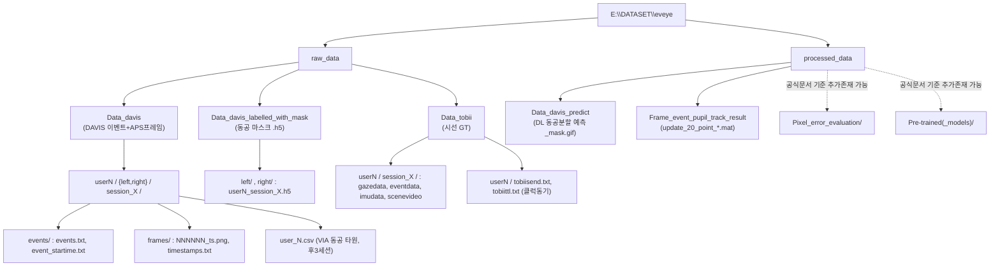
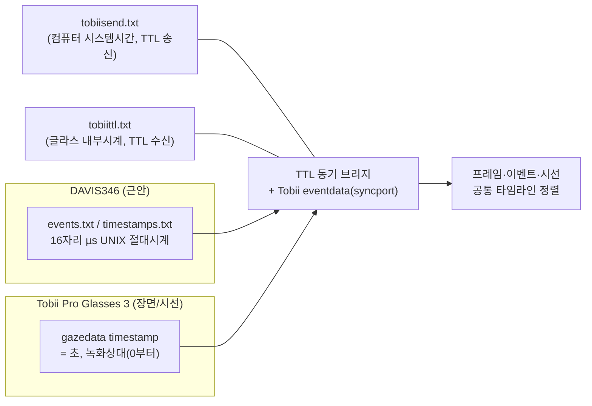
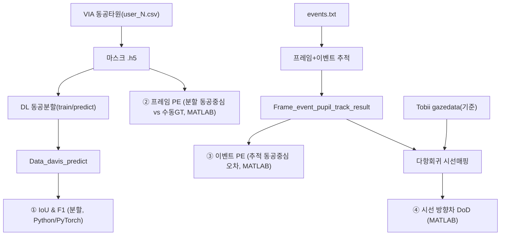

# 02 · EV-Eye 데이터셋 / 라벨 / 실험결과 심층 분석

**대상:** `E:\DATASET\eveye` = **EV-Eye** (NeurIPS 2023 D&B; Zhao et al.) 멀티모달 고주파 안구추적 데이터셋
**근거:** 디스크 직접 샘플링(`events.txt`, `timestamps.txt`, `event_startime.txt`, `user_N.csv`, `gazedata`, 프레임 PNG 육안) + [EV-Eye 공식 README](https://github.com/Ningreka/EV-Eye/blob/main/README.md) 대조.

---

## 1. 정체성·규모

- **48명** 참가자 × **양안(left/right)** × **세션 4개**, **2×DAVIS346** 이벤트카메라(346×260).
- **≈150만 근안 회색조 프레임**, **≈27억 이벤트 샘플**. + Tobii Pro Glasses 3의 **67.5만 장면영상 프레임 / 270만 시선 레퍼런스**.
- **세션 의미(공식)**: `session_1_0_1`, `session_1_0_2` = **새케이드+고정(saccade & fixation)**; `session_2_0_1`, `session_2_0_2` = **부드러운 추종(smooth pursuit)**.
- **동공 분할 라벨 ≈9,011장**(VIA로 균일 샘플 주석), **마지막 3개 세션(1_0_2, 2_0_1, 2_0_2)**에만 존재.

---

## 2. 디렉터리 구조 (디스크 확인본)



> **주의(사용자 사본)**: 디스크에서 `Data_davis_predict`, `Frame_event_pupil_track_result` 확인. 공식 구조의 `Pixel_error_evaluation/`, `Pre-trained_models/`는 본 샘플링에서 미확인 → **존재 여부를 툴킷으로 검증** 권장(`scripts/analyze_eveye_dataset.py`가 자동 점검).

---

## 3. 모달리티별 포맷 (실제 샘플 근거)

### 3.1 DAVIS 이벤트 — `events/events.txt`
- 헤더 없음. **5필드/라인**: `index  timestamp  x  y  polarity`.
- 1열=1-based 이벤트 인덱스, 2열=**16자리 마이크로초 UNIX 타임스탬프**(예 `1657711084443803`≈2022-07-13), x/y=정수 픽셀, polarity∈{0,1}.
- 구분자 혼합: 인덱스 뒤 **TAB**, 이후 **공백**. x≤335·y≤255 관측 → DAVIS346(346×260) 일치.
```
1	1657711084443803 210 132 1
5	1657711084448962 179 128 0
```
- `event_startime.txt`: 이벤트 스트림 **시작 타임스탬프**(첫 이벤트 ts와 동일) — 절대시계 정렬용 앵커.

### 3.2 DAVIS APS 프레임 — `frames/`
- `NNNNNN_<µs타임스탬프>.png`, 6자리 zero-pad 연속 인덱스. 동봉 `timestamps.txt`(인덱스별 µs ts).
- Δ≈40,000µs → **APS ≈25fps**. 육안 확인: **단안 회색조 근안영상**, 눈꺼풀·속눈썹·홍채·**선명한 동공**과 다수 IR **반사점(glint)**. 해상도 ≈346×260.
- `creation_time.txt`(세션): DAVIS 수집 시작 시스템시간.

### 3.3 동공 타원 주석 — `user_N.csv` (VIA)
- **VGG Image Annotator CSV 익스포트**. 헤더: `filename,file_size,file_attributes,region_count,region_id,region_shape_attributes,region_attributes`.
- 라벨 프레임은 **ellipse**: `{"name":"ellipse","cx":168,"cy":138,"rx":21.15,"ry":19,"theta":2.636}` + 품질플래그(`good/frontal/good_illumination`).
- **대부분 프레임 `region_count=0`(미라벨)** → 타원 GT는 **희소/키프레임 기반**. 후3세션에만 존재.

### 3.4 동공 마스크 라벨 — `Data_davis_labelled_with_mask/{left,right}/userN_session_X.h5`
- VIA 타원에서 **결정론적으로 생성된 이진 동공 마스크**(공식 `matlab_processed/generate_pupil_mask.m`), DL 동공분할 학습용.
- **세션 커버리지: `1_0_2`, `2_0_1`, `2_0_2`만**(= `session_1_0_1` 마스크 없음). 사용자 사본도 동일 패턴 확인(user1…user40+ 양안).
- ⚠ 본 환경에서 **h5 내부 배열 미파싱**(바이너리). 마스크 면적·동공중심·해상도는 `scripts/analyze_labels.py`로 산출.

### 3.5 Tobii 시선 GT — `Data_tobii/userN/session_X/`
- `gazedata`(JSON-lines): `{"type":"gaze","timestamp":0.0062,"data":{"gaze2d":[0.515,0.495],"gaze3d":[mm,mm,mm],"eyeleft/right":{"gazeorigin","gazedirection","pupildiameter(mm)"}}}`. **timestamp=초(녹화상대)**, **gaze2d=정규화[0,1]**(픽셀 아님), 동공직경 mm, ~100Hz.
- `gazedata.txt`: 위 JSON의 6열 TAB 추출(`idx ts g2x g2y g3x g3y g3z`).
- `eventdata`(syncport TTL), `imudata`(가속도/자이로 ~100Hz), `scenevideo.mp4`, `recording.g3`.
- `tobiisend.txt`(TTL 송신 컴퓨터 시스템시간), `tobiittl.txt`(글라스 내부시계 TTL 수신시간) — **장치간 동기 브리지**.

---

## 4. 두 장치 클럭 동기화 (핵심 함정)



- DAVIS는 **µs UNIX 절대시계**, Tobii는 **상대 초** → 직접 비교 불가. 정렬은 **TTL 신호 + `tobiisend/tobiittl` + syncport eventdata**로만 가능. 라벨/결과를 시선 GT와 맞추려면 이 동기화가 정확해야 한다(품질 평가의 주요 오차원).

---

## 5. 실험결과(`processed_data`) 의미

| 폴더 | 내용 | 산출 코드(공식) |
|---|---|---|
| `Data_davis_predict/userN/userN/{l,r}/session_X/predict/NNNNNN_ts_mask.gif` | **DL 동공분할 예측 마스크**(모델 출력, 사람 라벨과 별개). 세션당 수천 장 | `predict.py` |
| `Frame_event_pupil_track_result/{l,r}/update_20_point_userN_session_X.mat` | **프레임+이벤트 하이브리드 동공추적 결과**(20-point 궤적). 4세션 전부 포함 | `matlab_processed/frame_event_pupil_track.m` |
| `Pixel_error_evaluation/{frame,event}/`(공식) | 프레임/이벤트 동공중심 **픽셀오차(PE)** 평가결과 | `pe_of_frame/event_based_pupil_track.m` |
| `Pre-trained_models/`(공식) | 48명 양안 **사전학습 동공분할 모델** | `train.py` |

- 경로 특이점: `Data_davis_predict`는 **`userN\userN` 이중 디렉터리** 중첩(사용자 사본 확인).
- `.mat`/`.gif` 내부 수치는 본 환경 미파싱 → `scripts/analyze_tracking_results.py`(.mat), 예측 GIF는 `analyze_labels.py`에서 처리.

---

## 6. EV-Eye 벤치마크 4대 지표 (라벨/결과가 쓰이는 곳)



① IoU/F1(분할), ② 프레임 PE, ③ 이벤트 PE, ④ 시선 DoD — 본 데이터셋의 공식 평가축. 하이브리드 프레임-이벤트 추적은 최대 **38.4kHz** 동공 추적을 주장.

---

## 7. 데이터 품질·정합성 관찰

- **클럭 정렬**: DAVIS(µs UNIX, ~2022-07-13) ↔ Tobii(상대 초). TTL/syncport 의존 → 동기 오차가 시선평가 오차의 잠재 상한.
- **프레임레이트**: APS≈25fps, Tobii gaze/IMU≈100Hz, 이벤트는 μs급. 멀티레이트 정렬 필요.
- **라벨 희소성**: `user_N.csv`는 대부분 미라벨, 타원 GT는 키프레임(전체 9,011장)에 한정.
- **세션 비대칭**: 마스크 라벨은 `1_0_1` **누락**, 추적결과 `.mat`·예측 GIF는 `1_0_1` **포함** → 마스크 GT 사용시 세션 결손 반드시 고려.
- **세션별 에폭 상이**: `session_1_0_2`(…084…) vs `session_2_0_2`(…970…, 약 15분 후) — 세션마다 독립 절대시간대.
- **프레임 명명**: zero-pad 연속, 샘플 구간 누락 없음.

---

## 8. 본 환경에서 미검증(툴킷으로 산출 필요)

- `*.h5` 마스크 배열(면적/중심/해상도/프레임수), `*.mat` 추적결과 구조, `.gif` 예측 마스크 통계.
- 사용자별/세션별 **정확한 프레임수·이벤트수·이벤트율**, 라벨 커버리지(라벨프레임/총프레임).
- `Pixel_error_evaluation`, `Pre-trained_models` 폴더 실제 존재 여부.
- 마스크↔타원 일관성, 동공중심 PE, 시선 DoD의 실제 수치 → **`03` 보고서의 평가설계 + `scripts/` 실행**.

---

## 출처
- 디스크 직접 샘플링(`E:\DATASET\eveye`)
- [EV-Eye 공식 README](https://github.com/Ningreka/EV-Eye/blob/main/README.md), [논문(OpenReview)](https://openreview.net/forum?id=bmfMNIf1bU)
