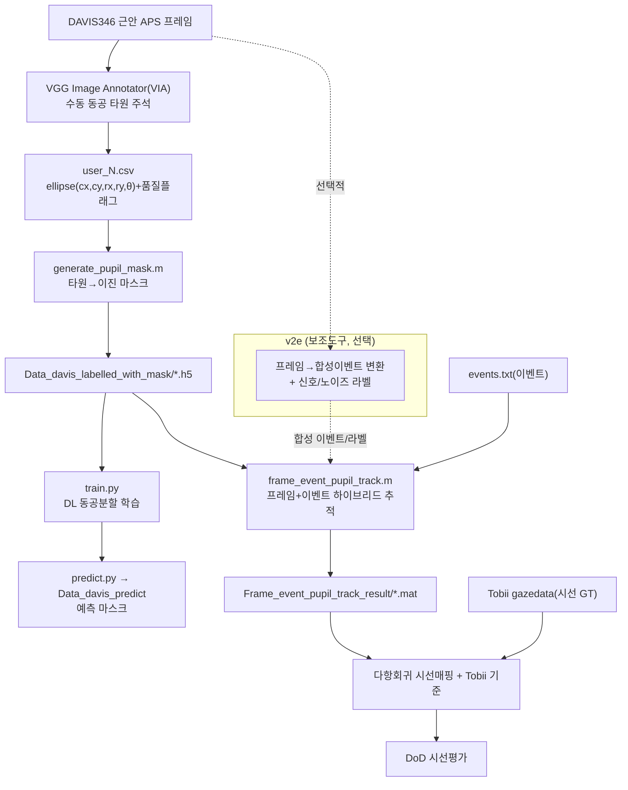
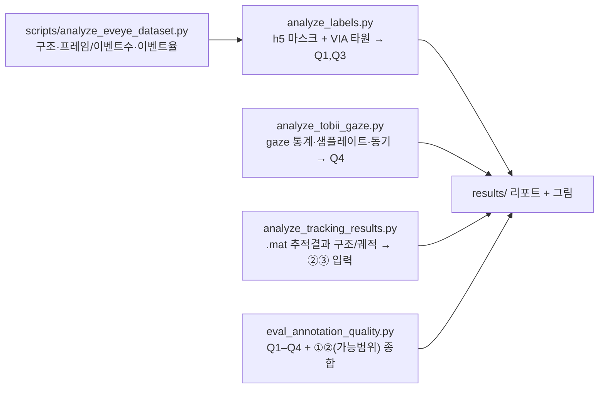

# 03 · Annotation-Tool 평가 종합

세 가지 평가 대상(요청: "1,2,3 전부")을 통합한다.
**(1) 라벨 생성 파이프라인**, **(2) v2e 이벤트 시뮬레이터**, **(3) EV-Eye 라벨 품질**.

---

## 0. "Annotation Tool"의 정의

EV-Eye에는 단일 "주석 프로그램"이 아니라 **다단계 라벨 생성 파이프라인**이 존재한다. 본 평가는 이 파이프라인 전체와, 그 보조도구로서의 v2e, 그리고 산출된 라벨의 품질을 함께 본다.

---

## 1. 평가 #1 — 라벨 생성 파이프라인

### 1.1 강점
- **멀티모달 교차검증 설계**: 프레임(분할/타원) + 이벤트(추적) + Tobii(시선) 3중 GT로 상호 검증 가능. 단일 모달 데이터셋 대비 라벨 신뢰성 검증 경로가 풍부.
- **결정론적 마스크 생성**: 타원→마스크가 MATLAB 코드로 재현 가능 → 마스크와 타원의 **내적 일관성은 본질적으로 보장**(마스크는 타원의 함수).
- **품질 메타데이터 동봉**: VIA `region_attributes`에 `good/frontal/good_illumination` 플래그 → 라벨 필터링·신뢰가중 가능.
- **공개 재현 코드**: Python(분할/예측) + MATLAB(추적/PE/DoD) 전 단계 공개.

### 1.2 약점·리스크
| 항목 | 내용 | 영향 |
|---|---|---|
| 수동 주석 병목 | 동공 타원은 사람이 VIA로 그림. **9,011장만** 라벨 | 라벨 희소 → 분할 일반화·평가표본 제한 |
| 타원 근사 오차 | 동공을 **타원으로 근사**(부분 가림·비타원 동공에서 오차) | 마스크/PE의 체계적 편향 |
| 세션 결손 | 마스크가 `session_1_0_1`에 **부재** | 새케이드 세션 일부의 분할 GT 공백 |
| 사람 라벨 노이즈 | 주석자 간/내 변동(타원 중심·축 흔들림) | PE의 하한(라벨노이즈)을 규정 |
| 클럭 동기 의존 | DAVIS µs ↔ Tobii 상대초를 TTL로 연결 | 시선 DoD 평가의 잠재 정렬오차 |
| 키프레임 선택 편향 | "균일 샘플"이라지만 선택 규칙 불투명 | 평가셋 대표성 의문 |

### 1.3 핵심 평가질문(체크리스트)
- 마스크는 타원과 얼마나 일치하는가?(IoU) → 결정론적이라 ≈1 기대, **이탈 시 생성코드 버그 신호**.
- 라벨 프레임 커버리지(라벨/총)는 사용자·세션별로 균형 잡혔는가?
- `good/frontal/good_illumination=false` 프레임 비율과 그 영향은?
- 동공중심(타원 cx,cy) 시계열은 물리적으로 매끄러운가?(점프=라벨오류 후보)

---

## 2. 평가 #2 — v2e 이벤트 시뮬레이터 (안구추적 주석 관점)

(코드 근거는 `01_v2e_codebase_analysis.md`.)

### 2.1 v2e가 잘하는 것
- **물리적으로 사실적인 프레임→이벤트 변환**: 광수용체 대역폭/임계값편차/누설/샷노이즈/불응기/서브프레임 타임스탬프. 새케이드의 고속 고대비 동공·홍채 경계에서 이벤트 분포 사실성이 중요.
- **저프레임 안구영상에서 μs급 이벤트 부트스트랩**: 풍부한 프레임 기반 안구 데이터 → 합성 이벤트로 확장.
- **내장 신호/노이즈 라벨**(`--label_signal_noise`): 디노이징/강건성 연구용 **이벤트별 주석**을 자동 생성(대다수 시뮬레이터에 없는 기능).
- **공간·시간 대응 보존**: 각 이벤트의 `(x,y)`·시각이 소스 픽셀·프레임시각에서 유도 → **프레임의 동공타원/시선/깜빡임 라벨을 이벤트로 결정론적 전이** 가능. 실제 DVS 기하(`--dvs346`) 매칭, `--crop` ROI 지원.

### 2.2 v2e가 못하는/주의할 것
- **자체 눈/동공/시선 모델 없음**: 의미 라벨(동공·시선·깜빡임)은 소스 프레임에서 와야 함. v2e는 분할·타원·시선을 산출하지 않음.
- **누설/보간아티팩트 라벨 불가**, `--photoreceptor_noise`(현실적 노이즈)와 라벨 기능 **상호배타** → 노이즈 현실성과 라벨가능성 동시 달성 불가.
- **IR 물리 미반영**: 근안 IR 조명·각막반사(glint)·정반사 미모델. EV-Eye 프레임의 다수 glint는 v2e가 합성하지 못함.
- **새케이드 충실도 한계**: 고속운동에서 SuperSloMo 보간 오차=가짜 이벤트. `cutoff_hz=0`+고업샘플시 수치노이즈 경고. 유한 `cutoff_hz` 필요하나 언더샘플 경고와 긴장.
- **광도 불일치**: RGB→luma 가정. 실제 IR DVS와 광도특성 상이(입력이 IR이 아니면 미스매치).
- **비용**: 미세해상도(예 100µs)는 대규모 업샘플 → 영상 초당 수분 소요.

### 2.3 판정
v2e는 **"이벤트 주석 도구"가 아니라 "프레임→이벤트 변환기 + 이벤트 신호/노이즈 라벨러"**다. EV-Eye 같은 **이미 주석된 프레임 안구영상으로부터 라벨된 합성 이벤트셋을 부트스트랩**하는 데 적합하나, 모든 의미 라벨은 외부(프레임 GT)에서 와야 하며, 합성 라벨은 **실제 근안 DVS 녹화로 검증 후** 신뢰해야 한다.

---

## 3. 평가 #3 — EV-Eye 라벨 품질 평가 (설계 + 지표)

EV-Eye 공식 4지표에 **라벨 품질 진단 4종**을 더한 평가 프로토콜을 제안하고, 각 항목을 `scripts/` 툴킷에 매핑한다.

### 3.1 공식 벤치마크 4지표
| # | 지표 | 정의 | 대상 |
|---|---|---|---|
| ① | IoU & F1 | 예측 마스크 vs GT 마스크 영역 일치 | 동공 분할 |
| ② | 프레임 PE | 분할 동공중심 vs 수동 타원중심의 유클리드 픽셀거리 | 프레임 추적 |
| ③ | 이벤트 PE | 이벤트 추적 동공중심 오차 | 이벤트 추적 |
| ④ | 시선 DoD | 추정 시선방향 vs Tobii 기준의 방향차 | 시선 추적 |

### 3.2 라벨 품질 진단(추가 제안)
- **Q1 마스크↔타원 일관성**: h5 마스크에서 동공중심·면적·타원적합 → `user_N.csv` 타원과 IoU/중심거리. 결정론적이라 **이탈은 생성 결함**.
- **Q2 라벨 노이즈 추정**: 동공중심 시계열의 고주파 변동(인접 라벨프레임 간 점프) → 라벨 정밀도 하한 추정. **PE가 이 하한보다 낮으면 과적합/누설 의심**.
- **Q3 커버리지·균형**: 사용자·세션·양안별 라벨프레임 수, 품질플래그 분포, 세션 결손(1_0_1) 영향.
- **Q4 시간 정합**: 프레임 ts ↔ 이벤트 ts ↔ Tobii(TTL 보정) 정렬오차. DoD 신뢰성의 전제.

### 3.3 평가 흐름

---

## 4. 통합 평가 스코어카드 (정성)

| 영역 | 항목 | 평가 | 근거 |
|---|---|---|---|
| 라벨 파이프라인 | 재현성 | ★★★★☆ | Py+MATLAB 전공정 공개, 단 외부 데이터·수동주석 의존 |
| 라벨 파이프라인 | 라벨 밀도 | ★★☆☆☆ | 9,011 키프레임 한정, 세션결손 |
| 라벨 파이프라인 | 일관성 | ★★★★☆ | 마스크=타원함수(결정론적), 사람오차가 상한 |
| 멀티모달 GT | 교차검증력 | ★★★★★ | 프레임+이벤트+Tobii 3중 |
| 멀티모달 GT | 동기화 | ★★★☆☆ | TTL 의존, 두 시계 상이 |
| v2e 보조 | 합성 사실성 | ★★★★☆ | 물리모델 강함, IR·glint·새케이드 한계 |
| v2e 보조 | 라벨 능력 | ★★☆☆☆ | 신호/노이즈만, 의미라벨 불가 |

(별점은 본 분석 근거의 정성 판단이며, 정량 확정은 §3 툴킷 실행 결과로 갱신.)

---

## 5. 장단점 요약 & 권고

**장점**: 대규모·다양·멀티모달, 결정론적 마스크, 공개 재현코드, 38.4kHz 추적, 풍부한 GT 교차검증.
**단점**: 수동 타원 주석 희소·병목, 세션1_0_1 마스크 결손, 타원 근사 편향, 이종 클럭 동기 의존, 키프레임 선택 불투명.

**권고(실행 가능)**:
1. `scripts/` 실행으로 **Q1–Q4 + ①②**를 사용자 사본에서 수치화하고 세션결손·커버리지를 먼저 정량화.
2. 시선 DoD 전에 **TTL 동기 정확도**를 별도 점검(가장 큰 잠재 오차원).
3. v2e를 쓸 경우, EV-Eye 프레임으로 합성한 이벤트를 **실제 EV-Eye 이벤트와 분포 비교**(이벤트율·극성비·공간분포)로 검증 후에만 라벨 전이.
4. 타원 근사 한계가 중요한 응용은 **마스크 직접(픽셀) 평가**(IoU/F1)를 우선, 중심거리(PE)는 보조.

---

## 6. 자체 검증 & 불확실성

**확실(직접 근거)**: v2e 코드 동작/포맷/라벨기능, EV-Eye 디스크 구조와 텍스트 라벨 포맷(events.txt, user_N.csv, gazedata, timestamps), 세션 의미·9,011 라벨·마스크 세션결손(공식 문서 일치).

**불확실/미검증(본 환경 한계)**:
- h5 마스크·`.mat` 내부 수치(면적/중심/궤적) — *미파싱*. 추정은 "추측"으로 표기했고, 확정은 툴킷 필요.
- 사용자 사본의 `Pixel_error_evaluation`/`Pre-trained_models` 존재 여부 — *미확인*.
- 정확한 사용자수 상한(샘플 truncation으로 user48까지 관측, 전수 미확인).
- 스코어카드 별점은 정성 판단(정량 산출로 대체 권장).

**가정**: 사용자 사본이 EV-Eye 공식 배포 구조를 따른다(디스크 샘플과 공식 문서가 일치하여 합리적).
