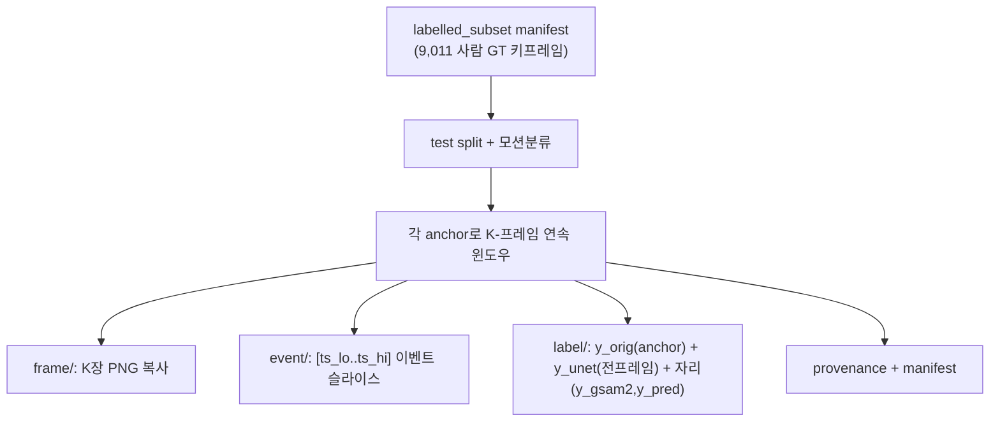

# 샘플 수집 계획 v2 (데이터셋 실체 반영본)

> v1(`COLLECTION_PLAN.md`)을 대체. 변경 이유: 라벨 실체가 확인됨 —
> **사람 GT = 키프레임 ~9,011장(sparse)**, **DeanDataset_full_unet = 전 프레임 U-Net 의사라벨(dense)**,
> **0.1812 px = full_unet 의사라벨 대비(self-consistency/누수)**. 정직한 GT는 `labelled_subset`.

---

## 0. 라벨 3종 정리 (가장 중요)

| 라벨 | 어떤 프레임에 있나 | 출처 | 본 분석에서 역할 |
|---|---|---|---|
| **y_orig** (사람 GT) | **anchor 키프레임만** (~9,011) | VIA 타원 = `Data_davis/.../user_N.csv` / 마스크 `Data_davis_labelled_with_mask/*.h5`(`/data`,`/label`) = `DavisWithMaskDataset_labelled_subset` | **진실(frozen test GT)** |
| **y_unet** (U-Net 의사) | **전 프레임(dense)** | `DeanDataset_full_unet` (학습머신) / `Data_davis_predict/*_mask.gif` (E: 사본) | **0.1812를 만든 라벨** → label-noise 측정 대상 |
| **y_gsam2** (audit) | 수집된 전 프레임 | Grounded-SAM2 (후속 실행) | 독립 audit |
| **y_pred** (모델) | 수집된 전 프레임 | HBTXR/EPNet 예측 | corrected `E_i` 계산 |

→ 한 윈도우 안에 **anchor=y_orig(+y_unet+y_gsam2+y_pred)**, **이웃=y_unet(+y_gsam2+y_pred)** 이 모입니다.
이웃에도 라벨이 "있긴" 하지만 전부 **예측/audit**이고, **사람 GT는 anchor에만** 있습니다.

---

## 1. 이 수집으로 계산되는 것 (목적 ↔ 데이터)

| 리뷰어 항목 | 계산식 | 필요한 라벨 | 어디서 |
|---|---|---|---|
| **누수 정량화** (핵심) | `E_unet = ‖y_pred − y_unet‖` vs `E_orig = ‖y_pred − y_orig‖` | anchor: y_pred,y_unet,y_orig | anchor |
| **Label noise** | `‖y_orig − y_unet‖`, `‖y_orig − y_gsam2‖` | anchor 3종 | anchor |
| **Corrected model error** `E_i` | `‖y_pred − y_orig‖` | anchor: y_pred,y_orig | anchor |
| **Annotation precision proxy** | fixation 윈도우의 프레임간 center jitter(annotator별) | 이웃 dense(y_unet/y_gsam2/y_pred) | 윈도우 전체 |
| **Sample uncertainty** `U_i` | `median{‖y_orig−y_unet‖,‖y_orig−y_gsam2‖,‖y_unet−y_gsam2‖}` | anchor 3종 | anchor |

---

## 2. 표본 설계 (GT-앵커 연속 윈도우)

- **anchor = 사람 GT 키프레임**(test split 한정, subject-independent). 후보 목록은 **`DavisWithMaskDataset_labelled_subset/manifest.json`(9,011 + event segment 정의)** 을 1순위로, 없으면 E:의 VIA csv(`region_count>0`)로.
- **윈도우 = anchor 중앙 ±k 연속 프레임**(dense). 길이 K: fixation/smooth=11, saccade=7.
- **모션 층화**: smooth=`session_2_0_*`(설계), fixation/saccade=`session_1_0_2`에서 **U-Net dense center 속도**로 분류(블링크 제외, median-velocity, 자동 임계). `session_1_0_1`은 GT 없어 제외.
- **목표 윈도우 수**: fixation 45 / smooth 45 / saccade 70 (≈1,480 프레임). saccade는 희소 → `min(목표, 가용)` 후 실측 보고, 필요시 균형 down-sample.



---

## 3. 데이터 구성 (한 윈도우가 담는 것)

```
samples/
├─ frame/{key}/{idx}_{ts}.png            # K장 (anchor 1 + 이웃 K-1), 원본 APS 프레임 복사
├─ event/{key}.npz                       # 윈도우 전체 이벤트 (t,x,y,p) + ts_lo/ts_hi
└─ label/{key}/
   ├─ gt.json            # anchor만: 사람 GT 타원(cx,cy,rx,ry,theta)+품질플래그+ (옵션) 마스크 png
   ├─ unet_dense.json    # 전 프레임: U-Net center(+면적/유효), src(full_unet 또는 predict gif)
   ├─ gsam2/             # (후속) Grounded-SAM2 mask+center, 전 프레임
   ├─ pred/              # (후속) 모델 예측 center, 전 프레임/모드별
   └─ provenance.json    # 모든 원본 절대경로 + 설정 스냅샷
```

**key** = `{motion}_{user}_{eye}_{session}_w{idx}_a{anchor_idx}` (예 `fixation_u3_left_s1_0_2_w007_a000412`).

**라벨 좌표계**: 전부 **원본 APS 346×260 px** 기준. 모델이 256/64 해상도로 예측하면(코드상 `center64×4`) **반드시 346×260으로 환산** 후 비교(eval 단계에서 처리, manifest에 scale 기록).
**블링크**: 모델 데이터셋의 `close` 플래그 / U-Net 마스크 면적 붕괴로 판정 → `blink_flag`, `E_i`·`U_i`·precision에서 동일 기준 제외.

---

## 4. manifest 스키마

`manifest_frames.csv` (프레임 1행):
```
key, motion, role(anchor/neighbor), user, eye, session,
frame_index, frame_ts_us, blink_flag,
has_orig, orig_cx, orig_cy, orig_rx, orig_ry, orig_theta, q_good,q_frontal,q_illum,
unet_valid, unet_cx, unet_cy, unet_area, unet_src,
gsam2_valid, gsam2_cx, gsam2_cy,     # 후속
pred_valid, pred_cx, pred_cy, pred_mode,  # 후속
src_frame, dst_frame, event_file
```
`manifest_windows.csv` (윈도우 1행): key, motion, user/eye/session, K, anchor_index/ts, ts_lo/ts_hi, n_frames, n_events, label_dir.

---

## 5. 수집이 "어떻게" 도는가 (실행 절차)

1. **anchor 목록 구성**: `labelled_subset/manifest.json`(있으면) → (user,eye,session,frame_idx,ts,ellipse) 추출. 없으면 E:의 `user_N.csv`에서 `region_count>0` 행 + `Data_davis_labelled_with_mask/*.h5`에서 마스크.
2. **test split 적용**: `--test-users`(subject-independent) 로 제한.
3. **세션별 1패스**:
   - 프레임 목록(dense) + 타임스탬프 로드.
   - U-Net dense center 로드(full_unet 라벨 또는 predict gif→centroid/ellipse).
   - 각 anchor의 **국소 속도**로 모션 분류(블링크 제외, 자동 임계).
   - anchor 중앙 **연속 K-윈도우** 생성(경계/불연속/겹침 제외), 모션·피험자 균형 선택.
4. **윈도우별 수집**:
   - `frame/`에 K장 복사 → `event/`에 `[ts_lo..ts_hi]` 이벤트(`events.txt` 세션당 1패스 슬라이스)
   - `label/gt.json`(anchor 사람 GT) + `label/unet_dense.json`(전 프레임 U-Net) + `provenance.json`
   - `gsam2/`,`pred/`는 빈 자리로 생성(후속 단계가 채움)
5. **manifest/meta 기록**: frames·windows csv, `strata_summary.csv`(모션별 목표 vs 실측), `rejections.csv`(no_gt/blink/ambiguous/truncated), `selection_config.json`(seed·임계·split).
6. **dry-run** 먼저 → strata 확인 후 본수집(복사).

---

## 6. 후속 단계 (수집 이후)
1. `08_run_gsam2.py` — `frame/`에 Grounded-SAM2(+prompt jitter/TTA) → `label/{key}/gsam2/` (audit + precision proxy).
2. `09_inject_pred.py` — HBTXR/EPNet 예측을 `pred/`에 주입(346×260 환산).
3. `10_eval_precision_noise_uncertainty.py` — 누수 gap(E_unet vs E_orig), Label-noise·`E_i`·`U_i`·Spearman, per-subject/motion, CDF/scatter, **subject-level cluster-bootstrap CI**, 리벗 표/문구.

---

## 7. 확정 필요
- E: 사본에 `DeanDataset_full_unet`/`DavisWithMaskDataset_labelled_subset`가 있나? (있으면 manifest를 anchor로 직접 사용)
- test split 피험자 목록(`subject_independent` 정의) — `--test-users`로.
- 모션 목표 45/45/70 유지 vs saccade 가용량 맞춤 균형.
