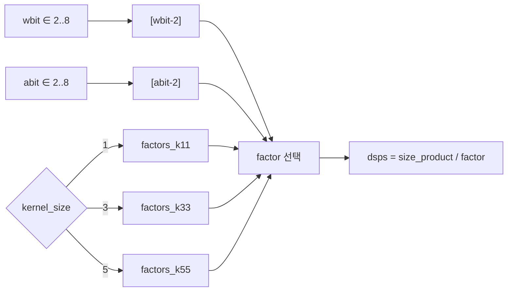
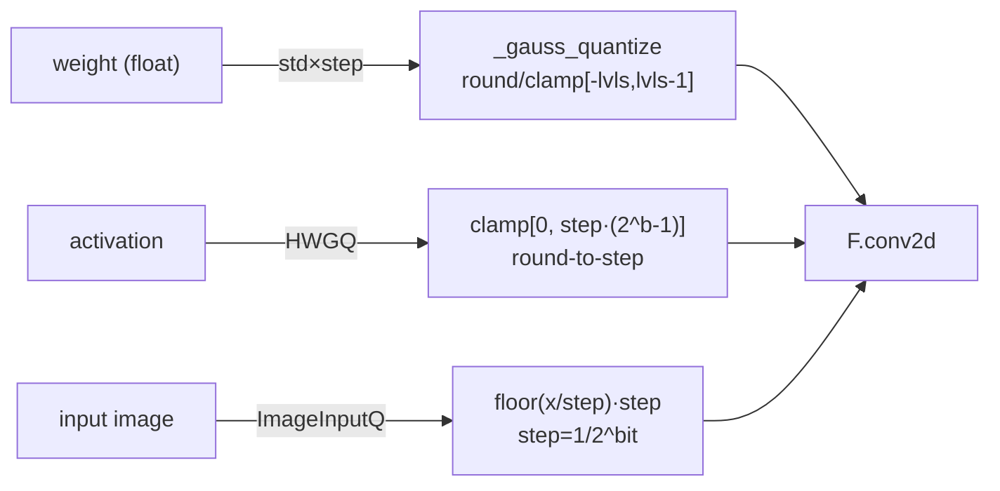
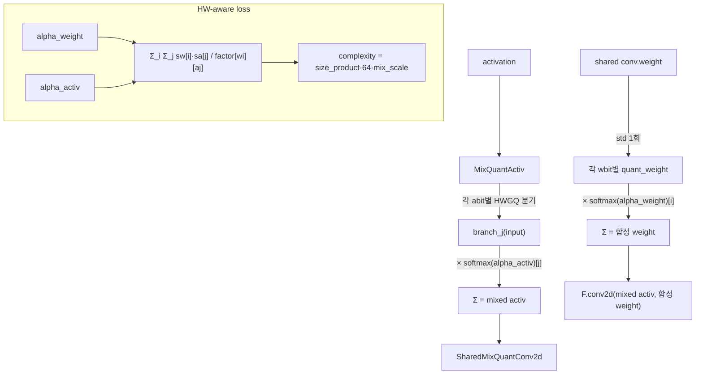
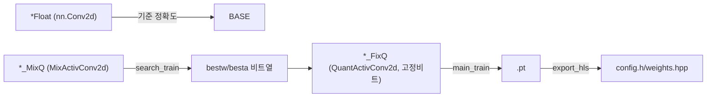
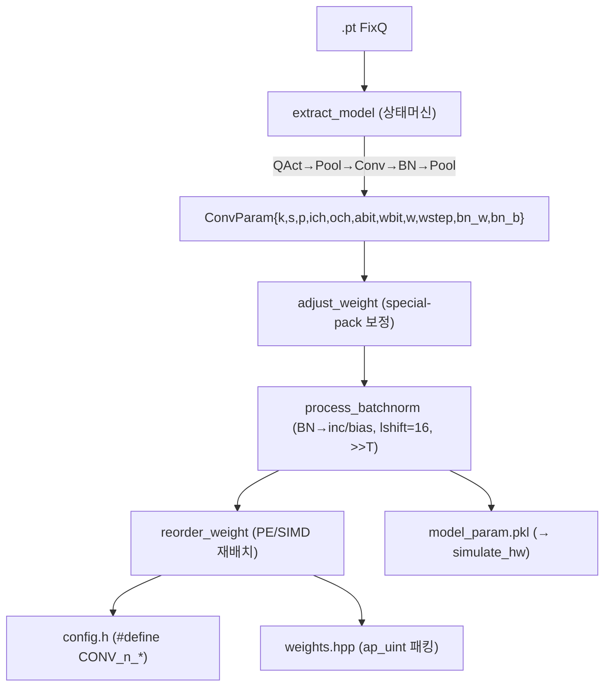
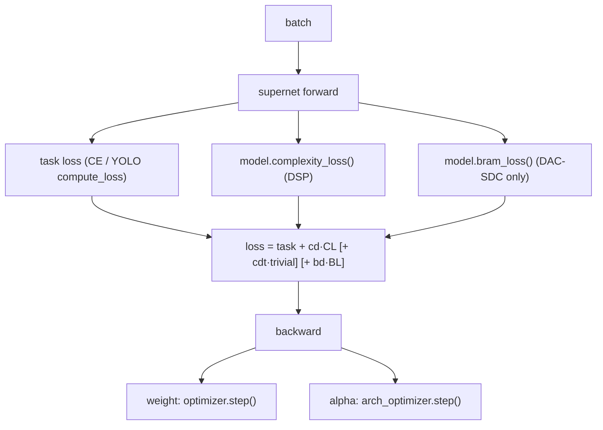

# AnyPackingNet (DeepBurning-MixQ) 모듈 통합 가이드

> 1차 요약: [`../AnyPackingNet-main.md`](../AnyPackingNet-main.md) — 본 문서는 그 요약을 모듈 단위로 심화한 통합 가이드다.
> 분석 대상: `\\wsl.localhost\ubuntu-24.04\home\user\project\PRJXR-HBTXR\REF\CNN-Accel\AnyPackingNet-main`
> 작성 원칙: 실제 소스 Read 후 `파일:라인` 근거 표기. 라인 근거 없는 추론은 "추정", 코드로 확인 불가는 "확인 불가"로 명시.
> **폴더명-실체 불일치**: 디렉토리명은 `AnyPackingNet`이나 프로젝트 실체는 **DeepBurning-MixQ**(ICCAD'23, ICT/CAS). 근거 `readme.md:1,5-7`. (말미 별도 절 재명시.)

---

## 0. 문서 머리말

### 0.1 대표 케이스 선정
- **대표 supernet: `VGG_tiny_MixQ`** (CIFAR-10, 입력 3×32×32, VGG류 6-conv + FC). 근거: `cifar/models.py:113-150`. 선정 이유 — repo가 직접 제공하는 가장 완결된 NAS 탐색 경로(supernet→FixQ→export→bit-exact sim)가 전부 이 모델에 연결되고(`readme.md:17-50`), 모든 conv가 3×3·동일 qspace라 비트탐색 공간·DSP packing factor 적용이 가장 깔끔히 드러남.
- **대표 탐색 conv layer: `MixActivConv2d`** — activation MixQuantActiv(softmax 분기) + weight SharedMixQuantConv2d(공유 weight 비트별 합성)를 묶은 미분가능 conv. 근거 `anypacking/quant_module.py:319-487`. 이 레이어의 `complexity_loss`(`:383-402`)가 "AnyPacking"의 본질(DSP packing 효율을 미분가능 loss로).
- **대표 비-VGG case: `SkyNet_MixQ`** — depthwise(groups=inp)+pointwise(1x1) 반복 MobileNet류. 근거 `dacsdc/mymodel.py:840-895`. dwconv/pwconv 분리 → export에서 PEP/ACTP 추가 패킹축(`dacsdc/export_hls_skynet.py:209-255`) 등장.
- **대표 bypass case: `UltraNetBypass_MixQ`** — `ReorgLayer`(stride2 space-to-depth, `mymodel.py:526-545`)로 분기 후 concat(`:682`). pipeline 가속기 난이도↑ 케이스.

### 0.2 수치 표기 규약
- **비트옵션(탐색공간)**: 실모델 qspace = wbits/abits 각 `[2,3,4,5,6,7,8]`(7개), share_weight=True. 근거 `models.py:121`, `mymodel.py:320,631,847,903`. 레이어당 조합 = 7(w)×7(a)=**49** 후보, VGG_tiny_MixQ는 탐색 conv 6개 → 전체 탐색공간 ≈ 49^6 ≈ **1.38×10^10**(추정 계산). UltraNet_MixQ는 탐색 conv 9개 → 49^9. **단, `MixActivConv2d` 기본 wbits/abits는 `[1,2]`**(`quant_module.py:324,328`)로 모델이 override 안 하면 1bit까지 — 실모델은 항상 2~8 override.
- **DSP packing factor**: `factors_kXX[wbit-2][abit-2]` (7×7 행렬, 인덱스 0..6 ↔ bit 2..8). 근거 `dsp_packing.py:1-29`, 인덱싱 `quant_module.py:400,475`. 값 = "primitive DSP(또는 DSP 그룹) 1개가 수용하는 (wbit,abit) MAC 수". 저비트일수록 큼(예 k3×3 w2/a2=18, w8/a8=2; `dsp_packing.py:12,18`). 분수값(7.5, 6.67, 4.5, 3.33, 2.25)은 분수적 DSP 공유 모델링(추정).
- **DSP 비용 식**: `dsps = size_product / factor[wbit-2][abit-2]` (`quant_module.py:475,602`; FixQ는 `models.py:259`). factor↑(저비트) → DSP↓.
- **복잡도 기준량 size_product** = `filter_size × in_H × in_W`, `filter_size = inplane*outplane*ksize/groups *1e-6 / stride^2` (`quant_module.py:351-352,361-362`). 단위 M(=10^6) MAC. depthwise는 groups=inplane이라 filter_size가 1/inplane로 축소.
- **bitops** = `size_product × abit × wbit`, **bita** = `memory_size × abit`(`memory_size = in_C*in_H*in_W *1e-3`, K단위, `:359-360`), **bitw** = `param_size × wbit`. 근거 `:463-465`.
- **BRAM 비트폭** = weight(`param_size*1e3*mix_wbit`, kbit) + sliding-window 캐시(1x1: `2*in_width*inplane`, else `(k+1)*in_width*inplane`)*mix_abit, 전체 ×64. 근거 `:404-426`.
- **타깃 데이터타입**: weight `_gauss_quantize`로 step×std 스케일 대칭 INT(wbit), lvls=2^bit/2 (`:18,50-53`). activation HWGQ half-wave(0~step·(2^bit−1), `:103-106`). 입력 이미지 `ImageInputQ` floor INT8 이산(`:109-122`). export 후 HW에서 weight `ap_uint<wbit*simd>` 패킹(`export_hls.py:341`), BN inc/bias `ap_int<incbit/biasbit>`(`:357-362`), MAC 누산폭 `MBIT+incbit<48`(`:178`).

### 0.3 운영 경로
```
[NAS 탐색: search_train.py]  (오프라인 GPU)
   supernet(VGG_tiny_MixQ / UltraNet_MixQ / SkyNet_MixQ)
   loss = task + cd·complexity_loss(DSP-packing) [+ cdt·trivial] [+ bd·bram_loss]
   ┌ weight → optimizer(SGD)            ┐ 이중 옵티마이저
   └ alpha(비트 logit) → arch_optimizer ┘  (EdMIPS 방식)
   → fetch_best_arch() : 레이어별 argmax 비트열 (bestw/besta)
        │  cifar/search_train.py:93-101 / dacsdc:271-284
        ▼
[고정-비트 재학습: main_train.py --bitw <> --bita <>]
   *_FixQ (QuantActivConv2d, 고정 wbit/abit) → weights/<name>.pt
        │  cifar/main_train.py:36,130-134 / dacsdc/main_train.py
        ▼
[Pareto 스윕: pareto_train.py]  cd 리스트 순회 → 정확도 vs DSP/BRAM front
        │  dacsdc/pareto_train.py:4-17
        ▼
[HLS export: export_hls.py]  (오프라인 CPU)
   .pt → extract_model(상태머신) → adjust_weight(special-pack 보정)
       → process_batchnorm(BN→정수 inc/bias, lshift=16, >>T)
       → reorder_weight(PE/SIMD 가중치 재배치) [SkyNet: +PEP/ACTP]
   → config.h(#define) + weights.hpp(ap_uint<wbit*simd> 패킹) + model_param.pkl
        │  cifar/export_hls.py:58-401
        ▼
[비트-정확 검증: simulate_hw.py]  model_param.pkl → 정수 도메인 추론 == HLS C-sim
        │  cifar/simulate_hw.py:11-114
        ▼
[HLS 합성/온보드]  ※ 외부 repo MixQ_Gen_Accel (본 repo에 C++ 커널 없음, readme.md:12)
```
- 타깃 보드: DAC-SDC 객체검출 = **Ultra96 v2**(`readme.md:55-57`). CIFAR 분류는 보드 무관(export/C-sim 대상).
- **본 repo 범위 = 학습/양자화/HW-aware NAS/weight export까지.** HLS 커널 C++ 합성은 외부(확인됨: export가 `.h`/`.hpp`만 생성, `export_hls.py:55,309`).

---

## 1. Repo / NAS·HW 맵 개요

AnyPackingNet(=DeepBurning-MixQ)는 **DSP packing 효율표를 미분가능 NAS loss에 결합**해, FPGA 자원(DSP/BRAM) 예산 하에서 모델별 mixed-precision 비트폭을 탐색하고, 탐색 결과를 BN-흡수·PE/SIMD 패킹까지 거쳐 HLS 헤더로 export하는 SW측 프레임워크다(`readme.md:3`). 본 repo는 **SW(양자화·NAS·export)** 만 자체 소스이며, **HLS 연산자 C++는 외부 repo `MixQ_Gen_Accel`**(`readme.md:12`).

### 1.1 SW(양자화 primitive) vs NAS(supernet/탐색) vs Export(SW↔HW 브리지)

| 구분 | 파일(자체 소스) | 역할 |
|---|---|---|
| **DSP 비용표(코어)** | `anypacking/dsp_packing.py` | (wbit,abit)→packing factor 3개 7×7 테이블(k11/k33/k55) |
| **양자화 + NAS 빌딩블록(★)** | `anypacking/quant_module.py` | gauss/HWGQ 양자화, Mix*supernet, complexity/bram loss, fetch_best_arch |
| **모델 정의(CIFAR)** | `cifar/models.py` | VGG_tiny Float/MixQ/FixQ |
| **모델 정의(DAC-SDC)** | `dacsdc/mymodel.py` | UltraNet/Bypass/SkyNet/SkyNetk5 + YOLOLayer + ReorgLayer |
| **DoReFa 양자화(베이스)** | `dacsdc/quant_dorefa.py` | conv2d_Q/activation_q (UltraNet 4bit 비교군) |
| **NAS 학습(이중 옵티마이저)** | `cifar/search_train.py`, `dacsdc/search_train.py` | task+complexity[+bram] loss, weight/alpha 분리 |
| **고정-비트 재학습** | `cifar/main_train.py`, `dacsdc/main_train.py` | 탐색 비트열로 FixQ 재학습 |
| **Pareto 스윕** | `dacsdc/pareto_train.py` | cd 리스트 순회 batch 실행 |
| **HLS export(★브리지)** | `cifar/export_hls.py` | .pt→config.h/weights.hpp (BN흡수+PE/SIMD패킹) |
| | `dacsdc/export_hls.py` | UltraNet용(DoReFa+maxpool 흡수) |
| | `dacsdc/export_hls_skynet.py` | SkyNet용(dwconv/pwconv +PEP/ACTP 축) |
| **비트-정확 시뮬** | `cifar/simulate_hw.py`, `dacsdc/simulate_hw.py` | 정수 도메인 추론(HLS C-sim 골든) |
| **유틸** | `utils/view_pt.py`, `utils/torch_utils.py` | 체크포인트 선택/seed/device |

### 1.2 NAS→HW 매핑(핵심 폐루프)
```
NAS가 비트폭 결정 → DSP packing factor가 그 비트폭의 DSP 비용 산정
  → complexity_loss로 다시 NAS gradient에 피드백 (모델탐색 ↔ HW비용 폐루프)
```
근거 `quant_module.py:383-402`(loss), `:475,480-483`(dsps/mixdsps). HW 축 매핑:

| 모델/알고리즘 개념 | HW(HLS) 매핑 | 근거 |
|---|---|---|
| 출력채널 병렬 | **PE** 차원 | `export_hls.py:250-252`, config `_PE` |
| 입력채널×커널 병렬 | **SIMD**, `ap_uint<wbit*simd>` 1워드 | `export_hls.py:250-252,341` |
| 저비트 MAC 1 DSP 다중수용 | **DSP packing factor** 테이블 | `dsp_packing.py`, `quant_module.py:400` |
| BatchNorm | 누산기 정수 `inc/bias` + `>>T` | `export_hls.py:188-203` |
| activation 클립 | obit clip `[0, 2^obit-1]` | `simulate_hw.py:56-57` |
| depthwise/pointwise | 추가 PEP/ACTP 패킹축 | `export_hls_skynet.py:234-237` |
| bypass/reorg | space-to-depth ReorgLayer | `mymodel.py:526-545` |
| BRAM 예산 | bram_loss(weight+sliding-window) | `quant_module.py:404-426` |

### 1.3 제외 목록(이름만 언급)
- **third-party**: `dacsdc/yolo_utils.py`·`datasets.py`·`test.py`·`train_old.py`(ultralytics yolov3 학습 프레임워크 차용, AGPL — `readme.md:123,140`; `compute_loss`/`test.test`가 여기서 옴, `dacsdc/search_train.py:12,232,295`). NAS 흐름 이해엔 `search_train.py`만 필요.
- **생성물**: `weights/*.pt`(체크포인트), `hls/<name>/{config.h,weights.hpp,model_param.pkl}`(export 산출 — 거대 가중치 배열), `hls/config_simd_pe.txt`(수동 PE/SIMD 설정), `cifar/data/`(CIFAR), `__pycache__`.
- **외부 repo(확인 불가)**: HLS 연산자 C++/합성 코드 — `MixQ_Gen_Accel`(`readme.md:12`). 따라서 실제 DSP packing 회로·합성 PPA·온보드 latency는 본 repo만으론 **확인 불가**.
- **부재 추정**: `localconfig.py`(data_path/train_path import만, `cifar/search_train.py:15`·`dacsdc/search_train.py:9`) — 사용자 로컬 설정, repo 내 미포함(확인 불가).

---

## 2. 모듈: DSP packing 효율표 — `dsp_packing.py` (HW 비용 코어)

### 2.1 역할 + 상위/하위
- **역할**: 커널크기별 (wbit,abit)→packing factor를 정적 상수 테이블로 제공. NAS의 DSP 비용 추정과 FixQ 자원 리포트의 유일 근거값.
- **상위**: `quant_module.py:9`가 `from .dsp_packing import *`로 전량 import. **하위**: 없음(순수 상수).

### 2.2 데이터플로우


### 2.3 Function call stack
`quant_module.py:398-401`(complexity_loss) / `:475,480-483`(fetch_best_arch dsps/mixdsps) / `:570,602,609`(linear은 k11 고정) → `factors_kXX[wbit-2][abit-2]`. FixQ 경로는 `models.py:259`·`mymodel.py:75-79`가 `qm.dsp_factors_kXX` 참조(아래 2.6 버그 주의).

### 2.4 대표 코드 위치
`anypacking/dsp_packing.py`(29줄 전체): k11 `:1-9`, k33 `:11-19`, k55 `:21-29`.

### 2.5 대표 코드 블록(수치 그대로)
```python
factors_k33=[
[18,15,12,7.5,7.5,6,6],     # wbit=2 행: abit 2..8
[15,12,7.5,6,6,6,3],        # wbit=3
[12,7.5,6,6,6,6,3],         # wbit=4
[9,6,6,6,6,3,3],            # wbit=5
[7.5,6,6,4.5,3,3,3],        # wbit=6
[6,6,4.5,3,3,3,2.25],       # wbit=7
[6,3,3,3,3,3,2],            # wbit=8 -> [8][8]=2 (w8/a8)
]                            # dsp_packing.py:11-19
```
→ 좌상(저비트) 클수록, 우하(고비트)일수록 작음. `factors_k11[0][0]=12`(w2/a2,1x1), `factors_k55[0][0]=20`(w2/a2,5x5)로 **큰 커널일수록 packing factor도 큼**(`dsp_packing.py:2,22`).

### 2.6 마이크로아키텍처/주의
- **정적 상수**: 특정 DSP packing 구현/타깃 가정(추정: Xilinx DSP48의 사전가산+시프트 packing). 다른 보드/패킹전략엔 재캘리브레이션 필요(한계).
- **인덱싱 안전성**: bit가 항상 2~8이어야 `[bit-2]`가 0~6. 실모델 qspace가 2~8이라 안전하나, `MixActivConv2d` 기본 `[1,2]`로 쓰면 `[1-2]=[-1]`(마지막 행 참조) — 의도치 않은 packing factor(잠재 버그, 단 실모델은 override).
- **★ 잠재 버그(확인됨)**: FixQ 리포트 경로 `models.py:259`·`mymodel.py:75-79`는 `qm.dsp_factors_k11/k33/k55`를 호출하지만 `dsp_packing.py`엔 `factors_k11/k33/k55`만 정의(`dsp_` 접두 없음). `quant_module`이 `import *`만 하므로 `qm.dsp_factors_*`는 **존재하지 않음 → AttributeError**. 즉 `fetch_arch_info()`(FixQ dsps 출력)는 현재 코드로 실행 시 실패(`Grep` 교차확인: 정의는 `factors_k*`만, 참조는 `dsp_factors_k*`도 혼재). NAS 경로(`complexity_loss`/`fetch_best_arch`)는 정상명(`factors_k*`) 사용이라 무관.

---

## 3. 모듈: 양자화 primitive — `quant_module.py` 전반부 (`:11-232`)

### 3.1 역할 + 상위/하위
- **역할**: weight/activation/입력 양자화 autograd 함수·모듈, 고정-비트 conv/linear(QuantActiv*), 복잡도 버퍼(size_product/memory_size/in_width) 정의.
- **상위**: 모든 모델(models.py/mymodel.py)이 import. **하위**: torch autograd.

### 3.2 데이터플로우(양자화 경로)


### 3.3 대표 코드 위치
`anypacking/quant_module.py`: step 테이블 `:11-12`, weight 양자화군 `:14-77`, `_hwgq`/HWGQ `:79-107`, ImageInputQ `:109-122`, QuantConv2d/Linear `:124-165`, QuantActivConv2d `:167-207`, QuantActivLinear `:210-232`.

### 3.4 대표 코드 블록
```python
gaussian_steps = {1:1.596, 2:0.996, 3:0.586, 4:0.336, 5:0.190, 6:0.106, 7:0.059, 8:0.032}  # :11
hwgq_steps    = {1:0.799, 2:0.538, 3:0.3217, 4:0.185, 5:0.104, 6:0.058, 7:0.033, 8:0.019}   # :12
```
→ weight는 가우시안 가정 최적 step, activation은 HWGQ step. bit↑일수록 step↓(세밀).

```python
class _gauss_quantize(torch.autograd.Function):       # :46
    def forward(ctx, x, step, bit):
        lvls = 2 ** bit / 2
        alpha = x.std().item();  step *= alpha          # :51-52  std로 스케일
        y = torch.clamp(torch.round(x/step), -lvls, lvls-1) * step   # :53 부호 대칭
    def backward(ctx, grad_output): return grad_output, None, None    # :57 STE
```
→ weight 양자화: std×step 스케일 → round → `[-lvls, lvls-1]` 대칭 클램프. backward는 STE(grad 통과).

```python
def _gauss_quantize_export(x, step, bit):              # :60
    ...; y = torch.clamp(torch.round(x/step), -lvls, lvls-1)
    return y.cpu().detach().int().numpy(), step        # :64-65  정수 인덱스 + step 동시 반환
```
→ export 전용: `*step` 곱 없이 **정수 인덱스+step** 반환 → HLS 가중치 배열 직접 사용.

```python
class HWGQ(nn.Module):                                  # :91
    def forward(self, x):
        if self.bit >= 32: return x.clamp(min=0.0)      # :101-102 ReLU
        clip_thr = self.step * (2**self.bit - 1)
        y = x.clamp(min=0.0, max=clip_thr)              # :105 half-wave
        return _hwgq.apply(y, self.step)                # :106 round-to-step
```
→ 활성: 양수 단방향(half-wave) round-to-step. ImageInputQ(`:109-122`)는 입력 이미지 floor INT8(gradient 없음, `:121` 주석).

```python
self.param_size = inplane*outplane*kernel_size *1e-6 / groups   # :187 / :351
self.filter_size = self.param_size / float(stride**2.0)          # :188 / :352
# forward: size_product = filter_size * in_H * in_W              # :197-198 / :361-362
#          memory_size  = in_C*in_H*in_W *1e-3                   # :195-196 / :359-360
```
→ 복잡도 버퍼: forward마다 입력 shape로 갱신(레이어별 MAC규모/메모리). DSP/bitops/BRAM 추정의 기준량.

### 3.5 마이크로아키텍처
- **양자화 대칭성**: weight는 `[-lvls, lvls-1]`(부호), activation은 `[0, 2^bit-1]`(무부호 half-wave). export `adjust_weight`가 특정 (w,a) packing에서 `-2^(wbit-1)` 표현불가 보정(아래 6.5).
- **`_sym` 변형(`:14-44`)**: `round(x/step+0.5)-0.5` 형태의 대칭 양자화 별도 존재하나 현 모델 경로에선 미사용(추정 — 모델은 `_gauss_quantize`/`_resclaed_step` 사용).
- **병목 없음**(학습시간 모듈). std 계산이 매 forward이지만 Shared 변형이 1회로 절약(아래 4.5).

---

## 4. 모듈: Mixed-Precision NAS supernet 블록 — `quant_module.py` 후반부 (★)

### 4.1 역할 + 상위/하위
- **역할**: 미분가능 비트탐색의 핵심. activation/weight 후보 비트들을 softmax(alpha) 가중합으로 연속완화하고, DSP-packing 인식 complexity_loss·bram_loss를 제공하며, argmax로 최적 비트열 추출.
- **상위**: supernet 모델(`VGG_tiny_MixQ` 등)이 `conv_func=MixActivConv2d`로 사용(`models.py:117`). **하위**: `MixQuantActiv`/`SharedMixQuantConv2d`/`dsp_packing` 테이블.

### 4.2 데이터플로우(미분가능 비트탐색)


### 4.3 Function call stack
`models.py:182-188`(model.complexity_loss) → 각 `MixActivConv2d.complexity_loss`(`:383`) → `factors_kXX[wi-2][aj-2]`. `search_train.py:93`(model.fetch_best_arch) → `models.py:152-177` → 각 `MixActivConv2d.fetch_best_arch`(`:428`). forward: `:357-367` → `MixQuantActiv.forward`(`:246`) + `SharedMixQuantConv2d.forward`(`:301`).

### 4.4 대표 코드 위치
`anypacking/quant_module.py`: MixQuantActiv `:235-252`, MixQuantConv2d `:255-284`, SharedMixQuantConv2d `:287-316`, MixActivConv2d `:319-487`(forward `:357`, trivial loss `:369`, complexity_loss `:383`, bram_loss `:404`, fetch_best_arch `:428`), MixActivLinear `:520-611`.

### 4.5 대표 코드 블록
```python
class MixQuantActiv(nn.Module):                          # :235
    self.alpha_activ = Parameter(torch.Tensor(len(bits))); self.alpha_activ.data.fill_(0.01)  # :240-241
    def forward(self, input):
        sw = F.softmax(self.alpha_activ, dim=0)          # :248
        outs = [branch(input)*sw[i] for i,branch in enumerate(self.mix_activ)]  # :249-250
        return sum(outs)                                 # :251
```
→ activation 비트 선택 연속완화: 각 abit HWGQ 분기를 softmax 가중합. alpha 초기 0.01.

```python
class SharedMixQuantConv2d(nn.Module):                   # :287
    weight_std = weight.std().item()                     # :307  공유 weight std 1회만
    for i, bit in enumerate(self.bits):
        step = self.steps[i] * weight_std
        quant_weight = _gauss_quantize_resclaed_step.apply(weight, step, bit)  # :310
        scaled_quant_weight = quant_weight * sw[i]       # :311
    mix_quant_weight = sum(...)                           # :313  단일 합성 weight
    out = F.conv2d(input, mix_quant_weight, ...)         # :314-315  conv 1회
```
→ weight 공유 변형: conv 1개 weight를 모든 비트가 공유, std 1회 계산 후 비트별 양자화→softmax 합성 → conv 1회(메모리/연산 절약). 비공유 `MixQuantConv2d`(`:255`)는 비트마다 별도 conv.

```python
def complexity_loss(self):                               # :383  ★ AnyPacking 본질
    sa = F.softmax(self.mix_activ.alpha_activ, dim=0)
    sw = F.softmax(self.mix_weight.alpha_weight, dim=0)
    factors = factors_k11 / factors_k33 / factors_k55    # :390-397  커널크기별
    for i in range(len(wbits)):
        for j in range(len(abits)):
            mix_scale += sw[i]*sa[j] / factors[wbits[i]-2][abits[j]-2]   # :400  packing 인식
    complexity = self.size_product.item() * 64 * mix_scale              # :401
```
→ **DSP packing factor를 분모로** 모든 (w,a) 조합 기대비용 합산. factor 큰(저비트·고효율 packing) 조합일수록 loss↓ → NAS가 DSP-효율 비트로 수렴. `complexity_loss_trivial`(`:369-381`)은 단순 `size_product·mix_abit·mix_wbit`(HW 무관, 비교용).

```python
def bram_loss(self):                                     # :404
    bram_sw = 2*in_width*inplane (1x1) | (k+1)*in_width*inplane (else)  # :410-413
    bram_weight = param_size*1e3 * mix_wbit              # :422 weight kbit
    bram_cache  = bram_sw*1e-3 * mix_abit                # :423 sliding-window kbit
    bram = (bram_weight + bram_cache) * 64               # :425
```
→ pipeline 아키텍처의 BRAM 제약(weight ROM + line-buffer 캐시)을 mix-bit로 loss화. DAC-SDC에서만 `--bram-decay`로 활성(`dacsdc/search_train.py:249-252,373`).

```python
def fetch_best_arch(self, layer_idx):                    # :428
    best_activ = prob_activ.argmax(); best_weight = prob_weight.argmax()  # :433,440
    dsps = size_product / factors[wbits[best_weight]-2][abits[best_activ]-2]   # :475 best-arch DSP
    mixdsps = Σ_i Σ_j prob_w[i]·prob_a[j] / factors[...]; mixdsps *= size_product  # :480-483 기대 DSP
    return best_arch, bitops, bita, bitw, mixbitops, mixbita, mixbitw, dsps, mixdsps, mixbram_weight, mixbram_cache  # :487
```
→ argmax로 레이어 최적 비트 선택. best(argmax)와 expected(확률가중 mix) 둘 다의 bitops/bita/bitw/dsps/bram 반환. 호출측(`models.py:152-177`)이 전레이어 합산.

### 4.6 마이크로아키텍처
- **탐색공간**: 레이어당 49 조합(7w×7a), VGG_tiny_MixQ 6레이어. supernet은 모든 후보를 동시 forward(activation은 7분기 합, weight는 7합성) → 메모리 7×. Shared 변형이 weight 메모리는 1× 유지(`:295` conv 1개).
- **alpha 학습**: 이름 'alpha' 포함 파라미터만 arch_optimizer로 분리(`search_train.py:44-46`), 나머지는 weight optimizer. lr_alpha 별도(`--lra`, cifar 기본 0.1 `:148`, dacsdc 0.01 `:374`).
- **정규화**: model.complexity_loss는 첫 레이어 size_product로 나눠 정규화(`models.py:186-187`). 레이어간 스케일 균형.
- **★ FixQ vs MixQ 비대칭**: MixActivLinear(`:520-611`)는 linear은 항상 `factors_k11` 고정(`:570,602,609`) — 1x1 등가 가정.

---

## 5. 모듈: 모델 정의 (Float/MixQ/FixQ 3변형) — `cifar/models.py`, `dacsdc/mymodel.py`

### 5.1 역할 + 상위/하위
- **역할**: 전 모델이 `*Float`(부동소수 기준)/`*_MixQ`(supernet, NAS)/`*_FixQ`(고정비트 재학습/배포) 3변형. MixQ=`MixActivConv2d`, FixQ=`QuantActivConv2d`.
- **상위**: search_train/main_train/export_hls. **하위**: quant_module의 Mix*/QuantActiv*.

### 5.2 데이터플로우(3변형 분기)


### 5.3 Function call stack
`search_train.py:36`(VGG_tiny_MixQ) / `dacsdc/search_train.py:65-71`(getattr(mymodel, opt.model)) → `models.py:113` / `mymodel.py:313,623,840,896`. FixQ: `main_train.py:36`(VGG_tiny_FixQ) → `models.py:201`.

### 5.4 대표 코드 위치
`cifar/models.py`: VGG_tiny_MixQ `:113-199`, VGG_tiny_FixQ `:201-269`. `dacsdc/mymodel.py`: YOLOLayer `:25-58`, 공유 메서드 `:60-164`, UltraNet_MixQ `:313-383`, ReorgLayer `:526-545`, UltraNetBypass_MixQ `:623-702`, SkyNet_MixQ `:840-894`, SkyNetk5_MixQ `:896-949`, SkyNet_FixQ `:951-1010`.

### 5.5 대표 코드 블록
```python
# cifar/models.py:120-147  VGG_tiny_MixQ
conv_kwargs = {'kernel_size':3,'stride':1,'padding':1,'bias':False}
qspace = {'wbits':[2,3,4,5,6,7,8],'abits':[2,3,4,5,6,7,8],'share_weight':share_weight}
conv_func(3, 64, ActQ=qm.ImageInputQ, **conv_kwargs, **qspace),  # 0  첫레이어만 ImageInputQ
... 6개 MixActivConv2d ...
qm.QuantActivLinear(256*4*4, num_classes, bias=True, wbit=8, abit=8)  # :146  FC는 8/8 고정
```
→ 첫 conv만 입력 양자화 ImageInputQ, 나머지 HWGQ(기본). FC는 탐색 안 하고 8/8 고정.

```python
# dacsdc/mymodel.py:852-870  SkyNet_MixQ (depthwise+pointwise)
for i in range(6):
    layers.append(conv_func(inp, inp, kernel_size=3, ..., groups=inp,
                  ActQ = qm.ImageInputQ if i==0 else qm.HWGQ, **qspace))  # dwconv :854-856
    layers.append(nn.BatchNorm2d(channels[i]))
    layers.append(conv_func(inp, oup, kernel_size=1, ..., **qspace))      # pwconv :859-861
    if i<3: layers.append(nn.MaxPool2d(2,2))
```
→ MobileNet류: 3x3 dwconv(groups=inp) + 1x1 pwconv 반복. channels=[3,48,96,192,384,512,96](`:849`). SkyNetk5는 k=5,padding=2 dwconv(`:910-912`).

```python
# dacsdc/mymodel.py:526-545  ReorgLayer (space-to-depth)
x = x.view([B,C,H//hs,hs,W//ws,ws]).transpose(3,4)...  # stride2 reorg
x = x.view([B, hs*ws*C, H//hs, W//ws])                 # :544  채널 hs*ws배
# 사용: UltraNetBypass :680-682  x_p2_reorg=reorg(x_p2); cat([x_p2_reorg, x_p3])
```
→ bypass: stride2 reorg로 채널 4배 후 main path와 concat(320=64*4+64, `:666`).

```python
# dacsdc/mymodel.py:25-58  YOLOLayer
self.na = len(anchors); self.no = 6  # x,y,w,h,obj,1cls (:32-33)
io[...,:2] = sigmoid(io[...,:2]) + grid_xy; io[...,2:4] = exp(...)*anchor_wh  # :49-50 디코딩
```
→ DAC-SDC는 단일클래스 객체검출(no=6, 36채널=6anchor×6, `mymodel.py:355` 출력 36).

### 5.6 마이크로아키텍처/정량
- **대표 레이어 정량(VGG_tiny_MixQ conv layer 1, 입력 64×32×32, 출력 64, 3×3)**: param_size = 64×64×9 ×1e-6 = 0.0369M, filter_size = 0.0369(stride1), size_product = 0.0369×32×32 = **37.7M MAC**(scalar dense, `:351-362` 식 적용). conv layer 4(128→256,입력 16×16): param=128×256×9e-6=0.295M, size_product=0.295×16×16=**75.5M**.
- **DSP 예시**: layer1을 w4/a4로 선택 시 dsps = 37.7 / factors_k33[2][2] = 37.7/6 ≈ **6.28M**(`:475`); w2/a2면 37.7/18 ≈ **2.09M**(packing으로 1/3). 동일 MAC인데 저비트가 DSP 1/3.
- **FixQ 리포트 dsps는 현재 AttributeError(2.6)** — 정량은 NAS 경로(fetch_best_arch)에서만 확인 가능.

---

## 6. 모듈: HLS Export 파이프라인 — `cifar/export_hls.py` (★ HW 매핑 핵심)

### 6.1 역할 + 상위/하위
- **역할**: `.pt`(FixQ) → `config.h`(#define) + `weights.hpp`(패킹 가중치 배열) + `model_param.pkl`. 4단계: extract_model → adjust_weight → process_batchnorm → reorder_weight → write.
- **상위**: 사용자 CLI(`readme.md:43`). **하위**: quant_module의 `export_quant`(`:101,127`), numpy reshape/transpose, `<ap_int.h>` 전제(`:320`).

### 6.2 데이터플로우


### 6.3 Function call stack
`__main__`(`:376-401`) → `extract_model([1,32,32])`(`:58`) → `adjust_weight`(`:368`) → `process_batchnorm`(`:156`) → `reorder_weight(..., simd_pe[:,0], simd_pe[:,1])`(`:212`, PE/SIMD는 `hls/config_simd_pe.txt`에서 `:384`) → `write_hls_config`(`:17`) + `write_hls_weights`(`:305`).

### 6.4 대표 코드 위치
`cifar/export_hls.py`: write_hls_config `:17-56`, extract_model `:58-154`, process_batchnorm `:156-210`, reorder_weight `:212-258`, write_hls_weights `:305-366`(pack1d_str `:345-351`), adjust_weight `:368-374`.

### 6.5 대표 코드 블록
```python
# extract_model :64  상태머신: [QAct] -> [Pool] -> Conv -> [BN] -> [Pool]
if conv_cnt:                                       # 이전 레이어 출력=현 레이어 입력
    model_param[conv_cnt-1].obit = conv_cur.abit
    model_param[conv_cnt-1].ostep = conv_cur.astep   # :75-78  ★스케일 체이닝
...
feature_map_shape[1] = (irow + 2p - k)//s + 1     # :93  feature map 전파
conv_cur.w, conv_cur.wstep = sub_module.export_quant()  # :101  정수 weight + step
```
→ 모듈 순회 상태머신으로 conv 파라미터·shape 수집. **레이어 i 출력 step = 레이어 i+1 입력 step**(양자화 스케일 체이닝).

```python
# process_batchnorm :180-203  BN을 정수 inc/bias로 흡수
lshift = 16
MACstep = wstep * astep; ostep = conv.ostep
inc_raw = bn_w * MACstep / ostep;  bias_raw = bn_b / ostep      # :187-190
T = lshift + wbit + abit - 1                                    # :195
conv.inc  = round(inc_raw * 2**T).astype(int64)                 # :196
conv.bias = round(bias_raw * 2**T).astype(int64)                # :197
# HLS 복원: (MACq*inc + bias + 2**(T-1)) >> T  (docstring :170-172)
# 제약: MBIT + incbit < 48  (DSP 누산폭, :178)
conv_last.div = 1/(wstep*astep); conv_last.bias = round(convbias*div)  # :207-208 마지막은 inc 없음
```
→ BN을 conv 누산기 정수 곱/덧셈+시프트로 흡수(가속기에서 BN 별도연산 제거). `out=MAC·BN_w+BN_b` → `outq=MACq·inc+bias` (`:164-172`).

```python
# reorder_weight :241-255  PE/SIMD 재배치
w = w.transpose(0,3,2,1)                                # [och,kc,kr,ich]  :248
w = w.reshape(och//pe, pe, k, k*ich//simd, simd)        # :250
w = w.transpose(1,2,0,3,4)                              # [pe, k, och/pe, k*ich/simd, simd]  :251
w = w.reshape(pe, k, -1, simd)                          # hls [pe, k, -, simd]  :252
if conv.k==1: w = w.reshape(pe, -1, simd)              # :254-255
```
→ 출력채널을 **PE**, 입력채널×커널을 **SIMD** 차원으로 분리해 HLS 배열 인덱스 매핑. PE/SIMD는 레이어별 수동(`config_simd_pe.txt`).

```python
# write_hls_weights pack1d_str :345-351
for v in arr[::-1]:                                     # [!] reverse simd pack (HLS unpack 순서 연동)
    assert -1<<wbit-1 <= v < 1<<wbit-1                  # :349 부호 범위 검증
    x = (x<<wbit) + (v & (2**wbit-1))
# const ap_uint<wbit*simd> conv_n_w[pe][...]            # :341  SIMD개를 1워드 패킹
```
→ SIMD개 가중치를 하나의 `ap_uint<wbit*simd>`로 **역순** 패킹. inc/bias는 `ap_int<incbit/biasbit>[pe][och/pe]`(`:357-362`).

```python
# adjust_weight :370-374  special-pack 부호 보정
special_wa_bit = ((4,2),(5,3),(5,4),(5,5),(5,6),(5,7),(5,8),(7,2),(7,3))
if (wbit,abit) in special_wa_bit:
    conv.w = np.maximum(conv.w, -2**(wbit-1)+1)         # :374  최소 음수값 제거
```
→ 특정 (w,a) packing 조합은 `-2^(wbit-1)` 표현 불가 → 클립. **DSP packing 구현의 실질 제약**을 export가 드러냄.

### 6.6 마이크로아키텍처/주의
- **상태머신 의존성**: 모듈 순서가 [QAct]→[Pool]→Conv→[BN]→[Pool]이어야 정상(`:64`). MixQ가 아닌 FixQ만 처리(QuantConv2d/QuantLinear, `:99,125`). 다른 순서면 abit/obit 매핑 깨짐(추정).
- **DAC-SDC export 차이**: `dacsdc/export_hls.py`는 DoReFa `Conv2d_Q`도 처리, maxpool 흡수(`max_pool` flag), 입력 8bit 기본. SkyNet export는 **PEP/ACTP 추가축**(아래 7).
- **하드코딩/파일명 불일치**: readme는 `export_hls.py`/`simulate_hls.py`로 표기하나 실제 sim 파일은 `simulate_hw.py`(`readme.md:48` vs 파일). 문서-코드 불일치(주의).

---

## 7. 모듈: SkyNet Export (dwconv/pwconv + PEP/ACTP) — `dacsdc/export_hls_skynet.py`

### 7.1 역할 + 상위/하위
- **역할**: depthwise/pointwise 분리 가속을 위해 1x1 pwconv에 **PEP(추가 출력채널 병렬)·ACTP(activation 병렬)** 패킹축 도입. cifar export 대비 reorder/write가 다축화.
- **상위**: `readme.md:112`(`export_hls.py [--model SkyNetk5_FixQ]`). **하위**: numpy reshape.

### 7.2 대표 코드 위치
`dacsdc/export_hls_skynet.py`: reorder_weight(simd/pe/actp/pep) `:209-255`, write_hls_weights `:268-326`, adjust_weight `:328+`.

### 7.3 대표 코드 블록
```python
# reorder_weight :234-237  1x1 pwconv PEP 패킹
w = w.reshape(och//(pe*pep), pe, pep, g_ich//simd, simd)   # [och/(pe*pep), pe, pep, ich/simd, simd]
w = w.transpose(1,0,3,4,2)                                  # [pe, och/(pe*pep), ich/simd, simd, pep]
w = w.reshape(pe, -1, g_ich//simd, simd*pep)               # simd*pep 묶음
w = w.reshape(pe, -1, simd*pep)                            # :237 hls [pe, -, simd*pep]
# write: const ap_uint<wbit*pep*simd> conv_n_w[pe][...]    # :301
# inc/bias는 actp 단위: conv_n_inc[actp][och/actp]          # :317,321
```
→ 1x1은 `wbit*pep*simd` 폭 패킹(출력채널 pep개 동시), inc/bias는 ACTP 단위. 3x3 dwconv는 cifar와 동일 PE/SIMD reorder(`:238-251`).

### 7.4 마이크로아키텍처
- **다중 병렬축**: dwconv는 채널독립이라 SIMD packing 효과 적음 → pwconv에 PEP/ACTP로 출력채널·activation 병렬을 추가해 균형(추정). 마지막 conv는 bias 미처리(`:204-207` 주석처리).

---

## 8. 모듈: 비트-정확 HW 시뮬레이션 — `cifar/simulate_hw.py`

### 8.1 역할 + 상위/하위
- **역할**: export된 정수 weight/inc/bias로 정수 도메인 conv를 재현 → "PyTorch 정수 모델 == HLS C-sim 출력" 골든 검증. 합성 전 디버깅.
- **상위**: 사용자 CLI(`readme.md:48`). **하위**: `model_param.pkl`(export 산출), torch int64 conv.

### 8.2 대표 코드 위치
`cifar/simulate_hw.py`: QConvLayer `:11-58`, HWModel `:60-75`, testdataset `:77-100`.

### 8.3 대표 코드 블록
```python
# QConvLayer.__call__ :28-44  정수 도메인
x = F.conv2d(x, self.w, bias=None, stride=s, padding=p)   # :28  int64 MAC
if inc is not None: x *= inc_ch                            # :35-36
if bias: x += bias_ch                                      # :38-39
x += 1 << (lshift_T - 1); x >>= lshift_T                   # :43-44  export와 동일 round/shift
x.clip_(0, 2**obit - 1)                                    # :57  obit 클립
# HWModel :68-74
if abit<8: x = x >> (8 - abit)                            # :68-69  ImageInputQ
x = x.float() / div                                        # :74  마지막 float 복원
```
→ `(MACq*inc+bias+2^(T-1))>>T`가 export `process_batchnorm`(`export_hls.py:172`)과 비트-정확 일치 → C-sim 검증.

### 8.4 마이크로아키텍처/주의
- **maxpool/BN 순서**: `:17` 주석 — BN.inc가 음수일 때 maxpool↔BN 순서 중요(현 코드는 conv 전 maxpool, `:17-19`).
- **실행 전제**: `model_param.pkl` 필요(export 산출, 본 repo 부재) → 실행 자체는 **확인 불가**, 로직만 분석.

---

## 9. 모듈: NAS 학습 (이중 옵티마이저) — `search_train.py` (cifar/dacsdc)

### 9.1 역할 + 상위/하위
- **역할**: supernet 학습. weight는 SGD, alpha(비트 logit)는 별도 arch_optimizer. loss = task + cd·complexity[+ cdt·trivial][+ bd·bram]. EdMIPS 방식(`readme.md:121`).
- **상위**: 사용자 CLI / `pareto_train.py`. **하위**: 모델 supernet, quant_module loss.

### 9.2 데이터플로우


### 9.3 대표 코드 위치
`cifar/search_train.py`: 옵티마이저 분리 `:43-50`, loss `:78-81`, fetch_best_arch `:93-101`, 체크포인트 bestw/besta `:121`. `dacsdc/search_train.py`: 옵티마이저 `:73-99`, loss `:232-252`, bram_decay `:249-252,373`.

### 9.4 대표 코드 블록
```python
# cifar/search_train.py:43-50  이중 옵티마이저
for name, param in model.named_parameters():
    if 'alpha' in name: alpha_params += [param]    # :44-46  alpha만 분리
    else: params += [param]
optimizer      = optim.SGD(params, lr=opt.lr, ...)         # :49 weight
arch_optimizer = optim.SGD(alpha_params, opt.lra, ...)     # :50 alpha
# loss :78-81
loss_complexity = opt.complexity_decay * model.complexity_loss() \
                + opt.complexity_decay_trivial * model.complexity_loss_trivial()  # :79-80
loss += loss_complexity
```
→ `--cd`(complexity decay)↑ → 저비트/저DSP 압박. dacsdc는 `loss_complexity *4.0`(`:243`), `--bram-decay`까지(`:249-252`).

```python
# cifar/search_train.py:98-99  비트열 추출
bestw_str = "".join([str(x+2) for x in best_arch["best_weight"]])   # argmax idx +2 = 실비트
besta_str = "".join([str(x+2) for x in best_arch["best_activ"]])     # qspace 2..8이라 +2
```
→ argmax 인덱스(0~6)에 +2 → 실비트(2~8). 체크포인트 extra에 저장(`:121`), main_train이 `--mixm`으로 로드(`main_train.py:131-134`).

### 9.5 마이크로아키텍처/정량
- **DAC-SDC 하이퍼**: epochs 35(`:353`), batch 64, lra 0.01(`:374`), complexity/bram penalty 모두 ×4.0(`:243,247,252`). cifar: epochs 40(`:140`), lra 0.1(`:148`).
- **task loss**: cifar는 CrossEntropy(`:41`), dacsdc는 yolo `compute_loss`(third-party, `:232`).

---

## 10. 모듈: 고정-비트 재학습 + Pareto 스윕 — `main_train.py`, `pareto_train.py`

### 10.1 역할 + 상위/하위
- **역할(main_train)**: 탐색 비트열로 FixQ 재학습 → weights/<name>.pt. **역할(pareto_train)**: cd 리스트 순회 search/main batch 실행 → 정확도 vs DSP/BRAM Pareto front.

### 10.2 대표 코드 위치
`cifar/main_train.py`: FixQ 생성 `:36`, mixm 로드 `:130-134`, results.csv `:108-111`. `dacsdc/pareto_train.py`: cds `:4-7`, search/main 루프 `:9-17`.

### 10.3 대표 코드 블록
```python
# cifar/main_train.py:36, 130-134
model = models.VGG_tiny_FixQ(bitw=opt.bitw, bita=opt.bita)   # :36 고정비트
# --mixm: 탐색 체크포인트에서 비트열 자동 로드
opt.bitw = wmix['extra']['bestw']; opt.bita = wmix['extra']['besta']   # :132-133
```
```python
# dacsdc/pareto_train.py:4-12
cds = {'cd':['3e-5','6e-5','1e-4','2e-4','3e-4'], 'cdt':[...]}    # :4-7
for cd in cds[opt.arg]:
    os.system('python search_train.py --name %s --cd %s'%(...))   # :12  스윕
```

### 10.4 마이크로아키텍처
- **idempotent 아님**: pareto는 `os.system` 직렬 실행(병렬화 없음). cds 5개 × (search+main) = 10회 학습.
- **results.csv 집계**: search/main 모두 macc/acc/bitw/besta/bitops/dsps를 CSV append(`search_train.py:130-134`, `main_train.py:108-111`).

---

## 11. 모듈 한눈 요약 표

| 모듈 | 파일 | 핵심 함수/심볼(라인) | 역할 | 대표 정량 |
|---|---|---|---|---|
| DSP packing 표 | dsp_packing.py | factors_k11/33/55(:1/11/21) | (w,a)→DSP factor | k33 w2a2=18, w8a8=2 |
| 양자화 primitive | quant_module.py | _gauss_quantize(:46), HWGQ(:91) | weight/act 양자화 STE | step 1.596(1b)~0.032(8b) |
| NAS supernet(★) | quant_module.py | MixActivConv2d(:319), complexity_loss(:383) | 미분가능 비트탐색+DSP loss | 레이어당 49조합(7×7) |
| best-arch 추출 | quant_module.py | fetch_best_arch(:428) | argmax 비트 + dsps/bram | dsps=size_prod/factor(:475) |
| 모델(CIFAR) | models.py | VGG_tiny_MixQ(:113), FixQ(:201) | 3변형 supernet/고정 | conv 6개, FC 8/8 고정 |
| 모델(DAC-SDC) | mymodel.py | UltraNet_MixQ(:313), SkyNet_MixQ(:840) | UltraNet/SkyNet/Bypass | UltraNet 9-conv, SkyNet dw+pw |
| reorg/bypass | mymodel.py | ReorgLayer(:526) | space-to-depth | 채널 hs*ws배, cat 320 |
| NAS 학습 | search_train.py | optimizer 분리(:43-50), loss(:78-81) | weight+alpha 이중 | cd↑→저DSP, dacsdc ×4.0 |
| FixQ 재학습 | main_train.py | VGG_tiny_FixQ(:36), mixm(:131-134) | 고정비트 학습 | bestw/besta 로드 |
| Pareto 스윕 | pareto_train.py | cds(:4-7), 루프(:9-17) | cd 순회 batch | 5 cd × (search+main) |
| HLS export(★) | export_hls.py | extract_model(:58), process_batchnorm(:156), reorder_weight(:212) | BN흡수+PE/SIMD패킹 | lshift=16, MBIT+incbit<48 |
| SkyNet export | export_hls_skynet.py | reorder_weight(:209) | dw/pw +PEP/ACTP | ap_uint<wbit*pep*simd> |
| bit-exact sim | simulate_hw.py | QConvLayer(:11), HWModel(:60) | 정수 추론=C-sim | (MACq*inc+bias+2^(T-1))>>T |
| DoReFa(베이스) | quant_dorefa.py | conv2d_Q_fn(:100) | UltraNet 4bit 비교군 | W/A 4bit 고정 |

---

## 12. 읽기 순서 / 코드 추적 순서

1. **HW 비용 코어 먼저**: `dsp_packing.py`(7×7 factor 3표) → 저비트 packing 직관.
2. **양자화 primitive**: `quant_module.py` step 테이블(`:11-12`) → `_gauss_quantize`(`:46`)·HWGQ(`:91`)·ImageInputQ(`:109`).
3. **NAS 핵심(★)**: `quant_module.py` MixQuantActiv(`:246` softmax 분기) → SharedMixQuantConv2d(`:301` 합성) → MixActivConv2d.complexity_loss(`:383`, packing 인식)·fetch_best_arch(`:428`).
4. **모델 조립**: `models.py:113` VGG_tiny_MixQ(첫 ImageInputQ, FC 8/8) → `mymodel.py:840` SkyNet(dw+pw)·`:526` ReorgLayer.
5. **학습 흐름**: `search_train.py:43-50`(옵티마이저 분리)·`:78-81`(loss)·`:98-99`(비트열) → `main_train.py:36,131-134`(FixQ).
6. **HW 매핑(★)**: `export_hls.py` extract_model(`:64` 상태머신)·process_batchnorm(`:180-203` BN흡수)·reorder_weight(`:248-252` PE/SIMD)·pack1d_str(`:345-351`)·adjust_weight(`:370-374`).
7. **검증**: `simulate_hw.py:28-44`(정수 conv)와 `export_hls.py:172` round/shift 비교 → 비트-정확.
8. **확장**: `export_hls_skynet.py:234-237`(PEP/ACTP)·`pareto_train.py`(스윕).

---

## 13. 병목 후보 & 비트탐색/DSE 노브

### 13.1 병목 후보(코드 근거)
1. **DSP packing factor 고정 상수**(`dsp_packing.py`): 특정 packing 구현/타깃 가정. 다른 보드/패킹전략엔 전 테이블 재캘리브레이션 필요(한계).
2. **PE/SIMD 수동 지정**(`export_hls.py:384`, `config_simd_pe.txt`): 자동 자원배분 아님 → 레이어 병렬도 최적화는 사람이.
3. **supernet 메모리 7×**(`quant_module.py:249-251`): 모든 비트분기 동시 forward(activation 7합). Shared로 weight만 1× 절약(`:295`).
4. **special-pack 부호 손실**(`export_hls.py:370-374`): 9개 (w,a) 조합에서 최소 음수값 클립 → 미세 정확도 손실(추정).
5. **`MBIT+incbit<48` 누산폭**(`export_hls.py:178`): lshift 키우면 정밀↑이나 DSP 누산 48b 제약. 고비트×큰채널에서 위반 가능.
6. **★ FixQ dsps 리포트 버그**(`models.py:259`, `mymodel.py:75-79`): `qm.dsp_factors_k*` 미정의 → AttributeError. NAS 경로는 무관하나 FixQ 자원 리포트 불가(2.6).
7. **외부 의존**: HLS 커널/합성이 `MixQ_Gen_Accel`(외부) → 본 repo 단독 합성/온보드 불가, PPA **확인 불가**.

### 13.2 비트탐색/DSE 노브
- **qspace(탐색공간)**: wbits/abits `[2,3,4,5,6,7,8]`(`models.py:121` 등) — 후보 비트집합 자체가 노브. 좁히면 탐색 빠르나 표현력↓.
- **complexity_decay `--cd`**: DSP packing loss 가중(`search_train.py:79`). ↑면 저비트/저DSP. dacsdc는 효과 ×4.0(`:243`).
- **complexity_decay_trivial `--cdt`**: HW-무관 bitops loss(`:80`) — packing 무시한 단순 비트압박 비교군.
- **bram_decay `--bd`**: BRAM loss 가중(dacsdc only, `:249-252`) — pipeline BRAM 예산 압박.
- **share_weight**: True면 weight 공유(메모리↓), False면 비트별 별도 conv(표현력↑, `mymodel.py:314` 기본 False, cifar `:114` 기본 True).
- **PE/SIMD/PEP/ACTP**: export 시 레이어별 병렬도(`config_simd_pe.txt`, SkyNet은 4축). HW throughput-자원 trade-off 직접 노브.
- **lshift**(=16, `export_hls.py:180`): BN 정수화 정밀 ↔ 누산폭(`MBIT+incbit<48`).
- **Pareto cds**(`pareto_train.py:4-7`): `[3e-5,6e-5,1e-4,2e-4,3e-4]` — 정확도-DSP front 샘플링점.

---

## 14. 폴더명-실체 불일치(재명시)

- **폴더명 `AnyPackingNet` ≠ 프로젝트 실체 `DeepBurning-MixQ`**: readme 제목·논문이 DeepBurning-MixQ(ICCAD'23, DOI 10.1109/ICCAD57390.2023.10323831, ICT/CAS). 근거 `readme.md:1,3,5-7`. (원본 GitHub명과 클론 폴더명 불일치로 추정.) 단, 코드 내부 패키지/loss 명칭은 "anypacking"(`anypacking/`, `complexity_loss`의 packing 분모)으로, "AnyPacking"은 DSP-packing 인식 NAS의 알고리즘 명칭.
- **파일명 문서-코드 불일치**: readme `simulate_hls.py`/`export_hls.py` → 실제 sim 파일 `simulate_hw.py`(`readme.md:48` vs Glob 결과).
- **외부 repo 분리**: HLS 연산자/합성 = `MixQ_Gen_Accel`(`readme.md:12`) — 본 repo는 SW(양자화/NAS/export)만.

---

*근거 파일(절대경로)*:
`\\wsl.localhost\ubuntu-24.04\home\user\project\PRJXR-HBTXR\REF\CNN-Accel\AnyPackingNet-main\anypacking\{dsp_packing.py,quant_module.py}`,
`...\cifar\{models.py,search_train.py,main_train.py,export_hls.py,simulate_hw.py}`,
`...\dacsdc\{mymodel.py,search_train.py,pareto_train.py,export_hls.py,export_hls_skynet.py,quant_dorefa.py}`,
`...\utils\view_pt.py`, `...\readme.md`.
