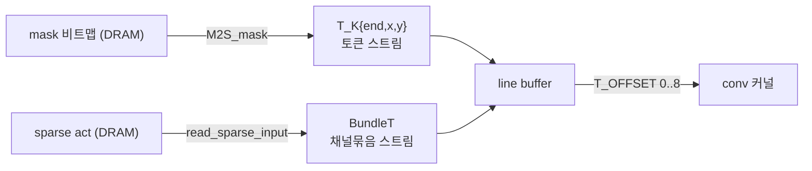
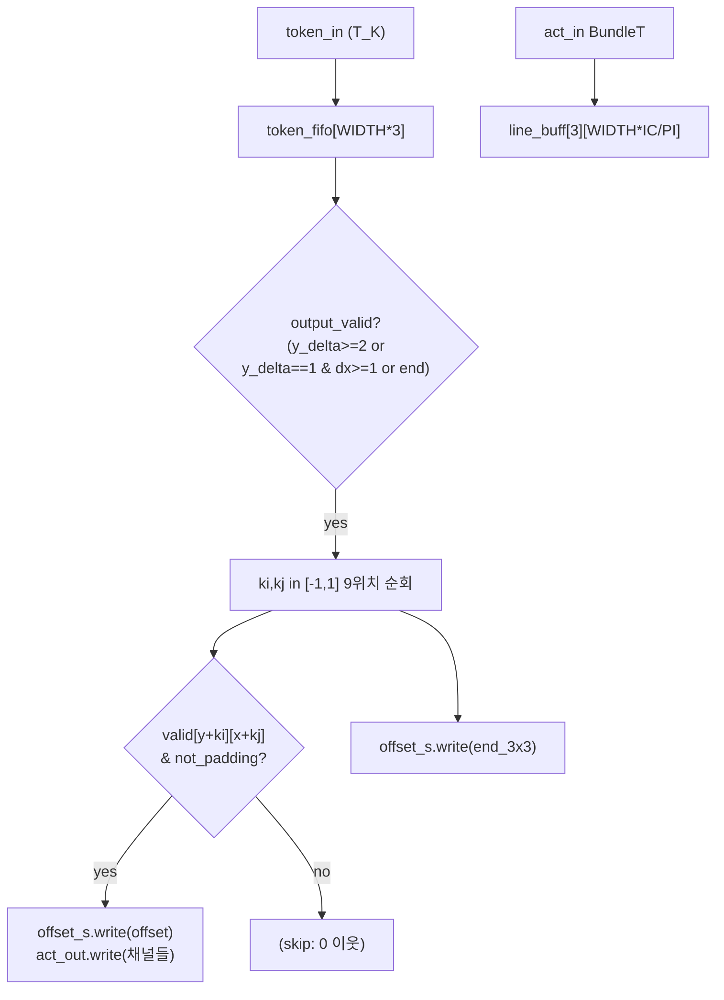
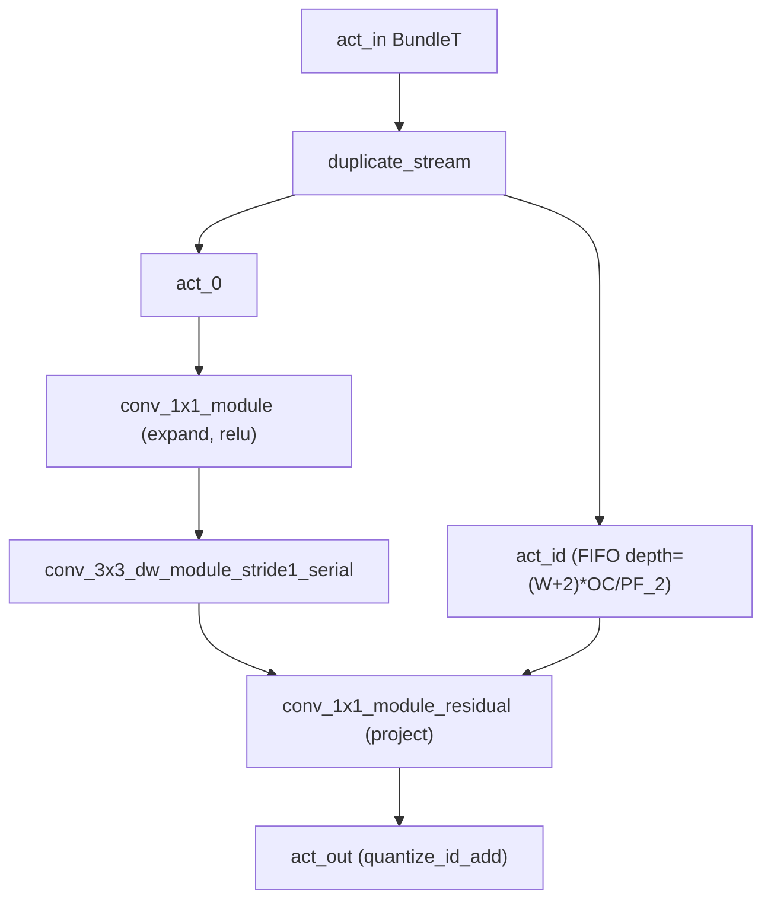
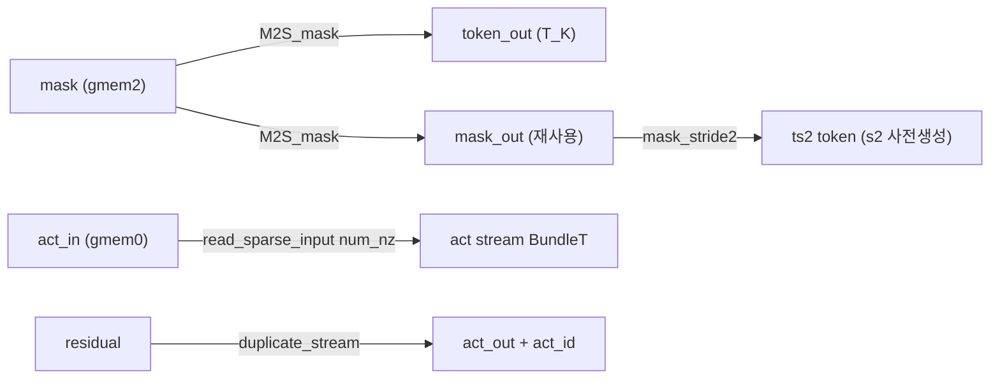
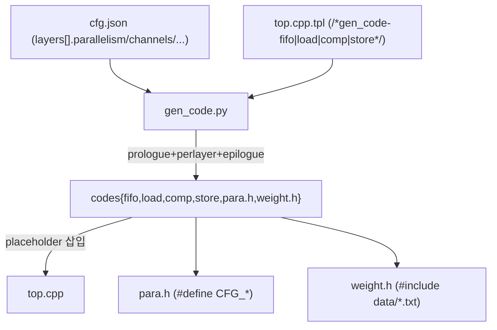
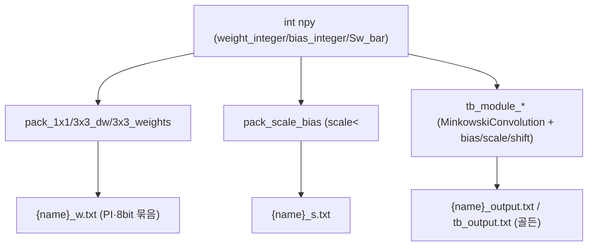

# ESDA 모듈 통합 가이드

> 1차 요약: [`../ESDA.md`](../ESDA.md) — 본 문서는 그 요약을 모듈 단위로 심화한 통합 가이드다.
> 분석 대상: `\\wsl.localhost\ubuntu-24.04\home\user\project\PRJXR-HBTXR\REF\CNN-Accel\ESDA`
> 작성 원칙: 실제 소스 Read 후 `파일:라인` 근거 표기. 라인 근거 없는 추론은 "추정", 코드로 확인 불가는 "확인 불가"로 명시.

---

## 0. 문서 머리말

### 0.1 대표 케이스 선정
- **대표 모델: `DVS_1890_shift16-zcu102_80res`** (DVSGesture, 입력 128×128, MobileNetV2, ZCU102 80% 자원예산). 근거: `hardware/README.md:46`가 빌드 예시로 이 cfg를 명시, 그리고 이 cfg가 입력 128×128로 본 repo에서 공간 해상도가 가장 큰 케이스라 line buffer/토큰/스트라이드 메커니즘이 모두 활성화되어 분석 가치가 높음(`eventNet/hw/DVS_1890_shift16-zcu102_80res/full/cfg.json:4-8`).
- **대표 sparse conv layer: `block_0`** — stride2 + 비-residual inverted-residual 블록(IC=32→C=32→OC=16, 입력 64×64). 근거: 첫 다운샘플 블록으로 stride2 line buffer(even/odd FIFO)·expand/dw/project 3단·DSP packing이 모두 등장(`para.h:26-42`, `cfg.json:95-142`).
- **대표 residual 블록: `block_1`** — stride1 + residual(IC=C=OC=16, 입력 32×32). identity FIFO·`quantize_id_add` 경로 분석용(`para.h:44-62`, `cfg.json:143-190`).
- **대표 첫 레이어: `conv1`** — 3×3 standard conv(IC=2→OC=32, 입력 128×128, stride2). dense 윈도우 패킹·LUTRAM 가중치 경로(`para.h:14-23`, `cfg.json:56-93`).

### 0.2 수치 표기 규약
- **MAC lanes** = HLS `#pragma HLS UNROLL` 차원 곱 = 본 설계에선 (병렬도 PI/PO)×(DSP packing 배수). 1x1·3x3 standard는 DSP당 2 MAC 패킹(`conv.h:284,303-312`)이므로 lanes를 2배로 표기. depthwise serial 커널은 패킹 미적용(`conv.h:373`)이라 lanes=PI.
- **scalar MACs**(dense 기준) = 출력H×출력W×Cout×Cin×Kh×Kw. depthwise는 Cin=Cout 묶음이라 H×W×C×9.
- **유효MAC / skip율** = ESDA는 토큰(좌표)이 있는 비영점 픽셀만 처리하므로 `유효MAC ≈ dense MAC × sparsity`. sparsity는 cfg에 레이어별 기록(예 `block_0` in-sparsity 0.1131, `cfg.json:110-114`). dw 커널은 추가로 윈도우 내 비영점 이웃만 누적해 `kernel_sparsity`(`cfg.json:70-79`)만큼 더 줄어듦.
- **loop trips** = 레이어 출력 토큰 수(=비영점 픽셀 수) × (채널타일 IC/PI 또는 OC/PO).
- **memory size**(payload bit) = 버퍼 깊이 × 폭(bit). line buffer는 `3행 × WIDTH × IC/PI × (PI·AW)bit`, 가중치 ROM은 `[차원][차원] × (PI·WW)bit`, identity FIFO는 `(WIDTH+2)·OC/PF2 × (PF2·AW)bit`.
- **타깃 데이터타입**: 활성/가중치 INT8(`CFG_AW=CFG_WW=8`, `para.h:5-6`), psum INT32(`CFG_PW=32`, `para.h:7`, 실제는 레이어별 `AW+WW+⌈log2C⌉`로 축약, `gen_code.py:128-131`), scale/bias 16b(NCAL만 32b, `gen_code.py:312-315`), 토큰 좌표 8b(`type.h:4-5`).

### 0.3 운영 경로
```
[SW 학습/양자화: HAWQ MobileNetV2 (본 repo 외부, ../ESDA.md 참조)]
      │ int8 weight/scale/bias + 골든 npy 익스포트 (model_path, cfg.json:51)
      ▼
[DSE/ILP: optimization/ (SCIP)] ──► en-result.json (layers[].parallelism, total_dsp/bram, lat_max, obj)
      │  scip_solver.py
      ▼
[프로젝트 생성: hardware/gen_prj.py gen_full] ──► template_e2e 복제 + cfg.json 주입 (po2_axi 보정)
      ▼
[코드 생성: make gen → gen_code.py + gen_data.py]
      │  gen_code.py: cfg → top.cpp/para.h/weight.h
      │  gen_data.py: int npy → data/*.txt (DSP-pack 가중치 + scale_bias + 골든 입출력)
      ▼
[HLS 커널: top.cpp → wrapper(#pragma HLS DATAFLOW) → conv_pack → conv/linebuffer/mem]
      │  Vitis HLS (xczu9eg, clk 3ns/333MHz, hls.tcl:41-42) → Vivado → top.bit
      ▼
[board 측정: board/evaluate.py (PYNQ Overlay register_map) + power_monitor.py]
```
- 타깃: **ZCU102 (xczu9eg-ffvb1156-2-e)**, 333 MHz 목표(`hls.tcl:42` period 3), PYNQ overlay(`evaluate.py:2-3`).

---

## 1. Repo / Layer 개요

ESDA = 이벤트 기반 sparse MobileNetV2를 토큰+마스크 sparse dataflow로 ZCU102에 레이어-파이프라인 가속하는 HW/SW 통합 프레임워크(`../ESDA.md` 1절). 본 repo(`CNN-Accel/ESDA`)는 **HW 측(HLS 템플릿·코드생성·board)**과 **DSE 솔버 일부**가 자체 소스이고, **SW 양자화(HAWQ) 학습부와 DSE 본체(`eventnet.py`/`DSEVar`/`DSEConstr`)는 부재**다(아래 제외 목록). HAWQ 모델 구현은 동형 사본 `XR-Eye-Tracking/Codebase/ESDA`에 존재(`../../XR-Eye-Tracking/Codebase/ESDA.md` 3-A 참조).

### 1.1 SW(양자화/DSE/codegen) vs HW(HLS 커널) vs board

| 구분 | 파일(자체 소스) | 역할 |
|---|---|---|
| **DSE(SW)** | `optimization/solver/scip_solver.py` | SCIP ILP 솔버 래퍼(병렬도 결정변수 → en-result.json) |
| | `optimization/eventnet.mk` | 모델×보드 데카르트곱 배치 DSE Makefile |
| **codegen(SW↔HW 브리지)** | `hardware/template_e2e/gen_code.py` | cfg.json → top.cpp/para.h/weight.h |
| | `hardware/template_e2e/common.py` | 네이밍 람다(CFG_*, a_/t_/w_/s_ 접두) |
| | `hardware/gen_prj.py` | template 복제 + cfg 주입(po2_axi 보정) |
| | `hardware/template_e2e/gen_data.py` | int npy → DSP-pack 가중치/scale_bias txt + 골든 입출력 |
| **HLS 커널(HW)** | `hardware/template_e2e/type.h` | T_K 토큰, BundleT, T_OFFSET |
| | `hardware/template_e2e/mem.h` | M2S_mask, read_sparse_input, duplicate_stream, write_output |
| | `hardware/template_e2e/linebuffer.h` | 토큰 기반 zero-skip line buffer 3변형 |
| | `hardware/template_e2e/conv.h` | DSP_AM, 1x1/3x3dw/first-layer 커널, quantize(_id_add), GAP+FC |
| | `hardware/template_e2e/conv_pack.h` | inverted-residual 블록 dataflow 조립 |
| | `hardware/template_e2e/top.h`,`top.cpp.tpl` | AXI top 인터페이스 + DATAFLOW 플레이스홀더 |
| **board harness** | `hardware/board/evaluate.py` | PYNQ Overlay 적재·latency 측정 |
| | `hardware/board/power_monitor.py`,`hw_e2e.py` | 전력 모니터·e2e 추론 |
| **리포트 추출(SW)** | `hardware/baseline_extract.py` | csynth/cosim/vivado power·timing·util → CSV |
| | `hardware/benchmark_extract.py` | sparse vs dense nzr별 cosim/실측 latency CSV |

### 1.2 제외 목록(이름만 언급)
- **third-party**: `software/MinkowskiEngine`·`software/src/*`·`software/pybind/*`(sparse conv 백엔드 번들, C++ 원본 `convolution_cpu.cpp` 등), `software/src/3rdparty/{robin_hood.h,cudf/*}`, `software/dataset/preprocess/dvs/PyAedatTools`(AEDAT 파서), `template_e2e/fixgmp.h`(GMP 호환 헤더).
- **생성물**: `eventNet/hw/<dataset>/full/*`(gen_prj/gen_code 산출 — 단, 대표 수치 확인용 `para.h`/`cfg.json`만 인용), `weight.h`·`data/*.txt`(가중치 ROM·scale txt), `eventNet/DSE/*`(솔버 출력).
- **실험 산출물**: `hardware/benchmark_results/{sparse,dense}/...`(블록별 co-sim 결과·gen_code 재생성 사본), `hardware/baseline_results/`(합성 로그). 추출 스크립트만 분석.
- **부재(확인 불가)**: SW 양자화 학습부(`main.py`/`int_inference.py`/`models/HAWQ_*`), DSE 본체(`eventnet.py`/`eventnetblock.py`/`utils/dse_var.py`/`utils/dse_constr.py`/`solver/base_solver.py`) — `scip_solver.py:7-9`가 import만 하고 파일 자체는 미포함. 따라서 DSE 목적함수·자원모델식은 본 repo만으론 확인 불가.

### 1.3 대표 모델 레이어 구성(DVS_1890)
근거: `para.h:14-267`, `cfg.json:9-45`(MobileNetV2 settings). conv1(3×3 s2) → block_0(s2) → block_1·2(s1 res) → block_3(s2) → block_4(s2) → block_5(s2 res) → block_6 → block_7·8(s1 res) → block_9(s2) → block_10(s1 res) → conv8(1×1) → FC. 총 14 연산 스테이지가 단일 DATAFLOW 영역에 나열(`top.cpp.tpl:6`).

---

## 2. 모듈: 토큰/자료형 — `type.h`

### 2.1 역할 + 상위/하위
- **역할**: sparse dataflow의 기본 자료형 정의. 비영점 픽셀의 공간 좌표를 토큰 `T_K`로, 병렬 채널 묶음을 `BundleT`로, 3×3 윈도우 내 위치를 `T_OFFSET`로 표현.
- **상위**: 모든 HLS 커널이 의존(`top.h:19`에서 include). **하위**: 없음(원자 자료형).

### 2.2 데이터플로우


### 2.3 대표 코드 위치
`hardware/template_e2e/type.h` (16줄 전체).

### 2.4 대표 코드 블록
```cpp
typedef struct T_K{
    ap_uint<1> end; ap_uint<8> x; ap_uint<8> y;   // type.h:2-6
} T_K;
```
→ 좌표 x,y가 **8비트**라 최대 255×255 해상도 제약. end=1이 스트림 종료 토큰.

```cpp
template <unsigned int N, typename T>
struct BundleT { T data[N]; };                      // type.h:8-11
typedef ap_uint<4> T_OFFSET;  #define end_3x3 15    // type.h:15-16
```
→ `BundleT<N,T>`는 병렬도 N개 채널을 1 FIFO 원소로 묶음. `T_OFFSET`는 3×3 윈도우 9개 위치(0~8) 인덱스 + 종료 마커 15.

### 2.5 마이크로아키텍처
- **메모리**: T_K = 1+8+8 = 17bit/토큰. 토큰 FIFO 깊이는 line buffer 내부 `WIDTH*3`(`linebuffer.h:20`).
- **병목**: 8비트 좌표 → 해상도 상한. 대표 모델 conv1 입력 128×128은 여유(`cfg.json:4`)이나 고해상도 비전엔 좌표폭 확장 필요.

---

## 3. 모듈: 토큰 기반 zero-skip Line Buffer — `linebuffer.h` (sparse 핵심 ①)

### 3.1 역할 + 상위/하위
- **역할**: 비영점 토큰 스트림+활성 스트림을 받아 3×3 윈도우를 재구성하되, **존재하지 않는(=0인) 이웃은 스트림에 싣지 않음**(zero-skip). 3행 순환 버퍼 + `valid` 비트맵으로 윈도우 채움 여부 판정.
- **상위**: `conv_pack.h`의 dw 모듈(`conv_3x3_dw_module_stride1/2_serial`)과 `conv_3x3_first_layer`가 호출. **하위**: 없음(act_in/token_in 스트림 직접 소비).
- 세 변형: `_stride1_serial`(s1), `_stride2_fifo_serial`(s2), `_first_layer`(첫 레이어 dense 윈도우).

### 3.2 데이터플로우 (stride1 변형)


### 3.3 Function call stack
`gen_code.py:156-158`(stride1 dw 모듈 방출) → `conv_pack.h:75` `conv_3x3_line_buffer_stride1_serial` → (offset_stream으로) `conv_pack.h:79` `conv_3x3_dw_kernel_serial`. stride2는 `conv_pack.h:109`, 첫 레이어는 `conv_pack.h:293`.

### 3.4 대표 코드 위치
`hardware/template_e2e/linebuffer.h`: stride1 `:3-177`, stride2 `:179-455`, first_layer `:457-667`.

### 3.5 대표 코드 블록
```cpp
out_valid_one_line = (y_delta == 1) && (lastest_token.x - oldest_token.x >= 1);
out_valid_multi_line = (y_delta >= 2);
output_valid = out_valid_one_line || out_valid_multi_line || lastest_token.end;
data_read_enable = (y_delta <= 1) && !lastest_token.end;   // linebuffer.h:99-105
```
→ 최신 토큰이 oldest보다 충분히 진행되어 중심행 3×3이 확정될 때만 윈도우 출력. 자기-흐름 제어(self-flow)로 토큰/데이터 read를 게이팅.

```cpp
if (valid_point) {
    T_OFFSET offset = (ki + 1) * 3 + kj + 1;
    offset_s.write(offset);
    for (T_C ic = 0; ic < ICPI; ic++) { ... act_out.write(output_pack); }
}
...
offset_s.write(end_3x3);                                    // linebuffer.h:154-174
```
→ **유효(비영점) 이웃만** offset+채널 방출, 윈도우 끝에 end_3x3. 이것이 dw 커널이 비영점 이웃 수에 비례해 곱셈하게 하는 핵심.

```cpp
if (new_token.y[0] == 0) { ... even_token_fifo[...] = new_token; }   // stride2
else { ... odd_token_fifo[...] = new_token; }                        // linebuffer.h:290-310
ap_uint<20> key_even = ...x + ...y*WIDTH;   // 두 FIFO key 비교로 머지  // :321-347
stride2_token.x = oldest_token.x >> 1; stride2_token.y = oldest_token.y >> 1; // :386-387
```
→ stride2는 짝/홀 행을 분리 FIFO로 관리하고 `key=x+y*WIDTH`로 순서 머지, 출력 좌표는 `>>1` 다운샘플.

### 3.6 마이크로아키텍처
- **Stage 분해**: ① 토큰 read + FIFO push(`:73-78`) ② jump_y로 순환행 valid 클리어(`:82-94`) ③ output_valid 판정(`:99-103`) ④ 데이터 적재 `IC/PI`패킷(`:122-136`) ⑤ 윈도우 9위치 방출(`:138-175`).
- **메모리/재사용**: `line_buff[3][WIDTH*IC/PI]`(3행 순환 = ping-pong 대체), `valid[3][WIDTH]`(dim2 complete reshape, `:44`), 토큰 FIFO `WIDTH*3`. 대표 block_0(WIDTH=64, IC=32, PI=8): line_buff = 3×64×4 × (8·8bit=64bit) = **49,152 bit ≈ 1.5 BRAM18 등가**(추정). first_layer는 line_buff dim1 complete partition + `valid`를 행당 `ap_uint<WIDTH>` 비트벡터로 압축(`:509-511`)하고 전체 루프 `#pragma HLS PIPELINE`(`:558`).
- **정량/병목**: 메인 루프 `HEIGHT*WIDTH*2`회(`:71`) — 토큰당 최대 2스텝(read+output). 윈도우 방출이 II=1 파이프(`:160`)이나 비영점 이웃 9개 직렬이라 **유효이웃 수가 dw 처리량 상한**. stride2 머지 로직(`:321-347`)이 가장 복잡 — 분기 많아 II 악화 가능(추정).

---

## 4. 모듈: 정수 MAC 커널 + DSP packing — `conv.h` (sparse 핵심 ②)

### 4.1 역할 + 상위/하위
- **역할**: 토큰/윈도우 스트림에 대해 INT8 MAC을 수행하고 INT8로 재양자화. 핵심은 **DSP48 1개에 2 MAC 패킹**(`DSP_AM`).
- **상위**: `conv_pack.h`의 각 모듈이 호출. **하위**: `DSP_AM`(프리미티브).

### 4.2 데이터플로우 (DSP packing)
```mermaid
flowchart LR
  w0["w_0 (9b)"] --> ext["w_0_expend (27b)"]
  w1["w_1 (9b)"] -->|<<18| sh["w_1_shift.range(26,18)"]
  act["activation"] --> in["in_expend (18b)"]
  ext --> DSP["DSP_AM: (w1_shift + w0_expend) * in_expend\n= 48b mul_temp"]
  sh --> DSP
  in --> DSP
  DSP -->|range(15,0)| low["psum[po*2] += low"]
  DSP -->|range(33,18)+carry| high["psum[po*2+1] += high"]
```

### 4.3 Function call stack
`conv_pack.h:15` `conv_1x1_kernel_dsp` → `conv.h:303` `DSP_AM`; `conv_pack.h:79` `conv_3x3_dw_kernel_serial`(패킹 없음); `conv_pack.h:296` `conv_3x3_kernel_dsp_first_layer` → `DSP_AM`. 각 커널 뒤 `quantize`/`quantize_id_add`.

### 4.4 대표 코드 위치
`hardware/template_e2e/conv.h`: DSP_AM `:1-8`, 1x1 dsp `:220-323`, dw serial `:325-387`, first_layer `:390-487`, quantize `:59-123`, quantize_id_add `:125-218`, GAP+FC `:490-559`.

### 4.5 대표 코드 블록
```cpp
template <int _W_1, int _W_2>
ap_int<_W_1 + _W_2> DSP_AM(ap_int<_W_1> in1, ap_int<_W_1> in2, ap_int<_W_2> in3) {
    ap_int<_W_1> add_temp = in1 + in2;
    ap_int<_W_1 + _W_2> mul_temp = add_temp * in3;  // (A+D)*B, conv.h:5-6
    return mul_temp;
}
```
→ Xilinx DSP48 사전가산기 (A+D)×B. 두 가중치를 add_temp에 실어 한 곱셈에 2 MAC.

```cpp
ap_int<27> w_1_shift = 0;  ap_int<27> w_0_expend = (ap_int<27>)w_0;
w_1_shift.range(26, 18) = (ap_int<9>)w_1;                  // conv.h:299-301
ap_int<48> mul_temp = DSP_AM(w_1_shift, w_0_expend, in_expend);
ap_int<AW+WW> low  = mul_temp.range(AW+WW-1, 0);
ap_int<AW+WW> high = mul_temp.range(AW+WW-1+18, 18) + mul_temp.range(AW+WW-1, AW+WW-1);
psum_pack.data[po*2] += low;  psum_pack.data[po*2+1] += high;  // conv.h:303-312
```
→ `w_1`을 상위 18비트로 시프트해 한 48b 곱셈 결과의 하위/상위에서 두 부분곱 분리. 부호 보정 항(`+...range(AW+WW-1,AW+WW-1)`)으로 carry 처리.

```cpp
for (ap_uint<4> k = 0; k < 10; k++) {
    T_OFFSET offset = offset_s.read();
    if (offset == end_3x3) break;                         // conv.h:362-364
    for (T_C ic = 0; ic < IC/PI; ic++) {
        ... psum_buffer[ic*PI+pi] += activation * weight;  // conv.h:373
    }
}
```
→ dw serial 커널: line buffer가 보낸 **유효 위치만**(최대 9+종료) 누적. 곱셈 횟수 = 비영점 이웃 수 × IC. (패킹 미적용, 단순 곱셈.)

```cpp
ap_int<PSUMW+SCALEW+1> psum_mul = (psum + bias) * scale + round_shift;  // conv.h:102
psum_mul = psum_mul >> EXP;
if (psum_mul > high) psum_mul = high;  if (psum_mul < low) psum_mul = low; // :108-109
act_pack.data[p] = relu ? (q<0?0:q) : q;                                  // :112-117
```
→ 재양자화: `(psum+bias)*scale`, round_shift(`1<<(EXP-1)`, `:67`) 가산 후 `>>EXP`, INT8 클리핑, relu 옵션.

### 4.6 마이크로아키텍처
- **Stage 분해(1x1 dsp)**: ① act_buffer 적재 `IC/PI`(`:264-273`) ② OC/PO × IC/PI 루프, PO/2쌍 DSP packing(`:275-314`) ③ psum write + 리셋(`:316-320`).
- **MAC lanes**: 1x1 = PO/2(packing) × PI, 각 DSP가 2 MAC → 유효 lanes = **PO×PI**. 대표 block_0 1x1 expand(PIC=8, C=32, PC=8): OC/PO=4, IC/PI=4, lane=PO×PI. depthwise serial lanes = PI(=8, packing 없음). first_layer도 PO/2×PI packing.
- **scalar MACs(dense)**: block_0 expand 1x1 = 64×64×32×32 = 4.19M; dw 3x3 = 64×64×32×9 = 1.18M; project 1x1 = 64×64×16×32 = 2.10M. **유효MAC**(sparsity 0.1131~0.2521 적용): expand ≈ 4.19M×0.1131 ≈ 474K, dw는 kernel_sparsity까지 적용해 더 감소.
- **메모리/재사용**: 가중치 ROM `rom_2p impl=BRAM`(`:229`), 1x1은 cyclic partition factor PO/2(`:231`)로 packing 동시 접근. first_layer 가중치는 dense·소형이라 **LUTRAM**(`:401`). scale_buffer도 BRAM + cyclic PI/2(`:71`).
- **정량/병목**: DSP packing으로 INT8 처리량 ×2 — DSP가 ILP 1차 제약(추정). dw serial은 비패킹이라 dw 단계가 1x1 대비 DSP 효율 절반. `quantize`/`quantize_id_add`에 합성경로 `cout` 디버그 잔존(`:104,118,187-208`) — csim 시 대량출력, 정리 권장.

---

## 5. 모듈: inverted-residual 블록 조립 — `conv_pack.h`

### 5.1 역할 + 상위/하위
- **역할**: 커널들(line buffer/conv/quantize)을 `#pragma HLS DATAFLOW`로 묶어 MobileNetV2 블록(1x1 expand → 3x3 dw → 1x1 project [+residual])을 하나의 dataflow 서브그래프로 구성.
- **상위**: top.cpp의 comp 영역(gen_code가 함수 호출 방출). **하위**: `conv.h`·`linebuffer.h`·`mem.h` 커널.

### 5.2 데이터플로우 (stride1 residual 블록)


### 5.3 Function call stack
`gen_code.py:191-195`가 stride/residual로 함수명 결정 → `conv_1x1_3x3_dw_1x1_stride{1,2}[_residual]`(`conv_pack.h:127/171/215`) → `conv_1x1_module`(`:1`)/`conv_3x3_dw_module_stride1_serial`(`:49`)/`conv_1x1_module_residual`(`:24`) → 4절 커널.

### 5.4 대표 코드 위치
`hardware/template_e2e/conv_pack.h`: 1x1 module `:1-22`, 1x1 residual `:24-47`, dw s1 `:49-85`, dw s2 `:87-121`, block s1 `:123-165`, block s2 `:167-209`, block s1 residual `:211-268`, first_layer `:271-302`, conv8 `:304-314`.

### 5.5 대표 코드 블록
```cpp
#pragma HLS DATAFLOW
conv_1x1_kernel_dsp<...>(act_in, pusm_1, token_in, token_1, w_buffer);
quantize<...>(pusm_1, act_out, token_1, token_out, scale_buffer);  // conv_pack.h:8-21
```
→ 1x1 module = conv + quantize를 FIFO depth=2로 연결.

```cpp
const int OC = IC;
hls::stream<BundleT<PF_2, ap_int<AW>>> act_id;
DO_PRAGMA(HLS STREAM variable = act_id depth = (WIDTH + 2) * OC / PF_2)  // :242-244
duplicate_stream<...>(act_in, act_0, act_id, token_in, token_0);        // :248
```
→ residual 블록: 입력을 분기, identity 갈래를 깊은 FIFO(`(WIDTH+2)*OC/PF_2`)로 지연. **이 FIFO 깊이가 공간 크기에 비례 = BRAM 비용 주요인.**

```cpp
conv_3x3_dw_module_stride1_serial<...>(act_1, act_2, token_1, token_2, w_buffer_1, scale_buffer_1);
// offset_stream depth=9 로 line buffer↔dw 동기화 (:71-72)
```

### 5.6 마이크로아키텍처
- **Stage 분해**: expand(1x1) → dw(3x3) → project(1x1) 3단 직렬 dataflow. 각 단 FIFO depth=2(`:140-146`)로 얕게 연결(레이어-파이프라인이라 깊은 버퍼 불요), residual identity만 깊은 FIFO.
- **병렬도 노브**: 템플릿 `PF_0/PF_1/PF_2`(=expand/dw/project 병렬도) = DSE 결정변수. 단계별 독립 → 파이프라인 균형(throughput 매칭).
- **메모리**: 대표 block_1(residual, W=32, OC=16, PF_2=4): act_id FIFO = (32+2)×16/4 = 136 원소 × (4·8bit=32bit) = **4,352 bit**. id_token FIFO 깊이 W+2=34(`:246`).
- **정량/병목**: stride2와 residual 동시 불가(`gen_code.py:176` assert) — 공간 크기 변화 시 skip 불가. residual FIFO가 BRAM 압박(WIDTH 큰 초기 블록일수록).

---

## 6. 모듈: 데이터 이동(마스크/토큰/입출력) — `mem.h`

### 6.1 역할 + 상위/하위
- **역할**: DRAM↔온칩 sparse 데이터 변환. 마스크→토큰, 비영점 활성 read, residual 스트림 복제, stride2 마스크 사전생성.
- **상위**: top.cpp의 load 영역(`gen_code.py:67-82`). **하위**: AXI master 포트(`top.cpp.tpl:18-23`).

### 6.2 데이터플로우


### 6.3 Function call stack
`gen_code.py:67-82` prologue → `read_sparse_input`(`mem.h:178`) + `M2S_mask`(`mem.h:75`) + `mask_stride2`(`mem.h:124`). residual 블록 내부 → `duplicate_stream`(`mem.h:285`).

### 6.4 대표 코드 위치
`hardware/template_e2e/mem.h`: M2S_mask `:75-122`, mask_stride2 `:124-176`, read_sparse_input `:178-194`, write_output `:262-283`, duplicate_stream `:285-333`, M2S_mask_merge `:11-71`, first_layer 마스크 `:335-379`.

### 6.5 대표 코드 블록
```cpp
for (...) for (...) for (ap_uint<16> i = 0; i < MW; i++) {
    bool nz_flag = mask_pack[i];
    token.x = w*MW + i; token.y = h; token.end = 0;
    if (nz_flag) token_out.write(token);                  // mem.h:104-113
}
token.x=255; token.y=255; token.end=1; token_out.write(token);  // :118-121
```
→ 마스크 비트=1인 좌표마다 토큰 발행, 끝에 종료 토큰.

```cpp
for (int i = 0; i < num_nz * IC / PI; i++) {              // mem.h:185
    ap_int<PI*AW> tmp = act_in[i]; ... act_out.write(out_pack);
}
```
→ **비영점 개수 num_nz만큼만** AXI read — 0 픽셀은 메모리에서 안 읽음(대역폭 절감).

```cpp
static const int LCM = boost::integer::static_lcm<PI, PO>::value;  // mem.h:290
if (PI == PO) { ... act_out.write(in_pack); act_id.write(id_pack); } // :303-312
else { /* LCM 버퍼로 폭 변환 */ }                                    // :313-330
```
→ residual 복제: PI==PO면 단순 복제, 아니면 LCM 폭으로 repack(병렬도 다른 단 연결).

### 6.6 마이크로아키텍처
- **메모리/재사용**: M2S_mask가 mask를 온칩 `mask_buffer[HEIGHT][WIDTH_DIV_ROUND]`에 한 번 적재 후 토큰화 + mask_out으로 재방출(stride2가 재사용, `:91`). mask_stride2는 mask_buffer cyclic factor 2 partition(`:134`)로 2행 동시 OR.
- **정량/병목**: read_sparse_input loop trips = num_nz × IC/PI(=비영점 비례). M2S_mask는 dense HEIGHT×WIDTH 스캔(마스크 전체) — sparse 이득 없는 유일 단계지만 1bit/픽셀이라 저비용. `M2S_mask_merge`(`:57`)·`read_weights_1x1`(`:255`)에 `cout` 잔존(합성경로 무해).
- **AXI**: gmem0/1/2 3채널, depth 65536(`top.cpp.tpl:18-23`).

---

## 7. 모듈: 코드 생성기 — `gen_code.py` + `common.py` (SW↔HW 브리지)

### 7.1 역할 + 상위/하위
- **역할**: cfg.json(=DSE 결과)을 읽어 `top.cpp`/`para.h`/`weight.h`를 자동 생성. **ILP 결정변수(parallelism)를 HLS 템플릿 파라미터로 직결**하는 핵심 자동화.
- **상위**: `make gen`(Makefile). **하위**: `top.cpp.tpl` 플레이스홀더, `common.py` 네이밍 람다.

### 7.2 데이터플로우


### 7.3 Function call stack
`gen_code.main`(`:379`) → `gen_code`(`:306`) → `append_prolouge_code`(`:57`) + 레이어별 `append_perlayer_code`(`:99`) + `append_epilouge_code`(`:288`). 네이밍은 `common.py`의 `cfg_of/afifo_of/wbuf_of/...`(`:1-14`).

### 7.4 대표 코드 위치
`hardware/template_e2e/gen_code.py` (410줄), `common.py` (25줄).

### 7.5 대표 코드 블록
```cpp
// common.py:4-13
cfg_of = lambda name, cfg: f"CFG_{legal_up(name)}_{cfg}"
afifo_of = lambda name: f"a_{legal_low(name)}"   # 활성 FIFO
wbuf_of = lambda name: f"w_{legal_low(name)}"    # 가중치 ROM
```
```python
def_v_list = layer["parallelism"] + layer["channels"] + layer["input_shape"]  # gen_code.py:126,180
```
→ **이 한 줄이 SW DSE ↔ HW 병렬도의 연결점.** cfg의 parallelism이 `CFG_<NAME>_PIC/PC/POC`로 직결.

```python
assert layer["stride"] in [1, 2]
assert not (layer["stride"] == 2 and layer["residual"])   # gen_code.py:175-176
def_v_list += [ f"(CFG_AW + CFG_WW + {math.ceil(math.log2(layer['channels'][0]))})", ... ]  # :184-187
```
→ stride2+residual 동시 금지, psum 비트폭을 `AW+WW+⌈log2C⌉`로 레이어별 자동 산정(누적 오버플로 방지).

```python
if cfg["dataset"] == "NCAL":  cfg["CFG_SW"]=cfg["CFG_BW"]=cfg["CFG_EXP"]=32  # gen_code.py:312-315
if cfg["dataset"] == "Roshambo":  cfg["CFG_MW"]=64                          # :316-317
```
→ 데이터셋별 양자화 비트/마스크폭 분기.

### 7.6 마이크로아키텍처(코드생성 관점)
- **Stage 분해**: prologue(공통 para + read_sparse_input/M2S_mask/mask_stride2 load) → per-layer(fifo/comp/weight.h ROM 선언) → epilogue(top para + endif).
- **레이어 타입별 분기**: `conv`(conv1→conv_3x3_first_layer, conv8→conv8), `block`(stride·residual 조합), `linear`(global_avgpool_linear). 각각 wbuf/sbuf 차원 산출(`:141-276`).
- **검증**: `assert len(def_k_list)==len(def_v_list)`(`:283`). 플레이스홀더 미발견 시 ValueError(`:369`).
- **병목/주의**: store 영역(write_output)이 주석처리됨(`:291-297`) — linear 레이어가 직접 act_out에 logit write(`gen_code.py:264`)하므로 별도 store 불요. 절대경로 하드코딩(`gen_prj.py:119` `/vol/datastore/...`) 재현 시 수정 필요.

---

## 8. 모듈: 프로젝트 생성기 — `gen_prj.py`

### 8.1 역할 + 상위/하위
- **역할**: en-result.json을 읽어 template_e2e를 목적지에 복제하고 cfg.json 주입. 첫/마지막 레이어 병렬도를 2의 거듭제곱+채널 약수로 내림(`po2_axi`).
- **상위**: 사용자 CLI(`README.md:46`). **하위**: shutil copytree, gen_code/gen_data(복제된 프로젝트 내).

### 8.2 Function call stack
`main`(`:88`) → `gen_full`(`:81`)/`gen_single_blk`(`:56`)/`gen_multi_blk`(`:66`) → `copy_dir`(`:32`) → `po2_p`(`:12`).

### 8.3 대표 코드 블록
```python
def po2_p(n, x):
    power_of_2 = 1 << (n.bit_length() - 1)
    factor = math.gcd(power_of_2, x)            # gen_prj.py:14-16
    return factor
...
cfg["layers"][0]["parallelism"][0] = po2_p(...)   # :46-49 (po2_axi 시)
```
→ AXI 폭 정합을 위해 첫 레이어 입력 병렬도·마지막 레이어 출력 병렬도를 2^k 또는 채널 약수로 floor.

### 8.4 마이크로아키텍처
- `get_bare_cfg`(`:23`)가 SW/BW/EXP=16 기본 주입(NCAL은 gen_code에서 32로 override). single_blk(`:56`)/multi_blk(gen_len=6, `:69`)는 Fig13 벤치마크용 블록 분할 생성. **병목 없음(빌드타임 스크립트).**

---

## 9. 모듈: 가중치 패킹 + 골든데이터 생성 — `gen_data.py` (SW 검증 브리지)

### 9.1 역할 + 상위/하위
- **역할**: SW(HAWQ) int8 npy(weight/bias/scale)를 **HW의 DSP-pack 비트레이아웃**으로 변환해 `data/*.txt`(weight.h ROM 초기화)로 쓰고, MinkowskiEngine으로 레이어별 골든 입출력 txt를 생성(HLS csim 검증용).
- **상위**: `make gen`. **하위**: MinkowskiEngine(third-party).

### 9.2 데이터플로우


### 9.3 대표 코드 블록
```python
for i in range(PI):
    tmp += int(weights[k][c*PF+i] & 0xFF) << (precision*i)   # gen_data.py:38-39
if tmp >= (1 << (8*PF-1)): tmp -= 1 << (8*PF)                # :40-43
```
→ depthwise 가중치를 PI개씩 8bit 리틀엔디언으로 패킹(HW `w_buffer[k][ic].range((pi+1)*WW-1,pi*WW)`와 정합, `conv.h:371`).

```python
output_array[i] = (bias[i] & (2**W-1)) + ((scale[i] & (2**W-1)) << W)  # gen_data.py:98
```
→ scale·bias를 한 워드로 패킹(HW `quantize`의 `scale_bias.range(SCALEW+BIASW-1,BIASW)` 분리와 정합, `conv.h:96-99`).

```python
mul = (self.bias + psum) * self.scale; mul += 2**(shift_n-1)
self.psum_mult_shift = mul >> self.shift_n
self.psum_mult_shift_clamp = torch.clamp(..., -128, 127)     # gen_data.py:231-243 (tb_module_1x1)
```
→ SW 재양자화가 HW `quantize`(`conv.h:102-109`)와 비트-정확 정합 → HLS csim 골든 검증 가능.

### 9.4 마이크로아키텍처(검증 관점)
- **stride2+residual 금지**가 SW에도 반영(블록 모듈이 residual일 때만 id_scale, `:858-862`). dw는 `MinkowskiChannelwiseConvolution`(`:518`), 1x1/3x3은 `MinkowskiConvolution`. linear은 GAP(sum)+matmul로 logit 직접 비교(`:874-902`).
- **병목 없음**(빌드타임). 단 cfg.json의 `model_path`(`cfg.json:51`)에 SW 익스포트 npy가 있어야 동작 — 본 repo엔 npy 부재(제외) → gen_data 실행 자체는 **확인 불가**, 로직만 분석.

---

## 10. 모듈: DSE/ILP 솔버 — `optimization/scip_solver.py` + `eventnet.mk`

### 10.1 역할 + 상위/하위
- **역할**: 레이어별 병렬도(PIC/PC/POC)를 정수계획(MILP)으로 풀어 latency 최소화 → en-result.json.
- **상위**: DSE 드라이버 `eventnet.py`(**부재**). **하위**: `pyscipopt`, `DSEVar`/`DSEConstr`/`BaseSolver`(**부재**).

### 10.2 대표 코드 블록
```python
for var in var_list:
    if var.in_scip:
        self.scip_var_dict[var.name] = self.scip_model.addVar(var.name, var.vtype, var.lb, var.ub)
        if var.is_obj: scip_obj = self.scip_var_dict[var.name]   # scip_solver.py:39-46
for constr in constr_list:
    if constr.in_scip:
        self.scip_model.addCons(constr.get_constr_expr(self.scip_var_dict), constr.name)  # :48-52
self.scip_model.setObjective(scip_obj)                            # :55
```
→ 변수/제약/목적이 외부 `DSEVar`/`DSEConstr`에 캡슐화된 **순수 ILP 래퍼**. 실제 자원·latency 모델식은 부재 → **확인 불가**.

```python
config.setdefault("scip-maxnthreads", 8)                         # scip_solver.py:28
if var.vtype()=="INTEGER": sol_dict[var.name]=int(round(val))    # :141-142
```
→ 기본 8스레드 concurrentopt(`:83`), 정수해 반올림. CLI 경로는 checkSol 3단계 검증(`:104-111`).

### 10.3 마이크로아키텍처(DSE 관점)
- 출력 en-result.json의 `layers[].parallelism`이 ILP 결정변수 → `gen_code.py:126`로 HW 병렬도 직결. 자원예산은 `HWConfig/zcu102_*res.json`(dsp/bram 상한, 1차 요약 3.C)와 cfg `total_dsp`/`total_bram`(대표 1804/1049, `cfg.json:49-50`) 대조.
- `eventnet.mk`: 모델×보드 곱집합 배치, en-result.json 존재 시 skip(idempotent). 솔버 본체 부재로 진입점 **확인 불가**.

---

## 11. 모듈: top 인터페이스 + board harness — `top.cpp.tpl`/`top.h` + `board/evaluate.py`

### 11.1 역할 + 상위/하위
- **역할(top)**: AXI master 3채널 + AXI-lite 제어, 단일 DATAFLOW wrapper. **역할(board)**: PYNQ Overlay로 비트스트림 적재, mask/num_nz 주입, AP_START~AP_IDLE로 latency 측정.

### 11.2 대표 코드 블록
```cpp
void top(ap_int<CFG_AW*CFG_TOP_PIC> *act_in, ap_int<32> *act_out, ap_int<CFG_MW> *mask, int num_nz);
#pragma HLS INTERFACE m_axi port=act_in bundle=gmem0 depth=65536   // top.cpp.tpl:18
... #pragma HLS DATAFLOW  /*gen_code-fifo|load|comp|store*/        // :6-13
```
→ wrapper 내 단일 DATAFLOW에 생성 코드 삽입. act_in 폭 = AW×TOP_PIC(첫 레이어 입력 병렬도).

```python
self.accel.register_map.num_nz = int(num_nz)
self.accel.register_map.CTRL.AP_START = 1
while idle == 0: idle = self.accel.register_map.CTRL.AP_IDLE       # evaluate.py:127-132
```
→ 호스트가 num_nz 세팅 후 시작, idle 폴링으로 wall-clock latency 측정. 마스크는 `pack_mask`로 비트팩(`:58-74`).

### 11.3 마이크로아키텍처
- 합성 타깃 `xczu9eg-ffvb1156-2-e`, clk period 3ns(=333MHz 목표, `hls.tcl:42`). 흐름: csim→csynth→cosim→export(`hls.tcl:12-23`).
- board: PYNQ `allocate`로 입력/출력/마스크 버퍼 DMA, physical_address를 register_map에 기록(`:54-56`). 전력은 `power_monitor.py` 서브프로세스 + PMBus 18센서(`baseline_extract.py:9-30`).

---

## 12. 모듈 한눈 요약 표

| 모듈 | 파일 | 핵심 함수(라인) | 역할 | 대표 정량(DVS_1890) |
|---|---|---|---|---|
| 토큰/자료형 | type.h | T_K(:2-6), BundleT(:8-11) | sparse 좌표·채널묶음 | 좌표 8b→max 255², 토큰 17b |
| line buffer | linebuffer.h | s1(:3), s2(:179), first(:457) | zero-skip 3×3 윈도우 | block_0 line_buff≈49Kb |
| MAC 커널 | conv.h | DSP_AM(:1), 1x1(:220), dw(:325) | INT8 MAC + DSP 2pack | 1x1 lanes=PO×PI |
| 재양자화 | conv.h | quantize(:59), id_add(:125) | psum→int8 (+residual) | (psum+bias)*scale>>EXP |
| GAP+FC | conv.h | global_avgpool_linear(:490) | 분류 logit | OC=N_CLASS=10 |
| 블록 조립 | conv_pack.h | block s1/s2[_res](:123/167/215) | inverted-residual dataflow | PF_0/1/2 독립 병렬도 |
| 데이터 이동 | mem.h | M2S_mask(:75), read_sparse(:178) | 마스크→토큰, nz read | read trips=num_nz·IC/PI |
| codegen | gen_code.py | gen_code(:306), perlayer(:99) | cfg→top.cpp/para/weight | parallelism→CFG_* |
| prj 생성 | gen_prj.py | gen_full(:81), po2_p(:12) | template 복제+cfg | 병렬도 po2 floor |
| 가중치팩/골든 | gen_data.py | pack_*(:24-87), tb_module_*(:123+) | DSP-pack txt+골든 | scale<<W\|bias |
| DSE 솔버 | scip_solver.py | build(:33), solve(:64) | ILP 병렬도 최적화 | 8thread, INTEGER round |
| top/board | top.cpp.tpl, evaluate.py | top(:16), run(:100) | AXI top + PYNQ 측정 | xczu9eg, 333MHz |

---

## 13. 읽기 순서 / 코드 추적 순서

1. **자료형 먼저**: `type.h`(토큰/BundleT/offset) → sparse 표현 직관.
2. **데이터 진입**: `mem.h` M2S_mask(`:75`)·read_sparse_input(`:178`) → DRAM→스트림 변환.
3. **sparse 핵심**: `linebuffer.h` stride1(`:3-177`) → output_valid 판정(`:99-103`)·valid_point 방출(`:154-174`)이 zero-skip의 본질.
4. **연산**: `conv.h` DSP_AM(`:1`)→conv_3x3_dw_kernel_serial(`:325`, offset 연동)→conv_1x1_kernel_dsp(`:220`, packing)→quantize(`:59`).
5. **조립**: `conv_pack.h` block s1 residual(`:215`)에서 duplicate→3단→id_add 흐름.
6. **자동화**: `gen_code.py` perlayer(`:99`) + `common.py` 네이밍 → cfg가 어떻게 HLS로 변환되는지.
7. **SW 정합**: `gen_data.py` tb_module_1x1.forward(`:223`)와 conv.h quantize 비교 → 비트-정확 검증.
8. **DSE/측정**: `scip_solver.py`(병렬도 출처) → `evaluate.py`(latency 측정).
9. **대표 수치 확인**: `eventNet/hw/DVS_1890_shift16-zcu102_80res/full/para.h`(레이어 표) + `cfg.json`(parallelism/dsp/bram).

---

## 14. 병목 후보 & 병렬도/DSE 노브

### 14.1 병목 후보
1. **depthwise serial 커널 비패킹**(`conv.h:373`): 1x1은 DSP 2pack인데 dw는 단순 곱셈 → dw 단계 DSP 효율 절반. dw가 inverted-residual의 중간 단이라 파이프 균형에 불리(추정).
2. **residual identity FIFO 깊이 ∝ WIDTH**(`conv_pack.h:244`): WIDTH 큰 초기 블록(block_0 W=64)에서 BRAM 압박.
3. **stride2 line buffer 머지 분기**(`linebuffer.h:321-347`): even/odd key 비교 분기 다수 → II 악화 가능(추정, cosim 필요).
4. **M2S_mask dense 스캔**(`mem.h:101-115`): sparse 이득 없는 유일 단계(1bit/픽셀이라 저비용이나 HEIGHT×WIDTH 고정).
5. **8비트 좌표**(`type.h:4-5`): 255×255 해상도 상한.
6. **합성경로 cout 디버그**(`conv.h:104,118`, `mem.h:57,255`): csim 대량출력(합성엔 무해).

### 14.2 병렬도/DSE 노브
- **레이어별 PF_0/PF_1/PF_2(=PIC/PC/POC)**: conv_pack 템플릿 인자(`conv_pack.h:123`), cfg parallelism이 직결(`gen_code.py:126`). 대표 DVS_1890 예: block_0=[8,8,8], block_1=[8,8,4], block_10=[12,12,24](`para.h:26-238`) — 깊은 블록일수록 출력 병렬도 ↑(공간 작아 채널 병렬 확대).
- **자원예산**: zcu102_{40~80}res / full / mini / extra(HWConfig) → ILP 제약 우변. 대표 80res: total_dsp 1804, total_bram 1049(`cfg.json:49-50`).
- **po2_axi**: 첫/마지막 병렬도 2^k floor(`gen_prj.py:12-20`) — AXI 폭 정합.
- **양자화 비트**: NCAL만 SW/BW/EXP=32, 그 외 16(`gen_code.py:312-315`); Roshambo MW=64(`:316`). psum 비트폭은 `AW+WW+⌈log2C⌉` 자동(`:128-131`).
- **DSP packing on/off**: 1x1·first-layer는 packing, dw는 미적용 → dw도 packing화하면 DSP 추가 절감 여지(개선 노브, 추정).

---

*근거 파일(절대경로)*:
`\\wsl.localhost\ubuntu-24.04\home\user\project\PRJXR-HBTXR\REF\CNN-Accel\ESDA\hardware\template_e2e\{type.h,linebuffer.h,conv.h,conv_pack.h,mem.h,top.h,top.cpp.tpl,gen_code.py,common.py,gen_data.py,prj\hls.tcl}`,
`...\hardware\{gen_prj.py,baseline_extract.py,benchmark_extract.py,board\evaluate.py}`,
`...\optimization\{solver\scip_solver.py,eventnet.mk}`,
`...\eventNet\hw\DVS_1890_shift16-zcu102_80res\full\{para.h,cfg.json}`.
