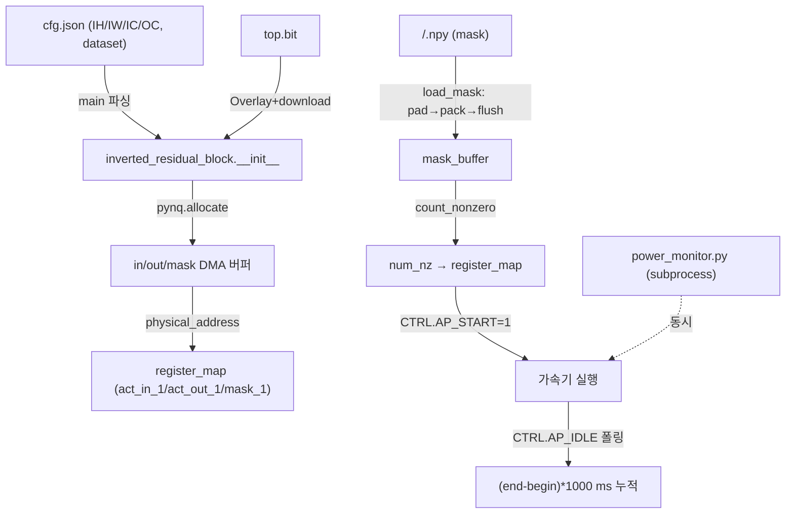
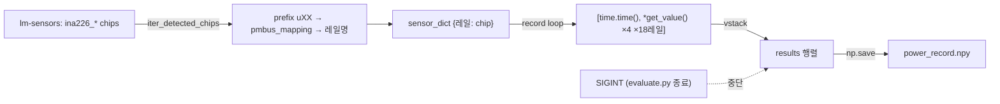
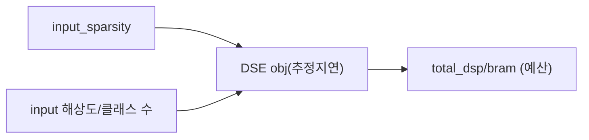

# SEE 모듈 통합 가이드 (측정·사례연구·자동화 계층)

> 1차 요약: [`../SEE.md`](../SEE.md) — 본 문서는 그 요약을 모듈 단위로 심화한 통합 가이드다.
> 형제 가이드(동형 H-HLS): [`../ESDA/MODULE_GUIDE.md`](../ESDA/MODULE_GUIDE.md) — ESDA 커널 본체는 그 문서를 참조하고, 본 문서는 **SEE 고유의 측정·사례연구·자동화 계층**에 집중한다.
> 분석 대상: `\\wsl.localhost\ubuntu-24.04\home\user\project\PRJXR-HBTXR\REF\CNN-Accel\SEE\ESDA`
> 작성 원칙: 실제 소스 Read 후 `파일:라인` 근거 표기. 라인 근거 없는 추론은 "추정", 코드로 확인 불가는 "확인 불가"로 명시.

---

## 0. 문서 머리말

### 0.1 SEE = ESDA의 사례연구 래퍼 (전제)

`SEE/ESDA`는 **ESDA(`REF/CNN-Accel/ESDA`)와 동일 프로젝트의 사본**이다. `optimization/solver/scip_solver.py`, `hardware/template_e2e/{type.h,linebuffer.h,conv.h,conv_pack.h,mem.h,gen_code.py,common.py,gen_data.py}`, `hardware/gen_prj.py`, `hardware/board/{evaluate.py,power_monitor.py,hw_e2e.py}`, `hardware/README.md`(206줄)가 **ESDA와 동일 구조**로 존재(Glob 대조). 따라서 **HLS 커널·코드생성·DSE 솔버 본체는 [`../ESDA/MODULE_GUIDE.md`](../ESDA/MODULE_GUIDE.md) 모듈 2~10을 cross-ref**하고, 본 문서는 SEE에서만 의미를 갖는 **다음 4개 계층**을 정밀 분석한다.

1. **board 측정 하네스** — `board/{evaluate.py,power_monitor.py,hw_e2e.py}` (지연 + INA226 전력 동시측정). ★고유가치
2. **사례연구 데이터셋×예산 구성** — `hardware/cfgs/*.json` 9종 (5개 이벤트 데이터셋 × 자원예산).
3. **아키텍처 변형 아카이브** — `eventNet/archived_hw/{MobileNetV2,SEE-A,SEE-B,SEE-C,SEE-D}` (합성/배포된 네트워크 변형).
4. **사례연구 스윕 자동화** — `optimization/pipeline.py`(모델×보드 배치 커맨드 생성), `hardware/template_e2e/Makefile`(원격 보드 evaluate 파이프라인).

명칭: README/코드에 SEE 풀네임·논문 표기 없음 → **확인 불가**(SEE.md §0과 동일). archived_hw의 `SEE-A~D`는 동일 dataflow 템플릿의 네트워크/병렬도 변형(아래 §4 근거).

### 0.2 대표 케이스 선정

- **대표 사례(데이터셋×예산): `DVS_1890_shift16-zcu102_80res`** — DVS128 Gesture류, 입력 128×128, ZCU102 80% 자원예산. 근거: 본 repo에서 공간 해상도가 가장 큰 케이스(`cfgs/DVS_1890_shift16-zcu102_80res.json:4-7`), README 빌드 예시도 DVS_1890을 명시(`hardware/README.md:123,139-142`). DSE 결과: `total_dsp=1804, total_bram=1049, obj=2948.8, lat_max=2748`(`:47-50`).
- **대표 측정 드라이버: `board/evaluate.py`** — 전체 데이터셋 지연 + 전력 동시 실측(219줄). 본 repo의 ★고유가치.
- **대표 전력 샘플러: `board/power_monitor.py`** — INA226 18레일 PMBus 시계열 수집(78줄).
- **대표 아키텍처 변형: SEE-B(14블록) vs SEE-D(9블록)** — 동일 60×80 입력·동일 커널, 토폴로지·병렬도만 다른 설계공간 양 끝(`archived_hw/SEE-B/para.h:25-296` vs `SEE-D/para.h:25-198`).

### 0.3 수치 표기 규약 (측정 지표)

- **latency (지연)**: 두 정의 공존.
  - (a) **DSE 추정 지연** = cfg의 `obj`/`lat_max`(가속기 클럭 사이클 단위, 솔버 산출). 예 DVS_1890 `obj=2948.8`(`cfg.json:47`). 레이어별 `lat`도 기록(`cfg.json:89-91`). 이는 **추정값(솔버 모델)**이지 실측 아님.
  - (b) **board 실측 지연** = `evaluate.py`의 wall-clock = `(end-begin)*1000` ms, AP_START~AP_IDLE 폴링 구간(`evaluate.py:129-134`). 샘플 평균 출력(`:143`). 실측치 자체는 결과 로그(`evaluate.log`) 필요 → repo 내 부재이므로 수치는 **확인 불가**.
- **power (전력)**: INA226 센서당 `get_value()`(`power_monitor.py:57`). 단위 W/mW 혼재(레일별 주석 `:9-28`). 18레일 × 4값(전압/전류/전력/...) 시계열을 `power_record.npy`로 저장(`:51,71`). 실측 전력 npy는 repo 내 부재 → 수치 **확인 불가**.
- **energy (에너지)**: 코드에 직접 산출 함수 없음 → 지연(b)×전력(외부 후처리) 조합으로 산출하는 것으로 **추정**. repo 내 산출 스크립트 **확인 불가**.
- **sparsity (희소도)**: 데이터셋별 `input_sparsity`(cfg 상단), 레이어별 `sparsity`/`kernel_sparsity`(cfg layers). board에서는 마스크 비영점 수 `num_nz`(`evaluate.py:126`)로 런타임 반영.

### 0.4 운영 경로 (ESDA 생성 ↔ 합성 ↔ board 측정)

```
[DSE(외부 eventnet.py, 부재) → cfgs/<dataset>-<budget>.json]   ← 5 데이터셋 × 자원예산 (§3)
      │  layers[].parallelism / total_dsp / total_bram / obj / lat_max
      ▼
[gen_prj.py gen_full → template_e2e 복제 + cfg 주입]            (= ESDA, cross-ref)
      ▼
[make gen → gen_code.py / gen_data.py → top.cpp/para.h/weight.h] (= ESDA, cross-ref)
      ▼
[make ip_all → vitis_hls / make hw_all → vivado → hw/top.bit + top.hwh]  (Makefile:48-101)
      ▼
[make evaluate_hw → ssh ZCU102 server → board/evaluate.py + power_monitor.py]  (Makefile:103-112)  ★고유
      │  지연 ms 누적  ∥  INA226 18레일 0.1s 주기 시계열
      ▼
[evaluate.log + power_record.npy 회수]                          (Makefile:110-111; 결과파일 repo 부재 → 수치 확인 불가)
```

- **아카이브 배포 경로**: 합성 완료 변형은 `eventNet/archived_hw/<변형>/hw/{top.bit, top.hwh}`로 보존, board 코드가 직접 적재(`README.md:189-205`).
- **타깃 보드**: ZCU102 + PYNQ overlay. 합성 타깃 `xczu9eg`(= ESDA `hls.tcl`, cross-ref). board 경로 하드코딩 `/home/xilinx/jupyter_notebooks/event_dataset`(`evaluate.py:103`), `/home/xilinx/jupyter_notebooks/event_spconv`(`Makefile:22`).

---

## 1. 개요: SEE 고유 계층 맵 + 제외

### 1.1 ESDA cross-ref (본 문서에서 재분석하지 않음)

| 계층 | 파일 | 참조 위치 |
|---|---|---|
| 토큰/자료형 | `template_e2e/type.h` | ESDA MODULE_GUIDE §2 |
| zero-skip line buffer | `template_e2e/linebuffer.h` | ESDA MODULE_GUIDE §3 |
| INT8 MAC + DSP packing | `template_e2e/conv.h` | ESDA MODULE_GUIDE §4 |
| inverted-residual 블록 조립 | `template_e2e/conv_pack.h` | ESDA MODULE_GUIDE §5 |
| 마스크/토큰/입출력 이동 | `template_e2e/mem.h` | ESDA MODULE_GUIDE §6 |
| codegen | `template_e2e/{gen_code.py,common.py}` | ESDA MODULE_GUIDE §7 |
| 프로젝트 생성 | `hardware/gen_prj.py` | ESDA MODULE_GUIDE §8 |
| 가중치팩/골든 | `template_e2e/gen_data.py` | ESDA MODULE_GUIDE §9 |
| DSE/ILP 솔버 | `optimization/solver/scip_solver.py` | ESDA MODULE_GUIDE §10 |
| top 인터페이스 | `template_e2e/{top.h,top.cpp.tpl}` | ESDA MODULE_GUIDE §11 |

> 위 파일들은 SEE/ESDA에 **동일 사본**으로 존재하나 본 문서는 라인 근거를 재인용하지 않는다.

### 1.2 SEE 고유 계층 (본 문서 모듈 2~6)

| 모듈 | 파일 | 핵심 함수/구성(라인) | 역할 |
|---|---|---|---|
| **2. 지연 측정 드라이버** | `board/evaluate.py` | `inverted_residual_block`(:27), `run`(:100), `main`(:159) | PYNQ Overlay + AP_START/AP_IDLE 폴링 지연 측정 |
| **3. INA226 전력 샘플러** | `board/power_monitor.py` | `pmbus_mapping`(:7), `PowerMonitor`(:31), `record`(:47) | 18레일 PMBus 전력 시계열 수집 |
| **4. e2e 분류 추론** | `board/hw_e2e.py` | `run`(:131), `load_feat_npy`(:77) | 단일 샘플 logit argmax 정확도 검증 |
| **5. 사례연구 cfg 매트릭스** | `hardware/cfgs/*.json` (9종) | 상단 메타 + `layers[]` | 데이터셋×예산 DSE 결과 보존 |
| **6. 아키텍처 변형 + 스윕 자동화** | `eventNet/archived_hw/*`, `optimization/pipeline.py`, `template_e2e/Makefile` | `para.h`/`top.cpp`, 배치 커맨드, evaluate 타깃 | 네트워크 변형 아카이브 + 측정 파이프라인 |

### 1.3 제외 목록 (이름만)

- **third-party/생성물**: `software/MinkowskiEngine`·`software/src/*`(sparse conv 백엔드), `template_e2e/fixgmp.h`(빌드 시 생성, `Makefile:75-76`), `eventNet/hw/<dataset>/full/*`(gen 산출물), `archived_hw/*/weight.h`(가중치 ROM), `archived_hw/*/hw/{top.bit,top.hwh}`(비트스트림), `data/*.txt`·`*.npy`(가중치/골든/입력 데이터).
- **ESDA 동일 사본(cross-ref, §1.1)**: 재분석 금지.
- **부재(확인 불가)**: DSE 본체 `eventnet.py`(`pipeline.py:13`가 호출만, 파일 부재), board-side `evaluate.mk`(`Makefile:109,120,142`가 `make -f ../evaluate.mk` 호출하나 repo 내 부재 → board 측 타깃 정의 확인 불가), 실측 결과 `evaluate.log`/`power_record.npy`(생성물, 부재).

---

## 2. 모듈: 지연 측정 드라이버 — `board/evaluate.py`

### 2.1 역할 + 상위/하위

- **역할**: PYNQ Overlay로 비트스트림을 적재하고, 데이터셋 npy 마스크를 무작위 샘플링해 가속기를 반복 기동하여 **샘플당 wall-clock 지연(ms)을 측정**. `--enable_pm`이면 전력 모니터(`power_monitor.py`)를 별도 프로세스로 동시 구동.
- **상위**: `Makefile:109`의 `evaluate_hw` 타깃(또는 board에서 `python3 evaluate.py -1 -d <bitstream>`, `README.md:183`). **하위**: PYNQ `Overlay`/`allocate`(`:2-4`), `power_monitor.py`(subprocess).

### 2.2 데이터플로우



### 2.3 Function call stack

`main`(`:159`) → cfg 파싱(`:171-186`) → [옵션] `subprocess.Popen(power_monitor.py)`(`:190-194`) → `inverted_residual_block(...)`(`:197`) → `.run(dataset, num_run)`(`:198`) → 샘플 루프 내 `load_mask`(`:125`)→`run`의 `AP_START`/`AP_IDLE`(`:130-132`). 종료 시 `pm.send_signal(SIGINT)`(`:201`).

### 2.4 대표 코드 위치

`board/evaluate.py`: `__init__`(`:28-56`), `pack_mask`(`:58-74`), `pad_mask`(`:76-89`), `load_mask`(`:91-98`), `run`(`:100-143`), `main`(`:159-218`).

### 2.5 대표 코드 블록

```python
# DMA 버퍼 할당 + 물리주소 바인딩 (:38-56)
self.input_feature_buffer  = allocate(shape=(H*W*IC), dtype=np.int8)
self.output_feature_buffer = allocate(shape=(H*W*OC), dtype=np.int8)
self.mask_buffer = allocate(shape=(H*ceil(W/mask_bits)*mask_bits//8), dtype=np.uint8)
self.accel.register_map.act_in_1  = self.input_feature_buffer.physical_address
self.accel.register_map.act_out_1 = self.output_feature_buffer.physical_address
self.accel.register_map.mask_1    = self.mask_buffer.physical_address
```
→ 입력 int8 `H*W*IC`, 출력 int8 `H*W*OC`, 마스크 uint8(폭을 `mask_bits` 배수로 올림). 물리주소를 AXI-lite register_map의 슬레이브 포인터에 기록(= top.cpp.tpl의 `act_in/act_out/mask` 포트, cross-ref ESDA §11).

```python
# 지연 측정 핵심 루프 (:126-135)
num_nz = np.count_nonzero(self.mask_data)
self.accel.register_map.num_nz = int(num_nz)
idle = 0
begin = time.time()
self.accel.register_map.CTRL.AP_START = 1
while idle == 0:
    idle = self.accel.register_map.CTRL.AP_IDLE
end = time.time()
tmp_time = (end - begin) * 1000        # ms
total_time += tmp_time
```
→ **데이터 의존적 지연 측정의 본질**: `num_nz`(비영점 픽셀 수)를 레지스터로 넘기면 가속기가 그만큼만 처리(= `read_sparse_input`의 trips, cross-ref ESDA §6 `mem.h:185`). AP_START~AP_IDLE polling으로 wall-clock 측정 → 희소도가 낮을수록(num_nz↑) 지연↑.

```python
# 샘플 인덱스 선택 (:105-117)
range_bound = dataset_size[dataset] if num_run <= 0 else num_run   # -1 → 전체셋
if dataset == "Roshambo":   # 파일 존재 확인 루프 (sparse 인덱스)
    while len(mask_idx_list) < range_bound:
        random_mask = np.random.randint(0, dataset_size[dataset])
        if os.path.exists(...): mask_idx_list.append(random_mask)
else:
    mask_idx_list = np.random.randint(0, dataset_size[dataset], range_bound)
```
→ `num_run=-1`(`README.md:183`)이면 `dataset_size`(ASL 20160 / DVS 6959 / NCAL 11831 / NMNIST 19942 / Roshambo 205695; `:18-24`) 전체 실행. Roshambo만 인덱스 결손이 있어 존재 확인 루프.

```python
# 마스크 비트패킹 (:66-73)
for i in range(ceil(N/8)):
    pack = 0
    for j in range(8):
        pack += mask_flattened[index] << j; index += 1
    mask_buffer[i] = pack
```
→ 1bit/픽셀 마스크를 8픽셀=1바이트로 리틀엔디언 패킹(가속기 `M2S_mask`가 `CFG_MW` 폭으로 소비, cross-ref ESDA §6).

### 2.6 마이크로아키텍처 (측정 관점)

- **Stage 분해**: ① Overlay download(`:32`) ② DMA 버퍼/레지스터 바인딩(1회, `:38-56`) ③ per-sample: 마스크 load+flush(`:125`)→num_nz write(`:127`)→AP_START(`:130`)→AP_IDLE 폴링(`:131`)→ms 누적(`:135`) ④ 평균 출력(`:143`).
- **측정 항목/방법**: latency만. **샘플링 방식 = busy-wait polling**(`while idle==0`), 별도 타이머 IP 없이 호스트 `time.time()` 기반 → ms 단위 해상도. **전력 측정은 본 모듈이 아니라 §3 subprocess가 담당**(분리 책임).
- **병목/주의**: (1) 마스크 load가 Python 이중루프 비트패킹(`:66-73`)이라 **호스트 측 오버헤드가 가속기 지연에 섞일 수 있음** — `begin/end`가 AP_START 직전/AP_IDLE 직후로 좁혀져 있어(`:129-133`) 측정 구간 자체는 가속기 실행만 포함(설계상 분리). (2) `output_feature_buffer`를 할당하나 지연 측정에선 출력 검증 안 함(`run`은 `check_output` 미호출). (3) `register_map.CTRL.AP_IDLE` 폴링은 PYNQ MMIO read라 폴링 자체 지연이 측정에 소량 포함(추정).

---

## 3. 모듈: INA226 전력 샘플러 — `board/power_monitor.py`

### 3.1 역할 + 상위/하위

- **역할**: ZCU102의 18개 전력 레일(PS 10 + PL 8)을 `lm-sensors`(PySensors `import sensors`)로 일정 주기 샘플링해 **전력 시계열을 `power_record.npy`로 저장**. `evaluate.py`/`hw_e2e.py`가 subprocess로 띄워 가속기 구동 중 동시 측정.
- **상위**: `evaluate.py:190-194`(subprocess), `hw_e2e.py:199-203`. **하위**: PySensors `sensors.*`(`:2,34-45,57`), lm-sensors가 바인딩한 `ina226_*` PMBus 칩.

### 3.2 데이터플로우



### 3.3 대표 코드 위치

`board/power_monitor.py`: `pmbus_mapping`(`:7-28`), `PowerMonitor.__init__`(`:32-42`), `record`(`:47-71`), 메인(`:74-78`).

### 3.4 대표 코드 블록

```python
# ZCU102 18레일 PMBus 매핑 (:7-28)
pmbus_mapping = {
    # PS 10 sensors
    "u76": "VCCPSINTFP", "u77": "VCCPSINTLP", "u78": "VCCPSAUX", "u87": "VCCPSPLL",
    "u85": "MGTRAVCC", "u86": "MGTRAVTT", "u93": "VCCO_PSDDR_504",
    "u88": "VCCOPS", "u15": "VCCOPS3", "u92": "VCCPSDDRPLL",
    # PL 8 sensors
    "u79": "VCCINT", "u81": "VCCBRAM", "u80": "VCCAUX", "u84": "VCC1V2",
    "u16": "VCC3V3", "u65": "VADJ_FMC", "u74": "MGTAVCC", "u75": "MGTAVTT",
}
```
→ **PS/PL 전력 도메인 분리**: PL(프로그래머블 로직)의 `VCCINT`(코어)·`VCCBRAM`(메모리)이 가속기 동적전력의 핵심. PS 도메인은 ARM/DDR. 단위는 레일별 W/mW 혼재(주석).

```python
# 센서 자동 바인딩 + 무결성 검증 (:34-42)
sensors.init()
for s in sensors.iter_detected_chips():
    if s.prefix.startswith(b"ina226_"):
        uxx = s.prefix.decode("utf-8").split("-")[0].split("_")[1]
        k = pmbus_mapping[uxx]
        assert self.sensor_dict[k] is None, f"Duplicate sensor {k}"
        self.sensor_dict[k] = s
for k, s in self.sensor_dict.items():
    assert s is not None, f"Sensor {k} not found"     # 18레일 전부 검출 강제
```
→ `ina226_<uXX>-...` 칩 접두에서 uXX 추출 → 레일명 매핑. 중복·누락 시 assert로 중단(18레일 완전 검출 보장).

```python
# 시계열 수집 루프 (:47-71)
def record(self, interval, num_runs):
    overhead = 0.027
    real_interval = interval - overhead        # 샘플 처리 오버헤드 보정
    results = np.zeros((0, 1 + 4 * len(self.sensor_dict)))   # 1+4×18 = 73열
    for idx in range(num_runs):
        try:
            result = [time.time()]
            for s in self.sensor_dict.values():
                result.extend([f.get_value() for f in s.__iter__()])   # 센서당 4 feature
            results = np.vstack((results, result))
            time.sleep(real_interval)
        except KeyboardInterrupt: break        # SIGINT으로 중단
    np.save("power_record.npy", results)
```
→ 행 = `[timestamp, 센서0의 4값, 센서1의 4값, ..., 센서17의 4값]` = **73열**(1+4×18). INA226은 칩당 in(전압)/curr(전류)/power(전력) 등 다중 feature를 노출하므로 `s.__iter__()`로 전부 수집.

```python
# 메인 설정 (:74-78)
interval = 0.1   # ms   ← 주석은 ms이나 time.sleep 단위는 초 → 실제 0.1s
num_runs = 6000  # 10 minutes  (0.1s × 6000 = 600s)
```
→ **샘플링 주파수 = 10 Hz**(0.1s 주기), 최대 6000샘플(10분). num_runs는 상한이고 실제는 evaluate.py의 SIGINT(가속기 루프 종료 시)로 조기 중단(`:60-62`).

### 3.5 마이크로아키텍처 (전력 측정 관점)

- **측정 항목/방법**: 18레일 × 4 feature × 10Hz 시계열. INA226 = I2C/PMBus 전류·전압 모니터 IC, lm-sensors 드라이버 경유. **레지스터 직접 접근이 아니라 PySensors `get_value()` 추상화** 사용 — INA226 shunt/bus 레지스터·calibration은 드라이버가 처리하므로 본 코드에서 레지스터 주소 **확인 불가**(라이브러리 추상화).
- **동기화**: `evaluate.py`가 pm을 먼저 띄우고 `time.sleep(1)`로 초기화 대기(`evaluate.py:195`) → 가속기 루프 실행 → SIGINT으로 pm 종료(`:201`). 따라서 power_record의 timestamp 열(`:55`)과 evaluate.py의 begin/end를 **사후 시간정렬**하여 구간 전력을 추출하는 것으로 추정(정렬 스크립트는 repo 부재 → 확인 불가).
- **오버헤드 보정**: `overhead=0.027s`(`:48`)를 `interval`에서 빼서 실효 주기를 0.1s에 맞춤(주석: "real_interval=0 으로 측정한 오버헤드", `:49`).
- **병목/주의**: (1) `interval` 주석 "ms"는 오기, 실제 초 단위(`time.sleep(0.1)` = 100ms 주기). (2) 10Hz는 µs급 가속기 추론(DVS lat_max 2748 cycle @ ~300MHz ≈ 9µs, 추정)보다 훨씬 느림 → **단일 추론 전력이 아니라 반복 루프 평균 전력**을 측정하는 설계(evaluate.py가 전체 데이터셋을 수 분간 반복하므로 정상상태 평균 전력 포착). (3) 전력 npy를 W로 통일한다고 주석(`:5-6`)하나 레일별 단위 차이는 후처리 책임.

---

## 4. 모듈: e2e 분류 추론 — `board/hw_e2e.py`

### 4.1 역할 + 상위/하위

- **역할**: `evaluate.py`와 골격 동일하나, **단일 샘플의 실제 feature+mask를 로드해 가속기 출력(logit)을 argmax로 분류**하여 정확도를 검증. 지연 통계 대신 예측 결과 출력.
- **상위**: `Makefile:142`의 `e2e_feat`(또는 `python3 hw_e2e.py 1 -d <bitstream>`, `README.md:185`). **하위**: PYNQ, [옵션] `power_monitor.py`.

### 4.2 evaluate.py 대비 차이 (핵심)

| 항목 | evaluate.py | hw_e2e.py | 근거 |
|---|---|---|---|
| 측정 목적 | 지연(ms) 누적 | logit argmax 정확도 | `evaluate.py:143` vs `hw_e2e.py:146-148` |
| 출력 버퍼 | int8 ×`H*W*OC` | **int32 ×128** (logit) | `evaluate.py:41-43` vs `hw_e2e.py:59-62` |
| 입력 | 마스크만(무작위 N샘플) | feature+mask 단일 샘플 | `evaluate.py:116` vs `hw_e2e.py:135-136` |
| 부가 테이블 | dataset_size | + `classes_size`, `input_shape` | `hw_e2e.py:26-40` |
| NCAL dataset_size | 11831 | **2612** | `evaluate.py:21` vs `hw_e2e.py:21` |

- `classes_size`(`:26-32`): ASL 25, DVS 10, NCAL 101, NMNIST 10, Roshambo 4 → 출력 logit에서 `valid_classes`개만 잘라 argmax(`:145-146`).
- `input_shape`(`:34-40`): ASL/NCAL (180,240), DVS (128,128), NMNIST (34,34), Roshambo (64,64) → mask reshape에 사용(`:89`).

### 4.3 대표 코드 블록

```python
# logit 출력 버퍼 (int32) (:59-62)
self.output_feature_buffer = allocate(shape=128, dtype=np.int32)
# 단일 추론 + argmax 분류 (:135-148)
self.load_feat_npy(feat_path); self.load_mask_npy(mask_path)
num_nz = np.count_nonzero(self.mask_data)
self.accel.register_map.num_nz = int(num_nz)
self.accel.register_map.CTRL.AP_START = 1
while idle == 0: idle = self.accel.register_map.CTRL.AP_IDLE
out = self.output_feature_buffer[:valid_classes]
predict = np.argmax(out)
print(f"predict={predict:3d}, out={out}")
```
→ 가속기의 GAP+linear 출력(int32 logit)을 `classes_size`개만 잘라 argmax. 입력 feature는 `tb_input_feature.npy`, mask는 `tb_spatial_mask.npy`(`main:176-177`, gen_input.py가 `data/*.txt`에서 생성, `template_e2e/gen_input.py:5-12`).

### 4.4 마이크로아키텍처

- **검증 경로**: HLS csim 골든(= gen_data.py tb_output, cross-ref ESDA §9)과 별개로 **실제 보드 출력 logit을 검증**하는 단일 추론. 정확도(데이터셋 전체 top-1)는 본 스크립트가 단일 샘플만 처리하므로 **반복 호출(외부 루프) 필요** — repo 내 배치 정확도 스크립트 부재 → 데이터셋 정확도 **확인 불가**.
- **병목 없음**(단발 추론). 전력 모니터 동시 구동 옵션은 evaluate.py와 동일(`:198-223`).

---

## 5. 모듈: 사례연구 cfg 매트릭스 — `hardware/cfgs/*.json`

### 5.1 역할 + 상위/하위

- **역할**: **5개 이벤트 데이터셋 × 자원예산 조합**을 각각 하나의 DSE 결과(en-result.json 사본)로 보존. 상단 메타(dataset/input_shape/sparsity/MobileNetV2 settings/total_dsp/total_bram/obj/lat_max) + `layers[]`(레이어별 channels/sparsity/kernel_sparsity/parallelism/lat/dsp/bram).
- **상위**: `gen_prj.py gen_full --cfg_name <name>`(cross-ref ESDA §8)이 읽어 프로젝트 생성. **하위**: `gen_code.py`(parallelism → CFG_*, cross-ref ESDA §7).

### 5.2 사례연구 조합 (9개 cfg)

근거: `cfgs/*.json:3,8,47-50,62-64` (상단 메타).

| cfg 파일 | dataset | input_shape | input_sparsity | obj(추정지연) | lat_max | total_dsp | total_bram |
|---|---|---|---|---|---|---|---|
| `DVS_1890_shift16-zcu102_80res` | DVS | 128×128 | 0.0497 | 2948.8 | 2748 | 1804 | 1049 |
| `DVS_0p5_shift16-zcu102_60res` | DVS | 128×128 | 0.0497 | 10260.97 | 10196 | 1504 | 1027 |
| `NMNIST_shift16-zcu102_60res` | NMNIST | 34×34 | 0.2284 | 4795.92 | 4779 | 1472 | 953 |
| `Roshambo_shift16-zcu102_80res` | Roshambo | 64×64 | 0.104 | 1032.91 | 1024 | 1995 | 1217 |
| `ASL_0p5_shift16-zcu102_80res` | ASL | 180×240 | 0.0114 | 7786.93 | 7626 | 1998 | 1268 |
| `ASL_2929_shift16-zcu102_80res` | ASL | 180×240 | 0.0114 | 6944.89 | 6848 | (json) | (json) |
| `NCal_2751_shift32-zcu102_80res` | NCAL | 180×240 | 0.079 | 11464.91 | 11144 | 2014 | 1201 |
| `NCal_w0p5_shift32-zcu102_50res` | NCAL | 180×240 | 0.079 | 41348.96 | 40324 | 1160 | 904 |

> 위 obj/lat_max/dsp/bram은 cfg에 박힌 **DSE 솔버 추정값**(레이어별 `lat`/`dsp`/`bram` 합산 모델). 실측 PPA 아님. 합성/실측치는 결과파일 부재로 **확인 불가**(§0.3).

- **데이터셋 5종 × 예산/모델변형 = 9 인스턴스** (DVS 2, ASL 2, NCAL 2, NMNIST 1, Roshambo 1). ESDA 대비 **추가분**: ESDA MODULE_GUIDE는 단일 DVS_1890만 대표로 다루나, SEE는 **5 데이터셋 9 cfg를 명시 보존**(`cfgs/` 디렉토리 자체가 SEE 고유 산출).

### 5.3 데이터셋별 정량 의미 (근거 기반)



- **희소도 ↔ 비용**: ASL 0.0114(가장 희소) vs NMNIST 0.2284(가장 조밀). 단 obj는 해상도·클래스 수에도 강하게 의존:
  - NMNIST(34×34, 10클래스)는 조밀(0.2284)하나 입력 작아 obj=4795.
  - NCAL(180×240, 101클래스)은 비교적 희소(0.079)하나 고해상도·다클래스라 obj=11464(80res), 50res에선 41348로 급증(예산↓→직렬화).
  - ASL(180×240, 25클래스)은 극희소(0.0114)라 동일 해상도 NCAL보다 obj 낮음(6944~7786).
- **양자화 비트 분기**: NCAL만 파일명 `shift32`(SW/BW/EXP=32, cross-ref ESDA §7 `gen_code.py:312-315`) — 101클래스 난이도 대응. 그 외 `shift16`. 단 cfg 본문의 `CFG_SW/BW/EXP`는 16으로 표기(`NCal_*.json:52-54`)되어 **파일명 shift32와 본문 16 표기 불일치** — gen_code의 NCAL 분기가 본문값을 32로 override하는 것으로 추정.
- **마스크폭**: Roshambo만 `mask_bits=64`(입력 64폭), 그 외 128(`evaluate.py:176`, `hw_e2e.py:185`).
- **자원예산 접미사**: `zcu102_{50,60,80}res`가 cfg 파일명·total_dsp/bram에 반영. 80res가 가장 큰 예산(dsp 1804~2014), 50res가 가장 작음(NCAL 1160). 예산↓ → 병렬도↓ → obj↑(NCAL 50res 41348 vs 80res 11464, 약 3.6배).

### 5.4 layers[] 구조 (DSE→HW 결정변수)

근거: `DVS_1890_shift16-zcu102_80res.json:55-114`.

```json
{ "name": "conv1", "type": "conv", "stride": 2,
  "channels": [2, 32], "sparsity": 0.1131,
  "kernel_sparsity": [0.4822, 0.1761, ...0.0448],   // 3×3 위치별(9개)
  "input_shape": [128,128],
  "parallelism": [2, 8],                              // ← gen_code가 CFG_*_PIC/POC로 직결
  "lat": [16384], "dsp": 80, "bram": 5 }
```
→ 각 레이어가 `parallelism`(병렬도 결정변수), `lat`/`dsp`/`bram`(솔버 추정 PPA)을 보존. 합산이 상단 `total_dsp`/`obj`. `kernel_sparsity`는 3×3 윈도우 9위치별 비영점 확률(dw 커널 유효MAC 산정, cross-ref ESDA §0.2).

---

## 6. 모듈: 아키텍처 변형 아카이브 + 스윕 자동화

### 6.1 역할 + 상위/하위

- **역할**: (a) `eventNet/archived_hw/{MobileNetV2,SEE-A,SEE-B,SEE-C,SEE-D}` — 동일 dataflow 템플릿의 **합성/배포 완료 네트워크 변형**을 `top.cpp`+`para.h`+공유 커널로 보존(board가 직접 적재). (b) `optimization/pipeline.py` — 모델×보드 배치 DSE/생성 커맨드 자동 생성. (c) `template_e2e/Makefile` — HLS→Vivado→원격 보드 evaluate 파이프라인.
- **상위**: 사용자 CLI / board harness. **하위**: 공유 HLS 커널(cross-ref §1.1), `gen_prj.py`, ssh/scp(ZCU102 server).

### 6.2 아키텍처 변형 비교 (실측 라인 근거)

모든 변형은 **60×80 입력 동일**, `conv1`(3×3 stride2) → BLOCK들 → `conv8`(1×1) → `global_avgpool`(GAP, FC 분리형) 구조. 공유 커널(`conv.h`/`conv_pack.h`/`linebuffer.h`/`mem.h`)이 동일하고 `top.cpp` 블록 시퀀스 + `para.h` 형상만 다름.

| 변형 | 블록 수 | CONV1_OC | CONV8 IC→OC | FC_IC | 출력단 | 근거 |
|---|---|---|---|---|---|---|
| **SEE-A** | 7 (BLOCK_0~6) | 64 | 200→128 | 128 | global_avgpool | `SEE-A/para.h:18,164-165,175` ; `top.cpp:72` |
| **SEE-B** | 14 (BLOCK_0~13) | 32 | 144→160 | 160 | global_avgpool | `SEE-B/para.h:18,302-303,313` ; `top.cpp:107` |
| **SEE-C** | 7 (BLOCK_0~6) | 64 | 160→64 | 64 | global_avgpool | `SEE-C/para.h:18,164-165,175` ; `top.cpp:72` |
| **SEE-D** | 9 (BLOCK_0~8) | 24 | 256→64 | 64 | global_avgpool | `SEE-D/para.h:18,203-204,214` ; `top.cpp:82` |
| MobileNetV2 | (베이스) | (json) | — | — | global_avgpool | `archived_hw/MobileNetV2/top.cpp` |

> **SEE.md §3.2 정정**: SEE-A는 7블록이며 `CONV1_OC=64, FC_IC=128`(`SEE-A/para.h:18,175`)이다(SEE.md의 "FC_IC=128"은 맞으나 블록수 미기재). SEE-C도 7블록(`SEE-C/para.h:25-159`, BLOCK_0~6). SEE-B(14)·SEE-D(9)는 SEE.md와 일치.

#### SEE-B (14블록, 깊고 잔차 풍부)
- `top.cpp:91-107`: conv1 → BLOCK_0(stride2) → BLOCK_1,2,3(stride1 **residual**, `:93-95`) → BLOCK_4(stride1) → BLOCK_5(residual) → BLOCK_6(stride2) → BLOCK_7,8(residual) → BLOCK_9(stride2) → BLOCK_10(residual) → BLOCK_11,12(stride1) → BLOCK_13(residual) → conv8 → global_avgpool.
- 채널 진행: 32→16→...→48→72→128→144→160 (`SEE-B/para.h:18,31,149,208,247,266,303`) — 점진 확장, residual 다수(BLOCK_1,2,3,5,7,8,10,13).

#### SEE-D (9블록, 얕고 후반 급팽창)
- `top.cpp:71-82`: conv1 → BLOCK_0(stride2) → BLOCK_1(stride2) → BLOCK_2(stride2) → BLOCK_3,4,5(stride1 **residual**, `:67-69`) → BLOCK_6,7(residual) → BLOCK_8(stride1) → conv8 → global_avgpool.
- 채널 진행: 24→32→48→...→72→**256**→64 (`SEE-D/para.h:18,31,50,187,203-204`) — BLOCK_8에서 OC=256으로 급팽창, conv8이 256→64로 축소.

#### 공유 커널 동일성 + 세대 차이
- 모든 변형 `top.cpp`의 top 인터페이스 동일(`gmem0/1/2`, `s_axilite control`, `num_nz`; 예 `SEE-B/top.cpp:112-126` ≡ `SEE-D/top.cpp:77-91`). `act_out`은 `ap_int<32>`(logit) — board의 int32 출력 버퍼(`hw_e2e.py:59`)와 정합.
- **출력단 = `global_avgpool`(GAP, FC 분리)** — archived 변형 전부(`SEE-{A,B,C,D}/top.cpp` 마지막 호출). 현행 `template_e2e`는 GAP+FC 융합 `global_avgpool_linear`(cross-ref ESDA §1.1) → **archived_hw가 이른 세대(FC 분리), template_e2e가 개선판**(SEE.md §3.2와 일치).

### 6.3 스윕 자동화 — `optimization/pipeline.py`

```python
# (:6-13) eye-tracking 경로 + 모델×보드 곱집합
model_path  = "/vol/datastore/eye_tracking/eventModel"
config_path = "/vol/datastore/eye_tracking/eventHWConfig"
hw_path     = "/vol/datastore/eye_tracking/eventNetHW"
hw    = ["zcu102_80res", "zcu102_75res"]
model = ["0324_cfg1551_biasBit16", "0324_cfg4222_biasBit16"]
# (:18-24) 데카르트곱 커맨드 생성
for h in hw:
    for m in model:
        optim_cmd  = "python eventnet.py --model_path {} --hw_path {} --model_name {} --hw_name {} --results_path {}"...
        hw_prj_cmd = "python gen_prj.py gen_full --cfg_name {}-{} ..."
```
- **모델×보드 배치**: 2모델 × 2예산 = 4 DSE+생성 커맨드를 stdout 출력(셸이 실행). `eventnet.py`(DSE 본체)는 호출만 되고 **repo 부재 → DSE 실행 확인 불가**(cross-ref ESDA §10).
- **★ eye-tracking 연관 근거**: 경로 `/vol/datastore/eye_tracking/...`(`:6-8`)와 모델명 `0324_cfg1551_biasBit16`/`0324_cfg4222_biasBit16`(`:11`) — SEE 사례연구가 **시선추적(eye-tracking) 응용으로 확장 운영**된 직접 증거. 우리 XR 시선추적 프로젝트와의 연결 고리.

### 6.4 측정 파이프라인 — `template_e2e/Makefile`

- **빌드**: `gen`(gen_code+gen_data, `:37-40`) → `ip_all`(hls_export+extract_ip, `:48-50`) → `hw_all`(run_vivado+extract_hw → `hw/top.bit`+`hw/top.hwh`, `:52-101`).
- **원격 evaluate**(`:103-112`): `evaluate_hw` = ssh로 `hw/{top.hwh,top.bit}`+`cfg.json`을 ZCU102 server(`HW_HOST=zcu102`, `HW_DIR=/home/xilinx/jupyter_notebooks/event_spconv/<name>`, `:21-23`)에 scp → `make -f ../evaluate.mk <EVAL_TARGET>` 실행(`:109`) → `evaluate.log`+`power_record.npy` 회수(`:110-111`).
- **타깃 매핑**: `EVAL_TARGET` 기본 `e2e`(`:24`). README 예시 `make evaluate_hw EVAL_TARGET="e2e ARG_NUM_RUN='-1 --enable_pm'"`(`README.md:160`) → board에서 `evaluate.py -1 --enable_pm`(전체셋 지연+전력). `e2e_inference`(`:126-143`)는 `gen_input.py`로 입력 생성 후 `e2e_feat`(=`hw_e2e.py`) 실행.
- **board-side `evaluate.mk` 부재**: `make -f ../evaluate.mk`(`:109,120,142`)가 가리키는 board 측 Makefile은 repo 내 없음 → `e2e`/`e2e_feat` 타깃이 evaluate.py/hw_e2e.py를 어떤 인자로 호출하는지 **확인 불가**(README §183-185의 직접 호출 형태로 추정).

### 6.5 마이크로아키텍처 (자동화 관점)

- **병목 없음**(빌드/측정 오케스트레이션 스크립트). 절대경로 하드코딩(`pipeline.py:4-8` `/vol/datastore/...`, `Makefile:22` board 경로) → 이식 시 수정 필요.
- **idempotency**: Makefile `e2e_inference`가 입력 npy 존재 시 재생성 skip(`:127-133`).

---

## 7. 모듈 한눈 요약 표

| 모듈 | 파일 | 핵심(라인) | 역할 | 대표 정량 |
|---|---|---|---|---|
| 지연 측정 | board/evaluate.py | run(:100), AP_START/IDLE(:130-132) | wall-clock 지연 ms | num_nz→register, (end-begin)*1000 |
| 전력 샘플러 | board/power_monitor.py | pmbus_mapping(:7), record(:47) | INA226 18레일 시계열 | 10Hz(0.1s), 18레일×4값=73열 |
| e2e 분류 | board/hw_e2e.py | run(:131), argmax(:146) | logit 정확도 검증 | int32×128 출력, classes 25/10/101/10/4 |
| cfg 매트릭스 | hardware/cfgs/*.json | 메타+layers[] | 데이터셋×예산 DSE 결과 | 5데이터셋 9cfg, dsp 1160~2014 |
| 변형 아카이브 | archived_hw/SEE-{A,B,C,D} | top.cpp, para.h | 네트워크 변형 보존 | 7/14/7/9 블록, 60×80 입력 |
| 스윕 자동화 | optimization/pipeline.py | 데카르트곱(:18-24) | 모델×보드 배치 | 2모델×2예산, eye-tracking 경로 |
| 측정 파이프라인 | template_e2e/Makefile | evaluate_hw(:103) | ssh 원격 측정 | bit+cfg scp → log+npy 회수 |
| (커널 본체) | template_e2e/*.h | — | sparse dataflow | **→ ESDA MODULE_GUIDE §2-11** |

---

## 8. 읽기 순서 / 코드 추적 순서

1. **전제 확인**: 본 §0.1 + [`../ESDA/MODULE_GUIDE.md`](../ESDA/MODULE_GUIDE.md) §1(SEE=ESDA 사본) — 커널은 ESDA 가이드로.
2. **운영 경로 큰그림**: §0.4 + `template_e2e/Makefile:103-112`(`evaluate_hw`) — 생성→합성→원격측정 흐름.
3. **사례 매트릭스**: `cfgs/DVS_1890_shift16-zcu102_80res.json`(상단 메타 + layers[0] conv1) → §5.2 표 — 데이터셋×예산이 곧 가속기 인스턴스.
4. **★ 지연 측정**: `board/evaluate.py` `run`(`:100-143`) — num_nz→register(`:127`), AP_START/AP_IDLE 폴링(`:130-132`)이 데이터 의존 지연 측정의 본질.
5. **★ 전력 측정**: `board/power_monitor.py` `pmbus_mapping`(`:7-28`)→`record`(`:47-71`) — PS/PL 도메인 분리 18레일 10Hz.
6. **동시 측정 동기화**: `evaluate.py:189-214`(subprocess Popen + SIGINT) — 지연·전력 병렬 프로세스.
7. **정확도 검증**: `board/hw_e2e.py:131-148` — logit argmax, evaluate.py와 차이(§4.2).
8. **변형 비교**: `archived_hw/SEE-B/top.cpp:91-107`(14블록) vs `SEE-D/top.cpp:71-82`(9블록) — 동일 커널·다른 토폴로지.
9. **스윕 자동화**: `optimization/pipeline.py:6-24` — eye-tracking 모델×보드 배치(우리 프로젝트 연결점).

---

## 9. 병목 후보 & 측정 노브

### 9.1 측정 정확도 관련 주의
1. **전력 샘플링 10Hz vs µs급 추론**(`power_monitor.py:75`): 단발 추론 전력 불가, 반복 루프 정상상태 평균만 포착(§3.5). 단발 에너지 필요 시 샘플링 주파수 상향 또는 외부 고속 계측 필요.
2. **`interval` 단위 주석 오기**(`power_monitor.py:75` "ms" → 실제 0.1s): 측정 해석 시 주의.
3. **지연 측정 구간**(`evaluate.py:129-133`): 호스트 마스크 load(`:125`)는 측정 밖, AP_START~AP_IDLE만 포함 → 가속기 순수 지연. 단 PYNQ MMIO 폴링 오버헤드 소량 포함(추정).
4. **board-side `evaluate.mk` 부재**: `e2e`/`e2e_feat` 타깃 인자 확인 불가 → 실제 num_run/enable_pm 조합은 README 예시로만 추정.

### 9.2 측정 노브 (재사용 가능 파라미터)
- **num_run**(`evaluate.py:161`): `-1`=전체셋, 양수=N샘플(반복 측정 정밀도 vs 시간 트레이드오프).
- **interval/num_runs**(`power_monitor.py:75-76`): 샘플링 주파수(0.1s)·지속시간(10분) 조정.
- **enable_pm**(`evaluate.py:163`): 전력 동시측정 on/off.
- **mask_bits**(`evaluate.py:176`): Roshambo 64 / 그 외 128 — 데이터셋별 마스크 패킹.
- **cfg 교체**: `cfgs/<dataset>-<budget>.json`만 바꿔 동일 하네스로 다중 타깃 측정(§5).

---

## 10. 우리 프로젝트(ViT/Transformer FPGA 가속기 + XR 시선추적) 시사점 — 측정 방법론 재사용

1. **★ ZCU102 실측 하네스 직접 차용(최우선)**: `evaluate.py`(register_map 물리주소 바인딩 + AP_START/AP_IDLE 폴링 지연) + `power_monitor.py`(INA226 18레일 PS/PL 도메인 분리, 10Hz 시계열) + 동기화(subprocess Popen + SIGINT, `evaluate.py:189-214`)는 우리 ViT 가속기의 **보드 실측 하네스로 거의 그대로 이식 가능**. 특히 PS/PL 분리 전력(`power_monitor.py:9-28`)은 에너지 효율 보고에 직접 활용. AXI-lite register_map 바인딩만 우리 top 인터페이스에 맞춰 수정.
2. **데이터 의존적 지연 측정 패턴**: `num_nz`를 레지스터로 넘겨 입력 희소도별 지연을 측정하는 방식(`evaluate.py:126-135`)은, ViT의 **token pruning/early-exit**처럼 입력 의존 연산량을 갖는 가속기 평가에 그대로 적용 — "유효 토큰 수 → 레지스터 → wall-clock" 패턴 재사용.
3. **데이터셋×예산 cfg 매트릭스(`cfgs/`)**: "한 템플릿 → cfg 교체로 다중 타깃" 구조(§5)는 XR 시선추적의 다양한 입력 해상도/정확도 요구를 단일 가속기 패밀리로 커버하는 설계에 직접 시사. 우리도 `<task>-<budget>.json` 형태로 DSE 결과를 매트릭스화.
4. **★ eye-tracking 운영 증거 활용**: `pipeline.py:6-11`의 `eye_tracking` 경로 + `0324_cfg*_biasBit16` 모델명은 SEE 인프라가 **이미 시선추적에 적용**되었음을 보임 → 우리 프로젝트는 SEE의 측정·자동화 계층을 ViT 백본으로 교체하는 형태로 출발 가능(커널만 교체, 측정/스윕 계층 유지).
5. **변형 아카이브 전략(`archived_hw`)**: 동일 커널·다른 토폴로지(SEE-A 7블록 ~ SEE-B 14블록)를 `top.cpp`+`para.h`로 보존·비교하는 방식은, 우리 ViT의 헤드 수/임베딩 차원/병렬도 변형을 체계적으로 스윕·아카이브하는 템플릿으로 참고.
6. **희소도↔비용 정량(§5.3)**: 동일 NCAL이 80res obj=11464 vs 50res obj=41348(약 3.6배)로 예산 민감, 희소도 ASL 0.0114~NMNIST 0.2284 범위에서 obj가 해상도·클래스 수와 교차 의존 — 이벤트 기반 XR 시선추적에서 **전처리 희소도 확보 + 자원예산 설정**이 지연의 핵심 레버임을 정량 시사.
7. **한계 인식**: board/경로/센서 매핑이 ZCU102 PYNQ에 완전 종속(`power_monitor.py:7-28`, `evaluate.py:103`, `Makefile:22`), board-side `evaluate.mk`·실측 로그 부재 → 일반화 시 재작성·재측정 필요. 실측 수치는 결과파일 부재로 본 분석 범위에서 **확인 불가**.

---

*근거 파일(절대경로)*:
`\\wsl.localhost\ubuntu-24.04\home\user\project\PRJXR-HBTXR\REF\CNN-Accel\SEE\ESDA\hardware\board\{evaluate.py,power_monitor.py,hw_e2e.py}`,
`...\hardware\cfgs\{DVS_1890_shift16-zcu102_80res,DVS_0p5_shift16-zcu102_60res,NMNIST_shift16-zcu102_60res,Roshambo_shift16-zcu102_80res,ASL_0p5_shift16-zcu102_80res,ASL_2929_shift16-zcu102_80res,NCal_2751_shift32-zcu102_80res,NCal_w0p5_shift32-zcu102_50res}.json`,
`...\hardware\template_e2e\{Makefile,gen_input.py}`,
`...\hardware\README.md`,
`...\optimization\pipeline.py`,
`...\eventNet\archived_hw\{SEE-A,SEE-B,SEE-C,SEE-D}\{para.h,top.cpp}`.
(공유 HLS 커널·codegen·DSE 솔버는 [`../ESDA/MODULE_GUIDE.md`](../ESDA/MODULE_GUIDE.md) 참조.)
