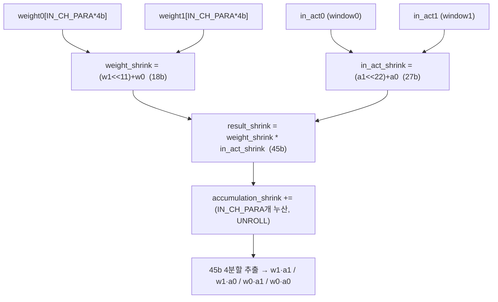
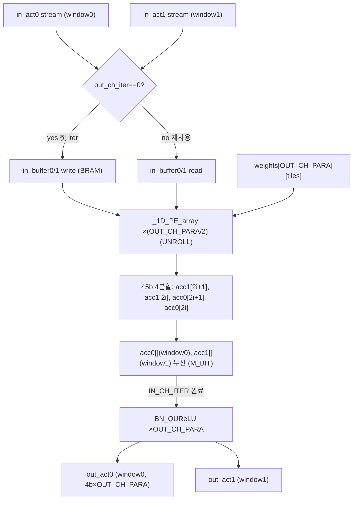
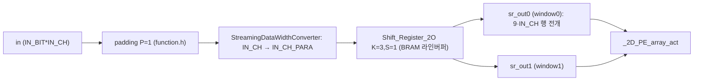
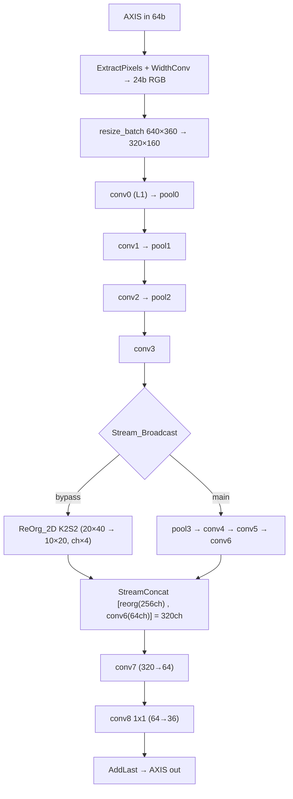
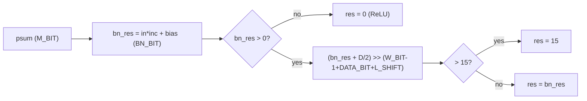
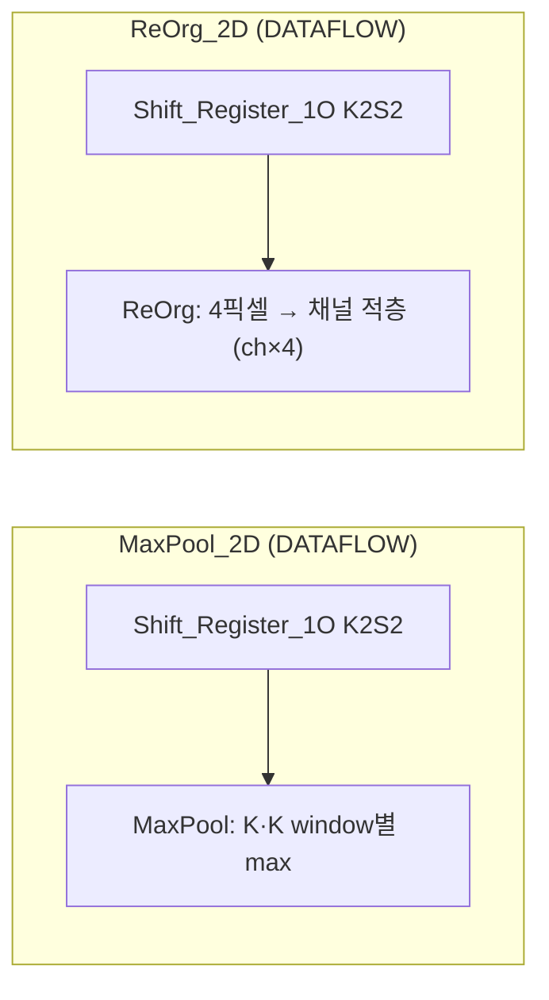
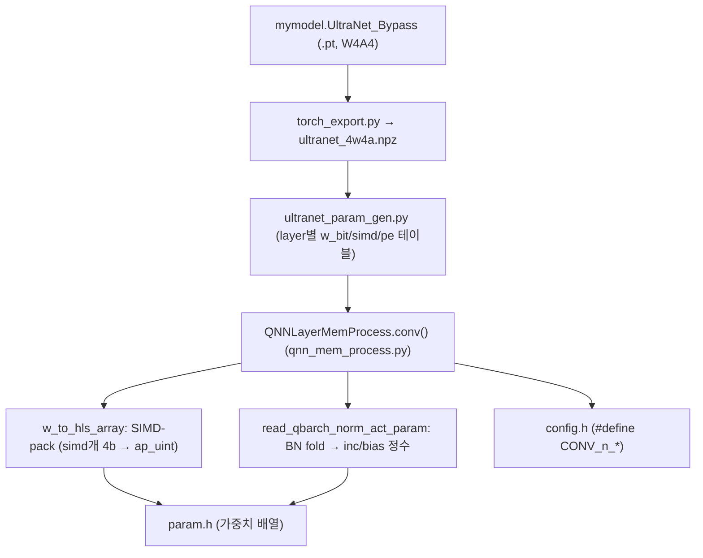

# SJTU_microe 모듈 통합 가이드

> 1차 요약(맥락): [`../SJTU_microe-main.md`](../SJTU_microe-main.md)
> 소스 루트: `REF/CNN-Accel/SJTU_microe-main`. 본 가이드는 **`hls/`** (Vivado HLS C++ 가속기)를 정본으로 삼고, `quantization/`(PyTorch→param.h 생성), `training/`(YOLOv3-tiny 포크 학습), `deploy/`·`script/`(PYNQ 배포)를 보조로 처리한다.
> 표기 규약: 라인으로 직접 확인한 사실은 단정, 코드 정황 기반은 "추정", 코드/문서에 없으면 "확인 불가".
> 제외물(이름만): `hls/param.h`·`quantization/param/hls/param.h`(자동생성 가중치 거대 배열), `*.pt`·`*.npz`·`*.npy`·`*.bin`(바이너리 가중치/입력), `deploy/*.bit`·`*.hwh`·`*.so`(비트스트림/공유라이브러리), `training/utils/{datasets,general,utils,plots,...}`·`training/models/*.yaml`(외부 ultralytics yolov3 학습 포크), `image/rank.png`.

---

## 0. 문서 머리말

### 0.1 대표 케이스 선정 (대표 conv layer)

SJTU_microe는 동일한 `conv3x3_bn_act` 템플릿을 conv0~conv7에 9회 반복 인스턴스화하고, conv8만 `conv1x1`로 처리한다(`top.cpp` L124~L675). 따라서 한 conv layer를 대표로 잡으면 어레이 전체를 설명할 수 있다. 대표 케이스를 **두 개** 잡는다.

- **선형 대표(3x3 conv, 4MUL/DSP)**: **conv2** — IFM `32ch × 40 × 80`, OFM `64ch`, K=3/S=1/P=1, `IN_CH_PARA=8`·`OUT_CH_PARA=8`(`config.h` L43~L62). 채널 병렬이 8×8로 가장 균형 잡혀 있고, 4MUL/DSP 패킹(가중치 2 + 윈도우 2)이 완전 동작하는 표준 layer다. 한 layer의 모든 노브(타일/시프트레지스터/PE 4분할/BN)를 한 번에 커버한다. (확인됨)
- **첫 레이어 대표(L1, 2MUL/DSP)**: **conv0** — IFM `3ch × 160 × 320`(resize 후), OFM `16ch`, `IN_CH_PARA=3`·`OUT_CH_PARA=16`, `IN_BIT=8`(`config.h` L1~L20). 입력 활성이 8-bit라 가중치 패킹을 못 하고 윈도우 2개만 패킹하는 **2MUL/DSP** 전용 경로(`PE_array.h` L193~L346)를 대표한다. (확인됨)

선정 근거: (1) conv2는 4MUL/DSP의 비트영역 4분할(`PE_array.h` L136~L143)이 전부 활성화되는 표준 케이스, (2) conv0는 W4A8(입력만 8-bit) 첫 레이어의 2MUL/DSP 변형을 대표 — 두 케이스로 "DSP 패킹 GEMM"의 양 모드를 모두 커버한다.

### 0.2 수치 표기 규약

- **MAC lanes**: PE 어레이의 동시 곱셈기 수. 본 설계는 **1 DSP48E2 = 4 INT4 곱**(conv1~8) 또는 **2 곱**(conv0, L1)이며, 물리 DSP 수와 INT4-MAC ops/cyc를 구분 표기한다. `physical DSP = IN_CH_PARA × (OUT_CH_PARA/2)`, `MAC ops/cyc = IN_CH_PARA × OUT_CH_PARA × 2`(`PE_array.h` L44~L48 주석).
- **scalar MACs**: 대표 conv의 `K·K·IN_CH·OUT_CH·OFM_ROW·OFM_COL` 곱(im2col GEMM의 M·N·K).
- **loop trips / cycle**: `_2D_PE_array_act`의 `total_iter`(`PE_array.h` L81) = `(IN_CH_ITER × OUT_CH_ITER × OUT_ACT_NUMS / 2) << reps`. `/2`는 2윈도우 동시 처리, `<<reps`는 배치(2^reps).
- **memory size (payload bit)**: 버퍼 배열 깊이 × 폭(bit). on-chip BRAM(in_buffer, shift_reg)별.
- **합성 PPA**: HLS 합성 리포트·utilization은 리포에 미동봉 → 자원/주파수 수치는 **확인 불가**(README.md L3·L27의 측정 결과 70.3% IoU / 249.38 fps / 4.95 W / PL 125 MHz 만 인용).

### 0.3 운영 경로 (training → quantization → HLS → 배포)

```
[training]      YOLOv3-tiny 포크로 UltraNet_Bypass(mymodel.py) W4A4 학습 → .pt
        │       (DoReFa: weight tanh→max정규화→k-1bit, act clamp[0,1]→k bit; quant_ultra.py)
[quantization]  torch_export.py → ultranet_4w4a.npz → ultranet_param_gen.py
        │       → QNNLayerMemProcess(qnn_mem_process.py)로 SIMD-pack + BN fold
        │       → param.h(가중치 ap_uint 배열) + config.h(layer 차원/병렬도) 생성
[HLS]           top.cpp(UltraNet_Bypass) → conv3x3_bn_act ×8 + conv1x1 ×1 (#pragma DATAFLOW)
        │       Vivado HLS C 합성 → RTL → HLS IP export
[Vivado]        script/SoC_bd.tcl 로 block design → bitstream(.bit)+.hwh
[deploy(PYNQ)]  SJTU_microe.ipynb: PS(ARM)에서 8-thread 이미지 로드, batch 64, AXIS DMA로 PL 구동
```
근거: `README.md` L49~L96, `ultranet_param_gen.py` L7~L51, `qnn_mem_process.py` L82~L150, `top.cpp` L41~L701.

### 0.4 타깃 / 데이터타입 / 양자화 정책

- **타깃**: **Xilinx Ultra96 V2**(Zynq UltraScale+ MPSoC, README.md L40). PL 주파수 **125 MHz**(README.md L27). 대회: **DAC-SDC 2021 3위**(README.md L3·L9).
- **데이터타입**: **W4A4**(가중치 4-bit, 활성 4-bit; conv0만 입력 8-bit·W4A8). `config.h`: `*_W_BIT=4` 전 layer, `*_IN_BIT/OUT_BIT=4`(conv0 IN_BIT=8, conv8 OUT psum 32-bit). psum 폭 `M_BIT=24`(3x3), `M_BIT_CONV1x1=32`(`top.cpp` L30·L32).
- **DSP 패킹 정책**: DSP48E2의 27×18 곱을 비트영역 분할해 사용. 가중치 2개를 18-bit 피연산자에(`(w1<<11)+w0`, `PE_array.h` L34), 활성 2개(2 윈도우)를 27-bit 피연산자에(`(a1<<22)+a0`, `PE_array.h` L35) 패킹 → 단일 곱에서 `w0·a0, w0·a1, w1·a0, w1·a1` 4부분곱이 45-bit 안에 비트영역 분리되어 동시 산출. conv0(L1)은 활성 8-bit라 가중치 패킹 불가 → `(a1<<16)+a0`로 윈도우 2개만 패킹(2MUL/DSP, `PE_array.h` L206).
- **합성 PPA**: 확인 불가(리포트 미동봉).

---

## 1. Repo / Layer 개요

| 레이어 | 경로 | 역할 |
|---|---|---|
| **hls** | `hls/*.h, top.cpp` | **가속기 정본**. HLS C++ 템플릿. PE 어레이·conv 래퍼·시프트레지스터·BN/quant·pool/reorg·stream 유틸·top dataflow. |
| **quantization** | `quantization/*.py` | PyTorch 모델 → param.h/config.h 생성. DoReFa 양자화(`quant_ultra.py`), 모델 정의(`mymodel.py`), SIMD-pack/BN-fold 메모리 처리(`qnn_mem_process.py`), 드라이버(`ultranet_param_gen.py`, `torch_export.py`). |
| **training** | `training/*.py` | ultralytics YOLOv3 포크 학습 스크립트. `mymodel.py`(자체 모델)·`quant_dorefa.py`(자체) 외 `utils/`·`models/`는 외부 포크 → 제외. |
| **deploy / script** | `deploy/`, `script/SoC_bd.tcl` | PYNQ 노트북 + 비트스트림 + Vivado block design tcl. `.bit/.hwh/.so/.npy` 제외. |

- README는 루트 1개 + `deploy/readme.md` 1개. 빌드 절차는 루트 README.md L47~L96에 4단계로 명시.
- 자체 HLS 모듈 수: 헤더 8개(`PE_array.h, conv3x3.h, conv1x1.h, shift_reg.h, function.h, maxpool.h, reorg.h, stream_tools.h`) + top 1개(`top.cpp`) + 설정 `config.h`. param.h는 생성물(제외).

### 모듈 인스턴스 계층 (top → leaf)

```
UltraNet_Bypass            (top.cpp:41, #pragma HLS DATAFLOW)
├─ ExtractPixels / StreamingDataWidthConverter_Batch   (stream_tools.h) — AXIS 64b → 24b 픽셀
├─ resize_batch            (function.h:80) — HW 양선형 리사이즈 640×360 → 320×160 (hls_video Resize_opr_linear)
├─ conv3x3_bn_act_L1       (conv3x3.h:102) — conv0 (#pragma DATAFLOW)
│  ├─ padding              (function.h:95)
│  ├─ StreamingDataWidthConverter_Batch (stream_tools.h:176)
│  ├─ Shift_Register_2O    (shift_reg.h:23) — 2픽셀 윈도우 동시 추출
│  └─ _2D_PE_array_act_L1  (PE_array.h:238)
│     └─ _1D_PE_array_L1   (PE_array.h:193) — 2MUL/DSP (윈도우 2개)
├─ Stream_PISO             (stream_tools.h:268) — 2병렬 출력 직렬화
├─ MaxPool_2D              (maxpool.h:63) ┬ Shift_Register_1O (shift_reg.h:128)
│                                          └ MaxPool (maxpool.h:22)
├─ conv3x3_bn_act ×7       (conv3x3.h:40) — conv1~7 (#pragma DATAFLOW)
│  ├─ padding / widthconv / Shift_Register_2O
│  └─ _2D_PE_array_act     (PE_array.h:67)
│     └─ _1D_PE_array      (PE_array.h:19) — 4MUL/DSP (가중치2 × 윈도우2)
│        └─ BN_QUReLU      (function.h:29)
├─ Stream_Broadcast        (stream_tools.h:379) — conv3 출력 2분기 (bypass)
├─ ReOrg_2D                (reorg.h:66) ┬ Shift_Register_1O
│                                        └ ReOrg (reorg.h:24) — space-to-depth K2S2
├─ StreamConcat            (stream_tools.h:362) — reorg + conv6 결합
├─ ExpandDataWidth_PISO    (stream_tools.h:128) — 병렬출력 직렬화 + 폭확장
├─ conv1x1                 (conv1x1.h:31) — conv8 (1x1, psum 32b)
│  └─ _1D_PE_array         (PE_array.h:19) — 4MUL/DSP
└─ AddLast                 (stream_tools.h:496) — AXIS tlast 부착 출력
```

---

## 2. ★ 1D PE: 4MUL/DSP 패킹 MAC 코어 (`PE_array.h`)

### 2.1 역할 + 상위/하위 관계

설계 전체의 핵심. **DSP48E2 1개**를 4개의 INT4 곱으로 쓰는 비트-패킹 MAC. 단일 정수 곱(`weight_shrink * in_act_shrink`)에서 가중치 2개 × 활성 2개 = 4부분곱이 45-bit 결과 안에 비트영역 분리되어 동시 산출된다.
상위: `_2D_PE_array_act`(채널 병렬로 호출), `conv1x1`(1x1 conv). 하위: 없음(HLS가 DSP48E2 프리미티브로 추론).

### 2.2 데이터플로우



### 2.3 인스턴스 계층

`_2D_PE_array_act`(OUT_CH_PARA/2 회 UNROLL, `PE_array.h` L125) → `_1D_PE_array`(IN_CH_PARA 회 UNROLL 누산, `PE_array.h` L27) → DSP48E2 1개.

### 2.4 대표 코드 위치

`hls/PE_array.h` L19~L42(`_1D_PE_array`, 4MUL), L193~L213(`_1D_PE_array_L1`, 2MUL).

### 2.5 대표 코드 블록

(1) **두 가중치를 한 18-bit 피연산자에, 두 활성을 한 27-bit 피연산자에** (`PE_array.h` L34~L38)
```cpp
ap_int<18>  weight_shrink = (ap_int<18>(temp_w1) << 11) + temp_w0;  // 가중치 2개 (w1 상위, w0 하위)
ap_uint<27> in_act_shrink = (ap_uint<27>(temp_in_act1) << 22) + temp_in_act0;  // 활성 2개 (윈도우1, 윈도우0)
ap_int<45> result_shrink  = weight_shrink * in_act_shrink;  // 단일 DSP 곱 → 4부분곱이 45b 안에 분리
accumulation_shrink += result_shrink;
```
→ 시프트 상수 11(가중치 간격)·22(활성 간격)는 W4A4 가드비트 포함 폭에 맞춘 **하드코딩**. 이 비트영역 분리가 4MUL/DSP의 전부다.

(2) **IN_CH_PARA 입력채널 동시 누산** (`PE_array.h` L27~L39)
```cpp
for (unsigned p = 0; p < IN_CH_PARA; p++) {
#pragma HLS UNROLL
    ... // p번째 채널의 w0/w1/a0/a1 추출 후 곱
    accumulation_shrink += result_shrink;   // IN_CH_PARA개 DSP가 병렬, 누산은 가산기 트리
}
```
→ `_1D_PE_array` 1호출 = IN_CH_PARA개 DSP. 4부분곱이 누산되어도 비트영역이 보존되도록 폭(45b)·가드비트가 설계됨(추정: man_bits 분석은 코드 주석에 없음).

(3) **L1(conv0): 활성 8-bit라 가중치 패킹 불가 → 윈도우만 2-pack** (`PE_array.h` L206~L209)
```cpp
ap_uint<27> in_act_shrink = (ap_uint<27>(temp_in_act1) << 16) + temp_in_act0;  // 윈도우 2개만 (간격 16b)
ap_int<45> result_shrink = temp_w * in_act_shrink;  // 가중치는 1개 → 2MUL/DSP
```
→ 활성 8-bit는 8b×2+가드 ≈ 17b 폭을 차지해 가중치 추가 패킹 공간이 없음 → conv0만 2MUL/DSP. 간격이 22→16으로 줄어든 것이 차이.

### 2.6 마이크로아키텍처 + 정량

- **MAC lanes(1D, conv1~8)**: IN_CH_PARA개 DSP × 4곱 = `4·IN_CH_PARA` INT4-MAC/cyc. conv2(IN_CH_PARA=8)면 **32 MAC/cyc/1D호출**.
- **MAC lanes(1D, conv0/L1)**: IN_CH_PARA개 DSP × 2곱 = `2·IN_CH_PARA`. conv0(IN_CH_PARA=3)면 6 MAC/cyc/1D호출.
- **DSP48E2 자원/1D**: IN_CH_PARA개(누산 가산기 별도).
- **병목**: 패킹 비트영역(11/22/16 시프트)이 W4A4 전용 하드코딩 → 비트폭 변경 시 PE 재작성 필요. 4부분곱 누산 시 오버플로 가드비트가 코드 주석에 없어 안전 마진은 **확인 불가**(추정: psum 추출 폭 11b·16b로 캡, L136·L306).

---

## 3. ★ 2D PE 어레이 — 채널 병렬 + 입력 재사용 (`PE_array.h`)

### 3.1 역할 + 상위/하위

`_1D_PE_array`를 `IN_CH_PARA × OUT_CH_PARA` 격자로 펼친 2D 어레이. **IN_CH_PARA 입력채널 × OUT_CH_PARA 출력채널**을 동시 처리하며, 2 윈도우(out_act0/out_act1)를 동시 산출한다. `in_buffer0/1` BRAM으로 입력 활성을 OUT_CH iteration 전체에 재사용(데이터 재사용). 상위: `conv3x3_bn_act`. 하위: `_1D_PE_array`, `BN_QUReLU`.

### 3.2 데이터플로우



### 3.3 인스턴스 계층

`conv3x3_bn_act` → `_2D_PE_array_act`(`#pragma PIPELINE II=1`의 `total_iter` 루프) → `_1D_PE_array` ×(OUT_CH_PARA/2) → DSP48E2.

### 3.4 대표 코드 위치

`hls/PE_array.h` L67~L179(`_2D_PE_array_act`, 4MUL), L238~L346(`_2D_PE_array_act_L1`, 2MUL).

### 3.5 대표 코드 블록

(1) **입력 재사용: OUT_CH 첫 iteration에만 stream read, 이후 BRAM 재사용** (`PE_array.h` L103~L112)
```cpp
if (out_ch_iter_cnt == 0) {            // 출력채널 첫 패스: stream에서 읽고 버퍼에 저장
    temp_in_act0 = in_act0.read();  temp_in_act1 = in_act1.read();
    in_buffer0[in_ch_iter_cnt] = temp_in_act0;  in_buffer1[in_ch_iter_cnt] = temp_in_act1;
} else {                                // 이후 출력채널: 버퍼에서 재사용
    temp_in_act0 = in_buffer0[in_ch_iter_cnt];  temp_in_act1 = in_buffer1[in_ch_iter_cnt];
}
```
→ 입력 활성을 OUT_CH_ITER번 재사용 → stream 대역폭을 `1/OUT_CH_ITER`로 축소(weight-stationary 아닌 **input-reuse** 데이터플로우).

(2) **OUT_CH 병렬 + 45b 결과 4분할 추출** (`PE_array.h` L125~L143)
```cpp
for(unsigned i = 0 ; i < (OUT_CH_PARA/2) ; i++){
#pragma HLS UNROLL
    ap_int<45> acc_shrink = _1D_PE_array<...>( weights[2*i][index], weights[2*i+1][index], temp_in_act0, temp_in_act1 );
    ap_int<11> acc_temp_11 = acc_shrink(43, 33) + acc_shrink[32];  acc1[2*i+1] += acc_temp_11;  // w1·a1
    ap_int<11> acc_temp_10 = acc_shrink(32, 22) + acc_shrink[21];  acc1[2*i]   += acc_temp_10;  // w0·a1
    ap_int<11> acc_temp_01 = acc_shrink(21, 11) + acc_shrink[10];  acc0[2*i+1] += acc_temp_01;  // w1·a0
    ap_int<11> acc_temp_00 = acc_shrink(10, 0);                    acc0[2*i]   += acc_temp_00;  // w0·a0
}
```
→ `acc0[]`=윈도우0, `acc1[]`=윈도우1. 비트영역 경계의 `+ acc_shrink[하위캐리]`는 4부분곱이 인접 영역으로 carry 넘침을 round-back 보정.

(3) **IN_CH 완료 시 BN+양자화 후 2윈도우 동시 write** (`PE_array.h` L158~L165)
```cpp
for(unsigned i = 0 ; i < OUT_CH_PARA ; i++){
#pragma HLS UNROLL
    out_buffer0(...) = BN_QUReLU<...>(acc0[i], inc[i][out_ch_iter_cnt], bias[i][out_ch_iter_cnt]);
    out_buffer1(...) = BN_QUReLU<...>(acc1[i], inc[i][out_ch_iter_cnt], bias[i][out_ch_iter_cnt]);
}
out_act0.write(out_buffer0);  out_act1.write(out_buffer1);
```

(4) **L1(2MUL): 윈도우만 2분할** (`PE_array.h` L296~L309)
```cpp
for(unsigned i = 0 ; i < OUT_CH_PARA ; i++){   // OUT_CH_PARA 전체 (÷2 아님)
#pragma HLS UNROLL
    ap_int<45> acc_shrink = _1D_PE_array_L1<...>( weights[i][index], temp_in_act0, temp_in_act1 );
    ap_int<16> acc_temp_1 = acc_shrink(31, 16) + acc_shrink[15];  acc1[i] += acc_temp_1;  // window1
    ap_int<16> acc_temp_0 = acc_shrink(15, 0);                    acc0[i] += acc_temp_0;  // window0
}
```

### 3.6 마이크로아키텍처 + 정량 (대표 conv2)

- **PE 격자(conv2)**: IN_CH_PARA=8 × OUT_CH_PARA=8. 물리 DSP = `8 × (8/2) = 32 DSP`. MAC ops/cyc = `8 × 8 × 2 = 128`(4MUL/DSP라 32 DSP × 4 = 128). (`config.h` L53~L54, `PE_array.h` L44~L48)
- **loop trips(conv2)**: `IN_CH_ITER = 9·32/8 = 36`, `OUT_CH_ITER = 64/8 = 8`, `OUT_ACT_NUMS = 40·80 = 3200` → `total_iter = 36·8·3200/2 = 460,800` cyc (배치 1, `PE_array.h` L79~L81).
- **scalar MACs(conv2)**: `9 × 32 × 64 × 40 × 80 = 58,982,400` MAC.
- **검산**: 460,800 cyc × 128 MAC/cyc = 58,982,400 → scalar MAC와 정확히 일치(2윈도우·4MUL 패킹이 손실 없이 GEMM을 채움). (확인됨)
- **memory(conv2 in_buffer)**: `in_buffer0/1` 각 깊이 IN_CH_ITER=36 × 폭 IN_CH_PARA·IN_BIT=32b = 1,152 bit/버퍼 × 2 = **2,304 bit/PE-array** (RAM_S2P_BRAM, `PE_array.h` L84~L87).
- **layer별 병렬도 표**(`config.h`, `IN_CH_PARA × OUT_CH_PARA`):

| layer | IN_CH_PARA | OUT_CH_PARA | 물리 DSP | MAC ops/cyc | MUL/DSP |
|---|---|---|---|---|---|
| conv0(L1) | 3 | 16 | 3×16=48 | 3×16×2=96 | 2 |
| conv1 | 8 | 8 | 8×4=32 | 128 | 4 |
| conv2 | 8 | 8 | 32 | 128 | 4 |
| conv3 | 8 | 4 | 8×2=16 | 64 | 4 |
| conv4/5/6 | 4 | 2 | 4×1=4 | 16 | 4 |
| conv7 | 10 | 4 | 10×2=20 | 80 | 4 |
| conv8(1x1) | 1 | 2 | 1×1=1 | 4 | 4 |

(conv4~6은 IFM 10×20으로 작아 병렬도를 낮춰 DSP 절약 — dataflow 균형. `config.h` L85~L146)
- **병목**: conv4~6의 OUT_CH_PARA=2(물리 4 DSP)는 latency가 길지만 IFM 면적이 작아 전체 dataflow 균형엔 유리. 어레이는 layer별 **재합성으로만** 병렬도 변경 가능(파라미터가 컴파일타임 상수).

---

## 4. 슬라이딩 윈도우 — im2col형 행 전개 (`conv3x3.h`, `shift_reg.h`)

### 4.1 역할 + 상위/하위

`conv3x3_bn_act`는 한 conv layer를 `#pragma HLS DATAFLOW`로 padding → 폭변환 → 시프트레지스터 → 2D PE 어레이로 파이프라인한다. `Shift_Register_2O`는 BRAM 기반 라인버퍼로 K×K 윈도우를 **2개 동시(2픽셀)** 추출 → PE 어레이의 2윈도우 패킹과 정합. 상위: top.cpp. 하위: `_2D_PE_array_act`.

### 4.2 데이터플로우



### 4.3 인스턴스 계층

`conv3x3_bn_act`(conv3x3.h:40) → {`padding`(function.h:95), `StreamingDataWidthConverter_Batch`(stream_tools.h:176), `Shift_Register_2O`(shift_reg.h:23), `_2D_PE_array_act`(PE_array.h:67)}.

### 4.4 대표 코드 위치

`hls/conv3x3.h` L40~L75(표준), L102~L136(L1). `hls/shift_reg.h` L23~L113(2출력).

### 4.5 대표 코드 블록

(1) **conv layer = 4단 DATAFLOW** (`conv3x3.h` L49~L74)
```cpp
#pragma HLS DATAFLOW
padding<IN_ROW, IN_COL, IN_CH, IN_BIT, 1>(in, padding_out, reps);
StreamingDataWidthConverter_Batch<IN_CH*IN_BIT, IN_CH_PARA*IN_BIT, INTER_ROW*INTER_COL>(padding_out, adj_out, reps);
Shift_Register_2O<3, 1, INTER_ROW, INTER_COL, IN_CH, IN_BIT, IN_CH_PARA>(adj_out, sr_out0, sr_out1, reps);
_2D_PE_array_act<9*IN_CH, OUT_CH, ...>(sr_out0, sr_out1, weights, inc, bias, out0, out1, reps);
```
→ `MAT_ROW = 9*IN_CH`(`conv3x3.h` L73)가 K×K×IN_CH를 한 차원으로 펼친 **im2col 행 전개** — 3x3 conv를 `[9·IN_CH] × [OUT_CH]` GEMM으로 변환. ViT GEMM 매핑성의 직접 근거.

(2) **2픽셀 윈도우 동시 추출 (BRAM 라인버퍼)** (`shift_reg.h` L68~L92)
```cpp
if(buf_len == BUF_SIZE) {              // 라인버퍼 충만 시
    for(unsigned i=0; i < K; i++) for(unsigned j=0; j < K; j++) for(unsigned c=0; c < IN_CH_ITER; c++){
#pragma HLS PIPELINE II = 1
        unsigned temp_pointer0 = (buf_pointer + (i*IN_COL*IN_CH_ITER) + (j*IN_CH_ITER) + c);          // 윈도우0
        unsigned temp_pointer1 = (buf_pointer + (i*IN_COL*IN_CH_ITER) + ((j+S)*IN_CH_ITER) + c);      // 윈도우1 (+S)
        out0.write(shift_reg[temp_pointer0]);  out1.write(shift_reg[temp_pointer1]);
    }
}
```
→ 윈도우0/1이 stride S만큼 어긋난 2픽셀. 추출 순서가 (CH, inner_window, window) → PE 어레이 MAT_ROW 순서와 정합(주석 shift_reg.h L13~L15). BRAM 크기 `BUF_SIZE = ((K-1)·IN_COL + K + S)·IN_CH_ITER`(L41).

### 4.6 마이크로아키텍처 + 정량 (conv2)

- **라인버퍼(conv2, K=3,S=1,INTER_COL=82,IN_CH_ITER=4)**: `BUF_SIZE = (2·82 + 4)·4 = 672` 워드 × 32b = **21,504 bit** (RAM_2P, shift_reg.h L42~L43).
- **출력 행 폭**: MAT_ROW = 9·IN_CH = 9·32 = 288(im2col 한 행), MAT_COL = OUT_CH = 64.
- **2픽셀 동시**: COL_STEPS가 `/2`(shift_reg.h L35) → 출력 폭이 짝수여야 함(IFM_COL 짝수 가정).
- **병목**: BRAM 라인버퍼가 layer마다 별도(DATAFLOW 파이프). IFM_COL이 클수록 라인버퍼 BRAM 증가(conv0 INTER_COL=322 → BUF≈2·322·1=646 워드).

---

## 5. Top Dataflow + Bypass 모듈 (`top.cpp`)

### 5.1 역할 + 상위/하위

`UltraNet_Bypass`가 AXIS 입력→전처리(extract/resize)→conv0~8→AXIS 출력 전체를 `#pragma HLS DATAFLOW` 단일 IP로 묶는다. 핵심 차별점은 **bypass 모듈**: conv3 출력을 broadcast해 한쪽은 reorg(space-to-depth), 다른쪽은 pool→conv4~6 후 둘을 concat → 얕은+깊은 feature 결합(소형 객체 정확도 65.6%→70.3%, README.md L17). 상위: AXIS IP. 하위: 모든 conv/pool/reorg/stream 모듈.

### 5.2 데이터플로우



### 5.3 인스턴스 계층

§1 계층도 참조. conv0=`conv3x3_bn_act_L1`, conv1~7=`conv3x3_bn_act`, conv8=`conv1x1`. 각 conv 뒤 `Stream_PISO`(또는 `ExpandDataWidth_PISO`)로 2병렬→직렬 변환.

### 5.4 대표 코드 위치

`hls/top.cpp` L41~L116(전처리), L413~L595(bypass), L658~L699(conv8+출력).

### 5.5 대표 코드 블록

(1) **bypass 분기: broadcast → reorg + main 경로** (`top.cpp` L413~L435)
```cpp
// conv3 --> maxpool3 --> ... --> conv6
//   | bypass                      |
//  reorg ----------------------> concat --> conv7
Stream_Broadcast<CONV_3_OUT_BIT*CONV_3_OUT_CH_PARA, numData3>(conv_3_out_serial, pool_3_in, reorg_in, reps);
ReOrg_2D<CONV_3_OFM_ROW, CONV_3_OFM_COL, CONV_3_OFM_CH, CONV_3_OUT_CH_PARA, CONV_3_OUT_BIT>(reorg_in, reorg_out, reps);
```
→ conv3 출력(64ch, 20×40)을 2분기. reorg는 K2S2 space-to-depth로 `64ch → 256ch, 10×20`로 변환(공간→채널).

(2) **concat: reorg(256ch) + conv6(64ch) = 320ch** (`top.cpp` L591~L595)
```cpp
StreamConcat<CONV_3_OUT_BIT*CONV_3_OFM_CH*4, CONV_6_OUT_BIT*CONV_6_OFM_CH, CONV_6_OFM_ROW*CONV_6_OFM_COL>
(reorg_out, conv_6_out_serial_expand, concat_out, reps);
```
→ conv7의 IFM_CH=320 = 256(reorg) + 64(conv6) (`config.h` L152와 정합). `mymodel.py` L128 `conv2d_q(320, 64, ...)`와 동일.

(3) **2병렬 출력 직렬화** (`top.cpp` L169~L172)
```cpp
Stream_PISO< CONV_0_OUT_BIT*CONV_0_OUT_CH_PARA, numData0/2, CONV_0_OFM_CH/CONV_0_OUT_CH_PARA >
(conv_0_out0, conv_0_out1, conv_0_out_serial, reps);
```
→ PE 어레이의 out_act0/out_act1(2윈도우)을 채널-인터리브 직렬 스트림으로 합침(stream_tools.h L268~L296의 IN_CH_ITER 블록 단위 교차).

(4) **conv8 1x1 + AXIS tlast 출력** (`top.cpp` L658~L699)
```cpp
conv1x1< CONV_8_IFM_ROW, ..., M_BIT_CONV1x1, CONV_8_IN_CH_PARA, CONV_8_OUT_CH_PARA >
(conv_8_in0, conv_8_in1, conv_8_w, conv_8_out0, conv_8_out1, reps);   // psum 32b, BN/quant 없음 (raw 출력)
AddLast<CONV_8_OFM_ROW*CONV_8_OFM_COL*CONV_8_OFM_CH/CONV_8_OUT_CH_PARA>(conv_8_out_serial, out, reps);
```
→ conv8은 BN_QUReLU 없이 32-bit psum을 그대로 출력(YOLO 헤드 raw logit). 후처리(sigmoid/anchor)는 PS에서.

### 5.6 마이크로아키텍처 + 정량

- **입력**: AXIS 64b. 전처리 단위 `num_per_rep = 360·640·3·8/64 = 86,400` 워드(`top.cpp` L87).
- **resize**: 640×360 → 320×160, hls_video `Resize_opr_linear`(function.h L71). 양선형.
- **레이어 차원 흐름**(`config.h`): 320×160(conv0) → pool → 160×80(conv1) → 80×40(conv2) → 40×20(conv3) → [bypass] → 20×10(conv4~7) → conv8 출력 20×10×36.
- **scalar MAC 합계(추정, conv0~7 3x3 + conv8 1x1)**: conv0 9·3·16·160·320≈22.1M, conv1 9·16·32·80·160≈58.9M, conv2 58.9M, conv3 9·64·64·20·40≈29.5M, conv4/5/6 각 9·64·64·10·20≈7.4M, conv7 9·320·64·10·20≈36.9M, conv8 1·64·36·10·20≈0.46M → **합계 약 236 MMAC/frame**(추정, 라운딩).
- **출력**: 20×10×36 = 7,200 값, 36ch = anchor 6 × (xywh+obj) 6(`mymodel.py` L30·L135 `na=6, no=6`).
- **병목**: 전체가 단일 DATAFLOW IP → layer 간 stream FIFO 깊이(top.cpp의 `depth=256/512`)가 백프레셔 좌우. bypass의 reorg_out FIFO depth=512(L425)가 가장 큼(conv4~6 latency 흡수용).

---

## 6. BN + 양자화 ReLU (`function.h`)

### 6.1 역할 + 상위/하위

PE 어레이 출력단에서 BatchNorm을 정수 곱+가산으로 fold한 뒤 DoReFa식 균일 양자화 ReLU로 4-bit [0,15] 출력. 상위: `_2D_PE_array_act`. 하위: 없음.

### 6.2 데이터플로우



### 6.3 대표 코드 위치

`hls/function.h` L29~L54(`BN_QUReLU`), L64~L85(`resize`/`resize_batch`), L95~L136(`padding`).

### 6.4 대표 코드 블록

(1) **BN fold + 라운딩 시프트 양자화 + ReLU 클램프** (`function.h` L33~L52)
```cpp
const unsigned D = 1 << (W_BIT - 1 + DATA_BIT + L_SHIFT);   // 라운딩 상수
ap_int<BN_BIT> bn_res = in * inc + bias;                    // BN: inc=gamma/sqrt(var) 정수화, bias=정수화
if (bn_res > 0) {
    bn_res = (bn_res + (D >> 1)) >> (W_BIT - 1 + DATA_BIT + L_SHIFT);   // 우측시프트 = scale-down 양자화
    res = (bn_res > 15) ? 15 : bn_res;                                  // 4-bit [0,15] 클램프
} else res = 0;                                                         // ReLU
```
→ `inc`(=BN scale)·`bias`는 quantization 단계에서 정수화되어 param.h에 상수로 export(`qnn_mem_process.py` L119~L126). 시프트량 `W_BIT-1+DATA_BIT+L_SHIFT = 4-1+4+8 = 15`(conv1~7 W4A4 기준).

### 6.5 마이크로아키텍처 + 정량

- **inc/bias 폭(자동 결정)**: `get_inc_bit_width`/`get_bias_bit_width`(qnn_mem_process.py L222~L233)가 layer별 abs_max로 산정 → config.h의 `INC_BIT`(conv2=12), `BIAS_BIT`(conv2=21).
- **psum 폭**: 3x3 M_BIT=24, BN_BIT=40(top.cpp L30~L31). 1x1 M_BIT=32.
- **L_SHIFT=8** 전 layer(`config.h`, `mymodel`의 act range [0,1] → 정수 스케일 보정).
- **병목**: BN이 정수 곱 1개로 fold되어 추가 DSP 거의 불요(LUT 곱 추정). 양자화가 출력단에서 즉시 4-bit → layer 간 대역폭 최소(README.md L23 "reduce bandwidth").

---

## 7. Pool / ReOrg / Stream 유틸 (`maxpool.h`, `reorg.h`, `stream_tools.h`)

### 7.1 역할 + 상위/하위

데이터플로우 접착제. MaxPool(K2S2 다운샘플), ReOrg(K2S2 space-to-depth, bypass용), 그리고 폭변환/직렬화/broadcast/concat 등 stream 유틸. 상위: top.cpp. 하위: `Shift_Register_1O`(pool/reorg가 공용).

### 7.2 데이터플로우



### 7.3 인스턴스 계층

`MaxPool_2D`(maxpool.h:63) → {`Shift_Register_1O`, `MaxPool`}. `ReOrg_2D`(reorg.h:66) → {`Shift_Register_1O`, `ReOrg`}.

### 7.4 대표 코드 위치

`hls/maxpool.h` L22~L80, `hls/reorg.h` L24~L83, `hls/stream_tools.h`(유틸 다수).

### 7.5 대표 코드 블록

(1) **MaxPool: K·K 윈도우 채널별 최대** (`maxpool.h` L37~L49)
```cpp
for (unsigned c = 0; c < IN_CH_PARA; c++) {
#pragma HLS UNROLL
    ap_uint<IN_BIT> temp = temp_in((c+1)*IN_BIT-1, c*IN_BIT);
    result((c+1)*IN_BIT-1, c*IN_BIT) = (temp > result(...)) ? temp : result(...);  // running max
}
if(++k_cnt == K*K) { out.write(result); result = 0; k_cnt = 0; }   // 4픽셀마다 출력
```

(2) **ReOrg: space-to-depth (bypass의 핵심)** (`reorg.h` L38~L51)
```cpp
result( ((k_cnt*IN_CH + (ch_cnt+1)*IN_CH_PARA)*IN_BIT -1), ((k_cnt*IN_CH + ch_cnt*IN_CH_PARA)*IN_BIT) ) = temp_in;
k_cnt++;
if(k_cnt == K*K) { k_cnt = 0; ch_cnt++; }
if(ch_cnt == (IN_CH/IN_CH_PARA)) { out.write(result); ch_cnt = 0; }   // 4·IN_CH 폭으로 출력
```
→ 2×2 공간블록을 채널축으로 적층 → 해상도 1/2, 채널 ×4. shift_reg와 동일 순서로 정렬(reorg.h L40 주석).

(3) **broadcast / concat / PISO 직렬화** (`stream_tools.h` L362~L391, L268~L296)
```cpp
void StreamConcat(...) { buffer((InStream0W-1),0)=in0.read(); buffer(...,InStream0W)=in1.read(); out.write(buffer); }
void Stream_Broadcast(...) { buffer=in.read(); out0.write(buffer); out1.write(buffer); }
```

### 7.6 마이크로아키텍처 + 정량

- **MaxPool/ReOrg 라인버퍼**: `Shift_Register_1O` BUF_SIZE = `((K-1)·IN_COL + K)·IN_CH_ITER`(shift_reg.h L145). conv3 pool3(K2,INTER_COL=40,IN_CH_ITER=16) → `(1·40+2)·16 = 672` 워드 × 16b = 10,752 bit.
- **ReOrg 출력 폭**: 4·IN_CH·IN_BIT = 4·64·4 = 1024b(conv3 OFM 64ch).
- **stream 유틸**: 폭변환(`StreamingDataWidthConverter_Batch` L176)이 reduce/equal/expand 3분기로 임의 폭 정합 — DATAFLOW 단계 간 폭 불일치 흡수.
- **병목**: pool/reorg가 각각 별도 라인버퍼 BRAM + Shift_Register_1O 인스턴스 → bypass 경로는 reorg + pool3 두 라인버퍼가 동시 상주.

---

## 8. 양자화 → param.h 생성 파이프라인 (`quantization/`)

### 8.1 역할 + 상위/하위

PyTorch(DoReFa W4A4)로 학습한 UltraNet_Bypass를 HLS 상수(param.h: 가중치 ap_uint 배열, config.h: layer 차원/병렬도)로 변환. 상위: 빌드 흐름. 하위: HLS PE 어레이가 소비하는 가중치/BN 상수 포맷.

### 8.2 데이터플로우



### 8.3 대표 코드 위치

`quantization/quant_ultra.py`(DoReFa), `quantization/mymodel.py`(모델), `quantization/ultranet_param_gen.py`(드라이버), `quantization/qnn_mem_process.py`(SIMD-pack/BN fold).

### 8.4 대표 코드 블록

(1) **DoReFa 가중치/활성 양자화** (`quant_ultra.py` L45~L50, L65)
```python
# weight: tanh 정규화 → max로 [-1,1] → (w_bit-1)bit (부호 1bit 포함)
weight = torch.tanh(x);  weight = weight / torch.max(torch.abs(weight));  weight_q = self.uniform_q(weight)
# activation: clamp[0,1] → a_bit 균일 (unsigned)
activation_q = self.uniform_q(torch.clamp(x, 0, 1))
```

(2) **BN fold: gamma/sqrt(var) → [-1,1] 양자화** (`quant_ultra.py` L103~L111)
```python
w = gamma / (torch.sqrt(var) + eps)
b = bias - (mean / (torch.sqrt(var) + eps)) * gamma
w = torch.clamp(w, -1, 1) / 2 + 0.5;  w_q = 2 * self.quantize_fn(w) - 1
b = torch.clamp(b, -1, 1) / 2 + 0.5;  b_q = 2 * self.quantize_fn(b) - 1
```
→ HLS `BN_QUReLU`의 inc(=w_q 정수화)·bias(=b_q 정수화) 상수의 출처. (function.h L38과 대응)

(3) **layer별 SIMD/PE 테이블** (`ultranet_param_gen.py` L8~L13)
```python
# conv      0   1   2   3   4   5   6   7   8
w_bit   =  [4,  4,  4,  4,  4,  4,  4,  4,  4]
in_bit  =  [8,  4,  4,  4,  4,  4,  4,  4,  4]
simd    =  [3,  8,  8,  8,  4,  4,  4, 10,  1]   # = IN_CH_PARA
pe      =  [16, 8,  8,  4,  2,  2,  2,  4,  2]   # = OUT_CH_PARA
```
→ config.h의 `IN_CH_PARA`/`OUT_CH_PARA`와 정확히 일치(검증됨). simd가 곧 DSP 패킹 폭(`ap_uint<simd·w_bit>`).

(4) **가중치 SIMD-pack: simd개 4b를 한 정수로** (`qnn_mem_process.py` L82~L116)
```python
def w_to_hls_array(self, w):
    res0[out_ch][i] = array_to_string(w[out_ch][i*simd:(i+1)*simd], self.w_bit)  # simd개 4b → 정수
    ... # 이후 pe × tiles 2D 배열로 재배치 (OUT_CH_PARA × W_TILES)
```
→ HLS PE 어레이가 받는 `weights[OUT_CH_PARA][tiles]` (ap_uint<IN_CH_PARA·W_BIT>) 포맷 생성. array_to_string은 음수를 2's complement로(L16~L21).

### 8.5 마이크로아키텍처 + 정량

- **모델 구조**(`mymodel.py` L88~L134): layers_p1(conv0~2 + pool ×3) → layers_p2(conv3) → [reorg ‖ layers_p3(pool+conv4~6)] → cat(320) → layers_p4(conv7 + conv8 1x1). YOLO head 36ch.
- **W_TILES(가중치 타일 수)**: config.h conv2 W_TILES=288 = (9·32/8)·(64/8) = 36·8 = 288(검증).
- **A_TILES**: conv2=8 = OUT_CH/OUT_CH_PARA = 64/8.
- **마지막 layer 예외**: conv8은 BN 없이 가중치만 export(`last_conv`, qnn_mem_process.py L152~L171), bias는 별도 `last_bias.bin`(PS 후처리용).
- **병목/한계**: layer별 simd/pe·차원이 모두 컴파일타임 상수 → 모델 변경 시 param.h/config.h 재생성 + HLS 재합성 필수. DoReFa는 activation을 [0,1] clamp → ViT의 음수 활성(LayerNorm 후)엔 부적합(추정, 재설계 필요).

---

## 9. 한눈 표 (모듈 × 6요소 요약)

| # | 모듈 | 파일:라인 | 역할 | 핵심 노브 | 대표 정량 | 병목 |
|---|---|---|---|---|---|---|
| 2 | `_1D_PE_array` | PE_array.h:19 | 4MUL/DSP 패킹 MAC | 시프트 11/22(W4A4) | 4·IN_CH_PARA MAC/cyc | W4A4 하드코딩 |
| 2 | `_1D_PE_array_L1` | PE_array.h:193 | 2MUL/DSP (conv0) | 시프트 16(A8) | 2·IN_CH_PARA MAC/cyc | 활성8b로 가중치 비패킹 |
| 3 | `_2D_PE_array_act` | PE_array.h:67 | 채널 2D 병렬 + 입력재사용 | IN_CH_PARA×OUT_CH_PARA, II=1 | conv2: 32 DSP, 128 MAC/cyc | layer별 재합성 |
| 4 | `conv3x3_bn_act` | conv3x3.h:40 | conv layer (im2col GEMM) | MAT_ROW=9·IN_CH, DATAFLOW | conv2: 460,800 cyc | 라인버퍼 BRAM/layer |
| 4 | `Shift_Register_2O` | shift_reg.h:23 | 2픽셀 윈도우 라인버퍼 | K,S,BUF_SIZE | conv2: 672워드×32b | IFM_COL↑→BRAM↑ |
| 5 | `UltraNet_Bypass` | top.cpp:41 | top dataflow + bypass | broadcast/reorg/concat | ~236 MMAC/frame | 단일 DATAFLOW FIFO |
| 5 | `ReOrg`(bypass) | reorg.h:24 | space-to-depth (소형객체) | K2S2, ch×4 | conv3: 64→256ch | reorg+pool 라인버퍼 동시 |
| 6 | `BN_QUReLU` | function.h:29 | BN fold + 4b 양자화 ReLU | L_SHIFT=8, [0,15] | inc/bias 정수 fold | (경량) |
| 6 | `resize` | function.h:64 | HW 양선형 리사이즈 | 640×360→320×160 | hls_video | (1회/frame) |
| 7 | `MaxPool_2D` | maxpool.h:63 | K2S2 다운샘플 | 채널별 running max | 4픽셀→1 | 라인버퍼 |
| 8 | `qnn_mem_process` | qnn_mem_process.py:82 | SIMD-pack + BN fold export | simd/pe 테이블 | conv2 W_TILES=288 | 모델 고정(재합성) |

---

## 10. 읽기 순서 (추천)

1. **`config.h`** (L1~L186) — 9개 layer의 차원/병렬도/비트 한눈에. 대표 conv2(L43)·conv0(L1) 먼저.
2. **`PE_array.h`** L19~L42(`_1D_PE_array`, 4MUL 핵심) → L67~L179(`_2D_PE_array_act`, 채널병렬+재사용) → L193~L346(L1 변형).
3. **`conv3x3.h`** L40~L75 + **`shift_reg.h`** L23~L113 — im2col 행 전개·2픽셀 윈도우.
4. **`function.h`** L29~L54(BN_QUReLU) — 양자화 출력단.
5. **`top.cpp`** L41~L116(전처리) → L413~L595(bypass) → L658~L701(출력) — 전체 dataflow.
6. **`maxpool.h`/`reorg.h`/`stream_tools.h`** — 접착제.
7. **`quantization/`**: `mymodel.py`(모델) → `quant_ultra.py`(DoReFa) → `ultranet_param_gen.py`+`qnn_mem_process.py`(export).

---

## 11. 병목 · 노브 (ViT GEMM 매핑성 관점 포함)

### 11.1 정적 병목 (코드 근거)

- **W4A4 비트영역 하드코딩**: 시프트 11/22/16(`PE_array.h` L34·L35·L206)이 4-bit 전용. 8-bit·혼합정밀로 확장 시 PE 재작성 필요. 4부분곱 누산 가드비트가 11b/16b 추출 폭(L136/L306)으로 캡되어, 큰 IN_CH_ITER에서 psum 오버플로 마진은 코드상 명시 없음 → **확인 불가**(추정: 라운드-백 캐리 `+acc_shrink[하위]`로 일부 보정).
- **컴파일타임 고정 병렬도**: 모든 layer의 IN_CH_PARA/OUT_CH_PARA·차원이 `#define`(config.h)·template 상수 → 모델 변경 = param.h 재생성 + HLS 재합성. 런타임 재구성 불가.
- **layer별 BRAM 라인버퍼**: 각 conv/pool/reorg가 별도 라인버퍼(shift_reg.h) → DATAFLOW로 layer 동시 상주 → BRAM 압박(특히 bypass에서 reorg+pool3 병존). 합성 BRAM 수치는 **확인 불가**.
- **저클럭(125 MHz)**: PS 보조(8-thread 로드, batch 64)에 맞춘 의도적 저클럭(README.md L27). 고클럭 타이밍 마진 미활용.

### 11.2 ViT/Transformer + XR 시사점

- **2D PE 어레이 + 입력 재사용 버퍼**(`PE_array.h` L67~L112)는 ViT GEMM(Q·Kᵀ, attn·V, FFN)에 **가장 직접 매핑** 가능. IN_CH_PARA/OUT_CH_PARA를 토큰차원/특징차원 타일로 재해석하면 그대로 systolic-유사 GEMM 타일. HG-PIPE의 output-stationary 설계와 정합. 단, 본 설계는 **input-reuse**(in_buffer)라 weight-stationary가 필요한 ViT 큰 가중치 행렬엔 가중치 재사용 버퍼 추가가 유리(추정).
- **im2col 행 전개(MAT_ROW=9·IN_CH)**(`conv3x3.h` L73): ViT는 이미 GEMM이라 시프트레지스터(§4)를 건너뛰고 곧장 PE 어레이 행에 토큰 패치를 매핑 가능 → CNN보다 ViT가 이 어레이에 **더 잘 맞음**. shift_reg/padding 단을 토큰 임베딩 로더로 대체.
- **4MUL/DSP 패킹**(`PE_array.h` L34~L37): W4A4 ViT 저비트 GEMM의 DSP 밀도 4× 향상 후보. 단 ViT는 음수 활성(LayerNorm/GELU 후) → 본 설계의 unsigned 활성 패킹(`ap_uint<27>`)을 부호 있는 패킹으로 재설계 필요(추정). UINT-packing 계열 기법과 결합 검토.
- **HW resize 전처리**(`function.h` L64): XR 카메라 원본 → ViT 패치 해상도 다운스케일을 PL에서 처리(hls_video). XR 파이프라인 전처리 템플릿.
- **DoReFa + BN-fold export**(`quant_ultra.py` L103~L111, `qnn_mem_process.py` L82~L150): 양자화 학습 → HLS 정수상수 export 파이프라인 템플릿으로 재사용 가능. 단 **LayerNorm fold·음수 활성**은 본 BN_QUReLU([0,15] clamp)로 표현 불가 → ViT용 별도 정규화/양자화 모듈 필요(추정).
- **bypass(reorg+concat)**(`top.cpp` L413~L595): 멀티스케일 feature 결합 패턴 — ViT의 멀티스케일/하이브리드(CNN+ViT) 백본에서 PL 내 feature 병합 dataflow 참고 가능.
