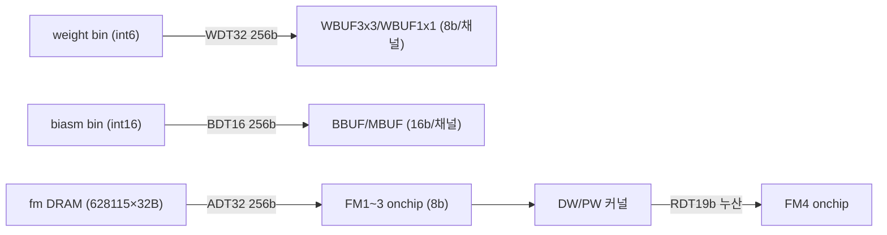
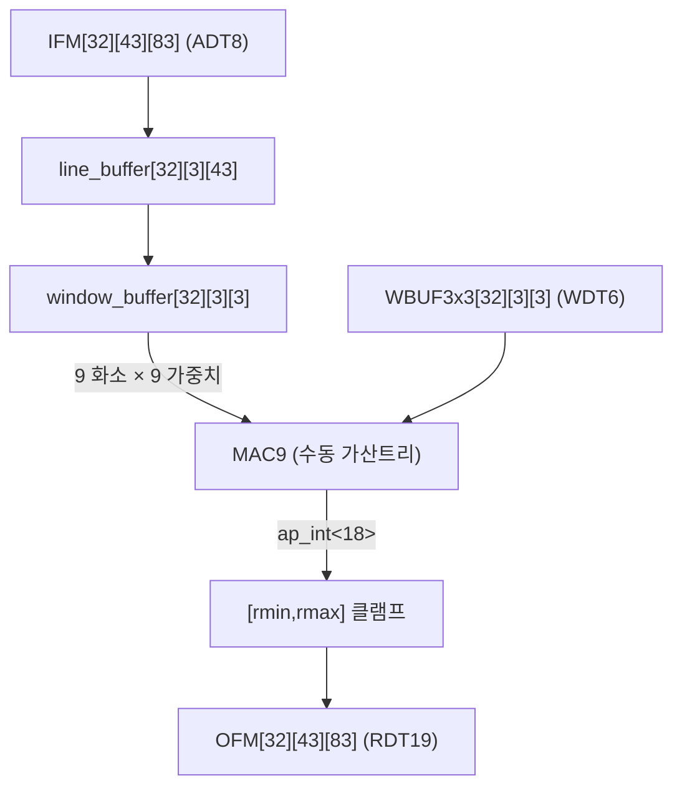
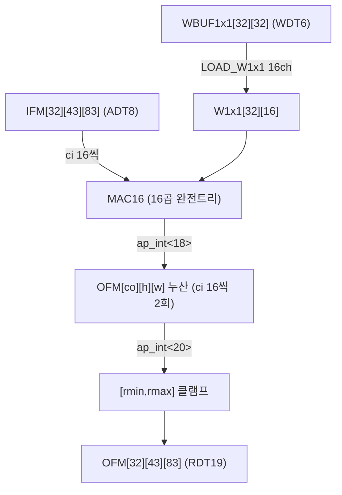
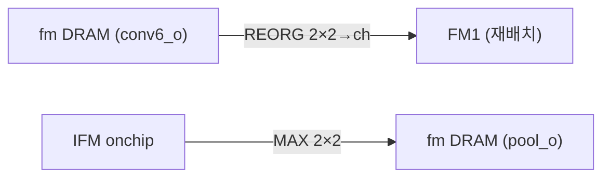
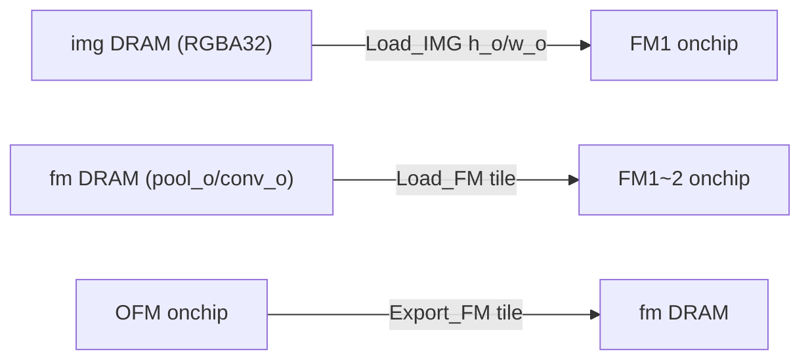
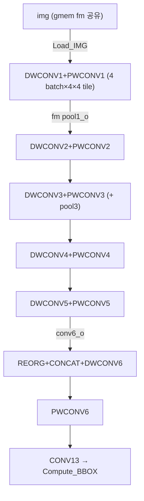
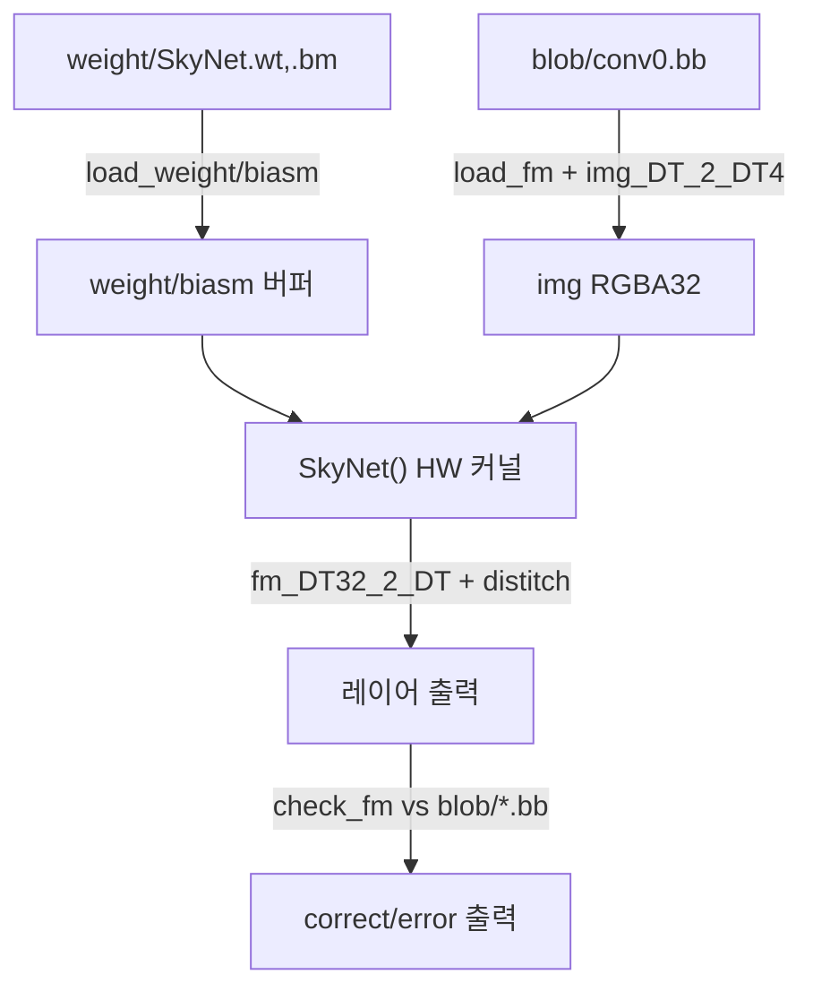

# SkrSkr (SkyNet) 모듈 통합 가이드

> 1차 요약: [`../SkrSkr-master.md`](../SkrSkr-master.md) — 본 문서는 그 요약을 모듈 단위로 심화한 통합 가이드다.
> 분석 대상: `\\wsl.localhost\ubuntu-24.04\home\user\project\PRJXR-HBTXR\REF\CNN-Accel\SkrSkr-master`
> 작성 원칙: 실제 소스 Read 후 `파일:라인` 근거 표기. 라인 근거 없는 추론은 "추정", 코드로 확인 불가는 "확인 불가"로 명시.

---

## 0. 문서 머리말

### 0.1 대표 케이스 선정
- **대표 모델: SkyNet (DAC-SDC 2020 SkrSkr, W6A8 재구현)** — 단일 고정 토폴로지(19 스테이지)로 ShanghaiTech가 DAC-SDC 2019 우승작 SkyNet을 fully-integer로 재구현(`README.md:11`, `SkyNet.cpp:3-23`의 `config[19]`). 본 repo엔 다른 cfg 변형이 없고 토폴로지가 소스에 하드코딩되어 이 단일 모델이 곧 대표 케이스.
- **대표 DW 레이어: `conv1` (DWCONV1)** — 입력 320×160, IC=OC=32, 3×3 depthwise. 첫 DW로 라인버퍼·윈도우버퍼·`MAC9` 가산트리가 모두 등장하고 공간 해상도가 가장 커 타일링(4×4 타일)이 가장 적극 동작(`SkyNet.cpp:4-5`, `:619-675`).
- **대표 PW 레이어: `conv2` (PWCONV1)** — 입력 320×160, IC=32→OC=64, 1×1 pointwise. 첫 PW로 `MAC16` 완전펼침 가산트리·16채널 가중치 타일 적재(`LOAD_W1x1`)·II=1 핵심이 모두 등장(`SkyNet.cpp:6`, `:653-658`).
- **대표 검출 헤드: `conv13` + `Compute_BBOX`** — 1×1 conv로 32 채널 logit 생성 후 4 그리드×2 앵커 검출(`SkyNet.cpp:926-937`, `:507-578`). HW 내부에서 bbox 좌표를 산출(예외적 PL 내 검출).

### 0.2 수치 표기 규약
- **MAC lanes** = HLS `#pragma HLS UNROLL` 차원 곱 = 본 설계에선 (채널 32 완전병렬)×(MAC 함수 내부 동시 곱셈). DW는 `MAC9` 9곱 × 32채널 UNROLL = **288 MAC/사이클** (단 `PIPELINE II=5`라 평균 288/5≈57.6, `README.md:18`, `SkyNet.cpp:122-125`). PW는 `MAC16` 16곱 × 32 OC UNROLL = **512 MAC/사이클** (`PIPELINE II=1`, `README.md:18`, `SkyNet.cpp:250-251`).
- **scalar MACs**(dense 기준): DW = OH×OW×C×9, PW = OH×OW×OC×IC. 본 설계는 **dense 직접 컨볼루션**(im2col·sparsity 없음)이라 유효MAC=scalar MAC. 1차 요약 5절 "im2col 가설" 정정 재확인.
- **loop trips** = (공간 타일 루프) × (출력행 H) × (출력열 W) × (채널묶음 IC/16 또는 OC/32). 타일 단위 외부 DRAM 왕복(`Load_FM`/`Export_FM`)이 loop 외곽.
- **memory size**(payload bit) = 온칩 버퍼 차원 곱 × 원소 bit. 온칩 feature 버퍼는 `[32][43][83]` 4개(FM1~3 = ADT8b, FM4 = RDT19b), 라인버퍼 `[32][3][43]×8b`, 윈도우버퍼 `[32][3][3]×8b`. **중간 feature는 외부 DRAM `fm`(628115×32B) 경유**가 본 설계의 핵심 특징(온칩 BRAM 부족, `SkyNet.cpp:25-28`, `:604`).
- **타깃 데이터타입(W6A8)**: 활성 `ADT=ap_uint<8>`, 가중치 `WDT=ap_int<6>`, DW/PW 누산 `RDT=ap_int<19>`, bias `BDT=ap_int<16>`, scale `MDT=ap_int<16>`(`SkyNet.h:25-29`). DRAM 버스는 32채널 팩킹 `ADT32/WDT32=ap_int<256>`, 이미지 `ADT4=ap_int<32>`(RGBA, `SkyNet.h:30-33`). 재양자화 시프트 `nm=17`(`SkyNet.h:52`).

### 0.3 운영 경로
```
[SW 학습/양자화: PyTorch SkyNet W6A8 (본 repo 외부, README.md:39 prerequisites)]
      │ int6 weight / int16 bias·scale 익스포트 (SkyNet.wt/.bm 또는 SkyNet.bin)
      ▼
[C-sim 검증: C/build → cmake → ./SkyNet] ──► blob/*.bb 골든과 레이어별 대조 (check_fm)
      │  main.cpp(드라이버) + utils.cpp(load/check) + transform.cpp(stitch/색공간)
      ▼
[HLS 합성: vivado_hls hls.tcl] ──► SkyNet IP (Verilog 익스포트)
      │  set_part xczu3eg-sbva484-1-e, create_clock period 3.33 (hls.tcl:14-15)
      ▼
[Vivado 통합: vivado -mode tcl -source rtl.tcl] ──► ultra96v2_wrapper.bit + .hwh
      │  clk_wiz 333.000 MHz (rtl.tcl:220), zynq_ultra_ps_e (rtl.tcl:130-134)
      ▼
[board 측정: Deploy/run.py 또는 run_multiprocess.py (PYNQ Overlay)]
      │  cma_array DMA + register write(0x10/0x1c/0x28/0x34) + AP_START/IDLE 폴링
      ▼
[bbox 후처리 CPU: compute_bounding_box (sigmoid/exp/anchor)]  ← 유일한 부동소수 단계
```
- 타깃: **Xilinx Ultra96 (xczu3eg-sbva484-1-e)**, 333 MHz(`hls.tcl:14`, `rtl.tcl:46,220`). 성능: 73.13% IoU, 52.5fps(Ultra96v2)/57fps(Ultra96v1)(`README.md:11`). 사이클 18.88M→10.58M 절감(`README.md:23`).

---

## 1. Repo / Layer 개요

SkrSkr = SkyNet(MobileNet형 Depthwise-Separable Conv 백본 + reorg bypass + YOLO형 bbox 검출)을 **W6A8 fully-integer**로 재구현해 Ultra96에 가속한 DAC-SDC 2020 준우승 설계(`README.md:1-11`). 단일 객체검출(single-object detection)용. 본 repo는 **HLS 커널(SkyNet.cpp) 전체가 실재**하며, SW 양자화 학습부(PyTorch)와 가중치 바이너리만 부재.

### 1.1 HW(HLS 커널) vs SW(C-sim/전처리) vs board

| 구분 | 파일(자체 소스) | 역할 |
|---|---|---|
| **HLS 커널(HW)** | `Develop/C/src/SkyNet.cpp` | DW/PW conv, ACT(양자화), REORG, POOL, 타일 load/export, bbox, top — 전 커널 |
| | `Develop/C/src/SkyNet.h` | W6A8 타입정의, 19-레이어 config 선언, DRAM 오프셋·weight/bias 인덱스 상수 |
| **C-sim(SW 검증)** | `Develop/C/src/main.cpp` | C-sim 드라이버(메모리 할당·SkyNet 호출·레이어별 check_fm·bbox CPU) |
| | `Develop/C/src/utils.cpp` | load_weight/load_biasm/load_fm(바이너리 read), check_fm(blob 골든 대조) |
| | `Develop/C/src/transform.cpp` | stitch/distitch(4-batch 합성), img_DT_2_DT4(RGBA 팩킹), fm_DT_2_DT32(채널팩) |
| **build 스크립트** | `Develop/hls.tcl` | Vivado HLS 합성(set_part/clock/export) |
| | `Develop/rtl.tcl` | Vivado IPI 블록디자인(SkyNet IP+clk_wiz 333M+zynq PS) |
| | `Develop/C/CMakeLists.txt` | g++ C-sim 빌드 |
| **board harness** | `Deploy/run.py` | PYNQ Overlay 적재·register 세팅·AP_START/IDLE 폴링·전력측정·IoU |
| | `Deploy/run_multiprocess.py` | 멀티프로세스(로딩/리사이즈 2 프로세스 + bbox 1 프로세스) 처리량 은닉 |
| | `Deploy/run_overlap.py`, `Deploy/IoU.py` | 오버랩 변형 / IoU 평가 |

### 1.2 제외 목록(이름만 언급)
- **third-party**: 없음(번들 라이브러리 미동봉). C-sim은 외부 [HLS_arbitrary_Precision_Types](`README.md:112`) 헤더(`ap_int.h`, `SkyNet.h:14`) 의존 — repo 외부.
- **생성물/바이너리**: `Develop/C/blob/*.bb`(레이어별 골든 중간결과), `Develop/C/weight/{SkyNet.bin,SkyNet.wt,SkyNet.bm}`(int 가중치/bias/scale), `Deploy/{SkyNet.bit,SkyNet.bin,SkyNet.hwh}`(비트스트림·HW핸드오프), `sample1000/*.jpg`(테스트 이미지 1000장), `RICL.png`(로고).
- **부재(확인 불가)**: SW 양자화 학습부(PyTorch SkyNet W6A8 학습·캘리브레이션 코드) — `README.md:39`가 PyTorch prerequisite만 언급, 학습 스크립트는 미포함. 따라서 W6A8 캘리브레이션 절차·scale 산출식은 본 repo만으론 확인 불가(가중치는 .bin/.wt 바이너리로만 존재).

### 1.3 대표 모델 레이어 구성 (19 스테이지)
근거: `SkyNet.cpp:3-23` `config[layer_count]`, `SkyNet.h:63`(`layer_count 19`). conv0(입력 320×160×32) → conv1(3×3 DW) → conv2(1×1 PW, OC64) → pool1(2×2) → conv3(DW) → conv4(PW, OC96) → pool2 → conv5(DW) → conv6(PW, OC192) → **reorg(2×2 s2, ch×4=768)** + pool3(192) → conv7(DW) → conv8(PW, OC384) → conv9(DW) → conv10(PW, OC512) → **cat(concat reorg+conv10 = 1280ch)** → conv11(DW) → conv12(PW, OC96) → conv13(1×1, OC32 → bbox). top에서 명시 루프로 순차 호출(`SkyNet.cpp:619-937`), DW+PW를 6쌍 블록(DWCONV1~6 + PWCONV1~6)으로 묶어 단일 인스턴스 재사용.

> **핵심 구조 차별점**: feature는 레이어 간 **외부 DRAM `fm`** 경유, 커널은 `#pragma HLS ALLOCATION limit=1`로 단일 인스턴스 자원공유(`SkyNet.cpp:609-617`). UltraNet류 full-dataflow(레이어별 인스턴스·온칩 스트림)와 정반대 전략 → 1차 요약 8절 대비표.

---

## 2. 모듈: 타입/config/메모리맵 — `SkyNet.h`

### 2.1 역할 + 상위/하위
- **역할**: W6A8 데이터타입, 19-레이어 토폴로지 선언, DRAM feature 오프셋, weight/bias/scale 인덱스 상수를 정의. 모든 커널·드라이버가 의존하는 단일 헤더.
- **상위**: `SkyNet.cpp`·`main.cpp`·`utils.cpp`·`transform.cpp` 전부 include(`SkyNet.cpp:1` 등). **하위**: `ap_int.h`(`:14`), 조건부 `sds_lib.h`(`:16-21`).

### 2.2 데이터플로우


### 2.3 대표 코드 위치
`Develop/C/src/SkyNet.h` (154줄 전체).

### 2.4 대표 코드 블록
```cpp
typedef ap_uint<8> ADT;   typedef ap_int<19> RDT;   // 활성 / DW·PW 누산
typedef ap_int<16> BDT;   typedef ap_int<6>  WDT;   // bias / 가중치
typedef ap_int<16> MDT;                              // scale (multiplier)
typedef ap_int<256> WDT32; typedef ap_int<256> ADT32; // 32채널 팩 DRAM 버스
typedef ap_int<32>  ADT4;                            // RGBA 이미지 1픽셀  // SkyNet.h:25-33
```
→ **W6A8 정수만**. `ap_int<256>`은 32채널×8bit를 한 DRAM 워드로 팩(RGB→RGBA 32b 로딩, `README.md:20`).

```cpp
#define na 8   #define nw 6   #define nb 16   #define nm 17   #define qm 131072.0
#define amin 0  #define amax 255   #define rmax 262143  #define rmin -262144  // SkyNet.h:49-61
```
→ na/nw/nb = 활성/가중치/bias 비트수. `nm=17` 재양자화 시프트(=qm=2^17=131072). amin/amax = uint8 클램프, rmax/rmin = RDT19 누산 클램프(±2^18).

```cpp
#define pool1_o  0       #define pool2_o  145885   ...   #define fm_all 628115  // SkyNet.h:73-84
#define conv1_w 0  #define conv2_w 9  ...  #define conv13_w 13696              // SkyNet.h:115-127
```
→ DRAM `fm`의 레이어별 시작 오프셋(워드=32채널 단위)과 가중치 ROM 레이어별 시작 인덱스. **레이어 토폴로지·메모리맵 전부 하드코딩** → 모델 변경 어려움.

### 2.5 마이크로아키텍처
- **메모리(온칩)**: `FM1/FM2/FM3 = [32][43][83]×ADT8b`(각 약 2.18 Mb), `FM4 = [32][43][83]×RDT19b`(약 5.18 Mb)(`SkyNet.cpp:25-28`). 가중치 버퍼 `WBUF3x3[3][32][3][3]×6b`, `WBUF1x1[2][32][32]×6b`, `BBUF/MBUF[3][32]×16b`(`SkyNet.cpp:30-33`).
- **메모리(DRAM)**: `fm` 628115 워드 × 256bit ≈ **160.8 Mb**, weight 13792 워드 × 256bit, biasm 432 워드 × 256bit(`SkyNet.cpp:603-606` depth). 중간 feature 전량 DRAM 경유.
- **병목**: 43×83 타일·32채널·레이어 오프셋이 전부 #define 상수 → 가변 토폴로지 불가(1차 요약 8절 한계).

---

## 3. 모듈: Depthwise Conv 3×3 — `DWCONV3X3` + `MAC9` (핵심 ①)

### 3.1 역할 + 상위/하위
- **역할**: 32채널 각각 독립 3×3 컨볼루션(depthwise). 라인버퍼+윈도우버퍼 슬라이딩 윈도우로 입력을 한 픽셀씩 흘려 윈도우 재구성, `MAC9`로 9곱+가산트리.
- **상위**: top `SkyNet`의 DWCONV1~6 블록이 호출(`SkyNet.cpp:651,663,690` 등). **하위**: `MAC9`(`:72`).

### 3.2 데이터플로우


### 3.3 Function call stack
top `SkyNet` → `DWCONV3X3`(`SkyNet.cpp:105`) → `MAC9`(`:72`, `INLINE off`). 직후 `ACTIVATION`(`:287`)이 RDT 누산을 ADT8로 재양자화.

### 3.4 대표 코드 위치
`Develop/C/src/SkyNet.cpp`: `MAC9` `:72-103`, `DWCONV3X3` `:105-155`.

### 3.5 대표 코드 블록
```cpp
for (int row_in = 0; row_in < 83; row_in++)
 for (int col_in = 0; col_in < 43; col_in++) {
  #pragma HLS LOOP_FLATTEN
  #pragma HLS PIPELINE II=5
   for (int c = 0; c < 32; c++) {
   #pragma HLS UNROLL                                    // SkyNet.cpp:117-125
     ADT read_in = IFM[c][col_in][row_in];
     line_buffer[c][row_in % 3][col_in] = read_in;       // 순환 라인버퍼 갱신
     window_buffer[c][2][2] = read_in;                   // 윈도우 우측열 채움
     window_buffer[c][1][2] = line_buffer[c][(row_in+2)%3][col_in];
     window_buffer[c][0][2] = line_buffer[c][(row_in+1)%3][col_in];  // :127-131
```
→ 입력 1픽셀 read → 3행 순환 라인버퍼 갱신 → 윈도우 우측열만 채움. **32채널 UNROLL**로 32개 윈도우 동시 처리.

```cpp
if (row_in >= 2 && col_in >= 2) {
  ap_int<18> res = MAC9(window_buffer[c]..., WBUF3x3[c]...);   // SkyNet.cpp:133-141
  OFM[c][col_in-1][row_in-1] = res > rmax ? RDT(rmax) : res < rmin ? RDT(rmin) : RDT(res);
}
for (int r = 0; r < 3; r++) { #pragma HLS UNROLL
  window_buffer[c][r][0]=window_buffer[c][r][1]; window_buffer[c][r][1]=window_buffer[c][r][2]; } // :146-151
```
→ 윈도우가 채워지면(row≥2,col≥2) MAC9 → RDT19 클램프 출력. 매 픽셀 윈도우 좌측 시프트.

```cpp
ap_int<14> prod_00 = A_00 * B_00; ... (9개)               // SkyNet.cpp:82-90
ap_int<15> sum_0 = prod_00 + prod_11; ... (4개)           // :92-95
ap_int<16> res_0 = sum_0 + sum_1; res_1 = sum_2+sum_3; res_2 = prod_22;  // :97-99
ap_int<18> res = res_0 + res_1 + res_2;                   // :101 (수동 가산트리)
```
→ `MAC9`: 9곱(ap_int<14>) → 단계별 비트폭 증가 가산트리(15→16→18). **비트폭 정밀 제어**로 타이밍 클로징(333MHz, `README.md:21`).

### 3.6 마이크로아키텍처
- **Stage 분해**: ① IFM read + 라인버퍼 갱신(`:126-127`) ② 윈도우 우측열 채움(`:129-131`) ③ MAC9 + 클램프(`:133-144`) ④ 윈도우 좌시프트(`:146-151`).
- **MAC lanes**: `MAC9` 9곱 × 32채널 UNROLL = **288 MAC**. 단 `PIPELINE II=5`(`:122`)라 평균 처리량 288/5 = **57.6 MAC/cycle**(`README.md:18`).
- **scalar MACs**: conv1(DW1) = 320×160×32×9 = **14.75M**; conv3(DW2,160×80) = 160×80×64×9 = 7.37M; conv5(DW3,80×40) = 80×40×96×9 = 2.76M; conv7/9(DW,40×20) = 40×20×{192,384}×9. dense 직접 — sparsity 없음.
- **메모리/재사용**: `line_buffer[32][3][43]×8b` = 33,024 bit, `window_buffer[32][3][3]×8b` = 2,304 bit, 둘 다 complete partition(`:112-115`)으로 32채널×윈도우 완전병렬. 라인버퍼 3행 순환(`row_in%3`)으로 ping-pong 대체.
- **정량/병목**: **DW가 PW보다 DSP 효율 낮음** — II=5(`README.md:18`이 II=5 명시: 288/5=57.6)이라 PW(II=1)의 1/5 처리량. DW가 inverted-separable 중간 단이라 파이프 균형 불리(추정). 메인 루프 trips = 83×43 = 3,569회/타일.

---

## 4. 모듈: Pointwise Conv 1×1 — `PWCONV1X1` + `MAC16` + `LOAD_W1x1` (핵심 ②)

### 4.1 역할 + 상위/하위
- **역할**: 1×1 컨볼루션(채널 믹싱). 16 입력채널씩 묶어 `MAC16` 완전펼침 가산트리로 누산, 32 출력채널 UNROLL로 동시 산출. II=1.
- **상위**: top `SkyNet`의 PWCONV1~6 블록(`SkyNet.cpp:655,700,757` 등). **하위**: `MAC16`(`:157`), `LOAD_W1x1`(`:221`).

### 4.2 데이터플로우


### 4.3 Function call stack
top `SkyNet` → `PWCONV1X1`(`SkyNet.cpp:233`) → `LOAD_W1x1`(`:221`) + `MAC16`(`:157`, `INLINE off`). 직후 `ACTIVATION`(`:287`) 재양자화.

### 4.4 대표 코드 위치
`Develop/C/src/SkyNet.cpp`: `MAC16` `:157-219`, `LOAD_W1x1` `:221-231`, `PWCONV1X1` `:233-277`.

### 4.5 대표 코드 블록
```cpp
for(int ci=0; ci<32; ci+=16) {
  LOAD_W1x1(WBUF1x1, W1x1, ci);                          // SkyNet.cpp:243-245
  for(int h=1; h<42; h++) for(int w=1; w<82; w++) {
    #pragma HLS PIPELINE II=1
      for(int co=0; co<32; co++) { #pragma HLS UNROLL    // :250-253
        ap_int<20> res = OFM[co][h][w];                  // 이전 ci 부분합 누산
        res += MAC16(W1x1[co][0],IFM[ci+0][h][w], ... W1x1[co][15],IFM[ci+15][h][w]);  // :255-271
        OFM[co][h][w] = res > rmax ? RDT(rmax) : res < rmin ? RDT(rmin) : RDT(res); } } }  // :272
```
→ 입력채널을 16씩 2그룹으로 분할 누산(32ch = 16×2), 출력채널 32 UNROLL. `OFM`을 누산기로 재사용(ci 루프 간 부분합).

```cpp
mul0 = w0*b0; ... mul15 = w15*b15;        // 16곱 (ap_int<14>)       SkyNet.cpp:182-197
add0 = mul0+mul1; ... add7 = mul14+mul15; // 8합 (ap_int<15>)        :199-206
add8 = add0+add1; ... add11 = add6+add7;  // 4합 (ap_int<16>)        :208-211
add12 = add8+add9; add13 = add10+add11;   // 2합 (ap_int<17>)        :213-214
res = add12 + add13;                       // ap_int<18>              :216
```
→ `MAC16`: 16곱 → 8→4→2→1 단계 완전펼침 가산트리(log2 16 = 4단). 단계별 비트폭 정밀 증가로 II=1 달성.

```cpp
void LOAD_W1x1(WDT WBUF1x1[32][32], WDT W1x1[32][16], int CI) {
  for(int ci=0;ci<16;ci++){ #pragma HLS UNROLL
   for(int co=0;co<32;co++){ #pragma HLS UNROLL
     W1x1[co][ci] = WBUF1x1[co][ci+CI]; } } }            // SkyNet.cpp:221-231
```
→ 16채널 가중치 타일을 완전병렬 적재(원본 SkyNet의 load_w1x1는 미최적화였음을 II=1로 개선, `README.md:19`).

### 4.6 마이크로아키텍처
- **Stage 분해**: ① 16채널 가중치 적재(`LOAD_W1x1`, `:245`) ② h×w 공간 스캔, 각 점에서 co 32 UNROLL×MAC16(`:251-271`) ③ 부분합 누산+클램프(`:272`).
- **MAC lanes**: `MAC16` 16곱 × 32 OC UNROLL = **512 MAC/cycle**(II=1, `README.md:18`, `SkyNet.cpp:250-251`). DW(57.6) 대비 약 9배 처리량.
- **scalar MACs**: conv2(PW1,320×160) = 320×160×64×32 = **104.9M**; conv4(160×80) = 160×80×96×64 = 78.6M; conv6(80×40) = 80×40×192×96 = 59.0M; conv8(40×20) = 40×20×384×192 = 59.0M; conv10 = 40×20×512×384 = 157.3M; conv12 = 40×20×96×1280 = 98.3M. dense 직접.
- **메모리/재사용**: `W1x1[32][16]×6b` complete partition(`:240-241`) = 3,072 bit. WBUF1x1[2][32][32]은 ping/pong 2뱅크로 더블버퍼(`SkyNet.cpp:31`, top에서 `[0]`/`[1]` 교대 적재 `:625-626,701-702`).
- **정량/병목**: PW가 전체 MAC의 대부분(conv10 157M 등) — PW가 연산 지배적. II=1·512 lane으로 PW는 효율적이나, **입력채널 32까지만(16×2) 펼침** → IC>32 레이어(conv8 IC192, conv10 IC384, conv12 IC1280)는 Nx 외곽루프로 16/32채널씩 반복 DRAM 재로드(`SkyNet.cpp:793-806,842-855,905-918`)가 DRAM 대역폭 압박.

---

## 5. 모듈: 활성/재양자화 — `ACTIVATION` (fully-integer 핵심)

### 5.1 역할 + 상위/하위
- **역할**: DW/PW의 RDT19 누산을 bias 가산 → ReLU → scale 곱 + 시프트 → uint8 클램프로 재양자화. **부동소수 전무**(One-Shot Fully Integer의 코드 증거).
- **상위**: 모든 DW/PW 직후 호출(`SkyNet.cpp:652,656,664` 등). **하위**: 없음.

### 5.2 데이터플로우
```mermaid
flowchart LR
  IFM["IFM RDT19 (누산)"] -->|+ BBUF| Q["qy = IFM + bias (ap_int<20>)"]
  Q -->|qy<0 → 0| RELU["ReLU"]
  RELU -->|×MBUF >> nm(17)| SC["스케일 곱+시프트"]
  SC -->|[0,255] 클램프| OUT["OFM ADT8"]
```

### 5.3 Function call stack
DW/PW → `ACTIVATION`(`SkyNet.cpp:287`, `INLINE off`). IFM(RDT)을 in-place 0으로 리셋(`:311`)해 다음 PW 누산 준비.

### 5.4 대표 코드 위치
`Develop/C/src/SkyNet.cpp`: `ACTIVATION` `:287-315`.

### 5.5 대표 코드 블록
```cpp
for (int h=1; h<42; h++) for (int w=1; w<82; w++) {
  #pragma HLS PIPELINE
   for (int c = 0; c < 32; c++) {                        // SkyNet.cpp:293-298
     ap_int<20> qy = IFM[c][h][w] + BBUF[c];             // bias 가산
     if (qy < 0) qy = 0;                                 // ReLU
     qy = (qy * MBUF[c]) >> nm;                          // 스케일 곱 + >>17
     OFM[c][h][w] = qy < amin ? ADT(amin) : qy > amax ? ADT(amax) : ADT(qy);  // [0,255]
     IFM[c][h][w] = 0; }                                 // 누산기 리셋  // SkyNet.cpp:300-311
```
→ **정수만**: `(qy*scale)>>17`이 부동소수 곱셈을 대체(scale = round(float_scale × 2^17)). `IFM=0` 리셋이 PW의 OFM 누산기 재사용을 가능케 함(`PWCONV1X1`이 `OFM += ...`로 누산하므로).

### 5.6 마이크로아키텍처
- **Stage 분해**: bias 가산 → ReLU → MBUF 곱(MDT16×ap_int<20> → 곱) → >>17 시프트 → uint8 클램프 → 누산기 리셋.
- **MAC lanes**: 32채널 병렬(BBUF/MBUF complete partition, `:290-291`). `PIPELINE`(II 미명시, II=1 추정).
- **메모리**: BBUF/MBUF `[32]×16b` = 512 bit씩.
- **정량/병목**: 공간 41×81 스캔(`:293-295`). bbox 외 유일 부동소수 없음 → ViT 정수활성 차용 가치(1차 요약 9절). 곱셈 `qy*MBUF`(ap_int<20>×16b)가 DSP 1개씩×32 = 32 DSP 소비(추정).

---

## 6. 모듈: reorg / pooling / max — `REORG` + `POOL` + `MAX`

### 6.1 역할 + 상위/하위
- **역할(REORG)**: 2×2 stride-2 공간→채널 재배치(80×40×192 → 40×20×768, ch×4) — YOLO passthrough/bypass. **역할(POOL)**: 2×2 max pooling 다운샘플. **역할(MAX)**: 4입력 최대.
- **상위**: REORG는 top의 REORG+CONCAT 단(`SkyNet.cpp:867`), POOL은 pool1~3 단(`:657,707,763`). **하위**: MAX(`:279`).

### 6.2 데이터플로우


### 6.3 Function call stack
top → `REORG`(`SkyNet.cpp:35`) / `POOL`(`:392`) → `MAX`(`:279`). REORG는 4 회전(Rx 0~3)으로 짝/홀 행·열 위상 처리(`:863-875`).

### 6.4 대표 코드 위치
`Develop/C/src/SkyNet.cpp`: `REORG` `:35-60`, `MAX` `:279-285`, `POOL` `:392-412`.

### 6.5 대표 코드 블록
```cpp
for (ap_uint<7> h=1; h<=40; h++) for (ap_uint<7> w=1; w<=80; w++) {
  #pragma HLS LOOP_FLATTEN
  #pragma HLS PIPELINE II=1                              // SkyNet.cpp:43-44
   ...
   int h_ = 2*_h - bias_h; int w_ = 2*_w - bias_w;       // 2× 다운샘플 + 위상 오프셋
   ap_uint<20> ifm_index = Cx*83*163 + h_*163 + w_;      // :49-51
   ADT32 DATA = ifm[ifm_index];
   for (ap_uint<7> c=0;c<32;c++){ #pragma HLS UNROLL
     IFM[c][_h][_w] = DATA.range(8*c+7, 8*c); } }         // :53-57
```
→ REORG: 2×2 블록의 한 위상을 추출해 채널로 옮김(`Rx` 비트로 위상 선택). **원본 SkyNet reorg는 미최적화**였음을 II=1로 개선(`README.md:19`).

```cpp
DATA.range(8*c+7,8*c) = MAX(IFM[c][2*h-1][2*w-1], IFM[c][2*h-1][2*w],
                            IFM[c][2*h][2*w-1], IFM[c][2*h][2*w]);  // SkyNet.cpp:407
```
→ POOL: 2×2 max를 32채널 동시(`PIPELINE II=4`, `:402`).

### 6.6 마이크로아키텍처
- **MAC lanes**: 연산(MAC) 없음 — 데이터 이동/비교. REORG 32채널 UNROLL II=1, POOL 32채널 II=4.
- **메모리**: 온칩 IFM `[32][43][83]` 재사용.
- **정량/병목**: REORG는 40×80=3200 trips/Cx, POOL 20×40=800 trips/Cx. II=1 reorg가 1차 요약이 강조한 개선점.

---

## 7. 모듈: 타일 DRAM 입출력 — `Load_FM`/`Export_FM`/`Load_FM1`/`Export_FM1`/`Load_IMG` (DRAM 왕복 핵심)

### 7.1 역할 + 상위/하위
- **역할**: 외부 DRAM `fm`/`img`와 온칩 FM 버퍼 간 42×82(또는 43×83) 타일을 DMA. **레이어 간 중간 feature를 DRAM 경유**시키는 본 설계의 핵심(온칩 BRAM 부족).
- **상위**: top `SkyNet`의 각 블록(`SkyNet.cpp:645,689,778` 등). **하위**: AXI master(`fm`/`img` 포트).

### 7.2 데이터플로우


### 7.3 Function call stack
top → `Load_IMG`(`:580`) / `Load_FM`(`:361`,큰 해상도 타일) / `Load_FM1`(`:414`,40×20 전체) / `Export_FM`(`:432`) / `Export_FM1`(`:462`,경계 0패딩 포함). 단일 인스턴스(`ALLOCATION limit=1`, `:614-617`).

### 7.4 대표 코드 위치
`Develop/C/src/SkyNet.cpp`: `Load_FM` `:361-390`, `POOL` `:392-412`, `Load_FM1` `:414-430`, `Export_FM` `:432-460`, `Export_FM1` `:462-496`, `Load_IMG` `:580-599`.

### 7.5 대표 코드 블록
```cpp
int tile = ow/80;
if(tile){ h_o = Hx*40 + Hx/tile; w_o = Wx*80 + Wx/tile; }    // 타일 위치 오프셋  SkyNet.cpp:363-368
for (int h=0;h<42;h++) for (int w=0;w<82;w++){ #pragma HLS PIPELINE II=1
  int ifm_index = Cx*(oh*2+3)*(ow*2+3) + (h+h_o)*(ow*2+3) + (w+w_o);  // :381
  ADT32 DATA = ifm[ifm_index];
  for(int c=0;c<32;c++) IFM[c][h][w] = DATA.range(8*c+7,8*c); }       // 256b→32ch 언팩  :384-387
```
→ `Load_FM`: Hx/Wx 타일 인덱스로 DRAM 오프셋 계산, 42×82 타일을 256bit(32채널) 워드로 read해 온칩 언팩.

```cpp
ADT4 DATA = img[b*320*160 + (h+h_o)*320 + (w+w_o)];      // SkyNet.cpp:589
for (int c=0;c<3;c++){
  if (h+h_o<0||w+w_o<0||h+h_o>159||w+w_o>319) IFM[c][h][w] = 128;  // 경계 패딩 128
  else IFM[c][h][w] = DATA.range(8*c+7,8*c); }            // RGBA에서 RGB 추출  :590-596
```
→ `Load_IMG`: RGBA32 한 워드에서 RGB 3채널 추출(A 무시), 경계는 128(=0점) 패딩.

```cpp
for (int h=0;h<43;h++) for(int c=0;c<32;c++) OFM[c][h][41]=0;   // 우측 경계 0
for (int w=0;w<83;w++) for(int c=0;c<32;c++) OFM[c][21][w]=0;   // 하단 경계 0  // SkyNet.cpp:469-480
```
→ `Export_FM1`: 40×20 타일 export 전 경계 0패딩(다음 DW 윈도우용).

### 7.6 마이크로아키텍처
- **메모리**: DRAM `fm` 628115 워드(160.8 Mb), `img` 204800 워드(`SkyNet.cpp:603-604` depth). 온칩 FM1~4 4뱅크 재사용.
- **정량/병목**: **DRAM 타일 왕복이 처리량 병목**(`README.md:23`이 사이클 10.58M로 절감했으나 여전히 dataflow 대비 큼). `Load_FM`/`Export_FM` 모두 II=1이나 타일×채널묶음 반복이 외곽루프라 DRAM 대역폭 의존. `img`·`fm` 버스 bundle 공유(`SkyNet.cpp:603-604`)로 18 BRAM 절감(`README.md:179-185`) — 단 SDSoC에선 wiring error 유발.

---

## 8. 모듈: 검출 헤드 — `Compute_BBOX` + `clamp_BDT` + `Export_BBOX`

### 8.1 역할 + 상위/하위
- **역할**: conv13 1×1 출력 32채널 logit에서 4 그리드 영역×2 앵커 confidence 최대를 찾아 박스좌표(xs/ys/ws/hs/flag/x/y) 추출. **HW 내부 검출**(예외적 PL 내).
- **상위**: top `SkyNet` 말미(`SkyNet.cpp:936`). **하위**: `clamp_BDT`(`:62`), `Export_BBOX`(`:498`).

### 8.2 데이터플로우
```mermaid
flowchart TD
  OFM["FM4 conv13 logit (RDT)"] -->|4 그리드 영역| GR["OFM[4]·MBUF[4] vs OFM[9]·MBUF[9]"]
  GR -->|argmax conf| SEL["앵커 선택 (flag)"]
  SEL -->|OFM[0..8]| BOX["xs/ys/ws/hs/x/y"]
  BOX -->|clamp_BDT| BBOX["BBOX[4] (BDT16 팩)"]
  BBOX -->|Export_BBOX| BM["biasm + bbox_o (DRAM)"]
```

### 8.3 Function call stack
top → `Compute_BBOX`(`SkyNet.cpp:507`) → `clamp_BDT`(`:62`). 결과 `Export_BBOX`(`:498`)로 `biasm[bbox_o]`(`:937`)에 write → 호스트가 read.

### 8.4 대표 코드 위치
`Develop/C/src/SkyNet.cpp`: `clamp_BDT` `:62-70`, `Compute_BBOX` `:507-578`, `Export_BBOX` `:498-505`, `Load_IMG` `:580-599`. 호스트 후처리: `Deploy/run.py:62-99` `compute_bounding_box`, `main.cpp:33-94`.

### 8.5 대표 코드 블록
```cpp
switch(b){ case 0:H=1;W=1; case 1:H=1;W=42; case 2:H=22;W=1; case 3:H=22;W=42; }  // 4 그리드  SkyNet.cpp:516-522
for(int h=0;h<20;h++) for(int w=0;w<40;w++){ #pragma HLS PIPELINE II=1
  if(OFM[4][h+H][w+W]>max[0]){ max[0]=...; h_max[0]=h+H; w_max[0]=w+W; }   // 앵커0 conf argmax
  if(OFM[9][h+H][w+W]>max[1]){ ... } }                                     // 앵커1  SkyNet.cpp:531-545
conf[0]=max[0]*MBUF[4]; conf[1]=max[1]*MBUF[9];                            // confidence  :547-548
if(conf[1]>conf[0]){ xs=OFM[5]..; ws=OFM[7]..; flag=1; } else { xs=OFM[0]..; flag=0; }  // :549-568
```
→ 4 그리드 각각 2 앵커의 objectness(OFM[4]/OFM[9]) argmax → confidence 비교로 앵커 선택 → 해당 위치의 좌표채널 추출. **bbox 좌표 자체는 HW 산출**(sigmoid/exp/anchor 변환만 CPU).

```cpp
BBOX[b].range(15,0) = clamp_BDT(xs, bmin, bmax); ... range(112,96)=clamp_BDT(y,...);  // SkyNet.cpp:569-576
```
→ 7개 좌표값을 BDT16 한 워드(256b)에 팩.

### 8.6 마이크로아키텍처
- **MAC lanes**: argmax 비교(MAC 아님), `PIPELINE II=1`(`:533`). confidence 곱 `max*MBUF` 2개.
- **메모리**: BBOX[4] 256bit×4.
- **정량/병목**: 4 그리드 × 20×40 = 3,200 비교/그리드. 호스트 후처리(`run.py:62`)가 sigmoid/exp/anchor로 정규화 좌표→픽셀좌표(640×360) 변환 — **유일한 부동소수 단계**(`README.md:14`). anchor=[1.494,2.36,4.01,5.76], bbox_m=[52,48,28,30,124,47,52,23,23,125], qm=131072(`run.py:16-18`).

---

## 9. 모듈: Top 인터페이스 + 자원공유 스케줄 — `SkyNet` (top)

### 9.1 역할 + 상위/하위
- **역할**: AXI master 4 포트 + AXI-lite 제어, 단일 인스턴스 자원공유(`ALLOCATION limit=1`)로 19 스테이지를 명시 루프로 순차 호출. 4-batch 처리.
- **상위**: 호스트(`run.py:120` Overlay.SkyNet). **하위**: 8절까지의 전 커널.

### 9.2 데이터플로우


### 9.3 Function call stack
호스트 `SkyNet.write(0x00,1)`(`run.py:159`) → top `SkyNet`(`SkyNet.cpp:601`) → DWCONV1~6/PWCONV1~6/REORG/POOL/ACTIVATION/Load/Export 순차 → `Compute_BBOX`(`:936`).

### 9.4 대표 코드 위치
`Develop/C/src/SkyNet.cpp`: top `:601-938`. 인터페이스 `:603-607`, ALLOCATION `:609-617`, DWCONV1+PWCONV1 `:619-675`, conv5+reorg+concat `:712-898`, PWCONV6+CONV13+bbox `:899-937`.

### 9.5 대표 코드 블록
```cpp
#pragma HLS INTERFACE m_axi depth=204800 port=img    offset=slave bundle=fm   // SkyNet.cpp:603
#pragma HLS INTERFACE m_axi depth=628115 port=fm     offset=slave bundle=fm   // img·fm 버스 공유 → 18 BRAM 절감
#pragma HLS INTERFACE m_axi depth=13792  port=weight offset=slave bundle=wt   // :605
#pragma HLS INTERFACE m_axi depth=432    port=biasm  offset=slave bundle=bm   // :606
#pragma HLS INTERFACE s_axilite register port=return                          // :607
```
→ 4 DRAM 포트(img/fm/weight/biasm), img·fm bundle 공유(`README.md:179-185`).

```cpp
#pragma HLS ALLOCATION instances=PWCONV1x1 limit=1 function   // SkyNet.cpp:609
#pragma HLS ALLOCATION instances=DWCONV3x3 limit=1 function   // :610
... (REORG/POOL/ACTIVATION/Load_FM/Export_FM/Load_FM1/Export_FM1)  // :611-617
```
→ **각 커널 단일 인스턴스 강제** → 레이어를 순차 재사용(자원 절감, full-dataflow와 정반대).

```cpp
for(int b=0; b<4; b++){ switch(b){ case 0:H=0;W=0; ... }     // 4-batch  SkyNet.cpp:633-642
  for(int Hx=0;Hx<4;Hx++){ Load_IMG(img,FM1,Hx,0,b);
    for(int Wx=0;Wx<4;Wx++){ if(Wx%2==0){ Load_IMG(img,FM2,Hx,Wx+1,b);  // 더블버퍼 FM1/FM2
        DWCONV3X3(FM1,FM4,WBUF3x3[0]); ACTIVATION(FM4,FM1,...);
        for(int Mx=0;Mx<2;Mx++){ PWCONV1X1(FM1,FM4,WBUF1x1[Mx]); ... POOL(...); } } ... } } }  // :643-673
```
→ DWCONV1+PWCONV1: 4 batch × 4×4 공간타일, FM1/FM2 더블버퍼로 Load_IMG와 conv 오버랩.

### 9.6 마이크로아키텍처
- **Stage 분해**: 6 DW+PW 블록 + reorg/concat/pool. 각 블록 = Load_W → Load_FM → DWCONV → ACT → PWCONV → ACT → POOL/Export.
- **병렬도 노브(고정)**: 채널 32 완전병렬·PW 512 lane·DW 57.6 lane은 소스 하드코딩 — DSE 없음(파라메트릭 코드생성 부재).
- **메모리**: 온칩 FM1~4 4뱅크(약 11.7 Mb 합), WBUF 더블버퍼. DRAM 4 포트.
- **정량/병목**: 단일 인스턴스 순차(`ALLOCATION limit=1`)로 레이어 직렬 → 처리량 제약(52~57fps, full-dataflow 200+fps 대비). 사이클 10.58M(`README.md:23`). 합성 PPA(LUT/FF/DSP/BRAM 실수치)는 csynth 리포트 미동봉이라 **확인 불가**.

---

## 10. 모듈: C-sim 드라이버 + 검증 — `main.cpp` + `utils.cpp` + `transform.cpp`

### 10.1 역할 + 상위/하위
- **역할(main)**: 메모리 할당 → 가중치/이미지 로드 → `SkyNet()` 호출 → 레이어별 `check_fm`로 blob 골든 대조 → `Compute_BBOX` CPU. **역할(utils)**: 바이너리 load/골든 check. **역할(transform)**: 4-batch stitch, RGBA 팩킹, 채널 팩 변환.
- **상위**: g++ 실행파일(`CMakeLists.txt:6`). **하위**: `SkyNet()` HW 커널, `blob/*.bb`·`weight/*` 바이너리.

### 10.2 데이터플로우


### 10.3 Function call stack
`main`(`main.cpp:96`) → `load_weight`/`load_biasm`(`utils.cpp:46,54`) → `img_DT_2_DT4`(`transform.cpp:73`) → `SkyNet`(`main.cpp:133`) → `fm_DT32_2_DT`(`transform.cpp:95`) + `distitch`(`:32`) + `check_fm`(`utils.cpp:89`) → `Compute_BBOX`(`main.cpp:33`).

### 10.4 대표 코드 위치
`main.cpp` `:96-228`, `utils.cpp` `:36-158`(load/check), `transform.cpp` `:3-145`(stitch/팩).

### 10.5 대표 코드 블록
```cpp
SkyNet(img, ofm_blob32, weight, biasm);                  // main.cpp:133 (HW 커널 호출)
fm_DT32_2_DT(&ofm_blob32[pool1_o], ofm_blob, config[3]); // DRAM 오프셋에서 레이어 추출
distitch(ofm_blob, ofm, config[3]);                      // 4-batch 분리
for (int p=0;p<4;p++) check_fm(ofm[p], config[3]);       // 골든 대조  main.cpp:140-145
```
→ 레이어별(`pool1_o`~`conv12_o`) blob 골든과 비트-정확 대조(`check_fm` `utils.cpp:109` `fm[index]!=tmp[index]`).

```cpp
for(int i=0;i<160*320;i++) for(int tm=0;tm<4;tm++)
  out[b*320*160+i].range(8*tm+7,8*tm) = in[tm*160*320+i];   // transform.cpp:75-80
```
→ `img_DT_2_DT4`: RGB(A) 4채널을 32bit 워드로 팩(HW `Load_IMG`의 `DATA.range`와 정합, `SkyNet.cpp:595`).

```cpp
for(int i=0;i<l.oc*(l.oh*2+3)*(l.ow*2+3);i++) ofm[i]=128;    // stitch 배경 128 패딩
... ofm[ofm_index] = ifm[p][ifm_index];                      // 4 batch를 한 큰 frame에 stitch  transform.cpp:11-25
```
→ `stitch`: 4 batch 이미지를 한 (2oh+3)×(2ow+3) frame에 2×2로 배치(HW가 4-batch를 타일로 처리).

### 10.6 마이크로아키텍처(검증 관점)
- **검증 정합**: HW `Load_IMG`(RGBA→RGB)·`fm` 팩킹과 SW `img_DT_2_DT4`/`fm_DT_2_DT32`가 동일 비트레이아웃 → C-sim 비트-정확. `check_fm`이 레이어별 `error cnt`/`correct` 출력(`README.md:138-141`).
- **부동소수**: `Compute_BBOX`(`main.cpp:33`)만 sigmoid/exp 사용 — HW와 동일하게 좌표는 정수, 정규화만 float.
- **병목 없음**(C-sim 빌드타임). 단 `blob/*.bb`·`weight/*` 바이너리 부재(제외) → C-sim 실행 자체는 **확인 불가**, 로직만 분석.

---

## 11. 모듈: 호스트 harness + 전처리 파이프라인 — `Deploy/run.py` + `run_multiprocess.py`

### 11.1 역할 + 상위/하위
- **역할**: PYNQ Overlay로 비트스트림 적재, cma_array DMA, register write로 IP 구동, AP_START/IDLE 폴링으로 추론 트리거. 4-batch stitch+RGBA 변환·bbox CPU 후처리·IoU/전력 측정.
- **상위**: `sudo python3 run.py`(`README.md:47`). **하위**: PYNQ Overlay/Xlnk, SkyNet IP.

### 11.2 데이터플로우
```mermaid
flowchart TD
  JPG["sample1000/*.jpg"] -->|PIL RGBA resize 320×160| ST["stitch 4-batch"]
  ST -->|cma_array img| DMA["img DRAM"]
  BIN["SkyNet.bin (int16)"] -->|copyto weight/biasm| WD["weight/biasm DRAM"]
  DMA --> IP["SkyNet IP (write 0x00=1)"]
  WD --> IP
  IP -->|biasm[bbox_o] read| BBOX["bbox_origin"]
  BBOX -->|compute_bounding_box sigmoid/exp/anchor| PRED["predict.txt → IoU"]
```

### 11.3 Function call stack
`Overlay("SkyNet.bit")`(`run.py:117`) → register write(`:121-124`) → 루프: `stitch`(`:54`) → `SkyNet.write(0x00,1)`(`:159`) → AP_IDLE 폴링(`:166-168`) → `np.copyto(bbox_origin, biasm[428*16:])`(`:170`) → `compute_bounding_box`(`:62`) → `Average_IoU`(`:187`).

### 11.4 대표 코드 위치
`Deploy/run.py` `:102-188`(init/main), `:62-99`(bbox), `Deploy/run_multiprocess.py` `:94-167`(멀티프로세스).

### 11.5 대표 코드 블록
```python
img    = xlnk.cma_array(shape=[4,160,320,4], dtype=np.uint8)   # RGBA 4-batch
fm     = xlnk.cma_array(shape=(628115*32), dtype=np.uint8)     # 중간 feature DRAM
weight = xlnk.cma_array(shape=(220672), dtype=np.int16)        # run.py:106-108
SkyNet.write(0x10, img.physical_address)  # img 포트
SkyNet.write(0x1c, fm.physical_address)   # fm 포트
SkyNet.write(0x28, weight.physical_address); SkyNet.write(0x34, biasm.physical_address)  # :121-124
```
→ cma_array로 물리연속 버퍼 할당, physical_address를 IP register에 기록(register map: 0x10/0x1c/0x28/0x34 = img/fm/weight/biasm, 0x00 = AP_CTRL).

```python
SkyNet.write(0x00, 1)                       # AP_START
isready = SkyNet.read(0x00)
while( isready == 1 ): isready = SkyNet.read(0x00)   # AP_IDLE 폴링  run.py:159-168
np.copyto(bbox_origin, biasm[428*16:])      # bbox 결과 read (biasm 끝에 출력)  :170
```
→ AP_START 후 idle 폴링으로 wall-clock latency 측정. **bbox 출력이 biasm 버퍼 끝**(bbox_o)에 기록됨(`SkyNet.cpp:937` `Export_BBOX(biasm+bbox_o,...)`와 정합).

```python
if(idx==0): np.copyto(img, stitch(...))     # idx 0: 전처리→추론
else: np.copyto(img, image_buff)            # idx>0: 다음 batch 전처리를 추론과 오버랩  run.py:152-162
```
→ 파이프라인: 추론과 다음 batch stitch를 오버랩(로딩 은닉). `run_multiprocess.py`는 stitch 2 프로세스 + bbox 1 프로세스로 더 적극 은닉(`:140-149`).

### 11.6 마이크로아키텍처
- **측정**: `pynq.DataRecorder(rails["power1"].power)`(`run.py:127`)로 전력×시간=에너지. IoU는 `predict.txt` vs `ground_truth.txt`(`run.py:187`). 결과: 15.04s/1000장(66.6fps 가속기), 멀티프로세스 17.5s(57fps 시스템)(`README.md:67-96`).
- **bbox 후처리**(`run.py:62-99`): flag(앵커 선택)에 따라 bbox_m[5~8] 또는 [0~3] scale 적용, sigmoid(x/y)+그리드 + exp(w/h)×anchor → 정규화 좌표 → 640×360 픽셀. **유일 부동소수**.
- **타깃 보드 주의**: Ultra96v2-G는 전력시스템 결함으로 280MHz만(`README.md:33`), v1/v2-I-G만 333MHz.

---

## 12. 모듈 한눈 요약 표

| 모듈 | 파일 | 핵심 함수(라인) | 역할 | 대표 정량(SkyNet) |
|---|---|---|---|---|
| 타입/config/메모리맵 | SkyNet.h | typedef(:25-33), config(SkyNet.cpp:3) | W6A8 타입·19레이어·DRAM 오프셋 | act u8/w int6/누산 int19, fm 160.8Mb |
| Depthwise 3×3 | SkyNet.cpp | DWCONV3X3(:105), MAC9(:72) | 32ch 독립 3×3 + 가산트리 | lanes=288(II=5→57.6), conv1 14.75M MAC |
| Pointwise 1×1 | SkyNet.cpp | PWCONV1X1(:233), MAC16(:157) | 채널믹싱 16×32 + 완전트리 | lanes=512(II=1), conv10 157M MAC |
| 활성/재양자화 | SkyNet.cpp | ACTIVATION(:287) | bias+ReLU+(×scale>>17)+u8 | fully-integer, 32ch 병렬 |
| reorg/pool | SkyNet.cpp | REORG(:35), POOL(:392), MAX(:279) | 2×2 공간→ch / 2×2 max | reorg II=1, pool II=4 |
| 타일 DRAM IO | SkyNet.cpp | Load_FM(:361), Export_FM1(:462), Load_IMG(:580) | DRAM↔온칩 42×82 타일 | fm 628115워드 DRAM 왕복 |
| 검출 헤드 | SkyNet.cpp | Compute_BBOX(:507), clamp_BDT(:62) | 4그리드×2앵커 argmax bbox | OFM[4]/[9] objectness |
| Top + 자원공유 | SkyNet.cpp | SkyNet(:601) | AXI 4포트 + ALLOCATION limit=1 | 순차 19스테이지, 10.58M cycle |
| C-sim 검증 | main.cpp, utils.cpp, transform.cpp | main(:96), check_fm(:89), img_DT_2_DT4(:73) | 골든 대조 + 팩킹 변환 | blob/*.bb 비트정확 |
| 호스트 harness | run.py, run_multiprocess.py | bbox(:62), main loop(:143) | PYNQ Overlay + 전처리 + IoU | 0x10/1c/28/34 reg, 52~57fps |

---

## 13. 읽기 순서 / 코드 추적 순서

1. **타입·토폴로지 먼저**: `SkyNet.h`(W6A8 typedef `:25-33`, DRAM 오프셋 `:73-127`) + `SkyNet.cpp:3-23` config[19] → 전체 그림.
2. **DW 핵심**: `SkyNet.cpp` DWCONV3X3(`:105`) → line/window buffer(`:113-131`) → MAC9 가산트리(`:72-103`)가 슬라이딩 윈도우의 본질.
3. **PW 핵심**: PWCONV1X1(`:233`) → LOAD_W1x1(`:221`) → MAC16 완전트리(`:157-219`) → II=1·512 lane.
4. **재양자화**: ACTIVATION(`:287-315`)에서 `(qy*MBUF)>>17`이 fully-integer의 코드 증거. 누산기 리셋(`:311`)이 PW OFM 누산 재사용 가능케 함.
5. **타일 흐름**: Load_FM/Export_FM(`:361,432`)·Load_FM1/Export_FM1(`:414,462`)이 DRAM 왕복 — 본 설계의 핵심 차별점.
6. **스케줄**: top SkyNet DWCONV1+PWCONV1(`:619-675`)에서 4-batch×타일×더블버퍼 흐름, ALLOCATION limit=1(`:609`)이 순차 자원공유.
7. **reorg/concat**: `:860-898`에서 reorg+pool3 bypass concat(1280ch) → conv11.
8. **검출**: Compute_BBOX(`:507`) HW argmax → 호스트 compute_bounding_box(`run.py:62`) sigmoid/exp 후처리.
9. **검증·측정**: `main.cpp:140-217` check_fm 레이어 대조 → `run.py:117-188` PYNQ 적재·latency·IoU.

---

## 14. 병목 후보 & 병렬도/설계 노브

### 14.1 병목 후보
1. **DRAM 타일 왕복**(`SkyNet.cpp:361-496`, fm 628115워드): 레이어 간 중간 feature 전량 DRAM 경유 → DRAM 대역폭이 처리량 병목(52~57fps, full-dataflow 200+fps 대비). 가장 큰 한계.
2. **단일 인스턴스 자원공유**(`ALLOCATION limit=1`, `:609-617`): 레이어 직렬 재사용 → 파이프라인 불가, 처리량 제약.
3. **DW II=5**(`:122`, lanes 288/5=57.6): PW(II=1, 512 lane) 대비 1/5 처리량 → DW가 separable 중간 단 병목(추정).
4. **PW 입력채널 16×2까지만 펼침**(`:243-271`): IC>32 레이어(conv8/10/12)는 Nx 외곽루프로 채널묶음 반복 DRAM 재로드(`:793-806` 등) → 대역폭 추가 압박.
5. **하드코딩 토폴로지**(`SkyNet.h:73-127`, `SkyNet.cpp:3-23`): 32ch·43×83 타일·레이어 오프셋·병렬도 전부 #define/소스 고정 → 모델 변경·DSE 불가.
6. **합성경로 cout 디버그**(`SkyNet.cpp:620,677,713` 등 `std::cout`): csim 진행출력(합성엔 무해).
7. **bbox CPU 부동소수**(`run.py:62-99`): 추론 외 유일 float — 작으나 CPU 의존(파이프라인 끝단).

### 14.2 병렬도/설계 노브 (고정값, DSE 부재)
- **채널 32 완전병렬**: 모든 커널 `ARRAY_PARTITION dim=1 complete`(`:107-109,235-237` 등) — 32채널이 본 설계의 기본 병렬 단위.
- **PW lane 512 / DW lane 57.6**: `MAC16`×32 OC UNROLL=512(II=1), `MAC9`×32 UNROLL=288/II5=57.6(`README.md:18`). W6A8 저비트가 이 2배 병렬도를 가능케 함(원본 w11a9 대비).
- **버스폭 256bit(32채널)**: 원본 512bit→256bit 축소로 임계경로 절반·333MHz 달성(`README.md:21`). img·fm bundle 공유로 18 BRAM 절감(`README.md:179-185`).
- **RGBA32 로딩**: img를 ADT4(32b)로 로드해 transposition 없이 직접 입력(`:589-595`, `README.md:20`).
- **재양자화 시프트 nm=17**(`SkyNet.h:52`, qm=2^17): float scale을 정수 `round(scale×2^17)`로 사전계산 → `(qy*MBUF)>>17`(`:307`).
- **타깃 333MHz / Ultra96**: hls.tcl period 3.33ns(`hls.tcl:15`), rtl.tcl clk_wiz 333.000(`rtl.tcl:220`), set_part xczu3eg-sbva484-1-e(`hls.tcl:14`).
- **개선 노브(추정)**: DW도 PW처럼 II=1·DSP packing화하면 DW 병목 완화 여지. 온칩 BRAM 확보 시 일부 레이어 dataflow화로 DRAM 왕복 감소 가능(단 Ultra96 BRAM 부족이 근본 제약, `README.md:193`).

---

*근거 파일(절대경로)*:
`\\wsl.localhost\ubuntu-24.04\home\user\project\PRJXR-HBTXR\REF\CNN-Accel\SkrSkr-master\Develop\C\src\{SkyNet.cpp,SkyNet.h,main.cpp,utils.cpp,transform.cpp}`,
`...\Develop\{hls.tcl,rtl.tcl,C\CMakeLists.txt}`,
`...\Deploy\{run.py,run_multiprocess.py,run_overlap.py,IoU.py}`,
`...\README.md`.
