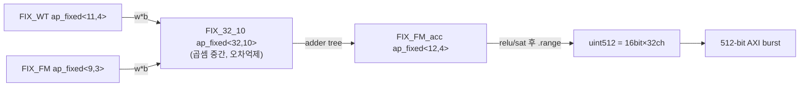
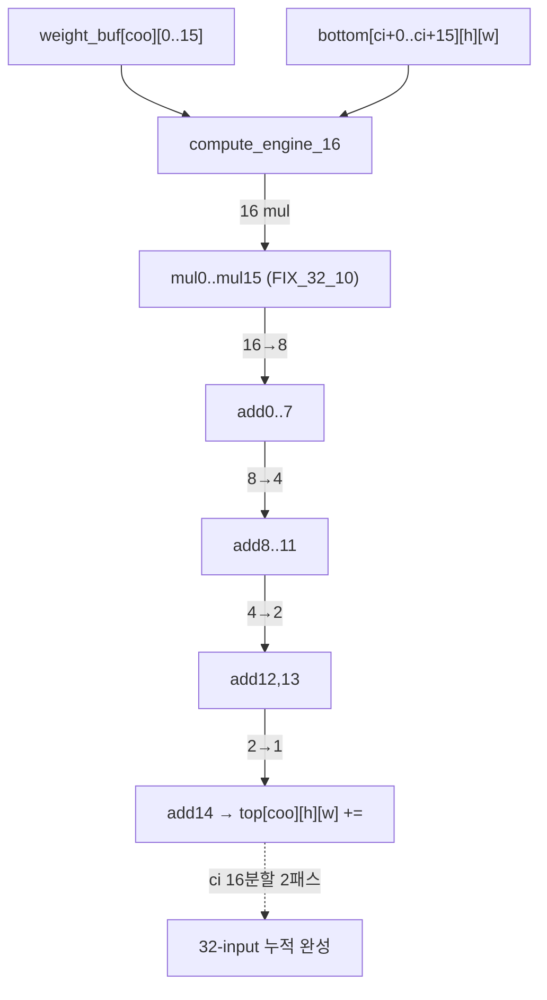
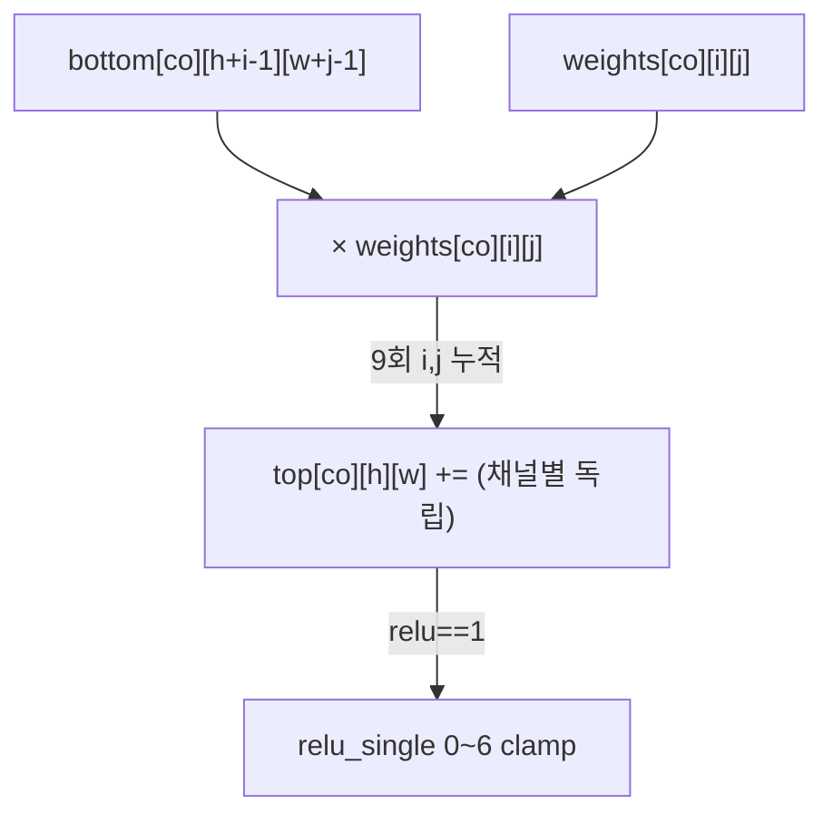
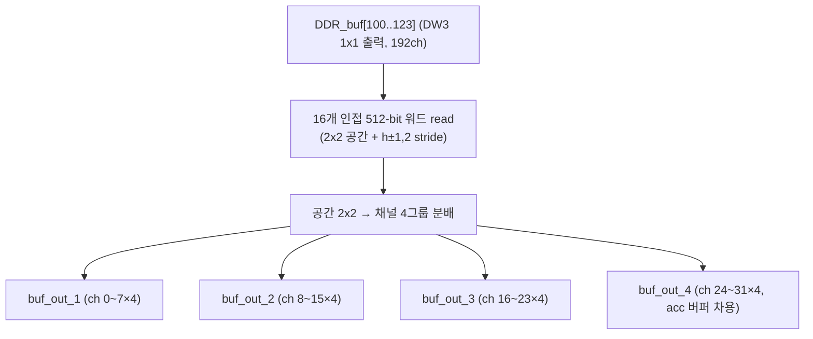
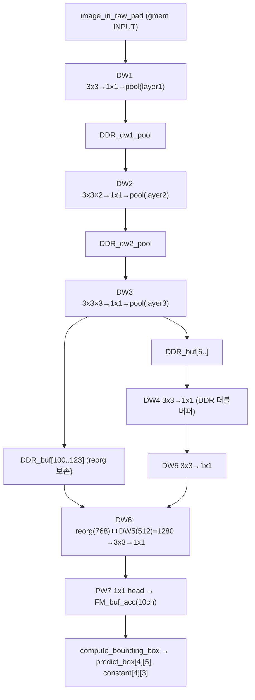
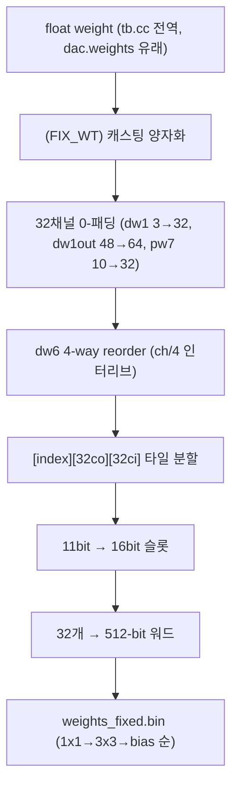

# SkyNet-ZCU104 모듈 통합 가이드

> 1차 요약: [`../SkyNet-ZCU104-master.md`](../SkyNet-ZCU104-master.md) — 본 문서는 그 요약을 모듈 단위로 심화한 통합 가이드다.
> 분석 대상: `\\wsl.localhost\ubuntu-24.04\home\user\project\PRJXR-HBTXR\REF\CNN-Accel\SkyNet-ZCU104-master`
> 작성 원칙: 실제 소스 Read 후 `파일:라인` 근거 표기. 라인 근거 없는 추론은 "추정", 코드로 확인 불가는 "확인 불가"로 명시.

---

## 0. 문서 머리말

### 0.1 대표 케이스 선정
SkyNet은 7개 depthwise-separable 블록(dw1~dw6 + pw7 head)을 단일 HLS top 함수 `SkyNet()`이 레이어-바이-레이어 직렬 실행하는 구조다(`net_hls.cc:773-1223`). 모든 블록이 동일한 두 커널(`DW_CONV_3x3`, `CONV_1x1`)을 **인스턴스 1개로 시분할 재사용**(`net_hls.cc:805-806`)하므로, 대표 케이스를 다음과 같이 선정한다.

- **대표 conv1x1: dw3 1x1 (pointwise expand 96→192, 공간 20×40)** — `CONV_1x1`이 32채널 타일 2회 누적(IC=96→32×3 chunk)으로 호출되는 가장 전형적 패스이며, 출력이 reorg 경로(DDR_buf[100..])로 별도 보존되는 유일 블록이라 dot-tree PE + skip-concat을 동시에 보여준다(`net_hls.cc:940-955`). 근거 shape: dw3_conv_1x1 `[192][96]`(`reorder_weight.cc:31`), 공간 40×80→pool→20×40(`tb.cc:36-40`).
- **대표 depthwise: dw1 3x3 (3→3 채널, 공간 160×320, stride1 + ReLU6 + MaxPool)** — 첫 블록으로 이미지 정규화 로드(`load_image_chunk_norm`, `net_hls.cc:512`)·3x3 dw·1x1 expand·pool이 모두 등장하는 풀 파이프라인 표본(`net_hls.cc:814-853`). 근거 shape: dw1_conv_3x3 `[3][3][3]`(3채널이 HW에서 32로 0-패딩, `reorder_weight.cc:66,172-185`).
- **대표 skip-concat: dw6 (concat 1280 = dw3 reorg 768 + dw5 512 → 96)** — `load_and_reorg`(공간 stride2 reorg, 채널 ×4)와 직접 로드를 결합하는 가장 복잡한 메모리 변환 블록(`net_hls.cc:1087-1192`, `load_and_reorg_part` `net_hls.cc:626-742`). PyTorch `ReorgLayer`(`models.py:12-31,82-84`)와 대응.

### 0.2 수치 표기 규약
- **MAC lanes** = HLS `#pragma HLS unroll` 차원의 곱. `CONV_1x1`은 출력채널 `coo`(0..31) unroll(`conv1x1.cc:116-117`) × PE 내부 16-input(`compute_engine_16`, `conv1x1.cc:11-71`) = **32×16 = 512 MAC lanes**. 단 공간 루프가 `#pragma HLS pipeline II=2`(`conv1x1.cc:115`)이므로 **유효 처리량은 2클럭당 512 MAC = 256 MAC/클럭**. `DW_CONV_3x3`은 채널 `co`(0..31) unroll(`dwconv3x3.cc:39-40`)만 = **32 MAC lanes**(packing 없음, II=1).
- **scalar MACs**(dense 기준) = 1x1은 Hout×Wout×Cout×Cin, dw 3x3은 Hout×Wout×C×9(채널별 독립이라 Cin=Cout 묶음). 본 repo는 sparsity 없는 **dense** 가속기라 유효MAC=scalar MAC(skip 없음).
- **loop trips** = 공간(타일 내 42×82) × 채널타일(CI_N=Cin/32, CO_N=Cout/32) × (1x1은 ci 16분할 2패스). 타일 개수는 블록별 외곽 `row×col` 루프(dw1=8×8, dw2=4×4, dw3=2×2, dw4~6=1×1)로 곱해짐(`net_hls.cc:831,874,924,...`).
- **memory size**(payload bit) = 온칩 버퍼 원소수 × 비트폭. FM 버퍼 `FM_buf[32][44][84]`는 FIX_FM 9bit(`net_hls.h:45`), 가중치 버퍼 `weight_buf_1x1[4][32][32]`는 FIX_WT 11bit(`net_hls.h:47`). DDR 전송폭은 항상 512-bit(=16bit 슬롯 × 32채널, `net_hls.cc:293-299`).
- **타깃 데이터타입**: FM `ap_fixed<9,3>`(`net_hls.h:45`), acc `ap_fixed<12,4>`(`net_hls.h:46`), WT `ap_fixed<11,4>`(`net_hls.h:47`), MAC 중간곱 `ap_fixed<32,10>`(`net_hls.h:57`, 사용 `conv1x1.cc:28`). 모두 `AP_RND, AP_SAT`. **scale/zero-point 정수 양자화가 아닌 고정소수점 PTQ**(학습 float, `reorder_weight.cc`에서 `(FIX_WT)` 캐스팅으로 변환, `:176,217,249`).

### 0.3 운영 경로
```
[SW 학습/float: GPU/ PyTorch (darknet/YOLOv2 변형)]
      │ models.py: depthwise-separable 6블록 + ReorgLayer + 1x1 head, float .weights
      ▼
[오프라인 가중치 양자화 + 재배치: reorder_weight_fix() (HLS CSIM 1회 실행)]
      │  float npy/배열 → (FIX_WT) 고정소수점 → 32채널 0-패딩 → dw6 4-way reorder
      │  → [index][32co][32ci] 32-타일 분할 → 11bit를 16bit 슬롯에 패킹 → 512-bit 워드
      │  출력: weights_fixed.bin (1x1 → 3x3 → bias 순서, reorder_weight.cc:625-664)
      ▼
[HLS 커널: SkyNet() top → DW_CONV_3x3 / CONV_1x1 / Relu_Max_Pooling / load_and_reorg]
      │  단일 인스턴스 시분할(ALLOCATION limit=1, net_hls.cc:805-808)
      │  온칩 FM_buf[32][44][84] 타일 + DDR 더블버퍼링(ping-pong)
      │  Vivado HLS (xczu7ev-ffvc1156-2-e, clk 3ns/333MHz, script.tcl:34-35)
      ▼
[Vivado 시스템 통합: RTL/script.tcl] ──► clk_wiz 300MHz, 2 HP-AXI(INPUT/OUTPUT) → SkyNet.bit/.hwh
      ▼
[ZCU104 board: Deploy/SkyNet.py (PYNQ Overlay)]
      │  cma_array DMA + s_axilite 레지스터(0x10~0x58) + AP_START/IDLE 핸드셰이크
      │  4 이미지 stitch(644×324) → 추론 → sigmoid/exp 후처리(PS) → 픽셀 박스
      │  DVFS(dvs/dfs 바이너리) + 12V 레일 에너지 측정(pynq.DataRecorder)
```
- 타깃: **ZCU104 (xczu7ev-ffvc1156-2-e)**, HLS 합성 목표 333MHz(`script.tcl:35` period 3) / 시스템 통합 clk_wiz 300MHz(`RTL/script.tcl:30`), 데모 실행 330MHz·750mV(`README.md:24`). PYNQ overlay(`SkyNet.py:61`).

---

## 1. Repo / Layer 개요

SkyNet = DAC-SDC 저전력 단일객체 검출용 경량 DNN(depthwise-separable MobileNet 스타일)을 ZCU104에 레이어-직렬 가속하는 HW/SW 통합 프로젝트(`../SkyNet-ZCU104-master.md` 1절). 원본 Ultra96 구현의 ZCU104 포팅 + DVFS 추가판(`README.md:2-3`). 본 repo는 **HW 측(HLS 커널 + 오프라인 reorder)**과 **board 호스트 드라이버**, **학습측 모델 정의**가 모두 자체 소스다(아래 제외 목록). DSE 솔버·자동 코드생성기는 **부재**(SkyNet은 토폴로지가 `net_hls.cc` 본문에 약 1200행 하드코딩, 자동화 계층 없음).

### 1.1 HW(HLS 커널) vs 오프라인(reorder) vs board vs 학습

| 구분 | 파일(자체 소스) | 역할 |
|---|---|---|
| **HLS 커널(HW)** | `FPGA/HLS/net_hls.h` | ap_fixed 타입 + 비트 패킹 상수 + 프로토타입 |
| | `FPGA/HLS/net_hls.cc` | 최상위 `SkyNet()` 7블록 오케스트레이션 + 로드/저장/reorg/pool/bbox (1224행) |
| | `FPGA/HLS/conv1x1.cc` | `compute_engine_16`(16-input dot-tree PE) + `CONV_1x1`(32ch 병렬) |
| | `FPGA/HLS/dwconv3x3.cc` | `DW_CONV_3x3`(채널별 독립 3x3) + relu6 |
| **오프라인 변환(SW↔HW 브리지)** | `FPGA/HLS/reorder_weight.cc` | float→fixed 양자화 + 32-패딩 + dw6 reorder + 512-bit 패킹 → weights_fixed.bin (668행) |
| **검증(테스트벤치)** | `FPGA/HLS/golden_c.cc` | float reference 연산(CSIM 골든) |
| | `FPGA/HLS/output_verify.cc` | golden 대비 비교 |
| | `FPGA/HLS/tb.cc` | CSIM 드라이버 + 전역 float/fixed 가중치 배열 선언 |
| **빌드 스크립트** | `FPGA/HLS/script.tcl` | Vivado HLS csim→csynth→export (top=SkyNet, xczu7ev, 3ns) |
| | `FPGA/RTL/script.tcl` | Vivado 블록디자인(clk_wiz 300MHz, 2 HP-AXI, ps8) → bitstream |
| **board harness** | `FPGA/Deploy/SkyNet.py` | PYNQ Overlay 적재 + cma_array DMA + DVFS + 에너지 측정 |
| **학습(SW)** | `GPU/models.py` | SkyNet PyTorch 모델(depthwise-separable + ReorgLayer + head) |

### 1.2 제외 목록(이름만 언급)
- **생성물(`*.bin/.bit/.hwh`)**: `FPGA/HLS/weights_fixed.bin`(reorder 출력), `weights_floating.bin`(float 입력), `test_image_bins/*.bin`(stitched_0_3.bin 등 CSIM 입력), `FPGA/Deploy/SkyNet.bit`/`SkyNet.hwh`/`SkyNet.bin`(bitstream/HW핸드오프/가중치). 제약에 따라 내용 미열람.
- **컴파일 산출물**: `FPGA/Deploy/dvs`·`dfs`(DVFS 제어 바이너리, 소스 미포함 → 동작은 `SkyNet.py:65-68` 호출부 기준으로만 기술, 내부는 **확인 불가**).
- **데이터**: `FPGA/Deploy/test_images/*.jpg`, `GPU/samples/*.jpg`, `GPU/dac.weights`(darknet 학습 가중치).
- **학습 포크(외부성)**: `GPU/{region_loss.py, dataset.py, utils.py, run.py, demo.py, prepare.py}` — YOLOv2/darknet 유래 학습 루프. 본 가이드는 HW 가속기 중심이라 모델 정의 `models.py`만 분석(나머지 이름만).
- **부재(확인 불가)**: 합성 PPA 리포트(`*.rpt/.xml/.csv`) — repo에 **없음**(Glob 결과 0건). 따라서 LUT/FF/DSP/BRAM/latency/power 정량은 본 repo만으론 **확인 불가**(논문 arXiv:1906.10327 참조). DSE 솔버·자동 코드생성 계층도 부재.

### 1.3 대표 레이어 구성(SkyNet)
근거: `net_hls.cc:814-1214`, `reorder_weight.cc:16-52`(레이어별 가중치 shape), `tb.cc:11-69`(레이어별 float reference shape), `models.py:59-74`. 실행 순서:

`DW1(3→48, s1)+pool → DW2(48→96, s1)+pool → DW3(96→192, s1)+pool → [reorg] → DW4(192→384, s1) → DW5(384→512, s1) → DW6(concat 1280→96, s1) → PW7(96→10, 1x1 head)`

- DW1~DW3은 학습 채널 3/48/96/192이나 HW는 32배수만 처리하므로 32/64/96/192로 0-패딩(`reorder_weight.cc:66-102`). pool 3회로 320×160 → 40×20(공간) 축소(`models.py:61,63,67`, HW에서는 40×80→pool→20×40 stitched, `tb.cc:38-40`).
- DW3 출력은 reorg skip 경로를 위해 DDR_buf[100..123]에 보존(`net_hls.cc:954`), DW6에서 `load_and_reorg`로 192ch→768ch 펼침(`net_hls.cc:1109`).
- 7블록 전체가 단일 함수에 직렬 나열(DATAFLOW 아님, layer-by-layer 시분할). 블록 사이는 `printf("DWx Done")` 진행마커(`net_hls.cc:856,901,961,...`).

---

## 2. 모듈: 자료형 / 양자화 비트폭 — `net_hls.h`

### 2.1 역할 + 상위/하위
- **역할**: 가속기 전체의 고정소수점 자료형과 16-bit 슬롯 패킹 상수를 정의. 모든 커널의 곱셈/누적/패킹 정밀도가 여기서 정적으로 결정됨.
- **상위**: 모든 HLS 소스가 include(`conv1x1.cc:5`, `dwconv3x3.cc:5`, `net_hls.cc:1`, `reorder_weight.cc:9`). **하위**: 없음(원자 자료형).

### 2.2 데이터플로우


### 2.3 대표 코드 위치
`FPGA/HLS/net_hls.h`(148줄): 타입 `:45-67`, 패킹 상수 `:17-19`, top 프로토타입 `:73-87`.

### 2.4 대표 코드 블록
```cpp
typedef ap_fixed<9,  3, AP_RND, AP_SAT> FIX_FM;     // net_hls.h:45  FM 9b (정수3.소수6)
typedef ap_fixed<12, 4, AP_RND, AP_SAT> FIX_FM_acc; // net_hls.h:46  acc 12b
typedef ap_fixed<11, 4, AP_RND, AP_SAT> FIX_WT;     // net_hls.h:47  WT 11b
typedef ap_fixed<32,10, AP_RND, AP_SAT> FIX_32_10;  // net_hls.h:57  곱셈 중간 32b
```
→ FM/acc/WT를 서로 다른 비트폭으로 분리, 곱셈 중간만 32b로 확장해 누적 오차 억제.

```cpp
#define FM_RG     8   // net_hls.h:17  FM 9비트의 상위 인덱스(.range(8,0))
#define FM_ACC_RG 11  // net_hls.h:18
#define WT_RG     10  // net_hls.h:19  WT 11비트(.range(10,0))
```
→ 16-bit 슬롯에서 FM은 `.range(8,0)`(9b), WT는 `.range(10,0)`(11b)만 복사(`net_hls.cc:297,364`, `reorder_weight.cc:581`). 부호확장 없이 하위비트만 복사 — 음수는 ap_fixed 내부표현에 의존.

### 2.5 마이크로아키텍처
- **메모리**: FM 1원소=9bit, WT=11bit, 둘 다 DDR에선 16bit 슬롯(상위 패딩 비트 낭비). 512/16 = **32채널 = 1 AXI 워드**(`net_hls.h:66-67`)가 전 설계의 기본 데이터 단위.
- **병목**: 비트폭이 하드코딩(FM 9b/WT 11b)이라 정밀도-면적 trade-off 탐색 불가, QAT 미적용(고정소수점 PTQ). 16bit 슬롯에 9/11bit만 실어 **AXI 대역폭의 ~31~44% 낭비**(추정 — 9b/16b, 11b/16b 비율).

---

## 3. 모듈: Pointwise 1x1 PE — `compute_engine_16` + `CONV_1x1` (conv1x1.cc) ★핵심①

### 3.1 역할 + 상위/하위
- **역할**: 1x1 conv(=pointwise=1x1 GEMM)를 16-input dot-product 트리 PE 32개 병렬로 수행. **dot-tree×32채널 = 512 MAC lanes**의 본체.
- **상위**: `SkyNet()`이 블록마다 직접 호출(dw1~dw6 1x1, pw7). **하위**: `compute_engine_16`(16-input 가산트리 프리미티브), `load_weights`(가중치 타일 로드).

### 3.2 데이터플로우 (16-input dot-tree)


### 3.3 Function call stack
`net_hls.cc:848/890/946/1013/1074/1183/1210` `CONV_1x1(...)` → `conv1x1.cc:109` `load_weights` + `conv1x1.cc:118` `compute_engine_16`(`conv1x1.cc:11`). bias 초기화는 호출 전 `set_bias_1x1`(`net_hls.cc:398`)이 acc 버퍼에 미리 적재.

### 3.4 대표 코드 위치
`FPGA/HLS/conv1x1.cc`: `compute_engine_16` `:11-71`, `load_weights` `:76-86`, `CONV_1x1` `:91-142`.

### 3.5 대표 코드 블록
```cpp
FIX_32_10 mul0 = w0*b0; ... mul15 = w15*b15;     // conv1x1.cc:33-48  16 병렬 곱
add0=mul0+mul1; ...                              // conv1x1.cc:50-57  16→8
add8=add0+add1; ... add12=add8+add9; ...         // :59-65            8→4→2
add14 = add12 + add13;                           // :67               →1
return add14;                                    // :69
```
→ 4단 가산트리. 곱셈 결과를 `FIX_32_10`(32b)로 폭확장해 누적 오차 억제(`conv1x1.cc:28-29`).

```cpp
for(int ci = 0; ci < 32; ci += 16) {             // conv1x1.cc:106  입력32→16씩 2패스
  load_weights(weights, weight_buf, ci);         // :109
  for(int h=1; h<=42; h++) for(int w=1; w<=82; w++) {
#pragma HLS pipeline II=2                         // :115
    for(int coo = 0; coo < 32; coo++) {
#pragma HLS unroll                               // :117  32 PE 병렬
      top[coo][h][w] += compute_engine_16(...);  // :118-134
    }}}
```
→ `coo` unroll로 **32 compute_engine_16 인스턴스 병렬**. ci 16분할로 PE(16-input)가 32-입력 누적을 2패스로 완성. **output-stationary**(top[coo] 누적 유지).

```cpp
#pragma HLS array_partition variable=top dim=1 complete    // conv1x1.cc:96
#pragma HLS array_partition variable=bottom dim=1 complete // :97 채널32 레지스터화
```
→ 채널 차원(32) 완전분할로 32채널 동시 접근 가능.

### 3.6 마이크로아키텍처
- **Stage 분해**: ① `load_weights` 32×16 타일 BRAM→레지스터(`:109`) ② ci 2패스 × 공간(42×82) × coo 32 unroll, 각 PE 16곱+4단가산(`:116-137`) ③ `top` 누적 write-back(다음 ci 패스 또는 quantize/pool로).
- **MAC lanes**: 32(coo unroll) × 16(PE) = **512 lanes**, II=2라 유효 256 MAC/클럭. DSP packing 없음(1 DSP=1 MAC).
- **scalar MACs(dense)**: dw3 1x1(96→192, 20×40, stitched 타일 42×82 기준) = 42×82×192×96 ≈ 63.5M (타일 1×1, 풀 패스 ci 3×co 6). dw5 1x1(384→512) = 42×82×512×384 ≈ 677M. **1x1이 전체 MAC의 대부분**(depthwise는 ×9뿐).
- **메모리/재사용**: `weight_buf[32][16]` dim1·dim2 complete partition(`:102-103`)으로 512 가중치 동시읽기. 가중치는 매 타일·매 co 재로드(weight-reload, systolic 아님). `top`은 acc 버퍼에 머무름(output-stationary 성향).
- **정량/병목**: II=2가 1x1 처리량 상한 — coo unroll 32개가 같은 `top` 배열에 누적하나 채널분할로 충돌 회피, II=2는 acc read-modify-write 의존(추정). **DSP packing 미적용**이라 ESDA(1 DSP=2 MAC) 대비 DSP 효율 절반 — packing화하면 절감 여지(개선 노브).

---

## 4. 모듈: Depthwise 3x3 Conv — `DW_CONV_3x3` (dwconv3x3.cc) ★핵심②

### 4.1 역할 + 상위/하위
- **역할**: 채널별 독립 3x3 depthwise conv(채널 간 합산 없음) + 선택적 ReLU6. depthwise-separable의 spatial 필터 단.
- **상위**: `SkyNet()`이 블록마다 호출(dw1~dw6 3x3). **하위**: `relu_single`(0~6 clamp 프리미티브).

### 4.2 데이터플로우


### 4.3 Function call stack
`net_hls.cc:838/879/929/987/1047/1117/1156` `DW_CONV_3x3(...)`. 누적 시작 전 bias는 `set_bias_3x3`(`net_hls.cc:413`)가 top에 미리 적재(conv는 그 위에 `+=`).

### 4.4 대표 코드 위치
`FPGA/HLS/dwconv3x3.cc`: `relu_single` `:12-18`, `DW_CONV_3x3` `:21-59`(누적 `:34-46`, ReLU6 패스 `:48-58`).

### 4.5 대표 코드 블록
```cpp
for(int i=0;i<3;i++) for(int j=0;j<3;j++)
  for(int h=1;h<=42;h++) for(int w=1;w<=82;w++) {
#pragma HLS pipeline                              // dwconv3x3.cc:38
    for(int co=0; co<32; co++) {
#pragma HLS unroll                               // :40  32채널 병렬
      top[co][h][w] += (weights[co][i][j] * bottom[co][h+i-1][w+j-1]); // :41
    }}
```
→ 커널 i,j 바깥 / 공간 안쪽 / 채널 최내곽 unroll. `co`가 입력=출력 채널(depthwise). 32 MAC/클럭.

```cpp
if(relu == 1) {
  for(int h=1; h<=42; h+=2) for(int w=1; w<=82; w++) {  // dwconv3x3.cc:49 h를 2씩
#pragma HLS pipeline
    for(int co=0; co<32; co++) {
      top[co][h  ][w] = relu_single(top[co][h  ][w]);    // :53
      top[co][h+1][w] = relu_single(top[co][h+1][w]);    // :54  2행 동시
    }}}
```
→ ReLU6를 별도 패스로 융합, h를 2씩 증가하며 2행 동시 처리로 II 개선.

### 4.6 마이크로아키텍처
- **Stage 분해**: ① bias 적재(외부 `set_bias_3x3`) ② 9(3x3)×42×82 공간 누적, co 32 unroll(`:34-46`) ③ relu==1이면 ReLU6 clamp 패스(`:48-58`).
- **MAC lanes**: 32(co unroll), II=1 → **32 MAC/클럭**. packing 없음.
- **scalar MACs(dense)**: dw3 3x3(96ch, 42×82) = 42×82×96×9 ≈ 2.98M (타일당). dw1 3x3(3→32패딩, 160×320 stitched) = 8×8타일 × 44×84×32×9. 1x1 대비 9/Cin 비율이라 **MAC 비중 낮으나 32 lanes만이라 클럭수는 많음**(병목 후보).
- **메모리/재사용**: `array_partition dim=1 complete`(채널32, `:28-31`). 입력 윈도우(h+i-1,w+j-1)는 line buffer 없이 FM_buf 직접 인덱싱(전 채널 레지스터화로 가능). 가중치 `[32][3][3]` 작음.
- **정량/병목**: dw 단계가 1x1(512 lanes)의 1/16 lanes(32)이고 9 커널탭 직렬 누적이라 **dw가 파이프 직렬 실행에서 클럭수 비효율**(추정). ESDA처럼 dw packing 미적용 — 공통 한계.

---

## 5. 모듈: ReLU + MaxPool 융합 — `Relu_Max_Pooling` (net_hls.cc)

### 5.1 역할 + 상위/하위
- **역할**: 2×2 stride-2 max pooling을 ReLU와 융합. 1x1 출력(acc)을 풀링·재양자화(9b)·512-bit 패킹해 3개 DDR 목적지(dw1_pool/dw2_pool/buf) 중 하나로 write.
- **상위**: `SkyNet()` DW1~DW3 블록이 1x1 직후 호출(`net_hls.cc:849,895,955`). **하위**: `relu_max`(`net_hls.cc:565`), `relu_single`(`net_hls.cc:273`).

### 5.2 대표 코드 위치
`FPGA/HLS/net_hls.cc`: `relu_max` `:565-577`, `Relu_Max_Pooling` `:582-623`.

### 5.3 대표 코드 블록
```cpp
FIX_FM d = relu_max(buf_in[c][h*2-1][w*2-1], buf_in[c][h*2-1][w*2],
                    buf_in[c][h*2][w*2-1], buf_in[c][h*2][w*2]); // net_hls.cc:602-603
DATA.range(FM_RG + c*16, c*16) = d.range(FM_RG, 0);              // :605  9b→16b슬롯
...
if(layer==1) ddr_dw1_pool_burst_ptr[w]...=DATA;   // :608-610  목적지 분기
else if(layer==2) ddr_dw2_pool_burst_ptr[w]...;   // :611-613
else if(layer==3) buf_in_ptr[w]...;               // :614-616
```
→ 4입력 relu후 max → 9b 추출 → 32채널 패킹 → layer별 DDR 라우팅. `#pragma HLS pipeline II=2`(`:598`), co 32 unroll(`:600-601`).

### 5.4 마이크로아키텍처
- **출력 좌표 변환**: 입력 42×82(유효) → 20×40 풀(`:596-597`). h*2-1/h*2로 2×2 윈도우.
- **메모리/병목**: acc(12b) 입력을 9b로 재양자화하며 DDR write. dense 스캔(20×40×32)이라 sparse 이득 없음(SkyNet은 dense). II=2 = pool 처리량 상한.

---

## 6. 모듈: skip-concat reorg 로드 — `load_and_reorg(_part)` (net_hls.cc) ★핵심③

### 6.1 역할 + 상위/하위
- **역할**: DW3 1x1 출력(DDR_buf[100..])을 공간 stride-2 reorg(채널 ×4, 192→768)하며 4개 온칩 버퍼로 분배 로드. PyTorch `ReorgLayer`(`models.py:12-31`)의 HW 메모리-레이아웃 등가물.
- **상위**: `SkyNet()` DW6 전반부(`net_hls.cc:1109-1111`). **하위**: `load_and_reorg`(`:746`)가 4개 사분면에 대해 `load_and_reorg_part`(`:626`) 4회 호출.

### 6.2 데이터플로우


### 6.3 대표 코드 블록
```cpp
load_and_reorg(DDR_buf, 100+c/4,       DDR_buf, 100+c/4+6,
               DDR_buf, 100+c/4+6*2,   DDR_buf, 100+c/4+6*3,
               FM_buf1, FM_buf3, FM_buf4, FM_buf_acc);  // net_hls.cc:1109-1111
```
→ 4개 이미지(배치)의 DW3 출력을 4 사분면으로 reorg. 100+6k 인덱스 = 이미지별 6 타일.

```cpp
DATA[0] = buf_in_ptr[(h  )*84 + w  ]; DATA[1] = buf_in_ptr[(h+2)*84 + w]; ... // net_hls.cc:639-654  16워드
buf_out_1[c*4][(h+1)/2 + offset_h*22][(w+1)/2 + offset_w*42].range(FM_RG,0)
        = DATA[0].range(FM_RG + c*16, c*16);   // net_hls.cc:658  공간/2 다운샘플 + 채널×4 배치
```
→ 16개 인접 워드를 읽어 공간 2×2를 채널축으로 펼침(stride2 reorg). 채널 c×4 인터리브가 `reorder_weight.cc:123-138`의 오프라인 4-way reorder와 짝.

### 6.4 마이크로아키텍처
- **재배치 분담**: 가중치는 오프라인(`reorder_weight.cc` dw6 4-way), 활성은 런타임(`load_and_reorg`). 둘이 같은 4그룹 인터리브로 정합.
- **메모리**: `load_and_reorg_part`가 출력 4번째를 `FM_buf_acc`(acc 버퍼)로 차용(`:630` "borrow one") — FM 버퍼 4개로 부족해 acc 재활용. DW6 dw3x3 직후 `local_buf_copy`(`net_hls.cc:1118`)로 acc→FM 복사.
- **병목**: 16워드 read × 32 packing 분배로 분기·인덱싱 복잡(약 80줄 동일패턴, `:656-739`). 이 reorg가 DW6 메모리 변환의 핵심 비용(추정).

---

## 7. 모듈: 최상위 데이터플로우 + DDR 더블버퍼 — `SkyNet()` + load/store 헬퍼 (net_hls.cc)

### 7.1 역할 + 상위/하위
- **역할**: 7블록을 layer-by-layer로 직렬 실행하며 온칩 FM_buf 타일 + DDR 더블버퍼링(ping-pong)으로 전체 FM을 처리. AXI 인터페이스(7 m_axi 입력 + 3 출력 + s_axilite) 정의.
- **상위**: PYNQ 호스트(`SkyNet.py:171`). **하위**: `CONV_1x1`, `DW_CONV_3x3`, `Relu_Max_Pooling`, `load_and_reorg`, `compute_bounding_box`, 그리고 패킹/언패킹 헬퍼군.

### 7.2 데이터플로우 (블록 실행 시퀀스)


### 7.3 대표 코드 위치
`FPGA/HLS/net_hls.cc`: AXI 인터페이스 `:789-802`, ALLOCATION `:805-808`, DW1 `:814-853`, DW2 `:859-898`, DW3 `:904-958`, DW4 `:964-1021`, DW5 `:1027-1082`, DW6 `:1087-1192`, PW7 `:1198-1212`. 헬퍼: `load_buf_from_DDR` `:333`, `relu_copy_buf_to_DDR(_acc)` `:283/309`, `load_image_chunk_norm` `:512`, `load_dw{1,2}_pool_from_DDR` `:429/452`, `set_bias_{1x1,3x3}` `:398/413`, `clear_buffer` `:476`, `local_buf_copy` `:760`.

### 7.4 대표 코드 블록
```cpp
#pragma HLS INTERFACE m_axi depth=... port=image_in_raw_pad   offset=slave bundle=INPUT  // net_hls.cc:789
... port=DDR_buf_burst bundle=INPUT  ... port=predict_boxes bundle=OUTPUT                // :796-798
#pragma HLS INTERFACE s_axilite register port=return                                     // :802
#pragma HLS ALLOCATION instances=CONV_1x1 limit=1 function                               // :805
#pragma HLS ALLOCATION instances=DW_CONV_3x3 limit=1 function                            // :806
```
→ 7 m_axi(INPUT bundle 7개 + OUTPUT 3개)·단일 인스턴스 시분할 재사용(면적 절감).

```cpp
for(int row=0; row<8; row++) {
  load_image_chunk_norm(FM_buf1, image_in_raw_pad, 0, row, ...);   // net_hls.cc:833
  for(int col=0; col<8; col++) {
    set_bias_3x3(FM_buf2, bias_buf[0]);
    if(col%2==0){ DW_CONV_3x3(FM_buf1, FM_buf2, ...); load_image_chunk_norm(FM_buf3,...);} // :838-840 ping-pong
    else        { DW_CONV_3x3(FM_buf3, FM_buf2, ...); load_image_chunk_norm(FM_buf1,...);} // :842-843
    for(int co=0;co<CO_N;co++){ set_bias_1x1(...); CONV_1x1(FM_buf2,FM_buf_acc,...);
        Relu_Max_Pooling(...,1);}                                  // :846-850
  }}
```
→ DW1: 8×8 타일 순회, FM_buf1/FM_buf3 ping-pong으로 다음 타일 load와 현재 compute 중첩.

```cpp
relu_copy_buf_to_DDR_acc(DDR_buf_burst, 100+co+(col*2+row)*CO_N, FM_buf_acc, 0, 0); // net_hls.cc:954 reorg 보존
Relu_Max_Pooling(FM_buf_acc, ..., 3);                                              // :955 동시 pool
```
→ DW3만 출력을 reorg용으로 DDR_buf[100..]에 별도 저장 + 동시에 pool 경로로도 진행.

### 7.5 헬퍼: 512-bit 패킹/언패킹
```cpp
FIX_FM d = relu_single(src[c][h][w]);
DATA.range(FM_RG + 16*c, 16*c) = d.range(FM_RG, 0);  // net_hls.cc:296-297  9b를 16b슬롯×32ch
dest_ptr[w].range(511, 0) = DATA.range(511, 0);      // :299  512-bit write
```
→ `relu_copy_buf_to_DDR`(쓰기) / `load_buf_from_DDR`(읽기, `:342-345`)가 32채널을 512-bit 워드에 패킹·언패킹. AXI 대역폭 = 32채널 동시.

### 7.6 마이크로아키텍처
- **타일링**: 온칩 `FM_buf[32][44][84]`(32ch × halo포함 44×84, 유효 42×82)가 처리 단위. 전체 FM이 더 커서 row×col 타일로 분할 + DDR 경유(dw1=8×8, dw2=4×4, dw3=2×2, dw4~6=1×1, `net_hls.cc:831/874/924`).
- **더블버퍼**: FM_buf1/3(또는 1/2) ping-pong으로 load↔compute 중첩(`:837-843,985-992,1011-1018`). DDR 인덱스도 더블버퍼(예 DW4 in [6..11]/out [12..17], `:967-968`).
- **온칩 버퍼 합계**: FM_buf1~4(4×32×44×84×9b ≈ 4.26Mb) + FM_buf_acc(32×44×84×12b ≈ 1.42Mb) + weight_buf_1x1[4][32][32]×11b + weight_buf_3x3[4][32][3][3]×11b + bias_buf(`net_hls.cc:12-21`). DDR_buf는 128×44×84×512b(외부, `:781`).
- **AXI bundle**: INPUT(image+1x1wt+3x3wt+bias+dw1pool+dw2pool+buf=7포트)·OUTPUT(predict/constant/debug=3) → RTL에서 2 HP-AXI(smc로 머지, `RTL/script.tcl:77-80`).
- **병목/주의**: 토폴로지 약 1200행 하드코딩(채널수/타일/DDR 인덱스 수작업) → 일반화 어려움. `debug[10][32][44][84]` 포트(`:783`)는 디버그용(실제 추론 불요). DDR 왕복(블록마다 pool/buf write→read)이 메모리 대역폭 압박(추정).

---

## 8. 모듈: 검출 후처리(온칩) — `compute_bounding_box` (net_hls.cc)

### 8.1 역할 + 상위/하위
- **역할**: PW7 출력(FM_buf_acc 10채널 logit)을 4 사분면(=배치 4 이미지)으로 나눠 각 영역에서 confidence 최댓값(채널4 또는 9) 위치를 찾고 박스 좌표(채널0~3 / 5~8)·anchor 인덱스를 raw로 추출.
- **상위**: `SkyNet()` 마지막(`net_hls.cc:1217`). **하위**: 없음.

### 8.2 대표 코드 위치
`FPGA/HLS/net_hls.cc`: `compute_bounding_box` `:25-270`(사분면 0 `:37-86`, 1 `:90-147`, 2 `:150-207`, 3 `:211-268`).

### 8.3 대표 코드 블록
```cpp
for(int m=1;m<=20;m++) for(int n=1;n<=40;n++){     // net_hls.cc:37-38  사분면0
  conf_box1 = FM_buf_acc[4][m][n];                 // :40  채널4 = anchor0 conf (logit)
  if(conf_box1 > conf_thresh){ conf_thresh=...; conf_j=0; conf_m=m; conf_n=n; }}
...
predict_box[0][0] = FM_buf_acc[0][conf_m][conf_n]; // :66  최대conf 위치의 x,y,w,h logit
constant[0][0]=conf_j; constant[0][1]=conf_n-1; constant[0][2]=conf_m-1; // :82-84 anchor/grid 인덱스
```
→ 사분면당 anchor 2개(채널4/9) conf 비교 → 1박스. sigmoid/exp는 주석처리(`:39,53`) = PL은 logit만, 비선형은 PS.

### 8.4 마이크로아키텍처
- **사분면 좌표**: 0=(m1-20,n1-40), 1=(m1-20,n43-82), 2=(m23-42,n1-40), 3=(m23-42,n43-82)(`:37,98,158,219`) — 644×324 stitched의 4 이미지.
- **PS 분담**: sigmoid/exp/anchor 스케일은 `SkyNet.py:139-148`에서 적용. **NMS 없음**(사분면당 1박스 고정).
- **병목**: 단순 max 스캔(20×40×4영역). 다객체/NMS 확장 어려움(한계).

---

## 9. 모듈: 가중치 양자화 + 재배치 — `reorder_weight_fix` (reorder_weight.cc) ★SW↔HW 브리지

### 9.1 역할 + 상위/하위
- **역할**: 학습 float 가중치를 (1) 고정소수점 양자화 (2) 32채널 0-패딩 (3) dw6 4-way reorder (4) [index][32co][32ci] 타일분할 (5) 11bit→16bit슬롯→512-bit 패킹 후 `weights_fixed.bin` 생성. **HLS CSIM에서 1회 실행되는 오프라인 전처리**.
- **상위**: `script.tcl:27`이 테스트벤치로 등록(`csim_design` 시 실행). **하위**: 없음(float 전역 배열은 `tb.cc:11-69`가 정의).

### 9.2 데이터플로우


### 9.3 대표 코드 위치
`FPGA/HLS/reorder_weight.cc`: dw6 3x3 reorder `:122-147`, dw6 1x1 reorder `:150-168`, 32-패딩(dw1) `:172-204`, fixed 캐스팅(전 레이어) `:171-328`, 타일 분할 `:330-565`, 16bit 패킹 `:577-606`, 512-bit 패킹+파일쓰기 `:623-664`.

### 9.4 대표 코드 블록
```cpp
for(int ch=0; ch<768; ch+=4){                                  // reorder_weight.cc:123  dw6 4-way
  dw6_conv_3x3_weight_reo[ch  ][m][n] = dw6_conv_3x3_weight[ch/4      ][m][n];
  dw6_conv_3x3_weight_reo[ch+1][m][n] = dw6_conv_3x3_weight[ch/4 +192 ][m][n];
  dw6_conv_3x3_weight_reo[ch+2][m][n] = dw6_conv_3x3_weight[ch/4 +192*2][m][n];
  dw6_conv_3x3_weight_reo[ch+3][m][n] = dw6_conv_3x3_weight[ch/4 +192*3][m][n]; } // :131-134
```
→ dw3 reorg(192→768)의 4-way 채널 인터리브. `net_hls.cc:658`의 c×4 활성 배치와 정합. ch≥768(dw5 512ch)은 그대로(`:139-147`).

```cpp
if(c < 3){ fix_dw1_conv_3x3_weight[c][m][n] = (FIX_WT)dw1_conv_3x3_weight[c][m][n]; } // reorder_weight.cc:175-176
else     { fix_dw1_conv_3x3_weight[c][m][n] = 0; }                                    // :180  32-패딩
```
→ float→FIX_WT 캐스팅 양자화 + 미사용 채널 0-패딩(HW 32배수 정렬).

```cpp
fix_conv_weight_1x1_all[index_1x1][co][ci] = fix_dwX_conv_1x1_weight[co+CO*32][ci+CI*32]; // reorder_weight.cc:360 등
...
DATA.range(j*16 + WT_RG, j*16) = fix_conv_weight_1x1_all[i][j][k].range(WT_RG, 0);        // :633  11b→16b슬롯×32
fix_conv_weight_1x1_all_512bit[i][k].range(511,0) = DATA.range(511,0);                    // :635  512-bit
ofs_param_write_512.write((char*)fix_conv_weight_1x1_all_512bit, index_1x1*32*sizeof(uint512)); // :638
```
→ [index][32co][32ci] 타일 → co축 32개를 512-bit 워드로 직렬화. 파일은 1x1(`:638`)→3x3(`:653`)→bias(`:663`) 순 = 호스트 읽기순(`SkyNet.py:52-56`)과 일치.

### 9.5 마이크로아키텍처(변환 관점)
- **레이어별 패딩표**: dw1 3→32 / dw1out 48→64 / dw2 48→64 / pw7 10→32(`reorder_weight.cc:66-102`). 0-패딩 채널은 MAC에 0 기여(정확도 무영향, 면적/대역폭만 손해).
- **HW 정합 검증**: `golden_c.cc`(float ref)·`output_verify.cc`가 CSIM에서 fixed 출력과 비교(`script.tcl:25-26`). 비트정확 정합은 골든 데이터로 검증.
- **병목 없음**(빌드타임). 단 float 가중치 입력(`weights_floating.bin`/`tb.cc` 전역)이 있어야 동작 — repo엔 .bin 부재(제외) → 실행 자체는 **확인 불가**, 로직만 분석.

---

## 10. 모듈: 학습 모델 정의 — `models.py` (SW)

### 10.1 역할 + 상위/하위
- **역할**: SkyNet PyTorch float 모델 — depthwise-separable 6블록 + ReorgLayer skip-concat + 1x1 detection head. HW가 모사할 토폴로지의 원본 정의.
- **상위**: `run.py`/`demo.py` 학습/추론(외부 포크, 제외). **하위**: `region_loss.RegionLoss`(YOLOv2 유래), `ReorgLayer`.

### 10.2 대표 코드 위치
`GPU/models.py`: `ReorgLayer` `:12-31`, `conv_dw`(depthwise-separable) `:49-58`, 블록 구성 `:59-74`, forward(concat) `:80-86`.

### 10.3 대표 코드 블록
```python
def conv_dw(inp, oup, stride):                       # models.py:49
    return nn.Sequential(
        nn.Conv2d(inp, inp, 3, stride, 1, groups=inp, bias=False),  # :51 depthwise 3x3
        nn.BatchNorm2d(inp), nn.ReLU6(inplace=True),                # :52-53
        nn.Conv2d(inp, oup, 1, 1, 0, bias=False),                   # :55 pointwise 1x1
        nn.BatchNorm2d(oup), nn.ReLU6(inplace=True))                # :56-57
```
→ HW `DW_CONV_3x3`+`CONV_1x1` 쌍 = PyTorch conv_dw. ReLU6(`:53,57`) = HW `relu_single`(0~6, `dwconv3x3.cc:12-18`). BN은 학습 후 가중치에 folding(추정 — HW엔 bias만 존재, scale은 가중치 흡수).

```python
x_p1_reorg = self.reorg(x_p1)                        # models.py:82  dw3 출력 reorg
x_p3_in = torch.cat([x_p1_reorg, x_p2], 1)           # :84  concat(768+512=1280)
```
→ HW `load_and_reorg`(`net_hls.cc:1109`) + DW6 concat과 정확 대응.

### 10.4 마이크로아키텍처(매핑 관점)
- **채널 매핑**: conv_dw(3,48,1)→dw1, (48,96)→dw2, (96,192)→dw3, (192,384)→dw4, (384,512)→dw5, (1280,96)→dw6, Conv2d(96,10)→pw7(`models.py:60-73`). HW 채널수와 일치(패딩 전).
- **anchor**: RegionLoss anchors 2개(`models.py:75-77`) = HW 채널4/9 conf, box `[1.49,2.36,4.01,5.76]`(`SkyNet.py:187`).
- **BN folding/양자화 학습부 부재**: float→fixed 변환은 `reorder_weight.cc`가 담당하나, BN→bias folding 스크립트는 본 repo에 명시 부재 → folding 과정은 **확인 불가**(추정: dac.weights에 이미 folding된 상태).

---

## 11. 모듈: top 인터페이스 + board harness — `SkyNet.py` + RTL/script.tcl

### 11.1 역할 + 상위/하위
- **역할(board)**: PYNQ Overlay로 bitstream 적재, cma_array 연속 물리메모리 할당, s_axilite 레지스터에 물리주소 write, AP_START~AP_IDLE 핸드셰이크로 추론 + 4 이미지 stitch/후처리 + DVFS + 12V 에너지 측정.
- **역할(RTL)**: HLS IP를 ps8 + clk_wiz(300MHz) + 2 HP-AXI(smc)로 통합해 bitstream 생성.

### 11.2 대표 코드 위치
`FPGA/Deploy/SkyNet.py`: cma 할당 `:35-44`, 가중치 로드 `:50-56`, overlay/DVFS `:61-68`, stitch `:88-118`, 후처리 `:121-162`, 레지스터 write `:173-181`, AP 핸드셰이크 `:216-219`, 에너지 `:184-235`. `FPGA/RTL/script.tcl`: clk_wiz 300MHz `:30`, HP-AXI 연결 `:77-80`, ps8 freq `:70`.

### 11.3 대표 코드 블록
```python
SkyNet.write(0x10, img.physical_address)            # SkyNet.py:173  AXI 슬레이브 레지스터
SkyNet.write(0x18, conv_weight_1x1_all.physical_address) # :174  (0x10~0x58)
... SkyNet.write(0x40, DDR_buf.physical_address)    # :179
SkyNet.write(0x00, 1)                               # :216  AP_START
isready = SkyNet.read(0x00); while(isready==1): ... # :217-219  AP_IDLE 폴링
```
→ ap_ctrl 핸드셰이크로 wall-clock latency 측정.

```python
mytype = 'B,'*63 + 'B'                              # SkyNet.py:33  64바이트=512-bit 구조체
conv_weight_1x1_all = xlnk.cma_array(shape=(413, 32), dtype=dt) # :37
predict_boxes[idx][0] = 1.0/(1.0+math.exp(-...)) + constant[idx][1] # :139 sigmoid + grid offset(PS)
```
→ 가중치 레이아웃(413,32)/(64,3,3)/(106) = reorder_weight.cc 출력순. sigmoid/exp 후처리는 PS.

```python
recorder = pynq.DataRecorder(rails['12V'].power)   # SkyNet.py:185
energy = recorder.frame["12V_power"].mean() * total_time  # :235
```
→ 12V 레일 전력 적분 = 에너지(J).

### 11.4 마이크로아키텍처
- **합성/통합 타깃**: HLS xczu7ev period 3ns(`script.tcl:35`), RTL clk_wiz 300MHz(`RTL/script.tcl:30`), 데모 330MHz·750mV(`README.md:24`). 흐름 csim→csynth→export(`script.tcl:38-49`).
- **AXI 토폴로지**: HLS 2 bundle(INPUT/OUTPUT) → smc 2개 → HP0/HP1(`RTL/script.tcl:77-80`). ps8 GP2/GP3(s_axilite 제어)·HPM0/HPM1(`:65-66,75-76`).
- **DVFS/병렬화**: `dvs`/`dfs` 바이너리 호출(소스 부재, 동작 **확인 불가**, `:65-68`). stitch/후처리는 multiprocessing Process로 추론과 파이프라인(`:195-196`).

---

## 12. 모듈 한눈 요약 표

| 모듈 | 파일 | 핵심 함수(라인) | 역할 | 대표 정량 |
|---|---|---|---|---|
| 자료형/양자화 | net_hls.h | FIX_FM/acc/WT(:45-47), 패킹상수(:17-19) | 고정소수점 + 16b슬롯 | FM9b/acc12b/WT11b, 32ch=512b |
| 1x1 PE | conv1x1.cc | compute_engine_16(:11), CONV_1x1(:91) | 16-input dot-tree×32ch | **512 MAC lanes**(II=2) |
| depthwise 3x3 | dwconv3x3.cc | DW_CONV_3x3(:21), relu_single(:12) | 채널별 독립 3x3 + ReLU6 | 32 MAC lanes(II=1) |
| relu+pool | net_hls.cc | Relu_Max_Pooling(:582), relu_max(:565) | 2x2 maxpool 융합 + 라우팅 | 42×82→20×40, II=2 |
| skip-reorg | net_hls.cc | load_and_reorg(_part)(:746/626) | stride2 reorg 192→768 | 16워드 read, 4그룹 분배 |
| top/dataflow | net_hls.cc | SkyNet(:773), load/store 헬퍼(:283-512) | 7블록 직렬 + DDR 더블버퍼 | 단일 인스턴스, FM_buf[32][44][84] |
| bbox 후처리 | net_hls.cc | compute_bounding_box(:25) | 4사분면 conf-max | anchor2, NMS 없음 |
| 양자화+reorder | reorder_weight.cc | reorder_weight_fix(:119) | float→fixed+패딩+패킹 | weights_fixed.bin(1x1→3x3→bias) |
| 학습모델 | models.py | conv_dw(:49), ReorgLayer(:12) | depthwise-sep + reorg | 6블록+head, anchor2 |
| board | SkyNet.py | write/read AP(:173-219), 후처리(:139) | PYNQ overlay + DVFS + 에너지 | 4이미지 stitch 644×324, 12V |
| RTL 통합 | RTL/script.tcl | clk_wiz(:27), HP-AXI(:77-80) | bitstream 생성 | 300MHz, 2 HP-AXI |

---

## 13. 읽기 순서 / 코드 추적 순서

1. **자료형 먼저**: `net_hls.h`(FIX_FM/acc/WT, 패킹상수 `:17-47`) → 고정소수점·512-bit 패킹 직관.
2. **연산 핵심**: `conv1x1.cc` compute_engine_16(`:11-71`, 4단 가산트리) → CONV_1x1(`:91`, coo unroll 32 + ci 2패스). 그 다음 `dwconv3x3.cc`(`:21`, 채널독립 + ReLU6).
3. **융합/라우팅**: `net_hls.cc` Relu_Max_Pooling(`:582`, layer별 DDR 분기) + 패킹 헬퍼(`:283-350`).
4. **데이터플로우 골격**: `net_hls.cc` SkyNet(`:773`) DW1(`:814`, ping-pong) → DW3(`:904`, reorg 보존 `:954`) → DW6(`:1087`, load_and_reorg `:1109`).
5. **skip-concat**: `load_and_reorg_part`(`:626`)의 16워드 reorg ↔ `reorder_weight.cc:123-138` 4-way reorder를 짝으로 읽기.
6. **양자화 정합**: `reorder_weight.cc` 캐스팅(`:175`)·512-bit 패킹(`:633`) ↔ `net_hls.cc:633`(load) ↔ `SkyNet.py:52`(호스트 읽기) 3자 정합.
7. **후처리/보드**: `compute_bounding_box`(`:25`, logit raw) → `SkyNet.py:139`(sigmoid/exp PS) → `SkyNet.py:216`(AP 핸드셰이크).
8. **SW 원본**: `models.py` conv_dw(`:49`)·reorg(`:82`)로 HW가 무엇을 모사하는지 역추적.

---

## 14. 병목 후보 & 병렬도/노브

### 14.1 병목 후보
1. **1x1 II=2 + DSP packing 미적용**(`conv1x1.cc:115`): 512 lanes이나 II=2로 유효 256 MAC/클럭, 1 DSP=1 MAC. ESDA(1 DSP=2 MAC packing) 대비 DSP 효율 절반 — packing화·II=1 개선 여지(추정).
2. **depthwise 32 lanes만**(`dwconv3x3.cc:39-40`): 1x1의 1/16 병렬도 + 9탭 직렬 누적. layer 직렬 실행에서 dw 단계 클럭수 비효율(추정).
3. **DDR 왕복(layer-by-layer)**: 블록마다 pool/buf를 DDR write→read(`net_hls.cc` 전반). DATAFLOW가 아니라 직렬이라 메모리 대역폭이 latency 지배(추정). 512-bit AXI지만 16b 슬롯에 9/11b만 실어 ~31~44% 대역폭 낭비(`net_hls.h:17-19`).
4. **토폴로지 하드코딩(~1200행)**: 채널수/타일/DDR 인덱스 수작업 전개(`net_hls.cc:814-1212`) → 다른 net/해상도 일반화 어려움.
5. **고정소수점 PTQ**: FM9b/WT11b 하드코딩(`net_hls.h:45-47`), QAT 미적용 → 정밀도-면적 탐색 제한.
6. **단일 박스/NMS 없음**(`net_hls.cc:25-270`): 사분면당 1박스(배치4 고정) → 다객체 확장 불가.
7. **합성 PPA 부재**: repo에 리포트 없음 → LUT/FF/DSP/BRAM/latency/power **확인 불가**(논문 참조 필요).

### 14.2 병렬도/설계 노브
- **채널 병렬도 = 32 고정**: `array_partition dim=1 complete`(`conv1x1.cc:96`, `dwconv3x3.cc:28`) + 512-bit AXI(32×16b)에 묶여 있어 **32가 전 설계의 자석 상수**. 변경 시 패킹·reorder·호스트 dtype 모두 수정 필요(`SkyNet.py:33`).
- **PE reduction 폭 = 16**: compute_engine_16의 16-input(`conv1x1.cc:11`). ci를 16씩 분할(`:106`)하므로 입력채널 32단위면 2패스. reduction 폭 확장하면 1x1 패스 수 감소(개선 노브).
- **II 노브**: 1x1 II=2(`:115`), dw/pool II=1~2. acc read-modify-write 의존이 II=2 원인(추정).
- **단일 인스턴스 시분할**(`net_hls.cc:805-808`): 면적 절감 ↔ throughput 손해 trade-off. ZCU104 면적 예산 맞춤.
- **DVFS**: 데모 frequency 20~500MHz / voltage 660~850mV(`SkyNet.py:20-23`) → energy-latency Pareto 탐색 노브. 기본 330MHz·750mV(`README.md:24`).
- **타일 크기 44×84**(halo 포함, 유효 42×82): FM_buf 고정. 더 크면 BRAM↑·DDR왕복↓ trade-off.

---

*근거 파일(절대경로)*:
`\\wsl.localhost\ubuntu-24.04\home\user\project\PRJXR-HBTXR\REF\CNN-Accel\SkyNet-ZCU104-master\FPGA\HLS\{net_hls.h,net_hls.cc,conv1x1.cc,dwconv3x3.cc,reorder_weight.cc,tb.cc,script.tcl}`,
`...\FPGA\RTL\script.tcl`,
`...\FPGA\Deploy\SkyNet.py`,
`...\GPU\models.py`,
`...\README.md`.
*합성 PPA 리포트는 repo 부재 → LUT/FF/DSP/BRAM/latency/power 확인 불가(논문 arXiv:1906.10327 참조).*
