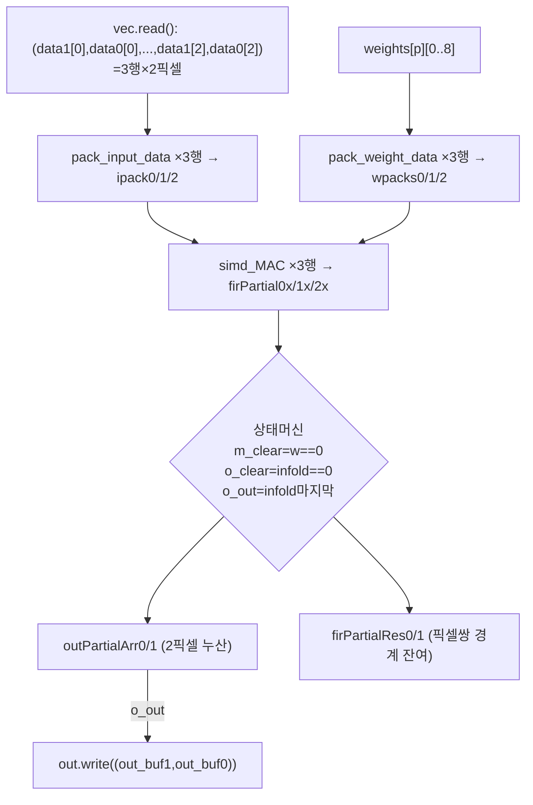
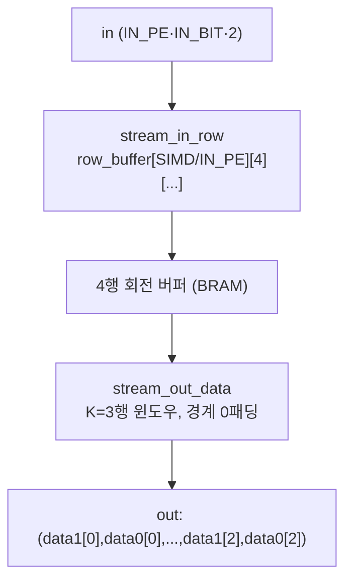

# Uint-Packing 모듈 통합 가이드

> 1차 요약: [`../Uint-Packing-master.md`](../Uint-Packing-master.md) — 본 문서는 그 요약을 모듈 단위로 심화한 통합 가이드다.
> 분석 대상: `\\wsl.localhost\ubuntu-24.04\home\user\project\PRJXR-HBTXR\REF\CNN-Accel\Uint-Packing-master`
> 작성 원칙: 실제 소스 Read 후 `파일:라인` 근거 표기. 라인 근거 없는 추론은 "추정", 코드로 확인 불가는 "확인 불가"로 명시.
> 형제 가이드: [`../ESDA/MODULE_GUIDE.md`](../ESDA/MODULE_GUIDE.md) 와 동형(0 머리말 / 1 개요 / 2..N 모듈 6요소 / N+1 한눈표 / N+2 읽기순서 / N+3 병목·노브).

---

## 0. 문서 머리말

### 0.1 대표 케이스 선정
- **대표 모델: UltraNet 4w4a (DAC-SDC 계열, 드론/보트 객체검출)**. 8개 3×3 conv + 1×1 검출헤드. 톱 함수 `ultra_net`(`src/ultranet.cpp:187`), dataflow 본체 `do_compute2`(`src/ultranet.cpp:25`). 입력 160×320×3(`config_opt3.h:5-10`), TB 입력 `boat6_0.bin` 360×640(`ultranet.cpp:263-264`)을 160×320으로 다운스케일 가정.
- **대표 conv: `CONV_1`(3×3, 16→32ch, 80×160, 4w4a)** — DSPopt3 패킹의 **표준 경로**. conv1~7이 모두 `conv3x3_bn_act_DSPopt3`를 쓰며 conv1이 첫 4w4a 본체(conv0은 RGB 8bit LUT 예외). SIMD_DSP6=8, PE_DSP6=4(`config_opt3.h:46-47`). 패킹 비트 배치(2픽셀×3가중치→1곱셈 4결과)의 모든 메커니즘이 활성.
- **대표 1×1: `CONV_8`(1×1, 64→36ch, 10×20, 입력4bit/가중치8bit)** — DSP2 패킹(2가중치→1곱셈 2결과)의 표준 경로. 검출헤드 logit 생성. SIMD_DSP2=4, PE_DSP2=2(`config_opt3.h:210-211`).
- **대표 레이어0: `CONV_0`(3×3, 3→16ch, 160×320, 8w8a)** — RGB 입력이라 채널 적어 **DSP 패킹 대신 LUT 곱**(`conv2d_l0_opt.hpp:120-127`, 호출 `:253-258`)을 채택한 예외 경로.

### 0.2 수치 표기 규약
- **MAC lanes** = HLS `#pragma HLS UNROLL`/`pipeline` 병렬 차원 곱 × **DSP packing 배수**.
  - 3×3 DSPopt3: 곱셈기 1개가 **2 픽셀 × (서로 다른 K행 2 가중치)** = 4 부분곱(그중 유효 누산 4개)을 산출(`conv2d_DSPopt3.hpp:263-271`). 공간 lanes = PE × SIMD, 그 위에 packing 배수 **(2픽셀 × 2가중치활용)**을 곱해 표기. 단, 가중치 3개를 패킹하나 유효 출력은 인접 2 세그먼트에 집중되므로 "픽셀 2배"가 안정적 packing 이득(가중치 방향은 carry 보정 의존, 0.3절 참조).
  - 1×1 DSP2: 곱셈기 1개가 **1 입력 × 2 가중치(=2 출력채널)** = 2 MAC(`conv1x1DSP2.hpp:177-183`). lanes = (PE/2)×SIMD × **2(packing)** = PE×SIMD.
  - 레이어0 LUT: packing 미적용, `Mul_LUT` 코어로 DSP 미사용(`conv2d_l0_opt.hpp:123`). lanes = PE×9(3×3 완전 언롤).
- **scalar MACs**(dense 기준) = OFM_ROW×OFM_COL×OFM_CH×IFM_CH×K×K. 1×1은 K=1.
- **loop trips** = 본체 루프 `OUT_H × (OUT_CH/PE) × (OUT_W/2) × (IN_CH/SIMD)`(3×3, `conv2d_DSPopt3.hpp:354-357`) 또는 `OUT_ROW × OUT_COL × (OUT_CH/PE) × (IN_CH/SIMD)`(1×1, `conv1x1DSP2.hpp:211-214`). 3×3은 **w를 /2**(2픽셀 동시)라 가로 trip이 절반.
- **memory size**(payload bit) = 라인버퍼 `4행 × (IN_W/2·IN_CH/SIMD) × (IN_PE·IN_BIT·2)bit`(`conv2d_DSPopt3.hpp:115-116`), 가중치 ROM `[PE][K·K][(IN_CH/SIMD)(OUT_CH/PE)] × (SIMD·W_BIT)bit`(생성물 weights_opt3.hpp, 차원만 `conv2d_DSPopt3.hpp:289`).
- **타깃 데이터타입**: 활성 4bit unsigned·가중치 4bit signed(conv1~7, `config_opt3.h:37-39`); conv0은 in8/w8(`:13-15`), conv8은 in4/w8(`:205-206`). psum M_BIT는 호출부에서 레이어별 상수(16~26)로 주입(`ultranet.cpp:58,77,179`). 최종 활성 4bit(0~15) 양자화(`function.h:133-141`).

### 0.3 운영 경로
```
[SW 학습/양자화: UltraNet 4w4a (본 repo 외부) ]
      │ int4/int8 weight + inc/bias 추출 → weights_opt3.hpp (conv_*_w_new/inc_new/bias_new)
      ▼
[HLS 합성: scripts/hls_script.tcl]
      │ set_top ultra_net, part xczu3eg-sbva484-1-e, clk 3.3ns (~303MHz) (hls_script.tcl:7-12)
      │ csim → csynth → cosim → export ip_catalog (verilog) (hls_script.tcl:18-21, 주석 처리됨)
      ▼
[RTL/Vivado: scripts/rtl_script.tcl]
      │ create_project ... part xczu3eg-sbva484-1-e, board Ultra96-v2 (rtl_script.tcl:46-47)
      │ BD: axi_dma(64b) + smartconnect + ultra_net IP + zynq_ultra_ps_e (rtl_script.tcl:204-234)
      ▼
[board: Ultra96-v2 (ZU3EG), AXI-DMA로 AXIS 입출력]
      │ TB main: boat6_0.bin → AXIS 주입 → ultra_net → 출력크기 확인 (ultranet.cpp:262-288)
```
- 타깃: **Ultra96-v2 / ZU3EG (xczu3eg-sbva484-1-e)**, clk period 3.3ns 목표(~303MHz, `hls_script.tcl:12`), uncertainty 12.5%(`:16`). **이는 1차 요약의 "보드 미명시(추정 Zynq UltraScale+)"를 정정**: 빌드 스크립트가 Ultra96-v2/ZU3EG를 명시(`rtl_script.tcl:46-47`).

---

## 1. Repo / 연산 그래프 개요

Uint-Packing = **unsigned-integer DSP 패킹 일반화 모델**을 UltraNet 4w4a에 적용해, 1개 DSP에 다중 저비트 MAC을 압축하고 전 레이어를 온칩 스트리밍 DATAFLOW로 융합한 HLS 가속기(`README.md:5`, `ultranet.cpp:27`). 핵심 차별점은 기존 signed 패킹의 정확도 손실·면적 증가를 unsigned 입력 + signed 가중치 패킹으로 동시 해결(`README.md:5`).

### 1.1 자체 소스 vs 생성물 vs 빌드
| 구분 | 파일(자체 소스) | 역할 |
|---|---|---|
| **DSP 패킹 본체** | `src/conv2d_DSPopt3.hpp` | 3×3 conv DSPopt3(2픽셀×3가중치 패킹) + 라인버퍼 + BN |
| | `src/conv1x1DSP2.hpp` | 1×1 conv DSP2(2가중치 패킹) + 채널reorder. conv8 헤드 |
| | `src/conv2d_l0_opt.hpp` | 레이어0(RGB 8bit) LUT 곱 conv (DSP2 fallback 정의만) |
| **양자화/유틸** | `src/function.h` | 패딩 + 고정소수 BN+양자화ReLU(`bn_qurelu_fixed`) |
| | `src/stream_tools.h` | AXIS 구조체·폭변환·ExtractPixels·AddLast |
| | `src/pool_reord.hpp` | 2×2 맥스풀(2픽셀 패킹 스트림 대응) |
| **형상/구성** | `src/config_opt3.h` | 레이어별 형상/비트폭/SIMD/PE/패킹 파라미터 |
| **톱/TB** | `src/ultranet.cpp` | 톱 `ultra_net`, dataflow `do_compute2`, TB `main` |
| **빌드** | `scripts/hls_script.tcl` | HLS 프로젝트(part/clk/flow) |
| | `scripts/rtl_script.tcl` | Vivado BD(DMA+PS+IP) — Ultra96-v2 |

### 1.2 제외 목록(이름만 언급)
- **생성물**: `src/weights_opt3.hpp` — 가중치/inc/bias 상수(conv_*_w_new/inc_new/bias_new). 대용량, 분석 제외(차원·정합만 인용).
- **레거시(비활성)**: `src/param.h` — 구버전 12bit 패킹 예시 가중치(`param.h:5` `conv_0_w[16][9]`은 `ap_uint<12>` = 3탭×4bit 패킹). `ultranet.cpp:12`에서 include 주석 처리되어 현재 미사용. 패킹 비트폭 예시로만 인용.
- **디버그**: `src/debug.hpp` — 빈/주석 보조(`ultranet.cpp:22` include되나 내용 없음).
- **부재(확인 불가)**: SW 양자화 학습부, 가중치 추출 스크립트, 후처리(NMS/박스디코딩), board PYNQ harness — 본 repo 미동봉. 정확도 평가 코드 없음(TB는 출력 크기만 확인, `ultranet.cpp:285`).

### 1.3 대표 모델 레이어 구성(UltraNet)
근거: `config_opt3.h:1-211`, `ultranet.cpp:52-184`.
```
입력 160×320×3 (AXI64)
 → ExtractPixels + WidthConv 2단(64→192→48)        (ultranet.cpp:29-45)
 → CONV0 (3×3, 3→16, 8w8a, LUT곱) → POOL0           (ultranet.cpp:56-69)   160×320→80×160
 → CONV1 (3×3, 16→32, 4w4a, DSPopt3) → POOL1        (ultranet.cpp:75-88)   80×160→40×80
 → CONV2 (3×3, 32→64) → POOL2                        (ultranet.cpp:94-107)  40×80→20×40
 → CONV3 (3×3, 64→64) → POOL3                        (ultranet.cpp:113-126) 20×40→10×20
 → CONV4 (3×3, 64→64) → CONV5 → CONV6 → CONV7  (풀링 없음, 10×20 유지)  (ultranet.cpp:132-174)
 → CONV8 (1×1, 64→36, DSP2 헤드)                      (ultranet.cpp:178-181) 10×20×36
 → AddLast → AXI64 out                                (ultranet.cpp:183)
```
총 9 conv + 4 pool = 13 연산 스테이지가 단일 `#pragma HLS DATAFLOW`(`ultranet.cpp:27`)에 나열, DRAM 왕복 없는 완전 스트리밍.

---

## 2. 모듈: DSP 패킹 산술 코어 — `conv2d_DSPopt3.hpp` / `conv1x1DSP2.hpp` (핵심 ①)

### 2.1 역할 + 상위/하위
- **역할**: FPGA DSP48 1개에 다중 저비트 MAC을 비트-시프트로 압축. **두 변형**: DSP2(2가중치→2 MAC), DSPopt3(2픽셀×3가중치→4 부분곱).
- **상위**: `convDSPOpt`(3×3, `conv2d_DSPopt3.hpp:287`), `conv1x1DSP2`(1×1, `conv1x1DSP2.hpp:192`). **하위**: 없음(ap_int 곱셈 프리미티브).

### 2.2 데이터플로우 (DSPopt3 비트 배치 — 가장 중요)
```mermaid
flowchart LR
  A["픽셀 A (IN_BIT)"] --> IP["ipack = A·2^PROD_BIT + B"]
  B["픽셀 B (IN_BIT)"] --> IP
  w0["w0 (W_BIT)"] --> WP["wpack = w0·2^(2·PROD_BIT)\n + w1·2^PROD_BIT + w2"]
  w1["w1 (W_BIT)"] --> WP
  w2["w2 (W_BIT)"] --> WP
  WP --> MUL["m = wpack · ipack  (한 곱셈)"]
  IP --> MUL
  MUL -->|m[PROD_BIT-1:0]| P0["p0 ≈ B·w2"]
  MUL -->|m[2P-1:P-1]| P1["p1 ≈ B·w1 + A·w2"]
  MUL -->|m[3P-1:2P-1]| P2["p2 ≈ B·w0 + A·w1"]
  MUL -->|m[4P-1:3P-1]| P3["p3 ≈ A·w0"]
```

### 2.3 Function call stack
- 3×3: `conv3x3_bn_act_DSPopt`(`:461`) → `convDSPOpt`(`:287`) → 픽셀 `pack_input_data`(`:212`) + 가중치 `pack_weight_data`(`:224`) → `simd_MAC`(`:240`, 곱+세그먼트 분해).
- 1×1: `conv1x1_DSPopt`(`conv1x1DSP2.hpp:257`) → `conv1x1convert`(`:79`) → `conv1x1DSP2`(`:192`) → `simd_mac_DSP2`(`:167`).

### 2.4 대표 코드 위치
`src/conv2d_DSPopt3.hpp`: pack_input `:212-222`, pack_weight `:224-237`, simd_MAC `:240-279`, 비트폭정의 `:301-303`. `src/conv1x1DSP2.hpp`: simd_mac_DSP2 `:167-184`, PROD_BIT `:197`.

### 2.5 대표 코드 블록 — 비트 배치 정밀 해부

**(A) DSP2 (2가중치 → 1곱셈 2결과)** `simd_mac_DSP2`(`conv1x1DSP2.hpp:167-184`):
```cpp
ap_int<PROD_BIT + W_BIT + 1> rst = w1vec[i] * (1 << PROD_BIT) + w0vec[i]; // :177
ap_int<PROD_BIT * 2> m = invec[i] * rst;                                   // :178 (한 곱셈)
acc += m;                                                                   // :179 (SIMD 누산)
...
out0 = acc(PROD_BIT - 1, 0);                                  // :182  하위 = Σ a·w0
out1 = acc(PROD_BIT * 2 - 1, PROD_BIT) + acc[PROD_BIT - 1];   // :183  상위 = Σ a·w1 + borrow 보정
```
- **시프트 배치**: w1을 `<<PROD_BIT`로 상위 슬롯에, w0은 하위 슬롯에 합산해 `rst`(패킹 가중치) 구성. `m = a·rst = (a·w1)·2^PROD_BIT + (a·w0)` → 한 곱셈이 두 부분곱을 비트-비중첩 구간에 동시 산출.
- **부분곱 분리**: 하위 PROD_BIT = Σa·w0(=PE p), 상위 PROD_BIT = Σa·w1(=PE p+1). `+ acc[PROD_BIT-1]`은 하위 누산의 부호 borrow를 상위로 carry 보정.
- **가드비트**: `PROD_BIT = IN_BIT + W_BIT + 2`(`conv1x1DSP2.hpp:197`) — 가드 2비트가 SIMD 누산(최대 SIMD개 덧셈)의 캐리 오버플로를 흡수. conv8: 4+8+2=14bit.

**(B) DSPopt3 (2픽셀×3가중치 → 1곱셈 4세그먼트)**:
```cpp
// 입력 패킹: 두 픽셀을 PROD_BIT 간격으로  (conv2d_DSPopt3.hpp:218-220)
ipack[i] = (A(slice), (ap_uint<PROD_BIT - IN_BIT>)0, B(slice));  // = A·2^PROD_BIT + B
// 가중치 패킹: 세 가중치를 PROD_BIT 간격 3슬롯  (:234-235)
wpack[i] = (w0_seg * (1 << (PROD_BIT*2))) + (w1_seg * (1 << PROD_BIT)) + w2_seg;
// 한 곱셈 후 4세그먼트 분해  (:257-266)
ap_int<PROD_BIT * 4> m = wpack[i] * ipack[i];               // CASCADE 누산
ap_int<PROD_BIT>     p0 = m(PROD_BIT - 1, 0);               // ≈ B·w2
ap_int<PROD_BIT + 1> p1 = m(PROD_BIT*2 - 1, PROD_BIT - 1);  // ≈ B·w1 + A·w2
ap_int<PROD_BIT + 1> p2 = m(PROD_BIT*3 - 1, PROD_BIT*2 - 1);// ≈ B·w0 + A·w1
ap_int<PROD_BIT + 1> p3 = m(PROD_BIT*4 - 1, PROD_BIT*3 - 1);// ≈ A·w0
// carry/round 보정 누산  (:268-271)
r0 += p0;  r1 += (p1>>1)+(p1&1);  r2 += (p2>>1)+(p2&1);  r3 += (p3>>1)+(p3&1);
```
- **비트 산식**: `m = (w0·2^2P + w1·2^P + w2)·(A·2^P + B)` (P=PROD_BIT)
  `= A·w0·2^3P + (A·w1+B·w0)·2^2P + (A·w2+B·w1)·2^P + B·w2`.
  → 세그먼트 경계가 `[0,P),[P,2P),[2P,3P),[3P,4P)`. p0=B·w2(순수), p3=A·w0(순수), p1·p2는 두 곱의 합(교차항)이라 자리올림이 인접 세그먼트로 새어, 코드가 **세그먼트를 1비트 겹쳐 추출(P-1 시작)** 후 `(p>>1)+(p&1)`로 round/borrow 보정.
- **가드비트 산식**(`conv2d_DSPopt3.hpp:301-303`): `PROD_BIT = W_BIT+IN_BIT+GUARD_BIT`, `WPACK_BIT = 3·W_BIT+2·IN_BIT+2·GUARD_BIT`, `IPACK_BIT = 2·IN_BIT+W_BIT+GUARD_BIT`. GUARD_BIT=3(`convDSPOpt` 호출 인자, `conv2d_DSPopt3.hpp:481`; conv3padding 경로도 3). conv1 4w4a: PROD_BIT=4+4+3=11, WPACK_BIT=12+8+6=26, IPACK_BIT=8+4+3=15. → 한 패킹 곱 `m`은 `ap_int<PROD_BIT*4>=44bit`(`:257`)로 DSP48(25×18→48b) 단일 또는 CASCADE 체인에 사상.
- **CASCADE**: `simd_MAC`이 SIMD를 CASCADE(≤4, `:298`) 단위로 묶어 `m += wpack[i+cs]·ipack[i+cs]`(`:258-261`) 후 4세그먼트 분해. DSP의 ALU/PCIN 캐스케이드 체인으로 누산(추정 — RESOURCE 명시 없음).

### 2.6 마이크로아키텍처
- **MAC lanes**: conv1 DSPopt3 — 공간 PE×SIMD=4×8=32 곱셈기, packing 2픽셀 → **유효 64 픽셀-MAC/사이클(가중치 3패킹 중 2세그먼트 안정 활용 시)**. conv8 DSP2 — PE/2×SIMD=1×4=4 곱셈기 × 2가중치 = **8 MAC/사이클**.
- **scalar MACs(dense)**: conv1 = 80×160×32×16×9 = 58.98M; conv2 = 40×80×64×32×9 = 58.98M; conv4~7 각 = 10×20×64×64×9 = 7.37M; conv8(1×1) = 10×20×36×64 = 0.46M. 패킹으로 곱셈기 부하는 DSP2 ÷2, DSPopt3 ÷2(픽셀)~÷4(이론).
- **메모리/재사용**: 가중치 ROM은 `weights[PE][K·K][...]`로 dim1·dim2 complete partition(`:307-308`)해 PE·K·K 동시 접근. 픽셀/가중치 패킹 배열 wpacks0/1/2·ipack0/1/2도 complete partition(`:312-327`).
- **정량/병목**: 최내 루프 `#pragma HLS pipeline`(`:358`). pack_weight가 매 사이클 9탭 패킹을 재계산(`:369-383`) → 가중치 정적인데 매번 시프트-합산 비용 발생(개선 여지, 추정). 세그먼트 carry 보정 `(p>>1)+(p&1)`이 부분합 정밀도 핵심이자 검증 난점.

---

## 3. 모듈: 3×3 conv 본체 (output-stationary 부분합) — `convDSPOpt` (핵심 ②)

### 3.1 역할 + 상위/하위
- **역할**: 라인버퍼가 보낸 2픽셀×3행 윈도우에 대해 PE개 출력채널을 DSPopt3로 동시 계산, **가로로 겹치는 2픽셀의 부분합을 output-stationary 상태머신**으로 누산.
- **상위**: `conv3x3_bn_act_DSPopt`(`:461`, DATAFLOW로 padding→conv→bn 연결). **하위**: `pack_input_data`/`pack_weight_data`/`simd_MAC`(2절).

### 3.2 데이터플로우


### 3.3 Function call stack
`ultranet.cpp:75` `conv3x3_bn_act_DSPopt`(CONV_1) → `conv2d_DSPopt3.hpp:476` `conv3padding`(라인버퍼) → `:481` `convDSPOpt`(본체) → `:485` `streamBnRelu`(BN). 세 단이 `#pragma HLS DATAFLOW`(`:468`).

### 3.4 대표 코드 위치
`src/conv2d_DSPopt3.hpp`: convDSPOpt `:287-449`, 4중 루프 `:354-357`, 입력 read+pack `:365-368`, 가중치 pack `:369-383`, simd_MAC 3행 `:385-399`, 부분합 상태머신 `:401-427`, 출력 write `:429-438`.

### 3.5 대표 코드 블록
```cpp
for (h<OUT_H*reps)            // :354
 for (peIdx<PENUM)            // :355  OUT_CH/PE
  for (w<OUT_WNUM)            // :356  OUT_W/2  ← 2픽셀 동시
   for (infoldIdx<SIMDNUM){   // :357  IN_CH/SIMD
#pragma HLS pipeline          // :358
    bool m_clear=(w==0); bool o_clear=(infoldIdx==0); bool o_out=(infoldIdx==SIMDNUM-1); // :359-361
    (data1[0],data0[0],data1[1],data0[1],data1[2],data0[2]) = vec.read();                 // :365
    pack_input_data(data1[0],data0[0],ipack0); ... ipack1; ipack2;                        // :366-368
```
→ `w`를 `OUT_W/2`로 도는 것이 패킹의 공간적 의미(픽셀 A·B 동시 처리). 한 read에 K=3행 × 2픽셀이 묶여 들어옴.

```cpp
if (m_clear & o_clear) { outPartialArr0[p]=firPartialRes0[p];
                         outPartialArr1[p]=firPartial01+firPartial11+firPartial21; }   // :401-404
...
if (!m_clear & !o_clear){ outPartialArr0[p]+=firPartial00+firPartial10+firPartial20;
                          outPartialArr1[p]+=firPartial01+firPartial11+firPartial21; }  // :413-416
if (o_clear) firPartialRes0[p]=firPartial02+firPartial12+firPartial22;                  // :418-419
else         firPartialRes0[p]+=firPartial02+firPartial12+firPartial22;                 // :422-423
```
→ **부분합 상태머신**: firPartial0x(=B·w2 계열 세그먼트)는 현재 픽셀쌍의 왼픽셀, firPartial2x(=A·w0 계열)는 다음 픽셀쌍으로 넘길 잔여(firPartialRes). 가로 윈도우가 픽셀쌍 경계를 넘어 겹치므로 `firPartialRes`로 이월. 3행(firPartial0/1/2)을 합산해 한 출력 누산.

### 3.6 마이크로아키텍처
- **Stage 분해**: ① vec read + 3행 입력패킹(`:365-368`) ② PE별 3행 가중치패킹(`:369-383`) ③ PE별 simd_MAC ×3행(`:385-399`) ④ 4분기 부분합 상태머신(`:401-427`) ⑤ o_out에서 2픽셀(out_buf0/1) write(`:429-438`) + 루프 종료 후 마지막 잔여 flush(`:443-448`).
- **MAC lanes/병렬**: PE complete unroll(`:369,385`), simd_MAC 내부 SIMD/CASCADE unroll(`conv2d_DSPopt3.hpp:254-261`). conv1: PE=4, SIMD=8, CASCADE=4 → 32 곱셈기 × 3행 = 96 곱셈/사이클(공간), ×2픽셀 packing.
- **정량/병목**: loop trips(conv1) = 80×8×80×2 = 102,400(=OUT_H·PENUM·OUT_WNUM·SIMDNUM, PENUM=32/4=8, SIMDNUM=16/8=2). pipeline II는 4분기 상태머신·firPartialRes 의존이 critical path(II 악화 가능, cosim 필요 — 확인 불가). pack_weight 매-사이클 재계산이 곱셈 전 추가 LUT 부담.

---

## 4. 모듈: 라인버퍼 + 패딩 — `conv3padding` / `stream_in_row` / `stream_out_data`

### 4.1 역할 + 상위/하위
- **역할**: 입력 스트림(2픽셀폭)을 4행 회전 버퍼에 적재하고, K=3행 윈도우를 0패딩 포함해 추출. 명시적 im2col 없이 라인버퍼 스트리밍.
- **상위**: `conv3x3_bn_act_DSPopt`(`:476`). **하위**: `stream_in_row`(`:14`)·`stream_out_data`(`:38`).

### 4.2 데이터플로우


### 4.3 Function call stack
`conv3x3_bn_act_DSPopt`(`:461`) → `conv3padding`(`:107`): 2행 선적재(`:128-134`) → 루프 `IN_H-2`회 in/out ping-pong(`:136-150`) → 마지막 2행 flush(`:151-169`).

### 4.4 대표 코드 위치
`src/conv2d_DSPopt3.hpp`: stream_in_row `:14-35`, stream_out_data `:38-105`, conv3padding `:107-170`. l0 전용 라인버퍼 `conv2d_l0_opt.hpp:91-118`.

### 4.5 대표 코드 블록
```cpp
ap_uint<IN_PE*IN_BIT*2> row_buffer[SIMD/IN_PE][4][IN_W/2 * IN_CH/SIMD];  // :115-116
#pragma HLS RESOURCE variable = row_buffer core = RAM_S2P_BRAM            // :120
```
→ 4행 버퍼(3행 윈도우 + 1행 동시적재용), BRAM 바인딩. dim1·dim2 complete partition으로 행·SIMD/IN_PE 동시 접근(`:117-118`).

```cpp
if (outRowIdx - K/2 + wr < 0 || outRowIdx - K/2 + wr >= IN_H) { data0[wr]=0; data1[wr]=0; } // :77-79
...
out.write((data1[0], data0[0], data1[1], data0[1], data1[2], data0[2]));                     // :90
```
→ 윈도우 상/하 경계 행을 0패딩(P=1, 좌우 패딩은 입력 폭에 이미 반영). 3행×2픽셀을 한 워드로 묶어 본체에 전달.

### 4.6 마이크로아키텍처
- **메모리**: conv1(IN_W=160, IN_CH=16, SIMD=8, IN_PE=8): row_buffer = (8/8)×4×(80·2) × (8·4·2=64bit) = 1×4×160 × 64bit = **40,960 bit ≈ 1.2 BRAM18 등가**(추정). 2픽셀폭이라 깊이 IN_W/2.
- **정량/병목**: stream_in_row pipeline(`:28`), stream_out_data pipeline(`:62`). storeBufferIdx/loadBufferIdx 2bit 회전(`:124-125`)으로 4행 ping-pong. K=3 static_assert(`:113`) — 형상 고정. 패딩 P=1 가정(`conv3x3_bn_act_DSPopt`가 INTER=IN+2, `:470-471`).

---

## 5. 모듈: 레이어0 RGB conv (LUT 곱) — `conv2d_l0_opt.hpp`

### 5.1 역할 + 상위/하위
- **역할**: 입력 8bit 3채널(RGB)이라 채널 적어 **DSP 패킹 이득이 작으므로 LUT 곱**을 채택. 9탭(3×3) 완전 언롤 누산.
- **상위**: `do_compute2`의 CONV0(`ultranet.cpp:56`). **하위**: `conv_mul_lut`(`:120`)·`simd_mac9_LUT`(`:131`).

### 5.2 Function call stack
`ultranet.cpp:56` `conv3x3_l0_bn_act_DSPopt` → `conv2d_l0_opt.hpp:341` `conv3padding_l0`(라인버퍼) → `:345` `convDSPOpt_l0`(LUT 본체) → `:347` `streamBnRelu_l0`(BN).

### 5.3 대표 코드 위치
`src/conv2d_l0_opt.hpp`: conv_mul_lut `:120-127`, simd_mac9_LUT `:131-153`, simd_mac9_DSP2(미사용 fallback) `:156-178`, convDSPOpt_l0 `:195-274`, conv3padding_l0 `:91-118`.

### 5.4 대표 코드 블록
```cpp
template <unsigned IN_BIT, unsigned W_BIT>
ap_int<IN_BIT+W_BIT> conv_mul_lut(ap_uint<IN_BIT> in, ap_int<W_BIT> w) {
#pragma HLS RESOURCE variable=return core=Mul_LUT     // :123 ← LUT로 곱셈 강제(DSP 미사용)
  out = in * w; return out; }
```
```cpp
simd_mac9_LUT(ivec, wvec[p], wvec[p+1], outPartial00, outPartial01);  // :253 (3행 각각)
outPartialArr[p]   = outPartial00 + outPartial10 + outPartial20;       // :260
outPartialArr[p+1] = outPartial01 + outPartial11 + outPartial21;       // :261
```
→ DSP2 fallback(`simd_mac9_DSP2`, `:156`)도 정의돼 있으나 본체는 `simd_mac9_LUT`만 호출(`:253-258`) → **레이어0은 LUT 곱 확정**. PROD_BIT = IN_BIT+W_BIT+4(가드 4, `:201`).

### 5.5 마이크로아키텍처
- **MAC lanes**: PE개 × 9탭 완전 언롤(`:235,253`), 3행 분리(ivec/ivec1/ivec2). conv0: PE=8(`config_opt3.h:23`) → 8×9=72 LUT 곱/사이클.
- **정량**: scalar MAC(conv0) = 160×320×16×3×9 = 22.1M. LUT 곱 채택으로 DSP 예산을 conv1~8에 집중(추정 — RGB는 입력채널 3개라 패킹 효율 낮음).
- **병목 없음**(첫 레이어, II=1 파이프 `:209`). 라인버퍼 `conv3padding_l0`은 IN_W+2 패딩 4행 버퍼(`:97`).

---

## 6. 모듈: 고정소수 BN + 양자화 ReLU — `bn_qurelu_fixed` / `streamBnRelu`

### 6.1 역할 + 상위/하위
- **역할**: conv psum(M_BIT)을 BN(inc·bias 곱가산) 후 우측시프트 라운딩·ReLU·4bit 클램프로 재양자화(출력 4bit unsigned).
- **상위**: `streamBnRelu`(`conv2d_DSPopt3.hpp:175`)·`streamBnRelu_l0`(`conv2d_l0_opt.hpp:279`). **하위**: 없음.

### 6.2 대표 코드 위치
`src/function.h`: bn_qurelu(구버전) `:94-117`, **bn_qurelu_fixed**(활성) `:119-142`. `src/conv2d_DSPopt3.hpp`: streamBnRelu `:172-210`. padding `:52-91`.

### 6.3 대표 코드 블록
```cpp
const unsigned D = 1 << (W_BIT - 1 + DATA_BIT + L_SHIFT);          // function.h:126
ap_int<IN_BIT+INC_BIT+1> bn_res = in*inc + bias;                   // :128  고정소수 BN
if (bn_res > 0) {
  bn_res = (bn_res + (D>>1)) >> (W_BIT-1 + DATA_BIT + L_SHIFT);    // :132  round + shift
  res = (bn_res > 15) ? 15 : bn_res;                               // :133-137  4bit 클램프
} else res = 0;                                                     // :138-139  ReLU
```
→ shift량 `W_BIT-1+DATA_BIT+L_SHIFT`(L_SHIFT=8, `config_opt3.h:20`)로 BN 스케일을 정수 도메인에서 흡수. 출력 0~15(4bit unsigned). `bn_qurelu`(구버전)는 `bn_res`를 `ap_int<IN_BIT>`로 받아 오버플로 위험(`:103`)이라 `_fixed`가 `IN_BIT+INC_BIT+1`로 확장(`:128`).

```cpp
#pragma HLS pipeline II = 2                                        // conv2d_DSPopt3.hpp:193
(data1, data0) = in.read(); data_in = (data0, reg); reg = data1;   // :196-198 (2픽셀 스트리밍)
for (i<PE*2) data_out(...) = bn_qurelu_fixed<...>(invec[i], inc[i%PE][peIdx], bias[i%PE][peIdx]); // :202-207
```
→ streamBnRelu가 PE·2(2픽셀)씩 BN 적용, II=2.

### 6.4 마이크로아키텍처
- **메모리**: inc/bias `[PE][OUT_CH/PE]` complete partition dim1(`:180-181`). conv1 INC_BIT=14, BIAS_BIT=23(`config_opt3.h:216,225` _NEW 세트).
- **정량/병목**: streamBnRelu II=2(`:193`) — 2픽셀당 1 read이므로 본체 처리량과 매칭. 비트폭 두 세트(구/`_NEW`) 공존(`config_opt3.h:214-232`), 호출은 `_NEW` 참조(`ultranet.cpp:58,77`). M_BIT는 호출부 상수(conv1=16, `ultranet.cpp:77`).

---

## 7. 모듈: 1×1 헤드 + 채널 reorder — `conv1x1DSP2` / `conv1x1convert`

### 7.1 역할 + 상위/하위
- **역할**: 검출헤드(1×1 = 행렬곱). 2픽셀 스트림을 SIMD폭으로 재배열 후 DSP2 패킹으로 36채널 logit 생성.
- **상위**: `do_compute2`의 CONV8(`ultranet.cpp:178`). **하위**: `simd_mac_DSP2`(2절).

### 7.2 Function call stack
`ultranet.cpp:178` `conv1x1_DSPopt` → `conv1x1DSP2.hpp:264` `conv1x1convert`(reorder) → `:267` `conv1x1DSP2`(DSP2 MAC). 두 단 DATAFLOW(`:262`).

### 7.3 대표 코드 위치
`src/conv1x1DSP2.hpp`: conv1x1convert `:79-105`, streamInOneRowTwoPix `:14-37`, streamOutOneRowTwoPix `:41-75`, conv1x1DSP2 `:186-252`, conv1x1_DSPopt `:254-269`.

### 7.4 대표 코드 블록
```cpp
for (p=0; p<PE; p+=2) {                                        // :228 ← PE쌍 처리
  simd_mac_DSP2(ivec, wvec[p], wvec[p+1], outPartial0, outPartial1);  // :231 (2가중치 패킹)
  if (simdIdx==0) { outPartialArr[p]=outPartial0; outPartialArr[p+1]=outPartial1; }  // :233-235
  else            { outPartialArr[p]+=outPartial0; outPartialArr[p+1]+=outPartial1; } // :237-238
}
if (simdIdx==IN_CH/SIMD-1) odata(...) = outPartialArr[i] + bias[i][peIdx];  // :242-245 (bias 가산 출력)
```
→ PE를 2씩 도는 것이 DSP2 packing의 채널 의미(p, p+1 동시). 마지막 infold에서 bias 더해 write.

### 7.5 마이크로아키텍처
- **MAC lanes**: conv8 PE=2, SIMD=4 → PE/2×SIMD=1×4 곱셈기 × 2가중치 = 8 MAC/사이클. PROD_BIT=4+8+2=14(`:197`).
- **정량**: loop trips = 10×20×(36/2)×(64/4) = 57,600(OUT_ROW·OUT_COL·PENUM·SIMDNUM). scalar MAC = 0.46M. conv1x1convert가 입력(2픽셀폭)을 1×1용 SIMD폭으로 ping-pong reorder(`:92-101`).
- **병목 없음**(헤드 소형). reorder 라인버퍼 BRAM(`:90`).

---

## 8. 모듈: 풀링 + 스트림 유틸 — `pool_reord.hpp` / `stream_tools.h`

### 8.1 역할 + 상위/하위
- **역할(pool)**: 2×2 맥스풀(2픽셀 패킹 스트림 대응, PE병렬 elementwise max). **역할(stream)**: AXIS↔내부 폭변환, ExtractPixels, AddLast.
- **상위**: `do_compute2`(`ultranet.cpp:33-184`). **하위**: 없음.

### 8.2 대표 코드 위치
`src/pool_reord.hpp`: max2_PE `:9-21`, max_pool2x2 `:23-58`. `src/stream_tools.h`: my_ap_axis `:11-15`, ExtractPixels `:67-77`, StreamingDataWidthConverter_Batch `:184-248`, AddLast `:23-38`.

### 8.3 대표 코드 블록
```cpp
(data1, data0) = vec.read();                                  // pool_reord.hpp:42 (2픽셀)
ap_uint<IN_BIT*PE> dataMax2 = max2_PE(data0, data1);          // :43  가로 max
if (h%2) dataOut0 = max2_PE(dataMax2, row_store[addr]);       // :45-47  세로 max(이전 행)
else     row_store[addr] = dataMax2;                          // :50  홀수행 저장
if (w%2 && h%2) out.write((dataOut0, dataOut1));              // :52-53  2×2 완성시 출력
```
→ 2픽셀 패킹 스트림을 그대로 받아 가로max(픽셀쌍 내부)→세로max(row_store)로 2×2 풀. `w%2&&h%2`에서 2픽셀 묶어 방출.

```cpp
const unsigned num_per_rep = 160*320*3*8/64;                  // ultranet.cpp:29
ExtractPixels<64, num_per_rep>(in, in_stream_extract, reps);  // :33 AXIS64→64b
StreamingDataWidthConverter_Batch<64, 64*3, ...>(...);        // :37 64→192
StreamingDataWidthConverter_Batch<64*3, IN_BIT*IFM_CH, ...>;  // :43 192→48 (3ch×16bit? IN_BIT8×3=24... 실제 48)
```
→ AXI64 입력을 conv0 입력폭(IN_BIT8×IFM_CH3? → 코드상 24bit지만 폭변환 2단)으로 정렬. 출력은 AddLast로 AXIS last 부착(`stream_tools.h:23-38`).

### 8.4 마이크로아키텍처
- **메모리**: max_pool row_store = `[IN_W/2 · IN_CH/PE]`(`pool_reord.hpp:29`). pool은 BRAM 1행 저장.
- **정량/병목**: pool II=1(`:39`). 폭변환은 입력 프론트엔드(카메라 직결 저지연 후보, 추정). 모든 스트림 depth 명시(`ultranet.cpp:53-177`, 대부분 128) — DATAFLOW 버퍼.

---

## 9. 모듈: 톱 dataflow + 인터페이스 — `do_compute2` / `ultra_net`

### 9.1 역할 + 상위/하위
- **역할**: 전 레이어를 온칩 스트림으로 연결하는 단일 DATAFLOW. AXIS in/out + s_axilite reps 제어. 모든 가중치/inc/bias ARRAY_PARTITION.
- **상위**: TB `main`(`ultranet.cpp:262`) / RTL BD(`rtl_script.tcl:231`). **하위**: 9 conv + 4 pool 모듈.

### 9.2 대표 코드 위치
`src/ultranet.cpp`: do_compute2 `:25-185`, ultra_net `:187-238`, TB main `:262-288`.

### 9.3 대표 코드 블록
```cpp
void do_compute2(stream<my_ap_axis> &in, stream<my_ap_axis> &out, ...) {
#pragma HLS DATAFLOW                                          // :27 ← 전 레이어 융합
  ... conv3x3_l0_bn_act_DSPopt<...>(in_stream1, conv_0_w_new, ...);   // :56 CONV0
  max_pool2x2<...>(conv_0_out, pool_0_out, reps);             // :68 POOL0
  ... conv3x3_bn_act_DSPopt<...>(pool_0_out, conv_1_w_new, ...);      // :75 CONV1
  ...
  conv1x1_DSPopt<...>(conv_7_out, conv_8_w_new, ...);         // :178 CONV8
  AddLast<...>(conv_8_out, out, reps);                        // :183
}
```
```cpp
#pragma HLS INTERFACE axis register both port = in / out      // :190-191
#pragma HLS INTERFACE s_axilite port = reps bundle = control  // :192
#pragma HLS ARRAY_PARTITION variable = conv_1_w_new complete dim = 1/2  // :200-201
```
→ AXIS 단일 입출력(DMA 연결), 가중치 전부 온칩 상주(partition). conv5는 dim2 partition이 dim1로 중복 표기된 오타 존재(`:220-221` 둘 다 dim1).

### 9.4 마이크로아키텍처
- **HW/SW**: 거의 100% PL. 호스트는 TB가 bin 로드/AXIS 주입만(`:262-288`), 후처리 SW 부재(확인 불가).
- **합성 타깃**: xczu3eg-sbva484-1-e(Ultra96-v2), clk 3.3ns(`hls_script.tcl:11-12`). BD는 axi_dma 64b + smartconnect + ultra_net IP + PS(`rtl_script.tcl:204-234`).
- **정량/병목**: 단일 DATAFLOW라 throughput = 최저속 스테이지가 결정(레이어-파이프라인). conv1~2(58.98M MAC)가 최대 부하 스테이지 → 여기 SIMD/PE 배분이 latency 결정(추정). 합성 PPA(LUT/FF/DSP/BRAM/latency)는 리포트 미동봉 → **확인 불가**.

---

## 10. 모듈 한눈 요약 표

| 모듈 | 파일 | 핵심 함수(라인) | 역할 | 대표 정량(UltraNet) |
|---|---|---|---|---|
| DSP 패킹 코어 | conv2d_DSPopt3.hpp / conv1x1DSP2.hpp | simd_MAC(:240) / simd_mac_DSP2(:167) | 1곱셈 다중 MAC | DSPopt3 4세그·DSP2 2MAC |
| 3×3 본체 | conv2d_DSPopt3.hpp | convDSPOpt(:287) | 2픽셀 output-stationary | conv1 lanes≈64 픽셀-MAC |
| 라인버퍼/패딩 | conv2d_DSPopt3.hpp | conv3padding(:107) | 4행 윈도우+0패딩 | conv1 buf≈41Kb |
| 레이어0 LUT | conv2d_l0_opt.hpp | convDSPOpt_l0(:195) | RGB 8bit LUT곱 | conv0 8×9 LUT곱 |
| BN+양자화 | function.h / conv2d_DSPopt3.hpp | bn_qurelu_fixed(:119) / streamBnRelu(:172) | psum→4bit | (in·inc+bias)>>shift, clamp15 |
| 1×1 헤드 | conv1x1DSP2.hpp | conv1x1DSP2(:186) | 검출 logit | conv8 8 MAC/cyc |
| 풀링/스트림 | pool_reord.hpp / stream_tools.h | max_pool2x2(:23) / ExtractPixels(:67) | 2×2 max·폭변환 | pool II=1 |
| 톱/dataflow | ultranet.cpp | do_compute2(:25) / ultra_net(:187) | 전레이어 융합 | 9conv+4pool, ZU3EG |
| 형상/구성 | config_opt3.h | (#define) | 레이어 파라미터 | conv1 SIMD8/PE4 |
| 빌드 | hls_script.tcl / rtl_script.tcl | set_top(:7) / create_project(:46) | HLS+BD | clk3.3ns, Ultra96-v2 |

---

## 11. 읽기 순서 / 코드 추적 순서

1. **형상 먼저**: `config_opt3.h`(레이어별 IN/OUT_CH·BIT·SIMD·PE) → 패킹 파라미터 직관.
2. **패킹 산술**(가장 중요): `conv1x1DSP2.hpp` simd_mac_DSP2(`:167-184`)로 **2가중치 패킹의 시프트/언팩**을 먼저 이해 → 단순. 이어 `conv2d_DSPopt3.hpp` pack_input(`:212`)·pack_weight(`:224`)·simd_MAC(`:240-279`)로 **2픽셀×3가중치 4세그먼트**.
3. **비트폭 검증**: `conv2d_DSPopt3.hpp:301-303`의 PROD_BIT/WPACK_BIT/IPACK_BIT 산식에 4w4a·GUARD=3 대입(11/26/15).
4. **본체 누산**: `convDSPOpt`(`:287-449`) 4분기 상태머신(`:401-427`)·firPartialRes 이월 → output-stationary 2픽셀.
5. **데이터 공급**: `conv3padding`(`:107`)·stream_out_data(`:38`) 4행 라인버퍼.
6. **양자화**: `function.h` bn_qurelu_fixed(`:119-142`).
7. **조립**: `ultranet.cpp` do_compute2(`:25-185`) DATAFLOW 연결.
8. **예외/헤드**: 레이어0 `conv2d_l0_opt.hpp`(LUT), 헤드 `conv1x1_DSPopt`(`conv1x1DSP2.hpp:254`).
9. **빌드 확인**: `hls_script.tcl`(part/clk) + `rtl_script.tcl`(보드/DMA).

---

## 12. 병목 후보 & 병렬도/패킹 노브

### 12.1 병목 후보
1. **DSPopt3 부분합 4분기 상태머신**(`conv2d_DSPopt3.hpp:401-427`): firPartialRes 픽셀쌍 이월 의존이 pipeline critical path. II 악화 가능(추정, cosim 필요 — 확인 불가).
2. **pack_weight 매-사이클 재계산**(`:369-383`): 가중치가 정적인데 매 사이클 9탭 시프트-합산. 사전 패킹 ROM화하면 LUT 절감 여지(개선 노브, 추정).
3. **세그먼트 carry/round 보정 의존**(`:268-271` `(p>>1)+(p&1)`): GUARD_BIT 부족 시 인접 세그먼트 오염 → 조용한 정확도 손상. 정확도 영향은 코드만으로 검증 불가(확인 불가).
4. **conv1~2 최대 부하**(각 58.98M MAC): 단일 DATAFLOW에서 처리량 병목 스테이지. SIMD/PE 배분이 latency 결정.
5. **레이어0 LUT 곱**(`conv2d_l0_opt.hpp:123`): DSP 절약하나 LUT 소비. 채널 늘면 불리(현재 RGB 3ch라 무방).
6. **K=3 하드코딩**(`conv2d_DSPopt3.hpp:113` static_assert): 커널 크기 변경 시 라인버퍼·패킹 재작성 필요.

### 12.2 병렬도/패킹 노브
- **레이어별 SIMD/PE**(`config_opt3.h`): conv1 SIMD8/PE4, conv2 SIMD16/PE2, conv4~7 SIMD4/PE1(=DSP6 세트). DSP 예산 대비 공간 병렬 조절. SIMD_DSP6·PE_DSP6 vs SIMD_DSP2·PE_DSP2 두 세트 공존(`:22-23,210-211`).
- **패킹 모드 선택**: 3×3 = DSPopt3(2픽셀×3가중치), 1×1 = DSP2(2가중치), 레이어0 = LUT. **conv별로 패킹 전략을 다르게** 적용(채널수·비트폭 따라). 3×3을 DSP2(가중치 2패킹)로도 둘 수 있으나(레이어0 simd_mac9_DSP2 정의 존재, `conv2d_l0_opt.hpp:156`) 본체는 DSPopt3 채택.
- **GUARD_BIT**(`conv2d_DSPopt3.hpp:301`, 현 3): 누산 캐리·세그먼트 분리 마진. 비트폭/SIMD 늘리면 가드 확대 필요(정확도 직결).
- **CASCADE**(≤4, `:298`): DSP 캐스케이드 체인 길이. SIMD를 CASCADE로 묶어 DSP ALU 누산(추정).
- **비트폭**: conv1~7 4w4a(`config_opt3.h:37-39`), conv0 8w8a(`:13-15`), conv8 in4/w8(`:205-206`). M_BIT(psum)는 호출부 레이어별 상수(16~26, `ultranet.cpp:58,77,179`).
- **clk/board**: clk period 3.3ns(`hls_script.tcl:12`), uncertainty 12.5%(`:16`), part ZU3EG(`:11`).

---

*근거 파일(절대경로)*:
`\\wsl.localhost\ubuntu-24.04\home\user\project\PRJXR-HBTXR\REF\CNN-Accel\Uint-Packing-master\src\{conv2d_DSPopt3.hpp,conv1x1DSP2.hpp,conv2d_l0_opt.hpp,function.h,stream_tools.h,pool_reord.hpp,config_opt3.h,ultranet.cpp,param.h}`,
`...\scripts\{hls_script.tcl,rtl_script.tcl}`,
`...\README.md`.
제외(이름만): `...\src\{weights_opt3.hpp,debug.hpp}`.
