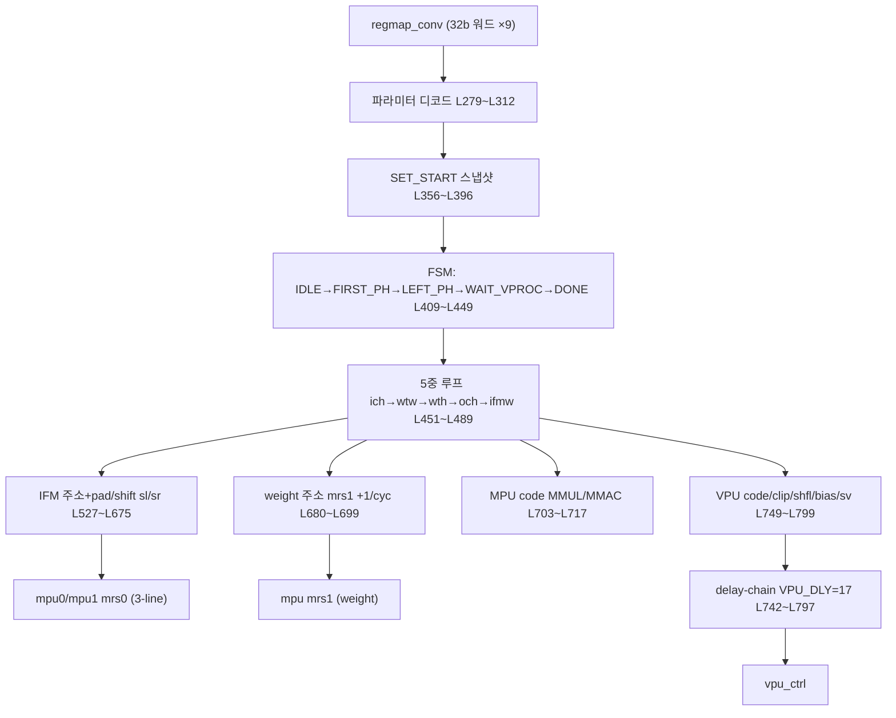
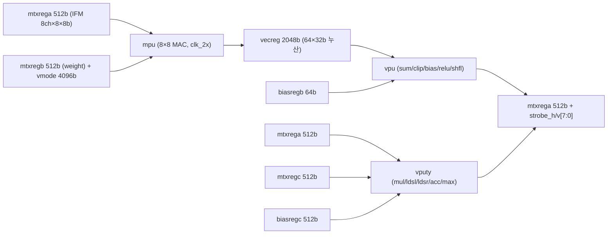
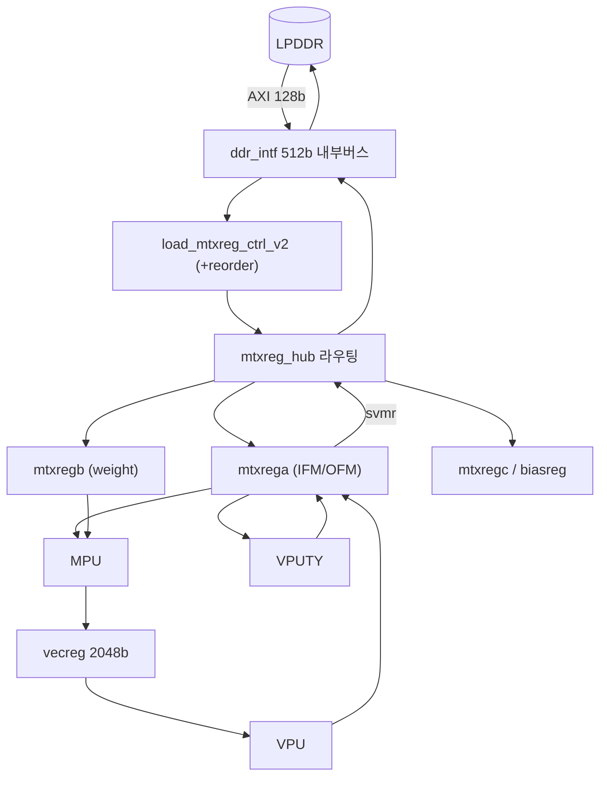
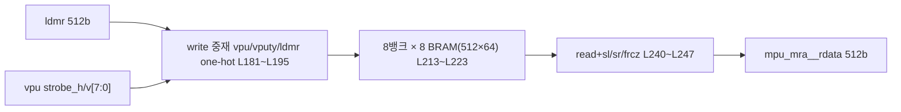
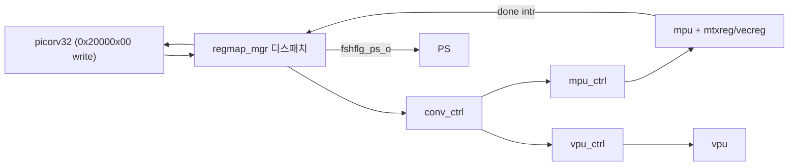
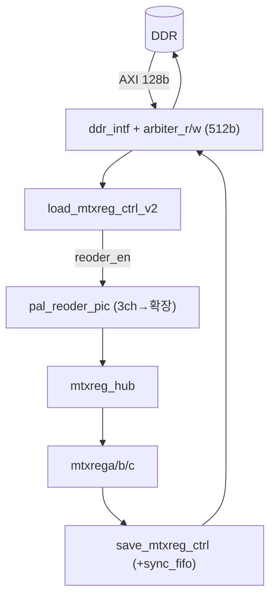
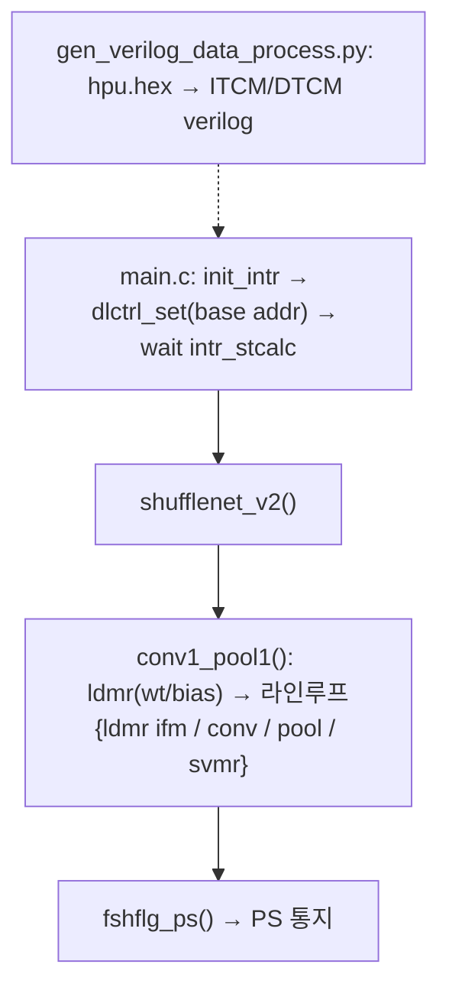

# XJTU-Tripler (HiPU) 모듈 통합 가이드

> 1차 요약(맥락): [`../XJTU-Tripler-master.md`](../XJTU-Tripler-master.md)
> 소스 루트: `REF/CNN-Accel/XJTU-Tripler-master`. 본 가이드는 **`hpu_core/src/`** (핸드라이트 RTL) 와 **`hpu_software/`** (RISC-V 펌웨어)를 정본으로 삼는다. 연산코어 3종(MPU/VPU/VPUTY)은 **암호화 EDIF netlist(`*.edf`, `*.edn`)** 로만 존재하므로 본문은 `_stub.v` 포트선언으로 병렬도·자료형을 역산하고, 내부 MAC array 마이크로아키텍처는 "확인 불가"로 명시한다.
> 표기 규약: 라인으로 직접 확인한 사실은 단정, 코드 정황 기반은 "추정", 코드/문서에 없으면 "확인 불가".
> 제외물(이름만): `hpu_core/fpga/hpu_reg_version/**`(Vivado 프로젝트 산출물 — `.runs`·`.Xil`·`.hw`·`.bit`·ILA wcfg/wdb/vcd, `*_sim_netlist.v`, `*_stub.v`(ps_block IP), `ps_block_wrapper.v`, `zynq_ultra_ps_e_v3_2_1.v`, `blk_mem_gen_v8_3.v`, `axi_infrastructure_v1_1_vl_rfs.v`), 3rd-party PicoRV32(`picorv32.v` ISC), `hpu_software/.vscode/ipch/*.ipch`, `src/common/.shift_left_algorithm.v.swp`(vim swap). 연산코어 netlist(`mpu.edf`/`vpu.edf`/`vputy.edf` + `mpu/*.edn`·`vputy/*.edn`)는 비공개 자체 IP — 존재 사실과 파일명만 인용.

---

## 0. 문서 머리말

### 0.1 대표 케이스 선정
HiPU는 한 데이터패스(MPU 행렬코어 + VPU 후처리 + VPUTY 경량코어)를 **레지스터맵 명령(fine-grained ISA)** 으로 변형해 CONV/FC/DWConv/Pooling/Eltwise/Shuffle을 모두 처리한다. 대표 케이스는 리포가 실제로 스케줄한 단위로 잡는다.

- **선형 대표(일반 CONV)**: ShuffleDet의 **conv1 + pool1** 한 캐스케이드. SW `shufflenet_v2.c` L103 `conv1_pool1()` 가 ldmr(weight/bias/ifm)→conv_set/conv_start→dwcalc(pool)→svmr 을 **4행씩 라인 루프**(L175 `for(conv_line=0; conv_line<conv_fm_height; conv_line+=4)`)로 발행하는, 리포의 첫 실행 단위다. 입력 reorder(L131 `ifm_param->reoder_en=1`)가 켜지는 유일한 레이어 = conv1 (RGB 3채널). (확인됨)
- **무비용 융합 대표(채널 shuffle/divide)**: bottleneck 단위 inter-layer cascade. `mtxrega.v` L190~L195 의 strobe_h/strobe_v 부분기록 + L240~L247 의 sl/sr 시프트가 "추가 사이클 0"의 채널 재배열 메커니즘이다. (확인됨, `README.md` L164~L166)

선정 근거: (1) 리포에 박힌 실제 첫 실행 단위(conv1_pool1), (2) HiPU의 차별화 포인트(무비용 데이터 재배열)가 RTL로 검증 가능한 단위. 두 케이스로 "MAC 어레이 스케줄링 / SRAM 주소 기반 재배열" 양 축을 커버한다.

### 0.2 수치 표기 규약
- **MAC lanes**: 연산코어의 동시 곱셈기 수. HiPU는 **MPU 1코어 = 8(H)×8(V) 행렬 × VR 64-lane 누산**. 단 MPU 본체가 EDIF라 내부 PE 토폴로지(systolic vs 곱셈기 트리)는 **확인 불가**; 포트폭(`mpu_stub.v` L16~L22)으로 `MAC ops/cyc` 만 역산.
- **scalar MACs**: 대표 CONV의 출력채널×커널×입력채널 곱. ShuffleDet 차원(`README.md` L139~L140)으로 환산.
- **loop trips / cycle**: conv_ctrl FSM의 5중 루프 카운터 곱(`conv_ctrl.v` L451~L489) 또는 라인 타일.
- **memory size (payload bit)**: 버퍼 배열 깊이×폭(bit). SRAM 래퍼 단위(`sdp_w512x64_r512x64_wrap` = 512deep×64wide).

### 0.3 운영 경로 (RISC-V 펌웨어 ↔ HiPU RTL ↔ FPGA)
```
[quantization]  PyTorch ShuffleDet → BN융합 → 8bit 대칭양자화 → fine-tune (README L122~L137; 도구코드 미동봉 → 확인 불가)
        │
[SW schedule]   shufflenet_v2.c (수작업 명령 시퀀스, 정적 MR 주소표) → RISC-V ELF
        │ riscv32-unknown-elf-gcc (-march=rv32i -mabi=ilp32, hpu_software/makefile)
        │ gen_verilog_data_process.py: hpu.hex → ITCM(0x80000000~)/DTCM(0x90000000~) verilog, 640워드 패킷
        │
[PS (ARM)]      비트스트림 로드 → ps_rvram으로 ITCM/DTCM 다운로드 → DDR base addr 설정 → start
        │ AXI HP0 128b (ps_pl_top.v L62~L70)
        │
[RISC-V (PL)]   picorv32 → regmap_mgr (메모리맵 0x20000x00 디스패치) → conv/dwc/dtrans/ftrans/ldmr/svmr_ctrl
        │
[HiPU 데이터패스] mtxreg(BRAM) → MPU(8×8 MAC, 64-lane 32b 누산) → vecreg(2048b) → VPU(bias/relu/clip/shuffle) → mtxreg → ddr_intf → DDR
```
근거: `main.c` L25~L62, `memory_map.inc` L26~L35, `hpu_top.v` L358~L423, `ps_pl_top.v` L78~L97.

### 0.4 타깃 / 데이터타입 / 명령 정책
- **타깃**: Xilinx **Ultra96**(Zynq UltraScale+ **ZU3**: LUT 70K / FF 141K / BRAM 216 / DSP 360). HiPU는 PL 전용, PS는 이미지 IO만. 동작 **233MHz**, 피크 **268Gops**, conv 효율 >80% (`README.md` L150~L154, L16~L17 대비표). 입력 **360×640** UAV 영상(`README.md` L87).
- **데이터타입**: weight·activation 모두 **8bit 대칭 양자화**(`hpu_top.v` L53 `MR_PROC_WTH=8`), 누산 **32bit**(L54 `VR_PROC_WTH=32`), VPU에서 clip(우측시프트)으로 재스케일. BN 융합 후 fine-tune.
- **MPU 명령 정책**: `MPU_CODE_MMUL=2'h1`(출력점 첫 누산), `MPU_CODE_MMAC=2'h3`(이후 누산) (`conv_ctrl.v` L97~L98). type `MPU_TYPE_MM=0`(행렬-행렬, 일반 conv) / `MPU_TYPE_VM=1`(벡터-행렬, channel64 우선 = FC/1×1 경로 추정) (`conv_ctrl.v` L100~L101, L717).
- **VPU 코드 비트**: `EN_ACT(0)/EN_SUM(1)/EN_BIAS(2)/EN_RELU(3)/EN_SHFL(4)/EN_CHPRI(5)` (`conv_ctrl.v` L82~L87) — bias add·ReLU·clip 재스케일·채널셔플을 conv 출력에 융합.
- **합성 PPA 리포트**: Vivado 산출물(`fpga/hpu_reg_version/`)은 생성물로 제외. `slides/dac19-xjtu_tripler_backup.pdf`(발표 백업)는 존재하나 정식 PPA 리포트 아님. 보고 수치(IoU 0.615 / 9248mW / 50.91 FPS / LUT 65%·FF 41%·BRAM 91%·DSP 98%)는 모두 `README.md` L284~L290 인용이며 본 분석 재측정 아님.

---

## 1. Repo / Layer 개요

| 레이어 | 경로 | 역할 |
|---|---|---|
| **hpu_core/src** | `hpu_core/src/**/*.v` | 핸드라이트 Verilog. ps_pl_top→pl_top→(riscv_top + hpu_top). hpu_top 내부 = regmap_mgr + hpu_ctrl(스케줄러 FSM) + hpu_core(데이터패스) + load/save_mtxreg + ddr_intf. **HLS 아님.** |
| **hpu_core/src/.../hpu_core** | `.../hpu_top/hpu_core/*.v + *.edf/*.edn` | 데이터패스 본체. mtxrega/b/c·vecreg·biasreg·mtxreg_hub(완전 RTL) + MPU/VPU/VPUTY(EDIF 블랙박스, `_stub.v`만 가독). |
| **hpu_core/ip** | `hpu_core/ip/sdp_w512x64_r512x64/*.v` | BRAM 래퍼(512×64 SDP). mtxreg가 generate로 다수 인스턴스화. |
| **hpu_software** | `hpu_software/{src,inc}/*` | RISC-V 펌웨어. main.c·shufflenet_v2.c(네트워크 수작업 스케줄)·hpu_api.h(명령 구조체)·memory_map.inc·_init.s/intr.s/hpu_api.s. |
| **hpu_software/*.py** | `gen_verilog_data*.py` | ELF(hpu.hex) → ITCM/DTCM verilog mem 변환(빌드 스크립트). |
| **slides** | `slides/dac19-xjtu_tripler_backup.pdf` + README | 발표 백업(코드 아님). |

- README 3개: 루트 `README.md`(설계 전체, 알고리즘+HW), `hpu_software/README.md`(SW 빌드 절차), `slides/README.md`(제목줄).
- 자체 RTL 모듈 수(분석 대상, 생성물·3rd-party 제외): **약 31개 .v** — pl_top 계열(ps_pl_top, pl_top, pl_regs, clk_gen, rst_gen, riscv_top, dl_itcm_ctrl, dl_dtcm_ctrl), hpu_top, regmap_mgr, hpu_ctrl + 7개 ctrl FSM(conv/dwc/datatrans/fmttrans/mpu/vpu/vputy_ctrl), load/save_mtxreg_ctrl_v2·save_mtxreg_data_wrap, pal_reoder_pic, ddr_intf + arbiter_r/w, hpu_core, mtxrega/b/c·vecreg·biasregb/c·mtxreg_hub, common 3개(dec_bin_to_onehot·reg_dly·sync_fifo) + SDP BRAM 래퍼. 연산코어 stub 3개는 포트만.

### 모듈 인스턴스 계층 (top → leaf)
```
ps_pl_top.v                       (PL 최상위, ZYNQ PS 연결, AXI HP0 128b)
└─ pl_top.v
   ├─ clk_gen / rst_gen / pl_regs
   ├─ dl_itcm_ctrl / dl_dtcm_ctrl (PS→TCM 펌웨어 다운로드)
   ├─ riscv_top.v
   │  └─ picorv_top → picorv32.v   (3rd-party RV32I 스케줄러)
   └─ hpu_top.v
      ├─ regmap_mgr.v             (RISC-V 메모리맵 → 8개 ctrl 디스패치 + intr 집계)
      ├─ hpu_ctrl.v
      │  ├─ conv_ctrl.v           (★ conv 5중루프 주소생성 FSM)
      │  ├─ dwc_ctrl.v            (depth-wise conv / pooling 스케줄러)
      │  ├─ datatrans_ctrl.v / fmttrans_ctrl.v
      │  ├─ mpu_ctrl.v            (conv_ctrl 신호 → MPU 명령 + mtxreg read/vecreg write)
      │  ├─ vpu_ctrl.v            (후처리 명령)
      │  └─ vputy_ctrl.v          (경량코어 명령)
      ├─ load_mtxreg_ctrl_v2.v    (DDR→mtxreg, reorder 옵션)
      │  └─ pal_reoder_pic.v      (★ 입력영상 3ch→채널확장 reorder)
      ├─ save_mtxreg_ctrl.v / save_mtxreg_data_wrap.v (mtxreg→DDR)
      ├─ ddr_intf.v               (512b 내부버스 ↔ AXI 128b)
      │  └─ ddr_arbiter_r.v / ddr_arbiter_w.v
      └─ hpu_core.v  (×1 활성; hpu_core1 주석처리=2코어 확장 미사용)
         ├─ mtxrega.v             (★ IFM/OFM SRAM 8뱅크×8 BRAM, sl/sr/strobe)
         ├─ mtxregb.v             (weight + vmode SRAM)
         ├─ mtxregc.v / biasregb.v / biasregc.v / vecreg.v
         ├─ mtxreg_hub.v          (DDR↔레지스터 라우팅)
         ├─ mpu  (EDIF 블랙박스, mpu_stub.v)   — 8×8 MAC, 64-lane 32b 누산
         ├─ vpu  (EDIF 블랙박스, vpu_stub.v)   — sum/clip/bias/relu/shfl 융합
         └─ vputy(EDIF 블랙박스, vputy_stub.v) — mul/ldsl/ldsr/acc/max(dwconv·pool)
            └─ sdp_w512x64_r512x64_wrap        (leaf BRAM, ip/)
```

---

## 2. Convolution 스케줄러 — 자체 RTL의 핵심 (`conv_ctrl.v`)

### 2.1 역할 + 상위/하위 관계
HiPU에서 가장 중요한 핸드라이트 RTL. MPU MAC array는 EDIF지만 **"어떤 IFM/weight 주소를 어떤 순서로 읽어 MPU에 흘려보내고, 17사이클 뒤 VPU 후처리를 어떻게 정렬하는가"** 의 알고리즘 전부가 여기 있다. 상위: `hpu_ctrl`. 하위(소비자): `mpu_ctrl`(MMUL/MMAC 명령), `vpu_ctrl`(bias/relu/clip/shfl). 듀얼 라인코어(mpu0/mpu1)를 동시 구동.

### 2.2 데이터플로우


### 2.3 모듈 인스턴스 계층
`hpu_top` → `hpu_ctrl` → `conv_ctrl`. conv_ctrl은 leaf로 `dec_bin_to_onehot #(3,8)`(L798, sv strobe 생성) 1개 인스턴스만 사용, 나머지는 순수 RTL FSM.

### 2.4 대표 코드 위치
`hpu_core/src/pl_top/hpu_top/hpu_ctrl/conv_ctrl.v`.

### 2.5 대표 코드 블록

(1) **레지스터맵 → conv 파라미터 디코드 (SW 구조체와 1:1)** (`conv_ctrl.v` L280~L291)
```verilog
if(regmap_conv__waddr_i[...] == 'h1) ifm_width   <= regmap_conv__wdata_i[7 : 0];
if(regmap_conv__waddr_i[...] == 'h1) ifm_channel <= regmap_conv__wdata_i[15 : 8];
if(regmap_conv__waddr_i[...] == 'h1) wt_width    <= regmap_conv__wdata_i[19 : 16];
...
if(regmap_conv__waddr_i[...] == 'h2) clip_data   <= regmap_conv__wdata_i[20 : 16];
if(regmap_conv__waddr_i[...] == 'h2) channel64_priority <= regmap_conv__wdata_i[28];
```
→ SW `hpu_api.h` L22~L31 `conv_param` 비트필드(`ctrl_param0`=[31:24]ofm_ch ... [7:0]ifm_width)와 정확히 일치 = HW/SW 단일출처.

(2) **5중 루프 카운터 — 누산 효율 극대화 순서** (`conv_ctrl.v` L459~L488, L513~L521)
```verilog
// 우선순위(내→외): ich_cnt → wtw_cnt → wth_cnt → och_cnt → ifmw_cnt
if(ich_cnt == ifm_channel_reg) begin
    if(wtw_cnt == wt_width_reg) begin
        if(wth_cnt == wt_height_reg) begin
            if(och_cnt == ofm_channel_reg) begin ifmw_cnt <= ifmw_cnt+1; och_cnt<=0; end
            else och_cnt <= och_cnt + 1; ...
```
→ 주석 L513~L514 "calculation priority is ifm_channel, wt_width, ...; address of ifm_channel and wt_width is consecutive" — 입력채널·커널폭 주소 연속으로 누산 효율 극대화.

(3) **IFM 주소 + padding/shift (sl/sr 경계처리)** (`conv_ctrl.v` L657~L665)
```verilog
assign mpu0_mrs0_last_addr_signed = mpu0_mrs0_init_addr_dly1 + pad_offset_reg;
assign convctl_mpu0__mrs0_sl_o = (mpu0_mrs0_addr >= mpu0_mrs0_last_addr_signed); // 우경계→shift-left
assign convctl_mpu0__mrs0_sr_o = (mpu0_mrs0_addr < mpu0_mrs0_init_addr_dly1);    // 좌경계→shift-right
assign convctl_mpu0__mrs0_addr_o = convctl_mpu0__mrs0_sl_o ? mpu0_mrs0_post_addr
                                 : convctl_mpu0__mrs0_sr_o ? mpu0_mrs0_pre_addr
                                 : mpu0_mrs0_addr;
```
→ base/pre/post 3주소(L617~L655)를 stride/dilation(L604~L605 `+dilation_w_reg+1`)으로 갱신, 경계면 sl/sr로 pre/post 선택 → padding을 별도 사이클 없이 mtxrega 시프트로 흡수(§5와 연동).

(4) **MPU 명령: 첫 누산 MMUL, 이후 MMAC** (`conv_ctrl.v` L707~L721)
```verilog
if(cur_st == ST_CALC_OCH_FIRST_PH) mpu_code <= MPU_CODE_MMUL;       // 출력점 첫 곱
else if(cur_st == ST_CALC_OCH_LEFT_PH) mpu_code <= MPU_CODE_MMAC;   // 누산
assign convctl_mpu__type_o = channel64_priority_reg ? MPU_TYPE_VM : MPU_TYPE_MM;
assign convctl_mpu__mac_len_o = 7'h1;  // reg version: MAC length 상수 1
```

(5) **VPU 17사이클 delay-chain 정렬** (`conv_ctrl.v` L741~L766)
```verilog
vpu_br_addr_dlychain <= {vpu_br_addr_dlychain[VPU_DLY*MRX_ADDR_WTH-1 : 0], vpu_br_addr};
assign convctl_vpu__br_addr_o = vpu_br_addr_dlychain[VPU_DLY*MRX_ADDR_WTH +: MRX_ADDR_WTH];
...
vpu_code_dlychain <= {vpu_code_dlychain[VPU_DLY*6-1 : 0], vpu_code};   // VPU_DLY=17 (L89)
```
→ MPU 누산 결과가 VPU에 도달하는 17사이클 파이프 지연을 맞춰 bias_addr/code/clip/shfl/sv_addr를 동기 시프트. conv→bias→relu→clip→shuffle→store 정렬의 핵심.

### 2.6 마이크로아키텍처 + 정량
- **FSM**: `ST_IDLE→ST_CALC_OCH_FIRST_PH→ST_CALC_OCH_LEFT_PH→ST_WAIT_VPROC→ST_DONE`(L91~L95). FIRST_PH=MMUL(출력점 초기화), LEFT_PH=MMAC(누산).
- **loop trips/output-point**: ich_cnt(0..ifm_channel) × wtw_cnt(0..wt_width) × wth_cnt(0..wt_height) = 입력채널×커널면적 만큼 MAC 명령(`conv_ctrl.v` L459~L476). 출력채널(och)·출력폭(ifmw) 외부 루프.
- **scalar MACs(대표 conv)**: ShuffleDet 한 conv layer = ofm_ch × wt_h × wt_w × ifm_ch × ofm_h × ofm_w 곱. 구체 shape는 정적 명령(SW)에 인코딩되며 RTL은 일반화 — 대표 수치는 SW `shufflenet_v2.c`의 conv_param 런타임값(소스에 상수 미고정) → **레이어별 확인은 SW 트레이스 필요(추정)**.
- **VPU_DLY=17**(L89), **ST_WAIT_VPROC 고정 30사이클**(L438 `wait_vproc_cnt == 'd30`, 주석 "TODO: replace by accurate value") → 보수적 마진.
- **병목**: 모든 conv가 단일 명령 스트림 in-order. 라인 루프(4행)당 conv/pool/ldmr/svmr를 SW가 수작업 더블버퍼(§9). WAIT_VPROC 30사이클은 작은 conv에서 상대 오버헤드.

---

## 3. 연산코어 — MPU / VPU / VPUTY (`mpu_stub.v`, `vpu_stub.v`, `vputy_stub.v`)

### 3.1 역할 + 상위/하위
HiPU 산술 본체 3종. **모두 EDIF netlist(`mpu.edf`/`vpu.edf`/`vputy.edf` + `mpu/*.edn`·`vputy/*.edn`)** 로 비공개. 본문은 `_stub.v` 포트선언으로 병렬도·자료형만 역산. 상위: `hpu_core`. 하위: `xbip_dsp48_macro`(MPU edn 파일명), `mpu_mac_1x_accumulator`(MPU edn) → DSP48 매크로 + 누산기로 추정.

### 3.2 데이터플로우


### 3.3 인스턴스 계층
`hpu_core` → `{mpu, vpu, vputy}`(각 1, EDIF) + `{mtxrega, mtxregb, mtxregc, vecreg, biasregb, biasregc, mtxreg_hub}`(완전 RTL).

### 3.4 대표 코드 위치
`hpu_core/src/pl_top/hpu_top/hpu_core/{mpu_stub.v, vpu_stub.v, vputy_stub.v}` (포트선언) + 동 디렉토리 `*.edf`/`mpu/*.edn`/`vputy/*.edn` (블랙박스 netlist, 비가독).

### 3.5 대표 코드 블록

(1) **MPU: 8×8 행렬 입력, 64-lane 32b 누산, clk_2x** (`mpu_stub.v` L5~L25)
```verilog
module mpu(clk_i, clk_2x_i, rst_i, mpu_op_extacc_act_i, mpu_op_bypass_act_i, mpu_op_type_i, ...);
  input clk_2x_i;                       // 2× 클럭 → MAC 더블펌핑(추정)
  input [0:0]  mpu_op_type_i;           // MM/VM
  input [511:0]mpu_mra__rdata_i;        // IFM 512b = 8ch × (8×8b) = 64 원소
  input [511:0]mpu_mrb__rdata_i;        // weight 512b
  input [4095:0]mpu_mrb__vmode_rdata_i; // vmode(VM 모드 weight 확장)
  output[2047:0]mpu_vr__wdata_o;        // 64 lane × 32b 누산 출력
```
→ **8bit×8bit 곱 → 32bit 누산, 64-lane**. 내부 PE 격자(systolic 여부)는 EDIF로 **확인 불가**. `clk_2x_i`로 더블펌핑(추정).

(2) **VPU: 누산(2048b)에 sum/clip/bias/relu/shfl 융합 → 8bit 행렬(512b) + strobe** (`vpu_stub.v` L5~L30)
```verilog
input [4:0]  vpu_op_clip_i;            // 우측시프트 양자화 재스케일
input        vpu_op_bias_act_i, vpu_op_relu_act_i, vpu_op_shfl_act_i;
input [7:0]  vpu_op_strobe_h_i, vpu_op_strobe_v_i;  // 부분기록 8×8
input [2047:0]vpu_vr__rs0_rdata_i, vpu_vr__rs1_rdata_i;  // 누산 2입력(eltwise)
input [63:0] vpu_brb__rdata_i;          // bias 64b
output[511:0]vpu_mra__wdata_o;          // 8bit 환원 결과
output[7:0]  vpu_mra__wdata_strob_h_o, vpu_mra__wdata_strob_v_o;  // 채널셔플용 strobe
```
→ **dequant(clip)·activation·eltwise·channel shuffle 융합 유닛**. rs0/rs1 2입력 = Eltwise Add/Mul 지원.

(3) **VPUTY: depth-wise conv / pooling / 데이터이동 경량코어** (`vputy_stub.v` L5~L40)
```verilog
input vputy_op_mul_sel_i, vputy_op_ldsl_sel_i, vputy_op_ldsr_sel_i,
      vputy_op_acc_sel_i, vputy_op_max_sel_i;   // mul/load-shift-L/R/acc/max
input [511:0]vputy_mra__rdata_i, vputy_mrc__rdata_i, vputy_brc__rdata_i;
output[511:0]vputy_mra__wdata_o + strobe_h/v[7:0];
```
→ `max` = max-pooling, `mul`+`acc` = depth-wise conv, `ldsl/ldsr` = 행 시프트 → DWConv/Pool/이동 전용. dwc_ctrl(§6)이 OP_LOAD/MUL/ACC/MACC(`dwc_ctrl.v` L74~L77)로 구동.

### 3.6 마이크로아키텍처 + 정량
- **MAC lanes(1코어)**: 8(H)×8(V)=64 MAC 격자, 8bit×8bit, 64-lane 32b 누산(`hpu_top.v` L57~L66, `mpu_stub.v` L22). `clk_2x` 더블펌핑이면 유효 처리량 2× (추정).
- **MAC ops/cyc**: 64 곱 × (clk_2x면 ×2) → 피크 268Gops(`README.md` L152)와 정합 추정: 64 MAC × 2(곱+덧셈) × 2(clk_2x) × 233MHz ≈ 119Gop/s 단일코어 — 268Gops는 2코어 또는 다른 환산 기준(정확 환산식 미동봉 → **확인 불가**).
- **MPU 파이프 지연**(`mpu_ctrl.v` L108~L111): `RMR_DLY=4`(mtxreg read), `ACC_DLY=16`(누산), `RVR_DLY=14`(vecreg read), `WVR_DLY=16`(vecreg write). VPU_DLY=17(conv_ctrl)이 이와 정합.
- **내부 토폴로지**: EDIF netlist → systolic vs 곱셈기 트리, 파이프 단수 모두 **확인 불가**. `mpu/*.edn` 파일명(`xbip_dsp48_macro_0/1`, `xbip_dsp48_no_pcin`, `mac_1x_accumulator`)으로 **DSP48 매크로 + 캐스케이드 누산기** 구조 추정.
- **VPUTY edn**: `vputy_mul_8_8_clk1x_xbip_dsp48_macro` → 8×8 곱, clk1x(MPU와 달리 더블펌핑 없음).

---

## 4. Processing Core 통합 (`hpu_core.v`) + 2코어 구조 (`hpu_top.v`)

### 4.1 역할 + 상위/하위
`hpu_core`가 MPU/VPU/VPUTY(EDIF) + 6종 레지스터파일(완전 RTL)을 한 데 묶어 데이터패스를 완성. `hpu_top`이 이를 1개 인스턴스화(hpu_core0 활성)하고 regmap_mgr·hpu_ctrl·load/save·ddr_intf와 연결. 상위: `hpu_top`. 하위: §3·§5 모듈.

### 4.2 데이터플로우


### 4.3 인스턴스 계층
`hpu_top` → `hpu_core0_inst`(활성, `hpu_top.v` 본문) / `hpu_core1_inst`(주석, L736~L893). 코어선택 로직 `ldmr_hpu_core_sel`/`svmr_hpu_core_sel`(L894~L908)은 2코어 확장용으로 남음.

### 4.4 대표 코드 위치
`hpu_core/src/pl_top/hpu_top/hpu_core/hpu_core.v`, `hpu_core/src/pl_top/hpu_top.v`(파라미터·2코어).

### 4.5 대표 코드 블록

(1) **데이터패스 폭의 근원(파라미터)** (`hpu_top.v` L53~L67)
```verilog
parameter MR_PROC_WTH = 8;                  // 행렬 원소 8bit = 양자화 폭
parameter MR_PROC_H_PARAL = 8, MR_PROC_V_PARAL = 8;
parameter MTX_DATA_WTH = MR_PROC_WTH * MR_PROC_V_PARAL;   // = 64b (8원소)
parameter MR_DATA_WTH  = MTX_DATA_WTH * MR_PROC_H_PARAL;  // = 512b (행렬 1워드)
parameter VR_PROC_WTH = 32, VR_PROC_PARAL = 64;          // 누산 32b × 64 lane
parameter VR_DATA_WTH = VR_PROC_PARAL * VR_PROC_WTH;      // = 2048b (벡터 1워드)
parameter DDRIF_DATA_WTH = 512;                          // DDR 내부버스
```

(2) **2코어 구조 — 1코어 활성, 1코어 주석** (`hpu_top.v` L736~L893, L894~L906)
```verilog
/* hpu_core #(...) hpu_core1_inst ( ... ); */   // L736~L893: ZU3 자원으로 비활성
assign ldmr1_mra__we = ldmr_mra__we & ldmr_hpu_core_sel;  // 코어 선택 로직만 존속
```
→ 원설계는 2코어, reg_version은 ZU3 자원 제약으로 1코어(미검증 확장).

(3) **외부 AXI 128b ↔ 내부 512b** (`hpu_top.v` L95~L100, `ddr_intf.v` L52~L57)
```verilog
input  [127:0] axi_ddr_rdata;   output [127:0] axi_ddr_wdata;  // 외부 AXI HP0
// ddr_intf 내부 DDRIF_DATA_WTH=512 → 4:1 폭 변환
```

### 4.6 마이크로아키텍처 + 정량
- **전체 PE 규모(활성)**: 1 hpu_core × MPU(8×8=64 MAC) + VPUTY. 2코어시 128 MAC(미사용).
- **누산 버퍼(vecreg)**: 64 lane × 32b = **2048b/워드**(`vecreg.v` L34). 깊이는 VR_IND_WTH=4 → 16엔트리 추정(`hpu_top.v` L50).
- **병목**: 외부 AXI 128b ↔ 내부 512b 4:1 변환 + PS/PL DDR 공유(`README.md` L255~L259 "PS and PL share the DDR bandwidth") → DDR 대역이 일차 병목. inter-layer cascade(§9)로 완화.

---

## 5. 행렬 레지스터 (온칩 SRAM 계층) (`mtxrega.v`, `mtxregb/c.v`, `vecreg.v`, `sdp_w512x64_r512x64_wrap.v`)

### 5.1 역할 + 상위/하위
IFM/OFM/weight/bias를 담는 **멀티포트 SRAM 뱅크**. mtxrega(IFM/OFM, MPU read·VPU/VPUTY write·save/load 중재), mtxregb(weight + vmode), mtxregc/biasreg(VPUTY), vecreg(MPU 누산). 상위: hpu_core. 하위: `sdp_w512x64_r512x64_wrap`.

### 5.2 데이터플로우


### 5.3 대표 코드 위치
`hpu_core/src/pl_top/hpu_top/hpu_core/mtxrega.v`, `.../vecreg.v`, `hpu_core/ip/sdp_w512x64_r512x64/sdp_w512x64_r512x64_wrap.v`.

### 5.4 대표 코드 블록

(1) **8뱅크 × 8 BRAM generate** (`mtxrega.v` L113, L179~L223)
```verilog
localparam MR_PROC_N_PARAL = 8;
for (gi = 0; gi < MR_PROC_N_PARAL; gi = gi+1) begin : mra        // 8 뱅크
    sdp_w512x64_r512x64_wrap mtxrega[MR_PROC_H_PARAL-1 : 0] (    // 뱅크당 8 BRAM
        .we_i ({MR_PROC_H_PARAL{mra_we_r[gi]}} & mra_wdata_strob_h_r[gi]),  // 가로 strobe
        .wdata_strob_i ({MR_PROC_H_PARAL{mra_wdata_strob_v_r[gi]}}),        // 세로 strobe
        .rdata_o (mra_rdata[gi]) );
```
→ 각 BRAM = `sdp_w512x64` (512deep×64wide). 뱅크당 8 BRAM = 512×512b. 8뱅크 = mtxrega 전체.

(2) **write 중재 + 채널셔플 strobe** (`mtxrega.v` L181~L195)
```verilog
assign mra_we[gi] = (vpu_mra__we_i & vpu_mra_windex_onehot[gi])
                  | (vputy_mra__we_i & vputy_mra_windex_onehot[gi])
                  | (ldmr_mra__we_i & ldmr_mra_windex_onehot[gi]);    // 3소스 one-hot
assign mra_wdata_strob_h[gi] = ... ? vpu_mra__wdata_strob_h_i : ... : 8'hff;  // 부분기록
```
→ strobe_h(가로 8)·strobe_v(세로 8) 부분기록 = channel shuffle/divide를 주소·strobe만으로 구현(무비용 융합).

(3) **read 시 sl/sr 시프트 + frcz padding** (`mtxrega.v` L240~L243)
```verilog
mpu_mra_rdata <= mpu_mra_frcz_dlychain[2] ? 'h0                                   // force-zero=padding
   : mpu_mra_sl_dlychain[2]? {{MTX_DATA_WTH{1'b0}}, mra_rdata[idx][MTX_DATA_WTH +: 7*MTX_DATA_WTH]}  // 좌시프트
   : mpu_mra_sr_dlychain[2]? {mra_rdata[idx][0 +: 7*MTX_DATA_WTH], {MTX_DATA_WTH{1'b0}}}             // 우시프트
   : mra_rdata[idx];
```
→ conv_ctrl이 만든 sl/sr/frcz(§2-(3))가 여기서 실제 1-MTX(64b) 시프트로 구현 = "추가 시간 없는 padding/shuffle".

(4) **BRAM 래퍼 = 512deep × 64wide SDP** (`sdp_w512x64_r512x64_wrap.v` L3~L24)
```verilog
module sdp_w512x64_r512x64_wrap ( input [8:0] waddr_i, input [63:0] wdata_i,
    input [7:0] wdata_strob_i, ... output[63:0] rdata_o );
sdp_w512x64_r512x64 sdp_w512x64_r512x64_inst ( .wea({8{we_i}} & wdata_strob_i), ... );
```

### 5.5 마이크로아키텍처 + 정량
- **mtxrega 용량**: 8뱅크 × 8 BRAM × (512 × 64b) = 8 × 8 × 32Kb = **2 Mb (256 KB)**. addr 9b(`MRA_ADDR_WTH=9`) → 뱅크 512 라인.
- **vecreg**: 64 lane × 32b = 2048b/워드 (`vecreg.v` L34).
- **read 파이프 지연**: `TOT_DLY=3`(read latency), `MRA_DLY=2`(sl/sr 정합) (`mtxrega.v` L115~L116).
- **병목**: BRAM 91% 사용(`README.md` L289) → 온칩 용량이 inter-layer cascade의 한계 결정. 전체 layer FM이 SRAM에 안 들어가 bottleneck 단위 DDR 왕복 필요(`README.md` L187~L192).

---

## 6. Depth-wise / Pooling 경로 (`dwc_ctrl.v`, `vputy_ctrl.v`)

### 6.1 역할 + 상위/하위
일반 conv(MPU)와 별개로 **depth-wise conv·max pooling·데이터 이동**을 VPUTY 경량코어로 스케줄. 상위: hpu_ctrl. 하위: vputy_ctrl → VPUTY(EDIF).

### 6.2 데이터플로우
```mermaid
flowchart LR
  RM["regmap_dwc 32b"] --> DWC["dwc_ctrl FSM"]
  DWC -->|"OP_LOAD/MUL/ACC/MACC"| VPC["vputy_ctrl"]
  DWC -->|mrs0(IFM 3-line)/mrs1(wt)| MRA["mtxrega"]
  DWC -->|sv_code/clip/shfl/strobe_h| VPC
  VPC --> VPUTY["vputy (mul/acc/max)"]
```

### 6.3 인스턴스 계층
`hpu_top` → `hpu_ctrl` → `dwc_ctrl` + `vputy_ctrl`.

### 6.4 대표 코드 위치
`hpu_core/src/pl_top/hpu_top/hpu_ctrl/dwc_ctrl.v`, `.../vputy_ctrl.v`.

### 6.5 대표 코드 블록

(1) **dwc 명령 코드** (`dwc_ctrl.v` L74~L77)
```verilog
localparam OP_LOAD = 5'b00001, OP_MUL = 5'b00011, OP_ACC = 5'b00101, OP_MACC = 5'b00111;
```
(2) **conv_ctrl와 동형의 듀얼라인(vputy0/1) mrs0 + sl/sr** (`dwc_ctrl.v` L48~L65)
```verilog
output dwcctl_vputy0__mrs0_sl_o, dwcctl_vputy0__mrs0_sr_o, ...
output[5:0] dwcctl_vputy__sv_code_o; output[4:0] dwcctl_vputy__clip_o;  // 후처리도 융합
```
→ dwc도 conv처럼 IFM 3-line·weight 주소 생성 + bias/relu/clip/shfl 융합(VPUTY 후처리).

### 6.6 마이크로아키텍처 + 정량
- **연산**: VPUTY `max`(pooling), `mul`+`acc`(DWConv), `ldsl/ldsr`(행 이동) (`vputy_stub.v` L16~L20).
- **대표 호출**: `shufflenet_v2.c` L165 `dwcalc_set(pool1_param)`(conv1 직후 pool1), bottleneck 내부 right_b/left_b가 DWConv(`shufflenet_v2.c` L73·L75 `pc_dwcalc_param`).
- **병목**: DWConv는 채널당 독립 → MAC 활용률 낮음(8채널 병렬은 유지). conv_ctrl과 별 FSM이라 conv·dwc 동시 실행은 SW 인터리브로만(§9).

---

## 7. 명령 디스패치 & 레지스터맵 (`regmap_mgr.v`, `mpu_ctrl.v`, `vpu_ctrl.v`)

### 7.1 역할 + 상위/하위
2계층: (1) `regmap_mgr`이 picorv32 메모리맵 주소(0x20000x00)를 8개 ctrl(conv/dwc/dtrans/ftrans/ldmr/svmr/dldata/upldata)의 write 채널로 분배하고 intr를 8b로 집계, (2) `mpu_ctrl`/`vpu_ctrl`이 conv_ctrl 신호를 연산코어 + 레지스터파일 read/write 신호로 변환.

### 7.2 데이터플로우


### 7.3 인스턴스 계층
`hpu_top` → `regmap_mgr` + `hpu_ctrl`(→ mpu_ctrl, vpu_ctrl, vputy_ctrl, conv/dwc/datatrans/fmttrans_ctrl).

### 7.4 대표 코드 위치
`hpu_core/src/pl_top/hpu_top/regmap_mgr.v`, `.../hpu_ctrl/mpu_ctrl.v`, `.../vpu_ctrl.v`.

### 7.5 대표 코드 블록

(1) **메모리맵 정의 (SW↔HW 단일출처)** (`memory_map.inc` L27~L35)
```
.equ DPU_REGMGR, 0x20000000 ; DPU_CONV, 0x20000100 ; DPU_DWCALC, 0x20000200
.equ DPU_DTRANS, 0x20000300 ; DPU_FTRANS, 0x20000400 ; DPU_LDMR, 0x20000500
.equ DPU_SVMR,   0x20000600 ; DPU_DLCTRL, 0x20000700 ; DPU_UPLCTRL, 0x20000800
```
→ `regmap_mgr`(`hpu_top.v` L358~L423)가 동일 분기로 8 ctrl에 디스패치, intr_o[7:0] 집계 + fshflg_ps_o(전 레이어 완료).

(2) **MPU 파이프 지연 상수** (`mpu_ctrl.v` L108~L111)
```verilog
localparam RMR_DLY=4, ACC_DLY=16, RVR_DLY=14, WVR_DLY=16;
```
(3) **conv_ctrl → MPU 명령 + 듀얼 mtxreg read** (`mpu_ctrl.v` L44~L75)
```verilog
input [1:0] convctl_mpu__code_i;   // MMUL/MMAC
output mpu0_mra__rindex_o/raddr_o/sl_o/sr_o/frcz_o;  // mpu0 IFM read
output mpu1_mra__rindex_o/raddr_o/sl_o/sr_o/frcz_o;  // mpu1 IFM read (듀얼 라인코어)
output mpu_mrb__rindex_o/raddr_o (weight) + mpu_mrb__type_o (MM/VM);
```

### 7.6 마이크로아키텍처 + 정량
- **레지스터맵 폭**: 32b 워드(`hpu_top.v` L37 `DPU_REG_DATA_WTH=32`), 8b regmap addr(L38), intr 8b.
- **명령 모델**: in-order, 컨트롤러별 set→start→check(intr). out-of-order/스코어보드 없음.
- **병목**: ILP는 SW 수작업 인터리브에 의존(HW 자동 해저드 검사 없음 — TATAA의 `core_instr_ctrl` ILP 충돌검사와 대조적). 새 네트워크마다 펌웨어 수동 작성.

---

## 8. 메모리 IO 경로 + 입력 reorder (`ddr_intf.v`, `load_mtxreg_ctrl_v2.v`, `save_mtxreg_ctrl.v`, `pal_reoder_pic.v`)

### 8.1 역할 + 상위/하위
`ddr_intf`(512b 내부 ↔ AXI 128b, r/w arbiter), `load_mtxreg_ctrl_v2`(DDR→mtxreg, reorder 옵션), `save_mtxreg_ctrl`(mtxreg→DDR, FIFO 경유), `pal_reoder_pic`(입력영상 3ch→채널확장). 상위: hpu_top.

### 8.2 데이터플로우


### 8.3 대표 코드 위치
`hpu_core/src/pl_top/hpu_top/ddr_intf.v` (+`ddr_intf/ddr_arbiter_r.v`, `ddr_arbiter_w.v`), `.../load_mtxreg_ctrl_v2.v`, `.../save_mtxreg_ctrl.v`, `.../pal_reoder_pic.v`.

### 8.4 대표 코드 블록

(1) **DDR 폭 변환 (내부 512b / AXI 128b)** (`ddr_intf.v` L52~L62)
```verilog
input  [127:0] axi_ddr_rdata;  output [127:0] axi_ddr_wdata;   // AXI HP0
parameter [5:0] DDR_AXI_ID = 6'b00_1010;
// 내부 DDRIF_DATA_WTH=512 (hpu_top.v L34) → 4:1
```

(2) **입력 reorder: 320픽셀/라인, 3-cycle 시프트, MSB 반전(unsigned→signed)** (`pal_reoder_pic.v` L30~L35, L90)
```verilog
parameter PAL_W_NUM = 8, PAL_C_EXTEN_NUM = 16, PIC_LINE_LEN = 320;
reg [3*DDRIF_DATA_WTH-1:0] ddr_intf_3data_shift;   // 3-cycle 누적
pal_reoder_buffer pal_reoder_buffer_ins0( .ena(reoder_en_i), ... );  // 8개 병렬 BRAM
```
→ conv1의 RGB 3채널을 행방향 재배열로 확장 → MPU 효율 0.38→0.56(`README.md` L204~L216). 활성: `ldmr_param.reoder_en`(`hpu_api.h` L64), `shufflenet_v2.c` L131.

### 8.5 마이크로아키텍처 + 정량
- **AXI**: HP0 read+write 128b, ID=0x0a(`ddr_intf.v` L62), addr 29b(`hpu_top.v` L89).
- **reorder buffer**: 8개 병렬, 320픽셀/라인, 16채널 확장(`pal_reoder_pic.v` L33~L35).
- **확인 불가**: AXI 버스트 길이, DDR 뱅크 매핑(arbiter 라운드로빈/우선순위 정책 — `ddr_arbiter_r/w.v` 미정독).
- **병목**: PS/PL DDR 공유 + 128b 협폭 → README가 DDR을 일차 병목으로 명시(`README.md` L183~L192).

---

## 9. RISC-V 펌웨어 — 네트워크 수작업 스케줄 (`main.c`, `shufflenet_v2.c`, `hpu_api.h`, `gen_verilog_data_process.py`)

### 9.1 역할 + 상위/하위
picorv32에서 ShuffleNet V2를 **명령 시퀀스로 수작업 스케줄**. 컴파일러 자동화 없음 — 정적 MR 주소표 + 라인 루프 더블버퍼.

### 9.2 데이터플로우 / SW 호출경로


### 9.3 대표 코드 위치
`hpu_software/src/main.c`, `.../shufflenet_v2.c`, `hpu_software/inc/hpu_api.h`, `.../memory_map.inc`, `hpu_software/gen_verilog_data_process.py`.

### 9.4 대표 코드 블록

(1) **정적 MR 주소표 (수작업 메모리 할당)** (`shufflenet_v2.c` L20~L29)
```c
int fm_layer0_table_addr[8] = {0x03540354, 0x00000000, 0x00aa00aa, ...};  // 각 레이어 IFM/OFM 주소
int fm_conv0_table_addr[7]  = {0x08000800, 0x00000000, 0x02000200, ...};
```
(2) **conv1_pool1 라인 루프 더블버퍼 (inter-layer cascade)** (`shufflenet_v2.c` L175~L239)
```c
for(conv_line = 0; conv_line < conv_fm_height; conv_line += 4) {   // 4행 타일
    if(conv_line != 0) dwcalc_start();                            // pool[line-1]
    if(conv_line+3 < ...) { ldmr_start(); ...prep next ldmr... }  // ifm[line+3] 프리페치
    conv_start();                                                 // conv[line]
    ... prep next conv (ifm_addr0/1/2 from table) ...
    if(conv_line+4 < ...) { ldmr_start(); ... }                   // ifm[line+4]
    while(!intr_conv_act); intr_conv_act = 0;                     // 완료 대기
}
```
→ load/conv/pool을 SW가 수작업으로 중첩(HW ILP 없음). reorder는 conv1만(`L131`).

(3) **conv_param 비트필드 = RTL 디코드와 1:1** (`hpu_api.h` L22~L31)
```c
typedef struct conv_param {
  int ctrl_param0; // [31:24]ofm_channel [23:20]wt_height [19:16]wt_width [15:8]ifm_channel [7:0]ifm_width
  int ctrl_param1; // [28]channel64_priority [27:26]channel_shuffle_type [25]bias_en [24]relu_en [20:16]clip_data ...
  ...
```
(4) **ELF→ITCM/DTCM 분리 (0x80000000 code / 0x90000000 data)** (`gen_verilog_data_process.py` L19~L52)
```python
if addr >= 0x80000000 and addr < 0x90000000: dtype = 'code'   # ITCM
elif addr >= 0x90000000: dtype = 'data'                       # DTCM
packet_number = 640   # 640워드 패킷 정렬
```

### 9.5 마이크로아키텍처 + 정량
- **빌드**: `riscv32-unknown-elf-gcc -march=rv32i -mabi=ilp32`(`hpu_software/README.md`, makefile) → hpu.mo/dump/hex → py로 1_itcm.verilog/1_dtcm.verilog.
- **네트워크 규모**: ShuffleDet conv layer ~74개, weight ~1.94MB, bias ~78KB(`README.md` L139~L140).
- **병목/한계**: 네트워크 스케줄 100% 수작업 C(정적 주소표) → 새 네트워크마다 펌웨어 재작성. 컴파일러/매퍼 부재 = HiPU의 가장 큰 자동화 공백.

---

## N+1. 한눈에 보기 (모듈 요약표)

| # | 모듈(파일) | 종류 | 핵심 파라미터/근거 | 정량(정적) |
|---|---|---|---|---|
| 2 | `conv_ctrl.v` | RTL FSM | VPU_DLY=17(L89), 5중루프(L451~L489), MMUL/MMAC(L97~L98) | loop=ich×wtw×wth×och×ifmw; WAIT_VPROC 30cyc |
| 3 | `mpu/vpu/vputy_stub.v` | EDIF(블랙박스) | mra/mrb 512b, vr 2048b, clip[4:0], strobe 8×8 | MPU 64 MAC(8×8), 8b×8b→32b; 내부 토폴로지 확인 불가 |
| 4 | `hpu_core.v`/`hpu_top.v` | RTL 통합 | MR_PROC_WTH=8, H/V_PARAL=8, VR_PARAL=64(L53~L66) | 1코어 활성(2코어 주석); AXI128↔내부512 |
| 5 | `mtxrega.v`+`sdp_w512x64` | RTL+BRAM | 8뱅크×8 BRAM(L113,L213), sl/sr/frcz(L240~L243) | mtxrega ≈ 2 Mb; read TOT_DLY=3 |
| 6 | `dwc_ctrl.v`/`vputy_ctrl.v` | RTL FSM | OP_LOAD/MUL/ACC/MACC(L74~L77) | VPUTY max=pool, mul+acc=DWConv |
| 7 | `regmap_mgr.v`/`mpu_ctrl.v` | RTL 디스패치 | 0x20000x00 맵(memory_map.inc), 파이프 RMR4/ACC16/RVR14/WVR16(mpu_ctrl L108~L111) | reg 32b, intr 8b, in-order |
| 8 | `ddr_intf.v`/`pal_reoder_pic.v` | RTL IO | AXI 128b/내부 512b, 320픽셀/라인(L35) | reorder 3ch→확장, 효율 0.38→0.56 |
| 9 | `shufflenet_v2.c`/`hpu_api.h` | SW 펌웨어 | conv_param 비트필드(L22~L31), 라인루프(L175) | ~74 conv, wt 1.94MB; 수작업 스케줄 |

**보고 PPA(README 인용, 재측정 아님)**: 233MHz, 268Gops peak, conv 효율 >80%, IoU 0.615 / 9248mW / 50.91 FPS, 자원 LUT 65% / FF 41% / BRAM 91% / DSP 98%(`README.md` L152, L284~L290). 정식 합성 리포트 미동봉 → 상세 PPA "확인 불가".

## N+2. 읽기 순서 (권장)
1. **0.3 운영경로 + `memory_map.inc`** — SW↔HW 인터페이스 단일출처 먼저.
2. **`hpu_api.h`(§9-(3)) ↔ `conv_ctrl.v` L279~L312(§2-(1))** — 명령 비트필드 정합 확인.
3. **`conv_ctrl.v` FSM/5중루프/주소생성(§2)** — 자체 RTL 핵심 알고리즘.
4. **`mtxrega.v` sl/sr/strobe(§5)** — conv_ctrl이 만든 신호가 SRAM에서 실제 시프트/부분기록되는 메커니즘(무비용 융합).
5. **`*_stub.v`(§3)** — MAC array 병렬도·자료형 역산(내부는 EDIF, 확인 불가).
6. **`shufflenet_v2.c` conv1_pool1(§9-(2))** — 라인루프 더블버퍼 = 대표 실행 단위.
7. **`pal_reoder_pic.v`(§8) / `dwc_ctrl.v`(§6)** — 보조 경로(입력reorder/DWConv·pool).

## N+3. 병목 & 튜닝 노브
| 항목 | 위치/근거 | 영향 | 노브/개선여지 |
|---|---|---|---|
| **DDR 대역(128b + PS/PL 공유)** | `ddr_intf.v` L52, `README.md` L183~L192,L255~L259 | 일차 병목 | inter-layer cascade(SW), AXI 폭/버스트 확대 |
| **MAC array 비공개(EDIF)** | `mpu.edf`/`*.edn`, `mpu_stub.v` | 재현·수정 불가 | RTL 공개시 systolic 최적화 가능(현재 확인 불가) |
| **수작업 스케줄(컴파일러 부재)** | `shufflenet_v2.c` 정적 주소표 | 새 네트 수동작성 | TVM/매퍼 도입 — HiPU 최대 자동화 공백 |
| **WAIT_VPROC 30cyc 고정** | `conv_ctrl.v` L438 (TODO 주석) | 작은 conv 오버헤드 | 정확 지연 계산으로 대체 |
| **HW ILP 부재** | `mpu_ctrl.v` in-order, SW 인터리브 의존 | load/conv 중첩 SW책임 | HW 해저드 검사(TATAA core_instr_ctrl 참조) |
| **2코어 미사용** | `hpu_top.v` L736~L893 주석 | ZU3 자원 제약, 처리량 절반 | 대형 FPGA에서 2코어 활성(미검증) |
| **BRAM 91% / 온칩 용량** | `README.md` L289, `mtxrega.v` 2Mb | layer FM 미수용→DDR왕복 | URAM/외부확장, 타일링 정책 |
| **첫 conv 효율(reorder 후 0.56)** | `pal_reoder_pic.v`, `README.md` L211 | RGB 3채널 비효율 잔존 | 채널확장 비율 상향 |

---

## 확인 불가 / 추정 항목 정리
- **연산코어 내부 마이크로아키텍처**(MPU/VPU/VPUTY MAC array systolic vs 곱셈기 트리, 파이프 단수): EDIF netlist만 존재 → **확인 불가**. 포트폭(stub) 역산만 가능.
- **정식 합성 PPA 리포트**: Vivado 산출물 제외, slides는 발표 백업 → 상세 타이밍/리소스 분해 **확인 불가**. README 요약 수치만 인용.
- **clk_2x 더블펌핑**: `mpu_stub.v` L11 `clk_2x_i` 존재로 **추정**(MPU=clk2x, VPUTY edn=clk1x).
- **268Gops 환산식**: 정확한 ops 정의(2코어/MAC×2 등) 미동봉 → **확인 불가**.
- **레이어별 scalar MAC 수**: RTL 일반화, SW 정적 명령에 런타임 인코딩 → 정확값은 SW 트레이스 필요(**추정**).
- **DDR arbiter 정책·AXI 버스트**: `ddr_arbiter_r/w.v` 미정독 → **확인 불가**.
- 입력 reorder 채널수: README L210 "3→9"(kernel width 3 기준) vs 1차요약 "3→16"; 본 가이드는 README(L210, 효율 0.38→0.56)와 RTL `PAL_C_EXTEN_NUM=16`(`pal_reoder_pic.v` L34)을 함께 표기 — 9는 유효채널, 16은 버퍼 확장폭으로 **추정**.
