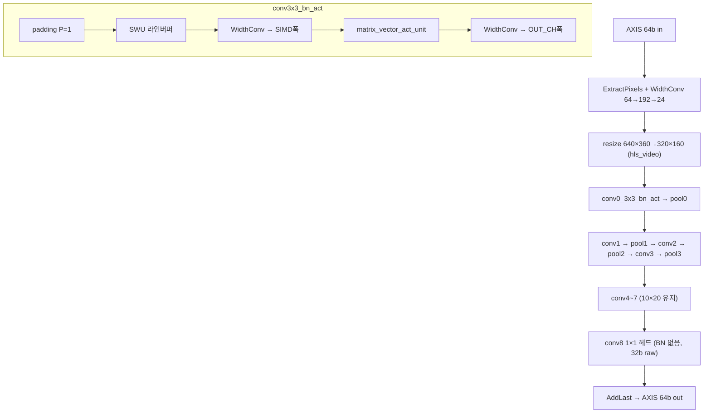
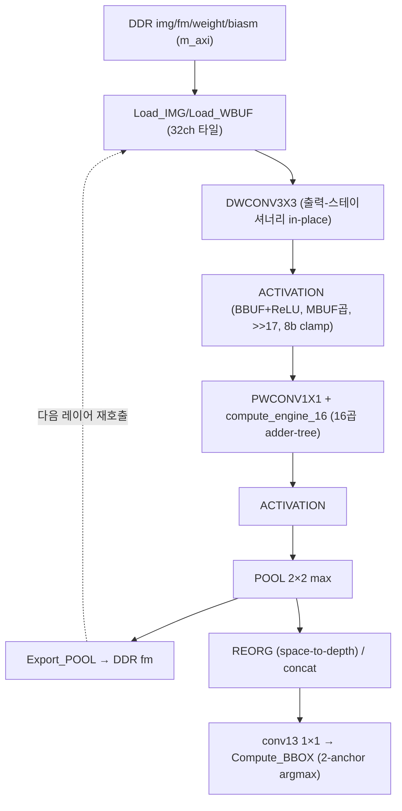
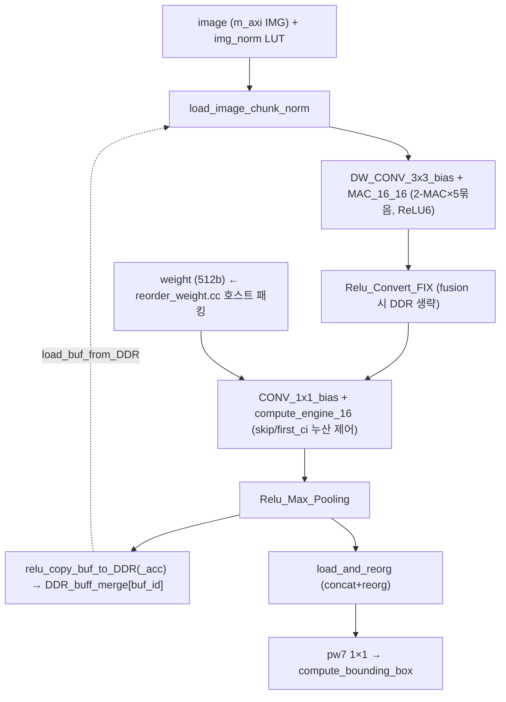

# DAC-SDC 2020 Designs (3팀 비교) 모듈 통합 가이드

> 1차 요약: [`../dac_sdc_2020_designs-master.md`](../dac_sdc_2020_designs-master.md) — 본 문서는 그 요약을 **팀 단위로** 모듈 심화한 통합 가이드다.
> 분석 대상: `\\wsl.localhost\ubuntu-24.04\home\user\project\PRJXR-HBTXR\REF\CNN-Accel\dac_sdc_2020_designs-master`
> 형제 가이드(동형): [`../dac_sdc_2022_champion-master/MODULE_GUIDE.md`](../dac_sdc_2022_champion-master/MODULE_GUIDE.md). 구조: 0 머리말 / 1 모음 개요 / 2..4 팀별 섹션(역할·mermaid·핵심모듈 6요소·코드블록·정량) / 5 팀 비교 한눈표 / 6 읽기순서 / 7 우리 프로젝트 시사점.
> 작성 원칙: 실제 소스 Read 후 `파일:라인` 근거 표기. 라인 근거 없는 추론은 "추정", 코드로 확인 불가는 "확인 불가"로 명시.
> 본 repo는 **단일 대회(DAC-SDC'20)의 3개 입상팀 설계 모음**이다. 2022 champion(단일 UltraNet 트리)과 달리, 본 문서는 **팀별로 서로 다른 가속기 패러다임**(스트리밍 데이터플로우 vs 출력-스테이셔너리 타일 vs ap_fixed DDR 머지)을 모듈로 해부하고 끝에서 비교한다.

---

## 0. 문서 머리말

### 0.1 팀별 대표 케이스 선정
- **BJUT_Runner = UltraNet 4w4a (스트리밍 데이터플로우, SIMD×PE MVU)**. 9 conv(conv0~7 = 3×3 / conv8 = 1×1 헤드) + max_pool 4회. 톱 `ultra_net`(`BJUT_Runner/hls/ultra_net_accelerator_code/ultranet.cpp:463`), dataflow 본체 `do_compute`(`:84`). 입력 호스트 640×360 → 온칩 resize 320×160(`ultranet.cpp:24-28,74`). **대표 conv: conv1(3×3, 16→32, 80×160, 4w4a, SIMD16/PE8)** — `matrix_vector_act_unit` 표준 경로(`config.h:32-33`).
- **ShanghaiTech_SkrSkr = SkyNet (DW-separable, 출력-스테이셔너리 타일, ALLOCATION limit=1)**. 19-레이어 config(`SkyNet.cpp:3-23`), DW3x3+PW1x1 반복 backbone + reorg/concat + conv13 박스헤드. 톱 `SkyNet()`(`SkyNet.cpp:581`). 8bit feature/6bit weight 정수(`SkyNet.h:25-27`). **대표 PW: conv2(1×1, 32→64) `PWCONV1X1`+`compute_engine_16`**(`SkyNet.cpp:166-210`).
- **iSmart = SkyNet 변형 (ap_fixed, 2-MAC 트리, DDR 머지버퍼)**. 동일 SkyNet 토폴로지 + `ap_fixed` round/sat + ReLU6 + 채널 reorg + 인접레이어 fusion. 톱 `SkyNet()`(`iSmart/HLS/net_hls.cc:824`). **대표 DW: `DW_CONV_3x3_bias`+`MAC_16_16`**(`dwconv3x3.cc:33-76`), **대표 PW: `CONV_1x1_bias`+`compute_engine_16`**(`conv1x1.cc:98-155`).

### 0.2 수치 표기 규약
- **MAC lanes** = HLS `#pragma HLS UNROLL`/`PIPELINE` 병렬 차원 곱. 본 모음은 2022 champion과 달리 **DSP-packing(1곱셈 다중 MAC)을 쓰지 않으므로** packing 배수는 없다(예외: 없음). 병렬도는 순수 공간 언롤로만 표기.
  - **BJUT**: lanes = SIMD(입력ch 방향) × PE(출력ch 방향)의 곱셈기. `simd_mul`이 SIMD개를 UNROLL 곱·누산(`matrix_vector_unit.h:48-55`), PE 루프 UNROLL이 PE개 출력채널 동시(`:250-258`). conv1: SIMD16×PE8 = **128 MAC/사이클(II=1)**.
  - **ShanghaiTech**: lanes = 채널32(완전분할 UNROLL) × (PW는 출력채널32 UNROLL). `compute_engine_16`이 16곱+adder tree(`SkyNet.cpp:95-154`). PWCONV1X1: co 32 UNROLL × 16(ci 그룹) = **512 MAC/사이클(II=2)**.
  - **iSmart**: lanes = 채널32 UNROLL. PW `compute_engine_16` co 32 UNROLL × 16 = **512 MAC/사이클(II=2)**(`conv1x1.cc:123-149`). DW는 `MAC_16_16`(2-MAC) × 5묶음 × 32ch UNROLL(`dwconv3x3.cc:49-57`, II=5).
- **scalar MACs**(dense) = OFM_ROW × OFM_COL × OFM_CH × IFM_CH × K × K. 1×1은 K=1, DW(depthwise)는 IFM_CH=1(채널별 독립).
- **loop trips**: BJUT `INPUT_FOLD × OUTPUT_FOLD × VECT_NUMS`(`matrix_vector_unit.h:83`); SkyNet은 공간 루프 `h×w` × (PW는 ci/16 그룹)(`SkyNet.cpp:176-208`, `conv1x1.cc:116-153`).
- **memory size**(payload bit): BJUT 라인버퍼 `(K-1)·IN_COL+K` × IN_CH·IN_BIT(`sliding_window_unit.h:151-152`); SkyNet 온칩 FM 타일 `[32][43][83]`×ADT(`SkyNet.cpp:25-28`), iSmart `[32][44][84]`×FIX_FM(`net_hls.h:84`).
- **타깃 데이터타입**: BJUT 4w4a 정수(conv0만 in8/w4 `config.h:13-15`, conv1~8 in4/w4); ShanghaiTech act `ap_uint<8>`·weight `ap_int<6>`·bias `ap_int<16>`(`SkyNet.h:25-27`); iSmart feature `ap_fixed<9,3>`·weight `ap_fixed<11,4>`·누산 `ap_fixed<13,4>` AP_RND/AP_SAT(`net_hls.h:45-47`).

### 0.3 공통 운영 경로
```
[SW 학습/양자화: PyTorch QAT (BJUT) / 양자화 backbone (SkyNet 계열) — repo 외부]
      │ 가중치 추출 + HLS 친화 레이아웃 변환
      │   BJUT: quantization/qnn_mem_process.py → param.h/config.h ([PE][tiles] 비트팩)
      │   iSmart: reorder_weight.cc → weights_fixed.bin (32 weight = 512bit 패킹, 호스트 SW)
      ▼
[HLS 합성]
      │ BJUT: top ultra_net, clk period 8ns(125MHz) (hls/readme.md:1-5). board part는 HLS tcl 미수록 → 확인 불가
      │ ShanghaiTech: top SkyNet, part xczu3eg-sbva484-1-e, clk period 3ns(333MHz) (hls.tcl:7,14-15)
      │ iSmart: top SkyNet, part xczu3eg, clk period 4ns(250MHz) (script_4ns.tcl:7,15-16)
      ▼
[RTL/Vivado → board: Ultra96(ZU3EG) 계열, PYNQ]
      │ BJUT: AXIS in/out + s_axilite, feature 온칩 FIFO(off-chip 없음) (ultranet.cpp:465-468)
      │ SkyNet 계열: m_axi 다중 번들 + s_axilite, 중간 feature DDR 타일 왕복
      ▼
[PS 후처리: PYNQ 노트북 — 박스 디코딩/NMS (.ipynb, 분석 제외)]
```
- **타깃 보드**: ShanghaiTech·iSmart는 HLS tcl에서 `xczu3eg-sbva484-1-e` 확정(`ShanghaiTech_SkrSkr/hw/hls.tcl:14`, `iSmart/HLS/script_4ns.tcl:15`) = Xilinx Zynq UltraScale+ **ZU3EG (Ultra96-V2)**. BJUT는 HLS tcl에 board part 미수록 → 코드 기준 **확인 불가**(deploy `.bit/.hwh/.ipynb` 존재로 PYNQ Zynq US+ 추정).
- **클럭 목표**: BJUT 8ns(125MHz, `readme.md:4`) / ShanghaiTech 3ns(333MHz, `hls.tcl:15`) / iSmart 4ns(250MHz, `script_4ns.tcl:16`).
- **합성 PPA(LUT/FF/DSP/BRAM/latency)**: 3팀 모두 합성 리포트(.rpt) 미동봉 → **확인 불가**. board 리소스 수치 부재.

---

## 1. 모음 개요 — 팀별 디렉토리·접근법 맵

본 repo는 DAC-SDC'20 FPGA 트랙의 **3개 입상팀** 설계를 한 트리에 모은 것이다. 동일 태스크(단일 객체 bbox 회귀)지만 가속기 패러다임이 서로 다르다.

| 팀 | 모델 | 패러다임 | 양자화 | 병렬화 축 | 면적 전략 | 핵심 디렉토리 |
|---|---|---|---|---|---|---|
| **BJUT_Runner** | UltraNet 4w4a | 스트리밍 데이터플로우(FINN/spooNN 계열) | 정수 4w4a | SIMD×PE | 레이어별 전용 인스턴스(공간 펼침) | `BJUT_Runner/hls/ultra_net_accelerator_code/` |
| **ShanghaiTech_SkrSkr** | SkyNet | 출력-스테이셔너리 온칩 타일 | 정수 8a/6w, `>>17` | 채널32 완전분할 | ALLOCATION limit=1(시간다중화) | `ShanghaiTech_SkrSkr/hw/src/` |
| **iSmart** | SkyNet 변형 | ap_fixed + DDR 머지버퍼 타일 | ap_fixed(9,3)/(11,4) RND/SAT | 채널32 + 2-MAC 트리 | ALLOCATION limit=1(시간다중화) | `iSmart/HLS/` |

근거: BJUT spooNN/BNN-PYNQ 참조(`BJUT_Runner/hls/readme.md:8-9`); ShanghaiTech ALLOCATION(`SkyNet.cpp:589-597`); iSmart ALLOCATION(`net_hls.cc:850-853`).

### 1.1 자체 소스 vs 생성물 vs 빌드

| 팀 | 자체 핵심 소스 | 빌드 | 생성물/제외 |
|---|---|---|---|
| BJUT | `ultranet.cpp`(톱/dataflow), `conv2d.h`, `matrix_vector_unit.h`(MVU), `sliding_window_unit.h`(라인버퍼), `function.h`(BN+양자화), `pool2d.h`, `bn_qrelu2d.h`, `stream_tools.h`, `config.h` | `vivado/*.tcl`, `Makefile`(g++ csim) | `param.h`(가중치 생성물), `deploy/*.bit/.hwh/.ipynb/.so/.npy`, `train/yolov3/`(외부 포크), `*.pt` |
| ShanghaiTech | `SkyNet.cpp`(톱+전 커널), `SkyNet.h`(자료형/오프셋), `transform.cpp`(stitch/패킹), `utils.cpp`/`main.cpp`(TB) | `hw/hls.tcl`, `hw/rtl.tcl` | `dac_sdc.bit/.hwh`, `*.bin`, `SkrSkr.ipynb`(후처리) |
| iSmart | `net_hls.cc`(톱+버퍼관리), `net_hls.h`(typedef), `conv1x1.cc`(PW+엔진), `dwconv3x3.cc`(DW), `reorder_weight.cc`(호스트 패킹) | `HLS/script_4ns.tcl`, `RTL/script.tcl` | `*.bin`(가중치/feature), `Deploy/*.bit/.hwh/.ipynb`, `golden_c.cc/tb.cc/output_verify.cc`(검증 보조) |

### 1.2 제외 목록(이름만 언급)
- **생성물**: `BJUT_Runner/.../param.h`(quantization 스크립트 생성 거대 가중치, `ultranet.cpp:19` include — 차원·레이아웃만 인용), `iSmart/.../*.bin`(`reorder_weight.cc:625-664`가 생성), ShanghaiTech `*.bin`.
- **배포 산출물**: 3팀 모두 `*.bit/.hwh/.npy/.so/.pt` — 합성/배포 바이너리.
- **외부 포크**: `BJUT_Runner/train/yolov3/` — 외부 yolov3 학습 포크(자체 가속기 코드 아님).
- **검증/보조 TB**: `iSmart/HLS/{golden_c.cc,tb.cc,output_verify.cc}`, `ShanghaiTech/.../{main.cpp,utils.cpp}` 일부, BJUT `conv_test.cpp/res_test.cpp`.
- **후처리 노트북**: 3팀 PYNQ `.ipynb` — bbox 디코딩/NMS는 PS-SW, 함수 단위 정독 대상 아님.
- **부재(확인 불가)**: BJUT board part(HLS tcl 미수록), 3팀 합성 PPA 리포트, 정확도 평가 수치.

### 1.3 대표 모델 레이어 구성

**BJUT UltraNet** (근거 `config.h:1-184`, `ultranet.cpp:84-462`):
```
호스트 640×360 → 온칩 resize 320×160×3 (ultranet.cpp:74)
 → conv0 (3×3, 3→16, 8w4a) → pool0   160×320→80×160   (ultranet.cpp:131-173)
 → conv1 (3×3, 16→32, 4w4a) → pool1   80×160→40×80
 → conv2 (3×3, 32→64) → pool2          40×80→20×40
 → conv3 (3×3, 64→64) → pool3          20×40→10×20
 → conv4 (3×3, 64→64) → conv5 → conv6 → conv7  (10×20 유지, 풀링 없음)
 → conv8 (1×1, 64→36 box) → AddLast → AXIS out (ultranet.cpp:433-460)
```
전체가 단일 `#pragma HLS DATAFLOW`(`ultranet.cpp:85`) — DRAM 왕복 없는 레이어-파이프라인.

**SkyNet** (ShanghaiTech `SkyNet.cpp:3-23`; iSmart 동형):
```
입력 320×160×3 → conv0(3×3 DW) → conv1(3×3 DW) → conv2(1×1 PW) → pool1
 → conv3(DW)→conv4(PW)→pool2 → conv5(DW)→conv6(PW)→{reorg, pool3}
 → conv7(DW)→conv8(PW)→conv9(DW)→conv10(PW) → concat(reorg+pool3) → conv11(DW)→conv12(PW)
 → conv13(1×1, →32 box) → BBOX
```
DW3x3+PW1x1 반복(MobileNet식) + YOLO passthrough reorg + 2-anchor bbox. 단일 연산기를 레이어마다 재호출(시간다중화).

---

## 2. 팀 ① BJUT_Runner — UltraNet 스트리밍 데이터플로우 (SIMD×PE MVU)

### 2.0 역할 개요
FINN/spooNN 계열 **스트리밍 데이터플로우**. 전 레이어를 stream FIFO로 연결한 레이어-파이프라인, 가중치는 온칩 const, feature만 흐른다. conv = padding → SWU(라인버퍼) → 폭변환 → MVU(SIMD×PE + 융합 BN/양자화) → 폭변환의 서브-dataflow.



### 2.1 핵심 모듈: Matrix-Vector Unit (SIMD×PE) — `matrix_vector_act_unit`

**(1) 역할 + 상위/하위**: conv의 행렬-벡터 곱 본체. SIMD개 입력채널을 한 곱셈 묶음으로, PE개 출력채널을 동시 누산하고 INPUT_FOLD 완료 시 BN+ReLU+양자화를 즉시 융합. 상위 `conv3x3_bn_act`(`conv2d.h:66`)/`conv1x1_bn_act`(`:171`), 하위 `simd_mul`(`matrix_vector_unit.h:42`)·`bn_qurelu`(`function.h:176`).

**(2) 데이터플로우**: vec.read → row_store(out_fold_cnt==0일 때만) → PE 루프 UNROLL로 `acc[p] += simd_mul(weights[p][tile], temp_vec)` → INPUT_FOLD 완료 시 PE개를 `bn_qurelu`로 양자화 후 out_buf 패킹.

**(3) Function call stack**: `do_compute`(`ultranet.cpp:131`) → `conv3x3_bn_act`(`conv2d.h:35`, DATAFLOW `:43`) → padding(`:55`) → `SWU<3,1,...>`(`:58`) → WidthConv(`:61`) → `matrix_vector_act_unit`(`:66`) → `simd_mul`(`:255`)·`bn_qurelu`(`:268`).

**(4) 대표 코드 위치**: `matrix_vector_unit.h`: `simd_mul` `:42-57`, `matrix_vector_act_unit` `:191-282`, 핵심 루프 `:225-280`, 입력 재사용 `:230-236`, PE 누산 `:250-258`, 융합 양자화 출력 `:266-272`. `row_store` BRAM `:210`.

**(5) 대표 코드 블록**:
```cpp
// SIMD 곱셈 (matrix_vector_unit.h:48-55)
for (unsigned p = 0; p < SIMD; p++) {
#pragma HLS UNROLL
    ap_int<W_BIT> temp_w = weights( (p+1)*W_BIT-1, p*W_BIT );
    ap_uint<IN_BIT> temp_in = in( (p+1)*IN_BIT-1, p*IN_BIT );
    ap_int<W_BIT + IN_BIT> result = temp_w * temp_in;  // DSP/LUT 자동 선택
    accumulation += result;
}
// MVU 입력 재사용 + PE 누산 (matrix_vector_unit.h:230-258)
if (out_fold_cnt == 0) { temp_vec = vec.read(); row_store[in_fold_cnt] = temp_vec; }  // :230-232
else                   { temp_vec = row_store[in_fold_cnt]; }                          // :234-236
for (unsigned p = 0; p < PE; p++) {                  // :250
#pragma HLS UNROLL
    acc[p] += simd_mul<W_BIT,IN_BIT,M_BIT,SIMD>(weights[p][tile], temp_vec);          // :255
}
// INPUT_FOLD 완료 시 융합 BN+양자화 (matrix_vector_unit.h:266-272)
out_buf((p+1)*OUT_BIT-1, p*OUT_BIT) = bn_qurelu<...>(acc[p], inc[p][out_fold_cnt], bias[p][out_fold_cnt]);  // :268
```
- **입력 재사용 핵심**: `out_fold_cnt==0`일 때만 입력을 읽어 `row_store`에 저장, 이후 OUTPUT_FOLD 회 재사용 → 같은 입력 윈도우를 여러 출력 타일이 공유.
- **융합**: conv+BN+ReLU+양자화가 한 모듈 안에서 닫힘(`bn_qurelu` 1회 호출로 곱1+가산1+시프트1).
- **LUT 변형**: `simd_mul_lut`(`:17-32`)는 `#pragma HLS RESOURCE variable=result core=Mul_LUT`(`:28`)로 DSP 대신 LUT 강제. `matrix_vector_act_unit_lut`(`:418-507`)도 동일 구조 — DSP 부족 시 저비트 곱을 LUT로 오프로드.

**(6) 마이크로아키텍처**:
- **MAC lanes**: conv1 SIMD16×PE8 = **128 MAC/사이클**(II=1, `:226`). conv0 SIMD3×PE16 = 48; conv2 SIMD16×PE8 = 128; conv3 SIMD16×PE4 = 64; conv4~7 SIMD8×PE2 = 16; conv8(1×1) SIMD8×PE2 = 16(`config.h:11-12,32-33,53-54,74-75,95-96,179-180`).
- **scalar MACs(dense)**: conv0 = 160×320×16×3×9 ≈ 22.1M; conv1 = 80×160×32×16×9 ≈ 59.0M; conv2 = 40×80×64×32×9 ≈ 59.0M; conv3 = 20×40×64×64×9 ≈ 29.5M; conv4~7 각 = 10×20×64×64×9 ≈ 7.37M; conv8(1×1) = 10×20×36×64 ≈ 0.46M.
- **loop trips**: `total_reps = INPUT_FOLD·OUTPUT_FOLD·VECT_NUMS·reps`(`:205`). conv1 = (16·9/16)·(32/8)·(80·160) = 9·4·12800 = **460,800**(reps=1, II=1).
- **메모리/병목**: `row_store[INPUT_FOLD]` BRAM(`:210`). 가중치는 톱에서 `complete dim=1`(PE 차원, `ultranet.cpp:474-502`)로만 partition — SIMD 비트팩이 한 워드라 추가 분할 불필요. conv1·conv2(각 ≈59.0M, trips 460,800)가 최대 부하 → 단일 DATAFLOW 처리량 병목. **버그/주의**: `bn_qurelu`의 `bn_res = in*inc + bias`가 `ap_int<IN_BIT>`(=`ap_int<M_BIT>`)로 선언(`function.h:182`) — 곱가산 폭 확장 없이 누산폭 그대로 받아 큰 inc/bias에서 오버플로 위험(2022 champion은 `_fixed`로 `IN_BIT+INC_BIT+1` 확장; 본 repo는 미확장, 정확도 영향 코드만으론 **확인 불가**).

### 2.2 핵심 모듈: Sliding Window Unit (라인버퍼) — `sliding_window_unit`

**(1) 역할**: im2col 명시 없이 라인버퍼 스트리밍으로 K×K 윈도우 생성. 두 구현: 일반 `SWU`(`:10-125`, 버퍼 `K·Din_W`)와 메모리 최적 `sliding_window_unit`(`:127-214`, 버퍼 `(K-1)·IN_COL+K`). conv3x3 경로는 `SWU<3,1,...>` 사용(`conv2d.h:58`), pool도 `SWU` 재사용(`pool2d.h:129`).

**(2) 핵심 최적화**: `BUF_SIZE = (K-1)*IN_COL + K`(`sliding_window_unit.h:151`) — "K=3일 때 완전한 3행이 아니라 2×IN_COL+3만 있으면 의존성 해소"(주석 `:147-151`). 순환 큐 포인터(`buf_pointer`)로 K×K 윈도우 출력(`:181-193`), `right_slid/down_slid` 카운터로 stride·줄넘김 관리(`:196-211`).

**(3) 대표 코드 위치**: `SWU` line_buffer `:32`(`core=RAM_2P` `:33`), 윈도우 출력 `:96-122`; `sliding_window_unit` BUF_SIZE `:151`, 윈도우 추출 `:181-193`, 슬라이딩 카운터 `:196-211`.

**(4) 마이크로아키텍처**: line_buffer BRAM(`:153`). conv1(IN_COL=160+2pad=162, IN_CH=16, IN_BIT=4): BUF_SIZE = 2·162+3 = 327 워드 × 64bit ≈ 20.9Kb(추정). pool은 `SWU<2,2,...>`(`pool2d.h:129`)로 윈도우 생성 후 `pool_cal`이 K×K 최대값(`pool2d.h:86-95`).

### 2.3 핵심 모듈: 융합 BN+양자화 ReLU — `bn_qurelu`

**(1) 역할**: conv psum(M_BIT)을 정수 도메인 BN(inc 곱·bias 가산) 후 round-shift·ReLU·4bit 클램프로 재양자화. 상위 `matrix_vector_act_unit`(`:268`), `bn_qrelu2d`(`bn_qrelu2d.h`, conv8 비융합 경로).

**(2) 대표 코드 위치**: `function.h`: `bn_qurelu`(활성) `:167-197`(이진탐색 구버전 `:126-163`은 주석 처리). padding `:75-117`.

**(3) 대표 코드 블록**:
```cpp
const unsigned D = 1 << (W_BIT - 1 + DATA_BIT + L_SHIFT);   // function.h:180
ap_int<IN_BIT> bn_res = in * inc + bias;                    // :182  (폭 미확장 — 2.1 병목 참조)
if (bn_res > 0) {
    bn_res = (bn_res + (D >> 1)) >> (W_BIT - 1 + DATA_BIT + L_SHIFT);  // :186  round + shift
    res = (bn_res > 15) ? 15 : bn_res;                      // :187-191  4bit 클램프
} else { res = 0; }                                          // :193  ReLU
```
- shift량 `W_BIT-1 + DATA_BIT + L_SHIFT`(L_SHIFT=8, `config.h:20`)로 BN 스케일을 정수에서 흡수. 출력 0~15(4bit unsigned). BN·ReLU·재양자화를 곱1+가산1+시프트1로 구현.

**(4) 정량**: conv별 INC_BIT/BIAS_BIT는 max값 자동산출(`config.h`: conv0 14/26, conv1 13/21, …, conv7 14/23). M_BIT는 호출부 상수 32(`ultranet.cpp:141`). conv8은 BN 없이 raw 32b 출력(`conv1x1`, `ultranet.cpp:433-448`).

### 2.4 핵심 모듈: 톱 dataflow + 인터페이스 — `do_compute` / `ultra_net`
- **역할**: 전 레이어를 단일 `#pragma HLS DATAFLOW`로 연결(`ultranet.cpp:85`). AXIS in/out + s_axilite(reps/return)(`:465-468`). 가중치/inc/bias 전부 `complete dim=1`(`:470-502`).
- **인터페이스 코드**(`ultranet.cpp:463-504`): AXIS register both(`:465-466`), 입력 프론트엔드 ExtractPixels(`:91`)+WidthConv 64→192→24(`:95-100`)+resize(`:108`), 헤드 conv8 후 AddLast(`:460`).
- **HW/SW**: 거의 100% PL. 호스트는 resize 입력/박스 디코딩(PYNQ), QAT+param 생성(`quantization/`).

---

## 3. 팀 ② ShanghaiTech_SkrSkr — SkyNet 출력-스테이셔너리 타일 (ALLOCATION limit=1)

### 3.0 역할 개요
MobileNet식 **DW3x3+PW1x1** backbone을 채널32 완전분할 온칩 타일에서 계산. 핵심은 **단일 연산기를 레이어마다 재호출(시간다중화)** — ALLOCATION limit=1로 각 커널 1인스턴스만 합성, 면적 최소화(ZU3EG 소형 보드 적합). 중간 feature는 DDR(`fm`) 타일 왕복.



### 3.1 핵심 모듈: Depthwise 3x3 (출력-스테이셔너리) — `DWCONV3X3`

**(1) 역할 + 상위/하위**: 채널별 독립 3×3. 9탭을 출력 픽셀 버퍼에 in-place 누적(출력-스테이셔너리). 상위 `SkyNet()`(`SkyNet.cpp:631`), 하위 없음(직접 곱).

**(2) 대표 코드 위치**: `SkyNet.cpp`: `DWCONV3X3` `:73-93`, partition `:75-77`, 루프 `:79-84`, in-place 누적 `:85-87`. `clamp_BDT` 16b 포화 `:63-71`.

**(3) 대표 코드 블록**:
```cpp
void DWCONV3X3(ADT IFM[32][43][83], BDT OFM[32][43][83], WDT WBUF3x3[32][3][3]) {
#pragma HLS ARRAY_PARTITION variable=OFM dim=1 complete   // :75 채널32 완전분할
#pragma HLS ARRAY_PARTITION variable=IFM dim=1 complete   // :76
  for(int i=0;i<3;i++) for(int j=0;j<3;j++)               // :79-80  커널 탭
   for(int h=1;h<42;h++) for(int w=1;w<82;w++) {          // :81-82  공간
#pragma HLS PIPELINE II=1                                  // :83
    for(int c=0;c<32;c++){                                 // :84  채널 암시적 UNROLL(partition)
      odata = OFM[c][h][w];                                // :85  출력-스테이셔너리 read
      odata += IFM[c][h+i-1][w+j-1]*WBUF3x3[c][i][j];      // :86  9탭에 걸쳐 누적
      OFM[c][h][w] = clamp_BDT(odata, bmin, bmax);         // :87  16b 포화
    }}}
```
- **출력-스테이셔너리**: i·j 커널 루프가 바깥, 출력 픽셀이 OFM 버퍼에 머물며 9탭 누적. 채널32는 dim=1 complete partition으로 동시 처리.

**(4) 마이크로아키텍처**: lanes = 채널32(II=1). scalar MAC(DW) = OFM_H·OFM_W·OFM_CH·9(IFM_CH=1, 채널별). 예: conv5(3×3 DW, 80×40×96) ≈ 80×40×96×9 ≈ 2.76M. 9탭 × h·w trip.

### 3.2 핵심 모듈: Pointwise 1x1 + 16곱 엔진 — `PWCONV1X1` / `compute_engine_16`

**(1) 역할**: 1×1 = 채널 행렬곱. `compute_engine_16`이 16 입력채널 곱 후 balanced adder tree(8→4→2→1)로 누산. PWCONV1X1이 ci를 16씩 끊고 co 32 UNROLL로 32×16 MAC 동시.

**(2) 대표 코드 위치**: `SkyNet.cpp`: `compute_engine_16` `:95-154`(곱 `:117-132`, adder tree `:134-152`), `LOAD_W1x1` `:156-164`, `PWCONV1X1` `:166-210`, co UNROLL `:184-186`, in-place 누적 `:187-205`.

**(3) 대표 코드 블록**:
```cpp
// compute_engine_16: 16곱 + balanced adder tree (SkyNet.cpp:117-152)
mul0=w0*b0; ... mul15=w15*b15;                 // :117-132  16 곱
add0=mul0+mul1; ... add7=mul14+mul15;          // :134-141  8 합
add8=add0+add1; ...                            // :143-146  4 합
add12=add8+add9; add13=add10+add11;            // :148-149  2 합
add14=add12+add13; return add14;               // :151-153  1 합
// PWCONV1X1 본체 (SkyNet.cpp:176-206)
for(int ci=0;ci<32;ci+=16){ LOAD_W1x1(WBUF1x1,W1x1,ci);    // :176-178  16ch weight 로드
 for(int h=1;h<42;h++) for(int w=1;w<82;w++){
#pragma HLS PIPELINE II=2                                    // :183
  for(int co=0;co<32;co++){                                  // :184
#pragma HLS UNROLL                                           // :186  출력채널32 동시
   DT odata = OFM[co][h][w];                                 // :187  in-place read
   odata += compute_engine_16(W1x1[co][0],IFM[ci+0][h][w], ...);  // :188-204  16ch MAC
   OFM[co][h][w] = clamp_BDT(odata, bmin, bmax); }}}         // :205
```

**(4) 마이크로아키텍처**: lanes = co 32 UNROLL × 16(engine 내부) = **512 MAC/사이클**(II=2). scalar MAC(PW) = OFM_H·OFM_W·OFM_CH·IFM_CH. 예: conv2(1×1, 320×160... 실 타일 40×80 영역, 32→64) — config 기준 conv2 320×160×64 입력32 ≈ 큰 부하. ci 32→16씩 2회(`:176`).

### 3.3 핵심 모듈: 융합 활성 (BN+ReLU+재양자화) — `ACTIVATION`
- **역할**: BDT IFM에 BBUF(bias) 더하기 → ReLU → MBUF(scale) 곱 → `>>nm`(=÷2^17) 재스케일 → 8bit 클램프. 경계행/열은 0. 상위 `SkyNet()`(`:632,636`).
- **대표 코드**(`SkyNet.cpp:253-276`):
```cpp
qy = IFM[c][h][w] + BBUF[c];   // :264  bias 가산
qy = ReLU(qy);                  // :265  ReLU
qy = (qy*MBUF[c]) >> nm;        // :266  scale 곱 + 17b 시프트 재양자화
y = clamp_adt(qy, amin, amax);  // :267  8b 클램프 (0~255)
if(h==0|...|w==82) OFM=0; else OFM=y;  // :269-272  경계 0
```
- nm=17, qm=2^17(`SkyNet.h:50-51`). BN scale은 MBUF(곱)+nm 시프트, bias는 BBUF — BN+ReLU+재양자화 융합.

### 3.4 핵심 모듈: REORG + 배치 stitch — `REORG` / `transform.cpp`
- **REORG**(`SkyNet.cpp:35-61`): 80×40→40×20×4 space-to-depth(YOLO passthrough). Cx/Rx 인덱싱 stride-2 재배치(`:47-56`), 32ch UNROLL(`:53-56`). config `:13`이 reorg 80,40,192→40,20,768.
- **stitch/패킹**(`transform.cpp`): `stitch`(`:3-30`)가 4-quadrant 출력을 큰 OFM에 합성, `img_DT_2_DT4`(3ch 8b→32b), `fm_DT_2_DT32`(32ch→256b)로 DDR 버스트 효율(`SkyNet.h:140-141`).

### 3.5 핵심 모듈: 톱 — `SkyNet()` (단일 함수 오케스트레이션)
- **역할**: m_axi 4번들(img/fm/weight/biasm) + s_axilite(`SkyNet.cpp:583-587`). ALLOCATION limit=1로 9개 커널 단일 인스턴스(`:589-597`: PWCONV1x1/DWCONV3x3/REORG/POOL/ACTIVATION/Load_FM/Export_CONV/Load_FM1/Export_CONV1) → 레이어 시간다중화.
- **배치 4-타일**: Load_IMG로 4 quadrant ping-pong(`:613-657`), 레이어별 Load_WBUF/Load_BBUF 스트리밍. bbox `Compute_BBOX`(`:490-558`)가 conf 채널 argmax로 2-anchor 박스 선택(`:930` 호출).
- **메모리**: 온칩 FM1~4 `[32][43][83]`(`:25-28`), WBUF3x3 `[3][32][3][3]`/WBUF1x1 `[2][32][32]`(`:30-31`). 채널32 완전분할 일관.

---

## 4. 팀 ③ iSmart — SkyNet 변형 (ap_fixed, 2-MAC, DDR 머지버퍼)

### 4.0 역할 개요
SkyNet 토폴로지를 **ap_fixed(round/sat)** + **DDR 머지버퍼 타일링** + **인접 레이어 fusion**으로 재구현. 온칩 버퍼는 작게(`[32][44][84]`) 유지, 중간 feature는 단일 큰 DDR 영역(`DDR_buff_merge`)을 buf_id 오프셋으로 ping-pong. CSIM_DEBUG 시 전부 float로 치환해 골든 비교(`net_hls.h:22-42`).



### 4.1 핵심 모듈: Depthwise 3x3 (2-MAC 트리, ReLU6) — `DW_CONV_3x3_bias` / `MAC_16_16`

**(1) 역할 + 상위/하위**: 채널별 3×3, 9탭을 5개 2-MAC(`MAC_16_16`)로 묶어 누산 후 bias. ReLU6 별도 패스. 상위 `SkyNet()`(`net_hls.cc`), 하위 `MAC_16_16`(`dwconv3x3.cc:23`), `relu_single`(`:12`).

**(2) 명칭 주의**: `MAC_16_16`은 **2-입력 MAC**(`w1*b1+w2*b2`, `dwconv3x3.cc:27`)이다. "16_16"은 입력 수가 아니라 비트 관련 명명으로 보임(추정). 16-입력 트리는 PW의 `compute_engine_16`(4.2).

**(3) 대표 코드 위치**: `dwconv3x3.cc`: `relu_single`(ReLU6) `:12-18`, `MAC_16_16` `:23-30`, `DW_CONV_3x3_bias` `:33-76`, 9탭 5묶음 `:52-57`, II=5 `:49`, 32ch UNROLL `:50-51`, ReLU6 패스 `:65-75`.

**(4) 대표 코드 블록**:
```cpp
inline FIX_FM relu_single(FIX_FM d){ if(d>6) return 6; if(d<0) return 0; return d; }  // :12-18 ReLU6
ap_fixed<24,7> MAC_16_16(FIX_WT w1,FIX_FM b1,FIX_WT w2,FIX_FM b2){ return w1*b1+w2*b2; } // :23-30 2-MAC
// 본체 (dwconv3x3.cc:47-59)
for(h=1..42) for(w=1..82){
#pragma HLS pipeline II=5                                  // :49
 for(co=0;co<32;co++){
#pragma HLS unroll                                         // :51
  tmp1=MAC_16_16(W[co][0][0],b[h-1][w-1], W[co][0][1],b[h-1][w]);   // :52  (8쌍)
  ... tmp5=MAC_16_16(W[co][2][2],b[h+1][w+1], 0,0);                 // :56  (1단일 = 9탭)
  sum = tmp1+tmp2+tmp3+tmp4+tmp5;                                   // :57
  top[co][h][w] = (FIX_FM)bias[co] + sum; }}                        // :59
```

**(5) 마이크로아키텍처**: lanes = 32ch UNROLL(II=5). 9탭 = 4 쌍 + 1 단일 = 5 MAC_16_16. `ap_fixed<24,7>` 중간 누산. ReLU6는 `relu==1`일 때 별도 2행씩 패스(`:65-75`).

### 4.2 핵심 모듈: Pointwise 1x1 (16곱 트리, 채널분할 누산) — `CONV_1x1_bias` / `compute_engine_16`

**(1) 역할**: ShanghaiTech와 동형 16곱 + balanced adder tree, 단 `FIX_32_10` 누산. `first_ci_flag`/`skip`로 여러 호출에 걸친 채널 누산 분할(채널>32 시 partial-sum 이어받기).

**(2) 대표 코드 위치**: `conv1x1.cc`: `compute_engine_16` `:11-71`(곱 `:33-48`, tree `:50-69`), `load_weights`(시프트레지스터) `:76-93`, `CONV_1x1_bias` `:98-155`, ci 16씩 `:116`, II=2 `:123`, coo UNROLL `:125-126`, 누산 제어 `:127-131`.

**(3) 대표 코드 블록**:
```cpp
// 시프트레지스터 weight 로드 (conv1x1.cc:85-90)
for(i=0;i<15;i++){ weight_buf[co][i]=weight_buf[co][i+1]; }  // 슬라이딩
weight_buf[co][15]=weights[co][ci+CI];
// 채널분할 누산 (conv1x1.cc:127-149)
FIX_FM_acc residual;
if(ci==0 && first_ci_flag) residual = bias[coo];   // :128-129  첫 ci = bias 시작
else                       residual = top[coo][h][w]; // :130-131  이어받기(partial-sum)
top[coo][h][w] = residual + compute_engine_16(weight_buf[coo][0], bottom[offset+0][h][w], ...); // :133-149
```
- `for(ci=0; ci<2-skip; ci++)`(`:116`): 32ch를 16씩 2그룹, skip로 그룹 수 조절. partial-sum을 top 버퍼에 누적해 채널 누산을 호출 경계 너머로 분할.

**(4) 마이크로아키텍처**: lanes = coo 32 UNROLL × 16 = **512 MAC/사이클**(II=2). `FIX_32_10` 누산(`conv1x1.cc:28-31`).

### 4.3 핵심 모듈: 톱 + DDR 머지버퍼 타일링 — `SkyNet()`
- **역할**: image/weight_1x1/weight_3x3/bias/DDR_buff_merge/predict_boxes/constant 각 m_axi(번들 IMG/BUS512/DDR256/BUS32), return s_axilite(`net_hls.cc:836-847`). ALLOCATION limit=1: CONV_1x1_bias/DW_CONV_3x3_bias/Relu_Max_Pooling/load_image_chunk_norm 단일화(`:850-853`).
- **DDR 머지버퍼**: 단일 큰 DDR 영역을 buf_id 오프셋으로 분할(DW1_POOL_OFFSET=524288, DW2_POOL_OFFSET=786432, `net_hls.cc:11-12`). 각 레이어 출력을 `relu_copy_buf_to_DDR(_acc)`로 쓰고 다음 레이어가 `load_buf_from_DDR`/`load_dwX_pool_from_DDR`로 타일 로드(`:919-1234` 다수) — 온칩 작게, 중간 feature DDR ping-pong.
- **레이어 fusion**: DW4의 1×1 출력을 DDR 안 쓰고 바로 DW5 3×3 입력으로(`Relu_Convert_FIX`→`DW_CONV_3x3_bias`, `:1062`), DW5도 동일(`:1120`) — 인접 레이어 fusion으로 DDR 왕복 절감.
- **img 정규화 LUT**: `load_image_chunk_norm`(`net_hls.cc:850 alloc`)이 0~255 픽셀을 정규화 테이블로 매핑(나눗셈/곱 대신 LUT). 채널 reorg `load_and_reorg`/`load_and_reorg_part`(`:689-781`)가 256b DATA를 32 ap_uint<8> 분해 후 4 출력버퍼 분배(concat+reorg 로드 단계 처리).
- **bbox**: `compute_bounding_box`(`:29-274`)가 4-quadrant×2-anchor conf argmax(`:1234` 호출, ShanghaiTech `Compute_BBOX`와 동의미).

### 4.4 핵심 모듈: 호스트 weight 재배열/패킹 — `reorder_weight.cc`
- **역할**: float weight를 ap_fixed 변환 + 채널 zero-pad + 32채널 단위 reorder 후 **32 weight를 512bit 한 워드로 패킹**해 `weights_fixed.bin` 출력(`reorder_weight.cc:625-664`, `DATA.range(j*16+WT_RG, j*16)`). HLS의 512bit weight 버스 레이아웃(`net_hls.h:75-76`, uint512)과 정확히 대응. **HLS 합성 전 호스트(SW) 단계**(csim 컨텍스트).

---

## 5. 팀 비교 한눈표

### 5.1 아키텍처/연산 구조

| 항목 | BJUT_Runner (UltraNet) | ShanghaiTech_SkrSkr (SkyNet) | iSmart (SkyNet 변형) |
|---|---|---|---|
| 모델/연산 | 9 conv(3×3 ×8 + 1×1 헤드) | DW3x3+PW1x1 반복(19층) | DW3x3+PW1x1 반복(SkyNet) |
| 패러다임 | 스트리밍 데이터플로우(전레이어 융합) | 출력-스테이셔너리 온칩 타일 | DDR 머지버퍼 타일 |
| MAC 구조 | SIMD×PE MVU, `simd_mul` UNROLL | `compute_engine_16`(16곱 adder-tree) | DW `MAC_16_16`(2-MAC), PW `compute_engine_16`(16곱) |
| MAC lanes(대표) | conv1 SIMD16×PE8 = **128**/cyc(II=1) | PW co32×16 = **512**/cyc(II=2) | PW coo32×16 = **512**/cyc(II=2) |
| 병렬화 축 | SIMD(입력ch)×PE(출력ch) | 채널32 완전분할(UNROLL) | 채널32 UNROLL |
| 면적 전략 | 레이어별 전용 인스턴스(공간펼침) | ALLOCATION limit=1(시간다중화) | ALLOCATION limit=1(시간다중화) |

### 5.2 양자화/패킹/메모리

| 항목 | BJUT_Runner | ShanghaiTech_SkrSkr | iSmart |
|---|---|---|---|
| 양자화 | 정수 4w4a(conv0 in8) | 정수 act8/wt6, `>>17` 재스케일 | ap_fixed(9,3)/(11,4) RND/SAT |
| BN+활성 융합 | `bn_qurelu`(곱1+가산1+시프트1, `function.h:182-186`) | `ACTIVATION`(BBUF+ReLU+MBUF곱+`>>17`, `SkyNet.cpp:264-267`) | `Relu_Convert_FIX` + ReLU6(`dwconv3x3.cc:12`) |
| 가중치 위치 | 온칩 const(`param.h`), top partition | DDR→온칩 WBUF 스트리밍 | DDR 512b→온칩, 호스트 reorder bin |
| 가중치 패킹 | SIMD개=1정수 비트팩(`qnn_mem_process.py`) | 32ch=256b(`fm_DT_2_DT32`) | 32 weight=512b(`reorder_weight.cc:625`) |
| 중간 feature | 온칩 FIFO(off-chip 없음) | DDR `fm` 타일 왕복 | DDR `DDR_buff_merge` 타일 왕복 |
| 온칩 버퍼 | 라인버퍼 `(K-1)·COL+K`(`swu:151`) | FM `[32][43][83]`(`SkyNet.cpp:25`) | FM `[32][44][84]`(`net_hls.h:84`) |
| 특징 한 줄 | 전레이어 스트리밍, LUT/DSP 균형 옵션 | 시간다중화 면적최소, 정수 단순 | ap_fixed 정밀관리, 인접 fusion, img LUT |

### 5.3 빌드/타깃

| 항목 | BJUT_Runner | ShanghaiTech_SkrSkr | iSmart |
|---|---|---|---|
| HLS top | `ultra_net`(`ultranet.cpp:463`) | `SkyNet`(`hls.tcl:7`) | `SkyNet`(`script_4ns.tcl:7`) |
| board part | **확인 불가**(HLS tcl 미수록) | xczu3eg-sbva484-1-e(`hls.tcl:14`) | xczu3eg-sbva484-1-e(`script_4ns.tcl:15`) |
| clk 목표 | 8ns/125MHz(`readme.md:4`) | 3ns/333MHz(`hls.tcl:15`) | 4ns/250MHz(`script_4ns.tcl:16`) |
| 합성 PPA | 확인 불가(.rpt 부재) | 확인 불가 | 확인 불가 |

---

## 6. 읽기 순서 / 코드 추적 순서

1. **모음 지형 파악**: 본 가이드 §1 표 + 1차 요약(`../dac_sdc_2020_designs-master.md`) §2 디렉토리 구조로 3팀 패러다임 차이를 먼저 잡는다.
2. **BJUT(스트리밍)**: `config.h`(레이어 SIMD/PE) → `matrix_vector_unit.h` `simd_mul`(`:42`)·`matrix_vector_act_unit`(`:191`, 입력재사용 `:230`, PE누산 `:255`) → `function.h` `bn_qurelu`(`:167`) → `sliding_window_unit.h` BUF_SIZE 최적화(`:151`) → `conv2d.h` 서브-dataflow(`:43`) → `ultranet.cpp` `do_compute`/`ultra_net`(`:84,463`).
3. **ShanghaiTech(타일)**: `SkyNet.h` 자료형/오프셋 → `SkyNet.cpp` config(`:3`) → `DWCONV3X3` 출력-스테이셔너리(`:73`) → `compute_engine_16`(`:95`)+`PWCONV1X1`(`:166`) → `ACTIVATION`(`:253`)/`POOL`(`:220`)/`REORG`(`:35`) → `SkyNet()` ALLOCATION+오케스트레이션(`:581-597`) → `transform.cpp` stitch/패킹.
4. **iSmart(ap_fixed/DDR)**: `net_hls.h` typedef(`:45-47`) → `dwconv3x3.cc` `MAC_16_16`/`DW_CONV_3x3_bias`(`:23,33`) → `conv1x1.cc` `compute_engine_16`/`CONV_1x1_bias`(`:11,98`, 누산제어 `:127`) → `net_hls.cc` DDR 머지버퍼/fusion(`:11,824,1062`) → `reorder_weight.cc` 호스트 패킹(`:625`).
5. **비교 종합**: §5 표로 MAC 구조·패킹·메모리·면적 전략을 가로로 비교, §7로 우리 프로젝트에 매핑.

---

## 7. 우리 프로젝트(ViT/Transformer FPGA + XR 시선추적) 시사점

1. **SIMD×PE MVU 패턴(BJUT)** = Transformer Linear/QKV projection·FFN GEMM 직재사용. `matrix_vector_act_unit`의 INPUT_FOLD/OUTPUT_FOLD 타일링 + `row_store` 입력 재사용(`matrix_vector_unit.h:230-258`)은 attention Q·Kᵀ matmul 타일링에 그대로 매핑. HG-PIPE식 레이어-파이프라인을 노린다면 BJUT 전-레이어 DATAFLOW(`ultranet.cpp:85`)가 참조 모델.
2. **DSP/LUT 균형(`simd_mul_lut`, `core=Mul_LUT`, `matrix_vector_unit.h:28`)**: 저비트 곱을 LUT로 오프로드하는 옵션 → DSP가 부족한 ViT 가속기에서 저비트 MAC을 LUT로, attention 고정밀 누산에 DSP 집중. 2022 champion의 DSP-packing과 대비되는 "LUT 오프로드" 노선.
3. **융합 양자화활성(BJUT `bn_qurelu`, SkyNet `ACTIVATION`)**: BN·ReLU·재양자화를 곱1+가산1+시프트1로 흡수하는 정수 도메인 기법은 ViT LayerNorm/GELU를 정수·시프트 근사로 융합하는 데 응용 가능(단 LayerNorm은 reduction 필요 → 별도 데이터패스 필요, 직접 재사용은 "추정"). **주의**: BJUT `bn_qurelu`의 누산폭 미확장(`function.h:182`)은 우리 설계에서 반드시 폭 확장으로 회피(2022 champion `_fixed` 참조).
4. **호스트 weight 재배치·비트패킹(`qnn_mem_process.w_to_hls_array`, `reorder_weight.cc:625`)**: 가중치를 `[PE][tiles]`·512bit 워드로 사전 패킹하는 SW 전처리는 큰 Transformer weight를 HLS 버스폭에 맞추는 필수 패턴. 양자화 스크립트↔HLS 레이아웃 일대일 대응 설계를 차용.
5. **면적 전략 선택지**: BJUT(공간 펼침=처리량 우선) vs SkyNet(ALLOCATION limit=1 시간다중화=면적 우선)의 대비는 XR 시선추적의 저지연 vs 소형보드 자원 트레이드오프 결정 가이드. 시선추적은 저지연·소모델이라 BJUT식 스트리밍 유리(추정), ViT backbone이 크면 SkyNet식 DDR 타일링 불가피.
6. **DDR 타일 ping-pong + 인접 fusion(iSmart `DDR_buff_merge`, `net_hls.cc:1062`)**: ViT 토큰×차원 중간 텐서가 온칩에 안 들어갈 때의 타일 스케줄링·fusion 사례. 단 매직넘버 오프셋(`net_hls.h:69-123`)의 복잡성은 반면교사(파라미터화 권장).
7. **출력-스테이셔너리 채널분할(SkyNet `DWCONV3X3`/`PWCONV1X1`)**: 하이브리드(conv-stem + transformer)나 MobileViT류 경량 XR backbone이면 DW3x3+PW1x1 커널과 출력-스테이셔너리 버퍼(`SkyNet.cpp:85-87`) 재사용 가능.

---

*근거 파일(절대경로)*:
- **BJUT**: `\\wsl.localhost\ubuntu-24.04\home\user\project\PRJXR-HBTXR\REF\CNN-Accel\dac_sdc_2020_designs-master\BJUT_Runner\hls\ultra_net_accelerator_code\{ultranet.cpp,conv2d.h,matrix_vector_unit.h,sliding_window_unit.h,function.h,pool2d.h,config.h}`, `...\BJUT_Runner\hls\readme.md`
- **ShanghaiTech**: `...\ShanghaiTech_SkrSkr\hw\src\{SkyNet.cpp,SkyNet.h,transform.cpp}`, `...\ShanghaiTech_SkrSkr\hw\hls.tcl`
- **iSmart**: `...\iSmart\HLS\{net_hls.cc,net_hls.h,conv1x1.cc,dwconv3x3.cc,reorder_weight.cc,script_4ns.tcl}`
- 제외(이름만): `...\BJUT_Runner\hls\...\param.h`, `train/yolov3/`, 3팀 `*.bit/.hwh/.bin/.npy/.pt`, `*.ipynb`, iSmart `{golden_c.cc,tb.cc,output_verify.cc}`.
