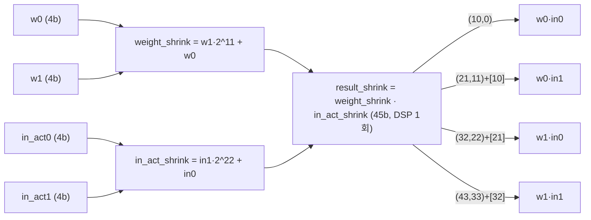
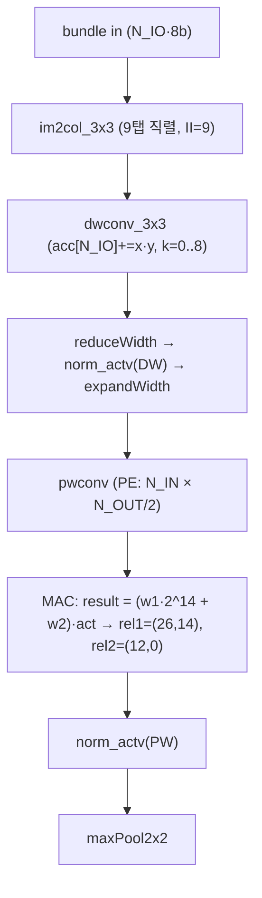
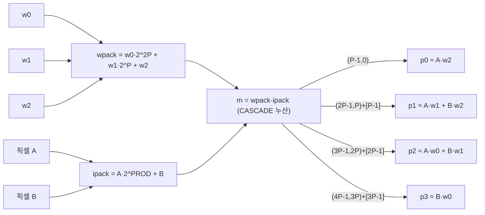

# DAC-SDC 2021 Designs (멀티팀 모음) 모듈 통합 가이드

> 1차 요약: [`../dac_sdc_2021_designs-main.md`](../dac_sdc_2021_designs-main.md) — 본 문서는 그 요약을 **개별 파일 Read 기반**으로 모듈 단위 심화한 통합 가이드다.
> 분석 대상: `\\wsl.localhost\ubuntu-24.04\home\user\project\PRJXR-HBTXR\REF\CNN-Accel\dac_sdc_2021_designs-main`
> 형제 가이드(동형 구조): [`../dac_sdc_2022_champion-master/MODULE_GUIDE.md`](../dac_sdc_2022_champion-master/MODULE_GUIDE.md) (UltraNet 4w4a DSP packing 단일팀 해부).
> 작성 원칙: 실제 소스 Read 후 `파일:라인` 근거 표기. 라인 근거 없는 추론은 "추정", 코드로 확인 불가는 "확인 불가"로 명시.
> **1차 요약 정정 이력**: 1차에서 (a) iSmart top 통합 그래프를 "확인 불가", (b) iSmart 레이어0을 LUT 곱으로 추정, (c) 빌드 인프라 전부 "미동봉", (d) conv8 W_BIT를 일부 8bit로 적은 항목 등은 본 분석에서 실재 파일(`iSmart/src/ultranet.cpp`, `conv2d_l0.hpp`, `iSmart/hw_scripts/*.tcl`, `SJTU_microe/script/SoC_bd.tcl`, `SkrSkr/hls.tcl`·`rtl.tcl`)을 직접 Read해 **정정**했다(세부는 각 절·0.5절 참조).

---

## 0. 문서 머리말

### 0.1 팀별 대표 케이스 선정
본 모음은 **단일 모델/단일 가속기가 아니라 DAC System Design Contest 2021(저전력 임베디드 객체검출 트랙) 출전 3개 서브팀의 FPGA HLS 가속기를 나란히 둔 컬렉션**이다. 세 팀 모두 **DSP 멀티펌핑(1 DSP에 다중 저비트 MAC) + 전 레이어 온칩 스트리밍 DATAFLOW**라는 공통 골격을 쓰되, 패킹 전략과 재사용 축이 갈라진다.

- **SJTU_microe — UltraNet_Bypass (4w4a, 명시적 2D PE array, 4MUL/DSP)**.
  - 대표 케이스: **CONV_1(3×3, 16→32ch, 80×160, 4w4a)** — `_2D_PE_array_act`가 표준 경로. 2 conv-window × 2 out-ch를 한 DSP에 패킹(4MUL/DSP). 톱 `UltraNet_Bypass`(`SJTU_microe/hls/top.cpp:41`).
  - 예외 레이어: **CONV_0(3×3, 3→16, 8w4a)** — 입력 8bit라 `_2D_PE_array_act_L1`로 **2MUL/DSP**만 패킹(`PE_array.h:238,306-309`).
- **SkrSkr — SkyNet (act8/w5, depthwise+pointwise, 2MUL/DSP)**.
  - 대표 케이스: **Bundle #2 pwconv(L1_PW, 48→96ch, 2MUL/DSP)** — `pwconv`의 `MAC`이 한 8bit activation에 2개 5bit weight를 패킹(`SkrSkr/pwconv.h:7-13`). 톱 `skynet_flow`(`SkrSkr/skynet_flow.cpp:11`).
  - 보조: **L0_DW depthwise(3채널)** = 채널별 독립 3×3, im2col로 9탭 전개(`im2col.h`, `dwconv.h`).
- **iSmart — UltraNet conv2d_DSPopt (4w4a, 3×3을 FIR로 보는 4-tap/DSP)**.
  - 대표 케이스: **CONV_1(3×3, 16→32ch, 80×160, 4w4a)** — `convDSPOpt`가 2픽셀×3가중치를 한 곱셈의 4세그먼트로 분해(`iSmart/src/conv2d_DSPopt.hpp:245-282`). 톱 `ultra_net`(`iSmart/src/ultranet.cpp:335`).
  - 예외 레이어: **CONV_0(3×3, 3→16, 8w8a)** — `simd_mac9_DSP2`로 9탭 **2MUL/DSP**(2 out-ch) 패킹(`conv2d_l0.hpp:101-142`). **1차 요약의 "LUT 곱" 추정은 오류 — DSP2 패킹이 맞음**.
  - 헤드: **CONV_8(1×1, 64→36, in4/w8)** — `conv1x1DSP2`가 2 weight 패킹(`conv1x1DSP2.hpp:169-186`).

### 0.2 수치 표기 규약
- **MAC lanes** = HLS UNROLL/pipeline 공간 병렬 차원 곱 × **DSP packing 배수**.
  - SJTU 4MUL/DSP: 곱셈기 1개가 `weight_shrink·in_act_shrink` 한 곱으로 **2 conv-window(out0/out1) × 2 out-ch** = 4 부분곱을 45bit에 비-중첩 배치(`PE_array.h:34-37`). 공간 lanes = `IN_CH_PARA × (OUT_CH_PARA/2) DSP × 4` = **IN_CH_PARA × OUT_CH_PARA × 2** (주석 `PE_array.h:45-46`).
  - SJTU L1 2MUL/DSP: 입력 8bit라 `temp_w·in_act_shrink`로 **2 conv-window**만(`PE_array.h:206-208`). lanes = IN_CH_PARA × OUT_CH_PARA × 2(window).
  - SkrSkr 2MUL/DSP: `concatnum·mul_b`로 **1 activation × 2 weight(=2 out-ch)** = 2 MAC(`pwconv.h:9-12`). lanes = (N_OUT/2)×N_IN × 2 = N_IN×N_OUT.
  - SkrSkr depthwise: 패킹 없음, 채널별 `acc[i]+=x·y`(`dwconv.h:58`). lanes = N_IO(채널), MAC수 = N_IO(교차곱 없음).
  - iSmart 4-tap/DSP: `wpack·ipack` 한 곱으로 **2픽셀 × 3가중치**의 교차 부분곱 4세그먼트(`conv2d_DSPopt.hpp:260-271`). 공간 lanes = PE×SIMD, packing 배수 ×2(픽셀).
  - iSmart 1×1/layer0 2MUL/DSP: `w1·2^PROD + w0`로 2 out-ch(`conv1x1DSP2.hpp:179`, `conv2d_l0.hpp:131`).
- **scalar MACs**(dense) = OFM_ROW×OFM_COL×OFM_CH×IFM_CH×K×K. 1×1은 K=1. depthwise는 OFM_ROW×OFM_COL×CH×K×K.
- **loop trips** = 각 본체 루프 곱(절별 명시). 2픽셀 동시 처리(SJTU/iSmart)는 가로 trip 절반.
- **memory size**(payload bit) = 라인버퍼/입력버퍼 배열 차원 × 원소 비트폭(절별 명시).
- **타깃 데이터타입**: SJTU act4/w4(`config.h:34-36` 등), conv0 in8/w4(`:13-15`); SkrSkr act8/w5/conv16(`skynet_flow.h:13-17`); iSmart act4/w4, conv0 in8/w8(`config.h:13-15`), conv8 in4/w8(`:205-206`).

### 0.3 운영 경로 (공통 골격 + 팀별 차이)
```
[SW 학습/양자화]
  SJTU:  quant_ultra.py(DoReFa 4w4a) → qnn_mem_process.py(weight→param.h 패킹)   ← 전 체인 동봉
  SkrSkr: 양자화/패킹 SW 미동봉, 결과만 skynet_flow.h 상수배열(L0~L6 DW/PW/DB/DM/PB/PM)  ← 확인 불가
  iSmart: 양자화/패킹 SW 미동봉, 결과만 weights.hpp + config.h                        ← 확인 불가
      ▼
[HLS 합성]  SJTU: (tcl 별도, set_top UltraNet_Bypass; SoC_bd.tcl이 IP 버전 1.2 참조)
            SkrSkr: hls.tcl  set_top skynet_flow, part xczu3eg-sbva484-1-i, clk 4ns(250MHz), csynth+export(verilog)
            iSmart: ultranet_hls.tcl  set_top ultra_net, part xczu3eg-sbva484-1-e, clk 8ns(125MHz, solution "ultracore_125"), csynth+export
      ▼
[RTL/Vivado BD]  SJTU: SoC_bd.tcl  part xczu3eg-sbva484-1-e, axi_dma(64b,SG off)+smartconnect(2SI)+UltraNet_Bypass IP+zynq_ultra_ps_e
                 SkrSkr: rtl.tcl    part xczu3eg-sbva484-1-e, axi_dma+smc+skynet_flow IP, DMA↔HP1_DDR, control@0xB0000000
                 iSmart: ultranet_bd.tcl (BD, 미정독 — 동형 추정)
      ▼
[board: Ultra96-v2 / ZU3EG (xczu3eg-sbva484), AXI-DMA로 AXIS 입출력, HP DDR]
      │ 입력 640×360×3 8bit → 온칩 resize 320×160 → 추론 → AXIS out
      │ deploy: PYNQ 노트북 + .bit/.hwh (SJTU_microe/deploy/, iSmart/deploy/)
```
- **타깃 보드(코드 확정)**: 세 팀 모두 **xczu3eg-sbva484-1 (Ultra96/ZU3EG)**. SJTU `SoC_bd.tcl:46`(create_project part), SkrSkr `hls.tcl:22` + `rtl.tcl:46`, iSmart `ultranet_hls.tcl:11`. **1차의 "Ultra96/ZCU104 추정 — 확인 불가"를 빌드 스크립트 part로 재확인(Ultra96 ZU3EG 확정)**.
- **합성 PPA(LUT/FF/DSP/BRAM/latency)**: `.rpt` 합성 리포트는 본 모음에 미동봉(deploy에 .bit/.hwh 바이너리만) → **확인 불가**. 다만 HLS flow는 SkrSkr/iSmart 모두 `csynth_design`이 활성(주석 아님)이라 빌드 의도는 명확(`hls.tcl:23`, `ultranet_hls.tcl:15`).

### 0.4 모음 vs 형제(2022 champion) 계보 관계
iSmart'21의 `conv2d_DSPopt.hpp`는 형제 `dac_sdc_2022_champion`의 `conv2d_DSPopt3.hpp`와 **거의 동일 알고리즘 계열**(2픽셀×3가중치 FIR 4세그먼트, GUARD_BIT=3, CASCADE≤4)이다. 즉 **2022 champion = iSmart'21 DSPopt 라인의 후계**로 추정. 차이: (1) iSmart'21 레이어0은 **DSP2 패킹**(`simd_mac9_DSP2`), 2022 champion 레이어0은 **LUT 곱**(`conv_mul_lut`); (2) iSmart'21은 bypass/reorg 없는 **직선 9-conv 체인**, SJTU'21·2022 champion은 reorg bypass 보유.

### 0.5 1차 요약 대비 정정·보강 요점
| 1차 요약 진술 | 본 분석 실증 | 근거 |
|---|---|---|
| iSmart top 그래프/함수명 "확인 불가" | `do_compute2`/`ultra_net` 존재. **bypass 없는 직선 9-conv** | `iSmart/src/ultranet.cpp:89,335` |
| iSmart 레이어0 LUT 곱 (추정) | **DSP2 패킹**(`simd_mac9_DSP2`, 9탭 2 out-ch) | `iSmart/src/conv2d_l0.hpp:101-142,203` |
| 빌드 인프라 전부 미동봉 | SkrSkr `hls.tcl`/`rtl.tcl`, iSmart `ultranet_hls.tcl`/`ultranet_bd.tcl`, SJTU `SoC_bd.tcl` 동봉 | 각 tcl |
| 보드 Ultra96/ZCU104 추정 | **ZU3EG (xczu3eg-sbva484-1) 확정** | tcl part |
| conv8 W_BIT 8bit (일부) | SJTU conv8 **W_BIT=4**(`config.h:182`); iSmart conv8 **W_BIT=8**(`config.h:206`) | 각 config |
| iSmart conv7 IFM_CH=320 (SJTU 인용 혼동) | iSmart conv7 **IFM_CH=64**(직선체인, concat 없음). SJTU conv7만 320(concat 후) | `iSmart config.h:173` vs `SJTU config.h:152` |

---

## 1. 모음 개요 (팀별 맵 + 제외 목록)

세 팀은 **서로 독립**(같은 이름 `conv3x3_bn_act`를 각자 다른 시그니처로 정의 — SJTU `conv3x3.h:40` vs iSmart `conv2d.h`), 공유 라이브러리 없음.

### 1.1 SJTU_microe 파일 맵
| 구분 | 파일 | 역할 |
|---|---|---|
| **PE array(핵심)** | `hls/PE_array.h` | `_1D_PE_array`(4MUL/DSP), `_2D_PE_array_act`(2D PE+BN융합), `_*_L1`(2MUL/DSP 첫레이어) |
| conv 래퍼 | `hls/conv3x3.h` | `conv3x3_bn_act`(padding→DWC→shift_reg→PE), `_L1` |
| | `hls/conv1x1.h` | `conv1x1`(헤드, PE array 재사용, BN 없음) |
| 데이터 공급 | `hls/shift_reg.h` | `Shift_Register_2O`(2 window 동시), `_1O`(pool/reorg용) |
| 양자화/유틸 | `hls/function.h` | `BN_QUReLU`, `resize_batch`(hls_video), `padding` |
| | `hls/stream_tools.h` | 폭변환, ExtractPixels, Stream_PISO, Broadcast, Concat, AddLast |
| 풀/reorg | `hls/maxpool.h`, `hls/reorg.h` | MaxPool 2×2, ReOrg(space-to-depth) |
| 톱/형상 | `hls/top.cpp`, `hls/config.h` | `UltraNet_Bypass`, 레이어별 파라미터 |
| 학습/패킹(SW) | `quantization/quant_ultra.py`, `qnn_mem_process.py` | DoReFa 4w4a, weight→HLS 패킹 |
| 빌드/배포 | `script/SoC_bd.tcl`, `deploy/*.ipynb` | Vivado BD(Ultra96), PYNQ |

### 1.2 SkrSkr 파일 맵
| 구분 | 파일 | 역할 |
|---|---|---|
| **pointwise(핵심)** | `pwconv.h` | `pwconv`(2MUL/DSP `MAC`), `pwconv_single`(헤드 naive), `pwconv_old` |
| depthwise | `dwconv.h`, `im2col.h` | 채널별 3×3, im2col 9탭 전개 |
| BN/풀 | `norm_actv.h`, `maxPool.h` | (a+b)·m>>R_SHIFT 클램프, 2×2 풀 |
| bypass/헤드 | `bypass_unit.h`, `findMax.h` | BRAM FIFO reorg, top-2 argmax 검출헤드 |
| 톱/형상 | `skynet_flow.cpp`, `skynet_flow.h` | `skynet_flow`(7 bundle), config+weight 상수 |
| 유틸/빌드 | `stream_tools.h`, `resize.h`, `hls.tcl`, `rtl.tcl` | 폭변환/comb/add_last, resize, 빌드 |

### 1.3 iSmart 파일 맵
| 구분 | 파일 | 역할 |
|---|---|---|
| **DSPopt(핵심)** | `src/conv2d_DSPopt.hpp` | `convDSPOpt`(FIR 4-tap/DSP), `simd_MAC`, 라인버퍼, BN 융합 |
| 1×1/레이어0 | `src/conv1x1DSP2.hpp`, `src/conv2d_l0.hpp` | 1×1 2MUL/DSP 헤드, 레이어0 DSP2 9탭 |
| baseline/BN | `src/conv2d.h`, `src/bn_qrelu2d.h`, `src/function.h` | naive 3×3/1×1(A-B 비교용), LUT 변형, BN 래퍼 |
| 풀/유틸 | `src/pool_reord.hpp`, `src/pool2d.h`, `src/stream_tools.h` | 2×2 풀, 스트림 |
| 톱/형상 | `src/ultranet.cpp`, `src/config.h` | `ultra_net`/`do_compute2`(직선 9-conv), 파라미터 |
| 빌드/배포 | `hw_scripts/ultranet_hls.tcl`, `ultranet_bd.tcl`, `deploy/*.ipynb` | HLS+BD, PYNQ |

### 1.4 제외 목록 (이름만, 분석 제외)
- **생성물(weight 상수)**: SJTU `hls/param.h`·`quantization/param/hls/param.h`(qnn_mem_process 출력), iSmart `src/param.h`·`weights.hpp`·`weight3.hpp`, SkrSkr `skynet_flow.h`의 `L*_DW/PW/DB/DM/PB/PM` hex 본문(상단 1~160행 config/typedef만 분석). 대용량, 차원·정합만 인용.
- **하드웨어 핸드오프 바이너리**: `*/deploy/*.bit`, `*.hwh`, `*.so`, `*.npy`, `*.bin`, `quantization/*.pt`·`*.npz`. 비트스트림/학습 산출물, 소스 아님.
- **외부 학습 포크**: `SJTU_microe/training/`(yolov3/yolov5 fork — models/, utils/). 가속기 핵심 아님(readme가 외부 repo 링크).
- **디버그/미사용**: iSmart `src/debug.hpp`, `src/single_test*.cpp`(단위 TB), `src/conv2d.h`의 naive 경로(`matrix_vector_unit.h`/`sliding_window_unit.h` 기반 baseline, 본체는 DSPopt 사용).
- **부재(확인 불가)**: SkrSkr/iSmart의 양자화 학습·패킹 SW(미동봉), 합성 PPA 리포트(.rpt), 후처리 NMS(SkrSkr는 findMax만 내장).

### 1.5 대표 모델 레이어 구성 (3팀 형상 비교)
근거: SJTU `config.h:1-184`+`top.cpp`, iSmart `config.h:1-229`+`ultranet.cpp`, SkrSkr `skynet_flow.h`+`skynet_flow.cpp`.
```
SJTU UltraNet_Bypass (입력 320×160×3 resize):
 CONV0(3→16,8w4a,2MUL)→P0 → CONV1(16→32)→P1 → CONV2(32→64)→P2 → CONV3(64→64)→[broadcast]
   ├ reorg(space-to-depth ×4ch)──────────────────────┐
   └ P3 → CONV4(64→64) → CONV5 → CONV6(64→64) ──[concat]→ CONV7(320→64) → CONV8(1×1,64→36) → AddLast
   (top.cpp:124,228,304,371,416,427,444,555,594,607,658,699)

iSmart UltraNet (입력 320×160×3 resize, bypass 없음):
 CONV0(3→16,8w8a,DSP2)→P0 → CONV1(16→32)→P1 → CONV2(32→64)→P2 → CONV3(64→64)→P3
   → CONV4(64→64)→CONV5→CONV6→CONV7(64→64) → CONV8(1×1,64→36) → AddLast
   (ultranet.cpp:125,157,189,221,253,272,291,310,326,331)

SkrSkr SkyNet (입력 640×360×3 → resize 320×160, 7 bundle DW+PW):
 B1(L0: DW3 + PW 3→48)→pool → B2(L1: DW48 + PW 48→96)→pool → B3(L2: DW96 + PW 96→192)
   →[bypass reorg (40,80,192)→(20,40,768)]──────────────┐
   B4(L3: DW192 + PW 192→512) → B5(L4: DW512 + PW 512→512) ─[comb]→ B6(L5: DW1280 + PW 1280→96)
   → B7(L6: PW 96→10, 검출헤드) → findMax(top-2 box) → add_last
   (skynet_flow.cpp:44,141,251,349-392,490,587-614,714,738)
```
세 팀 모두 단일 `#pragma HLS DATAFLOW`(SJTU `top.cpp:84`, iSmart `ultranet.cpp:91`, SkrSkr `skynet_flow.cpp:17`)에 전 레이어 나열 → DRAM 왕복 없는 완전 스트리밍.

---

## 2. SJTU_microe — 명시적 2D PE Array + 4MUL/DSP 패킹

### 2.1 역할 + 상위/하위
- **역할**: conv를 행렬-벡터곱으로 보고 IN_CH × OUT_CH의 **명시적 2D PE 격자**를 구성, DSP 1개에 4 MAC(2 conv-window × 2 out-ch)을 비트시프트로 패킹. input-stationary 재사용.
- **상위**: `conv3x3_bn_act`(`conv3x3.h:40`), `conv1x1`(`conv1x1.h:31`). **하위**: `_1D_PE_array`(곱셈 프리미티브) + `BN_QUReLU`.

### 2.2 데이터플로우 (4MUL/DSP 비트 배치 — 핵심)


### 2.3 Function call stack
`top.cpp:228 conv3x3_bn_act`(CONV_1) → `conv3x3.h:49 #DATAFLOW`: `padding`(`function.h:95`) → `StreamingDataWidthConverter_Batch`(`conv3x3.h:65`) → `Shift_Register_2O`(`shift_reg.h:23`, 2 window) → `_2D_PE_array_act`(`PE_array.h:67`) → 내부 `_1D_PE_array`(`PE_array.h:19`) + `BN_QUReLU`(`function.h:29`).

### 2.4 대표 코드 위치
`PE_array.h`: `_1D_PE_array` `:19-42`, 시프트 패킹 `:34-37`, 2D 본체 `:67-179`, in_buffer 재사용 `:84-112`, 부분곱 추출 `:136-143`, BN 융합 `:158-165`. 첫레이어 2MUL `_1D_PE_array_L1` `:193-213`(시프트 `<<16` `:206`), `_2D_PE_array_act_L1` `:238-346`(추출 `:306-309`).

### 2.5 대표 코드 블록 — 4MUL 비트 배치 정밀 해부
```cpp
ap_int<18>  weight_shrink = (ap_int<18>(temp_w1) << 11) + temp_w0;   // PE_array.h:34
ap_uint<27> in_act_shrink = (ap_uint<27>(temp_in_act1) << 22) + temp_in_act0; // :35
ap_int<45>  result_shrink = weight_shrink * in_act_shrink;           // :37 (한 곱셈)
accumulation_shrink += result_shrink;                                // :38 (SIMD=IN_CH_PARA 누산)
...
ap_int<11> acc_temp_11 = acc_shrink(43, 33) + acc_shrink[32]; acc1[2*i+1] += acc_temp_11; // :136-137 w1·in1
ap_int<11> acc_temp_10 = acc_shrink(32, 22) + acc_shrink[21]; acc1[2*i]   += acc_temp_10; // :138-139 w1·in0
ap_int<11> acc_temp_01 = acc_shrink(21, 11) + acc_shrink[10]; acc0[2*i+1] += acc_temp_01; // :140-141 w0·in1
ap_int<11> acc_temp_00 = acc_shrink(10, 0);                  acc0[2*i]   += acc_temp_00; // :142-143 w0·in0
```
- **비트 산식**: `result = (w1·2^11 + w0)·(in1·2^22 + in0) = w1·in1·2^33 + w1·in0·2^22 + w0·in1·2^11 + w0·in0`. → 네 부분곱이 11비트 간격 4슬롯에 비-중첩 배치. 추출 시 `+ acc_shrink[하위비트]`로 하위 슬롯의 부호 borrow를 상위로 carry 보정(`:136,138,140`).
- **가드비트**: 시프트 11/22는 4bit×4bit(=8bit 곱) + 누산 carry(IN_CH_PARA 합)를 11bit 슬롯으로 흡수(추정 — 주석엔 "4 MUL in 1 DSP"만, `:14`). 한 슬롯 추출이 `ap_int<11>`(`:136`)이므로 SIMD 누산 후 ±2^10 마진.
- **첫레이어 2MUL**(`_1D_PE_array_L1`): 입력 8bit라 슬롯 간격 16, weight는 비-패킹 단일 → `temp_w·(in1·2^16 + in0)`(`:206-208`), 추출 16bit 2슬롯(`:306-309`).

### 2.6 마이크로아키텍처
- **2D PE 격자 + 재사용**: `out_ch_iter_cnt==0`일 때만 입력 스트림 read → `in_buffer0/1[IN_CH_ITER]`(BRAM, `:84-87`)에 저장, 이후 출력채널 타일은 버퍼 재사용(`:103-112`) = **input-stationary**. 출력채널 루프 `OUT_CH_PARA/2` UNROLL(`:125`), II=1(`:100`). 모든 IN_CH 타일 완료(`in_ch_iter_cnt==IN_CH_ITER`)에서 BN+양자화 후 out0/out1 동시 write(`:150-166`).
- **MAC lanes(CONV_1)**: IN_CH_PARA=8, OUT_CH_PARA=8(`config.h:32-33`) → `8 × (8/2) = 16 DSP × 4 MUL = 64 MAC/사이클`. 단, 4MUL 중 2개는 window 방향(out0/out1=가로 인접 출력)이라 유효 출력픽셀 2개 동시.
- **scalar MACs(dense)**: conv0 = 160×320×16×3×9 ≈ 22.1M; conv1 = 80×160×32×16×9 ≈ 59.0M; conv2 = 40×80×64×32×9 ≈ 59.0M; conv3 = 20×40×64×64×9 ≈ 29.5M; conv4~6 각 = 10×20×64×64×9 ≈ 7.37M; conv7 = 10×20×64×320×9 ≈ 36.9M(concat로 IFM 320); conv8(1×1) = 10×20×36×64 ≈ 0.46M.
- **loop trips(CONV_1, _2D_PE_array_act)**: `total_iter = (IN_CH_ITER·OUT_CH_ITER·OUT_ROW·OUT_COL)/2`(`PE_array.h:81`). IN_CH_ITER = MAT_ROW/IN_CH_PARA = (9·16)/8 = 18, OUT_CH_ITER = 32/8 = 4, OUT=80×160 → (18×4×12800)/2 = **460,800**. (MAT_ROW=9·IN_CH, K×K 펼침을 IN_CH iteration에 곱했음, `PE_array.h:79`.)
- **shift_reg 메모리(CONV_1)**: `BUF_SIZE = ((K-1)·IN_COL + K+S)·IN_CH_ITER`(`shift_reg.h:41`) = (2·162 + 4)·(16/8) = 328·2 = 656 워드 × (IN_CH_PARA·IN_BIT = 32bit) ≈ 21Kb(BRAM, `:43` RAM_2P). (INTER_COL = 160+2 = 162.)
- **병목**: shift_reg가 2 window를 K×K×IN_CH_ITER 사이클에 직렬 방출(`shift_reg.h:71-92`)이라 PE array 공급률 결정. PE array는 II=1이나 한 입력 워드당 OUT_CH_ITER 재방문(재사용)이라 입력 read는 1/OUT_CH_ITER로 줄어듦.

---

## 3. SkrSkr — SkyNet depthwise+pointwise 스트리밍 (2MUL/DSP)

### 3.1 역할 + 상위/하위
- **역할**: 표준 conv를 **depthwise(공간, 채널독립) + pointwise(1×1 채널혼합)**로 분해(MobileNet형)해 연산량 자체를 줄임. pointwise는 1 act × 2 weight를 DSP에 패킹.
- **상위**: `skynet_flow`(`skynet_flow.cpp:11`)의 7 bundle. **하위**: `im2col_3x3`→`dwconv_3x3`→`norm_actv`→`pwconv`→`norm_actv`→`maxPool2x2` 체인 + bundle3 후 `bypass_*`, bundle7 후 `findMax`.

### 3.2 데이터플로우 (1 bundle + pwconv 2MUL/DSP)


### 3.3 Function call stack
`skynet_flow.cpp:52 im2col_3x3` → `:63 dwconv_3x3`(weight L*_DW) → `:73 reduceWidth` → `:82 norm_actv`(L*_DB, L*_DM) → `:99 expandWidth` → `:108 pwconv`(L*_PW) → `:118 norm_actv`(L*_PB, L*_PM) → `:133 maxPool2x2`. bundle 사이 폭변환(`stream_tools.h`). bundle3 후 `bypass_send_reOrg`(`bypass_unit.h:21`), bundle6 입력에 `comb_stream`(`skynet_flow.cpp:606`). bundle7 후 `findMax`(`findMax.h:10`) → `add_last`(`skynet_flow.cpp:745`).

### 3.4 대표 코드 위치
`pwconv.h`: `MAC` 2MUL `:7-13`, `pwconv` 본체 `:17-113`, PE_loop `:78-97`, 입력재사용 line `:67-75`, `pwconv_single`(헤드 naive) `:126-201`, `pwconv_old` `:215-294`. `dwconv.h`: 채널독립 누산 `:41-75`. `im2col.h`: 3줄 라인버퍼 `:24-42`, 9탭 패딩 write `:78-95`(II=9 `:53`). `norm_actv.h`: 스케일+클램프 `:57-67`. `bypass_unit.h`: send `:21-61`, recv `:63-98`. `findMax.h`: argmax `:44-53`, 출력 `:57-67`.

### 3.5 대표 코드 블록 — pwconv 2MUL/DSP
```cpp
void MAC(ap_int<5> mul_a1, ap_int<5> mul_a2, ap_uint<8> mul_b, ap_int<13>& rel1, ap_int<13>& rel2){
  ap_int<20> concatnum = ((ap_int<20>)mul_a1 << 14) + mul_a2;  // pwconv.h:9  weight 2개를 한 operand
  ap_int<30> result = concatnum * mul_b;                       // :10  DSP 1회로 2곱
  rel1 = result(26,14) + result(13,13);                        // :11  상위곱(w1·act) + carry 보정
  rel2 = result(12,0);                                         // :12  하위곱(w2·act)
}
...
for (unsigned o = 0; o < N_OUT/2; ++o) {                       // :87 출력채널 쌍
  ap_int<5> y1 = wt_buf(SLICE(BIT_WT, N_IN*o*2 + i));          // :90
  ap_int<5> y2 = wt_buf(SLICE(BIT_WT, N_IN*o*2 + N_IN + i));   // :91
  MAC(y1, y2, x, tem1, tem2); acc[2*o]+=tem1; acc[2*o+1]+=tem2;// :93-95
}
```
- **비트 산식**: `result = (w1·2^14 + w2)·act = (w1·act)·2^14 + (w2·act)`. 5bit signed weight × 8bit unsigned act → 최대 13bit 곱, 슬롯 간격 14로 비-중첩. `+result(13,13)`는 하위곱 부호 borrow carry 보정(`:11`). 누산은 BIT_OUT=16(BIT_CONV)로 SIMD(N_IN) 합산.
- **depthwise(dwconv)**: 패킹 없이 `acc[i] += x·y`(`dwconv.h:58`), k=0..8 누산 후 k==8에서 출력(`:62-72`). 입력채널-출력채널 교차 없음 → MAC수 = N_IO·9(채널·탭)뿐.

### 3.6 마이크로아키텍처
- **MAC lanes(L1_PW 대표)**: N_IN=8, N_OUT=12(`skynet_flow.h:102-103`). pwconv PE_loop = N_IN × (N_OUT/2) 쌍 UNROLL = 8×6 = 48 DSP × 2 MUL = **96 MAC/사이클**, II=1(`pwconv.h:64`).
- **scalar MACs(pointwise dense)**: L0_PW = 160×320×48×3 ≈ 7.37M; L1_PW = 80×160×96×48 ≈ 59.0M; L2_PW = 40×80×192×96 ≈ 59.0M; L3_PW = 20×40×512×192 ≈ 78.6M; L4_PW = 20×40×512×512 ≈ 209.7M; L5_PW = 20×40×96×1280 ≈ 98.3M; L6_PW = 20×40×10×96 ≈ 0.77M. depthwise는 채널·탭만이라 훨씬 작음(예 L4_DW = 20×40×512×9 ≈ 3.69M).
- **loop trips(L1_PW)**: pwconv ITERS=VEC_LEN(=ROW×COL=80×160=12800) 외부, 내부 FOLD_O×FOLD_I = (96/12)×(48/8) = 8×6 = 48 → **614,400** PE-스텝(각 스텝 96 MAC UNROLL).
- **im2col 트래픽**: 출력 = in × 9(`im2col.h:102` assert). depthwise 입력을 9배로 부풀려 중간 FIFO 대역폭 압박(트레이드오프 — 후단 dwconv는 단순 채널곱).
- **bypass 메모리**: `bp_fifo0/1` 깊이 4·BP_COL·BP_BLK / 3·BP_COL·BP_BLK(`bypass_unit.h:17-18`), BP_BLK = 768/2/2 = 192, BP_COL=40 → fifo0 = 4·40·192 = 30,720 워드 × (BP_IO·8 = 16bit) ≈ 491Kb(BRAM). 깊은 파이프 지연 흡수용.
- **검출헤드**: `findMax`가 ROW3×COL3(=20×40) confidence map에서 **top-2** box를 II=10으로 argmax(`findMax.h:35-53`), 출력 14라인(2검출×7값, `findMax.h:8`). HW 내장 후처리 → 호스트 지연 제거. 단 top-2 고정이라 일반 검출 확장성 낮음.
- **bundle 폭변환 빈번**: DW(N_IO)·PW(N_IN) 병렬도 불일치를 `reduceWidth`/`expandWidth`로 매 단계 어댑트(`skynet_flow.cpp:73,99,148,...`). SkrSkr 구조의 시그니처 비용.

---

## 4. iSmart — conv2d_DSPopt (3×3을 FIR로 보는 4-tap/DSP)

### 4.1 역할 + 상위/하위
- **역할**: 3×3 conv의 가로 슬라이딩을 1D FIR로 재해석. 2 인접 입력픽셀 × 3-tap weight를 한 곱셈에 패킹 → 4개 출력위치 기여(4세그먼트) 동시 산출. 형제 2022 champion `conv2d_DSPopt3`의 원형.
- **상위**: `conv3x3_bn_act_DSPopt`(`conv2d_DSPopt.hpp:497`). **하위**: `conv3padding`(라인버퍼) → `convDSPOpt`(본체) → 내부 `pack_input_data`/`pack_weight_data`/`simd_MAC`/`bn_qurelu_fixed`.

### 4.2 데이터플로우 (FIR 4세그먼트)


### 4.3 Function call stack
`ultranet.cpp:157 conv3x3_bn_act_DSPopt`(CONV_1) → `conv2d_DSPopt.hpp:504 #DATAFLOW`: `conv3padding`(`:113`, 4행 순환버퍼) → `convDSPOpt`(`:346`, 본체) → 내부 `pack_input_data`(`:180`)·`pack_weight_data`(`:192`)·`simd_MAC`(`:245`)·`bn_qurelu_fixed`(`function.h`). 레이어0은 `conv3x3_l0_bn_act_DSPopt`(`conv2d_l0.hpp:285`) → `convDSPOpt_l0`(`:160`, 9탭 DSP2). 헤드는 `conv1x1_DSPopt`(`conv1x1DSP2.hpp:256`).

### 4.4 대표 코드 위치
`conv2d_DSPopt.hpp`: pack_input `:180-190`, pack_weight `:192-205`, simd_MAC(4세그) `:245-282`, 비트폭 정의 `:360-362`, 본체 4중루프 `:392-395`, 부분합 이월 상태머신 `:428-438`, o_out BN+write `:451-468`. 라인버퍼 `stream_in_row` `:16-45`, `stream_out_data` `:47-109`, `conv3padding` `:111-145`. 레이어0 `conv2d_l0.hpp:101-142,160`. 헤드 `conv1x1DSP2.hpp:169-186,194-254`.

### 4.5 대표 코드 블록 — FIR 4세그먼트
```cpp
// 입력 패킹 (conv2d_DSPopt.hpp:186-188)
ipack[i] = (A(slice), (ap_uint<PROD_BIT-IN_BIT>)0, B(slice));   // = A·2^PROD_BIT + B
// 가중치 패킹 (:202-203)
wpack[i] = (w0_seg*(1<<(PROD_BIT*2))) + (w1_seg*(1<<PROD_BIT)) + w2_seg;
// CASCADE 누산 후 4세그 분해 (:260-271)
ap_int<PROD_BIT*4> m = 0;
for (cs<CASCADE) m += wpack[i+cs]*ipack[i+cs];                  // :261-264
ap_int<PROD_BIT> p0 = m(PROD_BIT-1, 0);                         // :266  ≈ A·w2
ap_int<PROD_BIT> p1 = m(2P-1, P)   + m[P-1];                    // :267  ≈ A·w1 + B·w2 + carry
ap_int<PROD_BIT> p2 = m(3P-1, 2P)  + m[2P-1];                   // :268  ≈ A·w0 + B·w1
ap_int<PROD_BIT> p3 = m(4P-1, 3P)  + m[3P-1];                   // :270  ≈ B·w0
// 부분합 이월 상태머신 (:428-438)
if (o_clear){ outPartialArr0[p]=firPartial0+firPartialRes0[p]; firPartialRes0[p]=firPartial2; ... }
else        { outPartialArr0[p]+=firPartial0; firPartialRes0[p]+=firPartial2; ... }
```
- **비트 산식**: `m = (w0·2^2P + w1·2^P + w2)·(A·2^P + B)` (P=PROD_BIT) `= A·w0·2^3P + (A·w1 + B·w0)·2^2P + (A·w2 + B·w1)·2^P + B·w2`. p0=A·w2(=좌탭), p3=B·w0(=우탭). p1/p2는 교차합(자리올림 1비트 누출)이라 `+ m[하위경계]`로 carry 보정(`:267-270`).
- **가드비트 산식**(`:360-362`): `PROD_BIT = W_BIT+IN_BIT+GUARD_BIT`, `WPACK_BIT = 3W+2I+2G`, `IPACK_BIT = 2I+W+G`. GUARD_BIT=3(`convDSPOpt` 인자, `:517`). conv1 4w4a: PROD_BIT = 4+4+3 = **11**, `m`은 `ap_int<PROD_BIT*4> = 44bit`(`:260`).
- **CASCADE**: SIMD를 CASCADE(≤4, static_assert `:357`) 단위로 묶어 `m += wpack[i+cs]·ipack[i+cs]`(`:261-264`). 호출 인자 CASCADE=4(`ultranet.cpp:160` 등). DSP 캐스케이드 체인 누산(추정 — RESOURCE core 명시 없음).
- **`simd_MAC_normal`/`simd_MAC_compare`**(`:207-243`, `:284-339`): 패킹 없이 r0~r3을 직접 계산하는 **검증용 레퍼런스**(본체는 `simd_MAC` 사용, normal 호출은 주석처리 `:418-422`).

### 4.6 마이크로아키텍처
- **부분합 이월(output-stationary 2픽셀)**: 가로 윈도우가 픽셀쌍 경계를 넘어 겹치므로 우탭 기여(firPartial2/3)를 `firPartialRes`로 다음 픽셀쌍에 이월(`:428-438`). o_out(infold 마지막 & w≠0)에서 2픽셀(oData0/1) BN 후 write(`:451-468`).
- **MAC lanes(CONV_1)**: SIMD_DSP6=16, PE_DSP6=4(`config.h:46-47`) → 공간 4×16 = 64 곱셈기 × packing 2픽셀 = 유효 **128 픽셀-MAC/사이클**(가중치 3패킹 중 안정 세그먼트 활용 시).
- **scalar MACs(dense)**: conv0 = 22.1M; conv1 = 59.0M; conv2 = 59.0M; conv3 = 29.5M; conv4~7 각 = 7.37M; conv8(1×1) = 0.46M. (SJTU와 동일 형상이나 conv7 IFM=64라 conv7 = 7.37M, SJTU conv7(IFM320)=36.9M과 차이 — bypass 유무.)
- **loop trips(CONV_1, convDSPOpt)**: `OUT_H × PENUM × (OUT_W+K-1)/2 × INFOLD`(`:392-395`), INFOLD = K·SIMDNUM = 3·(16/16) = 3 → 80 × (32/4) × ((160+2)/2) × 3 = 80×8×81×3 = **155,520**. (w가 OUT_W+K-1까지 도는 건 FIR 잔여 flush 포함.)
- **라인버퍼 메모리(CONV_1)**: `row_buffer[SIMD/IN_PE][4][(IN_W/2+1)·IN_CH/SIMD]`(`conv2d_DSPopt.hpp:119-120`) = (16/16)×4×((80/2+1)·16/16) = 1×4×41 = 164 워드 × (IN_PE·IN_BIT·2 = 16·4·2 = 128bit) ≈ 21Kb(BRAM RAM_S2P, `:122`). 더블버퍼링(store/load idx 분리 `:126-127`).
- **레이어0(DSP2 9탭)**: `convDSPOpt_l0`가 PE쌍(p,p+1)당 `simd_mac9_DSP2`(9탭 2 out-ch, `:203`). conv0 8w8a라 PROD_BIT는 IN_BIT+W_BIT 기반(`conv2d_l0.hpp:131` `w1·2^PROD+w0`). **LUT 미사용**(형제 2022와의 핵심 차이).
- **헤드(1×1 DSP2)**: `conv1x1DSP2`가 PE 2씩(`:230`) `simd_mac_DSP2`(2 weight, `:233`). PROD_BIT = IN_BIT+W_BIT+2 = 4+8+2 = **14**(`:199`), conv8 PE=2/SIMD=4 → 1×4 곱셈기 ×2 = **8 MAC/사이클**.
- **BN 융합**: `bn_qurelu_fixed`(in·inc+bias >> shift, clamp15)를 conv 출력 직후(`:458-464`). M_BIT 호출부 상수(conv1=16, conv2=17, conv3~7=18, conv8=32; `ultranet.cpp:159,191,223,255,274,293,312,327`) — **형제 2022 champion과 동일 상수**.

---

## 5. 공통 모듈 — 양자화 BN + 스트림 유틸 (3팀 비교)

### 5.1 역할 + 상위/하위
- **역할**: conv psum을 affine 정수 BN(inc·곱가산 또는 (a+b)·m) 후 우시프트 라운딩·ReLU·클램프로 재양자화. 모든 팀이 BN scale/bias를 학습 후 정수상수로 폴딩.
- **상위**: 각 팀 PE 출력 직후. **하위**: 없음.

### 5.2 대표 코드 위치
SJTU `function.h:29-54 BN_QUReLU`. SkrSkr `norm_actv.h:57-67`. iSmart `function.h`(bn_qurelu_fixed, 본 발췌 외 — 호출 `conv2d_DSPopt.hpp:458`) + `bn_qrelu2d.h`(독립 스트림 변형).

### 5.3 대표 코드 블록
```cpp
// SJTU (function.h:38-51)
ap_int<BN_BIT> bn_res = in*inc + bias;                              // affine 정수곱
if (bn_res > 0) { bn_res = (bn_res + (D>>1)) >> (W_BIT-1+DATA_BIT+L_SHIFT);  // round+shift
                  res = (bn_res > 15) ? 15 : bn_res; } else res = 0;          // ReLU+4bit clamp
// SkrSkr (norm_actv.h:57-67)
ap_int<BIT_R> x = ((a + b) * m) >> R_SHIFT;                         // bias가산 후 곱, R_SHIFT=16
y = (x>0) ? (x<MAXOUT ? x : MAXOUT) : 0;                            // ReLU+8bit clamp
```
- 공통 패턴: **(affine 정수곱) + 우시프트 라운딩 + ReLU + N-bit 클램프**. SJTU/iSmart는 `in·inc+bias` 형(곱-가산), SkrSkr는 `(a+b)·m` 형(가산-곱). 출력 클램프 SJTU/iSmart 4bit(0~15), SkrSkr 8bit(0~255).
- SJTU 양자화 학습(`quant_ultra.py`): DoReFa `round(x·n)/n`(`:17-18`). weight는 tanh 정규화 후 부호있는 (k-1)bit(`:45-50`), activation은 clamp(0,1) 후 k bit(`:65`). → HLS 4w4a와 1:1 대응. **SJTU만 SW→HW 전 체인 확인 가능**.

### 5.4 스트림 유틸 (공통)
- **폭변환**: SJTU `StreamingDataWidthConverter_Batch`(`stream_tools.h`), SkrSkr `reduceWidth`/`expandWidth`(`stream_tools.h:29-88`), iSmart 동명. DW/PW·SIMD/PE 병렬도 매칭.
- **입출력**: 세 팀 AXIS in/out. SJTU/iSmart는 `ExtractPixels`(AXI64→payload) + `AddLast`(AXIS last). SkrSkr는 `add_last`(`skynet_flow.cpp:745`).
- **인터페이스**: SJTU/iSmart `s_axilite`(reps 제어, `top.cpp:42-45`/`ultranet.cpp:338-341`), SkrSkr `ap_ctrl_none`(free-running, `skynet_flow.cpp:13`).

---

## 6. 톱 dataflow + 인터페이스 (3팀)

### 6.1 SJTU UltraNet_Bypass (`top.cpp:41-701`)
- 단일 `#DATAFLOW`(`:84`). 입력 AXI64 → Extract → 폭변환(64→192→24) → resize(640×360→320×160, `:103`) → conv0(L1 2MUL)→pool0 → conv1~2(+pool) → conv3 → `Stream_Broadcast`(`:416`)로 분기 → {`ReOrg_2D`(space-to-depth ×4, `:427`) / pool3→conv4~6} → `StreamConcat`(reorg+conv6, `:594`) → conv7(IFM320) → conv8(1×1 헤드, BN 없는 raw psum M_BIT=32, `conv1x1.h:124`) → `Stream_PISO`(out0/out1 직렬화) → `AddLast`(`:699`).
- 가중치 전부 `ARRAY_PARTITION complete dim=1`(`:47-79`). **bypass+concat = YOLOv2-tiny passthrough(reorg) 구조와 동형**(추정).

### 6.2 SkrSkr skynet_flow (`skynet_flow.cpp:11-751`)
- 단일 `#DATAFLOW`(`:17`), `ap_ctrl_none`. 입력 reshape→resize(`:42`) → bundle #1~#7. bundle 간 `static_assert`로 형상 정합 컴파일 검증(`:45-47,142-143,392-393,490-491,614-615,715`). bundle3(L2) 후 `bypass_send_reOrg`(`:378`), bundle4~5(L3~L4) 후 `bypass_recv`+`comb_stream`(`:591,606`)으로 bundle6(L5) 입력에 합류. bundle7(L6)은 1×1 검출헤드(`pwconv_single`, `:731`) → `findMax`(top-2) → `add_last`.
- bundle 패턴 = `im2col→dwconv→reduceW→norm→expandW→pwconv→norm→pool`.

### 6.3 iSmart ultra_net (`ultranet.cpp:89-386`)
- 단일 `#DATAFLOW`(`:91`), `s_axilite`. 입력 AXI64→Extract→폭변환→resize(`:117`) → conv0(DSP2 9탭)→pool0 → conv1~3(+pool) → conv4~7(풀 없음) → conv8(1×1 DSP2 헤드) → `AddLast`(`:331`). **bypass/reorg/concat 없음 = 직선 9-conv**(SJTU와 백본 형상은 같으나 토폴로지 단순).
- 가중치 `complete dim=1 + dim=2`(`:343-384`). **주의**: conv5는 dim2 partition이 dim1로 중복 표기된 오타 — `:368 dim=1`, `:369`도 `dim=1`(다른 conv는 `:348-349`처럼 dim1+dim2). **형제 2022 champion에도 동일 conv5 오타 존재 → 계보 증거이자 잠재 버그**(합성 영향 확인 불가).

### 6.4 합성/보드
- 세 팀 모두 **xczu3eg-sbva484-1(Ultra96/ZU3EG)**. SJTU `SoC_bd.tcl:46`(UltraNet_Bypass IP 1.2, axi_dma 64b SG-off `:203-209`, smartconnect 2SI `:215`, zynq_ultra_ps_e 3.3). SkrSkr `rtl.tcl:46`(skynet_flow IP, DMA↔HP1_DDR `:1008`, control@0xB0000000 `:1010`), `hls.tcl` clk 4ns. iSmart `ultranet_hls.tcl` clk 8ns(125MHz). 합성 PPA 리포트 미동봉 → **확인 불가**.

---

## 7. 팀 비교 한눈표

| 항목 | SJTU_microe | SkrSkr | iSmart |
|---|---|---|---|
| 모델 계열 | UltraNet_Bypass (reorg) | SkyNet (DW+PW, MobileNet형) | UltraNet (직선) |
| 톱 함수 | `UltraNet_Bypass`(top.cpp:41) | `skynet_flow`(.cpp:11) | `ultra_net`(ultranet.cpp:335) |
| 핵심 엔진 | `_2D_PE_array_act`(PE_array.h:67) | `pwconv`(pwconv.h:17) + `dwconv`(dwconv.h:16) | `convDSPOpt`(conv2d_DSPopt.hpp:346) |
| DSP 패킹 | **4MUL/DSP** (2 window×2 out-ch, PE_array.h:34-37) | **2MUL/DSP** (2 out-ch, pwconv.h:9-12) | **4-tap/DSP** (2픽셀×3탭 FIR, conv2d_DSPopt.hpp:260-271) |
| 첫레이어 | 2MUL/DSP (`_L1`, in8) | depthwise(naive, 3ch) | **DSP2 9탭** (conv2d_l0.hpp:101) |
| 헤드 | 1×1 PE array, BN 없음(raw32) | 1×1 `pwconv_single`+`findMax`(top-2) | 1×1 DSP2 (conv1x1DSP2.hpp) |
| 비트폭 | act4/w4, conv0 in8/w4 | act8/w5/conv16 | act4/w4, conv0 in8/w8, conv8 in4/w8 |
| 재사용 축 | input-stationary(BRAM in_buffer) | 연산량 절감(DW/PW 분리) | FIR 픽셀재사용(firPartialRes 이월) |
| 데이터 공급 | shift_reg 2 window 직결 | im2col 9배 트래픽 | 4행 순환 라인버퍼(2픽셀폭) |
| bypass | reorg+concat(broadcast) | BRAM FIFO reorg(send/recv) | **없음(직선)** |
| BN 양자화 | `BN_QUReLU` in·inc+bias>>shift, clamp15 | `norm_actv` (a+b)·m>>16, clamp255 | `bn_qurelu_fixed` 동형, clamp15 |
| 인터페이스 | s_axilite | **ap_ctrl_none**(free-run) | s_axilite |
| 대표 MAC lanes | conv1 16 DSP×4 = 64 MAC/cyc | L1_PW 48 DSP×2 = 96 MAC/cyc | conv1 64곱×2픽셀 = 128 MAC/cyc |
| 대표 loop trips | conv1 460,800 | L1_PW 614,400(스텝) | conv1 155,520 |
| SW 체인 | **전체 동봉**(quant+pack) | weight 상수만(확인 불가) | weight 상수만(확인 불가) |
| 합성 clk | (tcl 별도) | 4ns(250MHz) | 8ns(125MHz) |
| 보드/part | xczu3eg-sbva484-1-e | xczu3eg(-i HLS/-e RTL) | xczu3eg-sbva484-1-e |

---

## 8. 읽기 순서 / 코드 추적 순서

1. **형상 먼저**: 각 팀 config(SJTU `config.h`, iSmart `config.h`, SkrSkr `skynet_flow.h:1-160`)로 레이어별 IN/OUT_CH·BIT·병렬도. SkyNet은 L*_DW_N*/L*_PW_N* 명명 규칙 파악.
2. **DSP 패킹 산술(가장 중요)**: 가장 단순한 것부터 — SkrSkr `pwconv.h:7-13`(2 weight 패킹) → SJTU `PE_array.h:34-37`(4슬롯, 추출 `:136-143`) → iSmart `conv2d_DSPopt.hpp:260-271`(FIR 4세그, carry 보정).
3. **본체 누산/재사용**: SJTU `_2D_PE_array_act`(`:67-179`, in_buffer 재사용) / iSmart `convDSPOpt`(`:392-468`, firPartialRes 이월) / SkrSkr `pwconv` PE_loop(`:78-97`, line 재사용).
4. **데이터 공급**: SJTU `shift_reg.h`(2 window) / iSmart `conv3padding`(`:111`, 4행) / SkrSkr `im2col.h`(9탭) + `dwconv.h`.
5. **양자화**: SJTU `function.h:29-54` / SkrSkr `norm_actv.h:57` / iSmart `bn_qurelu_fixed`(호출 `conv2d_DSPopt.hpp:458`). SJTU만 학습부 `quant_ultra.py` 연계.
6. **조립**: SJTU `top.cpp`(bypass+concat) / iSmart `ultranet.cpp`(직선) / SkrSkr `skynet_flow.cpp`(7 bundle+bypass+findMax).
7. **특수 경로**: SkrSkr `bypass_unit.h`·`findMax.h`, SJTU `reorg.h`, iSmart `conv2d_l0.hpp`(DSP2 9탭).
8. **빌드/보드**: 각 tcl(part/clk) + deploy 노트북.

---

## 9. 시사점 (우리 ViT/Transformer XR 시선추적 가속기, HG-PIPE 계열)

1. **DSP 멀티펌핑 3종을 Transformer MatMul에 직접 이식**. ViT의 INT4/INT8 QKV·FFN GEMM에 — (a) SJTU 4MUL/DSP(2 토큰 × 2 out-feature, `PE_array.h:34-37`), (b) SkrSkr 2MUL/DSP(`pwconv.h:9-12`, **pointwise=1×1=GEMM이라 가장 직접적**), (c) iSmart FIR 4-tap(`conv2d_DSPopt.hpp:260-271`, conv 전용이라 GEMM엔 부적합)의 비교 레퍼런스. ViT엔 SkrSkr pwconv 패킹이 원형으로 가장 적합.

2. **재사용 축 설계의 정수 구현 3종**. SJTU=input-stationary(BRAM in_buffer, `PE_array.h:84-112`), SkrSkr=연산량 절감(DW/PW 분리), iSmart=FIR 픽셀재사용(firPartialRes 이월). ViT는 토큰 수만큼 weight 재사용 기회가 크므로 **SJTU의 input/weight stationary BRAM 버퍼 패턴**이 가장 참고할 만함(attention의 K/V 재사용 = SJTU의 입력 타일 재사용에 대응).

3. **bundle 간 병렬도 어댑터 = attention↔FFN 전환 템플릿**. SkrSkr의 `reduceWidth`/`expandWidth`(`stream_tools.h:29-88`)가 매 단계 DW(작은 병렬)↔PW(큰 병렬) 폭을 맞추는 패턴은, Transformer에서 attention(작은 head 병렬)↔FFN(큰 채널 병렬) 병렬도 급변 구간에 그대로 필요한 어댑터.

4. **BN/affine 폴딩 = LayerNorm/dequant 폴딩 선례**. 세 팀의 "(affine 정수곱)+우시프트+클램프"(SJTU `function.h:38-48`, SkrSkr `norm_actv.h:57`)는 ViT의 LN 후 affine·dequant 정수 폴딩에 동일 패턴(단 ViT LN은 평균/분산 reduction이 추가로 필요 — 본 모음엔 없음).

5. **bypass = residual/skip HW 원형**. SkrSkr `bypass_unit.h`의 BRAM FIFO send/recv 분리(깊이 사전산정 `:17-18`)와 SJTU `reorg`+`Stream_Broadcast`+`StreamConcat`은 Transformer residual add를 깊은 레이어-파이프라인에서 구현할 때의 정확한 템플릿(한 경로 FIFO 지연 후 합류).

6. **HW 내장 검출헤드 = 저지연 XR 후처리**. SkrSkr `findMax`(confidence argmax + 좌표, top-2, `findMax.h:44-67`)와 SJTU의 양자화 없는 1×1 회귀헤드(`conv1x1.h:124`)는 XR 시선추적(동공/glint 좌표 회귀)의 HW 후처리 원형. HW 내장 argmax는 호스트 후처리 지연 제거 → XR 저지연 요구 부합.

7. **DSPopt 계보 추적 = 우리 conv-fallback 재사용**. iSmart'21 `conv2d_DSPopt.hpp` → 2022 champion `conv2d_DSPopt3.hpp`로 이어진 FIR 4-tap 패킹은, 우리 HG-PIPE류에서 conv stem(patch embedding) 가속이 필요할 때 검증된 원형이며, GUARD_BIT/CASCADE 노브와 conv5 partition 오타(`ultranet.cpp:368-369`)까지 그대로 상속되므로 **재사용 시 해당 오타 정정 필수**.

---

### 부록: 라인 근거가 약하거나 확인 불가한 항목 (정직성 표기)
- SJTU 비트시프트 11/22, SkrSkr 14, iSmart GUARD=3의 정확한 가드비트 도출: 곱 비트폭 + 누산 carry로 **추정**(주석엔 "N MUL in 1 DSP"만 명시).
- CASCADE의 DSP 캐스케이드 체인 실제 매핑: RESOURCE core 미지정, HLS 자동 매핑 의존 → **추정**.
- 합성 PPA(LUT/FF/DSP/BRAM/latency·전력): .rpt 미동봉(.bit/.hwh 바이너리만) → **확인 불가**.
- SkrSkr/iSmart 양자화 학습·패킹 SW: 미동봉(weight 상수만) → 재학습/정밀도 트레이드오프 재현 **확인 불가**.
- iSmart `ultranet_bd.tcl` BD 세부(주소/결선): 본 분석 미정독, SJTU/SkrSkr와 동형 **추정**.
- conv5 ARRAY_PARTITION dim=1 중복(iSmart `ultranet.cpp:368-369`, 2022 champion 공통): 합성 영향 **확인 불가**(코드상 오타 확인).

---

*근거 파일(절대경로)*:
`...\dac_sdc_2021_designs-main\SJTU_microe\hls\{PE_array.h,conv3x3.h,conv1x1.h,shift_reg.h,function.h,config.h,top.cpp,stream_tools.h,maxpool.h,reorg.h}`, `...\SJTU_microe\quantization\{quant_ultra.py,qnn_mem_process.py}`, `...\SJTU_microe\script\SoC_bd.tcl`,
`...\SkrSkr\{pwconv.h,dwconv.h,im2col.h,norm_actv.h,bypass_unit.h,findMax.h,skynet_flow.cpp,skynet_flow.h,resize.h,stream_tools.h,hls.tcl,rtl.tcl}`,
`...\iSmart\src\{conv2d_DSPopt.hpp,conv1x1DSP2.hpp,conv2d_l0.hpp,config.h,ultranet.cpp}`, `...\iSmart\hw_scripts\{ultranet_hls.tcl,ultranet_bd.tcl}`.
제외(이름만): SJTU `hls/param.h`·`training/`, SkrSkr `skynet_flow.h`(weight hex 본문), iSmart `src/{param.h,weights.hpp,weight3.hpp,debug.hpp,single_test*.cpp,conv2d.h naive 경로}`, 각 `deploy/*.{bit,hwh,so,npy,bin}`.
