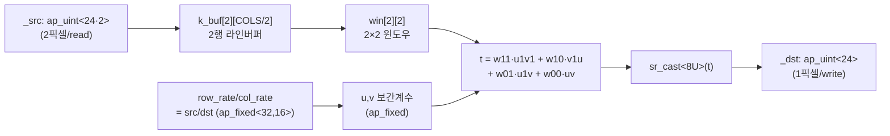
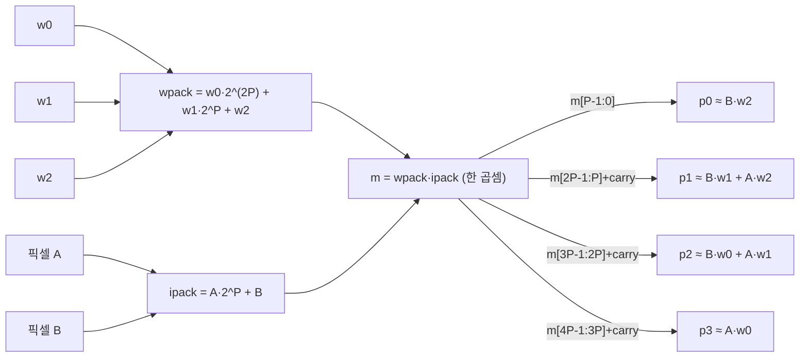
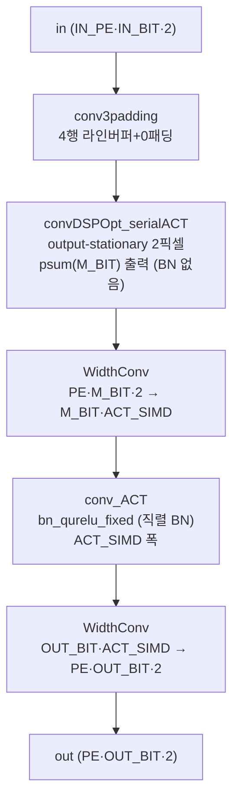

# DAC-SDC 2022 멀티팀 설계 모음 (designs-main) 모듈 통합 가이드

> 1차 요약: [`../dac_sdc_2022_designs-main.md`](../dac_sdc_2022_designs-main.md) — 본 문서는 그 요약을 **팀 단위**로 심화한 통합 가이드다.
> 분석 대상: `\\wsl.localhost\ubuntu-24.04\home\user\project\PRJXR-HBTXR\REF\CNN-Accel\dac_sdc_2022_designs-main`
> 작성 원칙: 실제 소스 Read 후 `파일:라인` 근거 표기. 라인 근거 없는 추론은 "추정", 코드로 확인 불가는 "확인 불가"로 명시.
> 형제 가이드(동형): [`../dac_sdc_2022_champion-master/MODULE_GUIDE.md`](../dac_sdc_2022_champion-master/MODULE_GUIDE.md)(UltraNet 4w4a DSP-packing 해부). 본 모음의 **SEUer 팀**은 그 champion repo와 동일 계열이므로 §2에서 cross-ref로 갈음하고, **InvolutionNet 팀**(§3~§9)을 심층 분석한다.
> 구조(형제 동형, 팀 단위): 0 머리말 / 1 모음 개요(팀별 맵)+제외 / 2 SEUer cross-ref / 3..9 InvolutionNet 모듈별 6요소 / 10 팀 비교 한눈표 / 11 읽기순서 / 12 시사점.

---

## 0. 문서 머리말

### 0.1 모음의 정체
- **DAC-SDC 2022 대회 다(多)참가팀 HLS 설계 모음**. 단일 repo 안에 팀별 폴더(`SEUer/`, `InvolutionNet/`, `ultrateam/`)가 병렬로 들어 있다. 세 팀 모두 **UltraNet 9-layer(8×3×3 conv + 1×1 검출헤드) 백본**을 공유하나, 전처리/패킹/클럭/배포 측면이 갈린다.
- 본 가이드의 분석 단위는 **팀(서브-repo)**이다. champion-master(SEUer 우승작)와 코드가 겹치는 SEUer는 cross-ref, **PL 내장 bilinear resize**가 실재하는 InvolutionNet을 모듈별로 심층 해부한다.

### 0.2 대표 케이스 선정 (InvolutionNet)
- **대표 모델: UltraNet 9-layer + PL 양선형 리사이즈 전단**. 톱 함수 `ultra_net`(`InvolutionNet/src/ultranet.cpp:391`), dataflow 본체 `do_compute2`(`:136`). **입력 360×640×3**을 PL에서 받아(`config.h:23-24`, TB `tb.cpp:36` `img[360][640][3]`) `Resize_opr_linear_simd2`로 **160×320으로 다운스케일**(`config.h:26-27`, `ultranet.cpp:173`) 후 conv0~8을 흐른다. → champion/SEUer가 외부(호스트)에서 하던 리사이즈를 **온칩 전단으로 내재화**한 것이 본 팀의 핵심 차별.
- **대표 conv: `CONV_1`(3×3, 16→32ch, 80×160, 4w4a)** — DSPopt(2픽셀×3가중치 패킹) 본체 + **분리형 활성(serialACT)** 경로의 표준 사례. SIMD_DSP6=16, PE_DSP6=4(`config.h:46-47`), CASCADE=4, ACT_SIMD=4(`ultranet.cpp:216-217` 인자).
- **대표 1×1: `CONV_8`(1×1, 64→36ch, 10×20, in4/w8)** — champion이 DSP2 패킹을 쓰는 자리에 **LUT 곱(`simd_mac_lut`)** 을 쓰는 InvolutionNet 고유 경로(`conv1x1DSP2.hpp:264`). PROD_BIT=in4+w8+2=14(`:230`). SIMD_DSP2=4, PE_DSP2=2(`config.h:210-211`).
- **대표 레이어0: `CONV_0`(3×3, 3→16ch, 160×320, 8w8a)** — RGB 입력이라 `simd_mac9_lut`(LUT 곱) 채택(`conv2d_l0.hpp:212`). PE_DSP6=16(`config.h:23`) — champion(8)의 2배 병렬.

### 0.3 수치 표기 규약
- **MAC lanes** = HLS unroll/pipeline 병렬 차원 곱 × DSP packing 배수.
  - 3×3 DSPopt: 곱셈기 1개가 한 곱셈 `m = wpack·ipack`으로 2픽셀(A,B)×3가중치(w0,w1,w2)의 곱을 4개 비트 세그먼트로 산출(`conv2d_DSPopt.hpp:247-265`). 공간 lanes = PE×SIMD, packing 배수 2(픽셀).
  - 1×1 InvolutionNet: 곱셈기는 **LUT**(DSP 미사용), PE쌍(p,p+1)을 한 `simd_mac_lut` 호출이 동시 산출(`conv1x1DSP2.hpp:261-265`). lanes = (PE/2)×SIMD × 2가중치(=2출력채널) = PE×SIMD LUT곱.
  - 레이어0: `simd_mac9_lut`로 9탭 완전 언롤 LUT 곱(`conv2d_l0.hpp:133-145`). lanes = PE × 9 × 2가중치 LUT곱.
- **scalar MACs(dense)** = OFM_ROW × OFM_COL × OFM_CH × IFM_CH × K × K. 1×1은 K=1.
- **loop trips**: 3×3 본체 `OUT_H × (OUT_CH/PE) × ((OUT_W+K-1)/2) × (K·IN_CH/SIMD)`(`conv2d_DSPopt.hpp:362-365`) — w를 `OUT_W+K-1`로 도되 /2(2픽셀 동시)이며 K=3행을 INFOLD에 포함. 1×1 본체 `OUT_ROW × OUT_COL × (OUT_CH/PE) × (IN_CH/SIMD)`(`conv1x1DSP2.hpp:244-247`).
- **타깃 데이터타입**: 활성 4bit unsigned·가중치 4bit signed(conv1~7, `config.h:37-39`); conv0 in8/w8(`:13-15`), conv8 in4/w8(`:205-206`). 최종 활성 4bit(0~15) 클램프(`function.h:192-196`). psum M_BIT는 호출부 레이어별 상수(conv0=26, conv1=16, conv2=17, conv3~7=18, conv8=32; `ultranet.cpp:183,215,247,279,311,330,349,368,383`).

### 0.4 운영 경로 (InvolutionNet)
```
[SW 학습/양자화: UltraNet 4w4a (본 repo 외부) ]
      │ int4/int8 weight + inc/bias 추출 → weights.hpp (conv_*_w_new/inc_new/bias_new)
      ▼
[HLS 합성: scripts/InvolutionNet_hls.tcl]
      │ set_top ultra_net (:3), part xczu3eg-sbva484-1-e (:8), clk 4ns(=250MHz) (:9)
      │ flow: csynth_design + export_design ip_catalog (:10-13)  ← champion(3.3ns/303MHz)보다 보수적 클럭
      ▼
[RTL/Vivado: scripts/InvolutionNet_vivado.tcl]
      │ create_project ... part xczu3eg-sbva484-1-e (:46)  ← Ultra96-v2 계열 ZU3EG
      ▼
[board: PYNQ on Ultra96-v2 (ZU3EG)]
      │ deploy/dac_sdc.bit + dac_sdc.hwh + dac_sdc.ipynb 로 배포
      │ 박스 후처리: yolo.cpp → yolo.so  (g++ -shared -O3 -fPIC -lpthread -fpermissive, deploy/readme.md:3)
      │ deploy_mFreq/ = 다른 클럭 변형 비트스트림(추정)
```
- 타깃: **Ultra96-v2 / ZU3EG (xczu3eg-sbva484-1-e)**, HLS clk **4ns(250MHz)**(`InvolutionNet_hls.tcl:9`) — champion/SEUer의 3.3ns(303MHz)보다 낮음(추정: resize 전단·LUT 곱 증가로 타이밍 여유 확보).
- **합성 PPA(LUT/FF/DSP/BRAM/latency)**: 합성 리포트(.rpt) 미동봉 — repo 전역 Glob 결과 합성 산출물 없음 → **확인 불가**. 단, `deploy/dac_sdc.bit`·`.hwh`(생성물)는 존재하므로 실제 합성/구현은 완료된 설계임(비트스트림 분석은 본 가이드 범위 밖).

---

## 1. 모음 개요 — 팀별 맵 & 제외

### 1.1 팀별 실재 여부 (Glob/Read 근거)

| 팀 | 소스 실재 | 핵심 근거 |
|---|---|---|
| **SEUer/** | ✅ 풀 HLS 소스 | `SEUer/src/`에 conv2d_DSPopt3.hpp, conv1x1DSP2.hpp, conv2d_l0_opt.hpp, config_opt3.h, ultranet.cpp 등 — **champion-master와 동일 파일군·동일 config**. `SEUer/README.md:1` = "refer to https://github.com/AiArtisan/dac_sdc_2022_champion". |
| **InvolutionNet/** | ✅ 풀 HLS 소스 + deploy(.bit/.hwh/.ipynb) | `src/` 에 Resize_opr_linear_opt.h(자체 특화) + conv2d_DSPopt.hpp / conv1x1DSP2.hpp / conv2d_l0.hpp / config.h / function.h / ultranet.cpp. deploy/·deploy_mFreq/ 두 배포 변형. |
| **ultrateam/** | ❌ **소스 미동봉** | Glob 결과 `ultrateam/README` 단 1개 파일, 그마저 **빈 파일**(좁은 Glob에서 `*.{cpp,hpp,h}` 0개). 아키텍처 **확인 불가**. |
| (최상위) | — | 팀 폴더 외 별도 소스 없음. |

### 1.2 제외 목록 (이름만)
- **가중치 생성물**: `InvolutionNet/src/weights.hpp`, `weights_1.hpp`, `weights_2.hpp`, `weights_3.hpp`, `weight3.hpp`; `SEUer/src/weights_opt3.hpp` — 가중치/inc/bias 상수. 대용량, 알고리즘 정보 없음(차원·정합만 인용). `ultranet.cpp:16`에서 `weights.hpp` include.
- **데이터/입력**: `InvolutionNet/src/data/*.{bin,jpg}`, `data.py` — TB 입력 이미지.
- **배포 산출물(이름만)**: `InvolutionNet/deploy{,_mFreq}/dac_sdc.bit`, `*.hwh`, `yolo.so` — 합성/컴파일 산출물.
- **디버그/레거시**: `InvolutionNet/src/debug.hpp`(`ultranet.cpp`에서 미include), `single_test*.cpp`(단위 TB).
- **부재(확인 불가)**: SW 양자화 학습부, 가중치 추출 스크립트, NMS/박스 디코딩 소스(박스 후처리는 `yolo.cpp`만 존재). 정확도 평가 코드 없음.

### 1.3 InvolutionNet 레이어 구성 (근거: `config.h`, `ultranet.cpp:136-389`)
```
입력 360×640×3 (AXI64)                                            (ultranet.cpp:140)
 → ExtractPixels(64b) → WidthConv 64→192 → 192→48(=8b×3ch×2pix)  (ultranet.cpp:144-165)
 → resize_batch_simd2: 360×640 → 160×320 양선형 (2픽셀/사이클)     (ultranet.cpp:173)  ★전단 신규
 → CONV0 (3×3, 3→16, 8w8a, LUT곱) → POOL0                          (ultranet.cpp:181-201)   160×320→80×160
 → CONV1 (3×3, 16→32, 4w4a, DSPopt+serialACT) → POOL1              (ultranet.cpp:213-233)   80×160→40×80
 → CONV2 (3×3, 32→64) → POOL2                                       (ultranet.cpp:245-265)   40×80→20×40
 → CONV3 (3×3, 64→64) → POOL3                                       (ultranet.cpp:277-297)   20×40→10×20
 → CONV4 → CONV5 → CONV6 → CONV7 (풀링 없음, 10×20 유지)            (ultranet.cpp:309-372)
 → CONV8 (1×1, 64→36, LUT곱 헤드)                                   (ultranet.cpp:382-385)   10×20×36
 → AddLast → AXI64 out                                              (ultranet.cpp:387)
```
전 스테이지가 단일 `#pragma HLS DATAFLOW`(`ultranet.cpp:138`)에 나열 — DRAM 왕복 없는 완전 스트리밍. **단 resize 전단(360×640 입력 폭변환·양선형)이 champion/SEUer에는 없는 추가 파이프라인**.

---

## 2. SEUer 팀 — champion-master cross-ref

**결론: SEUer/ 는 `dac_sdc_2022_champion-master` 와 동일 계열(거의 동일 소스).** 별도 모듈 해부는 형제 가이드 [`../dac_sdc_2022_champion-master/MODULE_GUIDE.md`](../dac_sdc_2022_champion-master/MODULE_GUIDE.md)로 갈음한다.

### 2.1 동일성 검증 (핵심 파일 Read 비교)
- **파일군 동일**: `SEUer/src/` = {conv2d_DSPopt3.hpp, conv1x1DSP2.hpp, conv2d_l0_opt.hpp, config_opt3.h, function.h, pool_reord.hpp, stream_tools.h, ultranet.cpp, weights_opt3.hpp, debug.hpp, param.h} — champion-master `src/`와 동일 구성.
- **입력 형상 동일**: `SEUer/src/ultranet.cpp:29` `num_per_rep = 160*320*3*8/64` — 160×320 입력, **resize 없음**(champion과 동일, InvolutionNet과 대비).
- **config 동일**: `SEUer/src/config_opt3.h` CONV_0_PE_DSP6=8(`:23`), CONV_1 SIMD_DSP6=8·PE_DSP6=4(`:46-47`) — champion 가이드 §12.2의 배분과 일치.
- **DSPopt3 carry 보정 동일(round 형)**: `SEUer/src/conv2d_DSPopt3.hpp:263-271` — 세그먼트 1비트 겹쳐 추출 후 `r1 += (p1>>1)+(p1&1)` (champion과 동일).
- **1×1 헤드 DSP2 동일**: `SEUer/src/conv1x1DSP2.hpp:231` `simd_mac_DSP2` 호출 — **DSP2 패킹 헤드**(champion과 동일, InvolutionNet의 LUT 헤드와 대비).
- **레이어0 LUT 동일**: `SEUer/src/conv2d_l0_opt.hpp:253-257` `simd_mac9_LUT`(대문자, `conv_mul_lut` 경유) — champion과 동일.

→ SEUer의 패킹 산술·라인버퍼·BN·dataflow 상세는 **champion 가이드 §2~§9를 그대로 참조**. 본 가이드는 이를 반복하지 않는다.

---

## 3. 모듈: PL 양선형 리사이즈 엔진 — `Resize_opr_linear_simd2` (InvolutionNet 핵심 ①·고유)

### 3.1 역할 + 상위/하위
- **역할**: 카메라 원본 360×640 RGB(8b×3ch)를 **온칩에서 양선형(bilinear) 보간으로 160×320 다운스케일**. champion/SEUer가 외부(PS/호스트)에서 하던 전처리를 PL로 내재화 → PS-PL 대역폭·지연 절감.
- **상위**: `resize_batch_simd2`(`ultranet.cpp:128`) → `do_compute2`(`:173`). **하위**: HLS `filter2d_traits`/`sr_cast`(hls_video.h 프리미티브).
- **두 변형**: `Resize_opr_linear_try`(Mat 기반, `Resize_opr_linear_opt.h:11`) / `Resize_opr_linear_simd2`(2픽셀 스트림 기반, `:186`). **활성 경로는 simd2**(`ultranet.cpp:132,173`); try 버전은 `resize()`(`ultranet.cpp:107-118`) 안에 정의돼 있으나 do_compute2가 호출하지 않음(미사용).

### 3.2 데이터플로우 (simd2 — 활성)


### 3.3 Function call stack
`ultranet.cpp:173` `resize_batch_simd2` → `:130` `for rep` 루프 → `Resize_opr_linear_simd2`(`Resize_opr_linear_opt.h:186`). 입력은 폭변환기가 만든 `ap_uint<24·2>`(=8b×3ch×2pix) 스트림(`ultranet.cpp:160-165`), 출력은 `ap_uint<24>` 단픽셀 스트림(`:171`).

### 3.4 대표 코드 위치
`InvolutionNet/src/Resize_opr_linear_opt.h`: simd2 라인버퍼/윈도우 선언 `:196-201`, 비율 계산 `:207-208`, offset `:213-217`, 좌표·보간계수 산출 `:238-265`, 라인버퍼 시프트 `:232-234,272-281`, 양선형 누산 `:291-294`, 출력 패킹 `:297-302`. Mat 버전: `:11-181`.

### 3.5 대표 코드 블록 — 양선형 보간 산술
```cpp
// 비율(고정소수): src/dst                                  (Resize_opr_linear_opt.h:207-208)
ap_fixed<32,16,AP_RND> row_rate = ((ap_fixed<32,16>)srows)/(ap_fixed<32,16>)drows; // 360/160=2.25
ap_fixed<32,16,AP_RND> col_rate = ((ap_fixed<32,16>)scols)/(ap_fixed<32,16>)dcols; // 640/320=2.0
ap_fixed<20,10> offset_row = row_rate/2 - 0.5;             // :214  중심정렬 보정
...
short dy = (short)(i/row_rate);  short dx = (short)(j/col_rate);   // :238-239 역사상 좌표
fy = dy*row_rate + offset_row;   fx = dx*col_rate + offset_col;    // :241-242
short sx=(short)fx; short sy=(short)fy;                            // :244-245 정수부
u = (fx-sx>0)?fx-sx:0;  v=(fy-sy>0)?fy-sy:0;  u1=1-u; v1=1-v;      // :246-255 소수부
// 2×2 양선형 가중합 (채널 k별)                             (:291-294)
t = (SRCT)win[1][1](..k..)*u1*v1 + (SRCT)win[1][0](..k..)*v1*u
  + (SRCT)win[0][1](..k..)*u1*v + (SRCT)win[0][0](..k..)*u*v;
d.val[k]=sr_cast<HLS_TNAME(SRC_T)>(t);                             // :295  8bit로 round-cast
```
→ 표준 양선형 4점 가중합. 좌표는 `ap_fixed<32,16>` 비율로 계산, 보간계수 u/v는 소수부, 출력은 `sr_cast`로 8bit 라운딩. `k_buf[1][x]=k_buf[0][x]`(`:232`)로 2행 라인버퍼를 한 칸 시프트하며 윈도우를 채운다.

### 3.6 마이크로아키텍처
- **MAC lanes**: 채널 k(=3) × 4점 가중합 = 12 곱(+가중계수 u·v·u1·v1 산출). `#pragma HLS PIPELINE II=1`(`:230`)로 **2픽셀 입력당 최대 1픽셀 출력 II=1**. 곱셈은 ap_fixed → DSP 또는 LUT(자동 매핑, RESOURCE 미지정 → 확인 불가).
- **메모리**: `k_buf[2][COLS/2]` = 2 × 320 × 48bit ≈ 30,720bit(`:196`, dim1 complete partition `:197`), `win[2][2]` 레지스터(`:199-201`). 1차 요약의 `LineBuffer<2,...>`+`Window<2,2,...>`는 Mat 버전(try)이고, **활성 simd2는 ap_uint 배열 직접 구현**.
- **정량/병목**: 루프 = 360×(640/2) = **115,200 사이클**(II=1, `:225-226`). 입력 2픽셀폭(`ap_uint<24·2>`)으로 DDR/AXIS 대역폭을 절반으로(2픽셀 동시) 받는 것이 simd2의 핵심 이득(`:187`). `dependence intra/inter false`(`:227-229`)로 라인버퍼 의존 제거. **resize_nearest_2pack**(`ultranet.cpp:31-64`, row_mask 기반 nearest)도 정의돼 있으나 `resize_batch_simd2`가 호출하는 건 양선형(`ultranet.cpp:132`, nearest는 주석처리 `:131`).

---

## 4. 모듈: 3×3 DSP 패킹 산술 코어 — `simd_MAC` / `pack_*` (InvolutionNet 핵심 ②)

### 4.1 역할 + 상위/하위
- **역할**: FPGA DSP 1개에 한 곱셈 `m = wpack·ipack`으로 **2픽셀×3가중치**의 곱을 4개 비트 세그먼트로 압축(champion DSPopt3와 동일 계열). SIMD를 CASCADE(≤4) 묶음으로 누산.
- **상위**: `convDSPOpt`/`convDSPOpt_serialACT`(`conv2d_DSPopt.hpp:320,431`). **하위**: ap_int 곱셈 프리미티브.

### 4.2 데이터플로우 (비트 배치)


### 4.3 대표 코드 위치
`InvolutionNet/src/conv2d_DSPopt.hpp`: pack_input_data `:177-187`, pack_weight_data `:189-202`, simd_MAC `:234-271`, 비트폭 정의 `:334-336`. (참고용 미패킹 정직 구현 `simd_MAC_normal` `:204-232`, 검증용 `simd_MAC_compare` `:273-313`도 동거.)

### 4.4 대표 코드 블록 — carry 보정 (★ SEUer와 다른 형태)
```cpp
const unsigned PROD_BIT  = W_BIT + IN_BIT + GUARD_BIT;     // :334  4+4+3=11 (conv1)
const unsigned WPACK_BIT = W_BIT*3 + IN_BIT*2 + GUARD_BIT*2; // :335  12+8+6=26
const unsigned IPACK_BIT = IN_BIT*2 + W_BIT + GUARD_BIT*1;   // :336  8+4+3=15
...
ap_int<PROD_BIT*4> m = 0;
for (cs<CASCADE) m += wpack[i+cs] * ipack[i+cs];          // :249-253  CASCADE 누산
ap_int<PROD_BIT> p0 = m(PROD_BIT-1, 0);                                  // :255  ≈ B·w2
ap_int<PROD_BIT> p1 = m(PROD_BIT*2-1, PROD_BIT)   + m[PROD_BIT-1];       // :256  +carry bit
ap_int<PROD_BIT> p2 = m(PROD_BIT*3-1, PROD_BIT*2) + m[PROD_BIT*2-1];     // :257-258
ap_int<PROD_BIT> p3 = m(PROD_BIT*4-1, PROD_BIT*3) + m[PROD_BIT*3-1];     // :259-260
r0+=p0; r1+=p1; r2+=p2; r3+=p3;                                          // :262-265
```
- **비트 산식**: `m = (w0·2^2P + w1·2^P + w2)·(A·2^P + B)` = `A·w0·2^3P + (A·w1+B·w0)·2^2P + (A·w2+B·w1)·2^P + B·w2`. 세그먼트 경계 `[0,P),[P,2P),[2P,3P),[3P,4P)`.
- **★ carry 보정 방식이 SEUer/champion과 다름**:
  - **InvolutionNet**: 세그먼트를 비-겹침으로 추출 `m(2P-1, P)` 후 **하위 세그먼트의 부호비트만 carry로 더함** `+ m[PROD_BIT-1]`(`:256-260`).
  - **SEUer/champion**: 세그먼트를 1비트 겹쳐 추출 `m(2P-1, P-1)` 후 **round 형** `(p>>1)+(p&1)`(`SEUer/src/conv2d_DSPopt3.hpp:264-271`).
  - → 동일 패킹 아이디어지만 **부분곱 분리/라운딩 산술이 별개 구현**. 정밀도/정확도 차이는 코드만으로 검증 불가(확인 불가).

### 4.5 마이크로아키텍처
- **MAC lanes**: conv1 — 공간 PE×SIMD = 4×16 = 64 곱셈기, packing 2픽셀 → 유효 128 픽셀-MAC/사이클(가중치 안정 세그먼트 활용 시). conv2도 SIMD16/PE4(`config.h:70-71`, 주석엔 8/8 대안).
- **가드비트**: GUARD_BIT=3(`conv3x3_bn_act_DSPopt`/`_serialACT`가 `convDSPOpt`에 인자 3 전달, `:617,643`). conv1 4w4a: PROD_BIT=11, m=`ap_int<44>`(`:249`).
- **정량/병목**: 최내 루프 `#pragma HLS pipeline`(`:366,472`). `simd_MAC` 내부 `pipeline II=1 + unroll`(`SEUer`는 `:255-256`; InvolutionNet은 `:247-248` unroll만, II 명시 없음). pack_weight가 매 사이클 9탭(3행×3) 패킹 재계산(`:373-378`) — 가중치 정적인데 시프트-합산 반복(개선 여지, 추정).

---

## 5. 모듈: 3×3 conv 본체 + 분리형 활성 — `convDSPOpt_serialACT` / `conv_ACT` (InvolutionNet 핵심 ③·고유)

### 5.1 역할 + 상위/하위
- **역할**: conv1~7 본체. **MAC와 활성(BN+양자화)을 분리**한 것이 champion/SEUer와의 구조적 차별. `convDSPOpt_serialACT`는 **psum(M_BIT)만 출력**(BN 미적용)하고, 뒤에 폭변환 → `conv_ACT`(직렬 BN) → 폭변환을 붙여 활성을 별도 스테이지로 뺀다.
- **상위**: `conv3x3_bn_act_DSPopt_serialACT`(`conv2d_DSPopt.hpp:627`, 4단 DATAFLOW). **하위**: `conv3padding`(라인버퍼), `convDSPOpt_serialACT`(MAC), `conv_ACT`(BN), `StreamingDataWidthConverter_Batch`(폭변환).
- **비교**: 동일 파일에 **inline-BN 버전 `conv3x3_bn_act_DSPopt`(`:597`)→`convDSPOpt`(`:320`)** 도 정의돼 있으나(BN을 conv 루프 안 `o_out`에서 즉시 적용, `:407-419`), do_compute2의 conv1~7은 **serialACT 버전을 호출**(`ultranet.cpp:213,245,277,309,328,347,366`). conv0만 inline 계열(`conv3x3_l0_bn_act_DSPopt`).

### 5.2 데이터플로우 (serialACT 4단)


### 5.3 대표 코드 위치
`InvolutionNet/src/conv2d_DSPopt.hpp`: convDSPOpt_serialACT `:431-523`, 4중 루프 `:468-471`, 입력 read+pack `:476-484`, simd_MAC+부분합 상태머신 `:486-508`, psum write(BN 없음) `:512-518`. conv_ACT(직렬 BN) `:531-566`. 조립 `conv3x3_bn_act_DSPopt_serialACT` `:627-655`.

### 5.4 대표 코드 블록 — 부분합 상태머신 + psum 출력
```cpp
bool m_clear=(w==0); bool o_clear=(infoldIdx==0);
bool o_out=(infoldIdx==INFOLD-1 && w!=0);                      // :473-475
...
simd_MAC<...>(wpacks[p], ipack, firPartial0..3);              // :493-495
if (o_clear) {                                                // :497-501
  outPartialArr0[p]=firPartial0+firPartialRes0[p];            //   왼픽셀 = 현재 + 이월잔여
  outPartialArr1[p]=firPartial1+firPartialRes1[p];
  firPartialRes0[p]=firPartial2; firPartialRes1[p]=firPartial3; // 다음 픽셀쌍 이월
} else {                                                      // :502-507
  outPartialArr0[p]+=firPartial0; outPartialArr1[p]+=firPartial1;
  firPartialRes0[p]+=firPartial2; firPartialRes1[p]+=firPartial3;
}
if (o_out) { oData0(..)=outPartialArr0[p]; oData1(..)=outPartialArr1[p];  // :512-517  ★psum 그대로
             out.write((oData1,oData0)); }                                //  BN 미적용
```
→ champion/SEUer의 `convDSPOpt`는 같은 자리에서 `bn_qurelu_fixed`로 즉시 4bit 활성을 내보내지만(`conv2d_DSPopt.hpp:407-419`의 inline 버전), **serialACT는 M_BIT psum을 그대로 write**해 활성을 뒤 스테이지로 미룬다.

### 5.5 분리형 활성 conv_ACT
```cpp
// 직렬 BN: PE·2픽셀을 ACT_SIMD 폭으로 나눠 bn_qurelu_fixed     (:541-562)
for (h<IN_ROW*reps) for (peIdx<OUT_CH/PE) for (w<IN_COL/2) for (i<PE*2; i+=ACT_SIMD){
  iData = in.read();
  for (j<ACT_SIMD) oData(..) = bn_qurelu_fixed<...>(iData(..), inc[(i+j)%PE][peIdx], bias[(i+j)%PE][peIdx]);
  out.write(oData);
}
```
→ **ACT_SIMD**(conv 호출의 마지막 템플릿 인자: conv1=4, conv2=2, conv3~7=1; `ultranet.cpp:217,249,281,313,...`)로 BN 처리량을 레이어별로 조절. ACT_SIMD가 작을수록 BN 스테이지가 직렬(자원↓·지연↑).

### 5.6 마이크로아키텍처
- **설계 의도(추정)**: BN을 conv 루프에서 떼어내 conv 본체의 critical path(부분합 상태머신·firPartialRes 이월)에서 BN 곱가산을 제거 → conv II 개선·타이밍 클로징 용이. 대신 폭변환 2개·별도 BN 스테이지로 BRAM/FIFO·지연 증가. champion(3.3ns)보다 낮은 클럭(4ns)에도 불구하고 이 분리를 택한 것은 **타이밍/자원 트레이드오프 실험**으로 보임(추정).
- **정량/병목**: conv1 loop trips(본체) = OUT_H × (OUT_CH/PE) × ((OUT_W+K-1)/2) × (K·IN_CH/SIMD) = 80 × (32/4) × ((160+2)/2) × (3·16/16) = 80×8×81×3 = **155,520**(`:468-471`). 추가로 BN/폭변환 스테이지가 DATAFLOW에 병렬. 단일 DATAFLOW라 throughput은 최저속 스테이지가 결정.

---

## 6. 모듈: 라인버퍼 + 패딩 — `conv3padding` / `stream_in_row` / `stream_out_data`

### 6.1 역할 + 상위/하위
- **역할**: 입력 스트림(2픽셀폭)을 4행 회전 버퍼에 적재, K=3행 윈도우를 0패딩 포함 추출(im2col 없는 라인버퍼 스트리밍). champion/SEUer와 거의 동형이나 **InvolutionNet은 라인버퍼 깊이가 `(IN_W/2+1)`** (champion은 `IN_W/2`)로 +1 — 폭경계 처리용.
- **상위**: `conv3x3_bn_act_DSPopt_serialACT`(`:639`)/`conv3x3_bn_act_DSPopt`(`:613`). **하위**: `stream_in_row`(`:15`)·`stream_out_data`(`:46`).

### 6.2 대표 코드 위치
`InvolutionNet/src/conv2d_DSPopt.hpp`: stream_in_row `:13-42`, stream_out_data `:44-106`, conv3padding `:108-142`. 별도 패딩 함수 `function.h`: **`padding_var`(가변 런타임 패딩) `:15-58`**, 정적 `padding` `:63-103`.

### 6.3 대표 코드 블록
```cpp
ap_uint<IN_PE*IN_BIT*2> row_buffer[SIMD/IN_PE][4][(IN_W/2+1)*IN_CH/SIMD]; // :116-117
#pragma HLS ARRAY_PARTITION variable=row_buffer dim=1 complete            // :118
#pragma HLS RESOURCE variable=row_buffer core=RAM_S2P_BRAM                // :119
...
if (outRowIdx - K/2 + wr < 0 || outRowIdx - K/2 + wr >= IN_H) { data0=0; data1=0; } // :80-82  상/하 0패딩
out.write((data1, data0));                                                          // :91
```
- **`padding_var`(고유)**: `function.h:15-58` — 런타임 인자 `in_row/in_col/in_simd_pre_ch`로 **가변 크기 패딩** 지원(`append_zero`/`stream_move` 조합). 정적 `padding`(`:63`)과 달리 형상을 컴파일타임에 고정하지 않음. (do_compute2 본류는 conv3padding 라인버퍼를 쓰고 padding_var는 직접 호출 안 됨 — 유틸로 상주, 확인: `ultranet.cpp`에 padding_var 호출 없음.)

### 6.4 마이크로아키텍처
- **메모리**: conv1(IN_W=80, IN_CH=16, SIMD=16, IN_PE=16): row_buffer = (16/16)×4×((80/2+1)·16/16) × (16·4·2=128bit) = 1×4×41 × 128bit ≈ **20,992bit**(BRAM18 ~1개). 4행(윈도우 3 + 적재 1).
- **정량/병목**: stream_in_row pipeline(`:27`), stream_out_data pipeline(`:69`). storeBufferIdx/loadBufferIdx 2bit 회전(`:123-124`, 초기 0/1·rowIdx=-2 `:125`)로 4행 ping-pong. K=3 가정(static_assert는 주석처리 `:114`).

---

## 7. 모듈: 레이어0 RGB conv (LUT 곱) — `conv2d_l0.hpp`

### 7.1 역할 + 상위/하위
- **역할**: 입력 8bit 3채널(RGB)이라 패킹 이득이 작아 **LUT 곱**(`simd_mac9_lut`) 채택. 9탭(3×3) 완전 언롤. PE=16(`config.h:23`)로 champion(8)보다 2배 병렬.
- **상위**: `conv3x3_l0_bn_act_DSPopt`(`conv2d_l0.hpp:294`, 3단 DATAFLOW). **하위**: `simd_mac9_lut`(`:121`).
- **비교**: champion/SEUer `conv2d_l0_opt.hpp`는 `simd_mac9_LUT`(대문자, `conv_mul_lut` 헬퍼 경유, `SEUer:131-153`)인 반면, InvolutionNet은 `simd_mac9_lut`(소문자, **루프 내 inline `#pragma HLS RESOURCE core=Mul_LUT`**, `:138-141`). 기능 동일·코드 별개. (DSP2 fallback `simd_mac9_DSP2` `:99-118`도 정의만, 미사용.)

### 7.2 대표 코드 위치
`InvolutionNet/src/conv2d_l0.hpp`: simd_mac9_lut `:121-149`, convDSPOpt_l0 `:164-241`, conv3padding_l0(IN_W+2 패딩 4행 버퍼) `:69-96`, streamBnRelu_l0 `:243-283`.

### 7.3 대표 코드 블록
```cpp
ap_int<W_BIT+IN_BIT> mtemp0, mtemp1;
#pragma HLS RESOURCE variable=mtemp0 core=Mul_LUT          // :138  LUT 곱 강제
  mtemp0 = w0vec[i] * invec[i];
#pragma HLS RESOURCE variable=mtemp1 core=Mul_LUT          // :140
  mtemp1 = w1vec[i] * invec[i];
acc0 += mtemp0; acc1 += mtemp1;                            // :143-144  9탭 누산(언롤 :135)
...
for (p<PE; p+=2) simd_mac9_lut<...>(ivec, wvec[p], wvec[p+1], outPartial0, outPartial1); // :209-213
```
→ PE쌍(p, p+1)을 한 호출로 동시 처리(가중치 2개 별도 LUT 누산). PROD_BIT=IN_BIT+W_BIT+4(가드 4, `:180`) → conv0 8+8+4=20bit. kc(=K행) 누적 후 kc==2에서 PE개 write(`:228-237`).

### 7.4 마이크로아키텍처
- **MAC lanes**: conv0 PE=16 × 9탭 × 2가중치 = **288 LUT 곱/사이클**(추정, `config.h:23`·`:135` 언롤). champion(PE=8→144)의 2배.
- **정량**: scalar MAC(conv0) = 160×320×16×3×9 ≈ 22.1M. LUT 곱 채택으로 DSP를 conv1~8에 집중. streamBnRelu_l0 `pipeline II=4`(`:257`).
- **병목 없음**(첫 레이어, 본체 II=1 `:189`).

---

## 8. 모듈: 1×1 검출 헤드 (LUT 곱) — `conv1x1DSP2` / `conv1x1convert` (★ champion과 분기)

### 8.1 역할 + 상위/하위
- **역할**: 검출헤드(1×1 = 채널 행렬곱). 2픽셀 스트림을 SIMD폭으로 재배열 후 **LUT 곱(`simd_mac_lut`)** 으로 36채널 logit 생성. **champion/SEUer가 `simd_mac_DSP2`(DSP2 패킹)를 쓰는 자리를 InvolutionNet은 LUT로 대체**.
- **상위**: `conv1x1_DSPopt`(`conv1x1DSP2.hpp:287`, 2단 DATAFLOW) → `do_compute2`(`ultranet.cpp:382`). **하위**: `conv1x1convert`(reorder), `simd_mac_lut`.

### 8.2 대표 코드 위치
`InvolutionNet/src/conv1x1DSP2.hpp`: conv1x1convert `:76-104`, **simd_mac_lut(활성) `:187-215`**, simd_mac_DSP2(미사용·정의만) `:166-183`, conv1x1DSP2 본체 `:219-285`, conv1x1_DSPopt `:287-307`.

### 8.3 대표 코드 블록 — LUT 헤드
```cpp
const unsigned PROD_BIT = IN_BIT + W_BIT + 2;             // :230  4+8+2=14
...
for (p<PE; p+=2) {
  simd_mac_lut<IN_BIT, W_BIT, PROD_BIT, SIMD>(ivec, wvec[p], wvec[p+1], outPartial0, outPartial1); // :264 ★LUT
  if (simdIdx==0){outPartialArr[p]=outPartial0; outPartialArr[p+1]=outPartial1;}                    // :266-268
  else           {outPartialArr[p]+=outPartial0; outPartialArr[p+1]+=outPartial1;}                  // :269-272
}
if (simdIdx==IN_CH/SIMD-1) odata(..)=outPartialArr[i]+bias[i][peIdx];  // :275-279  마지막 infold에서 bias 가산 출력
```
```cpp
// simd_mac_lut: 2가중치를 LUT 곱으로 별도 누산                (:199-211)
for (i<SIMD){
  ap_int<W_BIT+IN_BIT> mtemp0, mtemp1;
  #pragma HLS RESOURCE variable=mtemp0 core=Mul_LUT
    mtemp0 = w0vec[i]*invec[i];
  #pragma HLS RESOURCE variable=mtemp1 core=Mul_LUT
    mtemp1 = w1vec[i]*invec[i];
  acc0+=mtemp0; acc1+=mtemp1; }
```
→ **★ champion/SEUer는 `simd_mac_DSP2`(가중치 2패킹 1곱셈, `SEUer/src/conv1x1DSP2.hpp:231`)**. InvolutionNet은 동일 PE쌍 구조이나 **DSP 패킹 대신 LUT 2곱**. 헤드가 소형(0.46M MAC)이라 DSP를 conv 본체에 더 몰아주려는 선택으로 보임(추정).

### 8.4 마이크로아키텍처
- **MAC lanes**: conv8 PE=2, SIMD=4 → (PE/2)×SIMD × 2가중치 = 1×4×2 = **8 LUT곱/사이클**.
- **정량**: loop trips = OUT_ROW×OUT_COL×(OUT_CH/PE)×(IN_CH/SIMD) = 10×20×(36/2)×(64/4) = 10×20×18×16 = **57,600**(`:244-247`). scalar MAC = 10×20×36×64 ≈ 0.46M. `conv1x1convert`가 입력(2픽셀폭)을 1×1용 SIMD폭으로 ping-pong reorder(`:85-103`, 행버퍼 2-deep, BRAM `:89`).
- **병목 없음**(헤드 소형).

---

## 9. 모듈: BN/양자화·풀링·스트림·톱 — `bn_qurelu_fixed` / `pool_reord` / `do_compute2`

### 9.1 BN + 양자화 ReLU — `bn_qurelu_fixed` (`function.h:178-201`)
- **champion/SEUer와 동일 산식**: `bn_res = in*inc + bias`(폭 `IN_BIT+INC_BIT+1`로 확장 `:187`), `(bn_res+(D>>1)) >> (W_BIT-1+DATA_BIT+L_SHIFT)`(round+shift, `:191`), 0~15 클램프·ReLU(`:192-197`). D=`1<<(W_BIT-1+DATA_BIT+L_SHIFT)`(`:185`), L_SHIFT=8(`config.h:20`). 구버전 `bn_qurelu`(`:157-176`)는 `ap_int<IN_BIT>` 누산이라 오버플로 위험 — `_fixed`가 확장형.
- **호출처가 다름**: champion은 conv 본체 inline에서만, InvolutionNet은 (a) conv0 `streamBnRelu_l0`(`conv2d_l0.hpp:268-279`), (b) **분리형 `conv_ACT`**(`conv2d_DSPopt.hpp:558`), (c) inline 버전 `convDSPOpt`(`:410-416`) 세 경로. 본류 conv1~7은 (b) 사용.

### 9.2 풀링 + 스트림 유틸 — `pool_reord.hpp` / `stream_tools.h`
- **pool**: 2×2 맥스풀(2픽셀 패킹 스트림). champion과 동형(파일명 동일). 호출 `max_pool2x2<...>`(`ultranet.cpp:200,232,264,296`).
- **stream**: AXIS↔폭변환·ExtractPixels·AddLast(`stream_tools.h`). **InvolutionNet 폭변환은 360×640 입력 기준**: 64→192→48(=8b·3ch·2pix)(`ultranet.cpp:148-165`) → resize가 받음. champion은 64→192→24(160×320, 단픽셀).

### 9.3 톱 dataflow + 인터페이스 — `do_compute2` / `ultra_net`
- `do_compute2`(`ultranet.cpp:136-389`): `#pragma HLS DATAFLOW`(`:138`)로 ExtractPixels→폭변환→**resize→**conv0~8→AddLast 전부 융합. `ultra_net`(`:391-442`): AXIS in/out + s_axilite reps, 전 가중치 `complete` partition(`:399-440`).
- **★ champion과 동일한 conv5 ARRAY_PARTITION 오타**: `ultranet.cpp:424-425` 둘 다 `dim=1`(다른 conv는 dim1+dim2). conv5 가중치 dim2 partition 누락 — SIMD 동시 접근 합성이 다른 레이어와 다를 수 있음(합성 영향 확인 불가). **champion repo와 동일한 오타가 전파됨**(추정: 공통 베이스에서 fork).
- **인터페이스**: AXIS 단일 입출력(DMA 연결), 가중치 온칩 상주. 호스트(PYNQ)는 `dac_sdc.ipynb`로 비트스트림 로드·DMA 구동, 박스 후처리는 `yolo.so`(PS측 pthread). 합성 PPA는 리포트 미동봉 → **확인 불가**.

---

## 10. 팀 비교 한눈표

| 항목 | SEUer (=champion) | InvolutionNet | ultrateam |
|---|---|---|---|
| 소스 실재 | 풀 HLS (champion 동일) | 풀 HLS + deploy(.bit/.hwh/.ipynb) | **README(빈)만 — 확인 불가** |
| 모델 | UltraNet 9-layer | UltraNet 9-layer | 확인 불가 |
| 입력 | 160×320 (외부 resize) | **360×640 → PL bilinear → 160×320** | 확인 불가 |
| resize | 없음(host) | **`Resize_opr_linear_simd2`**(2픽셀 II=1, `Resize_opr_linear_opt.h:186`) | 확인 불가 |
| 3×3 패킹 | DSPopt3 (2픽셀×3가중치) | DSPopt (동일 아이디어, **carry 보정 `+m[P-1]` 형**) | 확인 불가 |
| 3×3 carry 보정 | round 형 `(p>>1)+(p&1)` (`conv2d_DSPopt3.hpp:269`) | carry-bit 형 `+m[PROD_BIT-1]` (`conv2d_DSPopt.hpp:256`) | 확인 불가 |
| 활성(BN) | conv 본체 inline | **분리형 `conv_ACT`(serialACT)**, ACT_SIMD 노브 | 확인 불가 |
| conv0 | LUT `simd_mac9_LUT` (PE=8) | LUT `simd_mac9_lut` (**PE=16**) | 확인 불가 |
| 1×1 헤드 | **DSP2** `simd_mac_DSP2` (`conv1x1DSP2.hpp:231`) | **LUT** `simd_mac_lut` (`conv1x1DSP2.hpp:264`) | 확인 불가 |
| HLS 클럭 | 3.3ns / ~303MHz | **4ns / 250MHz** (`InvolutionNet_hls.tcl:9`) | 확인 불가 |
| board/part | Ultra96-v2 / xczu3eg | Ultra96-v2 / xczu3eg (`InvolutionNet_vivado.tcl:46`) | 확인 불가 |
| 합성 PPA | 리포트 부재 → 확인 불가 | 리포트 부재(비트는 존재) → 확인 불가 | 확인 불가 |

**InvolutionNet 정량 요약(정적)**: 핵심 엔진 — 3×3 conv1 본체 loop trips ≈ **155,520**(`conv2d_DSPopt.hpp:468-471`), MAC lanes PE4×SIMD16×2픽셀 = **유효 128 픽셀-MAC/cyc**; 1×1 헤드 trips **57,600**, 8 LUT곱/cyc; conv0 PE16×9×2 = **288 LUT곱/cyc**; resize 엔진 360×320 = **115,200 cyc** II=1, 채널3×4점 = 12 곱/픽셀. scalar MAC: conv0 22.1M, conv1·conv2 각 ≈59.0M, conv3 29.5M, conv4~7 각 7.37M, conv8 0.46M.

---

## 11. 읽기 순서 / 코드 추적 순서 (InvolutionNet)

1. **형상·resize 먼저**: `config.h`(레이어 IN/OUT_CH·BIT·SIMD_DSP6/PE_DSP6, conv0 PE16) + 입출력 360×640/160×320(`:23-27`). resize는 `Resize_opr_linear_opt.h` simd2(`:186`)부터.
2. **톱 dataflow**: `ultranet.cpp` do_compute2(`:136`) — ExtractPixels→폭변환→**resize_batch_simd2(`:173`)**→conv0~8→AddLast 순서 파악. conv 호출 인자(M_BIT, CASCADE, ACT_SIMD) 확인.
3. **패킹 산술**(핵심): `conv2d_DSPopt.hpp` pack_input(`:177`)·pack_weight(`:189`)·simd_MAC(`:234-271`) — **carry 보정 `+m[PROD_BIT-1]`** (champion의 round 형과 비교).
4. **분리형 활성**(고유): `convDSPOpt_serialACT`(`:431`, psum-only) → `conv_ACT`(`:531`, 직렬 BN) → 조립 `conv3x3_bn_act_DSPopt_serialACT`(`:627`)의 4단 DATAFLOW.
5. **데이터 공급**: `conv3padding`(`:108`) 4행 라인버퍼(깊이 IN_W/2+1), 가변 패딩 `function.h padding_var`(`:15`).
6. **양자화**: `function.h bn_qurelu_fixed`(`:178`).
7. **예외/헤드**: 레이어0 `conv2d_l0.hpp simd_mac9_lut`(`:121`, LUT), 헤드 `conv1x1DSP2.hpp simd_mac_lut`(`:187`, **LUT** — champion DSP2와 분기).
8. **빌드/배포**: `InvolutionNet_hls.tcl`(part/clk `:8-9`) + `InvolutionNet_vivado.tcl`(`:46`) + `deploy/{readme.md,dac_sdc.ipynb}`.
9. **SEUer는 champion 가이드 참조**(§2 cross-ref).

---

## 12. 시사점 (우리 프로젝트)

1. **HW 전처리 내재화 — resize 전단(직접 차용 후보)**: `Resize_opr_linear_simd2`(`Resize_opr_linear_opt.h:186`)는 카메라 원본을 **PL에서 2픽셀 II=1 양선형 다운스케일**한다. XR 시선추적은 카메라 원본→ROI 리사이즈가 필수이므로, 이를 ViT/CNN 전단에 두면 PS-PL 대역폭 절감 + 저지연 확보. 입력 버스 `ap_uint<24·2>`(2픽셀 동시)로 AXIS 대역폭을 절반화하는 패턴이 핵심.
2. **연산-활성 분리(serialACT) 아키텍처 패턴**: InvolutionNet은 MAC 본체(`convDSPOpt_serialACT`)와 BN(`conv_ACT`)을 **별 스테이지로 분리**하고 `ACT_SIMD`로 활성 처리량을 레이어별 튜닝한다(`ultranet.cpp` conv별 마지막 인자 4/2/1). 타이밍 클로징이 어려운 융합 datapath에서 후처리(LayerNorm/Softmax/dequant)를 떼어내는 일반 노브로 응용 가능.
3. **동일 백본 위 팀별 변형 = ablation 템플릿**: SEUer(DSP2 헤드, 3.3ns, inline BN) vs InvolutionNet(LUT 헤드, 4ns, 분리 BN, +resize)는 **같은 UltraNet에서 패킹/클럭/활성/전처리만 바꾼 자연 실험**이다. 우리도 HG-PIPE 기준선 위에 resize/양자화/병렬도/연산-활성 분리를 변형하는 ablation 설계의 참고가 된다.
4. **DSP vs LUT 곱 배분 전략**: 소형 스테이지(1×1 헤드)는 LUT 곱으로 돌려 DSP를 conv 본체에 몰아주는 InvolutionNet의 선택(`conv1x1DSP2.hpp:264`)은, DSP가 병목인 ZU3EG급 소형 FPGA에서 자원 재배분의 실용 사례.
5. **주의 — carry 보정/오타 전파**: 3×3 패킹의 부분곱 분리(`+m[PROD_BIT-1]` vs `(p>>1)+(p&1)`)는 팀마다 다르며 정확도에 직결되나 코드만으론 검증 불가. conv5 ARRAY_PARTITION dim 오타(`ultranet.cpp:424-425`)가 champion→파생 repo로 그대로 전파된 점은, fork 기반 재사용 시 합성 영향까지 재검증해야 함을 보여준다.

---

*근거 파일(절대경로)*:
- **InvolutionNet(심층)**: `\\wsl.localhost\ubuntu-24.04\home\user\project\PRJXR-HBTXR\REF\CNN-Accel\dac_sdc_2022_designs-main\InvolutionNet\src\{Resize_opr_linear_opt.h, conv2d_DSPopt.hpp, conv2d_l0.hpp, conv1x1DSP2.hpp, function.h, config.h, ultranet.cpp, tb.cpp, stream_tools.h, pool_reord.hpp}`, `...\InvolutionNet\scripts\{InvolutionNet_hls.tcl, InvolutionNet_vivado.tcl}`, `...\InvolutionNet\deploy\readme.md`.
- **SEUer(cross-ref 검증)**: `...\SEUer\src\{conv2d_DSPopt3.hpp, conv1x1DSP2.hpp, conv2d_l0_opt.hpp, config_opt3.h, ultranet.cpp}`, `...\SEUer\README.md`. 상세는 [`../dac_sdc_2022_champion-master/MODULE_GUIDE.md`](../dac_sdc_2022_champion-master/MODULE_GUIDE.md).
- **ultrateam**: `...\ultrateam\README`(빈 파일, 소스 부재 — 확인 불가).
- 제외(이름만): `...\InvolutionNet\src\{weights.hpp, weights_1.hpp, weights_2.hpp, weights_3.hpp, weight3.hpp, debug.hpp, single_test*.cpp, data\*}`, `...\InvolutionNet\deploy{,_mFreq}\{dac_sdc.bit, dac_sdc.hwh, yolo.so}`, `...\SEUer\src\{weights_opt3.hpp, debug.hpp, param.h}`.
