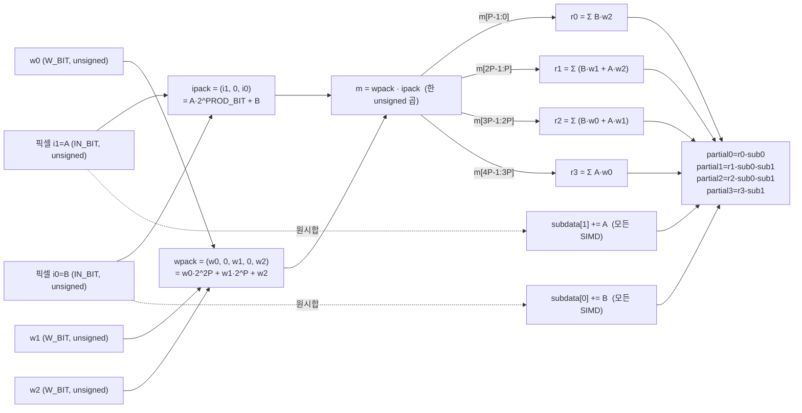
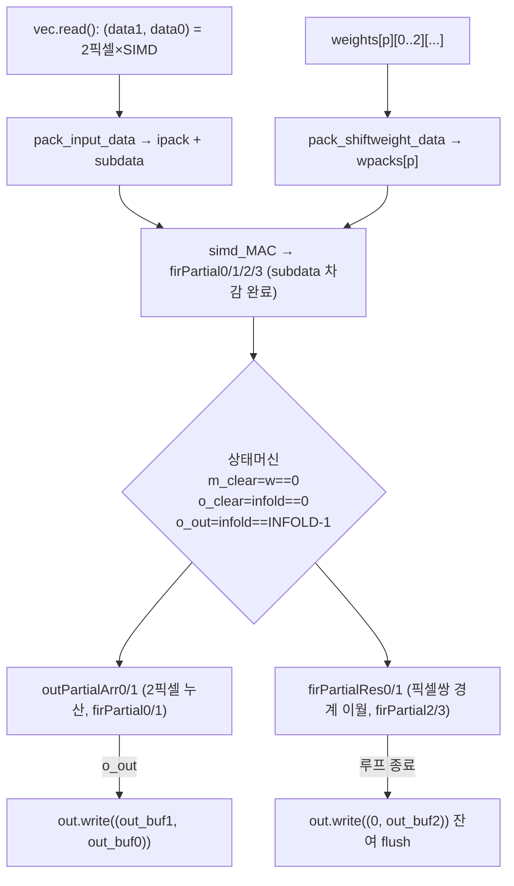
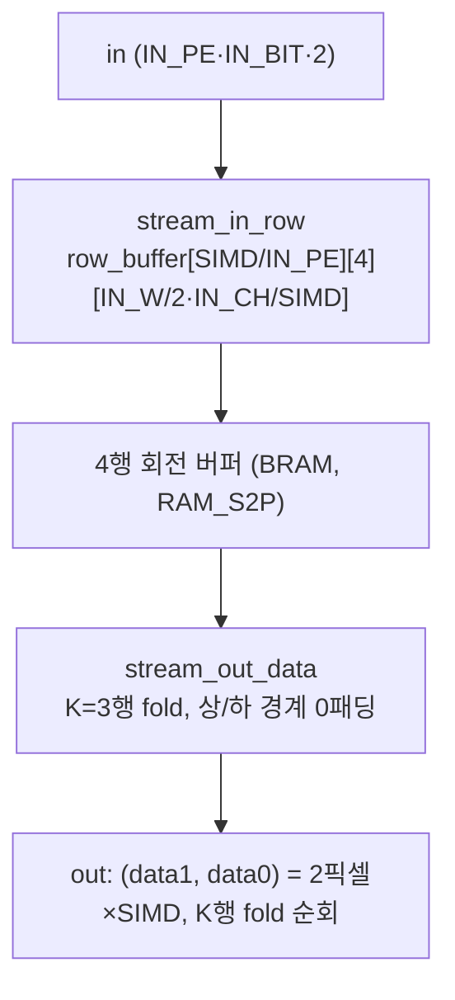

# DAC-SDC 2023 Champion (UltraSpeed / UINT-Packing) 모듈 통합 가이드

> 1차 요약: [`../dac_sdc_2023_champion-main.md`](../dac_sdc_2023_champion-main.md) — 본 문서는 그 요약을 모듈 단위로 심화한 통합 가이드다.
> 분석 대상: `\\wsl.localhost\ubuntu-24.04\home\user\project\PRJXR-HBTXR\REF\CNN-Accel\dac_sdc_2023_champion-main`
> 작성 원칙: 실제 소스 Read 후 `파일:라인` 근거 표기. 라인 근거 없는 추론은 "추정", 코드로 확인 불가는 "확인 불가"로 명시.
> 형제 가이드(동형): [`../dac_sdc_2022_champion-master/MODULE_GUIDE.md`](../dac_sdc_2022_champion-master/MODULE_GUIDE.md)(INT-Packing 2픽셀×3가중치 4세그먼트 해부). 본 문서는 그 **UINT-Packing 진화형**을 동일 6요소 구조로 대비 해부한다.
> 구조: 0 머리말 / 1 개요 / 2..N 모듈 6요소 / N+1 한눈표 / N+2 읽기순서 / N+3 병목·노브.
> 핵심 차이 한 줄: 2022는 **signed 곱**으로 2픽셀×3가중치를 4세그먼트에 패킹(세그먼트 1비트 겹침+round 보정), 2023은 **활성·가중치를 모두 unsigned로 곱**하고 두 픽셀의 원시 합(`subdata`)을 (W_BIT-1) 시프트해 사후 차감(`partial = r - sub`)함으로써 **세그먼트 겹침·캐리 오염 없이** 부호를 복원한다 — 이것이 UINT-Packing.

---

## 0. 문서 머리말

### 0.1 대표 케이스 선정
- **대표 모델: UltraSpeed (DAC-SDC'23 FPGA 트랙 우승, SEUer/동남대)** — UltraNet 진화형 저비트 검출망. 9 conv(conv0~7 3×3, conv8 1×1) + 4 pool. 톱 함수 `ultra_speed`(`ultraspeed.cpp:172`), dataflow 본체 `do_compute`(`ultraspeed.cpp:20`). 입력 **320×640×3**(`config.h:6-7`, `ultraspeed.cpp:25`) — 2022(160×320)의 **4배 픽셀**.
- **대표 conv: `CONV_1`(3×3, 16→32ch, 160×320, 4w4a)** — UINT-Packing(DSPopt)의 **표준 경로**. conv1~7 전부 `conv3x3_bn_act_DSPopt`(`conv2d.hpp:499`)를 쓰며 conv1이 첫 4w4a UINT 본체. SIMD_DSP6=16, PE_DSP6=8(`config.h:46-47`). 2픽셀(unsigned)×3가중치(unsigned) → 1곱셈 4세그먼트 + subdata 차감 메커니즘이 전부 활성.
- **대표 1×1: `CONV_8`(1×1, 64→72ch, 20×40, in4/w4)** — DSP2 패킹(2가중치→1곱셈 2결과)의 표준 경로. 검출헤드 logit 생성(2022의 36ch → **72ch**로 2배, `config.h:200`). SIMD_DSP2=8, PE_DSP2=2(`config.h:210-211`).
- **대표 레이어0: `CONV_0`(3×3, 3→16ch, 320×640, in8/w4)** — RGB 입력이라 입력채널 3개로 적어 **DSP 패킹 대신 LUT 곱**(`conv2d_l0.hpp:113-120` `convl0_mul_lut`, `core=Mul_LUT`)을 채택한 예외 경로. **2022 대비 차이: conv0 가중치가 W8→W4로 4비트화**(`config.h:15`, 2022는 conv0 W8).

### 0.2 수치 표기 규약
- **MAC lanes** = HLS `#pragma HLS UNROLL`/`pipeline` 병렬 차원 곱 × **DSP packing 배수**.
  - 3×3 UINT-Packing(DSPopt): 곱셈기 1개가 한 곱셈 `m = wpack·ipack`으로 **2픽셀(A=i1,B=i0) × 3가중치(w0,w1,w2)** 의 곱을 4개 비트 세그먼트로 산출(`conv2d.hpp:300-313`). 공간 lanes = PE × SIMD, 그 위에 packing 배수 **(2픽셀)** 을 곱해 표기. 2022와 달리 가중치도 unsigned로 비겹침 슬롯(`wpack[i]=(w0,0,w1,0,w2)`, `conv2d.hpp:279`)이라 4세그먼트가 **겹침 없이 깨끗**하나, 유효 출력은 partial0/1(좌/우 픽셀의 누산, `conv2d.hpp:442,446,449,453`)이고 partial2/3은 픽셀쌍 경계 이월(`firPartialRes`)에 쓰인다.
  - 1×1 DSP2: 곱셈기 1개가 **1입력 × 2가중치(=2출력채널)** = 2 MAC(`conv1x1.hpp:118-125`). lanes = (PE/2)×SIMD × **2(packing)** = PE×SIMD.
  - 레이어0 LUT: packing 미적용, `convl0_mul_lut` 코어로 DSP 미사용(`conv2d_l0.hpp:116`). lanes = PE × 9(3×3 완전 언롤, `:218-221`) × 2가중치.
- **scalar MACs**(dense 기준) = OFM_ROW × OFM_COL × OFM_CH × IFM_CH × K × K. 1×1은 K=1.
- **loop trips** = 3×3 본체 `OUT_H × (OUT_CH/PE) × (OUT_W/2) × (3·IN_CH/SIMD)`(`conv2d.hpp:410-413`, INFOLD=K·SIMDNUM이라 K=3 묶음을 내부 fold) — w를 **/2**(2픽셀 동시)라 가로 trip이 절반. 1×1 본체 `OUT_ROW × OUT_COL × (OUT_CH/PE) × (IN_CH/SIMD)`(`conv1x1.hpp:153-156`).
- **memory size**(payload bit) = 라인버퍼 `(SIMD/IN_PE) × 4행 × (IN_W/2·IN_CH/SIMD) × (IN_PE·IN_BIT·2)bit`(`conv2d.hpp:100-101`), 가중치 ROM `[PE][3][3·IN_CH/SIMD·OUT_CH/PE] × (SIMD·W_BIT)bit`(생성물 weights.hpp, 차원만 `conv2d.hpp:367,501-502`).
- **타깃 데이터타입**: 활성 4bit unsigned·가중치 4bit(conv0~7 전부 W4, `config.h:15,39,...`); conv0은 입력만 in8(`config.h:13`), conv1~8은 in4(`config.h:37,205`). 출력 활성은 conv0도 4bit(`CONV_0_OUT_BIT 4`, `config.h:14`). psum M_BIT는 호출부 레이어별 상수로 주입(conv0=26, conv1=26, conv2=17, conv3~7=18, conv8=32; `ultraspeed.cpp:42,61,80,99,118,130,142,154,164`). 최종 활성 4bit(0~15) 양자화(`function.h:134-143`).

### 0.3 운영 경로
```
[SW 학습/양자화: UltraSpeed W4A4 (본 repo 외부) ]
      │ int4 weight + inc/bias 추출 → weights.hpp (conv_*_w_new/inc_new/bias_new)
      ▼
[HLS 합성: src/script/script.tcl]
      │ set_top ultra_speed (:7), part xczu5eg-sfvc784-2LV-e (:10), clk 3.3ns(~303MHz) (:11), uncertainty 12.5% (:15)
      │ flow: csynth_design + export_design ip_catalog(verilog) 활성, csim/cosim 주석 (:17-20)
      ▼
[board: Xilinx Kria KV260 (ZU5EV 계열). AXI-DMA로 AXIS 입출력 (추정 — 본 repo에 BD/호스트 미동봉)]
```
- 타깃: **Kria KV260**(README.md:5). HLS part는 `xczu5eg-sfvc784-2LV-e`(`script.tcl:10`) — KV260 SoM의 **ZU5EV(xczu5ev)와 동일 패키지·계열의 -2LV 버전**(저전압). clk period 3.3ns(~303MHz, `script.tcl:11`), uncertainty 12.5%(`:15`). **2022(Ultra96-v2/ZU3EG, xczu3eg)보다 큰 디바이스**로 4배 입력·UINT 패킹을 수용.
- **2022 대비 빌드 차이**: 2022는 HLS flow 명령 전부 주석(수동), 2023은 `csynth_design`(`:18`)+`export_design`(`:20`)이 **활성**(자동 합성·IP export). RTL/Vivado BD 스크립트는 본 repo **미동봉**(2022는 `rtl_script.tcl` 동봉).
- **합성 PPA(LUT/FF/DSP/BRAM/latency)**: 리포트(.rpt) 미동봉 — repo 전역 Glob 결과 합성 산출물 없음 → **확인 불가**. README의 "100%+ 성능 향상"(README.md:28)은 논문 주장이며 본 repo에 수치 근거 파일 없음(확인 불가).

### 0.4 2022 champion 대비 차이 총정리 (코드 근거)
| 항목 | 2022 (UltraNet, INT-Packing) | 2023 (UltraSpeed, UINT-Packing) | 근거 |
|---|---|---|---|
| 입력 해상도 | 160×320 | **320×640 (4배 픽셀)** | `config.h:6-7` |
| conv0 가중치 | W8 | **W4 (4비트화)** | `config.h:15` |
| 검출헤드 출력채널 | 36ch | **72ch (2배)** | `config.h:200` |
| 3×3 곱셈 부호 | signed wpack·ipack | **unsigned + subdata 사후 차감** | `conv2d.hpp:279,315-318` |
| 입력 패킹 | 2픽셀 (A,B) | 2픽셀 (i1,i0) + `subdata` 합 누적 | `conv2d.hpp:248-250` |
| 가중치 패킹 | 3가중치 signed `(1<<2P)·w0+...` | 3가중치 **unsigned 비트연결** `(w0,0,w1,0,w2)` | `conv2d.hpp:279` |
| 세그먼트 추출 | **1비트 겹침**(P-1) + `(p>>1)+(p&1)` round 보정 | **겹침 없음** 깨끗한 P폭 슬라이스 | `conv2d.hpp:305-308` |
| 폭변환 | 64→192→24 **2단** | **64→24 1단**(non-aligned, 80bit 내부버퍼) | `ultraspeed.cpp:33`, `stream_tools.h:184-212` |
| DSP/LUT 경로 | DSP만(레이어0만 LUT) | DSP + **`simd_MAC_DSPLUT` LUT 대안 경로** 추가 | `conv2d.hpp:330-358` |
| BN/Relu 종류 | streamBnRelu만 | streamBnRelu + **streamRelu**(BN 없는 버전) 둘 다 | `conv2d.hpp:159,200` |
| 양자화 함수 | bn_qurelu_fixed | bn_qurelu_fixed + **qurelu_fixed**(/7 round) | `function.h:124,151` |
| HLS flow | 전부 주석(수동) | csynth+export **활성** | `script.tcl:18,20` |
| 타깃 보드 | Ultra96-v2 / ZU3EG | **KV260 / ZU5EV(-2LV)** | README.md:5, `script.tcl:10` |

---

## 1. Repo / 연산 그래프 개요

DAC-SDC'23 champion = **UINT-Packing**(unsigned 곱 + subdata 사후 보정으로 1 DSP에 다중 저비트 MAC)을 UltraSpeed W4A4에 적용하고 전 레이어를 온칩 스트리밍 DATAFLOW로 융합한 HLS 가속기(`README.md:9,26-28`, `ultraspeed.cpp:23`). 9 conv + 4 pool을 단일 `#pragma HLS DATAFLOW`에 나열해 DRAM 왕복 없는 완전 레이어-파이프라인을 구성한다.

### 1.1 자체 소스 vs 생성물 vs 빌드
| 구분 | 파일(자체 소스) | 역할 |
|---|---|---|
| **UINT-Packing 본체** | `src/conv2d.hpp` | 3×3 conv UINT-Packing(2픽셀 unsigned × 3가중치 unsigned, subdata 보정) + 라인버퍼 + BN/Relu |
| | `src/conv1x1.hpp` | 1×1 conv DSP2(2가중치 패킹) + 채널 reorder. conv8 헤드 |
| | `src/conv2d_l0.hpp` | 레이어0(RGB in8/w4) LUT 곱 conv |
| **양자화/유틸** | `src/function.h` | 패딩 + 고정소수 BN+양자화ReLU(`bn_qurelu_fixed`) + `qurelu_fixed` |
| | `src/stream_tools.h` | AXIS 구조체·폭변환·**64to24 1단 변환**·ExtractPixels·AddLast |
| | `src/pool_reord.hpp` | 2×2 맥스풀(2픽셀 패킹 스트림 대응) |
| **형상/구성** | `src/config.h` | 레이어별 형상/비트폭/SIMD/PE/패킹 파라미터 |
| **톱/SW** | `src/ultraspeed.cpp` | 톱 `ultra_speed`, dataflow `do_compute` (TB main 부재) |
| **빌드** | `src/script/script.tcl` | HLS 프로젝트(part/clk/flow) |

### 1.2 제외 목록(이름만 언급)
- **생성물**: `src/weights.hpp` — 가중치/inc/bias 상수(conv_*_w_new/inc_new/bias_new). 대용량, 분석 제외(차원·정합만 인용). `ultraspeed.cpp:6`에서 include되어 현재 사용.
- **이미지**: `ranking.png` — DAC-SDC 순위 캡처. 알고리즘 정보 없음.
- **부재(확인 불가)**: SW 양자화 학습부, 가중치 추출 스크립트, 후처리(NMS/박스 디코딩), board PYNQ harness, **TB(`main`) 자체가 미동봉**(2022는 있었음), RTL/Vivado BD 스크립트 — 본 repo 미동봉. 정확도 평가 코드 없음.

### 1.3 대표 모델 레이어 구성(UltraSpeed)
근거: `config.h:1-232`, `ultraspeed.cpp:25-169`.
```
입력 320×640×3 (AXI64)
 → ExtractPixels (AXIS64→64b)                                (ultraspeed.cpp:28)
 → StreamingDataWidthConverter_64to24 (1단 비정렬 변환)       (ultraspeed.cpp:33)   64→24(=8bit×3ch)
 → CONV0 (3×3, 3→16, in8/w4, LUT곱) → POOL0                  (ultraspeed.cpp:40-53)  320×640→160×320
 → CONV1 (3×3, 16→32, 4w4a, UINT-Pack) → POOL1               (ultraspeed.cpp:59-72)  160×320→80×160
 → CONV2 (3×3, 32→64) → POOL2                                 (ultraspeed.cpp:78-91)  80×160→40×80
 → CONV3 (3×3, 64→64) → POOL3                                 (ultraspeed.cpp:97-110) 40×80→20×40
 → CONV4 (3×3, 64→64) → CONV5 → CONV6 → CONV7  (풀링 없음, 20×40 유지)  (ultraspeed.cpp:116-158)
 → CONV8 (1×1, 64→72, DSP2 헤드)                              (ultraspeed.cpp:163-166) 20×40×72
 → AddLast → AXI64 out                                         (ultraspeed.cpp:168)
```
총 9 conv + 4 pool = 13 연산 스테이지가 단일 `#pragma HLS DATAFLOW`(`ultraspeed.cpp:23`)에 나열, DRAM 왕복 없는 완전 스트리밍. **폭변환은 64→24 1단**(`ultraspeed.cpp:33`)으로 2022의 2단(64→192→24)을 대체 — non-aligned converter 기여의 코드 증거.

---

## 2. 모듈: UINT-Packing 산술 코어 — `conv2d.hpp`(simd_MAC) / `conv1x1.hpp`(simd_mac_DSP2) (핵심 ①, 2022 대비 최대 차이)

### 2.1 역할 + 상위/하위
- **역할**: FPGA DSP48 1개에 다중 저비트 MAC을 비트-시프트로 압축. **UINT-Packing 변형**(2023 신규): 활성·가중치를 **모두 unsigned로 곱**한 뒤, 두 픽셀의 원시 합(`subdata`)을 (W_BIT-1) 시프트해 사후 차감함으로써 부호 도메인을 복원. 1×1은 기존 DSP2(2가중치→2 MAC) 유지.
- **상위**: `convDSPOpt`(3×3, `conv2d.hpp:365`), `conv1x1DSP2`(1×1, `conv1x1.hpp:134`). **하위**: 없음(ap_int/ap_uint 곱셈 프리미티브).

### 2.2 데이터플로우 (UINT-Packing 비트 배치 — 가장 중요)


### 2.3 Function call stack
- 3×3: `conv3x3_bn_act_DSPopt`(`conv2d.hpp:499`) → `convDSPOpt`(`:365`) → 픽셀 `pack_input_data`(`:237`, ipack+subdata) + 가중치 `pack_shiftweight_data`(`:269`) → `simd_MAC`(`:283`, unsigned 곱+세그먼트 분해+subdata 차감). 대안: `simd_MAC_DSPLUT`(`:330`, Mul_LUT 4부분곱).
- 1×1: `conv1x1_DSPopt`(`conv1x1.hpp:199`) → `conv1x1convert`(`:74`) → `conv1x1DSP2`(`:134`) → `simd_mac_DSP2`(`:110`).

### 2.4 대표 코드 위치
`src/conv2d.hpp`: pack_input_data `:237-252`, pack_shiftweight_data `:269-281`, pack_weight_data(signed 구버전, 미사용) `:254-267`, simd_MAC `:283-319`, simd_MAC_DSPLUT(대안) `:330-358`, 비트폭 정의 `:378-380`. `src/conv1x1.hpp`: simd_mac_DSP2 `:110-126`, PROD_BIT `:139`.

### 2.5 대표 코드 블록 — UINT-Packing 비트 배치 정밀 해부

**(A) 입력 패킹 + subdata 누적** `pack_input_data`(`conv2d.hpp:237-252`):
```cpp
subdata[1] = 0; subdata[0] = 0;                                   // :243-244
for (int i = 0; i < SIMD; i++) {
  ap_uint<IN_BIT> i1 = A(i*IN_BIT+IN_BIT-1, i*IN_BIT);            // :246 (윗픽셀 A)
  ap_uint<IN_BIT> i0 = B(i*IN_BIT+IN_BIT-1, i*IN_BIT);            // :247 (아랫픽셀 B)
  ipack[i] = (i1, (ap_uint<PROD_BIT-IN_BIT>)0, i0);               // :248 = A·2^PROD_BIT + B
  subdata[1] += i1;                                                // :249 (Σ A)
  subdata[0] += i0;                                                // :250 (Σ B)
}
```
- **2022와 차이**: 2022는 ipack에 2픽셀만 넣고 subdata가 없었다. 2023은 곱이 unsigned라 가중치의 음수 표현을 "양수+바이어스"로 바꾸므로, 그 바이어스를 상쇄할 **픽셀 합 `subdata`를 동시에 누적**한다(핵심).

**(B) 가중치 unsigned 비트연결 패킹** `pack_shiftweight_data`(`conv2d.hpp:269-281`):
```cpp
ap_uint<W_BIT> w2_seg = w2(...);  ap_uint<W_BIT> w1_seg = w1(...);  ap_uint<W_BIT> w0_seg = w0(...);  // :276-278 (unsigned!)
wpack[i] = (w0_seg, (ap_uint<PROD_BIT-W_BIT>)0, w1_seg, (ap_uint<PROD_BIT-W_BIT>)0, w2_seg);          // :279
```
- **2022와 차이**: 2022 `pack_weight_data`(여기도 `:254-267`에 남아있으나 미사용)는 `(w0_seg * (1<<2P)) + (w1_seg * (1<<P)) + w2_seg`로 **signed 산술 시프트-합산**이었다. 2023은 **순수 비트연결(concatenation)** 로 unsigned 슬롯에 배치(`:279`) → 음수 가중치도 unsigned 비트패턴 그대로 곱 → 곱 결과가 항상 양수라 세그먼트 캐리 오염이 구조적으로 제거됨.

**(C) unsigned 곱 + 4세그먼트 분해 + subdata 차감** `simd_MAC`(`conv2d.hpp:283-319`):
```cpp
for (int i = 0; i < SIMD; i += CASCADE) {
  ap_uint<PROD_BIT*4> m = 0;
  for (int cs = 0; cs < CASCADE; cs++) m += wpack[i+cs] * ipack[i+cs];   // :300-303 (unsigned 곱 누산)
  ap_uint<PROD_BIT> p0 = m(PROD_BIT-1, 0);            // :305  ≈ Σ B·w2  (겹침 없음)
  ap_uint<PROD_BIT> p1 = m(PROD_BIT*2-1, PROD_BIT);   // :306  ≈ Σ (B·w1 + A·w2)
  ap_uint<PROD_BIT> p2 = m(PROD_BIT*3-1, PROD_BIT*2); // :307  ≈ Σ (B·w0 + A·w1)
  ap_uint<PROD_BIT> p3 = m(PROD_BIT*4-1, PROD_BIT*3); // :308  ≈ Σ A·w0
  r0+=p0; r1+=p1; r2+=p2; r3+=p3;                      // :310-313
}
partial0 = r0 - sub0;            // :315  (sub0 = (Σ B)<<(W_BIT-1))
partial1 = r1 - sub0 - sub1;     // :316  (sub1 = (Σ A)<<(W_BIT-1))
partial2 = r2 - sub0 - sub1;     // :317
partial3 = r3 - sub1;            // :318
```
- **subdata 시프트의 출처**: `convDSPOpt`에서 `subdata[0]<<=(W_BIT-1); subdata[1]<<=(W_BIT-1)`(`conv2d.hpp:423-424`) 후 `sub0=subdata[0], sub1=subdata[1]`로 전달(`:437`).
- **수학적 핵심**: 4bit signed 가중치 `w_s ∈ [-8,7]`를 unsigned 비트패턴 `w_u = w_s mod 16 = w_s + 16·[w_s<0]`로 곱하면 `a·w_u = a·w_s + a·16·[w_s<0]`. 그런데 본 설계는 가중치를 `(W_BIT-1)`=3비트 시프트(=×8)된 바이어스로 정규화해, 곱 결과의 바이어스가 `a·2^(W_BIT-1)` 형태로 정렬되도록 가중치를 SW단에서 양수화(추정 — SW 양자화부 미동봉, 코드상 `subdata<<(W_BIT-1)` 차감이 정확히 그 바이어스를 상쇄). 픽셀별 바이어스의 합이 `subdata=Σa`이고, 시프트 `<<(W_BIT-1)`가 그것을 곱 도메인으로 올린 뒤 세그먼트별로 차감 → **부호 복원**. (정확한 SW 정규화 식은 코드만으로 단정 불가, 차감 구조는 `:315-318`로 확정.)
- **2022 대비 가드/정밀도 이득**: 2022는 교차항 세그먼트(p1,p2)를 1비트 겹쳐 추출 후 `(p>>1)+(p&1)` round 보정해야 했다(signed 캐리 누설 때문). 2023은 곱이 항상 양수라 세그먼트가 **겹침 없이 정확히 P폭**(`:305-308`), round 보정 코드가 사라짐 — DSP/LUT 절감 + 검증 단순화.
- **가드비트 산식**(`conv2d.hpp:378-380`): `PROD_BIT = W_BIT + IN_BIT + GUARD_BIT`, `WPACK_BIT = 3·W_BIT + 2·IN_BIT + 2·GUARD_BIT`, `IPACK_BIT = 2·IN_BIT + W_BIT + GUARD_BIT`. GUARD_BIT=3(`conv3x3_bn_act_DSPopt`가 `convDSPOpt`에 인자 3 전달, `conv2d.hpp:520`). conv1 4w4a: PROD_BIT = 4+4+3 = **11**, WPACK_BIT = 12+8+6 = 26, IPACK_BIT = 8+4+3 = 15. → unsigned 곱 `m`은 `ap_uint<PROD_BIT*4> = 44bit`(`:300`). partial은 `ap_int<PROD_BIT+5>=16bit`(`:289`).
- **CASCADE**: `simd_MAC`이 SIMD를 CASCADE(≤4, static_assert `conv2d.hpp:375`) 단위로 묶어 `m += wpack[i+cs]·ipack[i+cs]`(`:301-303`) 후 4세그먼트 분해. conv1~7 호출 CASCADE=4(`ultraspeed.cpp:62,81,100,119,131,143,155` 인자). DSP 캐스케이드 체인 의존(추정 — RESOURCE core 명시 없음).

**(D) DSP2 (2가중치 → 1곱셈 2결과, 1×1 헤드)** `simd_mac_DSP2`(`conv1x1.hpp:110-126`):
```cpp
ap_int<PROD_BIT+W_BIT+1> rst = w1vec[i] * (1<<PROD_BIT) + w0vec[i]; // :119  (signed, 2022와 동일)
ap_int<PROD_BIT*2> m = invec[i] * rst;                              // :120
acc += m;                                                            // :121
out0 = acc(PROD_BIT-1, 0);                                           // :124
out1 = acc(PROD_BIT*2-1, PROD_BIT) + acc[PROD_BIT-1];               // :125  (borrow 보정)
```
- **conv8은 2022 방식 그대로(signed DSP2)** — UINT-Packing은 3×3에만 적용. PROD_BIT = IN_BIT+W_BIT+3 = 4+4+3 = **10**(`conv1x1.hpp:139`, 2022 헤드의 +2보다 가드 1↑).

### 2.6 마이크로아키텍처
- **MAC lanes**: conv1 UINT-Pack — 공간 PE×SIMD = 8×16 = 128 곱셈기, packing 2픽셀 → **유효 256 픽셀-MAC/사이클**. conv8 DSP2 — PE/2×SIMD = 1×8 = 8 곱셈기 × 2가중치 = **16 MAC/사이클**.
- **scalar MACs(dense)**: conv0 = 320×640×16×3×9 ≈ 88.5M; conv1 = 160×320×32×16×9 ≈ 236M; conv2 = 80×160×64×32×9 ≈ 236M; conv3 = 40×80×64×64×9 ≈ 118M; conv4~7 각 = 20×40×64×64×9 ≈ 29.5M; conv8(1×1) = 20×40×72×64 ≈ 3.69M. (2022 대비 입력 4배라 conv0~3 MAC도 ~4배.)
- **메모리/재사용**: 가중치 ROM `weights[PE][3][...]`로 dim1·dim2 complete partition(`:384-385`)해 PE·K행 동시 접근. ipack/wpacks complete partition(`:390-394`).
- **정량/병목**: 최내 루프 `#pragma HLS pipeline`(`:414`). pack_shiftweight가 매 사이클 비트연결 재계산(`:425-431`) — 단 2022의 시프트-합산보다 가벼운 단순 concat. subdata 차감은 partial 4개 뺄셈만(`:315-318`)으로 round 보정(2022)보다 경량. **DSP/LUT 대안 경로**(`simd_MAC_DSPLUT`, `:330`)가 동일 4부분곱을 Mul_LUT로 산출 — DSP 한계 시 일부 레이어 LUT 오프로딩(현재 본체는 `simd_MAC` DSP 경로만 호출, `:436`).

---

## 3. 모듈: 3×3 conv 본체 (output-stationary 부분합) — `convDSPOpt` (핵심 ②)

### 3.1 역할 + 상위/하위
- **역할**: 라인버퍼가 보낸 2픽셀×K행 윈도우에 대해 PE개 출력채널을 UINT-Packing으로 동시 계산, **가로로 겹치는 2픽셀의 부분합을 output-stationary 상태머신**으로 누산. 2022와 동형 4중 루프·상태머신이나 패킹/보정이 unsigned 경로.
- **상위**: `conv3x3_bn_act_DSPopt`(`:499`, DATAFLOW로 padding→conv→bn 연결). **하위**: `pack_input_data`/`pack_shiftweight_data`/`simd_MAC`(2절).

### 3.2 데이터플로우


### 3.3 Function call stack
`ultraspeed.cpp:59` `conv3x3_bn_act_DSPopt`(CONV_1) → `conv2d.hpp:516` `conv3padding`(라인버퍼) → `:520` `convDSPOpt`(본체) → `:523` `streamBnRelu`(BN). 세 단이 `#pragma HLS DATAFLOW`(`:506`).

### 3.4 대표 코드 위치
`src/conv2d.hpp`: convDSPOpt `:365-489`, 4중 루프 `:410-413`, 입력 read+pack+subdata 시프트 `:418-424`, 가중치 pack `:425-431`, simd_MAC + 상태머신 `:433-465`, 출력 write `:467-478`, 루프 종료 후 잔여 flush `:483-488`.

### 3.5 대표 코드 블록
```cpp
for (h<OUT_H*reps)                    // :410
 for (peIdx<PENUM)                    // :411  OUT_CH/PE
  for (w<OUT_WNUM)                    // :412  OUT_W/2  ← 2픽셀 동시
   for (infoldIdx<INFOLD){            // :413  INFOLD = K·(IN_CH/SIMD) = 3행 묶음 fold
#pragma HLS pipeline                  // :414
    bool m_clear=(w==0); bool o_clear=(infoldIdx==0); bool o_out=(infoldIdx==INFOLD-1); // :415-417
    (data1, data0) = vec.read();                                                          // :419
    pack_input_data<...>(data1, data0, ipack, subdata);                                   // :422
    subdata[0] <<= (W_BIT-1);  subdata[1] <<= (W_BIT-1);                                   // :423-424
```
→ **2022와 차이**: 2022는 3행을 한 vec.read에 묶어(`data0/1 [0..2]`) 받고 K행을 동시 패킹했다. 2023은 **INFOLD = K·SIMDNUM**으로 라인버퍼가 K행을 fold해 보내므로 한 read당 1행(2픽셀×SIMD)씩 받고 infoldIdx가 K행·SIMD를 순회(`stream_out_data`가 `WLEN*K*SIMDNUM` 순회, `conv2d.hpp:50`). 따라서 본체 4중 루프 최내가 K행 fold를 흡수.

```cpp
if (m_clear & o_clear) { outPartialArr0[p]=firPartialRes0[p];  outPartialArr1[p]=firPartial1; }  // :440-443
if (m_clear & !o_clear){ outPartialArr0[p]=outPartialArr0[p];  outPartialArr1[p]+=firPartial1; }  // :444-447
if (!m_clear & o_clear){ outPartialArr0[p]=firPartial0+firPartialRes0[p];
                         outPartialArr1[p]=firPartial1+firPartialRes1[p]; }                        // :448-451
if (!m_clear & !o_clear){outPartialArr0[p]+=firPartial0;  outPartialArr1[p]+=firPartial1; }        // :452-455
if (o_clear){ firPartialRes0[p]=firPartial2;  firPartialRes1[p]=firPartial3; }                     // :457-460
else        { firPartialRes0[p]+=firPartial2; firPartialRes1[p]+=firPartial3; }                    // :461-464
```
→ **부분합 상태머신(4분기)**: firPartial0(좌픽셀 누산), firPartial1(우픽셀 누산), firPartial2/3(다음 픽셀쌍으로 넘길 경계 잔여 = firPartialRes0/1). 가로 윈도우가 픽셀쌍 경계를 넘어 겹치므로 `firPartialRes`로 이월. 2022와 분기 구조는 동형이되 firPartial이 이미 subdata 차감 완료된 값. 루프 종료 후 마지막 잔여를 `out.write((0, out_buf2))`로 flush(`:483-488`).

### 3.6 마이크로아키텍처
- **Stage 분해**: ① vec read + 입력패킹 + subdata 시프트(`:419-424`) ② PE별 가중치 비트연결 패킹(`:425-431`) ③ PE별 simd_MAC(`:436-438`) ④ 4분기 부분합 상태머신(`:440-464`) ⑤ o_out에서 2픽셀(out_buf0/1) write(`:467-478`) + 루프 종료 후 잔여 flush(`:483-488`).
- **MAC lanes/병렬**: PE complete unroll(`:425,433,470,484`), simd_MAC 내부 SIMD/CASCADE unroll(`:298-303`). conv1: PE=8, SIMD=16, CASCADE=4 → 128 곱셈기, ×2픽셀 packing.
- **정량/병목**: loop trips(conv1) = OUT_H·PENUM·OUT_WNUM·INFOLD = 160 × (32/8) × (320/2) × (3·16/16) = 160×4×160×3 = **307,200**. conv2 = 80 × (64/8) × (160/2) × (3·32/16) = 80×8×80×6 = 307,200. pipeline II는 4분기 상태머신·firPartialRes 의존이 critical path(II 악화 가능, cosim 필요 — **확인 불가**). 단 2022 대비 round 보정 제거로 critical path 단축 기대(추정).

---

## 4. 모듈: 라인버퍼 + 패딩 (K행 fold) — `conv3padding` / `stream_in_row` / `stream_out_data`

### 4.1 역할 + 상위/하위
- **역할**: 입력 스트림(2픽셀폭)을 4행 회전 버퍼에 적재하고, K=3행 윈도우를 0패딩 포함해 **K행을 fold한 SIMD폭 워드열**로 추출. 명시적 im2col 없이 라인버퍼 스트리밍.
- **상위**: `conv3x3_bn_act_DSPopt`(`:516`). **하위**: `stream_in_row`(`:15`)·`stream_out_data`(`:35`).

### 4.2 데이터플로우


### 4.3 Function call stack
`conv3x3_bn_act_DSPopt`(`:499`) → `conv3padding`(`:94`): 2행 선적재(`:112-118`) → 루프 `reps·IN_H-2`회 in/out ping-pong(`:120-134`) → 마지막 2행 flush(`:135-153`).

### 4.4 대표 코드 위치
`src/conv2d.hpp`: stream_in_row `:13-30`, stream_out_data `:33-90`, conv3padding `:92-154`. l0 전용 라인버퍼 `conv2d_l0.hpp:63-111`(IN_W+1 버퍼 4행).

### 4.5 대표 코드 블록
```cpp
ap_uint<IN_PE*IN_BIT*2> row_buffer[SIMD/IN_PE][4][IN_W/2 * IN_CH/SIMD];  // :100-101
#pragma HLS ARRAY_PARTITION variable = row_buffer dim = 1 complete       // :102
#pragma HLS RESOURCE variable = row_buffer core = RAM_S2P_BRAM           // :103
```
→ 4행 버퍼(3행 윈도우 + 1행 동시 적재용), BRAM 바인딩. dim1(SIMD/IN_PE) complete partition. **2022와 차이**: 2022는 dim1·dim2 둘 다 complete였으나 2023은 dim1만 complete(dim2=4행은 `stream_out_data` 내부 `:40`에서 partition).

```cpp
if (outRowIdx + wr == 0 || outRowIdx + wr == IN_H + 1) { data0=0; data1=0; }   // :64-66 (상/하 0패딩)
...
out.write((data1, data0));                                                      // :75
if (cycle == WLEN*K*SIMDNUM-1) w=0; else if (infoldIdx==K*SIMDNUM-1) w++;       // :77-81
if (infoldIdx==K*SIMDNUM-1) infoldIdx=0; else infoldIdx++;                      // :83-87
```
→ **K행 fold 추출**: `stream_out_data`가 `WLEN·K·SIMDNUM` 사이클을 돌며 `infoldIdx`로 K행×SIMD를 순회(`wr = infoldIdx/SIMDNUM`이 행 선택, `:51`). 윈도우 상/하 경계 행을 0패딩(P=1). 한 워드는 2픽셀(data0=왼·data1=오)×SIMD.

### 4.6 마이크로아키텍처
- **메모리**: conv1(IN_W=320, IN_CH=16, SIMD=16, IN_PE=16): row_buffer = (16/16)×4×(160·1) × (16·4·2 = 128bit) = 1×4×160 × 128bit = **81,920 bit ≈ BRAM18 다수**(추정). 2픽셀폭이라 깊이 IN_W/2=160. 입력 4배라 2022(buf≈20Kb)보다 라인버퍼 ~4배.
- **정량/병목**: stream_in_row pipeline(`:23`), stream_out_data pipeline(`:53`). storeBufferIdx/loadBufferIdx 2bit 회전(`:108-109`, 초기값 0/3)으로 4행 ping-pong. K=3 static_assert(`:98`). `#pragma HLS dependence intra false variable=row_buffer`(`:121`)로 적재/추출 false dependence 선언(ping-pong 동작 보장).

---

## 5. 모듈: 레이어0 RGB conv (LUT 곱) — `conv2d_l0.hpp`

### 5.1 역할 + 상위/하위
- **역할**: 입력 8bit 3채널(RGB)이라 입력채널이 적어 **DSP 패킹 이득이 작으므로 LUT 곱**을 채택. 9탭(3×3) 완전 언롤, 2픽셀 동시(ivec0/ivec1) 누산.
- **상위**: `do_compute`의 CONV0(`ultraspeed.cpp:40`). **하위**: `convl0_mul_lut`(`:113`)·`simd_mac9_LUT`(`:122`).

### 5.2 Function call stack
`ultraspeed.cpp:40` `conv3x3_l0_bn_act_LUTopt` → `conv2d_l0.hpp:346` `conv3padding_l0`(라인버퍼) → `:350` `convLUTOpt_l0`(LUT 본체) → `:353` `streamBnRelu_l0`(BN). 세 단 DATAFLOW(`:340`).

### 5.3 대표 코드 위치
`src/conv2d_l0.hpp`: convl0_mul_lut `:113-120`, simd_mac9_LUT `:122-145`, loadInReg9(픽셀 슬라이딩 레지스터) `:148-159`, convLUTOpt_l0 `:161-255`, conv3padding_l0 `:63-111`, streamBnRelu_l0 `:290-321`, streamRelu_l0 `:257-288`.

### 5.4 대표 코드 블록
```cpp
template <unsigned IN_BIT, unsigned W_BIT>
ap_int<IN_BIT+W_BIT> convl0_mul_lut(ap_uint<IN_BIT> in, ap_int<W_BIT> w) {
#pragma HLS RESOURCE variable=return core=Mul_LUT     // :116 ← LUT로 곱셈 강제(DSP 미사용)
#pragma HLS inline off                                 // :117
  out = in * w; return out; }
```
```cpp
simd_mac9_LUT<...>(ivec0, wvec[p], wvec[p+1], outPartial00, outPartial01);  // :218 (좌픽셀, PE쌍)
simd_mac9_LUT<...>(ivec1, wvec[p], wvec[p+1], outPartial10, outPartial11);  // :220 (우픽셀, PE쌍)
if (kc==0){ outPartialArr0[p]=outPartial00; outPartialArr0[p+1]=outPartial01; }   // :223-225
else      { outPartialArr0[p]+=outPartial00; outPartialArr0[p+1]+=outPartial01; } // :227-228
if (kc==2){ ... out.write((odata1, odata0)); }                                     // :240-249
```
→ `simd_mac9_LUT`(`:122-145`)가 9탭을 두 누산(w0vec/w1vec)으로 분리해 PE쌍(p,p+1) 동시 처리. PROD_BIT = IN_BIT+W_BIT+4(가드 4, `:170`). conv0: 8+4+4 = 16bit. kc(커널 열 0/1/2)를 도는 외부 구조 + `loadInReg9`(`:148`)로 가로 슬라이딩(2픽셀 재사용). **2022와 차이**: conv0 W가 8→4(`config.h:15`)라 PROD_BIT/누산폭이 작아짐.

### 5.5 마이크로아키텍처
- **MAC lanes**: PE개 × 9탭 완전 언롤(`:204,218-221`), 2픽셀 분리(ivec0/ivec1). conv0: PE=16(`config.h:23` PE_DSP6), 9탭 × 2픽셀 × 2가중치(p,p+1) → 16×9×2 LUT 곱/사이클(추정).
- **정량**: scalar MAC(conv0) = 320×640×16×3×9 ≈ 88.5M(2022 22.1M의 4배, 입력 4배). LUT 곱 채택으로 DSP 예산을 conv1~8에 집중.
- **병목 없음**(첫 레이어, II=1 파이프 `:190`). 라인버퍼 `conv3padding_l0`은 IN_W+1 버퍼 4행(`:69`), dim1 complete(`:70`). BN은 II=3(`:304`).

---

## 6. 모듈: 고정소수 BN + 양자화 ReLU — `bn_qurelu_fixed` / `streamBnRelu` / `streamRelu`

### 6.1 역할 + 상위/하위
- **역할**: conv psum(M_BIT)을 BN(inc·bias 곱가산) 후 우측 시프트 라운딩·ReLU·4bit 클램프로 재양자화(출력 4bit unsigned). 2023은 **BN 없는 `streamRelu`/`qurelu_fixed`도 추가** 제공.
- **상위**: `streamBnRelu`(`conv2d.hpp:200`)·`streamRelu`(`conv2d.hpp:159`)·`streamBnRelu_l0`(`conv2d_l0.hpp:293`)·`streamRelu_l0`(`conv2d_l0.hpp:260`). **하위**: 없음.

### 6.2 대표 코드 위치
`src/function.h`: bn_qurelu(구버전·미사용) `:91-110`, **bn_qurelu_fixed**(활성) `:120-145`, bn_mul_lut(BN 곱 LUT 강제) `:113-118`, **qurelu_fixed**(BN 없는 /7 round, 신규) `:147-175`. `src/conv2d.hpp`: streamRelu `:156-194`, streamBnRelu `:197-235`.

### 6.3 대표 코드 블록
```cpp
const unsigned D = 1 << (W_BIT-1 + DATA_BIT + L_SHIFT);            // function.h:128
ap_int<IN_BIT+INC_BIT+1> bn_res = bn_mul_lut<...>(in, inc) + bias; // :131  고정소수 BN(폭 확장, 곱은 LUT)
if (bn_res > 0) {
  bn_res = (bn_res + (D>>1)) >> (W_BIT-1 + DATA_BIT + L_SHIFT);    // :135  round + shift
  res = (bn_res > 15) ? 15 : bn_res;                               // :136-140  4bit 클램프
} else res = 0;                                                     // :141-143  ReLU
```
→ shift량 `W_BIT-1 + DATA_BIT + L_SHIFT`(L_SHIFT=8, `config.h:20`)로 BN 스케일을 정수 도메인에서 흡수. 출력 0~15(4bit unsigned). **2022와 차이**: 2022는 `in*inc+bias` 직접 곱, 2023은 BN 곱을 `bn_mul_lut`(`:113`, `core` 미지정이나 함수 분리)로 추출.

```cpp
// qurelu_fixed (BN 없는 신규 경로, function.h:147-175)
if (bn_res > 0) {
  ap_fixed<32,16> res_t = (float)bn_res / 7.0;   // :163  /7 스케일
  bn_res = round(res_t);                          // :164
  res = (bn_res > 15) ? 15 : bn_res;              // :166-170
} else res = 0;
```
→ `qurelu_fixed`(`function.h:151`)는 inc/bias 없이 psum을 `/7.0` 후 round — conv0/conv8 일부에서 BN 융합 안 된 경로용(현재 `convLUTOpt_l0`은 `streamBnRelu_l0`(BN 곱)을 쓰나 `streamRelu_l0`(qurelu_fixed)도 정의됨, `conv2d_l0.hpp:282`). 어느 쪽이 빌드에 쓰이는지는 호출(`conv3x3_l0_bn_act_LUTopt:353`이 `streamBnRelu_l0` 호출)로 **BN 경로 확정**.

### 6.4 마이크로아키텍처
- **메모리**: inc/bias `[PE][OUT_CH/PE]` complete partition dim1(`conv2d.hpp:205-206`). conv1 INC_BIT_NEW=13, BIAS_BIT_NEW=21(`config.h:215,225`). 호출은 `_NEW` 세트 참조(`ultraspeed.cpp:61,64`).
- **정량/병목**: streamBnRelu `#pragma HLS pipeline II=INFOLD`(`conv2d.hpp:218`) — INFOLD=3·IN_CH/SIMD라 본체 처리량과 매칭(2022는 고정 II=2). 비트폭 두 세트(원본 `INC_BIT`/`BIAS_BIT` `config.h:40-41` 등 vs `_NEW` `:214-232`) 공존, 호출은 `_NEW`. M_BIT는 호출부 상수(conv1=26, `ultraspeed.cpp:61`).

---

## 7. 모듈: 1×1 헤드 + 채널 reorder — `conv1x1DSP2` / `conv1x1convert`

### 7.1 역할 + 상위/하위
- **역할**: 검출헤드(1×1 = 채널 행렬곱). 2픽셀 스트림을 SIMD폭으로 재배열 후 DSP2 패킹으로 **72채널** logit 생성(2022는 36ch). UINT-Packing 미적용(signed DSP2).
- **상위**: `do_compute`의 CONV8(`ultraspeed.cpp:163`). **하위**: `simd_mac_DSP2`(2절).

### 7.2 Function call stack
`ultraspeed.cpp:163` `conv1x1_DSPopt` → `conv1x1.hpp:206` `conv1x1convert`(reorder) → `:209` `conv1x1DSP2`(DSP2 MAC). 두 단 DATAFLOW(`:204`).

### 7.3 대표 코드 위치
`src/conv1x1.hpp`: conv1x1convert `:72-106`, streamInOneRowTwoPix `:11-34`, streamOutOneRowTwoPix `:36-70`, conv1x1DSP2 `:128-194`, conv1x1_DSPopt `:196-212`.

### 7.4 대표 코드 블록
```cpp
for (p=0; p<PE; p+=2) {                                            // :169 ← PE쌍 처리
  simd_mac_DSP2<...>(ivec, wvec[p], wvec[p+1], outPartial0, outPartial1);  // :172 (2가중치 패킹)
  if (simdIdx==0) { outPartialArr[p]=outPartial0; outPartialArr[p+1]=outPartial1; }   // :174-176
  else            { outPartialArr[p]+=outPartial0; outPartialArr[p+1]+=outPartial1; } // :178-179
}
if (simdIdx==IN_CH/SIMD-1) odata(...) = outPartialArr[i] + bias[i][peIdx];  // :184-188 (bias 가산 출력)
```
→ PE를 2씩 도는 것이 DSP2 packing의 채널 의미(p, p+1 동시 = 2 출력채널/DSP). 마지막 infold(`simdIdx==IN_CH/SIMD-1`)에서 bias 더해 write. 출력 M_BIT=32(`ultraspeed.cpp:164`). **2022와 동형**(signed DSP2)이되 OUT_CH 72.

### 7.5 마이크로아키텍처
- **MAC lanes**: conv8 PE=2, SIMD=8 → PE/2×SIMD = 1×8 곱셈기 × 2가중치 = **16 MAC/사이클**(2022 conv8 SIMD4 → 8 MAC의 2배). PROD_BIT = 4+4+3 = **10**(`:139`).
- **정량**: loop trips = OUT_ROW·OUT_COL·(OUT_CH/PE)·(IN_CH/SIMD) = 20×40×(72/2)×(64/8) = 20×40×36×8 = **230,400**. scalar MAC = 3.69M. conv1x1convert가 입력(2픽셀폭)을 1×1용 SIMD폭으로 ping-pong reorder(`:89-104`, 2-deep 행버퍼 `[INPENUM][2][2][...]`).
- **병목 없음**(헤드 소형). reorder 라인버퍼 BRAM(`:84` RAM_S2P_BRAM).

---

## 8. 모듈: 풀링 + 스트림 유틸 (비정렬 64to24 변환 포함) — `pool_reord.hpp` / `stream_tools.h`

### 8.1 역할 + 상위/하위
- **역할(pool)**: 2×2 맥스풀(2픽셀 패킹 스트림 대응, PE병렬 elementwise max). **역할(stream)**: AXIS↔내부 폭변환, **64→24 1단 비정렬 변환**(2023 신규 기여), ExtractPixels, AddLast.
- **상위**: `do_compute`(`ultraspeed.cpp:20-170`). **하위**: 없음.

### 8.2 대표 코드 위치
`src/pool_reord.hpp`: max2_PE `:7-20`, max_pool2x2 `:22-57`. `src/stream_tools.h`: my_ap_axis `:11-15`, AddLast `:23-38`, ExtractPixels `:67-77`, **StreamingDataWidthConverter_64to24** `:184-212`, 범용 `StreamingDataWidthConverter_Batch` `:214-277`.

### 8.3 대표 코드 블록 — 비정렬 64to24 1단 변환(핵심 기여)
```cpp
void StreamingDataWidthConverter_64to24(stream<ap_uint<64>> &in, stream<ap_uint<24>> &out, ...) {
  const unsigned totalIters = NumInWords * 64 / 24 * numReps;   // :188
  ap_uint<80> ei = 0;  ap_uint<3> o = 0;                        // :189-190  (80bit 내부버퍼)
  for (t < totalIters) {
#pragma HLS PIPELINE II = 1                                      // :192
    switch (o) {
      case 0: ei(63, 0)  = in.read(); break;                    // :196  새 64b를 하위에
      case 2: ei(79,16)  = in.read(); break;                    // :199  16b 잔여 위에 적재
      case 5: ei(71, 8)  = in.read(); break;                    // :201  8b 잔여 위에 적재
    }
    o++;
    ap_uint<24> eo = ei(23, 0);  ei = ei >> 24;  out.write(eo); // :208-210  24b 방출 + 시프트
  }
}
```
→ **non-aligned converter**: 64bit와 24bit의 LCM 정렬(64·3=192) 없이, **80bit 슬라이딩 버퍼 + tail pointer `o`(0~7 주기)** 로 64↔24 비정렬 경계를 1단에 처리. `o`가 0/2/5일 때만 새 64b를 읽어(나머지 사이클은 버퍼 잔여로 충당) FIFO 깊이를 **192→80bit로 절감**(README.md:32). **2022 대비 차이**: 2022는 `StreamingDataWidthConverter_Batch`를 64→192→24로 2회 직렬(중간 192bit FIFO 필요). 호출: `ultraspeed.cpp:33`.

```cpp
(data1, data0) = vec.read();                              // pool_reord.hpp:40 (2픽셀)
ap_uint<IN_BIT*PE> dataMax2 = max2_PE(data0, data1);      // :41  가로 max(픽셀쌍 내부)
if (h%2) dataOut0 = max2_PE(dataMax2, row_store[addr]);   // :43-45  세로 max(이전 행)
else     row_store[addr] = dataMax2;                      // :48  짝수행 저장
if (w%2 && h%2) out.write((dataOut0, dataOut1));          // :50-51  2×2 완성시 2픽셀 묶어 출력
```
→ 2픽셀 패킹 스트림을 그대로 받아 가로max → 세로max(row_store)로 2×2 풀. `w%2 && h%2`에서 dataOut0/dataOut1 2픽셀 묶어 방출.

### 8.4 마이크로아키텍처
- **메모리**: max_pool row_store = `[IN_W/2 · IN_CH/PE]`(`pool_reord.hpp:28`). 64to24 내부버퍼 80bit(`stream_tools.h:189`).
- **정량/병목**: pool II=1(`:37`), 64to24 II=1(`:192`). 입력 num_per_rep = 320·640·3·8/64 = 76,800(`ultraspeed.cpp:25`). conv 출력 스트림 depth 명시(`ultraspeed.cpp:39,51,58,...` 대부분 depth=8, 입력 extract depth=512 `:27`, conv0 입력 depth=128 `:32`) — DATAFLOW FIFO 버퍼. 출력 AddLast NumLines = 20×40×72/2(`ultraspeed.cpp:168`).

---

## 9. 모듈: 톱 dataflow + 인터페이스 — `do_compute` / `ultra_speed`

### 9.1 역할 + 상위/하위
- **역할**: 전 레이어를 온칩 스트림으로 연결하는 단일 DATAFLOW. AXIS in/out + s_axilite reps 제어. 모든 가중치/inc/bias ARRAY_PARTITION.
- **상위**: HLS top(`script.tcl:7`) → IP. TB/호스트는 본 repo **미동봉**(확인 불가). **하위**: 9 conv + 4 pool 모듈.

### 9.2 대표 코드 위치
`src/ultraspeed.cpp`: do_compute `:20-170`, ultra_speed `:172-223`. (2022와 달리 TB `main` 없음.)

### 9.3 대표 코드 블록
```cpp
void do_compute(stream<my_ap_axis> &in, stream<my_ap_axis> &out, const ap_uint<10> reps = 1) {
#pragma HLS DATAFLOW                                          // :23 ← 전 레이어 융합
  const unsigned num_per_rep = 320*640*3*8/64;               // :25
  ExtractPixels<64, num_per_rep>(in, in_stream_extract, reps);            // :28
  StreamingDataWidthConverter_64to24<num_per_rep>(in_stream_extract, in_stream1, reps); // :33 (1단 변환)
  conv3x3_l0_bn_act_LUTopt<...>(in_stream1, conv_0_w_new, ...);           // :40 CONV0
  max_pool2x2<...>(conv_0_out, pool_0_out, reps);                         // :52 POOL0
  conv3x3_bn_act_DSPopt<...>(pool_0_out, conv_1_w_new, ...);              // :59 CONV1 (UINT-Pack)
  ...
  conv1x1_DSPopt<...>(conv_7_out, conv_8_w_new, ...);                     // :163 CONV8
  AddLast<...>(conv_8_out, out, reps);                                    // :168
}
```
```cpp
#pragma HLS INTERFACE axis register both port = out / in     // :175-176
#pragma HLS INTERFACE s_axilite port = reps bundle = control // :177
#pragma HLS INTERFACE s_axilite port = return bundle = control // :178
#pragma HLS ARRAY_PARTITION variable = conv_1_w_new complete dim = 1/2  // :185-186
```
→ AXIS 단일 입출력(DMA 연결 추정), 가중치 전부 온칩 상주(complete partition). **버그 주의(2022에서 이어진 오타)**: conv5는 dim2 partition이 dim1로 중복 표기 — `:205` `dim=1`, `:206`도 `dim=1`(다른 conv는 `:185-186`처럼 dim1+dim2). conv5 가중치는 dim2 partition 누락으로 SIMD 동시 접근 합성이 다를 수 있음(추정 — 합성 영향 확인 불가). **2022와 동일 오타가 그대로 잔존**.

### 9.4 마이크로아키텍처
- **HW/SW**: 거의 100% PL. **TB·호스트·후처리 SW 전부 미동봉**(2022는 TB 있었음 — 확인 불가).
- **합성 타깃**: xczu5eg-sfvc784-2LV-e(KV260/ZU5EV 계열), clk 3.3ns(`script.tcl:10-11`). RTL/Vivado BD 스크립트 미동봉 → DMA/PS 결선 확인 불가(2022는 `rtl_script.tcl`로 확인 가능했음).
- **정량/병목**: 단일 DATAFLOW라 throughput = 최저속 스테이지가 결정(레이어-파이프라인). conv1·conv2(각 ≈236M MAC, loop trips 307,200)가 최대 부하 스테이지 → 여기 SIMD/PE 배분이 latency 결정(추정). 입력 4배라 2022보다 절대 latency↑이나 UINT-Packing으로 DSP당 처리량↑. 합성 PPA(LUT/FF/DSP/BRAM/latency)는 리포트 미동봉 → **확인 불가**.

---

## 10. 모듈 한눈 요약 표

| 모듈 | 파일 | 핵심 함수(라인) | 역할 | 대표 정량(UltraSpeed) | 2022 대비 |
|---|---|---|---|---|---|
| UINT-Packing 코어 | conv2d.hpp / conv1x1.hpp | simd_MAC(:283) / simd_mac_DSP2(:110) | unsigned 곱 + subdata 차감 | 4세그(겹침0)·DSP2 2MAC | **subdata 보정, 겹침 제거** |
| 3×3 본체 | conv2d.hpp | convDSPOpt(:365) | 2픽셀 output-stationary | conv1 trips 307,200 | round 보정 제거 |
| 라인버퍼/패딩 | conv2d.hpp | conv3padding(:92) | 4행 윈도우 K행 fold + 0패딩 | conv1 buf≈82Kb | 입력 4배, dim1만 complete |
| 레이어0 LUT | conv2d_l0.hpp | convLUTOpt_l0(:161) | RGB in8/w4 LUT곱 | conv0 16×9×2 LUT곱 | **conv0 W8→W4** |
| BN+양자화 | function.h / conv2d.hpp | bn_qurelu_fixed(:120) / streamBnRelu(:200) | psum→4bit | (bn_mul_lut(in,inc)+bias)>>shift | qurelu_fixed(/7) 추가 |
| 1×1 헤드 | conv1x1.hpp | conv1x1DSP2(:128) | 검출 logit **72ch** | conv8 16 MAC/cyc, trips 230,400 | OUT_CH 36→72 |
| 풀링/스트림 | pool_reord.hpp / stream_tools.h | max_pool2x2(:22) / **64to24(:184)** | 2×2 max·**1단 폭변환** | pool II=1, buf 80bit | **2단→1단, FIFO 192→80b** |
| 톱/dataflow | ultraspeed.cpp | do_compute(:20) / ultra_speed(:172) | 전레이어 융합 | 9conv+4pool, ZU5EV | TB 미동봉, csynth 활성 |
| 형상/구성 | config.h | (#define) | 레이어 파라미터 | conv1 SIMD16/PE8(DSP6) | 입력 320×640 |
| 빌드 | script.tcl | set_top(:7) | HLS | clk3.3ns, KV260 part | csynth+export 활성 |

---

## 11. 읽기 순서 / 코드 추적 순서

1. **형상 먼저**: `config.h`(레이어별 IN/OUT_CH·BIT·SIMD_DSP6/PE_DSP6·SIMD_DSP2/PE_DSP2) → 패킹 파라미터 직관. 호출부 인자(M_BIT, CASCADE)는 `ultraspeed.cpp:40-166`. **conv0 W4(`:15`)·입력 320×640(`:6-7`)·conv8 72ch(`:200`)를 2022와 대조**.
2. **UINT-Packing 산술**(가장 중요, 2022 대비 핵심): `conv2d.hpp` pack_input_data(`:237`, ipack+subdata)·pack_shiftweight_data(`:269`, unsigned concat)·simd_MAC(`:283-319`, 곱+4세그+`partial=r-sub` 차감). **2022의 round 보정 `(p>>1)+(p&1)`이 사라지고 subdata 차감으로 대체됨을 `:315-318`에서 확인**.
3. **subdata 시프트 출처**: `convDSPOpt:423-424`의 `subdata<<(W_BIT-1)` → simd_MAC sub0/sub1 인자(`:437`).
4. **비트폭 검증**: `conv2d.hpp:378-380`의 PROD_BIT/WPACK_BIT/IPACK_BIT 산식에 4w4a·GUARD=3 대입(11/26/15), `m`은 unsigned 44bit(`:300`).
5. **본체 누산**: `convDSPOpt`(`:365-489`) 4분기 상태머신(`:440-464`)·firPartialRes 이월 → output-stationary 2픽셀.
6. **데이터 공급**: `conv3padding`(`:92`)·stream_out_data(`:33`) 4행 라인버퍼 + K행 fold(INFOLD).
7. **양자화**: `function.h` bn_qurelu_fixed(`:120-145`) + streamBnRelu(`conv2d.hpp:200`). 신규 qurelu_fixed(`:147`) 존재만 확인.
8. **폭변환 기여**: `stream_tools.h` StreamingDataWidthConverter_64to24(`:184-212`) — 80bit 버퍼 + tail pointer 1단 변환.
9. **조립**: `ultraspeed.cpp` do_compute(`:20-170`) DATAFLOW 연결, ultra_speed 인터페이스/partition(`:172-223`).
10. **예외/헤드**: 레이어0 `conv2d_l0.hpp`(LUT, `:161-255`), 헤드 `conv1x1_DSPopt`(`conv1x1.hpp:196`).
11. **빌드 확인**: `script.tcl`(part/clk `:10-11`, csynth/export `:18,20`). RTL BD는 미동봉.

---

## 12. 병목 후보 & 병렬도/패킹 노브

### 12.1 병목 후보
1. **UINT-Packing subdata 차감 의존**(`conv2d.hpp:315-318`, `:423-424`): subdata 누적(`pack_input_data:249-250`)과 (W_BIT-1) 시프트가 곱 전 추가 경로. 단 2022의 round 보정보다 경량(개선). II 영향은 cosim 필요 — **확인 불가**.
2. **pack_shiftweight 매-사이클 비트연결**(`:425-431`): 가중치가 정적인데 매 사이클 concat 재계산. 사전 패킹 ROM화 여지(개선 노브, 추정). 단 2022 시프트-합산보다 가벼움.
3. **GUARD_BIT=3 마진**(`conv2d.hpp:520`): unsigned 곱이 항상 양수라 세그먼트 겹침은 없으나, SIMD 누산(최대 SIMD개 덧셈)의 캐리가 인접 세그먼트로 새지 않을 가드 필요. SIMD/비트폭 늘리면 GUARD 확대 필요(정확도 직결, `partial`은 `PROD_BIT+5`bit `:289`).
4. **conv1·conv2 최대 부하**(각 ≈236M MAC, loop trips 307,200): 단일 DATAFLOW 처리량 병목 스테이지. 입력 4배라 2022보다 절대 부하↑.
5. **conv5 ARRAY_PARTITION 오타**(`ultraspeed.cpp:205-206` 둘 다 dim=1): dim2 partition 누락(2022에서 이어진 버그). 합성 영향 확인 불가.
6. **K=3 하드코딩**(`conv2d.hpp:98` static_assert): 커널 크기 변경 시 라인버퍼·패킹 재작성 필요.
7. **레이어0 LUT 곱**(`conv2d_l0.hpp:116`): DSP 절약하나 입력 4배(88.5M MAC)라 LUT 소비↑. RGB 3ch라 패킹 비효율은 불가피.

### 12.2 병렬도/패킹 노브
- **레이어별 SIMD/PE**(`config.h`, DSP6 세트): conv0 SIMD3/PE16, conv1 SIMD16/PE8, conv2 SIMD16/PE8, conv3 SIMD16/PE4, conv4~7 SIMD8/PE2. (config의 SIMD_DSP6/PE_DSP6는 conv2=32/4, conv3=64/1처럼 별도 값도 있으나 **실호출은 `CONV_x_SIMD_DSP6`·`CONV_x_PE_DSP6` 매크로**(`ultraspeed.cpp:62-63` 등)이며 conv1=16/8, conv2=32/4, conv3=64/1을 사용 — config.h:46-47,70-71,94-95). DSP 예산 대비 공간 병렬 조절.
- **패킹 모드 선택**: 3×3 = UINT-Packing(2픽셀 unsigned×3가중치 unsigned + subdata), 1×1 = signed DSP2(2가중치), 레이어0 = LUT. **conv별로 패킹 전략을 다르게** 적용. UINT-Packing은 3×3에만(`simd_MAC`), 1×1 헤드는 2022식 유지.
- **DSP vs LUT 경로**(`simd_MAC`(`:283`) vs `simd_MAC_DSPLUT`(`:330`)): **2023 신규 듀얼 경로**. DSP 한계 도달 시 일부 레이어를 Mul_LUT로 오프로딩(현재 본체는 DSP `simd_MAC` 호출, `:436`). KV260급 DSP 예산 튜닝 노브.
- **GUARD_BIT**(`conv2d.hpp:378`, 3×3은 3 / 1×1은 +3 `conv1x1.hpp:139` / 레이어0은 +4 `conv2d_l0.hpp:170`): 누산 캐리·세그먼트 분리 마진.
- **CASCADE**(≤4, `conv2d.hpp:375`; 호출 인자 4 `ultraspeed.cpp:62` 등): DSP 캐스케이드 체인 길이. SIMD를 CASCADE로 묶어 누산(추정).
- **비트폭**: conv0~7 W4(`config.h:15,39,...`), conv0만 in8(`:13`) 나머지 in4(`:37,205`). M_BIT(psum)는 호출부 레이어별 상수(conv0=26, conv1=26, conv2=17, conv3~7=18, conv8=32; `ultraspeed.cpp:42,61,80,99,118,130,142,154,164`). **2022 대비 conv0 W4·conv1 M_BIT 26으로 상향**.
- **clk/board**: clk period 3.3ns(`script.tcl:11`), uncertainty 12.5%(`:15`), part xczu5eg-sfvc784-2LV-e(`:10`, KV260/ZU5EV 계열), 보드 KV260(README.md:5).

---

*근거 파일(절대경로)*:
`\\wsl.localhost\ubuntu-24.04\home\user\project\PRJXR-HBTXR\REF\CNN-Accel\dac_sdc_2023_champion-main\src\{conv2d.hpp,conv1x1.hpp,conv2d_l0.hpp,function.h,stream_tools.h,pool_reord.hpp,config.h,ultraspeed.cpp}`,
`...\src\script\script.tcl`,
`...\README.md`.
제외(이름만): `...\src\weights.hpp`, `...\ranking.png`.
