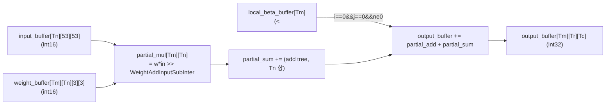
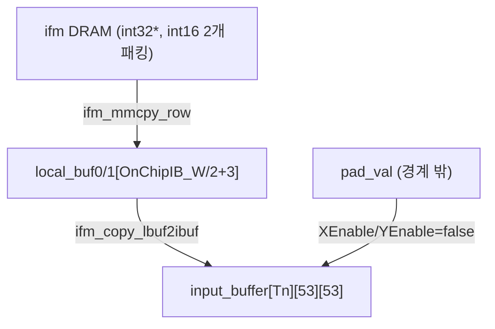
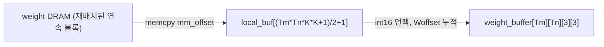
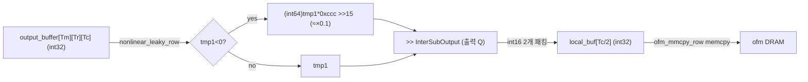
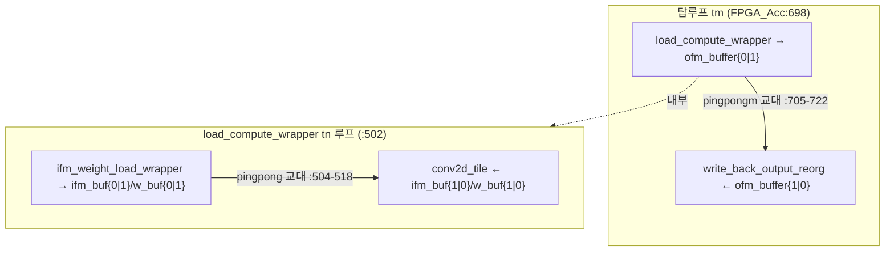
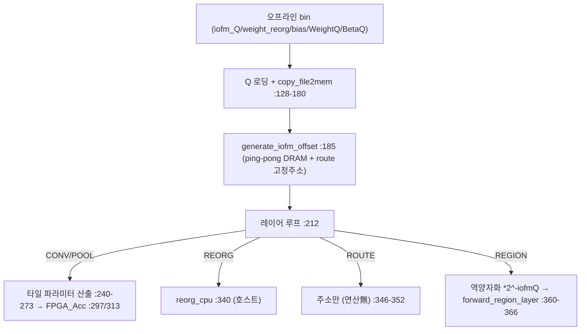

# yolov2_xilinx_fpga-flex 모듈 통합 가이드

> 1차 요약: [`../yolov2_xilinx_fpga-flex.md`](../yolov2_xilinx_fpga-flex.md) — 본 문서는 그 요약을 모듈 단위로 심화한 통합 가이드다.
> 분석 대상: `\\wsl.localhost\ubuntu-24.04\home\user\project\PRJXR-HBTXR\REF\CNN-Accel\yolov2_xilinx_fpga-flex`
> 작성 원칙: 실제 소스 Read 후 `파일:라인` 근거 표기. 라인 근거 없는 추론은 "추정", 코드로 확인 불가는 "확인 불가"로 명시.
> 형제 가이드 `REF/Analysis/CNN-Accel/ESDA/MODULE_GUIDE.md`와 동형(H-HLS) 구조.

---

## 0. 문서 머리말

### 0.1 대표 케이스 선정
- **대표 정밀도 버전: INT16 32bit 버스 (`hls/src_int16/`)** — 단일 HLS IP `FPGA_Acc`가 conv/maxpool을 layer-type 인자로 모두 처리하는 본류 설계. 파라미터 Tn=2/Tm=60/Tr=Tc=26/INTERWIDTH=19(`hw_params_gen.py:6-12`, `cnn_t.h:30-40` 주석, `SDK/src_int16/cnn.h:80-85`). MAC 엔진·3중 ping-pong·레이어별 동적 fixed-point가 모두 활성이라 분석 가치가 가장 높음.
- **대표 conv 레이어: Layer 0** — 첫 3×3 standard conv(IC=3→OC=32, 입력 416×416 stride1). 입력 패딩·ifm 로드·full MAC 경로가 등장하는 진입 레이어(`README.md:95,139`). scalar MAC = 416×416×32×3×3×3 = **149.6 M**.
- **대표 1×1 conv: Layer 13** — 1×1, IC=512→OC=256, 입력 26×26(`README.md:108,152`). 채널 누적·Tn 타일링이 두드러짐. scalar MAC = 26×26×256×512×1 = **88.6 M**.
- **대표 최대 conv: Layer 23/24** — 3×3, IC=1024→OC=1024, 입력 13×13(`README.md:118-119`). 단일 레이어 최대 부하. scalar MAC = 13×13×1024×1024×9 = **1.595 G** (= 3.190 BFLOPs, `README.md:118`).
- **대표 maxpool: Layer 1** — 2×2 /2, 416×416×32→208×208×32(`README.md:96`). Tn채널 병렬 윈도우 최대값.
- **대표 비-conv(호스트) 연산: Layer 27 reorg** — 26×26×64→13×13×256 space-to-depth, **호스트 CPU** 처리(`yolov2_acc_sim.h:323-345`).

### 0.2 수치 표기 규약
- **MAC lanes** = HLS 완전분할(`ARRAY_PARTITION complete`) 곱셈기 차원 = **Tm × Tn** (output-parallel Tm × input-parallel Tn). INT16 대표: 60×2 = **120 lanes**(`cnn_hls.cpp:403-405,419-437`). INT16 128b: Tm=24/Tn=8 → 24×8 = **192 lanes**(`acc_i16c.h:30-31`, `acc_i16c.cpp:490-535`). FT32: Tm=28~36/Tn=4(`README.md:66-67`).
- **DSP/MAC**: INT16 곱셈 1 DSP, 덧셈 LUT(`README.md:58`). FT32 곱셈 2 DSP, 덧셈 3 DSP(`README.md:58`). 따라서 INT16 lanes당 DSP ≈ Tm×Tn(곱셈만), FT32는 lanes×(2+가산트리 3).
- **scalar MACs(dense)** = 출력H × 출력W × Cout × Cin × Kh × Kw. YOLOv2 전체 = 29.472 GOP(`README.md:82`) = mult+add 합 → ≈ **14.74 G MAC**.
- **loop trips(conv2d_tile)** = `Ksize×Ksize × TR_MIN×TC_MIN × Tm`(`cnn_hls.cpp:409-419`), 내부 Tn은 완전분할(병렬). 외부 타일 루프 `⌈ofm_h/TR⌉×⌈ofm_w/TC⌉×⌈ofm_num/TM⌉ × ⌈ifm_num/TN⌉`(`cnn_hls.cpp:691-702,502`).
- **memory(payload bit)** = ping-pong 버퍼 깊이 × bit폭. INT16 on-chip: ifm_buffer `Tn×OnChipIB_H×OnChipIB_W × 16bit` ×2(`cnn_hls.cpp:475-478`), weight_buffer `Tm×Tn×K×K × 16bit` ×2(`:480-485`), ofm_buffer `Tm×Tr×Tc × 32bit` ×2(`:659-662`). OnChipIB_W/H = (Tc-1)×HW_S+K = (26-1)×2+3 = **53**(`cnn_t.h:39-40`).
- **타깃 데이터타입**: 활성/가중치/IO INT16(`int16_t`, 32bit 워드에 2개 패킹), psum/중간 INT32(`int32_t output_buffer`, `cnn_hls.cpp:378`), 중간폭 INTERWIDTH=19(`cnn_t.h:37`). 레이어별 fixed-point Q(WeightQ/InputQ/OutputQ/BetaQ)는 런타임 레지스터(`cnn_hls.cpp:580,651-653`).

### 0.3 운영 경로 (SDK/PetaLinux/PYNQ 멀티플로우)
```
[오프라인 PC]
 darknet (01_Extract, third-party) ──► weights.bin / bias.bin
      │
 02_ReorganizeWeight_Int16 (make gen_i16; ./test_layers)   (02.../README.md:6)
      │  타일 단위 연속 재배치 + float32→fixed16 양자화
      ▼  weight_reorg_ap16.bin, bias_ap16.bin, weights_ap16_Q.bin(WeightQ),
         bias_ap16_Q.bin(BetaQ), iofm_Q.bin, *_offset_add.bin
 hw_params_gen.py ──► cnn.h (Tn/Tm/Tr/Tc/INTERWIDTH #define를 cnn_t.h 템플릿에 치환)
      │
 Vivado HLS 2019.2 (target xazu3eg-sfvc784-1-i, clk 3ns)   (hls/README.md:4-6)
      │  C-sim만 통과 / C-RTL co-sim 미구현(testbench overflow)  (README.md:24)
      ▼  YOLOv2 IP → Vivado BD (Reset Active-Low, HP0/1/2 동시 write) → .bit + .hdf

[온보드 런타임 — 3가지 경로]
 (a) PetaLinux/베어메탈:  SDK/src_int16/  (/dev/mem mmap + AXI-Lite 레지스터)
 (b) PYNQ:               pynq/  Overlay("yolov2.bit") + yolov2.ipynb   (pynq/README.md:13)
 (c) (a)의 다른 정밀도:  SDK/src_int16_128b, SDK/src_float32{,_mp,_fusion}

[런타임 흐름 (a 기준, main.cpp:25-67)]
 이미지 → letterbox 416×416 → ×2^iofmQ[0] → DRAM in_ptr[0]
 for layer 0..30:
   CONV/POOL  → FPGA_Acc: ap_idle 폴링 → AXI-Lite 22개 레지스터 라이트 → Start → ap_done 폴링
   REORG/ROUTE/REGION → 호스트 CPU (reorg_cpu / 주소배치 / 역양자화+region 디코딩)
 → get_network_boxes → do_nms_sort → draw_detections → predictions.png
```
- 타깃 보드(평가): **EdgeBoard ZU3EG** (1.2GHz A53 4코어 + 4GiB DDR4 + FPGA, `README.md:62`). HLS 합성 타깃 디바이스 `xazu3eg-sfvc784-1-i`(`hls/README.md:4`). 실측 250MHz(`hls/README.md:6`, `SDK/src_int16/README.md:5`), 평가표는 190~200MHz(`README.md:78`).
- 물리 주소 맵(SDK): ACC_BASEADDR 0xA0000000, WEIGHT_BASEADDR 0x60000000, BETA_BASEADDR 0x66140000, MEM_BASEADDR 0x66180000(`SDK/src_int16/cnn.h:73-76`).

---

## 1. Repo / 모듈 개요

yolov2_xilinx_fpga-flex = YOLOv2(416×416×3, 31레이어, 29.472 GOP) 객체검출을 Xilinx Zynq에 가속하는 **풀스택 데모**. 단일 HLS IP(`FPGA_Acc`)가 conv/maxpool을 layer-type 인자로 처리하고, 레이어 스케줄링·reorg/route/region은 호스트 CPU가 담당. INT16/FT32 두 정밀도 × {32bit, 128bit, multiport, fusion} 변형이 병렬 디렉토리로 존재.

### 1.1 호출 계층 (INT16 대표, hls/src_int16)

```
[HW: HLS IP]                              [SW: 호스트]
FPGA_Acc (cnn_hls.cpp:578)                main (SDK/.../main.cpp:12)
  ├ copy_beta (:546)                        └ yolov2_hls_ps (yolov2_acc_sim.h:117)
  └ 탑 타일루프 tr/tc/tm (:691-724)              ├ generate_iofm_offset (:36)  ← ping-pong DRAM
      ├ load_compute_wrapper (:471)            ├ reorg_cpu (:97)             ← space-to-depth
      │   ├ ifm_weight_load_wrapper (:443)     ├ Q 로딩 (iofm/weight/bias) (:128-180)
      │   │   ├ input_load (:68)               └ 레이어별 FPGA_Acc 호출 (:212-371)
      │   │   │   ├ ifm_mmcpy_row (:4)               └ FPGA_Acc (SDK/.../cnn.cpp:110)
      │   │   │   └ ifm_copy_lbuf2ibuf (:26)              ├ /dev/mem mmap (:120-123)
      │   │   ├ weight_load_reorg (:111)                 ├ ap_idle 폴링 (:130-135)
      │   │   ├ conv2d_tile (:378)  ★MAC 엔진             ├ WriteReg ×22 (:143-178)
      │   │   │   └ copy_local_beta (:363)               ├ AP_CTRL=0x1 Start (:181)
      │   │   └ maxpool_tile (:326)                       └ ap_done 폴링 (:182-187)
      └ write_back_output_reorg (:243)
          ├ nonlinear_leaky_row (:164)  ← leaky + >>OutputQ
          └ ofm_mmcpy_row (:226)
```

### 1.2 디렉토리/변형 맵 (자체 소스)

| 구분 | 디렉토리 | 핵심 파일 | 비고 |
|---|---|---|---|
| **HLS INT16 (대표)** | `hls/src_int16` | `cnn_hls.cpp`, `cnn_t.h` | 단일 IP, 32bit 버스, Tn2/Tm60 |
| HLS INT16 128b | `hls/src_int16_128b` | `acc_i16c.cpp`, `acc_i16c.h` | 128bit 버스 + LANE_NUM=8 SIMD, Tn8/Tm24 |
| HLS FT32 | `hls/src_float32` | `cnn.cpp`, `cnn_template.h` | float 누산, II=3 |
| HLS FT32 멀티포트 | `hls/src_float32_mp` | `cnn.cpp` | 4r2w 포트 |
| HLS FT32 fusion | `hls/src_float32_fusion` | `cnn.cpp` | layer-fusion |
| **SDK 호스트 INT16** | `SDK/src_int16` | `cnn.cpp`, `yolov2_acc_sim.h`, `yolov2.h`, `main.cpp` | /dev/mem + AXI-Lite |
| SDK 호스트 (각 변형) | `SDK/src_int16_128b`, `SDK/src_float32*` | 동상 | HLS 버전 대응 |
| **가중치 재배치/양자화** | `software_version/02_ReorganizeWeight_Int16` | `Makefile`, `hw_params_gen.py` | float32→fixed16 + 재배치 |
| 파라미터 생성 (FT32) | `software_version/02_ReorganizeWeight_Float32{,_4r2w}` | `hw_params_gen.py` | |
| PYNQ 흐름 | `pynq` | `yolov2.ipynb`, `softmax.c` | Overlay 추상화 |
| 빌드 가이드 | `petalinux`, `vivado`, `hls`, `SDK` | `README.md` | |

### 1.3 제외 목록 (이름만 언급, 분석 제외)
- **third-party**: `software_version/01_ExtractWeightAndBiasFromDarknet/darknet/`(pjreddie darknet 원본 — `src/*.c`, `examples/*.c`, `python/*.py`, `scripts/*.py`, `include/darknet.h`). 가중치 추출만 담당, README(`01.../README.md`)만 참조.
- **이미지 IO**: 모든 `hls/src_*/`·`SDK/src_*/`의 `stb_image.h`, `stb_image_write.h`(stb 라이브러리).
- **생성물(런타임 로드 대상)**: `weight_reorg_ap16.bin`, `bias_ap16.bin`, `iofm_Q.bin`, `weights_ap16_Q.bin`, `bias_ap16_Q.bin`, `*_offset_add.bin`, `cnn.h`/`acc_*.h`(hw_params_gen.py 산출), `pynq/yolov2.bit`/`*.hwh`/`*.tcl`/`*.so`/`*.weights`, 결과 이미지(`*.jpg`/`*.png`), `.Xil`.
- **확인 불가(파일 부재)**: darknet 측 `AddThisCodeSegmentToParse.c`가 가리키는 BN-흡수 weight load 패치의 실제 적용본, 그리고 02 폴더의 `test_layers` C 소스 양자화 수치 로직 — Glob 인벤토리에 `02_ReorganizeWeight_Int16`의 `.c` 소스가 잡히지 않음(Makefile만 확인). **양자화 수식의 비트-정확 구현은 본 repo에서 확인 불가**(README 설명만, `02.../README.md:1-8`).

---

## 2. 모듈: Tm×Tn MAC 엔진 — `conv2d_tile` (★ 가속기 핵심)

### 2.1 역할 + 상위/하위
- **역할**: on-chip 타일 단위 convolution MAC. 입력타일 버퍼와 가중치 버퍼를 받아 출력타일 버퍼에 누산. Tm×Tn 곱셈기를 완전분할로 병렬화하고 add-tree로 합산, II=1 파이프라인.
- **상위**: `load_compute_wrapper`(`cnn_hls.cpp:508,515`)가 ping-pong 버퍼와 함께 호출. **하위**: `copy_local_beta`(`:363`, bias 초기화) 한 개만.
- 위치: `cnn_hls.cpp:378-441`.

### 2.2 데이터플로우


### 2.3 Function call stack
`FPGA_Acc`(`:578`) → 탑루프(`:698`) → `load_compute_wrapper`(`:471`) → 내부 tn ping-pong 루프(`:502`) → `conv2d_tile`(`:508`/`:515`). bias-only 호출(`enable=false`)이면 `copy_local_beta`만 수행 후 리턴(`:386-390`).

### 2.4 대표 코드 위치
`hls/src_int16/cnn_hls.cpp`: 함수 `:378-441`, MAC `:430`, add-tree `:434-437`, 누산 `:438`, II=1 `:418`, DEPENDENCE `:421`, bias init `:423-424`, partial_mul 완전분할 `:404-405`.

### 2.5 대표 코드 블록
```cpp
for(tr ...) for(tc ...) {                         // cnn_hls.cpp:413-417
#pragma HLS PIPELINE II=1                          // :418
  for(tm = 0;tm < Tm;tm++) {
#pragma HLS DEPENDENCE variable=output_buffer inter false   // :421
    if(i==0&&j==0&&ne0) partial_add[tm] = local_beta_buffer[tm]; // :423-424 (bias seed)
    else                partial_add[tm] = output_buffer[tm][tr][tc];
    for(tn = 0;tn <Tn;tn++)                         // 완전분할 → Tn 병렬 곱셈
      partial_mul[tm][tn] = weight_buffer[tm][tn][i][j]
            * input_buffer[tn][Kstride*tr+i][Kstride*tc+j] >> WeightAddInputSubInter; // :430
    int32_t partial_sum = 0;
    for(tn = 0;tn <Tn;tn++) partial_sum += partial_mul[tm][tn];  // :434-437 add tree
    output_buffer[tm][tr][tc] = (partial_add[tm] + partial_sum); // :438
  }
}
```
→ **곱 직후 우시프트** `>> WeightAddInputSubInter`로 INT32 중간폭(INTERWIDTH=19) 정렬 — 레이어별 fixed-point 스케일 정렬의 핵심. `DEPENDENCE inter false`가 output_buffer 누산 의존성을 완화해 II=1 달성(README Q&A는 이 pragma가 버전별 stall/오출력 원인일 수 있다 경고 — `README.md:9-13`).

### 2.6 마이크로아키텍처
- **MAC lanes** = Tm×Tn = 60×2 = **120** 곱셈기(완전분할 `:404-405`). INT16이므로 ≈120 DSP가 곱셈에 직접 매핑(`README.md:58`), 가산트리는 LUT.
- **scalar MAC(대표 conv)**: Layer 0 = 149.6 M, Layer 13 = 88.6 M, Layer 23/24 = 1.595 G 각. 전체 14.74 G MAC.
- **loop trips**: 내부 파이프 `K×K × TR_MIN×TC_MIN × Tm` = 9 × 26×26 × 60 ≈ **365K** iter/타일(II=1 → ≈365K cycle). 외부 타일루프가 `⌈ofm_num/Tm⌉ × ⌈ifm_num/Tn⌉ × ⌈ofm_h/Tr⌉ × ⌈ofm_w/Tc⌉`회 반복.
- **memory**: `partial_mul[Tm][Tn]` = 60×2 레지스터(완전분할 양차원 `:404-405`), `local_beta_buffer[Tm]` = 60 레지스터(`:383-384`).
- **병목**: Tn=2가 작아(채널 병렬 한정) ifm_num이 큰 레이어(1024ch)에서 외부 tn 루프 반복이 많음. 128b 변형이 Tn=8로 확장해 이를 보완(2.7절 동형 변형). DEPENDENCE pragma 안정성이 합성 버전 민감(`README.md:10`).

### 2.7 변형: INT16 128b SIMD MAC — `acc_i16c.cpp:477-541`
- **LANE_NUM=8 SIMD**: 버퍼가 `[T*/LANE_NUM][...][LANE_NUM]` 3차원(`acc_i16c.cpp:477-479`, `acc_i16c.h:52-53`), 인덱싱 `weight[tm/LANE_NUM][tn][i][j][tm%LANE_NUM]`·`input[tn/LANE_NUM][...][tn%LANE_NUM]`(`:519-520`) — 128bit(=16b×8) 1트랜잭션에 8채널 적재.
- **Tn=8/Tm=24** → lanes = 24×8 = **192**(`acc_i16c.h:30-31`).
- **가변 시프트**: `C_SL_EN`이면 `<< ComQ`(좌), 아니면 `>> ComQ`(우)(`:523-526`) — src_int16의 우시프트 전용보다 유연(좌/우 모두).
- 평가표 C/D(`README.md:68-69`): Tn8/Tm24, II_CONV=1, 128/128bit 버스, **62.0~62.8 GOP/s** — 버스폭(32→128) + Tn(2→8) 확대로 처리량 향상.

### 2.8 변형: FT32 MAC — `cnn.cpp(float32):248-304`
- 동일 골격이나 `float partial_mul/partial_add`(`:264-268`), 시프트 없는 부동소수 곱(`:292`), **II=3**(`:279` — README 표 II_CONV=3 일치, `README.md:66`). FT32 곱 2DSP/가산 3DSP라 자원·II 모두 INT16보다 불리.

---

## 3. 모듈: 입력 로드 + 패딩 (line buffer 격) — `input_load`

### 3.1 역할 + 상위/하위
- **역할**: DRAM ifm를 on-chip `input_buffer[Tn][53][53]`로 옮기되 행 단위 ping-pong memcpy + 경계 패딩. ESDA의 line buffer 대응(여기선 토큰 없이 dense 타일 윈도우).
- **상위**: `ifm_weight_load_wrapper`(`:467`). **하위**: `ifm_mmcpy_row`(`:4`, DRAM→local), `ifm_copy_lbuf2ibuf`(`:26`, local→on-chip+패딩).
- 위치: `cnn_hls.cpp:68-109`.

### 3.2 데이터플로우


### 3.3 Function call stack
`load_compute_wrapper`(`:471`) → `ifm_weight_load_wrapper`(`:443`) → `input_load`(`:467`) → 행루프 ping-pong(`:86-107`): `ifm_mmcpy_row`(row t를 local_buf로) + `ifm_copy_lbuf2ibuf`(직전 row t-1를 input_buffer로) 교대.

### 3.4 대표 코드 위치
`cnn_hls.cpp`: `input_load:68-109`, ping-pong 교대 `:89-99`, `ifm_mmcpy_row:4-24`(memcpy `:19`), `ifm_copy_lbuf2ibuf:26-66`(패딩 `:49-54`, int16 언팩 `:41-42,59-60`).

### 3.5 대표 코드 블록
```cpp
for(t = 0;t < TnxTRow+1; t++){               // cnn_hls.cpp:86 (행 + 1 파이프 지연)
  if(pp){
    ifm_mmcpy_row(input, local_buf0, ..., t!=TnxTRow);   // 현재 행 DRAM read
    ifm_copy_lbuf2ibuf(input_buffer, local_buf1, ..., t!=0); // 직전 행 on-chip write
    pp = false;
  } else { /* local_buf1 read, local_buf0 write */ }      // :94-99
}
```
```cpp
if(XEnable&&PEnable) input_buffer[t1][t2][t3] = buf_256b[bn_local]; // :49-51
else                 input_buffer[t1][t2][t3] = pad_val;            // :53-54
```
→ **행 단위 ping-pong**(local_buf0/1)로 DRAM read와 on-chip write를 1행 오버랩. 경계(`xoffset/yoffset` 범위 밖)는 `pad_val`로 채움.

### 3.6 마이크로아키텍처
- **memory**: `local_buf0/1[OnChipIB_Width/2+3]` = 약 29 워드(=53/2+3) × 32bit ×2(`:72-73`). `input_buffer[Tn][53][53]`(상위 `load_compute_wrapper`에서 ×2 ping-pong, `:475-478`).
- **256bit 정렬**: int32 포인터로 int16 2개를 한 워드에 패킹(`buf_256b[2]`, `:39-42`). ifm 폭을 짝수 정렬(`IW_align_256b`, `:665-667`).
- **loop trips**: `Tn×TRow+1`회(`:86`), 내부 `ifm_copy_lbuf2ibuf`가 `TCol`(≈53) II=1(`:43-46`).
- **병목**: memcpy 기반이라 burst 길이가 행 길이(TCol)에 제한. ESDA 같은 zero-skip 없음(dense) — 0 픽셀도 모두 로드.

---

## 4. 모듈: 가중치 로드 (타일 재배치 언팩) — `weight_load_reorg`

### 4.1 역할 + 상위/하위
- **역할**: 오프라인에서 타일 단위 연속 블록으로 재배치된 가중치를 DRAM에서 memcpy 후 `weight_buffer[Tm][Tn][K][K]`로 언팩. burst 대역폭 극대화(`README.md:44-45`).
- **상위**: `ifm_weight_load_wrapper`(`:468`). **하위**: 없음.
- 위치: `cnn_hls.cpp:111-162`.

### 4.2 데이터플로우


### 4.3 Function call stack
`load_compute_wrapper`(`:471`) → `ifm_weight_load_wrapper`(`:468`, `LoadBias`로 enable 게이팅) → `weight_load_reorg`(`:111`). Woffset은 static으로 m==0&&n==0에 리셋(`:124-125`), 타일마다 누적(`:130`).

### 4.4 대표 코드 위치
`cnn_hls.cpp`: `:111-162`, memcpy `:129`, Woffset 누적 `:130`, 언팩 루프 `:138-161`(II=1 `:145`), TM/TN 경계 제로패딩 `:159-160`.

### 4.5 대표 코드 블록
```cpp
uint16_t mm_offset = (TM_MIN*TN_MIN*KxK+1) >> 1;            // cnn_hls.cpp:127
memcpy(local_buf, (int32_t *)(Weight + Woffset), mm_offset*sizeof(int32_t)); // :129
Woffset += mm_offset;                                        // :130
...
weight_buffer[t1][t2][t3][t4] = buf_256b[cnt];               // :149 (유효 타일)
else weight_buffer[t1][t2][t3][t4] = 0;                      // :160 (경계 0패딩)
```
→ 타일당 필요한 `TM_MIN×TN_MIN×K×K` 가중치를 한 번에 burst memcpy(연속 배치 덕분), 그 후 `[Tm][Tn][K][K]`로 펼침. TM_MIN/TN_MIN보다 큰 인덱스는 0.

### 4.6 마이크로아키텍처
- **memory**: `local_buf[(Tm*Tn*K*K+1)/2+1]` = (60×2×9+1)/2+1 ≈ 541 워드(`:117`). `weight_buffer[Tm][Tn][K][K]` 완전분할 dim1,2(`:480-485`, 상위 ×2 ping-pong).
- **loop trips**: `K×K×Tm×Tn` = 9×60×2 = 1080 (II=1 `:145`).
- **병목**: AXI weight 포트(`DATA_BUS1`, `max_read_burst_length=128`, `cnn_hls.cpp:584`)가 ifm/ofm(`DATA_BUS`)와 별도 번들 → 동시 read 가능. 재배치가 오프라인 의존(런타임 변경 불가).

---

## 5. 모듈: LeakyReLU + 출력 양자화 — `nonlinear_leaky_row` / `write_back_output_reorg`

### 5.1 역할 + 상위/하위
- **역할**: conv 누산 결과(int32 output_buffer)에 LeakyReLU 적용 후 `>> InterSubOutput`로 출력 Q 양자화 → int16 2개를 32bit 워드에 패킹해 DRAM write. ofm write vs compute ping-pong의 write 측.
- **상위**: `FPGA_Acc` 탑루프(`:711,720`). **하위**: `nonlinear_leaky_row`(`:164`, leaky+양자화), `ofm_mmcpy_row`(`:226`, DRAM write).
- 위치: `write_back_output_reorg:243-285`, `nonlinear_leaky_row:164-224`.

### 5.2 데이터플로우


### 5.3 Function call stack
`FPGA_Acc` 탑루프(`:705-723`) → `write_back_output_reorg`(`:711`/`:720`, `write_flag`로 게이팅) → 행 ping-pong(`:263-283`): `nonlinear_leaky_row`(int32→int16 row) + `ofm_mmcpy_row`(직전 row write) 교대.

### 5.4 대표 코드 위치
`cnn_hls.cpp`: leaky `:190-194`, conv 양자화 `:198-201`, int16 패킹 `:206-214`, 행 ping-pong `:265-275`, `ofm_mmcpy_row` memcpy `:239`.

### 5.5 대표 코드 블록
```cpp
if(tmp1 < 0) tmp_out = ((int64_t)tmp1*0xccc)>>15;   // cnn_hls.cpp:191  0xccc/2^15 ≈ 0.09997 (leaky 0.1)
else         tmp_out = tmp1;
if(ltype==LT_CONV) tmp_int16 = tmp_out >> InterSubOutput; // :200  출력 Q 우시프트
else               tmp_int16 = tmp_out;                   // :204  (maxpool은 그대로)
...
local_buf[cnt] = ((buf_256b[1] << 16) & 0xFFFF0000)|(buf_256b[0] & 0x0000FFFF); // :212 패킹
```
→ leaky 계수는 **고정소수 0xccc>>15 ≈ 0.1**(곱셈 1회로 leaky). conv만 출력 양자화 우시프트, maxpool은 입력 Q 유지(스케일 불변).

### 5.6 마이크로아키텍처
- **memory**: `local_buf0/1[Tc/2]` = 13 워드 ×2 ping-pong(`:254-255`).
- **loop trips**: `nonlinear_leaky_row`가 `TC_MIN`(≤26) II=1(`:182-185`), 행 외부 `TM_MIN×TR_MIN+1`(`:263`).
- **고정소수 스케일 수식**(`FPGA_Acc:651-653`): `InterSubBeta = INTERWIDTH - BetaQ`, `WeightAddInputSubInter = WeightQ + InputQ - INTERWIDTH`, `InterSubOutput = INTERWIDTH - OutputQ`. 세 시프트량 모두 런타임 레지스터 Q값에서 계산 → **레이어별 동적 fixed-point**.
- **병목**: leaky가 int64 곱(`:191`)이라 DSP 추가 가능(추정). write burst가 TC_MIN(≤26 워드)로 짧음.

---

## 6. 모듈: MaxPool — `maxpool_tile`

### 6.1 역할 + 상위/하위
- **역할**: Tn채널 병렬로 윈도우 최대값. conv 엔진과 동일 IP에서 layer-type=LT_MAXPOOL일 때 활성.
- **상위**: `load_compute_wrapper`(`:526,536`). **하위**: 없음.
- 위치: `cnn_hls.cpp:326-361`(활성본; `:287-324`는 주석처리된 구버전).

### 6.2 대표 코드 위치 / 코드 블록
`cnn_hls.cpp:326-361`. 루프 순서 `tr/tc → i,j(커널) → of(Tn 병렬)`(`:336-346`).
```cpp
for(of = 0; of < Tn; of++){                       // cnn_hls.cpp:346 (채널 병렬)
  if(i==0&&j==0) tmp[of] = MIN_NEG;               // :348-349  초기값 0x8001
  int16_t tmp_in = Input[of][tr*Kstride+i][tc*Kstride+j];  // :351
  if(tmp_in > tmp[of]) tmp[of] = tmp_in;          // :353-354
  if(i==K_1&&j==K_1) Output[of][tr][tc] = tmp[of];// :356-357  윈도우 끝에 write
}
```

### 6.3 마이크로아키텍처
- **MAC lanes 해당없음**(비교 연산). 병렬도 = Tn(`tmp[Tn]` 완전분할 `:333-334`). 스케줄러는 maxpool에 TN=0, TM=min(TM,TN)으로 설정(`yolov2_acc_sim.h:249-251`).
- **초기값**: `MIN_NEG=0x8001`(int16 최소 근처, `cnn_t.h:25`).
- **loop trips**: `TR_MIN×TC_MIN×K×K`, 내부 Tn 병렬 II=1(`:345`). README II_POOL=2~3(`:66-69`).
- **scalar 비교**: Layer 1 = 208×208×32×4 = 5.5 M 비교(`README.md:96`).

---

## 7. 모듈: 3중 ping-pong 오케스트레이션 — `load_compute_wrapper` + `FPGA_Acc` 탑루프

### 7.1 역할 + 상위/하위
- **역할**: 세 종류 오버랩을 동시에 운용 — ① ifm/weight 로드 ↔ compute(내부 tn 루프 ping-pong), ② ofm write ↔ compute(탑루프 m 루프 ping-pong). README "ping-pong operation"(`README.md:50-51`)의 실제 구현.
- **상위**: `FPGA_Acc`(`:578`). **하위**: `ifm_weight_load_wrapper`, `conv2d_tile`, `maxpool_tile`, `write_back_output_reorg`.
- 위치: `load_compute_wrapper:471-544`, 탑루프 `:691-726`.

### 7.2 데이터플로우


### 7.3 대표 코드 블록
```cpp
// 내부 ifm/weight 로드 ↔ compute ping-pong (cnn_hls.cpp:502-518)
for(int tn = 0; tn < ifm_num+TN; tn += TN){
  if(pingpong){
    ifm_weight_load_wrapper(..., ifm_buffer1, weight_buffer1, ...);  // 로드 buf1
    conv2d_tile(ifm_buffer0, ofm_buffer, weight_buffer0, ...);       // 연산 buf0
  } else { /* 반대 */ }
}
```
```cpp
// 탑루프 ofm write ↔ compute ping-pong (cnn_hls.cpp:705-722)
if(!pingpongm){
  load_compute_wrapper(..., ofm_buffer1, ...);                  // 연산 buf1
  write_back_output_reorg(ofm_buffer0, ofm, ...);              // write buf0
  pingpongm = true;
} else { /* 반대 */ }
```

### 7.4 마이크로아키텍처
- **memory(ping-pong 버퍼 총합, INT16 대표)**:
  - ifm_buffer0/1 = Tn×53×53 × 16bit × 2 = 2×53×53×16×2 = **180 Kbit**(`:475-478`).
  - weight_buffer0/1 = Tm×Tn×K×K × 16bit × 2 = 60×2×9×16×2 = **35 Kbit**(`:480-485`).
  - ofm_buffer0/1 = Tm×Tr×Tc × 32bit × 2 = 60×26×26×32×2 = **2.6 Mbit**(`:659-662`) — 최대 BRAM 소비처.
  - bias_buffer = MAX_BETA_LENGTH × 16bit = 1024×16 = 16 Kbit(`:663`).
- **타일 경계 계산**(스케줄러): `OFM_num_bound`/`mLoopsxTM`/`mLoops_a1xTM`로 입력·연산·출력 단의 파이프 깊이 정렬(`yolov2_acc_sim.h:254-257`, `FPGA_Acc:698-703`). conv은 `(mLoops+1)*TM`, 비-conv은 `(mLoops+2)*TM`(`yolov2_acc_sim.h:255`).
- **병목**: ofm_buffer가 2.6Mbit로 BRAM 압박(`README.md` 표 BRAM 41~50%). Tn=2가 작아 tn ping-pong 반복이 ifm_num/2회 — 1024ch에서 512 반복.

---

## 8. 모듈: top IP 인터페이스 — `FPGA_Acc` (HLS) + AXI-Lite 레지스터 맵

### 8.1 역할 + 상위/하위
- **역할(HLS)**: 단일 IP 탑 함수. 4 AXI master(ifm/ofm/weight/bias) + 1 AXI-Lite(CTRL_BUS). 32bit 레지스터에 다중 필드 비트필드 패킹으로 레지스터 수 절감.
- 위치: `cnn_hls.cpp:578-727`. 인터페이스 pragma `:582-612`, 비트필드 언팩 `:614-634`.

### 8.2 AXI master 번들
```cpp
#pragma HLS INTERFACE m_axi ... port=ifm    bundle=DATA_BUS  max_read_burst_length=64 max_write_burst_length=64  // :582
#pragma HLS INTERFACE m_axi ... port=ofm    bundle=DATA_BUS  ...                                                  // :583
#pragma HLS INTERFACE m_axi ... port=weight bundle=DATA_BUS1 max_read_burst_length=128                            // :584
#pragma HLS INTERFACE m_axi ... port=bias   bundle=DATA_BUS1 max_read_burst_length=128                            // :585
```
→ ifm/ofm는 `DATA_BUS`(공유), weight/bias는 `DATA_BUS1`(별도) — README의 "ifm·weight 동시 read"(`README.md:41`) 실현. Vivado BD에서 HP0/1/2에 매핑(`README.md:26`).

### 8.3 비트필드 파라미터 패킹 (AXI-Lite 절감)
| 패킹 레지스터 | 필드 | 근거 |
|---|---|---|
| `k_s_pad_ltype` | ksize<<24 \| kstride<<16 \| pad<<8 \| ltype | `cnn_hls.cpp:624-627`, `yolov2_acc_sim.h:269` |
| `iofm_num` | ifm_num<<16 \| ofm_num | `:622-623` |
| `ifm_w_h`/`ofm_w_h` | w<<16 \| h | `:614-617` |
| `TRTC`/`TMTN` | TR<<16\|TC, TM<<16\|TN | `:618-621` |
| `TRowTCol` | TRow<<16 \| TCol | `:628-629` |
| `KK_INumxKK` | KK<<24 \| INumxKK(24b) | `:630-631` |
| `en_bits` | {IsReLU, LoadBias, IsNotConv} (bit2..0) | `:632-634` |

→ 총 22개 AXI-Lite 레지스터(0x10~0xc0, `SDK/src_int16/cnn.h:21-66`). Q값(WeightQ/BetaQ/InputQ/OutputQ)은 별도 레지스터(`:59-66`).

### 8.4 마이크로아키텍처
- **타깃**: `xazu3eg-sfvc784-1-i`, clk 3ns(추정 3.0ns/250MHz 실행, `hls/README.md:4-6`). 합성 PPA: **C-sim만 통과, C-RTL co-sim 미구현**(testbench overflow, `README.md:24`, `hls/README.md:9`) → **RTL PPA 리포트 확인 불가**. README 평가표(`:64-69`)는 P&R 후 실측: INT16 128b(Design D) 253 DSP(70%)/90 BRAM(42%)/51296 LUT(73%)/27005 FF(19%), 190MHz.
- **assert 한계**: ofm/ifm_num≤2048, kstride≤HW_S(2), ksize<8, w/h≤2048(`:636-648`) — 입력 크기 상한.

---

## 9. 모듈: SDK 호스트 레이어 스케줄러 — `yolov2_hls_ps` (★ 가장 중요한 호스트 로직)

### 9.1 역할 + 상위/하위
- **역할**: 31레이어를 순회하며 conv/pool은 FPGA_Acc 호출, reorg/route/region은 호스트 CPU 수행. 타일 파라미터 산출 + 레이어별 동적 Q 전달 + ping-pong DRAM 주소 배치.
- **상위**: `main`(`SDK/.../main.cpp:46`). **하위**: `generate_iofm_offset`(`:36`), `reorg_cpu`(`:97`), `FPGA_Acc`(`cnn.cpp:110`), `forward_region_layer`(`yolov2.h`).
- 위치: `SDK/src_int16/yolov2_acc_sim.h:117-382`.

### 9.2 데이터플로우


### 9.3 대표 코드 위치
`yolov2_acc_sim.h`: weight/beta offset 하드코딩 `:119-124`, Q 로딩 `:128-180`(route 공유 20/21 통일 `:136-139`), `generate_iofm_offset:36-95`, 타일 산출 `:240-257`, en_bits 패킹 `:275-289`, FPGA_Acc 호출 `:297-299`(CONV)/`:313-315`(MAXPOOL), reorg `:323-345`, region `:353-368`.

### 9.4 대표 코드 블록 — 타일 파라미터 + 동적 Q
```cpp
TR = MIN_diy(((OnChipIB_Height-kernel_size)/kernel_stride+1),Tr);  // yolov2_acc_sim.h:240
TR = MIN_diy(ofm_h,TR); ... TM = MIN_diy(ofm_num,Tm); TN = MIN_diy(ifm_num,Tn); // :241-245
if(ltype != LT_CONV){ TM = MIN_diy(TM,TN); TN = 0; }              // :249-251 maxpool
...
FPGA_Acc(in_ptr[i], out_ptr[i], woffset, boffset, k_s_pad_ltype, ...,
   WeightQ[offset_index], BetaQ[offset_index], iofmQ[inputQ_idx], iofmQ[offset_index+1]); // :297-299
```
→ on-chip 버퍼 한계(OnChipIB)와 ofm 크기 min으로 타일 산출. **레이어별 WeightQ/BetaQ/InputQ/OutputQ**를 외부 bin에서 받아 FPGA_Acc에 전달 → 동적 fixed-point.

### 9.5 대표 코드 블록 — ping-pong DRAM + route 고정주소
```cpp
uint32_t Memory_top = Memory_buf; uint32_t Memory_bottom = Memory_top + MEM_LEN; // :42-43
if(x%2==0){ in_ptr[x]=Memory_top; out_ptr[x]=Memory_bottom - 출력크기; }          // :52-56 짝수
else      { in_ptr[x]=out_ptr[x-1]; out_ptr[x]=Memory_top; }                     // :57-61 홀수
in_ptr[26]=Memory_bottom - ROUTE16_LEN;                                          // :82 route용 고정
```
→ 짝/홀 레이어가 Memory_top/bottom을 교대(in-place 방지 더블버퍼), route(16,24,27) 출력은 `ROUTE16_LEN`/`CONV24_LEN`/`CONV27_LEN` 고정영역 예약(`:38-40,82-93`). README "routing layer는 미리 특정 주소 설정"(`README.md:36`)의 실체.

### 9.6 마이크로아키텍처 / 정량
- **HW/SW 분할**: conv(23개)·maxpool(5개) = FPGA; reorg(1)·route(2)·region(1) = 호스트 CPU(`:319-369`). reorg는 `reorg_cpu`(`:97-115`) darknet space-to-depth, region은 `*pow(2,-iofmQ)` 역양자화 후 `forward_region_layer`(`:360-366`).
- **하드코딩**: `weight_offset[32]`/`beta_offset[32]`(`:119-124`), `MEM_LEN`/`ROUTE16_LEN` 등(`:35-40`) — YOLOv2 31레이어 전용, 타 네트워크 이식 불가.
- **route 공유 Q 통일**: layer20/21이 같은 메모리 공유 → 작은 Q로 통일(`:136-139`).
- **병목**: reorg/region은 호스트라 latency 측정에서 제외(`README.md:87`). 호스트 reorg는 memcpy 다수(`:341-343`).

---

## 10. 모듈: SDK 호스트 FPGA 제어 — `FPGA_Acc` (베어메탈/PetaLinux)

### 10.1 역할 + 상위/하위
- **역할**: `/dev/mem` mmap으로 가속기 레지스터에 직접 접근, 폴링 기반 동기 호출. DRAM↔파일↔호스트 복사 유틸 포함.
- **상위**: `yolov2_hls_ps`(`:297,313`). **하위**: 없음(레지스터 R/W 매크로).
- 위치: `SDK/src_int16/cnn.cpp:110-196`. 복사 유틸 `copy_mem2dev:4`, `copy_dev2mem:27`, `copy_file2mem:50`, `copy_mem2file:79`.

### 10.2 대표 코드 블록
```cpp
xbase_address = mmap(NULL, 0x100, ..., fd, (off_t)ACC_BASEADDR);     // cnn.cpp:123
while(1){ ap_idle = (ReadReg(...,AP_CTRL)>>2)&0x1; if(ap_idle) break; } // :130-135 idle 대기
WriteReg(..., IFM_DATA, In_Address);                                  // :143
WriteReg(..., WEIGHT_DATA, WEIGHT_BASEADDR + Weight_offset*4);        // :145
WriteReg(..., WEIGHTQ_DATA, WeightQ); ... (22개 레지스터)              // :143-178
WriteReg(..., GIE, 0x0);                                              // :180 인터럽트 비활성
WriteReg(..., AP_CTRL, 0x1);                                          // :181 Start
while(1){ ap_done = (ReadReg(...,AP_CTRL)>>1)&0x1; if(ap_done) break; } // :182-187 done 폴링
```

### 10.3 마이크로아키텍처
- **흐름**: ap_idle 폴링 → 22 레지스터 WriteReg → Start → ap_done 폴링. **GIE=0 인터럽트 미사용**(`:180`) → 호스트 busy-wait.
- **주소**: weight/bias는 `WEIGHT_BASEADDR(0x60000000)`/`BETA_BASEADDR(0x66140000)` 고정영역 + offset×4(`:145-146`). ifm/ofm는 스케줄러 in_ptr/out_ptr.
- **복사 유틸**: HPAGESIZE(2MiB) 정렬 mmap(`cnn.h:107`), 파일→DRAM은 페이지 단위 루프(`:62-69`).
- **병목**: 폴링 동기 호출(레이어마다 idle/done 2회 폴링) — 호스트 CPU 점유. SDK는 hw_cfg 변경 시 수동 코드 수정(스크립트 없음, `SDK/src_int16/README.md:2`).

---

## 11. 모듈: 가중치 재배치/양자화 + 파라미터 생성 — `02_ReorganizeWeight_Int16`

### 11.1 역할 + 상위/하위
- **역할**: (a) darknet `weights.bin`/`bias.bin`을 타일 단위 연속 블록으로 재배치(burst 대역폭), (b) float32→fixed16 양자화. `hw_params_gen.py`는 HLS 병렬도 #define 헤더 생성.
- **상위**: 오프라인 빌드(`make gen_i16`). **하위**: `cnn_t.h` 템플릿.
- 위치: `software_version/02_ReorganizeWeight_Int16/{Makefile, hw_params_gen.py}`. **수치 양자화 C 소스(`test_layers`)는 인벤토리에 미포착 → 확인 불가**(README 설명만).

### 11.2 hw_params_gen.py — #define 치환기
```python
Tn = 2; Tm = 60; Tr = 26; Tc = 26; INTERWIDTH = 19           # hw_params_gen.py:6-12
OnChipIB_Width  = (Tc-1)*HW_S+K   # = 53                       # :13-14
head_define_str += "#define Tn " + str(Tn) + "\n" ...         # :17-27
... line.replace("#DEFINE_HEADER#", head_define_str) ...      # :34-40
# acc_f32_t.h→acc_f32.h(:31), acc_i16_t.h→acc_i16.h(:45), cnn_t.h→cnn.h(:59-60)
```
→ **하드웨어 병렬도(Tn/Tm/Tr/Tc/INTERWIDTH)를 한 곳에서 정의해 3개 템플릿에 주입**. 단순 토큰 치환 — 양자화 수치 로직 없음(확인됨).

### 11.3 마이크로아키텍처
- **재배치 원리**(`README.md:44-45`, `02.../README.md:1-8`): 타일 단위 가중치를 DRAM 연속 블록으로 정렬해 burst 길이↑ → 유효 대역폭↑. HW `weight_load_reorg`(`cnn_hls.cpp:127-130`)의 단순 memcpy가 이를 전제.
- **양자화**: float32→fixed16, 레이어별 Q(소수점 위치)를 `weights_ap16_Q.bin`/`bias_ap16_Q.bin`/`iofm_Q.bin`으로 출력(런타임 로드). bias는 수가 적어 계산 전 1회 로드(`02.../README.md:2`).
- **검증**: `make test_i16; ./test_layers`가 SW 포워드(forward_region_layer까지) 비교(`02.../README.md:8`). **단 C-RTL 골든은 없음**(HLS cosim 부재).

---

## 12. 모듈: PYNQ 흐름 — `pynq/`

### 12.1 역할 + 대표 코드
- **역할**: PetaLinux `/dev/mem` 대신 Python Overlay 추상화. `Overlay("yolov2.bit")` 적재 후 `yolov2.ipynb` 실행(`pynq/README.md:13`). 이미지 경로/비트스트림 교체 가능(`:8-14`).
- `softmax.c`: region softmax(over class), `.so`로 컴파일해 노트북에서 호출(a53_64bit 별도 .so). 위치 `pynq/softmax.c`.
- **병목 없음**(호스트 추상화 계층). `.ipynb`/`.bit`/`.so`는 생성물(제외).

---

## 13. 모듈 한눈 요약 표

| 모듈 | 파일 | 핵심 함수(라인) | 역할 | 대표 정량(INT16) |
|---|---|---|---|---|
| MAC 엔진 | hls/src_int16/cnn_hls.cpp | conv2d_tile(:378) | Tm×Tn MAC + add tree, II=1 | lanes=60×2=120, Layer0 149.6M MAC |
| ┗ 128b 변형 | hls/src_int16_128b/acc_i16c.cpp | conv2d_tile(:477) | LANE_NUM=8 SIMD | lanes=24×8=192, 62.8 GOP/s |
| ┗ FT32 변형 | hls/src_float32/cnn.cpp | conv2d_tile(:248) | float 누산, II=3 | 12.1 GOP/s |
| 입력 로드 | cnn_hls.cpp | input_load(:68) | DRAM→on-chip + 패딩 ping-pong | local_buf ×2, OnChipIB 53×53 |
| 가중치 로드 | cnn_hls.cpp | weight_load_reorg(:111) | 재배치 가중치 burst + 언팩 | trips K²×Tm×Tn=1080 |
| leaky+양자화 | cnn_hls.cpp | nonlinear_leaky_row(:164) | leaky 0xccc>>15 + >>OutputQ | int16 2개 패킹 |
| MaxPool | cnn_hls.cpp | maxpool_tile(:326) | Tn 병렬 최대값 | Layer1 5.5M 비교 |
| ping-pong | cnn_hls.cpp | load_compute_wrapper(:471) + 탑루프(:691) | 3중 오버랩 | ofm_buf ×2 = 2.6Mbit |
| top IP | cnn_hls.cpp | FPGA_Acc(:578) | 4 m_axi + AXI-Lite 22reg | 비트필드 패킹 |
| 스케줄러 | SDK/.../yolov2_acc_sim.h | yolov2_hls_ps(:117) | 31레이어 순회 + 동적 Q | weight/beta offset 하드코딩 |
| FPGA 제어 | SDK/.../cnn.cpp | FPGA_Acc(:110) | /dev/mem + 폴링 동기 | GIE=0, 22 WriteReg |
| 재배치/양자화 | 02_.../hw_params_gen.py | (#define 치환) | float32→fix16 + 헤더생성 | Tn2/Tm60/INTER19 |
| PYNQ | pynq/ | yolov2.ipynb | Overlay 추상화 | softmax.so |

---

## 14. 읽기 순서 / 코드 추적 순서

1. **파라미터 먼저**: `hw_params_gen.py:6-12`(Tn/Tm/Tr/Tc/INTERWIDTH) → `cnn_t.h`/`SDK/src_int16/cnn.h:78-105`(레지스터맵+base addr) → 설계 상수 직관.
2. **MAC 엔진 핵심**: `cnn_hls.cpp:378-441` conv2d_tile — MAC(:430)·add tree(:434-437)·II=1(:418)·DEPENDENCE(:421)가 가속의 본질.
3. **데이터 진입/배출**: `input_load:68`(패딩 ping-pong) → `weight_load_reorg:111`(재배치 언팩) → `nonlinear_leaky_row:164`(leaky+양자화).
4. **오버랩**: `load_compute_wrapper:471`(내부 ifm/weight↔compute) + `FPGA_Acc:691-726`(ofm↔compute) — 3중 ping-pong.
5. **top 인터페이스**: `FPGA_Acc:582-634`(m_axi 번들 + 비트필드 패킹).
6. **호스트 스케줄러**: `yolov2_acc_sim.h:117` yolov2_hls_ps — `generate_iofm_offset:36`(ping-pong DRAM), 타일 산출(:240), 동적 Q 전달(:297), reorg/region 호스트 분할(:319-369).
7. **FPGA 제어**: `SDK/.../cnn.cpp:110` — mmap + 폴링 + WriteReg 순서.
8. **변형 비교**: `acc_i16c.cpp:477`(128b SIMD) vs `cnn.cpp(f32):248`(II=3) — 정밀도/버스폭 trade-off.
9. **대표 수치 확인**: `README.md:64-69`(PPA 표), `README.md:95-126`(31레이어 shape).

---

## 15. 병목 후보 & 병렬도/정량 노브

### 15.1 병목 후보
1. **Tn=2(입력 병렬도) 작음**(`cnn_t.h:32`): 1024ch 레이어에서 내부 tn ping-pong 512회 반복. 128b 변형이 Tn=8로 4배 확대(`acc_i16c.h:30`)해 62 GOP/s 달성.
2. **DEPENDENCE inter false 안정성**(`cnn_hls.cpp:421`): II=1 달성 핵심이나 HLS 버전별 Layer0 stall/오출력 위험(`README.md:9-13`) — Vivado HLS 2019.2 권장.
3. **ofm_buffer 2.6Mbit**(`cnn_hls.cpp:659-662`): BRAM 최대 소비처(표 41~50%). Tm=60·int32 누산 때문.
4. **C-RTL co-sim 미구현**(`README.md:24`): RTL 검증 부재, C-sim만. INT16 c-sim도 너무 느려 미실행(`hls/README.md:15`).
5. **호스트 폴링 동기 호출**(`cnn.cpp:180-187`): GIE=0, 레이어마다 busy-wait → 호스트 CPU 점유.
6. **하드코딩 offset/route 길이**(`yolov2_acc_sim.h:119-124,35-40`): YOLOv2 31레이어 전용, 이식 불가.
7. **reorg/route/region 호스트 CPU**(`yolov2_acc_sim.h:319-369`): 가속 제외 구간, latency 측정서 제외(`README.md:87`).

### 15.2 병렬도/정량 노브
- **Tn/Tm/Tr/Tc**(`hw_params_gen.py:6-9`): 컴파일타임 #define. INT16 32b=2/60/26/26, INT16 128b=8/24/26/26, FT32=4/28~36/26/32(`README.md:66-69`). lanes=Tm×Tn.
- **II_CONV/II_POOL**(`README.md:11` "II=1,2,3 테스트"): INT16 II_CONV=1, FT32 II_CONV=3(`cnn.cpp(f32):279`).
- **버스폭**: 32bit(src_int16) vs 128bit(src_int16_128b) — DT_IO=ap_uint<16*LANE_NUM>(`acc_i16c.h:55`). 32→128 + Tn 확대로 12→62 GOP/s.
- **레이어별 동적 fixed-point**: WeightQ/InputQ/OutputQ/BetaQ를 런타임 레지스터로(`cnn_hls.cpp:580,651-653`, `yolov2_acc_sim.h:297-299`). INTERWIDTH=19 고정(`cnn_t.h:37`).
- **포트 구성**: A=[1+1,1](독립), B=[4&4,2](공유 4r2w), C/D=[1&1,1]/[1+1,1](`README.md:71-72`). DATA_BUS/DATA_BUS1 번들 분리(`cnn_hls.cpp:582-585`).
- **정밀도 trade-off**(`README.md:84-85`): FT32 12.1 GOP/s @ 5.8 GOP/s/W → INT16 128b 62.0 GOP/s @ 59.6 GOP/s/W (≈5배 처리량, ≈10배 전력효율).

---

*근거 파일(절대경로)*:
`\\wsl.localhost\ubuntu-24.04\home\user\project\PRJXR-HBTXR\REF\CNN-Accel\yolov2_xilinx_fpga-flex\hls\src_int16\{cnn_hls.cpp,cnn_t.h}`,
`...\hls\src_int16_128b\{acc_i16c.cpp,acc_i16c.h}`,
`...\hls\src_float32\cnn.cpp`,
`...\SDK\src_int16\{cnn.cpp,cnn.h,yolov2_acc_sim.h,main.cpp}`,
`...\software_version\02_ReorganizeWeight_Int16\{hw_params_gen.py,README.md}`,
`...\{README.md,hls\README.md,SDK\src_int16\README.md,pynq\README.md}`.
