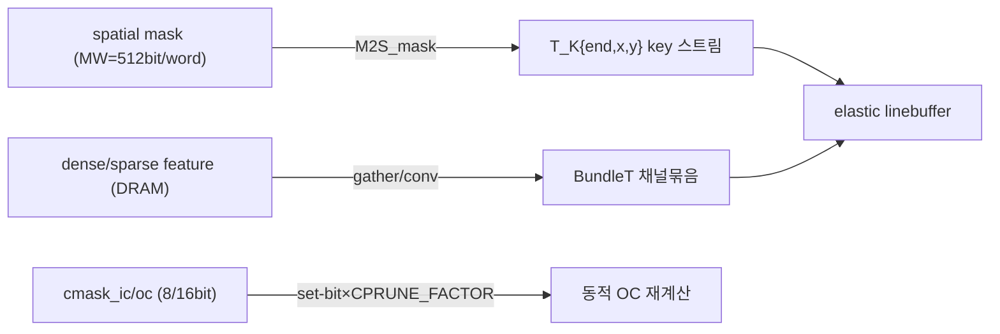
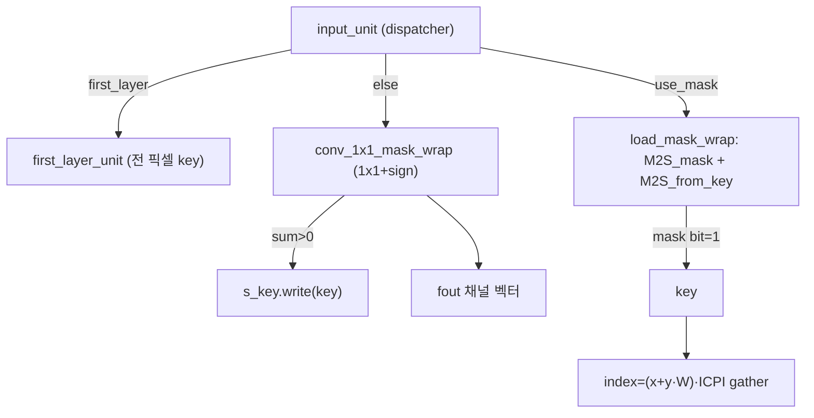
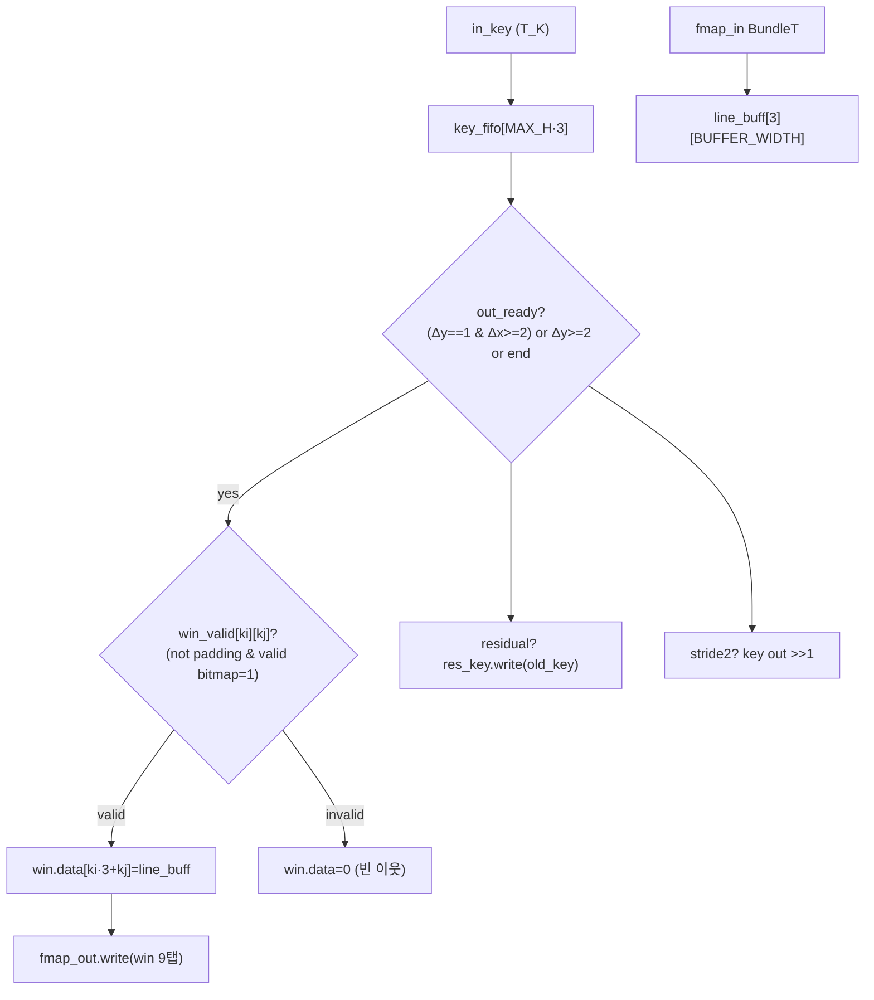
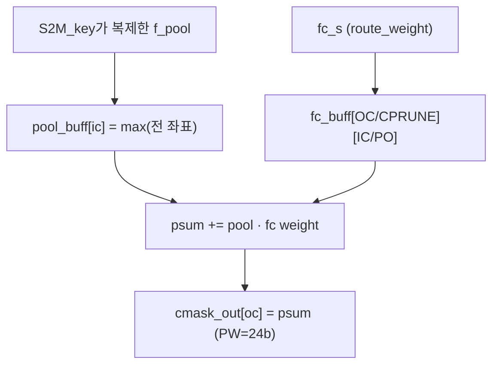
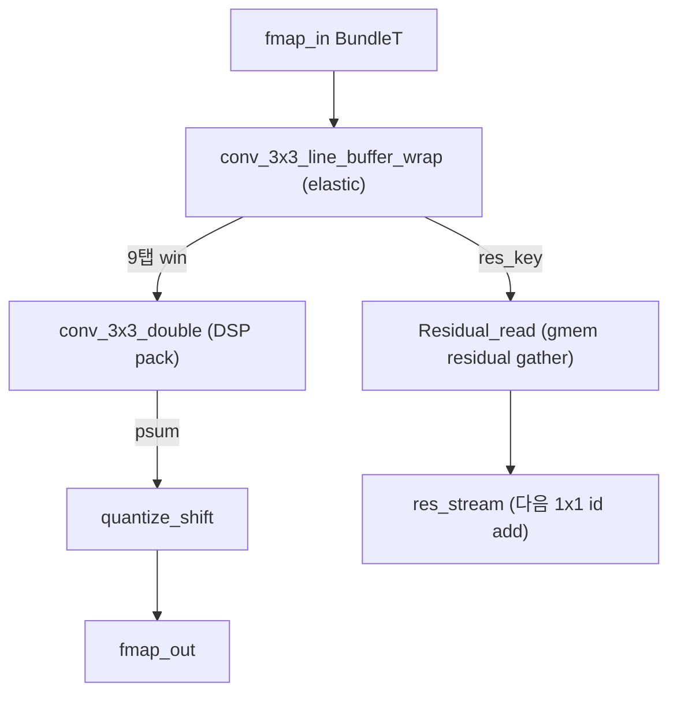
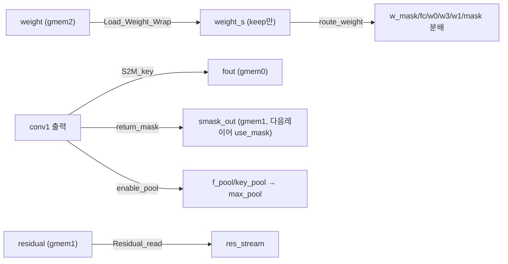

# DPACS 모듈 통합 가이드

> 1차 요약: [`../DPACS.md`](../DPACS.md) — 본 문서는 그 요약을 모듈 단위로 심화한 통합 가이드다.
> 분석 대상: `\\wsl.localhost\ubuntu-24.04\home\user\project\PRJXR-HBTXR\REF\Others\DPACS`
> 작성 원칙: 실제 소스 Read 후 `파일:라인` 근거 표기. 라인 근거 없는 추론은 "추정", 코드로 확인 불가는 "확인 불가"로 명시.
> 형제 가이드 동형: [`../../CNN-Accel/ESDA/MODULE_GUIDE.md`](../../CNN-Accel/ESDA/MODULE_GUIDE.md)와 같은 6요소(역할/데이터플로우/콜스택/코드위치/코드블록/마이크로아키텍처) 구조.

---

## 0. 문서 머리말

### 0.1 대표 케이스 선정
- **대표 변형: `resnet_bottleneck/sparse/resnet_bottleneck_sparse_parallel`** (ResNet-50/101 bottleneck, sparse, parallel PE). 근거: `hardware/README.md:26`(bottleneck=resnet50/101), `software/README.md:73`(대표 평가 cfg `s75_c75` ResolutionMask). 이 변형이 sparse 3대 핵심(spatial mask 생성 `mask.h`, elastic linebuffer `linebuffer.h`, channel pruning `c_prune.h`)을 모두 포함하고 DSP 2-MAC 패킹(`conv.h:1-8`)이 활성이라 분석 가치가 최대.
- **대표 동적프루닝 conv(대표 케이스): bottleneck residual block** = 1x1(IC_0→OC_0) → 3x3(OC_0→OC_3, stride/residual) → 1x1(OC_3→OC_1)+identity add. 한 `wrapper()` DATAFLOW가 한 residual block 전체를 9스테이지로 처리(`top.cpp:3-286`). tb 기본 shape: H=W=8, IC_0=OC_0=OC_3=OC_1=128(`tb.cpp:22`).
- **대표 테스트 시나리오**: dense(use_cprune=0, 전채널) + "DP with given spatial mask"(use_mask=1, use_cprune=1, return_mask=1, enable_pool=1)(`tb.cpp:23,88`). 둘 다 sparsity 0.5/0.5(`tb_generator.py:205-206` cr/sr default 0.5).
- **비교 변형(차이만 요약)**: `resnet_basicblock/...`(ResNet-18/34, 3x3-3x3 두 conv, CPRUNE_FACTOR=32), `*_serial`(파이프라인 PE 적음, 3x3 병렬도만 ↑), `dense/...`(sparse 3파일 제외, dense linebuffer 추정).

### 0.2 수치 표기 규약
- **MAC lanes** = HLS `#pragma HLS UNROLL` 차원 곱 = (출력 병렬도 PO)×(입력 병렬도 PI)×(DSP packing 배수). 1x1·3x3 conv는 DSP48 사전가산기로 **2 MAC/DSP 패킹**(`conv.h:96-120, 222-243`)이라 DSP 수 기준 lanes는 PO/2×PI이나 유효 MAC lanes = **PO×PI**. `conv1x1_dsp_single`(`conv.h:316-324`)·max_pool fc(`c_prune.h:71-74`)·spatial mask 생성(`mask.h:217-221`)은 packing 미적용이라 lanes=PO×PI(단순 곱).
- **scalar MACs**(dense 기준) = 출력H×출력W×Cout×Cin×Kh×Kw. bottleneck 한 블록 = conv0(H·W·OC_0·IC_0) + conv3(H·W·OC_3·OC_0·9) + conv1(H·W·OC_1·OC_3).
- **유효MAC / skip율** = DPACS는 spatial mask(keep 픽셀)와 channel mask(keep 채널 그룹) 둘 다 동적이므로 `유효MAC ≈ dense MAC × spatial_keep × (channel_keep_in × channel_keep_out)`. s75-c75 = spatial budget 0.75, channel budget 0.75(`software/README.md:73,153`, README 표기는 budget=프루닝 비율 의도이나 코드상 keep 비율로 운용 — 0.3절 주의). FLOPs: ResNet-50 baseline 4.08E9 → s75-c75 1.11E9(BlockMask)/1.28E9(ResolutionMask)(`software/README.md:139,156,171`).
- **loop trips** = sparse 커널은 keep 픽셀(=key 토큰) 수 × (채널타일 IC/PI 또는 OC/PO). dense 스캔(spatial mask 생성·max_pool)은 H×W 고정. weight load는 keep 채널 그룹만(`mem.h:518-557`).
- **memory size**(payload bit): line buffer = `3행 × BUFFER_WIDTH × (PI·FW)bit`(`linebuffer.h:112`); valid bitmap = `3 × MAX_H bit`(`linebuffer.h:115`); key FIFO = `MAX_H·3 × 21bit`(T_K=1+10+10, `linebuffer.h:124-125`); spatial mask 워드 = `MW=512bit`(`para.h:53`); out_mask_buffer = `64·64/16 × 16bit = 4096bit`(`mem.h:134-135`).
- **타깃 데이터타입**: feature/weight INT8(`FW=WW=8`, `para.h:2-3`), psum INT24(`PW=24`, `para.h:4`), scale/bias 16b(`SW=BW=16`, `para.h:5-6`), 채널폭 12b(`CW=12`), 좌표/높이 10b(`HW=10` → 최대 1023해상도, `para.h:8`). key 토큰 T_K = 1+10+10 = 21bit(`para.h:28-32`).

### 0.3 운영 경로
```
[SW 학습: software/ PyTorch 동적 프루닝]
   main_imagenet.py → models.__dict__[arch] forward(meta) → spatial/channel 마스크(Gumbel) + budget loss(utils/loss.py)
      │  학습된 int8 weight + 마스크 예측기 가중치 (DPACS_checkpoint, 외부 OneDrive)
      ▼
[테스트벤치 생성: make tb_gen → tb_file/tb_generator.py]
      │  PyTorch로 int8 weight를 HW 레이아웃(PI/PO·CPRUNE_FACTOR 패킹)으로 변환 + 골든 입출력 txt
      │  dense_conv()/sparse_conv() 골든, quantize = (>>10) clamp (HW와 비트-정확)
      ▼
[C-sim: make csim → tb.cpp + top.cpp]
      │  flags 16b로 dense/DP 시나리오 구동, 골든 비교(tb.cpp:66-80)
      ▼
[HLS 합성: make hls → script.tcl] (xczu9eg-ffvb1156-2-e, clk 3ns/333MHz, csim→csynth→cosim→export_ip)
      ▼
[Vivado: make bitsteam → vivado/sp_new_vivado_proj.tcl] → top.bit + .hwh
      ▼
[온보드: make unpack → drive/ (PYNQ 2.6 Jupyter notebook, ZCU102)]
```
- 타깃: **ZCU102 보드** (README 본문은 MPSoC를 `XCZU3EG`라 적으나(`hardware/README.md:3`) 합성 part는 `xczu9eg-ffvb1156-2-e`(`script.tcl:31`) — XCZU9EG. 불일치 주의, 합성 근거는 script.tcl 우선), clk period 3ns=333MHz 목표(`script.tcl:32`), PYNQ 2.6(`hardware/README.md:15`), Vivado/Vitis HLS 2020.2(`hardware/README.md:8`).

---

## 1. Repo / Layer 개요

DPACS = 입력 적응형 spatial+channel 동적 프루닝을 **알고리즘-아키텍처 공동설계**로 ZCU102에 구현한 가속기(ASPLOS'23). HW(`hardware/`)는 한 residual block을 처리하는 **단일 DPUnit**을 16b flags로 런타임 재구성해 ResNet-18/34/50/101·MobileNet·CIFAR-ResNet32를 모두 커버. SW(`software/`)는 PyTorch 동적 프루닝 학습(마스크 예측기+budget loss). HW/SW는 **완전 분리**이고 tb_generator가 둘을 잇는 골든 브리지다.

### 1.1 SW(학습) vs tb(브리지) vs HW(HLS 커널) vs board

| 구분 | 파일(자체 소스) | 역할 |
|---|---|---|
| **SW(학습)** | `software/main_imagenet.py`, `main_cifar.py` | 학습/평가 엔트리, `meta`(masks/gumbel/channel_prediction) forward |
| | `software/utils/loss.py` | ★ budget loss(Spatial/Channel/FLOPsReduction/Adaptive) + SampleAdaptor(입력적응) |
| | `software/utils/flopscounter.py` | 동적 FLOPs 측정 |
| | `software/config/`,`dataloader/` | args/데이터로더 |
| **브리지(SW↔HW)** | `tb_file/tb_generator.py` | int8 weight → HW 레이아웃 패킹 + 골든 입출력 + dense/sparse conv(PyTorch) |
| **HLS 커널(HW)** | `para.h` | 비트폭·T_K key·BundleT·병렬도 PI/PO·CPRUNE_FACTOR·MW |
| | `top.cpp`,`top.h` | AXI top + `wrapper()` 9스테이지 DATAFLOW + 16b flags 디코딩 |
| | `mask.h` | spatial mask 생성(1x1+sign)·마스크→key·sparse gather·first_layer |
| | `linebuffer.h` | ★ elastic linebuffer(key FIFO + valid bitmap, stride/residual) |
| | `conv.h` | ★ DSP 2-MAC 패킹 MAC(1x1/3x3 double)·quantize(_res) |
| | `conv_pack.h` | conv+quantize+linebuffer를 DATAFLOW로 조립(skip 분기 wrap) |
| | `c_prune.h` | channel mask 예측(global maxpool+fc) |
| | `mem.h` | weight load(+channel-prune)·route_weight·S2M_key·residual gather·lane 어댑터 |
| **board harness** | `hardware/drive/ZCU102/resnet_*.py` | PYNQ 온보드 추론(생성물 인접, 1차요약 제외 대상) |

### 1.2 제외 목록(이름만 언급)
- **생성물/바이너리**: `hardware/drive/`(.bit/.hwh/Jupyter), `software/DPACS_checkpoint/`(학습 가중치, 외부 OneDrive), `figures/`(DPACS.jpg/gif), `./log`·`*/sp_hls_new_proj/`(HLS 빌드 산출), `tb_file/TXT_FILES/*.txt`(tb_generator 산출 골든).
- **부재(확인 불가)**: `software/models/` 패키지 — `main_imagenet.py:6` `import models`, `:35` `models.__dict__[args.model]`로 임포트는 확정되나 Glob 매칭 0건(WSL UNC 필터 추정). 따라서 **마스크 예측기 유닛(Gumbel-softmax 모듈)·ResNet/MobileNet 변형 모델 정의의 라인별 분석은 확인 불가**. 동작은 호출부(`main_imagenet.py`)+`utils/loss.py`+HW 매핑으로 역추적(2.SW절).
- **본 가이드 정독 외(구조 동형)**: `resnet_bottleneck/dense/*`, `resnet_basicblock/*`, `*_serial/*`의 conv.h/linebuffer.h/mem.h 전문 — 대표(bottleneck/sparse/parallel)와 동형, 차이만 N+? 절·각주에 요약(para.h 병렬도, basicblock first_layer 매핑, dense linebuffer 추정).

### 1.3 대표 변형 9스테이지 dataflow 구성(bottleneck sparse parallel)
근거: `top.cpp:105-285`(wrapper 본문). 모든 스트림은 단일 `#pragma HLS DATAFLOW`(`top.cpp:21`) 영역에 나열, 스트림 depth 2~16으로 얕게(레이어-파이프라인). 순서:
`Load_Weight_Wrap`(`:105`) → `route_weight`(`:144`) → `input_unit`(`:167`) → `conv1x1_dsp_wrap`(conv0, `:180`) → `adjust_stream_same`(`:195`) → `conv3x3_dsp_wrap`(conv3+linebuffer+residual read, `:204`) → `conv1x1_dsp_residual`(conv1+id add, `:242`) → `S2M_key`(출력 write+spatial mask, `:259`) → `max_pool`(next-block channel mask, `:275`).

---

## 2. 모듈: 자료형/파라미터 — `para.h`

### 2.1 역할 + 상위/하위
- **역할**: sparse dataflow 기본 자료형 + 전역 병렬도/비트폭 상수. 비영점 픽셀 좌표를 key `T_K`로, 병렬 채널 묶음을 `BundleT`로 표현. 채널 프루닝 그래뉼(CPRUNE_FACTOR)과 마스크폭(MW)을 정의.
- **상위**: 모든 HLS 커널(`top.h`가 include). **하위**: 없음(원자 자료형).

### 2.2 데이터플로우


### 2.3 대표 코드 위치
`hardware/source/resnet_bottleneck/sparse/resnet_bottleneck_sparse_parallel/para.h` (62줄 전체).

### 2.4 대표 코드 블록
```cpp
typedef struct T_K{ ap_uint<1> end; ap_uint<HW> x; ap_uint<HW> y; } T_K;  // para.h:28-32 (HW=10)
template <unsigned int N, typename T> struct BundleT { T data[N]; };       // para.h:34-37
```
→ key 좌표 x,y가 **10비트**라 최대 1023×1023 해상도. end=1이 스트림 종료 토큰. BundleT<N,T>는 병렬도 N 채널을 1 FIFO 원소로 묶음(SIMD lane).

```cpp
#define PI_0 64    #define PO_0 16    #define PI_3 16   #define PO_3 16
#define PI_1 16    #define PO_1 64    #define P4 4                          // para.h:42-48
#define CPRUNE_FACTOR 64   #define W_FACTOR 64   #define MW (PI_0 * WW)     // para.h:50-53 (MW=512)
#define MAX_IC 2048   #define MAX_C 256   #define MAX_OC 2048   #define MAX_H 256  // para.h:56-60
```
→ conv0(1x1) 입력 64-lane/출력 16-lane, conv3(3x3) 16/16, conv1(1x1) 16/64. 채널은 **64개 그룹 단위**로 keep/skip(CPRUNE_FACTOR). spatial mask는 512비트 워드로 패킹.

### 2.5 마이크로아키텍처
- **메모리**: T_K = 1+10+10 = 21bit/key. BundleT 폭 = N×(8 또는 24)bit. MW=512bit.
- **병목/제약**: 10비트 좌표 → 1023 해상도 상한(ESDA의 8b 좌표보다 여유). `MAX_H=256` 고정(`para.h:60`)이 line buffer/valid bitmap 크기를 결정 — 더 큰 해상도엔 재파라미터화 필요. CPRUNE_FACTOR=64 고정이라 채널 keep 그래뉼이 거침(bottleneck), basicblock은 32(`resnet_basicblock/.../para.h:55`).

---

## 3. 모듈: spatial mask & sparse 입력 — `mask.h` (동적 spatial 프루닝 ①)

### 3.1 역할 + 상위/하위
- **역할**: 입출력 표현 변환 전담. (a) **on-the-fly spatial mask 생성**(1x1 conv + sign), (b) 외부 비트마스크 → key 스트림 디코딩, (c) key가 가리키는 좌표만 메모리에서 gather(랜덤 액세스 sparse). first_layer는 마스크 없이 전 픽셀 처리.
- **상위**: `top.cpp:167` `input_unit`. **하위**: AXI master `fin`(gmem0), `route_weight`가 보낸 `w_mask`/`mask` 스트림.

### 3.2 데이터플로우


### 3.3 Function call stack
`top.cpp:167` `input_unit<PI_0,FW>` → 분기: `first_layer_unit`(`mask.h:322`) | `load_mask_wrap`(`mask.h:241`) → `M2S_mask`(`mask.h:60`)+`M2S_from_key`(`mask.h:3`) | `conv_1x1_mask_wrap`(`mask.h:178`).

### 3.4 대표 코드 위치
`mask.h`: M2S_from_key `:3-35`, M2S_mask `:60-108`, M2S_mask_merge(INLINE) `:113-174`, **conv_1x1_mask_wrap `:178-239`**, load_mask_wrap `:241-265`, M2S_reduce(first 3ch→P4) `:269-291`, first_layer_key `:294-318`, first_layer_unit `:322-336`, input_unit(dispatcher) `:341-364`.

### 3.5 대표 코드 블록
```cpp
T_S sum = 0;
for(ic...) for(pi...){ ap_int<FW> in_pi = f_read.range(...); T_W w = w_pack.range(...); sum += in_pi * w; } // mask.h:217-221
out_flag = (sum > 0) ? 1 : 0;                            // mask.h:223
if(out_flag) s_key.write(key);                           // mask.h:224
for(ic...){ if(!out_flag) break; ... fout.write(out_pack); }  // mask.h:225-233
```
→ **공간 프루닝을 "1x1 conv + sign"으로 HW에서 직접 계산**. keep(sum>0) 픽셀만 key+채널 벡터 방출. 마지막 `key.end=1`(`:236-237`).

```cpp
index = (key.x + key.y * Width) * ICPI;                  // mask.h:23 (M2S_from_key)
for(ic...){ T_IN m_read = mem[index++]; ... s_out.write(pack); }  // mask.h:24-32
```
→ key가 가리키는 좌표의 채널 벡터만 **랜덤 액세스 gather** — 0 픽셀은 메모리 접근 자체 생략(대역폭 절감).

```cpp
bool nz_flag = mask_pack[i];                             // mask.h:89 (M2S_mask)
if (nz_flag) s_out.write(key);                           // mask.h:93-95
```
→ 512비트 마스크 워드를 비트 단위로 풀어 set 비트 좌표만 key 발행.

### 3.6 마이크로아키텍처
- **Stage 분해(conv_1x1_mask_wrap)**: ① w_mask 적재 IC/PI(`:200-203`) ② 픽셀별 1x1 누적 sum(`:211-222`, II=1) ③ sign 판정+key write(`:223-224`) ④ keep시 채널 벡터 방출(`:225-233`).
- **메모리**: `in_buffer[MAX_IC/PI]`(픽셀 1개 채널 버퍼, `:194`), `w_buffer[MAX_IC/PI]`(`:195`). load_mask_wrap는 내부 DATAFLOW(`:251`)로 mask 디코딩과 gather를 파이프라인.
- **정량/병목**: spatial mask 생성은 **dense H×W 스캔**(`:205-206`) — sparse 이득 없는 단계지만 1x1이라 채널만 누적. M2S_from_key·M2S_mask loop trips = keep 픽셀 × ICPI. 패킹 미적용(단순 곱, `:220`)이라 mask 생성이 DSP 효율 낮음(저비용이라 무방, 추정).

---

## 4. 모듈: elastic linebuffer — `linebuffer.h` (sparse 3x3 conv 핵심 ②)

### 4.1 역할 + 상위/하위
- **역할**: 비영점 key 스트림+활성을 받아 3×3 윈도우를 재구성하되, **프루닝되어 존재하지 않는 이웃은 valid bitmap으로 추적해 0으로 채움**(밀집 conv 정확성 유지). 입력/출력 비영점 인덱스를 동일하게 유지(elastic). stride2/residual 동시 지원.
- **상위**: `conv_pack.h:93` `conv_3x3_line_buffer_wrap`. **하위**: 없음(fmap_in/in_key 직접 소비). first_layer는 별도 `line_buffer_first_layer`(밀집, P4=4 lane).

### 4.2 데이터플로우 (residual_stride 변형)


### 4.3 Function call stack
`conv_pack.h:93` `conv_3x3_line_buffer_wrap<PI,1024>` → first_layer면 `line_buffer_first_layer`(`linebuffer.h:5`), else `conv_3x3_line_buffer_residual_stride`(`linebuffer.h:95`). 출력 win 스트림은 `conv_pack.h:110` `conv_3x3_double`로, res_key는 `conv_pack.h:108` `Residual_read`로.

### 4.4 대표 코드 위치
`linebuffer.h`: line_buffer_first_layer `:5-89`, **conv_3x3_line_buffer_residual_stride `:95-283`**.

### 4.5 대표 코드 블록
```cpp
out_ready = (((new_key.y - old_key.y) == 1) && ((new_key.x - old_key.x) >= 2))
          || ((new_key.y - old_key.y) >= 2) || read_end;       // linebuffer.h:194
read_ready = !read_end && (((new_key.y - old_key.y) <= 1) || fifo_empty);
read_enable = read_ready && !fifo_full;                        // linebuffer.h:195-196
```
→ 최신 key가 oldest보다 충분히 진행되어 중심행 3×3이 확정될 때만 윈도우 출력. self-flow로 입력 read/윈도우 출력을 게이팅.

```cpp
valid[new_key.y % BUFFER_ROWS][new_key.x] = 1;                 // linebuffer.h:209
...
padding = (ki-1+old_key.y < 0) || ... ;                        // linebuffer.h:218
if(!padding) invalid = valid[(ki-1+old_key.y)%BUFFER_ROWS][old_key.x+kj-1] == 0; // :219
win_valid[ki][kj] = (padding || invalid) ? 0 : 1;             // :220-225
out_empty_check = out_empty_check || win_valid[ki][kj];        // :226
```
→ **valid bitmap으로 각 이웃의 존재 여부 추적**. 패딩이거나 프루닝된(valid=0) 이웃은 win_valid=0 → conv에서 0으로(`:261-262`). 윈도우에 유효 탭이 하나라도 있어야 출력(`out_empty_check`).

```cpp
if(out_enable){ if(residual) res_key.write(old_key);          // linebuffer.h:234-235
  key_stride.x = STRIDE2 ? old_key.x >> 1 : old_key.x;        // :236-237
  out_key.write(key_stride); }
...
if (STRIDE2){ old_key.x = x_anchor; old_key.y = y_anchor; }   // :184-187 (anchor 2씩 증가 :275-279)
```
→ stride2는 anchor(x_anchor/y_anchor)를 2씩 진행하며 출력 좌표 `>>1` 다운샘플. residual이면 동일 old_key를 res_key로도 발행(identity gather용).

### 4.6 마이크로아키텍처
- **Stage 분해**: ① key read+FIFO push(`:171-177`) ② out_ready/read_enable 핸드셰이크(`:194-197`) ③ jump_line_diff로 순환행 valid 클리어(`:200-210`) ④ 9위치 win_valid 판정(`:214-228`) ⑤ pop+stride+윈도우 적재/출력(`:234-271`).
- **메모리/재사용**: `line_buff[3][BUFFER_WIDTH]`(3행 순환=ping-pong 대체, complete partition dim1, `:112-113`), `valid[3][MAX_H]`(reshape complete dim2, `:115-116`), key FIFO `MAX_H·3`(`:124-125`), win_valid[3][3] complete(`:118-119`). 대표(PI_3=16, BUFFER_WIDTH=1024): line_buff = 3×1024 × (16·8=128bit) = **393,216 bit ≈ 약 11 BRAM18 등가**(추정).
- **정량/병목**: 메인 루프 `(MAX_H+2)²`회(`:169`). 윈도우 출력 II=1 파이프(`:246`)이나 elastic 제어 분기(out_ready/read_ready/pop_enable, `:194-272`)가 많아 **검증·디버깅 난이도와 II 악화 가능성이 가장 큰 단계**(추정, cosim 필요). stride2와 residual은 다른 pop_enable 로직(`:272`).

---

## 5. 모듈: 정수 MAC + DSP 2-MAC 패킹 — `conv.h` (sparse 핵심 ③)

### 5.1 역할 + 상위/하위
- **역할**: key/윈도우 스트림에 INT8 MAC 수행 후 INT8 재양자화. 핵심은 **DSP48 1개에 2 INT8 MAC 패킹**(`DSP_AM` 사전가산기+곱셈기).
- **상위**: `conv_pack.h`의 conv3x3_dsp(`:110`)/conv1x1_dsp_unit(`:270`)/conv1x1_dsp_res_unit(`:198`). **하위**: `DSP_AM`(프리미티브).

### 5.2 데이터플로우 (DSP packing)
```mermaid
flowchart LR
  w0["w_0 (8b)"] --> ext["w_0_expend (27b)"]
  w1["w_1 (8b)"] -->|range(26,18)| sh["w_1_shift (27b)"]
  act["in (8b)"] --> in18["in_expend (18b)"]
  ext --> DSP["DSP_AM:(w1_shift+w0_expend)*in_expend = 48b"]
  sh --> DSP
  in18 --> DSP
  DSP -->|range(15,0)| low["psum[po·2] += low"]
  DSP -->|range(33,18)+carry| high["psum[po·2+1] += high"]
```

### 5.3 Function call stack
`conv_pack.h:110` `conv_3x3_double` → `conv.h:111` `DSP_AM`; `conv_pack.h:198/270` `conv1x1_dsp_double` → `conv.h:237` `DSP_AM`. 각 conv 뒤 `quantize_shift`(`conv.h:340`)/`quantize_shift_res`(`conv.h:387`).

### 5.4 대표 코드 위치
`conv.h`: **DSP_AM `:1-8`**, conv_3x3_double `:12-132`, conv1x1_dsp_double `:139-252`, conv1x1_dsp_single(비패킹) `:255-333`, quantize_shift `:340-382`, quantize_shift_res `:387-436`.

### 5.5 대표 코드 블록
```cpp
template<int _W_1,int _W_2> ap_int<_W_1+_W_2> DSP_AM(ap_int<_W_1> in1, ap_int<_W_1> in2, ap_int<_W_2> in3){
#pragma HLS INLINE OFF
    ap_int<_W_1> add_temp = in1 + in2;
    ap_int<_W_1+_W_2> mul_temp = add_temp * in3; return mul_temp; }  // conv.h:1-8
```
→ Xilinx DSP48 사전가산기 (A+D)×B. `INLINE OFF`로 DSP 1개에 고정.

```cpp
ap_int<27> w_1_shift = 0; ap_int<27> w_0_expend = (ap_int<27>) w_0;
w_1_shift.range(26,18) = (ap_int<9>) w_1;                      // conv.h:233-235
ap_int<48> mul_temp = DSP_AM(w_1_shift, w_0_expend, in_expend);// conv.h:237 (=(w_1<<18 + w_0)*in)
ap_int<FW+WW> low  = mul_temp.range(FW+WW-1, 0);
ap_int<FW+WW> high = mul_temp.range(FW+WW-1+18, 18) + mul_temp.range(FW+WW-1, FW+WW-1); // :238-239
sum.data[po*2] += low; sum.data[po*2+1] += high;              // conv.h:240-241
```
→ 두 가중치를 27b 워드 상/하위에 배치해 한 48b 곱으로 두 출력채널(po·2, po·2+1) 부분곱 동시 산출. 부호 보정 항(`+range(FW+WW-1,FW+WW-1)`)으로 carry 처리. (3x3 동일 패턴 `conv.h:108-119`.)

```cpp
T_P psum = p_read.data[po]; psum = psum >> 10;                // conv.h:372-373
if(relu && psum<0) psum=0; if(psum>127) psum=127; else if(psum<-128) psum=-128; // :374-376
out.data[po] = (T_F) psum;                                    // conv.h:377
```
→ 재양자화: psum(24b)을 **고정 `>>10` shift** 후 INT8 클리핑. 주석(`:336-339`)이 "ad-hoc, 자기 양자화로 교체 가능" 명시. residual은 shift 후 identity add(`quantize_shift_res:425-426`).

```cpp
if(use_cprune){ pi_factor=CPRUNE_FACTOR/PI; po_factor=CPRUNE_FACTOR; ic_ceil=ceil_div<CPRUNE_FACTOR>(IC); ...}
else{ pi_factor=1; po_factor=PO; ic_ceil=IC/PI; oc_ceil=OC/PO; }  // conv.h:166-178
```
→ 채널 프루닝 시 keep 채널만 weight 적재하도록 ceil 재계산(미프루닝 채널은 load 자체 생략, `mem.h`와 연동).

### 5.6 마이크로아키텍처
- **Stage 분해(1x1_double)**: ① w_buffer 적재(use_cprune 분기, `:180-189`) ② in_buffer 적재 IC/PI(`:202-211`) ③ OC/PO×IC/PI 루프, PO/2쌍 DSP packing(`:213-244`) ④ sum write+리셋(`:245-249`).
- **MAC lanes**: 1x1 = PO/2(DSP packing)×PI, 각 DSP 2MAC → 유효 lanes = **PO×PI**. 대표 conv0(PI_0=64,PO_0=16) = 16×64 유효 lanes(DSP는 8×64=512개). 3x3은 PI_3=16/PO_3=16. conv1x1_dsp_single·max_pool fc는 packing 없이 PO×PI.
- **scalar MACs(dense)**: tb 128³ block(H=W=8) conv0 = 8·8·128·128 = 1.05M; conv3 = 8·8·128·128·9 = 9.44M; conv1 = 1.05M. **유효MAC**(s50-c50): spatial 0.5 × channel keep(in·out) → conv3 ≈ 9.44M×0.5×0.25 ≈ 1.18M(추정, README budget=keep 기준).
- **메모리/재사용**: w_buffer `[M_OC][M_IC/PI]` cyclic factor PO/2(`:159, 274`)로 packing 동시 접근. psum_buffer(3x3) cyclic factor PO(`conv.h:37`). q_buffer는 `conv_pack.h`에서 cyclic PO/2(`:195,268`).
- **정량/병목**: DSP packing으로 INT8 처리량 ×2 — **DSP가 1차 제약**(parallel 변형 throughput 근간). 고정 `>>10` 양자화는 per-tensor scale 미지원이라 정확도-민감 모델 부적합(0.3 한계). `conv1x1_dsp_single`(`:255`)은 비교/대체용 비패킹 경로.

---

## 6. 모듈: channel mask 예측 — `c_prune.h` (동적 channel 프루닝)

### 6.1 역할 + 상위/하위
- **역할**: 현재 블록 출력으로 **다음 블록의 채널 마스크를 예측**(global max-pool → fc). enable_pool일 때만 동작. pooled 벡터 × fc weight로 채널 점수(cmask_out)를 산출 → 다음 DPUnit 호출이 cmask_ic/oc로 사용.
- **상위**: `top.cpp:275` `max_pool`. **하위**: AXI master `cmask_out`(gmem2), `route_weight`가 보낸 fc 스트림.

### 6.2 데이터플로우


### 6.3 Function call stack
`top.cpp:275` `max_pool<PO_1,2048,512>` (enable_pool=flags[3]). 입력 f_pool/key_pool은 `S2M_key`(`mem.h:166,183`)가 복제, fc_s는 `route_weight`(`mem.h:700-707`)가 분배. 산출 cmask_out은 다음 블록 `top()` 호출의 cmask_ic/oc 인자가 됨(호스트 경유).

### 6.4 대표 코드 위치
`c_prune.h`: **max_pool `:2-79`** (파일 전체).

### 6.5 대표 코드 블록
```cpp
for(r...){ T_K key = in_key.read(); if(key.end==1) break;
  for(c...){ f_read = f_in.read();
    for(po...){ if(new_f > current_max) max_po.range(...) = new_f; } pool_buff[c]=max_po; } }  // c_prune.h:45-63
```
→ keep 좌표 전체에 대한 **채널별 global max-pooling**(pool_buff에 max 유지, init -128).

```cpp
for(oc...){ T_P psum = 0;
  for(ic...){ for(po...){ psum += (T_F)f_pool.range(...) * (T_W)weight.range(...); } } // c_prune.h:65-74
  cmask_out[oc] = psum; }                                                              // c_prune.h:76
```
→ pooled 벡터 × fc weight → 채널 그룹 점수. **현재 블록에서 다음 블록 마스크 예측** = 파이프라인 stall 방지(예측을 미리 끝냄).

### 6.6 마이크로아키텍처
- **메모리**: `pool_buff[M_IC/PO]`(=2048/64), `fc_buff[M_OC/CPRUNE_FACTOR][M_IC/PO]`(=512/64 × 2048/64). cmask_out 폭 PW=24b.
- **정량/병목**: max-pool은 keep 픽셀 × IC/PO; fc는 (OC/CPRUNE)×(IC/PO). fc 곱은 **비패킹**(`:73`)이라 DSP 효율 낮으나 출력이 채널 그룹 수(=OC/64)로 작아 무방. cmask_out은 PW(24b) 정수 점수 — 임계(0)로 keep 판정은 다음 블록 `top.cpp:127-140`에서(set-bit×CPRUNE_FACTOR로 OC 재계산).

---

## 7. 모듈: 블록 조립 + skip 분기 — `conv_pack.h`

### 7.1 역할 + 상위/하위
- **역할**: conv 커널 + quantize + linebuffer + residual read를 `#pragma HLS DATAFLOW`로 묶어 각 conv 스테이지를 구성. skip 플래그 시 conv 대신 **lane 어댑터로 우회**(`adjust_stream_*`)해 한 비트스트림이 모든 레이어 변형을 처리.
- **상위**: `top.cpp`의 conv*_wrap 호출. **하위**: `conv.h`·`linebuffer.h`·`mem.h` 커널.

### 7.2 데이터플로우 (conv3x3_dsp 내부)


### 7.3 Function call stack
`top.cpp:204` `conv3x3_dsp_wrap` → skip이면 `adjust_stream_same`(`conv_pack.h:137`), else `conv3x3_dsp`(`:146`) → `conv_3x3_line_buffer_wrap`(`:93`)+`Residual_read`(`:108`)+`conv_3x3_double`(`:110`)+`quantize_shift`(`:111`). 1x1은 `conv1x1_dsp_wrap`(`:275`, first_layer/skip/normal 3분기)·`conv1x1_dsp_residual`(`:204`, skip시 adjust_stream_larger).

### 7.4 대표 코드 위치
`conv_pack.h`: conv_3x3_line_buffer_wrap `:2-42`, conv3x3_dsp `:46-112`, conv3x3_dsp_wrap `:115-166`, conv1x1_dsp_res_unit `:170-200`, conv1x1_dsp_residual `:203-244`, conv1x1_dsp_unit `:247-272`, conv1x1_dsp_wrap `:274-321`.

### 7.5 대표 코드 블록
```cpp
#pragma HLS Dataflow
conv_3x3_line_buffer_wrap<PI,1024>(fmap_in, fmap_win, in_key, key_0, key_res_in, ...);  // conv_pack.h:93
Residual_read<PO1,FW>(fmap_res, key_res_in, res_stream, out_height, out_width, OC_1, residual); // :108
conv_3x3_double<PI,PO3,M_IC,M_OC>(fmap_win, s_conv3, key_0, key_1, w, IC, OC, use_cprune);  // :110
quantize_shift<PO3>(s_conv3, fmap_out, key_1, out_key, q_buffer, OC, relu);                 // :111
```
→ 3x3 스테이지 = linebuffer + residual gather + conv + quantize 4태스크 DATAFLOW. key를 단계별로 전파(key_0→key_1→out_key).

```cpp
if(skip){ adjust_stream_same<PI,PO3>(fmap_in, fmap_out, in_key, out_key, IC); }  // conv_pack.h:136-144
else{ conv3x3_dsp<...>(...); }
```
→ skip_3=1이면 conv를 lane 어댑터로 우회(bypass). conv1x1_dsp_wrap는 first_layer(adjust_first_layer)/skip(adjust_smaller)/normal 3분기(`:289-319`).

### 7.6 마이크로아키텍처
- **Stage 분해**: 각 conv_wrap = (skip 분기) → 내부 DATAFLOW(conv+quantize[+linebuffer+residual]). 스트림 depth: s_conv3=16(`:69`), key_conv/key_res depth 16/MAX_C·PO1(`:81,84`)로 elastic linebuffer↔conv 비대칭 처리량 흡수.
- **병렬도 노브**: 템플릿 PI/PO(각 conv 독립) = para.h 상수. bottleneck parallel: conv0(64,16)/conv3(16,16)/conv1(16,64), serial: conv3(32,32)로 3x3 병렬도 ↑(`*_serial/para.h:41-42`).
- **정량/병목**: 3x3가 bottleneck FLOPs의 ~90%(9탭) — conv3x3_dsp의 elastic linebuffer가 처리량 상한(추정). residual read는 gmem1 랜덤 gather(`mem.h:225`)라 keep 픽셀당 ICPI burst.

---

## 8. 모듈: 데이터 이동 + weight load(채널프루닝) + 어댑터 — `mem.h`

### 8.1 역할 + 상위/하위
- **역할**: (a) weight를 DRAM→스트림 적재하되 **channel-prune 시 keep 그룹만 read**, (b) 통합 weight를 conv별로 분배(route_weight), (c) 출력 feature write + spatial mask 누적(S2M_key), (d) residual gather, (e) 인접 스테이지 lane 폭 어댑터.
- **상위**: `top.cpp`의 load/route/store 영역. **하위**: AXI master(gmem0/1/2).

### 8.2 데이터플로우


### 8.3 Function call stack
`top.cpp:105` `Load_Weight_Wrap` → use_cprune면 `Load_Weight_C_PRUNE`(`mem.h:472`, keep 그룹만)+`read_weight_cprune`(`:456`), else `Load_Weight_Merge`(`mem.h:395`). `top.cpp:144` `route_weight`(`mem.h:634`). `top.cpp:259` `S2M_key`(`mem.h:113`). 어댑터 `adjust_stream_{larger,first_layer,smaller,same}`(`mem.h:244/289/324/363`).

### 8.4 대표 코드 위치
`mem.h`: ceil_div `:1-10`, S2M_F `:24-36`, S2M_key `:113-204`, Residual_read `:207-239`, adjust_stream_* `:244-392`, Load_Weight_Merge `:395-454`, read_weight_cprune `:456-469`, **Load_Weight_C_PRUNE `:472-566`**, Load_Weight_Wrap `:570-630`, route_weight `:634-743`.

### 8.5 대표 코드 블록
```cpp
if(!skip_3){ for(k=0;k<9;k++) for(oc...) for(ic...){
  bool oc_flag=cmask_oc[oc]; bool ic_flag=cmask_ic[ic];
  if(oc_flag && ic_flag) read_weight_cprune<...>(weight, weight_s, read_index);  // mem.h:532-540
  read_index += CPRUNE_FACTOR; } }
```
→ 3x3 weight는 **입력·출력 채널 그룹이 둘 다 keep일 때만** 메모리에서 burst read(나머지는 인덱스만 건너뜀) → 프루닝 채널 weight는 DRAM 접근 자체 생략(대역폭 절감). conv0은 oc_flag만(`:518-528`), conv1은 ic_flag만(`:547-557`).

```cpp
nz = (key.x + key.y * Width); index = nz * OCPO;              // mem.h:169-170 (S2M_key)
if(return_mask){ odiv=nz/16; orem=nz%16; mask_read[orem]=1; out_mask_buffer[odiv]=mask_read; } // :172-178
if(enable_pool){ key_out.write(key); ... s_out.write(s_read); } // :166,183 (pool로 복제)
mem[index++] = pack;                                          // mem.h:189 (랜덤 write)
```
→ 출력 feature를 좌표 기반 랜덤 위치에 write + return_mask면 좌표 비트 누적(다음 레이어가 use_mask로 재사용) + enable_pool면 max_pool로 스트림 복제.

```cpp
for(j=0;j<PI/PI_3;j++){ ap_int<PI_3*WW> w_3 = w_read.range(...); w_3_s.write(w_3); } // mem.h:722-724
```
→ route_weight: W_FACTOR(64) 폭 통합 weight를 각 conv 병렬도(PI_0/PI_3/PI_1)로 폭 변환 분배.

### 8.6 마이크로아키텍처
- **메모리/재사용**: out_mask_buffer `64·64/16 × 16bit`(`:134-135`) — **64×64 고정 가정**(큰 해상도 부적합, 0.3 한계). weight load는 W_FACTOR(64) 워드 단위 burst. AXI: fin/fout(gmem0), fres/smask_out(gmem1), weight/cmask_out(gmem2)(`top.cpp:333-338`, depth 65536).
- **정량/병목**: Load_Weight_C_PRUNE loop trips = keep 채널 그룹 수 × CPRUNE_FACTOR. S2M_key는 keep 픽셀 × OCPO 랜덤 write(gmem0). M2S_mask 워드 적재만 dense(저비용). 어댑터(`adjust_stream_*`)는 LCM 없이 PI/PO 정수배 가정(`:275,352`) — 비정수배 병렬도 조합 불가(추정).

---

## 9. 모듈: top 인터페이스 + 16b flags 재구성 — `top.cpp` / `top.h`

### 9.1 역할 + 상위/하위
- **역할(top)**: AXI master 6채널(fin/fout/fres/weight/smask/cmask) + AXI-lite 제어. **역할(wrapper)**: 단일 DATAFLOW로 9스테이지 연결 + 16b flags로 한 비트스트림이 모든 레이어/skip/stride/residual/relu/프루닝 변형을 런타임 결정.
- **상위**: 호스트(PYNQ). **하위**: 8개 HLS 커널 모듈.

### 9.2 대표 코드 블록
```cpp
bool skip_0=flags[0]; ... bool first_layer=flags[8]; ... bool relu_1=flags[12];  // top.cpp:79-91
if(first_layer){ skip_0=1; skip_3=0; skip_1=1; IC_0=PI_3; OC_0=PI_3; OC_3=64; OC_1=64; stride2=1; } // :93-102
if(use_cprune){ for(i<8) nz_channel_0+=cmask_ic[i]; OC_0 = nz_channel_0 * CPRUNE_FACTOR; ... } // :127-140
```
→ flags 16b가 conv bypass/pool/stride/residual/use_mask/use_cprune/first_layer/return_mask/relu를 디코딩. first_layer는 7x7 conv를 3x3 경로로 우회(bottleneck: skip_0/skip_1=1). use_cprune이면 set-bit×64로 동적 OC.

```cpp
#pragma HLS INTERFACE m_axi port=fin bundle=gmem0 depth=65536       // top.cpp:333
#pragma HLS INTERFACE m_axi port=fres bundle=gmem1 ... weight bundle=gmem2 ...  // :335-338
```
→ 입력/출력/잔차/가중치/공간마스크/채널마스크를 3개 AXI 뱅크로 분산.

### 9.3 마이크로아키텍처
- 합성 part `xczu9eg-ffvb1156-2-e`, clk 3ns(=333MHz 목표, `script.tcl:31-32`). 흐름: csim→csynth→cosim→export_design ip_catalog(`script.tcl:34-37`).
- 단일 residual block 단위 호출 — 전체 네트워크는 호스트가 블록별 반복 호출(`drive/` notebook, 제외). cmask_out → 다음 호출 cmask_ic/oc로 피드백(channel mask 파이프).
- **차이(basicblock)**: first_layer가 skip_0=0/skip_3=1(두 3x3 conv), cmask 16비트(`resnet_basicblock/.../top.cpp:101-110,19`), CPRUNE_FACTOR=32.

---

## 10. 모듈: SW 동적 프루닝 + budget loss — `software/`

### 10.1 역할 + 상위/하위
- **역할**: PyTorch로 마스크 예측기를 학습. spatial 마스크는 Gumbel-softmax(미분가능), channel 마스크는 global-pool+fc, budget loss로 목표 sparsity 유도. 입력 적응형(SampleAdaptor)으로 easy/hard 샘플 연산량 조절.
- **상위**: 학습 엔트리(`main_imagenet.py`/`main_cifar.py`). **하위**: `models/`(부재, 확인 불가)·`utils/loss.py`.

### 10.2 Function call stack
`main_imagenet.py:35` `models.__dict__[arch]` → forward(`meta`:masks/gumbel_temp/gumbel_noise/channel_prediction, `:44-45`) → `utils/loss.py:Loss.forward`(`:324`) → SpatialLoss/ChannelLoss/FLOPsReductionLoss. **models 패키지 부재 → 예측기 정의 라인 분석 확인 불가**, 호출부+loss로 역추적.

### 10.3 대표 코드 위치
`software/utils/loss.py`: SampleAdaptor `:8-76`, SpatialLoss `:126-196`, FLOPsReductionLoss `:199-223`, ChannelLoss `:226-252`, AdaptiveLoss `:255-289`, Loss `:292-336`.

### 10.4 대표 코드 블록
```python
loss_mask += (self.relu(layer_perc - weight)**2 * sample_weight).mean()  # upper bound  # loss.py:191
if not self.lower_unlimited:
    loss_mask += (self.relu(weight - layer_perc)**2 * sample_weight).mean()  # lower bound # :193
```
→ SpatialLoss: 블록별 FLOPs 비율 layer_perc를 budget으로 상/하한 양방향 유도(`relu(·)²`).

```python
channel_percent = torch.true_divide(vector.sum((1)), vector.shape[-1])    # loss.py:243
channel_loss += ((self.relu(channel_percent - self.budget)**2)*sample_weight).mean()  # :246
```
→ ChannelLoss: 채널 keep 비율을 budget으로 유도, budget∉(0,1)이면 lasso(`:251`).

```python
self.channel_loss = ChannelLoss(math.sqrt(network_budget), ...)          # loss.py:310
self.spatial_loss = SpatialLoss(math.sqrt(network_budget), ...)          # :311
loss = self.t_loss + n_weight*n_loss + s_weight*s_loss + c_weight*c_loss # :332
```
→ "balance" 모드는 spatial/channel budget을 `sqrt(network_budget)`로 설정. 총손실 = CE + 가중 budget loss 3종.

```python
alpha = self.over*flops_dist**2*self.relu(target_pos-0.5)**2 - self.under*conf_dist*... # loss.py:63-64
weights = self.weight * (torch.exp(self.multiply * alpha) + self.add)                    # :65
```
→ SampleAdaptor: 샘플 난이도(conf_dist)·FLOPs 거리로 **easy는 더 프루닝, hard는 덜 프루닝**(입력 적응형).

### 10.5 마이크로아키텍처(학습 관점)
- 학습=soft 마스크(Gumbel), 추론(HW)=hard 비트마스크. budget 표기 s/c는 spatial/channel budget(0~1). LayerCurriculum의 "sensitive"는 stage별 budget 조정(`:106-121`). **models 부재로 Gumbel 모듈·예측기 정확 구조 확인 불가**(추정: main의 set_gumbel/gumbel_noise에서 강하게 시사).
- **HW와 정합**: tb_generator.quantize = `>>10` clamp(`tb_generator.py:137-138`)로 HW `quantize_shift`(`conv.h:373-376`)와 비트-정확. 그러나 SW 학습부의 양자화·마스크 export → HW weight 변환은 tb_generator(랜덤 weight 골든)만 자체 포함, 실제 checkpoint→HW 파이프는 부재(확인 불가).

---

## 11. 모듈: SW↔HW 골든 브리지 — `tb_file/tb_generator.py` + `tb.cpp`

### 11.1 역할 + 상위/하위
- **역할(tb_generator)**: PyTorch로 int8 weight를 **HW DSP/CPRUNE 레이아웃**으로 변환(`transform_w_1x1/3x3`) + dense/sparse conv 골든 입출력 txt 생성. **역할(tb.cpp)**: flags 16b로 dense/DP 시나리오 구동 후 골든 비교.
- **상위**: `make tb_gen`/`make csim`. **하위**: PyTorch F.conv2d.

### 11.2 Function call stack
`tb_generator.main`(`:197`) → get_parameter/get_prune_ratio/generate_weight/dense_conv/sparse_conv(`:220-224`). `tb.cpp:main`(`:4`) → readfile + `top(...)`(`:59`) + 골든 fscanf 비교(`:66-80`).

### 11.3 대표 코드 블록
```python
for po in range(OC//PO): for pi in range(IC//PI):
    w_popi = w[po*PO:(po+1)*PO, pi*PI:(pi+1)*PI]; reorder += w_popi.flatten().tolist()  # tb_generator.py:92-96
# sparse layout은 PI=PO=CPRUNE_FACTOR로(채널 그룹 패킹):
transform_w_1x1(self.w0_dense, PI=self.CPRUNE_FACTOR, PO=self.CPRUNE_FACTOR)            # :125
```
→ weight를 HW 적재 순서(PO/PI 타일)로 재배치. sparse는 CPRUNE_FACTOR(64) 그룹 단위 — `Load_Weight_C_PRUNE`(`mem.h:524`)와 정합.

```python
def quantize(self, feature): feature = feature >> 10; return torch.clamp(feature,-128,127) # tb_generator.py:137-138
out3 = F.conv2d(out0, self.w3, padding=1, stride=1); out3 = out3 * self.spatial_mask        # :176-177
out1 = self.add_quantize(out1, identity)                                                     # :183
```
→ SW 골든이 HW `quantize_shift`(`>>10` clamp)·spatial 마스킹·residual add와 **비트-정확** → HLS csim 검증 가능.

```cpp
flags[7]=use_cprune; flags[8]=first_layer; ... top(fin, fin, identity, weight_buffer, ...); // tb.cpp:34-59
for(i...){ ... if(tmp != out_read){ pass=0; } }                                              // tb.cpp:73-75
```
→ tb가 dense(`:23`)와 "DP with given spatial mask"(`:88` use_mask/cprune/return_mask/pool=1) 시나리오를 차례로 검증.

### 11.4 마이크로아키텍처(검증 관점)
- get_parameter는 채널이 2의 거듭제곱이어야(`tb_generator.py:23-30`). channel_mask는 정확 비율 보장(shuffle, `:50-53`). fc weight·spatial_mask·full_mask 모두 txt로 export(`:56-60,132-133`). **병목 없음(빌드타임)**. 실제 checkpoint가 아닌 랜덤 weight 골든이라 정확도 검증이 아닌 **기능(비트-정확) 검증**용.

---

## 12. 모듈 한눈 요약 표

| 모듈 | 파일 | 핵심 함수(라인) | 역할 | 대표 정량(bottleneck/sparse/parallel) |
|---|---|---|---|---|
| 자료형/파라미터 | para.h | T_K(:28-32), 병렬도(:42-60) | key·BundleT·CPRUNE | 좌표 10b→max 1023², key 21b, MW=512b |
| spatial mask | mask.h | conv_1x1_mask_wrap(:178), M2S_from_key(:3) | 1x1+sign 마스크/gather | mask 생성 dense H×W 스캔 |
| elastic linebuffer | linebuffer.h | residual_stride(:95) | key FIFO+valid bitmap 3×3 | line_buff 3×1024×128b≈393Kb |
| MAC + DSP pack | conv.h | DSP_AM(:1), 1x1_double(:139), 3x3_double(:12) | INT8 MAC 2pack | conv0 lanes=16×64(DSP 8×64) |
| 재양자화 | conv.h | quantize_shift(:340), _res(:387) | psum→int8(+residual) | psum>>10, INT24→INT8 |
| channel mask | c_prune.h | max_pool(:2) | global pool+fc 예측 | cmask_out PW=24b, 그룹×64 |
| 블록 조립 | conv_pack.h | conv3x3_dsp(:46), conv1x1_dsp_wrap(:274) | DATAFLOW + skip 우회 | s_conv3 depth=16 |
| 데이터이동/weight | mem.h | Load_Weight_C_PRUNE(:472), S2M_key(:113), route_weight(:634) | keep만 load, 랜덤 gather/write | keep그룹×64 burst |
| top/재구성 | top.cpp | wrapper(:3), top(:312) | AXI 6ch + 16b flags 9스테이지 | xczu9eg, 333MHz |
| SW 프루닝 | software/utils/loss.py | Loss(:292), SpatialLoss(:126), ChannelLoss(:226) | budget loss + 입력적응 | s/c budget, sqrt(net_budget) |
| 골든 브리지 | tb_generator.py / tb.cpp | transform_w(:68-97), quantize(:137) | HW레이아웃+골든 | >>10 비트-정확 |

---

## 13. 읽기 순서 / 코드 추적 순서

1. **자료형 먼저**: `para.h`(T_K key/BundleT/CPRUNE_FACTOR/병렬도) → sparse 표현·재구성성 직관.
2. **top 큰그림**: `top.cpp:79-285` flags 디코딩 + 9스테이지 wrapper → 한 블록이 어떻게 흐르는지.
3. **데이터 진입**: `mask.h` conv_1x1_mask_wrap(`:178`, sign 마스크)·M2S_from_key(`:3`, gather) → dense→sparse 변환.
4. **sparse 핵심**: `linebuffer.h` residual_stride(`:95-283`) → out_ready 판정(`:194`)·win_valid bitmap(`:214-228`)이 elastic의 본질.
5. **연산**: `conv.h` DSP_AM(`:1`)→conv1x1_dsp_double(`:139`, packing)→quantize_shift(`:340`). 2 MAC/DSP 비트 트릭(`:233-241`).
6. **channel 프루닝**: `c_prune.h` max_pool(`:2`)에서 pool+fc 예측 → `mem.h:472` Load_Weight_C_PRUNE keep-only load와 연동.
7. **조립**: `conv_pack.h` conv3x3_dsp(`:46`) DATAFLOW + skip 우회.
8. **데이터 이동**: `mem.h` route_weight(`:634`)·S2M_key(`:113`).
9. **SW 정합**: `tb_generator.py` quantize(`:137`)와 conv.h quantize_shift 비교 → 비트-정확 검증. `utils/loss.py` budget loss(학습 의도).

---

## 14. 병목 후보 & 병렬도/프루닝 노브

### 14.1 병목 후보
1. **elastic linebuffer 제어 복잡도**(`linebuffer.h:194-272`): out_ready/read_ready/pop_enable/jump_line_diff 분기 다수 → II 악화·검증 난이도 최대(추정, cosim 필요). 3x3가 bottleneck FLOPs 대부분이라 처리량 상한.
2. **고정 `>>10` 양자화**(`conv.h:373`): per-tensor scale 미지원(ad-hoc). 정확도-민감 모델 부적합 — 사용자 교체 필요(주석 `:336-339` 명시).
3. **고정 크기 가정**: `MAX_H=256`(`para.h:60`), out_mask_buffer 64×64(`mem.h:134`) — 큰 해상도/긴 시퀀스 재파라미터화 필요.
4. **CPRUNE_FACTOR=64 거친 그래뉼**(`para.h:50`): 채널 keep이 64그룹 단위 → 미세 프루닝 불가(basicblock은 32).
5. **spatial mask 생성 dense 스캔**(`mask.h:205-206`): on-the-fly 시 H×W 1x1 전수 — sparse 이득 없는 단계(저비용이나 고정).
6. **비패킹 경로**: conv1x1_dsp_single(`conv.h:316`)·max_pool fc(`c_prune.h:73`)·mask 생성(`mask.h:220`)은 DSP packing 미적용(출력 소형이라 무방, 개선 여지).
7. **합성경로 cout 디버그**(`top.cpp:141-142`, `c_prune.h:36`): csim 출력(합성 무해).

### 14.2 병렬도/프루닝 노브
- **레이어별 PI/PO**(`para.h:42-48`): conv0/conv3/conv1 독립 병렬도 = 설계 시 고정. bottleneck parallel (64,16)/(16,16)/(16,64) vs serial conv3(32,32)로 3x3 강화(`*_serial/para.h:41-42`). basicblock 전부 16(`resnet_basicblock/.../para.h:44-49`).
- **CPRUNE_FACTOR**(`para.h:50`): 채널 keep 그래뉼. bottleneck 64, basicblock 32 — 작을수록 미세 프루닝, weight load 인덱싱 비용↑.
- **16b flags 런타임 노브**(`top.cpp:79-91`): skip_0/3/1, enable_pool, stride2, residual, use_mask, use_cprune, first_layer, return_mask, relu_0/3/1 — 한 비트스트림으로 모든 레이어 변형. 단 stride2+첫레이어 매핑은 고정(`:93-102`).
- **DSP packing on/off**: 1x1/3x3 conv는 2-MAC packing(`conv.h:111,237`), mask 생성·fc·single은 미적용 → 후자도 packing화하면 DSP 추가 절감 여지(개선 노브, 추정).
- **SW budget(s/c)**(`software/utils/loss.py:310-311`): spatial/channel budget 학습 목표 → HW use_mask/use_cprune + cmask로 실행. "balance"=sqrt(network_budget).

---

## 15. ViT/Transformer FPGA + XR 시선추적 관점 시사점(요약)

- **동적 토큰 프루닝 ↔ spatial mask**: "1x1+sign으로 keep 좌표 생성 → coordinate stream"(`mask.h:223-224`)은 ViT token pruning에 직접 대응. 시선추적 ROI(눈 주변)에 "유효 토큰만 스트림"으로 latency 단축(재사용 1순위).
- **DSP 2-MAC 패킹**(`conv.h:1-8, 233-241`): GEMM/systolic INT8 MAC 효율 2배 — 우리 GEMM PE에 즉시 이식 가능.
- **channel mask 예측(global pool+fc) ↔ head/FFN 동적 프루닝**(`c_prune.h:65-77`): "현재 레이어에서 다음 레이어 마스크 예측"으로 파이프 stall 방지.
- **elastic 처리 ↔ sparse attention 가변 길이**: valid bitmap 추적(`linebuffer.h:214-228`)을 sparse attention에 응용 검토.
- **budget loss + 입력적응(SampleAdaptor)**(`loss.py:8-76, 310-311`): 실시간 지연 예산(<5ms) 학습 목표·프레임별 가변 정확도에 차용.

---

*근거 파일(절대경로)*:
`\\wsl.localhost\ubuntu-24.04\home\user\project\PRJXR-HBTXR\REF\Others\DPACS\hardware\source\resnet_bottleneck\sparse\resnet_bottleneck_sparse_parallel\{para.h,top.cpp,top.h,mask.h,linebuffer.h,conv.h,conv_pack.h,c_prune.h,mem.h,tb.cpp,script.tcl,tb_file\tb_generator.py}`,
`...\REF\Others\DPACS\software\{utils\loss.py,README.md}`,
`...\REF\Others\DPACS\hardware\README.md`,
`...\REF\Others\DPACS\hardware\source\resnet_bottleneck\sparse\resnet_bottleneck_sparse_serial\para.h`,
`...\REF\Others\DPACS\hardware\source\resnet_basicblock\sparse\resnet_basicblock_sparse_parallel\{para.h,top.cpp}`.
