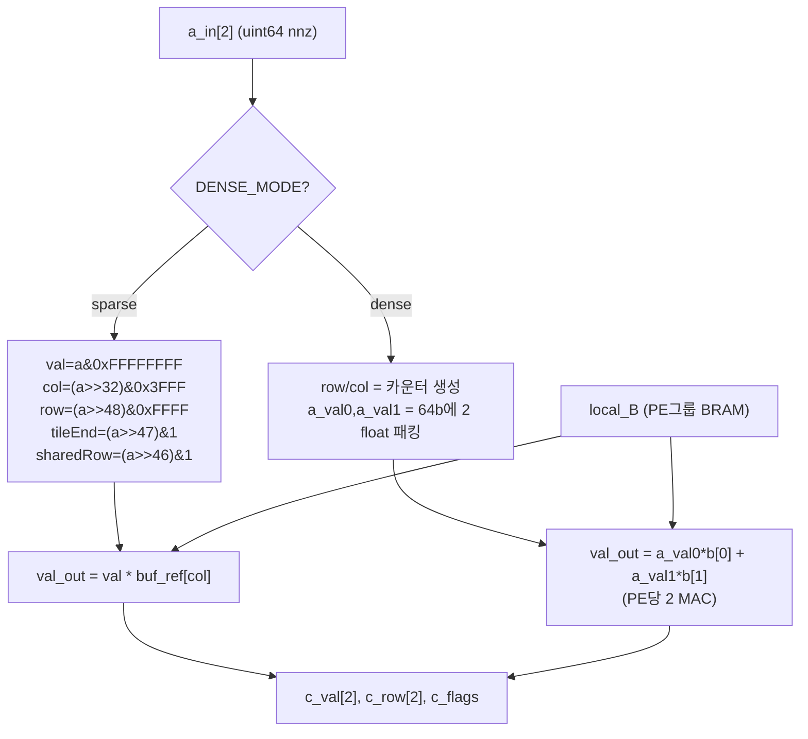
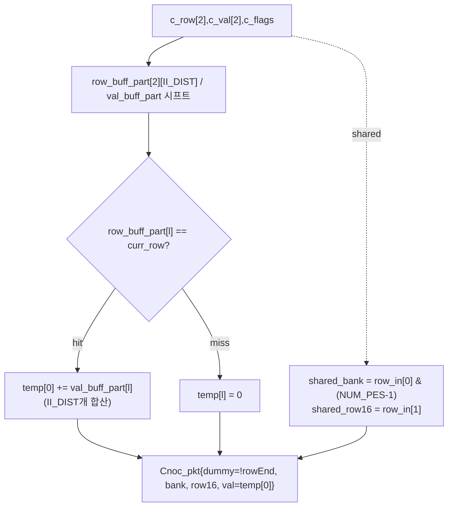
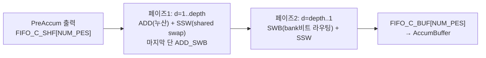
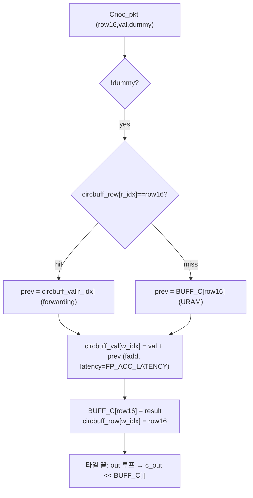
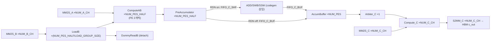

# MAD-HiSpMV 모듈 통합 가이드

> 1차 요약: [`../HiSpMV.md`](../HiSpMV.md) — 본 문서는 그 요약을 모듈 단위로 심화한 통합 가이드다.
> 분석 대상: `\\wsl.localhost\ubuntu-24.04\home\user\project\PRJXR-HBTXR\REF\Others\HiSpMV`
> 작성 원칙: 실제 소스 Read 후 `파일:라인` 근거 표기. 라인 근거 없는 추론은 "추정", 코드로 확인 불가는 "확인 불가"로 명시.
> 자매 가이드(동형): [`../HiSparse/MODULE_GUIDE.md`](../HiSparse/MODULE_GUIDE.md) — 같은 SpMV 도메인의 정수형 CPSR 가속기. 본 가이드는 HiSpMV의 **FP32 + TAPA + 코드젠 자동화** 축을 다룬다.

---

## 0. 문서 머리말

### 0.1 대표 케이스 선정
- **대표 연산: `c_out = α·(A·b) + β·c_in`** (SpMV + axpy 스케일/바이어스). 근거: top 선언 `spmv.h:86`(alpha/beta) + `base_functions.cpp:535`(`Compute_C`에서 `(beta*tmp_in0) + (alpha*tmp_in1)`). 값타입은 **FP32 전용**(`channelB_t/channelC_t = vec_t<float,...>`, `spmv.h:60-62`). SpMV가 본질이고 GeMV는 dense overlay 옵션으로 같은 PE에서 런타임 분기(`ComputeAB`, `base_functions.cpp:174-226`).
- **대표 config: `PA-HI-SpMV-16-2-4`** (U280, pre-accumulator + row-dist-net 둘 다 켜짐) — 빌드 산출물 중 PE 16개의 완결 파이프가 모두 등장(`builds/PA-HI-SpMV-16-2-4/src/hw_defs.h:1-7`). `NUM_A_CH=16, CH_WIDTH=512 → PES_PER_CH=8 → NUM_PES=128`(`spmv.h:26-27`). 8개 옵션 변형(`Dense`/`PA`/`HI` prefix)이 동형 dataflow라 1개만 정밀 분석.
- **대표 PE pair: ComputeAB(p=0,1)** (`base_functions.cpp:158,182`) — PE는 **항상 2개 묶음(a_in[2])**으로 호출(`top_function.cpp:36` `invoke<join, NUM_PES_HALF>`). shared-row 처리에서 두 PE 출력을 한 행으로 결합(`PreAccumulator:295-296`)하는 협력 단위.
- **대표 운영 경로: 행렬 적응형 자동(`main.py`)** — 입력 .mtx 통계로 DSE가 HBM 채널 배분·옵션을 정하고 codegen이 HLS C++를 생성(`main.py:43-69`). 수동 경로(`spmvcodegen.py`)는 노브 비교용으로 §11에서 대비.

### 0.2 수치 표기 규약
- **MAC lanes** = `NUM_PES` = `NUM_A_CH × (CH_WIDTH/64)`. 대표 config = `16 × (512/64)` = `16 × 8` = **128 PE**(`spmv.h:26-27`). 각 PE는 sparse 모드 사이클당 1 MAC(`val_out = val * buf_ref[col_id]`, `base_functions.cpp:234`). dense overlay 모드는 PE당 2 MAC(`a_val0*b_val[0] + a_val1*b_val[1]`, `:208`) → GeMV 시 처리량 2배. 채널폭이 결정하는 PES_PER_CH(512b=8, 256b=4)가 채널당 병렬도.
- **scalar MAC / MAC-equivalent** = SpMV는 데이터 의존. 1회 SpMV의 유효 곱셈 = **nnz**. 패딩(`PADDING`, `spmv-helper.h:28`)·빈 lane·dummy 패킷(`Cnoc_pkt.dummy`, `base_functions.cpp:330`)은 MAC에서 제외. GFLOPS 산식은 `2*(nnz+rows)/time`(`spmv-host.cpp:185`) — nnz MAC + rows axpy.
- **loop trips**(사이클 추정, `cyclecount_est.py:55`): `CC_TOTAL = CC_STREAM_A + num_tiles_r × CC_LOAD_B + CC_UPDATE_C`. 여기서 `CC_STREAM_A = run_length`(워크로드 밸런싱 후 최장 PE 부하 × II_DIST, `preprocessor.py:83`), `CC_LOAD_B = padded_cols/B_PART`(`:52`), `CC_UPDATE_C = padded_rows/C_PART`(`:53`). 타일 = 행 `DEPTH=NUM_PES·URAMS_PER_PE·4096`(`:13`) × 열 `WINDOW=B_PART/2·1024`(`:15`).
- **memory size**(payload bit):
  - PE 출력 누산버퍼 = `MAX_ROWS_PER_PE(=URAMS_PER_PE·4096) × float(32b)`. URAMS_PER_PE=2 → `8192 × 32` = **262,144 bit/PE**(URAM `RAM_2P`, `base_functions.cpp:443-444`, `spmv.h:35`). 128 PE → 33.6Mbit.
  - 입력벡터 로컬버퍼 = `B_WINDOW × float`. B_WINDOW = `min(B_PART·1024, 1<<14)` = 16384 word(`spmvcodegen.py:32`) × 32b = **524,288 bit/PE그룹**(BRAM, `spmv.h:31,40-45`). PE쌍(NUM_PES_HALF)당 복제.
  - PreAccumulator 시프트버퍼 = `2 × II_DIST × (float 32b + ap_uint<24>)` LUTRAM(`base_functions.cpp:260-266`). II_DIST = FP_ACC_LATENCY+1.
  - AccumBuffer 순환버퍼(forwarding) = `8 × (float + uint16)` LUTRAM(`:446-450`).
  - 스트림 FIFO = `FIFO_DEPTH`(row-dist-net 시 2, 아니면 8, `spmv.h:10-14`) × payload.
- **A 워드 패킹(64b/nnz)**: `[rowEnd:63][row:62..48 = 15b][tileEnd:47][sharedRow:46][col:45..32 = 14b][val:31..0 = float32]` (host `encode`, `spmv-helper.h:45-60`; 커널 디코딩 `base_functions.cpp:228-241`). 호스트/커널이 정확히 대칭.
- **NoC 패킷(Cnoc_pkt)**: `{dummy,last,tileEnd,sharedRow,uint16 row16,uint8 bank,float val}`(`spmv.h:71-79`). bank = 목적 누산 PE/뱅크, row16 = 행 인덱스(MSB가 rowEnd 플래그).
- **타깃 데이터타입**: 전 데이터패스 **FP32**(single precision). 인덱스는 14b col / 15b row(`encode`). 저비트/정수 양자화 **없음**(확인: 코드 전반 float만, `base_functions.cpp` 곱셈 모두 float).

### 0.3 운영 경로
```
[데이터: get_tb_matrices.py → matrices/*.mtx (SuiteSparse 등)]
      │
      ▼
[빌드타임 SW(자동): automation_tool/src/main.py]
      │ DSE.getBestConfig: 행렬 통계(nnz/rows/cols) → HBM 채널 배분 공식 (dse.py:31-37)
      │   ResourceEstimator 한도검사 (dse.py:79) → CycleCountEstimator 최소사이클 선택 (dse.py:82)
      │   CrossBarGen.buildGraph: PE수 기반 RDN 토폴로지 그래프 (crossbar.py:74-143)
      │ SpMVCodeGen.generateAll: hw_defs.h + spmv.h복사 + spmv.cpp + link_config.ini + Makefile (spmvcodegen.py:40-56)
      ▼
[HW 템플릿(HLS C++): assets/{base_functions.cpp, top_function.cpp, spmv.h}]
      │ 매크로 분기(BUILD_DENSE_OVERLAY/PRE_ACCUMULATOR/ROW_DIST_NETWORK/HIGH_FREQ_DESIGN)
      │ TAPA dataflow: MM2S_A → LoadB → ComputeAB → PreAccumulator → [RDN] → AccumBuffer → Arbiter_C → Compute_C → S2MM_C
      ▼
[빌드: common/common.mk]
      │ make host (g++) → make tapa (tapac: floorplan/HBM바인딩/buffer) → make hw (v++ bitstream)
      │ TAPA/PASTA(sb-dev) + AutoBridge, Vitis HLS 2023.2+, clock 4.25ns(225MHz) 또는 2.5ns(400MHz high-freq)
      ▼
[런타임 SW(host C++): common/src/spmv-host.cpp + spmv-helper.cpp]
      │ loadMtx → tileAndPad → balanceWorkload(행 분배) → prepareTile(64b encode) → XRT/tapa::invoke
      │ alpha=0.55, beta=-2.05 (spmv-host.cpp:43-44), cpuSequential 참조 비교, GFLOPS=2(nnz+rows)/time
      ▼
[Python 앱: pyhispmv(pybind11) → apps/{general_test, model_test}.py (DNN 레이어)]
```
- 타깃: **Alveo U280 / U50**(Ultrascale+, `fpgas.py:3-22`), **V80**(Versal HBM, DSE 전용 코드생성 미지원, `main.py:96`+`spmvcodegen.py:41`). U280 셸 `xilinx_u280_gen3x16_xdma_1_202211_1`(`fpgas.py:11`). HBM 가정 28채널×512b@225MHz(`fpgas.py:10`).
- 합성 PPA 절대치: 논문 미공개(`README.md:271` "upcoming publication"), csynth/cosim 리포트 본 트리에 부재 → **확인 불가**. ResourceEstimator는 경험적 추정치(§10).

---

## 1. Repo / 시스템 개요

MAD-HiSpMV = HBM 멀티채널을 스트리밍해 64b 패킹 희소 행렬에 대해 `c=α·Ab+β·c_in`을 FP32로 계산하되, **행 단위 워크로드 불균형**을 (Pre-Accumulator + Hybrid Row Distribution Network + intra-row 분산 스케줄)로 흡수하고, **행렬 적응형 자동 코드 생성기**(automation_tool)가 행렬별로 채널수·옵션을 정해 HLS 코드까지 합성하는 TAPA SpMV 가속기(SFU-HiAccel, 출판 전, `README.md:1-2,10,270-271`). HiSpMV(이전작)의 확장.

3개 축이 모두 자체 소스: **① HW 템플릿**(`automation_tool/assets/` 3파일 — 매크로 분기 dataflow), **② 빌드타임 자동화**(`automation_tool/src/` Python 8모듈 — DSE+codegen+RDN생성+추정모델), **③ 런타임 host**(`common/` — 전처리·밸런싱·64b패킹·XRT·검증) + pybind11(`pyhispmv/`) + 앱(`apps/`).

### 1.1 자체 소스 vs vendor/생성물

| 구분 | 파일(자체 소스) | 역할 |
|---|---|---|
| **HW 템플릿(HLS)** | `automation_tool/assets/spmv.h` | 타입·매크로·구조체·top 선언(단일 출처) |
| | `automation_tool/assets/base_functions.cpp` | 모든 TAPA task 구현(PE/PreAccum/RDN/AccumBuffer/IO) |
| | `automation_tool/assets/top_function.cpp` | top dataflow(tapa::task invoke 그래프) |
| **빌드타임 자동화(Python)** | `automation_tool/src/main.py` | 자동 진입점: DSE→codegen 루프 |
| | `automation_tool/src/spmvcodegen.py` | 코드 생성기(템플릿+RDN invoke 텍스트 합성) |
| | `automation_tool/src/dse.py` | Design Space Exploration(채널 배분+옵션 격자탐색) |
| | `automation_tool/src/crossbar.py` | RDN 토폴로지 그래프 생성기(butterfly add+route) |
| | `automation_tool/src/preprocessor.py` | 워크로드 밸런싱 사이클 모델(OoO/intra-row) |
| | `automation_tool/src/cyclecount_est.py` | 타일/패딩/run-length 사이클 추정 |
| | `automation_tool/src/resource_est.py` | task별 경험적 리소스(BRAM/URAM/DSP/LUT/REG) |
| | `automation_tool/src/fpgas.py` | U280/U50/V80 디바이스 스펙 |
| | `automation_tool/src/commons.py` | dataclass + encodeSpMVConfig |
| **런타임 host(C++)** | `common/src/spmv-host.cpp` | 실행 진입점·CPU참조·GFLOPS·XRT/csim 분기 |
| | `common/src/spmv-helper.cpp` | 타일·패딩·밸런싱·64b 패킹(encode)·XRT 실행 |
| | `common/include/spmv-helper.h` | HiSpmvHandle 선언 + `encode` 비트필드 |
| | `common/src/fpga-power.cpp` | 전력 측정 헬퍼 |
| **시스템 연결** | `common/common.mk` | host/tapa/hw 빌드 + tapac 옵션 |
| | (생성물) `builds/<cfg>/{hw_defs.h, link_config.ini}` | codegen 출력 — 대표 1개만 교차 확인 |
| **Python 바인딩/앱** | `pyhispmv/src/{pyhispmv_bindings,fpga_handle}.cpp` | pybind11 XRT 래퍼 |
| | `apps/{general_test,model_test,model,fpga_layer_manager}.py` | SpMV/GeMV 앱 + DNN 레이어 |

### 1.2 제외 목록(이름만 언급)
- **생성물(codegen 출력)**: `builds/*/src/spmv.cpp`(= base+top+RDN invoke 이어붙인 결과), `builds/*/src/hw_defs.h`, `builds/*/link_config.ini`, `builds/*/*.xclbin`/`*.xo`, floorplan/usage report. 원본 템플릿(`assets/*`)을 정밀 분석, 생성물은 대표 1개(`PA-HI-SpMV-16-2-4`)만 교차 확인.
- **외부 벤치(자체 wrapper만 역할 언급)**: `cpu/`(Intel MKL SpMV/GeMV, `cpu/src/mmio.h`는 NIST MatrixMarket I/O = vendor), `gpu/`(cuSPARSE + `gpu/include/nvmlPower.h` = NVIDIA NVML 의존).
- **대용량 데이터**: `matrices/*.mtx`(get_tb_matrices.py로 다운로드), `*.png`(arch_overview).
- **부재(확인 불가)**: 논문 본문 합성 PPA(LUT/FF/DSP/URAM 절대치)·전력·정확도 수치 — 미출판, 리포트 부재. PASTA+AutoBridge sb-dev 내부(`README.md:34` 비공개). `pyhispmv`/`fpga_handle.cpp` 세부(역할만 확인).

### 1.3 config-채널-HBM 매핑(대표 `PA-HI-SpMV-16-2-4`, U280)
근거: `spmvcodegen.py:58-77`(createLinkConfig) + `builds/PA-HI-SpMV-16-2-4/link_config.ini`.

| 자원 | 채널 수 | HBM 매핑 | 비고 |
|---|---|---|---|
| b(입력벡터) | NUM_B_CH=2 | HBM[0-1] | 먼저 배치(`link_config.ini:2-3`) |
| A(희소행렬) | NUM_A_CH=16 | HBM[2-5,16-18,6-12,19-20] | A=HBM[i+num_ch_B], tapac HBM바인딩 조정으로 비연속(`:4-19`) |
| c_in(바이어스) | NUM_C_CH=4 | HBM[21-23,13] | A·B 다음(`:20-23`) |
| c_out(결과) | NUM_C_CH=4 | HBM[24-26,14] | c_in 다음(`:24-27`) |

→ NUM_PES = 16·8 = 128, PE쌍(NUM_PES_HALF) = 64. DSE 제약 `num_ch_A % (2·num_ch_C) == 0`(`spmvcodegen.py:234`): 16%8=0 OK. tapac `--enable-hbm-binding-adjustment`(`common.mk:24`)가 채널 순서 재배치(비연속 HBM index).

---

## 2. 모듈: 타입·매크로·구조체 — `spmv.h`

### 2.1 역할 + 상위/하위
- **역할**: 전 HW의 단일 출처. 옵션 매크로 분기(FIFO_DEPTH/FP_ACC_LATENCY), 파생 파라미터(PES_PER_CH/NUM_PES/B_WINDOW/II_DIST/MAX_ROWS_PER_PE), TAPA 하이브리드버퍼 타입, 채널 vec_t, 패킷 구조체, top 선언.
- **상위**: `base_functions.cpp:1`·`top_function.cpp`·host(`spmv-host.cpp:5`)가 include. **하위**: `hw_defs.h`(codegen 생성, `:7`) + Xilinx `tapa.h`/`ap_int.h`(`:5-6`).

### 2.2 대표 코드 위치
`automation_tool/assets/spmv.h`(92줄). 매크로 분기 `:10-38`, 버퍼타입 `:40-58`, vec_t `:60-62`, 구조체 `:65-79`, top `:82-91`.

### 2.3 대표 코드 블록
```c
#define PES_PER_CH (CH_WIDTH/64)          // spmv.h:26  512b → 8 PE/채널
#define NUM_PES (NUM_A_CH*PES_PER_CH)     // :27
#define II_DIST (FP_ACC_LATENCY + 1)      // :34  FP 누산 RAW 의존거리
#define MAX_ROWS_PER_PE (URAMS_PER_PE * 4096)  // :35  URAM 1뱅크=4096 word
```
→ **컴파일타임 파생**. CH_WIDTH(256/512)·NUM_A_CH가 PE 병렬도를, URAMS_PER_PE가 PE당 누산 행수를, FP_ACC_LATENCY가 RAW 처리 깊이를 결정.

```c
#ifdef HIGH_FREQ_DESIGN
#define FP_ACC_LATENCY 10                 // spmv.h:17  400MHz → fadd 깊이 10
#else
#ifdef BUILD_PRE_ACCUMULATOR
#define FP_ACC_LATENCY 4                  // :20  pre-accum 시 4 (II_DIST=5)
#else
#define FP_ACC_LATENCY 5                  // :22  기본 5 (II_DIST=6)
#endif
#endif
```
→ **FP 누산 latency가 II 의존거리를 좌우**. pre-accum이 켜지면 후단 AccumBuffer의 fadd latency를 4로 줄여(II_DIST=5) 순환버퍼/RDN 깊이를 절약. high-freq는 10으로 늘려 타이밍 확보.

```c
using buffersB_t = tapa::buffers<float[B_WINDOW], NUM_PES_HALF, 1,
    tapa::array_partition<tapa::cyclic<B_PART>>, tapa::memcore<tapa::bram>>;  // spmv.h:40-45
struct Cnoc_pkt { bool dummy,last,tileEnd,sharedRow; uint16_t row16; uint8_t bank; float val; };  // :71-79
```
→ **PASTA 하이브리드버퍼**(`tapa::buffers/ibuffer/obuffers`): 입력벡터 b를 PE그룹 로컬 BRAM에 `cyclic<B_PART>` 분할 보관(추정: PASTA sb-dev 확장 타입, `README.md:31`). Cnoc_pkt = RDN을 흐르는 60b급 결과 패킷(resource_est가 60b로 모델, `resource_est.py:44`).

### 2.4 마이크로아키텍처
- **메모리/폭**: B_WINDOW = `min(B_PART·1024, 1<<14)` = 16384(`spmvcodegen.py:32`). B_PART = `NUM_B_CH·(CH_WIDTH/32/2)`(`spmv.h:30`, BRAM36K 2포트 기준).
- **정량/병목**: ① 모든 폭이 `CH_WIDTH`·`NUM_x_CH` 컴파일타임 상수 — 디바이스/config 이식 시 codegen이 hw_defs.h로 재주입(`spmvcodegen.py:115-119`). ② FP32 고정 — 저비트 미지원이 데이터타입 단일 노브. ③ `Cnoc_pkt`의 `bank uint8_t`는 NUM_PES≤256 가정(LOG_2_NUM_PES≤8, `spmvcodegen.py:35`).

---

## 3. 모듈: PE(곱셈) — `base_functions.cpp::ComputeAB` (희소 핵심 ①)

### 3.1 역할 + 상위/하위
- **역할**: SpMV의 곱셈 단계. 64b nnz 엔트리를 디코딩(val/col/row/플래그)하고 로컬 b버퍼에서 `b[col]`을 gather해 `val*b`를 계산. dense overlay 시 같은 PE에서 GeMV(PE당 2 MAC)로 런타임 분기.
- **상위**: `top_function.cpp:36` `invoke<join, NUM_PES_HALF>(ComputeAB,...)` — **PE 2개씩 묶음**(a_in[2]). **하위**: `ibufferB_t local_B`(LoadB가 채운 로컬 BRAM 윈도우).

### 3.2 데이터플로우 (sparse / dense 분기)


### 3.3 Function call stack
`top_function.cpp:36` `ComputeAB` → rp_time 반복(`base_functions.cpp:168`) → `local_B.acquire(section)`(`:171`, 더블버퍼 동기) → tileEnd까지 곱셈 루프(II=1, `:178-249`) → 출력 stream write(`:243-248`) → `section.release_section()`(`:250`).

### 3.4 대표 코드 위치
`automation_tool/assets/base_functions.cpp`: ComputeAB `:158-254`, dense 경로 `:188-226`, sparse 경로 `:228-242`.

### 3.5 대표 코드 블록
```c
for(int p = 0; p < 2; p++) {                                    // base_functions.cpp:228 (sparse)
    uint64_t a = temp_in[p];
    uint32_t val_bits = a & 0xFFFFFFFF;
    float val = *(float*)(&val_bits);
    uint16_t col_id = (a >> 32) & 0x3FFF;                       // :232 (14b col)
    row_out[p] = (a >> 48) & 0xFFFF;                            // :233 (16b row, MSB=rowEnd)
    val_out[p] = val * buf_ref[col_id];                         // :234 (MAC)
}
tileEnd = (temp_in[0] >> 47) & 1;                               // :237
flags_out.sharedRow = (temp_in[0] >> 46) & 1;                  // :239
```
→ **64b 단일 워드에 nnz 메타 전부 패킹**: float값 + 14b 열 + 16b 행 + tileEnd(47) + sharedRow(46). 호스트 `encode`(`spmv-helper.h:45-60`)와 비트필드 정확히 대칭. HBM 대역폭 절감(인덱스+값+제어 = 1 워드).

```c
val_out[p] = (a_val0 * b_val[0]) + (a_val1 * b_val[1]);        // base_functions.cpp:208 (dense)
...
row_out[p] = DENSE_MODE ? row_cnt | (1 << 15) : ...;          // :198 (dense면 rowEnd 항상 set)
tileEnd = DENSE_MODE ? (col_cnt == B_WINDOW) || last : ...;   // :222
```
→ **dense overlay = GeMV의 본질**: dense면 인덱스를 카운터로 생성하고 한 64b 엔트리에 2개 float a값을 패킹해 b 2개와 곱-덧셈(PE당 2 MAC). row에 `(1<<15)` rowEnd 플래그 강제(dense는 매 엔트리가 새 행).

### 3.6 마이크로아키텍처
- **Stage 분해**: ① local_B.acquire(더블버퍼 consumer 측, `:171`) ② 곱셈 루프(II=1 PIPELINE, `:180`) — 매 사이클 2 PE × 1(sparse) 또는 2(dense) MAC ③ flags/row/val 3 stream으로 출력 ④ release.
- **MAC lanes**: PE쌍당 sparse 2 MAC/cycle, dense 4 MAC/cycle. 128 PE = sparse 128, dense 256 MAC/cycle(이상치, 충돌 없을 때).
- **메모리/재사용**: `ibufferB_t local_B[B_WINDOW=16384]` BRAM(`spmv.h:47-51`). col_id로 임의 접근 gather — **b 윈도우는 타일 내 모든 nnz가 재사용**(타일별 1회 적재, LoadB가 채움).
- **정량/병목**: ① col 14b → 열 인덱스 ≤16384(B_WINDOW)로 타일링 강제. row 15b(rowEnd 1b 제외) → 행 ≤32768/타일. ② **dense overlay 켜면 fmul 2개 추가** → ComputeAB DSP 6→16(Ultrascale+, `resource_est.py:108,117`). ③ 곱셈 자체는 II=1이라 PE 자체는 병목 아님 — **불균형은 후단(누산)에서 발생**.

---

## 4. 모듈: Pre-Accumulator — `base_functions.cpp::PreAccumulator` (불균형 흡수 ①)

### 4.1 역할 + 상위/하위
- **역할**: FP 누산의 긴 latency(II_DIST)로 인한 RAW stall을 **사전 제거**. 같은 행이 II_DIST 거리 내 재등장하면 시프트버퍼 안에서 미리 합쳐, 후단 AccumBuffer의 연속 동일주소 쓰기 의존을 깬다. shared-row 처리(두 PE 출력을 한 행으로 묶기)도 준비. README 용어 = **Adder Chain Groups(ACG)**(`README.md:14`).
- **상위**: `top_function.cpp:39/41` `invoke<join, NUM_PES_HALF>(PreAccumulator,...)` — RDN 켜지면 `FIFO_C_SHF`로, 아니면 `FIFO_C_BUF`로 직출력. **하위**: 없음(LUTRAM 시프트레지스터).

### 4.2 데이터플로우


### 4.3 Function call stack
`top_function.cpp:39` → main 루프(`base_functions.cpp:270`) → init(시프트버퍼 0초기화, `:273-281`) → compute(II=1, `:285-350`) → row/val read(`:289-292`) → shared 처리(`:295-296`) → 시프트+매칭합산(`:310-326`, BUILD_PRE_ACCUMULATOR 시) → Cnoc_pkt 출력(`:329-345`).

### 4.4 대표 코드 위치
`base_functions.cpp`: 시프트버퍼 선언 `:260-266`, shared 결합 `:295-308`, 시프트+합산 `:310-326`, 패킷 생성 `:329-345`.

### 4.5 대표 코드 블록
```c
float val_buff_part[2][II_DIST];                                // base_functions.cpp:260
ap_uint<24> row_buff_part[2][II_DIST];                          // :261
#pragma HLS bind_storage variable=val_buff_part type=RAM_2P impl=LUTRAM  // :262
#pragma HLS array_partition variable=val_buff_part type=complete dim=0   // :263
...
for (uint8_t l = 0; l < II_DIST-1; l++) {                       // :310 (시프트)
    row_buff_part[p][l] = row_buff_part[p][l+1];
    val_buff_part[p][l] = val_buff_part[p][l+1];
}
val_buff_part[p][II_DIST-1] = val;  row_buff_part[p][II_DIST-1] = curr_row;  // :316-317
float temp[II_DIST];
for (uint8_t l = 0; l < II_DIST; l++)
    temp[l] = (row_buff_part[p][l] == curr_row) ? val_buff_part[p][l] : 0;   // :322
for (uint8_t l = 1; l < II_DIST; l++) temp[0] += temp[l];      // :324-326 (가산 트리)
```
→ **핵심 알고리즘**: II_DIST 깊이 시프트레지스터에 최근 (row,val)을 보관. 현재 행과 일치하는 항만 골라 미리 합산(`temp[0]`) → 후단 누산에 같은 주소가 연속으로 가지 않게 함. fadd latency만큼의 의존거리를 PreAccum이 흡수.

```c
uint8_t shared_bank = row_in[0] & ((1U << LOG_2_NUM_PES) - 1);  // base_functions.cpp:295
uint16_t shared_row16 = row_in[1];                             // :296
...
ap_uint<24> curr_row = ((ap_uint<24>)((row & 0x7FFF) | (flags_in.sharedRow << 15)) << LOG_2_NUM_PES) | (bank & ...); // :308
```
→ **shared-row 준비**: shared 행이면 두 PE(p=0,1) 출력을 한 행(`shared_row16`)으로 묶고 목적 bank를 row_in[0] 하위비트에서 추출 → RDN이 그 bank의 누산기로 라우팅. curr_row에 (row|sharedRow|bank) 인코딩.

### 4.6 마이크로아키텍처
- **Stage 분해**: init(II_DIST·2 cleared) → compute(II=1, 시프트+매칭+가산트리 모두 unroll).
- **메모리**: `2 × II_DIST × (32b float + 24b row)` LUTRAM(`:260-266`). II_DIST=5(pre-accum) → 작은 LUTRAM.
- **정량/병목**: ① PreAccum이 **없으면**(매크로 미정의) 시프트/합산 코드 전체가 컴파일아웃되고 패킷만 통과(`:307,335` `#ifdef` 가드) — 그 경우 RAW는 OoO 스케줄(host 행 재배열, §9)이나 AccumBuffer 순환버퍼로만 처리. ② II_DIST 깊이 가산트리가 latency 추가하지만 II=1 유지. ③ pre-accum on 시 ComputeAB의 FP_ACC_LATENCY=4로 줄어 전체 II_DIST=5(`spmv.h:20,34`) → 리소스 절약(AccumBuffer fadd latency 4, `resource_est.py:142-143`). ④ DSP 16/PE쌍(Ultrascale+, `resource_est.py:129`)로 적지 않은 비용 → DSE가 리소스 한도 내에서 on/off 탐색(`dse.py:55-58`).

---

## 5. 모듈: Hybrid Row Distribution Network — `base_functions.cpp::ADD/SWB/SSW` + `crossbar.py` (불균형 흡수 ②)

### 5.1 역할 + 상위/하위
- **역할**: 행이 어느 PE에서 계산됐든 **올바른 누산뱅크로 모으는** 로그단 가산+스위칭 NoC. shared 행(여러 PE에 분산)은 합쳐서 한 누산기로(ADD), 일반 행은 bank 비트로 라우팅(SWB), sharedRow 비트로 swap(SSW). README 용어 = **Hybrid Row Distribution Network → y_Ax handlers**(`README.md:13`).
- **상위**: codegen이 `top_function.cpp`의 `#else` 위치에 invoke 텍스트 삽입(`spmvcodegen.py:175-178`). PreAccumulator(`FIFO_C_SHF`) → RDN → AccumBuffer(`FIFO_C_BUF`). **하위**: 없음(템플릿 함수 ADD<m,sw>/SWB<m,n>/SSW).
- 3개 프리미티브 + 래퍼 18종(`ADD_0/1/SWB, SWB0_0..SWB1_6`, `base_functions.cpp:543-626`)이 crossbar.py 그래프 노드명과 1:1.

### 5.2 데이터플로우 (2-페이즈 butterfly)


### 5.3 Function call stack
codegen: `SpMVCodeGen.createKernelCode`(`spmvcodegen.py:139`) → `CrossBarGen(num_pes).buildGraph()`(`:157-158`) → `generateCBstreams`(depth_dict→stream선언, `:181`) + `generateCBinvokes`(graph_dict→`.invoke(name,in0,in1,out0,out1)`, `:187`). 런타임: 각 노드는 `base_functions.cpp`의 ADD/SWB/SSW가 II=1 패스(`:360,398,420`).

### 5.4 대표 코드 위치
`base_functions.cpp`: ADD `:356-392`, SWB `:394-415`, SSW `:417-436`, 래퍼 `:543-626`. `crossbar.py`: buildGraph `:74-143`, computeDepth `:22-31`, addBlock `:36-72`.

### 5.5 대표 코드 블록
```c
template<bool m, bool sw>
void ADD(...) {                                                 // base_functions.cpp:356
    float sum = curr_in[0].val + curr_in[1].val;
    bool shared_cond = (curr_in[0].sharedRow && curr_in[1].sharedRow) && !(dummy0||dummy1);  // :366
    bool i = sw ? ((curr_in[0].bank >> (LOG_2_NUM_PES-1)) & 1) : m;  // :370 (sw면 bank MSB로 방향)
    temp[i]  = shared_cond ? sum : curr_in[i].val;             // :371 (shared면 한쪽에 합 몰기)
    temp[!i] = shared_cond ? 0   : curr_in[!i].val;            // :372 (반대쪽 0+dummy)
}
```
→ **shared 행 합산+라우팅**: 두 입력 모두 sharedRow면 값을 합쳐 한 출력(i)으로 몰고 반대는 0+dummy. `sw` 템플릿 인자로 라우팅을 bank MSB 동적 결정 또는 상수 m 고정.

```c
template<bool m, int n>
void SWB(...) {                                                 // base_functions.cpp:394
    bool target = (curr_in[m].bank >> n) & 1;                  // :404 (bank n번째 비트)
    bool i = m ? (target || !sharedRow) : (target && sharedRow);  // :406
    curr_out[i] = curr_in[m]; curr_out[!i] = curr_in[!m];     // :407-408
}
```
→ **butterfly/Benes 스위칭**: bank의 n번째 비트로 출력 lane 결정. SWB0_n/SWB1_n(m=0/1)이 crossbar.py 페이즈2에서 단계 d-1마다 인스턴스(`crossbar.py:127,130`).

```python
# crossbar.py: 2-페이즈 그래프
for d in range(1, self.depth+1):           # :76 페이즈1 (add+ssw)
    if d == self.depth: self.addBlock("ADD_SWB", i-1, i, ..., first, last, ...)  # :99
    elif ((i>>d)&1)==0: self.addBlock("ADD_1", ...)   # :102
    else:               self.addBlock("ADD_0", ...)   # :105
for d in range(self.depth, 0, -1):         # :107 페이즈2 (swb route 복원)
    self.addBlock(f"SWB{0/1}_{d-1}", ...)  # :127,130
```
→ **PE수 기반 파라메트릭 생성**: depth=⌈log2(NUM_PES)⌉(`:8`). 페이즈1이 누산하며 라우팅 준비, 페이즈2가 bank 비트로 목적지 복원. 검증(생성물 교차): `builds/PA-HI-SpMV-16-2-4/src/spmv.cpp:660` `s_0_0` depth=86, `s_3_0` depth=10 등 — computeDepth(`crossbar.py:26-30`)의 `(end-start)*2 + 홀수레벨 6` 산식과 정합.

### 5.6 마이크로아키텍처
- **Stage 분해**: log2(NUM_PES) 단의 add(페이즈1) + log2(NUM_PES) 단의 route(페이즈2). 각 블록 II=1 2-in/2-out.
- **셔플 폭**: NUM_PES lane(128 PE 시 7단). 블록 수: ADD = NUM_PES개, SW = 2·(NUM_PES-3)개(`resource_est.py:24-25`).
- **메모리**: 블록 간 `tapa::stream<Cnoc_pkt,depth>` — depth는 단계차 기반(`crossbar.py:26-30`, high-freq면 홀수레벨 +10 아니면 +6). FIFO_DEPTH=2(RDN 시, `spmv.h:11`).
- **정량/병목**: ① RDN이 **없으면** PreAccum이 FIFO_C_BUF로 직출력(`top_function.cpp:41`) → 행이 항상 row%NUM_PES PE에 고정되어 불균형 그대로. RDN은 무거운 행을 여러 PE로 흩뿌린 뒤(host intra-row) 다시 모으는 경로. ② 로그단이라 latency = O(log NUM_PES)지만 throughput II=1. ③ ADD가 fadd 1개/블록(Ultrascale+ 2 DSP, `resource_est.py:174`) × NUM_PES → 128 PE 시 256 DSP 추가. ④ SSW(`:417`)는 sharedRow 비트로 단순 swap(DSP 0, LUT 82, `resource_est.py:183`).

---

## 6. 모듈: AccumBuffer(출력 누산) — `base_functions.cpp::AccumBuffer`

### 6.1 역할 + 상위/하위
- **역할**: PE당 URAM에 행별 FP 누산. **순환버퍼 forwarding**(circbuff)으로 in-flight 동일주소 누산 중복 처리(II=1 유지). 타일별 init→acc→out 3단계로 num_tiles_c 열타일을 누적 후 출력.
- **상위**: `top_function.cpp:43` `invoke<join, NUM_PES>(AccumBuffer, FIFO_C_BUF, FIFO_C_ARB,...)`. **하위**: 없음(URAM `BUFF_C` + LUTRAM circbuff).

### 6.2 데이터플로우 (순환버퍼 forwarding)


### 6.3 Function call stack
`top_function.cpp:43` → rp_time 반복(`base_functions.cpp:452`) → init0(BUFF_C 0초기화, `:455-461`) → main 행루프(`:466`) → 열타일 루프(`:467`) → init(circbuff 0, `:468-473`) → acc(II=1, `:475-488`) → out(BUFF_C dump, `:490-500`).

### 6.4 대표 코드 위치
`base_functions.cpp`: BUFF_C/circbuff 선언 `:443-450`, 누산 루프 `:475-488`, dump `:490-500`.

### 6.5 대표 코드 블록
```c
float BUFF_C[MAX_ROWS_PER_PE];                                  // base_functions.cpp:443
#pragma HLS bind_storage variable=BUFF_C type=RAM_2P impl=URAM  // :444
float circbuff_val[8]; uint16_t circbuff_row[8];               // :446-447 (LUTRAM forwarding)
...
acc:
for (bool tileEnd = false; !(tileEnd); r_idx++, w_idx++) {     // :476
#pragma HLS PIPELINE II=1
#pragma HLS DEPENDENCE true type=inter variable=circbuff_val direction=RAW distance=II_DIST  // :478
#pragma HLS DEPENDENCE false type=inter variable=BUFF_C       // :479
    Cnoc_pkt curr_in = c_in.read();
    if (!curr_in.dummy) {
    #pragma HLS bind_op variable=circbuff_val op=fadd latency=FP_ACC_LATENCY impl=fabric  // :482
        circbuff_val[w_idx] = (curr_in.val) + ((circbuff_row[r_idx]==curr_in.row16) ? circbuff_val[r_idx] : BUFF_C[curr_in.row16]);  // :483
        BUFF_C[curr_in.row16] = circbuff_val[w_idx];          // :484
        circbuff_row[w_idx] = curr_in.row16;                  // :485
    }
}
```
→ **RAW forwarding 정석**: ① `DEPENDENCE ... distance=II_DIST`(`:478`)로 순환버퍼 RAW 의존거리를 fadd latency만큼 명시 → II=1. ② 같은 행이 순환버퍼(직전 8개)에 있으면 그 값을, 없으면 URAM에서 read해 더함 → URAM의 긴 read latency를 우회. ③ fadd `impl=fabric`(DSP 아닌 LUT, `:482`)로 합성.

### 6.6 마이크로아키텍처
- **Stage 분해**: ① init0(URAM 0초기화) ② 열타일 루프: init(circbuff clear) → acc(II=1 누산) ③ out(BUFF_C → c_out, dump 후 0재설정). rp_time 반복.
- **MAC lanes**: 누산은 PE당 1 fadd/cycle. 128 PE = 128 fadd/cycle.
- **메모리/재사용**: `BUFF_C[8192] × 32b` URAM/PE(URAMS_PER_PE=2, `:443`) = **262Kbit/PE, 128 PE → 33.6Mbit**. 출력은 **열타일 간 누적 캐리**(num_tiles_c 타일 모두 더한 뒤 dump).
- **정량/병목**: ① URAM read latency를 circbuff[8] forwarding이 은닉 — **PreAccum/RDN이 같은 행을 II_DIST 내 모이지 않게 분산했다면 forwarding 부담 감소**(3종 불균형 흡수의 협력). ② fadd latency가 II_DIST를 결정(pre-accum=4 → DSP 3, 아니면 latency=5 → DSP 5, `resource_est.py:143,151`). ③ MAX_ROWS_PER_PE=8192가 타일당 PE 행수 상한 → 큰 행렬은 행타일 다수(num_tiles_r) → init0/dump 오버헤드 반복.

---

## 7. 모듈: 출력 정렬·axpy — `Arbiter_C` · `Compute_C`

### 7.1 역할 + 상위/하위
- **Arbiter_C**: NUM_PES개 누산 출력(c_arb)을 NUM_C_CH개 HBM 채널 폭(channelC_t)으로 재정렬/패킹(`base_functions.cpp:506`).
- **Compute_C**: SpMV 결과에 스케일·바이어스 적용 → `c_out = β·c_in + α·(A·b)`(axpy, `:521`).
- **상위**: `top_function.cpp:44/46`. **하위**: 없음.

### 7.2 대표 코드 블록
```c
// Arbiter_C: NUM_PES → NUM_C_CH 폭
for(int jj = 0; jj < FP32_PER_CH * NUM_C_CH; jj++)             // base_functions.cpp:511
    c_ab_in[j*FP32_PER_CH*NUM_C_CH + jj] >> tmp_in[jj/FP32_PER_CH][jj%FP32_PER_CH];  // :513
for(int c = 0; c < NUM_C_CH; c++) c_ab_out[c] << tmp_in[c];   // :514-516
```
→ 128개 PE 출력 스칼라를 NUM_C_CH(=4) 채널 × FP32_PER_CH(=16) 벡터로 묶음. `NUM_PES % C_PART == 0` 가정(`cyclecount_est.py:19`).

```c
// Compute_C: axpy
tmp_out[jj] = (beta * tmp_in0[jj]) + (alpha * tmp_in1[jj]);    // base_functions.cpp:535
```
→ **2 fmul + 1 fadd**(`resource_est.py:159` 8·fp32perch+2 DSP). tmp_in0 = c_in(바이어스), tmp_in1 = A·b(SpMV 결과). GeMV/SpMV 공통 출력 단계.

### 7.3 마이크로아키텍처
- **정량/병목**: ① Arbiter_C는 NUM_PES → NUM_C_CH 직렬화 — `(NUM_PES/FP32_PER_CH)/NUM_C_CH` 만큼 내부 루프(`:510`). NUM_C_CH 적으면 직렬화 길어짐(DSE가 C채널 배분으로 균형, `dse.py:37`). ② Compute_C는 채널당 II=1(`:530`), FP32_PER_CH lane unroll. ③ 출력 단계 사이클 = `CC_UPDATE_C = padded_rows/C_PART`(`cyclecount_est.py:53`).

---

## 8. 모듈: HBM IO + 로컬 b 적재 — `MM2S_A/B/C` · `S2MM_C` · `LoadB` · `DummyReadB`

### 8.1 역할 + 상위/하위
- **MM2S_A/B/C**: HBM → 스트림(A 행렬 / b 입력벡터 / c_in 바이어스). async_mmap으로 addr-issue ∥ data-consume 분리(latency 은닉).
- **S2MM_C**: 스트림 → HBM(c_out 결과) write-resp ack 카운트.
- **LoadB**: b를 PE그룹 로컬 BRAM(obuffersB_t)에 적재. `tapa::section` acquire/release로 producer/consumer 더블버퍼.
- **DummyReadB**: LoadB가 통과시킨 b_out을 소비(detach, 데이터플로우 종단).
- **상위**: `top_function.cpp:33-37,45,47`. **하위**: TAPA async_mmap + 하이브리드버퍼.

### 8.2 대표 코드 블록
```c
// MM2S_A: async 버스트 + 8 lane 언팩
if ((i_req < len) & !mmap.read_addr.full()) { mmap.read_addr.try_write(offset + i_req); ++i_req; }  // base_functions.cpp:11-14
if (!fifos_full & !mmap.read_data.empty()) {
    mmap.read_data.try_read(tmp);
    for(int p=0; p<PES_PER_CH; p++) streams[p].try_write(tmp[p]);  // :23-25 (PES_PER_CH개로 언팩)
    ++i_resp;
}
```
→ **전형적 async_mmap 패턴**: read_addr 발행과 read_data 소비를 같은 루프에서 비차단 분리 → 메모리 latency 은닉. 한 채널 응답(channelA_t = PES_PER_CH개 uint64)을 PE별 스트림으로 분배.

```c
// LoadB: tapa::section 더블버퍼
for (int i=0; i<LOAD_GROUP_SIZE; i++) { auto section = local_B[i].create_section(); local_B[i].acquire(section); }  // :116-119
for(w<W_WINDOW && c<B_len; ...) {
    for(ch<NUM_B_CH) temp[ch] = b_in[ch].read();              // :128
    for(q...) for(l<LOAD_GROUP_SIZE) buf_ref[w*(...)+q] = temp[q/FP32_PER_CH][q%FP32_PER_CH];  // :130-137 (LOAD_GROUP_SIZE 복제)
    for(ch) b_out[ch].write(temp[ch]);                        // :139-141 (다음 그룹 통과)
}
for (...) section.release_section();                          // :144-147
```
→ **b 윈도우 복제 적재**: W_WINDOW=512 word 단위로 채널 입력을 받아 LOAD_GROUP_SIZE(=2)개 PE그룹 버퍼에 복제. acquire/release로 ComputeAB와 더블버퍼링(다음 타일 적재 ∥ 현재 타일 소비).

### 8.3 마이크로아키텍처
- **정량/병목**: ① MM2S_A read trips = run_length(밸런싱 후 최장 PE 부하 패딩, `cyclecount_est.py:51`) → **불균형이 직접 A read 길이를 결정**. ② MM2S_B는 `num_tiles_r × rp_time` 회 b 재로딩(타일마다, `:37`) → b가 행타일 수만큼 반복 read. ③ LoadB 더블버퍼가 b 적재 latency 은닉. ④ async_mmap당 LUT ~5000/REG ~6500(`resource_est.py:201`) — 채널 수가 LUT 큰 비중.

---

## 9. 모듈: Top dataflow — `top_function.cpp`

### 9.1 역할 + 상위/하위
- **역할**: 모든 task를 `tapa::task().invoke<...>()`로 연결한 단일 SpMV top. RDN 유무를 `#ifdef`로 분기(PreAccum 출력 목적지).
- **상위**: tapac `--top SpMV`(`common.mk:18`). **하위**: §3~8 모든 task.

### 9.2 데이터플로우 (invoke 그래프)


### 9.3 대표 코드 블록
```c
.invoke<tapa::join, NUM_PES_HALF>(ComputeAB, FIFO_A_IN, FIFO_C_FLAG, FIFO_C_ROW, FIFO_C_VAL, BUFF_B, A_len, num_rows_per_pe, rp_time, DENSE_MODE)  // top_function.cpp:36
.invoke<tapa::detach, NUM_B_CH>(DummyReadB, FIFO_B_IN)        // :37
#ifdef BUILD_ROW_DIST_NETWORK
.invoke<tapa::join, NUM_PES_HALF>(PreAccumulator, ..., FIFO_C_SHF)  // :39 (RDN으로)
#else
.invoke<tapa::join, NUM_PES_HALF>(PreAccumulator, ..., FIFO_C_BUF)  // :41 (직결)
#endif
.invoke<tapa::join, NUM_PES>(AccumBuffer, FIFO_C_BUF, FIFO_C_ARB, ...)  // :43
```
→ **codegen 삽입 지점**: `tapa::task()` 직전에 `#ifdef BUILD_ROW_DIST_NETWORK` + crossbar stream 선언, `#else` 위치에 crossbar invoke가 텍스트로 삽입됨(`spmvcodegen.py:167-178`). 생성된 spmv.cpp에서 FIFO_C_SHF→(RDN)→FIFO_C_BUF로 연결.

### 9.4 마이크로아키텍처
- **정량/병목**: ① 전 task가 dataflow 병렬(tapa::join/detach). PE 병렬도 = NUM_PES. ② BUFF_B(buffersB_t)가 LoadB(obuffers)와 ComputeAB(ibuffer) 사이의 하이브리드버퍼 — TAPA section으로 동기. ③ rp_time(벤치 반복)이 모든 task에 전파(반복 실행으로 평균 성능 측정, `spmv-host.cpp:121`).

---

## 10. 모듈: DSE + 코드 생성 — `dse.py` · `spmvcodegen.py` · `cyclecount_est.py` · `resource_est.py` · `fpgas.py`

### 10.1 역할 + 상위/하위
- **역할**: 행렬 통계로 HBM 채널 배분·옵션을 정하고(DSE), 리소스/사이클을 추정해 최적 config를 골라(estimator), HLS 코드를 합성(codegen). **빌드타임 SW 자동화의 핵심**.
- **상위**: `main.py:43-69`(행렬마다 getBestConfig→codegen). **하위**: `preprocessor.py`(사이클), `crossbar.py`(RDN), `commons.py`(dataclass).

### 10.2 대표 코드 블록
```python
# dse.py: HBM 채널 배분 공식
norm_cols = sqrt(cols/nnz/2);  norm_rows = sqrt(rows/nnz/4)    # dse.py:31-32
opt_ch_A = hbm.num_ch / (1 + norm_cols + 2*norm_rows)          # :35
opt_ch_B = opt_ch_A * norm_cols;  opt_ch_C = opt_ch_A * norm_rows  # :36-37
```
→ **균등화 모델**: 총시간 ≈ `nnz/A/8 + cols/B/16 + rows/C/16`(`:25`). 세 항을 같게 만드는 채널비를 닫힌식으로 산출. A+B+2C ≤ HBM채널(c_in/c_out 둘 다 C채널이라 2C).

```python
# dse.py: 격자 탐색 (C×B×row_dist_net×pre_accum)
for c in [1<<i ...]: for b in [1<<i ...]:
  for row_dist_net in [False, True]:
    for pre_accumulator in choices:                            # dse.py:48-58 (Versal은 [True]만)
      a = (hbm.num_ch - b - 2*c); a = (a//(2*c))*(2*c)         # :59-63 (2C 배수 정렬)
      if allResourcesUnderLimit(resource, fpga):               # :79
        cycles = CycleCountEstimator.getCC(config, matrix)     # :80
        if cycles <= best_cycles: best_config = config         # :82-84
```
→ **DSE 본체**: 채널/옵션 전조합을 ResourceEstimator로 한도검사 후 통과분만 CycleCountEstimator로 사이클 평가 → 최소 사이클 config 선택. `num_ch_A % (2·num_ch_C)==0` 제약 유지.

```python
# cyclecount_est.py: 사이클 = streamA + load_b + update_c
CC_STREAM_A = PreProcessor.get_run_length(mySpMV, row_cnt)     # cyclecount_est.py:51
CC_LOAD_B = padded_cols//B_PART; CC_UPDATE_C = padded_rows//C_PART  # :52-53
CC_TOTAL = CC_STREAM_A + num_tiles_r*CC_LOAD_B + CC_UPDATE_C   # :55
```
→ run_length(밸런싱 후 최장 PE 부하 × II_DIST, `preprocessor.py:83`)이 지배항. np.add.at으로 (타일,PE,PE행)별 nnz 카운트(`:49`).

```python
# spmvcodegen.py: createLinkConfig (HBM 채널-포트 자동 매핑)
for i in range(num_ch_B): sp=SpMV.b_{i}:HBM[{i}]              # spmvcodegen.py:64
for i in range(num_ch_A): sp=SpMV.A_{i}:HBM[{i+num_ch_B}]     # :67
```
→ b → A → c_in → c_out 순으로 HBM 채널 순차 배정. tapac이 floorplan으로 재조정(`common.mk:24`).

### 10.3 마이크로아키텍처 / 정량
- **fpgas.py 스펙**: U280 `available(bram=2016,uram=960,dsp=9024,lut=1.3M,reg=2.6M)`, `limit(lut=0.62,나머지=0.75)`, HBM 28채널×512b@225MHz(`fpgas.py:4-10`). U50 `lut=0.70`, dsp=5952(`:15-19`). V80 Versal 64채널×256b@400MHz, DSP58(fadd/fmul 1 DSP, `:28-39`) — **코드생성 미지원, DSE만**(`main.py:96`).
- **resource_est.py 경험치**(Ultrascale+, PE쌍/블록 단위): ComputeAB sparse 6 DSP / dense 16 DSP(`:108,117`), PreAccumulator 16 DSP(on)/0(off)(`:129,136`), AccumBuffer URAMS_PER_PE URAM + 3~5 DSP(`:143,151`), ADD 2 DSP(`:174`), Compute_C `8·fp32perch+2` DSP(`:159`). **모두 하드코딩 경험상수** → 디바이스/툴버전 변하면 부정확 가능(추정).
- **정량/병목**: ① DSE 격자 = `(ch_c_limit+1)×(ch_b_limit+1)×2(rdn)×2(pa)×(A 감소 while)` — 작은 탐색공간. ② 사이클 모델이 데이터 의존(실제 nnz 분포) — np 카운트가 실제 패킹과 정합해야 정확(host 밸런싱과 이원화, 추정). ③ getSingleBestConfig(dense overlay 전용, `:97-142`)는 행렬 없이 B=C=1 가정 A 최대화.

---

## 11. 모듈: 런타임 host + 워크로드 밸런싱 — `spmv-host.cpp` · `spmv-helper.cpp/.h`

### 11.1 역할 + 상위/하위
- **역할**: ① .mtx 로드·타일·패딩(`tileAndPad`). ② **워크로드 밸런싱**(`balanceWorkload` — 무거운 행을 shared로 빼 PE 균형). ③ 64b 패킹(`prepareTile`→`encode`). ④ XRT/tapa::invoke 실행, CPU 참조 비교, GFLOPS. preprocessor.py의 DSE 추정과 짝(host=실제, py=추정).
- **상위**: 사용자 CLI(`make host` → `./spmv-host A.mtx`, `README.md:235-237`) 또는 pyhispmv. **하위**: XRT, tapa runtime, cnpy 없음(직접 .mtx 파싱).

### 11.2 대표 코드 블록
```cpp
// encode: 64b 비트필드 (커널 디코딩과 대칭)
res |= rowEnd; res<<=15; res |= row&0x7FFF; res<<=1;
res |= tileEnd; res<<=1; res |= sharedRow; res<<=14;
res |= col&0x3FFF; res<<=32; res |= val;                       // spmv-helper.h:48-58
```
→ `[rowEnd:63][row:48..62][tileEnd:47][sharedRow:46][col:32..45][val:0..31]`. ComputeAB(`base_functions.cpp:228-241`)의 `>>32/>>48/>>47/>>46` 추출과 정확히 대칭.

```cpp
// balanceWorkload: 무거운 행을 shared로 빼 PE 균형
for (int k=0; k<num_pes; ++k) {                                // spmv-helper.cpp:305
  for (int l=k+1; l<num_pes; ++l) {
    while (baseline_pe_load < (current_pe_load - removed)) {   // :317
      ... extra_load += ((row_cnt - 1)/num_pes) + 1;          // :322 (shared면 모든 PE 분산)
      curr_removed_rows.push_back(...);                        // :323
    }
  }
  if (balanced_load < best_load) { best_load=...; removed_rows=...; }  // :328-331
}
if (improvement < 10) removed_rows.clear();                    // :343-344 (10% 미만이면 미적용)
```
→ **intra-row 분산 휴리스틱**: 가장 가벼운 PE를 기준으로, 무거운 PE의 최대 행들을 shared(모든 PE 분산)로 빼 균형. 개선<10%면 미적용 — preprocessor.py의 `get_intra_mode_rows`(`:86-124`, `improvement<10` `:122`)와 **동일 알고리즘**(host=실제 패킹, py=DSE 추정).

```cpp
const float alpha = 0.55; const float beta = -2.05;           // spmv-host.cpp:43-44
cout << "FPGA GFLOPS: " << 2.0*(nnz+rows)/time_fpga_ns;       // :185
```
→ axpy 계수 고정, GFLOPS = 2(nnz+rows)/time. XRT(xclbin+device, `:131`) vs tapa::invoke(csim/cosim, `:166`) 분기.

### 11.3 마이크로아키텍처 / 정량
- **정량/병목**: ① 밸런싱이 host(C++ 실제, `spmv-helper.cpp:265`)와 preprocessor(py 추정, `:30-55`)에 이원화 — 불일치 리스크(추정). ② `getTotalCycles = run_length + b_len·row_tiles + output_length`(`spmv-helper.cpp:797`)가 cyclecount_est.py의 CC_TOTAL과 동형. ③ prepareTile에서 shared 행은 `encode(...,sharedRow=true,...)`(`:588`), 일반 행 sharedRow=false(`:617`), tileEnd 행(`:634`)으로 구분 패킹.

---

## N+1. 한눈에 보는 모듈 표

| # | 모듈 | 파일:라인 | 핵심 책임 | 정량(대표 config 16-2-4) |
|---|---|---|---|---|
| 2 | spmv.h | `assets/spmv.h:10-91` | 타입·매크로·구조체·top 선언 | NUM_PES=128, II_DIST=5(pre-accum) |
| 3 | ComputeAB(PE) | `base_functions.cpp:158-254` | 64b 디코딩 + val·b 곱(sparse 1/dense 2 MAC) | 128 PE = sparse 128 MAC/cyc |
| 4 | PreAccumulator | `base_functions.cpp:257-353` | RAW 사전제거(시프트버퍼 합산) + shared 준비 | LUTRAM 2×II_DIST, DSP 16/PE쌍 |
| 5 | RDN(ADD/SWB/SSW) | `base_functions.cpp:356-436` + `crossbar.py:74-143` | 로그단 가산+스위칭 행 분배 | depth=7, ADD 128 + SW 250개 |
| 6 | AccumBuffer | `base_functions.cpp:439-504` | URAM 행별 누산 + circbuff forwarding | BUFF_C 262Kbit/PE, 33.6Mbit |
| 7 | Arbiter_C/Compute_C | `base_functions.cpp:506-540` | NUM_PES→NUM_C_CH 정렬 + axpy | Compute_C 8·16+2=130 DSP/채널 |
| 8 | MM2S/S2MM/LoadB | `base_functions.cpp:3-156` | HBM async IO + 로컬 b 더블버퍼 | async_mmap LUT~5000/채널 |
| 9 | top_function | `top_function.cpp:1-48` | tapa::task invoke 그래프 | dataflow 전 task 병렬 |
| 10 | DSE+codegen | `dse.py`/`spmvcodegen.py`/`cyclecount_est.py`/`resource_est.py`/`fpgas.py` | 채널배분→리소스/사이클→코드합성 | U280 28ch×512b@225MHz |
| 11 | host+밸런싱 | `spmv-host.cpp`/`spmv-helper.cpp:265,517` | mtx→타일→밸런싱→64b패킹→XRT | α=0.55,β=-2.05, GFLOPS=2(nnz+rows)/t |

---

## N+2. 추천 읽기 순서

1. **`spmv.h`**(§2) — 모든 타입·매크로·파생식. NUM_PES/II_DIST/MAX_ROWS_PER_PE 먼저 머리에.
2. **`top_function.cpp`**(§9) — dataflow 전체 그림(MM2S→ComputeAB→PreAccum→[RDN]→AccumBuffer→Compute_C→S2MM).
3. **`ComputeAB`**(§3) — 64b 패킹 디코딩 + sparse/dense 분기(host `encode`와 대칭으로 같이 봐야 함, `spmv-helper.h:45`).
4. **불균형 3종**(§4 PreAccumulator → §5 RDN → §6 AccumBuffer) — RAW 흡수·행 분배·forwarding의 협력 관계. II_DIST가 셋을 관통.
5. **`AccumBuffer`**(§6) — circbuff forwarding + DEPENDENCE distance=II_DIST(누산 핵심).
6. **codegen**(§10 `crossbar.py`→`spmvcodegen.py`) — RDN 토폴로지가 어떻게 텍스트 invoke로 합성되는지. 생성물 `builds/PA-HI-SpMV-16-2-4/src/spmv.cpp:660+`로 결과 확인.
7. **DSE**(§10 `dse.py`+`cyclecount_est.py`+`preprocessor.py`) — 채널배분 공식 + 사이클 모델.
8. **host**(§11 `spmv-helper.cpp`) — 실제 밸런싱·패킹(preprocessor.py 추정과 대조).

---

## N+3. 병목·튜닝 노브 정리

### 병목
1. **행 워크로드 불균형(근본)** — 무거운 행 1개가 한 PE에 몰리면 run_length(=최장 PE 부하×II_DIST, `preprocessor.py:83`)가 전체 사이클 지배. 흡수: PreAccum(RAW) + RDN(분산) + intra-row 밸런싱(host `balanceWorkload`).
2. **FP 누산 RAW** — fadd latency(II_DIST)만큼 같은 주소 연속 쓰기가 stall. 흡수: AccumBuffer circbuff forwarding(`base_functions.cpp:483`) + DEPENDENCE distance=II_DIST(`:478`) + PreAccum 사전합산.
3. **b 재로딩** — MM2S_B가 `num_tiles_r×rp_time` 회 b 반복 read(`:37`). 행타일 많은(큰 행렬) 경우 b 대역폭 낭비. LoadB 로컬 BRAM 재사용으로 완화.
4. **dense overlay 비용** — DENSE_MODE 분기가 ComputeAB DSP 6→16, Compute_C 비용 상승(`resource_est.py:108,159`). dense 안 쓰면 매크로 컴파일아웃.
5. **합성 PPA 미검증** — 추정모델만 존재, 실측 리포트 부재 → **확인 불가**.

### 튜닝 노브
| 노브 | 위치 | 효과 |
|---|---|---|
| `NUM_A_CH` / `CH_WIDTH` | DSE/codegen → `hw_defs.h` | PE 병렬도(NUM_PES). 512b=8PE/채널, 256b=4 |
| `NUM_B_CH` / `NUM_C_CH` | DSE 채널배분(`dse.py:35-37`) | 입력/출력 대역폭 균형. nnz/cols/rows 비율 따라 |
| `URAMS_PER_PE` | codegen(기본 2) | PE당 누산 행수(MAX_ROWS_PER_PE) ↔ URAM 사용 |
| `BUILD_PRE_ACCUMULATOR` | DSE on/off 탐색 | RAW 흡수. on이면 FP_ACC_LATENCY 5→4(II_DIST↓), DSP +16/PE쌍 |
| `BUILD_ROW_DIST_NETWORK` | DSE on/off 탐색 | 행 분배 NoC. on이면 FIFO_DEPTH 8→2, ADD/SW 블록 추가 |
| `BUILD_DENSE_OVERLAY` | `--dense-overlay` | GeMV 지원(PE당 2 MAC). 자원 증가 |
| `HIGH_FREQ_DESIGN` | `--high-freq` | 400MHz(clock 2.5ns), FP_ACC_LATENCY=10, RDN FIFO 깊이 +10 |
| `rp_time` | host(`spmv-host.cpp:121`) | 벤치 반복(성능 평균), 정확도 무관 |

---

## 우리 프로젝트(PRJXR-HBTXR, ViT/Mamba XR 가속) 관점 시사점(추정)
1. **불균형 흡수 3종**(PreAccum + RDN + intra-row 밸런싱) — 희소 attention/pruned GEMM의 PE 부하 불균형에 로그단 가산+스위칭 NoC(`crossbar.py`) 패턴 차용 가능.
2. **FP 누산 RAW 회피**(circbuff forwarding + DEPENDENCE distance=II_DIST) — LayerNorm/softmax/attention score 누적의 II=1 유지에 정석.
3. **행렬 적응형 DSE→codegen**(`dse.py`+`spmvcodegen.py`+`crossbar.py`) — 입력 통계 → 채널/옵션 → HLS 텍스트 합성 자동화 틀을 ViT 레이어별 가속기 자동생성에 이식.
4. **dense overlay 단일커널**(SpMV+GeMV 런타임 분기) — ViT의 dense MLP + sparse attention 통합에 적용.
5. **한계**: FP32 전용 — INT8/저비트 ViT/Mamba는 데이터패스 재설계 필요. dataflow/밸런싱/코드젠 골격만 차용 권장(추정).

---

## 근거 표기
- **확인(라인 근거)**: 본문 모든 동작은 `assets/{spmv.h, base_functions.cpp, top_function.cpp}`, `src/{main,spmvcodegen,dse,crossbar,preprocessor,cyclecount_est,resource_est,fpgas,commons}.py`, `common/{common.mk, src/spmv-host.cpp, src/spmv-helper.cpp, include/spmv-helper.h}`, `builds/PA-HI-SpMV-16-2-4/{src/hw_defs.h, link_config.ini, src/spmv.cpp}`의 명시 라인 기반.
- **추정**: PASTA `tapa::buffers/section` = sb-dev 하이브리드버퍼 확장, SFU-HiAccel 소속, 경험적 리소스 모델 정확도, host/py 밸런싱 이원화 리스크, HBM 비연속 매핑이 tapac 조정 결과, 우리 프로젝트 이식 시사점.
- **확인 불가**: 합성 PPA 절대치(LUT/FF/DSP/URAM)·전력·정확도(미출판 + 리포트 부재), PASTA sb-dev 내부(비공개), `pyhispmv`/`fpga_handle.cpp` 세부, V80 실측(코드생성 미지원).
