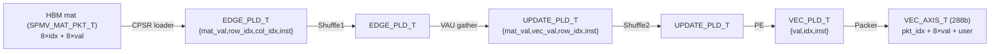
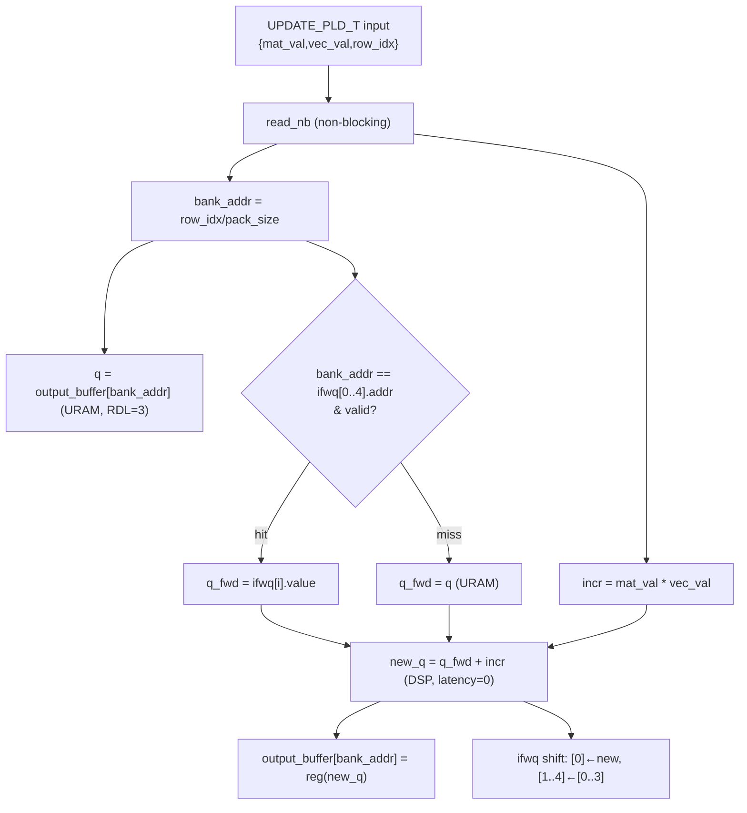
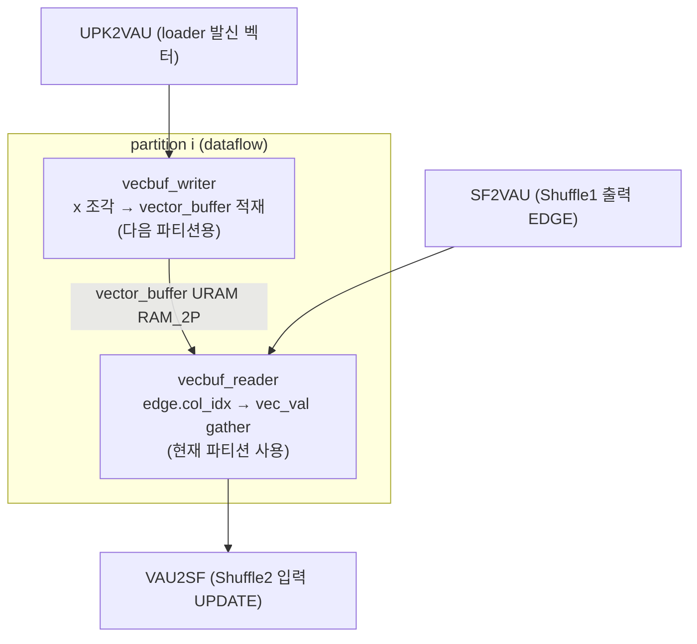
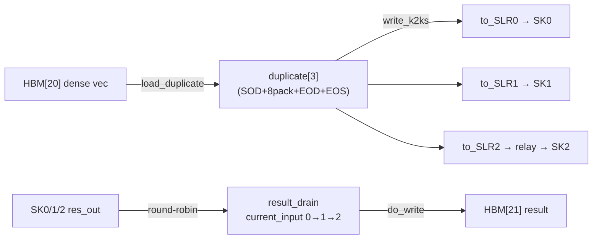
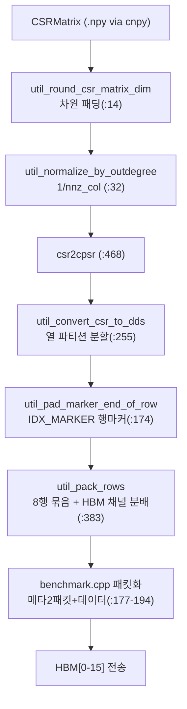

# HiSparse 모듈 통합 가이드

> 1차 요약: [`../HiSparse.md`](../HiSparse.md) — 본 문서는 그 요약을 모듈 단위로 심화한 통합 가이드다.
> 분석 대상: `\\wsl.localhost\ubuntu-24.04\home\user\project\PRJXR-HBTXR\REF\Others\HiSparse`
> 작성 원칙: 실제 소스 Read 후 `파일:라인` 근거 표기. 라인 근거 없는 추론은 "추정", 코드로 확인 불가는 "확인 불가"로 명시.

---

## 0. 문서 머리말

### 0.1 대표 케이스 선정
- **대표 연산: 단일 row-partition SpMV `y = A·x`** (정수형 IMPL=`fixed`, `ap_ufixed<32,8>`). 근거: pre-compiled 데모(`Readme.md:54-67`)·기본 IMPL이 fixed이며, `spmv/libfpga/pe.h`가 부호없는 고정소수점 PE를 정의(`pe.h:38`의 `VAL_T = ap_ufixed<32,8,AP_RND,AP_SAT>`). 정수형이 in-flight forwarding으로 II=1을 달성하는 핵심 케이스(`pe.h:66-87`)라 분석 가치가 가장 높음.
- **대표 클러스터: `spmv_cluster<4>`** (SLR1, HBM4) — 6단 dataflow(Vector Unpacker→Matrix Loader→Shuffle1→VAU×8→Shuffle2→PE×8→Result Packer)가 모두 등장하는 완결 파이프(`spmv_cluster.h:196-373`, `spmv_sk1.cpp:58-66`). 16개 클러스터가 동형이므로 1개만 정밀 분석.
- **대표 lane: PE lane id=0** (`spmv_cluster.h:320-324`) — `pe<0,OB_BANK_SIZE,PACK_SIZE>`로 8 lane 중 첫 lane. ifwq 포워딩·뱅크 주소 변환(`bank_addr = row_idx/pack_size`, `pe.h:63`)·절대행 복원(`idx = dump_count*pack_size + id`, `pe.h:109`)이 lane id에 따라 인터리브됨.
- **대표 SLR 분산: SK1(6 클러스터, HBM4-9, SLR1)** — relay 없이 직결되는 중간 SLR(`spmv.ini:9,19-24,34,38`). SK2(SLR2)는 물리적으로 멀어 relay 2개 경유(`spmv.ini:13-14,35-36,39-40`)라 timing 노하우 분석엔 SK2를, 정상 경로 분석엔 SK1을 대표로 사용.

### 0.2 수치 표기 규약
- **MAC lanes** = (HBM 채널/클러스터 수)×(클러스터당 PE lane 수). 본 설계 = `NUM_HBM_CHANNELS(16)` × `PACK_SIZE(8)` = **128-way**. 근거: `common.h:176`(채널 16) × `common.h:30`(PACK_SIZE 8). 각 PE lane은 사이클당 1 MAC(`incr = mat_val*vec_val`, `pe.h:64`).
- **scalar MAC / MAC-equivalent** = SpMV는 데이터 의존(데이터셋별). 1회 SpMV의 총 곱셈 수 = **nnz(비영점 수)**. row-end 마커(`IDX_MARKER`)는 곱셈이 아닌 행 전진(`spmv_cluster.h:80-82`)이라 MAC에서 제외. 즉 유효 MAC = nnz, 더미/skip = 마커·패딩.
- **loop trips** = 클러스터 메인 루프는 `num_col_partitions`(열 파티션) × `num_reads`(=8 lane 중 최장 stream 길이, `spmv_cluster.h:58,74`). PE dump 루프 = `used_buf_len = rows_in_partition/PACK_SIZE`(`pe.h:104`, `spmv_cluster.h:323`). 호스트는 `num_row_partitions` 만큼 커널 enqueue 반복(`benchmark.cpp:199`).
- **memory size**(payload bit):
  - PE 출력버퍼 = `OB_BANK_SIZE(8192) × VAL_T(32bit)` = **262,144 bit/뱅크**(`common.h:164`, `pe.h:127`), URAM `RAM_2P latency=3`(`pe.h:128`). 클러스터당 8뱅크 = 2.1Mbit, 16클러스터 = 33.6Mbit.
  - VAU 벡터버퍼 = `VB_BANK_SIZE(4096) × VAL_T(32bit)` = **131,072 bit/뱅크**(`common.h:165`, `vecbuf_access_unit.h:153`), URAM `RAM_2P`(`:155`). 클러스터당 8뱅크.
  - 스테이지 간 FIFO = `FIFO_DEPTH(64)` × payload, `impl=SRL`(`common.h:162`, `spmv_cluster.h:213-225`).
- **셔플 네트워크 폭** = `PACK_SIZE(8)` lane. arbiter latency=7(`shuffle.h:19`), shuffler_core 3-stage(F/A/C) II=1(`shuffle.h:255`). 2단(Shuffle1=col_idx 기준, Shuffle2=row_idx 기준, `spmv_cluster.h:249,311`).
- **타깃 데이터타입**: 값 `ap_ufixed<32,8,AP_RND,AP_SAT>`(정수 8b+소수 24b, 부호없음, `common.h:35-38`). 인덱스 `unsigned`(32b, `common.h:37`). 명령 토큰 `INST_T = ap_uint<2>`(SOD/EOD/EOS, `common.h:60-63`). KK-AXIS 패킷 288b(`32×(8+1)`, `common.h:141`).

### 0.3 운영 경로
```
[데이터: datasets/download.sh → graph/pruned_nn .npy (SuiteSparse + pruned NN)]
      │ cnpy로 .npy → CSRMatrix 로드 (data_loader.h)
      ▼
[SW 전처리: sw/data_formatter.h]
      │ util_round_csr_matrix_dim (차원 패딩, :14)
      │ util_normalize_csr_matrix_by_outdegree (out-degree 정규화, :32)
      │ csr2cpsr (CSR→CPSR: DDS 열분할 + IDX_MARKER 행마커 + 행팩킹, :468)
      ▼
[호스트 패킷화: sw/benchmark.cpp]
      │ 파티션당 메타데이터 2패킷(start + nnz길이) + 행렬 데이터 (:177-194)
      │ XRT/OpenCL로 HBM[0-21] 버퍼 할당·전송 (host.cpp)
      ▼
[HW 커널: spmv.ini connectivity로 v++ 링크 (makefile:26)]
      │ VL(SLR0) → 벡터 3-SLR 복제 → SK0(SLR0,4클러스터)/SK1(SLR1,6)/SK2(SLR2,6, relay 경유)
      │ 각 클러스터: CPSR loader→Shuffle1→VAU×8→Shuffle2→PE×8→Packer
      │ Vitis 2020.2 (xilinx_u280_xdma_201920_3) → 237 MHz (Readme.md:9)
      ▼
[결과 수집: RD(SLR0) ← 3-SLR 라운드로빈 → HBM[21] write-back]
      ▼
[검증/벤치: host.cpp compute_ref + verify(eps 1e-4), GBPS/GOPS 측정 (benchmark.cpp:345-346)]
```
- 타깃: **Alveo U280** (3-SLR HBM FPGA), shell `xilinx_u280_xdma_201920_3`, Vitis 2020.2, 237 MHz(`Readme.md:5-9,23-24`). 데모 측정 예: SpMV 0.77ms / 49.4 GBPS / 12.97 GOPS(`Readme.md:63`).

---

## 1. Repo / 시스템 개요

HiSparse = HBM 16채널을 동시 스트리밍해 CPSR 인코딩 희소 행렬에 대해 `y=A·x`를 128-way로 계산하는 multi-SLR Vitis SpMV 가속기(FPGA'22, Cornell Zhang Group, `Readme.md:1-19`). 본 repo는 **HW 커널(spmv/libfpga + 6 Vitis 커널)**, **SW 호스트·전처리(sw/)**, **사이클정확 성능모델·DSE(performance_model/)**, **단위 테스트(unit_tests/)**가 모두 자체 소스다. 정수형 main 디자인(`spmv/`) 외에 **float 변형(`spmv-fp/`)**과 **단일 커널 변형(`monolithic_spmv/`)**이 별도 트리로 존재.

### 1.1 자체 소스 vs vendor/생성물

| 구분 | 파일(자체 소스) | 역할 |
|---|---|---|
| **HLS libfpga(재사용 HW)** | `spmv/libfpga/common.h` | 타입·payload·overlay 상수(PACK_SIZE/뱅크크기/클러스터분배) |
| | `spmv/libfpga/pe.h` | PE(URAM 누산 + in-flight write forwarding, II=1) |
| | `spmv/libfpga/shuffle.h` | arbiter(7-stage)+crossbar+shuffler(2단 셔플 코어) |
| | `spmv/libfpga/vecbuf_access_unit.h` | VAU(벡터 gather + double buffering) |
| | `spmv/libfpga/spmv_cluster.h` | 1 클러스터(CPSR loader + 6단 dataflow) |
| | `spmv/libfpga/stream_utils.h` | axis_duplicate / axis_merge |
| **Vitis 커널(HW top)** | `spmv/spmv_sk0/1/2.cpp` | SLR0(4)/SLR1(6)/SLR2(6) 서브커널 |
| | `spmv/spmv_vector_loader.cpp` | 입력벡터 로드 + 3-SLR 복제 |
| | `spmv/spmv_result_drain.cpp` | 3-SLR 결과 라운드로빈 수집 → HBM |
| | `spmv/k2k_relay.cpp` | SLR간 free-running AXIS 중계(timing) |
| **시스템 연결(HW)** | `spmv/spmv.ini` | nk/slr/sp/sc 매핑(커널·SLR·HBM·AXIS) |
| | `spmv/makefile` | v++ -c per-kernel + -l link |
| **SW 호스트** | `sw/host.cpp`, `sw/benchmark.cpp` | xclbin 로드·실행·검증·GBPS/GOPS |
| | `sw/data_loader.h`, `sw/data_formatter.h` | CSR/.npy 로드 + CSR→CPSR 인코딩 |
| **성능모델/DSE(SW)** | `performance_model/performance_model.cpp` | 사이클정확 top_wrapper 모델 |
| | `performance_model/design_space_exp.cpp` | 뱅크크기·파티션 DSE 스윕 |
| **단위검증** | `unit_tests/test_{pe,shuffle,vau,spmv,...}.cpp` | 모듈별 csim 테스트 |

### 1.2 제외 목록(이름만 언급)
- **vendor(Xilinx 호스트 헬퍼)**: `xrt/includes/{xcl2/xcl2.cpp, oclHelper/oclHelper.cpp, cmdparser/cmdlineparser.cpp, logger/logger.cpp}` + 각 `.mk`. 분석 제외.
- **바이너리/생성물**: `demo_spmv.xclbin`(사전합성 비트스트림), `fpgafp193a-du.pdf`(논문 PDF), `datasets/`(download.sh로 받는 graph/pruned_nn .npy 대용량).
- **모델용 복제본(중복)**: `performance_model/include/*.h`(= `spmv/libfpga/*` 헤더의 모델용 사본). 원본 libfpga만 정밀 분석.
- **변형 트리(요약만, 본 가이드는 정수형 `spmv/` 중심)**: `spmv-fp/`(float IMPL: `pe-pob.h` partial output buffer / `pe-stall.h` stall+row interleaving), `monolithic_spmv/`(단일 거대 커널 변형, `host.cpp`+`spmv.cpp`). float-stall PE만 §3에서 정수 PE와 대비(IMPL 비교용).
- **부재(확인 불가)**: 논문 본문의 합성 PPA(LUT/FF/DSP/URAM/BRAM 절대치)·전력은 PDF가 바이너리라 **확인 불가**. csynth/cosim 리포트 파일 부재 → 합성 PPA는 본 repo 소스만으론 확인 불가.

### 1.3 클러스터-SLR-HBM 매핑(대표 구성)
근거: `common.h:173-176`, `spmv.ini:8-32`, `spmv_sk0/1/2.cpp`.

| SLR | 서브커널 | 클러스터 ID | HBM 채널 | 벡터 복제 | 비고 |
|---|---|---|---|---|---|
| SLR0 | spmv_sk0 | 0-3 (4개) | HBM[0-3] | `axis_duplicate<4>`(sk0.cpp:52) | VL·RD 동거(`spmv.ini:11-12`) |
| SLR1 | spmv_sk1 | 4-9 (6개) | HBM[4-9] | `axis_duplicate<6>`(sk1.cpp:56) | relay 2개 동거(`spmv.ini:13-14`) |
| SLR2 | spmv_sk2 | 10-15 (6개) | HBM[10-15] | `axis_duplicate<6>`(추정, sk1 동형) | relay 경유(멀리 떨어짐) |
| SLR0 | spmv_vector_loader | — | HBM[20] | — | 3-SLR 복제 발신(`spmv.ini:33-35`) |
| SLR0 | spmv_result_drain | — | HBM[21] | — | 3-SLR 수집(`spmv.ini:37-40`) |

→ 총 16 클러스터 × 8 PE lane = 128-way. SK2만 `relay_SK2_vin`/`relay_SK2_rout` 2개 relay 경유(`spmv.ini:35-36,39-40`).

---

## 2. 모듈: 타입·overlay 상수 — `common.h`

### 2.1 역할 + 상위/하위
- **역할**: 전 모듈의 기반 자료형. 값/인덱스 타입, 패킹 타입, intra-kernel payload(SOD/EOD/EOS 토큰 포함), kernel-to-kernel AXIS 패킷, overlay 상수(PACK_SIZE/뱅크크기/클러스터 분배) 정의.
- **상위**: 모든 HLS 모듈·Vitis 커널이 include(`pe.h:7`, `spmv_cluster.h:7`, `spmv_sk1.cpp:4` 등). **하위**: 없음(Xilinx `ap_fixed.h/ap_int.h/ap_axi_sdata.h`만 의존, `:4-6`).

### 2.2 데이터플로우 (payload 변천)


### 2.3 대표 코드 위치
`spmv/libfpga/common.h` (183줄 전체). 핵심: 값타입 `:35-39`, 패킹타입 `:44-54`, 토큰 `:59-96`, AXIS `:140-146`, overlay 상수 `:162-179`.

### 2.4 대표 코드 블록
```c
const unsigned PACK_SIZE = 8;                                   // common.h:30 (8-lane 병렬)
typedef ap_ufixed<32, IBITS, AP_RND, AP_SAT> VAL_T;            // :38 (IBITS=8, 소수24b)
typedef struct {PACKED_IDX_T indices; PACKED_VAL_T vals;} SPMV_MAT_PKT_T;  // :47-50
```
→ HBM 한 워드 = 8개 (idx,val) 쌍 = 8-lane 동시 공급. 값은 부호없는 Q8.24 고정소수점, 반올림(AP_RND)·포화(AP_SAT).

```c
typedef ap_uint<2> INST_T;
#define SOD 0x1 // start-of-data
#define EOD 0x2 // end-of-data
#define EOS 0x3 // end-of-stream                                // common.h:60-63
```
→ 2비트 동기화 토큰. SOD=파티션 시작, EOD=파티션 끝, EOS=스트림 끝. **모든 모듈이 이 토큰으로 가변길이 dataflow를 우아하게 동기화**.

```c
const unsigned OB_BANK_SIZE = 1024 * 8;   // 출력버퍼 뱅크 (:164)
const unsigned VB_BANK_SIZE = 1024 * 4;   // 벡터버퍼 뱅크 (:165)
const unsigned SK0_CLUSTER=4; SK1_CLUSTER=6; SK2_CLUSTER=6;
const unsigned NUM_HBM_CHANNELS = 4+6+6;  // = 16 (:173-176)
const unsigned LOGICAL_OB_SIZE = 16 * OB_PER_CLUSTER;          // :178
```
→ 클러스터 분배·뱅크 크기·논리 출력버퍼 크기가 모두 컴파일타임 상수. **U280 전용 하드코딩**(다른 디바이스 이식 시 재튜닝).

### 2.5 마이크로아키텍처
- **메모리/폭**: VAL_T 32b. EDGE_PLD_T = 32(mat_val)+32(row)+32(col)+2(inst) ≈ 98b. UPDATE_PLD_T ≈ 98b. VEC_PLD_T = 32+32+2 = 66b. VEC_AXIS_T = 288b data + 2b user(`:141-142`).
- **정량**: PACK_SIZE=8이 전 모듈 폭의 단일 노브. 변경 시 셔플 num_lanes·VAU/PE 뱅크 수·AXIS 폭(`32*(PACK_SIZE+1)`)이 연동.
- **병목/주의**: `VEC_AXIS_T`는 "only works on Vitis 2020.2"(`:139`) — AXIS 구조 호환성이 툴 버전 강결합. 인덱스 32b unsigned라 부호없는 값(out-degree 정규화 그래프) 가정(`:38` unsigned).

---

## 3. 모듈: Processing Element — `pe.h` (희소 핵심 ①)

### 3.1 역할 + 상위/하위
- **역할**: SpMV의 scatter-accumulate(누산). row_idx로 URAM 출력버퍼 뱅크에 `mat_val*vec_val`을 누적. 핵심은 **in-flight write forwarding**으로 URAM read latency=3에도 II=1 누산 달성.
- **상위**: `spmv_cluster.h:320-359`가 8 lane(`pe<0..7>`) 인스턴스화. **하위**: 없음(URAM·DSP 프리미티브 직접 제어).
- 3개 서브함수: `ufixed_pe_process`(누산, `:22`), `ufixed_pe_output`(dump, `:95`), `pe`(최상위 FSM, `:121`).

### 3.2 데이터플로우 (in-flight forwarding)


### 3.3 Function call stack
`spmv_cluster.h:320` `pe<0,OB_BANK_SIZE,PACK_SIZE>` → reset(`pe.h:131-135`) → SOD 동기(`:139-144`) → `pe_main_loop`(`:148`) → `ufixed_pe_process`(`:152`, EOD까지 누산) → SOD/EOS 분기(`:156-170`) → dump 시 `ufixed_pe_output`(`:175`).

### 3.4 대표 코드 위치
`spmv/libfpga/pe.h`: IN_FLIGHT_WRITE 구조 `:16-20`, process `:22-90`, output `:95-116`, pe 최상위 `:121-178`.

### 3.5 대표 코드 블록
```c
IN_FLIGHT_WRITE ifwq[5];                                        // pe.h:31 (URAM RDL=3 대응)
#pragma HLS array_partition variable=ifwq complete
...
IDX_T bank_addr = pld.row_idx / pack_size;                      // :63 (8-인터리브 → 뱅크주소)
VAL_T incr = pld.mat_val * pld.vec_val;                         // :64 (MAC)
VAL_T q = output_buffer[bank_addr];                            // :65 (URAM read)
VAL_T q_fwd = ((bank_addr==ifwq[0].addr)&&ifwq[0].valid)? ifwq[0].value :
              ... : q;                                          // :66-71 (5-deep 포워딩)
VAL_T new_q = q_fwd + incr;
#pragma HLS bind_op variable=new_q op=add impl=dsp latency=0    // :73 (DSP 가산기)
VAL_T new_q_reg = reg(new_q);                                  // :74 (강제 레지스터)
```
→ **RAW hazard 회피**: 같은 뱅크주소를 연속 갱신 시 URAM stale read 발생. 직전 5개 write를 `ifwq`에 보관해 일치 시 포워딩. `#pragma HLS dependence variable=output_buffer inter false`(`:42`)로 II=1 강제.

```c
out_pld.idx = dump_count * pack_size + id;                      // pe.h:109
```
→ 뱅크주소(`dump_count`)를 절대행 인덱스로 복원. lane id(0~7)가 8-way 행 인터리브의 오프셋.

```c
pe_main_loop: while (!exit) {
    #pragma HLS pipeline off                                    // pe.h:150 (task 분리)
    ufixed_pe_process<...>(input, output_buffer);              // EOD까지 누산 (:152)
    // 다음 토큰 SOD면 계속(다음 col-partition), EOS면 종료 (:156-170)
}
```
→ **여러 column partition을 같은 출력버퍼에 누적**. SOD/EOD/EOS로 파티션 경계 제어.

### 3.6 마이크로아키텍처
- **Stage 분해**: ① reset(`used_buf_len`만큼 0초기화, `:131-135`) ② 첫 SOD 동기(`:139-144`) ③ 누산 루프(II=1, `:39-89`) ④ SOD/EOS 분기(`:156-170`) ⑤ dump(II=1, `:104-115`).
- **MAC lanes**: PE 1개 = 1 MAC/cycle(`:64`). 클러스터당 8 PE, 16클러스터 = **128 MAC/cycle**. 사이클당 처리 nnz = 128(셔플 충돌 없을 때 이상치).
- **메모리/재사용**: `output_buffer[8192] × 32bit`(URAM `RAM_2P latency=3`, `:127-128`) = 262Kbit/뱅크. ifwq는 레지스터(`array_partition complete`, `:32`). 출력버퍼는 **column partition 간 재사용**(누적 캐리).
- **정량/병목**: ① URAM latency=3 → ifwq[5] 포워딩 필수(없으면 II=4+). ② DSP 가산기 강제(`:73`)로 타이밍 확보. ③ **float 변형은 fadd latency=4라 더 어려움** — `spmv-fp/libfpga/pe-stall.h`는 ifaq[8] + stall(II>1 발생, `pe-stall.h:71,119-141`), `pe-pob.h`는 partial output buffer로 우회. **정수형이 가장 효율적**(forwarding만으로 II=1).
- **IMPL 대비**(근거 `pe-stall.h:139` `op=fadd impl=fulldsp latency=4` vs `pe.h:73` `op=add latency=0`): 정수 누산은 1사이클 가산이라 5-deep 큐로 충분, float는 4사이클 가산이라 8-deep 큐 + 충돌 시 stall.

---

## 4. 모듈: 2단 셔플 네트워크 — `shuffle.h` (희소 핵심 ②)

### 4.1 역할 + 상위/하위
- **역할**: SpMV의 불규칙 인덱싱을 lane 간 **동적 라우팅**으로 해결. 입력 lane의 데이터를 `addr % num_lanes`가 가리키는 출력 lane으로 보냄. col_idx 기준(Shuffle1) / row_idx 기준(Shuffle2) 2종.
- **상위**: `spmv_cluster.h:249`(Shuffle1, EDGE_PLD_T) + `:311`(Shuffle2, UPDATE_PLD_T). **하위**: `arbiter_1p`·`crossbar`(프리미티브).
- 4개 함수: `arbiter_1p`(2 오버로드, `:24/:102`), `crossbar`(`:182`), `shuffler_core`(`:211`), `shuffler`(`:380`).

### 4.2 데이터플로우 (shuffler_core 3-stage)
```mermaid
flowchart TD
  IN["input_lanes[8] (FIFO)"] --> F["F: Fetch\nresend 우선 / read_nb / EOD→fetch_complete"]
  F --> A["A: arbiter_1p\nlatency=7, rotate_priority 회전\n각 OLid에 grant, 미grant→resend"]
  A --> C["C: crossbar\nselect[OLid]→output_lanes[OLid].write"]
  A -->|in_resend[]| F
  C --> OUT["output_lanes[8]"]
  A -->|fetch_complete.all| END["SF_ENDING:\n(ARBITER_LATENCY+1)*8 flush"]
```

### 4.3 Function call stack
`spmv_cluster.h:249` `shuffler<EDGE_PLD_T,8>` → `shuffler_core<EDGE_PLD_T,8>`(`shuffle.h:425`) → 매 사이클 `arbiter_1p<8>`(`:327`) + `crossbar<EDGE_PLD_T,8>`(`:340`). Shuffle2는 `spmv_cluster.h:311` `shuffler<UPDATE_PLD_T,8>` → row_idx 오버로드 arbiter(`:102`).

### 4.4 대표 코드 위치
`spmv/libfpga/shuffle.h`: ARBITER_LATENCY=7 `:19`, arbiter(col) `:24-99`, arbiter(row) `:102-177`, crossbar `:182-201`, shuffler_core `:211-377`, shuffler `:380-468`.

### 4.5 대표 코드 블록
```c
#pragma HLS latency min=ARBITER_LATENCY max=ARBITER_LATENCY     // shuffle.h:35 (7-stage)
...
arb_p_in_addr[i] = in_pld[(i + rotate_priority) % num_lanes].col_idx;  // :49 (회전 우선순위)
arb_p_in_valid.rrotate(rotate_priority);                       // :54
loop_A_arbsearch: for (OLid) {                                 // :56 각 출력 lane
  for (ILid: high→low) if (valid && addr%num_lanes==OLid) chosen=ILid; // :63-68
  xbar_sel[OLid] = (chosen_port + rotate_priority) % num_lanes; // :75
}
in_resend[ILid] = (in_valid[ILid] && !in_granted) ? 1 : 0;     // :88 (미grant 재전송)
```
→ 라운드로빈 공정성(`rotate_priority` 회전)으로 출력 lane 경합 해소. grant 못 받은 입력은 다음 사이클 재전송.

```c
#pragma HLS pipeline II=1                                       // shuffle.h:255
#pragma HLS dependence variable=resend inter RAW true distance=9  // :256 (arbiter latency 고려)
...
if (input_lanes[ILid].read_nb(payload[ILid])) {
  if (payload[ILid].inst == EOD) { fetch_complete[ILid]=1; valid[ILid]=0; } // :286-288
}
```
→ Fetch 단계 비차단 read. EOD 받은 lane은 fetch 완료. resend 의존성 거리 9(arbiter 7 + α).

```c
const unsigned shuffler_extra_iters = (ARBITER_LATENCY + 1) * num_lanes;  // :217 (=64)
case SF_ENDING: loop_extra_iters--; loop_exit=(loop_extra_iters==0);     // :316-318
```
→ 모든 lane fetch 완료 후 arbiter 파이프 내 잔여 패킷을 64 iteration 동안 flush 후 종료.

### 4.6 마이크로아키텍처
- **Stage 분해**: shuffler(최상위) = 첫 SOD 동기(`:391-418`) → SOD broadcast(`:420-423`) → shuffler_core(`:425`) → SOD/EOS 동기(`:433-459`) → EOS broadcast(`:464-467`), column partition마다 반복. shuffler_core = F(`:275-308`)+A(`:326-336`)+C(`:340-346`) II=1.
- **셔플 폭**: num_lanes=PACK_SIZE=8. arbiter는 8×8 grant 로직(`loop_A_arbsearch`×`loop_ab_logic_encoder_unroll`, 64 비교 unroll). crossbar는 8-to-8 mux(`:193-200`).
- **정량/병목**: ① arbiter latency=7 고정(`:35`) → 파이프 깊이. ② **resend(재전송) 메커니즘이 worst-case throughput 저하**: 같은 출력 lane을 여러 입력이 동시 요청하면 1개만 grant, 나머지 재전송 → 충돌 빈도에 throughput 의존(데이터셋 의존). ③ 종료 flush 64 iter는 파티션당 고정 오버헤드. ④ 2개 arbiter 오버로드(col/row)가 거의 동일 코드 — 중복(유지보수 부담, 추정).

---

## 5. 모듈: 벡터 버퍼 접근 유닛 — `vecbuf_access_unit.h` (VAU)

### 5.1 역할 + 상위/하위
- **역할**: 입력 벡터 `x`를 URAM에 캐싱하고, 행렬 엣지의 col_idx로 `x[col]`을 gather하여 UPDATE_PLD_T의 vec_val을 채움. **double buffering**으로 다음 파티션 벡터 적재(writer)와 현재 파티션 gather(reader)를 중첩.
- **상위**: `spmv_cluster.h:258-305`가 8 lane(`vecbuf_access_unit<0..7>`) 인스턴스화. **하위**: 없음(URAM 직접).
- 3개 함수: `vecbuf_reader`(gather, `:18`), `vecbuf_writer`(적재, `:92`), `vecbuf_access_unit`(최상위, `:146`).

### 5.2 데이터플로우 (double buffering)


### 5.3 Function call stack
`spmv_cluster.h:258` `vecbuf_access_unit<0,VB_BANK_SIZE,8>` → 파티션 루프(`vecbuf_access_unit.h:158`) 내 `#pragma HLS dataflow`(`:159`)로 `vecbuf_writer`(`:160`) ∥ `vecbuf_reader`(`:161`).

### 5.4 대표 코드 위치
`spmv/libfpga/vecbuf_access_unit.h`: reader `:18-84`, writer `:92-136`, 최상위 `:146-163`.

### 5.5 대표 코드 블록
```c
case VR_WORK:
  if (pin.inst == EOD) { state=VR_IDLE; output.write(UPDATE_PLD_EOD); } // :58-61
  else {
    IDX_T abs_addr = pin.col_idx;
    pout.vec_val = vector_buffer[(abs_addr / pack_size) % bank_size];   // :71 (gather)
    output.write(pout);                                                 // :72
  }
```
→ col_idx → `(col/8)%4096` 뱅크주소 → URAM에서 vec_val read. mat_val/row_idx는 전달.

```c
vector_buffer[(abs_addr / pack_size) % bank_size] = vec_val;           // :128 (writer)
```
→ loader가 보낸 다음 파티션 벡터 조각을 미리 적재(double buffering write 측).

```c
VAL_T vector_buffer[bank_size];
#pragma HLS bind_storage variable=vector_buffer type=RAM_2P impl=URAM  // :153-155
for (unsigned i = 0; i < num_partitions + 1; i++) {                    // :158 (+1: 마지막 EOS 소비)
    #pragma HLS dataflow                                               // :159
    vecbuf_writer<...>(vec_input, vector_buffer);
    vecbuf_reader<...>(input, output, vector_buffer);
}
```
→ **double buffering 핵심**: writer/reader를 같은 partition 루프 내 dataflow로 병렬. URAM `RAM_2P`로 read/write 동시 가능.

### 5.6 마이크로아키텍처
- **Stage 분해(reader)**: FSM(VR_IDLE/VR_WORK, `:15-16`). IDLE에서 SOD→WORK·EOS→종료(`:42-54`), WORK에서 EOD→IDLE·그외 gather(`:58-76`). II=1(`:31`).
- **메모리/재사용**: `vector_buffer[4096] × 32bit` = 131Kbit/뱅크(URAM `RAM_2P`, `:155`). 클러스터당 8뱅크. `LOGICAL_VB_SIZE = VB_PER_CLUSTER = 4096*8 = 32768`(`common.h:172,179`)이 열 파티션 크기 결정.
- **정량/병목**: ① reader II=1이라 사이클당 1 gather. ② **double buffering이 벡터 로드 지연을 완전 은닉**(다음 파티션 적재가 현재 gather와 중첩, `:159`). ③ 단점: writer/reader가 동일 URAM을 공유하므로 RAM_2P(2포트) 필수 — 뱅크당 1 read + 1 write 동시. ④ 벡터버퍼 크기(4096)가 열 파티션 수를 결정 → 큰 행렬은 파티션 多 → 셔플/PE 재시작 오버헤드 증가.

---

## 6. 모듈: CPSR 행렬 로더 + 클러스터 조립 — `spmv_cluster.h`

### 6.1 역할 + 상위/하위
- **역할**: ① `CPSR_matrix_loader`가 HBM의 CPSR 포맷을 디코딩(메타데이터 read → 8-lane 스트림 + IDX_MARKER 행마커 처리). ② `spmv_cluster`가 6단 dataflow(Unpacker→Loader→Shuffle1→VAU×8→Shuffle2→PE×8→Packer)를 조립.
- **상위**: `spmv_sk0/1/2.cpp`가 클러스터 인스턴스화(`spmv_sk1.cpp:58`). **하위**: `shuffle.h`·`vecbuf_access_unit.h`·`pe.h`.
- 4개 함수: `array_max`(`:22`), `CPSR_matrix_loader`(`:34`), `spmv_vector_unpacker`(`:109`), `spmv_result_packer`(`:133`), `spmv_cluster`(`:196`).

### 6.2 데이터플로우 (클러스터 6단)
```mermaid
flowchart LR
  VIN["vec_in AXIS"] --> UPK["Vector Unpacker\n288b → 8×VEC_PLD"]
  HBM["matrix_hbm\n(CPSR)"] --> ML["CPSR Matrix Loader\n메타2패킷→8 stream\nIDX_MARKER 행전진"]
  UPK -->|UPK2VAU[8]| VAU["VAU×8"]
  ML -->|ML2SF[8]| SF1["Shuffle1\n(col_idx%8)"]
  SF1 -->|SF2VAU[8]| VAU
  VAU -->|VAU2SF[8]| SF2["Shuffle2\n(row_idx%8)"]
  SF2 -->|SF2PE[8]| PE["PE×8\nURAM 누산"]
  PE -->|PE2PK[8]| PK["Result Packer\n8×VEC_PLD→288b"]
  PK --> ROUT["res_out AXIS"]
```

### 6.3 Function call stack
`spmv_sk1.cpp:58` `spmv_cluster<4>` → `#pragma HLS dataflow`(`spmv_cluster.h:227`) → `spmv_vector_unpacker`(`:229`) ∥ `CPSR_matrix_loader`(`:237`) ∥ `shuffler<EDGE_PLD_T,8>`(`:249`) ∥ `vecbuf_access_unit<0..7>`(`:258-305`) ∥ `shuffler<UPDATE_PLD_T,8>`(`:311`) ∥ `pe<0..7>`(`:320-359`) ∥ `spmv_result_packer`(`:365`).

### 6.4 대표 코드 위치
`spmv/libfpga/spmv_cluster.h`: array_max `:22-32`, CPSR loader `:34-107`, unpacker `:109-127`, packer `:133-193`, cluster `:196-373`.

### 6.5 대표 코드 블록
```c
IDX_T matrix_pkt_offset = num_partitions * 2;                   // spmv_cluster.h:41
IDX_T partition_info_idx = 2 * part_id;                         // :47 (파티션당 메타 2패킷)
IDX_T partition_start = matrix_hbm[partition_info_idx].indices.data[0];     // :48
PACKED_IDX_T part_len_pkt = matrix_hbm[partition_info_idx + 1].indices;     // :49 (8 stream 길이)
unsigned num_reads = array_max<IDX_T, PACK_SIZE>(stream_length);            // :58 (최장 stream)
```
→ **CPSR 메타데이터 레이아웃**: 파티션마다 2패킷(packet[0]=시작 오프셋, packet[1]=8 lane stream 길이). 호스트 패킷화(`benchmark.cpp:177-194`, `num_partitions*(1+INTERLEAVE_FACTOR)`=2배)와 정확히 정합.

```c
SPMV_MAT_PKT_T mat_pkt = matrix_hbm[i + partition_start + matrix_pkt_offset];  // :76
for (k=0; k<PACK_SIZE; k++) {
  if (i < stream_length[k]) {
    if (mat_pkt.indices.data[k] == IDX_MARKER) {
      row_idx[k] += (PACK_SIZE * mat_pkt.vals.data[k](31, 32-IBITS));         // :82 (행 전진)
    } else {
      input_to_SF_1.{mat_val,col_idx,row_idx} = ...; ML_to_SF_1_stream[k].write(...); // :84-88
    }
  }
}
```
→ **IDX_MARKER(0xffffffff) 처리가 CPSR의 핵심**: 마커면 데이터가 아니라 행 전진(빈 행 skip / row interleaving). 마커의 val 정수부 = 건너뛸 행 수 × PACK_SIZE. 8 lane이 독립 stream 길이로 진행(가변 길이).

```c
#pragma HLS stream variable=FS2PE   depth=FIFO_DEPTH           // spmv_cluster.h:216 (미선언 변수!)
```
→ **코드 결함**: 실제 스트림은 `SF2PE`(`:210`)인데 pragma는 `FS2PE` 참조. HLS가 경고 후 무시할 것으로 추정 — 합성 시 SF2PE는 기본 depth(2)로 합성될 가능성. **실제 영향 확인 불가**(리포트 부재). self-include(`:16`)도 무해(헤더가드).

### 6.6 마이크로아키텍처
- **Stage 분해**: CPSR loader = 열파티션 루프(`pipeline off`, `:42`) → 메타 read(`:48-55`) → SOD(`:67-70`) → 데이터 read 루프(II=1, `:73-92`) → EOD(`:95-98`) → EOS(`:103-106`).
- **FIFO 구성**: 6종 스트림 어레이 `[PACK_SIZE]`, depth=FIFO_DEPTH(64), `impl=SRL`(`:207-225`). dataflow로 7개 task 병렬(`:227`).
- **정량/병목**: ① loader read trips = `num_col_partitions × num_reads`(num_reads = 8 lane 중 최장, `:58,74`) → **lane 불균형이 read 효율 저하**(짧은 lane은 idle). ② array_max로 burst 길이 결정 → 8 lane 중 한 lane만 길어도 전체가 길어짐(load imbalance가 throughput 병목). ③ unpacker/packer는 288b ↔ 8×payload bitcast(II=1, `:115,140`). ④ packer는 8 lane 토큰을 and_reduce로 합의(`:173-187`) — 모든 lane이 SOD/EOD/EOS여야 토큰 emit.

---

## 7. 모듈: SLR 서브커널 — `spmv_sk0/1/2.cpp`

### 7.1 역할 + 상위/하위
- **역할**: SLR별 클러스터 묶음 Vitis 커널. 입력 벡터를 N 클러스터에 복제(`axis_duplicate`)하고 N개 클러스터를 호출한 뒤 결과를 병합(`axis_merge`).
- **상위**: Vitis 링커(`spmv.ini:2-4`, `makefile:27-43`). **하위**: `axis_duplicate/merge`(`stream_utils.h`), `spmv_cluster`.

### 7.2 데이터플로우 (SK1 대표)
```mermaid
flowchart LR
  VIN["vec_in AXIS"] -->|axis_duplicate<6>| DUP["vec_dup[6]"]
  M4["HBM4-9 (m_axi spmv_mat4-9)"] --> C["spmv_cluster<4..9>"]
  DUP --> C
  C -->|res[6]| MRG["axis_merge<6>"]
  MRG --> ROUT["res_out AXIS"]
```

### 7.3 Function call stack
`spmv_sk1`(`spmv_sk1.cpp:10`) → `#pragma HLS dataflow`(`:47`) → `axis_duplicate<6>`(`:56`) → `spmv_cluster<4..9>`(`:58-116`) → `axis_merge<6>`(`:118`).

### 7.4 대표 코드 위치
`spmv/spmv_sk1.cpp`(122줄, 6 클러스터), `spmv_sk0.cpp`(4 클러스터), `spmv_sk2.cpp`(6 클러스터, sk1 동형 추정).

### 7.5 대표 코드 블록
```c
#pragma HLS interface m_axi port=matrix_hbm_4 offset=slave bundle=spmv_mat4   // sk1.cpp:25
#pragma HLS interface axis register both port=vec_in                          // :44
#pragma HLS interface axis register both port=res_out                         // :45
#pragma HLS dataflow                                                          // :47
axis_duplicate<6>(vec_in, vec_dup);                                          // :56
spmv_cluster<4>(matrix_hbm_4, vec_dup[0], res[0], row_partition_idx, ...);   // :58-66
axis_merge<6>(res, res_out);                                                 // :118
```
→ 6개 HBM 포트(별도 bundle) + 1 입력 AXIS + 1 출력 AXIS. 스칼라는 s_axilite control(`:31-42`). dataflow로 6 클러스터 병렬.

### 7.6 마이크로아키텍처
- **차이**: sk0=4 클러스터(cluster 0-3, `axis_duplicate<4>`/`merge<4>`, `spmv_sk0.cpp:52`), sk1/sk2=6 클러스터. SLR당 클러스터 수가 SLR 자원에 맞춰 비대칭(SLR0은 VL/RD 동거라 4개).
- **정량/병목**: ① 6 클러스터가 dataflow 병렬 → SLR1 자원의 6배 복제. ② 입력 벡터 복제(`axis_duplicate<6>`)가 fanout 6 → `reg(reg())` 다중 레지스터로 타이밍 완화(`stream_utils.h:17`). ③ SLR간 자원 비대칭(4/6/6)이 부하 불균형 야기 가능 — SLR0 클러스터가 더 많은 행 담당해야 균형(추정, 호스트 파티셔닝 의존).

---

## 8. 모듈: 벡터 로더 / 결과 수집 / SLR 중계 — `spmv_vector_loader.cpp` · `spmv_result_drain.cpp` · `k2k_relay.cpp`

### 8.1 역할 + 상위/하위
- **vector_loader**: HBM[20]의 dense 벡터를 열 파티션 단위로 로드 → SOD/EOD/EOS 토큰 부착 → **3 SLR로 동시 복제** 발신.
- **result_drain**: 3 SLR에서 결과를 **라운드로빈**으로 수집 → HBM[21] write-back.
- **k2k_relay**: SLR간 free-running AXIS 패스스루(SK2 timing closure용).
- **상위**: 모두 Vitis top 커널(`spmv.ini:5-7`). **하위**: AXI master(HBM) + AXIS.

### 8.2 데이터플로우


### 8.3 Function call stack
`spmv_vector_loader`(`:96`) → `load_duplicate`(`:115`) + `write_k2ks×3`(`:116-118`). `spmv_result_drain`(`:11`) → `result_drain_main_loop`(`:37`). `k2k_relay`(`:7`) → 무한 패스스루(`:24-28`).

### 8.4 대표 코드 위치
`spmv/spmv_vector_loader.cpp`(122줄): load_duplicate `:7-79`, write_k2ks `:81-93`, 커널 `:96-121`. `spmv_result_drain.cpp`(126줄): 메인 `:37-123`. `k2k_relay.cpp`(33줄).

### 8.5 대표 코드 블록
```c
// vector_loader: 3-SLR 복제
unsigned num_col_partitions = (num_cols + LOGICAL_VB_SIZE - 1) / LOGICAL_VB_SIZE;  // :13
for (part_id) { duplicate[k].write(SOD); ... for (i<part_len/PACK_SIZE) {
  PACKED_VAL_T dv_pkt = packed_dense_vector[dv_idx];
  for (x<3) for (k<PACK_SIZE) VEC_AXIS_VAL(pout[x],k)=...; duplicate[x].write(pout[x]); // :47-56
} duplicate[k].write(EOD); } duplicate[k].write(EOS);                                  // :60-77
```
→ 열 파티션마다 SOD→8pack 벡터→EOD, 끝에 EOS. 3 SLR 동시 복제(`x<3`).

```c
// result_drain: 라운드로빈 (SLR0=4, SLR1=6, SLR2=6 클러스터)
case 0: if (counter < SK0_CLUSTER && !finished[0]) { pkt=from_SLR0.read();
  if (pkt.user==EOS) finished[0]=true; else if (!SOD && !EOD) do_write=true; counter++; }
  else { current_input=1; counter=0; }                                  // :43-60
...
unsigned abs_pkt_idx = write_counter + pkt_idx_offset;                  // :104
if (do_write) packed_dense_result[abs_pkt_idx] = rout;                  // :112
```
→ current_input 0→1→2 순환, 각 SLR에서 클러스터 수만큼 패킷 read. SOD/EOD는 write 안 함, 데이터만 HBM 저장. 모든 SLR finished면 종료(`:102`).

```c
// k2k_relay: free-running
#pragma HLS interface ap_ctrl_none port=return                         // :11
while (1) { #pragma HLS pipeline II=1 VEC_AXIS_T pkt=in.read(); out.write(pkt); } // :24-28
```
→ 제어 핸드셰이크 없는 무한 패스스루. SK2(SLR2)가 물리적으로 멀어 VL↔SK2(`relay_SK2_vin`)·SK2↔RD(`relay_SK2_rout`) 경로에 중계 삽입(`spmv.ini:35-36,39-40`).

### 8.6 마이크로아키텍처
- **메모리/재사용**: vector_loader는 dense 벡터 전체를 열 파티션 분할 스트리밍(온칩 버퍼 없음, `duplicate[3]` depth 8 FIFO, `:113-114`). result_drain은 무버퍼 스트리밍 write.
- **정량/병목**: ① vector_loader는 sparse 이득 없는 dense 스캔(`num_cols/PACK_SIZE` 패킷) — 입력 벡터는 dense라 불가피. ② result_drain 라운드로빈이 클러스터 수 비대칭(4/6/6) 그대로 순회 → SLR0이 4패킷만이라 약간 불균형(저비용). ③ k2k_relay는 II=1 패스스루, ap_ctrl_none이라 항상 활성(`:11`) — **SLR2 timing 노하우의 핵심**(대형 multi-SLR 디자인 필수 패턴).

---

## 9. 모듈: AXIS 유틸 — `stream_utils.h`

### 9.1 역할 + 상위/하위
- **역할**: 1 AXIS → N 복제(`axis_duplicate`), N AXIS → 1 cyclic 병합(`axis_merge`). 서브커널의 벡터 분배·결과 수렴.
- **상위**: `spmv_sk0/1/2.cpp`(`sk1.cpp:56,118`). **하위**: 없음.

### 9.2 대표 코드 블록
```c
// axis_duplicate<N>
VEC_AXIS_T pkt_reg = reg(reg(pkt));                            // stream_utils.h:17 (fanout 완화)
for (k<N) { pkt_replicas[k] = reg(pkt_reg); out[k].write(...); } // :19-23
exit = (pkt.user == EOS);                                      // :24
```
→ `reg(reg())` 2단 + lane별 `reg()` 1단 = 3단 레지스터로 N fanout 타이밍 완화.

```c
// axis_merge<N> (cyclic)
if (!got_EOS[i]) { VEC_AXIS_T pkt=in[i].read(); VEC_AXIS_PKT_IDX(pkt)=c;
  if (pkt.user!=EOS) out.write(pkt); else got_EOS[i]=1;
  if (!SOD && !EOD && !EOS) c++; }                             // :46-60
i = (i+1) % N; exit = got_EOS.and_reduce();                    // :62-63
```
→ N 입력 라운드로빈, EOS 받은 입력 skip, 데이터만 pkt_idx(c) 재부여. 모두 EOS면 종료 후 EOS 1회 emit(`:67-74`).

### 9.3 마이크로아키텍처
- **정량/병목**: duplicate는 II=1 broadcast(fanout이 클수록 레지스터 필요). merge는 cyclic이라 N lane 중 1개씩 순회 → 입력 분포 불균형 시 idle 발생. 둘 다 EOS 토큰으로 종료(가변 길이 대응).

---

## 10. 모듈: SW 호스트 + CSR→CPSR 인코딩 — `sw/host.cpp` · `sw/benchmark.cpp` · `sw/data_formatter.h`

### 10.1 역할 + 상위/하위
- **역할**: ① CSR 행렬을 CPSR로 인코딩(`data_formatter.h`). ② 호스트가 파티션 메타데이터+행렬을 HBM 패킷으로 적재, xclbin 실행, 결과 검증, GBPS/GOPS 측정(`benchmark.cpp`/`host.cpp`).
- **상위**: 사용자 CLI(`make benchmark`, `Readme.md:70`). **하위**: cnpy, XRT/OpenCL(vendor `xcl2`).

### 10.2 데이터플로우 (CSR→CPSR)


### 10.3 대표 코드 위치
`sw/data_formatter.h`: round `:14-29`, normalize `:32-47`, marker(no-skip) `:50-83`, marker(skip-empty) `:86-171`, dds `:255-313`, pack_rows `:383-446`, csr2cpsr `:468-544`. `sw/benchmark.cpp`: 패킷화 `:175-194`, GBPS/GOPS `:345-346`.

### 10.4 대표 코드 블록
```c
// out-degree 정규화 (그래프 SpMV: 부호없는 값 보장)
csr_matrix.adj_data[i] = 1.0 / nnz_each_col[col_idx];          // data_formatter.h:44
```
→ 값을 `1/(열 nnz)`로 정규화 → [0,1] 양수 → `ap_ufixed`(부호없음)와 정합. **이것이 부호없는 고정소수점 가정의 근거**.

```c
// IDX_MARKER 행마커 (skip empty rows + row interleaving)
val_marker[row_idx]++;  // 빈 행 수 누적                        // data_formatter.h:133
adj_indices_swap[count] = idx_marker;                          // :160 (행 끝에 마커)
```
→ 비영점 행만 남기고, 마커의 val에 "건너뛸 행 수"를 기록. HW loader(`spmv_cluster.h:82` `row_idx[k] += PACK_SIZE*vals`)와 정확히 정합.

```c
// 호스트 패킷 레이아웃: 파티션당 메타 2패킷
channel_packets[pc].resize(num_partitions*(1+INTERLEAVE_FACTOR) + ...);  // benchmark.cpp:175
channel_packets[pc][ij*2].indices.data[0] = ...start;                    // :178 (packet0)
channel_packets[pc][ij*2 + 1].indices = ...nnz;                          // :182 (packet1)
```
→ INTERLEAVE_FACTOR=1이므로 파티션당 2패킷 = HW `matrix_pkt_offset = num_partitions*2`(`spmv_cluster.h:41`)와 비트정확 정합.

```c
bmark_res.throughput_GBPS = gbs / (spmv_time_ms/1000);        // benchmark.cpp:345
bmark_res.throughput_GOPS = Mops / spmv_time_ms;              // :346
```
→ 데이터 처리량 = 연산처리량/2×8(`Readme.md:67`, 각 nnz가 1 MAC=2 op, 8B/원소).

### 10.5 마이크로아키텍처(전처리 관점)
- **정량/병목**: ① csr2cpsr는 행 차원이 `pack_size×num_hbm_channels=128`로 나눠떨어져야 함(`:475`) → round로 패딩. ② 열 차원은 `pack_size=8` 배수(`:482`). ③ 전처리 시간이 SpMV 실행보다 김(데모 0.64s vs 0.77ms, `Readme.md:63`) — 1회 인코딩 후 재사용 가정. ④ `util_reorder_rows_ascending_nnz`(`:337`)·INTERLEAVE_FACTOR(현재 1) 등 미사용/확장 훅 존재.

---

## 11. 모듈: 성능 모델 + 단위 테스트 — `performance_model/` · `unit_tests/`

### 11.1 역할 + 상위/하위
- **역할(perf model)**: 합성 없이 사이클정확 top_wrapper로 SpMV throughput/대역폭을 모델링하고 뱅크크기·파티션 등 설계변수 DSE.
- **역할(unit tests)**: PE/shuffle/VAU/cluster/spmv 모듈별 csim 검증.
- **상위**: 개발자 도구. **하위**: `performance_model/include/*`(libfpga 모델용 복제본).

### 11.2 대표 코드 위치
`performance_model/performance_model.cpp`(top_wrapper `:24-`, 6 커널 직접 호출 `:60-120`), `design_space_exp.cpp`(top_wrapper + DSE 스윕 `:25-`). `unit_tests/test_{pe,shuffle,vau,pe_cluster,spmv,io,app,module_*}.cpp`.

### 11.3 대표 코드 블록
```c
// perf model: 실제 SLR 토폴로지를 SW로 재현 (relay 포함)
spmv_vector_loader(packed_dense_vector, num_cols, vec_VL_to_SK0, vec_VL_to_SK1, vec_VL_to_relay, ...);  // :60
sf1_iter_cnt[0] = spmv_sk0(matrix_hbm_0..3, vec_VL_to_SK0, res_SK0_to_RD, ...);   // :71
k2k_relay(vec_VL_to_relay, vec_relay_to_SK2);                                     // :107
sf1_iter_cnt[2] = spmv_sk2(matrix_hbm_10..15, ...);                               // :114
```
→ VL→SK0/SK1/relay→SK2→RD 전체 토폴로지를 함수 호출로 모델링. `sf1_iter_cnt`(셔플 iteration 수)로 사이클 추정. **합성 전 빠른 DSE 인프라**.

### 11.4 마이크로아키텍처
- **정량/병목**: perf model은 tunable 파라미터(vb_bank_size/ob_bank_size/logical_*를 인자로, `performance_model.cpp:48-52`)를 받아 설계변수 스윕. **합성 PPA(LUT/FF/DSP/URAM)는 모델·리포트 부재로 확인 불가** — throughput/사이클만 예측. unit test는 모듈 단위 csim(합성 미수반).

---

## 12. 모듈 한눈 요약 표

| 모듈 | 파일 | 핵심 함수(라인) | 역할 | 대표 정량 |
|---|---|---|---|---|
| 타입/overlay | common.h | VAL_T(:38), 토큰(:60-63), overlay(:162-179) | 자료형·128-way 상수 | PACK_SIZE=8, 채널16, ap_ufixed<32,8> |
| PE | pe.h | pe(:121), process(:22), ifwq(:31) | URAM 누산 + forwarding | 1 MAC/lane, II=1, OB 8K×32b/뱅크 |
| 셔플 | shuffle.h | shuffler(:380), arbiter(:24/:102), core(:211) | 2단 동적 라우팅 | 8-lane, arb latency=7, resend |
| VAU | vecbuf_access_unit.h | vau(:146), reader(:18), writer(:92) | 벡터 gather + double buf | VB 4K×32b/뱅크, RAM_2P URAM |
| CPSR/클러스터 | spmv_cluster.h | cluster(:196), CPSR loader(:34) | 6단 dataflow + 행마커 | 메타2패킷/파티션, IDX_MARKER 행전진 |
| SLR 서브커널 | spmv_sk0/1/2.cpp | sk1(:10) | SLR별 N클러스터 묶음 | 4/6/6 클러스터, dup/merge |
| 벡터로더 | spmv_vector_loader.cpp | load_duplicate(:7) | dense 벡터 3-SLR 복제 | SOD/EOD/EOS 토큰 부착 |
| 결과수집 | spmv_result_drain.cpp | main(:37) | 3-SLR 라운드로빈 → HBM | current_input 0→1→2 |
| SLR 중계 | k2k_relay.cpp | k2k_relay(:7) | free-running 패스스루 | ap_ctrl_none, SK2 timing |
| AXIS 유틸 | stream_utils.h | duplicate(:8), merge(:36) | 1→N / N→1 | reg(reg()) fanout 완화 |
| CSR→CPSR | data_formatter.h | csr2cpsr(:468), marker(:174) | SW 전처리 인코딩 | out-degree 정규화, 행마커 |
| 호스트/벤치 | benchmark.cpp/host.cpp | 패킷화(:177), GBPS(:345) | 적재·실행·검증·측정 | eps 1e-4, GBPS=GOPS/2×8 |
| 성능모델/DSE | performance_model.cpp | top_wrapper(:24) | 사이클정확 모델 | 합성PPA 확인불가 |

---

## 13. 읽기 순서 / 코드 추적 순서

1. **자료형 먼저**: `common.h` — VAL_T(`:38`)·토큰 SOD/EOD/EOS(`:60-63`)·AXIS(`:140-146`)·overlay 상수(`:162-179`). 모든 모듈의 공통어.
2. **희소 핵심 ① PE**: `pe.h` ifwq forwarding(`:66-87`)·bank_addr(`:63`)·DSP 가산(`:73`) → II=1 누산의 본질.
3. **희소 핵심 ② 셔플**: `shuffle.h` arbiter rotate_priority(`:49`)·resend(`:88`)·shuffler_core F/A/C(`:275-346`) → 동적 라우팅.
4. **VAU**: `vecbuf_access_unit.h` gather(`:71`)·double buffering dataflow(`:158-162`).
5. **클러스터 조립**: `spmv_cluster.h` CPSR loader IDX_MARKER(`:80-82`)·6단 dataflow(`:227-368`) → 전체 파이프 흐름.
6. **시스템 통합**: `spmv_sk1.cpp`(dup→6클러스터→merge) → `spmv.ini`(SLR/HBM 매핑) → `vector_loader`/`result_drain`/`k2k_relay`(SLR간 데이터 분배).
7. **SW 정합**: `data_formatter.h` csr2cpsr(`:468`)·행마커(`:174`) ↔ HW loader(`spmv_cluster.h:82`) 비교 → CPSR 포맷 양방향 이해.
8. **측정/DSE**: `benchmark.cpp` 패킷화(`:177-194`)·GBPS(`:345`) → `performance_model.cpp` top_wrapper(`:24`).
9. **IMPL 대비**: `spmv-fp/libfpga/pe-stall.h`(float ifaq[8]+stall, `:71,119`) vs `pe.h`(정수 ifwq[5], II=1) → 양자화가 PE 효율에 미치는 영향.

---

## 14. 병목 후보 & 병렬도/DSE 노브

### 14.1 병목 후보
1. **셔플 resend(재전송) — worst-case throughput 저하**(`shuffle.h:88,277-279`): 같은 출력 lane을 여러 입력이 동시 요청 시 1개만 grant, 나머지 재전송. 충돌 빈도가 col_idx/row_idx 분포에 의존 → 데이터셋별 throughput 변동. SpMV의 근본적 불규칙성을 동적 라우팅으로 흡수하나 충돌은 잔존.
2. **CPSR lane 불균형 — load imbalance**(`spmv_cluster.h:58` `num_reads = array_max(stream_length)`): 8 lane 중 한 lane만 길어도 전체 read가 그 길이만큼 → 짧은 lane idle. `util_reorder_rows_ascending_nnz`(`data_formatter.h:337`)로 완화 시도하나 INTERLEAVE_FACTOR=1.
3. **PE URAM latency=3 + forwarding 깊이**(`pe.h:31,128`): 5-deep ifwq로 정수는 II=1이나, float는 fadd latency=4라 8-deep ifaq + stall(II>1, `pe-stall.h:119-141`) 또는 partial output buffer 필요 → **정수형이 PE 효율 최우선**.
4. **벡터버퍼 크기(4096) ∝ 열 파티션 수**(`common.h:165,179`): 큰 행렬은 열 파티션 多 → 파티션마다 셔플/PE 재시작(SOD/EOD/EOS 동기 + 64-iter flush) 오버헤드 누적.
5. **SLR 자원 비대칭(4/6/6)**(`common.h:173-175`): SLR0이 VL/RD 동거로 4클러스터뿐 → 행 분배 불균형 가능. 호스트 파티셔닝이 균형 책임.
6. **SK2 relay 2개 경유 latency**(`spmv.ini:35-36,39-40`): SLR2 물리 거리로 relay 삽입 → timing은 확보하나 SK2 경로 latency 증가(파이프라인이라 throughput 영향은 작음, 추정).
7. **코드 결함**: `spmv_cluster.h:216` 미선언 `FS2PE` pragma(실제 SF2PE), self-include(`:16`) → 합성 영향 **확인 불가**(리포트 부재). SF2PE가 기본 depth로 합성되면 PE 앞 FIFO 부족 가능성(추정).
8. **호스트 전처리 시간 >> SpMV**(`Readme.md:63`, 0.64s vs 0.77ms): CSR→CPSR 인코딩이 1회성이라 amortize 가정. 동적 행렬엔 부담.

### 14.2 병렬도/DSE 노브
- **PACK_SIZE(=8)**(`common.h:30`): lane 병렬도. 변경 시 셔플 num_lanes·VAU/PE 뱅크 수·AXIS 폭(`32*(PACK_SIZE+1)`) 연동. 16채널×8 = 128-way 고정.
- **NUM_HBM_CHANNELS(=16) / SK0/1/2_CLUSTER(4/6/6)**(`common.h:173-176`): 채널·SLR 분배. U280 16채널·3SLR 전용. 다른 디바이스 이식 시 핵심 재튜닝.
- **OB_BANK_SIZE(8192) / VB_BANK_SIZE(4096)**(`common.h:164-165`): 출력/벡터 버퍼 깊이 = 행/열 파티션 입도. URAM 용량 vs 파티션 수 트레이드오프 → `design_space_exp.cpp`의 주 DSE 변수(`performance_model.cpp:48-52` tunable 인자).
- **FIFO_DEPTH(=64)**(`common.h:162`): 스테이지 간 SRL FIFO 깊이. dataflow 버퍼링 vs 자원.
- **IMPL(fixed/float_pob/float_stall)**(`Readme.md:72`): 양자화 선택. fixed=`ap_ufixed<32,8>`+ifwq II=1(`pe.h`), float_pob=partial output buffer(`pe-pob.h`), float_stall=stall+row interleaving(`pe-stall.h`). 정수형이 면적·throughput 최적.
- **INTERLEAVE_FACTOR(=1)**(`common.h:169`): 현재 비활성. >1 시 row interleaving 강화 노브(skip-empty-rows marker, `data_formatter.h:86`). 확장 여지.
- **skip_empty_rows**(`data_formatter.h:180`): CPSR 빈 행 skip on/off. sparse 그래프에서 효과적, dense엔 무의미.

---

*근거 파일(절대경로)*:
`\\wsl.localhost\ubuntu-24.04\home\user\project\PRJXR-HBTXR\REF\Others\HiSparse\spmv\libfpga\{common.h,pe.h,shuffle.h,vecbuf_access_unit.h,spmv_cluster.h,stream_utils.h}`,
`...\spmv\{spmv_sk0.cpp,spmv_sk1.cpp,spmv_sk2.cpp,spmv_vector_loader.cpp,spmv_result_drain.cpp,k2k_relay.cpp,spmv.ini,makefile}`,
`...\sw\{host.cpp,benchmark.cpp,data_formatter.h,data_loader.h,Readme.md(repo root)}`,
`...\performance_model\{performance_model.cpp,design_space_exp.cpp}`,
`...\spmv-fp\libfpga\{pe-stall.h,pe-pob.h}`(IMPL 대비),
`...\Readme.md`.
