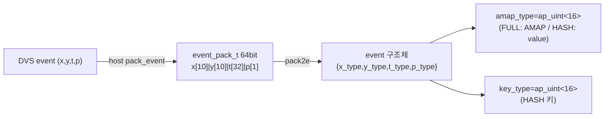
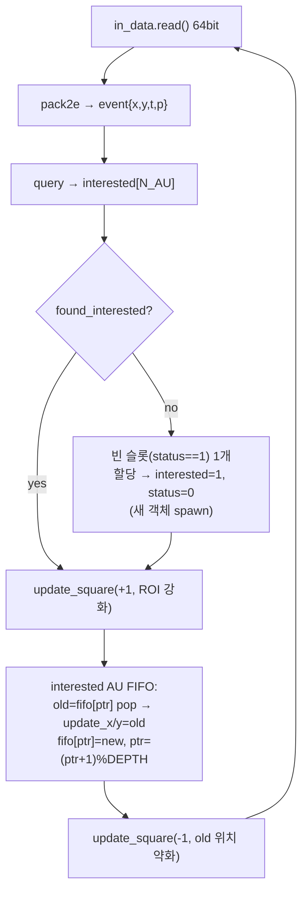
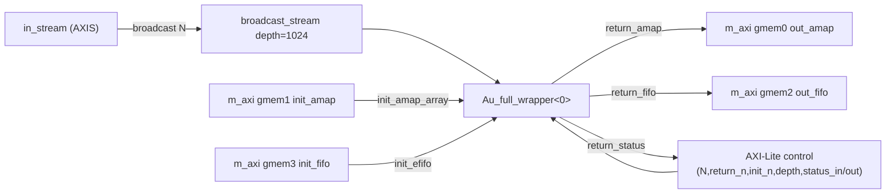
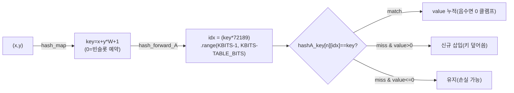
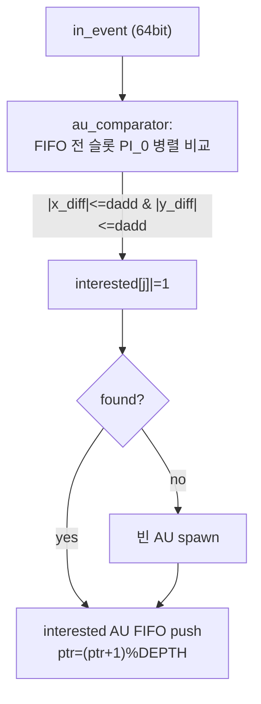
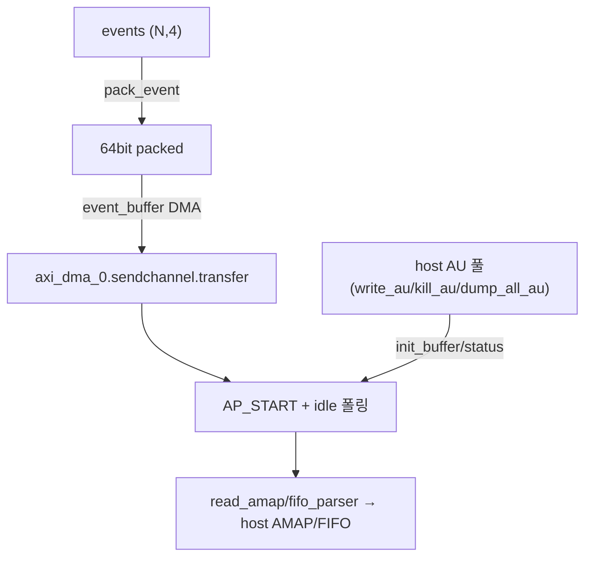
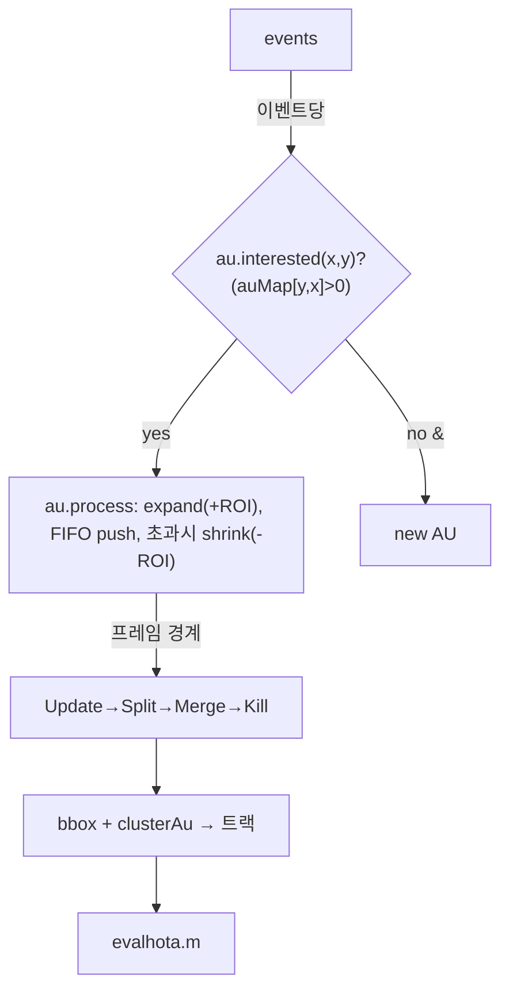

# REMOT-FPGA-22 모듈 통합 가이드

> 1차 요약: [`../REMOT-FPGA-22.md`](../REMOT-FPGA-22.md) — 본 문서는 그 요약을 모듈 단위로 심화한 통합 가이드다.
> 분석 대상: `\\wsl.localhost\ubuntu-24.04\home\user\project\PRJXR-HBTXR\REF\Others\REMOT-FPGA-22`
> 작성 원칙: 실제 소스 Read 후 `파일:라인` 근거 표기. 라인 근거 없는 추론은 "추정", 코드로 확인 불가는 "확인 불가"로 명시. 형제 가이드 `REF/Analysis/CNN-Accel/ESDA/MODULE_GUIDE.md`와 동형(H-HLS) 구조.

---

## 0. 문서 머리말

### 0.1 대표 케이스 선정
- **대표 변형: FULL-AMAP (PYNQ-Z2 데모용 `pynq/full`)**. 근거: dense 2D AMAP 배열이라 query/update_square 의 본질(슬라이딩 윈도우 어텐션 맵)이 메모리 추상화 없이 직접 드러남(`hls/pynq/full/amap.h:3-80`). HASH/FIFO 변형은 이 FULL 의 메모리 표현만 치환한 것이므로 FULL 을 먼저 이해해야 나머지가 풀린다(`hls/README.md:2`).
- **대표 연산: AMAP `update_square` (이벤트당 ROI 7×7 갱신)**. 근거: 한 이벤트가 들어오면 ROI 중심을 ±`d`(=3) 정사각형으로 `value=±1` 누적하는 2-stage DATAFLOW 가 본 가속기의 단일 무거운 연산(`hls/pynq/full/amap.h:28-80`). query 는 1픽셀 조회(`:3-25`)라 가볍고, update_square 가 처리량을 지배.
- **대표 운영 모드: 슬라이딩 윈도우(+1 강화 / -1 약화)**. 근거: `au_full` 이 이벤트당 (새 위치 +1) → (FIFO 에서 가장 오래된 이벤트 pop) → (그 위치 -1) 순서로 두 번 update_square 를 호출(`hls/pynq/full/au_amap.h:72,96`). FIFO_DEPTH 깊이만큼의 최근 이벤트만 ROI 에 살아있어, 어텐션 맵이 객체를 따라 이동.
- **대표 보드: PYNQ-Z2 (xc7z020-clg484-1)**. 근거: `hls/pynq/full/script.tcl:11` `set_part {xc7z020-clg484-1}`. Ultra96 변형은 `xczu3eg-sbva484-2-i`(`hls/ultra96/full/script.tcl:11`)로 동일 알고리즘·다른 part.

### 0.2 수치 표기 규약
- **병렬 lane = 동시 처리되는 Attention Unit 수 = `N_AU`**. query/update_square/spawn 의 모든 AU 루프가 `#pragma HLS UNROLL` 또는 `ARRAY_PARTITION complete`로 펼쳐져 AU 차원이 공간 병렬화됨(`amap.h:13,18,47,68`; `top.cpp:21`). 따라서 lane 수 = `N_AU`(컴파일타임 `#define`).
- **이벤트당 연산 = query 1픽셀 조회 + update_square ×2회**. update_square 1회 = QL(7×7=49 좌표 패킹, `interested` AU만) + IL(최대 49 누적, `read==0` skip). 즉 이벤트당 ROI 갱신 ≈ `2 × (2d+1)² × (interested AU 수)` 메모리 R-M-W(`amap.h:43-79`; `au_amap.h:40-97`). 여기서 `2d+1=7`(`para.h:12` d=3).
- **메모리 접근(이벤트당)** = query: `N_AU` 병렬 1-read(`amap.h:17-23`); update_square: QL 단계 49 write-to-FIFO + IL 단계 ≤49 AMAP R-M-W(`amap.h:75`). FIFO push/pop: AU당 1 read + 1 write(`au_amap.h:79,90`).
- **loop trips**:
  - 메인 이벤트 루프 = `N`(host 가 넘긴 이벤트 수, `au_full` for n<N, `au_amap.h:40`).
  - ROI 루프 = `(2d+1)²` = 49(FULL d=3) / 121(FULL_final d=5) / 121(FIFO update_square 의 ±5 윈도우, `fifo.h:129-146`).
  - AMAP 회수 루프 = `HEIGHT*WIDTH`(`return_amap`, `au_amap.h:110`); 해시 회수 = `T_SIZE`(`au_hash.h:111`); FIFO 회수 = `FIFO_DEPTH`(`au_fifo.h:125`).
- **memory size(payload bit)**:
  - FULL AMAP = `N_AU × HEIGHT × WIDTH × VBITS`(`top.cpp:20` `amap[N_AU][HEIGHT*WIDTH]`, VBITS=16).
  - HASH 테이블 = `N_AU × T_SIZE × (KBITS key + VBITS value)`(`au_hash.h:20-21` key/value 분리 배열, KBITS=16/VBITS=16).
  - 이벤트 FIFO = `N_AU × FIFO_DEPTH × 64bit`(`top.cpp:24` `event_fifo[N_AU][FIFO_DEPTH]`, 64bit/이벤트).
- **3변형 메모리 차이**(아래 N+1, N+3 표에서 정량). 핵심: FULL 은 AU당 H×W 픽셀(=대형), HASH 는 AU당 T_SIZE 엔트리(=축소), FIFO-ONLY 는 AMAP 자체를 없애고 이벤트 FIFO 거리비교로 대체(=최소).
- **타깃 데이터타입**: 전부 정수/비트조작. 부동소수 없음. 좌표 X/Y 각 10bit(`para.h:2-3`, 최대 1024²), 타임스탬프 32bit, 극성 1bit(`para.h:4-5`), AMAP/해시 값 16bit signed `value_type`(`para.h:41`), 이벤트 패킹 64bit `event_pack_t`(`para.h:28`), 해시 키 16bit `key_type`(`para.h:40`).

### 0.3 운영 경로
```
[DVS 이벤트 스트림 (.mat / 라이브 센서)]
      │ host: pack_event() → x|(y<<10)|(t<<20)|(p<<52) 64bit (au_hardware_full.py:93-100)
      ▼
[host: PYNQ Overlay 적재 + DMA 버퍼 allocate + AXI-Lite 레지스터 세팅]
      │  au_hardware_full.py:14-49 (output/init/fifo physical_address 기록)
      ▼
[AXI-DMA sendchannel.transfer → in_stream (AXIS event_axi)]
      │  au_hardware_full.py:151
      ▼
[HLS top(): #pragma HLS DATAFLOW]
      │  broadcast() → broadcast_stream(depth=1024) (top.cpp:78-80)
      ▼
[Au_full_wrapper: static AMAP/FIFO on-chip 상주]
      │  init_status/init_amap_array/init_efifo (체크포인트 복원)
      │  au_full(): [이벤트당] query → (no-interest면 빈 AU spawn) → update_square(+1)
      │             → FIFO push(new)/pop(oldest) → update_square(-1)
      │  return_status/return_fifo/return_amap (회수)
      ▼
[host: dump/kill/read_status로 AU 풀 관리 → au_functions.bbox/clusterAu → 트랙 박스/ID]
      │  au_hardware_full.py:176-249, software_basic/au_functions.py:8-58
      ▼
[eval/eval.py → Matlab evalhota.m: HOTA/DETA/ASSA 정확도]
```
- 빌드 타깃: PYNQ-Z2 `xc7z020-clg484-1` / Ultra96 `xczu3eg-sbva484-2-i`, **clk period 3ns**(`script.tcl:12`, 목표 333MHz). 흐름: csynth→export IP→Vivado bd→.bit/.hwh(`Makefile:13-25`), PYNQ v2.6 / Vivado 2020.2(`README.md:30-36`).

---

## 1. Repo / 변형 개요

REMOT = DVS(이벤트 카메라) 이벤트 스트림을 FPGA 의 병렬 Attention Unit(AU) 레이어로 처리해 다중객체추적(MOT)하는 HW/SW 통합 가속기(`README.md:17-19`). 각 AU 는 관심영역(ROI)에만 주목하며, 이벤트 위치를 따라 ROI(=어텐션 맵 AMAP)가 이동. **HW = 이벤트→AMAP 갱신 고속 엔진, SW(host) = AU 풀 관리(spawn/kill/checkpoint)·박스화·트랙ID·HOTA 평가**의 명확한 분담(`../REMOT-FPGA-22.md` 5절).

본 repo 는 **HLS 커널(자체 소스)**, **PYNQ 드라이버(자체)**, **Python/Matlab 알고리즘 레퍼런스(자체)**가 핵심이고, 비트스트림/Vivado bd tcl/데이터셋은 생성물이라 제외(아래 1.2).

### 1.1 변형(FULL/HASH/FIFO) × 보드(pynq/ultra96) 매트릭스

총 12개 빌드 구성 = {full, hash, fifo} × {데모, _final} × {pynq, ultra96}(`hls/README.md:8`). `_final` = 최대 AU 수의 최종 구성(논문 Fig.7c), 비접미사 = shapes_6dof 데모용(`hls/README.md:4`).

| 구분 | 파일(자체 소스, FULL 기준) | 역할 |
|---|---|---|
| **HLS 커널(HW)** | `hls/pynq/full/para.h` | `#define` 파라미터(N_AU/d/FIFO_DEPTH/비트폭) + ap_int 타입 |
| | `hls/pynq/full/amap.h` | `query`(AU 병렬 1픽셀 조회) + `update_square`(ROI 7×7 ±1 누적) |
| | `hls/pynq/full/au_amap.h` | `au_full`(AU 메인루프: query→spawn→±update→FIFO) + init/return 함수군 + `broadcast` |
| | `hls/pynq/full/top.cpp`,`top.h` | AXI top 인터페이스 + `Au_full_wrapper`(static AMAP/FIFO 상주 + DATAFLOW) |
| | `hls/pynq/full/tb.cpp` | csim 테스트벤치(이벤트 2종 ×4 주입) |
| **HASH 변형** | `hls/pynq/hash/hash.h` | `hash_map`/`hash_forward_A`(Knuth) + `insert_2way`(1-slot) + query/update_square |
| | `hls/pynq/hash/au_hash.h` | `au_hash`(FULL 동형) + `return_hash`/`init_hash_array` 등 |
| **FIFO 변형** | `hls/pynq/fifo/au_fifo.h` | `au_comparator`(FIFO 거리비교, AMAP 없음) + `au_fifo`(메인루프) |
| | `hls/pynq/fifo/fifo.h` | (top.cpp 미사용) 실제 2-way set-assoc 해시 insert/query/update_square |
| **빌드(SW)** | `hls/pynq/full/script.tcl` | Vitis HLS 스크립트(set_part/clk 3ns/csynth/export) |
| | `hls/pynq/full/Makefile` | hls→bitstream→unpack(.bit/.hwh를 drive/로 export) |
| | `hls/pynq/Makefile` | 서브디렉토리 일괄 빌드 |
| **드라이버(host)** | `hardware/drive/pynq/au_hardware_full.py` | PYNQ Overlay 적재·이벤트 스트림·AU 라이프사이클·throughput |
| | `hardware/drive/pynq/au_hardware_{hash,fifo_only}.py` | HASH/FIFO 변형 드라이버 |
| | `hardware/drive/pynq/au_functions.py` | (드라이버측 추적 유틸) |
| **알고리즘 레퍼런스(SW)** | `software/software_basic/sw_wrap.py` | 순수 SW MOT 컨트롤러(Update/Split/Merge/Kill) + AU 클래스 |
| | `software/software_basic/au_functions.py` | bbox/IoM/clusterAu 후처리 |
| | `software/hash/hash_au.py`,`hash_sw.py` | HASH 정확도 실험(충돌/dependency 카운트) |
| **평가(SW)** | `hardware/eval/eval.py`, `software/*/eval.py` | HOTA 평가(Matlab Engine `evalhota.m` 호출) |

### 1.2 제외 목록(이름만 언급)
- **third-party/HLS lib**: `ap_int.h`/`hls_stream.h`/`ap_axi_sdata.h`(Xilinx, `top.h:4-6`), PYNQ(`pynq.Overlay/allocate/Xlnk`), Matlab HOTA 구현(`hota.m`/`evalhota.m`).
- **Vivado/Vitis 생성물**: 모든 `*/bitfile/`(`.bit`,`.hwh`,`ps7_init*.{c,h,tcl}`,`psu_init*`,`drivers/top_v1_0/src/xtop*`,`top.tcl`), `*/vivado/*_proj.tcl`(bd 생성 스크립트), `*/<hls_name>/solution1/`(csynth 산출).
- **데이터셋/결과 산출물**: `*.mat`(events/GT/cmap), `*.avi`(트랙 영상), `*.csv`(result), `software/*/result/`.
- **부재/확인 불가**: 합성 PPA 리포트(csynth/cosim/vivado util·timing·power) 본 repo 미포함 → 모든 자원/주파수/latency 실측치는 **확인 불가**(bitfile = 생성물). 논문 Fig.7 수치는 코드로 재현 불가.

---

## 2. 모듈: 파라미터/자료형 — `para.h`

### 2.1 역할 + 상위/하위
- **역할**: 이벤트 비트필드·AMAP/해시 타입·AU 수·ROI 반경 등 **컴파일타임 상수와 ap_int 타입**을 정의. 변형/보드/데모-final 마다 이 파일 하나만 달라짐(나머지 커널 헤더는 거의 동일).
- **상위**: 모든 HLS 커널이 `top.h:11`에서 include. **하위**: 없음(원자 정의).

### 2.2 데이터플로우


### 2.3 대표 코드 위치
`hls/pynq/full/para.h`(45줄 전체). 변형 비교: `hash/para.h`, `fifo/para.h`, `*_final/para.h`.

### 2.4 대표 코드 블록
```cpp
#define VBITS 16   #define XBITS 10   #define YBITS 10
#define TBITS 32   #define PBITS 1
#define HEIGHT 260 #define WIDTH 346  // DAVIS346 센서 해상도 (para.h:1-7)
#define N_AU 2     #define FIFO_DEPTH 128   #define d 3   // (para.h:10-12)
```
→ 좌표 10bit씩(최대 1024²)인데 HEIGHT/WIDTH 는 데이터셋별로 다름: FULL 260×346(DAVIS346), HASH/FIFO 180×240(`hash/para.h:5-6`, `fifo/para.h:5-6`).

```cpp
typedef ap_uint<64> event_pack_t;       // 이벤트 1개 = 64bit 1워드 (para.h:28)
typedef ap_uint<VBITS> amap_type;       // AMAP 셀 = 16bit (para.h:30)
typedef hls::axis<event_pack_t,1,1,1> event_axi;  // AXI-Stream (para.h:34)
typedef ap_int<VBITS> value_type;       // 누적값(부호 있음, -1 약화용) (para.h:41)
```
→ AMAP 셀은 `ap_uint<16>` 저장이지만 누적 시 `value_type`(signed)로 다뤄 -1 약화 가능. 이벤트 = 64bit 한 워드라 AXIS 단일 비트 전송.

### 2.5 마이크로아키텍처
- **변형별 핵심 차이**(전부 `para.h`의 `#define`):

| 파일 | N_AU | d / ROI | FIFO_DEPTH | HEIGHT×WIDTH | T_SIZE |
|---|---|---|---|---|---|
| `pynq/full/para.h` | **2** | 3 / 7×7 | 128 | 260×346 | - |
| `pynq/full_final/para.h` | **2** | 5 / 11×11 | 1024 | 260×346 | - |
| `pynq/hash/para.h` | **10** | 3 / 7×7 | 64 | 180×240 | 8192 (TABLE_BITS 13) |
| `pynq/hash_final/para.h` | **10** | 5 / 11×11 | 1024 | 180×240 | 8192 |
| `pynq/fifo/para.h` | **12** | dadd 2, ±5창 | 128 | 180×240 | - (PI_0=8) |
| `pynq/fifo_final/para.h` | **8** | dadd 5, ±5창 | 1024 | 180×240 | - (PI_0=16) |
| `ultra96/full_final/para.h` | **4** | 5 / 11×11 | 1024 | 260×346 | - |

  근거: `full/para.h:10-12`, `full_final/para.h:10-12`, `hash/para.h:7-15`, `hash_final/para.h:9-15`, `fifo/para.h:9-13`, `fifo_final/para.h:9-13`, `ultra96/full_final/para.h:10-12`. → **N_AU 상한이 메모리 표현으로 결정됨**: FULL(대형 AMAP)은 2~4, HASH(축소 테이블)는 10, FIFO(AMAP 없음)는 8~12.
- **병목**: N_AU/HEIGHT/WIDTH/FIFO_DEPTH 가 전부 컴파일타임 `#define` → AU 수·해상도 변경 시 **재합성 필수**(`../REMOT-FPGA-22.md` 8절 한계). 좌표 10bit 라 1024² 해상도 상한.

---

## 3. 모듈: AMAP 조회/갱신 코어 — `amap.h` (대표 변형 핵심 ①)

### 3.1 역할 + 상위/하위
- **역할**: dense 2D AMAP 배열에 대한 두 원자 연산. `query`(이벤트 좌표에서 모든 AU 의 AMAP 값을 병렬 조회해 interested 판정), `update_square`(interested AU들의 ROI 정사각형에 ±value 누적).
- **상위**: `au_amap.h`의 `au_full`이 호출(`au_amap.h:43,72,96`). **하위**: 없음(AMAP 배열 직접 R/W).

### 3.2 데이터플로우 (update_square, 2-stage DATAFLOW)
```mermaid
flowchart TD
  IN["x[N_AU],y[N_AU], value(±1)\ninterested[N_AU]"] --> QL["QL1/QL2: i,j ∈ [-d,d]\n(7×7=49)"]
  QL -->|interested[n]만| BND{"경계검사\n0≤x+i≤W-1 &\n0≤y+j≤H-1"}
  BND -->|in| PK["pack: value|y_i|x_i\n(VBITS+YBITS+XBITS)"]
  BND -->|out| PZ["pack=0"]
  PK --> Q["queue[n] (depth=121)"]
  PZ --> Q
  Q --> IL["IL1: 49회 read"]
  IL -->|read!=0| ACC["AMAP[n][y_i*W+x_i] += v\n#pragma dependence inter false"]
  IL -->|read==0| SKIP["skip(경계밖)"]
```

### 3.3 Function call stack
`au_amap.h:43` `query<0>(x,y,amap,interested)` → AU 병렬 조회. `au_amap.h:72` `update_square<0>(update_x,update_y,1,amap,interested)`(강화) → `au_amap.h:96` `update_square<0>(...,-1,...)`(약화). 두 update 모두 `amap.h:28`의 동일 함수.

### 3.4 대표 코드 위치
`hls/pynq/full/amap.h`: `query` `:3-25`, `update_square` `:28-80`.

### 3.5 대표 코드 블록
```cpp
for(int n = 0; n < N_AU; n++){
#pragma HLS UNROLL
    amap_type out = AMAP[n][y * WIDTH + x];   // amap.h:17-19
    if(out > 0){ interested[n] = 1; }
}
```
→ query: `N_AU` 전 AU 를 UNROLL 로 **동시 1픽셀 조회**(이벤트당 1클럭 목표). out>0 이면 그 AU 가 이 이벤트에 주목.

```cpp
#pragma HLS DATAFLOW
hls::stream<ap_int<XBITS+YBITS+VBITS>> queue[N_AU];
#pragma HLS stream variable=queue depth=121          // amap.h:36-38
QL1: for(i=-d..d) QL2: for(j=-d..d){
#pragma HLS PIPELINE II=1
    for(n<N_AU){ #pragma HLS UNROLL
        if(interested[n]){
            ... 경계검사 후 pack.range(...) = value/y_index/x_index ...
            queue[n].write(pack);                    // amap.h:43-62
        } } }
```
→ **Stage1(QL)**: 7×7 좌표를 경계검사 후 (x,y,v) 패킹해 AU별 queue 에 push. interested 한 AU만 write(분기). queue depth 121 = 11×11(d=5 final 까지 수용).

```cpp
IL1: for(i=0; i<(2*d+1)*(2*d+1); i++){
#pragma HLS PIPELINE
    for(n<N_AU){ #pragma HLS UNROLL
        if(interested[n]){
            read = queue[n].read();
            if(read==0) continue;                    // 경계밖 skip
            ... AMAP[n][y_i*WIDTH+x_i] += v;
            #pragma HLS dependence variable=AMAP inter false  // amap.h:65-79
        } } }
```
→ **Stage2(IL)**: queue 를 읽어 AMAP 누적. `dependence inter false`로 메모리 의존성 무시 → **II=1 파이프라인**. 두 stage 가 DATAFLOW 로 동시 진행.

### 3.6 마이크로아키텍처
- **Stage 분해**: QL(좌표생성+경계+패킹, II=1) ∥ IL(누적, R-M-W). queue FIFO 로 분리해 누적의 RAW 해저드를 stage 경계로 흡수.
- **메모리/병렬**: AMAP `[N_AU][H*W]`는 `top.cpp:21`에서 dim1(AU 차원) complete partition → AU 병렬 R/W. ROI 갱신은 AU 차원 UNROLL.
- **정량**: 이벤트당 update_square ×2. 1회 = QL 49(또는 121 final) 패킹 + IL ≤49 누적. interested AU 가 많을수록 동일 클럭에 더 많은 AU 가 병렬 처리(자원↔처리량 트레이드). `value` 가 16bit signed 라 누적 오버플로 상한 ±32767(추정, 클램프는 HASH 의 insert 에만 있음 `hash.h:48-56`, FULL 누적은 단순 += 라 오버플로 미보호 — **잠재 버그/주의**, `amap.h:75`).
- **병목**: IL 의 AMAP R-M-W 가 `dependence inter false`로 II=1 강제되나, 같은 픽셀이 한 윈도우에 중복 등장하지 않으므로(7×7 고유좌표) 정합 안전(추정). update_square 가 처리량 지배.

---

## 4. 모듈: AU 메인 루프 + 라이프사이클 — `au_amap.h` (대표 변형 핵심 ②)

### 4.1 역할 + 상위/하위
- **역할**: 이벤트 스트림을 받아 **이벤트당** (디코드→query→spawn→ROI 강화→FIFO 갱신→ROI 약화)를 수행하는 AU 본체 `au_full`. + 체크포인트 init/return 함수군 + `broadcast`(dataflow 진입) + `init_status`.
- **상위**: `top.cpp`의 `Au_full_wrapper`(`top.cpp:36`). **하위**: `amap.h`의 query/update_square, `pack2e`(인라인 디코드).

### 4.2 데이터플로우 (au_full, 이벤트당)


### 4.3 Function call stack
`top.cpp:36` `au_full<0>(in_data,amap,event_fifo,fifo_pointer,status,N)` → `au_amap.h:42` `pack2e` → `:43` `query` → `:72` `update_square(+1)` → `:79-92` FIFO pop/push → `:96` `update_square(-1)`. 회수: `top.cpp:38-40` `return_status`/`return_fifo`/`return_amap`.

### 4.4 대표 코드 위치
`hls/pynq/full/au_amap.h`: `pack2e` `:2-11`, `au_full` `:14-98`, `return_amap` `:101-117`, `init_amap_array` `:120-134`, `init_efifo` `:138-156`, `broadcast` `:178-193`, `init_status` `:196-216`, `return_status` `:221-234`, `return_fifo` `:237-252`, `return_depth` `:256-266`.

### 4.5 대표 코드 블록
```cpp
if(!found_interested){
    int next_empty = -1;
    for(int i=0; i<=N_AU-1; i++){ #pragma HLS UNROLL
        if(status[i]==1){ next_empty=i; status[i]=0; break; }
    }
    if(next_empty!=-1){ interested[next_empty]=1; }   // au_amap.h:51-64
}
```
→ **AU 자동 spawn**: 어느 AU 도 주목 안 하면(새 객체 등장) 빈 슬롯(status==1) 하나를 점유해 이 이벤트에 주목시킴. AU 수가 N_AU 로 포화되면 spawn 실패(다음 빈 슬롯 없음).

```cpp
update_square<Number>(update_x, update_y, 1, amap, interested);  // au_amap.h:72 (강화)
for(i<N_AU){ #pragma HLS UNROLL
  if(interested[i]){
    pointer_type last_i = fifo_pointer[i];
    old_event[i] = event_fifo[i][last_i];      // 원형버퍼에서 가장 오래된 이벤트
    if(old_event[i]==0){ update_x[i]=1023; update_y[i]=1023; }  // 빈슬롯→경계밖(무효)
    else { old[i]=pack2e(old_event[i]); update_x[i]=old[i].x; update_y[i]=old[i].y; }
    event_fifo[i][last_i++] = in_read; last_i %= FIFO_DEPTH; fifo_pointer[i]=last_i;  // push
  } }                                          // au_amap.h:74-93
update_square<Number>(update_x, update_y, -1, amap, interested);  // au_amap.h:96 (약화)
```
→ **슬라이딩 윈도우 본질**: 새 이벤트 위치 +1, FIFO_DEPTH 이전의 가장 오래된 이벤트 위치 -1. 빈 슬롯이면 좌표 1023(경계밖)으로 잡아 update_square 의 경계검사가 자동 skip(`amap.h:51`). 원형버퍼 `%FIFO_DEPTH`로 최근 FIFO_DEPTH 이벤트만 ROI 에 살아있음.

```cpp
static bool init_flag = 0;
if(!init_flag){ init_flag=1; for(i<N_AU){ status[i]=1; } }  // 최초 1회 전부 빈상태
else if(init_n>=0 && init_n<=N_AU-1){ for(i<N_AU) status[i]=status_in.range(i,i); }
// au_amap.h:202-215
```
→ `init_status`: 최초 호출 시 모든 AU 를 빈 상태(status=1)로, 이후 host 가 준 status_in 비트맵으로 갱신(kill/write 동기화).

### 4.6 마이크로아키텍처
- **Stage 분해(이벤트당)**: ① read+pack2e ② query(N_AU 병렬) ③ found_interested reduction(UNROLL) ④ spawn(빈슬롯 탐색) ⑤ update_square(+1) ⑥ FIFO pop/push(N_AU UNROLL) ⑦ update_square(-1).
- **메모리/병렬**: `interested/update_x/update_y/old`를 complete partition(`:34-37`) → AU 차원 완전 병렬. `event_fifo[N_AU][FIFO_DEPTH]`도 top 에서 dim1 complete(`top.cpp:26`).
- **정량**: 메인 루프 trips=`N`(이벤트 수). 이벤트당 update_square 2회가 무거운 부분(각 ≤49 또는 ≤121 누적). FIFO 회수 `return_fifo`는 FIFO_DEPTH 루프(`:246`), AMAP 회수 `return_amap`는 H×W 루프(`:110`) — host 와의 DMA 교환 비용은 이벤트 처리와 분리(init/return 만).
- **병목**: query→spawn→update 가 이벤트당 직렬 의존(같은 AMAP 읽고/쓰기) → 이벤트 간 파이프라이닝 제한(추정, cosim 필요). spawn 의 `break`가 있는 우선순위 인코더는 N_AU 작아(2~12) 저비용.

---

## 5. 모듈: AXI top + 상주 메모리 wrapper — `top.cpp` / `top.h`

### 5.1 역할 + 상위/하위
- **역할(top)**: AXIS 이벤트 입력 1채널 + AXI master 4채널(out/init AMAP, out/init FIFO) + AXI-Lite 제어 8포트. 단일 `#pragma HLS DATAFLOW`로 broadcast→wrapper 연결. **역할(wrapper)**: `static` AMAP/event_fifo/status/pointer 를 **on-chip BRAM 상주**시키고 init→au_full→return 순서 호출.
- **상위**: PYNQ 드라이버(`au_hardware_full.py:15` `overlay.top_0`). **하위**: `au_amap.h`/`amap.h` 커널.

### 5.2 데이터플로우


### 5.3 Function call stack
`top`(`top.cpp:47`) → `broadcast<N_AU>`(`:80`) → `Au_full_wrapper<0>`(`:82`) → `init_status`/`init_amap_array`/`init_efifo`(`:32-34`) → `au_full<0>`(`:36`) → `return_status`/`return_fifo`/`return_amap`(`:38-40`).

### 5.4 대표 코드 위치
`hls/pynq/full/top.cpp`: `Au_full_wrapper` `:4-42`, `top` `:47-97`. `top.h`: 인터페이스 선언 + include `:1-28`.

### 5.5 대표 코드 블록
```cpp
static amap_type amap[N_AU][HEIGHT * WIDTH];
#pragma HLS ARRAY_PARTITION variable=amap dim=1 complete   // top.cpp:20-21
static event_pack_t event_fifo[N_AU][FIFO_DEPTH];
static bool status[N_AU];
DO_PRAGMA( HLS ARRAY_PARTITION variable=event_fifo dim=1 complete)  // top.cpp:24-26
```
→ **AMAP/FIFO 가 static = on-chip 상주**. dim1(AU 차원) complete partition 으로 N_AU 개 독립 메모리뱅크. host 와는 init/return DMA 로만 교환 → **이벤트 처리 중 외부 메모리 무접근 = 고처리량**.

```cpp
#pragma HLS INTERFACE axis port=in_stream
DO_PRAGMA(HLS INTERFACE m_axi port=out_amap bundle=gmem0 depth=HEIGHT*WIDTH)
... gmem1=init_amap, gmem2=out_fifo, gmem3=init_fifo (top.cpp:61-65)
#pragma HLS INTERFACE s_axilite port=N bundle=control   // ... (top.cpp:67-73)
#pragma HLS DATAFLOW                                     // top.cpp:75
local_stream broadcast_stream;  #pragma HLS stream variable=broadcast_stream depth=1024
```
→ AXIS 입력 + 4 DMA 채널 + AXI-Lite. broadcast_stream depth=1024 로 입력 버퍼링. 전형적 PYNQ 오버레이 구조.

### 5.6 마이크로아키텍처
- **메모리 상주**: AMAP `N_AU×H×W×16bit`(FULL pynq: 2×260×346×16 = 2.88Mbit ≈ 79 BRAM18 등가, 추정), event_fifo `N_AU×128×64bit`(2×128×64 = 16Kbit). dim1 complete 라 BRAM 이 AU 수만큼 복제.
- **변형별 인터페이스 차이**: HASH top 은 gmem0/1 이 `out_hash/init_hash`(depth=T_SIZE×T_WIDTH, `hash/top.cpp:64-65`), FIFO top 은 AMAP 채널 없이 fifo 만(gmem2 depth=FIFO_DEPTH×N_AU, `fifo/top.cpp:47-48`).
- **병목**: AMAP 상주 BRAM 이 FULL 변형 N_AU 상한의 1차 제약(추정, 합성 리포트 부재로 정확 BRAM 수 **확인 불가**). DATAFLOW 영역이 init/au/return 직렬(같은 static 메모리 공유)이라 함수 간 병렬은 제한.

---

## 6. 모듈: 해시테이블 AMAP — `hash.h` / `au_hash.h` (HASH 변형)

### 6.1 역할 + 상위/하위
- **역할**: dense AMAP 배열을 **Knuth 곱셈 해시테이블**로 치환해 AU당 메모리를 `H×W`(43200~89960)에서 `T_SIZE`(8192)로 축소 → 더 많은 AU(N_AU=10) 탑재. query/update_square 의 구조는 `amap.h`와 동형이나 배열 접근이 해시 조회/삽입.
- **상위**: `hash/top.cpp`의 `Au_hash_wrapper`(`hash/top.cpp:38`). **하위**: `hash_map`/`hash_forward_A`/`insert_2way`.

### 6.2 데이터플로우 (해시 조회/삽입)


### 6.3 Function call stack
`hash/top.cpp:38` `au_hash<0>` → `au_hash.h:44` `query`(`hash.h:71`) → `au_hash.h:73` `update_square(+1)`(`hash.h:105`) → `hash.h:154` `insert_2way`(`hash.h:25`) → `hash_map`(`hash.h:2`)/`hash_forward_A`(`hash.h:12`). 회수: `au_hash.h:42` `return_hash`(`au_hash.h:101`).

### 6.4 대표 코드 위치
`hls/pynq/hash/hash.h`: `hash_map` `:2-10`, `hash_forward_A` `:12-21`, `insert_2way` `:25-68`, `query` `:71-101`, `update_square` `:105-161`. `au_hash.h`: `au_hash` `:14-98`, `return_hash` `:101-122`, `return_all` `:125-158`, `init_hash_array` `:162-180`.

### 6.5 대표 코드 블록
```cpp
const key_type A = 72189;
ap_uint<2*KBITS> mul = key * A;
ap_uint<TABLE_BITS> out = mul.range(KBITS-1, KBITS-TABLE_BITS);  // hash.h:17-19
```
→ **Knuth 곱셈 해싱**: 키×72189 의 상위 TABLE_BITS(13) 비트를 인덱스로. 곱셈 1회 + 비트슬라이스 = HLS 친화적(나눗셈/모듈로 없음).

```cpp
match = (key_a == key) ? 1 : 0;
if(match){ new_val_a = (val_a+value>=0)? val_a+value : 0; new_key_a=key_a; }  // 누적+0클램프
else if(value>0){ new_val_a=value; new_key_a=key; }  // 빈/충돌 시 신규 삽입(덮어씀)
else { new_val_a=val_a; new_key_a=key_a; }            // value<=0 & miss → 유지
// hash.h:46-64
```
→ **1-slot insert**(주석은 `insert_2way`지만 단일 슬롯, `../REMOT-FPGA-22.md` 3.5 확인). 충돌 시 value>0 이면 무조건 덮어써 **기존 AU 값 손실 가능** → 정확도 vs 메모리 트레이드오프(`software/hash/hash_au.py:56-60`의 collision_count 가 이를 정량화).

```cpp
out_pack.range(KBITS-1, 0) = a_key;
out_pack.range(KBITS+VBITS-1, KBITS) = a_val;  // return_hash: 키+값 64bit 패킹 회수
// au_hash.h:117-118
```

### 6.6 마이크로아키텍처
- **메모리**: `hashA_key[N_AU][T_SIZE]` + `hashA_value[N_AU][T_SIZE]`, dim1(AU) complete partition(`hash/top.cpp:22-23`). HASH pynq: 10×8192×(16key+16val) = 10×8192×32 = 2.62Mbit. FULL pynq(2×260×346×16=2.88Mbit)와 비슷하나 **AU 5배**(2→10)를 같은 메모리로 수용 = 핵심 이득.
- **fifo.h 의 진짜 2-way**: `fifo/fifo.h`(top.cpp 미사용 잔존 파일)는 `[T_SIZE][T_WIDTH=2]`로 **실제 2-way set-associative** insert(`fifo.h:41-87`: match→누적, miss&value>0→min-value 슬롯 교체). SW 레퍼런스 `hash_au.py:5-60`도 ways=2 set-assoc + collision/dependency 카운트. 실제 빌드(top.cpp)는 1-way hash.h 를 씀(혼란 주의).
- **병목**: 해시 충돌률이 정확도 직결(논문 fig.7f). insert 의 RAW 를 `dependence inter false`로 풀어 II=1(`hash.h:156-157`). T_SIZE 8192 고정 → 해상도/객체밀도 변하면 충돌 증가(추정).

---

## 7. 모듈: FIFO-only 거리비교 — `au_fifo.h` (FIFO 변형, 최소자원)

### 7.1 역할 + 상위/하위
- **역할**: AMAP/해시테이블을 **완전히 제거**하고, 각 AU 의 이벤트 FIFO 에 저장된 최근 이벤트들과 새 이벤트의 **맨해튼 거리(±dadd)**를 직접 비교해 interested 판정. 메모리 최소(이벤트 FIFO 만).
- **상위**: `fifo/top.cpp:29` `Au_hash_wrapper`(이름만 hash, 실제 fifo) → `au_fifo`. **하위**: `au_comparator`.

### 7.2 데이터플로우


### 7.3 Function call stack
`fifo/top.cpp:29` `au_fifo<0>` → `au_fifo.h:82` `au_comparator<PI_0>`(`au_fifo.h:13`) → FIFO 거리비교. spawn/push 는 `au_fifo.h:90-113`(FULL 과 동형, 단 update_square 없음).

### 7.4 대표 코드 위치
`hls/pynq/fifo/au_fifo.h`: `ceil_div` `:1-10`, `au_comparator` `:13-55`, `au_fifo` `:59-115`, `return_fifo` `:118-130`, `init_fifo` `:147-161`, `broadcast` `:164-178`.

### 7.5 대표 코드 블록
```cpp
for(i=0; i<FIFO_DEPTH/PI; i++){
#pragma HLS PIPELINE II=1
    for(pi=0; pi<PI; pi++){ #pragma HLS UNROLL
        for(j=0; j<N_AU; j++){ #pragma HLS UNROLL
            event_to_compare[j] = event_fifo[j][pi + i*PI];
            x_diff[j] = in_x - c_x[j];  y_diff[j] = in_y - c_y[j];
            if(|x_diff|<=dadd && |y_diff|<=dadd){ interested[j] |= 1; }
        } } }                                       // au_fifo.h:36-53
```
→ **FIFO 전 슬롯을 PI_0개씩 병렬 + N_AU 병렬**로 거리비교. AMAP 조회 대신 "최근 이벤트 근방인가"를 직접 판정. PI_0(=8 또는 16)이 FIFO 스캔 병렬도.

### 7.6 마이크로아키텍처
- **메모리**: `event_fifo[N_AU][FIFO_DEPTH]`만(AMAP 없음). dim1 complete + dim2 cyclic factor PI_0/2(`fifo/top.cpp:24-25`)로 PI_0 병렬 스캔. FIFO pynq: 12×128×64 = 98Kbit (AMAP 대비 극소).
- **정량**: au_comparator trips = `FIFO_DEPTH/PI_0 × PI_0 × N_AU` = `FIFO_DEPTH × N_AU` 비교/이벤트. FULL/HASH 의 7×7 update 대신 FIFO_DEPTH 스캔 — **FIFO_DEPTH 가 처리량 지배**(deep FIFO 면 느림). N_AU 최대(8~12)지만 AMAP 재구성은 host 의존(`au_hardware_full.py:209` rebuild_amap_with_event).
- **병목**: FIFO_DEPTH 선형 스캔이 update_square(상수 49)보다 무거울 수 있음(deep FIFO). 대신 자원 최소라 AU 수 최다. AMAP 가 없어 interested 정확도는 FIFO 내 거리만으로 근사(누적 강도 정보 없음).

---

## 8. 모듈: PYNQ 드라이버 (host↔FPGA) — `au_hardware_full.py`

### 8.1 역할 + 상위/하위
- **역할**: Overlay 적재, DMA 버퍼 allocate, AXI-Lite 레지스터 세팅, 이벤트 64bit 패킹·스트림, AU 라이프사이클(spawn/kill/write/dump/checkpoint), throughput(Meps) 측정. **HW 의 SW 미러**(rebuild_amap_with_event 가 update_square 대응).
- **상위**: 사용자 노트북/스크립트(`software_evaluation.ipynb` 등). **하위**: `pynq.Overlay/allocate`, `top` IP 레지스터.

### 8.2 데이터플로우


### 8.3 Function call stack
`stream_in_events`(`:140`) → `pack_event`(`:93`) → `allocate_event_buffer`(`:110`) → `send.transfer`(`:151`) → idle 폴링(`:154`). 라이프사이클: `write_au`(`:113`)→`rebuild_amap_with_event`(`:209`)→`amapAddlocal`(`:190`); `kill_au`(`:228`); `dump_single_au`(`:183`).

### 8.4 대표 코드 위치
`hardware/drive/pynq/au_hardware_full.py`: 레지스터 오프셋 `:30-44`, `pack_event` `:93-100`, `stream_in_events` `:140-158`, `write_au` `:113-138`, `amapAddlocal`(SW update_square) `:190-200`, `kill_au` `:228-249`.

### 8.5 대표 코드 블록
```python
pack = x + (y<<10) + (t<<(10+10)) + (p<<(10+10+32))   # au_hardware_full.py:99
```
→ HW `pack2e`(`au_amap.h:6-9`)와 비트정합. x[0:10]|y[10:20]|t[20:52]|p[52:53].

```python
self.au.write(0x00, 0x01)                  # AP_START
while not (self.au.read(0x0) & 0x2): pass   # AP_DONE 폴링 (au_hardware_full.py:149-155)
self.total_time += (end - begin)            # wall-clock throughput
```
→ host 가 AP_START 후 done 폴링으로 latency 측정(Meps). 레지스터 오프셋 `0x10~0x68`(`:30-44`)이 top 스칼라 포트와 1:1.

```python
def amapAddlocal(self, amap, x, y):    # SW 미러 = HW update_square(+1)
    idxx = arange(max(x-b,0), min(x+b+1,W)); idxy = arange(max(y-b,0), min(y+b+1,H))
    amap[idxyy, idxxx] += 1            # au_hardware_full.py:190-199 (b=dAdd=d)
```
→ ROI 정사각형 +1 누적 = HW `update_square` 의 numpy 미러(검증/체크포인트 재구성용).

### 8.6 마이크로아키텍처(host 관점)
- **AU 풀 관리가 host 책임**: `write_au`(host 계산 AMAP/FIFO 주입, `:113`), `kill_au`(슬롯 해제+버퍼 클리어, `:228`), `read_status`(점유 AU 파악, `:86`). FPGA 는 고속 이벤트 처리만.
- **변형별 드라이버 차이**: `au_hardware_fifo_only.py:10-50`는 AMAP 버퍼 없이 in/out_fifo 만, 레지스터 오프셋 다름(`0x10~0x50`). HASH 는 hash 버퍼(T_SIZE).
- **병목**: PS-PL 통신(DMA + AXI-Lite 폴링)이 end-to-end 지연에 포함. 박스화·클러스터링·트랙ID 도 host(`au_functions.py`) → 실시간성은 PS 성능 의존(추정).

---

## 9. 모듈: SW 알고리즘 레퍼런스 + 후처리 — `software_basic/{sw_wrap.py,au_functions.py}`

### 9.1 역할 + 상위/하위
- **역할**: 순수 SW MOT 컨트롤러(검증 골든). `Controller`가 프레임마다 Update(ROI 페이드)/Split(DBSCAN/HAC 분할)/Merge(IoM/거리 병합)/Kill(소멸+globalID 부여) 수행. `AU` 클래스가 expand/shrink(±ROI)/process(FIFO). `au_functions`가 bbox/IoM/clusterAu.
- **상위**: `software_evaluation.ipynb`, `main()`(`sw_wrap.py:386`). **하위**: numpy/sklearn/cv2/matlab.engine.

### 9.2 데이터플로우


### 9.3 Function call stack
`Controller.Process`(`sw_wrap.py:296`) → 이벤트당 `au.interested`(`:350`)/`au.process`(`:373`); 프레임마다 `Update`(`:83`)/`Split`(`:99`)/`Merge`(`:149`)/`Kill`(`:192`). 후처리 `bbox`(`au_functions.py:8`)/`clusterAu`(`:39`)/`bboxOverlapRatio`(`:25`).

### 9.4 대표 코드 위치
`software/software_basic/sw_wrap.py`: `Controller` `:20-333`, `AU` `:336-383`. `au_functions.py`: `bbox` `:8`, `bboxOverlapRatio`(IoM) `:25-36`, `clusterAu` `:39-58`.

### 9.5 대표 코드 블록
```python
def interested(self, x, y): return self.auMap[y, x] > 0        # sw_wrap.py:350 = HW query
def expand(self, x, y): ... self.auMap[idxyy,idxxx] += 1       # :353-361 = update_square(+1)
def shrink(self, x, y): ... self.auMap[idxyy,idxxx] -= 1       # :363-371 = update_square(-1)
def process(self, x, y, ts):                                   # :373-383 = au_full 본체
    self.expand(x, y); self.auEvents = insert(...); 
    if len>auFifo: shrink(oldest); delete(oldest)              # FIFO + 약화
```
→ SW `AU.process` ≡ HW `au_full` 이벤트당 동작. interested/expand/shrink 가 query/update_square(+1/-1)와 1:1. 단 SW 는 프레임 단위 시간 페이드(`Update`)도 추가.

```python
return float(interArea) / min(boxAArea, boxBArea)   # au_functions.py:36 (IoM, not IoU)
```
→ **IoM(Intersection over Min-area)**: 작은 박스 포함관계에 민감한 IoU 변형. clusterAu 가 IoM>=임계로 같은 객체의 여러 AU 병합(`:55`).

### 9.6 마이크로아키텍처(SW 관점)
- **HW 미구현 부분 담당**: Split(DBSCAN/HAC, `:106-119`)·Merge(IoM/Hausdorff, `:156-163`)·Kill(시간/면적/경계, `:192-203`)·globalID 부여는 **SW 전용**(HW 는 AMAP/FIFO 만). → HW/SW 분담 명확.
- **검증 3중화**: software_basic(순수 SW) ∥ software/hash(해시 SW, 충돌 카운트 `hash_au.py:56-60`) ∥ HLS(HW). 같은 알고리즘 3구현으로 비트정합 검증.
- **평가**: `SaveResults`(`:254`)가 tkBoxes/tkIDs 를 .mat 로 저장 후 `evalhota`(Matlab Engine)로 HOTA/DETA/ASSA 산출(`:275-278`).

---

## 10. 모듈: 빌드 자동화 — `script.tcl` + `Makefile`

### 10.1 역할 + 상위/하위
- **역할**: Vitis HLS 합성(set_part/clk/csynth/export IP) → Vivado bd → .bit/.hwh → drive/ export 까지 일괄. 변형/보드별 Makefile 의 name/part 만 다름.
- **상위**: `hls/pynq/Makefile`(서브디렉토리 재귀, `:5-7`). **하위**: vitis_hls, vivado.

### 10.2 대표 코드 블록
```tcl
set_part {xc7z020-clg484-1}        # PYNQ-Z2 (ultra96: xczu3eg-sbva484-2-i)
create_clock -period 3 -name default   # 목표 333MHz
config_interface -m_axi_offset slave
csynth_design; export_design -rtl verilog -format ip_catalog  # script.tcl:11-19
```
→ csim/cosim 은 주석처리(`:16,18`), csynth+export 만. clk 3ns 고정.

```makefile
name = full_128_3_2          # full / FIFO_DEPTH=128 / d=3 / N_AU=2
all: hls bitstream unpack
unpack: ... cp $(name).bit $(bifile_dir); cp $(name).hwh $(bifile_dir)  # Makefile:24-25
```
→ name 에 변형·FIFO_DEPTH·d·N_AU 인코딩. unpack 이 .bit/.hwh 를 `../../../../drive/pynq/bitfile`로 자동 복사(`:5`).

### 10.3 마이크로아키텍처(빌드 관점)
- **12 빌드**: `cd pynq; make all` + `cd ultra96; make all`(`hls/README.md:11-15`). 서브디렉토리 wildcard 재귀(`pynq/Makefile:3`).
- **병목 없음**(빌드타임). csim/cosim 주석처리라 합성 검증은 별도. **합성 PPA 리포트 본 repo 미포함 → 자원/주파수/latency 확인 불가**.

---

## 11. 모듈 한눈 요약 표

| 모듈 | 파일 | 핵심 함수(라인) | 역할 | 대표 정량 |
|---|---|---|---|---|
| 파라미터/자료형 | full/para.h | #define(:1-12), 타입(:14-41) | N_AU/d/비트폭 + ap_int | FULL N_AU=2, 좌표 10b, 이벤트 64b |
| AMAP 코어 | full/amap.h | query(:3), update_square(:28) | AU병렬 조회 + ROI ±1 누적 | lane=N_AU, ROI 7×7(d=3) |
| AU 메인루프 | full/au_amap.h | au_full(:14), init/return(:101+) | 이벤트당 query→spawn→±update→FIFO | 메인 trips=N, update×2/이벤트 |
| AXI top | full/top.cpp | Au_full_wrapper(:4), top(:47) | static AMAP/FIFO 상주 + DATAFLOW | AMAP 2×260×346×16b, AXIS+4DMA |
| 해시 AMAP | hash/hash.h, au_hash.h | hash_forward_A(:12), insert_2way(:25) | Knuth 해시로 AMAP 축소 | N_AU=10, T_SIZE=8192, 1-slot |
| FIFO-only | fifo/au_fifo.h | au_comparator(:13), au_fifo(:59) | FIFO 거리비교(AMAP 없음) | N_AU=12, PI_0=8, AMAP 제거 |
| 드라이버 | drive/.../au_hardware_full.py | stream_in_events(:140), pack_event(:93) | host↔FPGA + AU 풀 관리 | reg 0x10~0x68, Meps |
| SW 레퍼런스 | software_basic/sw_wrap.py | Process(:296), AU.process(:373) | 순수 SW MOT + Split/Merge/Kill | interested/expand≡query/update |
| 후처리 | software_basic/au_functions.py | bbox(:8), clusterAu(:39) | 박스화 + IoM 클러스터링 | IoM=inter/min-area |
| 빌드 | full/script.tcl, Makefile | set_part(:11), unpack(:24) | HLS→bit→drive export | xc7z020, clk 3ns |

---

## 12. 읽기 순서 / 코드 추적 순서

1. **자료형 먼저**: `full/para.h`(이벤트 비트필드/AMAP 타입/N_AU/d) → sparse 이벤트 표현 직관.
2. **AMAP 코어**: `full/amap.h` query(`:3`, AU 병렬 조회) → update_square(`:28`, 2-stage DATAFLOW). `dependence inter false`(`:76`)가 II=1 핵심.
3. **AU 본체**: `full/au_amap.h` au_full(`:14`)에서 query→spawn(`:51`)→update(+1)(`:72`)→FIFO pop/push(`:74-93`)→update(-1)(`:96`) 흐름 = 슬라이딩 윈도우 어텐션의 본질.
4. **top/상주**: `full/top.cpp` Au_full_wrapper(`:4`)의 static AMAP/FIFO(`:20-26`) + DATAFLOW(`:75`) → on-chip 상주 구조.
5. **변형 비교**: `hash/hash.h` hash_forward_A(`:12`)/insert_2way(`:25`) → AMAP 의 메모리만 치환됨을 확인. `fifo/au_fifo.h` au_comparator(`:13`) → AMAP 자체 제거.
6. **HW/SW 정합**: `software_basic/sw_wrap.py` AU.process(`:373`)와 au_full 비교 → interested/expand/shrink ≡ query/update_square.
7. **드라이버**: `drive/.../au_hardware_full.py` pack_event(`:93`)/stream_in_events(`:140`)로 host 구동.
8. **후처리·평가**: `au_functions.py` clusterAu(`:39`) → `eval/eval.py`(HOTA).
9. **변형별 N_AU 확인**: 각 `*/para.h:10` N_AU + `:12` d 값으로 자원-정확도 포지션 파악.

---

## 13. 병목 후보 & 병렬도/노브

### 13.1 병목 후보
1. **이벤트당 update_square ×2 직렬**(`au_amap.h:72,96`): 한 이벤트가 query→spawn→+update→FIFO→-update 의 직렬 의존(같은 AMAP R/W) → 이벤트 간 파이프라이닝 제한(추정, cosim 필요). update_square 가 처리량 지배.
2. **FULL AMAP 상주 BRAM ∝ N_AU×H×W**(`top.cpp:20-21`): dim1 complete 라 AU 수만큼 BRAM 복제 → FULL 변형 N_AU 상한(2~4)의 1차 제약(추정).
3. **FIFO-only 의 FIFO_DEPTH 선형 스캔**(`au_fifo.h:36`): au_comparator 가 FIFO_DEPTH×N_AU 비교/이벤트 → deep FIFO(1024)면 update_square(상수 49)보다 무거울 수 있음.
4. **해시 충돌 손실**(`hash.h:57-64`): 1-slot insert 충돌 시 기존 AU 값 덮어씀 → 정확도 저하(논문 fig.7f). T_SIZE 8192 고정.
5. **AMAP 누적 오버플로 미보호**(`amap.h:75` 단순 `+= v`): value 16bit signed, 한 픽셀 누적이 ±32767 초과 가능(HASH 는 0-클램프 있으나 FULL 누적은 클램프 없음) — 잠재 버그/주의.
6. **PS-PL 통신 + host 후처리**(`au_hardware_full.py:149-155`, `au_functions.py`): AU 풀 관리·박스화·트랙ID·HOTA 가 host → end-to-end 지연에 PS 포함.
7. **컴파일타임 #define**(`para.h:10`): N_AU/해상도 변경 시 재합성 필수(런타임 가변 불가).

### 13.2 병렬도/노브
- **N_AU(병렬 lane 수)**: `para.h:10`. query/update/spawn 의 AU 루프가 전부 UNROLL/complete partition → N_AU = 공간 병렬도. 메모리 표현으로 상한 결정: FULL 2~4, HASH 10, FIFO 8~12.
- **d (ROI 반경)**: `para.h:12`. ROI = (2d+1)². 데모 d=3(7×7), final d=5(11×11) → update_square trips·정확도 트레이드.
- **FIFO_DEPTH (어텐션 윈도우 길이)**: `para.h:11`. 슬라이딩 윈도우에 살아있는 최근 이벤트 수. 데모 64~128, final 1024 → 추적 안정성↑, FIFO-only 스캔비용↑.
- **메모리 표현(FULL/HASH/FIFO)**: 자원-정확도-AU수 3축 DSE. FULL(정확·대형·AU소수) / HASH(중간·충돌손실·AU다수) / FIFO(최소·근사·AU최다).
- **PI_0 (FIFO 스캔 병렬도, FIFO 변형)**: `fifo/para.h:12`(8) / `fifo_final/para.h:12`(16). au_comparator FIFO 스캔 언롤 폭(`au_fifo.h:36-38`).
- **T_SIZE / TABLE_BITS (해시 변형)**: `hash/para.h:7-8`(8192/13). 클수록 충돌↓·메모리↑.
- **보드**: pynq(xc7z020) vs ultra96(xczu3eg) — 같은 알고리즘, part/자원만 다름(`script.tcl:11`). Ultra96 full_final N_AU=4 > pynq full_final N_AU=2(더 큰 디바이스에 더 많은 AU).

---

*근거 파일(절대경로)*:
`\\wsl.localhost\ubuntu-24.04\home\user\project\PRJXR-HBTXR\REF\Others\REMOT-FPGA-22\hardware\hls\pynq\full\{para.h,amap.h,au_amap.h,top.cpp,top.h,tb.cpp,script.tcl,Makefile}`,
`...\hardware\hls\pynq\hash\{para.h,hash.h,au_hash.h,top.cpp}`,
`...\hardware\hls\pynq\fifo\{para.h,fifo.h,au_fifo.h,top.cpp,top.h}`,
`...\hardware\hls\pynq\{full_final,hash_final,fifo_final}\para.h`,
`...\hardware\hls\ultra96\full_final\para.h`, `...\hardware\hls\ultra96\full\script.tcl`,
`...\hardware\hls\{README.md,pynq\Makefile}`,
`...\hardware\drive\pynq\{au_hardware_full.py,au_hardware_fifo_only.py}`,
`...\software\software_basic\{sw_wrap.py,au_functions.py}`, `...\software\hash\hash_au.py`,
`...\README.md`.
