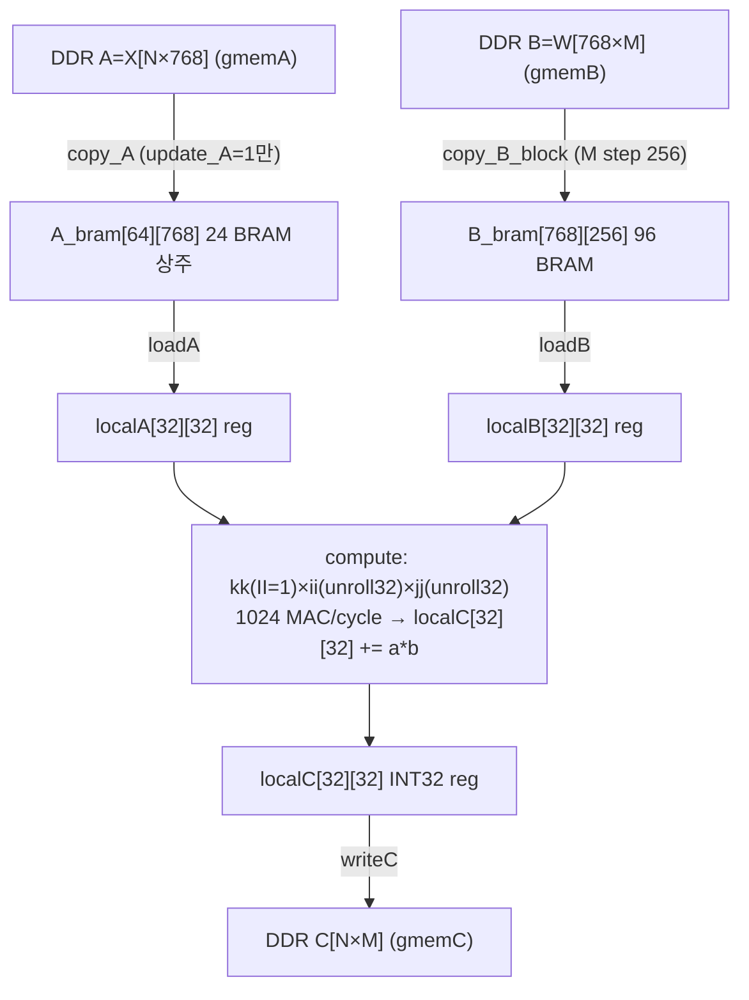
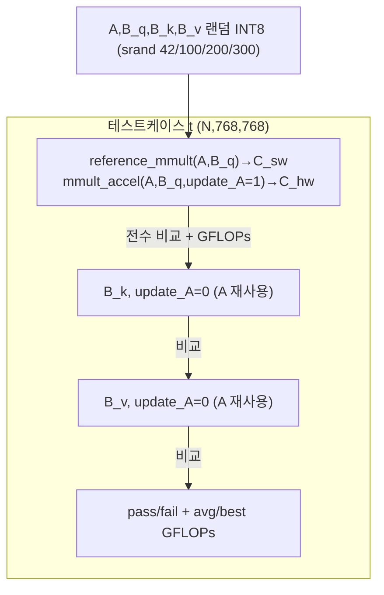
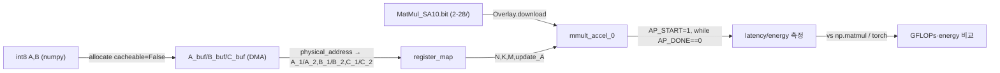

# TMMA 모듈 통합 가이드

> 1차 요약: [`../TMMA.md`](../TMMA.md) — 본 문서는 그 요약을 모듈 단위로 심화한 통합 가이드다(형제 가이드 `REF/Analysis/CNN-Accel/ESDA/MODULE_GUIDE.md`와 동형 H-HLS 구조).
> 분석 대상: `\\wsl.localhost\ubuntu-24.04\home\user\project\PRJXR-HBTXR\REF\Others\TMMA`
> 작성 원칙: 실제 소스 Read 후 `파일:라인` 근거 표기. 라인 근거 없는 추론은 "추정", 코드로 확인 불가는 "확인 불가"로 명시. (제약: bash 금지, Glob/Grep/Read만 사용.)

---

## 0. 문서 머리말

### 0.1 대표 케이스 선정
- **대표 GEMM(QKV 프로젝션): `mmult_accel(A=X[N×768], B=W_{Q/K/V}[768×768], C=[N×768], update_A)`** — Self-Attention의 Q/K/V 선형 투영. 근거: 탑레벨 함수 `mmult_accel.cpp:58-59`, 테스트벤치가 동일 A에 B_q/B_k/B_v 3회 호출로 정확히 이 패턴을 검증(`mmult_accel_tb.cpp:204,269,333`).
- **대표 입력 shape(정확도 검증): `{N=64, K=768, M=768}`** — DistilBERT-base hidden=768, 최대 토큰 64. 근거: TB 테스트케이스 `{16,768,768},{32,768,768},{64,768,768}`(`mmult_accel_tb.cpp:102-106`), 합성 파라미터 `MAX_N=64, MAX_K=768, MAX_M=768`(`mmult_accel.cpp:11-13`).
- **대표 입력 shape(PYNQ 벤치): `{N=64, K=768, M=3072}`** — DistilBERT FFN-급/대형 투영 차원(M이 BLOCK_M=256보다 커서 컬럼-블록 스트리밍이 12회 활성화). 근거: 벤치 노트북 `pynq/TMMA_pynq_benchmark.ipynb:226` `N,K,M = 64,768,3072`.
- **대표 MAC 어레이: `compute` 32×32 출력-고정(output-stationary) MAC** — 한 사이클 1024 MAC. 근거: `mmult_accel.cpp:199-213`, 합성에서 `mmult_accel_Pipeline_compute` 인스턴스 DSP=1024(전체의 82%)·II=1 달성(`mmult_accel_csynth.rpt:93`, `csynth.rpt:37`).

### 0.2 수치 표기 규약
- **MAC lanes** = HLS `#pragma HLS UNROLL` 차원 곱 = `compute`의 `ii`(32) × `jj`(32) 완전 언롤 = **1024 lanes**(`mmult_accel.cpp:202-211`). `kk`는 `II=1` 시간 파이프(공간 언롤 아님, `:200-201`)이므로 lanes 산정 제외. ESDA의 DSP-pack(2 MAC/DSP)과 달리 **TMMA는 패킹 없음** — INT8 곱을 INT32 캐스트 후 수행(`:205,209`)하여 DSP 1개당 1 MAC, 그래서 lanes 1024 = DSP 1024 정합(`csynth.rpt:289`).
- **scalar MACs**(dense) = `N × M × K`(곱셈), GFLOPs 산정 시 `ops = 2·N·M·K`(곱+합, `mmult_accel_tb.cpp:181`). 대표 `{64,768,768}` = 64·768·768 ≈ **37.7M MAC**(75.5M FLOP). 대표 PYNQ `{64,768,3072}` = 64·768·3072 ≈ **151M MAC**(302M FLOP).
- **loop trips**(타일 루프) = `outer_j_block`(⌈M/256⌉) × `tile_i`(⌈N/32⌉) × `tile_j`(⌈current_block_M/32⌉) × `k_loop`(⌈K/32⌉). 대표 `{64,768,768}` = 3 × 2 × 8 × 24 = **1152 타일-이터레이션**, 각 이터에 `compute` 36 cyc(`csynth.rpt:37`). 대표 PYNQ `{64,768,3072}` = 12 × 2 × 8 × 24 = **4608**.
- **memory size**(payload bit) = 버퍼 워드 × 폭(bit). A_bram = 64×768 = 49,152 word × 8b = **393,216 b**(24 BRAM18), B_bram = 768×256 = 196,608 word × 8b = **1,572,864 b**(96 BRAM18), localA/localB/localC = 각 32×32 레지스터(complete partition). 근거: `csynth.rpt:111-115`, `mmult_accel.cpp:88,114,139,155-156`.
- **타깃 데이터타입**: 활성/가중치 **INT8**(`DTYPE_IN=int8_t`, `mmult_accel.cpp:37`), 누산/출력 **INT32**(`DTYPE_OUT=int32_t`, `:38`). 차원 스칼라 N/K/M/update_A는 `int`(AXI-Lite 레지스터, `:77-80`). TB의 CPU 레퍼런스만 64b(`long`) 누산(`mmult_accel_tb.cpp:64`).

### 0.3 운영 경로
```
[SW 모델/양자화: PyTorch DistilBERT (model/distilBert/*.ipynb) → INT8 PTQ (pynq/Quant_distilBERT_forward-pass.ipynb)]
      │ int8 X(=A), int8 W_Q/W_K/W_V(=B) 익스포트 (노트북, 추정)
      ▼
[HLS 커널: mmult_accel.cpp → Vitis HLS 2024.2 (xck26-sfvc784-2LV-c, clk 10ns/100MHz target)]
      │  mmult_accel_csynth.rpt:8-12,23 (Estimated 8ns)
      ▼
[Vivado: 블록디자인으로 HW 플랫폼 재구성 → top.bit (레포 미포함, vivado/2-27_bd&df/ 이미지만)]
      │  README.md:72-73 ("does not include compiled bitstreams or full Vivado projects")
      ▼
[board/PYNQ(KV260 ARM PS): Overlay 적재 → register_map(A/B/C phys addr, N/K/M/update_A) → AP_START~AP_DONE 폴링]
      │  pynq/TMMA_pynq_benchmark.ipynb:92,146-162 ; 전력기반 에너지 E=P×t (:192)
      ▼
[검증/벤치: vs numpy/torch CPU matmul + GFLOPs/energy 비교]
         pynq/TMMA_pynq_benchmark.ipynb:337,413-417
```
- 타깃: **Xilinx KV260 Vision AI Starter Kit**(Zynq UltraScale+ MPSoC `xck26-sfvc784-2LV-c`), 100 MHz target(`mmult_accel_csynth.rpt:12,23`), PYNQ Overlay 런타임(`pynq/TMMA_pynq_benchmark.ipynb:89-92`). 대상 모델: DistilBERT MHA Q/K/V 프로젝션(`README.md:11`).

---

## 1. Repo / 커널 개요

TMMA = Transformer Self-Attention의 Q/K/V 선형 투영(GEMM)을 KV260 에지 FPGA에서 INT8로 가속하는 **단일 H-HLS 커널** 프로젝트(`../TMMA.md` 1절). ESDA처럼 코드생성·DSE 파이프라인을 갖춘 다단 프레임워크가 아니라, **하나의 탑레벨 함수 `mmult_accel`이 전체 가속기**이고(자체 HLS 소스 3파일), 그 위에 Vivado BD(이미지)·PYNQ 호스트 노트북·PyTorch 참조가 통합 자산으로 얹힌 구조다.

### 1.1 자체 소스 vs 생성물 vs 보조자산

| 구분 | 파일(자체 소스) | 역할 |
|---|---|---|
| **HLS 커널(HW, 핵심)** | `hls/MatMul_SA/mmult_accel.cpp` | 탑레벨 GEMM 커널(A 상주 BRAM + B 컬럼블록 + 32×32 OS MAC) |
| | `hls/MatMul_SA/mmult_accel.hpp` | `extern "C"` 인터페이스 프로토타입 + 파라미터(주석은 구버전 "16×16") |
| **검증 하니스(SW↔HW)** | `hls/MatMul_SA/mmult_accel_tb.cpp` | Q/K/V 3-프로젝션 시나리오 + CPU 레퍼런스(64b) + GFLOPs/cosim 측정 |
| **호스트(board, PS)** | `pynq/TMMA_pynq_benchmark.ipynb` | PYNQ Overlay 적재·register_map 제어·latency/energy 벤치 |
| | `pynq/Quant_distilBERT_forward-pass.ipynb` | 양자화 DistilBERT 포워드패스(INT8 변환·FPGA 오프로드, 추정) |
| **모델 참조(SW)** | `model/distilBert/distilBert_pytorch-cpu.ipynb` | DistilBERT CPU 포워드 참조 |
| | `model/distilBert/distilBERT_layer_shape_verify.ipynb` | 레이어 shape 검증 |
| **문서/메타** | `README.md`, `hls/MatMul_SA/README.md`, `CITATION.cff`, `LICENSE.md` | 사용법·인용(arXiv:2503.16731) |

### 1.2 제외 목록(이름만 언급, 분석 제외)
- **생성물(Vitis IDE)**: `hls/MatMul_SA/_ide/workspace_journal_{31800,32328}.py`, `_ide/settings.json` — IDE 워크스페이스 저널.
- **합성 산출물**: `hls/MatMul_SA/MatMul_SA/MatMul_SA/hls/syn/report/{mmult_accel_csynth.rpt, csynth.rpt, csynth_design_size.rpt}` — 합성 리포트(단, **자원/레이턴시 수치는 근거로 인용**).
- **이미지/문서 바이너리**: `vivado/2-27_bd&df/{schematic.pdf, block design.png, Implemented Device View.png}`, `pynq/{FLOPs_and_MACs_Calculation_for_DistilBERT-Base.pdf, TMMA_pynq_benchmark.pdf, Quant_distilBERT_forward-pass.pdf}`.
- **버전관리 메타**: `.git/`, `.git/modules/hls/MatMul_SA/`, `.gitmodules`(서브모듈 `Richielee630/MatMul_SA` 포인터).
- **부재(확인 불가)**: 실제 비트스트림(`top.bit`, README.md:72-73 명시 미포함), 전체 Vivado 프로젝트, board harness 별도 .py 스크립트(ESDA의 `evaluate.py`/`power_monitor.py` 같은 독립 파일 없음 — PYNQ 제어는 노트북 셀에 인라인). 노트북 실행 결과 수치(미실행).

### 1.3 호출 계층(call hierarchy)
근거: `mmult_accel.cpp` 전체(58-231). 단일 함수 내부 루프 네스트이며 별도 서브함수 분할 없음(서브모듈 분할 없는 모놀리식 H-HLS).
```
mmult_accel  (top, extern "C", :58)
├─ [if update_A] copy_A          (:95-101,  DDR A → A_bram,   II=1)
└─ outer_j_block (M step 256)    (:109-230)
   ├─ copy_B_block               (:118-124, DDR B[block] → B_bram, II=1)
   └─ tile_i (N step 32)         (:131)
      └─ tile_j (block step 32)  (:133)
         ├─ init_c               (:144-151, localC=0, 2D UNROLL)
         └─ k_loop (K step 32)   (:165-214)
            ├─ loadA             (:169-180, A_bram → localA, II=1)
            ├─ loadB             (:184-195, B_bram → localB, II=1)
            └─ compute           (:199-213, kk:II=1 × ii:UNROLL32 × jj:UNROLL32 → localC += a*b)
         └─ writeC               (:218-227, localC → DDR C, II=1)
```
합성은 위 각 루프를 독립 파이프라인 인스턴스로 분리: `Pipeline_copy_A`, `Pipeline_copy_B_block`, `Pipeline_loadA`, `Pipeline_loadB`, `Pipeline_compute`, `Pipeline_writeC`(`mmult_accel_csynth.rpt:41-46`). **탑레벨 `#pragma HLS dataflow` 부재** → 인스턴스 간 순차 실행(중첩 없음, 4절 병목 참조).

---

## 2. 모듈: 인터페이스/파라미터 — `mmult_accel.hpp`

### 2.1 역할 + 상위/하위
- **역할**: 호스트(PYNQ)와 커널이 공유하는 함수 시그니처·차원 상한·자료형 정의. `extern "C"` 링크로 C++ 네임맹글링 회피(PYNQ register_map 정합).
- **상위**: `mmult_accel_tb.cpp`가 include(`mmult_accel_tb.cpp:22`). **하위**: 없음(원자 헤더; `ap_int.h`/`hls_stream.h`/`stdint.h` include만, `:10-12`).

### 2.2 대표 코드 위치
`hls/MatMul_SA/mmult_accel.hpp`(33줄 전체).

### 2.3 대표 코드 블록
```cpp
// mmult_accel.hpp:14-15  ── 헤더-구현 불일치(주의)
// Define the systolic array tile size (16x16)
// static const int TILE_SIZE = 16;
```
→ 헤더 주석은 "16×16 systolic array"라 적혔으나(`:5,14`), **실제 .cpp 구현은 32×32 타일**(`mmult_accel.cpp:29`). 헤더의 `TILE_SIZE`는 주석처리되어 미사용 — 구버전 잔재로 추정. 문서 신뢰성 주의점.

```cpp
// mmult_accel.hpp:21-29
void mmult_accel(const int8_t *A, const int8_t *B, int32_t *C,
                 int N, int K, int M, int update_A);
```
→ A[N×K], B[K×M], C[N×M] row-major. `update_A`=A 재적재 플래그(1=load, 0=reuse).

### 2.4 마이크로아키텍처
- **자료형 비트폭**: A/B 8b, C 32b, 스칼라 32b(`int`). PYNQ가 64b DDR 주소를 A_1/A_2(하위/상위 32b)로 분할 기록(`pynq/TMMA_pynq_benchmark.ipynb:146-151`) — m_axi offset=slave 64b 포인터 정합.
- **병목/주의**: 차원 상한이 `mmult_accel.cpp`의 `#define`에 하드코딩(헤더엔 시그니처만) → 헤더만 보면 차원 제약 불명. TB가 헤더 include 후 `MAX_*`를 자체 재정의(`mmult_accel_tb.cpp:29-31`) — **단일 소스화 안 됨**(불일치 리스크).

---

## 3. 모듈: 탑레벨 GEMM 커널 — `mmult_accel.cpp` (가속기 본체)

### 3.1 역할 + 상위/하위
- **역할**: TMMA 가속기 전체. AXI 인터페이스 → A 상주 BRAM → B 컬럼블록 BRAM → 32×32 출력-고정 MAC 타일 연산 → DDR write. 하나의 함수가 6개 파이프라인 스테이지로 합성.
- **상위**: PYNQ 호스트가 IP로 호출(`pynq/TMMA_pynq_benchmark.ipynb:159` AP_START), TB가 직접 호출(`mmult_accel_tb.cpp:204`). **하위**: 없음(인라인 루프 네스트).

### 3.2 데이터플로우


### 3.3 Function call stack (합성 인스턴스)
`mmult_accel`(top) → `Pipeline_copy_A`(`csynth.rpt:23`) / `Pipeline_copy_B_block`(`:26`) / `Pipeline_loadA`(`:33`) / `Pipeline_loadB`(`:35`) / `Pipeline_compute`(`:37`) / `Pipeline_writeC`(`:30`). 경계처리 산술에 `mul_31ns`/`mul_32ns` 2개 보조 곱셈기 인스턴스(`mmult_accel_csynth.rpt:99-100`, 각 4 DSP).

### 3.4 대표 코드 위치
`hls/MatMul_SA/mmult_accel.cpp`: 파라미터 `:11-38`, 인터페이스 프래그마 `:66-81`, A 상주 `:88-102`, B 컬럼블록 `:109-124`, 타일 본체 `:131-227`, compute MAC `:199-213`.

### 3.5 대표 코드 블록

**(a) AXI 인터페이스 — 3 독립 마스터 + control**
```cpp
#pragma HLS INTERFACE m_axi port=A bundle=gmemA depth=MAX_N*MAX_K   // :66
#pragma HLS INTERFACE m_axi port=B bundle=gmemB depth=MAX_K*MAX_M   // :67
#pragma HLS INTERFACE m_axi port=C bundle=gmemC depth=MAX_N*MAX_M   // :68
#pragma HLS INTERFACE s_axilite ... bundle=control                 // :74-81
```
→ A/B/C 각각 별도 AXI 마스터 번들(gmemA/B/C)로 **동시 DDR 접근**. 모든 스칼라 + return은 단일 control 번들(AXI-Lite) → 호스트 레지스터 제어. 합성: `gmemA/B/C_m_axi_U` 각 2 BRAM18(`mmult_accel_csynth.rpt:90-92`).

**(b) A 상주 + update_A 분기 — QKV 입력 재사용 핵심**
```cpp
static DTYPE_IN A_bram[MAX_N][MAX_K];                       // :88 (static = 호출 간 지속)
#pragma HLS BIND_STORAGE variable=A_bram type=ram_2p impl=bram  // :89
if(update_A) { copy_A: for i for k { #pragma HLS PIPELINE II=1  // :93-98
    A_bram[i][k] = A[i*K+k]; } }
```
→ `static`+`update_A`로 **첫 호출(Q, update_A=1)만 A를 DDR→BRAM 복사**, K·V 호출(update_A=0)은 재사용. Self-Attention에서 같은 입력 X에 W_Q/W_K/W_V를 곱하므로 **DDR A 트래픽 1/3 절감**(TB가 정확히 검증: `mmult_accel_tb.cpp:204,269,333`). copy_A는 II=1, iter latency 3(`csynth.rpt:24`).

**(c) B 컬럼블록 스트리밍 — 온칩 메모리 상한 고정**
```cpp
for (int j_block = 0; j_block < M; j_block += BLOCK_M) {    // :110 (256씩)
    int current_block_M = ((j_block+BLOCK_M)<=M) ? BLOCK_M : (M-j_block);  // :111
    DTYPE_IN B_bram[MAX_K][BLOCK_M];                        // :114 (768×256)
    #pragma HLS BIND_STORAGE variable=B_bram type=ram_2p impl=bram         // :115
    copy_B_block: for k for j { #pragma HLS PIPELINE II=1   // :119-121
        B_bram[k][j] = B[k*M + (j_block+j)]; } }
```
→ B 전체(768×M)를 안 올리고 **256컬럼씩** 적재 → B_bram 96 BRAM 상한 고정(M=3072도 동일 BRAM). 대신 M>256이면 블록 수만큼 B 재적재(M=768→3블록, M=3072→12블록). copy_B_block II=1, iter latency 11, DSP 4(주소산술, `csynth.rpt:27,199`).

**(d) 출력-고정 32×32 MAC 어레이 (가장 중요)**
```cpp
compute: for (int kk=0; kk<32; kk++) {                      // :200
    #pragma HLS PIPELINE II=1                               // :201 (K방향 시간 파이프)
    for (int ii=0; ii<32; ii++) { #pragma HLS UNROLL        // :202-203 (공간 언롤)
        DTYPE_OUT a_val = (DTYPE_OUT)localA[ii][kk];        // :205 (행당 1회 캐스트)
        for (int jj=0; jj<32; jj++) { #pragma HLS UNROLL    // :206-207 (공간 언롤)
            DTYPE_OUT b_val = (DTYPE_OUT)localB[kk][jj];    // :209
            localC[ii][jj] += a_val * b_val; } } }          // :210 (1024 누산기)
```
→ `ii×jj` 완전 언롤 = **1024개 MAC + 1024개 INT32 누산기(localC, complete partition `:140`)**가 한 사이클 동작. kk는 II=1로 K방향 32스텝 누산. 이것이 **출력-고정 MAC 어레이**(각 PE가 한 출력 원소 localC[ii][jj]를 K 전체에 걸쳐 누적)의 본질. 합성: compute DSP=1024(82%), FF 32783, LUT 27969, II 33 달성, 36 cyc(`mmult_accel_csynth.rpt:93`, `csynth.rpt:37`).

### 3.6 마이크로아키텍처
- **Stage 분해(타일당)**: ① loadA(1026 cyc) → ② loadB(1026 cyc) → ③ compute(36 cyc) → (k_loop 반복) → ④ writeC(1032 cyc). **순차**(dataflow 부재) → k_loop 1067 cyc(`csynth.rpt:57`, =loadA+loadB+compute 직렬 추정). loadA/loadB가 compute보다 ~28배 길어 **메모리 적재가 타일 내 지배적**(추정, 4절 병목).
- **MAC lanes**: compute = ii(32)×jj(32) = **1024 lanes**, DSP 1:1 매핑(패킹 없음). loadA/loadB는 32×32=1024 element를 II=1로 1024 cyc에 직렬 적재(공간 병렬 아님 — `loadA`는 1중 PIPELINE만, `:172`).
- **scalar MACs / loop trips**: 대표 `{64,768,768}` → 타일 1152회 × compute 36 cyc = 41,472 compute-cyc + 적재 오버헤드. 유효 MAC 37.7M / (1024 lanes) ≈ 36,800 이상적 cyc. 적재가 II=1 비병렬이라 실효 사이클은 적재 지배(추정).
- **메모리/재사용**: A_bram 24 BRAM(상주, QKV 재사용), B_bram 96 BRAM(블록마다 갱신), localA/B/C 레지스터(complete partition `:140,157-158` → MAC 직결). URAM 0(`csynth.rpt:78`).
- **정량/병목**: **DSP 83% 점유**(1040/1248, `mmult_accel_csynth.rpt:81`)가 1차 자원 상한 — 32×32 어레이 확장 여력 거의 없음. **loadA/loadB 비병렬 적재**(1026 cyc씩)가 compute(36 cyc) 대비 과대 → 적재-계산 미중첩이 처리량 병목(추정). 8b m_axi가 워드-widen 실패(`csynth.rpt:146,148` "type i8 ≥ max_widen_bitwidth threshold 0") → DDR 버스트 효율 저하 가능(추정).

---

## 4. 모듈: 검증 하니스 — `mmult_accel_tb.cpp` (SW 레퍼런스 + Q/K/V 시나리오 + 성능)

### 4.1 역할 + 상위/하위
- **역할**: 커널 정확도(CPU 레퍼런스 전수 비교)와 성능(GFLOPs / cosim 사이클)을 검증. 특히 **A 상주(update_A) 재사용**을 Q/K/V 3-프로젝션으로 모사.
- **상위**: `main`(독립 실행 또는 Vitis HLS csim/cosim). **하위**: `reference_mmult`(CPU 골든) + `mmult_accel`(DUT) 호출.

### 4.2 데이터플로우


### 4.3 대표 코드 위치
`hls/MatMul_SA/mmult_accel_tb.cpp`: reference `:59-71`, 테스트케이스 `:96-108`, Q `:184-247`, K `:249-311`, V `:313-375`, 성능요약 `:399-404`, cosim 타이밍 `:39-43,198-215`.

### 4.4 대표 코드 블록
```cpp
// :64 ── CPU 골든은 64b 누산(오버플로 방지)
long sum = 0;  ... sum += (long)A[i*K+k]*(long)B[k*M+j];  C[i*M+j]=(int32_t)sum;
```
```cpp
// :204,269,333 ── QKV 입력 재사용 패턴(가속기 핵심 검증)
mmult_accel(A, B_q, C_hw, N, K, M, 1);   // Q: A를 BRAM에 적재
mmult_accel(A, B_k, C_hw, N, K, M, 0);   // K: A 재사용
mmult_accel(A, B_v, C_hw, N, K, M, 0);   // V: A 재사용
```
```cpp
// :181,211-213 ── 성능: ops=2NMK, cosim은 100MHz(10ns/cycle) 가정
double ops_per_mmult = 2.0*N*M*K;
double clock_period_ns = 10.0; // 100MHz
double gflops_q = ops_per_mmult / (execution_time_s * 1e9);
```

### 4.5 마이크로아키텍처(검증 관점)
- **테스트 매트릭스**: 기본 `{16,768,768},{32,768,768},{64,768,768}`(`:102-106`), `FAST_COSIM`은 `{8,64,64}`(`:99`). 각 케이스 × Q/K/V 3회 = 9 측정.
- **메모리 할당**: `MAX_*` 깊이로 할당하고 미사용부 0패딩(`:119-121,148-174`) → HLS m_axi depth 정합(`mmult_accel.cpp:66-68`).
- **타이밍 모드**: `HLS_COSIM`이면 `clock_start/end`로 사이클 정확(`:41-42,199-210`), 아니면 `std::chrono` wall-clock(`:201,217`). **100MHz는 가정값**(`:211`) — 실제 KV260 달성 주파수 아님(확인 불가).
- **병목 없음**(검증 코드). 단 100MHz·GFLOPs는 csim 추정(실측 아님).

---

## 5. 모듈: 호스트/board harness — `pynq/TMMA_pynq_benchmark.ipynb`

### 5.1 역할 + 상위/하위
- **역할(board, KV260 PS)**: Overlay로 비트스트림 적재 → 입력/출력 버퍼 DMA allocate → register_map에 phys addr·N/K/M·update_A 기록 → AP_START~AP_DONE 폴링으로 latency 측정 → 전력기반 energy + numpy/torch CPU 대비 GFLOPs 비교.
- **상위**: 사용자(노트북 셀). **하위**: PYNQ `Overlay`/`allocate`, 커널 IP `mmult_accel_0`.

### 5.2 데이터플로우


### 5.3 대표 코드 블록
```python
# :92  ── Overlay 적재(비트스트림 레포 미포함)
overlay = Overlay("/home/ubuntu/workspace/pynq_bitfiles/2-28/MatMul_SA10.bit")
accel_ip = overlay.mmult_accel_0                                   # :97
# :146-156 ── 64b DDR 주소를 하위/상위 32b로 분할 기록
accel_ip.register_map.A_1 = A_buf.physical_address & 0xFFFFFFFF
accel_ip.register_map.A_2 = (A_buf.physical_address >> 32) & 0xFFFFFFFF
accel_ip.register_map.N = N; ...register_map.update_A = update_A
# :159-162 ── 시작/완료 폴링
accel_ip.register_map.CTRL.AP_START = 1
while accel_ip.register_map.CTRL.AP_DONE == 0: pass
# :226 ── 벤치 shape (DistilBERT QKV/FFN급)
N, K, M = 64, 768, 3072
# :192,337 ── 에너지 E=P×t, CPU numpy/torch 대비 비교
energy_used = avg_power * elapsed_time
ref_numpy = np.matmul(A_buf.astype(np.int32), B_buf.astype(np.int32))
```

### 5.4 마이크로아키텍처
- **버퍼**: `allocate(shape=(N,K)/(K,M)/(N,M), dtype=int8/int32, cacheable=False)`(`:227-228`) → 물리연속 비캐시 DMA. data-in/fpga/data-out 시간 분리 측정(`:282-296`).
- **전력**: `measure_energy`가 avg_power·elapsed로 energy 산정(`:181-192`). PMBus 등 센서 출처는 노트북 내 미상(확인 불가).
- **정량/병목**: 비트스트림 경로(`MatMul_SA10.bit`)·실측 latency/GFLOPs/energy는 **노트북 미실행이라 확인 불가**. update_A를 호스트가 직접 세팅(`:156`)하므로 Q/K/V 재사용 최적화가 런타임에 활용됨(설계 의도 정합).

---

## 6. 모듈: 보조 자산(Vivado BD / 양자화·모델 노트북 — 역할만)

### 6.1 Vivado 블록디자인 — `vivado/2-27_bd&df/`
- **역할**: KV260 PL+PS 통합 블록디자인/구현 디바이스뷰. **이미지/PDF만**(`block design.png`, `schematic.pdf`, `Implemented Device View.png`) — 편집가능 BD/비트스트림 미포함(`README.md:72-73`).
- **분석 한계**: 텍스트 소스 부재 → AXI 연결·클럭·DMA 구성은 **확인 불가**(이미지만). PYNQ가 `mmult_accel_0` IP + register_map을 보므로 단일 IP + AXI-Lite 제어 + 3 m_axi DMA 구성으로 추정.

### 6.2 양자화/모델 노트북 — `pynq/Quant_distilBERT_forward-pass.ipynb`, `model/distilBert/*.ipynb`
- **역할**: PyTorch DistilBERT 포워드(CPU 참조, `distilBert_pytorch-cpu.ipynb`) + 레이어 shape 검증(`distilBERT_layer_shape_verify.ipynb`) + INT8 양자화 포워드(`Quant_distilBERT_forward-pass.ipynb`, FPGA 오프로드 대상 생성, 추정).
- **분석 한계**: 노트북 셀 미실행 → 양자화 스킴(scale/zero-point)·익스포트 포맷은 **확인 불가**. ESDA의 `gen_data.py`(가중치 패킹·골든 생성)에 해당하는 자동화 스크립트는 TMMA엔 부재 — 양자화→FPGA 매핑이 노트북 수동 절차로 추정.

---

## 7. 모듈 한눈 요약 표

| 모듈 | 파일 | 핵심 위치(라인) | 역할 | 대표 정량 |
|---|---|---|---|---|
| 인터페이스 | mmult_accel.hpp | proto(:21-29), 주석(:14) | 시그니처+파라미터 | INT8 in / INT32 out, "16×16" 주석≠32×32 구현 |
| 파라미터 | mmult_accel.cpp | :11-38 | 차원상한·타일·자료형 | MAX_N=64,K=M=768; BLOCK_M=256; TILE=32 |
| AXI I/F | mmult_accel.cpp | :66-81 | 3 m_axi + control | gmemA/B/C 독립 마스터, AXI-Lite |
| A 상주 BRAM | mmult_accel.cpp | :88-102 | X 상주(QKV 재사용) | 64×768 = 24 BRAM, update_A 분기 |
| B 컬럼블록 | mmult_accel.cpp | :109-124 | W 블록 스트리밍 | 768×256 = 96 BRAM, M step 256 |
| 32×32 OS MAC | mmult_accel.cpp | :199-213 | 출력-고정 MAC | **1024 lanes = 1024 DSP**, II=1, 36 cyc |
| writeC | mmult_accel.cpp | :218-227 | DDR 출력 | II=1, 1032 cyc |
| 검증 하니스 | mmult_accel_tb.cpp | ref(:59), QKV(:204/269/333) | CPU골든+Q/K/V+GFLOPs | {16/32/64,768,768}, ops=2NMK |
| 호스트/board | pynq/TMMA_pynq_benchmark.ipynb | Overlay(:92), reg(:146-162) | PYNQ 제어·벤치 | N,K,M=64,768,3072; E=P×t |
| Vivado BD | vivado/2-27_bd&df/ | (이미지) | PL+PS 통합 | 단일 IP+3 DMA(추정) |
| 양자화/모델 | pynq/Quant_*, model/* | (노트북) | INT8 PTQ·DistilBERT 참조 | 셀 미실행(확인 불가) |

### 합성 PPA(근거: `mmult_accel_csynth.rpt`, target xck26-sfvc784-2LV-c, Vitis 2024.2)
| 자원 | 사용 | 가용 | % | 근거 |
|---|---|---|---|---|
| BRAM_18K | 126 | 288 | 43% | `:77,81` |
| DSP | 1040 | 1248 | 83% | `:77,81` (compute 1024 + 보조 16) |
| FF | 102,741 | 234,240 | 43% | `:77,81` |
| LUT | 71,046 | 117,120 | 60% | `:77,81` |
| URAM | 0 | 64 | 0% | `:78` |
- 클럭 target 10ns(100MHz), Estimated 8ns, uncertainty 2ns(`:23`). 탑레벨 latency는 차원 의존 가변(`:32` `?`); 루프: copy_A(II=1, iter 3), copy_B(II=1, iter 11), loadA/loadB 1026 cyc, writeC 1032, compute 36(`:43-46`), k_loop 1067·tile_j max 1.43e11(`csynth.rpt:54-57`).
- 메모리: A_bram 24 BRAM(49152 word×8b), B_bram 96 BRAM(196608 word×8b)(`mmult_accel_csynth.rpt:112-113`).
- **실측 KV260 주파수/latency/energy/GFLOPs는 노트북 미실행으로 확인 불가**(TB의 100MHz는 가정값, `mmult_accel_tb.cpp:211`).

---

## 8. 읽기 순서 / 코드 추적 순서

1. **인터페이스 먼저**: `mmult_accel.hpp:21-29`(시그니처) + `mmult_accel.cpp:11-38`(파라미터) → A/B/C·update_A·INT8/INT32·TILE/BLOCK 직관. (헤더 "16×16" 주석은 무시, `.cpp:29`가 정답.)
2. **AXI/제어**: `mmult_accel.cpp:66-81` → 3 독립 m_axi + AXI-Lite control. PYNQ 측 `pynq/TMMA_pynq_benchmark.ipynb:146-162`와 대조하면 호스트↔커널 레지스터 맵핑 이해.
3. **데이터 상주 전략**: `:88-102`(A 상주+update_A) → `:109-124`(B 컬럼블록) → QKV 재사용·온칩 상한 고정의 설계 의도.
4. **연산 핵심**: `:131-227` 타일 본체 → 특히 `:199-213` compute(32×32 OS MAC). init_c(:144)·loadA(:169)·loadB(:184)·writeC(:218) 순으로 타일 사이클 구성 파악.
5. **검증 정합**: `mmult_accel_tb.cpp:204/269/333`(QKV update_A 패턴) + `:64`(64b 골든) → 정확도 검증 방식.
6. **자원 근거**: `mmult_accel_csynth.rpt:77-81`(Total) + `:93`(compute DSP 1024) + `:112-113`(BRAM) → PPA 확인.
7. **런타임**: `pynq/TMMA_pynq_benchmark.ipynb:92,159-162,226` → 실제 KV260 배포·벤치 흐름(단 미실행).

---

## 9. 병목 후보 & 병렬도/설계 노브

### 9.1 병목 후보
1. **DSP 83% 점유**(`mmult_accel_csynth.rpt:81`): 32×32 어레이가 DSP 1024 직점유, 보조 16 포함 1040/1248 → **어레이 확장 여력 거의 없음**. KV260에서 처리량 상한 고정. (DSP-pack(ESDA식 2 MAC/DSP) 미적용 → INT8인데 DSP 1:1 — packing화하면 어레이 2배 여지, 개선 노브, 추정.)
2. **탑레벨 dataflow 부재**(`mmult_accel.cpp` 전체에 `#pragma HLS dataflow` 없음): loadA(1026)→loadB(1026)→compute(36)→writeC(1032)가 순차(`csynth.rpt:33-37`). 적재가 compute의 ~28배라 **통신-계산 미중첩**이 처리량 1차 병목(추정). 이중버퍼+dataflow 결합 시 큰 개선 여지.
3. **loadA/loadB 비병렬 적재**(`:169-195`, 1중 PIPELINE II=1): 32×32=1024 element를 1024 cyc 직렬 적재. 공간 언롤 추가하면 적재 가속(개선 노브, 추정).
4. **B 재적재 오버헤드**(`:109-124`): M>256이면 컬럼블록마다 B_bram 재적재(M=3072→12블록). 큰 M에서 DDR B 트래픽 누적(`csynth.rpt:54` outer_j_block 1~16777216 trip).
5. **8b m_axi widen 실패**(`csynth.rpt:146,148`): i8이 widen 임계 초과로 버스트 미확장 → DDR 대역폭 비효율(추정).
6. **고정 차원 상한**(MAX_N=64, K=M=768, `:11-13`): DistilBERT 외 모델/긴 시퀀스 일반화 제한. FFN·Softmax 미포함(README 로드맵 진행 중, `README.md:55-58`).
7. **헤더-구현 불일치**(hpp "16×16" `:14` vs .cpp 32×32 `:29`) + TB의 MAX_* 재정의(`mmult_accel_tb.cpp:29-31`): 단일 소스화 안 됨 → 유지보수 리스크.

### 9.2 병렬도/설계 노브
- **TILE_SIZE**(`mmult_accel.cpp:29`, =32): MAC 어레이 변. ↑하면 lanes=TILE²↑(DSP↑), 단 현재 32²=1024가 DSP 83% → 64는 KV260 초과(불가). 16이면 DSP 256(여유, 처리량↓).
- **BLOCK_M**(`:21`, =256): B 온칩 폭. ↑하면 B_bram BRAM↑·재적재↓, ↓하면 BRAM↓·재적재↑. 96 BRAM(43% 중)이 B_bram에서 옴 → 여유 내 ↑ 가능.
- **update_A**(`:93`): 호스트가 제어하는 입력 재사용 노브. Q=1, K/V=0으로 DDR A 1/3(`tb:204/269/333`). ViT MLP 두 FC에도 동일 적용 가능.
- **m_axi depth / 번들**(`:66-68`): 3 독립 마스터 → 동시 대역폭. 클럭(target 10ns, `csynth.rpt:23`)·DDR 대역은 KV260 플랫폼 의존(실측 확인 불가).
- **데이터타입**(`:37-38`): INT8/INT32 고정. INT4 등 추가 양자화는 미지원(노브 없음) — 양자화는 SW 노트북 책임(`pynq/Quant_*`).

---

*근거 파일(절대경로)*:
`\\wsl.localhost\ubuntu-24.04\home\user\project\PRJXR-HBTXR\REF\Others\TMMA\hls\MatMul_SA\{mmult_accel.cpp, mmult_accel.hpp, mmult_accel_tb.cpp, README.md}`,
`...\REF\Others\TMMA\hls\MatMul_SA\MatMul_SA\MatMul_SA\hls\syn\report\{mmult_accel_csynth.rpt, csynth.rpt}`,
`...\REF\Others\TMMA\pynq\{TMMA_pynq_benchmark.ipynb, Quant_distilBERT_forward-pass.ipynb}`,
`...\REF\Others\TMMA\model\distilBert\{distilBert_pytorch-cpu.ipynb, distilBERT_layer_shape_verify.ipynb}`,
`...\REF\Others\TMMA\{README.md, CITATION.cff}`, `...\REF\Others\TMMA\vivado\2-27_bd&df\`(이미지).
