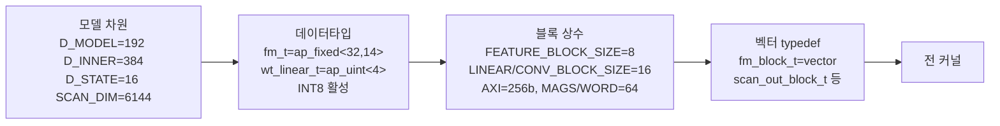
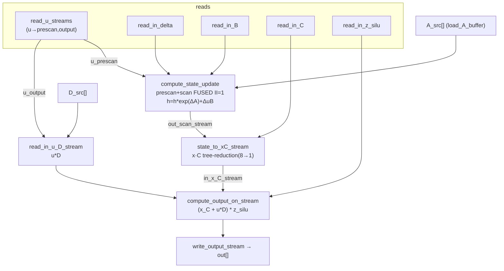
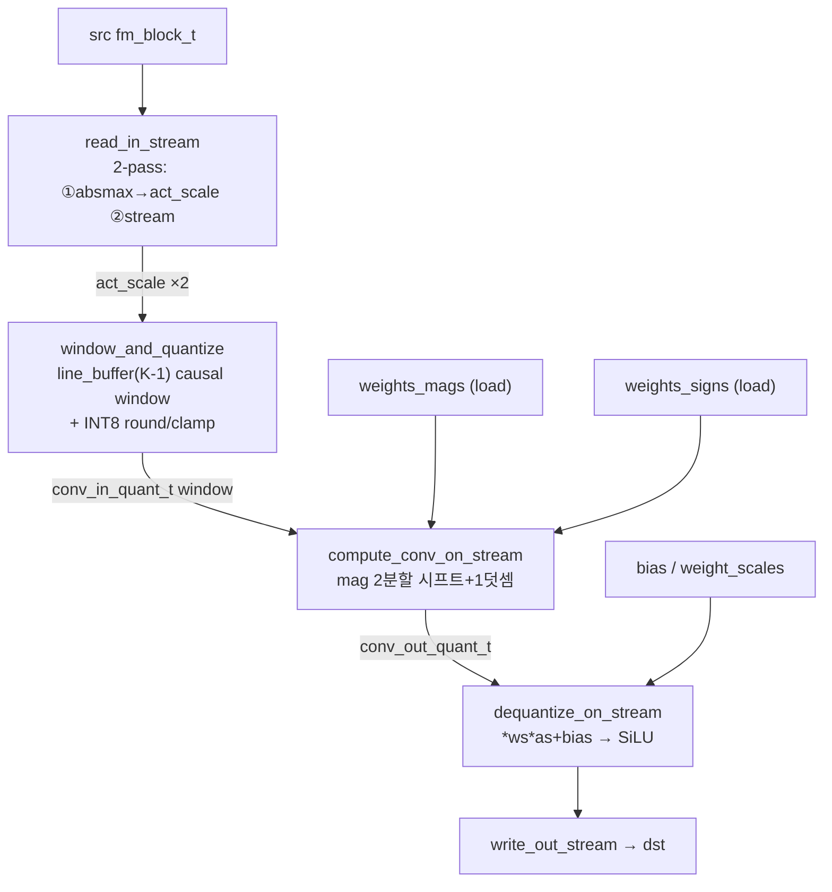
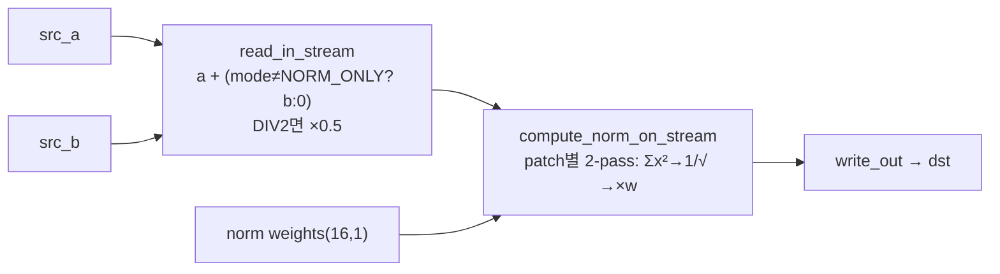
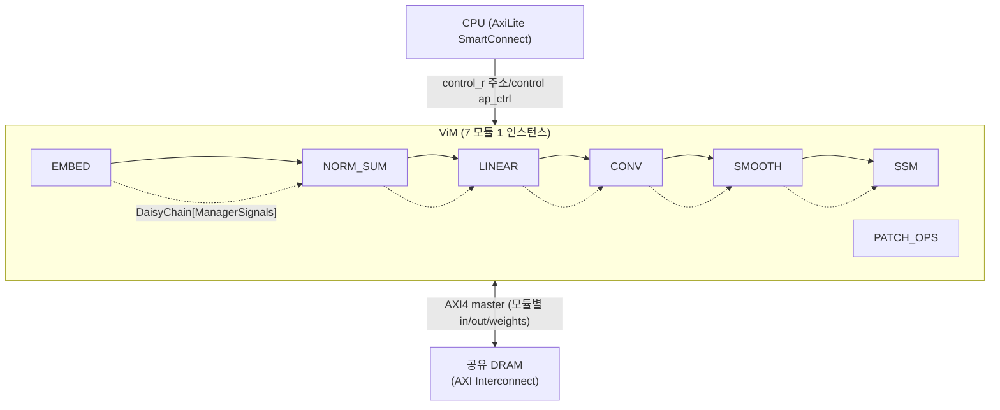

# ViM-Q (FCCM 2026) 모듈 통합 가이드

> 1차 요약: [`../ViM-Q-FCCM-2026.md`](../ViM-Q-FCCM-2026.md) — 본 문서는 그 요약을 모듈 단위로 심화한 통합 가이드다.
> 분석 대상: `\\wsl.localhost\ubuntu-24.04\home\user\project\PRJXR-HBTXR\REF\Others\ViM-Q-FCCM-2026`
> 작성 원칙: 실제 소스 Read 후 `파일:라인` 근거 표기. 라인 근거 없는 추론은 "추정", 코드로 확인 불가는 "확인 불가"로 명시.
> 형제 동형: `REF/Analysis/CNN-Accel/ESDA/MODULE_GUIDE.md`(H-HLS), `REF/Analysis/ViT-Accelerator/TATAA/MODULE_GUIDE.md`(H-RTL).

---

## 0. 문서 머리말

### 0.1 대표 케이스 선정
- **대표 모델: ViM-Tiny (vim_tiny, 224×224)** — `common.h:43-48` `D_MODEL=192, D_INNER=384, D_STATE=16, DT_RANK=16(HW패딩)`, `NUM_PATCHES=197`, `NUM_LAYERS=24(합성)/1(C-sim)` (`common.h:33-41`). SW `e_export_model.py:875` `quantize_vim_model(weight_bits=4, ...)` + `:896-907` model_config가 tiny(`depth=24, d_model=192, d_inner=384, d_state=16, dt_rank=12`)로 고정. `README.md:43` 체크포인트 `vim_t_midclstok_76p1acc.pth`.
- **대표 SSM 블록: 한 Mamba 레이어의 forward selective scan** — `compute_ssm_output_impl`(`ssm.h:477-540`)이 단일 레이어 입력 `u/delta/z_silu/A/B/C/D`(scan_dim=`SCAN_DIM=D_INNER*D_STATE=6144`, `common.h:47`)를 prescan+scan 융합 8-스테이지 dataflow로 처리. 시뮬 기준 텐서 shape: `u/delta/z_silu = NUM_PATCHES×D_INNER = 197×384`, `B/C = 197×16`, `A = 6144`, `D = 384` (`SSM.scala:205-211`).
- **대표 linear projection: in_proj** — `compute_linear_block`(`linear_block.h:762`)에 `out_dim=2*D_INNER=768`(x+z), `in_dim=D_MODEL=192`, INT4 APoT 16×16 LUT MAC. `flags`로 SiLU/Softplus 분기(`linear_block.h:44-46`). dt_proj는 Softplus, in_proj/out_proj는 bias만, x_proj는 plain.
- **대표 conv: causal conv1d (forward)** — `compute_causal_conv`(`conv.h:581`), `conv_dim=D_INNER=384`, kernel=`CONV_KERNEL_SIZE=4`(`common.h:35`), depthwise, INT5 APoT 가중치 분해 시프트.

### 0.2 수치 표기 규약
- **MAC lanes**: HLS `#pragma HLS unroll` 차원 곱. 본 설계는 **곱셈기-free**다 — linear은 "활성 시프트 LUT 조회"(`linear_block.h:417-433`)로, conv는 "가중치 크기코드 2분할 시프트+1덧셈"(`conv.h:415-441`)으로 곱을 대체하므로 DSP-MAC이 아니라 **shift-add lanes**로 표기. linear MAC: 16출력(`compute_mac_on_stream` oc unroll, `linear_block.h:492`) × 16입력(ic unroll, `:499`) = **256 shift-add/사이클**(II=1). conv MAC: 16채널(dim_offset unroll factor=4 명시, 실효 16, `conv.h:403-405`) × 4 kernel(`:408`) = **64 shift-add/사이클**. SSM scan: `FEATURE_BLOCK_SIZE=8` PE(unroll factor=4, `ssm.h:185`).
- **scalar MACs**(대표 단일 레이어, dense 등가): in_proj = `NUM_PATCHES × out 768 × in 192` = 197×768×192 ≈ **29.0M**. x_proj(dt+B+C) = 197 × (16+16+16) × 384 ≈ **3.63M**. dt_proj = 197×384×16 ≈ **1.21M**. out_proj = 197×192×384 ≈ **14.5M**. conv1d(depthwise) = 197×384×4 ≈ **0.30M**. SSM scan(상태갱신) = `NUM_PATCHES × D_INNER × D_STATE × 2`(deltaA·deltaBu) ≈ 197×384×16×2 ≈ **2.42M** + xC 내적 197×384×16 ≈ **1.21M**.
- **loop trips**(II=1 파이프 사이클 ≈): linear `compute_mac_on_stream` = `num_patches × (out/16) × (in/16)`. in_proj 1레이어 = 197×48×12 ≈ **113K**. SSM `compute_state_update` UNIFIED_LOOP = `num_patches × inner_dim × ⌈D_STATE/8⌉` = 197×384×2 ≈ **151K**(`ssm.h:140,143`). conv `compute_conv_on_stream` = `num_patches × ⌈conv_dim/16⌉` = 197×24 ≈ **4.7K**(`conv.h:389`).
- **memory(payload bit)**: SSM 상태 `pe_state_token[NUM_FEATURE_BLOCKS_SCAN][8]` = ⌈6144/8⌉×8 = 6144개 × `token_t`(32b) = **196,608 bit ≈ 6 BRAM18**(`ssm.h:109`, dim2 complete partition). linear 가중치 static 버퍼 = `⌈1008/16⌉×⌈384/16⌉ = 63×24 = 1512블록 × 16×16 × 4b` = **2,478,080 bit ≈ 75 BRAM18**(`linear_block.h:775`, MAX 기준). conv 라인버퍼 = `(K-1)×⌈D_INNER/16⌉ × 16 × int8` = 3×24×16×8 = **9,216 bit**(`conv.h:297`).
- **합성 PPA(LUT/FF/DSP/BRAM, Fmax, 전력)**: 본 분석에서 읽은 파일에 리포트 산출물 없음 → **확인 불가**. 산출 경로만 존재: `vivado_reports/post_impl/{utilization,power}_post_impl.rpt`(`README.md:122-125`), latency는 `SPINAL/latency_report.{log,csv}`(`README.md:117-118`, 224×224 end-to-end Verilator). 시뮬 목표 클럭은 `ViM_Full_Test.scala:44` `CLOCK_FREQ_MHZ=350.0`(가정값).

### 0.3 운영 경로 (양자화 ↔ HLS/SpinalHDL ↔ 합성)
```
[원본 ViM 체크포인트 tiny/small/base]  (Checkpoints/, README.md:43-46)
   │
   ▼ SW PTQ (cd SW && bash run.sh)
[a_generate_act_scale.py] ─ act_scales/*.pt 캘리브
[b_smooth_model.py]       ─ SmoothQuant α=0.5: norm/in_proj/conv(fwd+bwd)/x·dt_proj/out_proj 평활 (b_smooth_model.py:133-177)
[c_quantize_model.py]     ─ nn.Linear→QuantLinear(W4 APoT/A8), nn.Conv1d→QuantConv1d(W5 APoT/A8) 치환 (c_quantize_model.py:72-180)
[e_export_model.py]       ─ 16×16 reorder + INT4 nibble 팩 가중치 + SSM 중간텐서(delta/B/C/A/D/xs/out_z) → output/{bin,image,ref}_float32_block/
   │
   ▼ cp -r SW/output/* HW/data/   (README.md:80)
   │
   ▼ HW HLS (source setup_env.sh)
[step1_hls_sim.py]→[step2_hls_syn.py(.v 생성)]→[step3_hls_cosim.py]→[step4_print_resource.py]
   │
   ▼ [step5_spinal_flow.py] (Verilog→SPINAL/src/main/verilog/<MOD>/all.v, .dat ROM 복사)
   │
   ▼ cd SPINAL
[sbt compile] → [sbt "runMain simulate_vim_full"]  ─ Verilator end-to-end, latency_report.csv (README.md:108,116)
[sbt "runMain generate_vim_accelerator"]           ─ ViM_ACCELERATOR.v 생성
   │
   ▼ python3 run_vivado_flow.py → run_vivado_implementation.py
[Vivado IP 패키징 + BD + impl + bitstream + reports]  (utilization/power_post_impl.rpt)
```
- **타깃 디바이스/툴**: Vitis HLS/Vivado **2025.2**, Verilator 5.004, Java17/SBT 1.10 (`README.md:16-18`). 구체 FPGA 파트번호는 본 분석에서 읽은 파일에 미기재 → **확인 불가**(create_bd.tcl/template*.tcl 미정독).
- **데이터타입(전역)**: 내부 누적 fixed-point `fm_t=ap_fixed<32,14>`(`common.h:64`). 가중치 **linear INT4·conv INT5 APoT 코드워드**(`wt_linear_t=ap_uint<4>`, `common.h:77`; conv는 부호 bool + 크기 `ap_uint<4>`, `:83-84`). 활성 **INT8**(`Q_MAX=127/Q_MIN=-128`, `common.h:197-198`). patch embed·RMSNorm 가중치는 `ap_fixed<16,1>`(`common.h:70,74`, 비양자화). AXI 1워드 **256bit**(`common.h:196,206`).

---

## 1. Repo / 시스템 개요

ViM-Q = **Vision Mamba(SSM 비전 백본)** 를 **APoT INT4/INT5 가중치 + INT8 활성 PTQ** 로 양자화하고, selective-scan·causal-conv1d·linear-projection·patch-embed를 **곱셈기-free shift/LUT HLS 커널**로 구현해 **SpinalHDL 데이지체인**으로 통합한 풀스택 FPGA 가속기(SW+HW 혼합). 형제 ESDA/TATAA와 달리 연산 코어가 **SSM(scan)** 이라는 점이 본질적 차별점이다.

### 1.1 SW(양자화) ↔ HW(HLS 커널) ↔ HW(SpinalHDL 통합) 맵

| ViM 연산 | SW 양자화 모듈(자체) | HW HLS 커널 | SpinalHDL 래퍼 | 양자화/데이터타입 |
|---|---|---|---|---|
| patch embed (conv) | (비양자화) | `embed.h` `patch_embed_impl` | `EMBED.scala` | fixed-point `ap_fixed<16,1>` |
| RMSNorm + residual add | (smooth가 흡수) | `norm_sum.h` (4모드) | `NORM_SUM.scala` | fixed-point |
| in/x/dt/out proj + head | `QuantLinear`(W4 APoT/A8) | `linear_block.h`(LUT MAC, flags) | `LINEAR_BLOCK.scala` | INT4 W + INT8 A |
| smooth scale 런타임 적용 | `smooth_x`(quant_linear.py:188) | `smooth.h` | `SMOOTH.scala` | fixed-point scale ufixed<32,6> |
| causal conv1d (fwd/bwd) | `QuantConv1d`(W5 APoT/A8) | `conv.h`(shift-add MAC) | `CONV.scala` | INT5 W + INT8 A |
| selective scan (SSM) | export 중간텐서(delta/B/C/A/D) | `ssm.h`(prescan+scan fused) | `SSM.scala` | fixed-point `ap_fixed<32,14>` |
| patch flip / CLS 로드 | (모델 구조) | `patch_ops.h` (2모드) | `PATCH_OPS.scala` | fixed-point |
| SiLU/Softplus 활성 | (모델) | `activation.h`(LUT 보간) | (커널 내장) | fixed-point |
| 전체 통합/제어 | — | (top.cpp 케이스 per-module) | `ViM.scala` DaisyChain + AXI | — |

### 1.2 호출·인스턴스 계층

**SW (PTQ 파이프라인, `e_export_model.py:874-879`):**
```
smooth_vim_model(α=0.5)            # b_smooth_model.py:133  (블록 순회)
  └ smooth_in_proj / smooth_both_conv / smooth_dt_x_proj(×2 fwd+bwd) / smooth_fc
quantize_vim_model(W4/A8)          # c_quantize_model.py:72
  └ Block.mixer.{in_proj,conv1d,x_proj,dt_proj,conv1d_b,x_proj_b,dt_proj_b,out_proj} → QuantLinear/QuantConv1d
      └ QuantLinear.from_float → finalize_calibration → build_power_value(B=weight_bits-1)  # quant_linear.py:144
export_parameters / save_intermediate_outputs   # e_export_model.py:229 / :47
  └ reorder_weights_to_blocks(16×16)  # :26  ⇄  HW load_linear_weights
```

**HW (SpinalHDL 통합, `ViM.scala:10-101`):**
```
ViM (Component)
 ├ EMBED, NORM_SUM, LINEAR_BLOCK, CONV, SMOOTH, SSM, PATCH_OPS  (각 1 인스턴스, :12-18)
 │   └ <MOD> (Component) → <MOD>_Blackbox → src/main/verilog/<MOD>/all.v (HLS 생성)  # SSM.scala:11,71
 │        └ Manager (single=true) ── ApChain(ap_start/idle/ready/done) FSM  # Manager.scala:95
 ├ DaisyChain[ManagerSignals]: embed→norm_sum→linear→conv→smooth→ssm→out  # ViM.scala:95-101
 ├ AXI4 master ×다수 (모듈별 in/out/weights 개별 노출, 공유 DRAM)  # :26-62, :104
 └ AxiLite4 slave ×다수 (모듈별 control, CPU SmartConnect)  # :66-90, :139
```

### 1.3 제외 목록 (외부/생성물 — 이름만)
- **third-party**: `SW/mamba-1p1p1/`(외부 mamba_ssm 포크: `csrc/selective_scan/*.cu/.cpp/.h` CUDA 커널, `mamba_ssm/modules/mamba_simple.py`, `ops/selective_scan_interface.py`, `ops/triton/*`). 단 `mamba_ssm/modules/mamba_simple_quant.py`·`ops/selective_scan_interface_quant.py`는 이름에 `_quant`인 self-modified지만 export 경로는 `SW/model/*`를 쓰므로 분석 비중 제외(중복 구현 추정).
- **SW 학습 골격**: `main.py`/`engine.py`/`datasets.py`/`losses.py`/`samplers.py`/`utils*.py`(DeiT 파생), `models_mamba.py`(원본 ViM 파생).
- **HLS 생성물**: `HW/SPINAL/src/main/verilog/*/all.v`, `*.dat`(ROM 초기화), `HW/data.zip`, `HW/data/`(pre-exported bin).
- **빌드 산출물**: `.git`, `instances/`, `logs/`, `vivado_reports/`(리포트는 경로만), `ip_repo/`.
- **테이블 ROM**: `silu_table.h`/`softplus_table.h`(`SILU_DELTA_TABLE` 룩업데이터, 생성물 성격)는 인터페이스(`activation.h`)만 분석.

---

## 2. 모듈: 공통 정의 — `common.h`

### 2.1 역할 + 상위/하위
- **역할**: 모델 차원, 전 커널 데이터타입, HW 상수(AXI/블록/병렬도), 컴파일타임 유틸 매크로를 한곳에 정의. SW PTQ 설정(W4/A8/16×16)과 비트정확 계약을 맺는 HW측 앵커.
- **상위**: 모든 HLS 커널이 `#include "common.h"`. **하위**: Vitis HLS 라이브러리(`ap_int/ap_fixed/hls_stream/hls_vector/hls_math/hls_burst_maxi`, `:14-20`).

### 2.2 데이터플로우


### 2.3 대표 코드 위치
`common.h`: 모델차원 `:27-56`, 데이터타입 `:60-88`, 유틸매크로 `:92-183`, HW상수 `:196-208`, 벡터타입 `:210-242`.

### 2.4 대표 코드 블록
```cpp
typedef ap_fixed<32, 14> fm_t;          // common.h:64  내부 누적/SSM 고정소수점
typedef ap_uint<4> wt_linear_t;          // :77  INT4 APoT 코드워드 (linear)
typedef bool wt_conv_sign_t;             // :83  conv 부호
typedef ap_uint<4> wt_conv_mag_t;        // :84  conv 크기코드 (INT5 = sign+4b mag)
```
→ linear은 4bit 안에 부호(bit3)+크기(bit0-2) 통합, conv는 부호를 별도 비트맵으로 분리(`conv.h` 언팩 경로 상이).

```cpp
constexpr unsigned int AXI_XFER_BIT_WIDTH = 256;          // :196
constexpr unsigned int FEATURE_BLOCK_SIZE = 8;            // :202  fm 벡터 폭
constexpr unsigned int LINEAR_BLOCK_SIZE = 16;            // :203  타일
constexpr unsigned int CONV_BLOCK_SIZE = 16;             // :204
constexpr unsigned int MAGS_PER_WORD = AXI_XFER_BIT_WIDTH / 4;  // :207 = 64 nibble/워드
typedef hls::vector<fm_t, FEATURE_BLOCK_SIZE> fm_block_t;        // :210
```
→ 256bit 워드에 INT4 64개. `fm_block_t`(8×fm)가 모든 dataflow 스트림의 원소.

```cpp
constexpr unsigned int SCAN_DIM = D_INNER * D_STATE;     // :47 = 6144
constexpr unsigned int NUM_FEATURE_BLOCKS_SCAN = ceildiv(SCAN_DIM, FEATURE_BLOCK_SIZE);  // :225 = 768
#ifndef __SYNTHESIS__
constexpr unsigned int NUM_LAYERS = 1;     // :38  C-sim은 1 레이어
#else
constexpr unsigned int NUM_LAYERS = 24;    // :40  합성은 24
#endif
```
→ SCAN_DIM이 상태 메모리 규모를 결정. C-sim/합성 레이어수 분리 매크로.

### 2.5 마이크로아키텍처 + 정량
- **유틸 매크로**: `FOR_EACH/FOR_BLOCK/FOR_OFFSET`(`:92-135`)는 `__LINE__` 기반 자동 라벨 루프 — HLS 파이프 라벨 충돌 방지. `ceildiv/roundup/roundup_p2/bitcount/log2ce`(`:137-165, :251`) 컴파일타임 상수. `ap_fixed_relu/epsilon/min`(`:167-183`)는 활성/근사용.
- **메모리 함의**: `SCAN_DIM=6144`이 SSM 상태버퍼(2.4의 196Kb)와 A 버퍼(`NUM_FEATURE_BLOCKS_SCAN=768` × fm_block) 규모를 고정.
- **병목/노브**: `FEATURE_BLOCK_SIZE=8`·`LINEAR/CONV_BLOCK_SIZE=16`이 전역 병렬도 노브(키우면 처리량↑·자원↑). MAX_* 상수(`:51-56`)는 ViM-Small(D_MODEL=384)까지 버퍼를 정적 할당 → tiny 전용 시 over-provision(추정).

---

## 3. 모듈: Selective Scan — `ssm.h` (가장 핵심)

### 3.1 역할 + 상위/하위
- **역할**: Mamba의 SSM 재귀 `h_t = exp(Δ·A)·h_{t-1} + (Δ·u)·B`, 출력 `y = (h·C + u·D)·SiLU(z)`를 **prescan+scan 융합 II=1 단일 루프**로 구현. 순차 재귀(Mamba HW화의 최대 난제)를 fine-grained dataflow로 해소.
- **상위**: `ViM.scala`의 `ssm` 인스턴스 → `SSM_Blackbox`(HLS 생성 `SSM/all.v`). 단일 레이어 단위 호출. **하위**: `fast_exp_approx`(`:12`), `activation.h`의 SiLU(z는 이미 in_proj에서 SiLU 적용된 z_silu로 입력).
- **양자화 위치**: SSM 내부는 **양자화하지 않음** — A는 `scan_t`(fixed)로, B/C/u/delta/z_silu는 `fm_t`로 스트림. 양자화는 SSM 앞단 projection/conv에 집중.

### 3.2 데이터플로우 (8-스테이지 dataflow)


### 3.3 Function call stack
`SSM.scala:11`(BlackBox) ← HLS top(`case/SSM.cpp`) → `compute_ssm_output`(`ssm.h:542`) → `load_A_buffer`(`:32`)+`load_D_buffer`(`:64`) → `compute_ssm_output_impl`(`:477`, `#pragma HLS dataflow :492`) → {`read_*`(`:286-418`), `compute_state_update`(`:96`), `state_to_xC_stream`(`:199`), `read_in_u_D_stream`(`:366`), `compute_output_on_stream`(`:421`), `write_output_stream`(`:457`)}.

### 3.4 대표 코드 블록
```cpp
inline fm_t fast_exp_approx(fm_t x) {                      // ssm.h:12-26
    fm_t term = fm_t(1.0) + x * fm_t(0.03125);            // 1 + x/32
    if (term < fm_t(0.0)) term = fm_t(0.0);
    fm_t t2=term*term, t4=t2*t2, t8=t4*t4, t16=t8*t8, res=t16*t16;  // (1+x/32)^32
    return res; }
```
→ discretization `exp(Δ·A)` 근사. 음수 x에서 안정적(Taylor 대비). 5번 제곱연쇄로 32제곱.

```cpp
// prescan calculation (ssm.h:172-180)
fm_t delta_val = delta_block[inner_dim_offset];
fm_t u_val = u_block[inner_dim_offset];
fm_t delta_u = delta_val * u_val;
FOR_EACH(state, FEATURE_BLOCK_SIZE) {
    delta_A_block[state] = delta_val * A_slice[state];
    delta_A_block[state] = fast_exp_approx(delta_A_block[state]);   // exp(Δ·A)
    delta_Bu_block[state] = delta_u * B_slice[state];               // (Δ·u)·B
}
// scan calculation - integrated (ssm.h:184-192)
PE_LOOP: FOR_EACH(pe, FEATURE_BLOCK_SIZE) {
    #pragma HLS unroll factor=4
    token_t current = pe_state_token[total_dim_block][pe];
    token_t new_token = current * delta_A_block[pe] + delta_Bu_block[pe];  // 선형 재귀
    pe_state_token[total_dim_block][pe] = new_token;
    output_block[pe] = scan_t(new_token); }
```
→ **융합의 핵심**: prescan(exp·곱)과 scan(상태갱신)을 한 UNIFIED_LOOP(`:143`)에 합쳐 중간 buffering 제거. `#pragma HLS dependence variable=pe_state_token inter false`(`:146`)로 상태 RAW 의존을 거짓 선언 → II=1 달성(8 PE가 서로 다른 state slot이라 실제 충돌 없음).

```cpp
// state_to_xC_stream tree reduction (ssm.h:257-269)
FOR_EACH(dim, FEATURE_BLOCK_SIZE) partial_products[dim] = x_block[dim]*C_blocks[state_dim_block][dim];
scan_t s01=pp[0]+pp[1], s23=pp[2]+pp[3], s45=pp[4]+pp[5], s67=pp[6]+pp[7];
scan_t s03=s01+s23, s47=s45+s67, current_sum=s03+s47;     // 8→4→2→1 트리
```
→ x·C state_dim 내적을 트리 리덕션으로 타이밍 개선(직렬 누적 회피).

```cpp
// compute_output_on_stream (ssm.h:447-451)
FOR_EACH(dim, FEATURE_BLOCK_SIZE)
    out_block[dim] = (x_C_block[dim] + u_d_block[dim]) * z_silu_block[dim];  // (h·C + u·D)·SiLU(z)
```

### 3.5 마이크로아키텍처 + 정량
- **Stage 분해**: 5 read 스테이지 + state_update + xC + uD + output + write = **10 함수**(`:528-539`), 모두 `depth=2` FIFO로 연결(`:496-525`) — 깊은 버퍼 없는 fine-grained 파이프.
- **MAC lanes(shift/곱)**: SSM은 APoT 아님 — fixed-point **곱셈** 사용(`delta_val*A_slice`, `current*delta_A`). state_update PE 병렬 = `FEATURE_BLOCK_SIZE=8`(unroll factor=4 명시 → 실효 2-step). xC 트리 8-way 곱 병렬.
- **scalar MACs(대표 1레이어)**: state_update ≈ 197×384×16×(exp입력곱+상태곱+Bu곱) ≈ 2.42M+, xC ≈ 197×384×16 ≈ 1.21M, uD ≈ 197×384 ≈ 0.076M, output ≈ 197×384 ≈ 0.076M.
- **loop trips**: UNIFIED_LOOP total_iters = `num_patches × inner_dim × ⌈D_STATE/8⌉` = 197×384×2 = **151,296**(`:140`). II=1 → 약 151K 사이클/레이어(scan만).
- **memory**: 상태 `pe_state_token` ⌈6144/8⌉×8 = 6144 token_t = **196,608 bit**(`:109`). A_buffer `NUM_FEATURE_BLOCKS_SCAN=768` × fm_block(8×32b) = 196,608 bit(`:559`). D_buffer ⌈384/8⌉=48 × 256b.
- **병목/노브**: (1) `fast_exp_approx` 근사 정확도/포화는 정량 미검증(추정). (2) SSM 비양자화 → fixed<32,14> 곱이 DSP 점유 가능, 양자화 이득 없음(latency_report로 비중 확인 필요, 확인 불가). (3) UNIFIED_LOOP가 inner_dim×patch라 시퀀스/채널 모두에 선형 — 처리량 노브는 PE 병렬도(현 8) 확대.

---

## 4. 모듈: Causal Conv1d (shift-add INT5) — `conv.h`

### 4.1 역할 + 상위/하위
- **역할**: depthwise causal conv1d(kernel=4)를 **곱셈기 없이 가중치 크기코드 시프트 분해 + 덧셈**으로 구현. 활성 INT8 2-pass 양자화 + 라인버퍼 causal window + 디퀀트 후 SiLU.
- **상위**: `CONV.scala` → `conv1d/conv1d_b`(양방향). **하위**: `silu`(`conv.h:494` → `activation.h`), `max.h`.
- **양자화**: 가중치 INT5 APoT = 부호 bool + 크기 4b(`wt_conv_mag_t`), 활성 INT8.

### 4.2 데이터플로우 (5-스테이지 dataflow)


### 4.3 Function call stack
`CONV.scala`(BlackBox) → `compute_causal_conv`(`conv.h:581`) → load×4(`:599-602`) → `compute_causal_conv_impl`(`:543`, dataflow `:555`) → {`read_in_stream`(`:193`), `window_and_quantize_on_stream`(`:285`), `compute_conv_on_stream`(`:371`), `dequantize_on_stream`(`:448`), `write_out_stream`(`:499`)}.

### 4.4 대표 코드 블록
```cpp
// read_in_stream pass 1: per-tensor absmax → act_scale (conv.h:223-244)
fm_t abs_val = (val<0)? -val : val;
if (abs_val > max_regs[j]) max_regs[j] = abs_val;
...
wt_conv_as_t act_scale = tensor_max * (wt_conv_as_t)Q_MAX_FLOAT;   // max/127
```
→ conv 활성은 per-tensor(SW `conv_act_per_channel=False`, c_quantize L137과 정합).

```cpp
// compute_conv_on_stream: APoT 가중치 분해 시프트 (conv.h:415-441)
ap_uint<2> lower_bits = mag_val.range(1, 0);
ap_uint<2> upper_bits = mag_val.range(3, 2);
conv_quant_t in_val = in_window[kernel_offset][dim_offset];
switch(lower_bits) {                       // 하위 2bit → base_a PoT
    case 0: shifted_a = in_val >> 8; break;  case 1: shifted_a = in_val << 7; break;
    case 2: shifted_a = in_val << 5; break;  case 3: shifted_a = in_val << 3; break; }
switch(upper_bits) {                       // 상위 2bit → base_b PoT
    case 0: shifted_b = in_val >> 8; break;  case 1: shifted_b = in_val << 6; break;
    case 2: shifted_b = in_val << 4; break;  case 3: shifted_b = in_val << 2; break; }
conv_shift_t accumulator = shifted_a + shifted_b;   // APoT 두 PoT 합 = 시프트2+덧셈1
conv_shift_t signed_result = (sign_val==0)? accumulator : -accumulator;
out_block_temp += signed_result;
...
out_block[dim_offset] = out_block_temp >> 8;        // 정규화 (conv.h:441)
```
→ **SW `build_power_value(B=4)`의 `a+b` 격자(quant_utils.py:22-23)와 정확 대응** — 가중치를 두 PoT 합으로, HW는 두 번 시프트+한 번 덧셈으로 실현. 곱셈기 0개.

```cpp
// dequantize_on_stream (conv.h:488-494)
ap_fixed<64,32> scale_product = quant_val * weight_scale;
fm_t final_result = scale_product * act_scale + bias_val;
...
out_block = silu(out_block);
```

### 4.5 마이크로아키텍처 + 정량
- **Stage 분해**: 5단(read/window+quant/MAC/dequant/write), depth=2 FIFO(`:561-572`). window는 `line_buffer[K-1][⌈D_INNER/16⌉]`(`:297`)로 causal 시프트(`:360-365`).
- **MAC lanes(shift-add)**: `compute_conv_on_stream`에서 dim_offset 16개(unroll factor=4, `:405`) × kernel_offset 4개(`:410`) = **64 shift-add/사이클**. 곱셈기 free.
- **scalar MACs(1레이어)**: depthwise = `NUM_PATCHES × D_INNER × K` = 197×384×4 ≈ **0.30M**(작음 — depthwise라 채널 곱 없음).
- **loop trips**: `compute_conv_on_stream` = `num_patches × ⌈conv_dim/16⌉` = 197×24 = **4,728**(`:389`), II=1.
- **memory**: line_buffer = 3×24×16 × int8 = **9,216 bit**(`:297`). 가중치 mag = ⌈384/16⌉=24 블록 × 16×4 × 4b(`:594`), sign 별도.
- **병목/노브**: 2-pass(absmax+stream) → 활성 2회 read(대역폭). 양방향(conv1d+conv1d_b) 2회 호출 — 단방향(이벤트 시선추적) 적용 시 절반 절감 여지. K=4 작아 conv 자체는 latency 미미.

---

## 5. 모듈: APoT LUT 기반 INT4 Linear — `linear_block.h` (가장 정교)

### 5.1 역할 + 상위/하위
- **역할**: in/x/dt/out proj + head를 **16×16 가중치 타일 + INT4 APoT + 활성 시프트 LUT 조회**로 구현. `flags`(BIAS/SILU/SOFTPLUS, `:44-46`)로 한 커널이 5종 projection 전부 처리.
- **상위**: `LINEAR_BLOCK.scala` → in_proj/x_proj/dt_proj/out_proj/head 각각 별도 호출(다른 out/in_dim·flags). **하위**: `silu/softplus`(`activation.h`).
- **양자화**: 가중치 INT4 APoT per-block(block=32), 활성 INT8 per-token.

### 5.2 데이터플로우 (7-스테이지 dataflow)
```mermaid
flowchart TD
  SRC["src"] --> RD["read_in_stream\nper-token absmax → act_scale"]
  RD --> Q["quantize_on_stream\nINT8 round/clamp"]
  Q -->|in_quant tile| DW["decode_weights_on_stream\n활성당 APoT LUT 사전계산(8엔트리)"]
  W["weights[] 16×16"] --> MAC
  DW -->|apot_lut + tile_info| MAC["compute_mac_on_stream\n16oc×16ic LUT조회+adder tree"]
  MAC -->|partial_sum(32elem)| SA["scale_and_accumulate\n×weight_scale(per-block) >>8"]
  WS["weight_scales"] --> SA
  SA --> DQ["dequantize_on_stream\n*act_scale +bias → SiLU/Softplus"]
  AS["act_scale / bias / flags"] --> DQ
  DQ --> WR["write_out_stream → dst"]
```

### 5.3 Function call stack
`LINEAR_BLOCK.scala`(BlackBox) → `compute_linear_block`(`linear_block.h:762`) → load×3(`:780-783`) → `compute_linear_block_impl`(`:719`, dataflow `:732`) → {`read_in_stream`(`:193`), `quantize_on_stream_linear`(`:284`), `decode_weights_on_stream`(`:366`), `compute_mac_on_stream`(`:446`), `scale_and_accumulate_on_stream`(`:553`), `dequantize_on_stream_linear`(`:602`), `write_out_stream_linear`(`:665`)}.

### 5.4 대표 코드 블록
```cpp
// load_linear_weights: 16×16 타일 언팩, export reorder와 정합 (linear_block.h:90-98)
unsigned int flat_idx = out_offset * LINEAR_BLOCK_SIZE + in_offset;
unsigned int word_idx = flat_idx >> 6;   // /64
unsigned int nib_pos  = flat_idx & 63;   // %64
unsigned int bit_start = nib_pos << 2;   // ×4
wt_linear_t weight_val = words[word_idx].range(bit_start+3, bit_start);
dst[total_block][out_offset][in_offset] = weight_val;
```
→ **SW `reorder_weights_to_blocks`(e_export_model.py:37-43, reshape→transpose(0,2,1,3)→reshape)와 비트정확 정합** — 한 16×16 블록 = 256개 nibble = 4 워드.

```cpp
// decode_weights_on_stream: 활성당 APoT LUT 8엔트리 사전계산 (linear_block.h:417-433)
linear_shift_t x = (linear_shift_t)in_tile[ic];
linear_shift_t s4=x<<4, s5=x<<5, s6=x<<6, s7=x<<7;
lut.entries[ic][0]=0; lut.entries[ic][1]=s7; lut.entries[ic][2]=s6;
lut.entries[ic][3]=s4; lut.entries[ic][4]=s5;
lut.entries[ic][5]=s7+s5; lut.entries[ic][6]=s6+s5; lut.entries[ic][7]=s4+s5;
```
→ **SW `build_power_value(B=3)` 격자 8값과 대응**(quant_utils.py:29-35). 활성을 미리 4종 시프트 후 8엔트리 합 테이블 구성 → "곱셈"이 "테이블 조회"로.

```cpp
// compute_mac_on_stream: 가중치 코드로 LUT 조회 + adder tree (linear_block.h:505-533)
ap_uint<1> sign = (weight >> 3) & 0x1;       // bit3 = 부호
ap_uint<3> mag_idx = weight & 0x7;            // bit0-2 = 크기코드 (LUT 인덱스)
linear_shift_t mag = lut.entries[ic][mag_idx];
products[ic] = sign ? -mag : mag;
... // 16→8→4→2→1 adder tree
partial_sums[oc] += sum_2[0] + sum_2[1];
```
→ 16출력채널(oc unroll, `:492`) × 16입력(ic unroll, `:499`) 완전 병렬, 곱셈기 0개.

```cpp
// dequantize: flags로 활성함수 분기 (linear_block.h:653-659)
fm_t final_result = out_block[dim_offset] * current_act_scale;
final_result = if_bias ? final_result + bias[out_dim_block][dim_offset] : final_result;
...
dequant_block = if_silu ? silu(dequant_block) : dequant_block;
dequant_block = if_softplus ? softplus(dequant_block) : dequant_block;
```

### 5.5 마이크로아키텍처 + 정량
- **Stage 분해**: 7단, depth=2 FIFO(in_stream만 `MAX_LINEAR_IN_DIM/16` 깊이로 패치 버퍼링, `:735`). partial_sum은 32엘리먼트(2타일)마다 전송(`:537-548`).
- **MAC lanes(shift-LUT)**: 16 oc × 16 ic = **256 shift/조회·사이클**(II=1, `:492,499`). 곱셈기 free — LUT 사전계산은 활성당 1회(decode_weights 스테이지), MAC은 조회만.
- **scalar MACs(대표)**: in_proj 197×768×192 ≈ 29.0M, out_proj 197×192×384 ≈ 14.5M, x_proj 197×48×384 ≈ 3.63M, dt_proj 197×384×16 ≈ 1.21M.
- **loop trips**: `compute_mac_on_stream` = `num_patches × (out/16) × (in/16)`. in_proj = 197×48×12 ≈ **113,472**; out_proj = 197×12×24 ≈ 56,736.
- **memory**: weights static = MAX `63×24=1512` 타일 × 256×4b ≈ **2.48 Mb**(`:775`). weight_scales `MAX_SCALES_DIM/16` cyclic16(`:777-778`). LUT struct = 16×8 × shift_t(스트림 원소).
- **병목/노브**: in_proj가 단일 최대 연산(29M, out=768). LUT 재생성 스테이지(decode_weights)가 활성당 16ic×8엔트리 시프트 — MAC과 분리 dataflow라 은닉되나 자원 추가. per-block=32 vs HW block=16 타일 → weight_scale 인덱싱 `block_32_idx`(2타일=32, `:545,564`)로 정합. **conv(가중치 분해 시프트)와 linear(활성 LUT 조회)의 비대칭** — 둘 다 APoT지만 dataflow 방향 반대(가중치 정적 vs 활성당 LUT).

---

## 6. 모듈: RMSNorm + Residual Add (4모드) — `norm_sum.h`

### 6.1 역할 + 상위/하위
- **역할**: ViM의 "residual add → RMSNorm" 패턴을 4모드 1커널로: `NORM_SUM_BOTH=norm(a+b)`, `NORM_ONLY=norm(a)`, `ADD_ONLY=a+b`, `DIV2_ONLY=(a+b)/2`(`:15-20`).
- **상위**: `NORM_SUM.scala`. **하위**: `hls::sqrt`(`:140`). 가중치 `wt_norm_t=ap_fixed<16,1>`(비양자화).

### 6.2 데이터플로우


### 6.3 Function call stack
`NORM_SUM.scala` → `norm_sum_impl`(`:206`, dataflow `:221`) → {`load_norm_weights`(`:26`), `read_norm_sum_in_stream`(`:65`), `compute_norm_sum_on_stream`(`:161`)→`compute_norm_on_stream`(`:99`), `write_norm_sum_out_stream`(`:184`)}.

### 6.4 대표 코드 블록
```cpp
// compute_norm_on_stream patch별 2-pass (norm_sum.h:129-154)
fm_t v = val[i];  block_sum_sq += v * v * inv_model_dim;   // Σx²/D 누적
...
fm_t rms_inv = fm_t(1) / hls::sqrt(sum_sq);                // 1/RMS
...
out_val[i] = val[i] * rms_inv * w[i];                      // 정규화 ×weight
```
```cpp
// 모드 분기 (norm_sum.h:82-93, 172-180)
fm_block_t b = (mode==NORM_SUM_NORM_ONLY)? 0 : src_b[i];
res[j] = (mode==NORM_SUM_DIV2_ONLY)? sum*0.5 : sum;
if (mode==ADD_ONLY||DIV2_ONLY) { out=in; } else compute_norm_on_stream(...);
```

### 6.5 마이크로아키텍처 + 정량
- **Stage 분해**: load→read(add)→norm→write 4단(`:229-232`). norm은 patch당 (sum_sq 누적 + rms + apply) 2-pass, patch_buffer로 한 패치 캐시(`:109`, dim2 complete).
- **MAC lanes**: FEATURE_BLOCK_SIZE=8 곱 병렬(v*v, val*rms*w). 곱셈 사용(양자화 아님).
- **loop trips**: `num_patches × ⌈D_MODEL/8⌉` = 197×24 = 4,728(2-pass라 ×2). sqrt 패치당 1회.
- **memory**: patch_buffer `NUM_FEATURE_BLOCKS=24` × fm_block. weights `:218` complete partition.
- **병목/노브**: `hls::sqrt`(patch당 1회) 레이턴시 + 2-pass 직렬. RMS-bias 없음 전제(SW smooth_in_proj가 norm.weight에 흡수, b_smooth_model.py:50-51).

---

## 7. 모듈: Smooth Scale 런타임 적용 — `smooth.h`

### 7.1 역할 + 상위/하위
- **역할**: SW `b_smooth`가 가중치로 흡수 못한 입력측 평활 스케일(x_proj/out_proj용 `smooth_scales`, 역수 등록)을 HW 런타임에 elementwise 곱. `wt_linear_ss_t=ap_ufixed<32,6>`.
- **상위**: `SMOOTH.scala`. **하위**: `linear_block.h` 타입 재사용(`:5`).

### 7.2 Function call stack
`SMOOTH.scala` → `compute_smooth`(`:202`) → `load_smooth_scales`(`:10`) → `smooth_layer_impl`(`:181`, dataflow `:190`) → {`read_smooth_in_stream`(`:43`), `compute_smooth_on_stream`(`:86`), `write_smooth_out_stream`(`:138`)}.

### 7.3 대표 코드 블록
```cpp
// compute_smooth_on_stream (smooth.h:126-130)
FOR_EACH(offset, FEATURE_BLOCK_SIZE)
    out_val[offset] = blocks[j][offset] * smooth_scales[global_block][offset];
```
→ SW `smooth_x`(quant_linear.py:191 `x * smooth_scales`)의 HW 대응. SW가 `scales_inv`를 등록(b_smooth_model.py:114-118 x_proj, :24-28 fc)하므로 HW는 곱만.

### 7.4 마이크로아키텍처 + 정량
- **Stage 분해**: read→compute→write 3단, II=num_blocks(`:105`). LINEAR_BLOCK_SIZE/FEATURE_BLOCK_SIZE=2 블록 단위.
- **loop trips**: `num_patches × ⌈D_INNER/16⌉`. memory: smooth_scales `⌈MAX_D_INNER/8⌉`(`:212`).
- **병목/노브**: elementwise 곱만이라 경량. x_proj·out_proj 두 곳에서 호출(smooth_scales 다름).

---

## 8. 모듈: Patch Embedding (Conv) — `embed.h`

### 8.1 역할 + 상위/하위
- **역할**: 16×16 패치를 D_MODEL=192 채널로 투영하는 conv. 가중치/bias/CLS/pos_embed BRAM 캐시, mid-CLS 토큰 삽입(`p==numPatches/2`). **비양자화**(`wt_patch_embed_t=ap_fixed<16,1>`, `:35`).
- **상위**: `EMBED.scala`(파이프라인 첫 모듈, DaisyChain head). **하위**: 없음.

### 8.2 Function call stack
`EMBED.scala` → `patch_embed_impl`(`:17`) → 내부 load(weights/bias/cls) + patches_loop(`:96`)[CLS분기 `:100` / image patch conv `:159`].

### 8.3 대표 코드 블록
```cpp
// mid-CLS token: pos_embed만 더해 삽입 (embed.h:100-118)
if (p == numPatches / 2) {            // CLS_TOKEN_IDX=98 (common.h:33)
    fm_block_t res; res[i] = cv[i] + pv[i];   // cls_local + pos_embed
    out[p * num_feature_blocks + b] = res; }
// image patch conv: 32채널 병렬 (embed.h:192-203)
for(int i=0; i<EMBED_PAR_CHANNELS; i++) {     // =32 (embed.h:11)
    #pragma HLS unroll
    acc[i] += (fm_t)(s0*w0); acc[i] += (fm_t)(s1*w1); acc[i] += (fm_t)(s2*w2); }  // 3ch×256px
```

### 8.4 마이크로아키텍처 + 정량
- **MAC lanes**: `EMBED_PAR_CHANNELS=32`(`:11`) 출력채널 × 3입력채널 = 96 곱/사이클(conv_loop II=1, `:183`). 곱셈 사용(비양자화).
- **scalar MACs**: (197-1) patch × 192 oc × 3 ic × 256 px ≈ **28.9M**(첫 레이어, 무시 못할 규모).
- **memory**: W_local `192×3×256 × 16b` ≈ 2.36Mb(`:35`, cyclic32 dim1). patch_buf `3×256` pixel_t(cyclic8).
- **병목/노브**: 첫 레이어 비양자화로 정밀도 보존(일반 관행) but 28.9M MAC + 2.36Mb 가중치 — 양자화 시 자원 절감 여지. EMBED_PAR_CHANNELS=32가 병렬 노브.

---

## 9. 모듈: Patch Ops (flip / CLS load) — `patch_ops.h` & 활성함수 — `activation.h`

### 9.1 patch_ops.h
- **역할**: 2모드 — `PATCH_OP_FLIP`(양방향 SSM용 패치 역순, `:13`), `PATCH_OP_LOAD_CLS`(cls_token_idx 위치 추출, `:107`). `PATCH_OPS.scala`.
- **대표 코드**: flip `dst[i]=src[(num_patches-1-patch)*nbi+block]`(`:40-42`); cls load는 3-스테이지 dataflow(`:116-126`).
- **정량**: flip loop = `num_patches × ⌈inner/8⌉`, II=1. memory 없음(통과). 양방향 ViM 특유 — 단방향 적용 시 불요.

### 9.2 activation.h (SiLU/Softplus LUT 보간)
- **역할**: `silu`/`softplus`를 ReLU + ROM 테이블 선형보간으로. linear/conv 디퀀트 단계에서 호출.
- **대표 코드**:
```cpp
// silu (activation.h:16-29)
fm_t relu = ap_fixed_relu(x);
if (x_abs >= SILU_DELTA_TABLE_MAX) return relu;            // 범위 밖 = ReLU
silu_delta_table_index_t index = (unsigned int)(x_abs * SILU_INV_DELTA_TABLE_STEP);
fm_frac_t silu_delta = a + t*(b-a);                        // 선형보간
return relu - (fm_t)silu_delta;
```
- **정량**: ROM `rom_np impl=bram`(`:14`). 곱 1(보간) + 비교. vector 버전 N-way unroll(`:33-43`). SSM/conv 공통 빌딩블록.

---

## 10. 모듈: SpinalHDL 통합 — `ViM.scala` + 래퍼 패턴(`SSM.scala`) + `Manager.scala` + `FixedPointTypes.scala`

### 10.1 역할 + 상위/하위
- **역할**: HLS 생성 Verilog(`<MOD>/all.v`)를 BlackBox로 래핑 → 표준 Axi4/AxiLite4로 변환 → DaisyChain 순차제어로 7모듈을 묶어 Vivado top(`ViM_ACCELERATOR`) 노출 + Verilator 검증(`simulate_*`).
- **상위**: `generate_vim_accelerator`/`simulate_vim_full`(`README.md:108-109`). **하위**: `BlackboxAxi(Lite)`, `Manager`, `FixedPointTypes`, `LatencyTracker`, `SimUtils`.

### 10.2 데이터플로우 (통합 토폴로지)

→ **layer-by-layer DRAM 중심**: 모듈간 데이터는 공유 DRAM 경유(`ViM.scala:104` 주석), 진정한 스트리밍 융합 아님(추정). `ViM_Full_Test.scala:54-89`의 주소맵이 단계별 분리 버퍼(norm_out→linear_in→conv_in→...)임을 확증.

### 10.3 래퍼 패턴 (SSM.scala 대표)
- `SSM_Blackbox`(`:11-69`): `setDefinitionName("SSM")`(`:13`) + `addRTLPath("src/main/verilog/SSM/all.v")`(`:68`). 8 AXI4 master(in_u/delta/z_silu/B/C, weights_A/D, out_r) + AxiLite control + control_r(주소설정). `mapClockDomain(ap_clk, ap_rst_n, LOW)`(`:67`).
- `SSM`(Component, `:71-136`): BlackBox를 `connect2std`로 표준 Axi4 변환, `Manager(single=true)`(`:95`) + DaisyChain. `Axi4SpecRenamer`로 Vivado 신호명.
- `simulate_ssm`(App, `:138-427`): `ssm_float32/*.bin` 읽어(`:197-211`) `FixedPointTypes.floatToFixed`(fm_t/scan_t, `:213-219`) → AxiMemorySim 적재 → AxiLite로 src/dst·SCAN_DIM/INNER_DIM/NUM_PATCHES 설정(`:332-359`) → ap_start(`:376-380`) → 완료 폴링 → `compare_arrays`로 MSE/MAE(`:422`).

### 10.4 Manager.scala — 데이지체인 제어 FSM
```scala
// ManagerSignals: L_BEGIN/L_CLOSE/MEMORY_X/W/Y/C/H/POS/T  (Manager.scala:81-93)
// 3-state FSM (Manager.scala:127-163)
s_idle: when(io.signals.I.T) { l_counter := L_BEGIN; goto(s_work) }
s_work: ap_ctrl.ap_start := True
        when(ap_ready) { jump_idle = single? True : (l_counter===L_CLOSE-1)
                         jump_idle? goto(s_idle) : {l_counter+1; goto(s_wait)} }
s_wait: ap_start := False; when(ap_idle) goto(s_work)
```
→ Xilinx ap_ctrl(ap_start/idle/ready/done) 핸드셰이크를 레이어 카운터로 시퀀싱. `single=true`(각 모듈 단일 인스턴스)면 1회 후 idle. DaisyChain은 `RegNext`로 신호 전파(`:107-115`).

### 10.5 FixedPointTypes.scala — SW↔HW 경계 정합
```scala
val fm_t = FixedPointType(32, 14, isSigned=true)   // common.h fm_t 1:1 미러 (FixedPointTypes.scala:25)
def floatToFixed(f, fpType) = (f * scale).toLong  // truncation, not rounding (:58)
```
→ HLS `common.h` 타입을 Scala로 미러(`:24-49`), `floatToFixed`(truncation)/`fixedToFloat`로 시뮬 float bin ↔ 고정소수점 변환. SW(float) ↔ HW(fixed) 비트정합 보증.

### 10.6 마이크로아키텍처 + 정량
- **ViM.scala**: 7모듈 1 인스턴스(`:12-18`), DaisyChain 6-hop(`:95-101`), AXI4 master ~26개·AxiLite ~28개 개별 노출. 통합 자원 = Σ모듈(확인 불가).
- **레이어 실행 순서**(`ViM_Full_Test.scala:54-66 주소맵 근거)**: EMBED → (레이어 반복) NORM → LINEAR(in_proj) → CONV → SMOOTH → LINEAR(x_proj dt/B/C) → LINEAR(dt_proj) → SSM → SMOOTH → LINEAR(out_proj) → ... → FINAL_NORM → HEAD.
- **시뮬**: `simulate_vim_full`(`ViM_Full_Test.scala:11`)은 `ViM_ACCELERATOR` 대상 single-layer(NUM_LAYERS=1, `:39`) end-to-end Verilator. 클럭 가정 350MHz(`:44`). 24-layer cycle-accurate 검증 범위는 확인 불가.
- **병목/노브**: DRAM 중심 → 메모리 대역폭이 layer-by-layer 병목 가능. DaisyChain 순차 → 모듈 동시성 없음(파이프 융합 아님). 노브: AXI Interconnect 폭, 모듈 병렬 인스턴스화(현 single).

---

## 11. 모듈: SW 양자화 — `quant_utils.py` / `quant_linear.py` / `quant_conv1d.py` / `b_smooth` / `c_quantize` / `e_export`

### 11.1 quant_utils.py — APoT 격자 생성 (`build_power_value`)
- **역할**: APoT(Additive PoT) 양자화 격자 + HW 디코드용 정수 코드워드 생성. `B=weight_bits-1`.
```python
# B=4 (conv, weight_bits=5): a+b 두 PoT (quant_utils.py:21-23)
base_a.append(2**(-2*i-1)); base_b.append(2**(-2*i-2))   # i=0..2
# B=3 (linear, weight_bits=4): 혼합 (quant_utils.py:29-35)
# 정수 코드 패킹 (quant_utils.py:62-65)
int_weight = i | (j<<bits_a) | (k<<(bits_a+bits_b)); int_weight &= (1<<B)-1
value_scale = 1.0 / torch.max(values)                    # :73 정규화
```
→ `int_weights`가 HW nibble 코드로 export → HW가 동일 시프트 합 복원. **SW↔HW 정합의 수학적 핵심**. conv `a+b`(B=4) ⇄ `conv.h:435` `shifted_a+shifted_b`; linear 8값(B=3) ⇄ `linear_block.h:425-432` LUT 8엔트리.

### 11.2 quant_linear.py — QuantLinear (W4 APoT / A8 per-token)
- **핵심 파라미터**(c_quantize에서 전달): `weight_bits=4, act_bits=8, per_block=True, block_size=32, act_per_token=True, power=True, additive=True`(`quant_linear.py:46-73`, c_quantize_model.py:104-118).
```python
# QuantizeSTE.forward power 분기 (quant_linear.py:13-27)
w_norm = (weight/scales).clamp(-1,1); sign = w_norm.sign()
idx = (proj_set - w_norm.abs()).abs().argmin(dim=0)   # 격자 최근접 투영
q_w = proj_set[idx]*sign
q_w_int = int_weights[idx]; q_w_int[sign<0] |= (1<<(weight_bits-1))  # 부호비트 OR
# get_weight_scales: power면 absmax 그대로 (quant_linear.py:104)
# finalize_calibration: build_power_value → weight_quant/weight_quant_pot/weight_dequant (:144-165)
# act: per-token absmax/127, round_to_power_of_2 (:194-201)
```
→ power 모드는 absmax를 qmax로 안 나눔(격자가 [-1,1] 정규화 기반). `weight_quant_pot`(정수코드) → export, `weight_dequant`(실수) → 시뮬 forward.

### 11.3 quant_conv1d.py — QuantConv1d (W5 APoT / A8)
- **conv는 `weight_bits=5`(B=4), `act_per_channel=False`**(c_quantize_model.py:135-137). per-channel absmax 스케일(`:90`), depthwise(groups) act_scale를 `_out_channel_group_idx`로 매핑(`:181-188`). 구조는 QuantLinear와 평행(`from_float:96`, `forward:165`).

### 11.4 b_smooth_model.py — SmoothQuant류 (α=0.5)
- `scales = act^0.5 / weight^0.5`(`:17-22`). `smooth_in_proj`: norm.weight `/scales`, in_proj `*scales`(norm-linear 등가 흡수, bias 없음 assert `:51`). `smooth_both_conv`: fwd/bwd conv 스케일 max 병합(`:85-89`). `smooth_dt_x_proj`: x_proj에 `smooth_scales`(역수) 버퍼 등록(`:114-118`, HW smooth.h가 적용). `smooth_vim_model`(`:133-177`) 블록 순회.

### 11.5 c_quantize_model.py — 모델 양자화 치환
- `quantize_vim_model`(`:72-180`): mixer 8레이어(`:87-96`) → QuantLinear(W4)/QuantConv1d(W5) 치환, head도 quantize_head면 W4(`:152-171`). `initialize_act_scales`(`:29-70`): sample_size=4 캘리브, ActivationHook으로 입력 캡처(QuantLinear는 smooth 적용 후 `:60`).

### 11.6 e_export_model.py — HW 입력 export
- `reorder_weights_to_blocks`(`:26-45`): `(out,in)` → 16×16 타일(`reshape→transpose(0,2,1,3)→reshape`). **HW `load_linear_weights`(5.4)와 비트정합**.
- INT4 nibble 팩(`:301-309` 2개/byte, 256bit=32byte 정렬 assert `:324-325`), sign 1bit 팩(`:311-318`).
- in_proj는 x/z 분리 export(`:444-491`, d_inner 경계), x_proj는 dt(16패딩)/B/C 분리(`:554-617`), head는 1008 패딩(`:656-689`).
- `save_intermediate_outputs`(`:47-227`): hook으로 SSM 중간텐서(delta/B/C/deltaA/deltaBu/xs/out_z, 양방향 `_b`) float32 bin 저장 → `SSM.scala:197-211`이 읽는 ground-truth.

---

## 12. 모듈 한눈 요약 표

| 모듈 | 파일 | 핵심 함수(라인) | 역할 | 대표 정량(ViM-Tiny 1레이어) |
|---|---|---|---|---|
| 공통 정의 | common.h | 타입(:60-88), HW상수(:196-208) | 차원/타입/블록 | fm_t=fixed<32,14>, AXI 256b, INT4/INT8 |
| SSM | ssm.h | compute_state_update(:96), xC(:199) | prescan+scan fused | trips≈151K, 상태 196Kb, 곱셈(비양자화) |
| conv1d | conv.h | compute_conv_on_stream(:371) | shift-add INT5 depthwise | 64 shift-add/cyc, 0.30M MAC, trips≈4.7K |
| linear | linear_block.h | decode_weights(:366), mac(:446) | APoT LUT INT4, flags | 256 shift-LUT/cyc, in_proj 29M MAC/113K trips |
| norm_sum | norm_sum.h | compute_norm_on_stream(:99) | RMSNorm+add 4모드 | trips≈4.7K×2, sqrt/patch |
| smooth | smooth.h | compute_smooth_on_stream(:86) | smooth scale 곱 | elementwise, ufixed<32,6> |
| embed | embed.h | patch_embed_impl(:17) | patch conv (비양자화) | 32ch 병렬, 28.9M MAC, mid-CLS |
| patch_ops | patch_ops.h | flip(:13), load_cls(:107) | 패치 역순/CLS | flip trips=patch×inner/8 |
| activation | activation.h | silu(:11), softplus(:46) | LUT 보간 | ROM bram, 곱1+비교 |
| 통합 | ViM.scala | DaisyChain(:95-101) | 7모듈 순차+AXI | master~26/lite~28, DRAM중심 |
| 래퍼/제어 | SSM.scala, Manager.scala | Blackbox(:11), FSM(:127) | HLS→std, ap_ctrl | single=true, 3-state |
| 타입정합 | FixedPointTypes.scala | floatToFixed(:57) | SW↔HW 미러 | truncation, fm_t 1:1 |
| APoT 격자 | quant_utils.py | build_power_value(:11) | PoT 기저+int코드 | B=3(linear)/4(conv) |
| QuantLinear | quant_linear.py | QuantizeSTE(:9), finalize(:130) | W4 APoT/A8 per-token | block=32, argmin 투영 |
| QuantConv1d | quant_conv1d.py | from_float(:95) | W5 APoT/A8 per-ch | depthwise group act |
| smooth(SW) | b_smooth_model.py | smooth_vim_model(:133) | SmoothQuant α=0.5 | norm/conv/proj 흡수 |
| 치환 | c_quantize_model.py | quantize_vim_model(:72) | Linear/Conv1d→Quant | mixer 8+head |
| export | e_export_model.py | reorder(:26), export(:229) | 16×16팩+SSM텐서 | INT4 nibble, 256b정렬 |

---

## 13. 읽기 순서 / 코드 추적 순서

1. **공통 앵커**: `common.h`(타입/차원/블록상수) → SW W4/A8/16×16과 HW 비트정합 직관.
2. **양자화 수학**: `quant_utils.py` build_power_value(`:11-82`) → APoT 격자·int_weights가 HW 디코드 계약의 출발.
3. **SW PTQ 흐름**: `b_smooth_model.py`(평활) → `c_quantize_model.py`(치환) → `quant_linear.py`/`quant_conv1d.py`(투영) → `e_export_model.py` reorder(`:26-45`)·SSM텐서(`:76-132`).
4. **핵심 HW 커널 ①**: `ssm.h` compute_state_update(`:143-195`) — 융합 II=1·dependence false·트리리덕션이 SSM 가속 본질.
5. **핵심 HW 커널 ②**: `linear_block.h` decode_weights(`:417-433`)+compute_mac(`:505-533`) — 활성 LUT 조회 곱셈치환.
6. **핵심 HW 커널 ③**: `conv.h` compute_conv_on_stream(`:415-441`) — 가중치 2분할 시프트(linear과 대칭 비교).
7. **보조 커널**: `norm_sum.h`(4모드) → `smooth.h`(런타임 scale) → `embed.h`(첫레이어 비양자화) → `activation.h`(LUT).
8. **통합**: `ViM.scala`(DaisyChain) → `SSM.scala` 래퍼/시뮬 패턴 → `Manager.scala` FSM → `FixedPointTypes.scala` 정합.
9. **정합 검증**: `e_export_model.py` reorder ⇄ `linear_block.h:90-98`; `quant_utils.py` 격자 ⇄ `conv.h:421-435`/`linear_block.h:425-432`; `SSM.scala compare_arrays`.
10. **빌드/측정**: `README.md`(step1~5 + sbt + vivado) → latency_report.csv / utilization·power rpt(확인 불가).

---

## 14. 병목 후보 & 양자화/병렬도 노브

### 14.1 병목 후보
1. **DRAM 중심 layer-by-layer**(`ViM.scala:104`, `ViM_Full_Test.scala:54-66` 분리 주소맵): 모듈간 공유 DRAM 경유 → 메모리 대역폭 병목, 스트리밍 융합 아님(추정). 24레이어 × 다단계 = DRAM 왕복 다수.
2. **SSM 비양자화 fixed-point**(`ssm.h`): A·상태가 `ap_fixed<32,14>` 곱 → DSP 점유, 양자화 이득 없음. SSM trips≈151K가 레이어 latency 지배 가능(latency_report 미확인, 확인 불가).
3. **in_proj 단일 최대 연산**(29M MAC, out=768): LUT 곱셈치환으로 DSP는 절감되나 trips≈113K. decode_weights LUT 재생성이 활성당 16ic×8엔트리 시프트(추가 자원).
4. **embed 비양자화**(28.9M MAC, 2.36Mb 가중치): 첫 레이어 정밀도 보존 관행이나 자원 비중 큼.
5. **`fast_exp_approx` 근사**(`ssm.h:12`): `(1+x/32)^32` 정확도/포화 영향 정량 미검증(추정).
6. **2-pass conv/linear 활성 read**(`conv.h:223-282`, `linear_block.h:227-281`): absmax+stream 2회 → 입력 대역폭.
7. **양방향 중복**(conv1d+conv1d_b, x_proj+x_proj_b 등): ViM 양방향 → 연산·메모리 2배. 단방향(이벤트 시선추적) 적용 시 절감 여지.

### 14.2 양자화/병렬도 노브
- **가중치 비트**: linear INT4(B=3)/conv INT5(B=4) APoT(`quant_utils.py:21-35`, `c_quantize_model.py:104,135`). B 조정으로 격자 해상도↔nibble 폭 트레이드.
- **블록 스케일**: linear per-block=32(`quant_linear.py:67`) vs HW 16×16 타일 → `block_32_idx`(2타일) 정합(`linear_block.h:545`). conv per-channel, 활성 per-token(linear)/per-tensor(conv).
- **전역 병렬도**: `FEATURE_BLOCK_SIZE=8`, `LINEAR/CONV_BLOCK_SIZE=16`, `EMBED_PAR_CHANNELS=32`(`common.h:202-204`, `embed.h:11`). 키우면 throughput↑·자원↑.
- **SSM PE 병렬**: scan FEATURE_BLOCK_SIZE=8(unroll factor=4, `ssm.h:185`). 확대 시 상태 RAM 포트/면적↑.
- **SmoothQuant α**: 0.5 고정(`e_export_model.py:874`), scale_merge='max'(양방향 conv). α/merge 조정으로 outlier 이전 균형.
- **모듈 병렬 인스턴스화**: 현재 7모듈 single 인스턴스(`ViM.scala:12-18`) + DaisyChain 순차. 모듈 복제·파이프 융합 시 throughput↑(미구현, 노브).
- **클럭**: 시뮬 가정 350MHz(`ViM_Full_Test.scala:44`), 실제 Fmax는 확인 불가.

---

*근거 파일(절대경로)*:
`\\wsl.localhost\ubuntu-24.04\home\user\project\PRJXR-HBTXR\REF\Others\ViM-Q-FCCM-2026\HW\src\{common.h,ssm.h,conv.h,linear_block.h,norm_sum.h,smooth.h,embed.h,patch_ops.h,activation.h}`,
`...\HW\SPINAL\src\main\scala\{ViM.scala,SSM.scala,ViM_Full_Test.scala,utils\Manager.scala,utils\FixedPointTypes.scala}`,
`...\SW\{e_export_model.py,c_quantize_model.py,b_smooth_model.py,model\quant_utils.py,model\quant_linear.py,model\quant_conv1d.py}`,
`...\README.md`.
*확인 불가*: 합성 PPA(LUT/FF/DSP/BRAM)·Fmax·전력 실측치(rpt 미산출/미정독), 타깃 FPGA 파트번호(tcl 미정독), 달성 Acc@1/@5(ptq-*.txt 미정독), SSM의 latency 비중(latency_report 미산출/미정독), 24-layer cycle-accurate 검증 범위.
