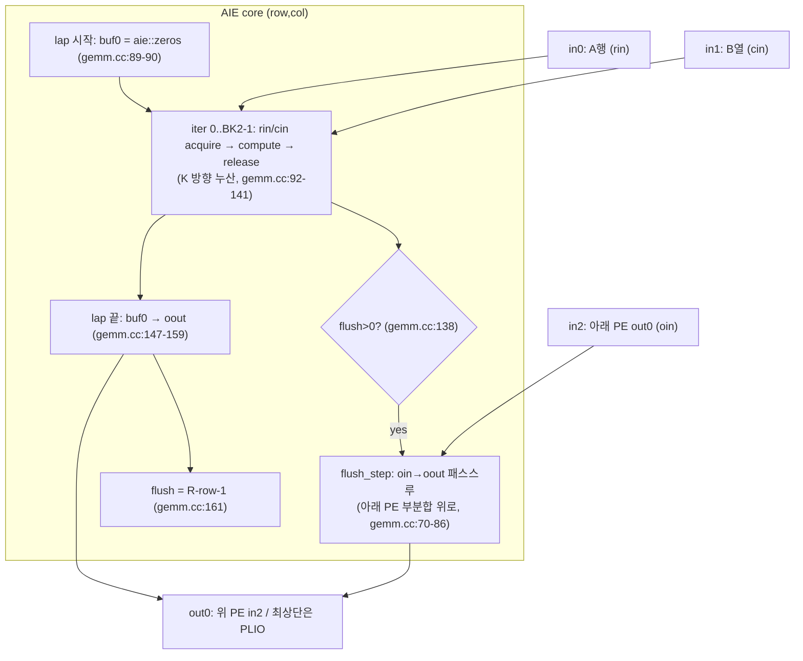
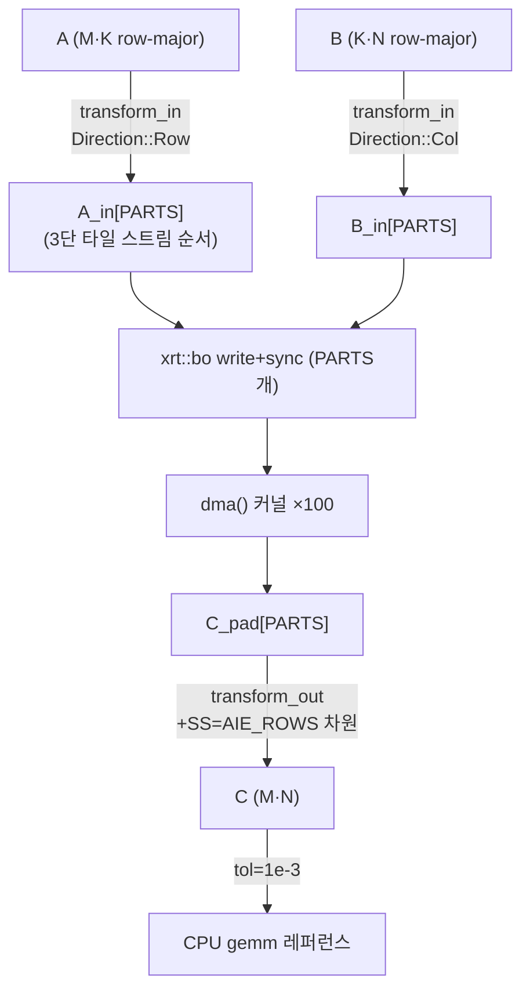
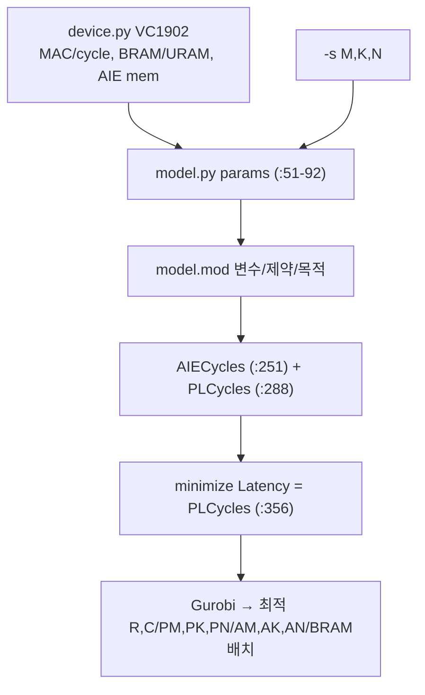

# acap-gemm-sa 모듈 통합 가이드

> 1차 요약: [`../acap-gemm-sa.md`](../acap-gemm-sa.md) — 본 문서는 그 요약을 모듈 단위로 심화한 통합 가이드다.
> 분석 대상: `\\wsl.localhost\ubuntu-24.04\home\user\project\PRJXR-HBTXR\REF\Others\acap-gemm-sa`
> 작성 원칙: 실제 소스 Read 후 `파일:라인` 근거 표기. 라인 근거 없는 추론은 "추정", 코드로 확인 불가는 "확인 불가"로 명시. 모든 라인 번호는 기준 변형 `src/` 내용 기준(변형 `src-*`는 §1.4·§11).

---

## 0. 문서 머리말

### 0.1 대표 케이스 선정
- **대표 연산: 단일 PL 타일 GEMM `C_tile = A_tile · B_tile`** (`PL_M×PL_K · PL_K×PL_N = 1024×512 · 512×800`). 근거: `parameters.hh:29-31`(`PL_M=1024, PL_K=512, PL_N=800`). 이 PL 타일 1개가 PL 데이터무버 1회 `send_A`/`send_B`/`recv_C` 핑퐁 단위(`dma.cc:878-891,1050-1061`)이자 AIE 어레이 1회 충전(charge) 단위라 분석 가치가 가장 높음. 전체 문제는 `M=K=N=8192`(`parameters.hh:20-22`).
- **대표 AIE 코어: PE id=(row=0, col=0)** — 어레이 최상단 행이라 `out0[c]`로 결과를 내보내는 sink 코어(`graph.hh:78-80`). `flush = R-row-1 = 7`(`gemm.cc:161`, row=0)로 자기 아래 7개 PE의 부분합을 가장 많이 drain한다(시스톨릭 깊이 최대 케이스). 반면 row=R-1(=7) 코어는 `FWD=false`(상류 없음, `graph.hh:50-51`)·`flush=0`이라 대비용으로 함께 분석.
- **대표 타일 계층 경계: `AIE_M×AIE_K×AIE_N = 16×64×16`** (`parameters.hh:23-25`) — 개별 AIE 코어가 1회 `compute()`에서 처리하는 타일. 이 위로 PL 타일(레벨1), 아래로 mmul 서브타일(레벨3, 현재 `AIE_MM=AIE_KK=AIE_NN=1`이라 비활성)이 감싸는 3단 계층의 중간 레벨(레벨2).
- **대표 데이터 경로: A 입력 스트림 8개(행) / B·C 스트림 50개(열)** — PL↔AIE 연결(`xsa.cfg:3-110`)이 `aie_in0_*`(A, 8개=`AIE_ROWS`), `aie_in1_*`(B, 50개=`AIE_COLS`), `aie_out0_*`(C, 50개)로 정확히 8×50 어레이와 정합. A는 행 멀티캐스트, B는 열 멀티캐스트.

### 0.2 수치 표기 규약
- **AIE MAC lanes** = (어레이 코어 수)×(코어당 사이클당 MAC). 본 설계 = `AIE_ROWS(8)×AIE_COLS(50)` = 400 코어 × FP32 8 MAC/cycle = **3,200 MAC/cycle**. 근거: 코어 수 `parameters.hh:14-15`, FP32 코어당 MAC `device.py:66-70`(`AIE_MAC_PER_CYCLE[32]=8`). INT8 전환 시 코어당 128 MAC → 51,200 MAC/cycle(16배, `device.py:67`).
- **scalar MAC / 연산량** = 대표 GEMM `2·M·K·N`(MAC=`M·K·N`, op은 곱+합으로 2배). `M=K=N=8192`이므로 MAC = 8192³ ≈ **5.50×10¹¹**, op ≈ 1.10×10¹². 근거: `host.cc:283`(`ops = 2·M·K·N·iters`).
- **loop trips**(타일 루프, 대표 구성 `M=K=N=8192`):
  - 레벨1 PL 타일 수 `BM1·BK1·BN1` = `ceil(8192/1024)·ceil(8192/512)·ceil(8192/800)` = `8·16·11` = **1,408 PL 타일 회차**(`parameters.hh:37-39`; BN1은 800이 8192를 안 나눠 ceil로 11, 패딩 발생).
  - 레벨2 AIE 타일 수(PL 타일 1개당) `BM2·BK2·BN2` = `(1024/16/8)·(512/64)·(800/16/50)` = `8·8·1` = **64**(`parameters.hh:40-42`). 이것이 AIE 코어 1개가 1 PL 타일에서 도는 lap 수.
  - AIE 코어 전체 lap `stop_lap = BM1·BN1·BK1·BM2·BN2` = `8·11·16·8·1` = **11,264**(`gemm.cc:52`). lap당 K-누산 반복 `stop_iter = BK2 = 8`(`gemm.cc:51`).
  - 레벨3 mmul 서브타일 `BM3·BK3·BN3` = `16·64·16`(=`AIE_M/MM` 등, MM=1, `parameters.hh:43-45`) — 현재 mmul 미사용이라 코어 내부 벡터 루프 경계로만 작동.
- **memory size**(payload bit / 온칩 버퍼):
  - AIE 코어 출력 누산기 `buf0[TM][TN] = float[16][16]` = 256 × 32bit = **8,192 bit/코어**(`gemm.hh:54`). 400 코어 = 3.2Mbit.
  - PL `buf_A`(URAM) = `[PARTS][AIE_ROWS/PARTS][2][PL_M·PL_K/AIE_ROWS/PLIO_PACK]` = `[2][4][2][1024·512/8/4]` = `[2][4][2][16384]`×128bit = **256Mbit**(`dma.cc:1082-1083`).
  - PL `buf_B`(BRAM) = `[2][25][2][512·800/50/4]` = `[2][25][2][2048]`×128bit = **52.4Mbit**(`dma.cc:1090-1091`).
  - PL `buf_C`(URAM) = `[2][25][2][1024·800/50/4]` = `[2][25][2][4096]`×128bit = **209Mbit**(`dma.cc:1098-1099`). (수치는 정적 산식, 실제 합성 점유율은 §11 참조 — 확인 불가.)
- **데이터 폭 계층**: DRAM/NoC 512b → PLIO 128b → 데이터 32b. `DRAM_PACK=16`(512/32), `PLIO_PACK=4`(128/32), `DRAM_PLIO_PACK=4`(`parameters.hh:48-50`). split_stream이 512b 1워드를 4×128b로 분해(`dma.cc:679-685`).
- **타깃 데이터타입**: `DT = float`(FP32, `parameters.hh:9`). AIE 벡터 길이 `AIE_VLEN=16`(FP32, `gemm.cc:9`), 누산 벡터 `ALEN=8`(`gemm.cc:44`, `aie_alen<32>=8` `gemm.cc:16`). 변형 `src-bw`는 `int32_t`(`src-bw/parameters.hh:9`). 트레이트로 8/16/32b 모두 정의(`gemm.cc:6-17`).

### 0.3 운영 경로
```
[설계공간탐색(DSE): scripts/model.py + model.mod (AMPL/Gurobi)]
      │ VC1902 자원·성능 모델(device.py) 입력 → Latency=PLCycles 최소화 (model.mod:356)
      │ 출력: 최적 R,C / PM,PK,PN / AM,AK,AN / A·B·C의 BRAM/URAM 배치
      ▼
[파라미터 고정: src/parameters.hh — 24개 static_assert로 타일 계층 합법성 강제 (:54-81)]
      ▼
[빌드: cmake → vitis_flow() (xilinx-setup.cmake:149)]
      │ v++ --mode aie  (graph.cc → libadf.a, x86sim/hw 2종) (:267-305)
      │ v++ --mode hls  (dma.cc → dma.xo) (:349-357)
      │ v++ --link      (xsa.cfg connectivity + freq → .xsa) (:360-377)
      │ v++ --package   (.xsa + libadf → .xclbin) (:380-388)
      │ + host.cc → 실행파일 (:392-399)
      ▼
[실행: host.cc — XRT (VCK5000)]
      │ transform_in: A/B를 3단 타일 레이아웃으로 재배치 (:371-492)
      │ PARTS=2 버퍼로 HBM/DDR 전송 → dma() 커널 iters=100회 (:246-263)
      │   PL: load→split→send(핑퐁) → [AIE 8×50] → recv(부분합 PL 누산)→merge→store
      │ transform_out: C를 (M,N)로 역변환 (:494-632)
      │ CPU gemm 레퍼런스와 tol=1e-3 비교 (:334-341)
      ▼
[프로파일/시각화: parse_profile.py(MAC/total 사이클), heatmap.py, monitor_power.py]
```
- 타깃: **AMD Versal VCK5000(=VC1902)** 데이터센터 카드. 플랫폼 `xilinx_vck5000_gen4x8_qdma_2_202220_1`(`xilinx-setup.cmake:7`), 8×50=400 AIE(`device.py:55-56`), PL 463 URAM·1934 BRAM(`device.py:74-75`), Vitis ≥2022.2(`xilinx-setup.cmake:45`)·실제 2023.1(`README.md:9`), PL 주파수 `1250/4 = 312.5 MHz`(`src/CMakeLists.txt:16`), AIE:PL 클럭비 4(`model.py:80`). **실측 GOP/s·합성 PPA는 리포트 부재로 확인 불가**(host.cc가 GOP/s를 런타임 측정하나 산출물 미포함).

---

## 1. Repo / 시스템 개요

acap-gemm-sa = Versal ACAP의 AIE 8×50 어레이를 **출력-고정(output-stationary) 시스톨릭**으로 배치해 대형 밀집 FP32 GEMM을 가속하는 연구용 구현체. 단일 PL HLS `dma` 커널이 DRAM↔AIE 타일 스트리밍·512b→128b 디멀티플렉싱·이중버퍼·K방향 부분합 PL 누산을 담당하고, AIE 코어는 A행 멀티캐스트·B열 멀티캐스트·부분합 세로 체인을 수행한다. 본 repo는 **AIE 커널(`gemm`)**, **ADF 그래프(`graph`)**, **PL 데이터무버(`dma`)**, **XRT 호스트(`host`)**, **AMPL/Gurobi DSE 솔버(`scripts/model`)**, **VC1902 디바이스 모델(`device.py`)**, **프로파일/시각화 스크립트**가 모두 자체 소스다. 기준 변형 `src/`(FP32) 외에 실험 변형 `src-prof/`(프로파일)·`src-ideal/`(AIE-only 상한)·`src-trad/`(2D 정통 systolic)·`src-bw/`(INT32 대역폭) 트리가 별도로 존재.

### 1.1 자체 소스 vs vendor/생성물

| 구분 | 파일(자체 소스) | 역할 |
|---|---|---|
| **설계 파라미터(HW/SW 공유)** | `src/parameters.hh` | 타입·데이터폭·어레이·3단 타일·24 static_assert |
| **AIE 커널(HW)** | `src/gemm.hh` / `src/gemm.cc` | 출력-고정 PE: K-누산 + flush drain + `aie::mac` SIMD MAC |
| **ADF 그래프(HW)** | `src/graph.hh` / `src/graph.cc` | 8×50 PE 물리 배치 + A행/B열 멀티캐스트 + 부분합 세로 체인 |
| **PL 데이터무버(HW)** | `src/dma.cc` | DRAM↔AIE: load/split/send(핑퐁)/recv(PL부분합)/merge/store |
| **시스템 연결(HW)** | `src/xsa.cfg` | connectivity(`sc=`)·NoC 대역폭·Vivado impl 전략 |
| **HLS 설정(HW)** | `cmake/hls.cfg.in`·`src/place_design_pre.tcl` | HLS 클럭/커널, 배치 사전 제약 |
| **XRT 호스트(SW)** | `src/host.cc` | transform_in/out·BO 전송·커널 실행·검증·GOP/s |
| **시뮬 데이터(SW)** | `src/generate_gemm_data.py` | AIE 시뮬용 in0/in1/out0 .txt 생성(graph PLIO 규약 정합) |
| **DSE 솔버(SW)** | `scripts/model.mod`·`scripts/model.py` | AMPL/Gurobi 사이클 모델·Latency 최소화 |
| **디바이스 모델(SW)** | `scripts/device.py` | VC1902 자원/성능 상수(MAC/cycle·BRAM·URAM·AIE mem) |
| **빌드 플로우(SW)** | `cmake/xilinx-setup.cmake`·`CMakeLists.txt`·`src/CMakeLists.txt` | `vitis_flow()`: aie/hls/link/package/host |
| **프로파일/시각화(SW)** | `scripts/{parse_profile,heatmap,plot_bar,plot_misc,plot_multicast,pie,monitor_power,check_simulation}.py` | aiesim 사이클 파싱·히트맵·전력·검증 |

### 1.2 제외 목록(이름만 언급)
- **vendor/툴체인**: Vitis `v++`·`aietools`(x86simulator/aiesimulator)·XRT(`xrt_*` 헤더, `host.cc:1-4`)·AMPL/Gurobi 솔버 엔진·numpy/matplotlib/seaborn. 분석 제외(외부 도구).
- **빌드 산출물(본 트리 미포함, 빌드 시 생성)**: `libadf.*.a`, `*.xo`, `*.xsa`, `*.xclbin`, `work.aie.*`/`work.hls`/`work.link`/`work.package`, `x86simulator_output/`·`aiesimulator_output/`, `data/*.txt`(시뮬 데이터). 근거: `xilinx-setup.cmake:201-388`.
- **변형 트리(요약만, 본 가이드는 `src/` 중심)**: `src-prof/`(+`common.hh`, 프로파일용), `src-ideal/`(`gemm.cc/gemm.hh`만 — PL/host 없는 AIE 상한), `src-trad/`(2D 정통 systolic, `gemm` 템플릿이 `<...,RFWD,CFWD>` 2-bit forward, `src-trad/graph.hh:14-107`), `src-bw/`(INT32 + mmul 블로킹, `src-bw/parameters.hh:9,22-27`). §1.4·§11에서 대비.
- **부재(확인 불가)**: 원논문 PDF·링크 부재(저장소 내 명시 없음, 추정: Versal AIE GEMM DSE 연구). csynth/cosim/impl 리포트 부재 → 합성 PPA(LUT/FF/DSP/URAM/BRAM 점유율)·달성 주파수·실측 GOP/s는 **확인 불가**.

### 1.3 AIE-PL-호스트 매핑(대표 구성)
근거: `parameters.hh:14-19`, `xsa.cfg:1-117`, `dma.cc:1072-1139`, `host.cc:206-233`.

| 계층 | 구성요소 | 물리 위치 | 스케일/근거 |
|---|---|---|---|
| AIE | `Gemm` 코어 ×400 | AIE 타일 `tile(c,r)` | 8행×50열, `graph.hh:59` `location=tile(c,r)` |
| AIE | A 입력 PLIO | `ai_engine_0.in0_0..7` | 8개=`AIE_ROWS`, 행 멀티캐스트(`graph.hh:71`) |
| AIE | B 입력 PLIO | `ai_engine_0.in1_0..49` | 50개=`AIE_COLS`, 열 멀티캐스트(`graph.hh:72`) |
| AIE | C 출력 PLIO | `ai_engine_0.out0_0..49` | 50개, 최상단 행만 출력(`graph.hh:78-80`) |
| PL | `dma` 커널 ×1 | PL(HLS) | `nk=dma:1:dma`(`xsa.cfg:2`), 312.5MHz |
| PL | `buf_A`/`buf_C` | URAM | `impl=uram`(`dma.cc:1083,1099`), 이중버퍼 |
| PL | `buf_B` | BRAM | `impl=bram`(`dma.cc:1091`) |
| PL | DRAM 포트 | `pl_in0/in1/out0_{0,1}` | PARTS=2 분할, NoC 14000.16(`xsa.cfg:112-117`) |
| 호스트 | `host.cc` | x86(XRT) | PARTS개 BO, iters=100(`host.cc:242`) |

→ 8행 A-스트림 × 50열 B-스트림 = 400 코어 충전. PARTS=2로 DRAM 포트·온칩 버퍼를 2분할(`AIE_ROWS%PARTS==0`, `parameters.hh:80`).

---

## 2. 모듈: 설계 파라미터 & 3단 타일 계층 — `parameters.hh`

### 2.1 역할 + 상위/하위
- **역할**: 전 모듈의 단일 진실 원천(single source of truth). 데이터타입·데이터폭·어레이 크기·3단 타일 계층·패킹 계수를 컴파일타임 상수로 정의하고, 24개 `static_assert`로 타일이 어레이×AIE 배수인지 등 합법성을 빌드 단계에서 강제.
- **상위**: 모든 HW/SW 소스가 include(`gemm.hh:6`, `graph.hh`(통해), `dma.cc:6`, `host.cc:16`). **하위**: 없음(`<cstdint>`·`<algorithm>`만, `:4-5`).

### 2.2 3단 타일 계층 (데이터 분할 변천)
```mermaid
flowchart TD
  GEMM["문제 GEMM\nM·K·N = 8192³"] -->|레벨1: BM1·BK1·BN1 = 8·16·11| PL["PL 타일\nPL_M·PL_K·PL_N = 1024·512·800"]
  PL -->|레벨2: BM2·BK2·BN2 = 8·8·1| AIE["AIE 코어 타일\nAIE_M·AIE_K·AIE_N = 16·64·16"]
  AIE -->|레벨3: BM3·BK3·BN3 = 16·64·16 (MM=KK=NN=1)| MMUL["mmul 서브타일\nAIE_MM·AIE_KK·AIE_NN = 1·1·1"]
  PL -.->|"공간 분배: BM2 안에 ×AIE_ROWS(8) 행 / BN2 안에 ×AIE_COLS(50) 열"| AIE
```

### 2.3 대표 코드 위치
`src/parameters.hh`(86줄 전체). 핵심: 데이터타입/폭 `:9-12`, 어레이/파티션 `:14-19`, 문제크기 `:20-22`, AIE 타일 `:23-28`, PL 타일 `:29-31`, 3단 타일 산식 `:37-46`, 패킹 `:48-52`, static_assert `:54-81`.

### 2.4 대표 코드 블록
```c
using DT = float;                                  // parameters.hh:9 (기본 FP32)
constexpr int DRAM_WIDTH = 512;                    // :11 (NoC/AXI)
constexpr int PLIO_WIDTH = 128;                    // :12 (PL↔AIE)
constexpr int AIE_ROWS = 8;  constexpr int AIE_COLS = 50;  // :17-18 (400 코어)
constexpr int PARTS = 2;                           // :19 (DRAM 포트 분할)
constexpr int M = K = N = 8192;                    // :20-22
constexpr int AIE_M = 16; AIE_K = 64; AIE_N = 16;  // :23-25 (코어 타일)
constexpr int PL_M = 1024; PL_K = 512; PL_N = 800; // :29-31 (PL 타일)
```
→ PL 타일은 `PL_M = AIE_M·AIE_ROWS·BM2 = 16·8·8`, `PL_N = AIE_N·AIE_COLS·BN2 = 16·50·1`로 어레이 차원을 정확히 감싼다.

```c
constexpr int BM2 = PL_M / AIE_M / AIE_ROWS;   // :40 = 1024/16/8 = 8
constexpr int BK2 = PL_K / AIE_K;              // :41 = 512/64   = 8
constexpr int BN2 = PL_N / AIE_N / AIE_COLS;   // :42 = 800/16/50 = 1
```
→ **레벨2 분할이 어레이 분배를 내장**: BM2/BN2는 PL 타일에서 AIE 코어 타일을 (행/열에 어레이를 곱한 뒤) 몇 번 반복하는지. BK2가 AIE 코어의 K-누산 반복(`stop_iter`, `gemm.cc:51`).

```c
constexpr int DRAM_PACK = DRAM_WIDTH / DATA_WIDTH;   // :48 = 16
constexpr int PLIO_PACK = PLIO_WIDTH / DATA_WIDTH;   // :49 = 4
constexpr int DRAM_PLIO_PACK = DRAM_PACK / PLIO_PACK;// :50 = 4
```
→ 512b DRAM 워드 1개 = 16 FP32 = 4×(128b PLIO 워드). split/merge_stream의 분해 계수(`dma.cc:679,709`).

```c
static_assert(PL_M  % AIE_M*AIE_ROWS == 0);   // :54 (PL이 AIE×어레이 배수)
static_assert(AIE_K % PLIO_PACK == 0, "load_buf_A");  // :76 (정렬)
static_assert(AIE_ROWS % PARTS == 0);         // :80 (포트 분할 정합)
```
→ **합법성 24개 강제**: 타일/폭/분할 불일치 시 빌드 자체가 막힘. 잘못된 매핑을 런타임이 아닌 컴파일타임에 차단하는 안전장치가 핵심 설계 의도.

### 2.5 마이크로아키텍처
- **메모리/폭**: FP32 32b. 폭 계층 512/128/32. `PACK_PER_ROW_STREAM=max(1, DRAM_PLIO_PACK/(AIE_ROWS/PARTS))=max(1,4/4)=1`, `PACK_PER_COL_STREAM=max(1, 4/25)=1`(`:51-52`) → split 스트림의 마지막 차원 Z=1(`dma.cc:1109-1111`).
- **정량/병목**: ① `static_assert(PL_M % AIE_M*AIE_ROWS == 0)`은 연산자 우선순위상 `PL_M % AIE_M * AIE_ROWS`로 파싱(`%`·`*` 동순위 좌결합) → `(PL_M % AIE_M) * AIE_ROWS == 0` 의미. PL_M=1024, AIE_M=16이라 `1024%16=0`으로 우연히 통과하나 **의도(`PL_M % (AIE_M*AIE_ROWS)`)와 다른 약한 검사**(잠재 결함, 추정). `:58`(PL_N), `:60-65`도 동일 패턴. ② `BN2=1`이라 N 방향은 PL 타일 1개당 AIE 열 어레이를 정확히 1회만 채움 — N 재사용 여지 작음. ③ `PL_N=800`이 N=8192를 안 나눠 `BN1=ceil(8192/800)=11`로 패딩(`host.cc:377` `X_pad`) → 마지막 타일 일부 더미 연산.

---

## 3. 모듈: AIE 출력-고정 PE 커널 — `gemm.hh` + `gemm.cc` (핵심 ①)

### 3.1 역할 + 상위/하위
- **역할**: 단일 AIE 코어에 매핑되는 출력-고정 GEMM PE. 내부 누산기 `buf0[TM][TN]`에 K 방향(`BK2`회) `aie::mac`로 부분합을 쌓고, 한 lap 끝에 출력버퍼로 내보낸다. 상류(아래쪽 PE)에서 내려오는 부분합은 `flush_step`으로 그대로 아래→위 패스스루(시스톨릭 drain).
- **상위**: `graph.hh:51-53`이 `Gemm<DT,R,AIE_M,AIE_K,AIE_N,1,1,1,FWD>` 400개 인스턴스화. **하위**: 없음(AIE `aie_api` SIMD 프리미티브 직접 제어, `gemm.cc:2`).
- 함수: 생성자(`gemm.cc:48`), `impl`(메인 FSM, `:59`), `compute`(SIMD MAC, `:174`), 인터페이스 등록 `in2out1`/`in3out1`(`gemm.hh:27/33`).

### 3.2 데이터플로우 (출력-고정 + flush drain)


### 3.3 Function call stack
`graph.hh:51` `create_object<Gemm<...,FWD>>` → `registerKernelClass`(`gemm.hh:19`)가 `FWD?in3out1:in2out1` 등록 → 런타임 `impl`(`gemm.cc:59`) → lap 루프(`:88`) → iter 루프(`:92`) → `rin/cin.acquire`(`:98,110`) → `compute`(`:120`) → `flush_step` 람다(`:138,143,167`) → lap 끝 `oout` 출력(`:147-159`).

### 3.4 대표 코드 위치
`src/gemm.hh`: 템플릿 시그니처 `:14`, 인터페이스 분기 `:19-38`, 상태 `:54-60`. `src/gemm.cc`: 벡터길이 트레이트 `:6-17`, 생성자 stop값 `:48-55`, impl FSM `:59-170`, flush_step 람다 `:70-86`, compute SIMD `:174-248`.

### 3.5 대표 코드 블록
```c
template <typename DT, int R, int TM,int TK,int TN, int MM,int KK,int NN, bool FWD>
class Gemm { ... DT buf0[TM][TN]; ... };           // gemm.hh:14,54 (출력-고정 누산기)
static void registerKernelClass() {
  if constexpr (FWD) REGISTER_FUNCTION(Gemm::in3out1);  // gemm.hh:20-21 (상류 부분합 有)
  else               REGISTER_FUNCTION(Gemm::in2out1);  // :23 (최하단 행, 상류 無)
}
```
→ **FWD 템플릿이 어레이 위치별로 인터페이스를 바꾼다**: row=R-1(최하단)은 in2 없는 3-port(`in2out1`), 그 외는 in2(아래 PE 부분합) 있는 4-port(`in3out1`). graph가 `r==R-1?false:true`로 결정(`graph.hh:50-54`).

```c
stop_iter{BK2},                                    // gemm.cc:51 (K-누산 반복 = 8)
stop_lap{BM1*BN1*BK1*BM2*BN2}                       // :52 (전체 출력 타일 lap = 11264)
```
→ 코어 1개가 전체 GEMM에서 도는 lap 수. lap마다 `buf0`를 0으로 초기화 후(`:89-90`) BK2회 누산.

```c
auto flush_step = [&]() {
  oin.acquire(); oout.acquire();
  auto in = aie::begin_vector<VLEN>(oin); auto out = aie::begin_vector<VLEN>(oout);
  for (int i=0; i<TM*TN/VLEN; i++) { *out++ = *in++; }   // gemm.cc:74-80 (그대로 복사)
  oin.release(); oout.release(); flush--;
};
...
flush = R - row - 1;                                // gemm.cc:161 (자기 위 PE 개수)
```
→ **시스톨릭 drain 핵심**: lap 종료 후 자기 출력을 내보낸 다음, 아래에서 올라오는 부분합 스트림을 `R-row-1`회 패스스루. row=0(최상단)은 flush=7(가장 깊음), row=7(최하단)은 flush=0. 어레이 파이프라인 배수 메커니즘.

```c
static constexpr bool f = std::is_same_v<DT, float>;
static constexpr int M_STEP = 2;  static constexpr int N_STEP = f ? 1 : 2;  // gemm.cc:183-184
...
aC00 = aie::mac(aC00, vB0, vA0[kk]);               // :226 (SIMD MAC)
if constexpr (M_STEP == 2) aC10 = aie::mac(aC10, vB0, vA1[kk]);  // :227
```
→ **SIMD MAC 언롤**: FP32는 2(M)×1(N) 출력 동시 처리(아키텍처상 N_STEP=1), INT은 2×2. `aC00..aC11` 누산 레지스터로 lane 충전율을 높임. ALEN=8(FP32 누산 벡터, `:44`).

### 3.6 마이크로아키텍처
- **Stage 분해(impl)**: ① lap 루프 진입 → buf0 zero(`:89-90`) ② iter 루프(BK2회): acquire A/B(`:98,110`) → compute(`:120`) → release(`:132,136`) → flush_step 조건부(`:138`) ③ 잔여 flush(`:143`) ④ buf0→oout(`:147-159`) ⑤ `flush=R-row-1` 설정(`:161`). 모든 lap 후 최종 잔여 flush(`:167`).
- **AIE MAC lanes**: 코어 1개 FP32 8 MAC/cycle(`device.py:69`). 400 코어 = 3,200 MAC/cycle. compute의 이론 사이클 = `AIE_M·AIE_K·AIE_N / 8 = 16·64·16/8 = 2048`(model.mod:242 `AIECompCycles` 산식과 정합).
- **메모리/재사용**: `buf0[16][16]×32b = 8Kbit`/코어(`gemm.hh:54`). AIE 코어 메모리 한계 32KB(`device.py:72`) — `generate_gemm_data.py:251-255`가 `(2·(in0+in1+in2+out0)+buf0)·dbytes` 추정해 초과 시 경고. 입출력은 `input_async_buffer`(ping-pong, `gemm.hh:28-30`).
- **정량/병목**: ① flush drain이 어레이 깊이에 비례(row=0은 lap마다 7회 패스스루) → 최상단 행이 추가 사이클 부담(model.mod:248 `AIEFlushCycles`). ② FP32는 N_STEP=1이라 INT 대비 출력 동시처리 절반 → MAC 효율 한계. ③ `aie::mac` SIMD가 채워지려면 K가 ALEN(8) 배수여야(`AIE_K=64`로 충족). ④ `compute` 내부 포인터 산술(`pC+TN`, `:236`)이 누산기 배치 의존 — TN 변경 시 재검증 필요(추정).

---

## 4. 모듈: ADF 시스톨릭 그래프 — `graph.hh` + `graph.cc` (핵심 ②)

### 4.1 역할 + 상위/하위
- **역할**: `R×C`(=8×50) `Gemm` 코어를 실제 AIE 타일에 물리 배치하고 멀티캐스트/부분합 체인으로 연결. A는 같은 행에 멀티캐스트, B는 같은 열에 멀티캐스트, 부분합은 열 내부에서 아래→위로 세로 누산.
- **상위**: `graph.cc:3`이 전역 `graph` 인스턴스 생성, x86sim/aiesim의 `main`(`:6-22`)이 init/run/end. v++ `--mode aie`가 컴파일(`xilinx-setup.cmake:267-305`). **하위**: `gemm.hh`(`Gemm` 커널).

### 4.2 데이터플로우 (출력-고정 멀티캐스트 + 세로 systolic)
```mermaid
flowchart TD
  IN0r["in0[r] PLIO\n(A 행)"] -->|행 멀티캐스트| Krc["kernel[r][c]"]
  IN1c["in1[c] PLIO\n(B 열)"] -->|열 멀티캐스트| Krc
  Kdown["kernel[r+1][c].out0\n(아래 PE 부분합)"] -->|in[2]| Krc
  Krc -->|out0| Kup["kernel[r-1][c].in[2]\n(위 PE로)"]
  Ktop["kernel[0][c].out0\n(최상단 행만)"] --> OUT["out0[c] PLIO (C 열)"]
```

### 4.3 Function call stack
`graph.cc:3` `GemmGraph<DT,8,50,16,64,16,1,1,1>` 생성자(`graph.hh:31`) → PLIO 생성(`:36-46`) → 배치 루프 `r=R-1..0`(`:48`) × `c=0..C-1`(`:49`) → `create_object<Kernel<FWD>>`(`:51-53`) → `location=tile(c,r)`(`:59`) → dimensions(`:66-69`) → connect 멀티캐스트/체인(`:71-80`).

### 4.4 대표 코드 위치
`src/graph.hh`: PLIO 비트폭 트레이트 `:8-11`, 노드 배열 `:21-24`, PLIO 생성 `:36-46`, 배치/연결 루프 `:48-83`. `src/graph.cc`: 인스턴스 `:3`, 시뮬 main `:6-22`.

### 4.5 대표 코드 블록
```c
adf::kernel      kernel[R][C];   // graph.hh:21 (8×50 = 400 코어)
adf::input_plio  in0[R];         // :22 (A 행 PLIO ×8)
adf::input_plio  in1[C];         // :23 (B 열 PLIO ×50)
adf::output_plio out0[C];        // :24 (C 열 PLIO ×50)
```
→ A=행 단위(8개), B/C=열 단위(50개) PLIO. xsa.cfg connectivity와 1:1(`xsa.cfg:3-110`).

```c
for (int r=R-1; r>=0; r--) {                       // graph.hh:48 (위해 r+1 참조: bottom-up)
  for (int c=0; c<C; c++) {
    if (r == R-1) kernel[r][c] = ...Kernel<false>...;       // :50-51 (최하단: FWD=false)
    else if constexpr (R > 1) kernel[r][c] = ...Kernel<true>...;  // :52-53 (그 외: FWD=true)
    adf::location<adf::kernel>(kernel[r][c]) = adf::tile(c, r);   // :59 (물리 타일 배치)
```
→ **물리 좌표 직접 배치**: `tile(col=c, row=r)`로 AIE 어레이 상의 정확한 타일 지정 → 라우팅 결정적. 최하단 행은 상류 부분합이 없어 FWD=false.

```c
adf::connect(in0[r].out[0], kernel[r][c].in[0]);   // graph.hh:71 (A: 같은 행 c=0..49 멀티캐스트)
adf::connect(in1[c].out[0], kernel[r][c].in[1]);   // :72 (B: 같은 열 r=0..7 멀티캐스트)
if (r != R-1) adf::connect(kernel[r+1][c].out[0], kernel[r][c].in[2]);  // :75 (부분합 아래→위)
if (r == 0)   adf::connect(kernel[r][c].out[0], out0[c].in[0]);          // :78-80 (최상단만 출력)
```
→ **출력-고정 systolic의 토폴로지**: 하나의 `in0[r]`이 그 행의 50개 코어 모두에 fanout(행 멀티캐스트), 하나의 `in1[c]`이 그 열의 8개 코어 모두에 fanout(열 멀티캐스트). 부분합은 `kernel[r+1]→kernel[r].in[2]`로 열 내부 세로 누산, 최상단(r=0)만 PLIO로 출력.

### 4.6 마이크로아키텍처
- **연결 구조**: A fanout=50(행당), B fanout=8(열당). 부분합은 ADF 윈도/버퍼 연결(out0→in2). dimensions: in[0]=`TM·TK=16·64=1024`, in[1]=`TK·TN=64·16=1024`, in[2]/out[0]=`TM·TN=16·16=256`(`graph.hh:66-69`).
- **정량/병목**: ① A·B 멀티캐스트가 AIE 스트림 스위치 fanout을 소모 — 행당 50 fanout이 라우팅 자원 압박 가능(확인 불가, 합성 리포트 부재). ② 부분합 세로 체인이 8단(R=8)이라 파이프라인 latency = 8 코어 통과 + flush 7회(최상단). ③ `in0[r]`/`in1[c]`이 `data/*.txt`로 PLIO 생성(`:37-45`)이라 graph.cc 단독 빌드는 시뮬 전용 — HW에서는 dma의 AXIS가 PLIO로 연결(xsa.cfg). ④ **`src-trad` 변형은 A도 가로 systolic(`rout→rin`)으로 전달**(2D 정통 systolic, `src-trad/graph.hh:96,100`)해 멀티캐스트 fanout을 줄이는 대조군 — fanout vs latency 트레이드오프 비교용(§11).

---

## 5. 모듈: PL HLS 데이터무버 — `dma.cc` (핵심 ③, 1140줄)

### 5.1 역할 + 상위/하위
- **역할**: DRAM↔AIE 사이의 모든 데이터 이동. ① DRAM에서 PL 타일 적재(`load_A/B`) ② 512b→4×128b 디멀티플렉싱(`split_stream`) ③ 온칩 버퍼로 적재 후 AIE AXIS 송신(이중버퍼 핑퐁, `send_A/B`) ④ AIE 출력 수신 + **K 방향 부분합 PL 누산**(`recv_buf`) ⑤ 역방향 병합(`merge_stream`)·DRAM 기록(`store_C`). 전체가 탑레벨 `#pragma HLS dataflow`(`:1080`)로 동시 파이프라인.
- **상위**: Vitis HLS(`nk=dma:1:dma`, `xsa.cfg:2`), v++ `--mode hls`(`xilinx-setup.cmake:349`). **하위**: HLS `hls_stream`·`hls_task`·`ap_axi_sdata`(`:1-3`).
- 파일 구조: `:51-591`은 가변 스트림(최대 50개) 대응 **코드 생성 매크로**(`ARGS_n`/`CALL_STREAMS_n`/`CALL_PARTS{1,2,3}_n`), 실제 로직은 `:593` 이후.

### 5.2 데이터플로우 (PL 단계별 + 이중버퍼)

```mermaid
flowchart LR
  DRAM["DRAM (pl_in0/in1)"] -->|load_A/B II=1| DS["dram_stream (512b)"]
  DS -->|split_stream\n512b→4×128b 라운드로빈| SP["plio_stream[S/P][Z]"]
  SP -->|load_buf → buf_0/buf_1 핑퐁| SB["온칩 buf (URAM/BRAM)"]
  SB -->|send_buf_A/B II=1| AX["AXIS → AIE PLIO"]
  AX --> AIE["[AIE 8×50]"]
  AIE -->|aie_out0 AXIS| RB["recv_buf\nbk1>0이면 += PL 부분합"]
  RB -->|store_buf 핑퐁| MS["merge_stream\n4×128b→512b"]
  MS -->|store_C II=1| DRAMC["DRAM (pl_out0)"]
```


### 5.3 Function call stack
`dma`(`:1072`) `#pragma HLS dataflow`(`:1080`) → `load_A/B`(`:1113-1114`) → `split_stream`(`:1116-1117`) → [HW] `send_A`(`:1121`)/`send_B`(`:1123`)/`recv_C`(`:1125`) 또는 [sim] `hls::task` 버전(`:1127-1132`) → `merge_stream`(`:1135`) → `store_C`(`:1137`). `send_A`(`:869`) → 핑퐁 `send_inner_A`(`:884/886`) → `send_buf_A`(`:864`) ∥ `load_buf`(`:865`). `recv_C`(`:1043`) → `recv_inner_C`(`:1055`) → `recv_buf`(`:1038`) ∥ `store_buf`(`:1039`).

### 5.4 대표 코드 위치
`src/dma.cc`: 타입/매크로 `:8-591`, load `:593-639`, store_C `:641-661`, split `:663-692`, merge `:694-723`, load_buf `:725-742`, send_buf `:787-835`, send 핑퐁 `:856-934`, recv_buf(PL 부분합) `:936-967`, store_buf/recv_C `:969-1070`, 탑레벨 dma `:1072-1139`.

### 5.5 대표 코드 블록
```c
int j = i / PLIO_PACK;
loop15: for (int p=0; p<DRAM_PLIO_PACK; p++) {     // dma.cc:679 (=4)
  int s = (j+p) % (S / P);                          // :680 (라운드로빈 스트림 선택)
  int z = p / (S / P);                              // :681
  ps[s][z].write(d((p+1)*PLIO_WIDTH-1, p*PLIO_WIDTH));  // :682 (128b 슬라이스)
}
```
→ **512b→4×128b 디멀티플렉싱**: DRAM 1워드를 `S/P`개 AIE 스트림에 라운드로빈 분배. S=AIE_ROWS(A) 또는 AIE_COLS(B), P=PARTS. DRAM 대역폭을 다수 AIE 행/열로 펼침.

```c
template <int S,int PY,int PX,int Z>
void send_inner_A(...) {
  #pragma HLS dataflow                              // dma.cc:863
  send_buf_A(buf_0, s);                             // :864 (현재 버퍼 송신)
  load_buf<S,PY,PX>(split, buf_1, last);            // :865 (다음 버퍼 적재 — 동시)
}
...
if (iter == 0) send_inner_A(split, buf[0], buf[1], s, last);  // :884 (핑퐁)
else           send_inner_A(split, buf[1], buf[0], s, last);  // :886
iter = !iter;                                       // :888
```
→ **이중버퍼 통신-계산 중첩**: 한 버퍼를 AIE로 송신하는 동안 다른 버퍼에 다음 PL 타일을 적재. `last`면 마지막 적재 skip(`load_buf:730`).

```c
if (bk1 > 0) {                                      // dma.cc:950 (K 방향 2회차 이상)
  loop40: for (int p=0; p<PLIO_PACK; p++) {
    union_t u1; u1.uint = d.data(...).to_uint();    // :952 (수신 부분합)
    union_t u2; u2.uint = buf[idx](...).to_uint();  // :953 (기존 누적)
    u1.val += u2.val;                               // :954 (FP32 가산)
    d.data(...) = u1.uint;                          // :955
  }
}
buf[idx++] = d.data;                                // :958
```
→ **K 방향 부분합 PL 누산이 설계의 핵심**: AIE 어레이가 K(=8192)를 한 번에 못 담으므로 `BK1=16` 회차에 걸쳐 PL `recv_buf`에서 `union_t`로 비트→float 풀어 누적. AIE는 PL 타일 K(=512)만 담당, 나머지 K는 PL이 합산. **임의 K 처리의 열쇠**.

```c
static plio_t buf_A[PARTS][AIE_ROWS/PARTS][2][PL_M*PL_K/AIE_ROWS/PLIO_PACK];
#pragma HLS bind_storage variable=buf_A type=ram_t2p impl=uram   // dma.cc:1083 (A→URAM)
#pragma HLS array_partition variable=buf_A dim=1/2/3 type=complete // :1084-1086
...
#pragma HLS bind_storage variable=buf_B ... impl=bram             // :1091 (B→BRAM)
#pragma HLS bind_storage variable=buf_C ... impl=uram             // :1099 (C→URAM)
```
→ **메모리 계층 분담**: A·C는 URAM, B는 BRAM. dim1~3 complete partition(포트 멀티화) + dim4 cyclic(대역폭). 자원 균형 + 포트 충돌 완화 전략. 모두 이중버퍼(dim3=2).

### 5.6 마이크로아키텍처
- **Stage 분해**: load(II=1)→split(II=1)→send(핑퐁 dataflow)→[AIE]→recv(II=1, dependence inter false `:947`)→merge(II=1)→store(II=1). 탑레벨 dataflow가 전 단계를 free-running 파이프(HW) 또는 `hls::task`(sim, `:1127-1132`)로 동시 실행.
- **온칩 버퍼**(§0.2): buf_A URAM ≈256Mbit, buf_B BRAM ≈52Mbit, buf_C URAM ≈209Mbit(정적 산식). VC1902 한계 URAM 463·BRAM 1934 유닛(`device.py:74-75`) — 실제 점유는 합성 리포트 부재로 확인 불가.
- **정량/병목**: ① recv_buf의 `bk1>0` 부분합 가산이 BK1=16회 중 15회 read-modify-write → URAM 2-port(`ram_t2p`)·`dependence inter false`(`:947`)로 II=1 유지. ② **거대 매크로 코드 생성(`:51-591`)**이 스트림 개수 상한 50을 하드코딩(`ARGS_50`까지) — 가독성·유지보수성 저하, 어레이 확장 시 매크로 확장 필요. ③ split의 라운드로빈(`:680`)이 DRAM 대역폭을 균등 분배하나 `S/P`가 작으면(B는 25) 스트림당 부하 큼. ④ store_C는 `PLBufferWriteCycles`가 PLBufferCycles 산식에서 주석처리(`model.mod:285`)되어 write가 compute에 가려진다고 가정 — write-bound 시 모델 과소추정 가능(추정).

---

## 6. 모듈: PL↔AIE 연결 & Vivado 전략 — `xsa.cfg`

### 6.1 역할 + 상위/하위
- **역할**: v++ `--link` 단계의 connectivity. `dma` 커널 1개 인스턴스화(`nk`), dma의 AXIS 포트를 AIE PLIO에 매핑(`sc=`), NoC 읽기/쓰기 대역폭 지정(`noc.*`), Vivado synth/impl 전략 지정(`[vivado]`).
- **상위**: `vitis_flow()`의 `--config=${ARGS_XSA_CONFIG}`(`xilinx-setup.cmake:373`), src/CMakeLists `XSA_CONFIG xsa.cfg`(`:18`). **하위**: 없음(빌드 설정).

### 6.2 대표 코드 블록
```ini
nk=dma:1:dma                                        # xsa.cfg:2 (dma 1개)
sc=dma.aie_in0_0:ai_engine_0.in0_0                  # :3 (A 스트림 0 → AIE in0_0)
...
sc=dma.aie_in1_49:ai_engine_0.in1_49               # :60 (B 스트림 49 → AIE in1_49)
sc=ai_engine_0.out0_0:dma.aie_out0_0               # :61 (AIE out0_0 → C 스트림 0)
...
noc.read_bw=dma.pl_in0_0:14000.16                   # :112 (NoC 읽기 14000.16)
noc.write_bw=dma.pl_out0_0:14000.16                 # :116
```
→ **8(A)+50(B)+50(C)=108 스트림 연결**이 8×50 어레이와 정확히 정합. A는 8개(행), B/C는 각 50개(열). README가 "array 차원에 맞춰 주석/해제하라"고 안내(`README.md:18`).

```ini
[vivado]
prop=run.synth_1.STRATEGY=Flow_PerfOptimized_high  # xsa.cfg:120
prop=run.impl_1.STRATEGY=Performance_Explore        # :121
prop=run.impl_1.STEPS.PLACE_DESIGN.ARGS.DIRECTIVE=Explore  # :128
prop=run.impl_1.STEPS.ROUTE_DESIGN.ARGS.DIRECTIVE=AggressiveExplore  # :138
```
→ **타이밍 폐쇄 공격적 전략**: 312.5MHz PL을 맞추기 위해 opt/place/phys_opt/route/post_route 전부 Explore·Aggressive. 큰 어레이의 라우팅 부담을 Vivado 전략으로 흡수.

### 6.3 마이크로아키텍처
- **정량/병목**: ① NoC `14000.16` 대역폭 지정이 4개 in + 2개 out 포트(`:112-117`)에 분산 — PARTS=2와 정합. ② connectivity가 정적이라 어레이 크기 변경 시 `sc=` 라인 수동 편집 필요(README:18, 유지보수 부담). ③ Vivado Explore 전략은 빌드 시간을 크게 늘림(타이밍 우선, 추정).

---

## 7. 모듈: XRT 호스트 + 레이아웃 변환 — `host.cc`

### 7.1 역할 + 상위/하위
- **역할**: xclbin 로드, A/B를 3단 타일 레이아웃으로 재배치(`transform_in`), PARTS개 BO로 전송, `dma` 커널 100회 실행(워밍업 10), C 읽기·역변환(`transform_out`), CPU 레퍼런스와 `tol=1e-3` 비교, GOP/s 측정.
- **상위**: 사용자 CLI(`./bin/gemm xclbin [dev]`, `README.md:41`). **하위**: XRT `xrt_device/kernel/bo/graph`(`:1-4`), parameters.hh(`:16`).

### 7.2 데이터플로우 (호스트 변환)


### 7.3 Function call stack
`main`(`:40`) → 데이터 생성(`:78-97`) → `transform_in<Row>`(A, `:150`)·`transform_in<Col>`(B, `:165`) → BO write/sync(`:206-233`) → 실행 루프(`:246-263`) `dma(...)`(`:253`)·sw_emu면 `graph->run`(`:249`) → C read(`:275-278`) → `transform_out`(`:308`) → `gemm` 레퍼런스(`:320`) → 비교(`:335-341`).

### 7.4 대표 코드 위치
`src/host.cc`: 메인 `:40-350`, 데이터 생성 `:78-97`, transform_in `:371-492`, transform_out `:494-632`, 레퍼런스 gemm `:352-369`, GOP/s `:283-295`.

### 7.5 대표 코드 블록
```c
std::generate(A.begin(), A.end(), [](){ static int i{0}; return i++; });  // host.cc:91 (A=인덱스)
for (k) for (n) { if (k==n) B[k*N+n]=1; else B[k*N+n]=0; }                // :92-97 (B=단위행렬)
```
→ **테스트 데이터 단순화**: B를 단위행렬로 두면 C=A라 정합성 검증이 단순(인덱스 보존). 일반 정확도 검증력은 제한적(추정).

```c
auto const A_in = transform_in<PARTS, AIE_ROWS, Direction::Row, Direction::Col,
  PL_M, PL_K, AIE_M, AIE_K, AIE_MM, AIE_KK, PLIO_PACK>(A, M, K, M_pad, K_pad);  // host.cc:150
```
→ **3단 타일 펼치기**: PL타일(PY,PX)→AIE타일(AY,AX)→mmul(YY,XX) 6중 타일 순회(`:414-461`)로 행/열 방향에 스트림 분배. AIE 그래프 PLIO 입력 순서와 정확히 일치. 패딩(`Y_pad/X_pad`, `:376-377`).

```c
constexpr int SY = (DS == Direction::Row) ? S*AY : SS*AY;   // host.cc:551 (transform_out)
for (int ss=0; ss<SS; ss++) { ... base_y = ... + ssy(ss); } // :603-606
```
→ **transform_out의 SS(=AIE_ROWS) 추가 차원**: 행 방향 부분합 분산(8행에 걸친 출력)을 복원. transform_in엔 없는 차원(출력은 행 systolic 결과라 재조립 필요).

```c
unsigned long long ops{2ull*M*K*N*iters};            // host.cc:283
printf("  gop/s: %lf\n", ops / t_dma.count() / 1e9); // :293
```
→ GOP/s = `2·M·K·N·iters / 컴퓨트시간`. 패딩 포함(`ops_pad`, `:284`)·전송 포함(`:295`)도 산출. 실측치는 런타임 출력이라 산출물 부재 시 확인 불가.

### 7.6 마이크로아키텍처
- **정량/병목**: ① iters=100·warmup=10(`:242-243`)으로 측정 안정화(emu면 1회). ② PARTS=2 BO 분할이 호스트↔디바이스 전송을 병렬화(`:207-211`). ③ transform_in/out이 CPU 6중 루프라 큰 행렬은 호스트 전처리 시간이 큼(1회성, 추정). ④ `tol=1e-3`(FP32 누적 오차 허용, `:334`) — INT 변형은 정확 일치 기대(추정). ⑤ A=인덱스가 8192² 범위면 FP32 정밀도 한계 근접 가능(추정, 검증력 영향).

---

## 8. 모듈: AIE 시뮬 데이터 생성 — `generate_gemm_data.py`

### 8.1 역할 + 상위/하위
- **역할**: AIE 단독 시뮬(x86sim/aiesim)용 입력 데이터 생성. numpy로 A·B 생성, `C=A·B` 계산 후 `host.cc::transform_in`과 동일한 6중 타일 순회로 `in0_r.txt`(A행)·`in1_c.txt`(B열)·`out0_c.txt`(C열, 기대값) 생성.
- **상위**: 사용자 CLI(`README.md:50`), x86sim/aiesim 타깃의 `${NAME}-data`(`xilinx-setup.cmake:311-317`). **하위**: numpy.

### 8.2 대표 코드 블록
```python
y = bm2*TM*ROWS + r*TM + bm3*MM + mm    # generate_gemm_data.py:166 (in0 A행: 행 인터리브)
x = bk2*TK + bk3*KK + kk                 # :168
writer.write(f'{A[y,x]}')                # :170
```
→ **graph.hh PLIO 규약과 1:1**: A는 `r*TM`로 8행 인터리브, B는 `c*TN`로 50열 인터리브(`:188`). out0은 `r`까지 포함한 6중 루프(`:204-214`)로 행 systolic 출력 순서 재현.

```python
mem = (2*(in0 + in1 + in2 + out0) + buf0)*dbytes   # generate_gemm_data.py:251
if mem > args.mem*1024:                              # :254 (32KB 한계)
  print(f'!! warning: tile size ... exceeds tile memory ...')
```
→ **AIE 타일 메모리 32KB 검사**: 이중버퍼(2×) 입출력 + buf0 누산기 합이 코어 메모리 초과 시 경고. `device.py:72` AIE_MEM_BYTES와 정합.

### 8.3 마이크로아키텍처
- **정량/병목**: ① 데이터 모드(random/indices/ones/rows/cols/identity, `:67-88`)로 다양한 검증 패턴. ② `serialize_mmul`(`:218-228`)이 mmul 블록 직렬화 — MM/KK/NN>1(`src-bw`)일 때 메모리 레이아웃 대응. ③ `check_simulation.py`(`:336`)가 생성 out0과 aiesim 출력을 `rel_tol=1e-9`로 비교(`check_simulation.py:37`), `SKIP` 마커 처리. ④ ROWS·COLS·TM·TK·TN을 CLI로 받아 임의 어레이/타일 시뮬 가능(설계탐색 보조).

---

## 9. 모듈: AMPL/Gurobi DSE 솔버 — `model.mod` + `model.py`

### 9.1 역할 + 상위/하위
- **역할**: 합성 없이 사이클정확 모델로 GEMM 매핑 설계공간을 수리최적화. 어레이(R,C)·PL타일(PM,PK,PN)·AIE타일(AM,AK,AN)·A/B/C의 BRAM/URAM 배치를 변수로, 메모리/타일 합법성을 제약으로, **PLCycles(=Latency) 최소화**가 목적.
- **상위**: 사용자 CLI(`./scripts/model.py model.mod -s M,K,N`, `README.md:63`). **하위**: amplpy+Gurobi, `device.py`(VC1902 상수, `model.py:31`).

### 9.2 데이터플로우 (사이클 모델)


### 9.3 대표 코드 위치
`scripts/model.mod`: 파라미터 `:9-78`, 변수 `:84-161`, 메모리 정의 `:168-235`, AIE 사이클 `:238-256`, PL 사이클 `:259-288`, 제약 `:294-350`, 목적 `:356-357`. `scripts/model.py`: 파라미터 주입 `:51-127`, Gurobi 옵션 `:129-149`, 해 출력 `:186-241`.

### 9.4 대표 코드 블록
```ampl
subject to AIECompCyclesDef:
  Cont6 = AM*AK*AN / aie_mac_per_cycle / comp_eff ...   # model.mod:242 (AIE 계산 사이클)
subject to AIEFlushCyclesDef:
  AIEFlushCycles = AM*AN * bitwidth_data / aie_store_bits_per_cycle;  # :248 (flush)
subject to AIECyclesDef:
  AIECycles = max(AIEBufferReadCycles, AIECompCycles + AIEFlushCycles);  # :251
```
→ **AIE 코어 사이클 모델**: 계산(`AM·AK·AN/MAC_per_cycle`)과 flush(`AM·AN/store_bits`)를 합치고 버퍼read와 max. gemm.cc의 compute(`:204`)+flush_step(`:70`) 구조를 사이클로 추상화.

```ampl
subject to PLReuseDef: PLBufferReuse = BM2 * BK2 * BN2;   # model.mod:278 (AIE 재사용)
subject to PLBufferCompCyclesDef: PLBufferCompCycles = SACompCycles * PLBufferReuse;  # :281
subject to PLCyclesDef:
  PLCycles = PLBufferReadCycles + PLBufferCycles*BM1*BK1*BN1 + PLBufferWriteCycles;  # :288
```
→ **PL 전체 사이클**: PL 타일 1개 compute(`SACompCycles`×BM2·BK2·BN2)와 load를 max한 뒤(`:284`) × PL타일 수(BM1·BK1·BN1) + 초기load + 최종store. dma.cc의 send/recv 핑퐁 구조와 정합.

```ampl
subject to AIEFlush: PK / AK >= Rows;             # model.mod:350 (flush 조건)
subject to ADividesP: PM = Rows*AM*BM2 and PK = AK*BK2 and PN = Cols*AN*BN2;  # :326
subject to VlenDividesA: AM = aie_vlen*BM3 and ...;  # :329 (벡터 정렬)
minimize Latency: PLCycles;                       # :356
```
→ **제약이 parameters.hh의 static_assert를 수리화**: `PM=Rows·AM·BM2`(`:326`)는 `PL_M=AIE_ROWS·AIE_M·BM2`(parameters.hh:40)와 동일. `AIEFlush: PK/AK>=Rows`는 K 깊이가 어레이 행 수 이상이어야 flush가 성립함을 강제.

### 9.5 마이크로아키텍처
- **정량(device.py 입력)**: VC1902 `AIE_MAC_PER_CYCLE={8:128,16:32,32:8}`(`device.py:66-70`), `AIE_STORE_BITS_PER_CYCLE=256`(`:65`), `AIE_MEM_BYTES=32KB`(`:72`), `PL_BRAM=BRAM_18K×1934`(`:74`), `PL_URAM=URAM_288K×463`(`:75`), `aie_pl_clock_ratio=4`(`model.py:80`).
- **DSE 노브(model.py CLI)**: `-a R,C`(어레이 고정)·`--pl-size`·`--aie-size`(타일 고정)·`-b a,b,c`(BRAM 배치 고정)·`--enable-split`(SA 분할)·`-c/-m`(compute/memory 효율 스케일)·`-u`(메모리 점유 상한 0.9)·freq(312.5/250MHz)(`model.py:6-23`).
- **정량/병목**: ① 목적이 PLCycles 단일(latency) — 면적은 제약(`PLBRAMUnitsLimit:339`/`PLURAMUnitsLimit:342`)으로만 처리, 다목적 주석처리(`:359-367`). ② `comp_eff`/`mem_eff`로 실측 효율 보정 가능하나 기본 1.0(이상치). ③ `enable_split`(SA 폴딩, `:304-311`)으로 큰 논리 어레이를 작은 물리 어레이에 접는 탐색 — `PhysRows≤max_r`(`:314`). ④ **합성 PPA가 아닌 사이클 추정만** — 실제 자원/주파수는 합성 후 검증 필요(확인 불가).

---

## 10. 모듈: 빌드 플로우 & 보조 스크립트 — `xilinx-setup.cmake` · `device.py` · `scripts/*`

### 10.1 역할 + 상위/하위
- **vitis_flow()**: AIE/HLS/link/package/host 5단 v++ 빌드를 cmake 함수 1개로 정의. src/CMakeLists.txt(`:1-22`)가 소스/주파수만 넘겨 호출.
- **device.py**: VC1902(=VCK5000) 자원/성능 상수 모델(메타클래스로 필수 변수 검증).
- **scripts**: parse_profile(aiesim 사이클 MAC/total 파싱)·heatmap·plot_*·pie·monitor_power·check_simulation.
- **상위**: CMakeLists.txt(루트)·사용자 CLI. **하위**: v++/aietools/XRT(vendor).

### 10.2 대표 코드 블록
```cmake
v++ --compile --mode aie --target=x86sim/hw ... --aie.xlopt=2 ${_aie_pl_freq} graph.cc  # :268-298
v++ --compile --mode hls --config=hls.cfg --hls.jobs=N                                   # :350-353
v++ --link --target=${XILINX_TARGET} --kernel_frequency=${_freq_mhz} --config=xsa.cfg    # :361-373
v++ --package ... ${_xsa} ${_libadf} --output=${_xclbin}                                  # :381-385
```
→ **5단 빌드**: aie(libadf, x86sim+hw 2종 `:267,287`) → hls(dma.xo) → link(xsa) → package(xclbin) → host. PL 주파수 `1250/4`를 python으로 평가(`:233-242`).

```python
class VC1902(Device):
  AIE_ROWS = 8; AIE_COLS = 50                       # device.py:55-56
  AIE_MAC_PER_CYCLE = {8:128, 16:32, 32:8}          # :66-70 (정밀도별 MAC/cycle)
  AIE_MEM_BYTES = 32*1024                            # :72
  PL_BRAM = BRAM_18K(1934); PL_URAM = URAM_288K(463) # :74-75
VCK5000 = VC1902                                      # :77 (별칭)
```
→ **디바이스 단일 모델**: DSE 솔버·메모리 산식이 모두 이 상수 참조. INT8(128)이 FP32(8)의 16배 MAC — 저정밀 전환 정량 근거.

```python
if 'MAC' in line: mac_cycles += count              # parse_profile.py:26-27
prog = f'{mac_cycles}/{total_cycles}'              # :31 (MAC/전체 사이클 = 효율)
```
→ **프로파일 효율 측정**: aiesimulator 명령 단위 프로파일에서 MAC 명령 사이클/전체 사이클로 AIE 활용도 산출. heatmap.py가 함수별 사이클 히트맵 생성(`README.md:71`).

### 10.3 마이크로아키텍처
- **정량/병목**: ① `--aie.xlopt=2`(`:275`)가 AIE 최적화 최대. ② Vitis ≥2022.2 강제(`:45`, Unified API). ③ x86sim(빠른 기능)+aiesim(사이클정확) 2-tier 시뮬(`:319-344`). ④ device.py가 메타클래스로 필수 상수 누락 시 TypeError(`:3-14`) — 디바이스 모델 무결성 강제. ⑤ monitor_power.py는 실디바이스 bdf 전력 모니터(`README.md:70`) — 실측 전력은 실행 시에만(확인 불가).

---

## 11. 변형(variant) 비교 — `src-trad` · `src-bw` · `src-ideal` · `src-prof`

| 변형 | 핵심 차이(근거) | 의미 |
|---|---|---|
| `src/`(기준) | FP32, A행/B열 멀티캐스트 + 부분합 세로 systolic, `Gemm<...,FWD>`(1-bit) | 출력-고정, 멀티캐스트형 |
| `src-trad/` | `Gemm<...,RFWD,CFWD>`(2-bit), A 가로 systolic `rout→rin`(`src-trad/graph.hh:96,100`) + 부분합 세로 | **정통 2D systolic**(멀티캐스트 없이 인접 전달) — fanout↓ latency↑ 대조군 |
| `src-bw/` | `DT=int32_t`(`src-bw/parameters.hh:9`), mmul `MM=4,KK=2,NN=4`(`:22-24`), `M=K=N=4096`(`:16-18`) | **INT + mmul 블로킹** 대역폭 실험. compute의 N_STEP=2 활성(`gemm.cc:184`) |
| `src-ideal/` | `gemm.cc/gemm.hh`만 존재(PL/host 없음) | **AIE-only 상한** 측정(데이터무빙 제외 순 연산 한계) |
| `src-prof/` | +`common.hh`, 동일 src + 프로파일 설정(추정) | 프로파일링 빌드 |

- **공통 골격**: 모든 변형이 parameters.hh의 3단 타일·device.py 모델·vitis_flow를 공유. 차이는 PE 데이터 전달 방식(멀티캐스트 vs systolic)·정밀도·mmul·범위.
- **확인 불가**: 변형 간 실측 성능 비교 수치(합성/실행 산출물 부재). `src-trad`의 `gemm.cc`가 2-bit FWD를 어떻게 구현하는지 세부는 본 가이드 범위 밖(요청상 `src/` 중심).

---

## 12. 모듈 한눈 요약 표

| 모듈 | 파일 | 핵심 함수/심볼(라인) | 역할 | 대표 정량 |
|---|---|---|---|---|
| 파라미터/타일 | parameters.hh | BM2/BK2/BN2(:40-42), static_assert(:54-81) | 3단 타일·합법성 강제 | FP32, 8×50, PL 1024·512·800, AIE 16·64·16 |
| AIE PE | gemm.hh/cc | impl(:59), compute(:174), flush_step(:70) | 출력-고정 K-누산 + flush drain | buf0[16][16], 8 MAC/cy, ALEN=8, flush=R-row-1 |
| ADF 그래프 | graph.hh/cc | GemmGraph(:31), connect(:71-80) | 8×50 배치 + 멀티캐스트 + 세로 누산 | A fanout 50, B fanout 8, tile(c,r) |
| PL 데이터무버 | dma.cc | dma(:1072), split(:663), recv_buf(:936) | DRAM↔AIE + K부분합 PL 누산 | 512b→4×128b, buf_A/C URAM, buf_B BRAM, 이중버퍼 |
| 연결/전략 | xsa.cfg | nk(:2), sc(:3-110), [vivado](:119) | PL↔AIE 108스트림 + impl 전략 | 8+50+50 스트림, NoC 14000.16 |
| 호스트 | host.cc | main(:40), transform_in(:371) | 변환·실행·검증·GOP/s | iters=100, tol=1e-3, PARTS=2 BO |
| 시뮬데이터 | generate_gemm_data.py | in0/in1/out0 루프(:156-216) | AIE 시뮬 입출력 + 32KB 검사 | graph PLIO 규약 정합, rel_tol 1e-9 |
| DSE 솔버 | model.mod/py | PLCycles(:288), minimize(:356) | 사이클 모델 latency 최소화 | AIE/PL 사이클, BRAM/URAM 배치, R/C/PM/AM 탐색 |
| 디바이스 모델 | device.py | VC1902(:54), MAC_PER_CYCLE(:66) | 자원/성능 상수 | 8 MAC(FP32)/128(INT8), 463 URAM, 1934 BRAM |
| 빌드 | xilinx-setup.cmake | vitis_flow(:149) | aie/hls/link/package/host | 5단 v++, ≥2022.2, 312.5MHz |
| 프로파일 | parse_profile.py 외 | MAC/total(:26-31) | aiesim 사이클·히트맵·전력 | MAC/전체 사이클 효율 |

---

## 13. 읽기 순서 / 코드 추적 순서

1. **파라미터 먼저**: `parameters.hh` — 데이터타입(`:9`)·어레이(`:14-18`)·3단 타일 산식(`:37-46`)·static_assert(`:54-81`). 모든 모듈의 공통 어휘. BM1/BM2/BK2 손계산으로 타일 경계 체득.
2. **AIE 핵심 ① PE**: `gemm.cc` compute의 `aie::mac`(`:226`)·M_STEP/N_STEP(`:183-184`) → flush_step(`:70-86`)·`flush=R-row-1`(`:161`) → impl FSM(`:88-167`). 출력-고정 + drain의 본질.
3. **AIE 핵심 ② 그래프**: `graph.hh` connect 3종(`:71-80`)·`tile(c,r)`(`:59`)·FWD 분기(`:50-53`) → A행/B열 멀티캐스트 + 부분합 세로 체인 토폴로지.
4. **PL 핵심 ③ 데이터무버**: `dma.cc` split_stream(`:679-685`)·send 핑퐁(`:863-888`)·**recv_buf K부분합**(`:950-958`)·메모리 바인딩(`:1083-1099`) → 탑레벨 dataflow(`:1072-1139`). DRAM↔AIE 흐름 전체.
5. **시스템 연결**: `xsa.cfg` sc 매핑(`:3-110`) ↔ dma AXIS(`:1076-1078`) ↔ graph PLIO(`graph.hh:37-45`) 3자 정합 확인.
6. **호스트 정합**: `host.cc` transform_in 6중 타일(`:414-461`) ↔ `generate_gemm_data.py` in0/in1 루프(`:156-194`) 비교 → PLIO 레이아웃 양방향 이해. recv 부분합 ↔ transform_out SS 차원(`:603-606`).
7. **DSE 모델**: `model.mod` AIECycles(`:251`)·PLCycles(`:288`)·제약(`:326,329,350`) ↔ 코드 구조(compute/flush/send 핑퐁) 매핑 → `device.py` 상수(`:66-75`) → `model.py` 탐색 노브(`:6-23`).
8. **변형 대비**: `src-trad/graph.hh`(2D systolic, `:96-101`) vs `src/graph.hh`(멀티캐스트) → fanout/latency 트레이드. `src-bw/parameters.hh`(INT+mmul, `:9,22-24`) → 저정밀 N_STEP=2 경로.

---

## 14. 병목 후보 & 병렬도/DSE 노브

### 14.1 병목 후보
1. **K 깊이 > AIE 어레이 → PL 부분합 누산 오버헤드**(`dma.cc:950-958`): K=8192를 AIE PL타일 K=512(BK2=8)만 담당, 나머지는 PL이 BK1=16회 read-modify-write로 합산. URAM 2-port·`dependence inter false`(`:947`)로 II=1 유지하나 BK1만큼 누산 패스 반복. 임의 K 처리의 대가.
2. **flush drain이 어레이 깊이 비례**(`gemm.cc:161`): 최상단 행(row=0)은 lap마다 `flush=7`회 패스스루 — 어레이가 깊을수록(R↑) 추가 사이클. model.mod의 `AIEFlush: PK/AK>=Rows`(`:350`)가 K 깊이로 이를 흡수해야 성립.
3. **A·B 멀티캐스트 fanout**(`graph.hh:71-72`): A는 행당 50 fanout, B는 열당 8 fanout. AIE 스트림 스위치 라우팅 자원 압박 가능(합성 리포트 부재로 확인 불가). `src-trad`의 2D systolic(인접 전달)이 fanout을 줄이는 대안.
4. **FP32 N_STEP=1 → 출력 동시처리 절반**(`gemm.cc:184`): FP32는 2×1, INT은 2×2 출력. FP32 MAC 효율이 INT 대비 구조적으로 낮음(코어당 8 vs 128 MAC, `device.py:66-70`).
5. **PL 타일 패딩**(`parameters.hh:31`, `host.cc:377`): `PL_N=800`이 N=8192를 안 나눠 BN1=11로 패딩 → 마지막 타일 더미 연산. `ops_pad`(`host.cc:284`)가 패딩 포함 GOP/s로 손실 가시화.
6. **거대 매크로 코드 생성**(`dma.cc:51-591`): 스트림 개수 상한 50 하드코딩(`ARGS_50`). 어레이 확장 시 매크로 수동 확장, 가독성/유지보수성 저하.
7. **store_C가 PLBufferCycles에서 누락**(`model.mod:285` 주석): write가 compute에 가려진다 가정 — write-bound 워크로드에서 모델 latency 과소추정 가능(추정).
8. **잠재 결함**: `static_assert(PL_M % AIE_M*AIE_ROWS == 0)`(`parameters.hh:54`)이 연산자 우선순위상 `(PL_M%AIE_M)*AIE_ROWS`로 파싱 → 의도보다 약한 검사. 현 파라미터는 우연히 통과하나 일반 파라미터에서 무효 매핑 통과 위험(추정). 합성 영향 확인 불가.

### 14.2 병렬도/DSE 노브
- **AIE_ROWS×AIE_COLS(=8×50)**(`parameters.hh:17-18`): 공간 병렬도. VC1902 400 타일 전부 사용. 변경 시 xsa.cfg `sc=` 라인·dma 매크로·graph 배치 연동. DSE `-a R,C`로 탐색(`model.py:7`).
- **3단 타일 PL_M/K/N · AIE_M/K/N**(`parameters.hh:23-31`): 타일 입도 = 온칩 버퍼 크기 vs 재사용 트레이드. DSE `--pl-size`/`--aie-size`(`model.py:8-9`)로 고정 탐색, `PLBufferReuse=BM2·BK2·BN2`(`model.mod:278`)가 재사용도.
- **PARTS(=2)**(`parameters.hh:19`): DRAM 포트/온칩 버퍼 분할. 대역폭 병렬. `AIE_ROWS%PARTS==0`(`:80`) 제약. model.py `parts_a/b/c=2`(`:60-62`).
- **mmul AIE_MM/KK/NN**(`parameters.hh:26-28`): 현재 1(비활성). >1(`src-bw`: 4,2,4)이면 코어 내 블로킹 강화 + N_STEP=2. mmul 직렬화(`generate_gemm_data.py:218`).
- **DT(FP32/INT32)**(`parameters.hh:9`): 정밀도. INT8/16은 MAC/cycle 16/4배(`device.py:66-70`) + N_STEP=2(`gemm.cc:184`) → 저정밀 가속 여지 코드 내장. DSE `--dtype`(`model.py:21`).
- **메모리 배치 A/B/C → BRAM/URAM**(`dma.cc:1083,1091,1099`): A·C URAM, B BRAM 분담. DSE `AOnBRAM/BOnBRAM/COnBRAM` 이진변수 자동 최적화(`model.mod:131-133,205,235`) 또는 `-b a,b,c` 고정(`model.py:17`).
- **PL 주파수(312.5MHz=1250/4)**(`src/CMakeLists.txt:16`)·AIE:PL 클럭비 4(`model.py:80`): xsa.cfg Vivado Explore 전략(`:120-145`)이 타이밍 폐쇄 보조.
- **enable_split(SA 폴딩)**(`model.mod:304-311`, `model.py:19`): 큰 논리 어레이를 작은 물리 어레이에 접는 탐색. `PhysRows≤max_r`(`:314`).

---

*근거 파일(절대경로)*:
`\\wsl.localhost\ubuntu-24.04\home\user\project\PRJXR-HBTXR\REF\Others\acap-gemm-sa\src\{parameters.hh,gemm.hh,gemm.cc,graph.hh,graph.cc,dma.cc,host.cc,xsa.cfg,CMakeLists.txt,generate_gemm_data.py,place_design_pre.tcl}`,
`...\cmake\{xilinx-setup.cmake,hls.cfg.in,pre_sim.tcl.in,xrt.ini}`,
`...\scripts\{model.mod,model.py,device.py,parse_profile.py,check_simulation.py,heatmap.py,plot_bar.py,plot_misc.py,plot_multicast.py,pie.py,monitor_power.py}`,
`...\{README.md,CMakeLists.txt}`,
`...\src-trad\graph.hh`·`...\src-bw\parameters.hh`(변형 대비),
`...\src-prof\`·`...\src-ideal\`(변형, 이름만).
