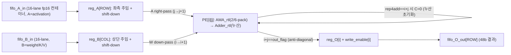
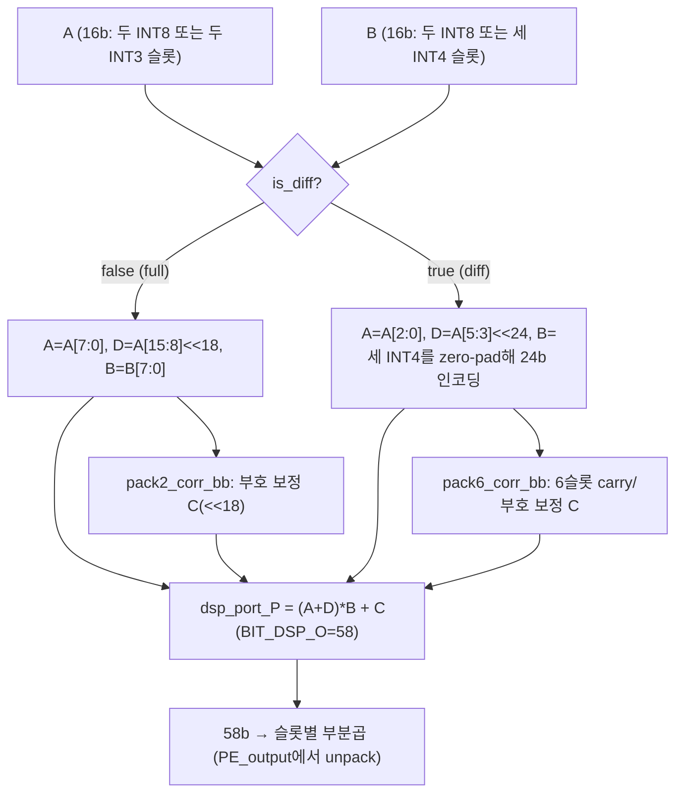
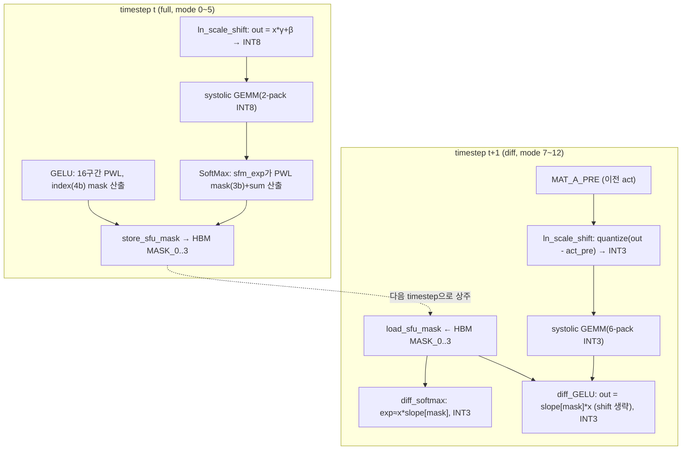
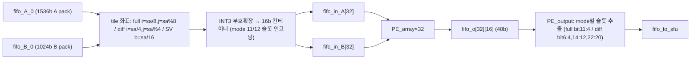
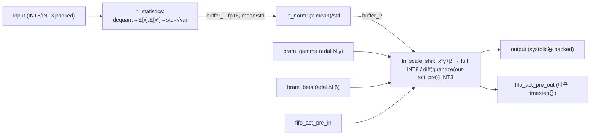
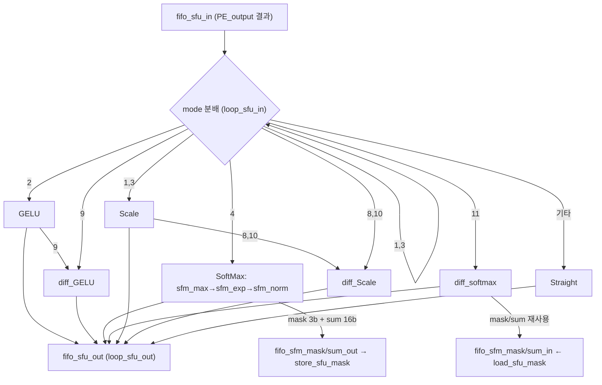
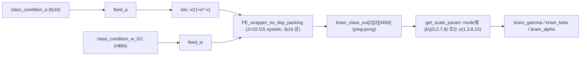
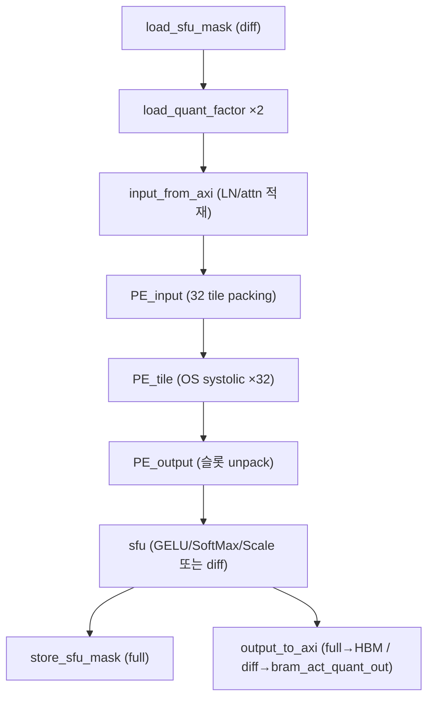

# Diff-DiT 모듈 통합 가이드 (H-HLS)

> 1차 요약(맥락): [`../Diff-DiT.md`](../Diff-DiT.md)
> 소스 루트: `REF/Transformer-Accel/Diff-DiT`. 구현 전체가 **Vitis HLS C++** (단일 HBM 커널 `TOP`). RTL 자체 소스는 없으나 DSP MAC/가산기에 한해 `AMA_rtl.cpp`·`Adder_rtl.cpp`가 **RTL black-box 대체용 C 모델**로 분리되어 있음(파일명 `_rtl`, `_bb` 접미사).
> 표기 규약: 라인으로 직접 확인한 사실은 단정, 코드 정황 기반은 "추정", 코드/문서에 없으면 "확인 불가".
> 제외물(이름만): `.git/`(git 메타), `assets/challenges_contributions.jpg`·`assets/speedup.jpg`(논문 figure), `LICENSE`. 빌드 스크립트(.tcl/.cfg/.sh/.py)·합성 산출물·.dat 데이터·온보드 host 코드는 **저장소에 부재**(Glob `**/*.{tcl,py,hpp}` → "No files found"; test.cpp:373-375가 외부 `.dat` 의존).

---

## 0. 문서 머리말

### 0.1 대표 케이스 선정 (대표 GEMM 타일 + 차분 mode 1개)

Diff-DiT는 **단일 HLS 커널 `TOP`** 이 13개 `mode`(0~12)를 시분할로 실행하여 DiT 블록 전체를 처리한다(README.md:43-58, `ap_uint<4> mode`가 거의 모든 함수에 전파). 따라서 대표 케이스도 **두 축으로 한 쌍**을 잡는다.

- **대표 GEMM (일반/full 경로)**: **mode 0 = HC1 + LN + Proj0 (QKV projection)**. tokens 512(`IMG_SHAPE_3_0*IMG_SHAPE_3_1 = 2*256`) × in 1152(`QKV_WEIGHT_SHAPE_2_0`) → out 3456(`QKV_WEIGHT_SHAPE_2_1 = 1152*3`) (config.h:120-126). LayerNorm(adaLN) → INT8 양자화 → 32-tile OS systolic GEMM → 출력 INT8의 표준 full 데이터패스 전 구간을 한 번에 통과하는 단위(TOP.cpp:1882-1885 mode 0~5의 `i=sa/8, j=sa%8` 4×8 tile 매핑).
- **대표 차분 mode (diff 경로)**: **mode 9 = HC0 + LN + Diff-Proj2 + Diff-GELU (MLP fc1)**. tokens 512 × in 1152 → out 4608(`MLP1_WEIGHT_SHAPE_2_1 = 1152*4`) (config.h:131-132). LayerNorm 직후 출력의 **timestep 간 차분(delta)만 INT3로 양자화**(TOP.cpp:457-461)하고, GELU는 이전 timestep이 저장한 PWL 구간 mask를 **재로드해 선형근사**(diff_GELU, TOP.cpp:855-891 + load_sfu_mask mode 9, TOP.cpp:725-731). full↔diff 두 경로가 동일 PE/DSP/SFU 위에서 `is_diff`로 전환되는 핵심을 한 mode가 모두 보여준다(TOP.cpp:1474).

선정 근거: (1) mode 0과 mode 9가 **동일한 32-tile OS systolic + AMA_rtl DSP**(TOP.cpp:1972, 1475)를 시분할 공유하므로 full(INT8 2-pack) ↔ diff(INT3 6-pack)를 한 엔진 위에서 대조 가능, (2) mode 9가 차분-양자화(LN), DSP 6-packing, GELU mask 재사용이라는 Diff-DiT의 3대 절감 트릭을 한 패스에 모두 포함.

### 0.2 수치 표기 규약
- **MAC lanes**: 한 사이클(II=1) 동시 곱셈 수 = (PE 수) × (DSP packing 배수). 본 설계 PE 코어 = `SIZE_SA_PE=16` × `SIZE_SA_PE=16` = 256 PE/tile, `NUM_SA_TILE=32` tile(`SA_TILE_ROW*SA_TILE_COL = 4*8`) → **8192 PE**(config.h:25-28). 각 PE는 `AMA_rtl` DSP 1개. full 경로 2-pack → **16,384 MAC/cyc**, diff 경로 6-pack → **49,152 MAC/cyc**(목표 II=1; 합성 II는 리포트 부재로 확인 불가).
- **scalar MACs**: 레이어 GEMM의 (tokens) × (out_dim) × (in_dim). full/diff·attention·MLP 구분 표기.
- **loop trips / cycle**: systolic feed/drain은 `rep_count = NumLines + ROW + COL - 2`(TOP.cpp:1401), 타일 루프는 `matO_h × matO_w × NWnum`(TOP.cpp:1874-1875).
- **memory size (payload bit)**: 온칩 버퍼 깊이×폭(bit). 주요 버퍼 = `bram_act_quant`(차분 activation), quant factor BRAM, FIFO depth, `bram_class_out`(condition).

### 0.3 운영 경로 (소스 ↔ case/top ↔ 합성)
```
[학습/export]   PyTorch DiT(diffusion transformer, 추정 DiT-XL/2: D=1152·heads=16) → 레이어별 양자화 가중치(.dat)
        │       (저장소 미포함; test.cpp가 activation_256bit_1M.dat / weight_256bit_1M.dat / act_diff_768bit_1M.dat 기대, test.cpp:373-375)
[양자화]        오프라인 affine 양자화: full=INT8(BIT_ACT_FP=8), diff=INT3(BIT_ACT_DIFF=3), weight=INT4(BIT_WEIGHT=4) (config.h:20-22)
        │       scale/zero_point는 HBM QUANT_FACTOR/DEQUANT_FACTOR로 주입(TOP.cpp:1055-1188 load_quant_factor)
[case/csim]     test.cpp main → mode 상수(기본 0) 1개 골라 shape 계산 → HBM 채널 인터리빙 → TOP(...) 1회 호출 → output.dat (test.cpp:77-481)
        │       13 mode는 main의 `ap_uint<4> mode=0` 상수를 수동 변경하며 각각 검증(test.cpp:78); 통합 시퀀서 부재(추정)
[HLS 합성]      set_top TOP 의도(TOP.h:4 / TOP.cpp:2375); tcl 부재로 part/clock 확인 불가
        │       HW 인터페이스: 34개 m_axi HBM bundle + DATAFLOW (TOP.cpp:2422-2462)
[보드]          XRT/OpenCL host·비트스트림 저장소 미포함 → 온보드 재현 불가 (확인: Glob)
```

### 0.4 타깃 / 데이터타입 (INT8/INT3 차분) / 13-mode 정책
- **타깃**: HBM 기반 FPGA(34개 `bundle=HBM_PORT_*` m_axi, `offset=direct`, `max_read/write_burst_length=128`, `depth=1048576`, TOP.cpp:2422-2460). `AP_INT_MAX_W 4096`(config.h:4)로 초광폭 비트벡터 사용. **구체 part/clock/주파수는 tcl·리포트 부재로 확인 불가**(추정: AMD/Xilinx Alveo HBM 계열).
- **데이터타입(이중 정밀)**: `BIT_FP=16`(half, 중간연산), `BIT_CLASS=16`(class condition), `BIT_WEIGHT=4`(INT4 weight), `BIT_ACT_FP=8`(full INT8 activation), `BIT_ACT_DIFF=3`(diff INT3 activation) (config.h:16-22). 즉 **weight 4b / full act 8b / diff act 3b / 중간 fp16**.
- **DSP 포트**: `BIT_DSP_A=27`, `BIT_DSP_B=24`, `BIT_DSP_O=58`, 누산 `BIT_O=48`(config.h:44-48) — Xilinx DSP48E2 `(A+D)*B+C`(27×24→48+).
- **13-mode 정책**(README.md:43-58):
  | mode | 단계 | 경로 |
  |---|---|---|
  | 0 | HC1+LN+Proj0(QKV) | full INT8 |
  | 1 | Proj1 | full |
  | 2 | HC0+LN+Proj2(MLP1)+GELU | full |
  | 3 | Proj3(MLP2)+Res | full |
  | 4 | QK+SoftMax | full |
  | 5 | SV | full |
  | 6 | HC0 (condition만) | — (matmul skip, TOP.cpp:2362) |
  | 7 | HC1+LN+Diff-Proj0 | diff INT3 |
  | 8 | Diff-Proj1 | diff |
  | 9 | HC0+LN+Diff-Proj2+Diff-GELU | diff |
  | 10 | Diff-Proj3+Res | diff |
  | 11 | Diff-QK+Diff-SoftMax | diff |
  | 12 | Diff-SV | diff |
  - full=mode 0~5(+6), diff=mode 7~12. `is_diff = (mode>=7 && mode<=12)`로 PE/DSP/가산기 분기(TOP.cpp:1474).
  - mode 6은 `matmul` 진입 시 즉시 skip(`if(mode!=6) matmul_kernel(...)`, TOP.cpp:2362) → condition(HalfCondition)만 수행.

---

## 1. Repo / Layer 개요 + 호출/인스턴스 계층 + 제외 목록

| 레이어 | 경로 | 역할 |
|---|---|---|
| **헤더** | `src/config.h`(183L) | 비트폭·PE 크기·DiT 텐서 shape·packing 폭 매크로(확인) |
| | `src/common.h`(6L) | `ap_int/hls_math/hls_stream` include만(확인) |
| | `src/TOP.h`(52L) | `TOP` 커널 시그니처 선언(확인) |
| | `src/test.h`(3L) | `common.h`+`config.h` 재포함만(확인: test.h:1-2; README의 "test header" 역할은 빈약) |
| **HLS 커널** | `src/TOP.cpp`(2479L) | ★ 전체 가속기 데이터플로우 본체(확인) |
| **DSP RTL C모델** | `src/AMA_rtl.cpp`(59L) | DSP48 `(A+D)*B+C` 2/6-packing MAC + 보정항(확인) |
| | `src/Adder_rtl.cpp`(57L) | 48b 누산기를 6×8b full-adder로 분할(확인) |
| **테스트벤치** | `src/test.cpp`(481L) | 단일 mode csim 하네스: shape 계산·HBM 인터리빙·파일 I/O(확인) |

- 자체 소스 모듈 수: `*.cpp` **4개**(TOP, AMA_rtl, Adder_rtl, test), 헤더 4개. include 순환 없음(`TOP.h`→`config.h`).
- **제외(생성물/vendor)**: `.git/`(pack·hooks·refs), `assets/*.jpg`, `LICENSE`. 빌드/host/데이터 파일은 저장소 자체에 부재(확인: Glob).

### 모듈 인스턴스 계층 (top → leaf)
```
TOP  (HW 최상위, 34 m_axi HBM bundle + #pragma HLS DATAFLOW)            TOP.cpp:2375-2478
├─ HalfCondition  (adaLN-Zero conditioning: γ/β/α 생성, 추정)           TOP.cpp:331-346
│   ├─ get_scale_param  (bram_class_out → β/γ 또는 α 추출)              TOP.cpp:306-328
│   └─ condition_dataflow  (#pragma HLS DATAFLOW)                       TOP.cpp:250-303
│       ├─ feed_a → silu  (SiLU 활성, CLASS_SIMD=2)                     TOP.cpp:79-102
│       ├─ feed_w → PE_wrapper_no_dsp_packing (class OS systolic, fp16) TOP.cpp:105-248
│       └─ store_to_bram → bram_class_out[2][...][...] (ping-pong)      TOP.cpp:293-302
└─ matmul → (mode!=6) matmul_kernel  (#pragma HLS DATAFLOW)             TOP.cpp:2314-2372 / 2216-2311
    ├─ load_sfu_mask  (mode 9: gelu mask / mode 11: sfm sum+mask 재로드) TOP.cpp:714-747
    ├─ load_quant_factor ×2 (QUANT_FACTOR / DEQUANT_FACTOR)            TOP.cpp:1055-1188
    ├─ input_from_axi  (mode별 A/B 적재 분기)                          TOP.cpp:1805-1859
    │   ├─ load_activation → input_sfu → layernorm_dataflow(adaLN)     TOP.cpp:1511-1626 / 1029-1052 / 470-512
    │   │   └─ ln_statistics → ln_norm → ln_scale_shift(차분양자화)    TOP.cpp:349-392 / 395-421 / 424-467
    │   ├─ load_weight  (INT4 weight 언패킹, full 2슬롯/diff 3슬롯)     TOP.cpp:1628-1661
    │   └─ load_attn_q/k/s/v  (attention 입력)                         TOP.cpp:1664-1802
    ├─ PE_input   (32 tile 좌표 매핑 + INT3 부호확장 packing)          TOP.cpp:1862-1957
    ├─ PE_tile  →  PE_array<16,16> × 32 (OS MAC, UNROLL)               TOP.cpp:1960-1981 / 1358-1508
    │   ├─ AMA_rtl  (DSP48 2/6-pack MAC + pack2/6_corr_bb 보정)        AMA_rtl.cpp:36-59
    │   └─ Adder_rtl  (6×8b full-adder 분할 누산)                      Adder_rtl.cpp:17-57
    ├─ PE_output  (48b 결과 → mode별 슬롯 unpack)                      TOP.cpp:1984-2054
    ├─ sfu  (#pragma HLS DATAFLOW; mode별 비선형 분기)                 TOP.cpp:2057-2166
    │   ├─ GELU / diff_GELU                                            TOP.cpp:802-852 / 855-891
    │   ├─ SoftMax(sfm_max→sfm_exp→sfm_norm) / diff_softmax            TOP.cpp:515-660 / 663-711
    │   ├─ Scale / diff_Scale  (residual + adaLN gate α)               TOP.cpp:894-942 / 945-990
    │   └─ Straight / Skip_LN  (passthrough)                           TOP.cpp:1011-1026 / 993-1008
    ├─ store_sfu_mask  (mode 2: gelu mask / mode 4: sfm sum+mask 저장) TOP.cpp:750-799
    └─ output_to_axi  (full→HBM out / diff→bram_act_quant_out)         TOP.cpp:2169-2213
```
(인스턴스화: `PE_tile`이 `PE_array<16,16>`를 `NUM_SA_TILE=32`개 `#pragma HLS UNROLL`로 병렬 생성, TOP.cpp:1970-1980.)

---

## 2. 메인 OS Systolic GEMM — `PE_array<ROW,COL>` / `PE_tile` (가장 재사용도 높음)

### 2.1 역할 + 상위/하위
Diff-DiT의 모든 행렬곱(QKV/Proj/MLP1/MLP2/QKᵀ/S·V, full·diff 양쪽)을 **템플릿 OS systolic array**가 수행한다. `PE_tile`이 `PE_array<SIZE_SA_PE=16, SIZE_SA_PE=16>`를 32 tile(`NUM_SA_TILE`)로 UNROLL해 한 데이터패스에 배치(TOP.cpp:1970-1980). 같은 하드웨어가 `mode`(=`is_diff`)로 INT8(full)·INT3(diff)를 전환(TOP.cpp:1474).
상위: `matmul_kernel`(DATAFLOW, TOP.cpp:2305). 하위: `AMA_rtl`(곱, TOP.cpp:1475) + `Adder_rtl`(누산, TOP.cpp:1476).

### 2.2 데이터플로우


### 2.3 function call stack
`matmul_kernel` → `PE_tile`(TOP.cpp:1960) → `for i in 0..31 #pragma HLS UNROLL` `PE_array<16,16>`(TOP.cpp:1972) → 내부 `loop_main`(II=1, TOP.cpp:1405) → 각 PE에서 `AMA_rtl(PE_port_A, PE_port_B, is_diff)`(TOP.cpp:1475) → `Adder_rtl(ama_rtl_tmp, PE_port_C, is_diff)`(TOP.cpp:1476).

### 2.4 대표 코드 위치
`src/TOP.cpp` L1405-1507(systolic main loop), L1458-1492(PE 곱·누산·OS 전달·결과추출), L1401(rep_count fill/drain), L1970-1980(32-tile UNROLL).

### 2.5 대표 코드 블록

(1) **OS systolic 한 사이클 — 곱(AMA_rtl)·누산(Adder_rtl)·A우전달·W하전달·반대각 추출** (TOP.cpp:1463~1490)
```cpp
ap_int<BIT_DSP_A> PE_port_A = PE_A_reg[i][j];
ap_int<BIT_DSP_B> PE_port_B = PE_B_reg[i][j];
ap_int<BIT_DSP_O> PE_port_C;
if (rep4add == i + j) PE_port_C = 0;          // 새 출력 타일 시작 → 누산 초기화
else                  PE_port_C = PE_P_reg[i][j];
bool is_diff = (mode==7||...||mode==12) ? true : false;
ap_int<58> ama_rtl_tmp = AMA_rtl(PE_port_A, PE_port_B, is_diff);   // 2/6-pack DSP 곱
PE_P_reg[i][j] = Adder_rtl(ama_rtl_tmp, PE_port_C, is_diff);       // 분할 누산
if (j < NUM_PE_COL - 1) PE_A_reg[i][j + 1] = PE_A_reg[i][j];       // OS: A 우측 전달
if (i < NUM_PE_ROW - 1) PE_B_reg[i + 1][j] = PE_B_reg[i][j];       // OS: W 하향 전달
if (i + j == out_flag) { reg_O[i] = PE_P_reg[i][j]; write_enable[i] = 1; }  // 반대각 결과
```
→ 전형적 output-stationary: 부분합 `PE_P_reg`가 PE에 상주, A는 행 우측·W(B)는 열 하향으로 흐른다. `out_flag`는 `rep4out==NWnum-1`에서 0으로 리셋되며 매 사이클 증가(L1413-1418)해 anti-diagonal(`i+j`)을 따라 결과를 차례로 뽑는다. 16×16 PE이므로 한 tile은 256 곱셈/cyc.

(2) **systolic fill/drain 고려한 반복 횟수** (TOP.cpp:1401, 1425-1432)
```cpp
unsigned rep_count = (NumLines == 0) ? 0 : (unsigned)NumLines + NUM_PE_COL + NUM_PE_ROW - 2;
...
if (rep < NumLines) { reg_A[0] = fifo_A_in.read(); reg_B[0] = fifo_B_in.read(); }
else                { reg_A[0] = 0;                 reg_B[0] = 0; }   // drain 구간 0 주입
```
→ `NumLines`(=축약 차원 길이) 만큼 데이터를 흘리고, 추가 `ROW+COL-2 = 30` 사이클은 파이프 drain. `assert(NWnum > NUM_PE_COL + NUM_PE_ROW - 2)`(TOP.cpp:1369)로 본 SA 설계 제약(출력그룹 길이 > 30)을 명시.

(3) **32-tile 병렬 인스턴스화** (TOP.cpp:1970~1980)
```cpp
for (int i=0; i<NUM_SA_TILE; i++) {        // 32
    #pragma HLS UNROLL
    PE_array<SIZE_SA_PE, SIZE_SA_PE>(       // <16,16>
        fifo_a[i], fifo_b[i], fifo_o[i], NWnum, NumLines, mode);
}
```
→ 32개 독립 16×16 OS array. tile마다 전용 입력/출력 FIFO(`fifo_in_A/B[32]`, `fifo_o[32][16]`, TOP.cpp:2276-2278).

### 2.6 마이크로아키텍처 + 정량
- **Stage 분해(systolic 내부)**: ① reg_A[0]/reg_B[0] 주입 + reg shift(L1434-1456) → ② PE 곱·누산·OS 전달(L1458-1492) → ③ `write_enable[i]` 시 `fifo_O_out[i]` write(L1499-1506). 전체 `loop_main`은 `#pragma HLS PIPELINE II=1`(L1407).
- **MAC lanes**: tile당 16×16=256 PE × 32 tile = **8192 PE**. full(`is_diff=0`) → AMA_rtl가 1 DSP에 INT8×INT8 **2-pack**(MAC ×2) → 16,384 MAC/cyc. diff(`is_diff=1`) → INT3×INT4 **6-pack**(MAC ×6) → 49,152 MAC/cyc(목표 II=1).
- **scalar MACs(대표 케이스)**:
  - **mode 0 QKV**(tokens 512 × out 3456 × in 1152) ≈ **2.04 G MAC**.
  - **mode 9 MLP1**(512 × 4608 × 1152) ≈ **2.72 G MAC**.
  - attention mode 4 QKᵀ(heads 16 × seq 256 × seq 256 × head_dim 72; Q_SHAPE 16·256·72) ≈ 16×256×256×72 ≈ **0.30 G/batch**.
- **메모리(payload bit)**: PE 부분합 `PE_P_reg[16][16]` × `BIT_DSP_O=58b` = 16×16×58 ≈ **14.8 Kb/tile**, 32 tile ≈ 475 Kb(레지스터). 입력 FIFO depth=`SIZE_SA_PE=16`(TOP.cpp:2281-2283).
- **병목**: feed/drain 오버헤드 `ROW+COL-2 = 30` 사이클은 `NumLines`(긴 GEMM)에 amortize되나, attention처럼 짧은 K 차원에서는 상대 비중↑. systolic은 II=1이지만 **앞단 `input_from_axi`/`PE_input`이 mode별 HBM 채널 게더·INT3 packing을 직렬 수행**(TOP.cpp:1874-1956)하여 실효 throughput을 제약(추정).

---

## 3. DSP 2/6-Packing MAC — `AMA_rtl.cpp` / `pack2_corr`·`pack6_corr` (Diff-DiT 정체성 ①)

### 3.1 역할 + 상위/하위
면적·전력 효율의 핵심. Xilinx DSP48E2의 `(A+D)*B+C`(pre-adder + MAC) 한 슬라이스에 **여러 저비트 곱셈을 비트-슬라이싱으로 packing**한다. full(INT8×INT8)은 한 DSP에 **2 MAC**, diff(INT3×INT4)는 **6 MAC**. 상위: 각 PE(`PE_array`, TOP.cpp:1475). 하위: `DSP_Wrapper`(곱) + `pack2_corr_bb`/`pack6_corr_bb`(부호 보정항).

### 3.2 데이터플로우


### 3.3 function call stack
`PE_array` → `AMA_rtl(A, B, is_diff)`(AMA_rtl.cpp:36) → 분기 후 `pack2_corr_bb`(L4) 또는 `pack6_corr_bb`(L10) → `(dsp_port_A + dsp_port_D) * dsp_port_B + dsp_port_C`(L56). (동일 로직의 합성-인라인 버전 `AMA_Wrapper`/`pack2_corr`/`pack6_corr`/`DSP_Wrapper`가 TOP.cpp:1191-1282에 별도 존재; `AMA_rtl`은 RTL black-box 대체용 C 모델.)

### 3.4 대표 코드 위치
`src/AMA_rtl.cpp` L41-54(full/diff 포트 인코딩), L4-7(pack2 보정), L10-33(pack6 보정), L56(DSP 곱). 동치 인라인: `src/TOP.cpp` L1203-1234(pack6/pack2_corr), L1237-1282(AMA_Wrapper).

### 3.5 대표 코드 블록

(1) **full 2-pack: 상위 INT8을 18비트 위로 올려 한 곱에 2 MAC** (AMA_rtl.cpp:41~45)
```cpp
if (!is_diff) {
    dsp_port_A = (ap_int<8>)(A.range(8-1, 0));            // 첫 INT8 act
    dsp_port_B = (ap_int<8>)(B.range(8-1, 0));            // INT8 weight (공유)
    dsp_port_C = pack2_corr_bb(A, B);                     // 부호 보정 (<<18)
    dsp_port_D = ((ap_int<27>)((ap_int<8>)(A.range(2*8-1, 8)))) << 18;  // 둘째 INT8을 18b 위로
}
```
→ `(A0 + A1<<18) * B = A0*B + (A1*B)<<18` → 한 27×24 곱에서 하위/상위 18비트에 두 부분곱 분리. `pack2_corr_bb`(L4-7)는 두 곱의 부호 비트 XOR을 `<<18` 위치에 보정 주입(서로 다른 부호일 때 carry 누설 방지).

(2) **diff 6-pack: INT3 act 2슬롯 × INT4 weight 3슬롯 = 6 부분곱** (AMA_rtl.cpp:47~53)
```cpp
else {
    dsp_port_A = (ap_int<3>)(A.range(3-1,0));             // 첫 INT3 delta-act
    dsp_port_B = (ap_int<4*5>)(B.range(4*3-1, 4*2), ap_uint<3+1>(0),   // INT4 w2 + zero-pad
                               B.range(4*2-1, 4*1), ap_uint<3+1>(0),   // INT4 w1 + zero-pad
                               B.range(4*1-1, 4*0));                    // INT4 w0
    dsp_port_C = pack6_corr_bb(A, B);                     // 6슬롯 carry/부호 보정
    dsp_port_D = ((ap_int<27>)((ap_int<3>)(A.range(3*2-1,3)))) << 24;  // 둘째 INT3을 24b 위로
}
```
→ B는 세 INT4 weight를 각 (4+4)비트 간격(`4*5=20`비트)으로 인코딩, A는 두 INT3 act를 `(A0 + A1<<24)`로 인코딩 → `(A0+A1<<24)*(w0|w1<<8|w2<<16)`이 **2×3=6개 INT3×INT4 부분곱**을 58비트 안에 독립 배치. `pack6_corr_bb`(L10-33)는 6슬롯 각각의 carry 전파/부호확장을 비트필드로 보정(`corr_carry_*`, `corr_unsigned_*`).

(3) **부호 보정항 — 슬롯 경계 carry 누설 차단** (AMA_rtl.cpp:11~16)
```cpp
ap_uint<1> corr_carry_5 = (A.range(3*2-1,3*1)==0 || B.range(4*2-1,4*1)==0) ? 0 : A[3*2-1] & ~B[4*2-1];
... // 슬롯 1~4 보정
ap_uint<1> corr_carry_0 = 0;
```
→ 두 인접 부분곱이 같은 58비트 워드를 공유하므로, 음수 곱의 부호확장이 윗슬롯으로 새는 것을 슬롯별 보정 carry로 상쇄. 이 보정이 packing의 정확성을 보장(없으면 인접 슬롯 오염).

### 3.6 마이크로아키텍처 + 정량
- **Stage 분해**: 포트 인코딩(슬라이싱+shift) → `pack*_corr` 보정 → DSP 곱 1회. `AMA_Wrapper`는 `#pragma HLS latency min=4 max=4`(TOP.cpp:1239)로 DSP 파이프 4단 고정.
- **packing 배수**: full **2×**(2 MAC/DSP), diff **6×**(6 MAC/DSP). diff는 full 대비 **MAC 밀도 3배**.
- **비트 절감**: activation INT8→INT3 = 8/3 ≈ **2.67× 압축**; weight 공통 INT4. diff 경로 종합 효율 = 6-pack(3×) × act 비트(2.67×) → 동일 DSP/대역폭으로 차분 GEMM을 크게 가속(논문 speedup의 주 원천, 추정).
- **메모리**: 상태 없음(조합 곱+레지스터 4단). DSP48 1개/PE → 8192 DSP(추정; 합성 리포트 부재로 실제 DSP 수 확인 불가).
- **병목**: packing은 **정적 비트레이아웃**이라 mode별 슬롯 수가 고정(full 2 / diff 6) → PE_input/PE_output의 packing·unpacking 오버헤드가 따라붙음(§5). 정확도: INT3 클램프 [-4,3](TOP.cpp:27-35) 비대칭 포화 손실은 코드만으로 정량 불가(확인 불가).

---

## 4. 차분 경로 13-mode 컨트롤 + 비선형 mask 재사용 (Diff-DiT 정체성 ②)

### 4.1 역할 + 상위/하위
diffusion timestep 간 activation 유사성을 이용: 이전 timestep(`MAT_A_PRE_*`)을 상주시키고 **차분 delta만 INT3로 연산**, SoftMax/GELU의 PWL 구간 정보(mask)·정규화 분모(sum)를 full 패스에서 저장→diff 패스에서 재로드해 **비선형 재계산을 회피**. 상위: `matmul_kernel`(load_sfu_mask/store_sfu_mask, TOP.cpp:2294,2308) + `ln_scale_shift`(차분 양자화). 하위: SoftMax/GELU/Scale의 diff 변형들.

### 4.2 데이터플로우 (timestep 차분 루프)


### 4.3 function call stack
- **차분-양자화**: `load_activation`→`input_sfu`→`layernorm_dataflow`→`ln_scale_shift`(TOP.cpp:424); mode 7~12에서 `fifo_act_pre_in.read()` 후 `quantize_fp16_to_int3(out_val - act_pre_val,...)`(L443-460).
- **mask 저장**: `matmul_kernel`→`store_sfu_mask`(TOP.cpp:750); mode 2→gelu mask, mode 4→sfm sum+mask를 HBM 4채널에 비트슬라이싱 기록.
- **mask 재로드**: `matmul_kernel`→`load_sfu_mask`(TOP.cpp:714); mode 9→gelu mask, mode 11→sfm sum+mask를 FIFO로.
- **diff 비선형**: `sfu`→`diff_GELU`(TOP.cpp:855)/`diff_softmax`(TOP.cpp:663).

### 4.4 대표 코드 위치
`src/TOP.cpp` L457-461(adaLN 융합 차분양자화), L750-799(store_sfu_mask), L714-747(load_sfu_mask), L692-704(diff_softmax 선형근사), L881-886(diff_GELU 선형근사), L1574-1585(ACT_PRE 적재).

### 4.5 대표 코드 블록

(1) **adaLN과 차분-양자화 융합 — 같은 stage에서 γ·β 적용 후 delta만 INT3로** (TOP.cpp:450~464)
```cpp
half out_val = val * scale_val + shift_val;          // adaLN: x*γ + β
if (mode==0||mode==1||mode==2||mode==3||mode==4||mode==5) {
    ap_int<BIT_ACT_FP> out_val_int8 = quantize_fp16_to_int8(out_val, quant_scale, quant_shift);   // full=INT8
    out_packed.range(BIT_ACT_FP*(p+1)-1, BIT_ACT_FP*p) = out_val_int8.range(BIT_ACT_FP-1, 0);
}
else {
    half act_pre_val = apuint16_to_half(act_pre_packed.range(BIT_FP*(p+1)-1, BIT_FP*p));
    ap_int<BIT_ACT_DIFF> out_val_int3 = quantize_fp16_to_int3(out_val - act_pre_val, quant_scale, quant_shift);  // diff=INT3 delta
    out_packed.range(BIT_ACT_DIFF*(p+1)-1, BIT_ACT_DIFF*p) = out_val_int3.range(BIT_ACT_DIFF-1, 0);
}
fifo_act_pre_out.write(out_packed);  // 갱신된 act를 다음 timestep ACT_PRE로 출력
```
→ LayerNorm scale/shift와 양자화(또는 차분-양자화)가 한 루프에서 결합되어 중간 fp16 트래픽 절감. 동시에 `fifo_act_pre_out`로 현재 act를 내보내 다음 timestep의 차분 기준으로 갱신(`load_activation` L1619-1622에서 ACT_PRE HBM에 기록).

(2) **diff_softmax — exp를 직접 계산하지 않고 mask로 선형근사** (TOP.cpp:690~704)
```cpp
ap_uint<3> mask = tmp_mask.range((p+1)*3-1, p*3);              // 이전 timestep이 저장한 구간 index
ap_int<BIT_ACT_DIFF> delta_x = tmp.range((p+1)*BIT_ACT_DIFF-1, p*BIT_ACT_DIFF);
half slope = sfm_slope[mask];                                  // 8-구간 PWL slope (TOP.cpp:7)
half x = dequantize_int3_to_fp16(delta_x, dequant_scale, 0.0);
half exp = x * slope;                                          // exp ≈ slope·Δx (선형근사)
half sum = apuint16_to_half(tmp_sum.range((p+1)*BIT_FP-1, p*BIT_FP));  // 저장된 분모 재사용
ap_int<BIT_ACT_DIFF> out = (sum==0) ? exp/(sum+0.001) : exp/sum;
ap_int<BIT_ACT_DIFF> out_int3 = quantize_fp16_to_int3(out, quant_scale, 0.0);
```
→ full SoftMax(`sfm_exp`, TOP.cpp:577-592)가 `mask = tmp+7`(8구간)과 sum을 산출·저장하면, diff_softmax는 `hls::expf` 재호출 없이 `sfm_slope[8]`(상수 LUT)와 저장 sum으로 1차 근사. exp 계산 회피 = 연산 절감.

(3) **diff_GELU — 차분의 선형성으로 shift 상수항 소거** (TOP.cpp:881~886)
```cpp
ap_uint<4> index = tmp_mask.range((p+1)*4-1, p*4);    // 이전 timestep gelu 구간 index(16구간)
half slope = gelu_slope[index];                       // TOP.cpp:8
half out = slope * x;                                 // diff: shift 생략 (상수항은 차분에서 소거)
```
→ full GELU(TOP.cpp:837-842)는 `out = slope*x + shift`(16구간 PWL, `index = 2.5*x+8`). 차분은 `Δgelu ≈ slope·Δx`로 **shift항 불필요**(인접 timestep 동일 구간 가정) → 정확한 단순화.

(4) **mask 저장/재로드 — HBM 4채널 비트슬라이싱** (TOP.cpp:761~772 / 725~731)
```cpp
// store (mode 2, full GELU): gelu mask를 MASK_0..3에 i&1로 분산
if (i & 1) { MASK_3[i>>1] = tmp_mask.range(511,256); MASK_2[i>>1] = tmp_mask.range(255,0); }
else       { MASK_1[i>>1] = ...;                     MASK_0[i>>1] = ...; }
// load (mode 9, diff GELU): MASK_0..3 → fifo_gelu_mask
ap_int<HBM_DATA_PACK_A_DIFF*4> tmp_mask = (MASK_3[i].range(255,0), MASK_2[i].range(255,0), MASK_1[i].range(255,0), MASK_0[i].range(255,0));
fifo_gelu_mask.write(tmp_mask);
```

### 4.6 마이크로아키텍처 + 정량
- **Stage 분해(차분 컨트롤)**: full 패스 = LN(INT8 양자화) → GEMM(2-pack) → SoftMax/GELU(mask+sum 산출) → store_sfu_mask(HBM). diff 패스 = load_sfu_mask(HBM) → LN(차분 INT3 양자화, ACT_PRE 소비) → GEMM(6-pack) → diff_softmax/diff_GELU(mask 재사용).
- **재사용 데이터 폭**: softmax mask = 3b/원소(`HBM_DATA_PACK_A_DIFF*3 = 768b` FIFO), sum = 16b/원소(`*16=4096b`), gelu mask = 4b/원소(`*4=1024b`)(TOP.cpp:555-556, 721).
- **절감율(정적)**:
  - activation 비트: full INT8 → diff INT3 = **8/3 ≈ 2.67× HBM 트래픽 압축**(LN 출력·GEMM 입력).
  - MAC 밀도: 2-pack → 6-pack = **3×**(§3).
  - 비선형: diff_softmax는 `hls::expf` 호출 0회(full 대비 row당 256회 회피, S_SHAPE_4_3=256), diff_GELU는 PWL index 재계산·shift 가산 회피.
- **메모리**: `bram_act_quant_in/out` = `4*512*1152/256 = 9216` 워드 × `BIT_DIFF_A_PACK_MAX=768b` ≈ **7.08 Mb**(차분 activation 상주, TOP.cpp:2456-2457). `bram_class_out[2][2][3456]` × 16b ≈ 221 Kb(condition ping-pong).
- **병목**: 차분의 대가로 **mask/sum을 매 timestep HBM에 왕복**(store→load) → 추가 메모리 대역폭(TOP.cpp:750-799 ↔ 714-747). 또한 ACT_PRE 전용 8 HBM 포트가 상시 점유(TOP.cpp:2430-2437). mode 수동 시퀀싱(test.cpp:78)이라 자동 timestep 루프는 코드 부재(추정).

---

## 5. 데이터 재배열 — `PE_input` / `PE_output` (packing ↔ unpacking)

### 5.1 역할 + 상위/하위
HBM에서 온 packed A/B를 **32 tile 좌표(b,i,j)로 분배**하고 INT3는 16비트 컨테이너로 부호확장 packing(PE_input); systolic 48비트 결과를 mode별 슬롯 수(full 1 / diff-3슬롯 / diff-QK 2슬롯)로 unpacking(PE_output). 상위: `matmul_kernel`(TOP.cpp:2304,2306). 하위: 없음(스트림 변환).

### 5.2 데이터플로우


### 5.3 function call stack
`matmul_kernel` → `PE_input`(TOP.cpp:1862, `total_rep × NWnum × 32 tile UNROLL`) → tile별 슬롯 슬라이싱; `PE_output`(TOP.cpp:1984, `total_rep × num_sa_tile_col × 16 × num_sa_tile_row`) → mode별 `fifo_to_sfu.write`.

### 5.4 대표 코드 위치
`src/TOP.cpp` L1882-1900(mode별 tile 좌표 매핑), L1930-1947(INT3 부호확장 슬롯 인코딩), L2008-2050(48b 결과 mode별 슬롯 unpack).

### 5.5 대표 코드 블록

(1) **mode별 32-tile 좌표 매핑 — full 4×8 / diff 8×4 / SV 분할** (TOP.cpp:1882~1896)
```cpp
if (mode==0||...||mode==5) { b=0; i=sa/8; j=sa%8; }          // full: 4행×8열 tile
else if (mode==7||...||mode==11) { b=0; i=sa/4; j=sa%4; }    // diff: 8행×4열 tile
else if (mode==12) { b=sa/16; i=(sa&0xf)/2; j=(sa&0xf)%2; }  // diff-SV: 2배치×8×2
```
→ 같은 32 tile을 mode별로 다른 행/열 형상으로 재해석(full은 출력열 넓게, diff는 출력행 넓게). `PE_output`도 동일하게 `num_sa_tile_row/col`을 mode로 바꿈(TOP.cpp:1992-1993).

(2) **diff 결과 unpack — 48b에서 3슬롯 INT3×2 추출** (TOP.cpp:2013~2022)
```cpp
else if (mode==7||mode==8||mode==9||mode==10||mode==12) {
    out_0.range(2,0)=tmp_out.range(6,4);   out_0.range(5,3)=tmp_out.range(30,28);  // 슬롯0 (act0,act1)
    out_1.range(2,0)=tmp_out.range(14,12); out_1.range(5,3)=tmp_out.range(38,36);  // 슬롯1
    out_2.range(2,0)=tmp_out.range(22,20); out_2.range(5,3)=tmp_out.range(46,44);  // 슬롯2
    ...3개 fifo_to_sfu.write(tmp_0/1/2);
}
```
→ 6-pack 곱 결과(58b 중 48b 누산)에서 weight 3슬롯 × act 2개를 분리. diff-QK(mode 11)는 2슬롯(L2024-2031), full은 1슬롯(`bit11:4`, `bit35:28`, L2033-2035).

### 5.6 마이크로아키텍처 + 정량
- **Stage 분해**: PE_input = (read A/B 1워드) → (32 tile UNROLL 슬라이싱) → (16 lane INT3 부호확장) → 32×2 FIFO write, II=1(TOP.cpp:1876). PE_output = (32 tile read) → (mode별 슬롯 추출) → 1~3 FIFO write, II=1(TOP.cpp:1998).
- **loop trips**: PE_input = `total_rep(=matO_h*matO_w 또는 /2) × NWnum`(TOP.cpp:1873-1875). PE_output = `total_rep × num_sa_tile_col × 16`(TOP.cpp:1995-1997).
- **메모리**: `fifo_in_A/B[32]` depth=16(2283), `fifo_o[32][16]` depth=16(2281).
- **병목**: 32-tile 슬라이싱·INT3 부호확장이 매 입력 워드에 UNROLL되어 LUT 소모(추정); packing 형식 고정이라 mode 추가 시 분기 증가. systolic II=1과 정합되나 앞단 HBM 게더가 율속(§2.6).

---

## 6. LayerNorm 데이터플로우 (adaLN) — `layernorm_dataflow` 3-stage

### 6.1 역할 + 상위/하위
DiT의 정규화. dequant → 평균/분산 → 정규화 → adaLN scale/shift → (full INT8 / diff INT3) 재양자화를 3-stage DATAFLOW로 분리. 상위: `input_sfu`(mode 0/2/7/9, TOP.cpp:1046). 하위: `ln_statistics`/`ln_norm`/`ln_scale_shift`.

### 6.2 데이터플로우


### 6.3 function call stack
`input_sfu`(TOP.cpp:1029) → `layernorm_dataflow`(TOP.cpp:470, `for i,j #pragma HLS dataflow`) → `ln_statistics`(L507) → `ln_norm`(L508) → `ln_scale_shift`(L509). buffer_1/2는 depth=`IMG_SHAPE_3_2=1152` BRAM FIFO(L492-495).

### 6.4 대표 코드 위치
`src/TOP.cpp` L361-388(1-pass 통계+√var), L404-419(정규화+std=0 보호), L450-464(adaLN+차분양자화, §4.5와 공유), L497(pack_size mode 분기).

### 6.5 대표 코드 블록

(1) **1-pass 평균·분산 + half_sqrt** (TOP.cpp:372~387)
```cpp
sum_vals[p]  += val_fp16;
sum2_vals[p] += val_fp16 * val_fp16;                  // E[x²] 동시 누적
...
half mean_vals = sum_vals[p] / IMG_SHAPE_3_2;         // /1152
half var_vals  = sum2_vals[p] / IMG_SHAPE_3_2 - mean_vals*mean_vals;
half std_vals  = half_sqrt(var_vals);
// half std_vals = var_vals / 2;  // for debug   (디버그 흔적)
```
→ 채널(`IMG_SHAPE_3_2=1152`) 방향 1패스로 `E[x²]-E[x]²`. `sum2_vals`만 `float` 정밀(L360)으로 분산 누적 안정화.

(2) **pack_size mode 분기 — full 128 / diff 256** (TOP.cpp:497)
```cpp
int pack_size = (mode==0||...||mode==5) ? HBM_DATA_PACK_A : HBM_DATA_PACK_A_DIFF;  // 128 vs 256
```
→ full은 한 워드에 INT8 128개, diff는 INT3 256개를 병렬 처리(`HBM_DATA_PACK_A=128`, `HBM_DATA_PACK_A_DIFF=256`, config.h:35,37).

### 6.6 마이크로아키텍처 + 정량
- **Stage 분해**: 3-stage dataflow per (i,j) 토큰블록(`#pragma HLS dataflow`, TOP.cpp:501). 각 stage 내부 채널 루프 1152, II=1(L362,405,439).
- **loop trips**: `matO_h × matO_w` 외부 × 1152 채널 × 3 stage.
- **메모리**: buffer_1/2 각 depth 1152 × `BIT_MAT_A_PACK_MAX=4096b` BRAM FIFO ≈ **4.72 Mb/buffer**(TOP.cpp:492-495); `sum2_vals[256]` float.
- **병목**: 토큰블록 간 dataflow는 순차(레이어 직렬). `half_sqrt`·나눗셈 비선형 1회/토큰. std=0 보호 magic number 0.001(L413).

---

## 7. SoftMax / Diff-SoftMax + SFU 분배 — `sfu` / `SoftMax` / `diff_softmax`

### 7.1 역할 + 상위/하위
attention softmax(full 3-stage: max→exp(+mask/sum 산출)→norm) 및 차분 변형. `sfu`가 mode별로 GELU/SoftMax/Scale/Straight 또는 diff 변형으로 스트림을 분배. 상위: `matmul_kernel`(TOP.cpp:2307). 하위: 각 비선형 + diff 버전.

### 7.2 데이터플로우


### 7.3 function call stack
`matmul_kernel` → `sfu`(TOP.cpp:2057, `#pragma HLS DATAFLOW`) → `loop_sfu_in`(분배, L2092) → 한 비선형 함수(L2118-2138) → `loop_sfu_out`(수집, L2139). SoftMax 내부: `sfm_max`(L515)→`sfm_exp`(L552)→`sfm_norm`(L603), `for i,j #pragma HLS dataflow`(L652-654).

### 7.4 대표 코드 위치
`src/TOP.cpp` L568-592(sfm_exp: PWL mask+exp), L2092-2117(sfu 입력 분배), L2118-2138(비선형 선택), L663-711(diff_softmax, §4.5).

### 7.5 대표 코드 블록

(1) **sfm_exp — exp 계산 + PWL 구간 mask(3b) 동시 산출 (다음 timestep 재사용용)** (TOP.cpp:576~592)
```cpp
half tmp = val_data - val_max;            // 수치안정 (x - rowmax)
ap_uint<3> mask = 0;
if (tmp < -6)      mask = 0;
else if (tmp < 1)  mask = tmp + 7;        // 8구간 양자화 [-6,1) → 0..7
else               mask = 7;
mask_pack.range((p+1)*3-1, p*3) = mask;
half exp = (half)hls::expf((float)tmp);   // full은 실제 exp
sum_exp[p] += exp;
...
fifo_sfm_mask.write(mask_pack);           // diff_softmax(mode 11)가 sfm_slope[mask]로 재사용
fifo_sfm_sum.write(sum_pack);             // 분모도 저장
```
→ full SoftMax는 정확한 exp를 계산하되, 구간 index와 분모를 부산물로 저장 → §4의 diff_softmax가 exp 재계산 없이 선형근사.

(2) **sfu 입력 mode 분배** (TOP.cpp:2096~2116)
```cpp
if (mode==2)        fifo_gelu_in.write(tmp);
else if (mode==9)   fifo_diff_gelu_in.write(tmp);
else if (mode==4)   fifo_softmax_in.write(tmp);
else if (mode==11)  fifo_diff_softmax_in.write(tmp);
else if (mode==1||mode==3) fifo_scale_in.write(tmp);
else if (mode==8||mode==10) fifo_diff_scale_in.write(tmp);
else                fifo_straight_in.write(tmp);
```
→ 13 mode가 7종 비선형 경로로 분기. `#pragma HLS DATAFLOW`(L2077)로 분배·연산·수집을 task-level 파이프라인.

### 7.6 마이크로아키텍처 + 정량
- **Stage 분해**: SoftMax = `sfm_max`(row max, S_SHAPE_4_3=256) → `sfm_exp`(exp+mask+sum) → `sfm_norm`(exp/sum→INT8), 각 II=1(L530,570,614), row 단위 dataflow.
- **MAC/연산 lanes**: full SoftMax/GELU는 `HBM_DATA_PACK_A=128` 폭 병렬, diff는 `HBM_DATA_PACK_A_DIFF=256` 폭(TOP.cpp:533,572,688,823,876).
- **scalar 비선형 호출**: full SoftMax `hls::expf` = rows × 256(S_SHAPE_4_3) 회; diff_softmax = **0회**(선형근사).
- **메모리**: SoftMax buffer_1/2 depth=`S_SHAPE_4_3=256` FIFO(L649-650). sfm_slope[8]/gelu_slope[16]/gelu_shift[16] 상수 ROM(TOP.cpp:7-11).
- **병목**: `hls::expf`(full)·`half_sqrt`(LN)·나눗셈이 full 경로의 비선형 지연 원천 → diff 경로가 이를 회피하는 것이 절감 핵심. sfu의 mode 분기 FIFO들이 DATAFLOW 동시 인스턴스화되어 면적 소모(추정).

---

## 8. HalfCondition (adaLN-Zero conditioning) — class systolic + SiLU

### 8.1 역할 + 상위/하위
class label·timestep embedding으로부터 adaLN modulation(γ, β, α)을 생성하는 conditioning 유닛(추정; adaLN-Zero). DSP packing 없는 별도 fp16 OS systolic(`CLASS_SIMD=2 × CLASS_PE=32`). 상위: `TOP`(TOP.cpp:2468). 하위: `condition_dataflow`→`silu`+`PE_wrapper_no_dsp_packing`, `get_scale_param`.

### 8.2 데이터플로우


### 8.3 function call stack
`TOP` → `HalfCondition`(TOP.cpp:331) → `get_scale_param`(L342) + (mode 0/2/6/7/9) `condition_dataflow`(L344, `#pragma HLS DATAFLOW`) → `silu`(L274) + `PE_wrapper_no_dsp_packing`(L285) + store_to_bram(L293).

### 8.4 대표 코드 위치
`src/TOP.cpp` L94(SiLU), L205-230(class OS systolic 곱·전달·추출), L316-325(get_scale_param mode 분기), L341(ping-pong 선택).

### 8.5 대표 코드 블록

(1) **SiLU 활성** (TOP.cpp:94)
```cpp
tmp_out_val[k] = tmp_in_val[k] / (1+(half)hls::expf((float)(-tmp_in_val[k])));   // x·sigmoid(x)
```

(2) **class OS systolic — fp16 직접 곱(packing 없음)** (TOP.cpp:216~229)
```cpp
PE_P_reg[i][j] = dsp_port_C + dsp_port_A * dsp_port_B;       // fp16 MAC (DSP packing 미적용)
if (j < CLASS_PE - 1)   PE_A_reg[i][j + 1] = PE_A_reg[i][j]; // A 우전달
if (i < CLASS_SIMD - 1) PE_B_reg[i + 1][j] = PE_B_reg[i][j]; // W 하전달
if (i + j == out_flag) { reg_O[j] = PE_P_reg[i][j]; write_enable[j] = 1; }
```
→ `CLASS_SIMD=2 × CLASS_PE=32`(config.h:52-53). class condition은 데이터량이 작아(2×1152) packing 불필요(추정).

(3) **modulation 추출 — mode별 β/γ vs α** (TOP.cpp:316~324)
```cpp
if (mode==0||mode==2||mode==7||mode==9) {        // adaLN scale/shift
    bram_beta[i]  = bram_class_out[pingpong][i][1*IMG_SHAPE_3_2+j];
    bram_gamma[i] = bram_class_out[pingpong][i][0*IMG_SHAPE_3_2+j];
}
else if (mode==1||mode==3||mode==8||mode==10) {   // adaLN residual gate
    bram_alpha[i] = bram_class_out[pingpong][i][2*IMG_SHAPE_3_2+j];
}
```
→ `CLASS_OUTPUT_SHAPE_2_1 = 1152*3`(config.h:142): 3 청크가 각각 γ/β/α. ping-pong(`mode==0||1||8||9 ? 0 : 1`, L341)로 timestep 간 condition 재사용.

### 8.6 마이크로아키텍처 + 정량
- **Stage 분해**: condition_dataflow = feed_a → silu → feed_w → PE_wrapper → store_to_bram (`#pragma HLS DATAFLOW`, L257).
- **MAC lanes**: class systolic = `CLASS_SIMD × CLASS_PE` = 2×32 = **64 fp16 MAC/cyc**(packing 없음).
- **scalar MACs**: class GEMM = `CLASS_INPUT_SHAPE_2_1(1152) × CLASS_OUTPUT_SHAPE_2_1(3456) × CLASS_INPUT_SHAPE_2_0(2)` ≈ **7.96 M**(전체 GEMM 대비 작음).
- **메모리**: `bram_class_out[2][2][3456]` × `BIT_CLASS=16b` ≈ **221 Kb**(ping-pong, TOP.cpp:4).
- **병목**: fp16 곱은 DSP 자원이 packing 경로보다 비싸나 호출 빈도 낮아 amortize. condition은 timestep당 1회(γ/β/α 재사용).

---

## 9. 최상위 오케스트레이션 + 빌드/검증 — `TOP` / `matmul_kernel` / `test.cpp`

### 9.1 역할 + 상위/하위
`TOP`은 34개 m_axi HBM bundle + DATAFLOW로 `HalfCondition` + `matmul`을 실행하는 HW 진입점. `matmul_kernel`이 9개 stage를 단일 task-level 파이프라인으로 연결. `test.cpp`는 단일 mode csim 하네스.

### 9.2 데이터플로우 (matmul_kernel 1 패스)


### 9.3 function call stack
`TOP`(TOP.cpp:2375) → `HalfCondition`(L2468) ‖ `matmul`(L2469) → `matmul_kernel`(L2363, `#pragma HLS DATAFLOW`, L2264) → 9 stage(L2294-2309). test: `main`(test.cpp:77) → shape 계산(L90-321) → HBM 채널 인터리빙(L385-436) → `TOP(...)`(L439) → `output.dat`(L474-477).

### 9.4 대표 코드 블록

(1) **34 HBM m_axi bundle + DATAFLOW** (TOP.cpp:2422~2462)
```cpp
#pragma HLS INTERFACE m_axi depth=1048576 bundle=HBM_PORT_MAT_A_0 ... offset=direct
... (MAT_A 8 + MAT_A_PRE 8 + MAT_B 4 + out 8 + MASK 4 + QUANT/DEQUANT 2 + class 3 + act_quant 2)
#pragma HLS DATAFLOW
HalfCondition(class_condition_a, class_condition_w_0, class_condition_w_1, bram_alpha, bram_beta, bram_gamma, mode);
matmul(MAT_A_0,...,mode);
```
→ ACT_PRE 전용 8 포트(L2430-2437)가 차분의 이전-timestep 상주를 인터페이스 레벨에서 확정. `offset=direct`·burst 128로 HBM 대역폭 확보.

(2) **9-stage task-level 파이프라인** (TOP.cpp:2294~2309) — §9.2 흐름의 코드. 각 stage가 FIFO로 연결되어 DATAFLOW 동시 실행.

(3) **csim: mode 상수 1개 → shape → TOP 호출** (test.cpp:78, 439)
```cpp
ap_uint<4> mode = 0;          // 13 mode를 수동 변경하며 각각 검증
...
TOP(activation_0..7, act_pre_0..7, weight_0..5, output_0..7,
    mask_0..3, quant_factor, dequant_factor, bram_act_quant_in/out,
    class_condition_a, class_condition_w_0/1,
    top_matO_h, top_matO_w, top_matO_w_2, top_NWnum, top_NumLines, mode);
```

### 9.5 마이크로아키텍처 + 정량
- **AXI**: 34 m_axi bundle, depth 1048576(=1M), burst 128(TOP.cpp:2422-2460). HBM 채널 분리로 A(8)·A_PRE(8)·B(4)·out(8)·MASK(4) 동시 접근.
- **mode별 tile 형상**(test.cpp:90-320): full GEMM `matO_h = tokens/HBM_DATA_PACK_A(128)`, diff GEMM `/HBM_DATA_PACK_A_DIFF(256)`; weight 슬롯 full 2(`/2`)·diff 3(`/3`)·attn 4(`/4`).
- **검증**: csim은 mode 하나씩 `output.dat` 생성(test.cpp:474-477; diff mode 7/9/11/12는 `bram_act_quant_out` 기록). golden 비교/MSE 코드는 부재 → 정확도 PASS 기준 확인 불가.
- **병목**: 13 mode 수동 시퀀싱(통합 오케스트레이션·timestep 루프 코드 부재, 추정). 외부 `.dat` 의존(test.cpp:373-375)으로 그대로는 실행 불가(확인).

---

## 10. 모듈 한눈 요약 표

| # | 모듈 | 파일·라인 | 핵심 역할 | MAC/연산 lanes | 대표 scalar MAC | 주 메모리(추정) | 핵심 병목 |
|---|---|---|---|---|---|---|---|
| 2 | OS Systolic GEMM | TOP.cpp:1358-1508,1960-1981 | 32×(16×16) OS MAC, full/diff 겸용 | 8192 PE → full 16384 / diff 49152 MAC/cyc | QKV 2.04G / MLP1 2.72G | PE_P_reg ~475 Kb | feed/drain 30cyc, 앞단 게더 율속 |
| 3 | DSP 2/6-pack MAC | AMA_rtl.cpp:36-59 | DSP48 (A+D)*B+C에 2/6 MAC 인코딩 | full 2× / diff 6× | — | 상태없음(4단 파이프) | 정적 슬롯·unpack 오버헤드 |
| 4 | 차분 13-mode + mask 재사용 | TOP.cpp:457-461,714-799,663-711 | INT3 delta + 비선형 mask 재로드 | act 2.67× / MAC 3× 절감 | exp 호출 256→0/row | bram_act_quant ~7.08 Mb | mask/sum HBM 왕복 |
| 5 | PE_input/output 재배열 | TOP.cpp:1862-2054 | 32 tile packing↔슬롯 unpack | 16-lane, II=1 | — | fifo depth 16 | LUT 슬라이싱 |
| 6 | LayerNorm(adaLN) | TOP.cpp:349-512 | 3-stage 정규화+차분양자화 융합 | 128/256 lane | 1152ch×2 통계 | buffer ~4.72 Mb/2 | 토큰 직렬, √/÷ |
| 7 | SoftMax/SFU | TOP.cpp:515-711,2057-2166 | max→exp(mask/sum)→norm + diff | 128/256 lane | expf rows×256 | sfm FIFO depth 256 | full expf 지연 |
| 8 | HalfCondition(adaLN-Zero) | TOP.cpp:79-346 | SiLU+2×32 fp16 systolic→γ/β/α | 64 fp16 MAC/cyc | class 7.96M | bram_class_out ~221 Kb | fp16 곱 비용(저빈도) |
| 9 | TOP/matmul_kernel/test | TOP.cpp:2216-2478, test.cpp | 34 HBM bundle DATAFLOW 오케스트레이션 | — | — | HBM depth 1M | mode 수동·timestep 루프 부재 |

> 정량 산출 근거: PE 수 = `SIZE_SA_PE²·NUM_SA_TILE = 16²·32 = 8192`(config.h:25-28); packing 배수 = AMA_rtl full 2슬롯/diff 6슬롯(AMA_rtl.cpp:42-53); scalar MAC = config.h shape 곱(IMG_SHAPE 2·256, QKV_WEIGHT 1152·3456, MLP1 1152·4608); 비트절감 = BIT_ACT_FP 8 / BIT_ACT_DIFF 3(config.h:21-22). **합성 PPA(LUT/FF/DSP/BRAM/주파수/지연)는 리포트·tcl 부재로 확인 불가.**

---

## 11. 읽기·코드추적 순서 (권장)

1. **상수/타입**: `config.h`(비트폭 16-22, PE 25-28, packing 폭 35-40, DiT shape 120-177) → `TOP.h`(커널 시그니처). 이 매크로 이해가 모든 코드의 전제.
2. **top 골격**: `TOP.cpp` L2375-2478(34 bundle + DATAFLOW) → `matmul_kernel` L2216-2311(9-stage) → `test.cpp` L77-321(mode별 shape).
3. **GEMM 코어**: `PE_array` L1358-1508(OS systolic) → `PE_tile` L1960-1981(32-tile UNROLL).
4. **DSP packing**: `AMA_rtl.cpp` 전량(L4-59) → `Adder_rtl.cpp`(L17-57) → 동치 인라인 `TOP.cpp` L1191-1341.
5. **차분 핵심**: `ln_scale_shift` L424-467(차분양자화) → `store_sfu_mask`/`load_sfu_mask` L750-799/714-747 → `diff_softmax`/`diff_GELU` L663-711/855-891.
6. **SFU/LN**: `layernorm_dataflow` L470-512 → `SoftMax`(L515-660) → `sfu` 분배 L2057-2166.
7. **condition**: `HalfCondition` L331-346 → `condition_dataflow` L250-303 → `get_scale_param` L306-328.
8. **재배열**: `PE_input` L1862-1957 → `PE_output` L1984-2054(packing↔unpacking 대응).

---

## 12. 병목·병렬도 노브 (DSP packing / systolic 수)

| 노브 | 위치 | 현재값 | 효과 | 리스크 |
|---|---|---|---|---|
| systolic tile 수 `NUM_SA_TILE` | config.h:28 | 32 (=4×8) | ↑면 GEMM 병렬↑ | DSP/LUT 면적 급증 |
| PE 어레이 크기 `SIZE_SA_PE` | config.h:25 | 16 (16×16/tile) | ↑면 tile당 MAC↑ | 부분합 RF·라우팅↑ |
| DSP packing 배수 | AMA_rtl.cpp:42-53 | full 2 / diff 6 | act 비트↓면 packing↑ | 보정항 복잡·정확도 |
| diff activation 비트 `BIT_ACT_DIFF` | config.h:22 | 3 (INT3) | ↓면 트래픽·packing↑ | [-4,3] 포화 정확도↓ |
| HBM A pack 폭 `HBM_DATA_PACK_A(_DIFF)` | config.h:35,37 | 128 / 256 | ↑면 대역폭 활용↑ | 버퍼 폭(4096b)↑ |
| 비선형 PWL 구간 수 | TOP.cpp:7-11 | softmax 8 / gelu 16 | ↑면 근사 정밀↑ | LUT·mask 비트↑ |
| HBM bundle 수 | TOP.cpp:2422-2460 | 34 | ↑면 채널 병렬↑ | 엣지 FPGA(HBM 無)엔 부적합 |
| class systolic `CLASS_PE×SIMD` | config.h:52-53 | 32×2 | ↑면 condition 병렬↑ | 저빈도라 효과 작음 |

**핵심 병목 진단**: Diff-DiT는 **저비트 + 시간차분 + DSP packing**으로 처리량/효율을 함께 끌어올린 설계다. full 경로는 INT8 2-pack(16384 MAC/cyc), diff 경로는 INT3 6-pack(49152 MAC/cyc)로 동일 8192 PE에서 차분 GEMM을 3× 밀도로 수행하며, SoftMax/GELU의 PWL mask·분모를 full에서 저장→diff에서 재로드해 비선형 재계산(`hls::expf`/`half_sqrt`)을 회피한다. 그 대가는 (1) **mask/sum·ACT_PRE의 HBM 왕복 대역폭**(store/load_sfu_mask, ACT_PRE 8포트 상시 점유), (2) **앞단 input_from_axi/PE_input의 mode별 채널 게더·INT3 packing**이 systolic II=1을 따라가지 못할 수 있는 점(추정), (3) **13 mode 수동 시퀀싱**으로 timestep/레이어 자동 오케스트레이션 코드가 저장소에 부재한 점이다. 합성 PPA 수치(DSP/BRAM/주파수 달성·지연)는 tcl·리포트 미동봉으로 **확인 불가** — 논문 본문 또는 csynth 실행 필요.

---

## 부록: 근거 표기 요약
- **확인(라인 인용)**: 비트폭·PE·packing 폭(config.h:16-40), OS systolic(TOP.cpp:1358-1508), 32-tile(TOP.cpp:1970-1980), DSP 2/6-pack(AMA_rtl.cpp:41-53), 분할 가산(Adder_rtl.cpp:29-53), adaLN 차분양자화(TOP.cpp:450-464), mask 저장/재로드(TOP.cpp:750-799/714-747), diff 비선형 근사(TOP.cpp:692-704/881-886), 34 HBM bundle(TOP.cpp:2422-2462), mode 표(README.md:43-58), 외부 .dat 의존(test.cpp:373-375).
- **추정**: HalfCondition=adaLN-Zero, DiT-XL/2 추정(D=1152·heads=16), 8192 DSP 총수, 6-pack 효율 산술, timestep 자동 오케스트레이션 부재, 타깃 part.
- **확인 불가**: 합성 PPA(LUT/FF/DSP/BRAM/주파수/지연; tcl·리포트 부재), INT3 포화 정확도 손실 정량, golden 비교 PASS 기준(test.cpp에 MSE 코드 없음), 정확한 FPGA part/clock.
