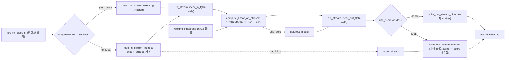
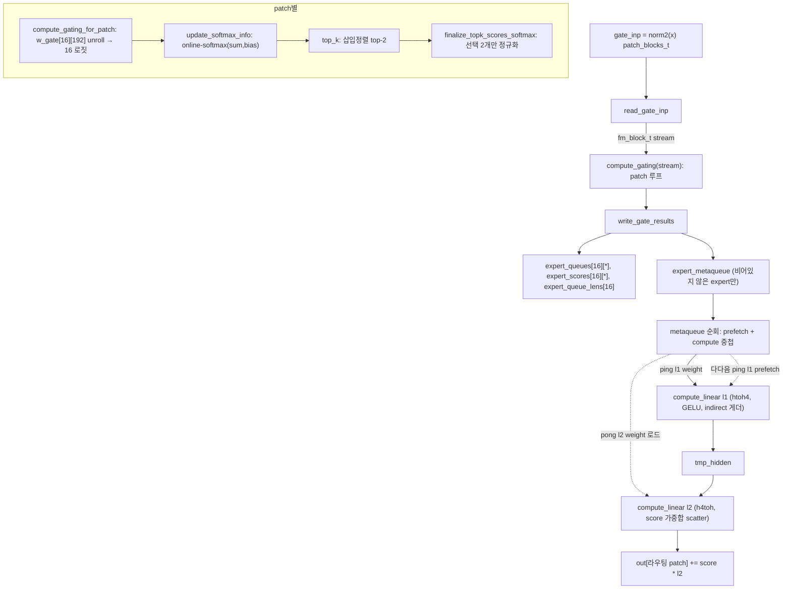
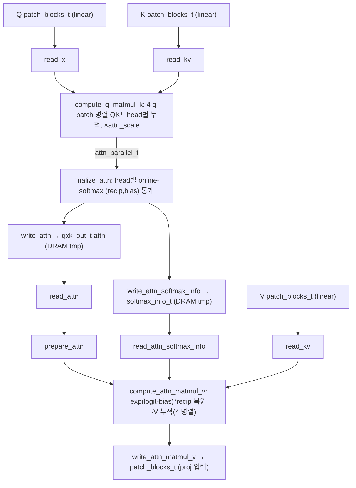
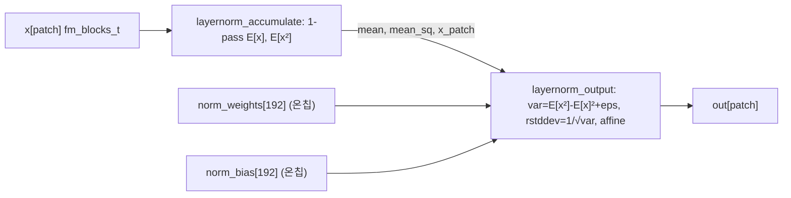
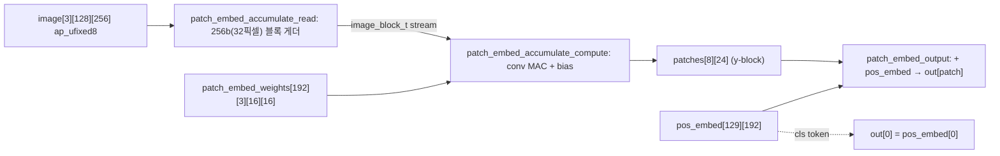
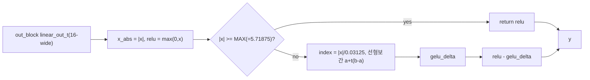
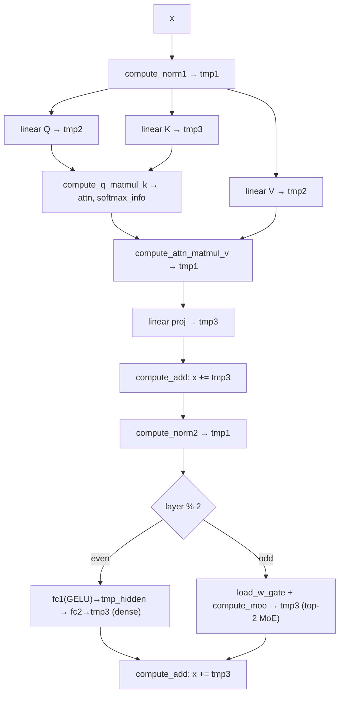

# Edge-MoE 모듈 통합 가이드

> 1차 요약(맥락): [`../Edge-MoE.md`](../Edge-MoE.md)
> 소스 루트: `REF/Transformer-Accel/Edge-MoE`. 구현 전체가 **Vitis HLS C++** (단일 커널 `ViT_compute`). RTL 자체 소스 없음(비트스트림은 사전 합성물).
> 표기 규약: 라인으로 직접 확인한 사실은 단정, 코드 정황 기반은 "추정", 코드/문서에 없으면 "확인 불가".
> 제외물(이름만): `bitstream/bitstream.{xclbin,bit,hwh}`(사전 합성 비트스트림), `weights/*.float32.bin`(학습 가중치/입력/참조 출력 바이너리), `weights/onboard/*.npy`(스크립트 생성물), `images/edge-moe-arch.svg`, `demo.mp4`(자산), `vitis_hls_project/`·`vivado_project/`(합성 산출물, 리포에 미동봉).

---

## 0. 문서 머리말

### 0.1 대표 케이스 선정
Edge-MoE는 **단일 HLS 커널**(`ViT_compute`)이 12-layer ViT 전체를 시분할로 실행한다. 핵심은 **레이어 패리티 분기**: `layer % 2 == 0`이면 dense-MLP, 홀수면 top-2 MoE FFN(`ViT_compute.cpp` L178). 따라서 대표 케이스도 **두 개**를 함께 잡는다.

- **dense-MLP 대표 (짝수 레이어)**: **layer 0의 fc1/fc2**. `ViT_compute.cpp` L180~L186 — `compute_linear(..., VIT_HIDDEN_DIM=768, FEATURE_DIM=192, use_gelu=true)` 후 `compute_linear(..., 192, 768)`. 모든 patch(129개)를 dense하게 처리하는 표준 MLP 경로다(확인됨, `ViT_compute.cpp` L180·L186).
- **MoE 대표 (홀수 레이어)**: **layer 1의 expert FFN**. `ViT_compute.cpp` L191~L200 — `load_w_gate` + `compute_moe`. 게이트로 16 expert 중 top-2를 고르고(`moe.cpp` L264 `top_k`, L20 `NUM_SELECTED_EXPERTS=2`), 실제 라우팅된 expert만 ping/pong prefetch로 stream-in한다(`moe.cpp` L319~L394). EXPERT_HIDDEN_DIM=384(`model.hpp` L10).

선정 근거: (1) 두 케이스가 **같은 단일 `compute_linear` 엔진**(`ViT_compute.cpp` L128 `allocation limit=1`)을 공유하므로 dense ↔ sparse 양 데이터플로우를 한 엔진 위에서 대조 가능, (2) MoE 케이스가 논문 제목의 "Memory-Efficient"(선택 expert만 prefetch)를 직접 증명하는 단위.

### 0.2 수치 표기 규약
- **MAC lanes**: 한 사이클(II=1) 동시 곱셈기 수 = unroll/벡터 차원의 곱. 본 설계의 GEMM 코어는 `LINEAR_IN_SIZE × LINEAR_OUT_SIZE = 16×16`(`hardware.hpp` L13-14, `linear.cpp` L487-495) → **256 scalar MAC/cyc**(목표 II=1, 합성 II는 리포트 부재로 확인 불가).
- **scalar MACs**: 대표 GEMM의 (patch 수)×(out_dim)×(in_dim) 곱. attention·MLP·MoE를 구분 표기.
- **loop trips / cycle**: 타일·채널 루프 반복(`FOR_BLOCK`/`FOR_OFFSET` 분해, `util.hpp` L12-49).
- **memory size (payload bit)**: 온칩 버퍼 깊이×폭(bit). 주요 버퍼 = linear weight ping/pong, expert 큐, attn tmp.

### 0.3 운영 경로 (소스 ↔ case/top ↔ 생성 ↔ 인스턴스)
```
[학습/export]   PyTorch ViT(멀티태스크) → 레이어별 float32 가중치 .bin (weights/*.float32.bin)
        │       (게이트는 task별: l*_w_gate_T_task0/task1; prepare_for_onboard.py L145-152)
[양자화]        로드 시 float32 → ap_fixed 캐스팅 (tbutil.hpp; fm_t=ap_fixed<32,10>, wt_linear_t=ap_fixed<16,2>)
        │
[case/csim]     testbench/e2e.cpp → ViT_compute(...) 1회 호출 → x vs l11_x_post_moe 비교, MSE≤0.1 PASS (e2e.cpp L416-438)
        │
[HLS 합성]      vitis_hls.tcl: set_top ViT_compute, set_part xczu9eg-ffvb1156-2-e, clock 300MHz → csynth → ip_catalog (verilog) IP
        │
[Vivado 통합]   vivado.tcl: ZCU102 PS(zynq_ultra_ps_e) + ViT_compute IP, m_axi 6번들↔S_AXI_HP*/HPC* 매핑, 300MHz → impl → bitstream
        │
[보드]          bitstream/bitstream.{xclbin,bit,hwh} (사전 합성물; 호스트 런타임 코드는 리포 미포함)
```
근거: `vitis_hls.tcl` L1-19, `vivado.tcl` L1-26, `e2e.cpp` L56-438, `prepare_for_onboard.py` L8-152.

### 0.4 타깃 / 데이터타입 / expert 정책
- **타깃**: AMD/Xilinx **Zynq UltraScale+ MPSoC `xczu9eg-ffvb1156-2-e`** (ZCU102 보드, `board_part xilinx.com:zcu102:part0:3.4`), 클럭 **300 MHz**(`vitis_hls.tcl` L14-16, `vivado.tcl` L1-2,L12). 외부 메모리는 PS측 DDR(`S_AXI_HP0/1/2_FPD` + `S_AXI_HPC0/1_FPD`, `vivado.tcl` L15-19). **HBM 아님**(1차 요약의 HBM 표기는 정정). 합성 PPA 리포트는 리포에 미동봉 → **확인 불가**.
- **데이터타입(혼합정밀)**: feature map `fm_t = ap_fixed<32,10>`(activation 32b), linear weight `wt_linear_t = ap_fixed<16,2>`, attn bias `ap_fixed<16,7>`, 일반 bias/norm `ap_fixed<16,5>`, patch-embed weight `ap_fixed<16,0>`, 이미지 픽셀 `ap_ufixed<8,0>`(`datatypes.hpp` L8-15). 즉 **weight 16b / activation 32b fixed**.
- **블록 패킹**: AXI 전송폭 256b(`hardware.hpp` L9). `FEATURE_BLOCK_SIZE = 256/32 = 8`(L10), feature map은 `fm_block_t = vector<fm_t,8>` 단위, 텐서는 `patch_blocks_t x[129][24][8]`(`hardware.hpp` L17-19; NUM_FEATURE_BLOCKS=ceildiv(192,8)=24).
- **expert 정책**: NUM_EXPERTS=16, top-2 선택(`model.hpp` L19-20). 게이트 점수는 online-softmax로 정규화, 라우팅된 patch만 게더(`moe.cpp`). 멀티태스크는 게이트 가중치(`w_gate_T_task{0,1}`) 교체로 구현 추정(`prepare_for_onboard.py` L145-152, `NUM_TASKS=2` L9). testbench는 task0만 로드(추정; e2e가 단일 게이트 배열 사용).

---

## 1. Repo / Layer 개요

| 레이어 | 경로 | 역할 |
|---|---|---|
| **include/** | `include/*.hpp` | 선언 헤더: 모델 상수·자료형·AXI 폭·인터페이스·`FOR_BLOCK` DSL. HLS 아님(상수/타입). |
| **src/** | `src/*.cpp` | HLS 커널 구현(핵심). top·attention·moe·linear·layernorm·conv·gelu·add. |
| **testbench/** | `testbench/e2e.cpp` | 단일 이미지 end-to-end csim + MSE/MAE 검증. |
| **weights/scripts/** | `prepare_for_onboard.py` | float32 .bin → .npy 재배치(온보드용). 커널 아님. |
| **(빌드)** | `vitis_hls.tcl`, `vivado.tcl` | HLS 합성 + ZCU102 통합/비트스트림 스크립트. |

- 자체 소스 모듈 수: `src/*.cpp` **9개** (add, attention, conv, gelu, layernorm, linear, moe, ViT_compute), 헤더 14개.
- `dcl.hpp`(util+datatypes+model+hardware) → 모든 커널 include. `linear.hpp`가 attention/moe/conv 공통 엔진. include 순환 없음.

### 모듈 인스턴스 계층 (top → leaf)
```
ViT_compute  (extern "C" HLS 커널, s_axilite 제어 + m_axi 6번들)  [ViT_compute.cpp L68]
├─ load_one_time_weights        (patch-embed weight/bias 1회 로드, attn_scale/norm_eps 상수)  [L6]
├─ compute_patch_embed          (16×16 stride-16 conv = 패치 임베딩 + pos_embed + cls token)  [conv.cpp L143]
│  └─ patch_embed_accumulate (dataflow: read→compute) → patch_embed_output
└─ for layer in 0..11:
   ├─ load_norms / compute_norm1 / compute_norm2   (LayerNorm 2-pass dataflow)  [layernorm.cpp L138]
   ├─ load_linear_weights / load_linear_bias       (DRAM→온칩 16×16 타일, ping/pong)  [linear.cpp L10,L102]
   ├─ compute_linear ×(Q,K,V,proj, + MLP/expert)   (단일 공유 GEMM 엔진)  [linear.cpp L504]
   │  └─ dataflow: read_in_stream → compute_linear_on_stream → write_out_stream
   │       ├─ (direct: 모든 patch)  read/write_out_stream_direct  [L154,L199]
   │       └─ (indirect: MoE 게더/스캐터)  read/write_out_stream_indirect  [L246,L310]
   │       └─ gelu(out_block)  (use_gelu일 때)  [gelu.cpp L192]
   ├─ compute_q_matmul_k    (QKᵀ + online-softmax 통계)  [attention.cpp L262]
   │  └─ dataflow: read_x + read_kv → compute_q_matmul_k(MAC) → finalize_attn → write_attn(+softmax_info)
   ├─ compute_attn_matmul_v (softmax 복원 + ·V)  [attention.cpp L472]
   │  └─ dataflow: read_kv + read_attn + read_attn_softmax_info → prepare_attn → compute_attn_matmul_v(MAC) → write
   ├─ compute_add           (residual 덧셈)  [add.cpp L3]
   └─ if odd:  load_w_gate + compute_moe   (게이팅 + expert ping/pong prefetch MLP)  [moe.cpp L19,L304]
        └─ compute_gating(dataflow) → metaqueue 순회 → compute_linear(indirect)×2/expert
```

---

## 2. 단일 공유 Linear(GEMM) 엔진 — `src/linear.cpp` (가장 재사용도 높음)

### 2.1 역할 + 상위/하위
Edge-MoE의 모든 행렬곱(Q·K·V·proj·dense-MLP fc1/fc2·MoE expert l1/l2)이 **이 한 엔진**(`compute_linear`)을 시분할로 공유한다. `ViT_compute.cpp` L128의 `#pragma HLS allocation function instances=compute_linear limit=1`이 인스턴스 1개를 강제 → DSP 타일 1벌로 면적 절감. 다형성은 6개 인자 플래그(`out_dim/in_dim/expert/use_gelu/use_expert/use_score`)로 만든다.
상위: `ViT_compute`(직접), `compute_moe`(MoE 경로). 하위: `read_in_stream`/`compute_linear_on_stream`/`write_out_stream`(dataflow 3-스테이지) + `gelu`.

### 2.2 데이터플로우


### 2.3 function call stack
`ViT_compute` / `compute_moe` → `compute_linear` (`#pragma HLS dataflow`, L518) → { `read_in_stream` → `read_in_stream_direct` | `read_in_stream_indirect` } ‖ `compute_linear_on_stream`( → `gelu`) ‖ { `write_out_stream` → `write_out_stream_direct` | `write_out_stream_indirect` }. 가중치는 별도 `load_linear_weights`/`load_linear_bias`로 사전 로드(`linear.cpp` L10,L102).

### 2.4 대표 코드 위치
`src/linear.cpp` L430-502(MAC 코어), L246-308(indirect 게더), L310-385(indirect scatter+score), L504-530(상위 dataflow), L10-90(weight 16×16 타일 로더).

### 2.5 대표 코드 블록

(1) **16×16 MAC 타일 — 한 사이클에 16 in × 16 out** (`linear.cpp` L487~L500)
```cpp
FOR_EACH(in_dim_offset, LINEAR_IN_SIZE)          // 16
{
    linear_out_t addend;
    FOR_EACH(out_dim_offset, LINEAR_OUT_SIZE)     // 16
    {
        addend[out_dim_offset] = in_block[in_dim_offset] * weights[total_dim_block][out_dim_offset][in_dim_offset];
    }
    out_block += addend;                          // 누산
}
if (in_dim_block == last_in_dim_iter)
    out_stream << ((use_gelu) ? gelu(out_block) : out_block);   // 마지막 in 타일에서 출력(+GELU)
```
→ `LINEAR_IN_SIZE=LINEAR_OUT_SIZE=16`(`hardware.hpp` L13-14). 내부 두 루프가 unroll되어 **16×16=256 곱셈/사이클**(목표 II=1, `#pragma HLS pipeline` L463). bias는 in 타일 0에서 초기화(L478-485).

(2) **Indirect 게더 — expert 큐 인덱스로 patch를 골라 읽기** (`linear.cpp` L284~L291)
```cpp
if (dim_block == 0)
{
    unsigned int patch = expert_queues[expert][patch_idx];   // ★ 라우팅된 patch만 게더
    src_base = patch * num_dim_blocks;
    index_stream << patch;                                    // scatter 단계로 인덱스 전달
}
blocks[block] = src[src_base + dim_block];
```
→ MoE 모드(`length != NUM_PATCHES`, L398·L404). dense 엔진 위에서 **sparse 라우팅**을 큐 인덱싱으로 구현. `iters = length * num_dim_blocks`(L271)로 그 expert에 라우팅된 patch 수만큼만 반복.

(3) **Indirect scatter — score 가중합 + 누적** (`linear.cpp` L376~L383)
```cpp
unsigned int dst_idx = dst_base + dim_block;
fm_block_t block_out = blocks[block];
if (use_score)
{
    block_out *= score;            // expert softmax score 가중
    block_out += dst[dst_idx];     // 같은 patch의 다른 expert 기여와 누적(top-2 합산)
}
dst[dst_idx] = block_out;
```
→ `score = expert_scores[expert][patch_idx]`(L356). MoE l2 출력에서 `use_score=true`(`moe.cpp` L381) → top-2 expert 결과를 patch별로 weighted-sum. `#pragma HLS dependence variable=dst inter false`(L342)로 누적 의존성 완화.

(4) **weight를 DRAM→온칩 16×16 블록 레이아웃으로 재배치** (`linear.cpp` L73~L88)
```cpp
wt_linear_block_t block_for_dst;
FOR_EACH(row, LINEAR_OUT_SIZE)                       // 16 out
{
    hls::vector<wt_linear_t, LINEAR_IN_SIZE> row_for_dst;
    FOR_BLOCK(col, LINEAR_IN_SIZE, WEIGHT_BLOCK_SIZE) // 16 in, 256/16=16씩
    { ... row_for_dst[col] = cached[col_offset]; ... }
    block_for_dst[row] = row_for_dst;
}
weights_dst[dst_block] = block_for_dst;             // 256b 정렬 → 16x16 타일
```
→ `WEIGHT_BLOCK_SIZE = 256/16 = 16`(L19, wt_linear_t는 16b). `weights_dst`는 ping/pong 두 벌(`linear.cpp` L5-8)로 다음 GEMM weight를 미리 로드.

### 2.6 마이크로아키텍처 + 정량
- **Stage 분해(dataflow 3-스테이지)**: ①`read_in_stream`(src→16-wide `linear_in_t` 스트림; FEATURE_BLOCK_SIZE=8을 2개 모아 16) → ②`compute_linear_on_stream`(16×16 MAC 타일, out_dim×in_dim 타일 순회) → ③`write_out_stream`(16-wide → fm_block_t 8씩 분해 후 scatter).
- **MAC lanes**: 256 scalar MAC/cyc(16×16, II=1 목표). `wt_linear_block_t = vector<vector<wt_linear_t,16>,16>`(`linear.hpp` L12).
- **scalar MACs(대표 GEMM, NUM_PATCHES=129)**:
  - QKV/proj 각각 = 129×192×192 ≈ **4.76 M**.
  - dense-MLP fc1 = 129×768×192 ≈ **19.0 M**, fc2 동일.
  - MoE expert l1(1 expert, 라우팅 patch당) = 384×192, l2 = 192×384. **전 expert 합** = (전 patch 라우팅 수 = 129×2 = 258) × (384×192 + 192×384) = 258×147,456 ≈ **38.0 M** (16-expert를 dense로 돌렸다면 ~16배). → MoE의 절감 = 라우팅된 patch만 + 선택 expert만.
- **메모리(payload bit)**: weight ping/pong 각 `MAX_LINEAR_DIM_PRODUCT/(16×16) = 768×192/256 = 576` 블록 × (16×16×16b) = 576×4096b ≈ **2.36 Mb/벌**, 2벌(ping+pong) ≈ 4.72 Mb (`linear.cpp` L5-7, MAX_LINEAR_DIM_PRODUCT=VIT_HIDDEN_DIM×FEATURE_DIM=147456, `linear.hpp` L9). bias ping/pong 각 ceildiv(768,16)=48 블록.
- **병목**: `allocation limit=1`은 **면적 최소화 ↔ 처리량 상한 낮음**의 정반대 트레이드오프. 모든 GEMM이 한 엔진을 직렬 시분할 → 레이어 파이프라인 병렬 없음. weight 로드(L10)와 연산(L504)은 MoE에서만 ping/pong로 겹침(§4), dense 경로는 load→compute 직렬.

---

## 3. MoE 엔진 — `src/moe.cpp` (Edge-MoE의 정체성)

### 3.1 역할 + 상위/하위
홀수 레이어 FFN. 게이트 로짓 계산 → online-softmax → top-2 선택 → expert별 patch 큐 작성 → 실제 사용된 expert만 weight를 ping/pong prefetch하며 expert MLP 실행. 상위: `ViT_compute`(L192). 하위: `compute_gating`(dataflow), `load_w_gate`, `compute_linear`(공유 엔진, indirect 모드), `zero_output`, `compute_add`.

### 3.2 데이터플로우


### 3.3 function call stack
`ViT_compute` → `load_w_gate` → `compute_moe`(inline, L304) → `compute_gating`(dataflow, L272) { `read_gate_inp` → `compute_gating`(stream, L244) [ `compute_gating_for_patch` → `update_softmax_info` → `top_k` → `finalize_topk_scores_softmax` ] → `write_gate_results` } → `zero_output` → (metaqueue 루프) `compute_linear`(l1, use_gelu+use_expert) → `load_linear_weights/bias`(pong) → `compute_linear`(l2, use_expert+use_score) → `load_linear_weights/bias`(ping, 다음 expert).

### 3.4 대표 코드 위치
`src/moe.cpp` L169-195(게이트 로짓), L197-225(online-softmax), L128-167(top-k), L74-126(큐+metaqueue), L304-436(expert prefetch MLP), L19-54(w_gate 로더).

### 3.5 대표 코드 블록

(1) **게이트 로짓 — 입력 1회 로드로 16 expert 완전 병렬 MAC** (`moe.cpp` L182~L191)
```cpp
FOR_EACH(out_dim, NUM_EXPERTS)        // 16, unroll
{
    #pragma HLS unroll
    FOR_OFFSET_NOCHK(in_dim)          // FEATURE_BLOCK_SIZE=8, unroll
    {
        #pragma HLS unroll
        addend[out_dim] += gate_inp_block[in_dim_offset] * w_gate[out_dim][in_dim];
    }
}
scores += addend;
```
→ `w_gate[16][192]`(`moe.cpp` L11)에 대해 in_dim을 8씩 블록 순회, 16 expert 동시 산출 = **16×8=128 scalar MAC/cyc**. `w_gate`는 `array_reshape cyclic factor=16/8`(L252-253)로 병렬 포트 확보.

(2) **online-softmax — 새 최댓값 발생 시 기존 합 rescale** (`moe.cpp` L210~L223)
```cpp
auto exp_arg_noclip = scores_softmax_bias - score;
bool is_new_bias = hls::signbit(exp_arg_noclip);
fm_t exp_arg = (is_new_bias) ? fm_t(exp_arg_noclip) : fm_t(-exp_arg_noclip);
fm_t exp = hls::exp(exp_arg);
if (is_new_bias) { scores_softmax_sum *= exp; scores_softmax_sum += 1; scores_softmax_bias = score; }
else             { scores_softmax_sum += exp; }
```
→ 수치 안정 streaming softmax. attention(`attention.cpp` L180-193)과 **비트 단위로 동일한 패턴** → 코드 재사용. `#pragma HLS pipeline rewind II=3`(L207).

(3) **top-k 삽입정렬 — shift 플래그로 한 칸 밀기** (`moe.cpp` L147~L165)
```cpp
FOR_EACH(j, NUM_SELECTED_EXPERTS)    // 2
{
    #pragma HLS unroll
    if (shift) { new_scores[j] = prev_scores[j-1]; new_indices[j] = prev_indices[j-1]; }
    else if (score > prev_scores[j]) { new_scores[j]=score; new_indices[j]=i; shift=true; }
}
indices = new_indices; scores = new_scores;
```
→ 16 expert를 순회(`#pragma HLS pipeline rewind`, L138)하며 크기-2 정렬 리스트에 삽입.

(4) **expert MLP 더블버퍼 prefetch — 연산과 weight 로드 중첩** (`moe.cpp` L345~L393)
```cpp
expert_compute = expert_load;
compute_linear(tmp_hidden, gate_inp, linear_weights_ping, ..., EXPERT_HIDDEN_DIM, FEATURE_DIM,
               expert_compute, /*gelu*/true, /*expert*/true, /*score*/false);   // l1 (htoh4 + GELU)
load_linear_weights(linear_weights_pong, all_weights_l2[expert_compute], ...);  // 동시에 l2 weight pong 로드
load_linear_bias  (linear_bias_pong,   all_bias_l2[expert_compute], ...);
expert_load = expert_metaqueue[expert_load_idx];                                // 다음 expert
compute_linear(out, tmp_hidden, linear_weights_pong, ..., FEATURE_DIM, EXPERT_HIDDEN_DIM,
               expert_compute, false, true, /*score*/true);                     // l2 (h4toh + score 합)
load_linear_weights(linear_weights_ping, all_weights_l1[expert_load], ...);     // 다다음 l1 weight ping 로드
load_linear_bias  (linear_bias_ping,   all_bias_l1[expert_load], ...);
```
→ ping=l1 weight, pong=l2 weight. **선택된 expert만, 또 그 expert에 라우팅된 patch만** DRAM→온칩으로 가져온다. metaqueue 첫 expert는 루프 전 선로드(L319-333), 마지막 expert는 루프 후 잔여 처리(L396-435).

### 3.6 마이크로아키텍처 + 정량
- **Stage 분해(`compute_gating` dataflow 3-스테이지)**: ①`read_gate_inp`(patch별 feature 블록 스트림화, L56) → ②`compute_gating`(stream)(로짓→softmax→top-2→정규화, L244) → ③`write_gate_results`(expert 큐 push + metaqueue 생성, L74). 그 뒤 `compute_moe`가 metaqueue 순회로 expert MLP.
- **MAC lanes**: 게이팅 = 16×8 = **128 MAC/cyc**(L182-189). expert MLP는 공유 16×16 엔진 = 256 MAC/cyc.
- **scalar MACs**: 게이팅 = 129×16×192 ≈ **0.40 M**(전 patch×16 expert). expert FFN ≈ **38.0 M**(§2.6).
- **메모리(payload bit)**: `w_gate[16][192]` × 16b = **49.2 Kb**(L11). `expert_queues[16][129]` × 32b(unsigned) = **66.0 Kb**, `expert_scores[16][129]` × 32b(fm_t) = **66.0 Kb**, `expert_queue_lens[16]`·`expert_metaqueue[16]`(L13-17). expert weight는 공유 ping/pong(§2.6)에 재사용.
- **병목**:
  - **동적 라우팅 가변 trip**: metaqueue 길이·각 expert 큐 길이가 입력 의존 → `loop_tripcount min=0 avg=15 max=15`(L343)로 추정만 가능, 실제 사이클은 라우팅 분포에 따라 변동. 워스트케이스 all-16-expert면 16 expert × 2 GEMM 직렬.
  - **prefetch 깊이 1**: ping/pong 2단이라 l1 compute ↔ l2 weight load만 겹침. 같은 expert l1/l2는 직렬(tmp_hidden 의존).
  - **load balancing**: top-2가 소수 expert에 몰리면 그 expert 큐가 길어져 stall(부하 불균형). 코드에 보정 없음.

---

## 4. Attention 엔진 — `src/attention.cpp`

### 4.1 역할 + 상위/하위
2-pass attention: (1) `compute_q_matmul_k`가 QKᵀ + online-softmax **통계만** 산출(확률 행렬 미저장), (2) `compute_attn_matmul_v`가 통계로 softmax를 **즉석 복원** 후 ·V. 상위: `ViT_compute`(L161,L167). 하위: 각 dataflow 스테이지 + 공유 `compute_linear`(Q/K/V/proj는 §2 엔진).

### 4.2 데이터플로우


### 4.3 function call stack
`ViT_compute` → `compute_q_matmul_k`(dataflow, L262) { `read_x` ‖ `read_kv` → `compute_q_matmul_k`(MAC, L45) → `finalize_attn`(L127) → `write_attn` ‖ `write_attn_softmax_info` } → (V linear) → `compute_attn_matmul_v`(dataflow, L472) { `read_kv` ‖ `read_attn` ‖ `read_attn_softmax_info` → `prepare_attn` → `compute_attn_matmul_v`(MAC, L387) → `write_attn_matmul_v` }.

### 4.4 대표 코드 위치
`src/attention.cpp` L45-125(QKᵀ MAC), L127-213(online-softmax 통계), L387-470(·V + softmax 복원), L262-284 / L472-494(dataflow 상위).

### 4.5 대표 코드 블록

(1) **QKᵀ — 4 q-patch 병렬, head 자동 분기, scale** (`attention.cpp` L94~L106)
```cpp
unsigned int head = dim_block / (DIM_PER_HEAD / FEATURE_BLOCK_SIZE);   // DIM_PER_HEAD=64
FOR_OFFSET_UNSAFE(q_patch)                                             // 4 q-patch 병렬
{
    fm_block_t q_block = q_blocks[q_patch_offset][dim_block];
    fm_t attn_addend = 0;
    FOR_OFFSET(dim) { attn_addend += q_block[dim_offset] * k_block[dim_offset]; }  // 8-wide 내적
    attn_addend *= attn_scale;                                          // 0.125 = 1/sqrt(64)
    attn_blocks[q_patch_offset][head] += attn_addend;
}
```
→ `ATTN_MATMUL_PARALLEL=4`(`hardware.hpp` L15), `q_blocks[4]` array_partition complete(L53-54). `attn_scale=0.125`(`ViT_compute.cpp` L64; 1/√(DIM_PER_HEAD=64)). MAC = 4 q-patch × 8 = **32 MAC/cyc**.

(2) **online-softmax 통계만 흘림 (FlashAttention류)** (`attention.cpp` L195~L199)
```cpp
fm_t curr_softmax_sum_recip = hls::recip(curr_softmax_sum);
softmax_sums[q_patch_unadjusted_offset][head]  = curr_softmax_sum;
softmax_biases[q_patch_unadjusted_offset][head] = curr_softmax_bias;
softmax_info_row[head * 2]     = curr_softmax_sum_recip;   // packing: [recip, bias] per head
softmax_info_row[head * 2 + 1] = curr_softmax_bias;
```
→ 확률 행렬(129×129×3)을 만들지 않고 head별 (recip(sum), bias)만 저장(`softmax_info_row_t`, `hardware.hpp` L27). 4 q-patch 병렬 의존성은 `#pragma HLS dependence ... distance=q_patch_unadjusted_step`(L152-153).

(3) **·V 단계 softmax 즉석 복원** (`attention.cpp` L429~L434)
```cpp
fm_t softmax_sum_recip = attn_softmax_info[attn_patch_offset][head * 2];
fm_t softmax_bias      = attn_softmax_info[attn_patch_offset][head * 2 + 1];
attn[attn_patch_offset][head] = (
    hls::exp(fm_t(attn_packed[attn_patch_offset][head] - softmax_bias)) * softmax_sum_recip
);
```
→ 통계로 `prob = exp(logit - bias) * recip(sum)` 재계산 후 V와 곱(L447-450). acc는 4 병렬 `acc_blocks[4]`(L396-397)에 누적.

### 4.6 마이크로아키텍처 + 정량
- **Stage 분해**: QKᵀ pass = read_x/read_kv → MAC(q_patch×k_patch×dim 3중 루프) → finalize(softmax 통계) → write(attn + softmax_info). ·V pass = read(kv/attn/softmax_info) → prepare → MAC(복원+·V) → write.
- **MAC lanes**: QKᵀ 32 MAC/cyc, ·V 32 MAC/cyc(둘 다 4 q-patch × FEATURE_BLOCK_SIZE 8).
- **scalar MACs**: QKᵀ = 3 head × 129 × 129 × 64 ≈ **3.20 M**. ·V 동일 ≈ **3.20 M**.
- **메모리(payload bit)**: `attn` = `qxk_out_t`(`hardware.hpp` L26) = ceil(132/4)=33 × 129 × 4 × heads_t(roundup_p2(3)=4 × 32b=128b) → ≈ 33×129×4×128 ≈ **2.18 Mb**(DRAM tmp1, `ViT_compute.cpp` L107). `attn_softmax_info` = 129 × softmax_info_row_t(roundup_p2(6)=8 × 32b=256b) = **33.0 Kb**.
- **병목**: **완전 fused 아님** — `attn`/`attn_softmax_info`를 DRAM tmp(`tmp1` bundle inout1, `inout4`)로 왕복(`ViT_compute.cpp` L107-108) → FlashAttention 대비 외부 메모리 트래픽 잔존(통계 압축 + 2-pass). 4-way q-patch 병렬이 유일한 병렬도이므로 head/patch 병렬 확장 여지.

---

## 5. LayerNorm — `src/layernorm.cpp`

### 5.1 역할 + 상위/하위
patch별 LayerNorm. norm1(attention 전)·norm2(FFN 전) 2종, weight/bias는 온칩 상주(`norm1/2_weights/bias`, L4-7). 상위: `ViT_compute`(L151,L175). 하위: `layernorm_accumulate`/`layernorm_output`(2-스테이지 dataflow).

### 5.2 데이터플로우


### 5.3 function call stack
`ViT_compute` → `load_norms`(L10, 레이어 norm weight/bias 온칩 적재) → `compute_norm1`/`compute_norm2`(inline) → `compute_norm`(L138, patch 루프 dataflow) → `layernorm_accumulate` → `layernorm_output`.

### 5.4 대표 코드 위치
`src/layernorm.cpp` L74-101(1-pass 누적), L103-136(variance+affine), L138-158(patch dataflow).

### 5.5 대표 코드 블록

(1) **1-pass mean / mean_sq 누적** (`layernorm.cpp` L89~L99)
```cpp
FOR_OFFSET(dim)
{
    fm_t x_dim = x_block[dim_offset];
    fm_t x_dim_mean_term = x_dim * fm_t(1.0 / FEATURE_DIM);   // /192 미리 곱
    partial_mean    += x_dim_mean_term;
    partial_mean_sq += x_dim * x_dim_mean_term;               // E[x²]도 동시
}
x_patch[dim_block] = x_block;   // 다음 스테이지로 원본 통과
```
→ E[x], E[x²]를 1패스로 누적(`#pragma HLS pipeline rewind` L83). variance를 두 번째 패스 없이 `E[x²]-E[x]²`로 산출.

(2) **variance → rstddev → affine** (`layernorm.cpp` L116~L131)
```cpp
fm_t sq_mean = mean * mean;
fm_t variance = mean_sq - sq_mean + norm_eps;        // norm_eps=1e-6 (ViT_compute.cpp L65)
fm_t rstddev = fm_t(1) / hls::sqrt(variance);
...
x_dim -= mean; x_dim *= rstddev; x_dim *= weights[dim]; x_dim += bias[dim];
```
→ `array_reshape cyclic factor=8`(L113-114)로 weight/bias 병렬 포트. `hls::sqrt` 1회/patch.

### 5.6 마이크로아키텍처 + 정량
- **Stage 분해**: 2-스테이지 dataflow per patch(`#pragma HLS dataflow` L149). accumulate(24 블록 누적) → output(24 블록 affine).
- **loop trips**: patch 129 × dim 블록 24(=192/8).
- **메모리**: `norm1/2_weights[192]`+`norm2 bias[192]` × wt_norm_t/wt_bias_t(16b) = 192×16×4 ≈ **12.3 Kb**(온칩 상주). `x_patch[24]` 임시.
- **병목**: patch 간 dataflow는 순차(레이어 직렬). sqrt/div 비선형 1회/patch는 짧음.

---

## 6. Patch Embedding (Conv) — `src/conv.cpp`

### 6.1 역할 + 상위/하위
16×16 stride-16 conv = 패치 임베딩. 입력 256×128×3 이미지 → 128 patch × 192-dim + cls token(patch 0) + pos_embed. 상위: `ViT_compute`(L143). 하위: `patch_embed_accumulate`(read→compute dataflow), `patch_embed_output`.

### 6.2 데이터플로우


### 6.3 function call stack
`ViT_compute` → `load_one_time_weights`(patch_embed weight/bias 1회, `ViT_compute.cpp` L6) → `compute_patch_embed`(L143) → (y-block dataflow) `patch_embed_accumulate` { `_read` → `_compute` } → `patch_embed_output`.

### 6.4 대표 코드 위치
`src/conv.cpp` L33-99(conv MAC), L118-141(pos_embed 합), L143-166(y-block dataflow + cls token).

### 6.5 대표 코드 블록

(1) **conv MAC — 16-wide 픽셀 내적** (`conv.cpp` L80~L93)
```cpp
FOR_BLOCK(x, IMAGE_BLOCK_SIZE, PATCH_WIDTH)         // 32픽셀 블록을 16씩
{
    unsigned int patch_x = patch_x_base + x_block;
    fm_block_t addend;
    FOR_OFFSET(dim)
    {
        fm_t addend_dim = 0.0;
        FOR_OFFSET(x) { addend_dim += image_block[x] * patch_embed_weights[dim][channel][y_offset][x_offset]; }
        addend[dim_offset] = addend_dim;
    }
    patches[patch_x][dim_block] += addend;          // 채널·y 누적
}
```
→ `IMAGE_BLOCK_SIZE = 256/8 = 32`(L4, pixel_t는 8b). conv를 채널×y×x 누적으로 분해, weight `array_reshape`(L42-43)로 병렬.

(2) **pos_embed 합 + cls token** (`conv.cpp` L138, L160~L165)
```cpp
out[patch][dim_block] = patches[patch_x][dim_block] + pos_embed[patch][dim_block];  // 패치 임베딩 + 위치
...
FOR_BLOCK(dim, FEATURE_DIM, FEATURE_BLOCK_SIZE)
{
    out[0][dim_block] = pos_embed[0][dim_block];   // patch 0 = cls token = pos_embed[0] (학습된 cls 포함)
}
```

### 6.6 마이크로아키텍처 + 정량
- **Stage 분해**: y-block(8개=128/16) dataflow, 각 y-block: read(이미지 256b 게더) → compute(conv) → output(+pos_embed).
- **scalar MACs**: 128 patch × 192 dim × (3 ch × 16 × 16) = 128×192×768 ≈ **18.9 M**(QKV/MLP와 동급).
- **메모리**: `patch_embed_weights[192][3][16][16]` × wt_patch_embed_t(16b) = 147,456×16 ≈ **2.36 Mb**(온칩 상주). `patches[8][24]` 임시.
- **병목**: 1회 실행(레이어 루프 밖)이라 amortize 됨. weight 상주 BRAM 2.36Mb가 부담.

---

## 7. GELU — `src/gelu.cpp`

### 7.1 역할 + 상위/하위
비선형 활성. `gelu(x) = relu(x) - delta(|x|)`로 분해, delta는 184-entry LUT 선형보간. dense-MLP fc1과 MoE expert l1에서 `compute_linear(..., use_gelu=true)`로 호출(`linear.cpp` L499). 상위: `compute_linear_on_stream`. 하위: ROM 테이블.

### 7.2 데이터플로우


### 7.3 function call stack
`compute_linear_on_stream` → `gelu(hls::vector<fm_t,N>)`(벡터 버전, L213, unroll) → `gelu(fm_t)`(스칼라, L192) → `GELU_DELTA_TABLE[]` ROM.

### 7.4 대표 코드 위치
`src/gelu.cpp` L6-184(184-entry delta LUT), L192-211(스칼라 보간), L213-227(벡터 unroll + 명시적 인스턴스화).

### 7.5 대표 코드 블록

(1) **relu - delta 분해 + LUT 선형보간** (`gelu.cpp` L197~L210)
```cpp
fm_t relu = ap_fixed_relu(x);
fm_t x_abs = hls::signbit(x) ? fm_t(-x) : x;
if (x_abs >= GELU_DELTA_TABLE_MAX) return relu;          // 포화 영역
auto index_exact = x_abs / GELU_DELTA_TABLE_STEP;         // step=0.03125
gelu_delta_table_index_t index = index_exact;
fm_frac_t a = GELU_DELTA_TABLE[index];
fm_frac_t b = GELU_DELTA_TABLE[index + 1];
fm_frac_t t = index_exact - index;
fm_frac_t gelu_delta = a + t * (b - a);                   // 선형보간
return relu - gelu_delta;
```
→ delta는 부호 대칭이라 `|x|`만 조회 → 테이블 절반 절약. `#pragma HLS bind_storage ... ROM_NP`(L195).

### 7.6 마이크로아키텍처 + 정량
- **LUT**: 184 entry × fm_frac_t(width 22b = fm_t::width-iwidth=32-10) ≈ **4.0 Kb** ROM. step 0.03125, 범위 [0, 5.71875)(`GELU_DELTA_TABLE_MAX = 0.03125×183`, L190).
- **인스턴스화**: 벡터 폭 3종 명시 인스턴스(L225-227): MoE l1(16×192/384=8-wide), VIT l1(16×192/768=4-wide), LINEAR_OUT_SIZE(16-wide).
- **병목**: DSP 없이 비선형 근사(곱 1회 + 테이블 2 read). 보간 1차라 정밀도-면적 균형. 합성 자원은 리포트 부재로 확인 불가.

---

## 8. Residual Add — `src/add.cpp`

### 8.1 역할 + 상위/하위
residual 덧셈(attention 후, FFN 후). 상위: `ViT_compute`(L173,L203). 하위: 없음.

### 8.2 대표 코드 블록 (`add.cpp` L11~L18)
```cpp
FOR_EACH(i, NUM_PATCHES * NUM_FEATURE_BLOCKS)       // 129 × 24 = 3096 블록
{
    #pragma HLS pipeline
    #pragma HLS dependence variable=x_blocks inter false
    #pragma HLS dependence variable=y_blocks inter false
    #pragma HLS dependence variable=out_blocks inter false
    out_blocks[i] = x_blocks[i] + y_blocks[i];        // fm_block_t(8-wide) 벡터 덧셈
}
```

### 8.3 정량
- **lanes**: 8-wide(fm_block_t) 벡터 add, II=1. **loop trips** = 129×24 = 3096. `dependence inter false`로 의존성 제거 → 완전 파이프라인. memory = 입출력 모두 DRAM(in-place 가능).

---

## 9. 최상위 오케스트레이션 — `src/ViT_compute.cpp`

### 9.1 역할 + 상위/하위
`extern "C"` HLS 커널. 모든 포트 `m_axi offset=slave`(외부 DDR), 제어 `s_axilite`(L100). AXI 번들 6개(`inout1~4`, `weights`)로 분리해 다채널 DDR 동시 접근. `tmp1~4`/`tmp_hidden`은 레이어 간 중간버퍼. 하위: 위 모든 커널.

### 9.2 데이터플로우 (1 레이어)


### 9.3 대표 코드 블록

(1) **even/odd 패리티 분기 — dense MLP vs MoE** (`ViT_compute.cpp` L178~L202)
```cpp
if (layer % 2 == 0) {   // dense MLP
    load_linear_weights(linear_weights_ping, vit_weights_l1[layer/2], VIT_HIDDEN_DIM, FEATURE_DIM);
    compute_linear(tmp_hidden, tmp1, ..., VIT_HIDDEN_DIM, FEATURE_DIM, 0, /*gelu*/true, false, false);
    compute_linear(tmp3, tmp_hidden, ..., FEATURE_DIM, VIT_HIDDEN_DIM, 0, false, false, false);
} else {                // top-2 MoE
    load_w_gate(moe_w_gate[layer/2]);
    compute_moe(tmp1, tmp3, tmp_hidden, moe_weights_l1[layer/2], ..., moe_weights_l2[layer/2], ...);
}
```
→ 12 레이어 = dense 6 + MoE 6. weight 인덱스는 `layer/2`로 그룹 분리(`vit_*[6]`, `moe_*[6]`, `ViT_compute.cpp` L91-94/L86-90).

(2) **단일 엔진 자원 공유 + debug_id 단계 게이트** (`ViT_compute.cpp` L128~L131, L152)
```cpp
#pragma HLS allocation function instances=compute_linear limit=1
#pragma HLS allocation function instances=load_linear_weights limit=1
...
if (debug_id == layer * 16 + 1) return;   // 서브스텝별 부분 실행(중간 텐서 검증)
```

(3) **6 AXI 번들 분리 → ZCU102 DDR 다채널** (`ViT_compute.cpp` L102~L126)
```cpp
#pragma HLS interface m_axi ... port=tmp1 bundle=inout1 ...   // inout1: tmp1,attn,images
#pragma HLS interface m_axi ... port=tmp2 bundle=inout2 ...   // inout2: tmp2, x
#pragma HLS interface m_axi ... port=tmp4 bundle=inout4 ...   // inout4: tmp4,tmp_hidden,attn_softmax_info
#pragma HLS interface m_axi ... port=...  bundle=weights ...  // weights: 모든 가중치
```
→ `vivado.tcl` L15-19에서 inout1→HPC1, inout2→HP0, inout3→HP1, inout4→HP2, weights→HPC0로 매핑.

### 9.4 마이크로아키텍처 + 정량
- **레이어 루프**: `#pragma HLS pipeline off`(L148) → 레이어 직렬(파이프라인 펼침 없음). num_images 루프도 pipeline off(L141).
- **AXI 설정**: `config_interface -m_axi_alignment_byte_size 64 -m_axi_latency 64 -m_axi_max_widen_bitwidth 512`(`vitis_hls.tcl` L17), 포트별 `max_widen_bitwidth=256`(L102-126). 6번들 → DDR 5채널(HP0/1/2 + HPC0/1).
- **중간버퍼**: tmp1~4 + tmp_hidden + attn + attn_softmax_info 모두 DRAM. `tmp_hidden` 크기 = 129 × ceildiv(max(768,384),8) = 129×96 = 12,384 블록(L78).
- **병목**: 레이어·서브스텝 전부 직렬 시분할. 단일 GEMM 엔진이 전 GEMM을 순차 수행 → 처리량 상한. 다채널 DDR로 대역폭은 분산.

---

## 10. 빌드·검증 흐름 — `vitis_hls.tcl`, `vivado.tcl`, `testbench/e2e.cpp`

### 10.1 역할
- **csim/csynth**(`vitis_hls.tcl`): `set_top ViT_compute`, 9개 src 추가, tb=e2e.cpp + weights/, `set_part xczu9eg-ffvb1156-2-e`, clock 300MHz, ip_catalog(verilog) export.
- **통합/비트스트림**(`vivado.tcl`): ZCU102, PS + ViT_compute IP, AXI 자동연결, `Performance_Auto_1`, `write_bitstream`.
- **검증**(`e2e.cpp`): 단일 이미지 추론 → x vs `l11_x_post_moe.float32.bin` 비교(L325-336; layer 11=홀수→moe), MSE/MAE 산출, **MSE≤0.1이면 exit 0**(L438).

### 10.2 대표 코드 블록 (`e2e.cpp` L325~L336, L416~L438)
```cpp
oss << "l" << (NUM_LAYERS-1) << "_x_post_" << (((NUM_LAYERS-1)%2==0) ? "mlp" : "moe");  // l11_x_post_moe
...
mse += error*error; mae += abs_error;     // 전 patch×dim
mse /= (NUM_PATCHES * FEATURE_DIM);
return (mse <= MSE_PASS_THRESHOLD) ? 0 : 1;   // 0.1
```

### 10.3 정량
- 입력: `image.float32.bin`(3×128×256), `patch_embed_weight/bias`, `pos_embed`(129×192). float32 → ap_fixed 캐스팅(`tbutil.hpp`).
- 가중치 shape(확인, `prepare_for_onboard.py`): qkv `(3,192,192)`+proj`(192,192)`(L54-63), fc1`(768,192)`/fc2`(192,768)`(L80-101), expert htoh4`(16,384,192)`/h4toh`(16,192,384)`(L113-134), gate `(2 task,6 layer,16,192)`(L145-152).
- 합성 PPA(LUT/FF/DSP/BRAM/지연/주파수): 리포트 미동봉 → **확인 불가**.

---

## 11. 모듈 한눈 요약 표

| # | 모듈 | 파일 | 핵심 역할 | MAC lanes(목표 II=1) | 대표 scalar MACs | 주 메모리(추정) | 핵심 병목 |
|---|---|---|---|---|---|---|---|
| 2 | Linear(GEMM) 엔진 | `linear.cpp` | 모든 행렬곱 공유, direct/indirect | 16×16=256 | QKV 4.76M / fc1 19.0M | weight ping/pong ~4.72Mb | allocation=1 직렬 |
| 3 | MoE 엔진 | `moe.cpp` | 게이팅+top2+expert prefetch | 게이팅 128 / FFN 256 | 게이팅 0.40M / FFN ~38.0M | 큐 ~132Kb + w_gate 49Kb | 동적 라우팅 가변 trip |
| 4 | Attention | `attention.cpp` | QKᵀ/softmax통계/·V (2-pass) | 32(QKᵀ) / 32(·V) | QKᵀ 3.20M / ·V 3.20M | attn tmp ~2.18Mb(DRAM) | 비-fused DRAM 왕복 |
| 5 | LayerNorm | `layernorm.cpp` | patch별 2-pass norm | 8-wide | 129×192×2(통계) | norm w/b ~12.3Kb(상주) | patch 직렬 |
| 6 | PatchEmbed(Conv) | `conv.cpp` | 16×16 stride16 conv+pos | 8-wide×(3×16×16) | ~18.9M(1회) | pe weight ~2.36Mb(상주) | 1회 실행 amortize |
| 7 | GELU | `gelu.cpp` | relu-delta LUT 보간 | unroll N(4/8/16) | — | 184-entry ROM ~4Kb | 곱1+read2 |
| 8 | Add | `add.cpp` | residual | 8-wide | — | DRAM in-place | — |
| 9 | Top | `ViT_compute.cpp` | 레이어 직렬 오케스트레이션 | — | — | tmp1~4+tmp_hidden(DRAM) | 레이어/서브스텝 직렬 |

---

## 12. 읽기·코드추적 순서 (권장)

1. **상수/타입**: `model.hpp` → `datatypes.hpp` → `hardware.hpp` → `util.hpp`(`FOR_BLOCK`/`FOR_OFFSET` DSL 이해가 모든 코드의 전제).
2. **top 골격**: `ViT_compute.cpp` L138-205(레이어 루프 + even/odd 분기) → 인터페이스 L68-131.
3. **공유 엔진**: `linear.cpp` L504-530(상위) → L430-502(MAC) → L246-385(indirect 게더/스캐터) → L10-90(weight 타일 로더).
4. **MoE**: `moe.cpp` L304-436(prefetch MLP) → L244-289(게이팅 dataflow) → L169-225(로짓+softmax) → L128-167(top-k).
5. **Attention**: `attention.cpp` L262-284 / L472-494(dataflow 상위) → L45-125(QKᵀ) → L127-213(softmax 통계) → L387-470(·V 복원).
6. **보조**: `layernorm.cpp` → `conv.cpp` → `gelu.cpp` → `add.cpp`.
7. **검증/빌드**: `e2e.cpp`(MSE/MAE) → `vitis_hls.tcl`/`vivado.tcl`(타깃·통합).

---

## 13. 병목 후보 & 병렬도 노브

| 노브 | 위치 | 현재값 | 효과 | 리스크 |
|---|---|---|---|---|
| `compute_linear` 인스턴스 수 | `ViT_compute.cpp` L128 | 1(allocation limit=1) | ↑면 처리량↑ | DSP/면적 급증 |
| `LINEAR_IN/OUT_SIZE` | `hardware.hpp` L13-14 | 16/16 (256 MAC) | ↑면 GEMM 병렬↑ | weight RF/포트 폭↑ |
| `ATTN_MATMUL_PARALLEL` | `hardware.hpp` L15 | 4 | ↑면 attn 병렬↑ | q_blocks/acc RF↑ |
| `FEATURE_BLOCK_SIZE`(=AXI/fm) | `hardware.hpp` L9-10 | 8 (256b/32b) | act 비트↓면 블록↑ | 정확도(현재 act 32b) |
| activation 비트폭 `fm_t` | `datatypes.hpp` L8 | ap_fixed<32,10> | ↓면 BRAM/대역폭↓ | 정확도(공격적 양자화 여지) |
| expert prefetch 깊이 | `moe.cpp` ping/pong | 2단 | ↑면 load/compute 중첩↑ | 온칩 weight 버퍼↑ |
| 레이어 파이프라인 | `ViT_compute.cpp` L148 | pipeline off(직렬) | 펼치면 throughput↑ | 면적 대폭↑(HG-PIPE식) |
| attention fusion | `ViT_compute.cpp` L161,167 | 2-pass(DRAM tmp) | fuse면 트래픽↓ | 온칩 buffer↑, 재설계 |

**핵심 병목 진단**: Edge-MoE는 **면적·메모리 최소화** 목표(단일 엔진 `allocation limit=1`, weight 16b, 선택 expert만 prefetch)로 **처리량을 의도적으로 양보**한 설계다. 레이어/서브스텝/GEMM이 모두 단일 엔진에서 직렬 시분할되며(`ViT_compute.cpp` L141,148 pipeline off), attention은 통계 압축 2-pass로 DRAM을 왕복한다. 고처리량(HG-PIPE식 레이어 펼침)과는 정반대 트레이드오프. MoE는 동적 라우팅 분포에 따라 사이클이 가변(부하 불균형 시 stall)이며, prefetch 깊이 2단이라 같은 expert의 l1↔l2는 직렬이다. 합성 PPA 수치(DSP/BRAM/주파수 달성·지연)는 리포트 미동봉으로 **확인 불가** — 논문 본문 또는 csynth 실행 필요.
