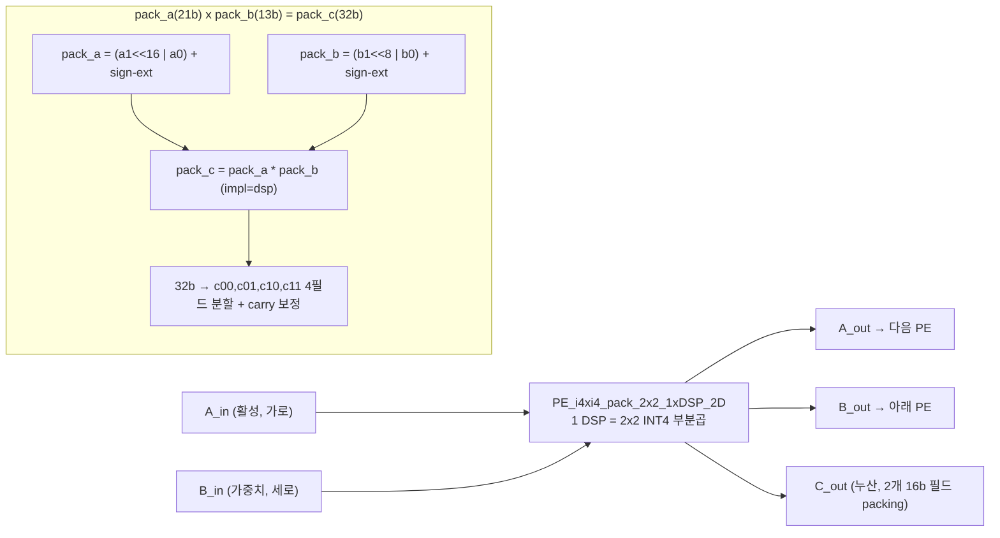
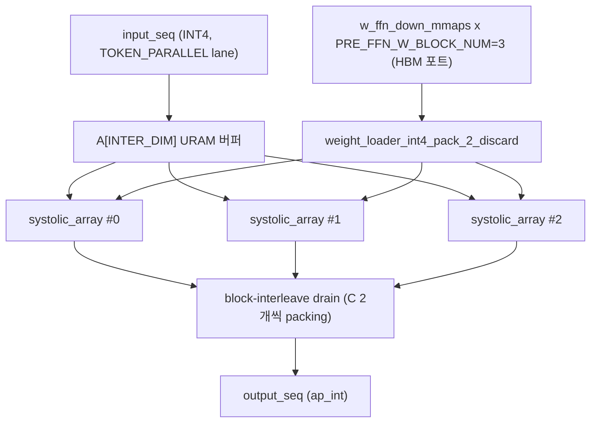
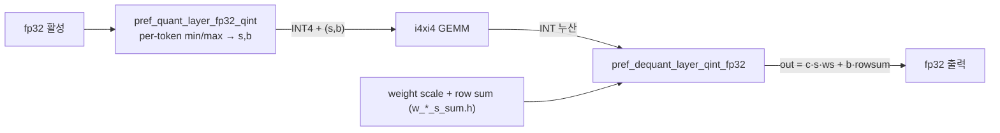
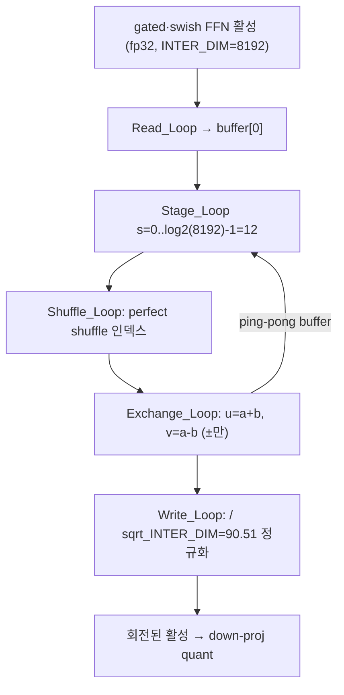
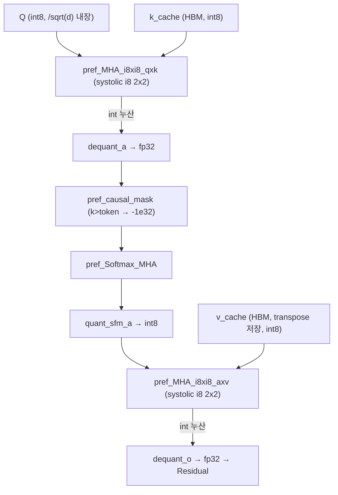
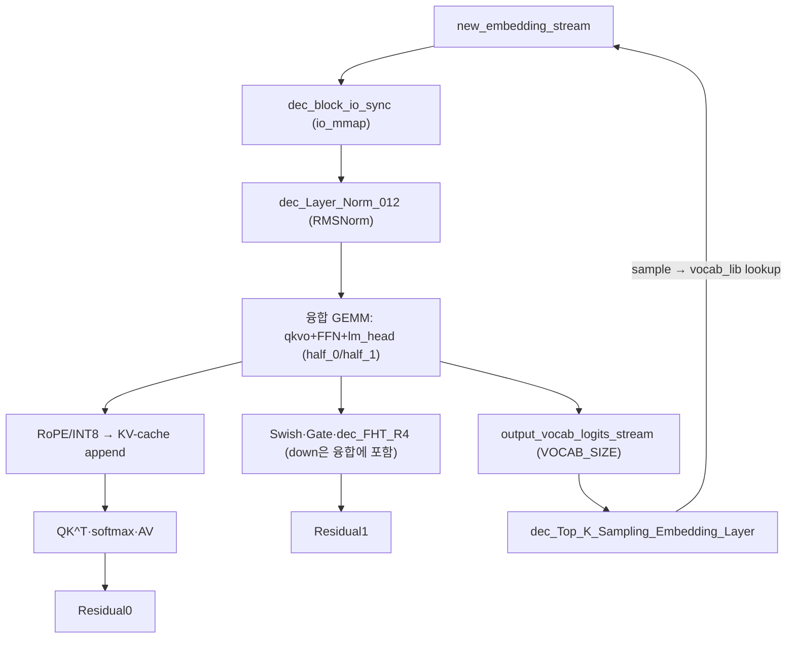

# FPGA_Friendly_SpinQuant 모듈 통합 가이드

> 1차 요약(맥락): [`../FPGA_Friendly_SpinQuant.md`](../FPGA_Friendly_SpinQuant.md)
> 소스 루트: `REF/Transformer-Accel/FPGA_Friendly_SpinQuant`. 본 가이드는 **`src/` 의 TAPA HLS 커널 라이브러리 + `mem_opt` top-level** 을 정본으로 삼는다(`SpinQuant_Prefilling_mem_opt.h`/`SpinQuant_Decoding_mem_opt.h` 가 README/Makefile이 실제 빌드하는 메인 경로).
> 표기 규약: 라인으로 직접 확인한 사실은 단정, 코드 정황 기반은 "추정", 코드/문서에 없으면 "확인 불가".
> 제외물(이름만, 분석 안 함): `src/parameters/*.h`·`run/parameters/*.h`(생성된 scale/RoPE 테이블 `A_s.h`/`K_s.h`/`Q_s.h`/`V_s.h`/`w_*_s_sum.h`/`RoPE_sin_cos.h`/`w_rmsnorm.h`/`w_lm_head_lm_head.h`), `run/parameters/*.bin`(INT4 weight, 레이어×16), `run/bitstreams/*.xclbin`(컴파일된 비트스트림), `lm_head.bin`·`model_embed_tokens_fp32.bin`(미동봉, 외부 다운로드 `README.md:30-39`), `figs/`. third_party/vendor/.ip_user_files 는 **존재하지 않음**.

---

## 0. 문서 머리말

### 0.1 대표 케이스 선정 + 근거
이 repo는 한 LLM 추론을 **prefill xclbin + decode xclbin** 두 개로 빌드한다(`Makefile:53,78,115`). 대표 케이스도 그 분리를 따라 **세 개**를 잡는다.

- **(A) Prefill GEMM 대표 — FFN의 INT4 W4A4 Linear 한 타일**: `pref_Linear_Layer_i4xi4_blocked`(`Linear_Layer.h:344-406`)가 `PRE_FFN_W_BLOCK_NUM=3`개 systolic array를 펼쳐 INTER_DIM(8192) 출력을 3개 HBM 포트로 분산한다(`config.h:71`, 호출 `Prefilling_mem_opt.h:730`). prefill에서 연산량이 가장 큰 단위이며 SpinQuant의 R4 회전이 바로 이 down-proj 직전에 붙는다(`Prefilling_mem_opt.h:1037→1044`).
- **(B) Decode 융합 GEMM 대표 — QKVO+FFN+lm_head 가중치 고정 GEMM**: 단일 토큰(M=1)에서 `dec_Linear_Layer_i4xi4_qkvo_FFN_half`를 2-half로 나눠 두 HBM 그룹에서 병렬 로드(`Decoding_mem_opt.h:1077-1078`). 디코딩 전체 시간(README 9.86s)을 지배하는 weight-stationary 경로.
- **(C) on-FPGA Top-K 대표 — `dec_Sampling_Embedding_Layer`**: vocab logits에서 lane별 Top-K → 전역 merge → softmax → CDF 난수 샘플 → `vocab_lib` 임베딩 조회 → `new_embedding_stream` 피드백(`Logits.h:138-292`, 호출 `Decoding_mem_opt.h:1123`). **autoregressive 루프가 FPGA 내부에서 닫히는** 지점.

선정 근거: (1) Makefile이 실제 빌드/실행하는 단위(prefill·decode 두 xclbin), (2) SpinQuant의 정체성인 R4 회전이 붙는 위치(FFN), (3) HG-PIPE 계열 ViT에는 없고 LLM에만 있는 결정적 차별 단위(KV-cache + Top-K 폐루프).

### 0.2 수치 표기 규약
- **MAC lanes**: systolic array 의 동시 곱셈기(PE) 수. 본 설계는 PE 격자가 `(block_size_a/2)×(block_size_b/2)` 이고(INT4 2x2 packing, `Linear_Layer.h:15`), 한 PE가 **1 DSP로 2×2=4 INT4 부분곱**을 동시 산출(`PE_i4xi4_pack_2x2_1xDSP_2D`, `PE.h:417-479`). 따라서 `PE 격자 크기(=DSP 수)` 와 `INT4 MAC ops/cyc` 를 구분 표기한다.
- **scalar MACs**: 대표 GEMM 의 M·N·K 곱. LLaMA-3.2-1B 형상(`config.h:18-45`)으로 환산.
- **loop trips**: 타일 차원 곱. prefill 은 `seq_len/io_parallel`(토큰 타일)×`output_dim/weight_parallel`(채널 타일)×`input_dim`(K), decode 는 토큰=1 이므로 `output_dim/(block_parallel·weight_parallel)`×`input_dim`.
- **memory size (payload bit)**: on-chip 버퍼(URAM/SRL-FIFO) 깊이×폭(bit), HBM mmap 은 element 폭×개수.
- **Hadamard 변환 비용**: FHT 는 곱셈 없이 ±덧셈만. 스테이지 수 = `log2(dim)`, 스테이지당 `dim` 원소 처리.

### 0.3 운영 경로 (SpinQuant 양자화 ↔ TAPA HLS ↔ U280)
```
[SpinQuant 양자화]  LLaMA-3.2-1B → R4 Hadamard 회전 + W4A4(Linear)/W8A8(MHA)
        │           (학습/캘리브레이션·scale·.bin 생성 스크립트는 repo 외부 → 확인 불가)
        ▼ 산출물: parameters/*_L{00..15}.bin (INT4 weight), *_s_sum.h (weight scale+row sum), Q/K/V/A_s.h (per-head scale)
[호스트 (TAPA C++)]  .bin(INT4) → nibble packing → aligned mmap 레이아웃
        │           prefilling_read_int4_bin_as_int8_weight_mmap (..._tb.cpp:20-73)
        ▼
[tapa compile]      --top SpinQuant_Prefilling / SpinQuant_Decoding
        │           --platform xilinx_u280_gen3x16_xdma_1_202211_1 --clock-period 3.33 (Makefile:53,78,115)
        ▼
[RapidStream]       rapidstream-tapaopt: floorplan + pipeline + run-impl + connectivity .ini (Makefile:11-20,58-67)
        ▼
[U280 (XRT)]        prefill xclbin invoke → KV-cache 재배치 → decode xclbin invoke → 샘플 토큰 저장
```
근거: `Makefile:1-145`, `README.md:74-92`, `SpinQuant_Prefilling_Decoding_mem_opt_tb.cpp:20-128`.

### 0.4 타깃 / 데이터타입 / 양자화 정책
- **타깃**: AMD/Xilinx **Alveo U280**(HBM, 검증), V80(논문 추정·미완 `README.md:112-114`). 클럭 주기 **3.33ns ≈ 300 MHz**(`Makefile:53,78,115`, `--kernel_frequency 300` `Makefile:102`). 합성 PPA(LUT/FF/DSP/BRAM) 리포트는 repo에 미동봉 → **확인 불가**.
- **데이터타입**:
  - **Linear (QKVO·FFN gate/up/down·lm_head)** = **W4A4 INT4**. 가중치 `ap_int<4>`, 활성 `ap_int<4>`(asymmetric 경우 `ap_uint<4>`로 해석), 누산 `ap_int<log2_K+8>`(`PE.h:343`, `Linear_Layer.h:297`).
  - **MHA (QK^T·AV)** = **W8A8 INT8**. `ap_int<8>`, QK^T 누산 `ap_int<log2_HEAD_DIM+16>`(`MHA_i8xi8.h:123`), AV 누산 `ap_int<log2_MAX_PRE_SEQ_LEN+16>`(`:320`).
  - **중간 비선형 (RMSNorm·Softmax·Swish·Gate·FHT·dequant)** = **fp32**(`LayerNorm.h:28`, `FHT.h:8`, dequant `quant.h:116`).
- **양자화 모드 분리**: Linear 활성은 **동적 per-token**(`pref_quant_layer_fp32_qint`, min/max 추적 `quant.h:6-112`), MHA Q/K/V/A 는 **정적 per-head**(`pref_static_sym_per_tensor_quant_layer_fp32_qint`, scale 테이블 `Q_s/K_s/V_s/A_s` 주입 `quant.h:252-293`, `MHA_i8xi8.h:40,72,286,255`). Linear 는 asymmetric(`is_act_asym=true`, zero-point 보정), MHA 는 symmetric.
- **GQA(group=4)**: `Q_HEAD_NUM=32`, `KV_HEAD_NUM=8`, `ATTN_GROUP_NUM=4`(`config.h:36-38`) — K/V cache manager 가 group 만큼 K/V 를 재사용(`MHA.h:98`).

---

## 1. Repo / Layer 개요 + 호출 계층

| 레이어 | 경로 | 역할 |
|---|---|---|
| **저수준 PE** | `src/PE.h` | MAC Processing Element. fp32 / INT4(2x2 1xDSP) / INT8(1x2·2x2) packing 템플릿. 2D(systolic)·1D(decode) 변형. |
| **GEMM** | `src/Linear_Layer.h`, `Linear_Layer_flatten.h` | systolic array(INT4/fp32) + weight loader/merger/discard 군. prefill(`pref_*`)·decode(`dec_*`). |
| **양자화** | `src/quant.h` | 동적 per-token / 정적 per-head, sym/asym, quant/dequant 8종+. |
| **회전** | `src/FHT.h` | Fast Hadamard Transform(R4). Omega-network in-place 버터플라이. prefill·decode. |
| **정규화/활성** | `src/LayerNorm.h`(RMSNorm), `Softmax.h`, `RoPE.h`, `Swish.h`, `Residual_Layer.h` | 트랜스포머 비선형 streaming 커널. |
| **어텐션** | `src/MHA.h`(템플릿), `MHA_i8xi8.h`(INT8 wrapper), `MHA_flatten.h` | QK^T·causal mask·softmax·AV + KV-cache manager. |
| **샘플링** | `src/Logits.h` | Top-K + softmax + CDF 샘플 + 임베딩 lookup. |
| **메모리/HBM** | `src/data_io.h` | mmap loader/drainer, io_buffer/transpose/discard, distributor/merger. |
| **top dataflow** | `SpinQuant_Prefilling*.h`, `SpinQuant_Decoding*.h` | `tapa::task().invoke(...)` 로 한 블록 전체를 dataflow 그래프화. |
| **호스트** | `SpinQuant_*_tb.cpp` | csim/cosim 진입 + bin→mmap packing + KV-cache 재배치 + 두 커널 invoke. |
| **Python** | `encode_prompt.py`/`decode_answer.py`(HF 토크나이저), `run/llama32_1b_latency_bench.py`(GPU baseline) | 전후처리·비교용(비-HW). |

### 모듈 인스턴스 계층 (prefill top → leaf)
```
SpinQuant_Prefilling                          (Prefilling_mem_opt.h:806, top dataflow)
├─ pref_block_input_loader_sync               (io_mmap → iembed_stream)
├─ pref_Layer_Norm_0/1                        → pref_Layer_Norm (LayerNorm.h:28)  [RMSNorm, II=4]
├─ QKVO: pref_quant_layer_*_int4 → pref_weight_loader_int4_pack_2 →
│        pref_Linear_Layer_i4xi4 (Linear_Layer.h:293)
│          └─ systolic_array_i4xi4_pack_2x2_2D (Linear_Layer.h:8)
│               └─ PE_i4xi4_pack_2x2_2D (PE.h:373) [기본], PE_i4xi4_pack_2x2_1xDSP_2D (PE.h:417) [1DSP 변형]
│        → pref_*_discard → pref_dequant_layer_qint_fp32 (quant.h:115) → pref_RoPE_layer_kq (RoPE.h)
├─ MHA: pref_quant_layer_{q,k,v}_int8 → pref_K/V_buffer(_transpose) → pref_K/V_cache_manager (MHA.h:75/299)
│        → pref_MHA_i8xi8_qxk (MHA_i8xi8.h:120 → MHA.h:189)
│          └─ systolic_array_i8xi8_pack_2x2 (MHA.h:113) └─ PE_i8xi8_pack_2x2_2xDSP_2D (PE.h:527)
│        → dequant → pref_causal_mask (MHA.h:247) → pref_Softmax_MHA (Softmax.h) → quant → pref_MHA_i8xi8_axv
├─ pref_Residual_Layer_0/1 (Residual_Layer.h)
├─ FFN: gate/up pref_Linear_Layer_i4xi4_blocked (Linear_Layer.h:344) → pref_Swish + pref_Gate_Layer_fp32xfp32
│        → pref_FHT_R4 (FHT.h:7) → down pref_Linear_Layer_i4xi4_blocked
└─ pref_block_output_drainer_sync             (res1 → io_mmap, 다음 블록 입력으로 순환)
```
16개 디코더 레이어는 각 wrapper 내부 `for block_id in 0..15` 로 **시간 다중화**(가중치만 HBM 교체, PE 재사용; 예 `Prefilling_mem_opt.h:600,613,729`).

### 디코딩 인스턴스 계층 (decode top → leaf, 차이만)
```
SpinQuant_Decoding                            (Decoding_mem_opt.h:946)
├─ dec_block_io_sync                          (new_embedding_stream ↔ io_mmap, 폐루프 입출력 :1051)
├─ dec_Layer_Norm_012                         (RMSNorm 3개 통합)
├─ 융합 GEMM: dec_Linear_Layer_i4xi4_qkvo_FFN_half ×2 (half_0/half_1, :1077-1078)
│             └─ dec_Linear_Layer_i4xi4 (Linear_Layer.h:830) └─ systolic_array_i4xi4_pack_1x2_1D (Linear_Layer.h:632)
│                  └─ PE_i4xi4_pack_1x2_1D (PE.h:760)  [M=1 → A broadcast 제거된 1D PE]
├─ MHA: dec_K/V_cache_buffer → dec_K/V_cache_manager (HBM, KV append) → dec_MHA_i8xi8_qxk/axv
├─ FFN: dec_Swish/Gate → dec_FHT_R4 (FHT.h:69) → (down-proj 가 융합 GEMM에 포함)
└─ dec_Top_K_Sampling_Embedding_Layer (Decoding_mem_opt.h:923) └─ dec_Sampling_Embedding_Layer (Logits.h:138)
```

---

## 2. `PE.h` — MAC Processing Element & DSP Packing (저수준 데이터패스 코어)

### 2.1 역할 + 상위/하위
모든 GEMM/MHA 의 최소 곱셈 단위. DSP48E2(U280, A27·B18·C48)/DSP58(V80, A27·B24·C58)을 명시 주석으로 두고(`PE.h:6-7`) 데이터타입·packing 별 PE 템플릿을 제공한다. 상위: `systolic_array_*`(GEMM)·`MHA` 의 systolic. 하위: HLS 가 추론하는 DSP 프리미티브.
- **2D PE**: A_in/A_out·B_in/B_out 가로·세로 systolic 패스스루(`is_last_A/B` 템플릿 플래그로 모서리 종단). prefill 용(M≥2).
- **1D PE**: A_out 만 패스, B 패스스루 없음. decode 용(M=1, A broadcast 불필요).

### 2.2 데이터플로우


### 2.3 function call stack
`pref_Linear_Layer_i4xi4` → `systolic_array_i4xi4_pack_2x2_2D` → `PE_i4xi4_pack_2x2_2D`(기본 선택, `Linear_Layer.h:46`) **또는** `PE_i4xi4_pack_2x2_1xDSP_2D`(주석 토글 `Linear_Layer.h:47`).
`pref_MHA_i8xi8_qxk_template` → `systolic_array_i8xi8_pack_2x2` → `PE_i8xi8_pack_2x2_2xDSP_2D`.

### 2.4 대표 코드 위치
`PE.h:417-479`(INT4 2x2 1xDSP), `PE.h:373-414`(INT4 2x2 2D 기본), `PE.h:527-583`(INT8 2x2 2xDSP), `PE.h:53-83`(fp32 II=4 누산).

### 2.5 대표 코드 블록

(1) **INT4 2x2 출력을 단일 DSP로 — packing + carry 보정** (`PE.h:437-477`)
```cpp
ap_int<21> pack_a;                       // a1을 16비트 위로, a0을 아래로
... pack_a = (a1_temp, a0_sign_ex, a0);  // sign-extension으로 음수 보정 (PE.h:446-448)
ap_int<13> pack_b = (b1_temp, b0_sign_ex, b0);            // b는 8비트 간격 packing
ap_int<32> pack_c = pack_a * pack_b;
#pragma HLS bind_op variable=pack_c op=mul impl=dsp       // 강제로 1 DSP에 매핑 (PE.h:461)
ap_int<8> c00 = pack_c.range(7, 0);  ... ap_int<8> c11 = pack_c.range(31, 24);
c01 = c01 + c00[7];  c10 = c10 + c01[7];  c11 = c11 + c10[7];  // 인접 필드 carry 전파 (PE.h:469-471)
C_out_00 += c00; ... C_out_11 += c11;
```
해설: `a=(a1,a0)`·`b=(b1,b0)` 두 INT4 쌍을 하나의 정수곱 `pack_a*pack_b` 로 묶으면 32비트 결과의 4개 8비트 필드에 `a0·b0, a0·b1, a1·b0, a1·b1` 4개 부분곱이 자리 잡는다. 음수 부호확장(`a*_sign_ex`/`b*_sign_ex`)과 필드 경계 carry 보정으로 정확도를 유지한다 → **DSP 1개로 INT4 MAC 4개**(W4A4 처리량의 핵심).

(2) **fp32 PE — U280/Vitis2022.1 에서 II=4 4-way 누산으로 fadd 의존 회피** (`PE.h:53-83`)
```cpp
PE_loop: for(int k = 0; k < k_size/4; k++){
#pragma HLS PIPELINE II=4
    p_sum[0] += a_val_0 * b_val_0; ... p_sum[3] += a_val_3 * b_val_3;  // 4 누산기 독립
}
float temp0 = p_sum[0] + p_sum[1]; float temp1 = p_sum[2] + p_sum[3];  // tree adder (PE.h:80-82)
```
해설: fp32 fadd 지연(약 4cyc)을 4-way 부분합으로 숨긴다. Versal/U250 경로(`II=1` + `dependence inter false`)는 주석으로 보존 → **보드별 PE 변형을 한 파일에 캡슐화**(이식성 설계).

### 2.6 마이크로아키텍처 + 정량 수치/병목
- **Stage 분해(INT4 2x2 1xDSP)**: ① A_in/B_in read + A_out/B_out 패스스루 → ② pack_a/pack_b 구성(sign-ext) → ③ `pack_c = pack_a*pack_b`(DSP) → ④ 4필드 분할 + carry → ⑤ 4 누산기 가산. `II=1`(`PE.h:430`), per-k 처리.
- **MAC ops/cyc**: INT4 1xDSP PE = **4 MAC/cyc/DSP**(2x2). INT8 2x2 2xDSP PE = 4 MAC/2 DSP = 2 MAC/cyc/DSP(`PE.h:527`). fp32 PE = 1 MAC/cyc(II=4 이므로 throughput 1/4).
- **누산 폭**: INT4 누산 `log2_K+8` bit(예 K=2048 → 19bit, `PE.h:343`), INT8 QK^T `log2_HEAD_DIM+16=22` bit(`MHA_i8xi8.h:123`).
- **병목**: fp32 PE 가 II=4 라 fp32 dequant/softmax/FHT 경로의 throughput 이 INT 경로의 1/4. 다만 prefill 의 무거운 GEMM 은 모두 INT4 라 영향 제한적(추정).

---

## 3. `Linear_Layer.h` — Systolic Array GEMM (연산량 대부분, 대표 케이스 A·B)

### 3.1 역할 + 상위/하위
W4A4 INT4 GEMM 의 본체. 상위: 각 `pref_*`/`dec_*` GEMM wrapper(QKVO·FFN). 하위: `PE.h` 의 PE + `data_io.h`. **input(activation)-stationary** 타일링 — 입력 시퀀스를 URAM 버퍼 `A[max_input_dim]` 에 적재 후 출력 채널 블록(`weight_parallel` 단위)마다 systolic array 를 dataflow 로 재호출(`Linear_Layer.h:302,322`).

### 3.2 데이터플로우 (prefill blocked FFN, 대표 A)


### 3.3 function call stack
`SpinQuant_Prefilling` → `pref_Linear_Layer_i4xi4_ffn_down`(`Prefilling_mem_opt.h:723`) → `pref_Linear_Layer_i4xi4_blocked<TOKEN_PARALLEL, PRE_FFN_W_PARALLEL, PRE_FFN_W_BLOCK_NUM, INTER_DIM, ..., HIDDEN_DIM>`(`Linear_Layer.h:344`) → (×3 UNROLL) `systolic_array_i4xi4_pack_2x2_2D`(`:390`) → `PE_i4xi4_pack_2x2_2D`(`:46`).

### 3.4 대표 코드 위치
`Linear_Layer.h:344-406`(blocked FFN GEMM), `:8-84`(systolic array INT4 2x2), `:293-341`(단일-포트 QKVO GEMM), `:135-158`(int4 nibble unpacking weight loader), `:830-888`(decode 1D GEMM).

### 3.5 대표 코드 블록

(1) **systolic 격자 구성 — A/B 2개씩 묶어 (block/2)×(block/2) PE, SRL FIFO** (`Linear_Layer.h:15-58`)
```cpp
hls::stream<ap_uint<8>> A_fifo[block_size_a/2][block_size_b/2 + 1];   // 8b = INT4 2개 packing
#pragma HLS BIND_STORAGE variable=A_fifo type=fifo impl=srl
... 
for (int m = 0; m < block_size_a/2; m++)
    A_fifo[m][0].write(ap_uint<8>((A_temp[2*m + 1], A_temp[2*m])));   // 2 lane → 1 word (:33)
systolic_array: for (int m ...) for (int n ...) {
#pragma HLS UNROLL
    if(m == .. && n == ..) PE_i4xi4_pack_2x2_2D<.., true, true>(...);  // 모서리 종단 (:45-46)
    else ... PE_i4xi4_pack_2x2_2D<.., false, false>(...);
}
```
해설: A·B 각각 인접 2 lane 을 8비트 워드로 묶어 PE 격자 변을 절반으로 줄인다. `is_last_A/B` 템플릿 플래그로 마지막 행/열 PE 의 패스스루를 제거(데드 FIFO 방지).

(2) **blocked: 3개 systolic array 를 펼쳐 다중 HBM 포트로 출력 분산** (`Linear_Layer.h:388-403`)
```cpp
for(int i = 0; i < block_num; i++){     // block_num = PRE_FFN_W_BLOCK_NUM = 3
#pragma HLS UNROLL
    systolic_array_i4xi4_pack_2x2_2D<io_parallel, weight_parallel/block_num, ...>(
        block_A_loader[i], block_B_loader[i], block_C_drainer[i], input_hidden_dim);
}
bias_loop: for (int n = 0; n < weight_parallel/2/block_num; n++)
    for(int i = 0; i < block_num; i++) for(int j = 0; j < 2; j++)   // block-interleave drain (:396-401)
        output_seq.write(block_C_drainer[i].read());
```
해설: FFN 의 큰 output_dim(INTER_DIM=8192)을 `block_num` 개 독립 systolic + 독립 HBM mmap 으로 나눠 가중치 대역폭을 3배 확보. top-level 에서 `.invoke<tapa::detach, PRE_FFN_W_BLOCK_NUM>` 로 weight loader 병렬화(`Prefilling_mem_opt.h:1041`).

### 3.6 마이크로아키텍처 + 정량 수치/병목
- **Stage 분해**: ① `in_buf_loop` 입력 → URAM `A`(`:368`, II=1) → ② `weight_block_loop`(출력채널 타일, `#pragma HLS DATAFLOW`) → ③ `init_block_AB` A·B FIFO 적재 → ④ systolic array 실행(II=1, K=input_dim) → ⑤ `bias_loop` C drain.
- **PE 격자(=DSP) 수**, **scalar MACs**, **loop trips** (big config, seq_len=1024):

| GEMM (prefill) | shape M×N×K | weight_parallel | PE 격자(DSP) | scalar MACs | K loop trips |
|---|---|---|---|---|---|
| QKVO (q/k 합침) | 1024×2048×2048 | PRE_QKVO_W_PARALLEL=24 | (8/2)×(24/2)=4×12=**48** | 1024·2048·2048 ≈ 4.3G | 2048 |
| FFN gate/up | 1024×8192×2048 | PRE_FFN_W_PARALLEL=96(÷3 blk) | 3×(4×16)=3×64=**192** | 1024·8192·2048 ≈ 17.2G | 2048 |
| FFN down | 1024×2048×8192 | 96(÷3 blk) | **192** | 1024·2048·8192 ≈ 17.2G | 8192 |

  (TOKEN_PARALLEL=8 이므로 block_size_a=8 → 행 4; `config.h:66-71`.)
- **메모리/재사용**: 입력 버퍼 `A[max_input_dim]` URAM(`:354`, INTER_DIM=8192 × TOKEN_PARALLEL=8 lane × 4bit). A_fifo/B_fifo/C_fifo 는 SRL(`:357-363`). 입력은 출력 채널 타일 전체에 재사용(input-stationary).
- **병목**: FFN 두 GEMM(각 ≈17G MAC)이 prefill 연산의 약 80%. weight_parallel=96 → 채널 타일 `8192/96≈86`(gate/up), 가중치 매 레이어 HBM 재로드라 **HBM 대역폭 바운드**(레이어 시간 다중화의 대가; README decode 9.86s 가 메모리 바운드 신호).

---

## 4. `quant.h` — 동적/정적 양자화·역양자화 (정밀도 변환 허브)

### 4.1 역할 + 상위/하위
fp32 ↔ INT4/INT8 변환 + asymmetric GEMM 보정. 상위: 모든 quant/dequant wrapper. 하위: `data_io.h`.

### 4.2 데이터플로우


### 4.3 function call stack
`SpinQuant_Prefilling` → `pref_quant_layer_ffn_down_fp32_int4`(`Prefilling_mem_opt.h:686`) → `pref_quant_layer_fp32_qint<4, true, TOKEN_PARALLEL, INTER_DIM>`(`quant.h:6`). dequant: `pref_dequant_layer_ffn_down_int_fp32` → `pref_dequant_layer_qint_fp32<.., true, ..>`(`quant.h:115`).

### 4.4 대표 코드 위치
`quant.h:6-112`(동적 per-token quant), `:115-164`(dequant + asym 보정), `:252-293`(정적 per-head MHA quant), `:166-249`(정적 per-token w/ scale stream).

### 4.5 대표 코드 블록

(1) **동적 per-token asymmetric: min/max → scale·zero-point** (`quant.h:53-81`)
```cpp
if(is_act_asym){
    float scale_base = (1 << qint_bit) - 1;             // INT4 → 15
    s[m] = (input_max[m] - input_min[m]) / scale_base;  // per-token scale (:61)
    if(s[m] == 0) s[m] = 1;
    b[m] = input_min[m];                                 // zero-point (:63)
    ... input_s_b_stream.write(s_b_pack);                // (s,b) 다운스트림으로
    ...
    float out_temp = (input_buffer[m][k] - b[m]) / s[m];
    out_pack[m] = (ap_uint<qint_bit>) round(out_temp);   // asym → ap_uint<4> (:76)
}
```

(2) **asymmetric GEMM dequant 보정항** (`quant.h:146-148`)
```cpp
if(is_act_asym){
    float dequant_temp = temp_pack[m] * s[m] * weight_s_sum_pack[0];   // c·act_scale·weight_scale
    output_pack[m] = dequant_temp + b[m] * weight_s_sum_pack[1];        // + zero_point·weight_row_sum
}
```
해설: asymmetric 양자화는 `act = s·q + b` 이므로 `act·W = s·q·W + b·ΣW`. 두 번째 항(`b·row_sum`)을 weight 의 사전계산 row-sum(`w_*_s_sum.h` 의 둘째 필드)으로 보정 → **outlier 가 많은 LLM 활성에 asymmetric INT4 를 쓰면서도 정확도 유지**.

### 4.6 마이크로아키텍처 + 정량 수치/병목
- **Stage(per-token quant)**: ① `load_input_loop` URAM 적재 + min/max(II=1) → ② `asym_cal_s_b_loop` per-lane s,b → ③ `asym_quant_loop` 라운딩 출력. 2-pass(전체 적재 후 양자화)라 `input_buffer[io_parallel][max_input_dim]` URAM 필요(`quant.h:14-16`).
- **메모리**: `input_buffer` = TOKEN_PARALLEL(8) × INTER_DIM(8192) × fp32 = 8×8192×32bit ≈ 2.1Mbit(URAM).
- **정적 per-head MHA**: scale 이 컴파일 상수 테이블(`input_s[block_id][H]`, `quant.h:272`)이라 min/max 패스 불필요 → 1-pass, 버퍼 불필요(streaming). Q 는 `mha_scale_factor=sqrt_HEAD_DIM=8` 을 미리 곱해 1/√d 내장(`MHA_i8xi8.h:41`).
- **병목**: 동적 quant 의 2-pass 가 GEMM 앞에 직렬 지연 추가(추정). 정적 MHA quant 은 latency 무시 가능.

---

## 5. `FHT.h` — Fast Hadamard Transform (SpinQuant R4 회전, 정체성)

### 5.1 역할 + 상위/하위
SpinQuant 의 online Hadamard 회전 R4 를 **곱셈 없는 Omega-network 버터플라이**로 구현. 활성 outlier 를 분산시켜 down-proj 의 INT4 양자화 손실을 줄인다. 상위: `pref_FHT_R4`(`Prefilling_mem_opt.h:672`) — FFN gate·up·Swish·Gate 직후, down-proj quant 직전(`:1037`). 하위: 없음(leaf).

### 5.2 데이터플로우


### 5.3 function call stack
`SpinQuant_Prefilling` → `pref_FHT_R4`(`Prefilling_mem_opt.h:672`) → `pref_FHT<float, TOKEN_PARALLEL, INTER_DIM, log2_INTER_DIM>(..., sqrt_INTER_DIM)`(`FHT.h:7`, 호출 인자 `:678-679`).

### 5.4 대표 코드 위치
`FHT.h:7-67`(prefill FHT), `:69-129`(decode FHT, 2D 인덱스 재계산).

### 5.5 대표 코드 블록

(1) **Omega network: perfect shuffle + 버터플라이** (`FHT.h:31-52`)
```cpp
const int m = log2_io_hidden_dim;                 // log2(8192) = 13
Stage_Loop: for (int s = 0; s < m; s++) {
    Shuffle_Loop: for (int i = 0; i < io_hidden_dim; i++) {
    #pragma HLS PIPELINE II=1
        int idx = ((i << 1) & (io_hidden_dim - 1)) | (i >> (m - 1));   // perfect shuffle (:36)
        shuffle_buf[i] = buffer[s % 2][idx];
    }
    Exchange_Loop: for (int i = 0; i < io_hidden_dim; i += 2) {
    #pragma HLS PIPELINE II=1
        for (int k = 0; k < io_parallel; k++) {
        #pragma HLS UNROLL
            u_out[k] = u_in[k] + v_in[k];          // 버터플라이 = ±덧셈만 (:47-48)
            v_out[k] = u_in[k] - v_in[k];
        }
        buffer[(s + 1) % 2][i] = u_out; buffer[(s + 1) % 2][i + 1] = v_out;   // ping-pong (:50-51)
    }
}
```

(2) **정규화로 직교성 유지** (`FHT.h:58-64`)
```cpp
Write_Loop: for (int i = 0; i < io_hidden_dim; i++)
    for(int k = 0; k < io_parallel; k++)
        out_pack[k] = buffer[log2_io_hidden_dim % 2][i][k] / scale_factor;   // / sqrt(dim) (:62)
```
해설: Hadamard 행렬은 ±1 만으로 구성되므로 N=2^m 차원 변환을 m 스테이지 add/sub 버터플라이로 분해 가능. 마지막에 `1/√N` 으로 나눠 직교 정규화(`scale_factor=sqrt_INTER_DIM=90.51`, `config.h:43`).

### 5.6 마이크로아키텍처 + 정량 수치/병목
- **Stage 분해**: Read(8192) → 13 Stage ×(Shuffle 8192 + Exchange 4096) → Write(8192). 토큰 타일당.
- **버퍼**: `buffer[2][INTER_DIM]` ping-pong + `shuffle_buf[INTER_DIM]`, 각 `hls::vector<float, TOKEN_PARALLEL=8>` → 2×8192×8×32 + 8192×8×32 ≈ 6.3Mbit (URAM 권장이나 코드는 `ARRAY_PARTITION complete dim=1` 만, bind_storage uram 은 주석 `FHT.h:16,28`).
- **변환 비용**: **곱셈 0**, add/sub ≈ `log2(8192) × 8192 / 2 = 13 × 4096 ≈ 53K` 버터플라이/토큰타일. fp32 PE 의 곱셈을 전혀 쓰지 않아 outlier 완화 대비 비용이 작음.
- **decode 변형**: 단일 토큰을 block_parallel 로 분할 저장 → shuffle 인덱스를 2D(`buffer[idx%N][idx/N]`, `FHT.h:98-100`)로 재계산(비자명).
- **병목**: Shuffle_Loop 가 dim 전체 random-access(II=1 이지만 메모리 포트 경쟁 가능, 추정). 13 스테이지 직렬이라 FFN 경로 latency 에 13×(8192/처리율) 추가.

---

## 6. `MHA_i8xi8.h` + `MHA.h` — Multi-Head Attention (W8A8 INT8)

### 6.1 역할 + 상위/하위
QK^T → causal mask → softmax → AV 를 INT8 systolic + fp32 비선형으로 streaming. 상위: prefill/decode top. 하위: `PE.h`(INT8 PE), `Softmax.h`, `quant.h`, KV-cache(HBM). GQA group=4 를 cache manager 가 반영.

### 6.2 데이터플로우


### 6.3 function call stack
`SpinQuant_Prefilling` → `pref_MHA_i8xi8_qxk`(`MHA_i8xi8.h:120`) → `pref_MHA_i8xi8_qxk_template<TOKEN_PARALLEL, PRE_K_PARALLEL, Q_HEAD_NUM, HEAD_DIM, ...>`(`MHA.h:189`) → `systolic_array_i8xi8_pack_2x2`(`MHA.h:113`) → `PE_i8xi8_pack_2x2_2xDSP_2D`(`PE.h:527`).

### 6.4 대표 코드 위치
`MHA_i8xi8.h:120-132`(qxk wrapper), `:317-329`(axv), `:105-116`(K cache manager), `:292-315`(V transpose+cache), `:213-223`(causal mask), `MHA.h:189-243`(qxk 템플릿 본체), `MHA.h:75-109`(K cache GQA group 재사용).

### 6.5 대표 코드 블록

(1) **head 단위 systolic QK^T — head_dim 만 버퍼링, K-cache 스트리밍** (`MHA.h:215-240`)
```cpp
attn_head_loop: for (int H = 0; H < mha_head_num; H++){   // Q_HEAD_NUM = 32
    in_buf_loop: for (int k = 0; k < mha_head_dim; k++)    // head_dim=64 만 적재
        A[k] = input_seq.read();
    k_weight_block_loop: for(int N = 0; N < seq_len/K_parallel; N++){
    #pragma HLS DATAFLOW
        init_block_AB: for(int k = 0; k < mha_head_dim; k++){
            block_A_loader.write(A[k]);
            block_B_loader.write(weight_loader.read());     // K-cache 스트림
        }
        systolic_array_i8xi8_pack_2x2<..>(block_A_loader, block_B_loader, block_C_drainer, mha_head_dim);
        ...
    }
}
```
해설: QK^T 는 K(=head_dim=64)가 짧으므로 head 단위로 작은 systolic 을 반복 재사용. K-cache 는 HBM 에서 직접 스트림(on-chip 미상주).

(2) **GQA group 재사용 — K cache 를 group_num 번 읽음** (`MHA.h:96-107`)
```cpp
io_block_loop: for (int M = 0; M < seq_len/io_parallel; M++)
  o_k_head_loop: for (int H = 0; H < K_head_num; H++)       // KV_HEAD_NUM=8
    attn_group_loop: for (int G = 0; G < group_num; G++){   // ATTN_GROUP_NUM=4
        ... output_k_stream.write(k_cache[bias + i]);        // 같은 KV head를 4 Q head가 공유
    }
```
해설: KV head 8개를 Q head 32개가 group=4 로 공유(GQA). cache manager 가 group_num 만큼 K/V 를 재방출해 별도 복제 없이 GQA 구현.

### 6.6 마이크로아키텍처 + 정량 수치/병목
- **scalar MACs (prefill, seq=1024)**: QK^T = Q_HEAD_NUM(32)·seq(1024)·seq(1024)·HEAD_DIM(64) ≈ 2.1G; AV = 동일 ≈ 2.1G. INT8 2x2 PE → MAC/cyc/DSP=2.
- **KV-cache HBM**: K = DECODER_LAYER_NUM(16)·KV_HEAD_NUM(8)·MAX_PRE_SEQ_LEN(1024)·HEAD_DIM(64) × int8 ≈ 64Mbit/cache(`k_cache` mmap, PRE_K_PARALLEL=16 lane). V 는 AV 곱 위해 **transpose 저장**(`pref_V_buffer_transpose` `MHA_i8xi8.h:292`, cache `MHA.h:299-318`).
- **causal mask**: `k <= M*io_parallel + i` 가 아니면 `-1e32`(`MHA.h:262-266`) → softmax 후 0.
- **누산 폭**: QK^T `log2_HEAD_DIM+16=22`bit, AV `log2_MAX_PRE_SEQ_LEN+16=26`bit.
- **병목**: prefill 어텐션은 seq² 스케일(causal 이라 실효 절반). KV-cache 매 레이어 HBM 왕복. decode 는 seq=1 이므로 어텐션이 작고 융합 GEMM 이 지배(§7).

---

## 7. `SpinQuant_Decoding_mem_opt.h` + `Logits.h` — 자기회귀 디코딩 & on-FPGA Top-K (대표 B·C)

### 7.1 역할 + 상위/하위
단일 토큰 autoregressive 추론을 FPGA 내부 폐루프로 닫는다. 상위: `SpinQuant_Decoding`(top, `Decoding_mem_opt.h:946`). 하위: decode GEMM(1D PE) + decode MHA + `dec_Sampling_Embedding_Layer`(`Logits.h:138`).

### 7.2 데이터플로우 (폐루프)


### 7.3 function call stack
융합 GEMM: `SpinQuant_Decoding` → `dec_Linear_Layer_i4xi4_qkvo_FFN_half`(`Decoding_mem_opt.h:1077`) → `dec_Linear_Layer_i4xi4`(`Linear_Layer.h:830`) → `systolic_array_i4xi4_pack_1x2_1D`(`:632`) → `PE_i4xi4_pack_1x2_1D`(`PE.h:760`).
Top-K: `dec_Top_K_Sampling_Embedding_Layer`(`Decoding_mem_opt.h:923`) → `dec_Sampling_Embedding_Layer<.., LOGITS_MAX_K=5, ..>`(`Logits.h:138`) → `dec_input_loader`(임베딩 조회 `:288`).

### 7.4 대표 코드 위치
`Decoding_mem_opt.h:1049-1127`(decode top dataflow), `:1070-1079`(2-half 융합 GEMM), `Logits.h:138-292`(샘플링+임베딩), `:49-100`(lane별 Top-K + 전역 merge), `:261-284`(CDF 샘플링).

### 7.5 대표 코드 블록

(1) **2-half 융합 GEMM + KV-cache 를 가중치 mmap 에 동거** (`Decoding_mem_opt.h:1070-1079`)
```cpp
.invoke<tapa::detach, T_QKVO_FFN_BLOCK_PARALLEL/2>(dec_weight_loader_qkvo_FFN, w_qkvo_FFN_mmaps_half_0_k_caches, w_qkvo_ffn_streams_half_0, dec_seq_len, 0)
.invoke<tapa::detach, T_QKVO_FFN_BLOCK_PARALLEL/2>(dec_weight_loader_qkvo_FFN, w_qkvo_FFN_mmaps_half_1_v_caches, w_qkvo_ffn_streams_half_1, dec_seq_len, 0)
...
.invoke(dec_Linear_Layer_i4xi4_qkvo_FFN_half, quant_..._half[0], w_qkvo_ffn_streams_half_0, quant_out_half[0], dec_seq_len)
.invoke(dec_Linear_Layer_i4xi4_qkvo_FFN_half, quant_..._half[1], w_qkvo_ffn_streams_half_1, quant_out_half[1], dec_seq_len)
.invoke(dec_Linear_Layer_i4xi4_qkvo_FFN_output_merger, quant_out_half, quant_output_qkvo_ffn_stream, dec_seq_len)
```
해설: q/k/v/o/gate/up/down + lm_head 가중치를 한 weight-stationary 패스로 처리. `w_qkvo_FFN_mmaps_half_0_k_caches` 명칭처럼 **같은 HBM mmap 을 가중치 + K-cache 로 공유**(`:1090` 의 cache manager 가 `w_qkvo_FFN_size` offset 으로 append) → HBM 채널 절약.

(2) **lane별 Top-K 삽입정렬 + 전역 merge** (`Logits.h:49-98`)
```cpp
lane_top_k_loop: for(int m = 0; m < max_hidden_dim/block_parallel_samp; m++)
  for (int i = 0; i < block_parallel_samp; i++) {        // lane 병렬 Top-K 유지
    int insert_pos = -1;
    top_k_pop_loop: for (int k = 0; k < top_k; k++)        // top_k = LOGITS_MAX_K = 5
        if (v > max_logits[i][k] && insert_pos == -1) insert_pos = k;
    if (insert_pos != -1) { ...shift... max_logits[i][insert_pos] = v; }   // 삽입+시프트
  }
merge_loop: for (int K = 0; K < top_k; K++)               // lane별 Top-K → 전역 Top-K (:78-100)
  for (int i = 0; i < block_parallel_samp; i++) { ...전역 삽입정렬... }
```

(3) **softmax → CDF → 난수 샘플 → 임베딩 조회** (`Logits.h:266-289`)
```cpp
build_cdf: for (int k = 0; k < top_k; ++k)
    cdf[k] = (k==0) ? max_vocab_probs[k] : max_vocab_probs[k] + cdf[k-1];
choose_k: for (int k = 0; k < top_k; ++k)
    if ((rand_seed < cdf[k]) && (selected_k == top_k-1)) selected_k = k;   // priority-encode 첫 교차
sampled_idx = max_logits_idx_final[selected_k];
dec_input_loader<..>(vocab_lib, new_embedding_stream, 0, sampled_idx, io_hidden_dim);  // 즉시 임베딩 lookup
```
해설: 전역 Top-K(5) 에 softmax → CDF → 호스트가 넣은 `rand_seed`(`rand_seeds_mmap`)로 샘플 → `vocab_lib`(임베딩 테이블)에서 다음 토큰 임베딩을 바로 읽어 `new_embedding_stream` 으로 피드백 → **호스트 개입 없이 FPGA 안에서 autoregressive 루프가 닫힌다**.

### 7.6 마이크로아키텍처 + 정량 수치/병목
- **융합 GEMM scalar MACs (decode, M=1, 레이어당)**: q/k/v/o(2048·2048 + 512·2048×2 + 2048·2048) + gate/up(8192·2048×2) + down(2048·8192) + lm_head(128256·2048). lm_head 단독 ≈ 263M MAC/토큰, FFN ≈ 50M, QKVO ≈ 14M. **lm_head 가 decode MAC 의 약 80%**.
- **1D PE(M=1)**: `PE_i4xi4_pack_1x2_1D`(`PE.h:760`) — A_out 패스만, B 패스스루 제거. A 는 `ARRAY_PARTITION block factor=block_parallel`(`Linear_Layer.h:839`)로 분할.
- **Top-K 메모리**: `logits_buffer[VOCAB_SIZE_PAD/block_parallel_samp]`(lane buffer) + `max_logits[block_parallel_samp][5]`(완전분할). VOCAB_SIZE=128256(`config.h:45`), LOGITS_MAX_K=5(`:202`).
- **loop trips(Top-K)**: `io_block_loop`(vocab/hidden_dim 타일) × `lane_top_k_loop`(hidden_dim/lane) × `top_k_pop_loop`(5). 삽입정렬 II=1.
- **병목**: decode 는 **lm_head + 16레이어 가중치 HBM 재로드가 절대 지배**(README 9.86s/1024토큰 ≈ 9.6ms/토큰, 메모리 바운드). Top-K 는 vocab 1패스라 작음(추정).

---

## 8. 보조 모듈 요약 (RMSNorm / 호스트 / 빌드)

### 8.1 `LayerNorm.h` — RMSNorm (`pref_Layer_Norm`, `:28-180`)
LLaMA RMSNorm: 평균 차감 없이 제곱합만. U280 경로는 `A_square_sum[io_parallel][4]` 4-way 누산(`II=4`, `:81-107`)으로 fadd 의존 회피, `1/sqrt(meanSq+eps)` 역수 곱 후 `gamma` 곱(`:111-120`, `enble_beta=false` 가 기본 → β 없음). gamma 는 별도 loader 가 mmap 스트림(`:40-43`). Versal 단순 경로는 주석 보존(`:134-179`).

### 8.2 호스트 `SpinQuant_Prefilling_Decoding_mem_opt_tb.cpp` (SW 오케스트레이션)
- **bin→mmap nibble packing**: `prefilling_read_int4_bin_as_int8_weight_mmap`(`:20-73`) — `.bin`([-8..7] INT8 파일)을 두 출력채널씩 읽어 `pack_val.range(3,0)=val_0; range(7,4)=val_1`(`:66-67`)로 INT4 2개를 1바이트에 packing. tile/lane 인덱싱(`tile=n/(weight_parallel/2)`, `lane=n%(...)`, `:58-59`)으로 systolic 격자 레이아웃 정렬. blocked 변형(`:76-128`)은 `block_id=n%block_num`(`:112`)로 3개 mmap 분산.
- **임베딩 조회**(`prefilling_read_embedding_from_bin`, `:131-`), **프리필 KV-cache → 디코딩 레이아웃 재배치**(1차 요약 기준 `:840-873`, PRE_K_PARALLEL→DEC_K_PARALLEL 인덱스 변환), 두 커널 `tapa::invoke`, 샘플 토큰 저장. main 은 단순 진입점.

### 8.3 빌드 흐름 (`Makefile`)
`tapa g++`(csim) → `tapa compile -j128 --top SpinQuant_{Prefilling,Decoding} --platform xilinx_u280_gen3x16_xdma_1_202211_1 --clock-period 3.33`(`:53,78,115`) → `rapidstream-tapaopt`(floorplan/pipeline/run-impl + connectivity `.ini`, `:58-67,120-129`) → xosim/hw_emu(`v++ --kernel_frequency 300`, `:98-108`). bitstream 인자 비우면 csim, 채우면 on-board(`README.md:74-92`).

---

## N+1. 한눈 요약 표

| # | 모듈 | 대표 함수(파일:라인) | 데이터타입 | MAC lanes / 핵심 수치 | 병목 |
|---|---|---|---|---|---|
| 2 | PE 데이터패스 | `PE_i4xi4_pack_2x2_1xDSP_2D` (PE.h:417) | INT4(W4A4) | 1 DSP = 4 INT4 MAC/cyc | fp32 PE II=4 |
| 3 | Systolic GEMM | `pref_Linear_Layer_i4xi4_blocked` (Linear_Layer.h:344) | INT4 | FFN 192 DSP, ≈17G MAC/GEMM | HBM 가중치 대역폭 |
| 4 | 양자화 | `pref_quant_layer_fp32_qint` (quant.h:6) | fp32↔INT4/8 | 동적 per-token 2-pass, asym 보정 | quant 직렬 지연 |
| 5 | FHT R4 | `pref_FHT` (FHT.h:7) | fp32 | 곱셈 0, 13스테이지×4096 add/sub | shuffle random-access |
| 6 | MHA INT8 | `pref_MHA_i8xi8_qxk_template` (MHA.h:189) | INT8(W8A8) | QK^T·AV 각 ≈2.1G MAC, GQA g=4 | seq² + KV HBM |
| 7 | Decode 융합 GEMM | `dec_Linear_Layer_i4xi4` (Linear_Layer.h:830) | INT4 | lm_head ≈263M MAC/토큰(80%) | lm_head + 가중치 HBM |
| 7 | on-FPGA Top-K | `dec_Sampling_Embedding_Layer` (Logits.h:138) | fp32 | top_k=5, vocab 128256, 1패스 | 작음(추정) |
| 8 | RMSNorm | `pref_Layer_Norm` (LayerNorm.h:28) | fp32 | 4-way II=4 제곱합 | fadd 의존 |

## N+2. 읽기·코드추적 순서 (권장)
1. `config.h`(형상·병렬도 상수, big config `:66-107`) → 모든 차원의 출발점.
2. `PE.h`(저수준 곱셈, INT4 2x2 1xDSP `:417`) → 처리량의 근거.
3. `Linear_Layer.h`(systolic `:8`, blocked `:344`, weight loader `:135`) → 연산량 본체.
4. `quant.h`(동적/정적·asym 보정 `:6,115,252`) → 정밀도 경계.
5. `FHT.h`(`:7`) → SpinQuant 정체성.
6. `MHA.h`/`MHA_i8xi8.h`(qxk `MHA.h:189`, GQA `:96`) → 어텐션.
7. `SpinQuant_Prefilling_mem_opt.h`(top dataflow `:806-1054`) → 한 블록 전체 그래프.
8. `SpinQuant_Decoding_mem_opt.h`(`:946-1127`) + `Logits.h`(`:138`) → 자기회귀 폐루프.
9. `..._tb.cpp`(nibble packing `:20`, KV 재배치) + `Makefile` → SW/빌드 경계.

## N+3. 병목·병렬도 노브 (DSE)
- **TOKEN_PARALLEL**(prefill 토큰 병렬, `config.h:66`): systolic 행 수(block_size_a). 키우면 PE 격자·throughput↑, URAM·DSP↑.
- **PRE_QKVO_W_PARALLEL / PRE_FFN_W_PARALLEL**(출력 채널 병렬, `:67,70`): systolic 열 수. FFN=96.
- **PRE_FFN_W_BLOCK_NUM**(`:71`, =3): FFN 을 몇 개 독립 systolic + HBM 포트로 분산할지(가중치 대역폭 노브).
- **T_QKVO_FFN_BLOCK_PARALLEL / DEC_QKVO_FFN_W_PARALLEL / DEC_HEAD_PARALLEL**(decode, `:96,105,97`): 단일 토큰 블록·채널·head 병렬.
- **DEC_K/V_PARALLEL**(`:106-107`): KV-cache 읽기 폭.
- **`*_W_PARALLEL_READ`**(`:192-200`): 병렬도를 2의 거듭제곱으로 올림해 mmap 포트폭 정렬(메모리 정렬 노브).
- **병목 진단**: (1) prefill = FFN GEMM 의 HBM 가중치 대역폭(레이어 시간 다중화), (2) decode = lm_head + 16레이어 가중치 HBM 재로드(메모리 바운드, 9.6ms/토큰), (3) fp32 비선형(dequant/softmax/FHT)의 II=4 PE(자원·전력, 추정). config 의 V80/small/toy 변형이 전부 주석 보존 → **DSE 흔적이 코드에 남아있음**.

---

### 근거 표기 요약
- **라인 근거로 확인**: 모델 형상/병렬도(`config.h:18-200`), DSP INT4/INT8 packing(`PE.h:417-583`), systolic GEMM·blocked·weight loader(`Linear_Layer.h`), 동적/정적 양자화·asym 보정(`quant.h`), FHT Omega-network(`FHT.h`), MHA INT8·GQA·KV-cache(`MHA.h`/`MHA_i8xi8.h`), RMSNorm(`LayerNorm.h`), prefill/decode top dataflow, on-FPGA Top-K 샘플링(`Logits.h`), 호스트 nibble packing(`..._tb.cpp:20-128`), 빌드 흐름(`Makefile`).
- **추정**: fp32 PE 의 자원/전력 영향, HBM 대역폭 병목의 정량적 비중, FHT shuffle 포트 경쟁, Top-K latency 크기, KV-cache 재배치 라인(1차 요약 기준).
- **확인 불가**: SpinQuant 학습/캘리브레이션·scale·.bin 생성 파이프라인(repo 외부), 실제 합성 PPA(LUT/FF/DSP/BRAM) 리포트, V80 on-board 수치.
