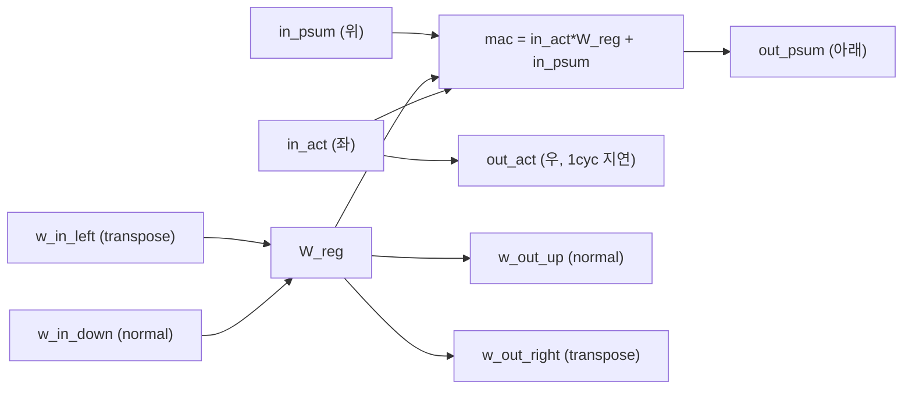
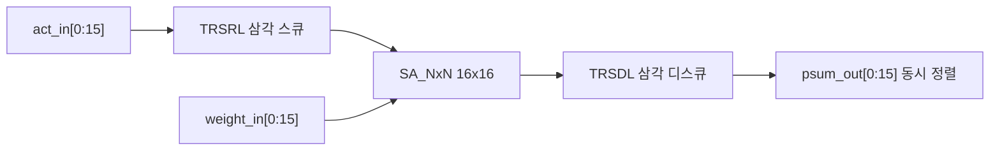
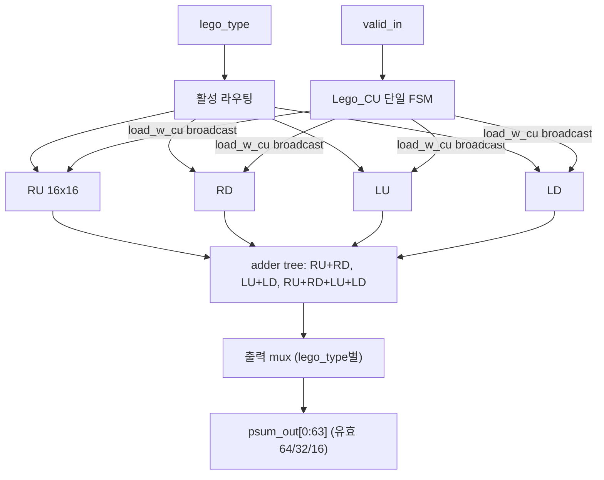
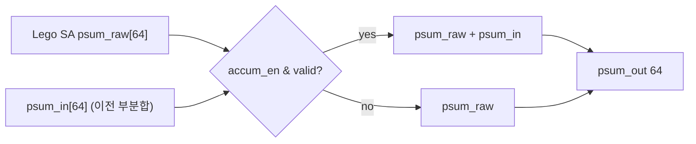
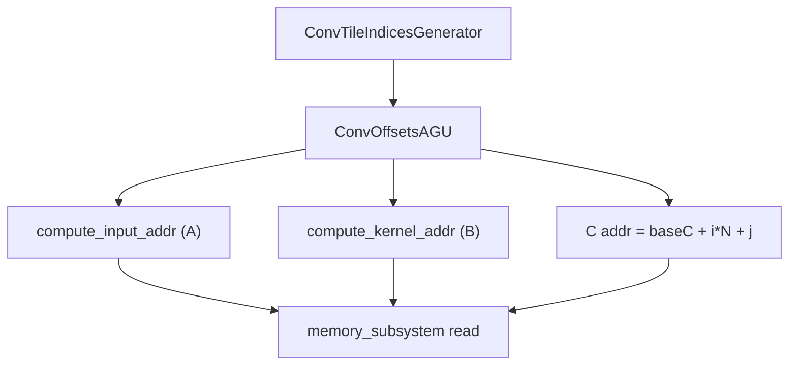
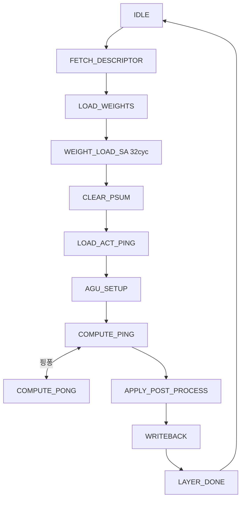
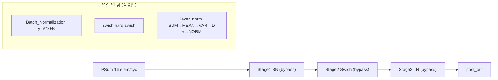
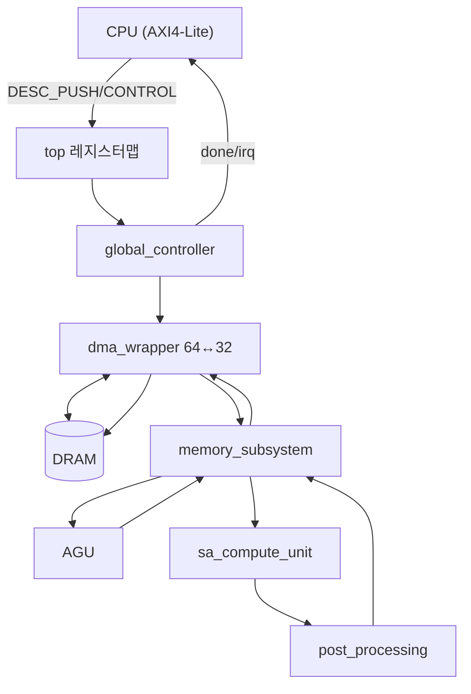

# MobileViT AI Hardware Accelerator — 모듈 통합 가이드 (H-RTL)

> 1차 요약(맥락): [`../MobileVit-AI-Hardware-Accelerator.md`](../MobileVit-AI-Hardware-Accelerator.md)
> 소스 루트: `REF/Transformer-Accel/MobileVit-AI-Hardware-Accelerator`. 본 가이드는 **`RTL/`** 핸드라이트 SystemVerilog를 정본으로, `Python modelling/`(골든모델)·`Include/`(패키지)를 보조 근거로 삼는다.
> 표기 규약: 라인으로 직접 확인한 사실은 단정, 코드 정황 기반은 "추정", 코드/문서에 없으면 "확인 불가".
> 제외물(이름만): `.git`, `Python modelling/Apple Pretrained Model/*.bin·*.h5`(사전학습 가중치), `*.xlsx`(문서 표), `*.txt`(시뮬 입출력 덤프 normalized_out/sa_out/rtl_bn_out 등), `cases.m`/`wave.do`(MATLAB/ModelSim 보조), `__pycache__`, 비트스트림/합성 산출물(리포에 없음), `Documentation/` 이미지.

---

## 0. 문서 머리말

### 0.1 대표 케이스 선정 + 근거
MobileViT는 한 코어가 **CNN(MobileNetV2 stem) + Transformer(self-attention)** 를 모두 처리하도록 설계됐다(`accelerator_common_pkg.sv` L64-77 `layer_type_t` 12종). 데이터플로우가 갈리므로 대표 케이스도 **두 개**를 함께 잡는다.

- **CNN/선형 대표(3×3 conv 한 타일)**: `global_controller.sv` L505-525 가 AGU/SA를 **`OP_REGULAR_CONV` + ker 3×3 + out_chs 16 + pad 1 + `SA_TYPE_16X64`** 로 하드코딩한다 — 즉 컨트롤러가 실제로 구동 가능한 유일한 시나리오가 단일 3×3 conv 타일이다. (확인됨, 동시에 한계)
- **Transformer/전치 대표(QKᵀ matmul)**: `PE.sv` L79-83·L107-108 의 `transpose_en` 가중치 로드 방향 전환(`w_in_down`↔`w_in_left`)이 attention의 Kᵀ를 하드웨어로 직접 표현. `descriptor_t.flags[FLAG_TRANSPOSE]`(common_pkg L121) → `sa_transpose_en`(global_controller L526)로 연결. (확인됨)

선정 근거: (1) 리포가 실제로 구동하도록 박아둔 단위(3×3 conv), (2) MobileViT 트랜스포머의 차별 연산(QKᵀ 전치). 두 케이스로 "weight-stationary CNN / attention matmul" 양 데이터플로우를 커버.

### 0.2 수치 표기 규약
- **MAC lanes**: 시스톨릭 어레이의 동시 곱셈기 수. 본 설계는 **4타일 × 16×16 PE = 1024 PE** 가 물리 한계이나, 어레이는 **weight-stationary(가중치 정지·활성 흐름)** 라 1 PE = 1 INT8 곱/사이클. `lego_type` 형상에 따라 출력 유효 폭이 64/32/16으로 변한다(`Lego_SA.sv` L19-58).
- **scalar MACs**: 대표 레이어의 출력좌표×K 곱(M·N·K). MobileViT 차원/하드코딩 타일 차원으로 환산.
- **loop trips / cycle**: 단일 matmul = `LOAD_W(N_TILE) → FEED_A(N_TILE) → DRAIN(N_TILE-1) → OUTPUT(N_TILE)` (`Lego_CU.sv` L20-37). N_TILE=16 → 한 16×16 배치 ≈ 63사이클.
- **memory size (payload bit)**: 뱅크 깊이×폭(bit). on-chip SRAM(ActA/ActB/Wgt/PSum) 4버퍼, 핑퐁은 ActA/ActB 더블버퍼.

### 0.3 운영 경로 (Python 골든 ↔ RTL ↔ host/SoC)
```
[modelling]   PyTorch MobileViT(MVT.py: MV2/LocalRep/Transformer, nn.SiLU) → no-API numpy(V2/V3)
        │     + LayerNorm float 골든(golden_model.py) → fixed-point 미러(layer_normalization_approximation.py)
        │
[host/CPU]    DRAM에 입력영상/가중치/BN파라미터 적재 → 256bit descriptor 작성 → AXI4-Lite DESC_PUSH → CONTROL.start
        │     (mobilevit_accelerator_top.sv L206-294, IMPLEMENTATION_GUIDE.md L232-290 의사코드)
        │
[controller]  global_controller 19-state FSM: FETCH_DESC → LOAD_WEIGHTS → WEIGHT_LOAD_SA → CLEAR_PSUM
        │     → LOAD_ACT_PING → AGU_SETUP → COMPUTE_PING ↔ (PONG 핑퐁) → APPLY_POST_PROCESS → WRITEBACK
        │
[datapath]    DMA(64↔32) → memory_subsystem(16뱅크) → AGU(im2col 주소) → Lego SA(4타일) → sa_compute_unit(누산)
        │     → post_processing_pipeline(BN→Swish→LN, 현재 bypass) → PSumBuf → DMA writeback → IRQ
```
근거: `mobilevit_accelerator_top.sv` L206-587, `global_controller.sv` L109-129·L505-526.

### 0.4 타깃 / 데이터타입 / mode 정책
- **타깃**: Xilinx **Zynq UltraScale+** FPGA, Vivado 합성, ModelSim/Vivado Sim/Verilator 시뮬, SystemVerilog IEEE 1800-2017(README.md L56-61). 합성 PPA 리포트 미동봉 → **확인 불가**. 설계 목표 400 MHz / ~100 GOPS(INT8) / 160 KB SRAM / <5W 는 모두 hand-calc(README.md L37-45) → **추정(미검증)**.
- **데이터타입**: SA = **INT8 활성 × INT8 가중치 → INT32 psum**(`accelerator_common_pkg.sv` L14-16). 후처리 모듈은 제각각: BatchNorm **Q8.8**(중간 Q16.16), Swish **Q8.8**, LayerNorm 입력 **Q24.8** / `std_dev_inv` Q4.28(k 홀수)·Q18.14(k 짝수)(root_final.sv 주석 L12). → **모듈별 Q포맷 비통일** (한계).
- **op_mode[1:0] 정책**: `OP_REGULAR_CONV(00)/OP_POINTWISE(01)/OP_DEPTHWISE(10)/OP_MATMUL(11)`(common_pkg L54-59). AGU가 모드별로 A/B 주소 함수를 분기(`ConvOffsetsAGU.sv` L182-287).
- **lego_type[1:0] 정책**(어레이 형상): `0=16×64`, `1=32×32`, `2=64×16`(`Lego_SA.sv` L19-58). 출력 유효 수 64/32/16. 형상이 메모리 활성 뱅크 수(16/8/4)와 연동(`memory_subsystem.sv` L120-127).
- **transpose_en**: `0`=가중치 하단 진입(normal), `1`=우측 진입(Kᵀ)(`PE.sv` L79-83).

---

## 1. Repo / Layer 개요

| 레이어 | 경로 | 역할 |
|---|---|---|
| **Include** | `Include/*.sv` | 패키지(타입/파라미터). `accelerator_common_pkg`(폭·버퍼·SA·descriptor·enum), `_matmul/_norm/_activation_pkg`. |
| **RTL/Control** | `RTL/Control/global_controller.sv` | 19-state 글로벌 FSM. DMA/AGU/SA/PP/핑퐁 오케스트레이션. |
| **RTL/DMA** | `RTL/DMA/dma_wrapper.sv` | AXI4 MM2S/S2MM DMA (64bit AXI ↔ 32bit mem). |
| **RTL/Memory Subsystem** | `RTL/Memory Subsystem/memory_subsystem.sv` | 16뱅크 SRAM(ActA/ActB/Wgt/PSum) + 핑퐁 + PSum RMW 누산. |
| **RTL/AGU** | `RTL/AGU/*.sv` | im2col 주소 생성(타일 iterator + 4모드 주소 함수). ST 교육과정 산출물. |
| **RTL/Compute** | `RTL/Compute/{sa_compute_unit,post_processing_pipeline}.sv` | SA 래퍼+누산 / BN→Swish→LN 파이프(현 bypass). |
| **RTL/Lego SA** | `RTL/Lego SA/{Lego SA, SA NxN}/*.sv` | 재구성형 LEGO 4타일 어레이 + 단일 NxN 자립형. PE/SA_NxN/TRSRL/TRSDL/CU. |
| **RTL/layer_normalization** | `RTL/layer_normalization/*.sv` | LayerNorm 데이터패스(SUM→MEAN→VAR→1/√→NORM). |
| **RTL/Batch Norm·Swish** | `RTL/Batch Norm/*.sv`, `RTL/Swish/*.sv` | y=A·x+B / hard-swish 시프트-합 근사. |
| **RTL** (top) | `RTL/mobilevit_accelerator_top.sv` | AXI Slave/Master + 전 서브모듈 인스턴스. |
| **Python modelling** | `Python modelling/**` | PyTorch/numpy MobileViT 모델 + LayerNorm 비트정확 골든. |

- 자체 RTL 모듈(SystemVerilog) 약 30+개. README 외 빌드 절차 문서는 IMPLEMENTATION_GUIDE.md 의존(다수 TODO 명시).

### 모듈 인스턴스 계층 (top → leaf)
```
mobilevit_accelerator_top.sv   (AXI4-Lite Slave 레지스터맵 + AXI4 Master DMA)
├─ global_controller.sv        (19-state FSM, descriptor 구동, 핑퐁 오케스트레이션)
├─ dma_wrapper.sv              (AXI MM2S/S2MM, 64↔32 변환)
├─ AGU.sv                      (주소 생성 상위)
│  ├─ ConvTileIndicesGenerator.sv   (타일 인덱스 iterator)
│  └─ ConvOffsetsAGU.sv             (4모드 A/B/C 주소 함수: HWC im2col, 대각 DW)
├─ memory_subsystem.sv         (16뱅크 SRAM, 핑퐁, PSum RMW)
├─ sa_compute_unit.sv          (LEGO SA 래퍼 + 타일 누산)
│  └─ [Lego_Systolic_Array]    ← ★인스턴스 결함: 실제 모듈은 Lego_SA (§N+말미)
│     └─ Lego_SA.sv            (4×16×16 타일 + 공유 CU + 라우팅/출력 mux)
│        ├─ Lego_CU.sv         (단일 공유 제어 FSM)
│        └─ L_SA_NxN_top.sv ×4 (RU/LU/RD/LD, 제어 없는 타일)
│           └─ TRSRL → SA_NxN → TRSDL
│              └─ PE.sv (16×16)
└─ post_processing_pipeline.sv (BN→Swish→LN, 현재 전 스테이지 bypass)
   ├─ [Batch_Normalization.sv] (standalone: y=A·x+B, 320채널 ROM)
   ├─ [swish.sv / swisharray.sv] (standalone: hard-swish 시프트-합)
   └─ [layer_normalization_top.sv] (standalone: SUM→MEAN→VAR→1/√→NORM)
      └─ standard_deviation_inv.sv → {root_1, root_2(256 LUT), root_final}
```
> `[ ]` 표기 = top/파이프에 **현재 연결되지 않은** standalone 검증 모듈(§3.5·말미 결함 참조).

### 제외 목록 (이름만)
`.git`, `Python modelling/Apple Pretrained Model/*.bin·*.h5`, `*.xlsx`, 시뮬 덤프 `*.txt`(normalized_out/sa_out/rtl_bn_out), `cases.m`/`wave.do`, `__pycache__`, `Documentation/` 이미지, 합성 산출물(부재).

---

## 2. PE — Weight-Stationary MAC 셀 (`Lego SA/.../PE.sv`)

### 2.1 역할 + 상위/하위
시스톨릭 어레이의 최소 단위. **가중치 1개를 정지(stationary)** 시키고 활성을 좌→우로 흘리며 매 사이클 1 MAC. 상위: `SA_NxN`(16×16 generate). 하위: 없음(레지스터+곱셈기).

### 2.2 데이터플로우


### 2.3 모듈 인스턴스 계층 / call stack
`Lego_SA` → `L_SA_NxN_top` → `SA_NxN` → `PE[i][j]`(16×16 generate). 가중치 로드 후 `PE[row][col]=W[row][col]` 보장(SA_NxN 헤더).

### 2.4 대표 코드 위치
`RTL/Lego SA/Lego SA/PE.sv`(LEGO 계열), 동명 `RTL/Lego SA/SA NxN/PE.sv`(자립형).

### 2.5 대표 코드 블록

(1) **전치(Kᵀ)를 가중치 로드 방향 전환으로** (`PE.sv` L76-83)
```systemverilog
always_ff @(posedge clk or negedge rst_n) begin
    if (!rst_n)                       W_reg <= '0;
    else if (load_w && !transpose_en) W_reg <= w_in_down;  // 아래→위 (normal)
    else if (load_w &&  transpose_en) W_reg <= w_in_left;  // 오른→왼 (transpose)
end
```
→ attention의 QKᵀ를 별도 전치 버퍼 없이 **가중치 적재 방향만 바꿔** 표현. MobileViT 트랜스포머 직대응 (확인됨).

(2) **풀폭 곱 + 누산, 활성/psum 파이프** (`PE.sv` L65-98, L107-108)
```systemverilog
assign mac_mul = in_act * W_reg;        // 2*DATA_W 폭(오버플로 방지)
assign mac_res = mac_mul + in_psum;
...
else if (!load_w) begin act_reg <= in_act; psum_reg <= mac_res; end  // FEED_A에서만
...
assign w_out_up    = (transpose_en==0) ? W_reg : '0;   // 비활성 방향 0
assign w_out_right = (transpose_en)    ? W_reg : '0;
```

### 2.6 마이크로아키텍처 + 정량
- **Stage 분해**: load 단계(가중치 래치) → feed 단계(`!load_w`에서 MAC + act 우향 1단 레지). 곱은 `2*DATA_W=16b`, 누산 32b.
- **정량**: 1 PE = INT8 1곱/사이클. 16×16 타일 = 256 PE = **256 INT8 MAC/cyc/타일**. 4타일 = **1024 INT8 MAC/cyc 물리 한계**. 단, weight-stationary skew(TRSRL/TRSDL) 때문에 16×16 배치 1회는 LOAD_W+FEED_A+DRAIN+OUTPUT ≈ 63사이클(§4.6).
- **병목**: 매 matmul마다 가중치 N_TILE=16 사이클 재적재(LOAD_W) → 가중치 더블버퍼링 부재 시 작은 K에서 오버헤드 비중↑.

---

## 3. SA_NxN / TRSRL / TRSDL — 16×16 메시 + 스큐 (`Lego SA/.../{SA_NxN,TRSRL,TRSDL}.sv`)

### 3.1 역할 + 상위/하위
- `SA_NxN`: 16×16 PE 그리드. act 좌→우, psum 상→하, 가중치 하→상(normal)/우→좌(transpose).
- `TRSRL`(입력 스큐): lane k를 k사이클 지연 → 대각 wavefront 정렬.
- `TRSDL`(출력 디스큐): 컬럼 j가 j사이클 늦게 완료되는 것을 보정해 N개 결과 동시 출력.
상위: `L_SA_NxN_top`(=TRSRL+SA_NxN+TRSDL). 하위: `PE`.

### 3.2 데이터플로우


### 3.3 모듈 인스턴스 계층 / call stack
`Lego_SA` → `L_SA_NxN_top`(×4) → `{TRSRL, SA_NxN, TRSDL}` → `SA_NxN` 내부 `PE[16][16]`.

### 3.4 대표 코드 위치
`RTL/Lego SA/Lego SA/{SA_NxN,TRSRL,TRSDL,L_SA_NxN_top}.sv`.

### 3.5 대표 코드 블록

(1) **삼각 시프트 레지스터 = 대각 wavefront 정렬** (TRSRL 헤더 L46-52)
- lane 0=직결, lane k=k개 레지스터 직렬. 총 레지스터 = N(N-1)/2 = 16·15/2 = **120 FF**(입력측). TRSDL은 psum 폭(32b)이라 같은 깊이에 폭만 큼.

(2) **컬럼 순서 mirror로 지연 평탄화** (`SA_NxN_top.sv` L124-130)
- TRSDL 전후 `psum[N-1-i]` 미러링 → 가장 지연 큰 컬럼을 레지스터 가장 많은 lane에 매핑(주석 명시).

### 3.6 마이크로아키텍처 + 정량
- **스큐 FF**: TRSRL 120 FF(8b) + TRSDL 120 FF(32b) / 타일. 4타일 ×2(in/out) → 입력 스큐 480 FF + 출력 4×120×32b.
- **레이턴시**: 16×16 배치 = LOAD_W 16 + FEED_A 16 + DRAIN 15 + OUTPUT 16 = **63사이클**(Lego_CU L126·L139·L153·L164).
- **병목**: TRSDL 32b 폭 스큐가 FF 비중 큼. 작은 타일에서 fill/drain(31사이클)이 유효 연산(16사이클) 대비 오버헤드.

---

## 4. LEGO 재구성형 어레이 — Lego_SA / Lego_CU (`Lego SA/Lego SA/`)

### 4.1 역할 + 상위/하위
이 프로젝트의 **차별 포인트**. 4개 16×16 타일(RU/LU/RD/LD)을 런타임에 3형상(16×64/32×32/64×16)으로 재구성. 단일 공유 CU가 4타일을 동기 제어. 상위: `sa_compute_unit`(인스턴스 결함, 말미). 하위: `Lego_CU` + `L_SA_NxN_top`×4.

### 4.2 데이터플로우


### 4.3 모듈 인스턴스 계층 / call stack
`sa_compute_unit` → `Lego_SA` → `Lego_CU`(1) + `L_SA_NxN_top`(4, 모두 단일 `load_w_cu`).

### 4.4 대표 코드 위치
`RTL/Lego SA/Lego SA/Lego_SA.sv`(라우팅·adder tree·타일 인스턴스), `Lego_CU.sv`(FSM).

### 4.5 대표 코드 블록

(1) **출력 adder tree 사전계산 + lego_type 별 mux** (`Lego_SA.sv` L130-138, L270-297)
```systemverilog
assign psum_add_left [g] = psum_RU[g] + psum_RD[g];                 // 좌쌍합
assign psum_add_right[g] = psum_LU[g] + psum_LD[g];                 // 우쌍합
assign psum_add_all  [g] = psum_RU[g]+psum_RD[g]+psum_LU[g]+psum_LD[g];
...
2'd0: { psum_out[0:15]=RU; [16:31]=LU; [32:47]=RD; [48:63]=LD; }     // 16x64 concat
2'd1: { psum_out[0:15]=psum_add_left; [16:31]=psum_add_right; }      // 32x32 쌍합
2'd2:   psum_out[0:15]=psum_add_all;                                 // 64x16 4-way합
```
→ 형상별로 PE 출력 결합을 다르게 해 한 어레이를 3 행렬형상에 재사용 (확인됨).

(2) **단일 공유 CU 설계의도 — 위상 오프셋 제거** (`Lego_CU.sv` L8-14)
```
// Why a single shared CU:
//   When each tile had its own SA_CU, ... start pulse consumed one
//   valid cycle before the inner LOAD_W ... causing a permanent
//   phase offset ... A single external CU drives load_w directly.
```
→ 타일별 FSM의 start-pulse 오프셋 문제를 명시적으로 인지·제거. **잘 정리된 설계 결정** (확인됨).

(3) **활성 라우팅 — 형상별 broadcast/분할/독립** (`Lego_SA.sv` L223-254)
```systemverilog
if (!load_w_cu && valid_in) case (lego_type)
  2'd0: 4타일 모두 act_in[0:15]           // broadcast
  2'd1: RU,LU=act_in[0:15]; RD,LD=[16:31] // 상/하 절반
  2'd2: 4타일 각각 독립 16슬라이스          // 64x16
```

### 4.6 마이크로아키텍처 + 정량
- **Stage 분해**(Lego_CU L17): IDLE→LOAD_W(16,valid stall 가능)→FEED_A(16,stall 가능)→DRAIN(15,자율)→OUTPUT(16,자율).
- **메모리/재사용**: 가중치 4등분 고정 배선(L187-199), caller가 lego_type별 배치 책임(헤더 L167-183 cycle별 규칙). `y_input_size`는 가변 FEED_A용 예약이나 **현재 항상 16사이클 고정**(Lego_CU L28-29) — 미사용.
- **정량**: 형상별 동시 INT8 MAC = 타입0 1024(전 PE) / 타입1 1024(32×32 논리) / 타입2 1024(64×16 논리) — 물리 PE는 항상 1024이나 출력 유효폭만 64/32/16. 단일 16×16 배치 63사이클(§3.6).
- **병목**: 어떤 형상이든 LOAD_W 16사이클 가중치 재적재가 선행 → 가중치 재사용 낮은 attention(매 head matmul)에서 오버헤드. 단일 CU가 4타일을 묶어 stall도 동기 → 한 타일이 데이터 부족 시 전체 freeze.

---

## 5. SA Compute Unit (`Compute/sa_compute_unit.sv`)

### 5.1 역할 + 상위/하위
LEGO SA를 감싸 **C_in>16 다중 타일 누산** 제공. 상위: top. 하위: (의도상) Lego SA + generate 누산기.

### 5.2 데이터플로우


### 5.3 모듈 인스턴스 계층 / call stack
top → `sa_compute_unit` → `Lego_Systolic_Array`(★결함) → (의도) `Lego_SA`.

### 5.4 대표 코드 위치
`RTL/Compute/sa_compute_unit.sv`.

### 5.5 대표 코드 블록

(1) **타일 누산 (RMW의 SA측 절반)** (`sa_compute_unit.sv` L72-83)
```systemverilog
for (i=0;i<SA_SIZE;i++) always_comb
  if (accum_en && sa_valid_raw) psum_out[i] = sa_psum_raw[i] + psum_in[i];
  else                          psum_out[i] = sa_psum_raw[i];
```

(2) **★인스턴스 결함 — 존재하지 않는 모듈/포트** (`sa_compute_unit.sv` L51-65)
```systemverilog
Lego_Systolic_Array #(.DATA_W(ACT_WIDTH), .DATA_W_OUT(PSUM_WIDTH)) u_lego_sa (
    ..., .TYPE_Lego(sa_type), .load_w(load_weights), ... );   // ← 모듈명/포트 불일치
```
실제 모듈명은 `Lego_SA`(Lego_SA.sv L74), 포트는 `lego_type`(L85)이며 `y_input_size`(L86) 요구. → **그대로는 elaborate 불가** (확인됨, §N+말미).

### 5.6 마이크로아키텍처 + 정량
- `done`은 현재 `valid_out` 단순 통과(L88-93, 사이클 카운터 보강 TODO).
- 누산 폭 INT32 × 64레인. SA_SIZE=64 전부 generate.
- **병목**: 다중 C_in 타일 누산이 memory_subsystem RMW(§7)와 분리돼 두 곳에서 누산 — 단일 경로 일원화 필요.

---

## 6. AGU — im2col 주소 생성 (`AGU/Components/ConvOffsetsAGU.sv`)

### 6.1 역할 + 상위/하위
ST 교육과정 산출물(헤더). 타일 내 A(활성)/B(가중치)/C(출력) 주소 스트림을 4모드(REGULAR/PW/DW/MATMUL)로 on-the-fly 생성. 상위: `AGU`(+ `ConvTileIndicesGenerator`). 하위: 순수 조합 함수.

### 6.2 데이터플로우


### 6.3 모듈 인스턴스 계층 / call stack
top → `AGU` → `{ConvTileIndicesGenerator, ConvOffsetsAGU}`.

### 6.4 대표 코드 위치
`RTL/AGU/Components/ConvOffsetsAGU.sv`.

### 6.5 대표 코드 블록

(1) **HWC 레이아웃 on-the-fly im2col** (`ConvOffsetsAGU.sv` L143-150)
```systemverilog
function input_offset(h, w, c);
  input_offset = baseA + ((h * act_W + w) * act_CIN + c);   // HWC
endfunction
```

(2) **DWConv를 systolic matmul로 — 대각 읽기 sparsity 트릭** (`ConvOffsetsAGU.sv` L259-277)
```systemverilog
OP_DEPTHWISE: begin
  virtual_row = k_global_val; virtual_col = j_global_val;
  if (virtual_row >= (virtual_col*kernel_size) &&
      virtual_row <  ((virtual_col+1)*kernel_size)) begin
    compute_kernel_addr = baseB + (virtual_col*kernel_size + (virtual_row - virtual_col*kernel_size));
  end else compute_kernel_addr = NULL_ADDR;   // 대각 외 = null
end
```
→ DW conv(채널독립)를 가상 블록대각 행렬로 보고 대각만 유효 주소·나머지 NULL_ADDR. MobileViT MV2 블록의 DWConv 직대응 (확인됨).

### 6.6 마이크로아키텍처 + 정량
- 파생치(L100-122): `out_H/out_W = ((act + 2·pad - K_eff)/stride)+1`, `K_block = ker_H·ker_W`.
- FSM IDLE→GEN_A→GEN_B→GEN_C→TILE_DONE, `read_req` 게이팅·stall. 출력 1사이클 레지스터.
- **loop trips**: 타일당 주소 스트림 = eTM·eTN·eTK 순회(타일 차원 곱). MATMUL은 `A=baseA+i·K+k`, `B=baseB+k·N+j`(L185·L256).
- **병목**: 함수 내 `/`·`%`(L190-217)가 다수 — 합성 시 divider 추론, 차원이 2의 거듭제곱이 아니면 면적/지연 증가 (추정).

---

## 7. 메모리 서브시스템 (`Memory Subsystem/memory_subsystem.sv`)

### 7.1 역할 + 상위/하위
16뱅크 SRAM 4버퍼(ActA/ActB/Wgt/PSum) + 핑퐁 + PSum 누산 RMW. 상위: top. 하위: BRAM 배열.

### 7.2 데이터플로우
```mermaid
flowchart LR
  DMA["DMA 32b write"] -->|bank=waddr[3:0]| BANKS["16 banks × 32b"]
  PP[ping_pong_sel] --> SEL{ActA / ActB}
  AGU["agu_addr_A/B"] --> SEL
  SEL --> UNP["16×32b → 64×8b 언팩"]
  UNP --> SA["data_to_sa_act/wgt[64]"]
  SAW["psum_wdata[16]"] --> RMW{"accum_mode? +기존 : fresh"}
  RMW --> PSUM[PSumBuf 16뱅크×4096]
```

### 7.3 모듈 인스턴스 계층 / call stack
top → `memory_subsystem` (leaf, BRAM generate).

### 7.4 대표 코드 위치
`RTL/Memory Subsystem/memory_subsystem.sv`.

### 7.5 대표 코드 블록

(1) **형상별 활성 뱅크 수 가변** (`memory_subsystem.sv` L120-127)
```systemverilog
case (sa_type)
  2'b00: num_banks_active = 16;  // 16×64 → 64 elem
  2'b01: num_banks_active = 8;   // 32×32 → 32 elem
  2'b10: num_banks_active = 4;   // 64×16 → 16 elem
endcase
```
→ LEGO 형상에 맞춰 메모리 대역폭 가변. 비활성 뱅크 0출력(L142-146).

(2) **PSum RMW 누산 + clear (합성성 우려)** (`memory_subsystem.sv` L207-223)
```systemverilog
if (clear_psum)
  for (j=0;j<NUM_BANKS;j++) for (n=0;n<PSUMBUF_BANK_DEPTH;n++)
     PSumBuf_banks[j][n] <= '0;          // 16×4096 = 65536워드 1사이클 0클리어
else if (psum_wen) for (k=0;k<16;k++)
  if (accum_mode) PSumBuf_banks[..] <= PSumBuf_banks[..] + psum_wdata[k];  // RMW
  else            PSumBuf_banks[..] <= psum_wdata[k];
```
→ `clear_psum` 1사이클 전체 0클리어는 BRAM 매핑 불가(거대 reset fanout) — 학생 프로젝트 단순화 (확인됨, 합성성 우려).

### 7.6 마이크로아키텍처 + 정량
- **메모리(payload bit)**: ActBufA/B 각 `16뱅크 × 2048워드 × 32b = 1,048,576 bit = 128 KB`(2버퍼 합 256 KB)(L4·L73-74). WgtBuf `16×2048×32 = 128 KB`(L75). PSumBuf `16뱅크 × 4096워드 × 32b = 2,097,152 bit = 256 KB`(L6·L76). → 합 ~640 KB 어레이(README 목표 160 KB와 불일치 — 추정: 목표는 ActBuf 한쪽 기준).
- **대역폭**: 16뱅크 × 32b = 한 사이클 64×8b 활성+64×8b 가중치 공급(L152-167 언팩).
- **병목**: PSumBuf RMW read-modify-write가 단일 포트 BRAM에서 read+add+write 1사이클 — 합성 시 분리 필요. clear_psum fanout(상기).

---

## 8. Global Controller (`Control/global_controller.sv`) — 메인 FSM

### 8.1 역할 + 상위/하위
19-state FSM. descriptor 구동, 가중치/활성 로드, 핑퐁, 후처리 인에이블, writeback 오케스트레이션. 상위: top. 하위: 전 데이터패스 제어.

### 8.2 데이터플로우


### 8.3 모듈 인스턴스 계층 / call stack
top → `global_controller`(leaf FSM, 데이터패스로 제어선 fanout).

### 8.4 대표 코드 위치
`RTL/Control/global_controller.sv`.

### 8.5 대표 코드 블록

(1) **★멀티타일 루프 미동작 — total_tiles 하드코딩** (`global_controller.sv` L446-448)
```systemverilog
// Calculate total tiles based on dimensions
// For simplicity, assume sequential tiling
total_tiles <= 1;  // Will be computed based on layer params
```
→ `is_last_tile=(tile_count==total_tiles-2)`(L476)이 항상 즉시 성립 → **단일 타일만 실행**, 멀티타일 핑퐁 실질 미동작 (확인됨).

(2) **★AGU/SA 전부 상수 — 레이어별 동적 구성 미구현** (`global_controller.sv` L505-525)
```systemverilog
assign agu_op_mode = OP_REGULAR_CONV;  // TODO: derive from descriptor
assign agu_ker_H   = 16'd3; agu_ker_W = 16'd3;  // Default 3x3
assign agu_out_chs = 16'd16; agu_padding = 16'd1;
assign agu_baseC   = 32'h0001_0000;
assign sa_type     = SA_TYPE_16X64;    // Default 16x64
```
→ op_mode/커널/출력채널/패딩/형상 전부 상수 → **단일 3×3 conv 시나리오만 사실상 구동**. descriptor의 layer_type/op_mode가 AGU로 전달되지 않음 (확인됨).

### 8.6 마이크로아키텍처 + 정량
- 가중치 로드 `weight_load_cycles≥32`(WEIGHT_LOAD_SA L459-462). 핑퐁 `mem_ping_pong_sel=ping_active`, `mem_accum_mode=!is_first_tile`(첫 타일 후 누산).
- 후처리 인에이블 APPLY_POST_PROCESS에서 `descriptor.flags`로 BN/Swish/LN 구동(설계상).
- **병목/리스크**: total_tiles=1·AGU 상수로 멀티레이어 자동 시퀀싱 부재 → **레이어 시퀀서/디스크립터 컴파일러(Python tiler) 미구현**(IMPLEMENTATION_GUIDE.md TODO).

---

## 9. 후처리 — Post-Processing Pipeline / BN / Swish / LayerNorm

### 9.1 역할 + 상위/하위
PSum을 **BN→Swish→LN** 으로 정규화·활성. `post_processing_pipeline.sv`가 파이프 의도이나 **현재 전 스테이지 bypass**. 실제 연산 모듈(Batch_Normalization/swish/layer_normalization_top)은 standalone으로만 검증, 파이프 미연결. 상위: top. 하위: 개별 연산 모듈(현재 미인스턴스).

### 9.2 데이터플로우


### 9.3 모듈 인스턴스 계층 / call stack
top → `post_processing_pipeline`(bypass). standalone: `layer_normalization_top` → `standard_deviation_inv` → `{root_1, root_2, root_final}`.

### 9.4 대표 코드 위치
`RTL/Compute/post_processing_pipeline.sv`, `RTL/Batch Norm/Batch_Normalization.sv`, `RTL/Swish/swish.sv`, `RTL/layer_normalization/{layer_normalization_top, standard_deviation_inv, root_2, root_final, NORMALIZATION_OUT}.sv`.

### 9.5 대표 코드 블록

(1) **hard-swish 시프트-합 1/6 근사 (DSP-free 나눗셈)** (`swish.sv` L17-49)
```systemverilog
assign relu6_val = (x+CONST_3 < 0) ? 0 : (x+CONST_3 > CONST_6) ? CONST_6 : x+CONST_3;
assign product   = x * relu6_val;
// 1/6 ≈ 2^-3 + 2^-5 + 2^-7 + 2^-9 + 2^-11 + 2^-13
assign sum_approx = (product>>>3)+(product>>>5)+(product>>>7)
                  +(product>>>9)+(product>>>11)+(product>>>13);
assign y = sum_approx[WIDTH+FRACT_BITS-1 : FRACT_BITS];   // Q8.8
```
→ `y ≈ x·ReLU6(x+3)·(1/6)`. PyTorch `nn.SiLU`(MVT.py L26)를 **hard-swish로 대체** — 정확도 trade-off (확인됨, 근사).

(2) **rsqrt 256엔트리 LUT 초기값** (`root_2.sv` L18, L31-32)
```systemverilog
assign lut_index = m[15:8];           // 가수 상위 8b
case (lut_index)
  8'h00: y0_1 = 16'h3FF0; // 1/sqrt(1.0020)  (Q2.14)
  ... 8'hFF: y0_1 = 16'h2D47; // 1/sqrt(1.998)
```
→ `1/√var` = root_1(2^k·m 분해) → root_2(LUT y0) → root_final(√2 보정·시프트). 표준 부동소수 rsqrt의 "지수 반감+가수 LUT"를 고정소수점 단발로 구현. `accelerator_norm_pkg.SQRT_ITERATIONS=4`(Newton-Raphson 의도)와 달리 **NR 반복 없음** (확인됨, 패키지 의도와 상이).

(3) **rsqrt 3단 체인 인스턴스** (`standard_deviation_inv.sv` L23-67)
```systemverilog
root_1 uut1 (.vari, .k, .m, .root_1_out_valid);          // MSB 탐색 → 2^k·m
root_2 uut2 (.root_2_in_en(root_1_out_valid), .y0_1);    // 256 LUT
root_final uut3 (.root_final_in_en(root_2_out_valid), .y0_1, .k, .std_dev_inv);  // √2 보정
```

### 9.6 마이크로아키텍처 + 정량
- **BN**: `y=A·x+B`(Q8.8, 중간 Q16.16), A/B 320엔트리 ROM(`channel_base` N=32씩 진행 wrap) → 최대 320채널(MobileViT XXS 대응 추정)(Batch_Normalization.sv L11-12, L30-42).
- **Swish**: scalar 1개당 6 시프트+가산, swisharray N=4 병렬(미연결).
- **LayerNorm**: ELEMENTS_SUM = log2(N) 사이클 adder tree. MEAN/VARI = 산술우시프트 ÷N(EMBED_DIM=2^n 전제). rsqrt 3단 ~수사이클. `golden_model.py`↔`layer_normalization_approximation.py`↔RTL **비트정확 매핑**(approximation.py L31-72 ↔ root_1/root_final/NORMALIZATION_OUT) (확인됨).
- **병목/리스크**: 파이프 전 스테이지 bypass(post_processing_pipeline.sv L62-169) → top BN 파라미터 상수 결선(mean=0/var=1/γ=1/β=0)으로 항등(top L582-587). **현재 후처리 무동작**.

---

## 10. Top + DMA (`mobilevit_accelerator_top.sv`, `DMA/dma_wrapper.sv`)

### 10.1 역할 + 상위/하위
AXI4-Lite Slave(레지스터맵) + AXI4 Master(DMA) + 전 서브모듈 인스턴스. 하위: §2~§9 전부.

### 10.2 데이터플로우


### 10.3 모듈 인스턴스 계층 / call stack
`mobilevit_accelerator_top` → `{global_controller, dma_wrapper, AGU, memory_subsystem, sa_compute_unit, post_processing_pipeline}`(L304-587).

### 10.4 대표 코드 위치
`RTL/mobilevit_accelerator_top.sv`(레지스터맵 L206-271, descriptor 패킹 L283-294, MVP 단순화 L525-587), `RTL/DMA/dma_wrapper.sv`.

### 10.5 대표 코드 블록
- **레지스터맵**: 0x00 CONTROL / 0x04 STATUS / 0x10~0x2C DESC_DATA[8] / 0x30 DESC_PUSH / 0x34 TILE_CNT / 0x38 CYCLE_CNT(top L206-271). descriptor 8워드→256bit 패킹(L283-294).
- **MVP 단순화**(top L525-537, L563): memory는 16×32b psum 제공하나 SA는 64기대 → 첫 16개만 사용, 16~63 0패딩. SA 출력 64 중 첫 16만 후처리 전달.
- **DMA 64↔32**: read 시 64b AXI 1beat→2×32b 분할; write 시 32b mem을 `{mem_rdata,mem_rdata}` 복제(dma_wrapper.sv L323) — 상하위 동일 복제(단순화).

### 10.6 마이크로아키텍처 + 정량
- DMA 버스트 INCR, awsize/arsize=64b, BURST_LEN=16beat(=128B).
- **병목/리스크**: top이 §5 결함 모듈(`sa_compute_unit`)을 인스턴스화 → elaborate 불가. psum 폭 16(mem) vs 64(SA) 불일치를 0패딩으로 봉합(연산 1/4만 유효).

---

## N+1. 한눈 요약 표

| 모듈 | 핵심 역할 | 대표 정량 | 근거(파일:라인) |
|---|---|---|---|
| PE | weight-stationary INT8 MAC, 전치 지원 | 1곱/cyc, 16b 곱·32b 누산 | PE.sv L65-83, L107-108 |
| SA_NxN+TRSRL/TRSDL | 16×16 메시 + 대각 스큐 | 256 MAC/cyc/타일, 배치 63cyc | SA_NxN_top.sv L124-130, Lego_CU L126-164 |
| Lego_SA/Lego_CU | 4타일 3형상 재구성 + 단일 CU | 1024 PE, 유효 64/32/16 | Lego_SA.sv L19-58, L130-138, L270-297 |
| sa_compute_unit | 타일 누산 + (★결함 인스턴스) | INT32×64 누산 | sa_compute_unit.sv L51-65, L72-83 |
| ConvOffsetsAGU | im2col 주소(HWC, 대각 DW) | 타일당 eTM·eTN·eTK 순회 | ConvOffsetsAGU.sv L143-150, L259-277 |
| memory_subsystem | 16뱅크 SRAM, 핑퐁, RMW | ActA/B 256KB·Wgt 128KB·PSum 256KB | memory_subsystem.sv L2-7, L73-76, L120-127, L207-223 |
| global_controller | 19-state FSM 오케스트레이션 | (★) total_tiles=1, AGU 상수 | global_controller.sv L448, L505-525 |
| swish | hard-swish 시프트-합 1/6 | 6 시프트+가산, Q8.8 | swish.sv L17-49 |
| LayerNorm/rsqrt | SUM→MEAN→VAR→1/√→NORM | 256 LUT, log2(N) adder tree | root_2.sv L31, standard_deviation_inv.sv L23-67 |
| top + DMA | AXI Slave/Master 통합 | psum 16 유효(64 중) | top L525-563, dma_wrapper.sv L323 |

**전 모듈 정적 정량 요약**:
- **MAC lanes**: 물리 4타일 × 16×16 = **1024 INT8 MAC/cyc**(파라미터: `Lego_SA` N_TILE=16 × 4타일, `SA_ROWS/COLS=16` common_pkg L30-31).
- **scalar MACs(대표 3×3 conv)**: out 16×16(타일) × K(=3·3·c_in) — 컨트롤러 하드코딩 out_chs=16/ker3×3(global_controller L509-511) 기준 출력 256 × 가중치 9·c_in.
- **loop trips/cycle**: 단일 16×16 matmul = 16+16+15+16 = **63사이클**(Lego_CU). 멀티타일 루프는 total_tiles=1로 미동작.
- **memory(bit)**: ActBufA/B 각 1,048,576 bit, WgtBuf 1,048,576 bit, PSumBuf 2,097,152 bit(memory_subsystem.sv L73-76).
- **합성 PPA**: 리포트 미동봉 → **확인 불가**. 400MHz/100GOPS/<5W는 hand-calc(README.md L45).

---

## N+2. 읽기 · 코드추적 순서 (추천)

1. `Include/accelerator_common_pkg.sv` — 폭/버퍼/SA 파라미터, `layer_type_t`·`op_mode_t`·`sa_type_t`·`descriptor_t`. (전 모듈 어휘)
2. `RTL/Lego SA/Lego SA/PE.sv` → `SA_NxN.sv` → `TRSRL/TRSDL.sv` — 연산 최소 단위·스큐.
3. `Lego_SA.sv` + `Lego_CU.sv` — 재구성 형상·단일 CU 위상정합(설계 하이라이트).
4. `AGU/Components/ConvOffsetsAGU.sv` — 4모드 주소·대각 DW(데이터 공급).
5. `Memory Subsystem/memory_subsystem.sv` — 뱅킹·핑퐁·RMW.
6. `Control/global_controller.sv` — 오케스트레이션(여기서 하드코딩/TODO 다수 확인).
7. `layer_normalization/standard_deviation_inv.sv`(+root_2) / `Swish/swish.sv` — DSP-free 비선형.
8. `Compute/{sa_compute_unit, post_processing_pipeline}.sv` + `mobilevit_accelerator_top.sv` — **통합층(결함 집중 구간)**.
9. `Python modelling/layer_normalization_golden_model/*.py` — RTL 비트정확 골든 검증.

---

## N+3. 병목 · 병렬도 노브

| 노브 | 위치 | 효과 / 트레이드오프 |
|---|---|---|
| `N_TILE`(타일 크기) | Lego_SA/Lego_CU 파라미터 | PE 수·배치 사이클·스큐 FF 동시 증가. 16 기본. |
| `lego_type`(형상) | Lego_SA L19-58 | 행렬형상 매칭으로 PE 활용률↑. 단 LOAD_W 오버헤드 불변. |
| 가중치 더블버퍼 | (부재) | 매 matmul N_TILE LOAD_W 제거 가능 — 현재 없음(고처리량 핵심 개선점). |
| `num_banks_active` | memory_subsystem L120-127 | 형상별 대역폭 16/8/4뱅크. 메모리 전력 절감. |
| PSum RMW 포트 | memory_subsystem L207-223 | RMW 1사이클 → 합성 시 2-port 분리 필요(병목). |
| post-proc 파이프 연결 | post_processing_pipeline | 현재 bypass — 연결 시 BN/Swish/LN 활성(미완). |
| 멀티타일 루프 | global_controller L448 | total_tiles 동적 계산 필요 — 현 미동작(최우선 결함). |

---

## (말미) Top 통합 결함 · 리스크 (재확인)

> 1차 요약에서 지적된 결함을 **코드 라인으로 재확인**.

1. **★존재하지 않는 모듈/포트 인스턴스 (elaborate 불가)** — `sa_compute_unit.sv` L51-65 가 `Lego_Systolic_Array` 를 `.TYPE_Lego(sa_type)` 포트로 인스턴스화. 실제 모듈은 `Lego_SA`(Lego_SA.sv L74), 포트는 `.lego_type`(L85)이며 `.y_input_size`(L86) 필수. top이 이 모듈을 인스턴스(top L304-587)하므로 **현 코드 그대로 top elaborate 불가**. (재확인 완료)

2. **★NUM_BANKS 불일치 (4 vs 16)** — `accelerator_common_pkg.sv` L24 `NUM_BANKS=4` vs `memory_subsystem.sv` L2 기본 파라미터 `NUM_BANKS=16`. 모듈 내부는 16뱅크 전제로 동작(L73-76, L91 `dma_waddr[3:0]`=4비트 뱅크선택, L122 `num_banks_active=16`). 패키지 상수는 미사용·오인 소지. (재확인 완료, 불일치)

3. **멀티타일 루프 미동작** — `global_controller.sv` L448 `total_tiles<=1`(주석 "Will be computed") → 핑퐁/누산 루프 실질 단일 타일. (재확인)

4. **AGU/SA 레이어별 동적 구성 미구현** — `global_controller.sv` L505-525 op_mode/ker3×3/out16/pad1/baseC/sa_type 전부 상수(주석 "TODO derive from descriptor"). descriptor의 layer_type가 AGU로 전달 안 됨. (재확인)

5. **후처리 전 스테이지 bypass** — `post_processing_pipeline.sv` L62-169 BN/Swish/LN 모두 pass-through, top BN 파라미터 상수 결선(top L582-587). 개별 모듈(BN/Swish/LN)은 standalone만 검증. (재확인)

6. **합성성 우려** — `clear_psum` 16×4096워드 1사이클 0클리어(memory_subsystem L207-213, 거대 reset fanout) / PSum RMW 단일포트 read+add+write 1사이클(L221-223) / DMA 64b 상하위 복제(dma_wrapper L323). (재확인)

7. **근사·포맷 리스크** — hard-swish가 SiLU 대체(swish.sv L17-49 ↔ MVT.py L26), rsqrt 단발 LUT(NR 미적용, norm_pkg SQRT_ITERATIONS=4와 상이), 모듈별 Q포맷 비통일(INT8/Q8.8/Q24.8). 전체 망 end-to-end 골든은 LayerNorm에만 존재(나머지 **확인 불가**).

---

*결론: 본 repo는 "잘 설계된 블록 IP(LEGO SA·LayerNorm rsqrt·BN·Swish·AGU) + 미완 통합층(top/controller/post-pipe)" 구조. 블록 단위 재사용 가치(특히 단일 CU 위상정합, DSP-free 비선형, 대각 DW 매핑)는 높으나, 인스턴스 이름/포트 불일치·멀티타일 미동작·후처리 bypass 때문에 **현 코드 그대로는 MobileViT end-to-end 추론 불가**.*
