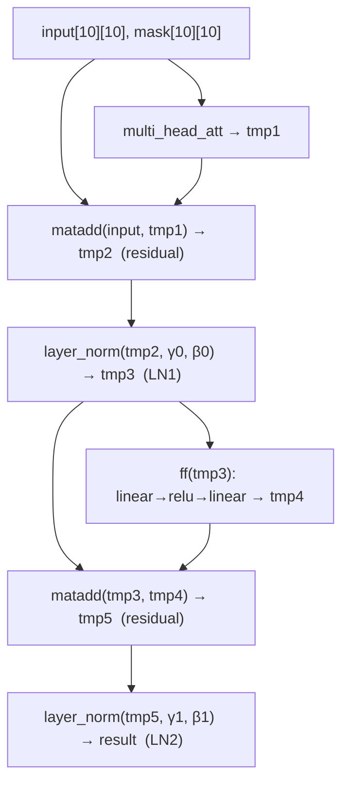
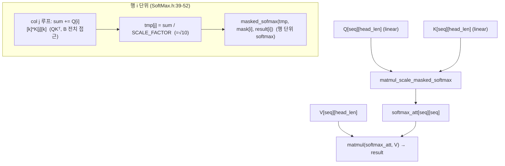
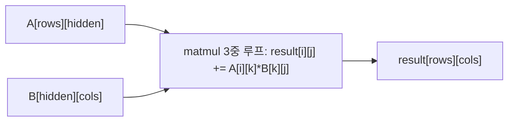
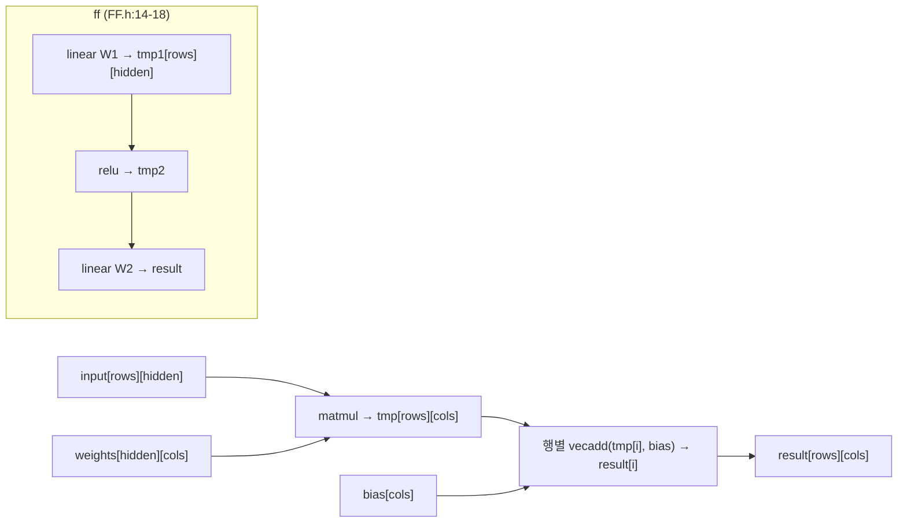
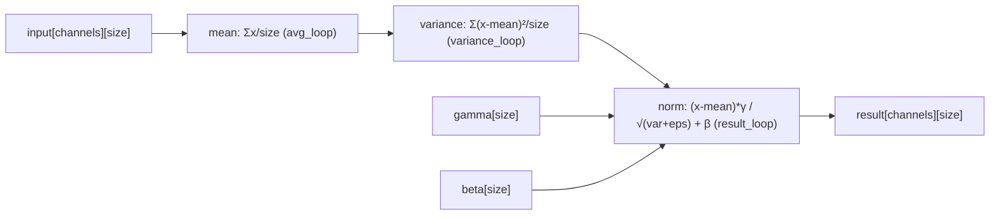
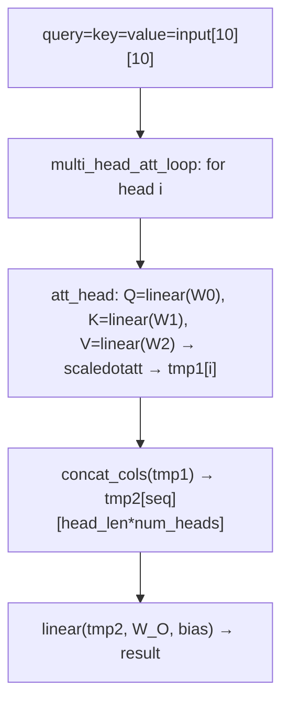

# Transformer_dataflow 모듈 통합 가이드

> 1차 요약(맥락): [`../Transformer_dataflow.md`](../Transformer_dataflow.md)
> 소스 루트: `REF/Transformer-Accel/Transformer_dataflow`. 구현 전체가 **Vitis HLS C++ 템플릿 헤더 라이브러리**(단일 합성 top `accel`). RTL 자체 소스 없음(IP 카탈로그 export는 `hls_exec==2`일 때만, 현재 비활성).
> 표기 규약: 라인으로 직접 확인한 사실은 단정, 코드 정황 기반은 "추정", 코드/문서에 없으면 "확인 불가".
> 제외물(이름만): `.git/`(버전관리 메타), `.gitignore`/`.gitattributes`(빌드 무시 규칙), `Transformer_accel/`(Vitis HLS 합성 산출 디렉토리, 미존재), `input1~12.txt`·`golden_result.txt`·`log.txt`(`TestFilesGenerator.py` 런타임 생성물, 미커밋), Vitis 표준 헤더 `ap_fixed.h`·`hls_math.h`(벤더), `Transformer_dataflow.sln`/`.vcxproj`/`.filters`(VS 디버깅용 산출). `Tests/Test.h`(인클루드 허브, 내용 미열람 — 확인 불가).

---

## 0. 문서 머리말

### 0.1 대표 케이스 선정
Transformer_dataflow는 **Post-LN Transformer 인코더 1개 레이어**를 단일 합성 top `accel`(`Accel.cpp:4`)이 한 번에 실행한다. Edge-MoE처럼 패리티 분기·시분할이 없고, 함수 호출 트리가 그대로 데이터플로우 그래프다(`Encoder.h:7`). 대표 케이스는 **두 개**를 잡는다.

- **인코더 전체 대표 (e2e)**: `accel → encoder<idata_t, NUM_HEADS=1, SEQ_LEN=10, TOKEN_LEN=10, HEAD_LEN=10, HIDDEN=10>`(`Accel.cpp:20`, `Definitions.h:5-9`). MHA → residual → LN1 → FFN → residual → LN2 의 6단계 순차 데이터플로우(`Encoder.h:24-47`). 합성 대상이자 testbench가 검증하는 유일한 경로(`TestBenchAccel.cpp:23-78`).
- **융합 커널 대표 (핵심 최적화)**: `matmul_scale_masked_softmax`(`SoftMax.h:32-53`). QKᵀ → /√d → mask → 행단위 softmax를 **한 함수로 융합**해 score 행렬 `[SEQ][SEQ]`를 한 행씩만 보관(`SoftMax.h:41`의 `T tmp[cols]`). attention 경로의 유일한 명시적 dataflow 친화 패턴(`ScaledDotAtt.h:17`에서 호출).

선정 근거: (1) 인코더 e2e가 합성·검증의 단일 진실원천이므로 데이터플로우 전체를 한 번에 추적 가능, (2) 융합 커널이 본 repo의 유일한 의도적 메모리 절감 설계로, 우리 ViT attention 블록에 차용할 패턴.

### 0.2 수치 표기 규약
- **MAC lanes**: 한 사이클 동시 곱셈기 수 = unroll 적용 루프의 곱. **본 repo의 GEMM·attention 루프에는 UNROLL/PIPELINE 프라그마가 없다**(`MatMul.h:2-15`, `SoftMax.h:39-52`) → MAC lanes는 합성기 디폴트에 의존, **코드 레벨 명시 lanes = 1(직렬 누산)**. UNROLL이 붙은 곳은 `VecAdd.h:6`, `Scale.h:13`, `Transpose.h:6,9`뿐(bias/scale/전치).
- **scalar MACs**: 대표 GEMM의 (rows)×(cols)×(hidden) 곱. 대표 케이스 차원은 모두 10(`Definitions.h:6-9`).
- **loop trips / cycle**: 루프 bound 곱. 프라그마 없는 3중 루프는 trips = 그대로 직렬 사이클 하한(II 미정, 합성기 의존).
- **memory size (payload bit)**: 온칩 버퍼 깊이×폭. 본 repo는 **모든 텐서가 함수 로컬 배열**(`hls::stream`·AXI master 부재) → 합성 시 BRAM/레지스터. 데이터타입 `double`(`Definitions.h:13-14`) = **64bit/요소**.

### 0.3 운영 경로 (소스 ↔ top ↔ 골든 ↔ 검증)
```
[골든 생성]   PyTorch nn.functional (encoder 전체 재현) → input1~12.txt + golden_result.txt
        │     (가중치는 HLS 레이아웃 맞춰 transpose 저장; TestFilesGenerator.py:102-109)
        │     python TestFilesGenerator.py Test_Encoder [float]  (TestFilesGenerator.py:289-334)
[csim]        run_hls.tcl: set_top accel, add Accel.cpp(-ILayers), tb TestBenchAccel.cpp(-ITests)
        │     → csim_design  (run_hls.tcl:1-10)
        │     TestBenchAccel: input*.txt 12개 로드 → accel() → compare_mat(상대오차% 로깅)
[csynth/IP]   hls_exec==2일 때만 csynth_design → cosim_design → export_design ip_catalog
        │     (run_hls.tcl:11-16; 현재 hls_exec=1로 csim만)
[타깃]        set_part xck24-ubva530-2LV-c, clock 5ns(=200MHz), uncertainty 2ns
              (run_hls.tcl:6-8)
[VS 디버깅]   Transformer_dataflow.sln → Transformer_dataflow.cpp(16종 테스트 enum, 현재 Test_Encoder)
              (Transformer_dataflow.cpp:48)
```
근거: `run_hls.tcl:1-18`, `TestBenchAccel.cpp:4-78`, `TestFilesGenerator.py:63-113,289-334`, `Transformer_dataflow.cpp:48-71`.

### 0.4 타깃 / 데이터타입 / 파라미터
- **타깃**: AMD/Xilinx **`xck24-ubva530-2LV-c`**(part 코드, Versal/Kria 계열로 추정 — 정확한 시리즈 확인 불가), 클럭 **5ns 주기(200MHz)** + uncertainty 2ns(`run_hls.tcl:6-8`). 외부 메모리 인터페이스(AXI master)·HBM 정의 **없음** — 모든 포트가 배열 인자(`Accel.cpp:5-17`, INTERFACE 프라그마 부재) → 합성기 디폴트 `ap_memory`/BRAM 추정. 합성 PPA(LUT/FF/DSP/BRAM/지연/주파수 달성) 리포트 미동봉(`Transformer_accel/` 미존재) → **확인 불가**.
- **데이터타입(현 시점)**: `idata_t = odata_t = double`(`Definitions.h:13-14`, 64bit). `ap_fixed.h`/`hls_math.h`를 include하지만(`Definitions.h:2-3`) **고정소수점·양자화 미적용**. 즉 **정밀도 검증용 골든 모델 성격**이며, 고정소수점화는 미적용 상태(추정). 모든 함수가 `template<typename T>`라 타입 교체로 양자화 가능한 구조(`MatMul.h:2`, `Encoder.h:6` 등).
- **컴파일 타임 파라미터**(`Definitions.h:4-12`): `NUM_HEADS=1`, `SEQ_LEN=10`, `TOKEN_LEN=10`, `HEAD_LEN=TOKEN_LEN/NUM_HEADS=10`, `HIDDEN=10`, `NUM_LINEAR_LAYERS=3`(Q/K/V), `NUM_LAYER_NORM=2`, `EPSILON=1e-5`, `SCALE_FACTOR=3.162277660168379`(=√10=√TOKEN_LEN, attention 스케일). **주의**: Tests 측 차원은 `Definitions.h`(전부 10)와 `Transformer_dataflow.cpp:6-7`(token=128, seq=384)가 불일치(VS 디버깅과 HLS 빌드가 별도 상수 사용; 후자는 미사용 잔존 추정).
- **빌드 모드**: `Definitions.h:16` `#define ENCODER`로 고정. 9개 단위 모드(MULTIHEAD/ATTHEAD/FDFRWRD/LAYERNORM/DOTPRODATT/LINEAR/MATMUL/SOFTMAX/ACTIVATION)가 `#ifdef`로 대기(`Definitions.h:38-114`, `Accel.cpp:39-180`). 비-ENCODER 모드 일부에 컴파일 잔존 버그(§9.4).

---

## 1. Repo / Layer 개요

| 레이어 | 경로 | 역할 |
|---|---|---|
| **(top/정의)** | `Accel.cpp`, `Definitions.h` | 합성 top `accel` 어댑터 + 전역 파라미터/타입/모드별 프로토타입. |
| **Layers/** | `Layers/*.h` | HLS 연산 커널(헤더 전용 템플릿). 핵심. encoder·MHA·attention·matmul·linear·FFN·layernorm·softmax + 보조. |
| **Tests/** | `Tests/Test*.h`, `TestUtils.h` | 단위테스트 하니스(16종) + 파일 I/O·상대오차 비교 유틸. |
| **(검증/생성)** | `TestBenchAccel.cpp`, `TestFilesGenerator.py` | HLS csim 드라이버(인코더 e2e) + PyTorch 골든 생성기. |
| **(빌드)** | `run_hls.tcl`, `run_vitis_command _line.sh` | Vitis HLS 빌드 스크립트 + 셸 래퍼. |
| **(VS)** | `Transformer_dataflow.cpp`, `.sln/.vcxproj/.filters` | VS 디버깅용 16종 테스트 디스패처(제외 대상은 sln/vcxproj). |

- 자체 소스 모듈 수: `Layers/*.h` **16개**(Encoder, MultiHeadAtt, AttHead, ScaledDotAtt, MatMul, Linear, FF, LayerNorm, SoftMax, Activations, Scale, Mask, Transpose, Concat, MatAdd, VecAdd) + top `Accel.cpp` + 헤더 `Definitions.h`.
- include 그래프(확인, `Encoder.h:2-5` 외): `Accel.cpp`→`Encoder.h`→{`MultiHeadAtt.h`, `MatAdd.h`, `LayerNorm.h`, `FF.h`}; `MultiHeadAtt.h`→{`AttHead.h`, `Concat.h`, `Linear.h`}; `AttHead.h`→{`Linear.h`, `ScaledDotAtt.h`}; `ScaledDotAtt.h`→{`MatMul.h`, `Transpose.h`, `Mask.h`, `SoftMax.h`, `Scale.h`}; `Linear.h`→{`VecAdd.h`, `MatMul.h`}; `FF.h`→{`Linear.h`, `Activations.h`}. 순환 없음. `#pragma once` 일관 사용.

### 모듈 인스턴스 계층 (top → leaf)
```
accel  (HLS top, set_top; 배열 인자 = ap_memory, INTERFACE 프라그마 없음)  [Accel.cpp:4]
└─ encoder<T,1,10,10,10,10>  (Post-LN 인코더 1레이어)  [Encoder.h:7]
   ├─ multi_head_att        (헤드 루프 + concat + 출력 linear)  [MultiHeadAtt.h:7]
   │  ├─ for head i in 0..num_heads:  att_head  [MultiHeadAtt.h:19-28]
   │  │  └─ att_head        (Q/K/V linear ×3 + scaled-dot-att)  [AttHead.h:6]
   │  │     ├─ linear ×3 (weights[0/1/2] = Q/K/V proj)  [AttHead.h:17,20,23]
   │  │     └─ scaledotatt  [AttHead.h:25]
   │  │        ├─ matmul_scale_masked_softmax (QKᵀ·scale·mask·행softmax 융합)  [ScaledDotAtt.h:17 → SoftMax.h:32]
   │  │        │  └─ masked_sofmax (행 단위)  [SoftMax.h:51 → SoftMax.h:16]
   │  │        └─ matmul (att × V)  [ScaledDotAtt.h:19 → MatMul.h:2]
   │  ├─ concat_cols (헤드 결합)  [MultiHeadAtt.h:30 → Concat.h:4]
   │  └─ linear (W_O 출력 projection)  [MultiHeadAtt.h:31]
   ├─ matadd (residual: input + MHA)  [Encoder.h:36 → MatAdd.h:4]
   ├─ layer_norm (LN1, gamma[0]/beta[0])  [Encoder.h:39 → LayerNorm.h:5]
   ├─ ff (linear → relu → linear)  [Encoder.h:42 → FF.h:6]
   │  ├─ linear (W1, hidden 확장)  [FF.h:15]
   │  ├─ activation (relu 고정)  [FF.h:17 → Activations.h:46]
   │  └─ linear (W2, hidden 축소)  [FF.h:18]
   ├─ matadd (residual: LN1 + FFN)  [Encoder.h:45]
   └─ layer_norm (LN2, gamma[1]/beta[1] → result)  [Encoder.h:47]

   (공유 leaf: linear → {matmul, vecadd}  [Linear.h:13,15];  matmul = 3중 누산 루프  [MatMul.h:2])
```

---

## 2. 최상위 오케스트레이션 — `Accel.cpp` + `Layers/Encoder.h`

### 2.1 역할 + 상위/하위
`accel`은 `epsilon[2]={EPSILON,EPSILON}` 로컬 배열을 만들고 `encoder<...>`를 호출하는 **얇은 어댑터**(`Accel.cpp:18-36`). 실제 로직은 전부 `Encoder.h` 이하 템플릿. `encoder`는 Post-LN Transformer 인코더 1레이어를 6단계 순차 함수 호출로 구성한다. 상위: 없음(top). 하위: `multi_head_att`/`matadd`/`layer_norm`/`ff`.

### 2.2 데이터플로우 (1 레이어)

중간 텐서 `tmp1~tmp5`가 전부 함수 로컬 배열(`Encoder.h:24,35,38,41,44`) → BRAM/레지스터 매핑. `#pragma HLS DATAFLOW` 부재로 **단계 간 task-level 오버랩 없음(순차)**(추정).

### 2.3 function call stack
`accel`(`Accel.cpp:4`) → `encoder`(`Encoder.h:7`) → { `multi_head_att`(L25) → `matadd`(L36) → `layer_norm`(L39, LN1) → `ff`(L42) → `matadd`(L45) → `layer_norm`(L47, LN2) }. 각 단계는 입력 텐서를 완전히 받아 출력 텐서를 완전히 채운 뒤 다음 단계로 진행(full-buffer hand-off).

### 2.4 대표 코드 위치
`Accel.cpp:4-36`(top 어댑터), `Encoder.h:24-47`(6단계 시퀀스).

### 2.5 대표 코드 블록

(1) **top 어댑터 — epsilon 로컬 생성 후 단일 encoder 호출** (`Accel.cpp:18-35`)
```cpp
idata_t epsilon[NUM_LAYER_NORM] = {EPSILON, EPSILON};   // 두 LN에 같은 eps
encoder<idata_t, NUM_HEADS, SEQ_LEN, TOKEN_LEN, HEAD_LEN, HIDDEN>(
    input, input_mask, head_weights, head_biases,
    linear_weights, linear_bias,
    ff_weights1, ff_biases1, ff_weights2, ff_biases2,
    epsilon, gamma, beta, result );
```
→ 합성 top은 `accel`이지만 로직은 전부 `encoder` 템플릿. 인자 순서가 `Definitions.h:19-33` 프로토타입과 1:1.

(2) **Post-LN 6단계 순차 데이터플로우 + residual 연결** (`Encoder.h:24-47`)
```cpp
T tmp1[seq][tok];  multi_head_att<...>(input,input,input, mask, head_w,head_b, lin_w,lin_b, tmp1);  // self-attn
T tmp2[seq][tok];  matadd<...>(input, tmp1, tmp2);                       // residual 1: input + MHA
T tmp3[seq][tok];  layer_norm<...>(tmp2, epsilon[0], gamma[0], beta[0], tmp3);   // LN1
T tmp4[seq][tok];  ff<...>(tmp3, ff_w1,ff_b1, ff_w2,ff_b2, tmp4);       // FFN
T tmp5[seq][tok];  matadd<...>(tmp3, tmp4, tmp5);                        // residual 2: LN1 + FFN
layer_norm<...>(tmp5, epsilon[1], gamma[1], beta[1], result);           // LN2 → 최종
```
→ residual이 `input→tmp2`, `tmp3→tmp5`로 정확히 Post-LN 구조. PyTorch 골든도 동일(`TestFilesGenerator.py:94-100`: `res=multiheadResult+input1` → LN → FFN → `res=linear2+layernorm1` → LN).

### 2.6 마이크로아키텍처 + 정량
- **Stage 분해**: 6 task(MHA, add, LN1, FFN, add, LN2)가 순차. DATAFLOW 없음 → 파이프라인 오버랩 미구현.
- **MAC lanes**: top 자체엔 연산 없음(어댑터). 하위 leaf(§3~§8)가 결정.
- **메모리(payload bit)**: `tmp1~tmp5` 각 `[10][10]` × double 64b = 100×64 = **6.4 Kb/버퍼**, 5개 = 32 Kb(레이어 중간). + 입력 가중치 배열들(head_weights `[1][3][10][10]`=300×64≈19.2Kb 등).
- **병목**: 단일 레이어만 구성(다층 스택·임베딩·pos-encoding·classification head 없음). 단계 직렬 + full-buffer hand-off로 처리량 상한. AXI/DMA 외부메모리 경로 부재 → SoC 통합 추가 필요.

---

## 3. Attention 융합 커널 — `Layers/SoftMax.h` + `Layers/ScaledDotAtt.h` (핵심 최적화)

### 3.1 역할 + 상위/하위
`scaledotatt`가 (1) `matmul_scale_masked_softmax`로 **QKᵀ → /√d → mask → 행단위 softmax**를 단일 함수 융합, (2) `matmul`로 softmax결과 × V. 상위: `att_head`(`AttHead.h:25`). 하위: `masked_sofmax`(`SoftMax.h:16`), `matmul`(`MatMul.h:2`).

### 3.2 데이터플로우


### 3.3 function call stack
`att_head`(`AttHead.h:25`) → `scaledotatt`(`ScaledDotAtt.h:9`) → { `matmul_scale_masked_softmax`(L17 → `SoftMax.h:32`) → 행마다 `masked_sofmax`(`SoftMax.h:51 → :16`) } → `matmul`(`ScaledDotAtt.h:19 → MatMul.h:2`). 별도 `transpose_matmul`/`matmul_transpose_scale`(`MatMul.h:17-46`)는 attention 경로 미사용(융합 버전이 대체) — 미사용 추정.

### 3.4 대표 코드 위치
`SoftMax.h:32-53`(QKᵀ·scale·행softmax 융합), `SoftMax.h:16-29`(masked softmax), `ScaledDotAtt.h:9-20`(2-matmul 시퀀스).

### 3.5 대표 코드 블록

(1) **QKᵀ를 명시적 전치 없이 + 즉시 스케일 + 행단위 softmax 융합** (`SoftMax.h:39-52`)
```cpp
matmul_transpose_scale_row_loop:
for (int i = 0; i < rows; i++) {            // 쿼리 행 i
    T tmp[cols];                            // ★ score는 한 행만 보관 (BRAM 절감)
    for (int j = 0; j < cols; j++) {
        T sum = 0;
        for (int k = 0; k < hidden; k++)
            sum += (A[i][k] * B[j][k]);     // QKᵀ: B(=K)를 [j][k]로 접근 → 전치 불필요
        tmp[j] = sum / scale_factor;        // /√d 즉시 적용 (scale_factor=√10)
    }
    masked_sofmax<T,cols>(tmp, input_mask[i], result[i]);   // 행 완성 즉시 softmax
}
```
→ **핵심 설계**: 전체 `[seq][seq]` score 행렬을 만든 뒤 별도 softmax 패스를 도는 대신, QKᵀ 한 행 계산 → 그 행에 즉시 softmax. score 보관은 `T tmp[cols]` 한 행분(`SoftMax.h:41`)뿐 → BRAM 절감, dataflow/스트리밍 친화. **단, 내부 3중 루프에 UNROLL/PIPELINE 프라그마 없음** → MAC lanes 코드 명시 1.

(2) **masked softmax — mask로 exp 게이팅 (max 차감 없음)** (`SoftMax.h:16-29`)
```cpp
template<typename T, int size>
void masked_sofmax(T input[size], T mask[size], T result[size]) {
    T sum = 0;  T tmp[size];
    for (int i = 0; i < size; i++) {
        tmp[i] = mask[i] ? (T) hls::exp((double) input[i]) : (T) 0;   // mask=0이면 기여 제거
        sum += tmp[i];
    }
    for (int i = 0; i < size; i++)
        result[i] = (T)((tmp[i] / sum));    // 정규화
}
```
→ **수치 안정화용 max 차감(`x-max`)이 없음**(`SoftMax.h:22`). `double`이라 현재는 무난하나 저정밀/고정소수점 전환 시 `exp` overflow 위험(확인: max 차감 부재). Edge-MoE의 online-softmax(rescale 패턴)와 대조 — 본 repo는 가장 단순한 2-pass 정규화.

(3) **attention = 2개 matmul** (`ScaledDotAtt.h:16-19`)
```cpp
T softmax_att[sequence_length][sequence_length];
matmul_scale_masked_softmax<T,seq,tok,seq>(query, key, SCALE_FACTOR, input_mask, softmax_att);  // QKᵀ→softmax
matmul<T, seq, seq, tok>(softmax_att, value, result);                                            // ·V
```
→ `softmax_att[seq][seq]`는 융합 커널 출력(전체 행렬 보관). 즉 **score 행렬 자체는 결국 `[seq][seq]` 전부 머무름** — 융합의 절감은 "행 단위로 만들면서 softmax를 같이 한다"(중간 score 패스 제거)이지, score 행렬 전체를 없애지는 않음(확인: `ScaledDotAtt.h:16`).

### 3.6 마이크로아키텍처 + 정량
- **Stage 분해**: 행 i 루프 안에서 (QKᵀ col×hidden 누산) → (scale) → (masked softmax 2-pass). 그 후 별도 `matmul`로 ·V.
- **MAC lanes**: 코드 명시 **1**(프라그마 없는 직렬 누산, `SoftMax.h:46-48`).
- **scalar MACs(대표, seq=tok=head_len=10)**: QKᵀ = seq×seq×head_len = 10×10×10 = **1,000**. ·V = seq×seq×tok = 10×10×10 = **1,000**. (NUM_HEADS=1).
- **메모리(payload bit)**: 융합 단계 score 보관 `tmp[cols]` = 10×64 = 640b(행 단위). 최종 `softmax_att[10][10]` = 100×64 = **6.4 Kb**. Q/K/V 각 `[10][10]`=6.4Kb.
- **병목**: (a) max 차감 부재로 저정밀 전환 시 overflow, (b) `softmax_att[seq][seq]` 전체 보관(완전 fused 아님 — score 행렬 자체는 머무름), (c) 융합 루프에 병렬 프라그마 미부착 → 직렬. score 패스는 1회 줄였으나 MAC 병렬화는 미적용.

---

## 4. 기본 행렬곱 — `Layers/MatMul.h`

### 4.1 역할 + 상위/하위
모든 linear·attention의 ·V·matmul이 의존하는 기본 GEMM. 상위: `linear`(`Linear.h:13`), `scaledotatt`(·V, `ScaledDotAtt.h:19`). 하위: 없음. 변형 3종(`matmul`/`transpose_matmul`/`matmul_transpose_scale`) 중 attention은 융합 버전 사용, 일반 GEMM은 `matmul`만 사용.

### 4.2 데이터플로우


### 4.3 function call stack
`linear`/`scaledotatt` → `matmul`(`MatMul.h:2`). 단독 leaf(하위 호출 없음).

### 4.4 대표 코드 위치
`MatMul.h:2-15`(matmul), `MatMul.h:17-30`(transpose_matmul, 미사용 추정), `MatMul.h:32-46`(matmul_transpose_scale, 미사용 추정).

### 4.5 대표 코드 블록

(1) **순수 3중 누산 루프 — 프라그마 전무** (`MatMul.h:4-13`)
```cpp
matmul_row_loop:    for (int i = 0; i < rows; i++)
matmul_col_loop:        for (int j = 0; j < cols; j++) {
                            result[i][j] = 0;
matmul_result_loop:         for (int k = 0; k < hidden; k++)
                                result[i][j] += A[i][k] * B[k][j];   // 누산
                        }
```
→ **systolic/MAC array 아님. UNROLL/PIPELINE/ARRAY_PARTITION 전무**(확인: `MatMul.h:2-15`). 합성기 디폴트 II/unroll에 의존. 명명된 루프 라벨(`matmul_*_loop`)은 추후 directive 부착 지점 표식(추정).

### 4.6 마이크로아키텍처 + 정량
- **MAC lanes**: 코드 명시 **1**(직렬). DSP는 합성기가 누산 곱에 자동 매핑(추정).
- **loop trips(대표)**: rows×cols×hidden. linear(MHA out, 10×10×10)=1,000. FFN linear1(10×10×10=1,000), FFN linear2(동일). 모두 trips=1,000.
- **scalar MACs**: trips와 동일(II 미정이라 사이클은 합성 의존).
- **메모리**: 입출력 모두 호출자 로컬 배열(BRAM/레지스터). matmul 자체 추가 버퍼 없음.
- **병목**: 모든 행렬곱이 직렬 누산 → 처리량 코어 병목. **본 repo에서 HG-PIPE/systolic화의 1순위 삽입 지점**(`matmul_result_loop`에 PIPELINE+ARRAY_PARTITION, 또는 PE array 재작성).

---

## 5. Linear & FFN — `Layers/Linear.h`, `Layers/FF.h`

### 5.1 역할 + 상위/하위
`linear` = `matmul` + 행별 `vecadd`(bias). Q/K/V proj, MHA 출력 proj, FFN 두 linear가 전부 이 함수 공유. `ff` = linear(W1, hidden 확장) → relu → linear(W2, 축소). 상위: `att_head`(Q/K/V), `multi_head_att`(W_O), `encoder`(FFN). 하위: `matmul`, `vecadd`, `activation`.

### 5.2 데이터플로우


### 5.3 function call stack
`linear`(`Linear.h:6`) → { `matmul`(L13) → 행별 `vecadd`(L15) }. `ff`(`FF.h:6`) → { `linear`(L15) → `activation`(L17, relu) → `linear`(L18) }.

### 5.4 대표 코드 위치
`Linear.h:12-16`(matmul+bias), `FF.h:14-18`(linear-relu-linear).

### 5.5 대표 코드 블록

(1) **linear = matmul + 행별 bias add** (`Linear.h:12-16`)
```cpp
T tmp[rows][cols];
matmul<T, rows, hidden, cols>(input, weights, tmp);   // weights[hidden][cols] 레이아웃
for (int i = 0; i < rows; i++)
    vecadd<T, cols>(tmp[i], biases, result[i]);        // 행마다 bias (vecadd는 UNROLL, VecAdd.h:6)
```
→ weight 레이아웃 `[hidden][cols]`는 PyTorch가 transpose 저장(`TestFilesGenerator.py:153` `transpose(weight)`)과 호환. `vecadd`만 UNROLL(bias add는 병렬, matmul은 직렬).

(2) **FFN = linear → relu → linear (활성 relu 고정)** (`FF.h:14-18`)
```cpp
T tmp1[rows][hidden];  linear<T, rows, cols, hidden>(input, weights1, biases1, tmp1);   // 확장
T tmp2[rows][hidden];  activation<T, rows, hidden>(tmp1, tmp2);                          // relu
linear<T, rows, hidden, cols>(tmp2, weights2, biases2, result);                          // 축소
```
→ `activation`은 relu 하드코딩(`Activations.h:50`). GELU/ERF는 `#ifdef GELU`/`#ifdef ERF`로 대기(`Activations.h:11-44`, 미컴파일).

### 5.6 마이크로아키텍처 + 정량
- **MAC lanes**: linear의 matmul 직렬 1, vecadd만 UNROLL(cols=10 병렬 add).
- **scalar MACs(대표)**: Q/K/V linear 각 = seq×head_len×tok = 10×10×10 = **1,000** ×3 = 3,000. W_O linear = 10×10×10 = 1,000. FFN linear1 = seq×hidden×tok = 10×10×10 = 1,000, linear2 동일 = 1,000.
- **메모리**: linear 내부 `tmp[rows][cols]`=6.4Kb. FFN `tmp1`/`tmp2` 각 `[10][10]`=6.4Kb.
- **병목**: matmul 직렬이 그대로 전파. bias add는 UNROLL이나 matmul 대비 미미. 활성 고정(relu)이라 GELU 필요한 ViT엔 스위치 변경 필요.

---

## 6. LayerNorm — `Layers/LayerNorm.h`

### 6.1 역할 + 상위/하위
행(토큰)별 LayerNorm. LN1(attention 후)·LN2(FFN 후), gamma/beta는 인자로 주입(`Encoder.h:39,47`). 상위: `encoder`. 하위: `hls::sqrt`.

### 6.2 데이터플로우


### 6.3 function call stack
`encoder` → `layer_norm`(`LayerNorm.h:5`) → 행마다 3패스(평균/분산/정규화) + `hls::sqrt`(L29).

### 6.4 대표 코드 위치
`LayerNorm.h:14-19`(mean), `LayerNorm.h:20-26`(variance), `LayerNorm.h:27-30`(affine).

### 6.5 대표 코드 블록

(1) **행별 3패스 normalize (max 안정화 불필요)** (`LayerNorm.h:13-31`)
```cpp
for (int i = 0; i < channels; i++) {            // 토큰 행
    T sum = 0.0;
    for (int j = 0; j < size; j++) sum += input[i][j];     // pass1: 합
    T mean = sum / size;
    T variance = 0.0;
    for (int j = 0; j < size; j++) {                        // pass2: 분산
        T tmp = (input[i][j] - mean);  variance += tmp * tmp;
    }
    variance = variance / size;
    for (int j = 0; j < size; j++)                          // pass3: affine
        result[i][j] = ((input[i][j]-mean) * gamma[j]) / hls::sqrt(variance + epsilon) + beta[j];
}
```
→ Edge-MoE의 1-pass `E[x²]-E[x]²` 대비 본 repo는 **명시적 2-pass(평균 후 분산 재순회)**. 프라그마 없음 → 직렬. `hls::sqrt` 1회/행(`LayerNorm.h:29`).

### 6.6 마이크로아키텍처 + 정량
- **loop trips(대표)**: channels×size×3(패스) = 10×10×3 = 300 + sqrt 10회.
- **MAC lanes**: 1(직렬). reduction에 unroll 없음.
- **메모리**: gamma/beta 각 `[10]`=640b(인자). 추가 버퍼 없음(in/out 로컬).
- **병목**: 2-pass(평균/분산 재순회)로 입력 두 번 읽음. div+sqrt 비선형이 행마다. 작은 차원(10)이라 절대 비용은 작으나, 큰 ViT 차원에선 1-pass(E[x²]) 전환 여지.

---

## 7. 멀티헤드/헤드 결합 — `Layers/MultiHeadAtt.h`, `Layers/AttHead.h`, `Layers/Concat.h`

### 7.1 역할 + 상위/하위
`multi_head_att` = 헤드 루프(`att_head` 호출) → `concat_cols`(헤드 결과 열결합) → `linear`(W_O). `att_head` = Q/K/V linear ×3 → `scaledotatt`. 현재 `NUM_HEADS=1`이라 헤드 루프 1회·concat은 항등(`Definitions.h:5`). 상위: `encoder`. 하위: `att_head`, `concat_cols`, `linear`, `scaledotatt`.

### 7.2 데이터플로우


### 7.3 function call stack
`encoder` → `multi_head_att`(`MultiHeadAtt.h:7`) → { `multi_head_att_loop`(L19) → `att_head`(`AttHead.h:6`) → { `linear`×3 (L17,20,23) → `scaledotatt`(L25) } } → `concat_cols`(`MultiHeadAtt.h:30 → Concat.h:4`) → `linear`(W_O, L31).

### 7.4 대표 코드 위치
`MultiHeadAtt.h:19-31`(헤드 루프+concat+W_O), `AttHead.h:16-25`(Q/K/V+attn), `Concat.h:4-15`(열결합).

### 7.5 대표 코드 블록

(1) **헤드 루프 + concat + 출력 projection** (`MultiHeadAtt.h:19-31`)
```cpp
multi_head_att_loop:
for (int i = 0; i < num_heads; i++)       // 프라그마 없음 → 순차 (현재 num_heads=1)
    att_head<...>(query, key, values, input_mask, head_weights[i], head_biases[i], tmp1[i]);
concat_cols<T, seq, head_len, num_heads>(tmp1, tmp2);     // [head][seq][head_len] → [seq][head_len*heads]
linear<T, seq, tok, tok>(tmp2, linear_weights, linear_bias, result);   // W_O
```
→ 헤드 루프에 UNROLL/PIPELINE 없음 → 헤드 직렬(추정). `NUM_HEADS=1`이라 현재 루프 1회.

(2) **Q/K/V를 weights[0/1/2]로 구분 생성** (`AttHead.h:16-25`)
```cpp
T Q[seq][head_len];  linear<...>(query, weights[0], biases[0], Q);   // Q proj
T K[seq][head_len];  linear<...>(key,   weights[1], biases[1], K);   // K proj
T V[seq][head_len];  linear<...>(value, weights[2], biases[2], V);   // V proj
scaledotatt<T, seq, head_len>(Q, K, V, input_mask, result);
```
→ `NUM_LINEAR_LAYERS=3`(`Definitions.h:10`)이 Q/K/V 3개 projection을 의미. self-attention이라 query=key=value=input(`Encoder.h:26`).

### 7.6 마이크로아키텍처 + 정량
- **MAC lanes**: Q/K/V linear·W_O linear 모두 matmul 직렬 1. concat_cols는 복사(MAC 없음).
- **scalar MACs(대표)**: 헤드당 Q/K/V = 3×1,000 = 3,000 + QKᵀ 1,000 + ·V 1,000 = 5,000/헤드 ×1헤드. W_O = 1,000.
- **메모리**: `tmp1[num_heads][seq][head_len]`=1×10×10×64=6.4Kb, `tmp2[seq][tok]`=6.4Kb, Q/K/V 각 6.4Kb.
- **병목**: 헤드 루프 직렬(다헤드 확장 시 헤드 병렬화 미구현). concat→W_O가 헤드 전부 완료 후 진행(hand-off).

---

## 8. 보조 커널 — `Activations.h`, `MatAdd.h`, `VecAdd.h`, `Scale.h`, `Mask.h`, `Transpose.h`

### 8.1 역할 + 상위/하위
- **activation**(`Activations.h:46-53`): relu 고정. FFN 중간(`FF.h:17`). GELU/ERF는 `#ifdef`로 대기(`Activations.h:11-44`, 미컴파일).
- **matadd**(`MatAdd.h:3-12`): residual 행렬 덧셈. `encoder`에서 2회(`Encoder.h:36,45`).
- **vecadd**(`VecAdd.h:3-9`): bias 벡터 덧셈, **UNROLL**(L6). `linear`에서 행별 호출(`Linear.h:15`).
- **scale**(`Scale.h:8-17`): 요소별 `A OP scale_factor`(OP 기본 `/`, L5), **UNROLL**(L13). attention 경로는 융합 커널이 인라인 scale(`SoftMax.h:49`)을 쓰므로 `scale` 함수 자체는 미사용 추정.
- **mask**(`Mask.h:7-15`): 요소별 `input*mask`. attention 경로는 `masked_sofmax`가 mask 게이팅(`SoftMax.h:22`)을 하므로 별도 `mask` 미사용 추정.
- **transpose_matrix**(`Transpose.h:3-13`): 완전 UNROLL 전치. attention은 QKᵀ를 전치 없이 접근(`SoftMax.h:47`)하므로 미사용 추정.

### 8.2 대표 코드 블록

(1) **relu 활성 (활성 함수 단일 진입점)** (`Activations.h:6-9, 46-53`)
```cpp
template<typename T> T relu(T x) { return x > (T)0 ? x : (T)0; }
...
template<typename T, int rows, int cols>
void activation(T input[rows][cols], T result[rows][cols]) {
    for (int i=0;i<rows;i++) for (int j=0;j<cols;j++)
        result[i][j] = relu<T>(input[i][j]);   // relu 고정 (GELU/ERF는 #ifdef 대기)
}
```

(2) **bias add — UNROLL** (`VecAdd.h:4-8`)
```cpp
vecadd_loop:
for (int i = 0; i < size; i++) {
    #pragma HLS UNROLL          // 본 repo에서 명시 병렬화된 몇 안 되는 곳
    result[i] = A[i] + B[i];
}
```

### 8.3 정량
- **lanes**: vecadd/scale/transpose = UNROLL(size만큼 병렬, 대표 size=10). activation/matadd/mask = 프라그마 없음(직렬).
- **loop trips**: matadd 10×10=100, activation 10×10=100(relu), vecadd 10(UNROLL→사실상 1사이클 목표).
- **메모리**: 전부 in/out 로컬 배열, 추가 버퍼 없음.
- **병목**: 이들은 elementwise라 경량. matadd/activation에 UNROLL 미부착은 사소한 최적화 여지.

---

## 9. 빌드·검증 흐름 — `run_hls.tcl`, `TestBenchAccel.cpp`, `TestFilesGenerator.py`, `Transformer_dataflow.cpp`

### 9.1 역할
- **csim/csynth**(`run_hls.tcl`): `set_top accel`, `Accel.cpp`(`-ILayers`) src, `TestBenchAccel.cpp`(`-ITests`) tb, part `xck24-ubva530-2LV-c`, clk 5ns, `csim_design` 실행. `hls_exec==2`로 바꿔야 csynth/cosim/export 활성(현재 1, csim만).
- **검증**(`TestBenchAccel.cpp`): ENCODER 모드(`:23-78`)에서 input1~12.txt 12개 로드 → `accel()` 호출 → `compare_mat`로 골든(`golden_result.txt`) 대조, 상대오차% 로깅.
- **골든 생성**(`TestFilesGenerator.py`): PyTorch `nn.functional`로 인코더 전체 재현(`:63-113`). 가중치는 HLS 레이아웃 맞춰 transpose 저장(`:102,105,107,109`).
- **VS 디스패처**(`Transformer_dataflow.cpp`): 16종 테스트 enum(`:9-27`), 현재 `Test_Encoder`(`:48`).

### 9.2 대표 코드 블록

(1) **HLS 빌드 — csim 전용 (합성 비활성)** (`run_hls.tcl:2-12`)
```tcl
set_top accel
add_files Accel.cpp -cflags "-ILayers"
add_files -tb TestBenchAccel.cpp -cflags "-ITests -Wno-unknown-pragmas"
set_part {xck24-ubva530-2LV-c}
create_clock -period 5 -name default     ;# 200 MHz
set_clock_uncertainty 2
csim_design
set hls_exec 1                           ;# ==2 여야 csynth/cosim/export 실행
```

(2) **PyTorch 골든 = HLS encoder와 동형 (검증 기준선)** (`TestFilesGenerator.py:93-100`)
```python
multiheadResult = nn.functional.linear(att, weights_att, biases_att)   # W_O
res = multiheadResult + input1                                          # residual 1
layernorm1 = nn.functional.layer_norm(res, (COLS,), gamma[0], beta[0])  # LN1
linear1 = nn.functional.linear(layernorm1, weight1, bias1)
activation = nn.functional.relu(linear1)                               # FFN relu
linear2 = nn.functional.linear(activation, weight2, bias2)
res = linear2 + layernorm1                                              # residual 2
output = nn.functional.layer_norm(res, (COLS,), gamma[1], beta[1])     # LN2
```
→ HLS `Encoder.h:24-47`과 단계·residual 연결이 1:1. 검증은 비트정확이 아닌 `double` 기능 일치 + 상대오차%(`TestUtils.h:34-44`).

### 9.3 정량
- **가중치 shape(확인, `TestFilesGenerator.py:74-83`, 대표 차원 ROWS=COLS=HIDDEN=10)**: head_weights `(1,3,10,10)`, head_biases `(1,3,10)`, weights_att(W_O) `(10,10)`, FFN W1 `(10,10)`/W2 `(10,10)`, gamma/beta 각 `(2,10)`. input `(10,10)`, mask `(10,10)` 0/1 정수(`:76`).
- **검증 메트릭**: 요소별 상대오차% = `(num-vec)/num × 100`, 미스매치 카운트·평균 상대오차 로깅(`TestUtils.h:34-44`). **PASS 임계값 없음** — `vec[i] != num`이면 미스매치로 카운트하고 0개면 "Test Passed"(`TestUtils.h:35,45-46`). Edge-MoE의 MSE≤0.1 같은 정량 임계 없음.
- **합성 PPA(LUT/FF/DSP/BRAM/지연/주파수)**: `Transformer_accel/` 미존재(`hls_exec=1`) → **확인 불가**.

### 9.4 알려진 이슈(코드 잔존, ENCODER 모드 외)
- `Accel.cpp:69` ATTHEAD 분기 함수 인자 끝 trailing comma(`result[...],`) → 컴파일 에러 소지(ENCODER 모드 미빌드라 현재 무해).
- `Accel.cpp:112-113` LAYERNORM 분기에서 `layer_norm(..., epsilon, ...)`의 `epsilon`이 선언 없이 사용(해당 분기에 epsilon 인자 없음) → 모드 전환 시 수정 필요.
- `TestBenchAccel.cpp:6-21` 입력 경로 `/home/carlos/Transformer_dataflow/`로 **절대경로 하드코딩** → 다른 환경 실행 시 수정 필수.
- `Transformer_dataflow.cpp:6-7`(token=128, seq=384)와 `Definitions.h`(전부 10) 차원 불일치(VS/HLS 별도 상수, 후자 잔존 추정).

---

## 10. 모듈 한눈 요약 표

| # | 모듈 | 파일 | 핵심 역할 | MAC lanes(코드명시) | 대표 scalar MACs | 주 메모리(추정) | 핵심 병목 |
|---|---|---|---|---|---|---|---|
| 2 | Top/Encoder | `Accel.cpp`/`Encoder.h` | Post-LN 1레이어 6단계 순차 | — (어댑터) | — | tmp1~5 각 6.4Kb | DATAFLOW 없음, 단계 직렬 |
| 3 | Attention 융합 | `SoftMax.h`/`ScaledDotAtt.h` | QKᵀ·scale·mask·행softmax 융합 | 1 | QKᵀ 1,000 / ·V 1,000 | softmax_att 6.4Kb | max차감 부재, 병렬 미적용 |
| 4 | MatMul | `MatMul.h` | 기본 3중 누산 GEMM | 1 | linear당 1,000 | 입출력 로컬 | systolic 아님(직렬) |
| 5 | Linear/FFN | `Linear.h`/`FF.h` | matmul+bias / linear-relu-linear | matmul 1, vecadd UNROLL | Q/K/V 3,000 / FFN 2,000 | tmp 6.4Kb | matmul 직렬 전파 |
| 6 | LayerNorm | `LayerNorm.h` | 행별 2-pass norm | 1 | 통계 300 trips | γ/β 640b | 2-pass, div/sqrt |
| 7 | MHA/Head | `MultiHeadAtt.h`/`AttHead.h` | 헤드 루프+concat+W_O | 1 | 5,000/헤드 | tmp1/tmp2 6.4Kb | 헤드 직렬 |
| 8 | 보조 | `Activations`·`MatAdd`·`VecAdd`·`Scale`·`Mask`·`Transpose`.h | relu/residual/bias/scale/mask/전치 | vecadd·scale·transpose UNROLL | — | 로컬 | matadd/relu 직렬 |
| 9 | 빌드/검증 | `run_hls.tcl`·`TestBenchAccel.cpp`·`TestFilesGenerator.py` | csim + PyTorch 골든 | — | — | input*.txt | csim만(합성 비활성) |

---

## 11. 읽기·코드추적 순서 (권장)

1. **상수/타입/모드**: `Definitions.h`(파라미터 10·10·10·1, double, `#define ENCODER`) → `Accel.cpp:4-36`(top 어댑터).
2. **인코더 골격**: `Encoder.h:24-47`(6단계 + residual 연결)이 전체 데이터플로우의 지도.
3. **공유 leaf**: `MatMul.h:2-15`(직렬 GEMM) → `Linear.h:12-16`(matmul+bias) → `VecAdd.h`.
4. **Attention**: `AttHead.h:16-25`(Q/K/V) → `ScaledDotAtt.h:9-20`(2-matmul) → `SoftMax.h:32-53`(융합 커널) → `SoftMax.h:16-29`(masked softmax).
5. **MHA 결합**: `MultiHeadAtt.h:19-31`(헤드 루프+concat+W_O) → `Concat.h:4-15`.
6. **나머지**: `LayerNorm.h:13-31` → `FF.h:14-18` → `Activations.h:46-53` → `MatAdd.h`/`Mask.h`/`Scale.h`/`Transpose.h`.
7. **검증/빌드**: `TestFilesGenerator.py:63-113`(골든=HLS와 동형) → `TestBenchAccel.cpp:23-78`(csim) → `run_hls.tcl`(타깃·합성 비활성).

---

## 12. 병목 후보 & 병렬도 노브

| 노브 | 위치 | 현재값 | 효과 | 리스크 |
|---|---|---|---|---|
| matmul 파이프라인/언롤 | `MatMul.h:9-12` | 프라그마 없음(직렬) | PIPELINE+ARRAY_PARTITION면 처리량↑ | BRAM 포트 충돌, 재작성 |
| 단계 DATAFLOW | `Encoder.h:24-47` | 없음(순차) | DATAFLOW면 task 오버랩 | 중간버퍼 stream화 필요 |
| 데이터타입 `T` | `Definitions.h:13-14` | double(64b) | ap_fixed면 BRAM/속도↑ | 정확도, softmax overflow |
| softmax max 차감 | `SoftMax.h:16-29` | 없음 | 추가 시 저정밀 안정 | latency 소폭↑ |
| 헤드 병렬 | `MultiHeadAtt.h:19-28` | 직렬(num_heads=1) | UNROLL면 다헤드 병렬 | 자원 N배 |
| LayerNorm pass | `LayerNorm.h:13-31` | 2-pass | 1-pass(E[x²]) 전환 | 수치 정밀 |
| AXI/DMA 인터페이스 | `Accel.cpp:5-17` | 없음(ap_memory) | m_axi 추가면 SoC 통합 | 인터페이스 재설계 |
| 합성 활성화 | `run_hls.tcl:11` | hls_exec=1(csim만) | 2로 PPA 측정 | 합성 시간 |

**핵심 병목 진단**: Transformer_dataflow는 **알고리즘 골든 레퍼런스 단계**다. 이름은 "dataflow"지만 현 코드에는 `#pragma HLS DATAFLOW`/`PIPELINE`/`ARRAY_PARTITION`·`hls::stream`·AXI master가 거의 없고(UNROLL만 `VecAdd`/`Scale`/`Transpose`에 산발), 모든 행렬곱이 직렬 3중 누산(`MatMul.h:2-15`), 데이터타입은 `double`이다. 즉 "dataflow"는 **목표 아키텍처 명명**이며, 현 시점은 PyTorch와 교차검증된 기능 레퍼런스(`TestFilesGenerator.py:63-113`). 유일한 의도적 최적화는 attention의 **행단위 융합 커널**(`SoftMax.h:32-53`, score 패스 1회 제거)뿐이며, 그조차 MAC 병렬화·max 안정화는 미적용이고 `softmax_att[seq][seq]`는 전체 보관한다. Edge-MoE(단일 엔진 시분할·ping/pong prefetch·online-softmax·ap_fixed)와 대비하면, 본 repo는 **그 이전 단계**로서 (a) HG-PIPE식 DATAFLOW/PIPELINE 삽입, (b) 고정소수점화, (c) systolic/MAC array, (d) AXI/DMA·다층 스택·임베딩의 4대 격차를 채워야 실제 가속기가 된다. 합성 PPA는 `Transformer_accel/` 미존재(`hls_exec=1`)로 **확인 불가** — csynth 실행 필요.
