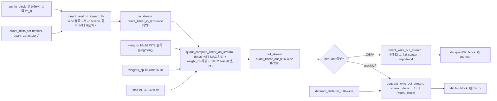
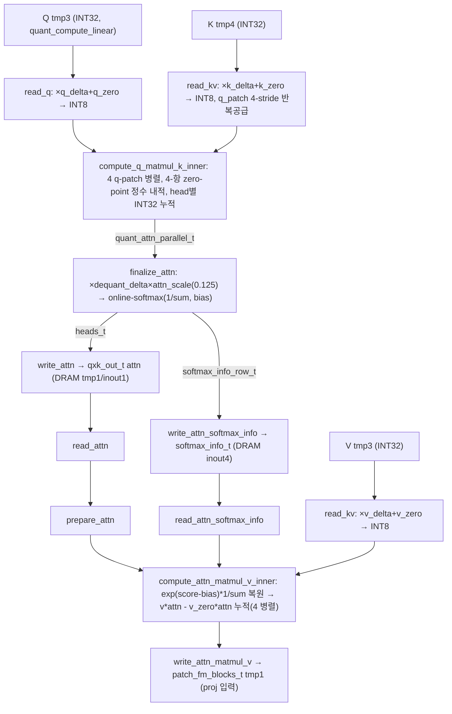
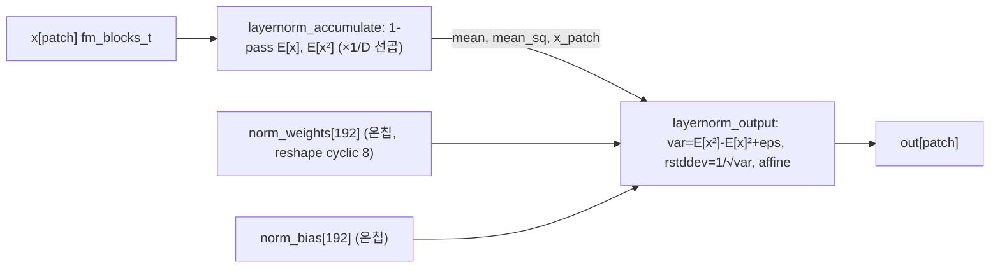
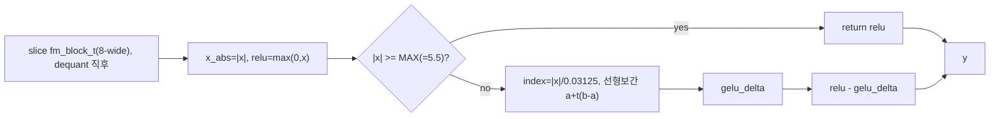
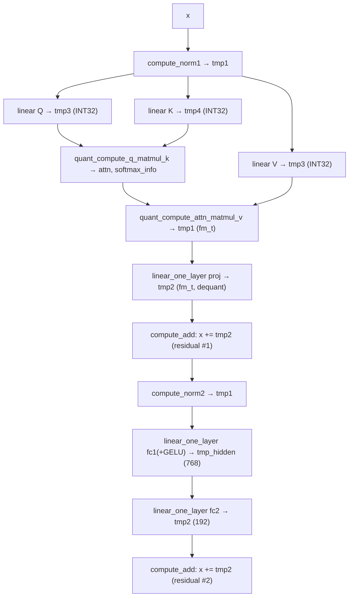

# ViT-Accelerator-on-FPGA-with-INT8-quantization 모듈 통합 가이드 (H-HLS)

> 1차 요약(맥락): [`../ViT-Accelerator-on-FPGA-with-INT8-quantization.md`](../ViT-Accelerator-on-FPGA-with-INT8-quantization.md)
> 소스 루트: `REF/Transformer-Accel/ViT-Accelerator-on-FPGA-with-INT8-quantization`. 구현 전체가 **Vitis HLS C++** (단일 `extern "C"` 커널 `compute_vit`). RTL 자체 소스 없음(`pynq/vit_acc.bit`은 사전 합성물).
> 표기 규약: 라인으로 직접 확인한 사실은 단정, 코드 정황 기반은 "추정", 코드/문서에 없으면 "확인 불가".
> 제외물(이름만): `pynq/vit_acc.bit`·`pynq/vit_acc.hwh`(Vivado 사전 합성 비트스트림/핸드오프), `pynq/params/*.apfixed.bin`(30+개, `tools/convert_all_params_to_apfixed.cc`가 생성한 양자화 파라미터 바이너리), `doc/step1.png~step15.png`(README 빌드 스크린샷), `pynq/main2.0.ipynb`·`pynq/vit_acc_on_zcu104.ipynb`·`testbench.ipynb`(런타임/보조 노트북), `data/.gitkeep`·`params/.gitkeep`(빈 placeholder), `.git/`(메타데이터), `vitis_hls_proj/`·`vivado_proj/`의 합성 산출물(리포엔 tcl 스크립트만 동봉).

---

## 0. 문서 머리말

### 0.1 대표 케이스 선정
이 가속기는 **단일 데이터패스**(`compute_vit`)가 12-layer DeiT-Tiny급 ViT 인코더를 **레이어 시분할**로 실행한다. Edge-MoE의 even/odd 패리티 분기와 달리 **모든 레이어가 동일한 dense Transformer 블록**(MHSA + dense-MLP)이며 분기가 없다(`vit.cc` L117~L177, 단일 `for(layer_no)` 루프). 따라서 대표 케이스도 한 레이어 안의 **두 GEMM 형태**를 잡는다.

- **정사각 GEMM 대표 (attention QKV/proj)**: **layer 0의 Q projection**. `vit.cc` L126~L129 — `quant_compute_linear(tmp1→tmp3, out_dim=FEATURE_DIM=192, in_dim=192)`. 출력은 dequant 없이 INT32로 흘려 attention에 재공급(`direct_write_out_stream`, `linear.cc` L383). 표준 INT8 비대칭 GEMM 경로.
- **직사각 GEMM 대표 (dense-MLP fc1)**: **layer 0의 fc1+GELU**. `vit.cc` L162~L166 — `quant_compute_linear_one_layer(tmp1→tmp_hidden, out_dim=HIDDEN_DIM=768, in_dim=192, use_gelu=true)`. dequant delta 곱 + GELU LUT 적용 경로(`dequant_write_out_stream`, `linear.cc` L329).

선정 근거: (1) 두 케이스가 **같은 단일 MAC 코어**(`quant_compute_linear_on_stream`, `linear.cc` L265)를 공유하지만 출력 스테이지만 `direct_write`(INT32) vs `dequant_write`(fm_t+GELU)로 갈리므로 INT8 가속기의 quant/dequant 경계를 한 엔진 위에서 대조 가능, (2) `vit.cc` L109~L110의 `ALLOCATION limit=1`이 두 wrapper(`quant_compute_linear`/`quant_compute_linear_one_layer`)를 각 1개로 강제 → 시분할 면적-최적화 설계의 직접 증거. attention(QKᵀ + streaming softmax + ·V, §4)은 별도 2-pass 엔진으로 추가 대표.

### 0.2 수치 표기 규약
- **MAC lanes**: 한 사이클(II=1 목표) 동시 곱셈기 수 = unroll/벡터 차원의 곱. 본 설계의 GEMM 코어는 `LINEAR_IN_SIZE × LINEAR_OUT_SIZE = 16×16`(`hardware.hh` L15-16, `linear.cc` L314-318) → **256 scalar MAC/cyc**(목표 II=1, 합성 II는 리포트 부재로 확인 불가). 단 INT8 zero-point 4-항 전개로 attention MAC은 항당 곱셈이 더 많음(§4.6).
- **scalar MACs**: 대표 GEMM의 (patch 수 NUM_PATCHES=197)×(out_dim)×(in_dim) 곱. attention·MLP를 구분 표기.
- **loop trips / cycle**: 타일·패치 루프 반복(`next_*` 상태머신으로 분해, `linear.cc` L48-61). attention은 q_patch 4-stride 타일링(`q_patch_limit=NUM_PATCHES+3=200`, 50 타일, `attention.cc` L98).
- **memory size (payload bit)**: 온칩 버퍼 깊이×폭(bit). 주요 버퍼 = linear weight ping/pong, norm 상주, attn DRAM tmp, gelu ROM.

### 0.3 운영 경로 (소스 ↔ case/tb ↔ 생성 ↔ 인스턴스)
```
[학습/export]   PyTorch ViT(INT8 양자화) → 레이어별 int32/fp32 가중치·delta·zero-point .bin
        │       (block_{i}_attn_qkv_weight.int32.bin, ..._qin_delta.fp32.bin 등; convert_..._apfixed.cc L152-921)
[양자화 변환]    tools/convert_all_params_to_apfixed.cc → *.apfixed.bin (pynq/params/), weight 0~255 범위검사(L159 등)
        │
[case/csim]     testbench/vit_tb.cc → fp32 입력/파라미터 로드 → compute_vit(...) 1회 → vit.out.fp32.bin 저장 (vit_tb.cc L939,L995)
        │       (★ 자동 PASS/FAIL 임계 없음 — 출력 덤프만; Edge-MoE의 MSE≤0.1 게이트와 대조)
[HLS 합성]      run_hls.tcl: set_top compute_vit, set_part xczu9eg-ffvb1156-2-e, clock 10ns(100MHz) → csim→csynth→cosim→export ip_catalog(verilog)
        │
[Vivado 통합]   run_vivado.tcl: ZCU102 PS(zynq_ultra_ps_e 3.3) + compute_vit IP, m_axi 5번들↔S_AXI_HP0~3/HPC0 매핑, pl_clk0 99MHz → impl → bitstream → xsa
        │
[보드]          pynq/vit_acc.{bit,hwh} (사전 합성물; ZCU104용, README L9 보드 불일치 명시), PYNQ 노트북으로 구동
```
근거: `run_hls.tcl` L1-17, `run_vivado.tcl` L1-29, `vit_tb.cc` L8-9·L939·L995, `convert_all_params_to_apfixed.cc` L146-921, `README.md` L1-71.

### 0.4 타깃 / 데이터타입 / INT8 비대칭 양자화 정책
- **타깃**: AMD/Xilinx **Zynq UltraScale+ MPSoC `xczu9eg-ffvb1156-2-e`** (ZCU102 보드 `xilinx.com:zcu102:part0:3.4`), 합성 클럭 **100 MHz**(period 10ns, `run_hls.tcl` L11-12). Vivado BD 자동연결은 PS `pl_clk0`을 **99 MHz**로 표기(`run_vivado.tcl` L25). 외부 메모리는 PS측 DDR(`S_AXI_HP0~3_FPD` + `S_AXI_HPC0_FPD`, `run_vivado.tcl` L19-23). **HBM 아님**. 배포 비트스트림은 ZCU104(`README.md` L9, 보드 불일치 명시). 합성 PPA 리포트는 리포에 미동봉 → **확인 불가**.
- **데이터타입(혼합정밀)**: feature map `fm_t = ap_fixed<32,10>`(정수부 10b/소수부 22b), LayerNorm weight/bias `fm_half_t = ap_fixed<16,5>`, **양자화 activation·weight `quant8_t = ap_ufixed<8,8>`(=INT8, 0~255 unsigned)**, 누산기 `quant32_t = ap_fixed<32,32>`(=INT32), 스케일(delta) 2종 `quant_delta1_t = ap_ufixed<16,2>`(per-channel act delta)·`quant_delta2_t = ap_ufixed<16,7>`(per-tensor in delta)(`datatypes.hh` L8-14). 즉 **weight/act INT8 + INT32 누산 + ap_fixed feature**.
- **블록 패킹**: AXI 전송폭 256b(`hardware.hh` L11). `FEATURE_BLOCK_SIZE = 256/fm_t::width(32) = 8`(L12), feature map은 `fm_block_t = vector<fm_t,8>` 단위, 텐서는 `patch_fm_blocks_t x[197][24][8]`(L20-22; NUM_FEATURE_BLOCKS=ceildiv(192,8)=24). INT8 양자화 텐서는 `quant8_block_t = vector<quant8_t,8>`(L29).
- **INT8 비대칭 정책(핵심)**: weight zero-point(`quant_attn_weights_zp`/`quant_mlp_weights_zp_*`)는 **MAC에서 weight로부터 직접 차감**(`linear.cc` L317), activation zero-point(`quant_zp`)는 **read 스테이지의 동적 재양자화에서 흡수**(`linear.cc` L256). attention의 QKᵀ는 zero-point를 흡수하지 못하므로 **4-항 전개식**(`q*k - q_zero*k - q*k_zero + q_zero*k_zero`, `attention.cc` L130)을 정수로 직접 계산. delta(스케일)는 per-channel(`quant_q/k/v_delta[layer][192]`) + per-tensor(`quant_attn_qkv_delta[layer]`) 분리. `clamp()`가 0~255로 saturate(`util.hh` L35-38). NUM_HEADS=3을 `roundup_p2(3)=4`로 패딩(`hardware.hh` L23, `util.hh` L19-21) → head 1개분 연산 낭비(추정).

---

## 1. Repo / Layer 개요

| 레이어 | 경로 | 역할 |
|---|---|---|
| **include/** | `include/*.hh` | 선언 헤더: 모델 상수·자료형·AXI 폭·인터페이스·constexpr 유틸. HLS 아님(상수/타입). |
| **src/** | `src/*.cc` | HLS 커널 구현(핵심). top(vit)·attention·linear·layernorm·gelu·add. |
| **testbench/** | `testbench/vit_tb.cc` | fp32 입력/파라미터 로드 후 `compute_vit` 1회 호출 + 출력 덤프(C-sim). |
| **tools/** | `convert_all_params_to_apfixed.cc` | int32/fp32 .bin → ap_fixed .bin 변환기(오프라인 SW, 커널 아님). |
| **(빌드)** | `vitis_hls_proj/run_hls.tcl`, `vivado_proj/run_vivado.tcl` | HLS 합성 + ZCU102 통합/비트스트림 스크립트. |

- 자체 소스 모듈 수: `src/*.cc` **6개** (vit, attention, linear, layernorm, gelu, add), 헤더 11개(`include/*.hh`).
- `dcl.hh`(util+datatypes+model+hardware) → 모든 커널 include(`dcl.hh` L4-7). `linear.hh`가 attention의 공통 의존(QKV/proj용 GEMM)이며 `gelu.hh`를 include(`linear.hh` L9). include 순환 없음.

### 모듈 인스턴스 계층 (top → leaf)
```
compute_vit  (extern "C" HLS 커널, s_axilite 제어 + m_axi 5번들)  [vit.cc L8, L60]
└─ for layer_no in 0..11:   (pipeline off → 레이어 직렬, vit.cc L117,L121)
   ├─ load_norms                          (norm1/norm2 weight·bias 온칩 적재)  [layernorm.cc L10]
   ├─ compute_norm1  (x → tmp1)           (pre-LN, 2-stage dataflow)  [layernorm.cc L168]
   │  └─ layernorm_accumulate → layernorm_output
   ├─ quant_load_linear_weights/bias/weights_zp  (DRAM→온칩 16×16 타일, ping)  [linear.cc L14,L92,L137]
   ├─ quant_compute_linear  Q (tmp1→tmp3, INT32)   [linear.cc L450]
   │  └─ dataflow: quant_read_in_stream → quant_compute_linear_on_stream → direct_write_out_stream
   ├─ (pong) load + quant_compute_linear  K (tmp1→tmp4)   [vit.cc L131-134]
   ├─ quant_load_delta ×2 (q/k per-ch delta) + quant_compute_q_matmul_k  (QKᵀ + online-softmax 통계)  [attention.cc L272]
   │  └─ dataflow: read_q ‖ read_kv → compute_q_matmul_k_inner → finalize_attn → write_attn ‖ write_attn_softmax_info
   ├─ (ping) load + quant_compute_linear  V (tmp1→tmp3)   [vit.cc L142-145]
   ├─ quant_load_delta(v) + quant_compute_attn_matmul_v  (softmax 복원 + ·V)  [attention.cc L466]
   │  └─ dataflow: read_kv(V) ‖ read_attn ‖ read_attn_softmax_info → prepare_attn → compute_attn_matmul_v_inner → write_attn_matmul_v
   ├─ (pong) load + dequant_load_delta + quant_compute_linear_one_layer  proj (tmp1→tmp2, fm_t)   [vit.cc L152-156]
   ├─ compute_add  (x += tmp2, residual #1)  [add.cc L3]
   ├─ compute_norm2  (x → tmp1)  [layernorm.cc L173]
   ├─ (ping) load + dequant_load_delta + quant_compute_linear_one_layer  fc1 (tmp1→tmp_hidden, GELU, 768)   [vit.cc L162-166]
   │  └─ dataflow: read → compute → dequant_write(+gelu_block)  [linear.cc L427]
   ├─ (pong) load + quant_compute_linear_one_layer  fc2 (tmp_hidden→tmp2, 192)   [vit.cc L169-173]
   └─ compute_add  (x += tmp2, residual #2)  [add.cc L3]
```

---

## 2. 단일 공유 Linear(INT8 GEMM) 엔진 — `src/linear.cc` (가장 재사용도 높음)

### 2.1 역할 + 상위/하위
ViT의 모든 fully-connected 연산(Q·K·V·proj·dense-MLP fc1/fc2)이 **이 한 엔진**(MAC 코어 `quant_compute_linear_on_stream`)을 시분할로 공유한다. `vit.cc` L109-110의 `#pragma HLS ALLOCATION function instances=quant_compute_linear[_one_layer] limit=1`이 두 wrapper를 각 1개로 강제 → DSP 타일 1벌로 면적 절감. 출력 형태만 두 갈래: INT32 그대로(`quant_compute_linear`, Q/K/V) vs dequant+GELU(`quant_compute_linear_one_layer`, proj/MLP).
상위: `compute_vit`(직접 호출, 6회/레이어). 하위: `quant_read_in_stream`/`quant_compute_linear_on_stream`/{`direct_write_out_stream`|`dequant_write_out_stream`}(dataflow 3-스테이지) + `gelu_block`. weight는 별도 4개 로더(`quant_load_linear_weights/_bias/_weights_zp`, `dequant_load_delta`)로 사전 로드.

### 2.2 데이터플로우


### 2.3 function call stack
`compute_vit` → `quant_compute_linear`(또는 `_one_layer`) (`#pragma HLS DATAFLOW`, L441/L462) → { `quant_read_in_stream` (L227) → `quant_compute_linear_on_stream` (L265) → ( `direct_write_out_stream` (L383) | `dequant_write_out_stream` (L329) → `gelu_block` ) }. 가중치는 호출 직전 `quant_load_linear_weights`(L14) / `quant_load_linear_bias`(L92) / `quant_load_linear_weights_zp`(L137) / `dequant_load_delta`(L182)로 ping/pong 버퍼에 적재(`linear.cc` L3-11).

### 2.4 대표 코드 위치
`src/linear.cc` L314-321(16×16 INT8 MAC 코어 + weight_zp 차감), L256(activation 동적 재양자화), L373-376(per-channel dequant + GELU), L317(zero-point 포함 정수 곱), L14-89(weight 16×16 타일 로더), L441-447/L462-468(상위 dataflow).

### 2.5 대표 코드 블록

(1) **16×16 INT8 MAC 타일 — 한 사이클에 16 in × 16 out, weight zero-point 직접 차감** (`linear.cc` L314~L325)
```cpp
for(unsigned int in_dim_offset=0; in_dim_offset < LINEAR_IN_SIZE; in_dim_offset++) {       // 16
    quant_linear_out_t addend;
    for(unsigned int out_dim_offset=0; out_dim_offset < LINEAR_OUT_SIZE; out_dim_offset++) { // 16
        addend[out_dim_offset] = in_block[in_dim_offset] *
            (weights[total_dim_block][out_dim_offset][in_dim_offset] - weights_zp[out_dim_block][out_dim_offset]);
    }
    out_block += addend;                          // INT32 누산
}
if(in_dim_block == last_in_dim_iter) out_stream << out_block;   // 마지막 in 타일에서 출력
```
→ `LINEAR_IN_SIZE=LINEAR_OUT_SIZE=16`(`hardware.hh` L15-16). 내부 두 루프가 unroll되어 **16×16=256 곱셈/사이클**(목표 II=1, `#pragma HLS PIPELINE` L295). bias는 in 타일 0에서 INT32로 초기화(L307-312). `#pragma HLS aggregate`로 weight/bias/zp 벡터를 단일 워드로 묶어 BRAM 접근 최적화(L275-277).

(2) **activation 동적 INT8 재양자화 — fm_t feature → INT8 + zero-point** (`linear.cc` L254~L259)
```cpp
for(unsigned int j_base=0, j_block=0; j_base < j_limit; j_base+=j_step, j_block++) {
    for(unsigned int j_offset=0, j=j_base; j_offset < j_step; j_offset++, j++) {
        stream_block[j] = clamp(blocks[j_block][j_offset] * quant_delta + quant_zp);   // ★ act zero-point 흡수
    }
}
in_stream << stream_block;
```
→ `quant_delta = quant_attn_qkv_delta`(per-tensor, `quant_delta2_t`), `quant_zp = quant_attn_qkv_zp`(act zero, `vit.cc` L129). `clamp()`(util.hh L36)가 0~255 saturate. 즉 LayerNorm 출력 fm_t를 GEMM 진입 시점에 **동적으로 INT8로 재양자화**(8-wide 2블록 → 16-wide).

(3) **per-channel dequant + GELU 분기 출력** (`linear.cc` L370~L377)
```cpp
for(unsigned int j_base=0, j_block=0; j_base < j_limit; j_base+=j_step, j_block++) {
    fm_block_t slice;
    for(unsigned int j_offset=0, j=j_base; j_offset < j_step; j_offset++, j++) {
        slice[j_offset] = stream_block[j] * delta_block_cache[j];   // INT32 → fm_t (per-channel delta)
    }
    fm_block_t out = gelu_block(slice);
    blocks[j_block] = use_gelu ? out : slice;                       // fc1만 GELU
}
```
→ `delta_block_cache = dequant_delta[delta_block]`(per-channel, `dequant_mlp_delta_l1[layer][768]` 등, `linear.cc` L366). `use_gelu`는 fc1 호출에서만 true(`vit.cc` L166). Q/K/V는 이 경로 대신 `direct_write_out_stream`(L383)으로 INT32를 그대로 DRAM(tmp3/tmp4)에 저장 → attention이 정수 상태로 재사용.

(4) **weight를 DRAM 행우선 → 온칩 16×16 블록 레이아웃으로 재배치** (`linear.cc` L70~L85)
```cpp
quant_wt_linear_block_t block_for_dst;
for(unsigned int row=0; row < LINEAR_OUT_SIZE; row++) {                    // 16 out
    hls::vector<quant8_t, LINEAR_IN_SIZE> row_for_dst;
    for(unsigned int col_base=0, col_block=0; col_base < col_limit; col_base+=col_step, col_block++) { // 16 in, 16씩
        hls::vector<quant8_t, WEIGHT_BLOCK_SIZE> cached = weights_cache[row][col_block][dst_col_block];
        for(unsigned int col_offset=0, col=col_base; col_offset < col_step; col++,col_offset++)
            if(col_limit % col_step == 0 || col < col_limit) row_for_dst[col] = cached[col_offset];
    }
    block_for_dst[row] = row_for_dst;
}
weights_dst[dst_block] = block_for_dst;                                    // 16x16 INT8 타일
```
→ `WEIGHT_BLOCK_SIZE = 16`(L21). 복잡한 `next_*` 상태머신(L48-61)으로 II=1 파이프라인 유지. `weights_dst`는 ping/pong 두 벌(`linear.cc` L3,L8)이지만 인스턴스는 1개이므로 **연산 중첩이 아닌 버퍼 분리**(Q/K, V/proj, fc1/fc2 쌍 분리; 추정, 1차 요약 §3.1).

### 2.6 마이크로아키텍처 + 정량
- **Stage 분해(dataflow 3-스테이지)**: ①`quant_read_in_stream`(src fm_block_t 8-wide 2개 → 16-wide INT8 동적 양자화; in_stream depth=`MAX_LINEAR_IN_DIM/LINEAR_IN_SIZE = 768/16 = 48`, L443) → ②`quant_compute_linear_on_stream`(16×16 INT8 MAC, out_dim×in_dim 타일 순회, INT32 누산) → ③`direct_write`(INT32 scatter) 또는 `dequant_write`(×delta → fm_t, +GELU).
- **MAC lanes**: 256 scalar MAC/cyc(16×16, II=1 목표). `quant_wt_linear_block_t = vector<vector<quant8_t,16>,16>`(`linear.hh` L18).
- **scalar MACs(대표 GEMM, NUM_PATCHES=197)**:
  - QKV/proj 각각 = 197×192×192 ≈ **7.26 M**.
  - dense-MLP fc1 = 197×768×192 ≈ **29.0 M**, fc2 = 197×192×768 ≈ **29.0 M**.
  - 1 레이어 linear 합 = QKV(3)·proj·fc1·fc2 = 4×7.26M + 2×29.0M ≈ **87.1 M**. 12 레이어 ≈ **1.05 G**(attention QKᵀ/·V 별도, §4.6).
- **메모리(payload bit)**: weight ping/pong 각 `MAX_LINEAR_DIM_PRODUCT/(16×16) = 768×192/256 = 576` 블록 × (16×16×8b) = 576×2048b ≈ **1.18 Mb/벌**, 2벌(ping+pong) ≈ 2.36 Mb (`linear.hh` L16,L23; MAX_LINEAR_DIM_PRODUCT=HIDDEN_DIM×FEATURE_DIM=147456). bias ping/pong 각 ceildiv(768,16)=48 블록 × 16×32b = 24.6 Kb/벌, zp 각 48×16×8b = 6.1 Kb/벌, delta 각 48×16×32b = 24.6 Kb/벌.
- **병목**: `ALLOCATION limit=1`(vit.cc L109-110)은 **면적 최소화 ↔ 처리량 상한 낮음**의 정반대 트레이드오프. 모든 GEMM이 한 엔진을 직렬 시분할 → 레이어 파이프라인 병렬 없음. weight 로드(L14)와 연산(L450)이 **연속 호출**이라 로드↔연산 중첩 없음(ping/pong이 진정한 더블버퍼링 미동작; 1차 요약 §3.1, 한계 §8.3). 로더 4종(weights/bias/zp/delta)이 거의 동일 패턴 복붙 → 코드 중복(약점).

---

## 3. Attention 엔진 — `src/attention.cc` (가장 복잡)

### 3.1 역할 + 상위/하위
2-pass INT8 attention: (1) `quant_compute_q_matmul_k`가 QKᵀ(4-항 zero-point 정수 내적) + online-softmax **통계만**(1/sum, bias) 산출(확률 행렬 미정규화 저장), (2) `quant_compute_attn_matmul_v`가 통계로 softmax를 **즉석 복원** 후 ·V(zero-point 보정). 상위: `compute_vit`(L140, L150). 하위: 각 dataflow 6-스테이지. Q/K/V projection 자체는 §2 엔진(`quant_compute_linear`)이 담당하고, 그 INT32 출력(tmp3/tmp4)을 이 엔진이 per-channel delta·zero로 재양자화해 소비.

### 3.2 데이터플로우


### 3.3 function call stack
`compute_vit` → `quant_compute_q_matmul_k`(dataflow, L272) { `read_q`(L35) ‖ `read_kv`(L56) → `compute_q_matmul_k_inner`(L83) → `finalize_attn`(L151) → `write_attn`(L232) ‖ `write_attn_softmax_info`(L260) } → (V linear via §2) → `quant_compute_attn_matmul_v`(dataflow, L466) { `read_kv`(V) ‖ `read_attn`(L302) ‖ `read_attn_softmax_info`(L328) → `prepare_attn`(L340) → `compute_attn_matmul_v_inner`(L371) → `write_attn_matmul_v`(L449) }.

### 3.4 대표 코드 위치
`src/attention.cc` L83-148(QKᵀ 4-항 정수 내적 MAC), L151-230(online-softmax 통계), L371-446(·V + softmax 복원), L272-300 / L466-489(dataflow 상위), L60-71(q_patch 4-stride 타일 + overflow 가드).

### 3.5 대표 코드 블록

(1) **QKᵀ — 4 q-patch 병렬, 4-항 zero-point 정수 내적, head 자동 분기** (`attention.cc` L124~L134)
```cpp
unsigned int head = dim_block / (DIM_PER_HEAD / FEATURE_BLOCK_SIZE);    // DIM_PER_HEAD=64
for(unsigned int q_patch_offset=0, q_patch=q_patch_base; q_patch_offset < q_patch_step; q_patch_offset++, q_patch++) { // 4
    quant8_block_t q_block = q_blocks[q_patch_offset][dim_block];
    quant32_t attn_addend = 0;
    for(unsigned int dim_offset=0, dim=dim_base; dim_offset < dim_step; dim_offset++, dim++) {   // 8-wide
        if(dim_limit % dim_step == 0 || dim < dim_limit)
            attn_addend += q_block[dim_offset]*k_block[dim_offset]
                         - quant_q_zero*k_block[dim_offset] - q_block[dim_offset]*quant_k_zero
                         + quant_q_zero*quant_k_zero;                    // ★ 4-항 비대칭 전개
    }
    attn_blocks[q_patch_offset][head] += attn_addend;                    // head별 INT32 누적
}
```
→ `ATTN_MATMUL_PARALLEL=4`(`hardware.hh` L18), `q_blocks[4]` array_partition complete(L91-92). `DIM_PER_HEAD=192/3=64`, `64%8=0` static_assert(L123). MAC lanes = 4 q-patch × 8-wide 내적 = **32 곱셈 lane**, 단 4-항 전개로 항당 곱셈 4개 → 유효 곱셈 ≈ 128/cyc(zero-point 항 포함; 일부는 상수 곱이라 합성 시 강도감소 가능, 추정).

(2) **finalize: 정수 score dequant + online-softmax 통계만 저장 (FlashAttention류)** (`attention.cc` L201~L217)
```cpp
auto exp_arg_noclip = curr_softmax_bias - attn_head;
bool is_new_bias = hls::signbit(exp_arg_noclip);
fm_t exp_arg = (is_new_bias) ? fm_t(exp_arg_noclip) : fm_t(-exp_arg_noclip);
fm_t exp = hls::exp(exp_arg);
if(is_new_bias) { curr_softmax_sum *= exp; curr_softmax_sum += 1; curr_softmax_bias = attn_head; }
else            { curr_softmax_sum += exp; }
fm_t curr_softmax_sum_recip = hls::recip(curr_softmax_sum);
softmax_info_row[head*2]   = curr_softmax_sum_recip;     // packing: [1/sum, bias] per head
softmax_info_row[head*2+1] = curr_softmax_bias;
```
→ 정수 attn은 `attn_blocks[..][lp] = packed * dequant_delta * attn_scale`로 dequant(L186; `attn_scale=0.125=1/√64`, L9). 확률 행렬(197×197×3) 미저장, head별 (1/sum, bias)만 `softmax_info_row_t`(`hardware.hh` L26)에 저장. 4 q-patch 병렬 의존성은 `#pragma HLS dependence ... distance=q_patch_unadjusted_step`(L175-176).

(3) **·V 단계 softmax 즉석 복원 + zero-point 보정** (`attention.cc` L409~L428)
```cpp
fm_t softmax_sum_recip = attn_softmax_info[attn_patch_offset][head * 2];
fm_t softmax_bias      = attn_softmax_info[attn_patch_offset][head * 2 + 1];
attn[attn_patch_offset][head] = hls::exp(fm_t(attn_packed[attn_patch_offset][head] - softmax_bias)) * softmax_sum_recip;
...
acc_block[dim_offset] = v_block[dim_offset]*attn[attn_patch_offset][head] - quant_v_zero*attn[attn_patch_offset][head];
```
→ 통계로 `prob = exp(logit - bias) * (1/sum)` 재계산(dim_block==0 시점, L399) 후 V와 곱. `acc`는 4 병렬 `acc_blocks[4]`(L379)에 누적, V patch 끝에서 출력(L437-441).

### 3.6 마이크로아키텍처 + 정량
- **Stage 분해**: QKᵀ pass 6-스테이지(read_q‖read_kv → compute → finalize → write_attn‖write_softmax_info). ·V pass 6-스테이지(read_kv(V)‖read_attn‖read_softmax_info → prepare → compute → write).
- **MAC lanes**: QKᵀ 4 q-patch × 8 = 32 lane(4-항 전개로 유효 곱셈↑), ·V 4 q-patch × 8 = 32 lane.
- **scalar MACs**: QKᵀ = NUM_HEADS(3) × 197 × 197 × DIM_PER_HEAD(64) ≈ **7.45 M**. ·V 동일 ≈ **7.45 M**. (zero-point 4-항은 곱셈 카운트를 ~4배로 늘리나 명목 MAC는 이 값.)
- **메모리(payload bit)**: `attn` = `qxk_out_t`(`hardware.hh` L25) = ceildiv(197+3,4)=50 × 197 × 4 × heads_t(roundup_p2(3)=4 × fm_t 32b=128b) ≈ 50×197×4×128 ≈ **5.04 Mb**(DRAM tmp, `vit.cc` L71 attn↔inout1). `attn_softmax_info` = 197 × softmax_info_row_t(roundup_p2(6)=8 × 32b=256b) ≈ **50.4 Kb**(inout4, L72). q_blocks/acc_blocks 등 온칩 임시는 4×24 블록.
- **병목**: **완전 fused 아님** — `attn`/`attn_softmax_info`를 DRAM tmp로 왕복(`vit.cc` L71-72) → FlashAttention 대비 외부 메모리 트래픽 잔존(통계 압축 + 2-pass). 4-way q-patch 병렬이 유일한 공간 병렬도(head/patch 병렬 확장 여지). q_patch 4-stride 타일링(NUM_PATCHES=197이 4의 배수가 아님 → q_patch_limit=200, 50 타일, 패딩 타일은 overflow 가드 `attention.cc` L71,L108,L178로 처리)이 인덱싱 복잡도의 주원인. Q→QKᵀ→V→·V가 단일 linear 엔진과 직렬이라 attention latency 길다.

---

## 4. LayerNorm — `src/layernorm.cc`

### 4.1 역할 + 상위/하위
patch별 LayerNorm. norm1(attention 전)·norm2(MLP 전) 2종, weight/bias는 온칩 상주(`norm1/2_weights/bias[192]`, `fm_half_t`, L3-6). 상위: `compute_vit`(L124, L160). 하위: `layernorm_accumulate`/`layernorm_output`(2-스테이지 dataflow).

### 4.2 데이터플로우


### 4.3 function call stack
`compute_vit` → `load_norms`(L10, 레이어 norm1/norm2 weight·bias 온칩 적재; 4개 거의 동일 블록) → `compute_norm1`/`compute_norm2`(inline wrapper, L168/L173) → `compute_norm`(L149, patch 루프 dataflow) → `layernorm_accumulate`(L83) → `layernorm_output`(L112).

### 4.4 대표 코드 위치
`src/layernorm.cc` L89-109(1-pass mean/mean_sq 누적), L124-145(variance+affine), L149-165(patch dataflow), L10-80(norm weight/bias 로더).

### 4.5 대표 코드 블록

(1) **1-pass mean / mean_sq 누적 (×1/D 선곱으로 오버플로 완화)** (`layernorm.cc` L97~L108)
```cpp
for(unsigned int dim_offset=0, dim=dim_base; dim_offset < dim_step; dim_offset++, dim++) {
    if(dim_limit % dim_step == 0 | dim < dim_limit) {
        fm_t x_dim = x_block[dim_offset];
        fm_t x_dim_mean_term = x_dim * fm_t(1.0 / FEATURE_DIM);   // /192 미리 곱
        partial_mean    += x_dim_mean_term;
        partial_mean_sq += x_dim * x_dim_mean_term;               // E[x²]도 동시
    }
}
x_patch[dim_block] = x_block;   // 다음 스테이지로 원본 통과
mean += partial_mean; mean_sq += partial_mean_sq;
```
→ E[x], E[x²]를 1패스로 누적(`#pragma HLS PIPELINE rewind` L92). variance를 두 번째 패스 없이 `E[x²]-E[x]²`로 산출(catastrophic cancellation 위험은 ap_fixed<32,10>로 흡수, 추정).

(2) **variance → rstddev → affine** (`layernorm.cc` L124~L141)
```cpp
fm_t sq_mean = mean * mean;
fm_t variance = mean_sq - sq_mean + norm_eps;        // norm_eps=1e-6 (layernorm.cc L8)
fm_t rstddev = fm_t(1) / hls::sqrt(variance);
...
x_dim -= mean; x_dim *= rstddev; x_dim *= weights[dim]; x_dim += bias[dim];
```
→ `array_reshape cyclic factor=FEATURE_BLOCK_SIZE(8)`(L121-122)로 weight/bias 병렬 포트. `hls::sqrt`/`recip` 1회/patch.

### 4.6 마이크로아키텍처 + 정량
- **Stage 분해**: 2-스테이지 dataflow per patch(`#pragma HLS DATAFLOW` L157). accumulate(24 블록 누적) → output(24 블록 affine).
- **loop trips**: patch 197 × dim 블록 24(=192/8).
- **메모리**: `norm1/2_weights[192]`+`norm1/2 bias[192]` × fm_half_t(16b) = 4×192×16 ≈ **12.3 Kb**(온칩 상주, L3-6). `x_patch[24]` 임시.
- **병목**: patch 간 dataflow는 순차(레이어 직렬). `load_norms`가 4개 블록(norm1 w/b, norm2 w/b) 거의 동일 복붙(L12-78, 중복 약점). sqrt/div 비선형 1회/patch는 짧음.

---

## 5. GELU — `src/gelu.cc`

### 5.1 역할 + 상위/하위
비선형 활성. `gelu(x) = relu(x) - delta(|x|)`로 분해, delta는 **177-entry LUT** 선형보간. dense-MLP fc1에서만 `quant_compute_linear_one_layer(..., use_gelu=true)`로 호출(`linear.cc` L375, `vit.cc` L166). 상위: `dequant_write_out_stream` → `gelu_block`. 하위: ROM 테이블.

### 5.2 데이터플로우


### 5.3 function call stack
`dequant_write_out_stream` → `gelu_block(fm_block_t)`(8-wide, L212, UNROLL) → `gelu(fm_t)`(스칼라, L194) → `GELU_DELTA_TABLE[177]` ROM(L3-181).

### 5.4 대표 코드 위치
`src/gelu.cc` L3-181(177-entry delta LUT), L194-210(스칼라 보간), L212-219(8-wide UNROLL), L183-187(테이블 상수: step·max).

### 5.5 대표 코드 블록

(1) **relu - delta 분해 + LUT 선형보간** (`gelu.cc` L197~L209)
```cpp
fm_t relu = ap_fixed_relu(x);
fm_t x_abs = hls::signbit(x) ? fm_t(-x) : x;
if(x_abs >= GELU_DELTA_TABLE_MAX) return relu;          // 포화 영역 (>=5.5)
auto index_exact = x_abs / GELU_DELTA_TABLE_STEP;        // step=0.03125
gelu_delta_table_index_t index = index_exact;
fm_frac_t a = GELU_DELTA_TABLE[index];
fm_frac_t b = GELU_DELTA_TABLE[index + 1];
fm_frac_t t = index_exact - index;
fm_frac_t gelu_delta = a + t*(b-a);                      // 1차 선형보간
return relu - gelu_delta;
```
→ delta는 우함수(`delta(-x)=delta(x)`, L191)라 `|x|`만 조회 → 테이블 절반 절약, 범위 [0,1)로 압축. `#pragma HLS bind_storage ... ROM_NP`(L196).

### 5.6 마이크로아키텍처 + 정량
- **LUT**: 177 entry(`GELU_DELTA_TABLE_SIZE`, L183) × fm_frac_t(width = fm_t::width - iwidth = 32-10 = **22b**, `datatypes.hh` L9) ≈ **3.9 Kb** ROM. step 0.03125, 범위 [0, 5.5)(`GELU_DELTA_TABLE_MAX = 0.03125×176 = 5.5`, L187).
- **인스턴스화**: `gelu_block`은 FEATURE_BLOCK_SIZE=8-wide UNROLL(L214). fc1 출력 dequant 슬라이스마다 호출.
- **병목**: DSP 없이 비선형 근사(곱 1회 + 테이블 2 read). 보간 1차라 정밀도-면적 균형. 합성 자원은 리포트 부재로 확인 불가.

> 주의: 1차 요약은 "GELU_DELTA_TABLE[177]"(맞음), 형제 Edge-MoE 가이드는 "184-entry"(타 repo). 본 repo는 **177 entry / MAX=5.5**가 정확(`gelu.cc` L183,L187).

---

## 6. Residual Add — `src/add.cc`

### 6.1 역할 + 상위/하위
residual 덧셈(attention proj 후, MLP fc2 후). 상위: `compute_vit`(L158, L175). 하위: 없음.

### 6.2 대표 코드 블록 (`add.cc` L9~L15)
```cpp
for(int i = 0; i < NUM_PATCHES * NUM_FEATURE_BLOCKS; i++) {       // 197 × 24 = 4728 블록
#pragma HLS PIPELINE
#pragma HLS dependence variable=x_blocks inter false
#pragma HLS dependence variable=y_blocks inter false
#pragma HLS dependence variable=out_blocks inter false
    out_blocks[i] = x_blocks[i] + y_blocks[i];                    // fm_block_t(8-wide) 벡터 덧셈
}
```

### 6.3 정량
- **lanes**: 8-wide(fm_block_t) 벡터 add, II=1. **loop trips** = 197×24 = 4728. `dependence inter false`로 의존성 제거 → 완전 파이프라인. memory = 입출력 모두 DRAM(`x[image_id]`에 in-place 갱신, `vit.cc` L158).

---

## 7. 최상위 오케스트레이션 — `src/vit.cc`

### 7.1 역할 + 상위/하위
`extern "C"` HLS 커널(`vit.cc` L8). 모든 포트 `m_axi offset=slave`(외부 DDR), 제어 `s_axilite`(L60). AXI 번들 5개(`inout1~4`, `weights`)로 분리해 다채널 DDR 동시 접근. `tmp1/tmp2`(fm_t)·`tmp3/tmp4`(INT32)·`tmp_hidden`(fm_t)·`attn`·`attn_softmax_info`는 레이어 간 중간버퍼. 하위: 위 모든 커널.

### 7.2 데이터플로우 (1 레이어)


### 7.3 대표 코드 블록

(1) **단일 엔진 자원 공유 + 레이어 직렬 루프 + 조기 종료** (`vit.cc` L109~L121)
```cpp
#pragma HLS ALLOCATION function instances=quant_compute_linear_one_layer limit=1
#pragma HLS ALLOCATION function instances=quant_compute_linear limit=1
    for(unsigned int image_id=0; image_id < num_images; image_id++) {
#pragma HLS loop_tripcount min=1 max=1 avg=1
#pragma HLS pipeline off
        for(unsigned int layer_no=0; layer_no < NUM_LAYERS; layer_no++) {
            if(layer_no == last_layer_no) return;              // 부분 실행(디버깅용)
#pragma HLS pipeline off
```
→ linear wrapper 2종을 각 1개로 강제(시분할). 이미지·레이어 루프 모두 `pipeline off`(L115,L121) → 직렬. `last_layer_no`로 조기 종료(tb는 12=전체, `vit_tb.cc` L9). ⚠ `num_images>1` + `last_layer_no<12` 동시 사용 시 둘째 이미지 미처리 버그(1차 요약 §3.1).

(2) **5 AXI 번들 분리 → ZCU102 DDR 다채널** (`vit.cc` L62~L107)
```cpp
#pragma HLS interface m_axi ... port=tmp1 bundle=inout1 max_widen_bitwidth=AXI_XFER_BIT_WIDTH  // inout1: tmp1, attn
#pragma HLS interface m_axi ... port=tmp2 bundle=inout2 ...                                    // inout2: tmp2
#pragma HLS interface m_axi ... port=tmp3 bundle=inout3 ...                                    // inout3: tmp3
#pragma HLS interface m_axi ... port=tmp4 bundle=inout4 ...   // inout4: tmp4, x, tmp_hidden, attn_softmax_info
#pragma HLS interface m_axi ... port=quant_attn_weights bundle=weights ...                     // weights: 전 가중치
```
→ `run_vivado.tcl` L19-23에서 inout1→S_AXI_HP0, inout2→HP1, inout3→HP2, inout4→HP3, weights→HPC0로 매핑. 모든 포트 `max_widen_bitwidth=256`(L62-107). 단 `x`/`tmp_hidden`/`attn_softmax_info`가 inout4에 몰려(L67,L69,L72) HP3 대역 경합 가능(추정).

(3) **한 레이어 12단계 시퀀스** (`vit.cc` L122~L175): load_norms → norm1 → [Q load+linear → K load+linear → load_delta×2 + q_matmul_k] → [V load+linear → load_delta(v) + attn_matmul_v] → [proj load+dequant_delta + linear_one_layer] → add#1 → norm2 → [fc1 load+dequant_delta + linear_one_layer(GELU,768)] → [fc2 load+dequant_delta + linear_one_layer(192)] → add#2. (1차 요약 §3.1과 일치.)

### 7.4 마이크로아키텍처 + 정량
- **레이어 루프**: `#pragma HLS pipeline off`(L115,L121) → 레이어·이미지 직렬(파이프라인 펼침 없음).
- **AXI 설정**: 모든 m_axi `depth=1 offset=slave max_widen_bitwidth=256`(L62-107). 5번들 → DDR 5채널(HP0~3 + HPC0). 제어는 M_AXI_HPM0_FPD→s_axi_control(`run_vivado.tcl` L18).
- **중간버퍼(DRAM)**: tmp1/tmp2(`patch_fm_blocks_t` = 197×24×8×32b ≈ 9.69 Mb 각), tmp3/tmp4(`patch_quant32_blocks_t` = 197×24×8×32b ≈ 9.69 Mb 각), tmp_hidden(197×ceildiv(768,8)=197×96 = 18,912 블록 × 8×32b ≈ 4.84 Mb), attn(≈5.04 Mb), attn_softmax_info(≈50 Kb). 전부 외부 DDR.
- **병목**: 레이어 직렬 시분할 + **매 레이어 전체 가중치 DRAM 재로딩**(L126-173, on-chip 상주 없음) → DRAM 트래픽 큼(1차 요약 한계 §8.1). 단일 GEMM 엔진이 전 GEMM을 순차 수행 → 처리량 상한. 다채널 DDR(5번들)로 대역폭은 분산.

---

## 8. 빌드·검증 흐름 — `run_hls.tcl`, `run_vivado.tcl`, `testbench/vit_tb.cc`, `tools/convert_*`

### 8.1 역할
- **csim/csynth/cosim**(`run_hls.tcl`): `set_top compute_vit`, 6개 src 추가(L3-8), tb=vit_tb.cc(`-mbig-obj -Wno-unknown-pragmas`, L9), `set_part xczu9eg-ffvb1156-2-e`, clock 10ns(100MHz), `csim→csynth→cosim→export ip_catalog(verilog)`(L14-17).
- **통합/비트스트림**(`run_vivado.tcl`): ZCU102 board preset(L3,L15), HLS IP import(L4-5,L12), zynq_ultra_ps_e 3.3 + compute_vit IP, AXI 자동연결(5 master→HP0~3/HPC0, L19-23), wrapper 생성→`launch_runs impl_1 -to_step write_bitstream`→`write_hw_platform`(xsa)(L26-29).
- **검증**(`vit_tb.cc`): fp32 입력(`vit.x.fp32.bin`, L137) + 레이어별 양자화 파라미터 30+종 로드 → `compute_vit(...)` 1회(L939) → 출력 `vit.out.fp32.bin` 저장(L995). ⚠ **자동 PASS/FAIL 임계 없음**(출력 덤프만; Edge-MoE의 MSE≤0.1 게이트와 대조). 검증은 외부 비교(추정).
- **양자화 변환**(`convert_all_params_to_apfixed.cc`): int32/fp32 .bin → ap_fixed .bin, weight 0~255 범위검사(L159 등 다수). 경로 `/home/jack/Desktop/ViT.Acc.HW/...` 하드코딩(L149,L152 등 → 재현성 낮음).

### 8.2 정량
- 입력: `vit.x.fp32.bin`(이미 patch-embed된 [197][192] feature; patch embedding은 PS/오프라인, 확인 불가). 가중치 shape: qkv `(192,192)`×3 + proj `(192,192)`(`kernel.hh` L31, `vit_tb.cc` L152), fc1 `(768,192)`/fc2 `(192,768)`(`kernel.hh` L49,L56), per-channel delta/zero-point/bias 다수.
- 합성 PPA(LUT/FF/DSP/BRAM/지연/주파수): csynth/cosim 리포트 미동봉 → **확인 불가**.

---

## 9. 모듈 한눈 요약 표

| # | 모듈 | 파일 | 핵심 역할 | MAC lanes(목표 II=1) | 대표 scalar MACs | 주 메모리(추정) | 핵심 병목 |
|---|---|---|---|---|---|---|---|
| 2 | Linear(INT8 GEMM) 엔진 | `linear.cc` | 모든 FC 공유, direct(INT32)/dequant(fm_t+GELU) | 16×16=256 | QKV 7.26M / fc1 29.0M | weight ping/pong ~2.36Mb | ALLOCATION=1 직렬, 매 레이어 DRAM 재로딩 |
| 3 | Attention | `attention.cc` | QKᵀ(4-항 zp)/softmax통계/·V (2-pass) | 32(QKᵀ) / 32(·V) | QKᵀ 7.45M / ·V 7.45M | attn tmp ~5.04Mb(DRAM) | 비-fused DRAM 왕복, 4-stride 패딩 |
| 4 | LayerNorm | `layernorm.cc` | patch별 1-pass 통계 norm | 8-wide | 197×192×2(통계) | norm w/b ~12.3Kb(상주) | patch 직렬, load_norms 중복 |
| 5 | GELU | `gelu.cc` | relu-delta 177-LUT 보간 | 8-wide UNROLL | — | 177-entry ROM ~3.9Kb | 곱1+read2 |
| 6 | Add | `add.cc` | residual | 8-wide | — | DRAM in-place | — |
| 7 | Top | `vit.cc` | 레이어 직렬 시분할 오케스트레이션 | — | linear 합 ~87M/layer | tmp1~4+tmp_hidden(DRAM, 각 ~9.7Mb) | 레이어 직렬 + 가중치 재로딩 |

---

## 10. 읽기·코드추적 순서 (권장)

1. **상수/타입**: `model.hh`(dim/patches=197/layers=12) → `datatypes.hh`(INT8/INT32/fm_t 정밀도) → `hardware.hh`(AXI 256b, 16×16, 4-way) → `util.hh`(ceildiv/roundup_p2/clamp).
2. **top 골격**: `vit.cc` L109-177(ALLOCATION + 레이어 루프 12단계) → 인터페이스 L60-107(5 AXI 번들).
3. **공유 엔진**: `linear.cc` L441-468(상위 dataflow) → L265-327(16×16 INT8 MAC + weight_zp) → L227-262(act 동적 양자화) → L329-381(dequant+GELU) / L383-425(direct INT32) → L14-89(weight 16×16 로더).
4. **Attention**: `attention.cc` L272-300 / L466-489(dataflow 상위) → L83-148(QKᵀ 4-항) → L151-230(softmax 통계) → L371-446(·V 복원+zp).
5. **보조**: `layernorm.cc`(L83-146 통계/affine) → `gelu.cc`(L194-210 LUT) → `add.cc`.
6. **검증/빌드**: `vit_tb.cc`(입력·파라미터 로드 + 출력 덤프) → `convert_*.cc`(양자화 변환) → `run_hls.tcl`/`run_vivado.tcl`(타깃·통합).

---

## 11. 병목 후보 & 병렬도 노브

| 노브 | 위치 | 현재값 | 효과 | 리스크 |
|---|---|---|---|---|
| `quant_compute_linear[_one_layer]` 인스턴스 수 | `vit.cc` L109-110 | 1(ALLOCATION limit=1) | ↑면 처리량↑ | DSP/면적 급증 |
| `LINEAR_IN/OUT_SIZE` | `hardware.hh` L15-16 | 16/16 (256 MAC) | ↑면 GEMM 병렬↑ | weight RF/포트 폭↑ |
| `ATTN_MATMUL_PARALLEL` | `hardware.hh` L18 | 4 | ↑면 attn 병렬↑ | q_blocks/acc RF↑, 패딩 비율↑ |
| `FEATURE_BLOCK_SIZE`(=AXI/fm) | `hardware.hh` L11-12 | 8 (256b/32b) | act 비트↓면 블록↑ | 정확도(현재 act fm_t 32b) |
| activation 비트폭 `fm_t` | `datatypes.hh` L8 | ap_fixed<32,10> | ↓면 BRAM/대역폭↓ | 정확도 |
| weight 상주 vs 재로딩 | `vit.cc` L126-173 | 매 레이어 DRAM 재로딩 | 상주면 DRAM 트래픽↓ | 온칩 BRAM 대폭↑ |
| ping/pong 더블버퍼링 | `linear.cc` L3-11 | 버퍼만 분리(중첩 X) | 진짜 prefetch면 load/compute 겹침 | 스케줄 재설계 |
| NUM_HEADS 패딩 | `hardware.hh` L23 | roundup_p2(3)=4 | 4→3이면 25% 낭비 제거 | 벡터 폭 비-2의거듭제곱 |
| 레이어 파이프라인 | `vit.cc` L115,L121 | pipeline off(직렬) | 펼치면 throughput↑ | 면적 대폭↑(HG-PIPE식) |
| attention fusion | `vit.cc` L140,L150 | 2-pass(DRAM tmp) | fuse면 트래픽↓ | 온칩 buffer↑, 재설계 |

**핵심 병목 진단**: 이 가속기는 **면적 최소화** 목표(단일 linear 엔진 `ALLOCATION limit=1`, weight/act INT8, head-당 시분할)로 **처리량을 의도적으로 양보**한 설계다. 레이어·서브스텝·GEMM이 모두 단일 엔진에서 직렬 시분할되며(`vit.cc` L115,L121 pipeline off), **가중치를 on-chip에 상주시키지 않고 매 레이어 DRAM에서 재로딩**(L126-173)해 DRAM 트래픽이 크다 — HG-PIPE식 레이어 펼침(가중치 상주)과 정반대 트레이드오프. ping/pong은 진정한 prefetch 더블버퍼링이 아니라 버퍼 분리에 그친다(load↔compute 미중첩). attention은 통계 압축 2-pass로 attn/softmax_info를 DRAM 왕복하며, NUM_HEADS=3을 4로 패딩해 head 1개분(~25%) 연산이 낭비된다. INT8 비대칭 양자화 데이터패스(weight zp 직접 차감 + act zp read 흡수 + QKᵀ 4-항 전개) 자체는 정확·완결적이다. 합성 PPA 수치(DSP/BRAM/주파수 달성·지연·fps)는 csynth/cosim 리포트 미동봉으로 **확인 불가** — 논문/리포트 또는 재합성 필요.
