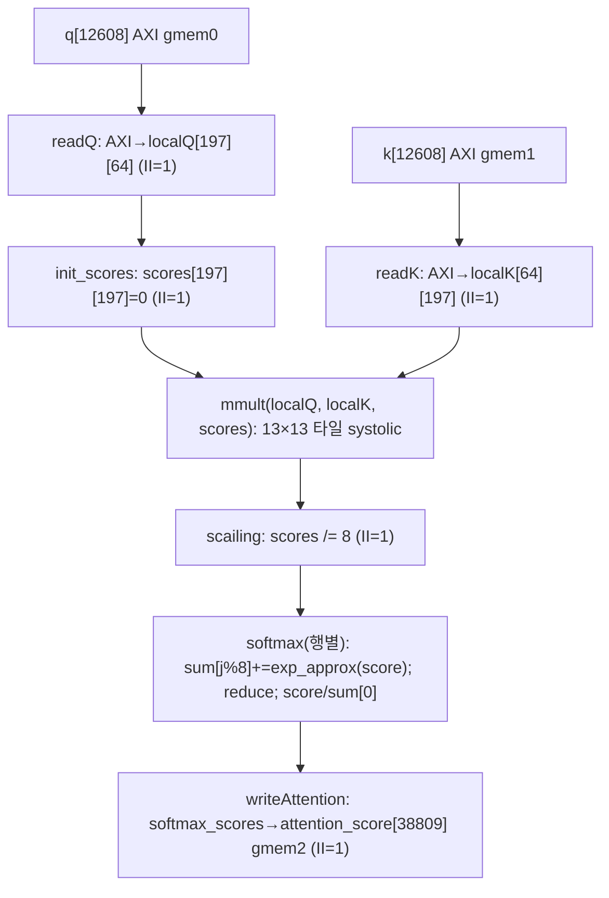
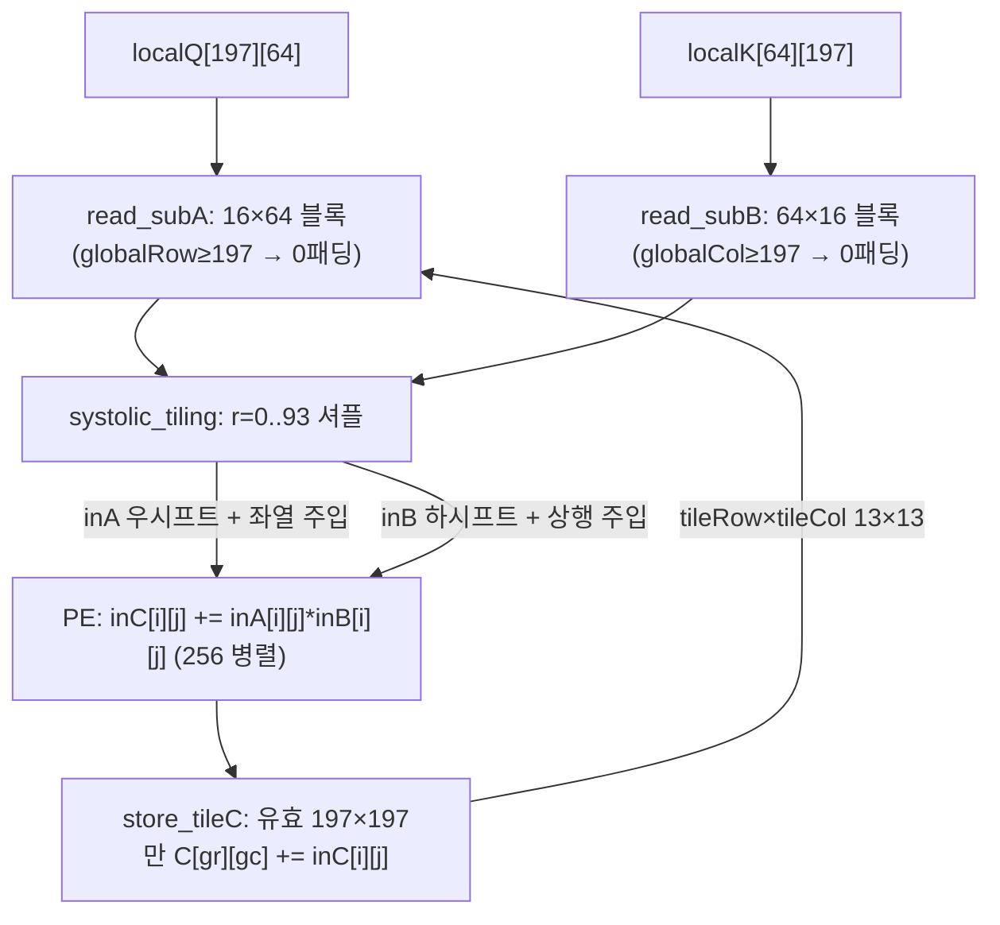
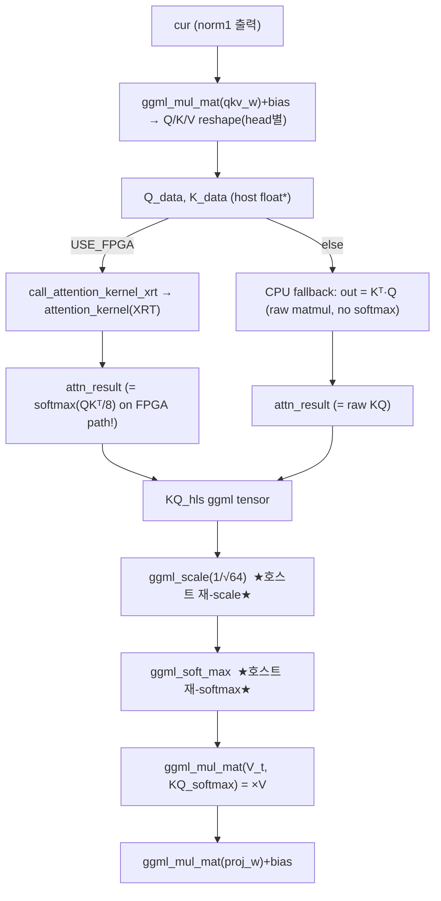

# ViT-Accelerator 모듈 통합 가이드 (H-HLS)

> 1차 요약(맥락): [`../ViT-Accelerator.md`](../ViT-Accelerator.md)
> 소스 루트: `REF/Transformer-Accel/ViT-Accelerator`. 구현은 **호스트(ggml 기반 ViT forward, C++) + Vitis HLS 어텐션 커널(QKᵀ→/8→근사 softmax) + 호출 래퍼(OpenCL / pybind11)** 의 3계층. RTL 자체 소스 없음(HLS에서 `export_design -rtl verilog`로 IP 생성 의도, 합성 산출물은 리포에 미동봉).
> 표기 규약: 라인으로 직접 확인한 사실은 단정, 코드 정황 기반은 "추정", 코드/문서에 없으면 "확인 불가".
> 제외물(이름만): `host/ggml/`(외부 ggml 라이브러리 전체 — GGML core/GGUF, whisper·gpt-2·gpt-j·sam·mnist·yolo 등 예제, `host/ggml/src/*`, `host/ggml/examples/*`, `host/ggml/include/ggml/*.h`), 빌드 산출물 `host/attention_wrapper.so`·`wrapper/attention_wrapper.so`(pybind11 컴파일물), 자산 `host/cat-resized.jpg`·`image/ViT.gif`, `Final Project Presentation.pdf`(현 트리 미노출).

> ⚠️ **1차 요약 대비 핵심 재확인 결과(요약)**: 1차에서 "호스트 본체(vit.cpp/main.cpp) 미구현"이라 했으나 **현 트리에는 `host/vit.cpp`(1134줄)·`host/main.cpp`·`host/vit_ori.cpp`·`host/main_ori.cpp`가 모두 존재**하며 ggml ViT forward가 완전 구현되어 있고, 어텐션 QKᵀ가 실제로 FPGA 커널(`call_attention_kernel_xrt`)로 결선되어 있다 → **"호스트 미구현" 정정**. 대신 더 심각한 **신규 결함 3종**(호스트↔커널 토큰 차원 785 vs 197 불일치, scale·softmax 이중 적용, wrapper/ 두 래퍼가 결선 경로 아님)을 §말미에서 확정한다.

---

## 0. 문서 머리말

### 0.1 대표 케이스 선정
ViT-Accelerator는 **단 하나의 연산 단계(self-attention의 QKᵀ)** 만 FPGA로 오프로드하고 나머지(patch embed·LN·×V·proj·MLP·classifier)는 호스트 ggml에서 수행하는 **헤테로지니어스 분할** 구조다. 따라서 대표 케이스를 **둘** 잡는다.

- **HW 대표 (FPGA 커널)**: **`attention_kernel` 1회 호출 = 단일-head QKᵀ→/8→근사 softmax**. `kernel.cpp` L21~L114. 입력 Q(197×64)·K(64×197)를 받아 score(197×197)를 산출. 내부에서 `mmult`(16×16 타일 systolic, `q_matmul_k_function.cpp` L19~L174)를 호출해 행렬곱을 수행한다. 본 repo에서 **HW적으로 유일하게 합성 대상**(`run_hls.tcl` L11 `set_top attention_kernel`)인 단위.
- **SW 대표 (호스트 오케스트레이션)**: **`vit_encode_image`의 self-attn 블록**. `vit.cpp` L872~L972 — QKV proj(ggml) → head별 Q/K/V view → `call_attention_kernel_xrt`로 QKᵀ 오프로드(L913) → 호스트에서 scale(L953)·softmax(L956)·×V(L958)·proj(L970). 12 레이어 × 12 head를 호스트 루프가 시분할로 커널에 던진다(추정; 코드상 head 단위 호출).

선정 근거: (1) 두 케이스가 **같은 한 커널**(`attention_kernel`)을 공유하므로 "HW가 무엇을 하고 SW가 무엇을 채우는가"의 경계를 한 단위에서 대조 가능, (2) SW 케이스가 이 repo의 정체성(어텐션만 부분 오프로드하는 교육용 헤테로 가속)을 직접 증명하며, **차원/scale/softmax 정합성 결함**이 정확히 이 경계에서 드러난다.

### 0.2 수치 표기 규약
- **MAC lanes**: 한 사이클(II=1) 동시 곱셈기 수. 본 설계 GEMM 코어는 `mmult`의 16×16 PE 배열(`q_matmul_k_function.cpp` L30 `inC[M][M]`, M=16, `#pragma HLS ARRAY_PARTITION dim=0 complete` L31) → **목표 256 scalar MAC/cyc**(systolic loop `#pragma HLS PIPELINE` L105; 합성 II는 리포트 부재로 확인 불가).
- **scalar MACs**: 대표 GEMM의 (행)×(열)×(내적 길이). 단일-head QKᵀ = 197×197×64.
- **loop trips / cycle**: 타일·셔플 루프 반복(`tile_outer_loop` 13×13, systolic shift 94스텝).
- **memory size (payload bit)**: 온칩 버퍼 깊이×폭(bit). 주요 버퍼 = localQ/localK/scores/softmax_scores(float32) + subA/subB/inC/inA/inB(타일 스크래치).

### 0.3 운영 경로 (소스 ↔ HLS ↔ 생성 ↔ 호스트 ↔ 실행)
```
[모델 export]   PyTorch ViT-B → gguf(f16)  (host/convert-pth-to-ggml.py; 외부 ggml 포맷)
        │
[양자화]        quantize.cpp: gguf(f16) → gguf(Q4_0/Q4_1/Q5_0/Q5_1/Q8_0)  (host/quantize.cpp L33-352, main L358 추정)
        │       (.*weight 2D 텐서만 양자화, quantize.cpp L207-302 영역)
[HLS csim/csynth/cosim] run_hls.tcl: set_top attention_kernel, set_part xcu50-fsvh2104-2-e,
        │                clock 10ns(100MHz) → csim→csynth→cosim→export ip_catalog(verilog)  (run_hls.tcl L1-19)
        │                테스트벤치: testbench.cpp(난수 Q/K, 표준 softmax reference, 절대오차 2e-2)
[v++ 빌드]      attention_kernel.xo + mmult.xo → vit_accel.xclbin  (README L29-44, platform xilinx_u50_gen3x16_xdma_201920_3)
        │
[호스트 빌드]   host/CMakeLists.txt: cmake -DUSE_FPGA=ON|OFF → 실행 vit (main.cpp + vit.cpp + ggml)
        │
[실행]          ./bin/vit -t 4 -m ggml-model-f16.gguf -i cat.jpg  (README L57)
        │       vit_predict → vit_encode_image: per-head QKᵀ를 attention_kernel(XRT)로, 나머지는 ggml
[보드/디바이스] Alveo U50 (xcu50 / xilinx_u50_gen3x16_xdma_201920_3) + Xilinx XRT 런타임
```
근거: `run_hls.tcl` L1-19, `README.md` L29-57, `host/CMakeLists.txt` L31-54, `main.cpp` L30-140, `vit.cpp` L798-1022, `quantize.cpp` L1-57.

### 0.4 타깃 / 데이터타입 / 분할 정책
- **타깃**: AMD/Xilinx **Alveo U50** — HLS 합성 파트 **`xcu50-fsvh2104-2-e`**, 클럭 **10 ns = 100 MHz**(`run_hls.tcl` L6,L9). v++ 플랫폼 **`xilinx_u50_gen3x16_xdma_201920_3`**(`README` L30,L35,L41). 런타임 **Xilinx XRT**(`vit.h` L5-6, `main.cpp` L6-7, `CMakeLists.txt` L37-45). 툴체인 **Vitis 2022.1**(`README` L15). U50은 HBM2 탑재 디바이스이나, 본 커널은 HBM bank를 명시 지정하지 않고 `xrt::bo(..., bank=0)`(`vit.cpp` L59-61)로 bank 0만 사용 → HBM 채널 활용 최소. 합성 PPA(LUT/FF/DSP/BRAM/지연/주파수 달성)는 **리포트 미동봉 → 확인 불가**.
- **데이터타입**: HLS 커널은 **전부 `float`(32b IEEE single)** — Q/K/score/softmax 모두 float(`kernel.cpp` L35-43, `q_matmul_k_function.cpp` L22-31). 즉 **고정소수점 양자화 없음**(quantize.cpp의 Q4/Q5/Q8은 **호스트 가중치 저장용**이며 어텐션 커널 경로와 무관). 호스트 ggml은 f16/f32/Qx 혼용.
- **분할(HW/SW) 정책**: **QKᵀ matmul만 HW**, scale·softmax는 *커널 안에도 있고*(kernel.cpp) *호스트에도 있다*(vit.cpp) → 이중(§말미 결함 B). ×V·proj·LN·MLP·classifier·patch-embed는 전부 호스트 ggml(`vit.cpp` L845-1014). 멀티-head(12)·12 레이어는 호스트 루프가 커널을 반복 호출(추정).

---

## 1. Repo / Layer 개요

| 레이어 | 경로 | 역할 |
|---|---|---|
| **hls_source/** | `kernel.{h,cpp}`, `q_matmul_k_function.cpp`, `testbench.cpp`, `scripts/*.tcl` | FPGA 어텐션 커널(핵심 HW). top=`attention_kernel`, sub=`mmult`. |
| **host/** | `vit.{h,cpp}`, `main.cpp`, `quantize.cpp`, `vit_ori.cpp`, `main_ori.cpp`, `CMakeLists.txt` | 호스트 ViT forward(ggml) + FPGA 오프로드 결선 + 가중치 양자화 도구. |
| **wrapper/** | `opencl_wrapper.cpp`, `attention_wrapper.cpp` | 별도 FPGA 호출 래퍼(OpenCL / pybind11) — **현 결선 경로 아님**(§말미 결함 C). |
| **(빌드/검증)** | `scripts/run_hls.tcl`, `scripts/synth_config.tcl`, `testbench.cpp` | HLS 합성/시뮬 + directive + C-sim 검증. |
| **(외부, 제외)** | `host/ggml/**` | ggml 텐서 백엔드/예제. 이름만. |

- 자체 소스 핵심: **HLS 3파일**(kernel.cpp, q_matmul_k_function.cpp, testbench.cpp) + **호스트 4파일**(vit.cpp, main.cpp, quantize.cpp, vit.h) + **래퍼 2파일**(opencl_wrapper.cpp, attention_wrapper.cpp) + tcl 2개.
- `*_ori.cpp`(vit_ori.cpp/main_ori.cpp) = **원저자(staghado/vit.cpp) 순수 CPU 버전**(FPGA 결선 없음; `vit_ori.cpp` L848 `ggml_mul_mat(ctx0, K, Q)`로 어텐션을 호스트에서 직접). `vit.cpp`/`main.cpp`가 이를 포크해 어텐션을 FPGA로 분기한 **가속 버전**.

### 모듈 인스턴스 계층 (top → leaf)
```
[HOST]  main()  (main.cpp L30)
├─ vit_params_parse / vit_model_load / load_image_from_file / vit_image_preprocess   (main.cpp L35-101)
├─ (USE_FPGA) xrt::device + load_xclbin + xrt::kernel("attention_kernel")            (main.cpp L54-64)
└─ vit_predict  (vit.cpp L1086)
   └─ vit_encode_image  (vit.cpp L798)  [ggml cgraph 빌드]
      ├─ patch embed: ggml_conv_2d_sk_p0 + cls token + pos embed                     (vit.cpp L845-853)
      └─ for il in 0..11:
         ├─ norm1 (ggml_norm + affine)                                              (vit.cpp L862-866)
         ├─ self-attn:
         │  ├─ QKV proj (ggml_mul_mat qkv_w) + bias + reshape Q/K/V (head별)         (vit.cpp L874-899)
         │  ├─ call_attention_kernel_xrt(Q,K → attn_result)  ★FPGA 경계★             (vit.cpp L913 / 정의 L40)
         │  │   └─ [FPGA]  attention_kernel(q,k,attention_score)                     (kernel.cpp L21)
         │  │        ├─ readQ / readK (AXI→BRAM, II=1)                               (kernel.cpp L46-65)
         │  │        ├─ init_scores → mmult(localQ,localK,scores)                    (kernel.cpp L67-75)
         │  │        │   └─ mmult: 13×13 타일 × 94-step systolic 16×16 PE            (q_matmul L34-167)
         │  │        ├─ scailing (/8, II=1)                                          (kernel.cpp L78-84)
         │  │        ├─ softmax (8-뱅크 exp_approx 합 + 정규화)                       (kernel.cpp L87-102)
         │  │        └─ writeAttention (BRAM→AXI, II=1)                              (kernel.cpp L104-112)
         │  ├─ KQ_hls ← attn_result, scale(1/√64), soft_max  ★호스트 재적용★          (vit.cpp L949-956)
         │  ├─ KQV = ggml_mul_mat(V_t, KQ_softmax)  (×V, 호스트)                      (vit.cpp L958)
         │  └─ proj (ggml_mul_mat proj_w) + bias                                     (vit.cpp L970-971)
         ├─ residual add + norm2                                                     (vit.cpp L975-983)
         └─ MLP: fc1 + gelu + fc2 (ggml)                                            (vit.cpp L986-992)
      ├─ CLS 추출 + classifier norm + head (ggml)                                    (vit.cpp L1000-1012)
      └─ softmax → predictions                                                       (vit.cpp L1014)
```

---

## 2. FPGA 어텐션 top — `hls_source/kernel.cpp` (합성 대상의 정체)

### 2.1 역할 + 상위/하위
합성 top(`run_hls.tcl` L11). 단일-head 어텐션 score까지(=softmax(QKᵀ/8))를 한 번에 계산하는 `extern "C"` 커널. 상위: 호스트 `call_attention_kernel_xrt`(XRT 경로) 또는 wrapper/(미결선 경로). 하위: `mmult`(systolic GEMM), `exp_approx`(다항 지수).

### 2.2 데이터플로우


### 2.3 function call stack
`attention_kernel`(`kernel.cpp` L21) → { `readQ`(L46) → `readK`(L57) → `init_scores`(L67) → `mmult`(L75, `q_matmul_k_function.cpp` L19) → `scailing`(L78) → `softmax`(L87) [내부 `exp_approx`(L11)] → `writeAttention`(L104) }. dataflow 펜싱 없이 **루프 순차 실행**(top에 `#pragma HLS dataflow` 없음; synth_config의 `set_directive_pipeline -II 1 "attention_kernel"`은 함수 자체에 적용되나 자식 루프 단위 PIPELINE이 실효).

### 2.4 대표 코드 위치
`kernel.cpp` L26-33(AXI/제어 인터페이스), L35-43(BRAM 버퍼), L46-65(입력 로드), L67-84(init+matmul+scale), L87-102(softmax), L104-112(라이트백), L11-14(exp_approx).

### 2.5 대표 코드 블록

(1) **AXI 인터페이스 + depth(차원과 정확 일치)** (`kernel.cpp` L26~L33)
```cpp
#pragma HLS INTERFACE m_axi port=q              offset=slave bundle=gmem0 depth=12608   // 197×64
#pragma HLS INTERFACE m_axi port=k              offset=slave bundle=gmem1 depth=12608   // 64×197
#pragma HLS INTERFACE m_axi port=attention_score offset=slave bundle=gmem2 depth=38809  // 197×197
#pragma HLS INTERFACE s_axilite port=q/k/attention_score/return bundle=control
```
→ q/k/out을 **별도 AXI 마스터 번들**(gmem0/1/2)로 분리해 동시 접근 대역폭 확보. depth = 정확히 요소 수(12608=197·64, 38809=197·197). **고정 크기**(매크로 `REAL_Q_ROW=197` 등, `kernel.h` L4-7)라 임의 토큰 수 미지원 → 호스트 785-토큰과 불일치(§말미 A).

(2) **softmax — 8-뱅크 부분합으로 누산 의존성 분산** (`kernel.cpp` L88~L102)
```cpp
float sum[8] = {0};
for (int j = 0; j < REAL_K_COL; j++) {        // 197
    #pragma HLS PIPELINE II=1
    sum[j % 8] += exp_approx(scores[i][j]);   // 8뱅크 라운드로빈 누적 → load/store 의존 회피
}
for (int j = 1; j < 8; j++) { #pragma HLS PIPELINE II=7   sum[0] += sum[j]; }  // 뱅크 환원
for (int j = 0; j < REAL_K_COL; j++) {
    #pragma HLS PIPELINE II=1
    softmax_scores[i][j] = scores[i][j] / sum[0];   // ★분자가 raw score(=exp 아님)★
}
```
→ 누산 II 위반 회피 기법(study journal §8.1, `README` L203-211과 일치). **버그 1**: 정규화 분자가 `exp_approx(scores)`가 아닌 **raw `scores[i][j]`** → `softmax = score / Σexp(score)`. 표준 softmax(`exp/Σexp`) 아님. testbench reference(L65,L69 표준 softmax)와 불일치. **버그 2**: max-subtraction 부재 + 다항 exp 근사 → 음수/큰 입력에서 발산 가능.

(3) **exp_approx — 3차 테일러** (`kernel.cpp` L11~L14)
```cpp
float exp_approx(float x){ return 1 + x + x*x/2 + x*x*x/6; }   // e^x ≈ 1+x+x²/2+x³/6
```
→ DSP-친화 다항 근사(곱·합만). `hls::exp()` 대안은 study journal §8.1(`README` L196-201, fexp 경고)에서 논의. 곱 3~4회/원소.

### 2.6 마이크로아키텍처 + 정량
- **Stage 분해(루프 순차)**: readQ(12608 cyc) → readK(12608) → init_scores(38809) → mmult(아래) → scailing(38809) → softmax(197×(197+7+197)≈79,427) → writeAttention(38809). 모두 II=1 목표.
- **MAC lanes**: scale/softmax는 1-wide(원소별). 실 GEMM 병렬도는 `mmult` 16×16 PE = **256 MAC/cyc**(§3).
- **scalar MACs**: 단일-head QKᵀ = 197×197×64 ≈ **2.48 M**(`kernel.h` L4-7 차원). 멀티-head/배치 병렬 없음(커널 1회=1 head).
- **메모리(payload bit)**: `localQ[197][64]`+`localK[64][197]` 각 12608×32b ≈ **403 Kb/개**, `scores[197][197]`+`softmax_scores[197][197]` 각 38809×32b ≈ **1.24 Mb/개**. `localAttention[197][197]`는 선언되나 **미사용(데드)**(`kernel.cpp` L39, 실제 계산은 scores/softmax_scores). 모두 float32 BRAM(`BIND_STORAGE RAM_2P impl=BRAM latency=2`, L36-40; scores/softmax_scores는 바인딩 미지정).
- **병목**: 모든 단계가 직렬(top dataflow 없음) → init/scale/softmax가 각각 ~3.9만 사이클 전수 순회. softmax 환원 루프 II=7. 단일-head·고정크기로 멀티-head 병렬·배치 병렬 부재.

---

## 3. Systolic GEMM — `hls_source/q_matmul_k_function.cpp` (HW적으로 가장 정교)

### 3.1 역할 + 상위/하위
`attention_kernel`이 호출하는 Q×Kᵀ 본체. 197×64 · 64×197 → 197×197을 **16×16 타일 + 208 제로패딩 + 시프트레지스터 systolic**으로 계산. 상위: `attention_kernel`(`kernel.cpp` L75). 하위: 없음(셀프-컨테인). 별도 v++ 커널로도 빌드 가능(`README` L35-37 `-k mmult`).

### 3.2 데이터플로우


### 3.3 function call stack
`mmult`(`q_matmul_k_function.cpp` L19) → `tile_outer_loop`(L34, tileRow 0..12 × tileCol 0..12) { `init_inC`(L41) → `read_subA`(L54) → `read_subB`(L68) → `init_inAB`(L94) → systolic shift 루프(L104, r<94) [inA 우시프트 L107-111 ‖ inB 하시프트 L114-118 ‖ 신규 주입 L122-137 ‖ PE 누산 L140-144] → `store_tileC`(L152) }.

### 3.4 대표 코드 위치
`q_matmul_k_function.cpp` L6-16(차원/패딩/타일 매크로), L22-31(타일 버퍼+파티션), L54-80(서브블록 로드+제로패딩), L87-145(systolic 셔플+PE), L152-164(유효범위 라이트백).

### 3.5 대표 코드 블록

(1) **16×16 PE 누산 + 시프트레지스터 systolic** (`q_matmul_k_function.cpp` L104~L144)
```cpp
for (int r = 0; r < (REAL_A_COL + 2*M - 2); r++) {   // 64 + 30 = 94 스텝
    #pragma HLS PIPELINE
    for (int i=0;i<M;i++) for (int j=M-1;j>=1;j--) inA[i][j]=inA[i][j-1];   // inA 우시프트
    for (int i=M-1;i>=1;i--) for (int j=0;j<M;j++) inB[i][j]=inB[i-1][j];   // inB 하시프트
    for (int i=0;i<M;i++){ int gc=r-i; inA[i][0]=(gc>=0&&gc<REAL_A_COL)?subA[i][gc]:0.0f; }  // 좌열 주입(대각 스큐)
    for (int j=0;j<M;j++){ int gr=r-j; inB[0][j]=(gr>=0&&gr<REAL_B_ROW)?subB[gr][j]:0.0f; }  // 상행 주입
    for (int i=0;i<M;i++) for (int j=0;j<M;j++) inC[i][j] += inA[i][j]*inB[i][j];   // 256 PE 누산
}
```
→ `M=16`(L16), `inC/inA/inB` 모두 `ARRAY_PARTITION dim=0 complete`(L31,L90,L92)로 256 레지스터화 → 한 셔플 스텝에 256 곱셈 병렬. **주의(정합성)**: 표준 출력-스테이셔너리(`inC[i][j]+=inA[i][col]*inB[row][j]`)가 아니라 시프트 후 **요소별 `inA[i][j]*inB[i][j]`** 누산형(L142). 대각 스큐 주입+시프트로 시간축 부분곱을 정렬하는 의도지만 표준 systolic 정합성은 cosim 검증 의존(1차 동일 지적).

(2) **비-16배수(197) → 208 제로패딩** (`q_matmul_k_function.cpp` L12-13, L54-66, L159-161)
```cpp
#define PAD_A_ROW 208   // 197 + (16-5) = 208, 16배수 정렬 (주석 L12)
...
if (globalRow < REAL_A_ROW) subA[i][j] = A[globalRow][j]; else subA[i][j] = 0.0f;   // 경계 0패딩
...
if ((globalRow < REAL_A_ROW) && (globalCol < REAL_B_COL)) C[globalRow][globalCol] += inC[i][j];  // 유효범위만 기록
```
→ 197을 208(=13×16)로 올림 → 타일 13×13=169(`PAD/M=13`, L35-36). 경계 타일은 0패딩 후 유효 197×197만 라이트백. **`C += inC`**(L161)이므로 호출 전 외부에서 0초기화 필수 → `attention_kernel`의 `init_scores`(`kernel.cpp` L67-73)가 그 역할.

### 3.6 마이크로아키텍처 + 정량
- **Stage 분해(타일별)**: init_inC(16×16) → read_subA(16×64) → read_subB(64×16) → init_inAB(16×16) → systolic(94 스텝) → store_tileC(16×16). 169 타일 직렬.
- **MAC lanes**: 16×16 = **256 scalar MAC/cyc**(목표, systolic PIPELINE L105). systolic 스텝당 256곱.
- **scalar MACs**: 전체 = 197×197×64 ≈ **2.48 M**(유효). 패딩 포함 명목 = 208×208×64 ≈ 2.77 M(약 12% 패딩 오버헤드).
- **loop trips**: 169 타일 × (94 systolic + read 64+64 + init/store 16×16×3) ≈ 169×~190 ≈ **32K 사이클대**(파이프라인 효율 가정; 합성 II 미확인). 100MHz 기준 단일-head matmul ~0.3 ms대(추정).
- **메모리(payload bit)**: `subA[16][64]`=1024×32b≈32.8Kb, `subB[64][16]`=동일, `inC/inA/inB[16][16]` 각 256×32b≈8.2Kb(레지스터). 타일 스크래치만 상주.
- **병목**: 169 타일 직렬 + read→systolic→store 단계 미오버랩(타일 내 dataflow 없음). subA/subB가 글로벌→localQ/K→sub의 다단 복사(study journal §7.2 `README` L188-190: "sub-buffer를 AXI에 직결 미적용" 한계).

---

## 4. 호스트 어텐션 오케스트레이션 — `host/vit.cpp` (SW 대표, FPGA 경계)

### 4.1 역할 + 상위/하위
ggml로 ViT-B forward 그래프를 빌드하되, self-attn의 QKᵀ만 FPGA로 분기한다. 상위: `vit_predict`(L1086, 측정→할당→계산 2-pass). 하위: ggml 연산 + `call_attention_kernel_xrt`(FPGA) 또는 CPU fallback.

### 4.2 데이터플로우 (1 레이어 self-attn)


### 4.3 function call stack
`vit_predict`(L1086) → `vit_encode_image`(L798) → [레이어 루프 L858] → self-attn 블록 L872 → `ggml_mul_mat(qkv_w)`(L874) → Q/K/V view+reshape(L883-899) → `call_attention_kernel_xrt`(L913; 정의 L40 FPGA / L92 CPU fallback) → `ggml_new_tensor_2d`+memcpy(L949-950) → `ggml_scale_inplace`(L954) → `ggml_soft_max_inplace`(L956) → `ggml_mul_mat(V_t,·)`(L958) → reshape(L961-967) → `ggml_mul_mat(proj_w)`(L970).

### 4.4 대표 코드 위치
`vit.cpp` L40-88(XRT 래퍼), L90-116(CPU fallback), L132-146(hparams 파생: head_dim/img_embd), L874-906(QKV→head view), L911-946(FPGA/CPU 분기), L949-958(scale/softmax/×V).

### 4.5 대표 코드 블록

(1) **XRT 어텐션 호출 — 3-arg(커널과 일치)** (`vit.cpp` L52~L81)
```cpp
xrt::run run = xrt::run(state.krnl_attention);
xrt::bo boQ(device, sizeQ, XCL_BO_FLAGS_NONE, /*bank=*/0);   // ... boK, boOut bank=0
boQ.write(Q); boK.write(K);
run.set_arg(0, boQ); run.set_arg(1, boK); run.set_arg(2, boOut);   // ★3개 인자(=kernel.cpp의 q,k,score)★
//   run.set_arg(3, Q_rows); ... 차원 인자는 주석처리(커널이 고정크기라 불필요)
run.start(); run.wait(); boOut.read(out);
```
→ **이 래퍼가 실제 FPGA 결선 경로**다(wrapper/의 4~6인자 래퍼가 아님). set_arg 3개가 커널 3인자와 정확히 일치. 단 차원 인자(L72-75)는 주석처리 — 커널이 197/64 하드코딩이므로 **호스트가 보내는 동적 크기(Q_rows/Q_cols)는 커널에 전달되지 않는다** → §말미 A 근거.

(2) **호스트가 scale·softmax를 다시 적용 → 이중 처리** (`vit.cpp` L949~L958)
```cpp
struct ggml_tensor * KQ_hls = ggml_new_tensor_2d(ctx0, GGML_TYPE_F32, K_rows, Q_cols);
memcpy(ggml_get_data(KQ_hls), attn_result.data(), attn_result.size()*sizeof(float));
struct ggml_tensor * scale_val  = ggml_make_f32(ctx0, 1.0f / sqrtf(n_enc_head_dim));   // 1/√64
struct ggml_tensor * KQ_scaled  = ggml_scale_inplace(ctx0, KQ_hls, scale_val);          // ★재-scale★
struct ggml_tensor * KQ_softmax = ggml_soft_max_inplace(ctx0, KQ_scaled);               // ★재-softmax★
struct ggml_tensor * KQV        = ggml_mul_mat(ctx0, V_t, KQ_softmax);                   // ×V
```
→ FPGA 경로의 `attn_result`는 **이미 softmax(QKᵀ/8)** 인데(kernel.cpp L78-100), 호스트가 그 위에 **다시 /8 scale + softmax**를 적용 → 수학적으로 틀림(§말미 B). CPU fallback 경로(L937-945)는 raw KQ만 만들어 호스트 scale+softmax로 표준이 되지만, FPGA 경로와는 의미가 달라진다.

(3) **CPU fallback — Kᵀ·Q raw matmul** (`vit.cpp` L103~L113, L937~L945)
```cpp
for (int i=0;i<K_rows;i++) for (int j=0;j<Q_cols;j++){
    float sum=0; for (int c=0;c<Q_rows;c++) sum += K[i*Q_rows+c]*Q[c*Q_cols+j];
    out[i*Q_cols+j] = sum;   // softmax 없음 → 호스트가 scale/softmax 적용
}
```
→ `USE_FPGA` OFF 시 또는 FPGA 호출 실패 시(L922-933) 사용. 표준 어텐션이 되도록 호스트 후처리에 의존.

### 4.6 마이크로아키텍처 + 정량 (호스트 측, 정적)
- **호출 빈도**: 12 레이어 × 12 head = **144회** `call_attention_kernel_xrt`(추정; 코드는 head별 Q/K/V를 reshape해 한 번에 넘기나 커널은 단일-head 197×197 가정 → 멀티-head 처리 방식은 차원 불일치로 실효성 미상, §말미 A).
- **per-call 전송(payload bit)**: Q/K 각 197×64×32b ≈ 403Kb, out 197×197×32b ≈ 1.24Mb (커널 고정 크기 기준). bank 0 단일.
- **scalar MACs(호스트 잔여)**: ×V = 197×64×197 ≈ 2.48M/head, proj = 785×768×768(호스트 ggml), MLP fc1/fc2 = 785×3072×768 각 ≈ 1.85G/레이어(ggml CPU). 어텐션 외 전부 CPU.
- **병목**: 어텐션 QKᵀ만 오프로드(전체 FLOPs의 소수) → 암달 한계. 호스트↔디바이스 왕복(boQ/boK write, boOut read)이 head마다 발생 → 전송 오버헤드 큼(추정).

---

## 5. 양자화 도구 — `host/quantize.cpp` (독립 실행)

### 5.1 역할 + 상위/하위
ViT 추론 본체와 별개의 독립 도구(자체 main 추정 L358 영역). gguf(f16) 가중치를 Q4_0/Q4_1/Q5_0/Q5_1/Q8_0로 양자화. 상위: 없음(CLI). 하위: ggml 양자화 API. **어텐션 커널 경로와 무관**(저장 포맷용).

### 5.2 대표 코드 블록 (`quantize.cpp` L35~L57)
```cpp
ggml_type type = GGML_TYPE_Q4_1;
switch (itype) {
  case 2: type=GGML_TYPE_Q4_0; break;  case 3: type=GGML_TYPE_Q4_1; break;
  case 6: type=GGML_TYPE_Q5_0; break;  case 7: type=GGML_TYPE_Q5_1; break;
  case 8: type=GGML_TYPE_Q8_0; break;
  default: return false;
}
```
→ `.*weight` 2D 텐서만 양자화(1차 분석 L207-222 영역, 본 트리 동일 구조). hparams: hidden 768/layers 12/heads 12/classes 1000/**patch_size 8**/img 224/eps 1e-6(`quantize.cpp` L19-27 = `vit.h` L23-30과 동일).

### 5.3 정량
- 양자화 타입 5종(Q4_0~Q8_0). 어텐션 커널은 float32만 쓰므로 이 양자화는 **호스트 가중치 메모리 절감용**. 합성 자원 영향 없음.

---

## 6. 미결선 래퍼 — `wrapper/opencl_wrapper.cpp`, `wrapper/attention_wrapper.cpp`

### 6.1 역할 + 상위/하위
별도 FPGA 호출 경로(OpenCL / pybind11). 그러나 실제 호스트 결선은 `vit.cpp`의 XRT 래퍼이며, **이 둘은 현재 결선 경로가 아니다**(§말미 C). 상위: (의도) 외부 파이썬/C++ 호출. 하위: (의도) attention_kernel.

### 6.2 대표 코드 블록

(1) **OpenCL 래퍼 — 4-arg(Q,K,V,Output)** (`opencl_wrapper.cpp` L6, L27~L34)
```cpp
void run_attention_kernel(float* Q, float* K, float* V, float* Output, size_t size) {
  cl::Kernel kernel(program, "attention_kernel");
  kernel.setArg(0,q_buf); setArg(1,k_buf); setArg(2,v_buf); setArg(3,out_buf);   // ★4인자(V 포함)★
  queue.enqueueTask(kernel); queue.enqueueReadBuffer(out_buf, CL_TRUE, 0, size, Output);
}
```
→ **불일치**: 실제 `attention_kernel`은 3인자(q,k,attention_score; V 없음, `kernel.cpp` L21-24). 이 래퍼는 V를 set_arg(2)로 넣어 커널과 어긋남.

(2) **pybind11 래퍼 — 6-arg + 부재 헤더** (`attention_wrapper.cpp` L3, L22)
```cpp
#include "../hls_source/attention_kernel.h"           // ★부재 파일★(Glob 미존재; 실제는 kernel.h)
attention_kernel(q, k, v, out, num_tokens, d_head);   // ★6인자(V·동적크기)★ vs 실제 3인자 고정크기
```
→ **불일치 2중**: include 헤더(`attention_kernel.h`) 부재 + 호출 시그니처 6인자(V·num_tokens·d_head). 컴파일 불가 상태(추정). 산출물 `attention_wrapper.so`는 과거 다른 시그니처로 빌드된 잔존물 추정.

### 6.3 정량
- 정적 분석만 가능. 두 래퍼 모두 "일반 Q,K,V,Output 어텐션" 가정 → 실 커널("Q,K → softmax score") 인터페이스와 다른 세대. 코드 동작 검증 불가(빌드 불가/미연결).

---

## 7. 빌드·검증 흐름 — `run_hls.tcl`, `synth_config.tcl`, `testbench.cpp`

### 7.1 역할
- **csim/csynth/cosim/export**(`run_hls.tcl`): set_top attention_kernel, kernel.cpp+q_matmul 추가, tb=testbench.cpp, part `xcu50-fsvh2104-2-e`, clock 10ns, csim→csynth→cosim→export verilog ip_catalog.
- **directive**(`synth_config.tcl`): `config_compile -pipeline_loops 1`, `config_rtl -reset all`, `set_directive_pipeline -II 1 attention_kernel`, array_partition cyclic factor=4 dim=2 (Q/K/V/Output).
- **검증**(`testbench.cpp`): 난수 Q/K(0~9.9) → 표준 softmax reference → `attention_kernel` → 절대오차 비교, **2e-2 초과 시 Fail**(L114).

### 7.2 대표 코드 블록

(1) **directive 변수 불일치(무효)** (`synth_config.tcl` L4~L7)
```tcl
set_directive_array_partition -type cyclic -factor 4 -dim 2 "attention_kernel" Q
set_directive_array_partition -type cyclic -factor 4 -dim 2 "attention_kernel" K
set_directive_array_partition -type cyclic -factor 4 -dim 2 "attention_kernel" V        # V 부재
set_directive_array_partition -type cyclic -factor 4 -dim 2 "attention_kernel" Output    # Output 부재
```
→ 대상 변수명 Q/K/V/Output이 실제 커널 인자(q/k/attention_score)·로컬(localQ/localK)과 다름 + V/Output은 존재조차 안 함 → **array_partition directive 전부 무효(추정)** → 의도한 cyclic 분할 미반영. (1차 동일 지적, 재확인.)

(2) **testbench 표준 softmax reference vs 커널 raw-score** (`testbench.cpp` L62~L69)
```cpp
float e_val = exp_approx_ref(score[i][j]); sum_exp += e_val; softmax_scores[i][j] = e_val;  // exp 저장
... softmax_scores[i][j] = softmax_scores[i][j] / sum_exp;   // 표준 softmax (exp/Σexp)
```
→ reference는 **표준**(분자 exp), 커널은 **raw score 분자**(kernel.cpp L100) → 의미 불일치. cosim에서 2e-2 임계(L114) 통과 어려울 가능성(추정).

### 7.3 정량
- 입력: 난수 Q/K(testbench L90-95). 실측 가중치 아님.
- 합성 PPA(LUT/FF/DSP/BRAM/지연/주파수 달성): **리포트 미동봉 → 확인 불가**(hls_source에 *.rpt/*.xml 없음, Glob 확인).

---

## 8. 모듈 한눈 요약 표

| # | 모듈 | 파일 | 핵심 역할 | MAC lanes(목표 II=1) | 대표 scalar MACs | 주 메모리(추정) | 핵심 병목 |
|---|---|---|---|---|---|---|---|
| 2 | 어텐션 top(HW) | `kernel.cpp` | QKᵀ→/8→근사 softmax | scale/softmax 1-wide | QKᵀ 2.48M | scores 1.24Mb×2 + localQ/K 0.4Mb×2 | 단계 직렬, 단일-head |
| 3 | systolic GEMM | `q_matmul_k_function.cpp` | 16×16 타일+208패딩 matmul | 16×16=256 | 2.48M(유효)/2.77M(명목) | sub 32.8Kb + inC/A/B 8.2Kb×3 | 169 타일 직렬, 다단 복사 |
| 4 | 호스트 attn(SW) | `vit.cpp` | ViT forward + QKᵀ 오프로드 | (CPU/ggml) | ×V 2.48M/head, MLP ~1.85G/layer(CPU) | per-call Q/K 0.4Mb, out 1.24Mb | 암달 한계, 호스트 왕복 |
| 5 | 양자화 도구 | `quantize.cpp` | gguf Q4/Q5/Q8 | — | — | (저장용) | 커널 경로 무관 |
| 6 | 미결선 래퍼 | `opencl_wrapper.cpp`,`attention_wrapper.cpp` | OpenCL/pybind 호출 | — | — | — | 시그니처/헤더 불일치(미빌드) |
| 7 | 빌드/검증 | `run_hls.tcl`,`synth_config.tcl`,`testbench.cpp` | 합성/시뮬/directive | — | — | — | directive 무효, ref 불일치 |

---

## 9. 읽기·코드추적 순서 (권장)

1. **차원 규약**: `kernel.h` L4-7(197/64/197) → `q_matmul_k_function.cpp` L6-16(패딩 208/타일 16) → `vit.h` L21-38(hparams: patch_size=8 → 토큰 785) — **두 차원 체계가 다름을 먼저 인지**(§말미 A).
2. **HW top**: `kernel.cpp` L21-114(인터페이스→로드→matmul→scale→softmax→라이트백).
3. **systolic 본체**: `q_matmul_k_function.cpp` L34-167(타일 루프) → L104-145(셔플+PE) → L152-164(라이트백).
4. **HW/SW 경계**: `vit.cpp` L40-118(XRT 래퍼 + CPU fallback) → L872-972(self-attn 블록, 오프로드 호출+호스트 후처리).
5. **호스트 전체**: `vit.cpp` L798-1022(vit_encode_image 그래프) → L1086-1134(vit_predict 2-pass) → `main.cpp` L30-140.
6. **검증/빌드**: `testbench.cpp`(표준 softmax ref vs 커널) → `run_hls.tcl`/`synth_config.tcl`(타깃·directive).
7. **보조/제외 확인**: `quantize.cpp`(독립 도구), `wrapper/*.cpp`(미결선), `vit_ori.cpp`/`main_ori.cpp`(원저자 CPU 버전).

---

## 10. 병목 후보 & 병렬도 노브

| 노브 | 위치 | 현재값 | 효과 | 리스크 |
|---|---|---|---|---|
| 타일 크기 `M` | `q_matmul_k_function.cpp` L16 | 16 (256 PE) | ↑면 GEMM 병렬↑ | 레지스터/포트 폭↑ |
| 토큰 차원 매크로 | `kernel.h` L4-7 | 197/64 고정 | 가변화하면 임의 시퀀스 처리 | 재합성·인터페이스 재설계 |
| top dataflow | `kernel.cpp` (없음) | 루프 순차 | 단계 오버랩하면 지연↓ | 버퍼 이중화 필요 |
| 멀티-head 복제 | (없음) | 1 head/커널 | 복제하면 head 병렬↑ | DSP/BRAM 12배 |
| array_partition directive | `synth_config.tcl` L4-7 | **무효(변수 불일치)** | 변수명 교정하면 메모리 포트↑ | 현재 미반영(버그) |
| softmax 뱅크 수 | `kernel.cpp` L89 | sum[8] | ↑면 환원 병렬↑ | 환원 루프 길이↑ |
| HBM bank | `vit.cpp` L59-61 | bank 0 단일 | 멀티 bank면 대역폭↑ | U50 HBM 채널 매핑 필요 |
| 데이터타입 | 커널 전역 | float32 | 고정소수점화 시 면적/대역폭↓ | 정확도(현재 양자화 미적용) |

**핵심 병목 진단**: ViT-Accelerator는 **어텐션 QKᵀ 한 연산만 FPGA로 부분 오프로드**하는 교육용 헤테로 가속이다. (1) HW는 단일-head·고정크기(197/64)·float32·단계 직렬(top dataflow 없음)이라 처리량이 낮고 멀티-head/배치 병렬이 없다. (2) systolic GEMM은 16×16 256-PE로 정교하나 169 타일 직렬 + 글로벌→local→sub 다단 복사로 메모리 지연이 크다(study journal §7.2). (3) **암달 한계**: 어텐션 외 전부(patch embed·LN·×V·proj·MLP·classifier)가 호스트 ggml CPU이며 MLP가 FLOPs 대부분(~1.85G/layer)이라, QKᵀ만 가속해도 전체 가속 효과는 제한적이다. (4) 합성 PPA(DSP/BRAM/주파수 달성·실측 지연)는 리포트 미동봉으로 **확인 불가** — csynth 실행 또는 발표자료 필요.

---

## 11. 미구현·불일치 결함 (재확인 + 신규 확정)

> 표기: [정정]=1차 요약과 사실이 달라 바로잡음, [재확인]=1차 지적이 현 트리에서도 유효, [신규]=현 트리에서 새로 확정.

### A. [신규·치명] 호스트↔커널 토큰 차원 불일치 — 785 vs 197
- 호스트 hparams: `patch_size=8`, `img_size=224` → `n_img_embd = 224/8 = 28`(`vit.cpp` L144-146) → patch 토큰 = 28×28 = 784, +cls = **785 토큰**, head_dim = 768/12 = 64(`vit.cpp` L132-134).
- 따라서 `vit_encode_image`가 만드는 Q/K는 **시퀀스 길이 785**(`Q_cols=W*H`, `vit.cpp` L904; pos embed도 `n_img_embd²+1`=785, L512 of vit_ori).
- 그러나 FPGA 커널은 **197 토큰 하드코딩**(`kernel.h` L4-7, `kernel.cpp` L6-9; AXI depth=12608=197·64, 38809=197·197). XRT 래퍼는 차원 인자를 주석처리(`vit.cpp` L72-75)해 동적 크기를 **전달조차 안 함**.
- 결론: **785-토큰 호스트와 197-토큰 커널의 contract가 근본적으로 불일치**. FPGA 경로는 정상 동작 불가(추정; 보드 실행 시 메모리 범위 초과 또는 잘림). 1차 요약은 차원 197을 "patch 196+cls" 가정으로 서술했으나, 호스트가 실제로 쓰는 토큰 수(785)와 어긋남이 핵심.

### B. [신규] scale·softmax 이중 적용 (FPGA 경로)
- 커널이 이미 `/8` scale(`kernel.cpp` L82) + 근사 softmax(`kernel.cpp` L87-102)를 적용해 `attention_score`를 출력.
- 그런데 호스트가 그 출력 위에 **다시** `ggml_scale(1/√64)`(`vit.cpp` L954) + `ggml_soft_max`(L956)를 적용 → 수학적으로 틀린 이중 처리.
- CPU fallback 경로는 raw KQ만 만들어(`vit.cpp` L937-945) 호스트 scale+softmax로 표준이 되므로 **FPGA 경로와 CPU 경로가 의미적으로 불일치**. 즉 커널이 score까지 계산하는 설계와 호스트가 raw matmul만 기대하는 설계가 충돌.

### C. [재확인] wrapper/ 두 래퍼는 결선 경로 아님 + 시그니처/헤더 불일치
- 실제 호스트 결선은 `vit.cpp`의 `call_attention_kernel_xrt`(3-arg, 커널과 일치). `wrapper/opencl_wrapper.cpp`(4-arg Q/K/V/Output, `L27-30`)·`wrapper/attention_wrapper.cpp`(6-arg + 부재 헤더 `attention_kernel.h`, `L3,L22`)는 커널과 불일치하며 vit.cpp가 호출하지도 않음 → **죽은 경로**(1차 지적 재확인, 단 "유일한 경로"가 아니라 "대체 미결선 경로"로 격하).

### D. [재확인] synth_config.tcl array_partition directive 무효
- 대상 변수 Q/K/V/Output이 커널에 부재(`synth_config.tcl` L4-7) → 분할 미적용(`kernel.cpp` 변수는 q/k/attention_score/localQ/localK). 의도한 메모리 포트 병렬화 미반영.

### E. [재확인] softmax 정확성 — raw-score 분자 + max-subtraction 부재
- 정규화 분자가 `exp_approx(score)`가 아닌 raw `scores[i][j]`(`kernel.cpp` L100). 표준 softmax 아님 + 수치 안정화(max 빼기) 없음 + 다항 exp 근사 → 음수/큰 입력 발산 가능. testbench 표준 softmax reference(`testbench.cpp` L65,L69)와 불일치.

### F. [정정] 호스트 본체·×V·멀티헤드 경로 — 현 트리에서 구현됨
- 1차 요약: "호스트 추론 본체(vit.cpp/main.cpp) 미구현, ×V·멀티헤드·classifier 미구현".
- 현 트리: `host/vit.cpp`(1134줄)에 ggml ViT forward 완전 구현 — patch embed(L845), QKV proj(L874), 멀티-head reshape(L883-899), QKᵀ 오프로드(L913), ×V(L958), proj(L970), MLP(L986-992), classifier(L1011), softmax(L1014). `host/main.cpp`도 완전한 드라이버. 따라서 **"미구현"은 정정**. 단, 위 A~E 결함으로 **FPGA 경로의 정합성은 미확보** — "기능 골격은 있으나 HW/SW contract가 깨진" 상태로 재규정.

### G. [정정] XRT 링크는 USE_FPGA로 게이트됨(빌드 의도 일관)
- 1차: "USE_FPGA OFF여도 XRT가 항상 링크되어 빌드 의도와 어긋남".
- 현 트리: `main.cpp` L5-8·L50-70, `vit.cpp` L28-31·L38-118이 `#ifdef USE_FPGA`로 XRT를 게이트하고 CPU fallback을 제공. 단 `vit.h` L5-6은 여전히 XRT 헤더를 무조건 include하고, `CMakeLists.txt` L41-45는 USE_FPGA와 무관하게 XRT include/link를 추가 → **헤더/CMake 레벨에서는 잔존 의존**(부분 정정; 빌드 시 XRT 미설치면 vit.h include 단계에서 실패 가능, 추정).

### H. [확인 불가]
- 합성 PPA(LUT/FF/DSP/BRAM/지연/달성 주파수): csynth/cosim 리포트 미동봉(hls_source에 *.rpt/*.xml 부재, Glob 확인).
- `Final Project Presentation.pdf`: 현 트리 미노출 → 발표 정량 확인 불가.
- 보드 실측(throughput/latency/정확도): 산출물·로그 부재.
- `host/ggml/` 내부(분석 제외): ggml 양자화/텐서 연산 세부 미검토.
