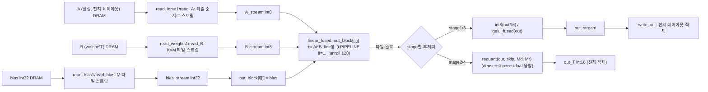
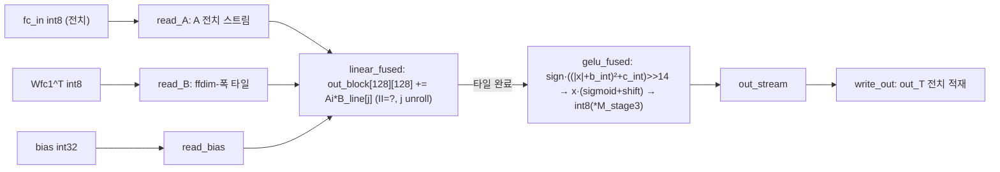
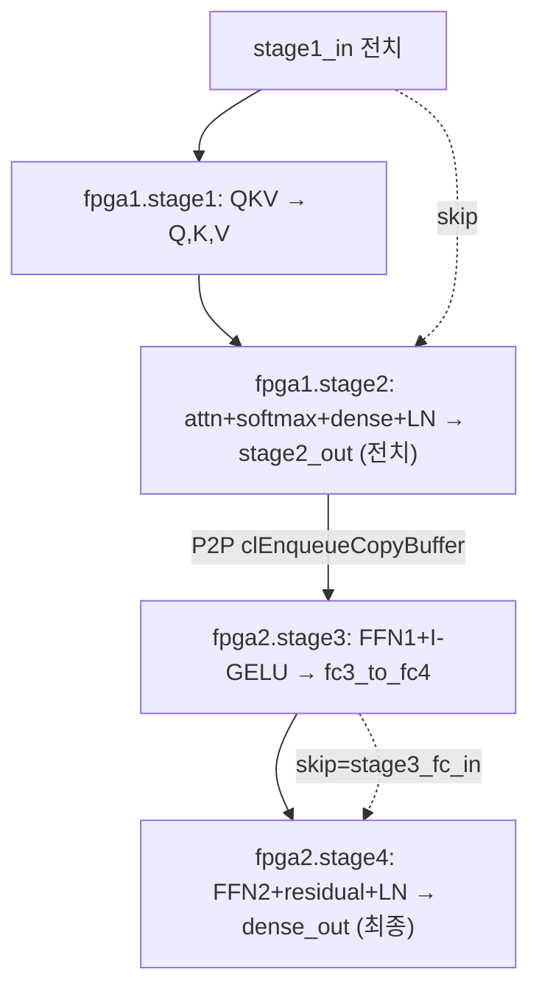

# trans-fat 모듈 통합 가이드

> 1차 요약(맥락): [`../trans-fat.md`](../trans-fat.md)
> 소스 루트: `REF/Transformer-Accel/trans-fat`. 구현 본체는 **Vitis HLS C++**(커널 2개 `fpga1`/`fpga2`, 그 안에 stage1~4). RTL 자체 소스 없음. SW 골든은 PyTorch(`bert_sw/`).
> 표기 규약: 라인으로 직접 확인한 사실은 단정, 코드 정황 기반은 "추정", 코드/리포트에 없으면 "확인 불가".
> **PPA 정정**: 1차 요약은 `builds/`를 "제외 대상"으로 보고 합성 PPA를 "확인 불가"로 적었으나, 본 가이드 작성 중 `builds/v{0..3}.fpga{1,2}/*_csynth.rpt`·`impl_1_kernel_util_routed.rpt`·`impl_1_..._timing_summary_routed.rpt`가 **실제로 존재**함을 확인했다. 따라서 §0.4·§6·§각 모듈 정량에 csynth/routed 실수치를 인용한다(비트스트림 `.xclbin`은 여전히 제외, 이름만 언급).
> 제외물(이름만): `builds/**/*.xclbin`(비트스트림), `builds/**/host_fpga{1,2}`·`fpga/host_{fpga1,fpga2,all}`(컴파일된 호스트 실행파일), `common/includes/{xcl2,oclHelper,opencl,cmdparser,logger,bitmap,simplebmp}`(Xilinx 벤더 유틸), `common/utility`·`common/data`(Xilinx 예제 자산), `bert_sw/**/__pycache__`·`.ipynb_checkpoints`(생성물), `bert_sw/**/*.ipynb`(실험 노트북, 분석 대상 외), `fpga/utils.mk`(Xilinx 템플릿 헬퍼).

---

## 0. 문서 머리말

### 0.1 대표 케이스 선정

trans-fat는 **BERT/RoBERTa 인코더 레이어 1개**를 **2장의 Alveo U200**에 **4-stage**로 분할한다(`pipeline.cpp` L45·L84). 따라서 대표 케이스도 분할 경계를 가로지르도록 **두 개**를 함께 잡는다.

- **GEMM 대표 (FPGA1·stage1)**: **QKV projection**. `stage1.cpp` L196~L246 — 입력 `<seqlen=128, dmodel=768>`에 Q/K/V 세 선형층(`<dmodel,dmodel>`)을 `#pragma HLS dataflow`(L199)로 **동시 3채널** 수행 후 INT8 requant. 이 설계의 "출력-스테이셔너리 16×16... 가 아니라 128×128 타일" GEMM 엔진을 가장 깨끗하게 보여준다(`linear_fused1` L138, `out_block[128][128]` L141, dim2 complete + PIPELINE II=1 + unroll, L145·L173·L176). 모든 선형층(Q/K/V, dense, FFN1, FFN2)이 **이 동일 패턴**을 복제한다.
- **Attention 대표 (FPGA1·stage2)**: **self-attention 전체**. `stage2.cpp` L307(QKᵀ+softmax row-streaming)·L341(probs·V)·L454(dense)·L507(LayerNorm)가 한 커널 안에 직렬로 묶인다. 멀티헤드 reshape/transpose를 인덱싱으로만 처리하고(L317~L385), softmax는 한 row 완성 즉시 흘려보내는 **row-streaming**(`softmax_fused`, L336)이다. 단, **HLS softmax는 float exp/log**(L84~L91)로 GELU(정수 근사)와 대조된다.

선정 근거: (1) 두 케이스가 **동일한 128×128 출력-스테이셔너리 타일 GEMM**(stage1/2/3/4 공통)을 dense·attention 양쪽에서 보여주므로 한 패턴으로 전체를 추적 가능, (2) stage2가 I-BERT식 비선형(softmax/LayerNorm)의 HLS 실태(softmax는 float·LN은 int16 누산)를 동시에 드러내 §0.4의 데이터타입 정책과 직결된다.

### 0.2 수치 표기 규약
- **MAC lanes**: 한 사이클(II=1) 동시 곱셈기 수 = 타일 내부 unroll 폭. 모든 선형층의 GEMM 코어는 `out_block[i][j] += Ai * B_line[j]`에서 **i-루프 PIPELINE II=1 + j-루프 `#pragma HLS unroll`**(`stage1.cpp` L172~L179)이므로 **TILE_SIZE × 1 = 128 곱셈/사이클**(목표 II=1). 즉 한 사이클에 `B_line[0..127]`과 스칼라 `Ai` 곱 128개. attention 내적은 dhead=64 unroll(`stage2.cpp` L329~L332) → 64 lanes.
- **scalar MACs**: 각 GEMM의 (행)×(열)×(축약) 곱. BERT-base shape(`config.hpp` L6-10: seqlen=128, dmodel=768, ffdim=3072, nhead=12, dhead=64)로 계산.
- **loop trips / cycle**: 타일 루프 `it × jt × kt × k`(`stage1.cpp` L148~L182). csynth 리포트의 절대 사이클을 병기.
- **memory size (payload bit)**: 온칩 버퍼 깊이×폭(bit). 주요 버퍼 = `out_block[128][128]`(int32, dim2 complete=레지스터화), stage 간 DRAM 중간텐서, stage2/4의 `att_*_buff`·`lin_buff`(BRAM).
- **합성 PPA**: csynth 추정치는 "(csynth)", routed 실측은 "(routed)"로 구분 표기.

### 0.3 운영 경로 (PyTorch 골든 ↔ HLS ↔ U200 2카드 4-stage)
```
[양자화 골든]   PyTorch RoBERTa(textattack/roberta-base-MRPC) 인코더 1 레이어
        │       quant_ops.py (tensor_quant_scale/gelu/softmax/layernorm = I-BERT 차용)
        │       quant_kernels.py (linear/matmul/requantize = "HLS로 거의 그대로 매핑" 의도, L4-6)
        │       quant_layer.py layer_kernel_gt (M_* 스케일 사전계산, L141-289)
        │
[stage 골든]    pipeline.cpp fpga1_gt/fpga2_gt (L10/L31) → stage{1..4}_gt (각 .cpp 상단)
        │       = HLS 커널과 동일 시그니처의 C++ SW 참조 (bit-exact 비교 기준)
        │
[csim]          pipeline_test.cpp main() → fpga1/fpga2(HW경로) vs fpga1_gt/fpga2_gt(SW) → check() (L162-163)
        │       입력은 genmat 합성 패턴((i*N+j)%mod) — 실 RoBERTa 가중치 아님
        │
[HLS 합성]      faketime make all TARGET=hw VERSION=3 PART=fpga1|fpga2 (Makefile L22)
        │       v++ -c -k fpga1 (pipeline.cpp + stage1~4.cpp) → .xo → -l 링크 → -p 패키지 → .xclbin
        │       target xcu200-fsgd2104-2-e, ap_clk target 3.33 ns(=300 MHz) (csynth L23)
        │
[보드 실행]     host_all -x1 fpga1.xclbin -x2 fpga2.xclbin (Makefile L219)
                queue0.enqueueTask(fpga1) → P2P clEnqueueCopyBuffer (host_all.cpp L483) → queue1.enqueueTask(fpga2)
```
근거: `Makefile` L22·L116-120·L172-182·L219, `pipeline_test.cpp` L127-163, `host_all.cpp` L450-525, `quant_kernels.py` L4-6, `quant_layer.py` L141-289.

### 0.4 타깃 / 데이터타입 / 분할 정책
- **타깃**: AMD/Xilinx **Alveo U200**(`xilinx_u200_xdma_201830_2`, `Makefile` L60; 디바이스 `xcu200-fsgd2104-2-e`, csynth L12). 호스트 노드에 **U200 2장 + P2P 지원**(xdma/nodma 혼합) 필요(`README.md` L7, `host_all.cpp` L219-258). 클럭 **목표 300 MHz**(ap_clk target 3.33 ns, csynth L23). **HBM 아님** — U200 외부 DDR4(가속기는 m_axi `gmem0..14` 번들로 접근). 보드 런타임은 호스트 OpenCL/XRT.
- **데이터타입(고정 비트폭 정수)**: 활성/가중치 **`int8_t`**, 바이어스/누산 **`int32_t`**, LayerNorm 중간값·norm weight/bias **`int16_t`**, 재양자화 스케일 **`float M_*`**(`pipeline.hpp` L4-32). 즉 **weight 8b / activation 8b / accumulate 32b / LN 16b**. Edge-MoE(weight16b/act32b ap_fixed)와 달리 trans-fat는 **순수 정수형 INT8** I-BERT 스타일.
- **재양자화(requantize)**: 정수 누산 × float 스케일 → int8 절단. 기본형 `out = int8_t(in * M_scale)`(`stage1.cpp` L29). `M_*`는 PyTorch에서 `acc_scale/out_scale`로 사전계산(`quant_layer.py` L169·L223·L250). 융합형은 dense·skip·residual을 한 번에: `int16_t((int8_t(ob*Md)+sb)*Mr)`(`stage2.cpp` L390-394, `stage4.cpp` L142-146).
- **4-stage 분할 경계**:
  - **FPGA1 = fpga1 커널 = stage1 + stage2**(`pipeline.cpp` L76-80): QKV projection → self-attention(QKᵀ/softmax/·V) → output dense → +residual → LayerNorm.
  - **FPGA2 = fpga2 커널 = stage3 + stage4**(`pipeline.cpp` L105-107): FFN intermediate(768→3072)+I-GELU → FFN output(3072→768) → +residual → LayerNorm.
  - 경계 텐서(stage2_out → stage3_fc_in)는 **P2P로 FPGA1→FPGA2 직접 복사**(host_all.cpp L483, 호스트 DRAM 우회).
  - 스테이지 간 중간텐서는 대부분 **전치(transpose) 레이아웃**으로 주고받아 다음 stage가 행연속 burst로 소비(`stage1.cpp` L69, `stage2.cpp` L447·L535, `stage3.cpp` L144·L198, `stage4.cpp` L168·L219).

---

## 1. Repo / Layer 개요 (4-stage 분할 맵)

| 레이어 | 경로 | 역할 |
|---|---|---|
| **src/v0~v3/** | `src/v{0,1,2,3}/` | 동일 인터페이스의 4개 최적화 버전. v0=pragma 0(순수 SW 루프), v3=tiling+dataflow+streaming. 본 가이드는 **v3 기준**(최종 최적화). |
| **stages/** | `src/v3/stages/*.cpp` | HLS 커널 본체: `pipeline.cpp`(top fpga1/fpga2 + GT 래퍼), `stage1~4/*.cpp`(각 SW GT + HLS 커널). |
| **(헤더)** | `config.hpp`, `pipeline.hpp`, `stage{1..4}.hpp` | BERT 상수(CFG), args 구조체, TILE_SIZE 상수. |
| **host** | `src/v3/host_{fpga1,fpga2,all}.cpp` | XRT/OpenCL 호스트. `host_all`=2-FPGA P2P 오케스트레이션. |
| **testbench** | `src/v3/stages/pipeline_test.cpp` | csim: HW경로 vs SW GT bit-exact `check`. |
| **bert_sw/** | `bert_sw/src/*.py` | PyTorch 양자화 골든: `quant_ops`(I-BERT 연산), `quant_kernels`(HLS 매핑 대상), `quant_layer`(M_* 산출), `quant_roberta`(HF 주입). |
| **(빌드)** | `fpga/Makefile` | v++ 합성·링크·패키지·실행 흐름. |

- 자체 HLS 소스: v당 `pipeline.cpp` + `stage1~4.cpp` **5개** × 4버전. 헤더 6개/버전.
- **인터페이스 일관성**: stage1~4 모두 동일 골격 — ① `linear_sw#`(3중 루프 GEMM 골든) ② `requantize#` ③ `stage#_gt`(SW 참조) ④ `read_*`/`linear_fused#`/`write_*`(HLS dataflow) ⑤ `stage#`(extern "C" 커널). include 순환 없음(`config.hpp`만 공유).

### 모듈 인스턴스 계층 (top → leaf)
```
[U200 #1] fpga1  (extern "C", m_axi gmem0..14 + s_axilite control)   [pipeline.cpp L45]
├─ stage1(in, →Q,K,V, Wqkv, bias, M_q/k/v)                            [stage1.cpp L196]
│  └─ #pragma HLS dataflow
│     ├─ read_input1 (in을 3 스트림 fan-out, 전치 읽기)   [L58]
│     ├─ read_weights1 ×3 (q/k/v)                          [L80]
│     ├─ read_bias1 ×3                                     [L98]
│     ├─ linear_fused1 ×3 (128×128 타일 GEMM + requant)    [L138]   ← 대표 GEMM 코어
│     └─ write_out1 ×3                                     [L115]
└─ stage2(Q,K,V, skip=in, →out, Wdense, norm_w/b, M_*)               [stage2.cpp L561]
   ├─ attention_scores_fused (QKᵀ + scale + row-streaming softmax)   [L307]
   │  └─ softmax_fused (max/exp/log, float)                          [L71]
   ├─ attention_values_fused (probs·V, dhead unroll)                 [L341]
   ├─ linear_dataflow2 (dense + residual)                            [L541]
   │  └─ #pragma HLS dataflow: read_weight2/read_bias2/read_skip2 → linear_fused2 → write_output(requant 융합)  [L405/L425/L439/L454/L396]
   └─ layernorm_fused2 (2-pass LN, int16 누산, 전치 출력)            [L507]
                          │  P2P clEnqueueCopyBuffer (host_all.cpp L483)
                          ▼
[U200 #2] fpga2  (extern "C", m_axi gmem0..8 + s_axilite control)    [pipeline.cpp L84]
├─ stage3(fc_in, Wfc1, bias, →fc3_to_fc4, dense_acc_scale, M_stage3) [stage3.cpp L280]
│  └─ #pragma HLS dataflow: read_A/read_B/read_bias → linear_fused → write_out   [L132/L152/L173/L205/L190]
│     └─ gelu_fused (I-GELU 정수 다항 근사 + requant)               [L107]
└─ stage4(fc_in, skip, Wfc2, bias, →out, norm_w/b, M_*)             [stage4.cpp L387]
   ├─ linear_dataflow4 (FFN2 + residual)                            [L362]
   │  └─ #pragma HLS dataflow: read_A4/read_B4/read_bias4/read_skip4 → linear_fused4 → write_out(requant 융합)  [L157/L176/L196/L211/L226/L148]
   └─ layernorm_fused4 (2-pass LN, int16 누산, 비전치 출력=최종)    [L328]
```

---

## 2. 단일 GEMM 패턴 — 128×128 출력-스테이셔너리 타일 (`stage1.cpp linear_fused1` 대표)

### 2.1 역할 + 상위/하위
trans-fat의 모든 행렬곱(Q·K·V projection, output dense, FFN1, FFN2)이 **같은 코드 형태**(클래스/공유 인스턴스가 아닌 **복제된 동형 함수** `linear_fused1/2/4`, `linear_fused`)로 작성된다. Edge-MoE가 `allocation limit=1`로 **1 인스턴스 공유**한 것과 달리, trans-fat는 **각 stage마다 독립 인스턴스**를 합성한다(공유 강제 pragma 없음). 핵심 코어는 모두 `out_block[T][T] += Ai * B_line[j]`. 상위: 각 stage 커널. 하위: `read_*`/`write_*` dataflow 스테이지 + (stage별) requant/gelu.

### 2.2 데이터플로우


### 2.3 function call stack
`stage#`(extern "C") → `#pragma HLS dataflow` → { `read_input1`/`read_A`/`read_A4` ‖ `read_weights1`/`read_B`/`read_B4` ‖ `read_bias*` (‖ `read_skip*`) } → `linear_fused#`( → `int8_t(*M)` | `gelu_fused` | `requant` ) → `write_out#`. stage1만 입력·출력 각각 3채널(q/k/v) dataflow(`stage1.cpp` L228-244).

### 2.4 대표 코드 위치
`stage1.cpp` L138-193(타일 GEMM 코어 + requant), L58-131(read/write dataflow 스테이지). 동형 복제: `stage2.cpp` L454-504(+skip), `stage3.cpp` L205-277(+gelu, 비정방 타일 ffdim), `stage4.cpp` L226-278(+skip, 축약축=ffdim).

### 2.5 대표 코드 블록

(1) **128×128 출력-스테이셔너리 타일 코어 — i:PIPELINE II=1, j:unroll** (`stage1.cpp` L172~L180)
```cpp
for (int i = 0; i < TILE_SIZE1; ++i){
    #pragma HLS PIPELINE II=1
    int8_t Ai = A_line[i];
    for (int j = 0; j < TILE_SIZE1; ++j){
        #pragma HLS unroll
        out_block[i][j] += Ai * B_line[j];   // 한 사이클에 128개 곱셈(j 완전 펼침)
    }
}
```
→ `TILE_SIZE1=128`(`stage1.hpp` L4). `out_block[128][128]` int32 + `#pragma HLS array_partition dim=2 complete`(L145) → j 차원 128-way 레지스터화로 동시 누산. `B_line[128]` int8 + dim1 complete(L146). **128 MAC/cyc**(목표 II=1). bias는 타일 시작에 `out_block[i][j] = bias_stream.read()`로 초기화(L155).

(2) **타일 완료 시 requant 융합 — linear+requant 한 커널** (`stage1.cpp` L184~L188)
```cpp
for (int i = 0; i < TILE_SIZE1; ++i){
    for (int j = 0; j < TILE_SIZE1; ++j){
        out_stream.write(int8_t(out_block[i][j] * M_scale));   // int32 누산 → int8 절단
    }
}
```
→ 별도 requant 패스 없이 출력 스트림에 즉시 int8 캐스팅. `M_scale`은 호스트가 넘긴 float(`pipeline.hpp` L8).

(3) **stage2/4의 dense+skip+residual 3중 융합 requant** (`stage2.cpp` L390~L394)
```cpp
int16_t requant(int32_t ob, int8_t sb, float Md, float Mr)
{
    int8_t out8 = int8_t(ob * Md) + sb;   // dense 재양자화 후 skip 가산
    return int16_t(out8 * Mr);            // residual 재양자화 → LayerNorm 입력(int16)
}
```
→ `write_output`(L396-403)이 타일 출력마다 호출. dense·skip·residual 세 연산이 한 함수에 융합. 출력은 **전치 int16**(`out[(it*T+i)*dmodel + jt*T+j]`이 아니라 LN이 받는 레이아웃, L400). stage4도 동형 `requant_out`(L142-146).

(4) **입력 전치 읽기(v2/v3 최적화) — A를 `<dmodel,seqlen>`로 적재** (`stage1.cpp` L69)
```cpp
int8_t A_val = in[(kt * TILE_SIZE1 + k) * CFG::seqlen + it * TILE_SIZE1 + i];
```
→ 호스트가 입력을 전치로 미리 적재(`host_all.cpp` L91-95: `stage1_in[i*seqlen+j] = s1_args.in[j*dmodel+i]`). 축약축 k를 행 연속으로 읽어 DDR burst 효율↑. README v2 "Transpose A matmul input"(L43-46).

### 2.6 마이크로아키텍처 + 정량
- **Stage 분해(dataflow)**: read(A/W/bias 스트림화) ‖ compute(128×128 타일, it×jt×kt×k 4중 루프) ‖ write(타일 출력 scatter). 각 producer/consumer는 `hls::stream depth=128`(stage1 L216-226, stage2 L547-549, stage4 L371-374; stage3은 depth=8 L294-297)로 연결.
- **MAC lanes**: **128/cyc**(j-unroll). stage3은 비정방 `out_block[128][128_J]`도 128(`stage3.cpp` L224·L261, TILE_SIZE_J=128). stage3은 II=1 명시 없이 `#pragma HLS PIPELINE`(L258)만 → II는 합성기 결정(확인: csynth Loop N/A).
- **scalar MACs(BERT-base shape)**:
  - QKV 각 = 128×768×768 ≈ **75.5 M**, 3개 합 ≈ **226 M**.
  - output dense = 128×768×768 ≈ **75.5 M**.
  - FFN1(stage3) = 128×3072×768 ≈ **302 M**.
  - FFN2(stage4) = 128×768×3072 ≈ **302 M**.
  - attention QKᵀ = 12×128×128×64 ≈ **12.6 M**, probs·V 동일 ≈ **12.6 M**.
- **메모리(payload bit)**: `out_block[128][128]` int32 = 524,288 bit이나 dim2 complete로 **레지스터/LUT화**(BRAM 아님). stage 간 중간텐서 + `att_*_buff`/`lin_buff`/`fc_ln_buff`는 BRAM(§3·§6).
- **합성 PPA(v3 fpga1 csynth, `builds/v3.fpga1/fpga1_csynth.rpt`)**: 전체 latency **6,353,226 cyc = 21.175 ms**(L32), clock estimated 2.433 ns(target 3.33 ns, L23). 인스턴스별 stage1 sub = 2,012,336 cyc(6.707 ms, L41). DSP 694(csynth L68) / **831 routed**(`impl_1_kernel_util_routed.rpt` L28), BRAM 442(csynth)/253(routed), LUT ~128K(csynth)/130K(routed), FF ~115K(csynth)/124K(routed). U200 전체 대비 DSP **12.16%**, BRAM 15.81%, LUT 13.07%(routed L28).
- **병목**: stage 내부는 dataflow지만 **stage 간은 순차**(fpga1 안에서 stage1→stage2 직렬, fpga1→fpga2 P2P 후 직렬). 단일 레이어를 두 칩에 펼친 것일 뿐 레이어 파이프라인은 없음. csynth Interval ≈ latency(none pipeline, L32) → 처리량 = 1/latency. **timing 미달**: v3 fpga1 routed WNS **-0.278 ns**("Timing constraints are not met", timing rpt L142-145) → 300 MHz 목표 미달성(실 동작 주파수는 낮춰 잡힘, 정확값 확인 불가).

---

## 3. Attention 엔진 — `src/v3/stages/stage2.cpp` (가장 복잡)

### 3.1 역할 + 상위/하위
self-attention 전체 + output dense + residual + LayerNorm을 **한 커널**으로 묶는다(`stage2` L561-577, 4 서브블록 순차 호출). 멀티헤드 reshape/transpose는 메모리 인덱싱으로만 구현(텐서 재배치 버퍼 없음). 상위: `fpga1`(`pipeline.cpp` L79). 하위: `attention_scores_fused`·`softmax_fused`·`attention_values_fused`·`linear_dataflow2`·`layernorm_fused2`.

### 3.2 데이터플로우
```mermaid
flowchart TD
  Q["Q int8 <seqlen,dmodel>"] --> AS["attention_scores_fused: head별 QKᵀ, ÷√dmodel, row-streaming"]
  K["K int8"] --> AS
  AS -->|rowbuff[seqlen] 1행 완성| SM["softmax_fused: max → Σexp(x-m) → exp(x-const)*M_probs (float)"]
  SM --> ASB["att_scores_buff int8 <nhead,seqlen,seqlen> (BRAM)"]
  ASB --> AV["attention_values_fused: probs·V, dhead unroll, requant(M_attn_out)"]
  V["V int8"] --> AV
  AV --> AOB["att_out_buff int8 <seqlen,dmodel> (BRAM)"]
  AOB --> LD["linear_dataflow2: dense GEMM + read_skip2"]
  SK["skip=stage1_in (전치)"] --> LD
  LD -->|write_output: requant(dense+skip+residual)| LB["lin_buff int16 (BRAM)"]
  LB --> LN["layernorm_fused2: 2-pass(mean→var/std→affine), int16 누산"]
  NW["norm_weight/bias int16"] --> LN
  LN --> OUT["stage2_out int8 (전치 출력 out[j*seqlen+i])"]
```

### 3.3 function call stack
`fpga1` → `stage2` → `attention_scores_fused`(L307) { head·i·j 루프 → `softmax_fused`(L71, row마다) } → `attention_values_fused`(L341) → `linear_dataflow2`(L541) { dataflow: `read_weight2`(L405) ‖ `read_bias2`(L425) ‖ `read_skip2`(L439) → `linear_fused2`(L454) → `write_output`(L396, `requant` L390) } → `layernorm_fused2`(L507).

### 3.4 대표 코드 위치
`stage2.cpp` L307-339(QKᵀ + scale + row-streaming), L71-93(float softmax), L341-388(probs·V), L454-504(dense GEMM + skip), L507-539(2-pass LayerNorm int16).

### 3.5 대표 코드 블록

(1) **QKᵀ row-streaming — 한 row 완성 즉시 softmax** (`stage2.cpp` L323~L337)
```cpp
for (int j = 0; j < CFG::seqlen; j++) {
    for (int k = 0; k < CFG::dhead; k++) { key_row[k] = key[j*nhead*dhead + n*dhead + k]; }
    int32_t accum = 0;
    for (int k = 0; k < CFG::dhead; k++) {
        #pragma HLS unroll
        accum += query_row[k] * key_row[k];     // dhead=64 내적 완전 펼침
    }
    rowbuff[j] = accum / divisor;               // ÷ sqrt(dmodel) (정수 나눗셈)
}
softmax_fused(rowbuff, out, n*seqlen*seqlen + i*seqlen, M_attention_probs);  // 한 행 흘려보냄
```
→ `query_row`/`key_row` array_partition complete(L314-315)로 dhead=64 동시 곱. **64 MAC/cyc**. `divisor = sqrt(dmodel)=int32`(L309) — 주의: `÷√dhead`가 아니라 `÷√dmodel`(SW GT `scale`은 √dmodel L38, 단 PyTorch 골든 `quant_layer.py` L210은 √dhead로 나눔 → SW/HW가 PyTorch와 다름; HW와 stage_gt는 일치하므로 bit-exact는 성립).

(2) **float exp/log softmax(수치안정) — 정수 전용 아님** (`stage2.cpp` L84~L92)
```cpp
sum = 0.0;
for (i = 0; i < CFG::seqlen; ++i) { sum += exp(input[i] - m); }   // double exp
constant = m + log(sum);                                          // double log
for (i = 0; i < CFG::seqlen; ++i) {
    output[start_idx+i] = int8_t(exp(input[i] - constant)*M_softmax);
}
```
→ max-shift 수치안정 softmax. **double `exp`/`log` 사용**(L60-65도 동일) → GELU(정수 다항)와 달리 부동소수 함수기 합성 필요. PyTorch 골든의 I-Softmax(정수 다항 exp, `quant_ops.py` L123-173)는 **HLS에 미반영**(SW GT도 float softmax L44-69 사용해 bit-exact 유지).

(3) **probs·V — dhead unroll 누산** (`stage2.cpp` L372~L385)
```cpp
for (int k = 0; k < CFG::seqlen; k++) {
    for (int j = 0; j < CFG::dhead; ++j) { value_row[j] = value[k*nhead*dhead + n*dhead + j]; }
    int8_t probs_k = probs_row[k];
    for (int j = 0; j < CFG::dhead; j++) {
        #pragma HLS unroll
        row_buf[j] += probs_k * value_row[j];   // dhead=64 동시
    }
}
for (int j = 0; j < CFG::dhead; ++j)
    attn_out[i*nhead*dhead + n*dhead + j] = int8_t(row_buf[j] * M_attention_out);  // transpose-back + requant
```
→ `row_buf`/`value_row` array_partition complete(L359-360). 출력 인덱싱이 `<nhead,seqlen,dhead>`→`<seqlen,dmodel>` transpose-back을 한 번에 수행(버퍼 재배치 없음).

(4) **2-pass LayerNorm — int16 누산(오버플로 주의)** (`stage2.cpp` L525~L536)
```cpp
for (int i = 0; i < CFG::seqlen; ++i){
    int16_t acc16 = 0;
    for (int j = 0; j < CFG::dmodel; ++j){
        acc16 += int16_t(act[i*dmodel + j]*int32_t(act[i*dmodel + j])/CFG::dmodel);  // E[x²] int16 누산
    }
    int16_t stdev = int16_t(sqrt(float(acc16 + C)));   // C = eps/scaling_factor
    for (int j = 0; j < CFG::dmodel; ++j){
        act[i*dmodel + j] /= stdev;
        int16_t acc16 = int16_t((act[i*dmodel+j]*norm_weight[j] + norm_bias[j]) * scaling_factor);
        out[j*CFG::seqlen+i] = int8_t(acc16 * M_stage);   // 전치 출력
    }
}
```
→ 1차 패스(L514-523)에서 mean 빼기, 2차 패스에서 var/std/affine. **var 누산이 int16**(SW GT `layernorm_sw2`는 별도 int16 var 배열이나 동일 비트폭 L153) → 큰 분산 시 오버플로 가능(저자 주석 L512 "if I fuse this it doesn't work"). 출력 `out[j*seqlen+i]`=**전치**(다음 stage가 전치 기대).

### 3.6 마이크로아키텍처 + 정량
- **Stage 분해**: 4 서브블록 **순차**(dataflow 아님, `stage2` L566-574 단순 호출). 내부에서 dense만 `linear_dataflow2`가 dataflow.
- **MAC lanes**: QKᵀ 64/cyc, probs·V 64/cyc(둘 다 dhead unroll), dense 128/cyc(타일 GEMM), LN 비-MAC.
- **scalar MACs**: QKᵀ ≈ 12.6 M, probs·V ≈ 12.6 M, dense ≈ 75.5 M(§2.6).
- **메모리(payload bit, v3 fpga1 csynth Memory 표 L188-192)**: `att_scores_buff` = 196,608 words × 8b = **1.573 Mb**(BRAM_18K 4), `att_out_buff` = 98,304 × 8b = **0.786 Mb**(BRAM 4), `lin_buff` = 98,304 × 16b = **1.573 Mb**(BRAM 8). 합 BRAM_18K 16(csynth Memory total L192). `query_row/key_row/value_row/rowbuff/row_buf`는 partition complete=레지스터.
- **합성 PPA(v3 fpga1 인스턴스, csynth L42-45·L84-85·L105)**: `attention_scores_fused` 1,774,082 cyc(5.913 ms), DSP 94, FF 13,230, LUT 10,037. `attention_values_fused` 734,209 cyc(2.447 ms), DSP 64. `linear_dataflow2` 1,413,375 cyc(4.711 ms), DSP 134, BRAM 4. `layernorm_fused2` 419,215 cyc(1.397 ms), DSP 2.
- **병목**: (a) **non-fused attention** — scores를 `att_scores_buff`(BRAM 1.57Mb)에 전부 적재 후 ·V(FlashAttention식 통계압축 아님; Edge-MoE는 통계만 저장). (b) **float softmax** — DSP/면적·정확도 영향, 정수전용 목표와 불일치. (c) **int16 LN 누산** — 오버플로 리스크. (d) attention의 유일 병렬도는 dhead=64 unroll(head/patch 병렬 미적용).

---

## 4. FFN + I-GELU 엔진 — `src/v3/stages/stage3.cpp` (가장 큰 GEMM)

### 4.1 역할 + 상위/하위
FFN intermediate: `<seqlen,dmodel> × <dmodel,ffdim>`(768→3072) 선형층 + **I-GELU 정수 근사** + INT8 requant. 단일 레이어 최대 GEMM(128·768·3072 ≈ 302 M). 상위: `fpga2`(`pipeline.cpp` L105). 하위: dataflow read/compute/write + `gelu_fused`.

### 4.2 데이터플로우


### 4.3 function call stack
`fpga2` → `stage3`(L280) → `#pragma HLS dataflow`(L299) { `read_A`(L132) ‖ `read_B`(L152) ‖ `read_bias`(L173) → `linear_fused`(L205, b_int/c_int/shift_int 사전계산 L215-221) → `gelu_fused`(L107, 타일 출력마다) → `write_out`(L190) }.

### 4.4 대표 코드 위치
`stage3.cpp` L107-130(I-GELU 융합 스칼라), L28-71(I-GELU SW GT), L205-277(타일 GEMM + gelu 호출), L215-221(GELU 상수 사전계산).

### 4.5 대표 코드 블록

(1) **I-GELU 정수 다항 근사 — exp/erf 호출 없음** (`stage3.cpp` L117~L128)
```cpp
const int constant = 14;
int32_t sign = (gelu_in >= 0) ? 1 : -1;
int32_t val_abs = gelu_in * sign;
int32_t abs_int = std::min(val_abs, -1 * b_int);          // 포화 클램프
int32_t intermediate = (abs_int + b_int);
int32_t y_int = sign * (intermediate * intermediate + c_int);   // 2차 다항(erf 근사)
int32_t sigmoid_int = y_int / (1 << constant);            // >>14
gelu_in = gelu_in * (sigmoid_int + shift_int);
return int8_t(gelu_in * M_stage3);                        // GELU + requant 융합
```
→ I-BERT 차용(`quant_ops.py` L83-115 `tensor_quant_gelu`, "Copied this from I-BERT" L86). 상수 `k=1.4142, coef_0=-0.2888, coef_1=-1.769, coef_2=1/coef_0, constant=14`(L208-212). `b_int=coef_1/int_erf_scaling`, `c_int=coef_2/int_erf_scaling²`, `shift_int=1/sigmoid_scaling`(L215-221). **DSP 절약형 비선형**(곱 + shift, exp/erf 미사용 → softmax와 정반대).

(2) **비정방 타일 — A 전치 + ffdim 폭** (`stage3.cpp` L144, L256~L264)
```cpp
A_stream.write(A[(kt * TILE_SIZE + k) * CFG::seqlen + it * TILE_SIZE + i]);   // read_A 전치
...
for (int i = 0; i < TILE_SIZE; ++i){
    #pragma HLS PIPELINE
    int8_t Ai = A_T_line[i];
    for (int j = 0; j < TILE_SIZE_J; ++j){
        #pragma HLS unroll
        out_block[i][j] += Ai * B_line[j];   // TILE_SIZE_J=128
    }
}
```
→ `TILE_SIZE=TILE_SIZE_J=128`(`stage3.hpp` L5-6). ffdim=3072 → jt 타일 24개(3072/128). `#pragma HLS PIPELINE`만(II 미명시, L258), j-unroll로 128 lanes.

### 4.6 마이크로아키텍처 + 정량
- **Stage 분해**: dataflow read_A ‖ read_B ‖ read_bias → linear_fused(it=1×jt=24×kt=6 타일) → write_out(전치). 스트림 depth=8(L294-297, 다른 stage의 128보다 얕음).
- **MAC lanes**: 128/cyc(j unroll).
- **scalar MACs**: FFN1 = 128×3072×768 ≈ **302 M**(레이어 최대).
- **메모리(v3 fpga2 csynth Memory L106)**: `fc_ln_buff`(stage4 공유) = 98,304 words × 16b = **1.573 Mb**(BRAM_18K 8). stage3 자체 GEMM 버퍼 `out_block[128][128]`는 partition으로 레지스터.
- **합성 PPA(v3 fpga2, csynth L42·L94)**: `stage3_1` 인스턴스 8,049,338 cyc(**26.828 ms**, fpga2 최대), DSP 131, FF 15,956, LUT 24,632. fpga2 전체 latency 15,927,501 cyc(**53.086 ms**, csynth L32) = stage3 + stage4(24.861 ms) + LN. fpga2 routed: DSP **285(4.17%)**, BRAM 128(7.48%), LUT 66,549(6.59%)(`builds/v3.fpga2/impl_1_kernel_util_routed.rpt` L28).
- **병목**: 최대 GEMM이라 fpga2 latency 지배. j-unroll 128이 유일 병렬도(kt=6 축약은 순차 누산). gelu는 곱 1 + shift라 짧음.

---

## 5. FFN 출력 + Residual + LayerNorm — `src/v3/stages/stage4.cpp`

### 5.1 역할 + 상위/하위
FFN output: `<seqlen,ffdim> × <ffdim,dmodel>`(3072→768) + skip + INT16 requant + LayerNorm → 레이어 **최종 출력**(비전치 표준 레이아웃). 상위: `fpga2`(`pipeline.cpp` L106). 하위: `linear_dataflow4` + `layernorm_fused4`.

### 5.2 데이터플로우
```mermaid
flowchart LR
  A["fc_in int8 (stage3 출력, 전치)"] --> LD["linear_dataflow4 (dataflow)"]
  W["Wfc2^T int8 <ffdim,dmodel>"] --> LD
  SK["skip=stage3_fc_in (전치)"] --> LD
  LD -->|linear_fused4 + write_out(requant_out)| FB["fc_ln_buff int16 (BRAM)"]
  FB --> LN["layernorm_fused4: 2-pass int16, 비전치 출력"]
  NW["norm_weight/bias int16"] --> LN
  LN --> OUT["dense_out int8 out[i*dmodel+j] (표준 레이아웃 = 레이어 최종)"]
```

### 5.3 function call stack
`fpga2` → `stage4`(L387) → `linear_dataflow4`(L362) { dataflow: `read_A4`(L157) ‖ `read_B4`(L176) ‖ `read_bias4`(L196) ‖ `read_skip4`(L211) → `linear_fused4`(L226, `write_out`/`requant_out` L148/L142) } → `layernorm_fused4`(L328).

### 5.4 대표 코드 위치
`stage4.cpp` L226-278(타일 GEMM, 축약축=ffdim), L328-360(2-pass LN, 비전치), L281-326(주석처리된 cyclic partition 시도 흔적 — 미사용).

### 5.5 대표 코드 블록

(1) **축약축=ffdim 타일 GEMM** (`stage4.cpp` L252~L272)
```cpp
for (int kt = 0; kt < CFG::ffdim/TILE_SIZE4; ++kt)   // ffdim=3072 → kt 24개
{
    for (int k = 0; k < TILE_SIZE4; ++k) {
        for (int j = 0; j < TILE_SIZE4_J; ++j) { B_line[j] = B_stream.read(); }
        for (int i = 0; i < TILE_SIZE4; ++i) { A_T_line[i] = A_stream.read(); }
        for (int i = 0; i < TILE_SIZE4; ++i){
            #pragma HLS PIPELINE
            int8_t Ai = A_T_line[i];
            for (int j = 0; j < TILE_SIZE4_J; ++j){
                #pragma HLS unroll
                out_block[i][j] += Ai * B_line[j];
            }
        }
    }
}
```
→ stage3과 대칭(in/out 차원 swap). `TILE_SIZE4=TILE_SIZE4_J=128`(`stage4.hpp` L5-6). kt=24 축약 누산 후 `write_out`이 `requant_out`(dense+skip+residual)로 int16 적재(L275).

(2) **비전치 최종 출력 LayerNorm** (`stage4.cpp` L353~L357)
```cpp
for (int j = 0; j < CFG::dmodel; ++j){
    act[i*dmodel + j] /= stdev;
    int16_t acc16 = int16_t((act[i*dmodel+j]*norm_weight[j] + norm_bias[j]) * scaling_factor);
    out[i*CFG::dmodel + j] = int8_t(acc16 * M_stage);   // 표준 <seqlen,dmodel> = 레이어 최종
}
```
→ stage2 LN과 동일 2-pass지만 출력이 `out[i*dmodel+j]`=**비전치**(레이어 최종이라 후속 stage 없음). int16 누산 동일(오버플로 주의).

### 5.6 마이크로아키텍처 + 정량
- **Stage 분해**: `linear_dataflow4`(dataflow) → `layernorm_fused4`(순차). 저자 주석 L364 "linear 끝난 뒤 LN 시작 — 향후 스트리밍 융합 가능"(미적용, 우선순위 낮음).
- **MAC lanes**: 128/cyc. **scalar MACs**: FFN2 = 128×768×3072 ≈ **302 M**.
- **메모리**: `fc_ln_buff[128][768]` int16 = **1.573 Mb**(BRAM 8, csynth Memory L106). stage3과 공유 안 함(별 인스턴스).
- **합성 PPA(v3 fpga2, csynth L41·L43·L93)**: `linear_dataflow4` 7,459,071 cyc(**24.861 ms**), DSP 134, BRAM 4, FF 15,848, LUT 23,754. `layernorm_fused4` 419,087 cyc(1.397 ms), DSP 9.
- **병목**: stage3과 함께 fpga2 latency 지배(302 M MAC). LN과 linear가 직렬(미융합).

---

## 6. 최상위 오케스트레이션 + 빌드/검증 — `pipeline.cpp`, `Makefile`, `host_all.cpp`, `pipeline_test.cpp`

### 6.1 역할 + 상위/하위
`fpga1`/`fpga2`는 `extern "C"` 커널로, 모든 포인터 포트를 **개별 m_axi 번들**(`gmem0..14`/`gmem0..8`)에 매핑하고 스칼라(M_*)와 return을 `s_axilite control`에 둔다(`pipeline.cpp` L51-74·L88-102). 번들 분리는 DDR 다중 채널 동시 접근용. 하위: stage1~4.

### 6.2 데이터플로우 (레이어 전체, 2칩)


### 6.3 대표 코드 블록

(1) **m_axi 번들 분리 → DDR 다중 채널** (`pipeline.cpp` L51~L64)
```cpp
#pragma HLS interface m_axi port=stage1_in bundle=gmem0
#pragma HLS interface m_axi port=query bundle=gmem1
#pragma HLS interface m_axi port=key bundle=gmem2
#pragma HLS interface m_axi port=value bundle=gmem3
#pragma HLS interface m_axi port=stage1_query_weight_t bundle=gmem4
...
#pragma HLS interface s_axilite port=stage1_M_query bundle=control
#pragma HLS interface s_axilite port=return bundle=control
```
→ fpga1은 gmem0~14(15 번들), fpga2는 gmem0~8(9 번들). csynth Interface가 각 번들 `m_axi ... WDATA 512b`(L440)로 펼침 — 입출력 512b widen. v3 fpga1 RTL Ports에 15개 gmem AXI 마스터 확인(csynth L425-).

(2) **P2P FPGA1→FPGA2 직접 복사 (호스트 DRAM 우회)** (`host_all.cpp` L475~L486)
```cpp
OCL_CHECK(err, err = xcl::P2P::getMemObjectFd(buffer_stage3_fc_in(), &fd));   // FD 추출
cl_mem exported_buf;
OCL_CHECK(err, err = xcl::P2P::getMemObjectFromFd(context[0](), device_id[0], 0, fd, &exported_buf));
OCL_CHECK(err, err = clEnqueueCopyBuffer(queue[0](), buffer_stage2_out(), exported_buf, 0, 0,
            sizeof(...)*stage2_out.size(), 0, nullptr, &event));   // FPGA1→FPGA2 직접
```
→ stage2_out(FPGA1)을 FPGA2 주소공간에 import 후 직접 복사. 비-P2P 폴백(호스트 memcpy)이 주석 보존(L458-468) — 성능 비교용. P2P엔 xdma/nodma 혼합 디바이스 필요(L252-258).

(3) **csim bit-exact 검증** (`pipeline_test.cpp` L159~L163)
```cpp
fpga1_gt(s1_args, s2_args);   // SW 골든
fpga2_gt(s3_args, s4_args);
std::cout << "fpga1 out: " << (check(s2_args.out, stage2_test_out, ...) ? "PASSED" : "FAILED");
std::cout << "fpga2 out: " << (check(s4_args.dense_out, test_out, ...) ? "PASSED" : "FAILED");
```
→ `check`는 **정확히 같은가**(`A[i] != B[i]`면 fail, L36) — MSE 임계가 아닌 **bit-exact 일치**. 입력은 `genmat`(`(i*N+j)%mod`, L20-29) 합성 패턴 → 수치검증·타이밍용 testbench(실 RoBERTa 가중치 아님). host_all도 동일 `check`(L512·L517).

### 6.4 마이크로아키텍처 + 정량
- **분할**: 1 레이어 = fpga1(stage1+2) + fpga2(stage3+4), 칩 간 P2P. **칩 내·칩 간 모두 순차**(레이어 파이프라인 없음).
- **AXI**: 포트별 개별 번들 + 512b WDATA/RDATA(csynth L440). config 명시 interface 설정은 Makefile에 없음(v++ 기본).
- **빌드 산출물**: csynth/util/timing 리포트가 `builds/v{0..3}.{fpga1,fpga2}/`에 자동 복사(`Makefile` L151-158).
- **합성 PPA 요약(v3 routed)**: fpga1 — DSP 831(12.16%), BRAM 253(15.81%), LUT 130,483(13.07%), FF 124,004(5.91%)(`v3.fpga1/impl_1_kernel_util_routed.rpt` L28). fpga2 — DSP 285(4.17%), BRAM 128(7.48%), LUT 66,549(6.59%), FF 67,673(3.19%)(`v3.fpga2/...` L28). **timing 미달**: v3 fpga1 WNS -0.278 ns(timing rpt L142).
- **csynth latency 절대치**: fpga1 21.175 ms(L32), fpga2 53.086 ms(L32). README 실측 latency(v3 fpga1=35.03 ms, fpga2=71.76 ms, all=110.99 ms, README L85-89)는 호스트 측정(DDR·P2P·런타임 포함)이라 csynth보다 큼.

---

## 7. PyTorch 양자화 골든 — `bert_sw/` (HW의 bit-exact 기준)

### 7.1 역할 + 상위/하위
HLS 커널의 **골든 모델**. `quant_kernels.py`가 "HLS로 거의 그대로 매핑"되는 정수 커널(L4-6), `quant_ops.py`가 I-BERT식 비선형, `quant_layer.py layer_kernel_gt`가 **M_* 스케일 사전계산**. 상위: 없음(오프라인). 하위: HF RoBERTa(`quant_roberta.py`).

### 7.2 대표 코드 블록

(1) **M_* 스케일 사전계산 → HLS float 인자** (`quant_layer.py` L169·L223·L250)
```python
M_query = query_acc_scale / query_out_scale            # stage1 M_query
M_attention_out = attention_prob_scale * value_out_scale / attention_out_scale   # stage2
stage2_args['M_stage2'] = (1/attention_out_scale)
```
→ 이 float 값들이 그대로 HLS 커널 인자(`pipeline.hpp` M_*)로 전달. HW는 스케일 계산을 하지 않고 받기만 함(설계 분담).

(2) **HLS 매핑 의도 명문화** (`quant_kernels.py` L4~L6)
```python
'''These kernels ... operate mainly on integer types.
These will be mapped, almost exactly as they are, to HLS kernels.'''
```
→ `linear_kernel`(L8, int8·int8→int32 matmul+bias), `matmul_kernel`(L28), `requantize_kernel`(L47, clip→int8)이 각각 HLS `linear_fused#`/`attention_*_fused`/`requant#`에 대응(매핑표 §9).

### 7.3 정량 / 한계
- 가중치 shape(`quant_layer.py` L157-279): qkv/dense `(768,768)`, fc1 `(3072,768)`, fc2 `(768,3072)`, bias/norm `(768)`. config는 `config.hpp` L6-10과 일치.
- **softmax/LayerNorm 불일치**: PyTorch I-Softmax(정수 다항, `quant_ops.py` L123-173)·I-LayerNorm(int16, L176-228)은 **HLS와 다름** — HLS softmax는 float(§3.5-2), HLS LN은 PyTorch I-LN과 알고리즘 형태는 닮았으나 SW GT(`layernorm_sw2`)와만 bit-exact. 즉 **bit-exact 기준은 stage#_gt(C++)이지 PyTorch가 아니다**(testbench가 stage#_gt와 비교, `pipeline_test.cpp` L159).

---

## 8. 모듈 한눈 요약 표

| # | 모듈 | 파일(v3) | 핵심 역할 | MAC lanes(목표 II=1) | 대표 scalar MACs | 주 메모리 | 핵심 병목 | 합성 PPA(인스턴스, csynth) |
|---|---|---|---|---|---|---|---|---|
| 2 | 128×128 타일 GEMM | `stage1.cpp` | 모든 선형층 공통 패턴(복제) | 128 (j-unroll) | QKV 226M / dense 75.5M | out_block 레지스터 | stage 간 순차 | stage1: 2.01M cyc, DSP 393 |
| 3 | Attention | `stage2.cpp` | QKᵀ/softmax/·V + dense + LN | 64(QKᵀ/·V) / 128(dense) | QKᵀ 12.6M / ·V 12.6M | att_scores 1.57Mb(BRAM) | non-fused, float softmax | scores: 1.77M cyc DSP94 / values 0.73M DSP64 |
| 4 | FFN1 + I-GELU | `stage3.cpp` | 768→3072 + 정수 GELU | 128 | FFN1 **302M** | fc_ln_buff 1.57Mb | 최대 GEMM(fpga2 지배) | stage3: 8.05M cyc(26.8ms) DSP131 |
| 5 | FFN2 + LN | `stage4.cpp` | 3072→768 + residual + LN | 128 | FFN2 **302M** | fc_ln_buff 1.57Mb(BRAM8) | LN·linear 미융합 | linear4: 7.46M cyc(24.9ms) DSP134 |
| 6 | Top/P2P/검증 | `pipeline.cpp`/`host_all.cpp` | 2칩 4-stage + P2P + bit-exact | — | — | 중간텐서 DRAM | 칩간 순차 | fpga1 21.2ms / fpga2 53.1ms(csynth) |
| 7 | PyTorch 골든 | `bert_sw/*.py` | M_* 산출 + I-BERT 연산 | — | — | — | softmax/LN HLS와 불일치 | — |

**v3 routed 전체**: fpga1 DSP 831(12.16%)/BRAM 253(15.81%)/LUT 130K(13.07%), fpga2 DSP 285(4.17%)/BRAM 128(7.48%)/LUT 67K(6.59%). timing: fpga1 WNS **-0.278 ns**(300 MHz 미달).

---

## 9. HW/SW 매핑표 (PyTorch ↔ HLS 커널 ↔ 호스트)

| 연산 | PyTorch (bert_sw) | HLS 커널 함수 (v3) | 호스트 인자 |
|---|---|---|---|
| INT8 대칭 양자화 스케일 | `tensor_quant_scale` (`quant_ops.py` L11) | (오프라인 사전계산) | `M_*` float |
| INT8 linear (W^T·a+bias) | `linear_kernel` (`quant_kernels.py` L8) | `linear_sw#`/`linear_fused#` | weight_t, bias |
| INT8 matmul (QKᵀ, probs·V) | `matmul_kernel` (`quant_kernels.py` L28) | `attention_scores_fused`/`attention_values_fused` (`stage2.cpp` L307/L341) | — |
| INT32→INT8 재양자화 | `requantize_kernel` (`quant_kernels.py` L47) | `requantize#`/`requant`/`requant_out` (`stage1.cpp` L26, `stage2.cpp` L390, `stage4.cpp` L142) | `M_*` |
| Softmax | `tensor_quant_softmax` (I-Softmax 정수, `quant_ops.py` L123) | `softmax`/`softmax_fused` (`stage2.cpp` L44/L71) **※HLS는 float exp/log** | `M_attention_probs` |
| GELU | `tensor_quant_gelu` (I-GELU, `quant_ops.py` L83) | `gelu_sw`/`gelu_fused` (`stage3.cpp` L28/L107) | `dense_acc_scale`, `M_stage3` |
| LayerNorm | `tensor_quant_layernorm` (`quant_ops.py` L176) | `layernorm_sw#`/`layernorm_fused#` (`stage2.cpp` L141/L507, `stage4.cpp` L75/L328) | `norm_weight/bias`, `M_*` |
| Stage 조립 | `stage1~4` (`quant_layer.py`) | `fpga1`/`fpga2` (`pipeline.cpp` L45/L84) | args 구조체 (`pipeline.hpp`) |
| 레이어 골든 + M_* | `layer_kernel_gt` (`quant_layer.py` L141) | `fpga1_gt`/`fpga2_gt` (`pipeline.cpp` L10/L31) | genmat 합성데이터 |

- **bit-exact 기준**: testbench는 HLS 커널을 **C++ stage#_gt**와 비교(`pipeline_test.cpp` L159-163), PyTorch와 직접 비교하지 않음. PyTorch는 M_* 도출·알고리즘 출처 역할.

---

## 10. 읽기·코드추적 순서 (권장)

1. **상수/타입**: `config.hpp`(BERT shape) → `pipeline.hpp`(args 구조체 = 자료형 정책) → `stage{1..4}.hpp`(TILE_SIZE).
2. **top 골격**: `pipeline.cpp` L45-108(fpga1/fpga2 = 4-stage 매핑 + m_axi 번들).
3. **공통 GEMM 패턴**: `stage1.cpp` L196-246(dataflow 골격) → L138-193(128×128 타일 코어) → L58-131(read/write). 이 패턴이 stage2/3/4에 복제됨을 확인.
4. **Attention**: `stage2.cpp` L561-577(서브블록 순서) → L307-339(QKᵀ row-streaming) → L71-93(float softmax) → L341-388(·V) → L454-504(dense) → L507-539(LN).
5. **FFN**: `stage3.cpp` L280-307(dataflow) → L107-130(I-GELU) → `stage4.cpp` L387-396 → L226-278 → L328-360.
6. **검증·빌드**: `pipeline_test.cpp`(bit-exact check) → `host_all.cpp` L450-525(P2P) → `Makefile` L116-182·L219(합성·실행).
7. **골든**: `quant_kernels.py`(HLS 매핑 의도) → `quant_layer.py` L141-289(M_* 산출) → `quant_ops.py`(I-BERT 연산, softmax/LN의 PyTorch↔HLS 불일치 확인).
8. **(선택) 버전 진화**: `src/v0/stages/stage1.cpp`(pragma 0, 순수 SW) → v1 → v2(전치) → v3(스트리밍). csynth latency 대조(§11).

---

## 11. 병목 후보 & 병렬도 노브

| 노브 | 위치 | 현재값 | 효과 | 리스크 |
|---|---|---|---|---|
| `TILE_SIZE#` | `stage#.hpp` | 128 | ↑면 타일 GEMM 병렬↑ | out_block 레지스터 폭↑, seqlen 종속 |
| j-루프 unroll | `stage1.cpp` L176 등 | complete(128) | MAC lanes 결정 | DSP/LUT↑ |
| stream depth | `stage1.cpp` L216 등 | 128(stage3=8) | dataflow 중첩 깊이 | BRAM/FIFO↑ |
| stage 간 융합 | `stage4.cpp` L364 주석 | 미융합(linear→LN 순차) | fuse면 latency↓ | 재설계, BRAM↑ |
| softmax 정수화 | `stage2.cpp` L71 | float exp/log | 정수화면 DSP↓ | I-Softmax HLS화 필요 |
| LN 누산 비트폭 | `stage2.cpp` L528 | int16 | int32면 오버플로 해소 | BRAM/면적↑ |
| 칩 간 P2P | `host_all.cpp` L483 | 1회 직접복사 | 호스트 왕복 제거 | xdma/nodma 혼합 필요 |
| 레이어 파이프라인 | (없음) | 칩내·칩간 순차 | 펼치면 throughput↑ | 면적 대폭↑(HG-PIPE식) |
| **timing closure** | csynth target 3.33ns | WNS -0.278ns(미달) | 주파수↓/재배치 필요 | 처리량 추가 손실 |

**핵심 병목 진단**: trans-fat는 **검증·이식성·교본성**(v0~v3 동일 알고리즘 4단계, SW골든 bit-exact)을 처리량보다 우선한 **연구/프로토타입 설계**다. (1) **모든 GEMM이 128×128 출력-스테이셔너리 타일을 복제**(공유 인스턴스 아님 → 면적은 늘되 stage별 독립). (2) **stage·칩 모두 순차**(레이어 파이프라인 없음, P2P는 칩간 전송만 가속). (3) **fpga2가 latency 지배**(FFN1/2 각 302M MAC, csynth 53.1 ms vs fpga1 21.2 ms). (4) **정수전용 미완**: GELU만 정수 다항, **softmax는 float exp/log**, **LN은 int16 누산(오버플로 리스크)**. (5) **timing 미달**: v3 fpga1 routed WNS -0.278 ns로 300 MHz 목표 미달성 → 실 latency(README 35.03 ms)가 csynth(21.2 ms)보다 큰 한 원인. 고처리량(HG-PIPE식 전층 펼침)과는 정반대 트레이드오프.

---

## 12. SW↔HW 비트정합 검증 방식

- **기준**: 각 HLS stage 커널과 **동일 시그니처의 C++ `stage#_gt`**(SW 참조)를 동봉. `fpga1_gt`/`fpga2_gt`가 stage1~4_gt를 체이닝(`pipeline.cpp` L10-41).
- **csim**: `pipeline_test.cpp`가 HW경로(`fpga1`/`fpga2`)와 SW경로(`*_gt`)를 같은 genmat 입력으로 돌려 `check`(**bit-exact**, `A[i]!=B[i]`면 fail, L36)로 PASS/FAIL. host_all도 보드 실행 후 동일 `check`(L512·L517) + chrono latency(L521-523).
- **bit-exact가 stage#_gt 기준인 이유**: PyTorch I-Softmax/I-LayerNorm은 HLS와 알고리즘이 다르므로(softmax float, LN int16), 검증 앵커를 C++ SW GT로 둠. PyTorch는 **M_* 스케일 도출 + 알고리즘 출처**(I-BERT) 역할(`quant_layer.py` L141-289, `quant_ops.py` L86).
- **합성 검증 자산**: csynth/util/timing 리포트 `builds/v{0..3}.{fpga1,fpga2}/`에 보존(latency·PPA·timing closure 실측). 비트스트림 `.xclbin`은 제외.

### 버전 진화(csynth latency 대조, fpga1 기준)
| 버전 | csynth latency(cyc) | absolute | DSP(csynth) | BRAM(csynth) | 핵심 최적화 | 근거 |
|---|---|---|---|---|---|---|
| v0 | 588M~624M | 1.96~2.08 sec | 140 | 46 | 없음(pragma 0) | `v0.fpga1/fpga1_csynth.rpt` L32·L73 |
| v2 | 11.39M | 37.98 ms | 432 | 442 | A전치, A.T캐시, j타일↑, head unroll | `v2.fpga1/...` L32·L68 |
| v3 | 6.35M | 21.18 ms | 694 | 442 | linear DDR 입출력 스트리밍 | `v3.fpga1/...` L32·L68 |
- pragma 수 = 최적화 강도(Grep 217건/15파일): v0=0, v3 stage1=14·stage2=15·stage3=11·stage4=16·pipeline=39. README 실측 latency(v0=4723.71 → v3=35.03 ms, fpga1 약 135×, README L67-89)와 방향 일치(csynth는 호스트·DDR 제외라 절대치는 작음).
