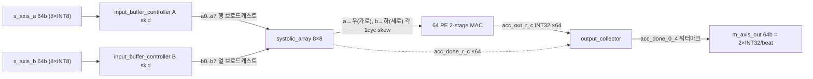
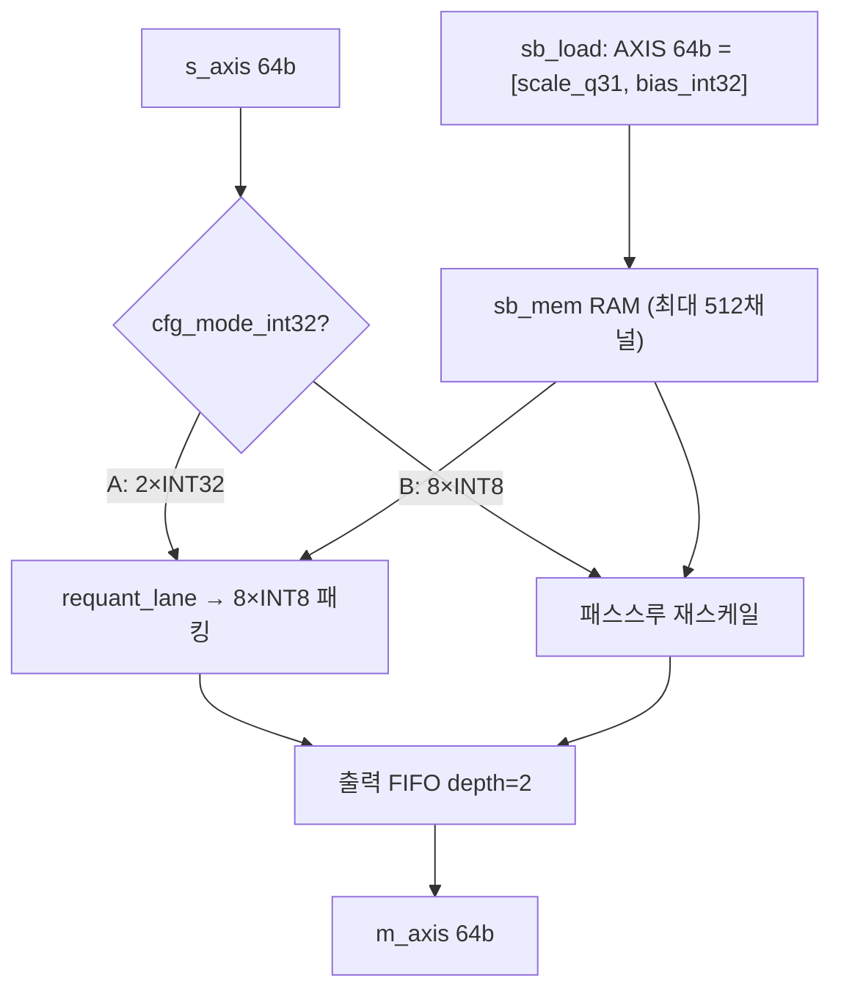
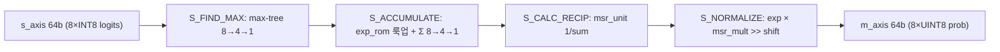
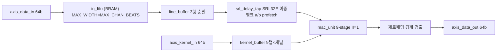
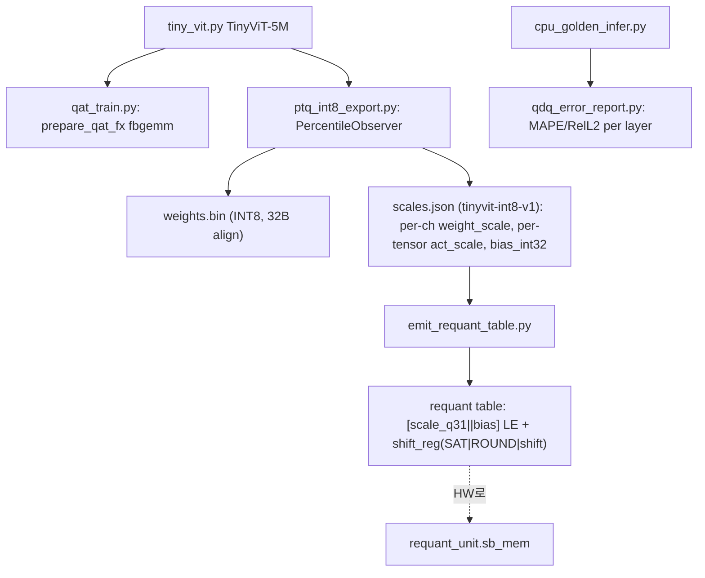

# vit-tiny-accelerator 모듈 통합 가이드

> 1차 요약(맥락): [`../vit-tiny-accelerator.md`](../vit-tiny-accelerator.md)
> 소스 루트: `REF/Transformer-Accel/vit-tiny-accelerator`. 본 가이드는 **`fpga/rtl/`** 를 정본(핸드라이트 Verilog/SystemVerilog)으로 삼고, PyTorch 측(`models/`)·PS 베어메탈(`sw/`)·문서(`fpga/docs/`, README/SCHED/SHAPE_TRACE)는 보조 근거로 교차 인용한다.
> 표기 규약: 라인으로 직접 확인한 사실은 단정, 코드 정황 기반은 "추정", 코드/문서에 없으면 "확인 불가".
> 제외물(이름만): `fpga/rtl/hdmi/`(TMDS/VDMA 데모 출력), Xilinx AXI DMA IP(외부, 미포함 — `axi_dma_shim`만 자체), 빌드 산출물(`*.bin` weights.bin·`*.mem`/`*.hex` LUT·`ila_waveform/*.png`·Questa `work/`·`xilinx_lib/` UNISIM), `models/core/tiny_vit.py`의 Microsoft TinyViT 모델 골격(adapted-from third-party, `tiny_vit.py:1-8`), `clip.py`(OpenAI CLIP 계열 추정).

---

## 0. 문서 머리말

### 0.1 대표 케이스 선정
이 설계는 **단일 8×8 INT8 시스톨릭 GEMM 코어**를 모든 행렬곱에 시간다중화(time-multiplex)로 공유하고, **단일 `scheduler_tiler` FSM**이 전 레이어 시퀀스를 자율 구동하는 **Central Interconnect** 아키텍처다(`README.md:395`). 따라서 대표 케이스도 두 개를 함께 잡는다.

- **연산 대표(검증된 데이터플로우)**: TinyViT-5M **Stage 1 Block의 QKV projection** 한 타일. `(N=784, C=128)` 입력 → `(784, 384)` Q/K/V(`SHAPE_TRACE.md:108`). 8×8 타일 = `gemm_core_top`의 한 `start_tile`이 K=8 누산 1타일을 처리(`processing_element.v:79` `mac_count + ONE == ARRAY_SIZE_COUNT`, `ARRAY_SIZE=8`). SCHED.md 의사코드 `k += 8`(`SCHED.md:103, 195`)과 일치 — 리포의 GEMM RTL+TB가 실제로 돌려본 단위. (확인됨)
- **통합 대표(미완성 마스터)**: **`scheduler_tiler` FSM** `S_IDLE→S_LOAD_WEIGHT→S_LOAD_INPUT→S_COMPUTE→S_STORE_OUTPUT→S_DONE`(`scheduler_tiler.v:61-66, 465-538`). PatchEmbed/QKV/Score/Softmax/Context/MLP/PatchMerging의 ping-pong 주소 생성을 op_class·stage별 case로 분기(`scheduler_tiler.v:217-362`). **단, 포트 선언 문법오류 2건으로 현 상태 합성/시뮬 불가**(§말미 결함). (확인됨)

선정 근거: (1) 리포에서 RTL+TB+ILA로 완성도 높게 검증된 단위(GEMM/Softmax/LayerNorm/Requant), (2) 시스템 통합의 핵심이자 미완성인 단위(scheduler_tiler). 두 케이스로 "검증된 컴퓨트 유닛 ↔ 미완성 통합 마스터"의 성숙도 편차를 모두 커버한다.

### 0.2 수치 표기 규약
- **MAC lanes**: PE 어레이의 동시 곱셈기 수. 본 설계는 **8×8 시스톨릭 = 64 PE = 64 DSP48E1**(`systolic_array.v:386-421` generate 64개, `processing_element.v:44` `(* use_dsp = "yes" *)`). 한 PE = INT8×INT8→INT32 곱 1개(2-stage 파이프). 따라서 `MAC lanes = 8×8 = 64 INT8 MAC ops/cyc`(피크).
- **scalar MACs**: 대표 레이어의 M·N·K 곱. TinyViT-5M 레이어 shape는 `SHAPE_TRACE.md`에서 직접 환산.
- **loop trips / cycle**: scheduler FSM 반복 또는 타일 차원 곱. K>8은 외부 타일 누적(`SCHED.md:103` `k += 8`).
- **memory size (payload bit)**: 버퍼 배열 깊이×폭(bit). on-chip BRAM/FIFO 각각.
- 합성 PPA(LUT/FF/DSP/BRAM 실수치)는 리포에 리포트 미동봉 → **확인 불가**(`README.md:1` Zynq-7000/`README.md:1075` Arty Z7-20 보드만 명시, 자원 예산 수치 없음).

### 0.3 운영 경로 (RTL ↔ quantization ↔ compilation ↔ host/PS)
```
[quantization]  PyTorch TinyViT → PTQ/QAT INT8 (per-channel weight / per-tensor act, 대칭)
        │  ptq_int8_export.py → weights.bin + scales.json("tinyvit-int8-v1")
        │  emit_requant_table.py → scale_q31 = rint(real_scale·2^(31+shift)) + shift_reg(SAT|ROUND|shift)
        ▼
[PS(ARM) SW]   DDR 버퍼 할당 → AXI-Lite CSR(tile_cfg/layer_cfg/addr_*/requant) 프로그래밍 → start
        │  (sw/sources/main.c, axi_dma_vdma.c)  README.md:352-360
        ▼
[scheduler_tiler] 마스터 FSM: DMA load(weight/input) → compute dispatch → writeback
        │  dma cmd(addr/len/dir) → axi_dma_shim → Xilinx AXI DMA IP <==DDR==>
        ▼
[central_interconnect] op_class 기반 6소스×7목적지 AXIS 라우팅 (mux+FIFO)
        ├─> gemm_core(A,B 64b) → INT32 → requant_unit(Q1.31+RNE) → INT8
        ├─> softmax_unit / layer_norm / relu / residual_add / depthwise_conv
        └─> buffer_bank(온칩 512KB ping/pong, transpose)
```
근거: `ptq_int8_export.py:55-59,238-257`, `emit_requant_table.py:63-64,142`, `scheduler_tiler.v:465-538`, `axi_dma_shim.v:87,116-124`, `axis_central_interconnect.v:5-6,60-121`, `requant_unit.v:139-167`.

### 0.4 타깃 / 데이터타입 / 제어 정책
- **타깃**: Xilinx **Zynq-7000** SoC, **Arty Z7-20** 보드(`README.md:1, 77, 1075`). 도구: Questa/ModelSim(sim), Vivado(synth/impl).
- **Fmax 목표**: 초기 **150 MHz**, 최적 **180–200 MHz**(`README.md:376`). PE 2-stage(~196 MHz 목표, `processing_element.v:27`), Softmax/LayerNorm 다단 reduction 분할이 이를 위함.
- **처리량 목표**: **≥1 FPS** 베이스라인, 스트레치 2–5 FPS(`README.md:337`) — 고처리량이 아닌 임베디드 실증 수준.
- **데이터타입**: 전 경로 INT8(대칭 양자화), 누산 INT32. 활성=per-tensor scale, 가중치=per-channel scale(`README.md:193`, `ptq_int8_export.py:238-257`). 데이터 평면 AXI4-Stream 64b(=8×INT8), 제어 평면 AXI4-Lite.
- **op_class / stage_id / block_role 정책**: `tile_cfg[30:28]=op_class`, `layer_cfg[27:24]=stage_id`, `layer_cfg[23:20]=block_role`(`scheduler_tiler.v:128-132`). **주의**: op_class 의미가 문서 간 불일치(§말미 결함 D3): RTL/`docs/scheduler_tiler.md:170-179`는 `011=CONTEXT(Score×V), 100=MLP1, 101=MLP2, 110=PROJ, 111=EXPAND`, 그러나 `README.md:428-435`는 `011=MLP FC1, 100=MLP FC2, 101=Residual`로 충돌.

---

## 1. Repo / Layer 개요

| 레이어 | 경로 | 역할 |
|---|---|---|
| **fpga/rtl** | `fpga/rtl/*/*.v,*.sv` | ★ 핸드라이트 RTL(주로 Verilog). GEMM·Softmax·LayerNorm·Depthwise·Requant·Residual·ReLU·scheduler·interconnect·DMA shim·AXI-Lite. **HLS 아님**(`README.md:339` "Verilog RTL"). |
| **fpga/tb, ila, benchmarking, sim, scripts, constraints** | `fpga/...` | 모듈별 TB(SystemVerilog/Verilog) + Python 골든, ILA top/파형, fmax 래퍼, Questa Makefile/파일리스트, Vivado TCL(synth_fmax/timing/bd), XDC 제약. |
| **fpga/docs** | `fpga/docs/*.md` + waveform/*.json | 모듈별 사양서(레지스터맵·FSM·인터페이스). scheduler_tiler.md는 "In development". |
| **models** | `models/core,tools,inference,common,configs` | PyTorch. 모델 정의(TinyViT adapt) + PTQ/QAT 양자화 도구 + FastAPI 추론 서버. |
| **sw** | `sw/sources,includes` | Zynq PS(ARM) 베어메탈 C: main.c, platform_init.c, axi_dma_vdma.c, tests/test_*.c. |

- 최상위 문서: `README.md`(1087줄, 매우 상세: 아키텍처/레지스터맵/op 시퀀싱), `SCHED.md`(스케줄러 타일링 의사코드, 베트남어 혼용 작업노트, "STUCK HERE" `SCHED.md:78`), `SHAPE_TRACE.md`(전 레이어 텐서 shape 추적 — 정량의 1차 근거), `models/MODEL_QUANTIZATION.md`.
- **성숙도 편차가 큼**: 개별 컴퓨트 유닛(GEMM/Softmax/LayerNorm/Depthwise/Requant/Residual/ReLU)은 RTL+TB+ILA까지 완성도 높음. 반면 시스템 통합 핵심 `scheduler_tiler`는 **문법오류 포함 미완성**(§말미), README도 scheduler/interconnect/buffer_bank를 **"Planned"** 표기(`README.md:412-414`).

### 모듈 인스턴스 계층 (top → leaf)
```
scheduler_tiler.v   (★ 시스템 마스터 FSM — 미완성/문법오류)
│   ← AXI-Lite CSR (axi_lite.v / axi_lite_reg.v)
├─ axi_dma_shim.v   (Direct Register Mode 8-state FSM → Xilinx AXI DMA IP)
│   └─ axis_source.v
├─ axis_central_interconnect.v (+_system)   (6소스×7목적지)
│   ├─ axis_mux_static.v ×7
│   └─ axis_fifo.v ×7
├─ buffer_bank.v + transpose.v   (온칩 512KB ping/pong; Planned)
└─ 컴퓨트 유닛 (interconnect로 라우팅):
   ├─ gemm_core_top.v               (8×8 systolic GEMM 조립)
   │  ├─ input_buffer_controller.v ×2  (A/B skid, 64b→8×INT8 언팩)
   │  ├─ systolic_array.v              (8×8 PE 그리드)
   │  │  └─ processing_element.v ×64   (2-stage MAC, DSP48E1 1개/셀)
   │  └─ output_collector.v            (64 acc → 2×INT32/beat 직렬화, 워터마크)
   ├─ requant_unit.v                (Q1.31+RNE+포화, per-channel sb_mem)
   ├─ softmax_unit.v                (5-state FSM, max-subtract)
   │  ├─ msr_unit.v                 (1/sum 근사: priority enc + 64-LUT)
   │  ├─ exp_rom.v + lut/exp_table_q4_16
   │  └─ softmax_fifo.v
   ├─ layer_norm.v                  (스트리밍 2-경로)
   │  ├─ accumulator.v / stats_fifo.v / avg_var_calc.v
   │  ├─ recip_sqrt.v ("peano" 근사) / final_norm_calc.v / beat_fifo.v
   ├─ depthwise_conv_unit.v         (3×3 DW, LANES=8)
   │  ├─ mac_unit.v (9-stage) / line_buffer.v / kernel_buffer.v / srl_delay_tap.v
   ├─ residual_add.v                (8레인 포화 가산, lock-step join)
   └─ relu.v                        (순조합 MSB-clamp)
```

---

## 2. GEMM 코어 — 8×8 시스톨릭 (★ 가장 중요)

### 2.1 역할 + 상위/하위
전 네트워크 모든 행렬곱(Q/K/V proj, QKᵀ, Softmax×V, MLP FC1/FC2, PatchEmbed/Merging의 im2col, Classifier)을 담당하는 **출력-고정(output-stationary) 8×8 시스톨릭 어레이**. 상위: `gemm_core_top`(scheduler가 `gemm_start`/`gemm_done`으로 구동, `scheduler_tiler.v:431-434,503`). 하위 4서브: `input_buffer_controller`×2, `systolic_array`(→`processing_element`×64), `output_collector`.

### 2.2 데이터플로우


### 2.3 인스턴스 계층
`scheduler_tiler` → `gemm_core_top` → `{buffer_a, buffer_b}` + `systolic_array`(generate 8×8 → `processing_element`) + `output_collector`(`gemm_core_top.v:44-91, 108-501`).

### 2.4 대표 코드 위치
`fpga/rtl/gemm/processing_element.v`(PE MAC), `systolic_array.v`(8×8 그리드), `input_buffer_controller.v`(skid), `output_collector.v`(직렬화), `gemm_core_top.v`(조립).

### 2.5 대표 코드 블록

(1) **2-stage MAC 파이프라인 + K=8 완료 카운터** (`processing_element.v:43-83`)
```verilog
(* use_dsp = "yes" *) wire signed [ACC_WIDTH-1:0] product;
assign product = a_in * b_in;            // Stage1: 곱
...
product_r <= product;                    // Stage1 레지스터
...
if (clear_acc) begin accumulator<=0; mac_count<=0; acc_done<=0; end   // 타일 시작 리셋
else if (mac_valid_r) begin
    accumulator <= accumulator + product_r;   // Stage2: 누산
    if (!acc_done) begin mac_count <= mac_count + ONE;
        if (mac_count + ONE == ARRAY_SIZE_COUNT) acc_done <= 1'b1; end  // K=8 후 완료
end
```
→ 곱/누산 2단 분리로 ~196 MHz 목표(`processing_element.v:27`). 각 PE는 **K=8 누산 후 `acc_done`** — K>8은 외부 타일 누적 필요(§2.6 한계).

(2) **64 PE generate, a 가로/b 세로 1cyc 전파** (`systolic_array.v:386-421`, `processing_element.v:93-96`)
```verilog
for (row...) for (col...) processing_element pe_inst (
    .a_in(a_wire[row][col]),  .a_out(a_wire[row][col+1]),   // a: 좌→우
    .b_in(b_wire[row][col]),  .b_out(b_wire[row+1][col]),   // b: 상→하
    .clear_acc(clear_acc), .acc_out(acc_wire[row][col]), .acc_done(acc_done_wire[row][col]) );
// PE 내부: a_out<=a_in; b_out<=b_in; (각 1cyc 지연 = 시스톨릭)
```

(3) **clear_acc = start_tile (★ K-누적 차단 지점)** (`gemm_core_top.v:104-105`)
```verilog
// Clear accumulators at tile start
wire clear_acc = start_tile;
```
→ 매 `start_tile`마다 누산기가 0으로 리셋. K>8(예: QKV common_depth=128) 누적이 datapath에 없음 → scheduler에 위임(§말미 결함 D2).

(4) **output_collector 워터마크 트리거** (`output_collector.v:413-454`)
```verilog
// PE(0,4)=절반지점이 끝났으면 나머지가 곧 끝난다는 안전버퍼
if ((start_output || start_pending) && !active && acc_done_0_4) begin active<=1'b1; ... end
...
if (beat_ready(row_idx, col_idx)) begin
    m_axis_tdata[31:0]  <= get_acc(row_idx, col_idx);          // 2×INT32 = 64b/beat
    m_axis_tdata[63:32] <= get_acc(row_idx, col_idx + 1);
    if (row_idx==ARRAY_SIZE-1 && col_idx+VALUES_PER_BEAT>=ARRAY_SIZE) m_axis_tlast<=1'b1; end
```

(5) **input skid: 동시 accept+present 안전** (`input_buffer_controller.v:36-43, 89-93`)
```verilog
wire present    = enable && hold_valid_effective;
wire ready_next = enable && (!hold_valid_effective || present) && !stream_done_effective;
assign s_axis_tready = ready_next;
...
if (stream_reset) stream_done <= accept && s_axis_tlast;   // start_tile=stream_reset 경계
```

### 2.6 마이크로아키텍처 + 정량
- **PE 격자**: 8행×8열 = 64 PE = 64 DSP48E1(`systolic_array.v:386-421`). DATA_WIDTH=8(INT8), ACC_WIDTH=32(INT32)(`processing_element.v:2-3`).
- **MAC lanes / 피크**: 64 INT8 MAC/cyc(모든 PE 동시). 한 타일(8×8 출력, K=8) ≈ 8(skew fill) + 8(MAC) + 직렬화 사이클(추정, 정확 사이클은 TB 미Read).
- **scalar MACs(대표 레이어, `SHAPE_TRACE.md` 환산)**:
  - **Stem Conv1**(3×3 s2, 3→32, out 112²): 27 × (112²) × 32 ≈ **10.8 M MAC**(`SHAPE_TRACE.md:12`).
  - **Stage1 QKV**((784,128)→(784,384)): 784 × 128 × 384 ≈ **38.5 M MAC**(`SHAPE_TRACE.md:108`).
  - **Stage1 QKᵀ**(window 16개 ×4head ×(49×49×32)): 16×4×49×49×32 ≈ **4.9 M MAC**(`SHAPE_TRACE.md:110`).
  - **Stage1 MLP FC1**((784,128)→(784,512)): 784×128×512 ≈ **51.4 M MAC**(`SHAPE_TRACE.md:130`).
  - 위는 분석상 곱셈수이며 8×8 타일링으로 분해, K>8은 다중 패스 누적.
- **loop trips**: SCHED.md 의사코드 3중 루프 `i(token) += 8`, `j(weight_col) += 8`, `k(common_depth) += 8`(`SCHED.md:100-103, 280-287`). 타일 수 = ⌈M/8⌉·⌈N/8⌉·⌈K/8⌉.
- **memory**: A/B skid 각 1-beat 64b 홀딩 레지스터(`input_buffer_controller.v:31`). output_collector는 내부 64 acc 평탄화(systolic_array가 보유).
- **병목/한계**:
  - **clear_acc=start_tile → K>8 부분합 누적이 top에서 미지원**. 누적 책임이 scheduler(`SCHED.md:124 Acc+=A*B`)에 떠넘겨지나 그 scheduler가 미완 → **K-누적 실동작 확인 불가(추정: 미완)**.
  - **포트 64개 평탄화**(`systolic_array.v:10-193` `acc_out_r_c`·`acc_done_r_c` 각 64개 assign 나열): `ARRAY_SIZE` 변경 시 수동 수정 필요 → **실질 8×8 하드코딩**, 438줄 대부분이 평탄화 보일러플레이트.

---

## 3. Scheduler/Tiler 마스터 FSM (`scheduler_tiler.v`) — ★ 시스템 마스터, 미완성

### 3.1 역할 + 상위/하위
AXI-Lite CSR(`tile_cfg`/`layer_cfg`/`addr_*`)을 읽어 전체 TinyViT 레이어 시퀀스를 자율 구동(DMA load → compute → writeback). PS의 nested-loop 부담을 PL로 offload(`docs/scheduler_tiler.md:29`). 상위: AXI-Lite 레지스터(`axi_lite_reg.v`). 하위: `axi_dma_shim`, GEMM/Conv 핸드셰이크, BRAM 인터페이스.

### 3.2 데이터플로우
```mermaid
flowchart TD
  PS[PS AXI-Lite] -->|tile_cfg/layer_cfg/addr| SCH[scheduler_tiler FSM]
  SCH -->|dma_start/addr/len/dir| SHIM[axi_dma_shim]
  SHIM <-->|MM2S/S2MM| DMA[(Xilinx AXI DMA <-> DDR)]
  SCH -->|wr_en/wr_addr (requant_valid)| BRAM[(buffer_bank 512KB ping/pong)]
  SCH -->|rd_en/rd_addr (base_addr_rd)| BRAM
  SCH -->|gemm_start| GEMM[gemm_core] -->|gemm_done| SCH
  SCH -->|conv_start/h/w| CONV[depthwise] -->|conv_done| SCH
  REQ[requant_unit] -->|requant_valid| SCH
```

### 3.3 인스턴스 계층
`axi_lite_reg` → `scheduler_tiler` → `{axi_dma_shim, gemm_core_top, depthwise_conv_unit, requant_unit, buffer_bank}`(핸드셰이크/메모리 인터페이스로 결합).

### 3.4 대표 코드 위치
`fpga/rtl/scheduler_tiler/scheduler_tiler.v`(593줄), 사양 `fpga/docs/scheduler_tiler.md`(저자 Hoang Thuy Tram, "In development", 2026-01-06).

### 3.5 대표 코드 블록

(1) **메모리 맵 하드코딩 + op/stage/role 디코드** (`scheduler_tiler.v:69-102, 128-132`)
```verilog
localparam PING_ADDR=0, PONG_ADDR=25600, WEIGHT_ADDR=51200, SCRATCH_ADDR=57344, SCRATCH_OFF=61440;
localparam OFFSET_Q=0, OFFSET_SCORE=12288;
localparam OP_QKV=000, OP_SCORE=001, OP_SOFTMAX=010, OP_CONTEXT=011, OP_MLP1=100, OP_MLP2=101, OP_PROJ=110, OP_EXPAND=111;
wire [3:0] stage_id  = r_layer_cfg[27:24];
wire [3:0] block_role= r_layer_cfg[23:20];
wire [2:0] op_class  = r_tile_cfg[30:28];
```
→ 단일 온칩 BRAM(512KB = 65536×64b, `docs/scheduler_tiler.md:53`)에 모든 중간 텐서를 정적 배치. op_class RTL 값은 `docs/scheduler_tiler.md:170-179`와 일치, **README와 불일치**(§말미 D3).

(2) **op_class·stage별 read/write base 주소 case 분기** (`scheduler_tiler.v:218-362`)
```verilog
function [15:0] get_read_base (...);
  base_in = sel ? PING_ADDR : PONG_ADDR; base_out = sel ? PONG_ADDR : PING_ADDR;
  ... case (op)
      OP_SCORE:   get_read_base = base_out + OFFSET_Q     + current_offset;
      OP_SOFTMAX: get_read_base = base_out + OFFSET_SCORE + current_offset;  // [FIX] 주석 다수
```
→ ping-pong(`buf_sel`)로 RAW 해저드 제거(`docs/scheduler_tiler.md:131-134`). `// [FIX] Thay BASE_A -> PING_ADDR`(`scheduler_tiler.v:232`) 등 **작업중 주석** = 활발히 수정중.

(3) **FSM 본체 — compute 분기 + 타일/누적 루프** (`scheduler_tiler.v:465-538, 430-448`)
```verilog
S_COMPUTE:
  if (is_depthwise) begin conv_start = !op_started; if(conv_done) ... end
  else begin gemm_start = !op_started;
      if (gemm_done) begin
          if (add_counter < max_add_loop) next_state = S_COMPUTE;        // L4 누적/잔차
          else if (tiling_idx == max_tiles) next_state = is_writeback ? S_STORE_OUTPUT : S_DONE;
          else next_state = S_COMPUTE; end end                          // L2 타일
```
→ 5레벨 루프 계층(`docs/scheduler_tiler.md:280-286`): L1 stage / L2 tiling_idx / L3 internal_block_cnt / L4 add_counter / L5 ptr_rd/wr.

(4) **주소 생성 — write/read 포인터** (`scheduler_tiler.v:542-592`)
```verilog
if (state==S_COMPUTE) begin
    if (gemm_start||conv_start) ptr_wr <= base_addr_wr;
    else if (requant_valid)     ptr_wr <= ptr_wr + 1; end     // requant 출력마다 +1
...
wr_en = requant_valid;  rd_addr = base_addr_rd;               // compute 단계
```

### 3.6 마이크로아키텍처 + 정량
- **FSM**: 6-state(`scheduler_tiler.v:61-66`). status[2:0]={Error,Busy,Done}(`scheduler_tiler.v:55-58`).
- **메모리 맵(워드, 1워드=64b)**: PING 0 / PONG 25600 / WEIGHT 51200 / SCRATCH 57344 / SCRATCH_OFF 61440 → 512KB 통합 BRAM(`docs/scheduler_tiler.md:53,123-129`). 영역 A/B 각 200KB, WEIGHT 48KB, SCRATCH D1/D2 각 32KB.
- **타일 오프셋**: S1=6272(4 strip), S2=784(16 window), S3=3920(1), S4=1960(1), Classifier=64(16)(`scheduler_tiler.v:79-83`, `docs/scheduler_tiler.md:143-149`).
- **타일링 전략(2종)**: Stage 0-1 **Strip tiling**(56×56 MBConv 확장텐서 ~800KB가 512KB 초과 → 4 strip), Stage 2-4 **Window tiling**(quadratic attention 국소화, S2 16window/S3·S4 global)(`docs/scheduler_tiler.md:288-314`).
- **DMA 길이**: LEN_WEIGHT=24576B, LEN_INPUT=150528B(=224²×3), LEN_OUTPUT=50000B(`scheduler_tiler.v:86-88`).
- **병목/결함**: §말미 D1(문법오류 컴파일 불가)·D2(K-누적). + `status=1` 후 `status=STAT_BUSY` 재대입(`scheduler_tiler.v:459,463` 무해 중복). buffer_bank/transpose는 RTL 별도 파일이나 README "Planned"(`README.md:414`).

---

## 4. Requantization (`requant_unit.v`) — 양자화 정합 핵심

### 4.1 역할 + 상위/하위
GEMM의 INT32 출력(또는 softmax/conv 출력)을 **per-channel scale/bias로 INT8 재양자화**. PTQ 익스포트 파이프와 비트수식이 정확히 매칭(§9). 상위: scheduler가 `requant_valid`로 BRAM write 트리거(`scheduler_tiler.v:560,591`).

### 4.2 데이터플로우


### 4.3 / 4.4 인스턴스·위치
독립 컴퓨트 유닛. `fpga/rtl/requant/requant_unit.v`(369줄), 사양 `fpga/docs/requant_unit.md`.

### 4.5 대표 코드 블록

(1) **requant_lane: Q1.31 정렬 + RNE + 포화** (`requant_unit.v:139-167`)
```verilog
function signed [7:0] requant_lane;
    prod    = (acc + bias) * $signed(scale_q31);   // 64b
    aligned = prod >>> 31;                          // Q1.31 정렬
    if (round_en) scaled = round_shift_rne64(aligned, shift);  // round-to-nearest-even
    else          scaled = aligned >>> shift;
    if (sat_en) begin if(scaled>127) =127; else if(scaled<-128) =-128; else =scaled[7:0]; end
```

(2) **RNE 라운딩 정확 구현** (`requant_unit.v:113-136`)
```verilog
half = 64'd1 << (shift - 1);
if ((rem > half) || ((rem == half) && base[0])) base = base + 1;  // tie → even
```

(3) **scale/bias RAM 로드 (64b = [63:32]scale_q31, [31:0]bias)** (`requant_unit.v:22, 44-69`)
```verilog
reg [63:0] sb_mem [0:MAX_CHANNELS-1];   // MAX_CHANNELS=512
sb_mem[sb_wr_idx] <= s_axis_sb_tdata;
```

### 4.6 마이크로아키텍처 + 정량
- **두 모드**(`requant_unit.v:13`): A(`cfg_mode_int32`) 2×INT32→8×INT8 패킹(GEMM용), B 8×INT8 패스스루 재스케일(softmax/conv용).
- **레인**: 8 INT8 lanes(`LANES_INT8=8`). per-channel 테이블 최대 512채널(`requant_unit.v:7`).
- **memory**: sb_mem = 64b × 512 = **32 Kb**(async read, `requant_unit.v:46-47`). 출력 FIFO 깊이 2 × 64b(`requant_unit.v:86-91`).
- **수치 정합**: `(acc+bias)*scale_q31 >>>31`은 `emit_requant_table.py:63-64` `scale_q31=rint(real_scale·2^(31+shift))`와 정확히 역연산. shift_reg 비트6=SAT/비트5=ROUND/[4:0]=shift(`emit_requant_table.py:142,157`).
- **병목**: async-read RAM은 면적 작으나 타이밍 상 sync BRAM 권장(주석 `requant_unit.v:46`).

---

## 5. Softmax 유닛 (`softmax_unit.v`, `msr_unit.v`)

### 5.1 역할 + 상위/하위
어텐션 score의 softmax. **수치안정 max-subtract** 2-pass + EXP LUT + 나눗셈 없는 reciprocal(MSR). 상위: interconnect로 score 입력 수신, scheduler op_class=OP_SOFTMAX(`docs/scheduler_tiler.md:174`).

### 5.2 데이터플로우


### 5.3 / 5.4 인스턴스·위치
`fpga/rtl/softmax/softmax_unit.v`(591줄) + `msr_unit.v`(100줄) + `exp_rom.v` + `softmax_fifo.v` + `lut/`. 사양 `fpga/docs/softmax_unit.md`.

### 5.5 대표 코드 블록

(1) **5-state FSM + 카운터 12b 축소** (`softmax_unit.v:36-47`)
```verilog
localparam S_IDLE,S_FIND_MAX,S_ACCUMULATE,S_CALC_RECIP,S_NORMALIZE;
localparam COUNTER_WIDTH = 12;  // 최대 4096 토큰 (timing 위해 32→12 축소)
```

(2) **MSR: priority encoder + 64-entry LUT, 2-cycle** (`msr_unit.v:47-58, 84-95`)
```verilog
for (idx=SUM_WIDTH-1; idx>=0; idx=idx-1) if (sum_in[idx]) begin leading_one_pos=idx; disable find_msb; end
wire [4:0] calc_shift = (leading_one_pos > 5) ? leading_one_pos - 5 : 0;   // LUT_ADDR_W-1
...
wire [5:0] lut_index = (sum_in_r >> calc_shift_r);
recip_out <= recip_lut[lut_index];   // 1/sum 근사 (나눗셈 회피)
```

### 5.6 마이크로아키텍처 + 정량
- **레인**: LANES = 64/8 = 8(`softmax_unit.v:33`). EXP_WIDTH=20, SUM_WIDTH=32, RECIP_WIDTH=16.
- **EXP LUT**: `exp_table_q4_16`(Q4.16), reciprocal LUT 64-entry(`msr_unit.v:19`).
- **memory**: 입력 FIFO depth 256(max-subtract 보관, `softmax_unit.v:9`), FIFO_WIDTH = 8×20 = 160b.
- **파이프라인**: max-tree·가산기-tree 각 2-stage(8→4→1)로 critical path 분할. MSR 2-cycle.
- **병목**: 2-pass(max 찾기 + exp) → 시퀀스 길이만큼 레이턴시. 12b 카운터로 4096 토큰 한계(`softmax_unit.v:47`) — TinyViT max 784 토큰이므로 충분.

---

## 6. LayerNorm 유닛 (`layer_norm.v` + 서브)

### 6.1 역할 + 상위/하위
스트리밍 LayerNorm. μ/σ² 계산을 별도 서브모듈로 분해, 통계 산출 동안 data 경로는 FIFO 대기. 출력 단에 INT8 재양자화 내장(`DO_REQUANTIZE=1`). 상위: interconnect.

### 6.2 데이터플로우
```mermaid
flowchart TD
  IN["s_axis 64b"] --> SPLIT{2-경로 동시 write}
  SPLIT --> SF[stats beat_fifo] --> ACC[accumulator Σx,Σx²] --> SB[stats_fifo] --> AV[avg_var_calc μ,σ²] --> RS["recip_sqrt 1/√var (peano)"]
  SPLIT --> DF[data beat_fifo]
  RS --> PF["params_fifo 128b {β,γ,1/√var,μ}"]
  DF --> FN[final_norm_calc: γ·(x−μ)·invσ + β → INT8]
  PF --> FN --> OF[output beat_fifo] --> OUT["m_axis 64b"]
```

### 6.3 / 6.4 인스턴스·위치
`fpga/rtl/layer_norm/layer_norm.v`(206줄) → `{accumulator, stats_fifo, avg_var_calc, recip_sqrt, final_norm_calc, beat_fifo}`. 사양 `fpga/docs/layer_norm.md`.

### 6.5 대표 코드 블록

(1) **2-경로 입력 분기 (stats + data FIFO 동시)** (`layer_norm.v:62-87`)
```verilog
assign s_axis_tready = stats_fifo_wready && data_fifo_wready;   // 둘 다 ready여야 수락
assign input_handshake = s_axis_tvalid && s_axis_tready;
// → u_stats_beat_fifo + u_data_beat_fifo 둘 다 input_handshake로 write
```

(2) **통계 체인** (`layer_norm.v:89-125`)
```verilog
accumulator   u_accumulator (... .sum_out_int(acc_sum), .sum_sq_out_int(acc_sum_sq) ...);
avg_var_calc  u_avg_var     (... .mean_out(calc_mean), .var_out(calc_var) ...);
recip_sqrt    u_recip_sqrt  (... .i_var(calc_var), .o_recip_sqrt(peano_inv_sqrt) ...);
```

(3) **파라미터 FIFO 128b — cfg 시점 정합** (`layer_norm.v:142-164`)
```verilog
// {Beta(32),Gamma(32),InvSqrt(32),Mean(32)} = 128 bits, 통계 계산 시점 cfg 보존
assign params_pack_in = {cfg_beta, cfg_gamma, peano_inv_sqrt, delayed_mean[1]};
beat_fifo #(.DATA_WIDTH(128), .DEPTH(16), .RAM_STYLE("distributed")) u_params_fifo (...);
```

### 6.6 마이크로아키텍처 + 정량
- **PARALLEL_N=8**(8레인), BEAT_WIDTH=64, SUM_WIDTH=18, SUM_SQ_WIDTH=24, STAT_WIDTH=32(`layer_norm.v:5-11`).
- **memory**: stats/data/output beat_fifo 각 DEPTH=512×64b(block RAM), stats_fifo DEPTH=16, params_fifo 128b×16(distributed)(`layer_norm.v:7,67,103,150`).
- **μ 동기**: 2단 지연 레지스터(`delayed_mean[0:1]`, `layer_norm.v:49,132-140`)로 파이프 정합.
- **recip_sqrt**: "peano"(뉴턴식 근사 추정) — FRAC_BITS=16, M_BITS=12(`layer_norm.v:119-120`). 내부 알고리즘 별도 파일 미Read → 추정.
- **병목**: 통계 2-pass(누산 후 μ/σ² 산출) 직렬성. params_fifo depth 16이 in-flight 충분 가정(`layer_norm.v:157` 주석).

---

## 7. Depthwise Conv 유닛 (`depthwise_conv_unit.v`, `mac_unit.v`) — 가장 복잡한 단일 모듈

### 7.1 역할 + 상위/하위
3×3 depthwise(MBConv·LocalConv). 8채널 병렬(LANES=8), INT8→INT32. 상위: scheduler `conv_start`/`conv_done` + `conv_height/width`(`scheduler_tiler.v:491-501`).

### 7.2 데이터플로우


### 7.3 / 7.4 인스턴스·위치
`fpga/rtl/depthwise_conv/depthwise_conv_unit.v`(1095줄) + `mac_unit.v`(155줄) + `line_buffer.v` + `kernel_buffer.v` + `srl_delay_tap.v`. 사양 `fpga/docs/depthwise_conv_unit.md`.

### 7.5 대표 코드 블록

(1) **파라미터 + 이중뱅크 prefetch** (`depthwise_conv_unit.v:3-10, 86-89`)
```verilog
parameter LANES=8, MAX_WIDTH=28, MAX_CHANNELS=128, ACC_WIDTH=32;  // 8채널 병렬
localparam KERNEL_SIZE=9, TAP_W=5;  // SRL32E 최대 32cyc 지연
reg shift_bank_sel;  // 현재 행 처리중 다음 행 prefetch (a/b 뱅크 토글)
```

(2) **입력 FIFO (AXIS↔line_buffer 디커플)** (`depthwise_conv_unit.v:52, 101-112`)
```verilog
localparam IN_FIFO_DEPTH = MAX_WIDTH * MAX_CHAN_BEATS;
(* ram_style = "block" *) reg [INPUT_WIDTH-1:0] in_fifo_mem[0:IN_FIFO_DEPTH-1];
```

### 7.6 마이크로아키텍처 + 정량
- **고정 한계**: MAX_WIDTH=28, MAX_CHANNELS=128(`depthwise_conv_unit.v:8-9`) → Stage 0(56×56) 처리는 타일/strip 분할 필요(추정; `docs/scheduler_tiler.md:292-300` strip tiling).
- **MAC**: mac_unit 9탭 9-stage 파이프 II=1, `(* use_dsp *)` 곱셈(`mac_unit.v` 헤더). 채널당 9 MAC.
- **memory**: in_fifo = 64b × (28 × 16) = 28KB급(block RAM), kernel_buffer 9×64b/채널.
- **병목**: 1095줄의 방대한 파이프 부기(d/dd/ddd 지연 레지스터 다수) → 검증 난이도 최상. `cfg_channels >= LANES` 가정(추정).

---

## 8. Residual / ReLU / Central Interconnect / DMA Shim

### 8.1 residual_add (`residual/residual_add.v`, 89줄)
- 8레인 INT8 포화 가산. **lock-step join**: 한쪽 valid는 다른쪽도 valid일 때만 ready → pair 동시 소비(`residual_add.v:39-41`). 부호확장 오버플로 검출 포화(`residual_add.v:44-61`). TLAST는 양쪽 last일 때만(`residual_add.v:80`).
- 정량: LANES = 64/8 = 8, SAT_MAX=+127/SAT_MIN=-128(`residual_add.v:28-30`).

### 8.2 relu (`relu/relu.v`, 42줄)
- 순조합. 각 INT8 레인 MSB(부호)=1이면 0, 아니면 통과(`relu.v:28`). valid/ready/last 완전 패스스루(`relu.v:33-40`). GELU 대체 — INT8에서 거동 차이 미미·DSP 0개·0사이클(`README.md:405, 877-878`).
- **단, SHAPE_TRACE.md/PyTorch 모델은 GELU 사용**(`SHAPE_TRACE.md:13,90` Stem/MBConv GELU) → HW만 ReLU 치환(수치 불일치 잠재; §말미 D4).

### 8.3 axis_central_interconnect (`axis_central_interconnect/axis_central_interconnect.v`, 152줄)
- **6소스 × 7목적지**(`axis_central_interconnect.v:5-6`). 목적지(ext/norm/relu/gemm_a/gemm_b/resid_a/resid_b)마다 `axis_mux_static` + `axis_fifo` 쌍 generate(`axis_central_interconnect.v:60-121`). 7개 sel_*로 라우팅(`axis_central_interconnect.v:28-34`).
- ready 집계: "해당 소스를 선택한 모든 목적지 FIFO ready의 AND"(`axis_central_interconnect.v:132-150`). FIFO_DEPTH=64.

### 8.4 axi_dma_shim (`axi_dma_shim/axi_dma_shim.v`, 392줄)
- Xilinx AXI DMA를 Direct Register Mode로 구동하는 **8-state FSM**(DMACR→ADDR→LEN→poll DMASR→ACK IRQ→DONE, `axi_dma_shim.v:116-124`). AXIS는 단순 패스스루(`axi_dma_shim.v:81-94`).
- **★ 백프레셔 위험**: `s_axis_tready = 1'b1` 하드와이어(`axi_dma_shim.v:87`, 정상판 `axi_dma_shim.v:86`은 주석처리) → MM2S 백프레셔 미전파, 가속기 stall 시 데이터 유실 가능(§말미 D5, 추정).

---

## 9. PyTorch 양자화·모델 (`models/`)

### 9.1 역할 + 데이터플로우
오프라인 학습/양자화 → HW가 소비할 weights.bin + requant 테이블 생성.


### 9.2 대표 코드 블록

(1) **PTQ: 대칭 INT8, per-channel 가중치 / per-tensor 활성** (`ptq_int8_export.py:55-59, 238-257`)
```python
# PercentileObserver(p=99.0); s = max(amax, eps) / 127.0; clamp(round(x/s), -128, 127)
W: quant_per_channel_symmetric_int8(W, dim=0)   # 출력채널별 scale
a: s_a = act_scales.get(name, 1.0)              # 레이어당 1 scale
bq = round(bias_fp / (w_scales * s_a)).astype(int32)   # bias INT32 (per-ch)
```

(2) **requant 테이블: scale_q31 + RNE + shift_reg** (`emit_requant_table.py:63-64, 142, 157`)
```python
real_scales = (s_in * w_scales) / s_out
scale_q31   = np.rint(real_scales * 2**(31 + shift))   # Q1.31, RNE(np.rint)
shift_reg   = (1<<6) | (1<<5) | (shift & 0x1F)         # bit6 SAT_EN, bit5 ROUND_EN
struct.pack("<ii", scale_q31, bias)                    # [scale_q31 || bias] LE
```
→ RTL `requant_unit.v:150-151` `prod=(acc+bias)*scale_q31; aligned=prod>>>31`의 정확한 역연산 (HW/SW 비트정합).

(3) **QAT: PyTorch FX fake-quant** (`qat_train.py:149-151`)
```python
qconfig = get_default_qat_qconfig("fbgemm")
prepared = prepare_qat_fx(float_model, qconfig_mapping, example_inputs)
```

### 9.3 정량 (TinyViT-5M 아키텍처)
- **config**(`configs/tiny_vit_5m.yaml:8-11`): DEPTHS [2,2,6,2], NUM_HEADS [2,4,5,10], WINDOW_SIZES [7,7,14,7], EMBED_DIMS [64,128,160,320]. (README 기본 [96,192,384,768]과 다른 5M variant.)
- **shape**(`SHAPE_TRACE.md`): 입력 (3,224,224) → Stem (64,56,56) → S0 MBConv → PatchMerging (784,128) → S1/S2/S3 transformer → GAP (320) → LayerNorm → Linear (1000).
- 하이브리드: Stage 0 = ConvLayer(MBConv, CNN), Stage 1-3 = window-attention(`tiny_vit.py:531-543`).

---

## 10. 한눈표 (모듈별 6요소 요약)

| 모듈 | 파일(라인) | 역할 | 핵심 수치 | 데이터플로우 | 병목/결함 |
|---|---|---|---|---|---|
| **processing_element** | `gemm/processing_element.v:1-111` | INT8 MAC 셀 | 2-stage, K=8 완료, 1 DSP48E1 | a→우/b→하 1cyc skew | clear_acc 매 타일 리셋 |
| **systolic_array** | `gemm/systolic_array.v:1-437` | 8×8 PE 그리드 | 64 PE=64 DSP, 64 MAC/cyc | generate 8×8 | 포트 64개 평탄화(8×8 하드코딩) |
| **input_buffer_controller** | `gemm/input_buffer_controller.v:1-97` | 64b→8×INT8 skid | 1-beat 홀딩 | accept+present 안전 | — |
| **output_collector** | `gemm/output_collector.v:1-471` | 64 acc 직렬화 | 2×INT32/beat | acc_done_0_4 워터마크 | — |
| **gemm_core_top** | `gemm/gemm_core_top.v:1-502` | GEMM 조립 | A 8행/B 8열 브로드캐스트 | start_tile=clear_acc | K>8 누적 미내장(D2) |
| **scheduler_tiler** | `scheduler_tiler/scheduler_tiler.v:1-593` | ★마스터 FSM | 6-state, 512KB ping/pong | op/stage case 주소생성 | ★문법오류 컴파일불가(D1) |
| **requant_unit** | `requant/requant_unit.v:1-369` | INT8 재양자화 | Q1.31+RNE+포화, 512ch | 2모드(pack/passthrough) | async RAM 타이밍 |
| **softmax_unit** | `softmax/softmax_unit.v:1-591` | softmax | 5-state, 8레인, 4096토큰 | max-subtract 2-pass | 2-pass 레이턴시 |
| **msr_unit** | `softmax/msr_unit.v:1-100` | 1/sum 근사 | priority enc + 64-LUT, 2cyc | 나눗셈 회피 | — |
| **layer_norm** | `layer_norm/layer_norm.v:1-206` | LayerNorm | 8레인, params_fifo 128b | 2-경로 stats/data | 통계 2-pass 직렬 |
| **depthwise_conv_unit** | `depthwise_conv/depthwise_conv_unit.v:1-1095` | 3×3 DW | LANES=8, MAX 28/128 | 이중뱅크 SRL prefetch | 1095줄 부기, 해상도 한계 |
| **residual_add** | `residual/residual_add.v:1-89` | 잔차 가산 | 8레인 포화 | lock-step join | — |
| **relu** | `relu/relu.v:1-42` | ReLU(GELU 대체) | 순조합 MSB-clamp | 패스스루 | GELU↔ReLU 불일치(D4) |
| **axis_central_interconnect** | `axis_central_interconnect/...v:1-152` | AXIS 허브 | 6src×7dst, FIFO 64 | mux+FIFO generate | — |
| **axi_dma_shim** | `axi_dma_shim/axi_dma_shim.v:1-392` | DMA 구동 | 8-state Direct Reg | MM2S/S2MM 패스스루 | tready=1 백프레셔(D5) |

---

## 11. 읽기 순서 (권장)

1. **`README.md`**(아키텍처 §, 레지스터맵 ~439-651, op 시퀀스 428-435) + **`SHAPE_TRACE.md`**(전 레이어 shape) — 전체 의도/차원 파악.
2. **GEMM**: `processing_element.v` → `systolic_array.v` → `input_buffer_controller.v`/`output_collector.v` → `gemm_core_top.v` — 검증된 코어, K=8/clear_acc 이해.
3. **`requant_unit.v`** + `emit_requant_table.py`/`ptq_int8_export.py` — HW/SW 수치정합 확인.
4. **`softmax_unit.v`/`msr_unit.v`**, **`layer_norm.v`** — 비선형 파이프라인.
5. **`depthwise_conv_unit.v`** — 가장 복잡(선택).
6. **`scheduler_tiler.v`** + `docs/scheduler_tiler.md` + `SCHED.md` — 통합 마스터(미완성, 문법오류 확인).
7. **`axis_central_interconnect.v`**, **`axi_dma_shim.v`** — 시스템 접착.

---

## 12. 병목·노브 (성능/면적 튜닝 지점)

- **MAC 병렬도**: 현 8×8=64 DSP 고정(`systolic_array.v:386`). 확장하려면 포트 평탄화 64개를 packed array/interface로 리팩토링 후 `ARRAY_SIZE` 파라미터화 필요.
- **K-누적 datapath 내장**: `clear_acc=start_tile`(`gemm_core_top.v:105`)을 분리해 타일 경계 부분합 누적을 PE/top에 내장하면 scheduler 부담↓, K>8 자동 처리(현재 최대 결함 D2 해소).
- **Fmax**: PE 2-stage(`processing_element.v:27`), Softmax/LayerNorm reduction tree 분할이 150→200 MHz 노브. 추가 stage로 더 올릴 여지(면적 trade).
- **버퍼 크기**: 512KB 단일 BRAM(`docs/scheduler_tiler.md:53`)이 Stage1 ~800KB 확장텐서를 strip 4분할로 강제(`docs/scheduler_tiler.md:294-300`). BRAM↑ 또는 strip↑가 노브.
- **백프레셔**: axi_dma_shim `tready=1`(`axi_dma_shim.v:87`)을 정상판(주석 `:86`)으로 복구해야 통합 안정성 확보.
- **softmax 토큰 한계**: 12b 카운터 4096(`softmax_unit.v:47`) — 더 긴 시퀀스는 폭 확장.

---

## 말미. 통합 미완·문법오류·정합 결함 (재확인)

> 1차 요약(`../vit-tiny-accelerator.md`)에서 지적된 결함을 **소스 라인으로 재확인**하고 추가 발견을 정리한다.

### D1. scheduler_tiler.v 문법오류 — 합성/시뮬 불가 (★ 재확인됨)
- **포트 콤마 누락**: `input wire irq_enable`(`scheduler_tiler.v:9`) 뒤에 콤마 없이 `output reg [2:0] status,`(`scheduler_tiler.v:10`)가 옴 → Verilog 포트 리스트 문법 오류.
- **트레일링 콤마**: `input wire requant_valid,`(`scheduler_tiler.v:51`) 다음 줄이 바로 `);`(`scheduler_tiler.v:52`) → 마지막 포트 뒤 콤마 문법 오류.
- 이 둘만으로도 **현 상태 컴파일 불가**. `docs/scheduler_tiler.md:7` "Design Status: In development", 베트남어 `[FIX]` 주석(`scheduler_tiler.v:232`), README "Planned"(`README.md:412-414`) 종합 → **활발히 작업중인 미완성 모듈**. (확인됨)

### D2. GEMM K>8 부분합 누적 미내장 (★ 재확인됨, 추정 미동작)
- `clear_acc = start_tile`(`gemm_core_top.v:105`) → 매 `start_tile`이 누산기를 0 클리어. PE는 K=8 후 `acc_done`(`processing_element.v:79`).
- SCHED.md 의사코드 `Acc += A*B`(`SCHED.md:124`)는 K>8(예: QKV C=128 → 16패스) 누적을 전제하나, **누적을 datapath가 자동 지원하지 않음** → scheduler 위임. scheduler 미완(D1) 때문에 **실제 K-누적 동작 확인 불가(추정: 미완)**.

### D3. op_class 의미 문서 불일치 (신규 확인)
- RTL/`docs/scheduler_tiler.md:170-179`: `011=OP_CONTEXT(Score×V), 100=OP_MLP1, 101=OP_MLP2, 110=OP_PROJ, 111=OP_EXPAND`.
- 그러나 `README.md:428-435`: `011=MLP FC1, 100=MLP FC2, 101=Residual`. → **두 1차 문서가 op_class 인코딩에서 충돌**. SCHED.md(`SCHED.md:237,256` 011=Softmax×V/Residual)도 부분 상이. 통합 시 단일 인코딩 확정 필요(현재 RTL이 정본으로 추정).

### D4. GELU(SW) ↔ ReLU(HW) 활성함수 불일치 (신규 확인)
- PyTorch 모델·SHAPE_TRACE는 GELU 사용(`SHAPE_TRACE.md:13, 90, 92, 95, 131`), HW는 `relu.v`로 치환(`README.md:405, 877-878`). README는 "INT8에서 거동 차이 미미"라 정당화하나, **양자화 캘리브(GELU 기반)와 HW 추론(ReLU) 사이 수치 불일치**가 정확도에 영향 가능(추정). qdq_error_report로 검증 필요.

### D5. axi_dma_shim 백프레셔 미전파 (재확인)
- `s_axis_tready = 1'b1`(`axi_dma_shim.v:87`) 하드와이어. 정상판 `assign s_axis_tready = m_axis_accel_tready;`는 주석처리(`axi_dma_shim.v:86`). → 가속기 stall 시 MM2S 데이터 유실 위험(추정).

### D6. 하드코딩·평탄화 유지보수 부담 (재확인)
- 메모리 맵 상수(`scheduler_tiler.v:69-88`), systolic 포트 64개 평탄화(`systolic_array.v:10-193`), depthwise MAX_WIDTH=28/MAX_CHANNELS=128(`depthwise_conv_unit.v:8-9`) → 재파라미터화 부담.

### 종합 평가
**개별 컴퓨트 유닛(GEMM/Softmax/LayerNorm/Depthwise/Requant/Residual/ReLU)은 RTL+TB+ILA로 production-grade에 근접**하나, **시스템 통합 핵심 `scheduler_tiler`가 문법오류로 컴파일 불가 + K-누적/op_class/활성함수 정합 미해결** → 현재는 **모듈 단위 검증 단계, 풀-네트워크 end-to-end 미확인(추정: 미완)**. 합성 PPA 실측치는 리포트 미동봉 → **확인 불가**.
