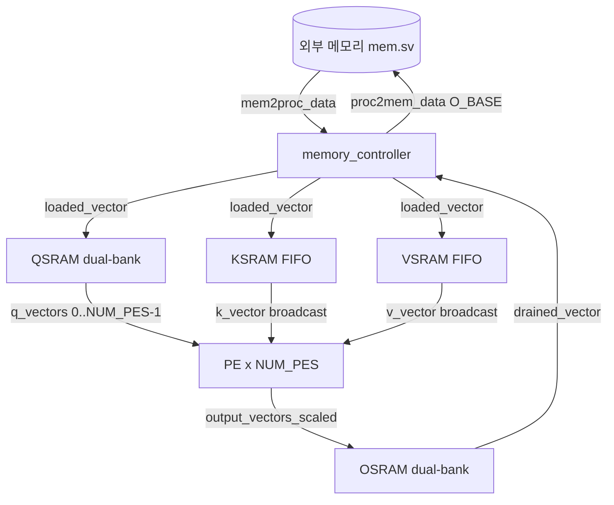
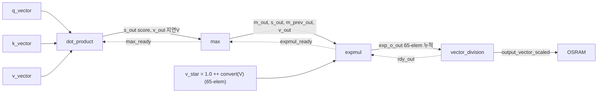
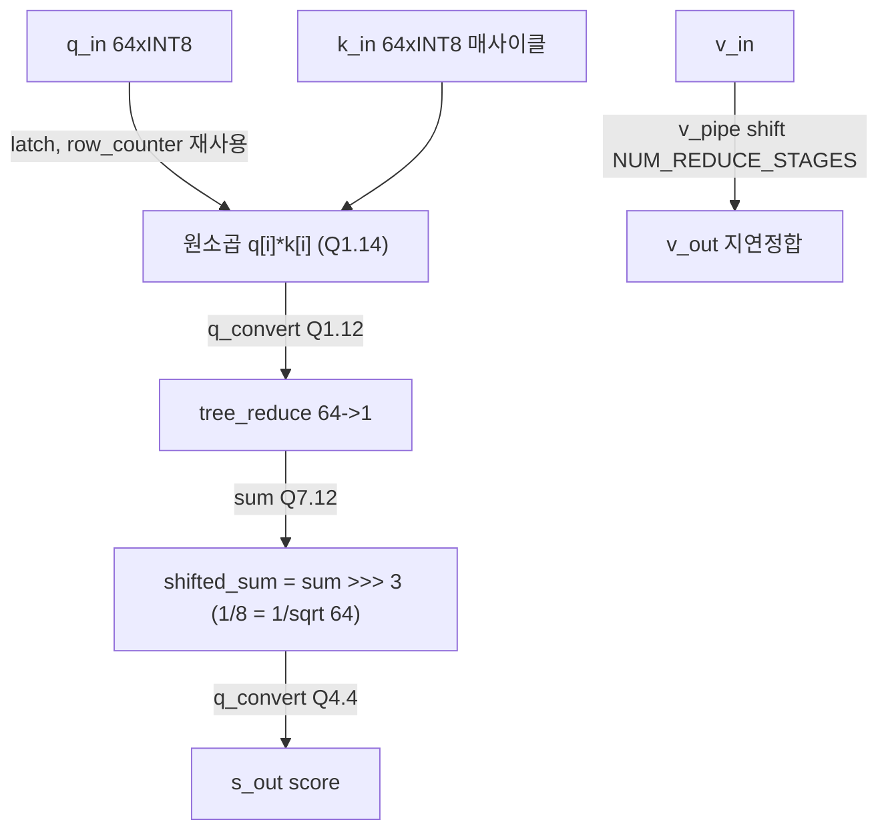
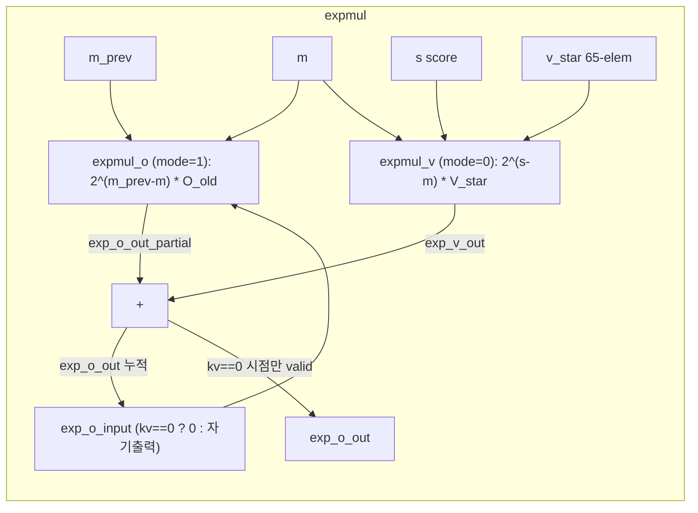
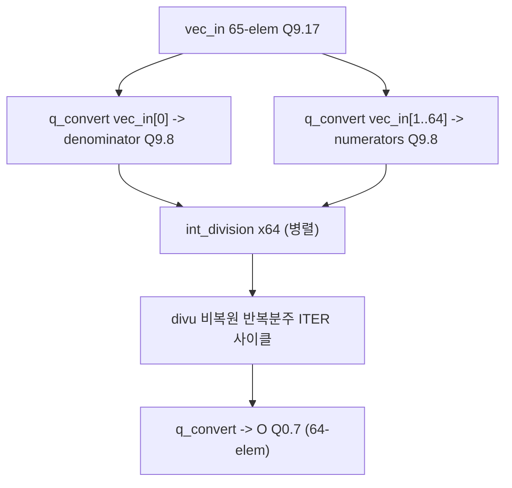
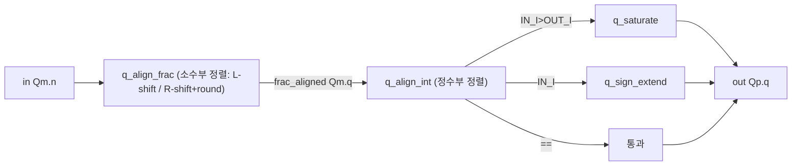
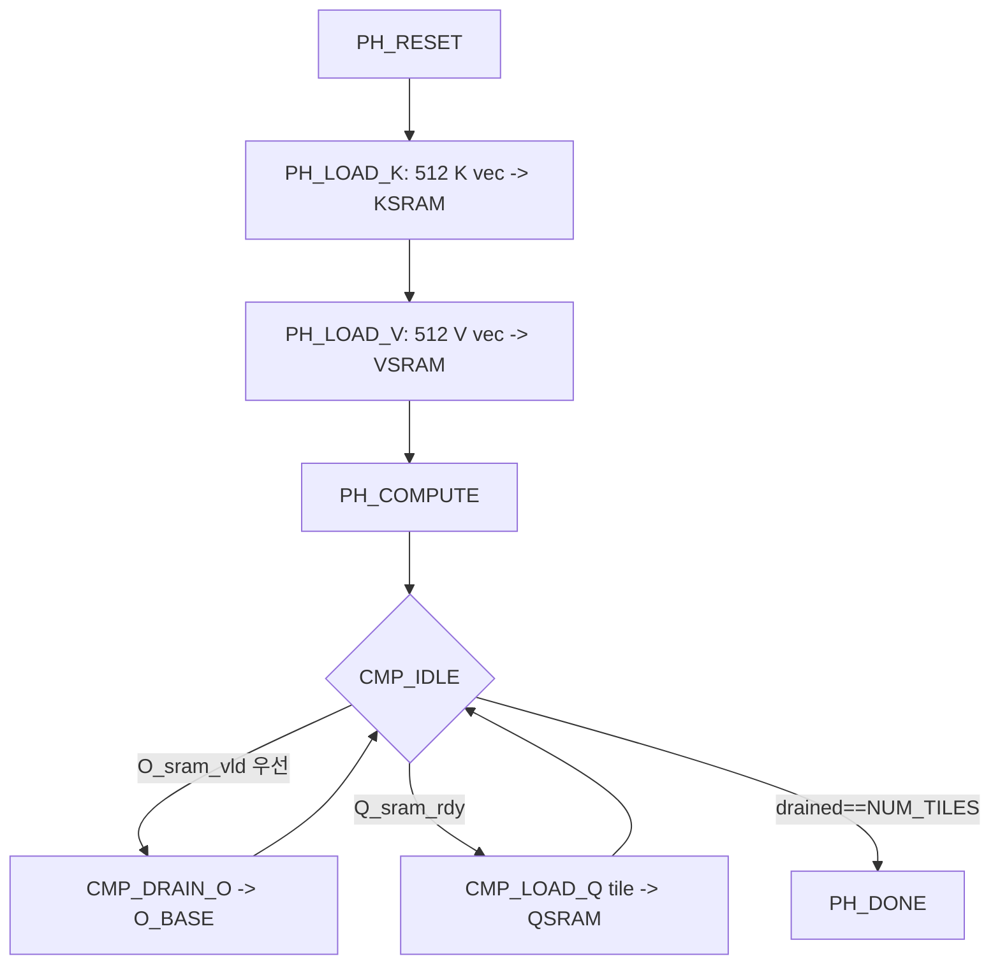
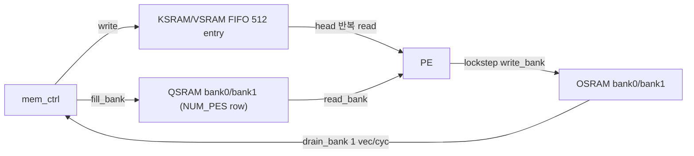
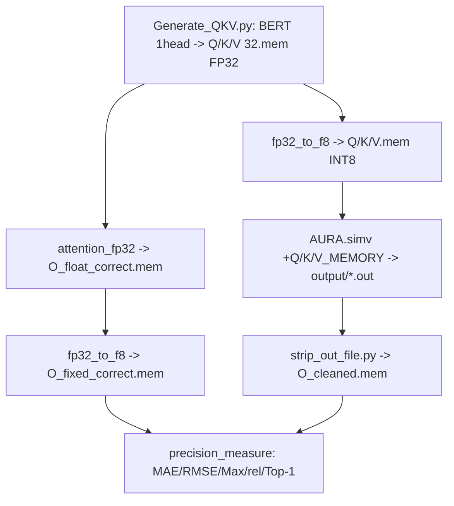

# AURA FlashAttention ASIC 모듈 통합 가이드 (H-RTL)

> 1차 요약(맥락): [`../AURA-FlashAttention-AISC-Accelerator.md`](../AURA-FlashAttention-AISC-Accelerator.md)
> 소스 루트: `REF/ViT-Accelerator/AURA-FlashAttention-AISC-Accelerator`. 본 가이드는 **핸드라이트 SystemVerilog RTL(`verilog/`)** 를 정본으로 삼고, C++ 참조모델(`cpp/`)·Python QKV 생성(`python/`)·테스트벤치(`test/`)·합성 스크립트(`synth/`)를 보조로 다룬다. HLS가 아니라 직접 작성한 RTL이다.
> 표기 규약: 라인으로 직접 확인한 사실은 단정, 코드 정황 기반은 "추정", 코드/문서에 없으면 "확인 불가".
> 제외물(이름만): `_deprecated/`(빌드 미포함 구버전: `memory_controller_old.sv`·`memctrlV2.sv`·`int2_division.sv`·`int_div_comb.sv`·`expmul_comb.sv`·`handshake_reg.sv`·`multiply.sv`·`vec_add.sv`·`math_utils_pkg.sv`·`SRAM_DB_example.sv`·`SRAM_ARRAY.sv`·`SRAM_FIFO.sv`·`dot_product.sv`), 표준셀 라이브러리 `lec25dscc25.v`/`lec25dscc25_TT.db`(외부 vendor, `Makefile:15`·`AURAsynth.tcl:96`), 합성 산출물(`.vg`/`.ddc`/`.rep`/`.chk` — 리포에 없음), `models/*.mem`(테스트벡터 생성물 — 리포에 없음), `docs/AURA_RTL.pdf`(렌더 불가 → 내용 확인 불가).

---

## 0. 문서 머리말

### 0.1 대표 케이스 선정
AURA는 단일 head attention `O = softmax(QKᵀ/√dk)·V` 를 **online-softmax(FlashAttention) 스트리밍 RTL**로 수행한다. 대표 케이스를 둘로 잡는다.

- **대표 형상(시퀀스 1 head, 한 타일)**: `S = MAX_SEQ_LENGTH = 512`, `dk = MAX_EMBEDDING_DIM = 64`, INT8(Q0.7) 입력. 한 PE가 **한 Q row**를 받아 512개 K/V에 대해 streaming 누적하고, `NUM_PES = 4`개 PE가 한 타일(=4 Q row)을 동시에 처리한다. (`sys_defs.svh:24,26,36`, `AURA.sv:138-160`)
  - 선정 근거: (1) C++ 골든모델이 정확히 `ROWS=512, COLS=64`를 가정(`attention_fp32.cpp:4-5`), (2) Python 생성기 디폴트가 BERT 1 head `seq=512, head=0`(`Generate_QKV.py:16-19,92`), (3) 메모리 base 주소가 `512×64×INT8` 버퍼 4개로 박혀 있음(`sys_defs.svh:218,223-229`). 즉 리포가 실제로 돌리는 단위가 이 형상이다.
- **대표 연산(곱셈 없는 exp)**: `expmul_stage.sv`의 `vec_out[i] = exp(a−b)·vec_in[i]` 를 log2 도메인 근사 + 4비트 정수지수 + 5단 배럴시프트로 계산. HW↔C++ 정합이 가장 또렷한 단위(C++는 정확 `exp()`, RTL은 근사 → `precision_measure`로 오차 검증). (`expmul_stage.sv:167,170-178`)

두 케이스로 "FlashAttention 1-pass 데이터플로우(형상)"와 "곱셈기 제거 softmax(연산)"를 모두 커버한다.

### 0.2 수치 표기 규약
- **MAC lanes**: 동시 곱셈기 수. 본 설계 PE 한 개의 곱셈은 `dot_product`의 **64-way 원소곱**(`q[i]*k[i]`, i=0..63, `dot_product.sv:124-128`)이 유일한 "진짜 곱셈"이다. 따라서 `MAC lanes/PE = 64`, 전체 `NUM_PES×64 = 4×64 = 256` 곱셈/사이클(QKᵀ 단계). softmax(`expmul`)·정규화(`vector_division`)는 **곱셈기 0개**(시프트/감산/반복분주)다.
- **scalar MACs**: 대표 attention의 shape 곱. QKᵀ = `S·S·dk = 512·512·64`, softmax-weighted PV(누적) = `S·S·dk = 512·512·64`. 단 RTL은 PV를 곱셈이 아니라 `exp·V` 시프트누적으로 한다(아래 §6).
- **loop trips / cycle**: FSM 반복 또는 차원 곱. PE 한 개가 한 Q row를 끝내는 데 최소 `S=512` 핸드셰이크(K/V 원소당 1) + 파이프라인 fill + 나눗셈 `ITER`사이클(§7).
- **memory size (payload bit)**: 버퍼 배열 깊이×폭(bit). on-chip SRAM 각각 산정.

### 0.3 운영 경로 (RTL ↔ 테스트벡터 ↔ 합성)
```
[QKV 생성]   python/Generate_QKV.py: HF BERT(bert-base-uncased) 1 head Q/K/V → models/<m>/{Q,K,V}32.mem (FP32 big-endian hex)
        │
[양자화]     cpp/fp32_to_f8: FP32 .mem → INT8(Q0.7) .mem  (lround(x*128) 포화)
        │
[골든]       cpp/attention_fp32: FP32 online-softmax → O_float_correct.mem ; fp32_to_f8 → O_fixed_correct.mem
        │
[RTL 시뮬]   make build/AURA.simv (VCS) → ./AURA.simv +Q_MEMORY/+K_MEMORY/+V_MEMORY/+OUTPUT (test/mem.sv 메모리 모델)
        │
[출력 정리]  python/strip_out_file.py → O_cleaned.mem
        │
[정밀검증]   cpp/precision_measure: O_fixed_correct.mem vs O_cleaned.mem (MAE/RMSE/Max/rel/Top-1)
        │
[합성]       make synth/<mod>.vg → dc_shell-t -f synth/AURAsynth.tcl (250nm lec25dscc25_TT.db, CLOCK_PERIOD=10ns)
```
근거: `Makefile:276-303,334-343,376-377,204-210`, `AURAsynth.tcl:96,106`, `Generate_QKV.py:75-103`, `attention_fp32.cpp:120-147`.

### 0.4 타깃 / 데이터타입 / online-softmax 정책
- **타깃**: **표준셀 ASIC**(FPGA 아님). target library `lec25dscc25_TT.db`(250nm TSMC급), wire load `tsmcwire`, EECS 470/570(미시간대) 합성 템플릿. `CLOCK_PERIOD=10`(ns, `Makefile:2`). 합성 PPA 리포트(`.rep`)는 리포에 미동봉 → **area/power/timing 수치 확인 불가**.
- **데이터타입**: 입출력 INT8 = **Q0.7**([-1,1) 고정소수점, `sys_defs.svh:87-94`). 내부는 단계별로 비트폭 자동 확장: Q1.14 곱 → Q1.12 product → Q7.12 dot → Q4.4 score → Q9.17 exp누적 → Q9.8 나눗셈입력 → Q0.7 출력 (`sys_defs.svh:140-190`, 각 typedef 주석에 Q-format 명기). 파일명 `f8`은 IEEE FP8이 아니라 INT8 고정소수점.
- **online-softmax 정책(FlashAttention 1-pass)**:
  - running max `m_i = max(m_{i-1}, s_i)` (`max.sv:57`),
  - rescale 점화식 `O_new = 2^(m_prev−m)·O_old + 2^(s−m)·V` (`expmul.sv:40`),
  - **분모(exp-sum)를 65-원소 벡터의 index 0에 동봉**하여 출력과 동일 회로로 누적(`PE.sv:46`, `sys_defs.svh:205`),
  - 시퀀스 전체(512) 누적 완료 시점에만 valid → 마지막에 **한 번만** element-wise 나눗셈으로 정규화(`expmul.sv:35`, `vector_division.sv`).
  - C++ 골든은 표준 2-pass softmax(`attention_fp32.cpp:120-136`)지만 수학적 동치이며, RTL이 메모리/재방문을 제거.

---

## 1. Repo / Layer 개요

| 레이어 | 경로 | 역할 |
|---|---|---|
| **verilog/** | `verilog/*.sv` | 핸드라이트 RTL 본체(SystemVerilog). top·PE·dot·max·expmul·tree·division·SRAM 4종·mem_ctrl·양자화 5종. **HLS 아님.** |
| **include/** | `include/sys_defs.svh` | ★ 전역 파라미터 + 고정소수점 Q-format typedef 연쇄 정의(설계의 두뇌). |
| **cpp/** | `cpp/*.cpp` | SW 참조모델/양자화/정밀도 측정. `attention_fp32`(골든)·`attention_f8`·`fp32_to_f8`·`precision_measure` 등. |
| **python/** | `python/*.py` | QKV 생성(HF BERT)·출력 정리·hex 변환. |
| **test/** | `test/*.sv` | 테스트벤치. `aura_test.sv`(통합)·`mem.sv`(지연 메모리 모델)·모듈별 TB. |
| **synth/** | `synth/AURAsynth.tcl` | Synopsys DC 합성 스크립트(250nm). |

- 빌드에 실제 컴파일되는 RTL은 `Makefile:128-148`의 `AURA_SOURCES` 19개 파일 + 헤더 1개 + `test/mem.sv`. 모듈별 단위 TB 대상은 `MODULES`(`Makefile:88`)에 19개 모듈 나열.
- `q_sign_extend.sv`는 본 가이드에서 §8에 묶어 다룸(부호확장 1-liner, `q_sign_extend.sv:11`로 추정 — 직접 정독 안 함).

### 모듈 인스턴스 계층 (top → leaf)
```
AURA.sv  (top)
├─ memory_controller.sv      (K→V load / Q load·O drain FSM, mem tag FIFO)
├─ QSRAM.sv                  (Q 타일 dual-bank ping-pong, NUM_PES row/bank)
├─ KSRAM.sv                  (K 전체시퀀스 FIFO, head 포인터 반복 read)
├─ VSRAM.sv                  (V 전체시퀀스 FIFO, KSRAM과 동일 구조)
├─ OSRAM.sv                  (O 타일 dual-bank ping-pong drain)
└─ PE.sv  × NUM_PES (generate, AURA.sv:138-160)
   ├─ dot_product.sv         (QK 내적 + √dk 스케일 + V 지연정합)
   │  └─ tree_reduce.sv      (STAGES 체인)
   │     └─ reduction_step.sv (쌍 합산 + sign-extend, ×STAGES)
   │  └─ q_convert.sv ×(64+1) (Q1.14→Q1.12, Q7.12→Q4.4)
   ├─ q_convert.sv × MAX_EMBEDDING_DIM  (v_star 생성: Q0.7→Q9.17, PE.sv:47-57)
   ├─ max.sv                 (running max m_i)
   ├─ expmul.sv              (O*/V* 두 스테이지 + running 누적 + 분모동봉)
   │  └─ expmul_stage.sv × 2 (o_star_mode=1 rescale, =0 exp·V)
   │     └─ q_convert.sv ×(다수)  (log2 결과·shift 확장/축소)
   └─ vector_division.sv     (65-elem → 64 int_division 병렬)
      └─ int_division.sv × MAX_EMBEDDING_DIM
         └─ divu  (비복원 반복 분주기)
공통 leaf: q_convert → {q_align_frac → q_saturate, q_align_int → {q_saturate, q_sign_extend}}
```

---

## 2. Top 모듈 (`AURA.sv`) — 메모리·SRAM·PE 어레이 통합

### 2.1 역할 + 상위/하위
470 메모리 인터페이스(`mem2proc_*`/`proc2mem_*`)와 `done` 플래그를 가진 최상위. `memory_controller` 1 + `QSRAM/KSRAM/VSRAM/OSRAM` 각 1 + `generate`로 `NUM_PES`개 `PE` 인스턴스. 상위: 테스트벤치(`aura_test.sv`)·외부 메모리(`mem.sv`). 하위: 위 모듈 전부.

### 2.2 데이터플로우


### 2.3 인스턴스 계층
`AURA` → `{memory_controller, QSRAM, KSRAM, VSRAM, OSRAM, gen_pe[0..NUM_PES-1].PE}`. (`AURA.sv:57-161`)

### 2.4 대표 코드 위치
`verilog/AURA.sv`(인스턴스/배선), `include/sys_defs.svh`(타입/파라미터).

### 2.5 대표 코드 블록

(1) **Q는 분배, K/V는 브로드캐스트 — output-stationary 타일링** (`AURA.sv:51-54, 138-160`)
```systemverilog
Q_VECTOR_T q_vectors [0:`NUM_PES-1];   // PE별 서로 다른 Q row
K_VECTOR_T k_vector;  V_VECTOR_T v_vector;  // 모든 PE 공유
...
PE pe_inst ( ..., .q_vector(q_vectors[i]), .k_vector(k_vector), .v_vector(v_vector), ... );
```
→ 한 K/V 벡터에 대해 4개 Q row를 동시 처리. K/V 재사용 극대화(읽기 대역폭 1/NUM_PES).

(2) **PE lockstep 가정 — 핸드셰이크 0번만 검사** (`AURA.sv:89, 102, 115, 127`)
```systemverilog
.read_enable(Q_rdy[0]),   // "all backend PEs are ready ... just check the first one"
```
→ 모든 PE가 같은 페이스로 진행한다고 가정하고 `[0]`만 본다. 단순화이자 동기화 제약(추정: PE 간 데이터-의존 분기 없음).

(3) **OSRAM lockstep write — 한 뱅크 전체 동시 기록** (`AURA.sv:123-134`)
```systemverilog
.write_enable(O_vld[0]),         // PE들이 동시에 한 뱅크 채움
.write_data(output_vectors_scaled),   // O_VECTOR_T [0:NUM_PES-1] 배열 통째
```

### 2.6 마이크로아키텍처 + 정량
- **공간 병렬도**: `NUM_PES=4` PE(=4 Q row 동시). 헤더에 **이론 최적 PE 수** 산식 존재: `MAX_NUM_PES = (S·QBYTES_FETCHED_PER_CYCLE)/(dk·INT8bytes) = (512·4)/(64·1) = 32`(`sys_defs.svh:32-34`). 즉 실제 `NUM_PES=4` 는 대역폭 한계(32)보다 보수적으로 잡힌 값.
- **메모리(top 관점)**: 외부 메모리 base 4구역 `K/V/Q/O_BASE`, 각 `BUF_SIZE_BYTES = 512·64·1 = 32768 B = 256 Kb`(`sys_defs.svh:218,223-229`). 총 `MEM_SIZE = 4×32768 = 128 KB`(`:240`).
- **병목**: PE lockstep 가정 → 한 PE가 막히면(예: 나눗셈) 전체 정지. K/V 브로드캐스트 팬아웃(4 PE × 64 elem × 8 bit = 2048 bit fan-out)이 큰 net.

---

## 3. 단일 PE 파이프라인 (`PE.sv`) — FlashAttention 1행

### 3.1 역할 + 상위/하위
한 Q row에 대한 전체 attention을 valid/ready 핸드셰이크로 연결된 4단 elastic pipeline으로 수행. 상위: `AURA`(generate ×NUM_PES). 하위: `dot_product → max → expmul → vector_division` + `q_convert`(v_star 생성).

### 3.2 데이터플로우


### 3.3 인스턴스 계층
`PE` → `{dot_product_inst, max_inst, expmul_inst, vector_division_inst, prod_conv_inst×64}`. (`PE.sv:45-119`)

### 3.4 대표 코드 위치
`verilog/PE.sv`.

### 3.5 대표 코드 블록

(1) **v_star: 분모 1.0을 0번에 동봉, V를 Q9.17로 확장** (`PE.sv:45-58`)
```systemverilog
assign v_star[0] = 1 << `EXPMUL_VEC_F;           // = 2^17 = 상수 1.0 (Q9.17) → softmax 분모 채널
for(genvar v = 1; v <= `MAX_EMBEDDING_DIM; v++)   // v_star[1..64] = V 원소
    q_convert #(.IN_I(0),.IN_F(7),.OUT_I(9),.OUT_F(17)) prod_conv_inst (
        .in(v_vector_double_delayed[v-1]), .out(v_star[v]) );
```
→ index 0(분모)과 1..64(출력)가 동일 expmul 회로로 동시 rescale·누적되는 FLASH-D식 자료구조의 출발점.

(2) **단계 간 backpressure 역전파** (`PE.sv:67, 83, 99, 114`)
```systemverilog
dot_product ... .rdy_in(max_ready), .vld_out(dot_product_valid) ...
max ...        .rdy_in(expmul_ready), .vld_out(max_valid) ...
expmul ...     .rdy_in(vector_division_ready), .vld_out(expmul_valid) ...
vector_division ... .rdy_in(O_sram_rdy), .vld_out(output_valid) ...
```
→ 하류 ready가 상류로 전파되는 전형적 elastic pipeline. 멀티사이클 나눗셈도 안전하게 흡수.

(3) **expmul prev 입력은 0 — 누적은 expmul 내부 레지스터로** (`PE.sv:104`)
```systemverilog
.o_star_prev_in('0),   // 외부 prev 미사용; running 누적은 expmul 내부 kv_counter 루프
```
→ 한 PE가 시퀀스(512) 전체 누적을 streaming으로 자급. PE 간 누적 전달 없음(독립).

### 3.6 마이크로아키텍처 + 정량
- **파이프 단계**: 4단(dot/max/expmul/div). dot 내부 트리(`NUM_REDUCE_STAGES=3`) + V 지연정합 3단, max 1단, expmul 2단(각 stage), div 멀티사이클.
- **메모리(PE 내부 레지스터)**: `v_vector_delayed`/`v_vector_double_delayed`(각 64×8=512 bit), `v_star`(65×27=1755 bit, Q9.17 폭 W=9+17+1=27), `exp_o_vector`/`output_vector`(65×27 bit) 등.
- **정량**: MAC lanes(곱셈) = 64(dot_product 원소곱)만. softmax/정규화는 곱셈 0. 한 Q row 처리 latency ≈ `S(512) + 파이프 fill + ITER(나눗셈, §7)` 사이클.
- **병목**: vector_division의 `int_division`이 멀티사이클(`ITER=DIV_INPUT_W-1+DIV_INPUT_F`)이며 64개 병렬이지만 `rdy_out`가 묶여 있어 한 묶음이 끝나야 다음 row 진행(§7).

---

## 4. QK 내적 (`dot_product.sv`) — QKᵀ + √dk 스케일

### 4.1 역할 + 상위/하위
한 번 로드한 Q를 512개 K에 대해 재사용하며 매 사이클 `s = (Q·K) >> 3` 를 계산. V는 트리 latency만큼 지연시켜 score와 정렬. 상위: `PE`. 하위: `tree_reduce`, `q_convert`(×65).

### 4.2 데이터플로우


### 4.3 인스턴스 계층
`dot_product` → `{tree_inst(tree_reduce), prod_conv_inst×64(q_convert), scale_conv_inst(q_convert)}`. (`dot_product.sv:131-171`)

### 4.4 대표 코드 위치
`verilog/dot_product.sv`.

### 4.5 대표 코드 블록

(1) **Q 1회 로드 → 512 K 재사용 (streaming)** (`dot_product.sv:44, 61-67`)
```systemverilog
assign Q_rdy_out = !valid_q || (all_valid && reduction_rdy && (row_counter == 0));
...
if(Q_vld_in && Q_rdy_out) begin q <= q_in; row_counter <= `MAX_SEQ_LENGTH - 1; end
else if(all_valid && reduction_rdy && (row_counter != 0)) row_counter <= row_counter - 1;
```
→ Q는 `row_counter==0`(시퀀스 끝)일 때만 새로 받고, K/V는 매 핸드셰이크마다 새로. Q stationary, K/V streaming.

(2) **64-way 원소곱 → product 축소** (`dot_product.sv:124-143`)
```systemverilog
for(int i = 0; i < `MAX_EMBEDDING_DIM; i++) intermediate_products[i] = q[i] * k[i]; // Q1.14
...
q_convert #(.IN_I(1),.IN_F(14),.OUT_I(1),.OUT_F(12)) prod_conv_inst (...); // Q1.14 → Q1.12
```
→ 이 64개 곱이 본 가속기의 유일한 진짜 곱셈기(PE당 64, 전체 256).

(3) **√dk 스케일 = >>3 (dk=64 하드코딩)** (`dot_product.sv:161-171`)
```systemverilog
assign shifted_sum = sum >>> 3;   // 1/sqrt(64) = 1/8
q_convert #(.IN_I(7),.IN_F(12),.OUT_I(4),.OUT_F(4)) scale_conv_inst (.in(shifted_sum), .out(s_out));
```
→ dk≠64면 부정확(한계). C++ 골든은 `SCALE=1/sqrt(COLS)`(`attention_fp32.cpp:7`)로 일반.

(4) **V 지연 정합 — 트리 latency 보상** (`dot_product.sv:174-200`)
```systemverilog
V_VECTOR_T v_pipe [0:`NUM_REDUCE_STAGES-1];   // 3단 시프트 레지스터
if (all_valid && rdy_in) v_pipe[0] <= v;
for (int i = 1; i < `NUM_REDUCE_STAGES; i++) v_pipe[i] <= v_pipe[i-1];
assign v_out = v_pipe[`NUM_REDUCE_STAGES-1];
```

### 4.6 마이크로아키텍처 + 정량
- **MAC lanes**: 64 곱셈 + tree 가산. `INTERMEDIATE_PRODUCT_I=1, F=14`(Q1.14, `sys_defs.svh:114,117`).
- **loop trips**: 한 Q에 대해 512 사이클(K마다 1), Q 교체에 1 사이클(`row_counter` 리셋).
- **memory**: products 64×13(Q1.12 W=14? 실제 PRODUCT W=`Q_WIDTH(1,12)=14`), v_pipe 3×512 bit, q/k/v latch 각 512 bit.
- **병목**: 트리 3-stage + V 지연 정합으로 latency 3 추가. row_counter 교체 시 Q_rdy 1사이클 stall.

---

## 5. 가산 트리 (`tree_reduce.sv` / `reduction_step.sv`) — 파라미터화 리덕션

### 5.1 역할 + 상위/하위
`STAGES`개 `reduction_step`을 generate로 체인 연결해 `LEN`개 입력을 1개로 축소. 각 스테이지가 valid/ready로 분리된 파이프 레지스터를 겸함. 상위: `dot_product`. 하위: `reduction_step`(×STAGES).

### 5.2 데이터플로우


### 5.3 인스턴스 계층
`tree_reduce` → `STAGE[s].reduce_step_inst (reduction_step)`, s=0..STAGES-1. (`tree_reduce.sv:41-82`)

### 5.4 대표 코드 위치
`verilog/tree_reduce.sv`, `verilog/reduction_step.sv`.

### 5.5 대표 코드 블록

(1) **스테이지별 길이·폭 자동 산정** (`tree_reduce.sv:43-49`)
```systemverilog
localparam int IN_LEN  = LEN >> (s*REDUCTIONS_PER_STAGE);
localparam int OUT_LEN = LEN >> ((s+1)*REDUCTIONS_PER_STAGE);
localparam int IN_WIDTH  = W_IN + (s*REDUCTIONS_PER_STAGE);   // 누적 폭 확장
localparam int OUT_WIDTH = W_IN + ((s+1)*REDUCTIONS_PER_STAGE);
```
→ `REDUCTIONS_PER_STAGE=2` → 스테이지당 `2^2=4:1` 축소, 폭 +2 bit. dk=64 → `NUM_REDUCE_STAGES=$clog2(64)/2=3` (`sys_defs.svh:52-54`).

(2) **쌍 합산 + 부호확장 (조합 루프, 입력은 래치)** (`reduction_step.sv:67-93`)
```systemverilog
for(int i=0;i<INPUT_LEN;i++) stageN[i] = {{(W_OUT-W_IN){list[i][W_IN-1]}}, list[i]}; // sign-extend
for(int s=0;s<STEPS;s++) begin
    for(int i=0;i<out_len;i++) temp[i] = stageN[2*i] + stageN[2*i+1];   // pairwise sum
    for(int j=0;j<out_len;j++) stageN[j] = temp[j];
    out_len = out_len >> 1;
end
```
→ 한 스테이지에서 `STEPS=REDUCTIONS_PER_STAGE=2`번 쌍 합산 = `2^2:1` 축소.

(3) **스테이지 간 핸드셰이크 체인** (`tree_reduce.sv:35-39, 72-75`)
```systemverilog
assign vld_stage[0] = vld_in;  assign rdy_out = rdy_stage[0];
assign vld_out = vld_stage[STAGES];  assign rdy_stage[STAGES] = rdy_in;
... .vld_in(vld_stage[s]), .rdy_in(rdy_stage[s+1]), .vld_out(vld_stage[s+1]), .rdy_out(rdy_stage[s]) ...
```

### 5.6 마이크로아키텍처 + 정량
- **트리 폭/단**: 입력 LEN=64, STAGES=3, 스테이지당 4:1 (64→16→4→1). 각 스테이지 1 사이클(`reduction_step`의 valid_reg) → 트리 latency = 3.
- **비트 확장**: `W_IN = Q_WIDTH(PRODUCT_I=1, PRODUCT_F=12)=14`, `W_OUT = W_IN + $clog2(64) = 14+6 = 20`(=Q7.12, `DOT_I=7,DOT_F=12`).
- **정량**: 가산기 수 ≈ 32+8+2 = 42 가산/PE(64→1 트리). 곱셈기 0.
- **병목**: 마지막 스테이지(4→1)에 2-입력 가산 누적. dk 변경 시 STAGES·폭 자동 재구성(재사용성 강점).

---

## 6. ★ ExpMul (`expmul.sv` + `expmul_stage.sv`) — 곱셈 없는 exp + online 누적

본 가속기의 가장 독창적 부분. softmax의 exp·rescale·누적을 곱셈기/지수 LUT 없이 수행.

### 6.1 역할 + 상위/하위
- `expmul`(상위): 두 `expmul_stage`(O* rescale / V* exp곱)를 병렬 구동하고 running 누적·분모동봉. 상위: `PE`. 하위: `expmul_stage`×2.
- `expmul_stage`(핵심): `vec_out[i] = exp(a−b)·vec_in[i]` 를 log2 근사 + 정수지수 + 배럴시프트로 계산.

### 6.2 데이터플로우


### 6.3 인스턴스 계층
`PE` → `expmul` → `{expmul_o_inst, expmul_v_inst}(expmul_stage)`. 각 stage 내부 `q_convert` 다수. (`expmul.sv:50-78`, `expmul_stage.sv:114-140`)

### 6.4 대표 코드 위치
`verilog/expmul.sv`, `verilog/expmul_stage.sv`.

### 6.5 대표 코드 블록

(1) **running 누적 점화식 + 자기 되먹임** (`expmul.sv:38-46`)
```systemverilog
for (genvar i=0;i<`MAX_EMBEDDING_DIM+1;i++)
    assign exp_o_out[i] = exp_o_out_partial[i] + exp_v_out[i];  // O_new = 2^(m_prev-m)O_old + 2^(s-m)V
assign exp_o_input = (kv_counter_1 == 0) ? o_star_prev_in : exp_o_out;  // 첫 원소면 0, 이후 자기출력
```
→ FlashAttention online rescaling을 단일 모듈 루프로. 65-원소(0=분모, 1..64=출력)가 동시 처리.

(2) **시퀀스 누적 완료 시점에만 valid** (`expmul.sv:35`)
```systemverilog
assign vld_out = expmul_o_valid && expmul_v_valid && (kv_counter_1 == 0);
```
→ 512개 K/V를 다 누적(`kv_counter`가 한 바퀴 돌아 0)한 뒤에야 다운스트림으로.

(3) **log2(e) 곱을 시프트 3개로 근사** (`expmul_stage.sv:74, 167`)
```systemverilog
assign x_diff = a - b;                            // Q5.4
log_e_x = x_diff + (x_diff >>> 1) - (x_diff >>> 4); // ≈ x*(1 + 1/2 - 1/16) = 1.4375x ≈ x*log2(e)
```
→ log2(e)=1.4427 을 1.4375 로 근사(오차 ~0.36%). 곱셈기 없음. 주석(`:12`)의 `Log2Exp(X)=−⌊X+(X≫1)−(X̂≫4)⌉` 구조.

(4) **정수지수 L 산출 + 5단 배럴시프트로 2^(−L)·V** (`expmul_stage.sv:114-117, 170-178`)
```systemverilog
q_convert #(.IN_I(`EXP_LOG2E_OUT_I),.IN_F(4),.OUT_I(`EXPMUL_EXP_I),.OUT_F(0)) log_e_x_condense(.in(log_e_x),.out(l_hat_next)); // Q4.0 정수지수 [-16,0]
...
assign shift_stage_1_result[i] = l_hat[4] ? v_stage_2_expanded[i] >>> 16 : v_stage_2_expanded[i];
assign shift_stage_2_result[i] = l_hat[3] ? shift_stage_1_result[i] <<< 8  : shift_stage_1_result[i];
assign shift_stage_3_result[i] = l_hat[2] ? shift_stage_2_result[i] <<< 4  : shift_stage_2_result[i];
assign shift_stage_4_result[i] = l_hat[1] ? shift_stage_3_result[i] <<< 2  : shift_stage_3_result[i];
assign shift_stage_5_result[i] = l_hat[0] ? shift_stage_4_result[i] <<< 1  : shift_stage_4_result[i];
```
→ `l_hat`(4bit 정수지수)의 각 비트가 시프트 양 제어 → exp(score)·V 를 곱셈기 0개로. 지수 [-16,0] 클리핑(`sys_defs.svh:153`).

(5) **두 스테이지 역할 분담** (`expmul.sv:50-78`, `expmul_stage.sv:154`)
```systemverilog
expmul_o_inst: .a_in(m_prev_in),.b_in(m_in),.v_in(exp_o_input),.o_star_mode(1'b1)  // O* rescale
expmul_v_inst: .a_in(s_in),     .b_in(m_in),.v_in(v_star_in),  .o_star_mode(1'b0)  // V* exp곱
...
v_stage_2 <= (o_star_mode == 1) ? v_in : v;  // mode로 rescale 대상 선택
```

### 6.6 마이크로아키텍처 + 정량
- **Stage 분해**: Stage1 = `x_diff` + log2(e) 근사 + Q4.0 양자화(1 사이클 래치, `:86-102`); Stage2 = `kv_counter` 갱신 + 5단 배럴시프트(조합) + Q9.17 축소(1 사이클, `:144-160`).
- **비트폭**: 입력 Q4.4(`EXPMUL_DIFF_IN`), 시프트 내부 Q9.23(`EXPMUL_SHIFT_STAGE`, `:104,149`), 출력 Q9.17(`EXPMUL_VEC`, `:146`).
- **정량(곱셈기)**: **0개**. 시프터(65 elem × 5단 = 325 conditional shift/stage), 가산기(65 elem 누적 + log2 근사 3-term). 한 expmul 출력에 65×(o+v)=130 누적.
- **메모리**: v(65×27), v_stage_2/expanded(65×27, 65×33), shift_stage_1..5(각 65×33 Q9.23). exp_o_out_partial 65×27.
- **병목**: 65-원소 벡터에 대한 5단 배럴시프트가 조합 깊이 큼(타이밍 후보). 지수 [-16,0] 클리핑 → 큰 음수 score는 0으로 포화(정밀도 손실, 데이터 의존).

---

## 7. 최종 정규화 (`vector_division.sv` + `int_division.sv`) — O = 누적/분모

### 7.1 역할 + 상위/하위
65-원소 누적벡터에서 `[0]`(exp-sum)을 분모로, `[1..64]`를 분자로 64개 element-wise 나눗셈. 상위: `PE`. 하위: `int_division`(×64) → `divu`.

### 7.2 데이터플로우


### 7.3 인스턴스 계층
`vector_division` → `gen_div[i].div_inst(int_division)` (i=1..64) → `div_inst(divu)`. (`vector_division.sv:37-60`, `int_division.sv:93-106`)

### 7.4 대표 코드 위치
`verilog/vector_division.sv`, `verilog/int_division.sv`.

### 7.5 대표 코드 블록

(1) **분모 1개 공유 + 64개 나눗셈 병렬** (`vector_division.sv:27-58`)
```systemverilog
q_convert #(...EXPMUL_VEC->DIV_INPUT...) denom_conv (.in(vec_in[0]), .out(denominator)); // 분모
for (genvar i=1;i<=VEC_LEN;i++) begin : gen_div
    q_convert ... div_conv (.in(vec_in[i]), .out(numerators[i]));
    int_division div_inst (..., .numerator_in(numerators[i]), .denominator_in(denominator), .quotient_out(vec_out[i-1]));
end
```
→ 분모(exp-sum)를 64개 분자에 브로드캐스트. Q9.17 → Q9.8(`DIV_INPUT`) 변환 후 나눗셈.

(2) **부호 분리 + 절댓값 → unsigned divu 위임** (`int_division.sv:60-68`)
```systemverilog
sign_q <= numerator_in[MSB] ^ denominator_in[MSB];
abs_num <= numerator_in[MSB] ? (~num[..]+1) : num[..];
abs_den <= denominator_in[MSB] ? (~den[..]+1) : den[..];
```

(3) **비복원 반복 분주기 (멀티사이클)** (`int_division.sv:152-184`)
```systemverilog
localparam ITER = WIDTH + FBITS;   // = (DIV_INPUT_W-1) + DIV_INPUT_F 사이클
always_comb if (acc >= {1'b0, b1}) { acc_next = acc - b1; {acc_next,quo_next}={acc_next[..],quo,1'b1}; }
            else {acc_next,quo_next} = {acc,quo} << 1;
...
if (i == ITER-1) begin busy<=0; done<=1; valid<=1; val<=quo_next; end
```
→ 시프트-비교-감산 long division. `ITER`사이클 동안 busy → PE 파이프라인에 backpressure.

### 7.6 마이크로아키텍처 + 정량
- **병렬도**: 64개 `int_division` 동시. 각 내부 `divu`는 멀티사이클.
- **사이클**: `ITER = WIDTH + FBITS`. `DIV_INPUT` = Q9.8 → `W=Q_WIDTH(9,8)=18`, `WIDTH=DIV_INPUT_W-1=17`, `FBITS=DIV_INPUT_F=8` → `ITER = 17+8 = 25` 사이클/나눗셈. (`int_division.sv:94-95,152`, `sys_defs.svh:130,102,140`)
- **정량**: 곱셈기 0(분주는 감산 기반). 64 divider × (18b acc + 17b quo) 레지스터.
- **병목**: ★ 25사이클 멀티사이클 분주가 한 Q row당 1회 발생 → `rdy_out`가 묶여 다음 row가 분주 완료까지 대기. 64 병렬이라 throughput은 row당 ~25사이클 추가(amortize 됨). PE lockstep과 결합 시 전체 stall 가능.

---

## 8. 고정소수점 변환 IP (`q_convert` / `q_align_frac` / `q_align_int` / `q_saturate` / `q_sign_extend`)

### 8.1 역할 + 상위/하위
데이터패스의 거의 모든 비트폭 경계에 삽입되는 재사용 양자화 빌딩블록. 임의 Qm.n → Qp.q를 라운딩·포화·부호확장 포함해 정확히 변환. 상위: dot_product/expmul/vector_division/PE 다수. 하위: 서로 연쇄.

### 8.2 데이터플로우


### 8.3 인스턴스 계층
`q_convert` → `{q_align_frac → (ROUNDING 시 q_saturate), q_align_int → (q_saturate | q_sign_extend)}`. (`q_convert.sv:19-28`)

### 8.4 대표 코드 위치
`verilog/q_convert.sv`, `q_align_frac.sv`, `q_align_int.sv`, `q_saturate.sv`, `q_sign_extend.sv`.

### 8.5 대표 코드 블록

(1) **2단 변환: 소수부 정렬 → 정수부 정렬** (`q_convert.sv:19-28`)
```systemverilog
q_align_frac #(.IN_I(IN_I),.IN_F(IN_F),.OUT_F(OUT_F)) frac_inst (.in(in), .out(frac_aligned));
q_align_int  #(.IN_I(IN_I),.IN_F(OUT_F),.OUT_I(OUT_I),.OUT_F(OUT_F)) int_inst (.in(frac_aligned), .out(int_aligned));
```

(2) **round-half-up + 포화 (우측 시프트 시)** (`q_align_frac.sv:28-49`)
```systemverilog
if(`ROUNDING) begin
    assign abs_bias = (W_IN+1)'(1) << ((IN_F-OUT_F)-1);   // half-LSB bias
    assign sum_wide = in_ext + abs_bias;
    assign shifted_wide = (sum_wide >>> (IN_F-OUT_F));
    q_saturate #(.W_OUT(W_OUT),.W_IN(W_IN+1)) round_sat (.in(shifted_wide), .out(temp));
end else assign temp = (in >>> (IN_F-OUT_F));   // 단순 절단
```
→ `ROUNDING` 헤더 기본 1(`sys_defs.svh:84`). bias를 1bit 확장해 오버플로 방지 후 포화.

(3) **정수부: 축소면 포화, 확장이면 부호확장** (`q_align_int.sv:19-35`)
```systemverilog
if (IN_I == OUT_I) assign temp = in;
else if (IN_I > OUT_I) q_saturate #(...) q_sat_inst (.in(in), .out(temp));
else q_sign_extend #(...) q_sign_inst (.in(in), .out(temp));
```

(4) **signed 포화 클리핑** (`q_saturate.sv:10-19`)
```systemverilog
localparam MAXV = {1'b0, {(W_OUT-1){1'b1}}};   // 최대 양수
localparam MINV = {1'b1, {(W_OUT-1){1'b0}}};   // 최소 음수
if (in > MAXV) out = MAXV; else if (in < MINV) out = MINV; else out = in[W_OUT-1:0];
```

### 8.6 마이크로아키텍처 + 정량
- **조합 회로**: 전부 조합(레지스터 없음) → 사용처 파이프 단에 흡수됨.
- **인스턴스 수(대표)**: dot_product 65개, expmul_stage 각 ~130개(65 elem × 2 변환), vector_division 65개, PE v_star 64개 → q_convert가 설계 전체에서 수백 개 인스턴스(곱셈 없는 시프트/가산 회로라 저비용).
- **정량**: 곱셈기 0. shift + compare + add만. 임베딩/시퀀스 차원 변경 시 비트폭 자동 추종.
- **병목**: 없음(저비용). 단 라운딩 경로(bias add + shift + saturate)가 조합 깊이 약간 추가.

---

## 9. 메모리 컨트롤러 (`memory_controller.sv`) — K→V load / Q load·O drain FSM

### 9.1 역할 + 상위/하위
외부 메모리와 4 SRAM 사이 모든 데이터무브를 FSM으로 담당. K/V 전체 시퀀스를 먼저 적재한 뒤 compute 단계에서 Q 타일 로드와 O 타일 drain을 인터리빙. 상위: `AURA`. 하위: 없음(외부 mem 인터페이스 직접 구동).

### 9.2 데이터플로우


### 9.3 인스턴스 계층
`AURA` → `mem_ctrl_inst (memory_controller)`. (`AURA.sv:57-81`)

### 9.4 대표 코드 위치
`verilog/memory_controller.sv`.

### 9.5 대표 코드 블록

(1) **5상태 상위 FSM + 3상태 compute 모드** (`memory_controller.sv:47-64`)
```systemverilog
typedef enum logic [2:0] { PH_RESET, PH_LOAD_K, PH_LOAD_V, PH_COMPUTE, PH_DONE } phase_e;
typedef enum logic [1:0] { CMP_IDLE, CMP_LOAD_Q, CMP_DRAIN_O } cmp_mode_e;
```

(2) **out-of-order 응답 처리 — tag FIFO** (`memory_controller.sv:106-111, 175-187`)
```systemverilog
MEM_TAG expected_tag_fifo [0:`NUM_MEM_TAGS];   // 발급 tag 순서 추적
assign tags_empty = (tag_head == tag_tail);
...
if(!tags_empty && (mem2proc_data_tag == expected_tag_fifo[tag_head])) begin  // head tag 일치 시만 채움
    for(int i=0;i<ELEMENTS_PER_MEMBLOCK;i++) next_vector_buffer[write_index+i] = mem2proc_data.byte_level[i];
    next_tag_head = tag_head + 1;
end
```
→ 메모리가 순서 뒤바꿔 응답해도 in-order로 버퍼 채움. 64bit 블록 = 8 INT8 elem 언패킹.

(3) **compute 우선순위: O drain > Q load** (`memory_controller.sv:239-261`)
```systemverilog
if (O_sram_vld && o_tiles_drained_cnt < `NUM_TILES) begin ctrl_O_rdy=1; next_mode=CMP_DRAIN_O; ... end
else if (Q_sram_rdy && q_tiles_loaded_cnt < `NUM_TILES) begin next_mode=CMP_LOAD_Q; ... end
else if (o_tiles_drained_cnt == `NUM_TILES) next_phase = PH_DONE;
```
→ 출력 drain을 입력 로드보다 우선해 OSRAM 백프레셔 방지. NUM_TILES(=128) drain 완료 시 종료.

(4) **타일/벡터/블록 주소 계산** (`memory_controller.sv:277-281`)
```systemverilog
mem_base_addr = O_BASE + (o_tiles_drained_cnt*TILE_BYTES) + (o_vec_to_drain*VECTOR_BYTES);
proc2mem_addr = mem_base_addr + blk_to_fetch*`MEM_BLOCK_SIZE_BYTES;
```

### 9.6 마이크로아키텍처 + 정량
- **상태 수**: 상위 5 + compute 3. tag FIFO 깊이 `NUM_MEM_TAGS+1 = 16`(`:106`, `sys_defs.svh:237`).
- **블록/벡터**: `MEM_BLOCKS_PER_VECTOR = (64·1)/8 = 8` blocks/vec(`sys_defs.svh:244`), `ELEMENTS_PER_MEMBLOCK = 64/8 = 8`(`:14`), `TILE_SIZE = NUM_PES = 4`, `NUM_TILES = 512/4 = 128`(`sys_defs.svh:38`).
- **정량**: K/V 로드 = 512 vec × 8 blk = 4096 mem load 트랜잭션 각각. compute = 128 Q타일 로드 + 128 O타일 drain.
- **병목/한계**: "full uninterrupted memline access" 가정(`:1`). `ELEMENTS_PER_MEMBLOCK` 하드코딩(`:179` 주석 "make generalizable later"). 최대 outstanding 15 tag.

---

## 10. 온칩 SRAM 4종 (`KSRAM`/`VSRAM`/`QSRAM`/`OSRAM`) — 메모리 계층

### 10.1 역할 + 상위/하위
- `KSRAM`/`VSRAM`: 순환 FIFO. K/V 전체 시퀀스(512) 저장 후 head 포인터로 반복 read(재사용).
- `QSRAM`: dual-bank ping-pong. 한 뱅크 채우는 동안 다른 뱅크가 PE에 NUM_PES row 제공.
- `OSRAM`: dual-bank ping-pong drain. PE lockstep write / mem_ctrl 한 벡터씩 drain.
상위: `AURA`. 하위: 없음.

### 10.2 데이터플로우


### 10.3 인스턴스 계층
`AURA` → `{QSRAM_inst, KSRAM_inst, VSRAM_inst, OSRAM_inst}`. (`AURA.sv:84-134`)

### 10.4 대표 코드 위치
`verilog/KSRAM.sv`, `VSRAM.sv`, `QSRAM.sv`, `OSRAM.sv`.

### 10.5 대표 코드 블록

(1) **KSRAM: 전체 시퀀스 보관 + 반복 read FIFO** (`KSRAM.sv:33-43`)
```systemverilog
assign full  = (tail == NUM_ENTRIES);   // 512개 다 쓰면 full
assign empty = (tail == 0);
assign read_data_valid = !empty;
assign read_data = fifo[head[$clog2(NUM_ENTRIES)-1:0]];   // head 인덱스 wrap → 반복 read
```
→ "allow all vectors to be read for multiple iterations"(`:32` 주석). head가 512 넘어 wrap하며 모든 Q에 K 재사용.

(2) **QSRAM: ping-pong fill/read 토글 + read 시 클리어** (`QSRAM.sv:57-63, 104-118`)
```systemverilog
assign read_data_valid = (read_bank) ? bank1_full : bank0_full;
assign sram_ready      = (fill_bank) ? !bank1_full : !bank0_full;
assign read_data       = (read_bank == 0) ? bank0 : bank1;   // NUM_PES row 통째 출력
...
if (read_enable && read_data_valid) begin read_bank <= ~read_bank; /* 읽은 뱅크 0으로 클리어 */ end
```

(3) **OSRAM: lockstep write(전 뱅크 동시) / 벡터단위 drain** (`OSRAM.sv:78-96, 100-117`)
```systemverilog
if (write_enable && sram_ready) begin
    for (int i=0;i<NUM_ROWS;i++) bank0[i] <= write_data[i];   // PE NUM_PES개 동시
    write_bank <= ~write_bank;
end
...
if (drain_enable && drain_data_valid) begin
    if (drain_idx == NUM_ROWS-1) drain_bank <= ~drain_bank;   // 한 벡터씩 drain
    drain_idx <= drain_idx + 1'b1;
end
```

### 10.6 마이크로아키텍처 + 정량
- **memory size (payload bit)**:
  - `KSRAM`/`VSRAM`: 깊이 512 × 폭 (64 elem × 8 bit = 512 bit) = **262144 bit = 256 Kbit each** (`KSRAM.sv:4,21`, `sys_defs.svh:199`).
  - `QSRAM`: 2 bank × NUM_PES(4) row × 512 bit = **4096 bit** (`QSRAM.sv:40-41`).
  - `OSRAM`: 2 bank × NUM_PES(4) row × (O_VECTOR 64×8=512 bit) = **4096 bit** (`OSRAM.sv:40-41`).
- **재사용 정책**: K/V는 1회 적재 후 전체 read 반복(read 대역폭 절감), Q/O는 더블버퍼로 load/compute/store 중첩.
- **정량/병목**: KSRAM/VSRAM가 가장 큰 온칩 메모리(각 256 Kbit). dk·INT8 변경 시 폭 자동 추종. K/V 합 512 Kbit가 250nm SRAM 면적 주요 소비처(추정). QSRAM/OSRAM은 작아(4 Kbit) ping-pong 비용 저렴.

---

## 11. HW/SW 검증 경로 (C++ `cpp/` + Python `python/` + TB `test/`)

### 11.1 역할 + 상위/하위
RTL 정확도 검증 자동화. FP32 골든 → INT8 골든 → RTL 출력 → 정량 비교. 상위: `Makefile` 타깃. 하위: 독립 C++/Python 실행파일 + VCS 시뮬.

### 11.2 데이터플로우 / 호출경로


### 11.3 인스턴스 계층 (SW)
`Makefile` → `{Generate_QKV.py, fp32_to_f8, attention_fp32, strip_out_file.py, precision_measure}`. (`Makefile:276-303,376-377`)

### 11.4 대표 코드 위치
`cpp/attention_fp32.cpp`, `python/Generate_QKV.py`, `Makefile`(흐름), `test/mem.sv`(메모리 모델).

### 11.5 대표 코드 블록

(1) **C++ 골든 = 2-pass online-softmax(running max + sumexp)** (`attention_fp32.cpp:120-143`)
```cpp
for (int i=0;i<ROWS;++i) {
  float max_score=-inf; for(int j=0;j<ROWS;++j){ float s=dot64(Q[i],K[j])*SCALE; scores[j]=s; max_score=max(max_score,s);} // pass1: max
  float sumexp=0; for(int j=0;j<ROWS;++j){ float e=exp(scores[j]-max_score); weights[j]=e; sumexp+=e;}                   // pass2: exp/sum
  for(int j=0;j<ROWS;++j) weights[j]/=sumexp;
  for(int j=0;j<ROWS;++j) for(int d=0;d<COLS;++d) out[d]+=weights[j]*V[j][d];
}
```
→ RTL의 1-pass와 수학적 동치. RTL은 exp를 ExpMul로 근사하므로 차이=ExpMul 오차.

(2) **Python QKV: HF BERT 1 head 추출 → FP32 big-endian hex** (`Generate_QKV.py:75-103`)
```python
attn_layer = model.encoder.layer[0].attention.self
Q = attn_layer.query(x).view(B, T, num_heads, head_dim)  # head_dim=64
Q = Q[0, :, HEAD_IDX, :].cpu().numpy()   # [512, 64]
write_mem_file(Q, "Q32.mem")             # np.float32().tobytes().hex() (big-endian)
```

(3) **빌드/시뮬/합성 타깃** (`Makefile:149,204-210,334-343`)
```make
build/AURA.simv: $(AURA_HEADERS) $(AURA_SOURCES) $(AURA_TESTBENCH)   # VCS 컴파일
synth/%.vg: verilog/%.sv $(TCL_SCRIPT) ...  MODULE=$* SOURCES="..." dc_shell-t -f AURAsynth.tcl
output/%.out: ... ./build/AURA.simv +Q_MEMORY=.. +K_MEMORY=.. +V_MEMORY=.. +OUTPUT=output/$*
```

### 11.6 마이크로아키텍처 + 정량
- **검증 메트릭**: `precision_measure`가 MAE/RMSE/Max/rel/Top-1 비교(`Makefile:376-377`; 임계는 `precision_measure.cpp` — 1차 요약에서 MAE≤3, Top-1≥95%로 기록, 본 가이드 미정독).
- **데이터 형상**: `ROWS=512, COLS=64`(`attention_fp32.cpp:4-5`), `SCALE=1/sqrt(64)`(`:7`).
- **합성 환경**: 250nm `lec25dscc25_TT.db`, `CLOCK_PERIOD=10ns`(`AURAsynth.tcl:96`, `Makefile:2`). 커버리지 line+tgl+cond+branch(`Makefile:231`).
- **확인 불가**: 실제 정밀도 수치(`.prec` 없음), 합성 PPA(`.rep` 없음), 커버리지 실측(로그 없음), `models/*.mem` 데이터(생성물 없음), `docs/AURA_RTL.pdf` 내용(렌더 불가).

---

## 12. 모듈 한눈 요약 표

| # | 모듈 | 역할 | 곱셈기 | 핵심 수치 | 대표 근거 |
|---|---|---|---|---|---|
| 2 | `AURA.sv` | top: mem_ctrl+4 SRAM+NUM_PES PE | — | NUM_PES=4, MAX_NUM_PES=32 | `AURA.sv:138-160`, `sys_defs.svh:34,36` |
| 3 | `PE.sv` | 1 Q row FlashAttention 4단 파이프 | (하위 64) | 65-elem v_star, 4단 elastic | `PE.sv:46,67-114` |
| 4 | `dot_product.sv` | QKᵀ + √dk 스케일 + V지연 | **64/PE** | sum>>3(=1/8), Q1.14→Q4.4 | `dot_product.sv:124-162` |
| 5 | `tree_reduce`/`reduction_step` | 파라미터화 가산트리 | 0 | 64→1, 3 stage, 4:1/stage | `tree_reduce.sv:43-49`, `sys_defs.svh:52-54` |
| 6 | `expmul`/`expmul_stage` | 곱셈없는 exp+online누적 | **0** | log2≈1.4375x, 5단 배럴시프트, 지수[-16,0] | `expmul_stage.sv:167,170-178` |
| 7 | `vector_division`/`int_division` | O=누적/분모 정규화 | 0 | 64 병렬, ITER=25 사이클/div | `int_division.sv:152`, `sys_defs.svh:130` |
| 8 | `q_convert`+4 | Qm.n→Qp.q 변환 IP | 0 | 라운딩+포화+부호확장, ROUNDING=1 | `q_convert.sv:19-28`, `q_align_frac.sv:28-49` |
| 9 | `memory_controller.sv` | K/V load·Q load·O drain FSM | — | 상위5+compute3 상태, tag FIFO 16 | `memory_controller.sv:47-64,175-187` |
| 10 | `KSRAM/VSRAM/QSRAM/OSRAM` | 메모리 계층 | — | K/V 각 256 Kbit, Q/O 각 4 Kbit | `KSRAM.sv:4,21`, `QSRAM.sv:40` |
| 11 | C++/Python/TB | HW/SW co-verify | — | ROWS512×COLS64, SCALE=1/8 | `attention_fp32.cpp:4-7` |

---

## 13. 읽기 / 코드 추적 순서

1. **`include/sys_defs.svh`** — 모든 비트폭/파라미터의 근원. Q-format typedef 연쇄(`:101-190`)와 `NUM_PES/MAX_NUM_PES/NUM_REDUCE_STAGES`(`:34-54`), I/O 타입(`:197-207`)을 먼저 머리에 넣는다.
2. **`AURA.sv`** — 인스턴스/배선으로 전체 그림. Q분배·K/V브로드캐스트(`:51-54,155-157`).
3. **`PE.sv`** — 4단 파이프 + v_star(65-elem) 동봉(`:46`). 데이터 흐름의 척추.
4. **`dot_product.sv` → `tree_reduce.sv` → `reduction_step.sv`** — QKᵀ + √dk + 가산트리.
5. **`max.sv` → `expmul.sv` → `expmul_stage.sv`** — ★ online softmax 핵심. expmul_stage의 log2 근사(`:167`)와 배럴시프트(`:170-178`)를 정독.
6. **`vector_division.sv` → `int_division.sv`** — 최종 정규화 + 멀티사이클 분주.
7. **`q_convert.sv` + 4종** — 비트폭 경계 변환 IP(어디서나 등장).
8. **`memory_controller.sv` + SRAM 4종** — 메모리/타일링/더블버퍼.
9. **`cpp/attention_fp32.cpp` + `python/Generate_QKV.py` + `Makefile`** — 골든·테스트벡터·검증 흐름.

---

## 14. 병목 후보 & 병렬도 노브

### 병목 후보
- **멀티사이클 분주(`int_division`/`divu`)**: `ITER=25` 사이클/나눗셈, row당 1회. PE lockstep과 결합 시 전체 stall (`int_division.sv:152`, `AURA.sv:89`).
- **ExpMul 5단 배럴시프트 조합 깊이**: 65 elem × 5단 conditional shift가 한 사이클 내 조합 → 250nm에서 타이밍 임계 후보(`expmul_stage.sv:170-178`).
- **K/V 브로드캐스트 팬아웃**: 4 PE × 512 bit net (`AURA.sv:155-157`).
- **PE lockstep 가정**: `[0]`만 검사 → 한 PE 지연이 전체 전파(`AURA.sv:89,102,115,127`).
- **온칩 SRAM 면적**: KSRAM+VSRAM = 512 Kbit가 250nm 면적 지배(추정).

### 병렬도 노브 (정적 파라미터)
- **`NUM_PES`(`sys_defs.svh:36`)**: 동시 Q row 수. 현재 4, 이론 최적 `MAX_NUM_PES=32`(`:34`) → 대역폭 한도까지 ×8 증설 여지. NUM_TILES=512/NUM_PES 자동 추종.
- **`REDUCTIONS_PER_STAGE`(`:52`)**: 트리 스테이지당 축소 비율(2 → 4:1). 키우면 단수↓ latency↓·조합깊이↑.
- **`MAX_EMBEDDING_DIM`/`MAX_SEQ_LENGTH`(`:24,26`)**: dk·S. 비트폭·트리단·SRAM 깊이 전부 자동 재구성(단 `>>3` √dk 스케일은 dk=64 하드코딩, `dot_product.sv:162` 수정 필요).
- **`INTEGER_WIDTH`(`:22`)**: INT8 정밀도. 키우면 전 데이터패스 폭 확장.
- **`CLOCK_PERIOD`(`Makefile:2`)**: 합성 타깃 주기(현재 10ns).

### 우리 FPGA(HG-PIPE 계열) 관점 차용 노브
- ExpMul(곱셈없는 exp)·1-pass online softmax(분모 동봉)·q_convert 변환 IP·파라미터 가산트리·elastic 핸드셰이크는 **RTL 연산 블록 단위로 FPGA 이식 가능**(메모리만 BRAM/URAM으로 교체, `>>3`·INT8·dk=64 하드코딩 일반화 필요). 상세는 1차 요약 §9 참조.

---

## 15. 근거 / 한계 표기

### 확실 (코드 직접 확인)
- 전 RTL 모듈 포트·동작·핵심 라인: `verilog/*.sv` 직접 정독(AURA/PE/dot_product/tree_reduce/reduction_step/max/expmul/expmul_stage/vector_division/int_division/q_convert/q_align_frac/q_align_int/q_saturate/memory_controller/KSRAM/VSRAM/QSRAM/OSRAM).
- 고정소수점 비트폭 산식: `include/sys_defs.svh` 직접 확인.
- 빌드/시뮬/합성 흐름: `Makefile`, `synth/AURAsynth.tcl(1-120)` 직접 확인.
- C++ 골든·QKV 생성: `cpp/attention_fp32.cpp`, `python/Generate_QKV.py` 직접 확인.

### 추정 (코드 정황 근거)
- ExpMul 근사식 원출처: README가 "ExpMul" 언급(`README.md:10`)하나 인용 없음 → 외부 ExpMul 연구 기반 추정.
- "FLASH-D식 분모 동봉" 해석: 65-elem 벡터(0=분모)와 expmul 누적 구조로부터 추정(README가 FLASH-D 언급).
- SRAM 면적 지배·K/V 팬아웃 병목: 비트폭 산정으로부터 추정(합성 리포트 없음).
- `q_sign_extend.sv` 동작: §8 연쇄에서 호출 확인, 1-liner로 추정(직접 미정독).

### 확인 불가
- 합성 PPA(area/power/timing): `.rep` 산출물 리포에 없음.
- 검증 정밀도 실측(MAE/RMSE/Top-1)·커버리지: `.prec`/로그 없음.
- `models/*.mem` 실제 테스트 데이터: 생성물 없음.
- `docs/AURA_RTL.pdf` 내용: 사용 가능한 도구로 렌더/추출 불가(pdftoppm 미설치, bash UNC 오류).

### 의도적 미정독 (보조 도구)
- `cpp/{attention_f8, fp32_to_f8, fp32_to_f16, input_to_f8, output_to_f8, generate_mem, generate_output_*, precision_measure*}.cpp`: 변형/보조 도구로 핵심만 다룸.
- `python/{QKV_obtain, strip_out_file, convert_to_dec*}.py`: Makefile 용도만 확인.
- `test/{aura_test, q_convert_test, dot_product_test, expmul_test, int_division_test, mem}.sv`: 흐름만(개별 TB 미정독).
- `_deprecated/` 전체: 빌드 미포함 → 제외.
