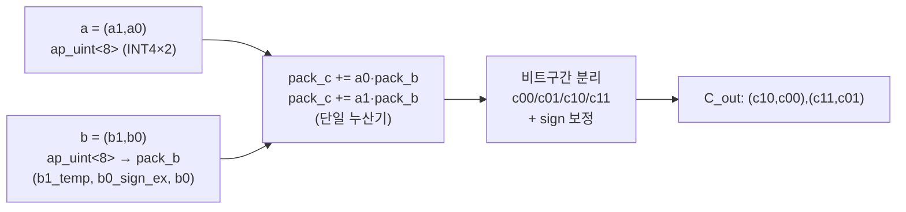
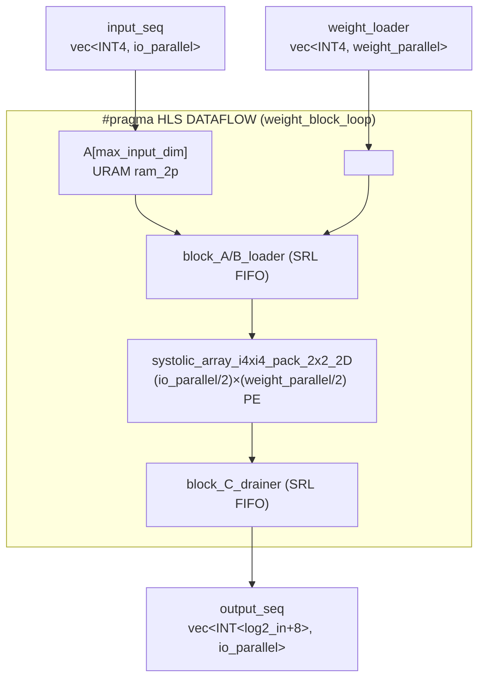
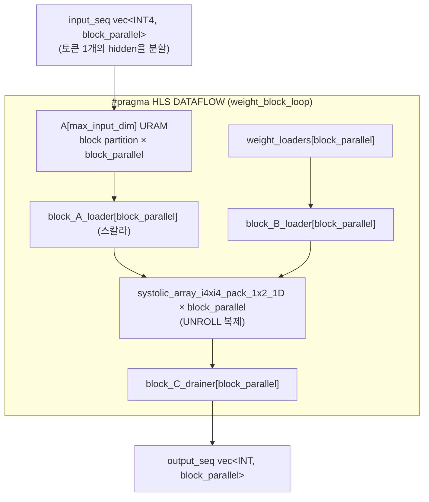
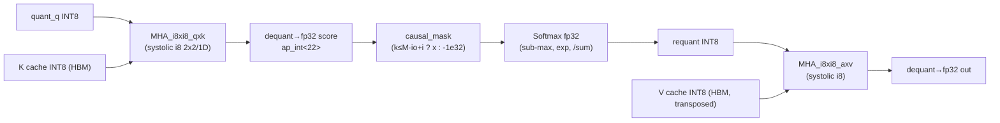
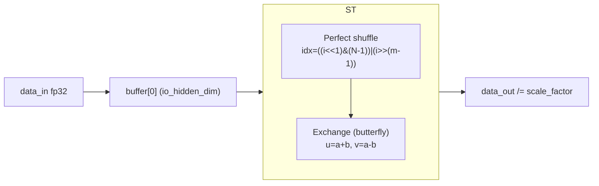
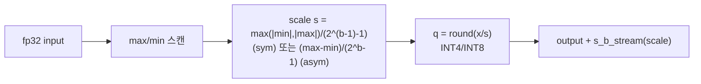

# FlexLLM 모듈 통합 가이드 (H-HLS, TAPA/RapidStream → U280)

> 1차 요약(맥락): [`../FlexLLM.md`](../FlexLLM.md)
>
> 분석 대상: `\\wsl.localhost\ubuntu-24.04\home\user\project\PRJXR-HBTXR\REF\ViT-Accelerator\FlexLLM` (동일 사본 `Transformer-Accel\FlexLLM`)
> 분석 도구: Glob/Grep/Read (라인 근거). third-party/생성물(`parameters/*.h` 다운로드 가중치, `*.gguf`, `run/bitstreams/*.xclbin`, `work.out/`, `RapidStream/build/`)은 **이름만** 언급하고 분석 제외.
> 표기 규약: 코드에서 직접 확인 = 단정, 코드 외 배경지식 = "추정", 미확인 = "확인 불가".

---

## 0. 머리말

### 0.1 대표 케이스 선정과 근거

이 가이드는 두 개의 GEMM 시스톨릭 형상을 **대표 케이스**로 삼는다. FlexLLM은 동일 transformer를 두 워크로드(prefill / decode)로 나누어 **서로 다른 시스톨릭 차원**으로 매핑하기 때문이다.

| 대표 케이스 | 모듈 | 시스톨릭 형상 | 선정 근거 |
|---|---|---|---|
| **CASE-P: prefill 2D GEMM** | `pref_Linear_Layer_i4xi4` → `systolic_array_i4xi4_pack_2x2_2D` | 2D `(io_parallel/2)×(weight_parallel/2)` PE 어레이 | `Linear_Layer.h:294-341`(래퍼) + `:9-84`(어레이). prefill은 시퀀스 전체를 토큰 병렬로 처리 → 2D 어레이로 활성화·가중치 양방향 재사용. 톱레벨 `SpinQuant_Prefilling.h:957,968,1013,1022,1038`에서 QKVO/FFN 5개 Linear가 모두 이 경로. |
| **CASE-D: decode 1D GEMM** | `dec_Linear_Layer_i4xi4` → `systolic_array_i4xi4_pack_1x2_1D` | 1D `(weight_parallel/2)` PE 벡터 × `block_parallel` 복제 | `Linear_Layer.h:862-923`(래퍼) + `:632-677`(어레이). decode는 토큰 1개씩 자기회귀 → 입력이 벡터(시퀀스 차원 1) → 1D로 축소해 자원 절감. 톱레벨 `SpinQuant_Decoding.h:1074-1075`. |

두 케이스를 떠받치는 공통 PE는 `PE_i4xi4_pack_2x2_2D`(`PE.h:373-414`)와 `PE_i4xi4_pack_1x2_1D`(`PE.h:760-789`)이며, 둘 다 **INT4 2개를 하나의 와이드 누산기에 패킹**하는 동일 기법을 쓴다(§2).

### 0.2 수치 규약 (정적, 합성 전 산정)

본 가이드의 정량 수치는 모두 **정적**(소스 #define/constexpr/loop bound)이다. 합성 PPA 리포트는 저장소에 포함되지 않으므로 LUT/FF/DSP/BRAM 실측은 **확인 불가**이며, 아래 규약으로 산정한 논리값만 제시한다.

- **MAC lanes** = 시스톨릭 어레이 PE 수 × PE당 동시 곱. 패킹 PE는 1개가 INT4 곱 2~4개를 처리.
- **scalar MACs** = 레이어 shape 곱. prefill = `seq_len × in_dim × out_dim`, decode = `1 × in_dim × out_dim`(토큰 1개).
- **loop trips** = 타일/토큰 루프 반복 횟수(`io_block_loop`, `weight_block_loop`, `decoder_block_loop`, `PE_LOOP` 등).
- **memory** = 온칩 버퍼 entry × bitwidth, 또는 HBM 버스트 워드 폭. INT4 가중치는 1바이트에 2개 패킹되어 읽힘(`ap_int<8>` mmap).
- 모델 상수(LLaMA-3.2-1B, `config_u280.h:19-45`): `DECODER_LAYER_NUM=16`, `HIDDEN_DIM=2048`, `KV_HIDDEN_DIM=512`, `HEAD_DIM=64`, `INTER_DIM=8192`, `VOCAB_SIZE=128256`, `Q_HEAD_NUM=32`, `KV_HEAD_NUM=8`, `ATTN_GROUP_NUM=4`(GQA 4:1).

### 0.3 운영 경로 (SpinQuant ↔ TAPA HLS ↔ RapidStream ↔ U280)

```
SpinQuant 양자화(오프라인)         TAPA HLS (composable)            RapidStream (floorplan)        U280
─────────────────────────         ─────────────────────            ────────────────────────       ────
INT4 linear weight  ─┐            Modules/*.h 템플릿                gen_device_u280.py             SLR0
INT8 MHA (Q/K/V/A)  ─┼─ scale ─→  SpinQuant_*.h 래퍼(16층 루프) ─→  gen_floorplan_config.py ─→     32 HBM ch
Hadamard R4 rotation ┘            tapa::task().invoke 그래프        gen_pipeline_config.py         DDR(제어)
                                  tapa compile → .xo               impl.py (Vitis Explore)        300MHz
                                                                   rapidstream-tapaopt → .xclbin  (3.33ns)
```

- 양자화 scale은 정적 헤더 `parameters/*_s.h`로 커널에 포함됨(`MHA_i8xi8.h:11-14`의 `Q_s/K_s/V_s/A_s`). 가중치 자체는 외부 다운로드(제외물).
- 빌드 레시피: `Tapa_Command`(make 타깃). csim(`tapa g++`) → HLS(`tapa compile -j128 --clock-period 3.33`) → floorplan/impl(`rapidstream-tapaopt`)(`Tapa_Command:7-24`).

### 0.4 타깃 / 데이터타입

- **타깃**: AMD Alveo U280, 플랫폼 `xilinx_u280_gen3x16_xdma_1_202211_1`(`impl.py:33`), 클럭 3.33ns ≈ 300MHz(`impl.py:18-20`, `Tapa_Command:9`).
- **데이터타입 매핑**:
  - Linear(QKVO·FFN) 가중치/활성화: **INT4** `ap_int<4>`(`PE.h:373`, `Linear_Layer.h:294`).
  - MHA(Q·K·V·score): **INT8** `ap_int<8>`(`PE.h:527`, `MHA.h:114`). score 누산은 `ap_int<log2_HEAD_DIM+16>`=22bit(`MHA.h:193`).
  - 정규화/softmax/swish/residual/RoPE/dequant: **fp32**(`Softmax.h:6`, `Swish.h:6`, `LayerNorm.h:28`).
  - SpinQuant 회전: **fp32 Hadamard butterfly**(`FHT.h:7`), FFN down 입력에 적용.
  - 양자화 scale: `hls::vector<float, 2>` = (scale, row-sum 또는 zero-point)(`Linear_Layer.h:259`, 톱레벨 `SpinQuant_Prefilling.h:810`).

---

## 1. Repo / Layer 개요 + 호출 계층 + 제외 목록

### 1.1 설계 철학: "Modules/ 템플릿 + 변형 래퍼"

FlexLLM은 **연산 로직을 `Modules/`의 파라미터 템플릿에 두고**, 각 변형(`SpinQuant_Llama_32_1B/`, `_Ins/`, `HMT_*`)은 **16-layer 루프를 도는 얇은 래퍼**만 정의한다. 예: `MHA_i8xi8.h:120-132`의 `pref_MHA_i8xi8_qxk`는 `decoder_block_loop`(16회) 안에서 `pref_MHA_i8xi8_qxk_template`(MHA.h:190)을 호출하는 12줄짜리 래퍼다.

### 1.2 인스턴스/호출 계층

```
SpinQuant_Prefilling (톱레벨 TAPA task, SpinQuant_Prefilling.h:807)
└─ tapa::task().invoke × ~60  (SpinQuant_Prefilling.h:940-1049)
   ├─ pref_block_input_loader_sync / pref_iembed_distributor   (data_io.h)
   ├─ pref_Layer_Norm_0/1            → pref_Layer_Norm           (LayerNorm.h:28)
   ├─ pref_quant_layer_*_fp32_int4   → pref_quant_layer_fp32_qint (quant.h:6)
   ├─ pref_Linear_Layer_i4xi4_{kq,vo,ffn_*}  → pref_Linear_Layer_i4xi4 (Linear_Layer.h:294)
   │                                          └─ systolic_array_i4xi4_pack_2x2_2D (Linear_Layer.h:9)
   │                                             └─ PE_i4xi4_pack_2x2_2D (PE.h:373)   ★CASE-P
   ├─ pref_RoPE_layer_kq             → RoPE.h
   ├─ pref_MHA_i8xi8_qxk/axv         → pref_MHA_i8xi8_*_template  (MHA.h:190 / :340)
   │                                  └─ systolic_array_i8xi8_pack_2x2 (MHA.h:114)
   │                                     └─ PE_i8xi8_pack_2x2_2xDSP_2D (PE.h:527)
   ├─ pref_K/V_cache_manager         → pref_*_cache_manager_template (MHA.h:75 / :300)
   ├─ pref_causal_mask               → pref_causal_mask_template  (MHA.h:247)
   ├─ pref_Softmax_MHA               → pref_Softmax              (Softmax.h:6)
   ├─ pref_Swish_Layer_ffn           → pref_Swish                (Swish.h:6)
   ├─ pref_Gate_Layer_ffn            → pref_Gate_Layer_fp32xfp32 (Linear_Layer.h:613)
   ├─ pref_FHT_R4                    → pref_FHT                  (FHT.h:7)   ★SpinQuant 회전
   └─ pref_Residual_Layer_0/1        → Residual_Layer.h

SpinQuant_Decoding (톱레벨 TAPA task, SpinQuant_Decoding.h:946)
└─ tapa::task().invoke × ~30  (SpinQuant_Decoding.h:1049-1127)
   ├─ dec_qkvo_FFN_input_merger (QKVO+FFN 융합 스트림)
   ├─ dec_weight_loader_qkvo_FFN  .invoke<tapa::detach, N/2> × 2 half  (:1066-1067)
   ├─ dec_Linear_Layer_i4xi4_qkvo_FFN_half → dec_Linear_Layer_i4xi4 (Linear_Layer.h:862)
   │                                        └─ systolic_array_i4xi4_pack_1x2_1D (Linear_Layer.h:632)
   │                                           └─ PE_i4xi4_pack_1x2_1D (PE.h:760)   ★CASE-D
   ├─ dec_MHA_i8xi8_qxk/axv        → dec_MHA_i8xi8_*_template (MHA.h:616)
   │                                └─ systolic_array_i8xi8_pack_1x2_1D (MHA.h:565)
   │                                   └─ PE_i8xi8_pack_1x2_1xDSP_1D (PE.h:794)
   ├─ dec_K/V_cache_manager        .invoke<tapa::detach, DEC_HEAD_PARALLEL> (:1087,1098)
   ├─ dec_FHT_R4                   → dec_FHT (FHT.h:69)
   └─ dec_Top_K_Sampling_Embedding_Layer → dec_Logits_Max_K_Layer (Logits.h:34) ★온칩 폐루프
```

### 1.3 제외 목록 (이름만 언급)

`parameters/*.h`(다운로드 양자화 가중치/scale 헤더), `*.gguf`(llama.cpp 토크나이저), `run/bitstreams/*.xclbin`(비트스트림), `run/...demo`(컴파일된 호스트 실행물), `work.out/`(xosim 산출물), `RapidStream/build/`(합성 산출물), `.ip_user_files`(없음). 단, `Q_s/K_s/V_s/A_s`가 `parameters/*_s.h`에서 온다는 사실은 `MHA_i8xi8.h:11-14`로 확인.

---

## 2. PE — DSP 패킹 (`Modules/PE.h`)

### ① 역할 + 상위/하위
모든 시스톨릭 어레이의 최하위 곱셈-누산 셀. 상위: 모든 `systolic_array_*`(Linear_Layer.h, MHA.h). 하위: DSP48E2 슬라이스. 핵심 가치는 **단일 누산기에 두(또는 네) 개의 저비트 곱을 패킹**하여 1 DSP로 2~4 MAC을 처리하는 것(`PE.h:6-7` 자원폭 주석 `DSP48E2: A27 B18 C48`).

### ② 구조도


### ③ function call stack
`systolic_array_i4xi4_pack_2x2_2D` → `PE_i4xi4_pack_2x2_2D`(PE.h:373). 1D 변형: `systolic_array_i4xi4_pack_1x2_1D` → `PE_i4xi4_pack_1x2_1D`(PE.h:760). INT8: `systolic_array_i8xi8_pack_2x2` → `PE_i8xi8_pack_2x2_2xDSP_2D`(PE.h:527).

### ④ 대표 코드 위치
`PE.h:373-414`(i4 2x2), `PE.h:760-789`(i4 1x2 1D), `PE.h:527-583`(i8 2x2).

### ⑤ 대표 코드 블록

**(블록 1) INT4 2×2 패킹 누산** — `PE.h:383-413`
```cpp
PE_LOOP: for (int k = 0; k < k_size; k++) {
#pragma HLS PIPELINE II=1
    ap_uint<8> a = A_in.read();        // a0,a1 = 두 INT4 활성화
    ap_int<4> a0 = a(3, 0); ap_int<4> a1 = a(7, 4);
    ap_uint<8> b = B_in.read();        // b0,b1 = 두 INT4 가중치
    ap_int<4> b0 = b(3, 0); ap_int<4> b1 = b(7, 4);
    ap_int<5> b1_temp = b[3] ? ap_int<5>(b1 + ap_int<4>(-1)) : ap_int<5>(b1);
    ap_int<max_log2_k_size + 4> b0_sign_ex = b[3] ? -1 : 0;
    ap_int<max_log2_k_size + 13> pack_b = (b1_temp, b0_sign_ex, b0); // 두 가중치를 하나의 와이드 워드
    pack_c_0 += a0 * pack_b;           // a0·b0, a0·b1 을 한 곱으로
    pack_c_1 += a1 * pack_b;           // a1·b0, a1·b1
}
ap_int<...> c_00 = pack_c_0.range(max_log2_k_size + 7, 0);
ap_int<...> c_01 = pack_c_0.range(2*max_log2_k_size + 15, max_log2_k_size + 8);
c_01 = c_01 + c_00[max_log2_k_size + 7];  // 하위곱 부호가 상위곱에 누설되는 것 보정
C_out.write((c_10, c_00)); C_out.write((c_11, c_01));
```
해설: `pack_b`는 b0(하위)과 b1(상위)을 `max_log2_k_size+8`비트 간격으로 떨어뜨려 합친 와이드 상수. `a0 * pack_b` 한 번에 `a0·b0`(하위 구간)과 `a0·b1`(상위 구간)이 동시에 누산된다. `k_size`만큼 누산 후 `pack_c`의 비트 구간을 잘라 4개 부분합(`c_00,c_01,c_10,c_11`)을 복원하고, 하위 곱의 부호 비트를 상위 곱에 더해(`c_01 += c_00[msb]`) 부호 있는 INT4 정확도를 유지한다. 결과적으로 **2×2 = 4 MAC을 PE당 1회 곱**으로 처리.

**(블록 2) INT8 1×2 단일-DSP 패킹** — `PE.h:794-829`
```cpp
ap_int<8> b0 = b(7, 0); ap_int<8> b1 = b(15, 8);
ap_int<9> b1_temp = b[7] ? ap_int<9>(b1 + ap_int<8>(-1)) : ap_int<9>(b1);
ap_int<8> b0_sign_ex = b[7] ? -1 : 0;
ap_int<25> pack_b = (b1_temp, b0_sign_ex, b0);   // INT8 2개 → 25bit
ap_int<32> pack_c = a * pack_b;                   // 1 DSP48E2 (A27×B24)
ap_int<16> c0 = pack_c.range(15, 0);  ap_int<16> c1 = pack_c.range(31, 16);
c1 += c0[15];                                     // 부호 보정
```
해설: INT8 한 쌍을 25bit 상수로 묶어 단일 DSP(27×24 곱)에 태운다. decode QxK/AxV(1D) 경로의 셀. prefill INT8(2x2)은 `PE_i8xi8_pack_2x2_2xDSP_2D`(PE.h:527)로 **2 DSP에 4 MAC**.

### ⑥ 마이크로아키텍처
- **Stage 분해**: (S1) read a/b → (S2) b 패킹/부호확장(조합) → (S3) 곱+누산(`II=1`, DSP) → (S4) 루프 종료 후 비트구간 분리+부호보정(조합).
- **메모리/재사용**: PE 로컬 누산기 `pack_c`(레지스터) 외 메모리 없음. 입력 a/b는 systolic 인접 PE로 forward(`A_out/B_out`) → **output-stationary 추정**(부분합이 PE에 머무름, 입력만 흐름).
- **정량/병목**:
  - MAC lanes(PE 1개): i4 2x2 = **4 MAC/cycle**, i4 1x2 = **2 MAC/cycle**, i8 2x2 = 4 MAC/2 DSP, i8 1x2 = 2 MAC/1 DSP.
  - loop trips = `k_size`(= 누산 차원). `II=1`이므로 PE 처리량 = 1 입력쌍/cycle.
  - 병목: 누산 폭 `2*max_log2_k_size+16`비트(i4 2x2 = `2*11+16=38`bit). 부호 보정 chain(`c_01 += c_00[msb]`)이 critical path. fp32 PE는 U280/Vitis2022 한계로 `II=4` 4-way 분할 누산(`PE.h:53-78`) — fp 누산 의존성 우회용.

---

## 3. CASE-P: prefill 2D Linear GEMM (`Modules/Linear_Layer.h`)

### ① 역할 + 상위/하위
prefill의 모든 INT4 행렬곱(QKVO 4개 + FFN gate/up/down 3개). 상위: `SpinQuant_Prefilling.h:957,968,1013,1022,1038`. 하위: `systolic_array_i4xi4_pack_2x2_2D` → `PE_i4xi4_pack_2x2_2D`.

### ② 구조도


### ③ function call stack
`pref_Linear_Layer_i4xi4`(Linear_Layer.h:294) → `systolic_array_i4xi4_pack_2x2_2D`(:9) → `PE_i4xi4_pack_2x2_2D`(PE.h:373). 가중치 공급: `pref_weight_loader_int4_pack_2_discard`(Linear_Layer.h:162, INT4 2-pack 언패킹) + `pref_weight_s_loader_fp32`(:258, scale).

### ④ 대표 코드 위치
`Linear_Layer.h:294-341`(타일 dataflow 본체), `:9-84`(2D 어레이), `:41-58`(PE 공간 전개).

### ⑤ 대표 코드 블록

**(블록 1) 타일 dataflow + 활성화 온칩 상주** — `Linear_Layer.h:302-340`
```cpp
hls::vector<ap_int<4>, io_parallel> A[max_input_dim];
#pragma HLS bind_storage variable=A type=ram_2p impl=uram   // 활성화 URAM 상주 → 가중치 재사용
io_block_loop: for (int M = 0; M < seq_len/io_parallel; M++){
    in_buf_loop: for (int k = 0; k < input_hidden_dim; k++) { // 활성화 타일 적재
    #pragma HLS pipeline II=1
        A[k] = input_seq.read();
    }
    weight_block_loop: for(int N = 0; N < (output_hidden_dim+weight_parallel-1)/weight_parallel; N++){
    #pragma HLS DATAFLOW                                       // load→systolic→drain 오버랩
        init_block_AB: for(int k = 0; k < input_hidden_dim; k++){
        #pragma HLS PIPELINE II=1
            block_A_loader.write(A[k]);                        // 동일 A를 모든 N 타일에 재사용
            block_B_loader.write(weight_loader.read());
        }
        systolic_array_i4xi4_pack_2x2_2D<io_parallel, weight_parallel, max_log2_input_dim, is_uint_input>(
            block_A_loader, block_B_loader, block_C_drainer, input_hidden_dim);
        bias_loop: for (int n = 0; n < weight_parallel; n++)
            output_seq.write(block_C_drainer.read());
    }
}
```
해설: 활성화 한 타일(`io_parallel`개 토큰 × `input_hidden_dim`)을 URAM `A[]`에 적재한 뒤, 출력채널 타일(`weight_block_loop`, N개)마다 동일 `A[]`를 재공급. 가중치는 N마다 새로 스트리밍 → **활성화 stationary, 가중치 streaming**. 출력 누산 폭은 `ap_int<max_log2_input_dim+8>`(=19bit, `:297`)로 자동 산정.

**(블록 2) 2D 어레이 PE 공간 전개 + 모서리 분기** — `Linear_Layer.h:41-58`
```cpp
systolic_array: for (int m = 0; m < block_size_a/2; m++) {
#pragma HLS UNROLL
    for (int n = 0; n < block_size_b/2; n++) {
    #pragma HLS UNROLL
        if(m==block_size_a/2-1 && n==block_size_b/2-1)
            PE_i4xi4_pack_2x2_2D<is_uint_A, max_log2_k_size, true, true>(...);   // 우하 모서리
        else if(m==block_size_a/2-1)
            PE_i4xi4_pack_2x2_2D<is_uint_A, max_log2_k_size, false, true>(...);  // 하단행
        else if(n==block_size_b/2-1)
            PE_i4xi4_pack_2x2_2D<is_uint_A, max_log2_k_size, true, false>(...);  // 우측열
        else
            PE_i4xi4_pack_2x2_2D<is_uint_A, max_log2_k_size, false, false>(...); // 내부
    }
}
```
해설: `is_last_A/is_last_B` 템플릿 플래그로 어레이 끝 PE는 forward를 생략(`if(!is_last_X) X_out.write(...)`, PE.h:403-404). FIFO는 SRL 바인딩(`:18,20,24`). `block_size_a/2 × block_size_b/2`개 PE를 `UNROLL`로 동시 인스턴스화 → 공간 병렬 어레이.

### ⑥ 마이크로아키텍처
- **Stage 분해**: (S1) `in_buf_loop` 활성화 URAM 적재(`II=1`, `input_hidden_dim` cycle) → (S2) `init_block_AB` A/B를 FIFO로 주입 → (S3) systolic 어레이 곱(PE `II=1`) → (S4) `data_drain_C`(II=2, `:71`) 결과 배수.
- **메모리/재사용**: `A[max_input_dim]` = `HIDDEN_DIM(2048)` entry × `io_parallel(8)` × INT4 = 8KB급 URAM. 가중치 재사용도 = `seq_len/io_parallel`(M 루프 1회 적재로 N 타일 전체 재사용은 아님 — A는 M 단위 재적재되나 N 타일 간 재사용).
- **정량 (QKVO 예, `weight_parallel=PRE_QKVO_W_PARALLEL=16`, `io_parallel=TOKEN_PARALLEL=8`)**:
  - MAC lanes = `(8/2)×(16/2)` PE × 4 MAC = `4×8×4` = **128 MAC/cycle**.
  - scalar MACs (Q proj 1층) = `seq_len × HIDDEN_DIM × HIDDEN_DIM` = `seq_len × 2048 × 2048` ≈ `seq_len × 4.19M`.
  - FFN gate/up: `weight_parallel=PRE_FFN_W_PARALLEL=64`(블록 2분할 `PRE_FFN_W_BLOCK_NUM=2`) → MAC lanes = `(8/2)×(64/2)×4` = **2048 MAC/cycle**. scalar MACs = `seq_len × 2048 × 8192` ≈ `seq_len × 16.8M`.
  - loop trips: `io_block_loop = seq_len/8`, `weight_block_loop = out_dim/weight_parallel`, 내부 `PE_LOOP = input_hidden_dim`.
  - memory(HBM): 가중치 `ap_int<8>` × `PRE_QKVO_W_PARALLEL_READ/2`(=8) 워드 버스트(INT4 2-pack), scale `hls::vector<float,2>`.
- **병목**: `data_drain_C`가 `II=2`(`Linear_Layer.h:71`)로 배수단이 어레이보다 2× 느림(2x2 패킹으로 출력이 2배 묶여 나오기 때문). FFN(in=2048, out=8192)이 최대 연산량 → prefill 임계 경로. 가중치 HBM 대역폭이 `weight_parallel` 상향의 실제 한계(채널 수 32 제약, §8).

---

## 4. CASE-D: decode 1D Linear GEMM (`Modules/Linear_Layer.h`)

### ① 역할 + 상위/하위
decode의 융합 QKVO+FFN INT4 행렬곱. 상위: `SpinQuant_Decoding.h:1074-1075`(2 half). 하위: `systolic_array_i4xi4_pack_1x2_1D` → `PE_i4xi4_pack_1x2_1D`. decode는 토큰 1개라 시퀀스 차원이 1 → 입력을 `block_parallel`로 hidden 차원에 분할.

### ② 구조도


### ③ function call stack
`dec_Linear_Layer_i4xi4`(Linear_Layer.h:862) → `systolic_array_i4xi4_pack_1x2_1D`(:632) → `PE_i4xi4_pack_1x2_1D`(PE.h:760). 가중치: `dec_weight_loader_int4_pack_2`(:723) + detach 복제(톱레벨 `:1066`).

### ④ 대표 코드 위치
`Linear_Layer.h:862-923`(1D 래퍼), `:632-677`(1D 어레이).

### ⑤ 대표 코드 블록

**(블록 1) hidden 분할 적재 + 1D 어레이 복제** — `Linear_Layer.h:885-912`
```cpp
ap_int<4> A[max_input_dim];
#pragma HLS bind_storage variable=A type=ram_2p impl=uram
#pragma HLS ARRAY_PARTITION variable=A type=block factor=block_parallel  // hidden을 block_parallel등분
in_buf_loop: for (int k = 0; k < input_hidden_dim/block_parallel; k++) {
#pragma HLS pipeline II=1
    hls::vector<ap_int<4>, block_parallel> A_pack = input_seq.read();
    for (int i = 0; i < block_parallel; i++)
        A[i * max_input_dim/block_parallel + k] = A_pack[i];   // block partition
}
weight_block_loop: for(int N = 0; N < output_hidden_dim/(block_parallel*weight_parallel); N++){
#pragma HLS DATAFLOW
    init_block_AB: for(int K = 0; K < block_parallel; K++)
        for(int k = 0; k < input_hidden_dim/block_parallel; k++){
        #pragma HLS PIPELINE II=1
            for (int i = 0; i < block_parallel; i++) {
                block_A_loader[i].write(A[K * max_input_dim/block_parallel + k]);
                block_B_loader[i].write(weight_loaders[i].read());
            }
        }
    for (int i = 0; i < block_parallel; i++) {
    #pragma HLS UNROLL
        systolic_array_i4xi4_pack_1x2_1D<weight_parallel, max_log2_input_dim, is_uint_input>(
            block_A_loader[i], block_B_loader[i], block_C_drainer[i], input_hidden_dim);
    }
}
```
해설: 단일 토큰의 `HIDDEN_DIM` 활성화를 `block_parallel`등분(block partition)하여 `block_parallel`개의 1D 어레이가 각자 hidden 청크를 처리. 2D와 달리 입력 A가 **스칼라 스트림**(`hls::stream<ap_int<4>>`, `:875`)이고 가중치만 벡터 → 1×2 패킹(가중치 2개만 묶음).

**(블록 2) 1D 어레이 = PE 벡터** — `Linear_Layer.h:664-676`
```cpp
for (int n = 0; n < block_size_b/2; n++) {
#pragma HLS UNROLL
    if(n == block_size_b/2 - 1)
        PE_i4xi4_pack_1x2_1D<is_uint_A, max_log2_k_size, true>(A_fifo[n], A_fifo[n+1], B_fifo[n], C_fifo[n], k_size);
    else
        PE_i4xi4_pack_1x2_1D<is_uint_A, max_log2_k_size>(A_fifo[n], A_fifo[n+1], B_fifo[n], C_fifo[n], k_size);
}
data_drain_C: for (int n = 0; n < block_size_b/2; n++) {
#pragma HLS PIPELINE II=2
    C_drainer.write(C_fifo[n].read()); C_drainer.write(C_fifo[n].read());
}
```
해설: A는 PE 체인을 따라 한 줄로 흐르고(`A_fifo[n]→A_fifo[n+1]`), 각 PE가 가중치 2개(1×2)를 패킹 처리. 2D 어레이를 1행으로 축소한 형상 → decode의 낮은 연산밀도에 맞춤.

### ⑥ 마이크로아키텍처
- **Stage 분해**: (S1) `in_buf_loop` 토큰 hidden을 block-partition URAM 적재 → (S2) `init_block_AB` A 재공급/가중치 주입(N 타일 루프) → (S3) `block_parallel`개 1D 어레이 병렬 곱 → (S4) drain(II=2).
- **메모리/재사용**: `A[HIDDEN_DIM]` INT4, block-partition factor `block_parallel`로 동시 read. 가중치는 N마다 새로(재사용 낮음 — decode는 가중치 한 번 쓰고 버림 → HBM 대역폭 결정적).
- **정량 (`block_parallel=T_QKVO_FFN_BLOCK_PARALLEL=8`, `weight_parallel=DEC_QKVO_FFN_W_PARALLEL=64`)**:
  - MAC lanes = `block_parallel × (weight_parallel/2)` PE × 2 MAC = `8 × 32 × 2` = **512 MAC/cycle** (2 half로 분산, `:1074-1075`).
  - scalar MACs (decode 1 토큰, 융합 QKVO+FFN) = `1 × in_dim × out_dim`. 예 FFN up = `1 × 2048 × 8192` = 16.8M(토큰당).
  - loop trips: `weight_block_loop = out_dim/(block_parallel×weight_parallel)`, 내부 `PE_LOOP = input_hidden_dim`.
  - memory(HBM): 가중치 detach `T_QKVO_FFN_BLOCK_PARALLEL/2`(=4) 복제(`:1066`), 각 `ap_int<8> × DEC_QKVO_FFN_W_PARALLEL/2`(INT4 2-pack).
- **병목**: decode는 **가중치 재사용 0**(토큰 1개) → 순수 HBM 대역폭 바운드. `tapa::detach` 가중치 로더 복제(`:1066-1067`)와 half 분할이 대역폭 병렬화의 전부. mem_opt에서 `DEC_K_PARALLEL=DEC_QKVO_FFN_W_PARALLEL/2`로 KV를 가중치 병렬에 종속시켜 채널 공유(`config_u280_mem_opt.h:60`).

---

## 5. MHA INT8 어텐션 (`Modules/MHA.h`, `SpinQuant_Llama_32_1B/MHA_i8xi8.h`)

### ① 역할 + 상위/하위
self-attention = QxK(score) → mask → softmax → requant → AxV. 전 구간 INT8(가중치는 KV 캐시, score는 INT8 재양자화). 상위: `SpinQuant_Prefilling.h:985-993`, `SpinQuant_Decoding.h:1089-1107`. 하위: `systolic_array_i8xi8_pack_2x2`(prefill 2D) / `systolic_array_i8xi8_pack_1x2_1D`(decode 1D).

### ② 구조도


### ③ function call stack
prefill: `pref_MHA_i8xi8_qxk`(MHA_i8xi8.h:120) → `pref_MHA_i8xi8_qxk_template`(MHA.h:190) → `systolic_array_i8xi8_pack_2x2`(MHA.h:114) → `PE_i8xi8_pack_2x2_2xDSP_2D`(PE.h:527). AxV: `pref_MHA_i8xi8_axv_template`(MHA.h:340). decode: `dec_MHA_i8xi8_qxk_template`(MHA.h:616) → `systolic_array_i8xi8_pack_1x2_1D`(MHA.h:565). 캐시: `pref_K/V_cache_manager_template`(MHA.h:75/300).

### ④ 대표 코드 위치
`MHA.h:190-243`(prefill QxK), `:340-389`(prefill AxV), `:247-273`(causal mask), `:616-668`(decode QxK), `:75-109`(K cache + GQA).

### ⑤ 대표 코드 블록

**(블록 1) prefill QxK: head별 Q 버퍼 + K 스트리밍** — `MHA.h:215-240`
```cpp
attn_head_loop: for (int H = 0; H < mha_head_num; H++){       // Q_HEAD_NUM=32
    in_buf_loop: for (int k = 0; k < mha_head_dim; k++)        // HEAD_DIM=64
    #pragma HLS pipeline II=1
        A[k] = input_seq.read();                              // 한 head의 Q를 버퍼
    k_weight_block_loop: for(int N = 0; N < seq_len/K_parallel; N++){
    #pragma HLS DATAFLOW
        init_block_AB: for(int k = 0; k < mha_head_dim; k++){
            block_A_loader.write(A[k]);
            block_B_loader.write(weight_loader.read());        // K 스트리밍
        }
        systolic_array_i8xi8_pack_2x2<io_parallel, K_parallel, log2_mha_head_dim, is_uint_input>(
            block_A_loader, block_B_loader, block_C_drainer, mha_head_dim);  // k_size = HEAD_DIM
        output_scale_loop: for (int n = 0; n < K_parallel; n++)
            output_seq.write(block_C_drainer.read());
    }
}
```
해설: head 하나의 Q(64-dim)를 버퍼 A에 적재, K를 `K_parallel(=16)` 단위로 스트리밍하며 `score = Q·Kᵀ`. 누산 차원이 `HEAD_DIM=64`라 PE 누산 폭이 `log2_HEAD_DIM+16=22`bit(`:193`). 출력은 `seq_len/K_parallel × K_parallel` = score 행.

**(블록 2) causal mask** — `MHA.h:261-269`
```cpp
for(int i = 0; i < io_parallel; i++){
    if(k <= M * io_parallel + i)         // 토큰 위치 i가 키 위치 k 이상이면 통과
        output_pack[i] = input_pack[i];
    else
        output_pack[i] = -1e32;          // 미래 토큰 마스킹 (softmax에서 0)
}
```
해설: prefill 전용. `M*io_parallel + i`가 현재 토큰 절대 위치, `k`가 키 위치. ViT 등 full-attention에 이식 시 이 단계만 제거하면 됨(`-1e32` 분기 삭제).

### ⑥ 마이크로아키텍처
- **Stage 분해 (prefill)**: (S1) Q head 버퍼 적재 → (S2) K 스트리밍 QxK(`II=1` PE) → (S3) dequant fp32 → (S4) causal mask → (S5) softmax(Softmax.h, sub-max+exp+정규화, `II=1`/`II=4`) → (S6) requant INT8 → (S7) AxV → (S8) dequant fp32.
- **메모리/재사용**: Q 버퍼 `A[HEAD_DIM=64]`(head별 재적재), K/V는 HBM `k_cache`/`v_cache` INT8(prefill 생성, AxV용 V는 transpose 저장 `pref_V_cache_manager_template`, `:300-336`). GQA: K/V head 8개를 Q head 32개가 `ATTN_GROUP_NUM=4`로 공유(`MHA.h:98` `attn_group_loop`, 캐시 매니저가 group_num 인지).
- **정량 (prefill, `io_parallel=TOKEN_PARALLEL=8`, `K_parallel=PRE_K_PARALLEL=16`)**:
  - QxK MAC lanes = `(8/2)×(16/2)` × 4 MAC = **128 MAC/cycle**.
  - scalar MACs(전 head QxK) = `Q_HEAD_NUM × seq_len × seq_len × HEAD_DIM` = `32 × seq² × 64`.
  - loop trips: `attn_head_loop=32`, `k_weight_block_loop=seq_len/16`, `PE_LOOP=HEAD_DIM=64`.
  - score 비트폭 22bit, AxV 누산 `log2_MAX_PRE_SEQ_LEN+16=26`bit(`:343`).
- **병목**: softmax의 `exp`가 fp32(DSP/LUT 비중↑), `II=4` exp 루프(`Softmax.h:54-90`). seq²의 QxK·AxV가 long-context에서 지배적. decode는 1D라 lanes가 `DEC_HEAD_PARALLEL × (DEC_K_PARALLEL/2)`로 작음(자원 절감, 토큰 1개라 충분).

---

## 6. SpinQuant 회전 — Fast Hadamard Transform R4 (`Modules/FHT.h`)

### ① 역할 + 상위/하위
SpinQuant의 학습된 직교회전을 FFN down 입력에 적용하는 in-network rotation. 상위: `SpinQuant_Prefilling.h:1032`(`pref_FHT_R4`), `SpinQuant_Decoding.h:1118`(`dec_FHT_R4`). 하위: omega-network butterfly(조합+버퍼).

### ② 구조도


### ③ function call stack
`pref_FHT_R4` → `pref_FHT`(FHT.h:7). decode: `dec_FHT_R4` → `dec_FHT`(FHT.h:69).

### ④ 대표 코드 위치
`FHT.h:30-53`(omega network stage), `:40-52`(butterfly exchange).

### ⑤ 대표 코드 블록
**omega-network Hadamard 단계** — `FHT.h:31-53`
```cpp
const int m = log2_io_hidden_dim;
Stage_Loop: for (int s = 0; s < m; s++) {
    Shuffle_Loop: for (int i = 0; i < io_hidden_dim; i++) {
    #pragma HLS PIPELINE II=1
        int idx = ((i << 1) & (io_hidden_dim - 1)) | (i >> (m - 1));  // perfect shuffle
        shuffle_buf[i] = buffer[s % 2][idx];
    }
    Exchange_Loop: for (int i = 0; i < io_hidden_dim; i += 2) {
    #pragma HLS PIPELINE II=1
        hls::vector<T, io_parallel> u_in = shuffle_buf[i], v_in = shuffle_buf[i+1];
        for (int k = 0; k < io_parallel; k++) {
        #pragma HLS UNROLL
            u_out[k] = u_in[k] + v_in[k];   // Hadamard butterfly
            v_out[k] = u_in[k] - v_in[k];
        }
        buffer[(s+1)%2][i] = u_out; buffer[(s+1)%2][i+1] = v_out;
    }
}
```
해설: `log2(N)` 단계(prefill N=`HIDDEN_DIM`/`INTER_DIM`)의 shuffle+butterfly로 Walsh-Hadamard 변환을 O(N log N) 구현. 가산/감산만(곱 없음) → DSP 미사용, LUT/가산기만. 더블 버퍼(`buffer[2][...]`)로 단계 간 ping-pong.

### ⑥ 마이크로아키텍처
- **Stage 분해**: (S1) Read_Loop 입력 적재 → (S2) Stage_Loop × `log2(N)` (shuffle → exchange) → (S3) Write_Loop `/scale_factor`.
- **메모리**: `buffer[2][io_hidden_dim]` (ARRAY_PARTITION dim=1 complete, `:15`), `shuffle_buf[io_hidden_dim]`. prefill `io_hidden_dim` = HIDDEN_DIM(2048) 또는 INTER_DIM, `io_parallel`폭 벡터.
- **정량**: loop trips = `log2(N)` 단계 × `N` shuffle = N·log2(N). FFN down 입력은 `INTER_DIM=8192` → 13 단계(`log2_INTER_DIM`). MAC = 0(가감산만).
- **병목**: shuffle의 비트 reorder가 메모리 access pattern을 만들어 `II=1` 달성. decode FHT는 block_parallel로 hidden을 분할하나 shuffle 인덱스 계산이 복잡(`FHT.h:98-100`) → 추정: decode 회전이 상대적 오버헤드.

---

## 7. 양자화/역양자화 (`Modules/quant.h`)

### ① 역할 + 상위/하위
fp32 활성화 ↔ INT4/INT8 변환. 각 Linear/MHA 앞뒤로 quant/dequant 쌍. 상위: 톱레벨 `pref_quant_layer_*_fp32_int4/int8`, `pref_dequant_layer_*`. 하위: per-tensor sym/asym 스케일 계산.

### ② 구조도


### ③ function call stack
`pref_quant_layer_fp32_qint`(quant.h:6, 동적 per-tensor) / `pref_static_sym_per_tensor_quant_layer_fp32_qint`(정적 scale, MHA_i8xi8.h:40에서 `Q_s` 사용). dequant: `pref_dequant_layer_qint_fp32`(quant.h:115).

### ④ 대표 코드 위치
`quant.h:84-108`(symmetric quant), `:53-81`(asymmetric).

### ⑤ 대표 코드 블록
**symmetric per-tensor quant** — `quant.h:85-107`
```cpp
float scale_base = (1 << (qint_bit - 1)) - 1;        // INT4: 7, INT8: 127
sym_cal_s_loop: for(int m = 0; m < io_parallel; m++){
    float abs_max = abs(input_max[m]); float abs_min = abs(input_min[m]);
    s[m] = (abs_max > abs_min ? abs_max : abs_min) / scale_base;
    if(s[m] == 0) s[m] = 1;
    input_s_b_stream.write(s_pack);                  // scale을 dequant단으로 전달
}
sym_quant_loop: for(int k = 0; k < input_dim; k++){
    for(int m = 0; m < io_parallel; m++)
        out_pack[m] = (ap_int<qint_bit>) round(input_buffer[m][k] / s[m]);
    output_stream.write(out_pack);
}
```
해설: per-token(io_parallel 축) per-tensor(input_dim 축) scale. dequant는 활성화 scale × 가중치 scale(`weight_s_sum_stream`)로 복원(`quant.h:119`). asym은 zero-point `b`도 전달(2-원소 벡터).

### ⑥ 마이크로아키텍처
- **Stage**: (S1) input 버퍼 적재 + max/min 동시 스캔 → (S2) scale 계산 → (S3) round 양자화.
- **메모리**: `input_buffer[io_parallel][max_input_dim]` URAM(`:14-16`). 2-pass(스캔→양자화)라 버퍼 필수.
- **정량**: loop trips = `seq_len/io_parallel × input_dim` × 2(스캔+양자화). memory = `io_parallel × input_dim` fp32.
- **병목**: 2-pass(전체 버퍼링 후 scale) → 레이턴시 = 2×dim. MHA의 Q/K/V는 정적 scale(`Q_s`)로 1-pass 우회(`MHA_i8xi8.h:40`).

---

## 8. 톱레벨 dataflow + HBM 매핑 + RapidStream floorplan

### 8.1 prefill 톱레벨 (`SpinQuant_Prefilling.h:807-1050`)
- 단일 `tapa::task()`(`:940`)에 **~60 invoke**, 각 invoke 내부가 `decoder_block_loop`(16층)을 시분할 반복.
- 경로: input loader → LN0 → QKV(INT4)→RoPE → VO(INT4) → K/V quant+cache(INT8) → QxK → mask → softmax → requant → AxV → Res0 → LN1 → FFN gate/up(INT4)+swish+gate → **FHT R4** → FFN down(INT4) → Res1 → output drainer.
- 잔차 캐싱: `iembed_stream_res0` 깊이 `8*HIDDEN_DIM`(`:887`), `quant_a_stream` 깊이 `MAX_PRE_SEQ_LEN`(`:871`) — 깊은 FIFO로 stage 간 비동기 흡수.

### 8.2 decode 톱레벨 (`SpinQuant_Decoding.h:946-1129`)
- **융합 GEMM**: QKVO+FFN을 `input_qkvo_ffn_stream` 하나로 합쳐(`dec_qkvo_FFN_input_merger`, `:1062`) 단일 Linear 엔진에 시분할.
- **detach 복제**: 가중치 로더 `.invoke<tapa::detach, T_QKVO_FFN_BLOCK_PARALLEL/2>` × 2 half(`:1066-1067`), KV 캐시 매니저 `.invoke<tapa::detach, DEC_HEAD_PARALLEL>`(`:1087,1098`) → HBM 대역폭 공간 병렬.
- **온칩 폐루프**: `dec_Top_K_Sampling_Embedding_Layer`(`:1125`)가 logits→Top-K(`LOGITS_MAX_K=5`)→샘플링→다음 토큰 임베딩까지 칩 내 완결. logits 정렬 = `sort_top_k`(Logits.h:6, insert-shift).
- LN broadcast/merge(`:1054-1059`)로 LN0/1/2를 단일 LN 엔진에 시분할.

### 8.3 HBM/DDR 매핑 (`*.ini`)
- **prefill**(`pref_link_config_u280.ini`): io=HBM[16], LN gamma=HBM[18]/[2], QKVO 가중치/scale=HBM[19-22], k/v_cache=HBM[23]/[24], FFN gate/up/down=HBM[3-8]. 1 포트 1 채널(분산 배치).
- **decode mem_opt**(`dec_link_config_u280_mem_opt.ini`): vocab/seed/sampled=DDR[1](제어 소량), io=HBM[0], **가중치+KV 합성 포트** `w_qkvo_FFN_mmaps_half_0_k_caches_0:HBM[5]`...`HBM[12]`(half_0, 8채널), half_1+v_caches=HBM[16-23], gamma=HBM[14], w_scale=HBM[24]. → **가중치와 KV 캐시를 동일 HBM 채널에 묶어** 32채널 한계 내 배치(추정).

### 8.4 RapidStream floorplan 자동화
- `gen_device_u280.py`(6줄): `get_u280_vitis_device_factory(...).generate_virtual_device("u280_device.json")` — U280 SLR/HBM 가상 디바이스.
- `gen_floorplan_config.py`: `FloorplanConfig(port_pre_assignments={".*": "SLOT_X0Y0:SLOT_X0Y0"})` — **모든 포트 SLR0 사전배치**(추정: 단일 슬롯 우선; mem_opt는 `floorplan_config_mem_opt.json` 별도, `Tapa_Command:43`).
- `gen_pipeline_config.py`: `PipelineConfig(pp_scheme="single")` — SLR-crossing 자동 파이프라이닝.
- `impl.py`: `ImplConfig(vitis_platform="...u280...", placement_strategy="Explore", max_workers=4, max_synth_jobs=16)`, `ap_clk:3.33`(`:18-37`).
- 실행: `rapidstream-tapaopt -j32 --tapa-xo-path *.xo --device-config u280_device.json --floorplan-config ... --pipeline-config ... --run-impl --implementation-config impl_config.json --connectivity-ini *.ini`(`Tapa_Command:15-24`).

---

## N+1. 한눈 요약 표

| 모듈 | 파일:라인 | 시스톨릭/형상 | MAC lanes(대표) | 데이터타입 | 핵심 pragma |
|---|---|---|---|---|---|
| PE i4 2x2 | PE.h:373-414 | 셀, 4 MAC/cycle | 4/PE | INT4→ap_int<8> pack | PIPELINE II=1 |
| PE i4 1x2 1D | PE.h:760-789 | 셀, 2 MAC/cycle | 2/PE | INT4 | PIPELINE II=1 |
| PE i8 2x2 | PE.h:527-583 | 셀, 4 MAC/2DSP | 4/2DSP | INT8 | PIPELINE II=1 |
| **CASE-P** prefill 2D GEMM | Linear_Layer.h:294,9 | 2D (io/2)×(w/2) | QKVO 128 / FFN 2048 | INT4 | DATAFLOW, UNROLL, uram, srl |
| **CASE-D** decode 1D GEMM | Linear_Layer.h:862,632 | 1D w/2 × block_parallel | 512 (2 half) | INT4 | DATAFLOW, block partition, detach |
| MHA QxK prefill | MHA.h:190,114 | 2D i8 | 128 | INT8, score 22b | DATAFLOW, II=1 |
| MHA QxK decode | MHA.h:616,565 | 1D i8 | head_par×K_par/2 | INT8 | DATAFLOW, detach KV |
| causal mask | MHA.h:247-273 | 원소 | — | fp32 | PIPELINE II=1 |
| Softmax | Softmax.h:6 | 2-pass | — | fp32, exp | II=1/II=4 |
| FHT R4 | FHT.h:7,69 | omega butterfly | 0 (가감산) | fp32 | II=1, double-buffer |
| quant/dequant | quant.h:6,115 | 2-pass scan | — | fp32↔INT | uram, II=1 |
| Top-K 샘플링 | Logits.h:6,34 | insert-sort | — | fp32, K=5 | II=1/II=2 |

대표 모델 수치(LLaMA-3.2-1B, `config_u280.h`): 16층, hidden 2048, GQA 32/8(4:1), INTER 8192, vocab 128256, prefill TOKEN_PARALLEL=8, FFN MAC 2048/cycle.

---

## N+2. 읽기·코드추적 순서

1. `config_u280.h:19-75` — 모델/병렬도 상수 (모든 템플릿 인자의 출처).
2. `PE.h:373-414` — DSP 패킹 원리 (CASE-P 셀). → `:760-789`(CASE-D 셀).
3. `Linear_Layer.h:294-341` → `:9-84` — CASE-P 타일→어레이→PE.
4. `Linear_Layer.h:862-923` → `:632-677` — CASE-D 동일 추적.
5. `SpinQuant_Prefilling.h:807-1050` — prefill 전체 dataflow (각 invoke를 Modules로 점프).
6. `MHA.h:190-243`, `:340-389`, `:247-273` — 어텐션 3단(QxK/AxV/mask).
7. `FHT.h:7-67` — SpinQuant 회전.
8. `SpinQuant_Decoding.h:946-1129` — decode 융합/detach/온칩 폐루프.
9. `*.ini` + `RapidStream_pref_u280/*.py` + `Tapa_Command` — HW 매핑/빌드.

---

## N+3. 병목·병렬도 노브

| 노브 | 위치 | 효과 | 제약 |
|---|---|---|---|
| `TOKEN_PARALLEL` | config_u280.h:49 | prefill 시퀀스 병렬(2D A 차원) | URAM/score 버퍼 |
| `PRE_QKVO_W_PARALLEL` / `PRE_FFN_W_PARALLEL` | :50,53 | prefill 2D B 차원(출력채널) | HBM 가중치 대역폭 |
| `PRE_FFN_W_BLOCK_NUM` | :54 | FFN 가중치 채널 분할(2→3 mem_opt) | HBM 채널 수 |
| `T_QKVO_FFN_BLOCK_PARALLEL` | :57 | decode block 병렬 + detach 복제 수 | HBM 채널(half 분할) |
| `DEC_K/V_PARALLEL` | :60-61 | decode KV 병렬 (mem_opt에선 W_PARALLEL/2 종속) | 가중치와 채널 공유 |
| `tapa::detach` count | Decoding.h:1066,1087 | 가중치/KV 로더 공간 복제 | DSP/SLR 자원 |
| RapidStream `pp_scheme` | gen_pipeline_config.py | SLR-crossing 자동 파이프 | 타이밍 클로저 |
| floorplan slot | gen_floorplan_config.py | SLR 배치(현재 SLR0 단일) | 대형 설계 시 multi-SLR 필요 |
| `--clock-period 3.33` | Tapa_Command:9, impl.py:18 | 300MHz 타깃 | critical path(softmax exp, drain II=2) |

**주요 병목 요약**: (1) prefill = FFN GEMM(in2048×out8192)의 HBM 가중치 대역폭 + `data_drain_C` II=2; (2) decode = 가중치 재사용 0 → 순수 HBM 대역폭(detach/half/채널공유로 완화); (3) MHA = softmax fp32 exp(II=4) + seq² QxK/AxV(long-context); (4) FHT = INTER_DIM 13단계(곱 없음, LUT). 합성 PPA(LUT/FF/DSP/BRAM)는 리포트 부재로 **확인 불가**.

---

## 부록. 근거/추정/확인불가

**라인 직접 확인**: config(config_u280.h:19-75), PE 패킹(PE.h:373-414, 527-583, 760-789), CASE-P(Linear_Layer.h:9-84, 294-341), CASE-D(:632-677, 862-923), MHA(MHA.h:114-243, 340-389, 565-668), FHT(FHT.h:7-129), quant(quant.h:6-112), Logits(Logits.h:6-60), 톱레벨(Prefilling.h:807-1050, Decoding.h:946-1129), HBM(pref_link_config_u280.ini, dec_link_config_u280_mem_opt.ini), RapidStream(gen_*.py, impl.py), 빌드(Tapa_Command:1-45), mem_opt(config_u280_mem_opt.h:49-61).

**추정**: Linear/MHA systolic = output-stationary(누산 PE 로컬화로 추론); floorplan SLOT_X0Y0 = SLR0 우선; mem_opt 합성 포트 = HBM 32채널 한계 내 배치; decode FHT 오버헤드.

**확인 불가**: 합성 PPA(LUT/FF/DSP/BRAM/달성 주파수) — 리포트 미포함; 양자화 perplexity 손실; README 성능 수치(speedup) — 하드웨어 실행 산출물.
