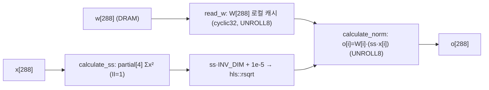
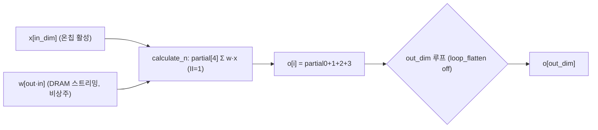
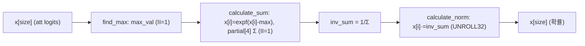
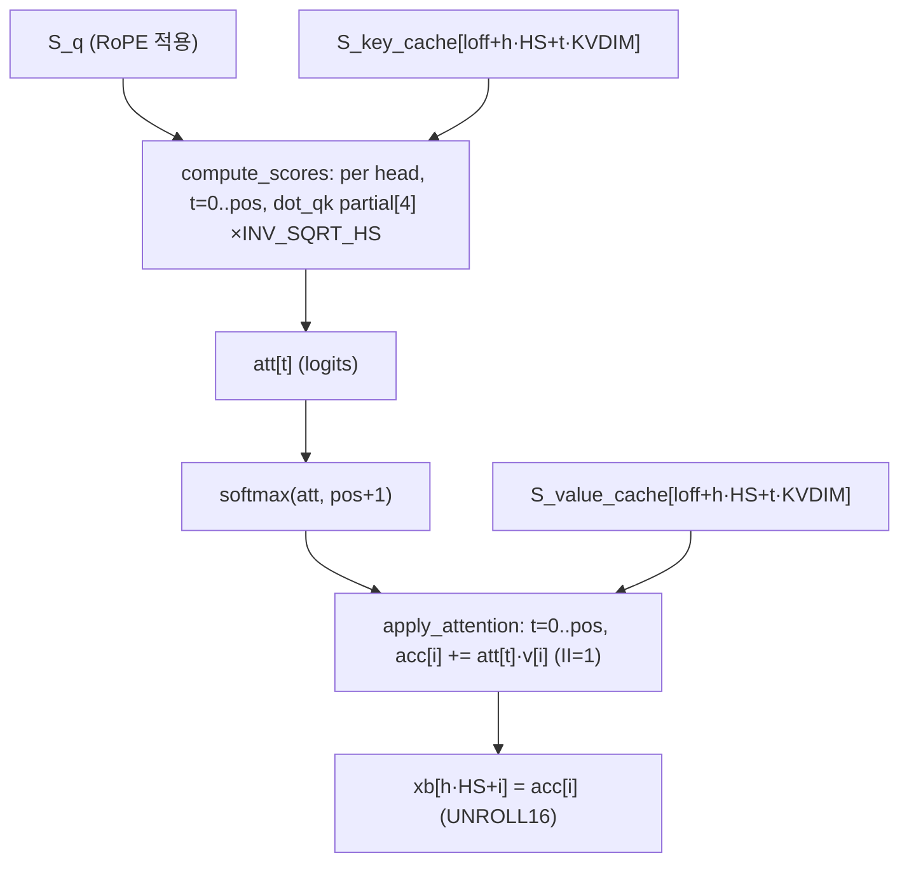

# HLS-Acceleration-of-LLaMA2 모듈 통합 가이드 (H-HLS)

> 1차 요약(맥락): [`../HLS-Acceleration-of-LLaMA2.md`](../HLS-Acceleration-of-LLaMA2.md)
> 소스 루트: `REF/ViT-Accelerator/HLS-Acceleration-of-LLaMA2`. 구현 전체가 **Vitis HLS C++** (단일 커널 `kernel_forward`). RTL 자체 소스 없음, 합성/통합 TCL·Makefile 없음(리포에 미동봉).
> 표기 규약: 라인으로 직접 확인한 사실은 단정, 코드 정황 기반은 "추정", 코드/문서/리포트에 없으면 "확인 불가".
> 제외물(이름만): 모델 가중치 `stories15M.bin`·토크나이저 `tokenizer.bin`(데이터, 리포에 미동봉), `binary_container_1.bin`/`kernel_forward.xclbin`(사전 합성 비트스트림·xclbin, 미동봉), `Llama2_host`(컴파일 산출물), 데모 영상 `youtu.be/Mrl_r8l6aDE`(자산). `.git/`(VCS 메타).
> 자체 소스 = **3개 파일**: `kernel_forward.cpp`(HLS 커널, ★), `main.cpp`(XRT 호스트), `README.md`(빌드/실행/벤치). 헤더·TCL·Makefile **없음**(확인됨, repo glob 결과 3개 파일만 존재).

---

## 0. 문서 머리말

### 0.1 대표 케이스 선정
이 설계는 **단일 HLS 커널**(`kernel_forward`)이 stories15M LLaMA2 디코더 **1토큰 forward 전체**를 한 번의 호출로 시분할 실행한다(`kernel_forward.cpp` L294~L386). 레이어 분기·전문가(MoE) 같은 동적 경로가 없으므로 대표 케이스는 **레이어 1회(`layer` 루프 1 iteration)**로 단일하게 잡는다.

- **대표 케이스: layer 루프 1회 본문** — `kernel_forward.cpp` L359~L382. 한 디코더 블록의 표준 LLaMA2 시퀀스: `rmsnorm → Wq/Wk/Wv matmul → RoPE → attention(KV-cache) → Wo matmul → residual → rmsnorm → W1/W3 matmul → SwiGLU → W2 matmul → residual`. 6개 레이어가 동일 구조(`P_N_LAYERS=6`, L6)이며 가중치 포인터만 `l*…` 오프셋으로 진행(L365~L380).
- **부가 대표: 최종 분류기 경로** — `kernel_forward.cpp` L384~L385. `rmsnorm(final) → matmul_dim_vocabsize`(32000×288)로 토큰당 가장 큰 GEMM(전체 MAC의 지배항). 양자화/대역폭 분석의 핵심 단위.

선정 근거: (1) 6 레이어가 비트 단위로 동일 본문이라 1회 분석이 곧 전체이고, (2) 분류기 GEMM이 토큰당 연산량의 80% 이상을 차지(§아래 정량)하여 병목 진단의 중심이다.

### 0.2 수치 표기 규약
- **MAC lanes**: 한 사이클(II=1) 동시 곱셈기 수. 본 설계의 핵심 reduction 루프는 **`#pragma HLS PIPELINE II=1` + 스칼라 누산**이며, 병렬 곱은 명시적 unroll이 **없다**(matmul 내부 `calculate_n` 루프엔 unroll 미부착, `kernel_forward.cpp` L88~L92 등). 따라서 GEMM의 MAC lanes는 **1 곱/사이클(추정, II=1 목표)**이고, `partial[4]`는 lane 확장이 아니라 **누산 종속 체인 절단(레이턴시 은닉)** 용도다(§1.1). lane>1인 경로(RoPE·SwiGLU·residual의 UNROLL)는 모듈별로 명시.
- **`partial[N]` 분할**: reduction을 `partial[i % N]`로 N개 부분합에 분산 → float 누산기 의존 거리(latency L)를 N으로 나눠 II=1 파이프라인을 가능케 하는 관용구. 본 설계 전 reduction에서 **N=4** 고정(`kernel_forward.cpp` L25,L58,L85,L103,L121,L139,L157,L225).
- **scalar MACs**: (out_dim)×(in_dim) 곱(토큰 1개 기준). matmul 형상별·attention head별로 구분 표기.
- **loop trips**: 루프 bound(상수) 또는 `LOOP_TRIPCOUNT` pragma 값. attention/softmax는 `pos` 의존 가변(`min=1 max=257`, L51,L221 등).
- **memory size (payload bit)**: 온칩 배열 깊이×폭(float=32b). 본 설계는 모든 가중치를 **온칩 비상주**(matmul마다 m_axi 재스트리밍)로 두므로 온칩 버퍼는 활성(state) 배열뿐이다(§8 top).

### 0.3 운영 경로 (소스 ↔ 호스트 ↔ 커널 ↔ 보드)
```
[모델]        Karpathy llama2.c 포맷 stories15M.bin (Config 헤더 + float32 가중치 mmap)
        │     main.cpp: read_checkpoint → memory_map_weights (L63-114), 가중치 12종 포인터 분리
[호스트 준비]  main.cpp: xrt::bo 12 weight + KV cache 2 + logits + table 할당·memcpy·sync_TO_DEVICE
        │     (L850-914). 가중치는 1회 DDR 적재(생성 루프 밖).
[토큰 루프]    generate()/chat(): pos별 forward() 호출 (L597-625 / L677-740)
        │     forward(): 호스트가 pos 기준 RoPE cos/sin TABLE 계산→bo_table sync (L189-197)
        │              → kernel(pos, token, …) enqueue → run.wait() → bo_logits sync_FROM_DEVICE (L199-204)
[커널 1콜]    kernel_forward(): token embed → table 로드 → layer×6 디코더 → final rmsnorm → classifier
        │     (kernel_forward.cpp L344-386). KV-cache는 m_axi inout(in-place 갱신).
[샘플링]      호스트 sample(): argmax | mult | top-p (L537-560) → 다음 token → 디코드·출력
[보드]        ZCU106 PetaLinux: ./Llama2_host stories15M.bin → xclbin 로드(L770-771)
```
근거: `main.cpp` L63-204·L767-938, `kernel_forward.cpp` L294-386, `README.md` L19-78.

### 0.4 타깃 / 데이터타입 / 메모리 정책
- **타깃**: AMD/Xilinx **Zynq UltraScale+ MPSoC ZCU106** 보드, **Vitis/Vivado 2024.2**, **PetaLinux 2024.2**(`README.md` L4,L11-17). 디바이스 part 번호·클럭은 리포 TCL 부재로 **확인 불가**(추정: ZCU106 = `xczu7ev-ffvc1156`). 합성 PPA(LUT/FF/DSP/BRAM/지연/Fmax) 리포트 **미동봉 → 확인 불가**.
- **데이터타입**: **전부 `float`(FP32)**. 양자화·고정소수점 **미적용**(`kernel_forward.cpp` 전 함수 시그니처 `float*`, L15·L80·L212 등). 1차 요약 그대로.
- **메모리 정책(핵심)**: 가중치는 **온칩 비상주**. matmul은 매 호출 `w[i*K+j]`를 m_axi로 스트리밍(`kernel_forward.cpp` L91·L127·L163; 상주 캐시 없음). 단, **rmsnorm weight `W[P_DIM]`(L16), RoPE `S_K[P_DIM]`·top의 `TABLE[P_DIM]`(L171,L350)는 함수/커널 내 로컬 캐시**. 활성(`S_x,S_xb,…,S_att`)은 모두 온칩 상주(L335).
- **AXI 번들**: m_axi 4뱅크 분산 — `gmem0`(W_table/att/ffn/final/wcls), `gmem1`(Wq/Wk/Wv/Wo + table), `gmem2`(W1/W2/W3), `gmem3`(key_cache/value_cache/logits). 전 포트 `max_read_burst_length=64`, KV·logits는 `max_write_burst_length=64`(`kernel_forward.cpp` L298-313). 제어 스칼라·포인터 전부 `s_axilite bundle=control`(L315-333).

### 0.5 stories15M 모델 상수 (`kernel_forward.cpp` L3~L13)
`P_DIM=288`, `P_HIDDEN_DIM=768`, `P_N_LAYERS=6`, `P_N_HEADS=6`, `P_VOCAB_SIZE=32000`, `P_SEQ_LEN=256`, `P_HEAD_SIZE=48`, `P_KV_DIM=288`. 역수 상수 `INV_P_DIM=1/288≈0.003472`(L12), `INV_SQRT_P_HEAD_SIZE=1/√48≈0.144338`(L13)로 나눗셈 제거. **주의**: `P_N_HEADS×P_HEAD_SIZE = 6×48 = 288 = P_DIM`이고 `P_KV_DIM=288=P_DIM` → MHA(GQA 아님, n_kv_heads=n_heads). RoPE의 `i<P_KV_DIM` 분기(L186)는 형식상 존재하나 KV_DIM=DIM이라 **항상 Q·K 둘 다 회전**(else 분기 미진입, 확인됨).

---

## 1. Repo / 모듈 개요

| 레이어 | 경로 | 역할 |
|---|---|---|
| **HLS 커널** | `kernel_forward.cpp` | LLaMA2 forward 전체. 8개 leaf 함수(rmsnorm/softmax/matmul×5/RoPE/attention/residual/SwiGLU) + top `kernel_forward`. ★핵심. |
| **XRT 호스트** | `main.cpp` | 가중치 mmap 로드, 토크나이저(BPE), 샘플러(argmax/mult/top-p), XRT 버퍼·enqueue, RoPE table 생성, 생성/챗 루프. |
| **문서** | `README.md` | 빌드(Vitis 2024.2)·보드 부팅·실행·벤치(PS 1.75→가속 8.71 tok/s, ~5×). |

- 자체 소스 모듈 수: **HLS 함수 12개**(leaf 11 + top 1). 헤더/TCL/Makefile **없음**. include는 `hls_math.h` 1개(`kernel_forward.cpp` L1).
- matmul은 **형상별 5개 전용 함수**로 복제(공유 엔진 아님, §3) — Edge-MoE의 단일 `compute_linear` 공유와 정반대 설계.

### 1.1 핵심 HW 관용구: `partial[4]` 누산 분할 (전 모듈 공통)
```cpp
float partial[4] = {0};
#pragma HLS ARRAY_PARTITION variable=partial complete
for (int j = 0; j < N; j++) {
    #pragma HLS PIPELINE II=1
    partial[j % 4] += w[...] * x[j];     // 4개 독립 누산기로 라운드로빈
}
float acc = partial[0] + partial[1] + partial[2] + partial[3];   // 트리 합산 마무리
```
→ float add 레이턴시(L≈4~7cyc)로 인한 단일 누산기 RAW 의존을 4-way 분산으로 끊어 **inner reduction을 II=1로 파이프라인**. 이 관용구가 rmsnorm(L25)·softmax(L58)·matmul×5(L85,L103,L121,L139,L157)·attention QK(L225)에 동일 적용. **단일 누산기 베이스라인(hls-fpga-accelerators류) 대비 개선점**으로 1차 요약·본 가이드의 핵심 차별 포인트.

### 1.2 모듈 인스턴스 계층 (top → leaf)
```
kernel_forward  (extern "C", m_axi 4번들 gmem0~3 + s_axilite control)   [L294-386]
├─ token_embedding (W_table[token*DIM..] → S_x, UNROLL 8)               [L344-348]
├─ read_table      (호스트 계산 RoPE cos/sin → 로컬 TABLE[288], UNROLL 8) [L350-357]
└─ for l in 0..5 (layer):                                                [L359-382]
   ├─ rmsnorm(S_xb, S_x, W_att+l·DIM)         (RMSNorm, partial[4])     [L15-44]
   ├─ matmul_dim_dim(S_q, …, W_wq)            (288×288 GEMM)            [L80-96]
   ├─ matmul_dim_kvdim(S_k/S_v, …, W_wk/W_wv) (288×288, KV-cache write) [L98-114]
   ├─ RoPE(TABLE, S_q, S_k)                   (회전위치, UNROLL 16)      [L170-210]
   ├─ attention(loff,pos,…)                   (head 루프: QK→softmax→·V) [L212-274]
   │  └─ softmax(att, pos+1)                  (3-pass max-sub, partial[4])[L46-78]
   ├─ matmul_dim_dim(S_xb2, …, W_wo)          (288×288, proj)           [L80-96]
   ├─ residual(S_x, S_xb2)                    (UNROLL 32)               [L277-283]
   ├─ rmsnorm(S_xb, S_x, W_ffn+l·DIM)                                   [L15-44]
   ├─ matmul_dim_hiddendim(S_hb/S_hb2, …, W_w1/W_w3) (768×288 ×2)       [L116-132]
   ├─ SwiGLU(S_hb, S_hb2)                     (SiLU·gate, UNROLL 8)     [L285-292]
   ├─ matmul_hiddendim_dim(S_xb, …, W_w2)     (288×768)                 [L134-150]
   └─ residual(S_x, S_xb)                     (UNROLL 32)               [L277-283]
├─ rmsnorm(S_x, S_x, W_final)                 (최종 norm, in-place)      [L384]
└─ matmul_dim_vocabsize(S_logits, S_x, W_wcls) (32000×288, classifier)  [L385]
```
모든 leaf는 top에서 **순차 호출**(dataflow 없음). 레이어 간·연산자 간 전부 직렬(데이터 종속).

---

## 2. RMSNorm — `rmsnorm()` (`kernel_forward.cpp` L15~L44)

### 2.1 역할 + 상위/하위
LLaMA RMSNorm. attention 전(norm1, top L365)·FFN 전(norm2, top L375)·최종(L384) 3회/레이어+1. 상위: `kernel_forward`. 하위: `hls::rsqrt`(L37). RMSNorm은 평균 차감 없이 RMS만 정규화(`ss = mean(x²)`).

### 2.2 데이터플로우


### 2.3 function call stack
`kernel_forward` → `rmsnorm(o, x, w)` → { `read_w` 캐시 → `calculate_ss`(partial[4]) → `hls::rsqrt` → `calculate_norm` }.

### 2.4 대표 코드 블록

(1) **partial[4] Σx² + rsqrt** (`kernel_forward.cpp` L25~L37)
```cpp
float partial[4] = {0};
#pragma HLS ARRAY_PARTITION variable=partial complete
calculate_ss:
for (int i = 0; i < P_DIM; i++) {
    #pragma HLS PIPELINE II=1
    partial[i % 4] += x[i] * x[i];          // 4-way 누산
}
float ss = partial[0] + partial[1] + partial[2] + partial[3];
ss *= INV_P_DIM;  ss += 1e-5f;  ss = hls::rsqrt(ss);   // /288 + eps, 역제곱근
```
→ `eps=1e-5f`(L36; 호스트 ref와 동일, `main.cpp` L137). 나눗셈은 `INV_P_DIM` 상수 곱으로 제거.

(2) **affine — weight 로컬 캐시 후 곱** (`kernel_forward.cpp` L16,L39~L43)
```cpp
float W[P_DIM];
#pragma HLS ARRAY_PARTITION variable=W cyclic factor=32 dim=1   // 32-way 동시접근
...
calculate_norm:
for (int i = 0; i < P_DIM; i++) {
    #pragma HLS UNROLL factor=8
    o[i] = W[i] * (ss * x[i]);
}
```

### 2.5 마이크로아키텍처 + 정량
- **MAC lanes**: `calculate_ss`는 II=1 스칼라(추정 1곱/cyc, partial[4]는 종속 절단). `calculate_norm`은 **UNROLL 8 → 8곱/cyc**(L41).
- **loop trips**: 3루프 모두 288(=P_DIM). `read_w` UNROLL 8, `calculate_norm` UNROLL 8.
- **scalar 연산**: Σx² 288 곱+합, affine 288 곱. rsqrt 1회.
- **메모리(payload bit)**: 로컬 `W[288]` × 32b = **9.0 Kb**(cyclic32 파티션). 비상주 가중치 중 **유일하게 norm weight만 함수-로컬 캐시**(작아서 부담 적음).
- **병목**: rsqrt 1회 비선형. 호출이 레이어당 2회+최종 1회 = 13회/토큰으로 짧음. norm weight 매 호출 DRAM read(288 float).

---

## 3. MatMul 5종 — `matmul_dim_dim` / `_dim_kvdim` / `_dim_hiddendim` / `_hiddendim_dim` / `_dim_vocabsize` (`kernel_forward.cpp` L80~L168)

### 3.1 역할 + 상위/하위
모든 선형변환을 **형상별 5개 전용 함수로 복제**(공유 엔진 아님). 외부 출력행 루프(`loop_flatten off`) × 내부 reduction 루프(II=1, partial[4]). 가중치는 행우선 `w[i*K+j]`로 매 호출 m_axi 스트리밍(상주 없음). 상위: `kernel_forward`. 하위: 없음.

| 함수 | out×in | 호출처(top) | 1토큰 scalar MACs |
|---|---|---|---|
| `matmul_dim_dim` (L80) | 288×288 | Wq(L366), Wo(L372) | 82,944 ×2 |
| `matmul_dim_kvdim` (L98) | 288×288† | Wk(L367), Wv(L368) | 82,944 ×2 |
| `matmul_dim_hiddendim` (L116) | 768×288 | W1(L376), W3(L377) | 221,184 ×2 |
| `matmul_hiddendim_dim` (L134) | 288×768 | W2(L380) | 221,184 |
| `matmul_dim_vocabsize` (L152) | 32000×288 | classifier(L385) | **9,216,000** |

† `matmul_dim_kvdim`은 이름과 달리 **본문이 `i<P_DIM`, `j<P_DIM`** (L100,L107)로 `matmul_dim_dim`과 동일(KV_DIM=DIM=288이라 결과 동치). 코드 중복이며 형상 일반화 안 됨(추정: 다른 모델로 확장 시 수정 필요).

### 3.2 데이터플로우 (공통)


### 3.3 function call stack
`kernel_forward` → `matmul_*(o, x, w)` → { `calculate_d`(out 루프, flatten off) → `calculate_n`(in reduction, II=1, partial[4]) → 트리 합산 }.

### 3.4 대표 코드 블록 (`matmul_dim_vocabsize` L152~L168, 최대 GEMM)
```cpp
for (int i = 0; i < P_VOCAB_SIZE; i++) {       // 32000 출력행
    #pragma HLS loop_flatten off
    float partial[4] = {0};
    #pragma HLS ARRAY_PARTITION variable=partial complete
    for (int j = 0; j < P_DIM; j++) {          // 288 reduction
        #pragma HLS PIPELINE II=1
        partial[j % 4] += w[i * P_DIM + j] * x[j];
    }
    o[i] = partial[0] + partial[1] + partial[2] + partial[3];
}
```
→ inner만 II=1 파이프라인. **outer는 미펼침**(loop_flatten off) → MAC lanes는 사실상 1(추정). w는 `w[i*288+j]` 순차 burst-friendly 접근.

### 3.5 마이크로아키텍처 + 정량
- **MAC lanes**: inner II=1 스칼라 reduction(추정 1곱/cyc). **내부 unroll 없음** → partial[4]는 lane 확장이 아닌 종속 절단(§1.1). 즉 GEMM은 시간 다중화된 1-lane MAC.
- **scalar MACs(1토큰 합산)**: 레이어당 = Wq+Wk+Wv+Wo(82,944×4) + W1+W3+W2(221,184×3) = 331,776 + 663,552 = **995,328**. ×6 레이어 = 5,971,968. + classifier **9,216,000**. **1토큰 총 ≈ 15.2 M MAC**(attention QK/·V 별도, §5). **classifier 1개가 토큰당 MAC의 ~60%** → 지배항.
- **메모리(payload bit)**: 온칩 가중치 버퍼 **0**(전량 비상주 스트리밍). 활성 입출력만 온칩(top S_* 배열).
- **병목**: **메모리 바운드**. 가중치 비상주라 매 토큰 전 가중치(stories15M ≈ 60 MB float)를 DRAM에서 재독 → tok/s 절대값 낮음(8.71). lane=1 + 가중치 재독이 처리량 상한. 양자화(INT8)·가중치 상주·타일링·출력행 unroll이 모두 미적용 노브(§11).

---

## 4. Softmax — `softmax()` (`kernel_forward.cpp` L46~L78)

### 4.1 역할 + 상위/하위
**수치안정 3-pass softmax**(max-subtraction 포함). attention 내부에서 head별 score 정규화에 사용(`attention` L239). 호스트 샘플러도 동일 알고리즘(`main.cpp` L145-163). 상위: `attention`. 하위: `hls::expf`(L65).

### 4.2 데이터플로우


### 4.3 function call stack
`attention` → `softmax(att, pos+1)` → { `find_max` → `calculate_sum`(expf + partial[4]) → `1/sum` → `calculate_norm` }.

### 4.4 대표 코드 블록 (`kernel_forward.cpp` L46~L70)
```cpp
float max_val = x[0];
find_max:
for (int i = 1; i < size; i++) { #pragma HLS PIPELINE II=1
    if (x[i] > max_val) max_val = x[i]; }                 // ① 최댓값
float partial[4] = {0};
calculate_sum:
for (int i = 0; i < size; i++) { #pragma HLS PIPELINE II=1
    x[i] = hls::expf(x[i] - max_val);                     // ② 수치안정 exp
    partial[i % 4] += x[i]; }
float inv_sum = 1.0f / (partial[0]+partial[1]+partial[2]+partial[3]);
```
→ `size = pos+1`(가변, `LOOP_TRIPCOUNT min=1 max=257`, L51·L63·L74). **max-subtraction 포함**이 hls-fpga-accelerators softmax(미차감)와의 저장소 간 차별 포인트(1차 요약 §3.2). 3번째 패스 `calculate_norm`은 UNROLL 32(L75).

### 4.5 마이크로아키텍처 + 정량
- **MAC lanes**: pass①②는 II=1 스칼라, pass③ UNROLL 32. expf는 size회.
- **loop trips**: 3패스 모두 `pos+1`(가변 1~256, head별 호출). attention head 루프 안에서 head당 1회 → 레이어당 6회×토큰.
- **메모리**: in-place(`att` 갱신, 별도 버퍼 없음).
- **병목**: 3-pass 직렬(max→exp→norm). expf 비선형 size회. att는 `S_att[6×256]` 온칩(top L335,L342).

---

## 5. Attention (+ KV-cache) — `attention()` (`kernel_forward.cpp` L212~L274)

### 5.1 역할 + 상위/하위
헤드별 MHA: ① Q·K 내적(partial[4], scale) → ② `softmax` → ③ att·V 누산. **KV-cache 명시 사용**: `S_key_cache`/`S_value_cache`를 `loff + h·HEAD_SIZE + t·KV_DIM`로 인덱싱(autoregressive 표준). 상위: `kernel_forward`(L371). 하위: `softmax`(L239).

### 5.2 데이터플로우


### 5.3 function call stack
`kernel_forward` → `attention(loff,pos,S_xb,S_q,S_att,key_cache,value_cache)` → head 루프 { `compute_scores`(dot_qk partial[4], L228-236) → `softmax`(L239) → `init`(L246) → `apply_attention`(acc 누산, L253-266) → `write_xb`(L268-272) }.

### 5.4 대표 코드 블록

(1) **QK 내적 + scale (KV-cache read)** (`kernel_forward.cpp` L223~L236)
```cpp
float* k = S_key_cache + loff + h * P_HEAD_SIZE + t * P_KV_DIM;   // 캐시 인덱싱
float partial[4] = {0};
dot_qk:
for (int i = 0; i < P_HEAD_SIZE; i++) { #pragma HLS PIPELINE II=1
    partial[i % 4] += q[i] * k[i]; }                             // HEAD_SIZE=48
float score = (partial[0]+partial[1]+partial[2]+partial[3]) * INV_SQRT_P_HEAD_SIZE;  // 1/√48
att[t] = score;
```

(2) **att·V 누산** (`kernel_forward.cpp` L253~L272)
```cpp
apply_attention:
for (int t = 0; t <= pos; t++) {       // LOOP_TRIPCOUNT max=257
    float* v = S_value_cache + loff + h*P_HEAD_SIZE + t*P_KV_DIM;
    float a = att[t];
    accumulate:
    for (int i = 0; i < P_HEAD_SIZE; i++) { #pragma HLS PIPELINE II=1
        acc[i] += a * v[i]; }          // acc[48], cyclic32 파티션 (L244)
}
write_xb: for(...) { #pragma HLS UNROLL factor=16  xb[i] = acc[i]; }
```
→ `acc[P_HEAD_SIZE=48]` cyclic factor=32(L244), `init`/`write_xb` UNROLL 16(L248,L270).

### 5.5 마이크로아키텍처 + 정량
- **MAC lanes**: `dot_qk`·`accumulate` 모두 II=1 스칼라(추정 1곱/cyc). init/write_xb UNROLL 16(연산 아님). **head/patch 병렬 없음** — head 외부 루프 순차(L213).
- **loop trips**: head 6 × t(pos+1, max 257) × HEAD_SIZE 48.
- **scalar MACs(pos=255 워스트, 1토큰)**: QK = 6×256×48 = **73,728**, ·V = **73,728**(레이어당). ×6 레이어 ≈ QK 442K + ·V 442K. (pos 작을수록 선형 감소.)
- **메모리(payload bit)**: KV-cache는 **DRAM 상주**(top m_axi gmem3, 크기 = `N_LAYERS×SEQ_LEN×DIM×32b` = 6×256×288×32 ≈ **141.6 Mb/each**, key+value 2벌; `main.cpp` L903-904). 온칩 임시 `acc[48]`·`att[6×256]`만.
- **병목**: KV-cache가 DRAM(온칩 아님) → t 루프마다 k/v를 DRAM read(KV_DIM stride). **비-fused**(FlashAttention류 통계 압축 없음, score 행렬 `att` 전체 저장). head 직렬이라 병렬도 최소.

---

## 6. RoPE — `RoPE()` (`kernel_forward.cpp` L170~L210)

### 6.1 역할 + 상위/하위
회전 위치 임베딩. 호스트가 pos별로 계산한 `TABLE`(cos/sin = fcr/fci 쌍)을 받아 Q,K의 인접 2원소를 복소 회전. 상위: `kernel_forward`(L370). 하위: 없음. **TABLE 생성은 호스트**(`main.cpp` forward L189-195)에서 `1/10000^(head_dim/HS)` 주파수로 계산 후 sync.

### 6.2 대표 코드 블록 (`kernel_forward.cpp` L180~L203)
```cpp
RoPE:
for (int i = 0; i < P_DIM; i+=2) {
    #pragma HLS UNROLL factor=16           // 쌍 단위 16-way 병렬
    float fcr = TABLE[i];  float fci = TABLE[i+1];
    if (i < P_KV_DIM) {                     // KV_DIM=DIM → 항상 진입(Q·K 둘 다)
        float v0_q=S_q[i], v1_q=S_q[i+1];
        S_q[i]   = v0_q*fcr - v1_q*fci;     // 복소 회전 (Q)
        S_q[i+1] = v0_q*fci + v1_q*fcr;
        float v0_k=S_K[i], v1_k=S_K[i+1];
        S_K[i]   = v0_k*fcr - v1_k*fci;     // (K)
        S_K[i+1] = v0_k*fci + v1_k*fcr;
    } else { /* Q만 회전 (GQA/부분KV용; 본 모델 미진입) */ }
}
```
→ `S_K[P_DIM]` cyclic32 로컬 캐시 후 write-back(L171-178,L205-209). `i<P_KV_DIM` 분기는 GQA 대비용이나 KV_DIM=DIM이라 else 미진입(확인됨).

### 6.3 정량
- **MAC lanes**: UNROLL 16(쌍 단위) → 회전당 4곱 → **~64곱/cyc 추정**(16쌍 × 4곱, II 미명시). read_sk/write_sk UNROLL 8.
- **loop trips**: 144(=288/2 쌍). 곱 = 288×4(Q) + 288×4(K) ≈ 2,304 곱/호출.
- **메모리**: 로컬 `S_K[288]`×32b = 9.0 Kb. `TABLE[288]`은 top 캐시(L350).
- **병목**: 짧음(레이어당 1회, 288 원소). TABLE는 호스트 의존(pos별 재계산·sync, `main.cpp` L197).

---

## 7. SwiGLU + Residual — `SwiGLU()` / `residual()` (`kernel_forward.cpp` L277~L292)

### 7.1 SwiGLU (`kernel_forward.cpp` L285~L292)
```cpp
SwiGLU:
for (int i = 0; i < P_HIDDEN_DIM; i++) {   // 768
    #pragma HLS UNROLL factor=8
    S_hb[i] *= (1.0f / (1.0f + hls::expf(-S_hb[i])));   // SiLU = x·sigmoid(x)
    S_hb[i] *= S_hb2[i];                                 // gate (W3 분기) 곱
}
```
→ FFN: `W2( SiLU(W1·x) ⊙ (W3·x) )`. sigmoid는 `1/(1+expf(-x))`. 상위 `kernel_forward`(L379). **lanes**: UNROLL 8(8원소/cyc), expf 768회. trips 768.

### 7.2 Residual (`kernel_forward.cpp` L277~L283)
```cpp
residual:
for (int i = 0; i < P_DIM; i++) {
    #pragma HLS UNROLL factor=32           // 32-way
    S_x[i] += S_xb[i];
}
```
→ attention 후(L373)·FFN 후(L381). **lanes**: UNROLL 32(32 add/cyc). trips 288. memory: in-place(`S_x`).

---

## 8. 최상위 오케스트레이션 — `kernel_forward()` (`kernel_forward.cpp` L294~L386)

### 8.1 역할 + 상위/하위
`extern "C"` HLS 커널. 가중치 12 + KV cache 2 + logits + table = m_axi 16포트(4번들 분산), 제어 전부 s_axilite. 1콜 = 1토큰 forward. 하위: 위 모든 leaf. 상위(호스트): `main.cpp` `forward()`(L199).

### 8.2 대표 코드 블록

(1) **온칩 활성 상태 + cyclic32 파티션** (`kernel_forward.cpp` L335~L342)
```cpp
float S_x[288], S_xb[288], S_xb2[288], S_hb[768], S_hb2[768], S_q[288], S_att[6*256];
#pragma HLS ARRAY_PARTITION variable=S_x   cyclic factor=32 dim=1
... (S_xb, S_xb2, S_hb, S_hb2, S_q, S_att 모두 cyclic factor=32)
```
→ 모든 중간 활성을 온칩 상주 + 32-way 동시접근으로 UNROLL/PIPELINE의 메모리 포트 확보. **활성 총 온칩 = (288×4 + 768×2 + 6×256)×32b ≈ (1152+1536+1536)×32 ≈ 135 Kb** + TABLE 288×32(L350).

(2) **레이어 루프 본문 (대표 케이스)** (`kernel_forward.cpp` L359~L382)
```cpp
for(int l = 0; l < P_N_LAYERS; l++) {
    int loff = l * P_SEQ_LEN * P_KV_DIM;                  // KV-cache 레이어 오프셋
    float* S_k = S_key_cache + loff + pos * P_KV_DIM;     // 이번 pos의 K 슬롯
    float* S_v = S_value_cache + loff + pos * P_KV_DIM;
    rmsnorm(S_xb, S_x, W_att + l*P_DIM);
    matmul_dim_dim(S_q, S_xb, W_wq + l*P_DIM*P_DIM);
    matmul_dim_kvdim(S_k, S_xb, W_wk + l*P_DIM*P_KV_DIM); // K를 캐시에 직접 write
    matmul_dim_kvdim(S_v, S_xb, W_wv + l*P_DIM*P_KV_DIM);
    RoPE(TABLE, S_q, S_k);
    attention(loff, pos, S_xb, S_q, S_att, S_key_cache, S_value_cache);
    matmul_dim_dim(S_xb2, S_xb, W_wo + l*P_DIM*P_DIM);
    residual(S_x, S_xb2);
    rmsnorm(S_xb, S_x, W_ffn + l*P_DIM);
    matmul_dim_hiddendim(S_hb,  S_xb, W_w1 + l*P_DIM*P_HIDDEN_DIM);
    matmul_dim_hiddendim(S_hb2, S_xb, W_w3 + l*P_DIM*P_HIDDEN_DIM);
    SwiGLU(S_hb, S_hb2);
    matmul_hiddendim_dim(S_xb, S_hb, W_w2 + l*P_DIM*P_HIDDEN_DIM);
    residual(S_x, S_xb);
}
```
→ 가중치 오프셋은 `l*…`로 레이어 진행. K/V matmul 출력이 **곧바로 KV-cache 슬롯**(S_k/S_v는 cache 포인터)이라 별도 write 단계 없음.

(3) **m_axi 4뱅크 분산 + s_axilite** (`kernel_forward.cpp` L298~L313)
```cpp
#pragma HLS INTERFACE m_axi port=W_table  ... bundle=gmem0 max_read_burst_length=64
... (gmem0: W_table/att/ffn/final/wcls)
#pragma HLS INTERFACE m_axi port=W_wq ... bundle=gmem1   (gmem1: Wq/Wk/Wv/Wo + table)
#pragma HLS INTERFACE m_axi port=W_w1 ... bundle=gmem2   (gmem2: W1/W2/W3)
#pragma HLS INTERFACE m_axi port=S_key_cache ... bundle=gmem3 max_write_burst_length=64
```
→ 4뱅크로 DDR 대역폭 분산. burst 64. **호스트 BO 바인딩 주의**: 인자 순서가 `pos(0),token(1),W_table(2)…table(17)`이고 호스트는 `kernel.group_id(2..17)`로 BO를 할당(`main.cpp` L850-914) → 인자 위치 = group_id 정합(확인됨).

### 8.3 마이크로아키텍처 + 정량
- **레이어 루프**: dataflow/pipeline pragma **없음** → 6 레이어·전 leaf 순차 직렬(데이터 종속). 1콜 = 1토큰(생성 루프는 호스트, `main.cpp` L597).
- **AXI**: 16 m_axi 포트 / 4 번들(gmem0~3), burst 64. 가중치 비상주라 토큰당 전 가중치 DRAM 재독.
- **메모리(온칩)**: 활성 ≈135 Kb + TABLE 9Kb + (호출 중) rmsnorm W 9Kb / RoPE S_K 9Kb. KV-cache·전 가중치는 DRAM.
- **병목**: 단일 거대 순차 커널 + 가중치 비상주 = **메모리 바운드, 처리량 상한 낮음**(README 8.71 tok/s). dataflow·양자화·가중치 상주 전무.

---

## 9. 호스트 (XRT) — `main.cpp`

### 9.1 역할
가중치 mmap 로드(llama2.c 포맷, `memory_map_weights` L63-92) → xrt::bo 할당·memcpy·sync(L850-900, **1회**, 생성 루프 밖) → 토큰별 `forward()`로 RoPE table 계산+커널 enqueue+logits 회수(L179-207) → BPE 토크나이저(L230-417) + 샘플러(argmax/mult/top-p, L436-560) → generate/chat 루프(L574-743).

### 9.2 핵심 포인트
- **가중치 1회 적재**: 12 가중치 BO를 생성 루프 전 `sync(TO_DEVICE)`(L889-900). 커널은 매 토큰 이를 DRAM에서 재독(상주 캐시 없음 → §3 병목).
- **RoPE table는 호스트 계산**: `forward()`가 pos별 `cos(pos·freq)/sin(pos·freq)`를 `bo_table_ptr`에 쓰고 sync(L189-197). 커널 RoPE는 이 TABLE만 소비.
- **KV-cache DRAM 상주**: `bo_key_cache/value_cache` (각 `n_layers·seq_len·dim` float ≈ 17.7 MB, L903-907), 커널이 in-place 갱신, 호스트는 sync 안 함(디바이스 상주).
- **샘플링**: temperature=1.0, topp=0.9 기본(L774-775). argmax(temp=0)·mult·top-p 3종(L537-560).
- **확인 불가였던 부분 해소**: 1차 요약의 "main.cpp 미열람" → 본 가이드에서 토크나이저(BPE merge, L383-411)·샘플러·BO 매핑 전부 확인.

### 9.3 빌드·검증 (`README.md`)
- **빌드**: Vitis 2024.2로 커널 → `binary_container_1.bin`(xclbin), 호스트 `Llama2_host` 컴파일(L23-24). **TCL/Makefile 리포 미동봉 → 합성 설정 확인 불가**.
- **실행**: ZCU106 SD부팅(PetaLinux 2024.2) → `./Llama2_host stories15M.bin`(L60-68).
- **벤치**(L73-78): ZCU106 PS-only 1.75 tok/s → 가속 8.71 tok/s (**~5×**). csim/cosim 검증 스크립트 없음(보드 실측만).
- **합성 PPA**(LUT/FF/DSP/BRAM/Fmax/지연): 리포트 미동봉 → **확인 불가**.

---

## 10. 모듈 한눈 요약 표

| # | 모듈 | 함수(파일:라인) | 핵심 역할 | MAC lanes | 대표 scalar MACs(1토큰) | 주 메모리 | 핵심 병목 |
|---|---|---|---|---|---|---|---|
| 2 | RMSNorm | `rmsnorm` L15-44 | RMS 정규화+affine | ss:1(II1) / norm:8 | Σx² 288 + affine 288 | W[288] 로컬 9Kb | rsqrt 1회·norm w 재독 |
| 3 | MatMul×5 | L80-168 | 형상별 GEMM 5종 | 1(II1, unroll 없음) | classifier 9.22M / 레이어 0.995M | 온칩 weight 0(비상주) | 메모리 바운드(weight 재독) |
| 4 | Softmax | `softmax` L46-78 | 수치안정 3-pass | 1·1·32 | expf (pos+1)회 | in-place att | 3-pass 직렬·expf |
| 5 | Attention | `attention` L212-274 | MHA+KV-cache(2-pass) | 1(QK)·1(·V) | QK 73.7K + ·V 73.7K/layer(pos=255) | KV-cache DRAM ~141Mb×2 | KV DRAM·head 직렬·비-fused |
| 6 | RoPE | `RoPE` L170-210 | 복소 회전위치 | ~64(UNROLL16×4) | ~2.3K 곱/호출 | S_K[288] 9Kb | TABLE 호스트 의존 |
| 7 | SwiGLU | `SwiGLU` L285-292 | SiLU·gate FFN | 8(UNROLL8) | expf 768회 | in-place S_hb | expf 768 |
| 7 | Residual | `residual` L277-283 | 잔차합 | 32(UNROLL32) | 288 add | in-place S_x | — |
| 8 | Top | `kernel_forward` L294-386 | 1토큰 forward 직렬 | — | 합 ≈15.2M MAC/토큰 | 활성 ~135Kb + DRAM weight/KV | 단일 순차·weight 비상주 |

**토큰당 총 MAC(추정)**: matmul 5종 합 ≈ 15.19M(레이어×6 = 5.97M + classifier 9.22M) + attention QK/·V ≈ 0.88M(pos=255) ≈ **약 16M MAC/토큰**. classifier가 단일 최대항(~58%).

---

## 11. 읽기·코드추적 순서 (권장)

1. **모델 상수**: `kernel_forward.cpp` L3-13 (P_* + 역수상수; 모든 형상의 전제).
2. **핵심 관용구**: §1.1 `partial[4]` 분할 — `rmsnorm` L25-34에서 패턴 체득(이후 전 reduction 동일).
3. **top 골격**: `kernel_forward.cpp` L344-386 (token embed → layer 루프 → final → classifier) → 인터페이스 L294-333.
4. **GEMM**: `matmul_dim_dim` L80-96(기본형) → 나머지 4종은 형상만 다름(L98-168). classifier L152가 최대.
5. **Attention**: L212-274 (QK→softmax→·V) → `softmax` L46-78 (max-sub 3-pass).
6. **보조 연산자**: `rmsnorm` L15-44 → `RoPE` L170-210 → `SwiGLU`/`residual` L277-292.
7. **호스트**: `main.cpp` `memory_map_weights` L63-92(가중치 레이아웃) → `forward` L179-207(RoPE table+enqueue) → BO 할당 L836-914 → 샘플러 L537-560.
8. **빌드/벤치**: `README.md` L19-78.

---

## 12. 병목 후보 & 병렬도 노브 (미적용 기회)

| 노브 | 위치 | 현재값 | 효과 | 리스크 |
|---|---|---|---|---|
| 양자화(FP32→INT8/고정소수) | 전 함수 `float*` | FP32 | BRAM/대역폭/DSP↓, tok/s↑ | 정확도(미적용, 최대 기회) |
| 가중치 온칩 상주/타일링 | `matmul_*` L91 등 | 비상주(매 토큰 재독) | 메모리 트래픽 대폭↓ | 온칩 BRAM↑(stories15M 60MB는 전체 상주 불가→타일) |
| GEMM 출력행 unroll | `matmul_*` `calculate_d` | flatten off, unroll 없음 | MAC lanes↑(throughput↑) | DSP·weight 포트↑ |
| dataflow(레이어/연산자 파이프) | top L359 루프 | 없음(순차) | 연산자 중첩 throughput↑ | 면적↑·재설계(HG-PIPE식) |
| attention fusion(FlashAttn) | `attention` L212 | 2-pass·KV DRAM | KV/att 트래픽↓ | 온칩 buffer↑·재설계 |
| KV-cache 온칩 | top gmem3 | DRAM 상주 | attention DRAM read↓ | BRAM(6×256×288×2 float) |
| `partial[N]` 폭 | 전 reduction | N=4 | float latency 더 길면 N↑ | 레지스터↑(현재 충분) |
| matmul 공유 엔진화 | 5개 복제 함수 | 형상별 5벌 | 코드/면적 정리(Edge-MoE식) | 다형성 분기 오버헤드 |

**핵심 병목 진단**: 이 설계는 **정확성 레퍼런스(FP32, llama2.c 1:1 포팅) 우선**이며 처리량 아키텍처가 아니다. 모든 연산자가 단일 커널에서 **순차 시분할**(dataflow 없음)되고, 가중치는 **온칩 비상주로 토큰마다 전량 DRAM 재독**하여 **메모리 바운드**다(README 8.71 tok/s, PS 대비 5×는 의미 있으나 절대값 낮음). GEMM은 inner II=1 1-lane MAC이라 `partial[4]`는 throughput이 아닌 **레이턴시 은닉** 장치다. classifier GEMM(32000×288)이 토큰당 MAC의 ~58%를 차지하는 지배항이다. 양자화·가중치 상주·타일링·dataflow·attention fusion이 전부 미적용 → 본 프로젝트(고처리량 ViT/Transformer, HG-PIPE 계열) 관점에서 **"무엇을 더하면 처리량이 오르는가"의 깨끗한 베이스라인**이다. 합성 PPA(DSP/BRAM/Fmax/지연 달성)는 TCL·리포트 미동봉으로 **확인 불가** — csynth 실행 또는 보드 리포트 필요.
