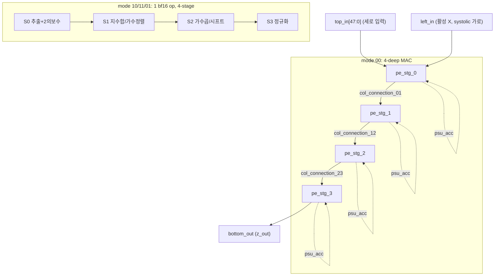
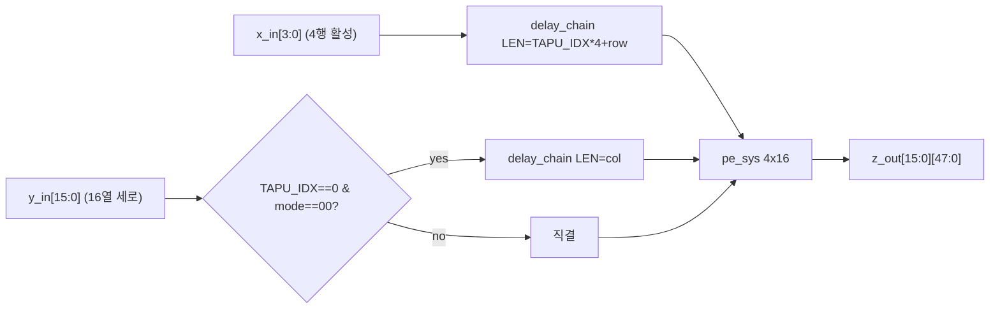
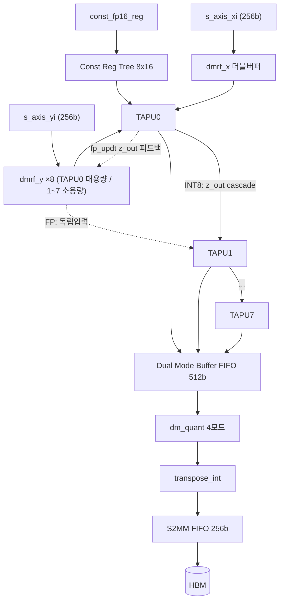
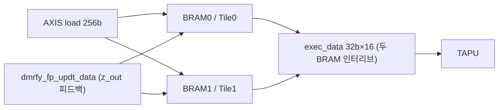
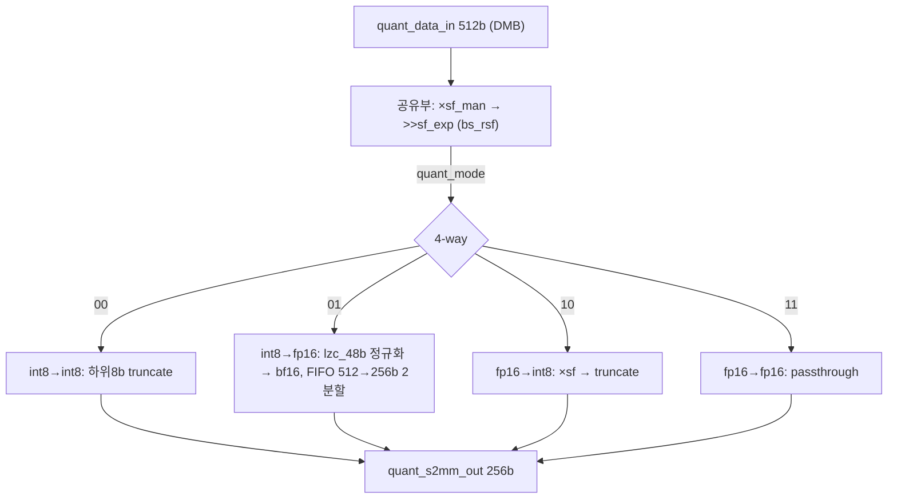
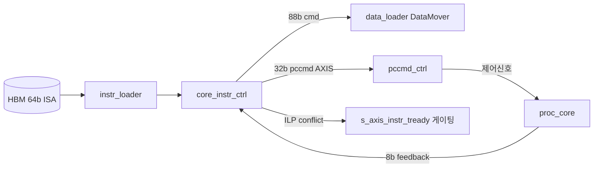
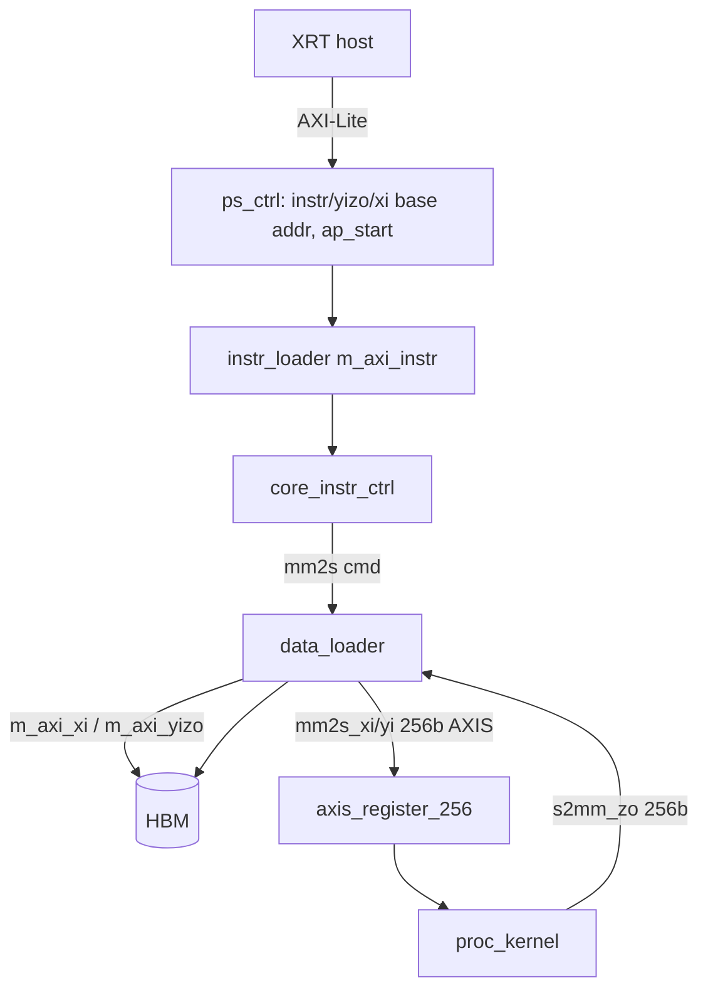
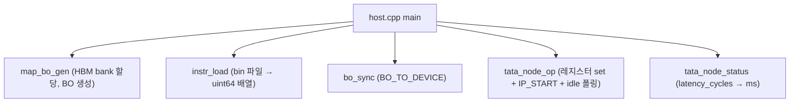
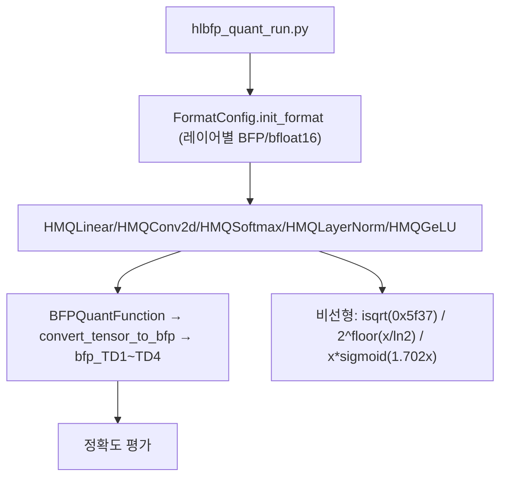
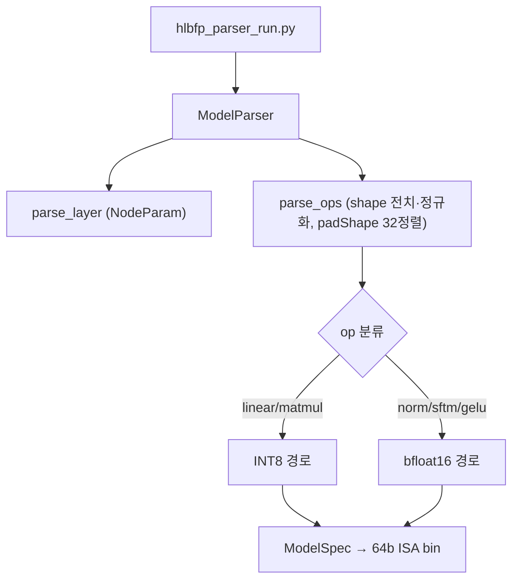

# TATAA 모듈 통합 가이드

> 1차 요약(맥락): [`../TATAA.md`](../TATAA.md)
> 소스 루트: `REF/ViT-Accelerator/TATAA` (동일 사본 `REF/Transformer-Accel/TATAA`). 본 가이드는 **`hardware/rtl/`** 를 정본(sim·`transpose_int.sv` 포함, 가장 완전)으로 삼고, `hardware/vitis_kernel/tata_int8os_{proc,mem}/rtl/` 는 동명 사본(패키징용)으로 처리한다.
> 표기 규약: 라인으로 직접 확인한 사실은 단정, 코드 정황 기반은 "추정", 코드/문서에 없으면 "확인 불가".
> 제외물(이름만): `tata_int8os_*/prj/*.gen/**`·`*.ip_user_files/**`(Vivado 생성물), Xilinx IP RTL(`axis_register_8/32/256.v`, `axis_register_slice_v1_1_vl_rfs.v`, `axis_infrastructure_v1_1_vl_rfs.v`, `glbl.v`), 합성 산출물(`.xo/.xclbin/.bit` — 리포에 없음).

---

## 0. 문서 머리말

### 0.1 대표 케이스 선정
TATAA는 한 PE(DSP48E2)를 `mode_sel`로 **INT8 GEMM ↔ bfloat16 비선형**으로 변형(transformable arithmetic)한다. 두 경로가 같은 DSP·라우팅·RF를 공유하므로 대표 케이스도 **두 개**를 함께 잡는다.

- **선형 대표(INT8 GEMM)**: DeiT-tiny/small의 **`qkv` linear** 한 타일.  `host.cpp` L28의 디폴트 instr 바이너리가 `bin_block.0.qkv/bin_core0.bin` 이고, `host.cpp` L5의 `instr_num = 5858` 가 **한 레이어(qkv) 분량의 64b 명령 수**다 — 즉 리포가 실제로 돌려본 단위가 qkv GEMM이다. (확인됨)
- **비선형 대표(bfloat16)**: **Softmax / LayerNorm**의 `isqrt`.  HW `pe_stg_0.sv` L123의 `27'h0005f37` 매직넘버가 SW `quant_module.py` L221 `0x5f37` 와 비트단위로 일치 → HW/SW 정합이 가장 또렷한 비선형 단위. (확인됨)

선정 근거: (1) 리포에 박혀 있는 실제 실행 단위(qkv), (2) HW↔SW 비트정합이 검증 가능한 단위(isqrt). 두 케이스로 "systolic INT8 / SIMD-FP" 양 데이터플로우를 모두 커버한다.

### 0.2 수치 표기 규약
- **MAC lanes**: PE 어레이의 동시 곱셈기 수. 본 설계는 **DSP48E2 = 1 PE** 이며, INT8 모드에서 한 DSP가 SIMD-pack으로 **2개 INT8 곱**을 동시 수행(`pe_stg_0.sv` L92 상위가중치 + L121 하위가중치). 따라서 `physical DSP lanes` 와 `INT8 MAC ops/cyc` 를 구분 표기한다.
- **scalar MACs**: 대표 GEMM의 M·N·K 곱. DeiT 차원으로 환산.
- **loop trips / cycle**: 컨트롤러 FSM 반복 또는 타일 차원 곱. `exec_ctrl_int8.sv` L43의 `psu_depth + EXTRA_LATENCY` 가 한 타일 실행 사이클.
- **memory size (payload bit)**: 버퍼 배열 깊이×폭(bit). on-chip BRAM/FIFO 각각.

### 0.3 운영 경로 (RTL ↔ quantization ↔ compilation ↔ host)
```
[quantization]  PyTorch 모델 → 혼합정밀(BFP bs16 + bfloat16) 정확도 확정 (format_config → HMQ* 모듈)
        │
[compilation]   ModelParser로 op 분류(bfp_ops/fp_ops/nonlinear) → 64b ISA instr 바이너리(.bin)
        │
[host (XRT)]    instr/.xclbin 로드 → instr_base/xi_base/yizo_base addr 레지스터 설정 → IP_START
        │
[mem_kernel]    instr_loader(HBM→64b ISA) → core_instr_ctrl(디코드/ILP) → pccmd(32b) + DataMover cmd
        │
[proc_kernel]   pccmd_ctrl(32b 디코드) → proc_core → 8×TAPU(systolic INT8 / SIMD bf16) → dm_quant → S2MM → HBM
```
근거: `host.cpp` L11~L39, `mem_kernel.v` L232~L396, `proc_kernel.v` L126~L220.

### 0.4 타깃 / 데이터타입 / mode 정책
- **타깃**: AMD/Xilinx **Alveo U280**(HBM), Vitis **2023.2** 강제(`hardware/README.md` L3, `vitis_kernel/README.md` L3). 호스트 주파수 상수 **225 MHz**(`host.cpp` L42: `225000000`). 합성 PPA 리포트는 리포에 미동봉 → **확인 불가**.
- **데이터타입**: 선형=INT8(블록 공유지수 BFP, `init_bfp_bit=7`, `shared_exp_bits=4`), 비선형=bfloat16(exp 8 / man 7).
- **mode_sel[1:0] 정책**(연산 PE): `00`=INT8 matmul, `10`=fp mul, `11`=fp add, `01`=fp isqrt/mag (`pe_stg_0.sv` L17, `tapu.sv` L21). 분기 키: `mode_sel[1]`==1 이면 FP 경로(독립 병렬), 0이면 INT8(systolic cascade) — `proc_core.sv` L477·L489.
- **quant_mode[1:0]**(출력 정밀도 변환, `dm_quant.sv` L19): `00` int8→int8, `01` int8→fp16, `10` fp16→int8, `11` fp16→fp16.

---

## 1. Repo / Layer 개요

| 레이어 | 경로 | 역할 |
|---|---|---|
| **hardware/rtl** | `hardware/rtl/*.sv,*.v` | 핸드라이트 RTL(SystemVerilog/Verilog). PE·TAPU·proc_core·컨트롤러·DMRF·dm_quant·loader·top wrapper. **HLS 아님.** |
| **hardware/host** | `hardware/host/*.cpp,*.h` | XRT 호스트 SW. 커널이 아니라 구동·instr 로드·멀티코어 배치. |
| **hardware/vitis_kernel** | `tata_int8os_{proc,mem}/rtl` + `prj` | `.xo` 패키징용. `rtl/`는 `hardware/rtl`의 사본(추정: 파일명 일치, 전수 diff 미수행). `prj/*.gen`·`ip_user_files`는 생성물 → 제외. |
| **quantization** | `quantization/hlbfp_quantization/` | PyTorch 혼합정밀. `hlbfp_bfloat16_bs16/`(알고리즘 BFP+bfloat16) + `hlibf_bfloat16_int8/`(모델별 HW정합 int8+bfloat16: vit/bert/swin/gpt2). |
| **compilation** | `compilation/parser/` | 모델 파싱→64b ISA 생성. `parser_module/`(범용) + 모델별(vit/bert/swin/gpt2). |

- README 5개 중 `quantization/README.md`·`compilation/README.md`는 **제목 한 줄만**(빌드 절차 문서 부재 → 코드 리딩 의존).
- 자체 RTL 모듈 수(hardware/rtl): SystemVerilog 26개 + Verilog 5개(`proc_kernel.v`, `mem_kernel.v`, `ps_ctrl.v`, `tata_top_wrapper.v`, sim `sim_tata_top.sv`).

### 모듈 인스턴스 계층 (top → leaf)
```
tata_top_wrapper.v  (sim/integration top)
├─ mem_kernel.v
│  ├─ ps_ctrl.v                 (AXI-Lite 제어레지스터: instr/yizo/xi base addr)
│  ├─ instr_loader.sv           (HBM→64b ISA AXIS)
│  ├─ data_loader.sv            (AXI DataMover: xi/yi MM2S, zo S2MM)
│  └─ core_instr_ctrl.sv        (64b ISA 디코드 + ILP 해저드 + DataMover cmd + 32b pccmd 생성)
└─ proc_kernel.v
   ├─ pccmd_ctrl.sv             (32b micro-cmd 디코드 → proc_core 제어신호 + const reg 8뱅크)
   └─ proc_core.sv              (데이터패스 통합)
      ├─ dmrf_x.sv              (활성 X RF, 더블버퍼)
      ├─ dmrf_y.sv ×8           (TAPU0=INT8 대용량, TAPU1~7=FP 소용량)
      ├─ tapu.sv ×8
      │  └─ pe_sys.sv           (4행×16열)
      │     └─ pe_stg_0~3.sv ×(4×16)  → DSP48E2 1개/스테이지
      │        └─ sm_twos_convert / twos_sm_convert / delay_chain
      ├─ exec_ctrl_int8.sv      (systolic 실행 FSM)
      ├─ zout_ctrl.sv           (출력 FSM)
      ├─ dm_quant.sv            (4모드 정밀도 변환: lzc_48b / bs_rsf / twos_sm_convert)
      ├─ transpose_int.sv       (INT8 전치, 32×32 systolic)
      └─ fifo_common / fifo_axis / bram_sdp_wrapper  (leaf 메모리)
```

---

## 2. PE 4단 데이터패스 — Transformable Arithmetic 코어 (`pe_stg_0~3.sv`)

### 2.1 역할 + 상위/하위 관계
TATAA의 핵심. **DSP48E2 4개(=한 PE 열, stage0→1→2→3)** 가 `mode_sel`로 의미를 바꾼다.
- **INT8 모드(`00`)**: 4단이 **독립 MAC 4개**로, 세로 cascade(`psu_acc_reg`)로 부분합을 누산.
- **bfloat16 모드(`10`/`11`/`01`)**: 4단이 **하나의 FP 연산을 4단계로 분해**한 파이프라인. stage0=추출/2의보수, stage1=지수연산/가수정렬선택, stage2=가수곱(mul)/배럴시프트(add), stage3=정규화.
상위: `pe_sys.sv`(16열 generate, L55). 하위: `DSP48E2` 프리미티브 + `sm_twos_convert`·`twos_sm_convert`·`delay_chain`.

### 2.2 데이터플로우


### 2.3 모듈 인스턴스 계층
`proc_core` → `tapu`(×8) → `pe_sys` → `{pe_stg_0,pe_stg_1,pe_stg_2,pe_stg_3}`(각 16열) → 각 stage 1× `DSP48E2_inst`.

### 2.4 대표 코드 위치
`hardware/rtl/pe_stg_0.sv`(추출/매직넘버/INT8 SIMD-pack), `pe_stg_1.sv`(지수차/가수정렬), `pe_stg_2.sv`(시프트 LUT/가수곱), `pe_stg_3.sv`(정규화).

### 2.5 대표 코드 블록

(1) **INT8 SIMD-pack — 한 DSP에 2개 가중치를 A·D 포트로** (`pe_stg_0.sv` L90~L121)
```systemverilog
if (mode_sel_in == 2'b00) dsp_a_in = {{(3){y_reg[15]}}, y_reg[15:8], 19'd0}; // 상위 가중치 → A
...
if (mode_sel_in == 2'b00) dsp_b_in = {{(10){left_in[7]}}, left_in};          // 활성 X → B
...
if (mode_sel_in == 2'b00) dsp_d_in = {{(19){y_reg[7]}}, y_reg[7:0]};         // 하위 가중치 → D
```
→ pre-adder(`AMULTSEL="AD"`, L206)로 A+D 두 INT8 가중치를 한 번에 활성(B)과 곱해 **2-way INT8 곱을 단일 DSP로** 처리(추정: 논문 INT8 packing). 누산은 `dsp_c_in = psu_acc_reg`(L113).

(2) **fast inverse sqrt 매직넘버 — isqrt를 PE에 내장** (`pe_stg_0.sv` L122~L123, L111)
```systemverilog
end else if (mode_sel_in == 2'b01) begin
    dsp_d_in = 27'h0005f37;   // magic number (Quake식 0x5f37, bfloat16용)
...
if (mode_sel_in == 2'b10) dsp_c_in = -48'sd127;  // bfloat16 지수 바이어스(127) 보정
```
→ SW `quant_module.py` L221 `torch.tensor(0x5f37) - (i>>1)` 와 정확히 일치. 비선형 1/sqrt를 별도 SFU 없이 FP-PE에서 계산.

(3) **fp add 배럴시프트를 DSP 곱으로 — 시프트량→곱셈상수 LUT** (`pe_stg_2.sv` L47~L67, L91)
```systemverilog
if (fpadd_man_shift_bits == 8'd0) fpadd_man_shift_mult = 9'b010000000;  // >>0
else if (... == 8'd1)             fpadd_man_shift_mult = 9'b001000000;  // >>1
... (>>7 까지)
...
else dsp_b_in = {9'd0, fpadd_man_shift_mult};  // 가수 우측시프트를 DSP 곱으로 구현
```
→ FP 덧셈의 가수 정렬(barrel shift)을 별도 시프터 없이 DSP 곱셈기로 흡수. 자원 공유 극대화.

(4) **정규화 — leading bit 검사 후 가수 시프트·지수+1** (`pe_stg_3.sv` L97~L114, L254)
```systemverilog
assign fp_normdet = mode_sel_in[0] ? dsp_p_out[16:15] : fpmul_input_sync[16:15];
assign fp_norm_flag = (fp_normdet == 2'b10) | (fp_normdet == 2'b01);
...
normed_mantissa <= fp_norm_flag ? {man[17], man[14:8]} : {man[17], man[13:7]};
normed_exponent <= fp_norm_flag ? fp_exp_tobenorm_p1 : fp_exp_tobenorm;
...
bottom_out <= {32'd0, normed_mantissa_sm[7], normed_exponent, normed_mantissa_sm[6:0]}; // bf16 재패킹
```

### 2.6 마이크로아키텍처: Stage 분해 + 정량
- **M0(stage0)**: bf16 2입력 `fp_alpha=top_in[15:0]`, `fp_beta=top_in[31:16]`(L33-34); hidden bit 복원 `{sign,1'b1,man[6:0]}`(L144) → `sm_twos_convert`로 2의보수. INT8 모드는 2-way pack MAC.
- **M1(stage1)**: fp mul=지수합·가수통과; fp add=`exp_diff=top_in[26:18]`로 큰/작은 가수 분기(L108-109), `twos_sm_convert`로 시프트량 산출(L113).
- **M2(stage2)**: fp mul=두 가수 DSP곱(`dsp_a_in=top_in[8:0]`, `dsp_b_in=top_in[17:9]`, L81·L89); fp add=시프트-LUT 곱.
- **M3(stage3)**: 정규화 + bf16 패킹.
- **DSP 파이프라인 레지스터**: `AREG=1,BREG=1,DREG=1,MREG=1,CREG=0,PREG=0`(L244~L254) → 각 stage 곱셈 경로 약 2~3단 레지스터. **bfloat16 1회 연산 총 레이턴시 = 16사이클**(`BFLOAT_LAT_CYCLE=16`, `proc_core.sv` L43; FP 결과 피드백 지연사슬 LEN=16, L216-258).
- **정량(한 PE 열=4 DSP)**: INT8 모드 처리량 = 4 DSP × 2 INT8곱 = **8 INT8 MAC/cyc/열**(추정, SIMD pack 근거 (1)). bf16 모드 = 4 DSP가 **1 bf16 op**(추출·정렬·곱·정규화 분담).
- **병목**: bf16 16사이클 레이턴시는 단발 비선형에 길지만, SIMD 벡터(16-wide, §5)로 amortize. `pe_stg_0.sv` L3 `@TODO: discuss the overflow issue in bfp8` → BFP8 누산 오버플로 미해결(리스크).

---

## 3. PE 어레이 & TAPU (`pe_sys.sv`, `tapu.sv`)

### 3.1 역할 + 상위/하위
- `pe_sys`(L5~L147): **4행×16열** PE 어레이. 16열 generate(L55), 각 열 세로 4단 cascade.
- `tapu`(Transformable Arithmetic Processing Unit, L5~L106): `pe_sys` 1개 + **systolic skew 지연사슬**. proc_core가 8개 인스턴스화.

### 3.2 데이터플로우


### 3.3 인스턴스 계층
`proc_core`(generate ×8) → `tapu` → `pe_sys`(generate ×16열) → `pe_stg_0~3`(세로 cascade).

### 3.4 대표 코드 위치
`hardware/rtl/tapu.sv`, `hardware/rtl/pe_sys.sv`.

### 3.5 대표 코드 블록

(1) **systolic skew는 INT8에서만, FP는 broadcast** (`tapu.sv` L40~L69)
```systemverilog
delay_chain #(.DW(LEFT_WIDTH), .LEN(TAPU_IDX*4 + idx_row)) delay_chain_x_in (...);  // 행별 X skew
...
sys_y_in[idx_col] <= (mode_sel_in == 2'b00) ? sys_y_in_matmul[idx_col] : y_in[idx_col];
```
→ X는 항상 `TAPU_IDX*4+row` 사이클 지연(8 TAPU 세로 cascade 정렬). Y는 **TAPU0 & matmul에서만** 열별 지연; FP 모드는 무지연 직결 → systolic(INT8) vs SIMD-broadcast(FP) 전환의 1차 분기점(추정).

(2) **세로 cascade vs 가로 systolic 연결** (`pe_sys.sv` L85~L142)
```systemverilog
.left_in (row_connection_0[col_idx]), .right_out(row_connection_0[col_idx+1]),  // 가로 1단 레지(systolic)
.top_in  (col_connection_01[col_idx]), .bottom_out(col_connection_12[col_idx]); // 세로: 위 stage 출력→아래 입력
```

(3) **제어신호 열별 팬아웃 최적화** (`pe_sys.sv` L46~L69)
```systemverilog
(* keep = "true" *) logic [COLS-1:0][1:0] mode_sel_in_r;  // 열별 1단 레지스터로 팬아웃 분산
```

### 3.6 마이크로아키텍처 + 정량
- **PE 격자(1 TAPU)**: 4행×16열 = 64 PE = 64 DSP48E2.
- **systolic skew 깊이**: TAPU별 X 지연 0~28사이클(`TAPU_IDX*4+row`, TAPU7 row3 = 7*4+3=31; 최대 ~31), Y 열 지연 0~15(TAPU0 한정).
- **병목**: skew 지연사슬은 FF 소모가 크나(특히 X), INT8 가중치-고정 출력-스테이셔너리 데이터플로우 정확도에 필수. FP 모드는 skew를 끔 → 같은 어레이를 latency 짧은 벡터 처리로 재활용.

---

## 4. Processing Core (`proc_core.sv`) — 데이터패스 통합

### 4.1 역할 + 상위/하위
8 TAPU(`TAPU_NUM=8`, L16)를 **세로 cascade(INT8) 또는 병렬(FP)** 로 묶고, DMRFX/Y·const tree·DMB FIFO·dm_quant·transpose·S2MM을 통합. 상위: `proc_kernel.v`. 하위: 위 모든 서브모듈.

전체 PE 규모: 8 TAPU × (4×16) = **세로 32행 × 16열 = 512 PE = 512 DSP48E2**(L17~L18 `X_SYS_PORT_NUM=32`, `Y_SYS_PORT_NUM=16`).

### 4.2 데이터플로우


### 4.3 인스턴스 계층
`proc_kernel` → `proc_core` → `{dmrf_x, dmrf_y×8, tapu×8, exec_ctrl_int8, zout_ctrl, dm_quant, transpose_int, fifo_axis(S2MM), fifo_common(DMB×8)}`.

### 4.4 대표 코드 위치
`hardware/rtl/proc_core.sv`.

### 4.5 대표 코드 블록

(1) **INT8 cascade vs FP 병렬 — 데이터플로우 전환 코어** (`proc_core.sv` L487~L493)
```systemverilog
end else begin  // tapu_idx >= 1
    assign y_in[tapu_idx][col_idx] =
       (mode_sel_in[tapu_idx][1] == 1'b1)
         ? {const_reg_col_tree[...], dmrfy_exec_data[...]}   // FP: DMRFY+const 독립 입력
         : z_out[tapu_idx-1][col_idx];                       // INT8: 위 TAPU 출력 세로 누산
```
→ `mode_sel[1]` 한 비트가 8 TAPU를 systolic 32행 누산(INT8) ↔ 8개 독립 FP 처리(SIMD)로 가른다.

(2) **FP 결과를 DMRFY로 되먹임 — 비선형 reduction** (`proc_core.sv` L501~L518, L216~L225)
```systemverilog
assign dmrfy_fp_updt_data[tapu_idx] = { z_out[tapu_idx][15][15:0], ..., z_out[tapu_idx][0][15:0] };
...
delay_chain #(.DW(1), .LEN(BFLOAT_LAT_CYCLE)) delay_chain_fp_updten ( .in(fp_exec_start & pc_fp_updt_en), .out(fp_updt_en_pipeout) );
```
→ z_out 16개 bf16을 16사이클(=FP 레이턴시) 뒤 DMRFY에 재기록 → Softmax/LayerNorm의 reduction(합·평균) 중간결과를 어레이로 순환(추정).

(3) **const reg tree 파이프라인 브로드캐스트** (`proc_core.sv` L118~L126)
```systemverilog
const_reg_tapu_tree[tapu_idx] <= const_fp16_reg;
const_reg_col_tree[tapu_idx][col_idx] <= const_reg_tapu_tree[tapu_idx];  // 8 TAPU × 16열로 2단 팬아웃
```
→ GELU 계수·eps 등 FP 상수를 어레이 전체에 타이밍-안전하게 공급.

(4) **DMB FIFO 512b 출력 버퍼** (`proc_core.sv` L656~L673, L43~L46)
```systemverilog
assign dmb_fifo_data_in[tapu_idx] = { z_out[tapu_idx][15][31:0], ..., z_out[tapu_idx][0][31:0] }; // 16×32=512b
```

### 4.6 마이크로아키텍처 + 정량
- **메모리(payload bit)**:
  - **DMRFX**: `X_BRAM_SIZE=262144` 워드급 영역, `BRAM_DATA_WIDTH=256` → 256b×(262144 깊이? 실제 BRAM addr 10b=1024 라인×256b=256 Kb/타일, 더블버퍼 2타일) (`dmrf_x.sv` L37~L41). 32포트로 32행 INT8 공급.
  - **DMRFY(TAPU0)**: X와 동일 대용량(`BRAM_SIZE=X_BRAM_SIZE`, `proc_core.sv` L265).
  - **DMRFY(TAPU1~7)**: `Y_BRAM_SIZE=8192`, 256b 폭, addr 5b → 소형 FP RF(`proc_core.sv` L26, L310). dmrf_y는 BRAM 2개(`bram_dmrfy0/1`)로 더블버퍼(`dmrf_y.sv` L121~L156).
  - **DMB FIFO**: 깊이 `DMB_FIFO_DEPTH=32` × 폭 512b × 8 TAPU = **128 Kb**(`proc_core.sv` L45~L46).
  - **S2MM FIFO**: 깊이 64 × 256b(`proc_core.sv` L799).
- **실행 사이클**: 한 INT8 타일 = `psu_depth + EXTRA_LATENCY`(`exec_ctrl_int8.sv` L43; `EXTRA_LATENCY=51`, `proc_core.sv` L40). psu_depth는 K 타일 깊이(최대 512).
- **병목**: TAPU0의 DMRFY가 X와 같은 대용량(INT8 가중치 cascade 시작점) → BRAM 비대칭. FP 모드 z_out→DMRFY 피드백은 16사이클 레이턴시에 묶여 reduction 직렬성 존재.

---

## 5. Dual-Mode Register File (`dmrf_x.sv`, `dmrf_y.sv`)

### 5.1 역할 + 상위/하위
on-chip 활성/가중치 버퍼. **INT8 모드는 2 BRAM = 2 타일 더블버퍼**, **bfloat16 모드는 1 BRAM 안에서 더블버퍼 통합**(`dmrf_y.sv` L220 주석). 상위: proc_core.

### 5.2 데이터플로우


### 5.3 대표 코드 위치
`hardware/rtl/dmrf_x.sv`, `hardware/rtl/dmrf_y.sv`(상단 L3~L63에 데이터 레이아웃 ASCII 다이어그램).

### 5.4 대표 코드 블록

(1) **INT8/FP에 따라 load·exec 주소 분기** (`dmrf_y.sv` L222~L227)
```systemverilog
buf_load_addr0 <= dmrfy_mode_sel ? dmrfy_fp0_updt_addr : cnt_dmrfy_load;   // FP: 벡터주소 / INT8: 카운터
buf_exec_addr0 <= dmrfy_mode_sel ? dmrfy_fp0_exec_addr : dmrfy_exec_addr;
```

(2) **FP 피드백 write-enable** (`dmrf_y.sv` L137~L140)
```systemverilog
dmrfy0_ld_wr_en   <= (hs_axis_dmrfy0_load) | (dmrfy_fp_updt_en & (~dmrfy_fp_updt_sel));
buf_dmrfy0_ld_data <= dmrfy_fp_updt_en ? dmrfy_fp_updt_data : s_axis_dmrfy0_load_tdata;
```

(3) **DMRFX 더블버퍼 주소에 tile_sel 비트** (`dmrf_x.sv` L78~L82)
```systemverilog
.buf_ld_addr({dmrfx_load_tile_sel, dmrfx_load_addr}),  // MSB=tile, load
.buf_ex_addr({dmrfx_exec_tile_sel, dmrfx_exec_addr})   // MSB=tile, exec → 다른 타일이면 load/exec 동시
```

### 5.5 마이크로아키텍처 + 정량
- **INT8 레이아웃**(`dmrf_y.sv` L4~L28): 32포트, 깊이 128, 블록 32, 최대 stream 깊이 512.
- **bfloat16 레이아웃**(L30~L62): 고정 벡터 16-wide, dmrfy당 최대 벡터 16개, 최대 처리 깊이 32.
- **memory size**: DMRFX = 256b×1024라인×2타일 = **512 Kb**(추정, addr 10b). DMRFY(FP) = 256b×32라인×2 BRAM×7 = **약 114 Kb**(추정, `Y_BRAM_SIZE=8192`/256≈32라인).
- **병목**: bfloat16 RF가 작아(벡터 16) 비선형 시퀀스 길이가 길면 타일링 필요. INT8 더블버퍼는 load/exec 완전 중첩 가능(ILP 핵심).

---

## 6. Dual-Mode Quantization (`dm_quant.sv`) — 정밀도 전환 접착제

### 6.1 역할 + 상위/하위
출력 단에서 **4모드 정밀 변환**(`quant_mode`)으로 레이어 경계 INT↔FP를 오감. 선형(INT8)→비선형(bf16)→선형(INT8) 사이를 잇는다. 상위: proc_core.

### 6.2 데이터플로우


### 6.3 대표 코드 위치
`hardware/rtl/dm_quant.sv`.

### 6.4 대표 코드 블록

(1) **공유 스케일: 가수 곱 + 지수 우측시프트** (`dm_quant.sv` L58~L75)
```systemverilog
if (quant_mode[1] == 1'b0) begin  // int8 입력 경로
    mul_sf_man_0[col_idx] <= quant_data_in[col_idx*32+15:col_idx*32] * sf_man_r;  // ×스케일가수
    ...
end else mul_sf_man_0[col_idx] <= quant_data_in_man[col_idx] * sf_man_r;          // fp 입력 경로
bs_rsf bs_rsf_sf_0 ( .a(mul_sf_man_0[col_idx]), .b(sf_exp_r), .c(shift_sf_0[col_idx]) ); // >>지수
```

(2) **int8→fp16: lzc로 정규화하여 bf16 생성** (`dm_quant.sv` L197~L227)
```systemverilog
lzc_48b lzc_48b_pos_0 ( .a(sm_mul_sf_man_0[col_idx]), .right_shift_bits(right_shift_bits_0[col_idx]) );
...
exp_int8_fp16_0[col_idx] <= right_shift_bits_0[col_idx] + sf_exp_r;  // 지수 = leading-zero + 스케일지수
man_int8_fp16_0[col_idx] <= sm_mul_sf_man_0[col_idx][15:9];          // 정규화 가수 7b
```
→ **선형(INT8) 출력 → 비선형(bf16) 입력** 변환의 HW 경로. `lzc_48b.sv`는 48b leading-zero를 우선순위 인코더로 산출(L10~L110).

(3) **512b→256b 2분할 FIFO 송출** (`dm_quant.sv` L396~L398)
```systemverilog
assign fifo_int8_fp16_rd_en = int8_fp16_convert_state & (~cnt_flip_int8_fp16);
assign int8_fp16_data_out = cnt_flip_int8_fp16 ? dout[255:0] : dout[511:256];  // 32 fp16 = 512b → 256b×2
```

(4) **4-way 출력 MUX** (`dm_quant.sv` L498~L515)
```systemverilog
if (quant_mode == 2'b00) quant_s2mm_out <= int8_int8_data_out;       // 00
else if (quant_mode==2'b01) quant_s2mm_out <= int8_fp16_data_out;    // 01
else if (quant_mode==2'b10) quant_s2mm_out <= fp16_int8_data_out;    // 10
else quant_s2mm_out <= fp16_fp16_data_out;                           // 11
```

### 6.5 마이크로아키텍처 + 정량
- **레인**: 16열(`COLS=16`) 병렬, 각 열 2-way(0/1) → INT8 경로 32 변환/cyc.
- **`use_dsp` 곱셈기**: `mul_sf_man_0/1`에 `(* use_dsp = "yes" *)`(L51-52) → 스케일 곱이 DSP로 추론.
- **FIFO**: int8→fp16 변환용 `FIFO_DEPTH=256` × 512b(L351-353).
- **병목**: int8→fp16 모드는 2-pass(512→256b 분할) + lzc 우선순위 인코더(48-input) → 조합 경로 깊음. 타이밍 위해 valid 2~3사이클 지연(L98, L717-727).

---

## 7. 커스텀 ISA & 2계층 명령 디코더 (`core_instr_ctrl.sv`, `pccmd_ctrl.sv`)

### 7.1 역할 + 상위/하위
2계층: (1) mem_kernel의 `core_instr_ctrl`이 **64b ISA** 디코드 + ILP 해저드 + DataMover cmd + **32b micro-cmd 생성**, (2) proc_kernel의 `pccmd_ctrl`이 32b를 받아 proc_core 제어신호로 풀어냄.

### 7.2 데이터플로우


### 7.3 인스턴스 계층
`mem_kernel` → `core_instr_ctrl`; `proc_kernel` → `pccmd_ctrl`. 둘은 `axis_register_32`(pccmd)·`axis_register_8`(feedback)로 연결(`proc_kernel.v` L267, `mem_kernel.v` L443).

### 7.4 대표 코드 위치
`hardware/rtl/core_instr_ctrl.sv`, `hardware/rtl/pccmd_ctrl.sv`.

### 7.5 대표 코드 블록

(1) **64b ISA 명령 타입 & 디코드 진입** (`core_instr_ctrl.sv` L55~L65)
```systemverilog
localparam LAYER_CONFIG=3'b000, PCLOADBLK=3'b001, PCLOADFPV=3'b010,
           PCEXECBLK=3'b011, PCEXECFPV=3'b100, PCSTORE=3'b110;
assign instr_type_e  = s_axis_instr_tdata[62:60];      // [62:60]=type
assign instr_en      = hs_axis_instr & (s_axis_instr_tdata[63] == 1'b1); // [63]=valid
```

(2) **PCEXECBLK / PCEXECFPV 필드 추출** (`core_instr_ctrl.sv` L151~L166)
```systemverilog
end else if (instr_type_e == PCEXECBLK) begin
    pc_exec_mode_sel <= s_axis_instr_tdata[1:0];  // 00/10/11
    psu_acc <= s_axis_instr_tdata[57]; psu_clr <= s_axis_instr_tdata[58];
end else if (instr_type_e == PCEXECFPV) begin
    pc_fp0_exec_vec <= s_axis_instr_tdata[36:32]; pc_fp1_exec_vec <= s_axis_instr_tdata[41:37];
    pc_fp_updt_en <= s_axis_instr_tdata[42];  pc_fp_op_sel <= s_axis_instr_tdata[55:53];
```

(3) **ILP 해저드 — load/exec/store 타일 충돌 검사** (`core_instr_ctrl.sv` L254~L264)
```systemverilog
assign ldx_ex_conflict = (instr_type_e==PCEXECBLK) & (next_execx_tile_sel==xi_load_tile_sel) & loadx_busy;
assign ex_st_conflict  = (instr_type_e==PCSTORE) & exec_busy;
assign ilp_conflict    = ld_ld_conflict|ex_ex_conflict|st_st_conflict|ldx_ex_conflict|ldy_ex_conflict|ex_ld_conflict|ex_st_conflict;
assign s_axis_instr_tready = ~ilp_conflict;   // 충돌 시 명령 스트림 정지 → load/exec/store 더블버퍼 중첩
```

(4) **88b DataMover cmd 생성(BTT/SADDR/EOF)** (`core_instr_ctrl.sv` L270~L276)
```systemverilog
assign ld_xi_cmd[22:0]  = {7'd0, xi_load_mm2s_btt};  // BTT
assign ld_xi_cmd[30]    = 1'b1;                       // EOF
assign ld_xi_cmd[71:32] = xi_load_mm2s_addr;         // SADDR (= base+offset)
```

(5) **pccmd_ctrl: 32b → 제어신호 + const 8뱅크 + feedback** (`pccmd_ctrl.sv` L116~L135, L201~L202)
```systemverilog
end else if (hs_axis_pccmd & (pccmd_type==3'b000)) begin  // config: sf_exp/man 또는 const_fp16_reg_files[0..7]
    if (s_axis_pccmd_tdata[6]) { pc_quant_sf_exp <= ...[11:7]; pc_quant_sf_man <= ...[27:12]; }
...
assign m_axis_pcfbk_tdata = {4'd0, pc_loady_done, pc_loadx_done, pc_exec_done, pc_store_done}; // 8b feedback
```

### 7.6 마이크로아키텍처 + 정량
- **명령 폭**: ISA 64b, micro-cmd 32b, feedback 8b, DataMover cmd 88b.
- **const reg files**: 8뱅크 × 16b(`pccmd_ctrl.sv` L61) → FP 상수 8종 동시 보유.
- **ILP**: load(x/y)·exec·store 4-busy 플래그 + 7종 충돌식 → 데이터무브-연산-저장 3-stage 파이프라인(타일 더블버퍼).
- **debug**: `latency_cycles` 카운터(`core_instr_ctrl.sv` L534~L546)를 host가 ms 환산(`host_flow.cpp` L99).
- **병목**: 모든 명령이 단일 64b 스트림으로 in-order 디코드 → ILP는 타일 충돌만 회피(out-of-order 아님). 복잡 비선형은 PCEXECFPV 다수 발행 필요(qkv 1레이어 instr 5858개, `host.cpp` L5).

---

## 8. 메모리 IO 경로 (`instr_loader.sv`, `data_loader.sv`, `ps_ctrl.v`, `mem_kernel.v`)

### 8.1 역할 + 상위/하위
`mem_kernel`이 HBM과 proc_kernel 사이 모든 데이터무브 담당. `ps_ctrl`(AXI-Lite 제어레지스터), `instr_loader`(HBM→64b ISA), `data_loader`(AXI DataMover로 xi MM2S / yi MM2S / zo S2MM, yizo는 read+write 채널).

### 8.2 데이터플로우


### 8.3 대표 코드 위치
`hardware/rtl/mem_kernel.v`(통합), `instr_loader.sv`, `data_loader.sv`, `ps_ctrl.v`.

### 8.4 대표 코드 블록

(1) **AXI-Lite로 base addr 수신 → core_instr_ctrl 전달** (`mem_kernel.v` L185~L222, L376~L377)
```verilog
ps_ctrl ... ( .instr_base_addr(instr_base_addr), .yizo_base_addr(yizo_base_addr), .xi_base_addr(xi_base_addr), ... );
...
core_instr_ctrl ... ( .yizo_base_addr(yizo_base_addr[39:0]), .xi_base_addr(xi_base_addr[39:0]), ... );
```

(2) **instr_loader: m_axi_instr → 64b ISA AXIS** (`mem_kernel.v` L232~L259)
```verilog
instr_loader ... ( .instr_btt(instr_btt), .base_addr(instr_base_addr[39:0]),
                   .m_axi_rdata(m_axi_instr_rdata), .m_instr_tdata(i_instr_loader_tdata) ); // 64b
```

(3) **AXI 폭 정의** (`mem_kernel.v` L8~L14)
```verilog
parameter C_S_AXI_INSTR_DATA_WIDTH = 64;   // ISA
parameter C_S_AXI_CORE_DATA_WIDTH  = 256;  // 데이터 (xi/yizo)
parameter C_S_AXIS_PCCMD_DATA_WIDTH = 32;  // micro-cmd
```

### 8.5 마이크로아키텍처 + 정량
- **AXI 채널**: instr(MM2S read, 64b), xi(MM2S read, 256b), yizo(read+write, 256b — 가중치 in + 결과 out 공유), pccmd(32b AXIS), pcfbk(8b AXIS).
- **AXIS register slice**: mm2s_xi/yi/s2mm_zo 각각 256b `axis_register_256`(Xilinx IP), pccmd 32b, pcfbk 8b — 타이밍 격리용.
- **mem/proc 커널 분리**: `vitis_kernel/README.md` L3 "better timing optimization" → 두 `.xo`로 분리 패키징.
- **확인 불가**: HBM 채널 수·뱅크 매핑(host `bank_assign[2]={0,1}`, `host.cpp` L8은 1코어 예시), DataMover 버스트 길이.

---

## 9. 호스트 SW (`host.cpp`, `host_flow.cpp`)

### 9.1 역할 + 상위/하위
XRT 기반 구동. `.xclbin` 로드 → BO(buffer object) 매핑 → instr 바이너리 로드 → base addr 레지스터 설정 → `IP_START` → `ap_idle` 폴링.

### 9.2 데이터플로우 / SW 호출경로


### 9.3 대표 코드 위치
`hardware/host/host.cpp`(main), `hardware/host/host_flow.cpp`(연산함수), `libs.h`·`axi_control_regs.h`·`param_def.h`·`mem_tag.h`.

### 9.4 대표 코드 블록

(1) **레지스터 set + IP_START + idle 폴링** (`host_flow.cpp` L13~L44)
```cpp
ips[i].write_register(ADDR_INSTR_BTT, instr_len * 8);                 // 64b → byte
ips[i].write_register(ADDR_INSTR_BASE_ADDR_0, instr_addr_arr[i]); ... // base addr
ips[i].write_register(ADDR_AP_CTRL, IP_START);
...
while (ap_check != IP_IDLE) { ... ap_idle[i] = axi_ctrl_rd[i] & 0xfffffff4; ... }
```

(2) **instr 바이너리를 uint64로 로드 — ISA 64b 정합** (`host_flow.cpp` L110~L126)
```cpp
bf_instr[i] = new uint64_t[instr_num];
file.read(reinterpret_cast<char *>(bf_instr[i]), size);  // .bin → uint64[]
bo_instr_map[i][r] = bf_instr[i][r];
```

(3) **멀티코어 BO/HBM 뱅크 배치** (`host_flow.cpp` L153~L165)
```cpp
bo_x[i]    = xrt::bo(device, x_size, bank_assign[i*hbm_ch_num]);     // 코어별 HBM 뱅크
bo_yizo[i] = xrt::bo(device, y_size, bank_assign[i*hbm_ch_num+1]);
bo_instr[i]= xrt::bo(device, instr_size, DDR0);
```

(4) **실제 실행 단위 = qkv 1레이어, 5858 instr, 225 MHz** (`host.cpp` L5, L28, L42)
```cpp
uint32_t instr_num = 5858;
bin_file_array[fid] = ".../bin_block.0.qkv/bin_core0.bin";
tata_node_status(ips, num_krnl, 225000000, 128, 2, 256, ...);  // freq=225MHz, bfp_mult_num=128, tapu_num=2(예시인자)
```

### 9.5 마이크로아키텍처 + 정량
- **멀티코어**: `num_cores` 루프로 한 U280에 여러 TATAA 코어 인스턴스화(`host_flow.cpp` L13, L153). `host.cpp`는 `num_krnl=1` 예시(L7).
- **throughput 계산식**(주석, `host_flow.cpp` L103): `ops = bfp_mult_num*tapu_num*xw*xh*yw*mac_ops*layer_num*2`(현재 주석처리 → 확인 불가).
- **freq 상수 225 MHz**(L42) → latency_ms = cycles/225e6×1000.

---

## 10. 양자화 알고리즘 (Python, `quantization/`)

### 10.1 역할 + 상위/하위
PyTorch에서 혼합정밀 정확도 확정. 두 갈래: (a) `hlbfp_bfloat16_bs16/`(알고리즘 BFP bs16 + bfloat16), (b) `hlibf_bfloat16_int8/`(모델별 HW정합 int8+bfloat16).

### 10.2 데이터플로우 / 호출경로


### 10.3 대표 코드 위치
`quantization/.../hlbfp_bfloat16_bs16/{quant_function.py, quant_module.py, hlbfp_format.py, para_config.py}`, `compilation/parser/vit/format_config.py`.

### 10.4 대표 코드 블록

(1) **BFP 양자화: 블록 max를 공유지수로** (`quant_function.py` L133~L139)
```python
x_abs_man, x_abs_exp = torch.frexp(x)
shared_exp, _ = torch.max(x_abs_exp, dim=mode_dim, keepdim=True)  # 블록 내 max 지수 = 공유지수
interval = torch.exp2(shared_exp - bfp.man_bits)
x_bfp = torch.round(x / interval) * interval                      # man_bits 라운딩
```

(2) **isqrt: 매직넘버 + 뉴턴 1회 — HW와 비트정합** (`quant_module.py` L218~L233)
```python
def isqrt(x):
    y = torch.tensor(x).bfloat16(); i = y.view(torch.short)
    i = torch.tensor(0x5f37).short() - torch.tensor(i >> 1).short()  # ★ HW pe_stg_0 27'h0005f37
    y = i.view(torch.bfloat16)
    sub_tmp = (1.5 - (x*0.5).bfloat16()*(y*y).bfloat16()).bfloat16(); y = y*sub_tmp   # 뉴턴 1회
    return y
```

(3) **Softmax exp = 2^floor(x/ln2), 정규화에 isqrt** (`quant_module.py` L304~L314)
```python
q = torch.floor(x / 0.6931471805599453).bfloat16()  # /ln2
exp_x = (2 ** q).bfloat16()
exp_x_sum = torch.sum(exp_x, dim=-1, keepdim=True).bfloat16()
exp_xs = isqrt(exp_x_sum); bfp_out = exp_x * exp_xs * exp_xs   # /sum = ×(1/√sum)²
```

(4) **GELU = x·sigmoid(1.702x), LayerNorm = mean/var + isqrt** (`quant_module.py` L356~L359, L382~L396)
```python
x_tmp = (1.702 * x).bfloat16(); bfp_out = (x / (1 + torch.exp(-x_tmp).bfloat16())).bfloat16()  # GELU
...
var = (mean_x2 - mean**2).bfloat16(); var_sqrt = isqrt((var+eps)).bfloat16()  # LayerNorm 1/√var
```

(5) **레이어별 혼합정밀 — embed/qkv는 [act,w,bias], 비선형은 act만** (`format_config.py` L121~L128)
```python
model_config_dict["embed"] = [
    [-2, init_lfp_exp, init_lfp_man, init_lfp_bias],         # act: lfp(no-block)
    [bfp_block_size, shared_exp_bits, init_bfp_bit, 0],      # w: BFP
    [8, shared_exp_bits, init_bfp_bit, init_lfp_bias] ]      # bias: BFP block8
```

### 10.5 마이크로아키텍처 + 정량
- **블록 크기**: `BLOCK_DIM=4`, `BLOCK_SIZE=16`(`para_config.py` L1-2) → "bs16"=4×4 블록.
- **기본 포맷**: `init_bfp_bit=7`(가수 7b≈INT8), `shared_exp_bits=4`, `init_lfp_exp=4`(`hlbfp_parser_run.py` L69 `init_format(7,4,3,7)`).
- **bfloat16**: exp 8 / man 7(Softmax/LN/GELU act_format `HybridLowBlockFP(BLOCK_SIZE,8,7,7)` 등, `quant_module.py` L300).
- **op 분류**(`model_parser.py` L8~L11): `bfp_ops=['linear','matmul']`(INT8), `fp_ops=['mul','sub','add','div']`, `nonlinear_layer_list=['norm','sftm','gelu']`(bf16).
- **(b) hlibf**: 모델별(vit/bert/swin/gpt2) `BitType`+`build_observer/quantizer`로 PTQ INT8, 비선형은 bf16 근사 — HW 비트정합 골든모델(추정).
- **한계**: `format_config`는 `model_category=="deit"`만, 그 외 `NotImplementedError`(L84).

---

## 11. 컴파일러 (Python, `compilation/parser/`)

### 11.1 역할 + 상위/하위
PyTorch 모델 → **노드(레이어)–오퍼레이션** `ModelSpec` → op 분류(BFP/FP/nonlinear)·shape 전치·32정렬 패딩 → 64b ISA 바이너리. 상위 진입: `vit/hlbfp_parser_run.py`, `swin/gpt2/bert/run_*.py`.

### 11.2 데이터플로우


### 11.3 인스턴스/호출 계층
`hlbfp_parser_run.py` → `FormatConfig` + `ModelParser` → `VisionTransformer.forward(x, mp, ...)` 중 각 op를 `mp.parse_ops()` 기록 → `parser_module/{layer_parser, node_param, operation_param, model_spec, base_param}` 직렬화.

### 11.4 대표 코드 위치
`compilation/parser/parser_module/model_parser.py`, `compilation/parser/vit/hlbfp_parser_run.py`, `format_config.py`.

### 11.5 대표 코드 블록

(1) **op 분류 테이블 + 32정렬 패딩** (`model_parser.py` L8~L17)
```python
bfp_ops = ['linear', 'matmul']                  # INT8/BFP 경로
fp_ops  = ['mul', 'sub', 'add', 'div']
nonlinear_layer_list = ['norm', 'sftm', 'gelu'] # bfloat16 경로
def padShape(n, dim=32):                         # systolic 32행 정렬
    return n if n % dim == 0 else n - (n % dim) + dim
```

(2) **parse_ops: shape 전치 후 xin/yin/zout 기록** (`model_parser.py` L104~L123)
```python
if in_data is not None:
    op_param_dict.update({'xin': in_data_shape})   # (전치·배치제거 후) 입력 shape
if out_data is not None:
    op_param_dict.update({'zout': out_data_shape}) # 출력 shape → 명령 생성 입력
```

(3) **mixed-precision 초기화 후 fc/softmax 별도 처리** (`hlbfp_parser_run.py` L68~L80)
```python
new_config = FormatConfig()
model_format_config, model_format_list = new_config.init_format(7, 4, 3, 7)
fc_idx_list = get_fc_layer_idx("deit", 12); softmax_idx_list = get_softmax_layer_idx("deit", 12)
for idx in range(len(model_format_list)):
    if len(model_format_list[idx]) == 4 and idx not in softmax_idx_list:
        model_format_list[idx][0] = BLOCK_SIZE   # softmax 제외 act를 BFP화
```

### 11.6 마이크로아키텍처 + 정량
- **32정렬**: `padShape(dim=32)` → systolic 32행(`proc_core` X_SYS_PORT_NUM=32)에 맞춤.
- **최종 산출물**: host가 읽는 64b ISA `.bin`. 생성 코드 세부(`run_parser.py`/`hlbfp_parser_run.py` 후반)는 본 분석 미정독 → **부분 확인 불가**(파서·shape 추출은 확인, 비트 패킹 함수 미정독).
- **모델 커버리지**: vit(deit)·bert·swin·gpt2 파서 존재, FormatConfig는 deit 한정.

---

## 12. 모듈 한눈 요약 표

| # | 모듈(파일) | 역할 | 핵심 파라미터/수치 | 대표 라인 |
|---|---|---|---|---|
| 2 | `pe_stg_0~3.sv` | DSP48E2 1개/스테이지, INT8 MAC↔bf16 4단 분해 | DSP `AMULTSEL=AD,USE_SIMD=ONE48`; isqrt `0x5f37`; bf16 16cyc | stg0 L92/L123, stg2 L47 |
| 3 | `pe_sys.sv`/`tapu.sv` | 4×16 PE 어레이 + systolic skew | 64 PE/TAPU; X skew `IDX*4+row` | pe_sys L55, tapu L43/L69 |
| 4 | `proc_core.sv` | 8 TAPU + RF + DMB + quant 통합 | 512 PE(32행×16열); EXTRA_LATENCY=51 | L17, L487, L501 |
| 5 | `dmrf_x.sv`/`dmrf_y.sv` | 활성/가중치 RF 더블버퍼 | X 256b×~1024×2타일; Y(FP) 8192/256b | dmrf_x L37, dmrf_y L222 |
| 6 | `dm_quant.sv` | 4모드 정밀도 변환 | 16열×2; FIFO 256×512b; lzc 48b | L58, L197, L498 |
| 7 | `core_instr_ctrl.sv` | 64b ISA 디코드+ILP+cmd | type[62:60], valid[63]; 7종 충돌 | L55, L254 |
| 7 | `pccmd_ctrl.sv` | 32b micro-cmd 디코드 | const 8뱅크×16b; 8b feedback | L61, L201 |
| 8 | `mem_kernel.v` | HBM↔proc IO | AXI instr64b/data256b/cmd32b | L8, L232 |
| 9 | `host.cpp`/`host_flow.cpp` | XRT 구동·멀티코어 | 225 MHz; qkv 5858 instr | host L5/L42 |
| 10 | `quant_module.py`(bs16) | 혼합정밀 양자화·비선형 근사 | BLOCK_SIZE=16; bf16(8,7); isqrt 0x5f37 | L218, L304 |
| 11 | `model_parser.py` | op분류·shape·32정렬 | bfp/fp/nonlinear 분류; pad32 | L8, L13 |

---

## 13. 읽기 순서 / 코드 추적 순서

1. **개념 잡기**: 루트 `README.md` → `hardware/README.md` → `vitis_kernel/README.md` → 본 §0.
2. **변형 산술의 핵심(가장 먼저)**: `pe_stg_0.sv`(INT8 pack + isqrt 매직넘버) → `pe_stg_1~3.sv`(FP 4단). §2.
3. **어레이/데이터플로우**: `tapu.sv`(skew) → `pe_sys.sv`(4×16) → `proc_core.sv`(8 TAPU cascade vs 병렬, FP 피드백). §3·§4.
4. **메모리/버퍼**: `dmrf_x.sv` → `dmrf_y.sv`(데이터 레이아웃 ASCII) → `dm_quant.sv`(4모드). §5·§6.
5. **제어/ISA**: `core_instr_ctrl.sv`(64b 디코드·ILP) → `pccmd_ctrl.sv`(32b) → `exec_ctrl_int8.sv`(실행 FSM). §7.
6. **IO/통합**: `mem_kernel.v` → `proc_kernel.v` → `host.cpp`/`host_flow.cpp`. §8·§9.
7. **SW 매핑**: `quant_module.py`(비선형) + `quant_function.py`(BFP) + `format_config.py`(레이어 포맷) → `model_parser.py`(컴파일). §10·§11.

HW↔SW 추적 팁: `isqrt`를 앵커로 `pe_stg_0.sv` L123 ↔ `quant_module.py` L221을 양방향 대조하면 변형 산술 전체 흐름이 풀린다.

---

## 14. 병목 후보 & 병렬도 노브

| 항목 | 위치 | 병목/리스크 | 병렬도 노브 |
|---|---|---|---|
| bf16 레이턴시 16cyc | `proc_core.sv` L43 (`BFLOAT_LAT_CYCLE`) | 단발 비선형 직렬 | SIMD 16-wide 벡터로 amortize; 벡터 길이↑ |
| BFP8 누산 오버플로 | `pe_stg_0.sv` L3 TODO | 미해결 정확도 리스크 | psu 폭 확장 / 블록 깊이 제한 |
| TAPU0 DMRFY 대용량 | `proc_core.sv` L265 | BRAM 비대칭 | INT8 cascade 시작점 — 분산/타일링 |
| int8→fp16 2-pass+lzc | `dm_quant.sv` L197/L396 | 조합 경로 깊음 | valid 지연 추가(이미 적용); lzc 파이프라인화 |
| in-order ISA 디코드 | `core_instr_ctrl.sv` L264 | OoO 아님, 타일충돌만 회피 | 타일 더블버퍼(이미); 멀티코어 복제 |
| FP RF 작음(벡터16) | `dmrf_y.sv` L62 | 긴 시퀀스 타일링 필요 | `Y_BRAM_SIZE`↑ / 시퀀스 분할 |
| 멀티코어 | `host_flow.cpp` L153 | U280 자원 한계 | `num_cores`↑ (코어 복제) |
| 핵심 병렬도(PE) | `proc_core.sv` L17 | — | TAPU_NUM/ROWS/COLS 파라미터; 512 DSP가 상한 |

### 정량 요약(대표 케이스 환원)
- **물리 MAC lanes**: 512 DSP48E2 = 32행 × 16열(`proc_core.sv` L17, X_SYS_PORT_NUM=32 / Y_SYS_PORT_NUM=16). INT8 SIMD-pack 시 **최대 1024 INT8 MAC ops/cyc**(추정, DSP당 2곱 근거 §2.5(1)).
- **scalar MACs(qkv 대표)**: DeiT-tiny qkv = M(=N토큰 197)·K(192)·N(192×3=576) ≈ 197·192·576 ≈ **21.8 M MAC**(DeiT-tiny dim=192 기준; 차원은 timm DeiT-tiny 표준값 적용, 코드 직접 명시 아님 → 추정).
- **한 INT8 타일 실행 사이클**: `psu_depth + EXTRA_LATENCY`(=K타일깊이 + 51), `exec_ctrl_int8.sv` L43.
- **on-chip 메모리(payload)**: DMB FIFO 32×512b×8 = 128 Kb; DMRFX ≈ 512 Kb(추정); DMRFY(FP) ≈ 114 Kb(추정).
- **주파수**: 225 MHz(host 상수, `host.cpp` L42). 합성 실측 Fmax·LUT/DSP/BRAM 리포트는 **확인 불가**(리포 미동봉).

---

## 15. 확인 불가 / 추정 / 특이사항

- **확인 불가**: 합성 PPA(LUT/DSP/BRAM/실측 Fmax — 리포트 미동봉), HBM 채널/뱅크 매핑 세부, DataMover 버스트, instr 비트패킹 생성 함수(파서 후반 미정독), quantization/compilation README 본문(제목만), Python 환경 버전 pin(환경파일 미발견), vitis_kernel/rtl이 hardware/rtl과 100% 동일한지(파일명 일치·내용 동일 추정, 전수 diff 미수행).
- **추정(코드 정황)**: DSP 2-way INT8 pack(A·D 포트 근거), systolic(INT8) vs SIMD(FP) 해석, FP 피드백의 Softmax/LN reduction 용도, hlibf의 비트정합 골든모델 역할, 메모리 size(addr 폭 기반), qkv scalar MAC(DeiT-tiny 표준차원 적용).
- **특이사항**: 연산 커널은 **HLS가 아닌 hand-written RTL**(DSP48E2 직접 인스턴스, UltraScale+ 종속). 호스트 `.cpp/.h`는 커널 아님. `.cl` 없음. README 5개 중 2개 빈 제목. `pe_stg_0.sv` L3 BFP8 오버플로 TODO 미해결.
