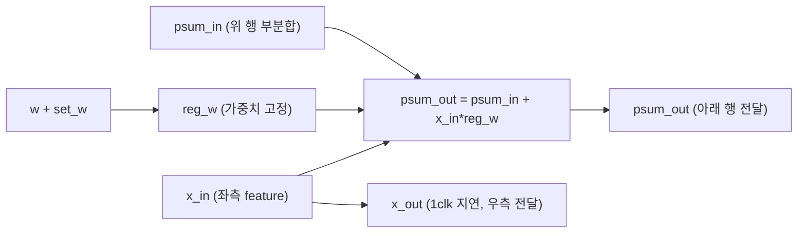
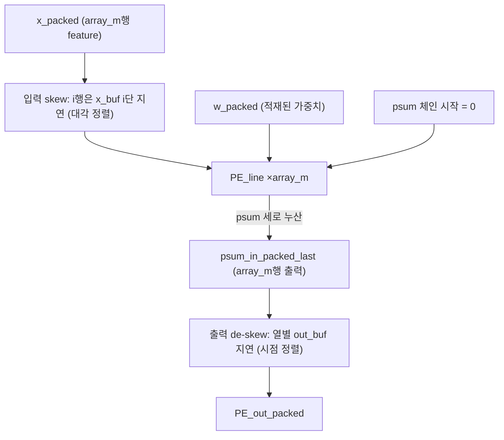
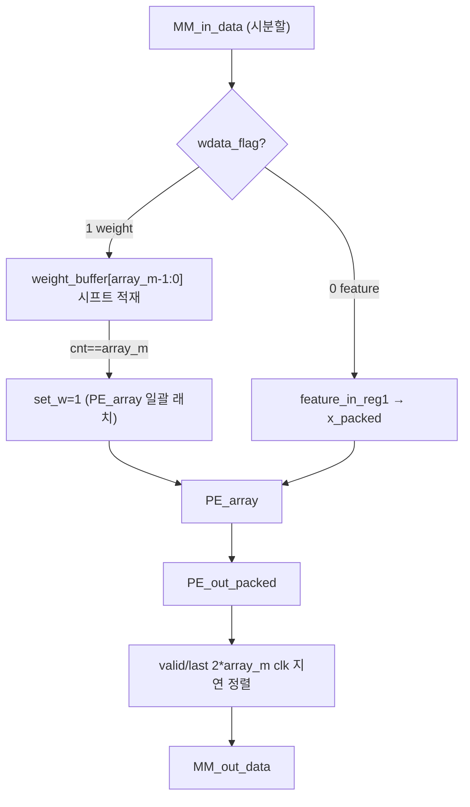
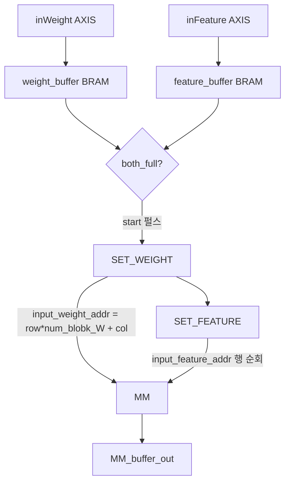
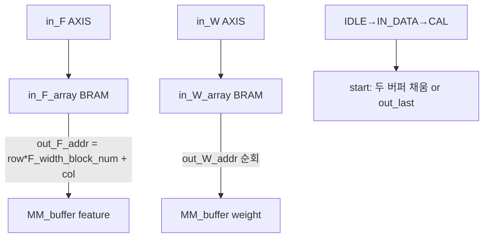
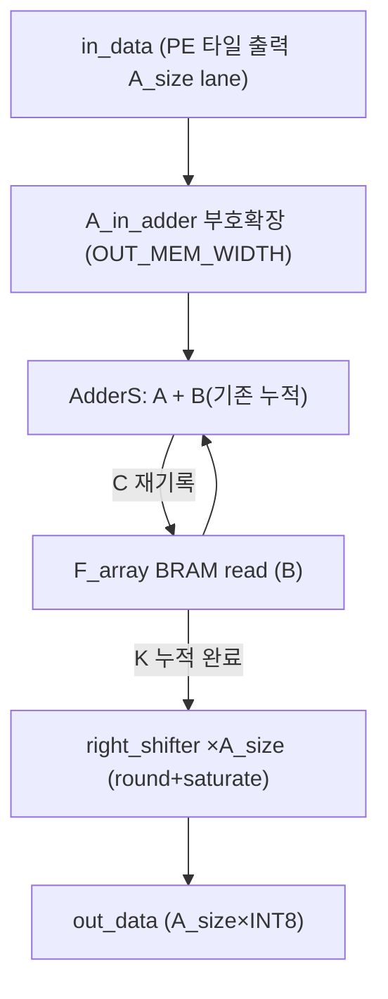
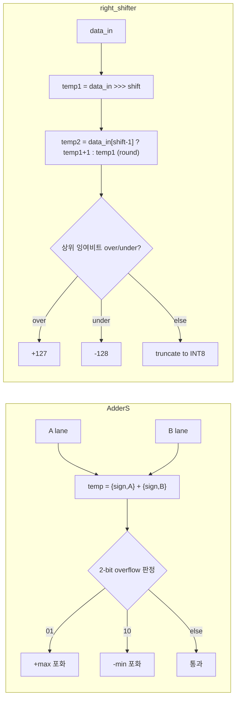
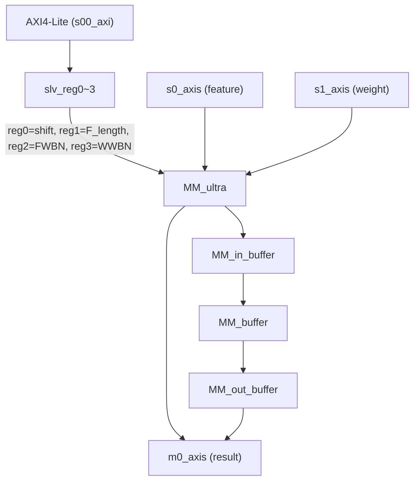
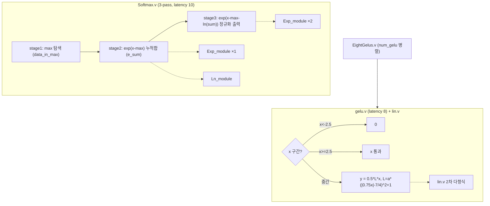

# Transformer-Accelerator-Based-on-FPGA 모듈 통합 가이드 (H-RTL 변형)

> 1차 요약(맥락): [`../Transformer-Accelerator-Based-on-FPGA.md`](../Transformer-Accelerator-Based-on-FPGA.md)
> 소스 루트: `REF/ViT-Accelerator/Transformer-Accelerator-Based-on-FPGA`. 본 가이드는 핸드라이트 RTL `src/`(완성 GEMM 코어) + `In Progress/src/`(미완 비선형)을 정본으로 삼고, `vitis/`·`sdk/`·`pynq/`는 검증·구동 SW로 처리한다.
> 표기 규약: 라인으로 직접 확인한 사실은 단정, 코드 정황 기반은 "추정", 코드/문서에 없으면 "확인 불가".
> 제외물(이름만): `prj.tcl`이 자동생성하는 Vivado BD(`design_1`), Xilinx IP(`axi_dma` 7.1, `smartconnect` 1.0, `axis_dwidth_converter` 1.1, `processing_system7` 5.5, `axi_interconnect` 2.1 — `prj.tcl` 참조만), 합성 산출물(`.bit/.hwh` — 리포에 없음).

---

## 0. 문서 머리말

### 0.1 대표 케이스 선정
이 코어는 한 종류의 데이터플로우(**INT8 weight-stationary 2D systolic GEMM**)만 완성돼 있다(README L2). 따라서 TATAA(이중모드)와 달리 대표 케이스는 **하나의 GEMM 타일**로 잡되, 실측 자극(testbench/SW)이 박혀 있는 형상을 대표로 쓴다.

- **대표 GEMM(완성 INT8)**: `sim/MM_Ultra_tb.sv` L14~L16의 자극 형상 **M=200, K=96, N=160**(IN_ROWS=200, IN_COLS=96, OUT_COLS=160), `A_size=16`(tb L3), `shift=9`(tb L21). 이것이 리포가 실제로 시뮬레이션한 대표 GEMM이다. (확인됨)
- **참조 검증 형상(HLS)**: `vitis/main.cpp` L5~L9 **M=121, K=311, N=72, R_shift=0** 랜덤행렬 soft vs hard bit-exact 비교. `vitis/Defines.h` L36 `A_SIZE=16`. (확인됨)
- **비선형 대표(미완)**: Softmax 3-pass(`Softmax.v` L78 stage 1/2/3) — division-free `exp(x-max-ln(Σexp))` 경로(`Softmax.v` L75~L76). LayerNorm 전용 top은 없고 `Ln_module`(자연로그)만 존재(미완 근거).

선정 근거: (1) testbench가 실제로 돌린 단위(200×96×160), (2) bit-exact 검증 가능한 단위(121×311×72). 두 케이스가 임의 타일을 `A_size` 배수로 패딩해 흘리는 동일 데이터플로우를 커버한다.

### 0.2 수치 표기 규약
- **MAC lanes**: PE 어레이의 동시 곱셈기 수 = `array_m × array_n` = `A_size²`. 한 PE가 1 INT8 MAC/cyc(`PE.v` L31 `psum_out <= psum_in + x_in*reg_w`). A_size=16이면 **256 MAC/cyc**, =24면 **576 MAC/cyc**, =25면 **625 MAC/cyc**. (소스별 A_size 비교는 §2·말미 결함표)
- **scalar MACs**: 대표 GEMM의 M·N·K 곱. 200×96×160 = **3,072,000 MAC**(패딩 전), 121×311×72 = **2,709,432 MAC**.
- **loop trips / cycle**: 타일 차원 곱 + FSM 반복. 한 weight 세트 처리 = weight 적재 `array_m` cyc + feature 스트리밍 `F_length`(=M) cyc; K-블록 누적은 `F_width_block_num`(=K/A_size)회, N-블록은 `W_width_block_num`(=N/A_size)회 반복(`MM_buffer.v` L92·L103, `MM_in_buffer.v` L91).
- **memory size (payload bit)**: 버퍼 배열 깊이×폭(bit). on-chip BRAM 각각.

### 0.3 운영 경로 (RTL ↔ vitis/sdk ↔ PYNQ-Z1)
```
[행렬 준비]   호스트가 A(feature)/B(weight)를 A_SIZE 배수로 0-패딩 (Matrix.cpp L13-16 / MM.py L16-24)
        │
[제어 설정]   AXI4-Lite로 4 레지스터 write: shift, F_length(=M), F_width_block_num(=K/A_size), W_width_block_num(=N/A_size)
              (MM.py L148-151 / Matrix.cpp soft·hard / MM_ultra_axi.v L445-448)
        │
[데이터무브]  결과 수신채널(S2MM) 먼저 open → feature DMA(MM2S) → weight DMA(MM2S)  (MM.py L152-154)
        │
[가속기]      MM_in_buffer(타일 재배열) → MM_buffer(SET_WEIGHT→SET_FEATURE FSM) → MM(weight 시프트 적재→set_w→feature 스트림)
              → PE_array(A_size² systolic) → MM_out_buffer(AdderS K-누적 + right_shifter 재양자화)
        │
[수신]        m0_axis → AXI DMA2 (S2MM) → DDR. 호스트는 S2MM IDLE 폴링 (MM.py L104-105)
```
근거: `MM_ultra.v` L118~L220(3단 결선), `MM.py` L114~L155, `prj.tcl` L43(MM_ultra_top module reference) + DMA0/1/2 결선(자동생성 BD).

### 0.4 타깃 / 데이터타입 / 재양자화 정책
- **타깃**: PYNQ-Z1 = Zynq-7000 `xc7z020clg400-1`, board `pynq-z1:1.0`(`prj.tcl` L53~L54). Vivado **2019.1** 강제(`prj.tcl` L23~L31, 버전 불일치 시 ERROR return). 클럭주파수·합성 PPA 리포트는 리포에 미동봉 → **확인 불가**.
- **데이터타입**: 입출력 signed **INT8**(`MM_ultra.v` L7 `data_width=8`, `vitis/Defines.h` L6 `DATA_TYPE s8`, L7~L8 MAX 127/MIN -128). PE 내부 누적 `2*data_width+log2_array_m` 비트(`PE.v` L16). out_buffer 누적 `OUT_MEM_WIDTH`(top=21 `MM_ultra_top.v` L12 / axi=32 `MM_ultra_axi.v` L13).
- **재양자화 정책**: out_buffer의 `right_shifter`가 누적값을 `shift`(런타임)만큼 **round-half-up 산술 우측시프트 후 INT8 saturate**(`right_shifter.v` L22~L43). 이 규칙은 SW 골든 `(temp+(1<<(R_shift-1)))>>R_shift`+clip(`Matrix.cpp` L90~L97, `MM.py` L42~L46)과 비트정합 → bit-exact 검증 가능.

---

## 1. Repo / Layer 개요

| 레이어 | 경로 | 역할 |
|---|---|---|
| **src** | `src/*.v` (12개) | 핸드라이트 Verilog. 완성 INT8 GEMM 코어. PE→PE_line→PE_array systolic + 버퍼 3단 + AdderS/right_shifter 재양자화 + AXI4-Lite/AXIS 래퍼. **HLS 아님.** |
| **In Progress/src** | `*.v` (10개) | ⚠ 미완 비선형 RTL. Softmax(3-pass) + Exp/Ln 보조 + GELU(piecewise 2차) + SIMD 래퍼. 메인 BD에 미통합(`prj.tcl`에 인스턴스 없음). |
| **vitis** | `vitis/*.cpp,*.h` | Vivado HLS/베어메탈 참조검증. `Matrix_mul_soft`(골든) vs `Matrix_mul_hard`(HW) bit-exact 비교. `A_SIZE=16`. |
| **sdk** | `sdk/*.c,*.h` | Zynq 베어메탈 SDK 드라이버. `Xil_Out32` 레지스터, 캐시 flush, DMA 직접 구동. `A_SIZE=24`. |
| **pynq** | `pynq/MM.py` | PYNQ Python 호스트. `allocate`+`MMIO`+3 DMA 구동. `A_SIZE=25`. |
| **sim** | `sim/*.sv` | testbench. GEMM tb는 soft 모델 vs RTL(`A_size=16`). In Progress tb 2개. |

- README 3개: 루트 `README.md`(목적·재현 5단계), `sdk/README.txt`·`vitis/README.txt`(존재만, 핵심 빌드절차 빈약 → 코드 리딩 의존).
- 자체 RTL 모듈 수: `src/` Verilog 12개 + `In Progress/src/` Verilog 10개 = **22개**. tb는 SystemVerilog 3개.

### 모듈 인스턴스 계층 (top → leaf)
```
[Vivado BD design_1] (prj.tcl 자동생성, 분석 제외)
├─ MM_ultra_top.v                       (module reference, prj.tcl L43)
│  └─ MM_ultra_axi.v                    (AXI4-Lite slave: slv_reg0~3)
│     └─ MM_ultra.v                     (3단 데이터패스 + 런타임 파라미터 래치)
│        ├─ MM_in_buffer.v              (외부 AXIS 수신 BRAM + 타일 재배열 주소생성, IDLE→IN_DATA→CAL)
│        ├─ MM_buffer.v                 (weight/feature 스테이징 BRAM + IDLE→SET_WEIGHT→SET_FEATURE FSM)
│        │  └─ MM.v                     (weight 시프트 적재 + set_w + feature 스트리밍)
│        │     └─ PE_array.v            (array_m×array_n + 입력 skew + 출력 de-skew)
│        │        └─ PE_line.v ×array_m (한 행 array_n PE, 가로 systolic)
│        │           └─ PE.v ×array_n   (단일 MAC 셀, weight-stationary)
│        └─ MM_out_buffer.v             (F_array BRAM K-누적 + 출력 FSM)
│           ├─ AdderS.v                 (A_size lane saturating 가산)
│           └─ right_shifter.v ×A_size  (round+saturate 재양자화)
├─ axi_dma_0 (feature MM2S)   ┐
├─ axi_dma_1 (weight  MM2S)   ├ Xilinx IP (제외)
└─ axi_dma_2 (result  S2MM)   ┘

[In Progress: 메인 BD 미통합, 별도 top]
Gelus_top.v → Gelus_axi.v → EightGelus.v → gelu.v ×num_gelu → lin.v
Softmax_top.v → Softmax_top_axi.v → Softmax_control.v → Softmax.v → {Exp_module.v ×2, Ln_module.v}
```

---

## 2. PE — 단일 MAC 셀 (`src/PE.v`)

### 2.1 역할 + 상위/하위 관계
weight-stationary systolic의 최소 단위. 가중치를 셀에 고정(`reg_w`)하고, feature(x)는 가로로 전파, 부분합(psum)은 세로로 누산. 상위: `PE_line`(가로 array_n개 체인). 하위: 없음(leaf, DSP/LUT MAC로 추론).

### 2.2 데이터플로우


### 2.3 인스턴스 계층
`PE_line`(generate ×array_n) → `PE`. `PE_array` → `PE_line`(generate ×array_m).

### 2.4 대표 코드 위치
`src/PE.v`(전문 35행).

### 2.5 대표 코드 블록

(1) **누적폭 = 곱(16b) + 행 누산 캐리(log2_array_m)** (`PE.v` L16, L18)
```verilog
input signed [2*data_width+log2_array_m-1:0]            psum_in,
output reg signed [2*data_width+log2_array_m-1:0]       psum_out
```
→ A_size=16이면 `2*8+4=20`비트. 곱 결과 16비트에 array_m개 세로 누산 캐리(log2_array_m) 여유. K가 array보다 크면 이 폭으로 부족 → 외부 out_buffer가 32(또는 21)비트로 재누산(§9).

(2) **weight-stationary MAC 본체** (`PE.v` L28~L33)
```verilog
else begin
    if(set_w)
        reg_w <=w;            // set_w=1 때만 가중치 래치
    psum_out <= psum_in + x_in*reg_w;  // 매 클럭 MAC
    x_out <= x_in;            // feature 1clk 지연 가로 전파
end
```
→ `set_w`로 가중치 적재 후, feature 스트림 동안 곱-누산. `x_out`이 다음 PE로 전달돼 systolic 가로 흐름 형성.

### 2.6 마이크로아키텍처 + 정량
- **처리량**: 1 INT8 MAC/cyc/PE. 어레이 전체 = `A_size²` MAC/cyc.
- **A_size 소스별(MAC lanes)**: README/Vitis/tb=16 → **256**, SDK/RTL param default=24 → **576**, PYNQ=25 → **625**. (불일치는 말미 결함표)
- **병목**: `x_in*reg_w`(16b)와 `psum_in`(20b) 가산이 1clk 안에 — 작은 A_size에선 무난하나 누적폭이 PE 내부에서 작아 K 누적은 반드시 out_buffer에 위임.

---

## 3. PE_line / PE_array — 2D systolic 격자 (`src/PE_line.v`, `src/PE_array.v`)

### 3.1 역할 + 상위/하위
- `PE_line`(L3~L56): array_n개 PE를 가로로 묶어 한 행 구성. `x`가 `x_array[0]`로 들어와 PE 체인을 좌→우 전파.
- `PE_array`(L3~L129): array_m개 PE_line을 세로로 쌓아 `array_m×array_n` 격자 + 입력 skew/출력 de-skew 버퍼. 상위: `MM`.

### 3.2 데이터플로우


### 3.3 인스턴스 계층
`MM` → `PE_array` → (skew 버퍼 generate) → `PE_line` ×array_m → `PE` ×array_n.

### 3.4 대표 코드 위치
`src/PE_array.v`(전문 129행), `src/PE_line.v`(전문 56행).

### 3.5 대표 코드 블록

(1) **가로 systolic — x를 PE 체인으로 전파** (`PE_line.v` L25, L48~L52)
```verilog
assign x_array[0]=x;
...
PE_u( ... .x_in(x_array[i]), ... .x_out(x_array[i+1]), .psum_out(psum_out_array[i]) );
```
→ `x_array[i]→PE→x_array[i+1]`로 feature가 한 행 안에서 좌→우로 1clk씩 전파(systolic).

(2) **입력 skew — i행 feature를 i clk 지연** (`PE_array.v` L91~L108, L121)
```verilog
else begin
    reg [data_width-1:0] x_buf [i-1:0];
    ... x_buf[0]<=x_array[i]; ...      // 1단
    for (k=1;k<=i-1;k=k+1) ... x_buf[k]<=x_buf[k-1]; // i-1단 추가
    PE_line_u ( .x(x_buf[i-1]), ... ); // i clk 지연된 feature 주입
```
→ 0행은 무지연, i행은 i clk 지연 → 데이터 대각 정렬(systolic 입력 skew의 교과서 구현).

(3) **출력 de-skew — 열별 지연으로 동시 정렬** (`PE_array.v` L34~L58)
```verilog
for(i=array_n-1;i>=0;i=i-1) begin: buf_out
    if(i==array_n-1) assign PE_out_packed[...] = psum_in_packed_last[...]; // 마지막 열 지연 0
    else begin
        reg [...] out_buf [array_n-2-i:0];
        ... out_buf[0]<=psum_in_packed_last[...]; ... out_buf[k]<=out_buf[k-1];
        assign PE_out_packed[...] = out_buf[array_n-2-i]; // 열 인덱스만큼 지연
```
→ 마지막 행에서 열별로 어긋나 나온 부분합을 열 인덱스 역순 지연으로 한 시점에 정렬.

### 3.6 마이크로아키텍처 + 정량
- **격자**: `array_m×array_n = A_size²` PE. psum 체인 시작 0(`PE_array.v` L61), array_m번째 출력이 최종.
- **skew 깊이**: 입력 x 지연 0~(array_m-1) clk, 출력 de-skew 0~(array_n-2) clk. A_size=16이면 최대 15·14 clk.
- **재사용**: 가중치는 array에 머무는 동안(weight-stationary) feature M행을 연속 스트림 → 가중치 재사용 = M(F_length).
- **병목**: skew 버퍼가 generate로 행/열마다 시프트 레지스터를 만들어 A_size가 커질수록 FF/면적 2차 증가. PYNQ A_size=25(비 2의 거듭제곱)는 `clogb2`(log2_array_m) 산정에 영향(말미 결함표).

---

## 4. MM — 가중치 적재 + feature 스트리밍 (`src/MM.v`)

### 4.1 역할 + 상위/하위
`PE_array`를 감싸 단일 입력포트(`MM_in_data`)로 weight와 feature를 시분할 주입. weight를 시프트 레지스터로 array_m행 채운 뒤 `set_w` 펄스로 일괄 래치, 이어 feature를 스트림. 상위: `MM_buffer`. 하위: `PE_array`.

### 4.2 데이터플로우


### 4.3 인스턴스 계층
`MM_buffer` → `MM` → `PE_array`.

### 4.4 대표 코드 위치
`src/MM.v`(전문 219행).

### 4.5 대표 코드 블록

(1) **weight/feature 시분할 + set_w 생성** (`MM.v` L75~L77)
```verilog
assign weight_in  = (wdata_flag & MM_in_data_valid) ? MM_in_data : 0;
assign feature_in = ((~wdata_flag) & MM_in_data_valid)? MM_in_data : 0;
assign set_w = (weight_buffer_cnt==array_m) ? 1:0;
```
→ `wdata_flag`가 1이면 weight, 0이면 feature. array_m개 weight가 차면 set_w 펄스.

(2) **weight 시프트 레지스터 적재** (`MM.v` L128~L147)
```verilog
... weight_buffer[0]<=weight_in; ...           // 새 행 입력
for(j=1;j<array_m;j=j+1) ... weight_buffer[j]<=weight_buffer[j-1]; // 시프트
```
→ 한 포트로 들어온 array_m행을 차례로 밀어넣어 PE_array w_packed로 동시 공급. 행 매핑은 역순(`MM.v` L69 `weight_buffer[array_m-1-i]`, 주석 "첨자 역순 주의").

(3) **array 통과 latency 보상 — 2*array_m 지연** (`MM.v` L51, L155~L164)
```verilog
reg MM_out_data_valid_reg_array [2*array_m:0];
...
for(i=1;i<=array_m*2;i=i+1) ... MM_out_data_valid_reg_array[i]<=MM_out_data_valid_reg_array[i-1];
assign MM_out_data_valid = MM_out_data_valid_reg_array[2*array_m];
```
→ 입력 skew + array 통과 + 출력 de-skew 합 latency를 2*array_m clk로 보정해 valid/last를 출력 데이터에 정렬.

### 4.6 마이크로아키텍처 + 정량
- **weight 적재 비용**: array_m clk/세트(시프트 레지스터). feature 스트림 = F_length(=M) clk.
- **재양자화 위치**: 이 모듈 내 `right_shifter` 인스턴스는 **주석 처리**(`MM.v` L201~L216), `data_out = PE_out_packed`(L218). 재양자화는 out_buffer에서 수행 — 즉 PE 출력은 풀-정밀 부분합.
- **병목**: weight 적재(array_m clk)와 feature 스트림이 직렬. 더블버퍼/오버랩 없음 → 매 weight 세트 교체마다 array_m clk 버블.

---

## 5. MM_buffer — feature/weight 스테이징 + FSM (`src/MM_buffer.v`)

### 5.1 역할 + 상위/하위
weight/feature를 각각 BRAM에 모은 뒤 IDLE→SET_WEIGHT→SET_FEATURE 3-state FSM으로 MM에 순차 공급. weight를 블록 전치 순서로 읽어 systolic 적재 포맷 정렬. 상위: `MM_ultra`. 하위: `MM`.

### 5.2 데이터플로우


### 5.3 인스턴스 계층
`MM_ultra` → `MM_buffer` → `MM`.

### 5.4 대표 코드 위치
`src/MM_buffer.v`(전문 359행).

### 5.5 대표 코드 블록

(1) **both_full → start (배치 트리거)** (`MM_buffer.v` L92, L104, L137~L140)
```verilog
assign both_full = (weight_buffer_cnt == total_WL_reg) & (feature_buffer_cnt == FL_reg);
assign start_ahead1 = both_full & (~both_full_delay1); // rising edge
... start <= start_ahead1;
```
→ weight·feature 양쪽 버퍼가 다 차야 계산 시작(배치형). HG-PIPE류 스트리밍과 대비되는 한계(말미).

(2) **weight 블록 전치 주소** (`MM_buffer.v` L103)
```verilog
assign input_weight_addr = input_weight_row * num_blobk_W + input_weight_col;
```
→ `row*num_blobk_W + col`로 weight를 블록 전치 순서로 읽어 systolic 적재 포맷에 맞춤. `num_blobk_W`=W_width_block_num(=N/A_size).

(3) **3-state FSM** (`MM_buffer.v` L219~L236)
```verilog
else begin
    case ({weight_flag_up, set_w_delay1,total_last})
        3'b100: state <= `SET_WEIGHT;
        3'b010: state <= `SET_FEATURE;
        3'b001: state <= `IDLE;
```
→ `SET_WEIGHT`(set_w 완료) → `SET_FEATURE`(feature 스트림) → `total_last`(weight 세트 종료) → IDLE.

### 5.6 마이크로아키텍처 + 정량
- **버퍼 깊이**: `feature_buffer_depth = 2^F_length_width`(`MM_buffer.v` L37; F_length_width=10이면 1024라인). `weight_buffer_depth = 2^W_width_block_num_width * array_m`(L39).
- **memory(payload bit)**: feature_buffer = `array_m*data_width × 1024`라인. A_size=16이면 128b×1024 = **128 Kb**(추정, F_length_width=10). weight_buffer = `array_m*data_width × 2^W_width_block_num_width*array_m`(W_width_block_num_width=5/6에 따라 가변).
- **병목**: both_full 배치 동기화 → load·compute 미오버랩. 한 weight 세트당 IDLE 진입 버블.

---

## 6. MM_in_buffer — AXIS 수신 + 타일 재배열 (`src/MM_in_buffer.v`)

### 6.1 역할 + 상위/하위
외부 AXIS feature/weight를 BRAM에 적재하고, MM_buffer가 요구하는 타일 순서로 재출력. K-블록 단위 순회로 같은 feature 행 블록을 여러 weight 열 블록에 재사용. 상위: `MM_ultra`. 하위: 없음(BRAM leaf).

### 6.2 데이터플로우


### 6.3 인스턴스 계층
`MM_ultra` → `MM_in_buffer`.

### 6.4 대표 코드 위치
`src/MM_in_buffer.v`(전문 268행). 기본 `A_size=24`(L9).

### 6.5 대표 코드 블록

(1) **feature 타일 재배열 주소 — K-블록 순회** (`MM_in_buffer.v` L91)
```verilog
assign out_F_addr = out_F_row_addr * F_width_block_num + out_F_col_addr;
```
→ feature 행렬을 K-블록(`F_width_block_num`) 열 단위로 순회. 같은 행 블록을 여러 weight 열 블록에 재사용 → feature 재사용.

(2) **타일링 차원(블록 수) 산정** (`MM_in_buffer.v` L98~L109)
```verilog
F_block_size <= F_length * F_width_block_num;            // feature 총 블록 수
temp_m <= F_width_block_num * A_size;
W_block_size <= W_width_block_num * temp_m;              // weight 총 블록 수
```
→ M·K·N 블록 수가 여기서 결정. K차원은 `F_width_block_num`, N차원은 `W_width_block_num`.

(3) **3-state FSM + start 조건** (`MM_in_buffer.v` L92~L94, L130~L142)
```verilog
assign start = ((in_F_cnt == F_block_size & in_W_cnt == W_block_size) | MM_buffer_out_last)
                & (out_F_col_addr!=F_width_block_num);
```
→ 두 버퍼가 다 차거나(첫 타일) 이전 타일 출력 완료(`MM_buffer_out_last`) 시 다음 N-블록 계산 시작.

### 6.6 마이크로아키텍처 + 정량
- **memory(payload bit)**: in_F_array = `A_size*data_width × IN_Feature_Block_num`. A_size=24, data_width=8, IN_Feature_Block_num=2400이면 192b×2400 = **약 450 Kb**(추정). in_W_array 동일 규모.
- **재사용 패턴**: feature 행 블록을 N-블록(W_width_block_num)만큼 재사용. K-블록 누적은 out_buffer가 담당.
- **병목**: `clogb2`로 BRAM addr폭 산정(L62~L64) — A_size=25 등 비2승 깊이는 주소 계산 검증 필요.

---

## 7. MM_out_buffer — K-누적 + 재양자화 ★ (`src/MM_out_buffer.v`)

### 7.1 역할 + 상위/하위
**K차원 분할 누적과 INT8 재양자화의 핵심.** PE_array 타일 출력을 부호확장 후 기존 누적값과 saturating 가산(AdderS)해 F_array BRAM에 재기록, K-블록(`W_width_block_num`회) 누적 완료 후 right_shifter로 INT8 변환·출력. 상위: `MM_ultra`. 하위: `AdderS`, `right_shifter`×A_size.

### 7.2 데이터플로우


### 7.3 인스턴스 계층
`MM_ultra` → `MM_out_buffer` → {`AdderS`, `right_shifter`×A_size}.

### 7.4 대표 코드 위치
`src/MM_out_buffer.v`(전문 331행). 기본 `OUT_MEM_WIDTH=32`(L7), `A_size=2`(L8, 인스턴스에서 override).

### 7.5 대표 코드 블록

(1) **부분합 누적 — read-modify-write** (`MM_out_buffer.v` L246~L258)
```verilog
always @(posedge clk) begin  //write port
    if(in_data_valid)
        F_array[in_F_array_addr] <= in_F_array_data; // C 기록
...
always @(*) begin
    if(in_data_valid) in_F_array_data = C; else in_F_array_data = 0; // C = A + B
```
→ 같은 출력 위치 누적값 B(BRAM read, L269)와 새 타일 A를 AdderS로 더해 C를 다시 기록. K-블록 수만큼 반복 누적.

(2) **A 부호확장 → AdderS saturating 가산** (`MM_out_buffer.v` L300~L315)
```verilog
AdderS #( .data_width(OUT_MEM_WIDTH), .A_size(A_size) ) U_Adders ( .A(A_in_adder), .B(B), .C(C) );
generate for(i=0;i<A_size;i=i+1)
    assign A_in_adder[i*OUT_MEM_WIDTH +: OUT_MEM_WIDTH] = $signed(A[i*(log2_array_m+data_width*2) +: (log2_array_m+data_width*2)]);
```
→ PE 출력(20b)을 OUT_MEM_WIDTH(32/21b)로 부호확장 후 누적 → INT 오버플로 안전(AdderS 포화).

(3) **재양자화 — A_size lane 병렬 right_shifter** (`MM_out_buffer.v` L317~L330)
```verilog
generate for(i=0;i<A_size;i=i+1)begin:right_shifter_u
    right_shifter #( .before_data_width(OUT_MEM_WIDTH), .after_data_width(data_width), .shift_width(shift_width) )
    u_right_shifter( .shift(shift), .data_in(out_F_data_delay1[i*OUT_MEM_WIDTH +: OUT_MEM_WIDTH]), .data_out(shifted_data[i*data_width+:data_width]) );
```
→ 누적 완료값을 A_size개 right_shifter로 동시에 round+saturate → INT8 출력.

(4) **출력 주소 — 열블록·행 순** (`MM_out_buffer.v` L88, L274)
```verilog
assign out_data_addr = out_data_col_addr * F_length + out_data_row_addr;
out_F_block_size <= F_length * W_width_block_num;
```
→ 결과 행렬을 N-블록(col) × M(row) 순으로 송출. 한 출력 블록 크기 = F_length×W_width_block_num.

### 7.6 마이크로아키텍처 + 정량
- **memory(payload bit)**: F_array = `A_size*OUT_MEM_WIDTH × OUT_Feature_Block_num`. A_size=16, OUT_MEM_WIDTH=21, OUT_Feature_Block_num=2400이면 336b×2400 = **약 786 Kb**(추정). OUT_MEM_WIDTH가 top=21/axi=32로 달라 면적 영향(말미).
- **재양자화 레인**: A_size개 right_shifter 병렬(=출력 1행/clk).
- **누적 latency**: AdderS는 조합(`AdderS.v` 비레지스터), BRAM read 1clk + 가산 + write로 RMW 1~2clk 파이프(L262~L267 read port). K-블록 깊이만큼 직렬.
- **병목**: F_array는 `(*ram_style="block"*)`(L47) 강제 BRAM. read-modify-write 누적이 같은 주소에 반복 → 누적 의존으로 K차원 병렬화 불가(시간 직렬). OUT_MEM_WIDTH 폭이 작으면(21b) 큰 K에서 누적 오버플로 위험(AdderS 포화로 정확도 손실 가능).

---

## 8. AdderS / right_shifter — 산술 보조 (`src/AdderS.v`, `src/right_shifter.v`)

### 8.1 역할 + 상위/하위
- `AdderS`(전문 40행): A_size lane 병렬 saturating 가산기. 누적 오버플로 클램프. 상위: `MM_out_buffer`.
- `right_shifter`(전문 47행): round-half-up + saturate 우측시프트(재양자화 산술 코어). 상위: `MM_out_buffer`(A_size 인스턴스).

### 8.2 데이터플로우


### 8.3 인스턴스 계층
`MM_out_buffer` → `AdderS`(×1, data_width=OUT_MEM_WIDTH) + `right_shifter`(×A_size).

### 8.4 대표 코드 위치
`src/AdderS.v`, `src/right_shifter.v`.

### 8.5 대표 코드 블록

(1) **AdderS — 더블 부호비트로 오버플로 판정** (`AdderS.v` L24~L35)
```verilog
assign temp[i] = {A[(i+1)*data_width-1],A[i*data_width +: data_width]}
               + {B[(i+1)*data_width-1],B[i*data_width +: data_width]}; // sign 1b 확장
...
case (temp[i][data_width:data_width-1])
    2'b01: C[...] = {1'b0,{(data_width-1){1'b1}}};   // +max
    2'b10: C[...] = {1'b1,{(data_width-1){1'b0}}};   // -min
    default: C[...] = temp[i][data_width-1:0];
```
→ 상위 2비트(sign-extended)로 양/음 오버플로 검출 후 포화.

(2) **right_shifter — round-half-up + saturate** (`right_shifter.v` L22~L43)
```verilog
assign temp1_out = data_in >>> shift;                          // 산술 우측시프트
assign temp2_out = data_in[shift-1] ? temp1_out + 1 : temp1_out; // 버림 MSB로 round
wire under_min = temp2_out[before_data_width-1] & (~(& temp2_out[before_data_width-2:after_data_width-1]));
wire over_max  = (~temp2_out[before_data_width-1]) & (|temp2_out[before_data_width-2:after_data_width-1]);
... 2'b10: data_out = {1'b1,{(after_data_width-1){1'b0}}};  // -128
    2'b01: data_out = {1'b0,{(after_data_width-1){1'b1}}};  // +127
    default: data_out = temp2_out[after_data_width-1:0];
```
→ `shift==0` 특수경로(L32~L37) 별도. SW 골든 `(temp+(1<<(R_shift-1)))>>R_shift`+clip(`Matrix.cpp` L90~L97)과 비트정합.

### 8.6 마이크로아키텍처 + 정량
- **AdderS**: A_size lane 전부 조합(레지스터 없음). 1clk 안 누적 가산.
- **right_shifter**: shift 단일값을 A_size lane에 broadcast. per-channel scale 미지원(말미: 우리 ViT 확장 시 lane별 벡터화 필요).
- **병목**: 조합 saturating 비교 경로가 A_size lane 병렬 → A_size·OUT_MEM_WIDTH 클수록 LUT 증가, 타이밍 영향(out_buffer의 `out_F_data_delay1` 1clk 버퍼 L168~L173로 완화).

---

## 9. MM_ultra / MM_ultra_axi / MM_ultra_top — 계층 + AXI (`src/MM_ultra*.v`)

### 9.1 역할 + 상위/하위
- `MM_ultra`(L4~L221): in_buffer→MM_buffer→out_buffer 3단 결선 + 4개 런타임 파라미터(shift/F_length/F_width_block_num/W_width_block_num) 입력변화 감지 래치.
- `MM_ultra_axi`(L4~L468): AXI4-Lite slave(slv_reg0~3) + 3 AXIS 포트를 MM_ultra에 직결.
- `MM_ultra_top`(L3~L129): 얇은 포트 래퍼(BD module reference). 상위: Vivado BD(제외).

### 9.2 데이터플로우


### 9.3 인스턴스 계층
BD → `MM_ultra_top` → `MM_ultra_axi` → `MM_ultra` → {MM_in_buffer, MM_buffer, MM_out_buffer}.

### 9.4 대표 코드 위치
`src/MM_ultra.v`, `src/MM_ultra_axi.v`, `src/MM_ultra_top.v`.

### 9.5 대표 코드 블록

(1) **AXI4-Lite 4 레지스터 매핑** (`MM_ultra_axi.v` L445~L448)
```verilog
.shift_in(slv_reg0),
.F_length_in(slv_reg1),          //1 ~ block_num *A_size  (= M)
.F_width_block_num_in(slv_reg2), //1 ~ block_num          (= K/A_size)
.W_width_block_num_in(slv_reg3), //1 ~ block_num          (= N/A_size)
```
→ SW의 4개 write(`MM.py` L148~L151, `Matrix.cpp`)가 정확히 이 레지스터. 오프셋 0x0/0x4/0x8/0xC(`sdk/defines.h` L7~L10).

(2) **런타임 파라미터 — 입력변화 감지 래치** (`MM_ultra.v` L66~L98)
```verilog
initial begin shift = {(shift_width){1'b1}}; ... end  // 초기값 all-1
always @(posedge clk) if(shift_in_delay1 != shift_in) shift <= shift_in; // 변화 시만 갱신
```
→ AXI write로 값이 바뀔 때만 코어 파라미터 갱신(글리치 방지). 임의 M/K/N 런타임 조절.

(3) **A_size 결정 — 핵심 파라미터 전파** (`MM_ultra_axi.v` L429, `MM_ultra.v` L6, L55)
```verilog
// MM_ultra_axi.v: parameter integer array_size=24;  → .A_size(array_size)
// MM_ultra.v:     parameter integer A_size = 16;     localparam log2_array_m = clogb2(A_size);
```
→ ⚠ **MM_ultra 내부 기본값=16이지만 상위 MM_ultra_axi/top 기본값=24가 override.** 합성 시 실제 A_size = MM_ultra_top 파라미터(=24 기본). 이것이 A_SIZE 불일치의 RTL측 근원(말미 결함표).

### 9.6 마이크로아키텍처 + 정량
- **AXI 폭**: 데이터 AXIS = `array_size*data_width`. A_size=16이면 128b, =24면 192b(`MM_ultra_top.v` L29). DMA(32/64b)와 `axis_dwidth_converter`로 정합(BD).
- **레지스터 폭**: AXI4-Lite 32b ×4(`MM_ultra_axi.v` L133~L136). ADDR_LSB=2(L127).
- **3 DMA**: feature MM2S(DMA0), weight MM2S(DMA1), result S2MM(DMA2) — `sdk/defines.h` L16/L22/L28 매핑.
- **병목**: 단일 PE array·단일 제어. 멀티헤드/멀티 array 병렬 없음. 폴링 동기화(인터럽트 없음).

---

## 10. In Progress — 비선형 연산자 (⚠ 미완, `In Progress/src/`)

### 10.1 역할 + 상위/하위
> README L3 "정확도/성능 개선 중" 명시. 메인 BD(`prj.tcl`)에 인스턴스 **없음** → 미통합. RTL은 동작 수준이나 검증·통합 미완. Softmax(3-pass) + Exp/Ln + GELU(piecewise 2차) + SIMD 래퍼. **LayerNorm 전용 top 없음**(Ln_module만).

### 10.2 데이터플로우


### 10.3 인스턴스 계층
`Gelus_top` → `Gelus_axi` → `EightGelus` → `gelu`×num_gelu → `lin`. `Softmax_top` → `Softmax_top_axi` → `Softmax_control` → `Softmax` → {`Exp_module`×2, `Ln_module`}.

### 10.4 대표 코드 위치
`Softmax.v`, `Exp_module.v`, `Ln_module.v`, `gelu.v`, `lin.v`, `EightGelus.v`, `Softmax_control.v`.

### 10.5 대표 코드 블록

(1) **division-free Softmax — ln 빼고 다시 exp** (`Softmax.v` L75~L76, L78)
```verilog
assign x_max_ln_S10Q10 = x_max_S9Q10_delay6 - $signed({7'b000_0000,ln_U3Q10}); // (x-max) - ln(sum)
assign x_max_ln_S9Q10  = ... ;  // 포화 처리
assign stage = cnt<=(length-1) ? 1 : (length-1<cnt && cnt<=lengthX2-1 ? 2 : 3); // 3-pass
```
→ `softmax = exp(x-max-ln(Σexp))`로 제수기 제거. Exp_module 2개(분자 stage2용 + 정규화 stage3용)·Ln_module 1개(분모) 인스턴스(`Softmax.v` L214~L233).

(2) **Exp_module — 2^(x·log2e) 분해** (`Exp_module.v` L10, L19~L30, L36)
```verilog
assign x_log2e_S10Q14 = x_S9Q10 * 6'sd23;          // x·log2e (23/16 근사)
wire [9:0] x_int_10Q0   = x_log2e_U10Q14_abs[23:14]; // 정수부
wire [14:0] temp_1Q14 = 15'b100_0000_0000_0000 - {2'b0,x_decimal_0Q14[13:1]}; // 1+0.5*frac
assign temp_2_int_1Q11 = 12'b1000_0000_0000 >> x_int_4Q0; // 2^-int = 시프트
wire [26:0] temp_y_2Q25 = temp_2_int_1Q11_reg1 * temp_1Q14_reg1; // 2^x
```
→ 정수부=시프트, 소수부=1차 근사(1+0.5·frac), 곱으로 2^x. LUT-free, latency 3.

(3) **Ln_module — priority encoder + 선형 근사** (`Ln_module.v` L14~L47, L57)
```verilog
if (x_U8Q8[15]==1'b1)begin w = 7; k_1_0Q15 = x_U8Q8[14:0]; end // MSB 위치 = 정수부 지수
... else begin w = 0; k_1_0Q15 = {x_U8Q8[7:0],7'b0000000}; end
wire [17:0] k_1_w_3Q15 = {w,k_1_0Q15};
assign P_3Q19 = k_1_w_3Q15_reg1 * 4'b1011; // (w,k)·상수(11) 선형 근사
```
→ leading-1 위치 w(지수) + 정규화 가수 k → 선형 근사 ln. latency 2.

(4) **GELU — piecewise 2차** (`gelu.v` L88~L107, `lin.v` L19~L33)
```verilog
// lin.v: L = a*(|0.75x|-7/4)^2 + 1   (a=-37/128, b=7/4)
wire signed [6:0] a_0Q7 = -7'sd37;  wire signed [3:0] b_1Q2 = 4'sb0111;
wire signed [25:0] l_4Q21 = a_0Q7*temp_4Q14_reg1 + 23'sb0_1_0_...; // a*(.)^2 + 1
// gelu.v: y = 0.5*L*x, 구간 클램프
if(x_reg7[7]==1'b1 && x_in_8Q7_reg7<=_c_2_5_2Q7) y = 0;        // x<-2.5 → 0
else if(x_reg7[7]==1'b0 && x_in_8Q7_reg7 >= c_2_5_2Q7) y = x_reg7; // x>=2.5 → x
else y = (y_3Q7>>>(3'd7-in_scale_reg7));                        // 중간 → 다항식
```
→ 3구간 piecewise 2차 근사. `out = half_L*x`(`gelu.v` L90).

(5) **EightGelus — SIMD 병렬** (`EightGelus.v` L107~L116)
```verilog
generate for(i=0;i<num_gelu;i=i+1)begin
    gelu u_gelu( .clk(clk), .in_scale(scale), .x(in_data_delay1[i*8+7:i*8]), .y_reg1(out_data[i*8+7:i*8]) );
```
→ num_gelu개 gelu lane 병렬 + valid/last/keep 9단 지연 동기화(L43~L105).

### 10.6 마이크로아키텍처 + 정량
- **고정소수점 포맷**: 신호명에 명시(S9Q10, U8Q12, U0Q25 등 `Softmax.v` L35~L72). 정량 오차 미문서화 → **확인 불가**.
- **Softmax 파이프라인**: 10단(valid/stage delay 1~10, `Softmax.v` L43~L52, L140~L151). 입력버퍼 1024 deep(`Softmax_control.v` L38).
- **latency**: Exp=3(`Exp_module.v` L2), Ln=2(`Ln_module.v` L2), gelu=8(`gelu.v` L2), lin=4(`lin.v` L1), EightGelus 9단 동기(`EightGelus.v` L43).
- **병목**: 다항/LUT 근사 정확도 미보증. LayerNorm 데이터패스 부재. 메인 GEMM과 미통합(별도 top/tb만).

---

## 11. 한눈 요약 표

| # | 모듈 | 파일 | 역할 | 대표 정량 | 비고 |
|---|---|---|---|---|---|
| 2 | PE | `src/PE.v` | 단일 MAC(weight-stationary) | 1 MAC/cyc, 누적 2*dw+log2_m(=20b@16) | leaf |
| 3 | PE_line/PE_array | `src/PE_line.v`/`PE_array.v` | 2D systolic + skew/de-skew | A_size² MAC/cyc, skew 0~A_size-1 clk | 교과서적 |
| 4 | MM | `src/MM.v` | weight 적재+feature 스트림 | 적재 array_m clk, 지연보상 2*array_m | right_shifter 주석처리 |
| 5 | MM_buffer | `src/MM_buffer.v` | 스테이징 FSM(3-state) | feature_buf 2^10라인 | both_full 배치형 |
| 6 | MM_in_buffer | `src/MM_in_buffer.v` | AXIS 수신+타일 재배열 | in_F/W_array ~450 Kb(A=24) | K-블록 순회 |
| 7 | MM_out_buffer | `src/MM_out_buffer.v` | K-누적+재양자화 ★ | F_array ~786 Kb(A=16,21b) | RMW 누적, OUT_MEM_WIDTH 21/32 |
| 8 | AdderS/right_shifter | `src/AdderS.v`/`right_shifter.v` | saturating 가산/재양자화 | A_size lane 병렬, 조합 | bit-exact SW정합 |
| 9 | MM_ultra* | `src/MM_ultra*.v` | 계층+AXI4-Lite/AXIS | AXIS A_size*8 b, reg ×4 | A_size 16(내부)/24(상위) |
| 10 | In Progress | `In Progress/src/*.v` | 비선형(미완) | Softmax 10단, Exp/Ln/gelu | 미통합·미보증 |

---

## 12. 읽기 · 코드추적 순서

1. **README.md** → 목적·보드·재현 5단계.
2. **PE.v → PE_line.v → PE_array.v**: systolic 격자 골격(가장 작은 단위부터). skew/de-skew(`PE_array.v` L34~L127)가 핵심.
3. **MM.v**: weight 적재(set_w)·feature 시분할(L75~L77).
4. **MM_buffer.v → MM_in_buffer.v**: FSM·타일 주소생성(K/N 블록 순회).
5. **MM_out_buffer.v → AdderS.v → right_shifter.v**: K-누적+재양자화(데이터플로우 종착점).
6. **MM_ultra.v → MM_ultra_axi.v → MM_ultra_top.v**: 결선·AXI 매핑(A_size 전파 추적 필수).
7. **vitis/Matrix.cpp + sim/MM_Ultra_tb.sv**: SW 골든·자극으로 동작 검증(round+clip 정합).
8. **In Progress**: 마지막. 미통합·미보증.

---

## 13. 병목 · 병렬도 노브

| 노브 | 위치 | 효과 |
|---|---|---|
| **A_size** | `MM_ultra_top.v` L6 `array_size` | MAC lanes = A_size² (공간 병렬). 단 skew FF·BRAM폭·AXIS폭 2차 증가. ★합성·SW 일치 필수 |
| **OUT_MEM_WIDTH** | `MM_ultra_top.v` L12(21)/`axi` L13(32) | 누적폭. 작으면 큰 K에서 오버플로 포화 손실 |
| **F_length_width** | 파라미터 | feature_buffer 깊이(2^width) = 최대 M |
| **F/W_width_block_num** | 런타임 AXI 레지스터 | K/N 타일 수(시간 누적/반복) |
| **shift** | 런타임 reg0 | 재양자화 스케일(정확도) |
| **num_gelu** | `EightGelus.v` L5 | GELU SIMD lane 수(미완) |

**구조적 병목**: (1) both_full 배치 동기화(`MM_buffer.v` L92) → load·compute 미오버랩(더블버퍼 부재). (2) MM_out_buffer RMW K-누적이 같은 주소 의존 → K차원 시간 직렬. (3) 단일 PE array·폴링 동기화 → 멀티헤드/저지연 부적합. (4) weight 세트 교체마다 array_m clk 적재 버블.

---

## 14. 결함 · 미완 모듈 (A_SIZE 불일치 재확인 포함)

### 14.1 A_SIZE 불일치 — 재확인 결과 (중대)
1차 요약의 리스크를 라인 단위로 재확인. **5개 소스에서 4개 값으로 제각각**:

| 소스 | 값 | 근거(파일:라인) |
|---|---|---|
| README | 16 | `README.md` L2 "now it is 16X16" |
| **RTL MM_ultra 내부** | **16** | `src/MM_ultra.v` L6 `parameter integer A_size = 16` |
| **RTL MM_ultra_axi 상위(override)** | **24** | `src/MM_ultra_axi.v` L7 `parameter integer array_size=24` |
| **RTL MM_ultra_top 상위(최종 합성값)** | **24** | `src/MM_ultra_top.v` L6 `parameter integer array_size=24` |
| RTL MM_in_buffer 내부 default | 24 | `src/MM_in_buffer.v` L9 `parameter integer A_size = 24` |
| SDK | 24 | `sdk/defines.h` L30 `#define A_SIZE 24` |
| PYNQ | 25 | `pynq/MM.py` L5 `A_SIZE = 25` |
| Vitis(HLS 검증) | 16 | `vitis/Defines.h` L36 `#define A_SIZE 16` |
| sim testbench | 16 | `sim/MM_Ultra_tb.sv` L3 `` `define A_size 16 `` |

**핵심 발견(신규)**: RTL 내부에서도 계층 간 default가 어긋난다 — `MM_ultra.v`는 16이지만 상위 `MM_ultra_axi.v`/`MM_ultra_top.v`가 24로 **override**한다. 파라미터 전파상 합성 시 실제 A_size = `MM_ultra_top`의 24(BD가 top 파라미터 변경 안 하면). 즉 **README(16)·Vitis(16)·tb(16)과 실제 합성 코어(24)가 불일치**, 게다가 PYNQ 호스트는 25로 패딩한다.
- **영향**: A_size는 (a) AXIS 데이터폭(`array_size*data_width`), (b) skew 깊이, (c) BRAM 주소 산정(clogb2), (d) SW 패딩 단위를 동시에 결정. RTL 합성값과 SW 패딩값이 다르면 **AXIS 폭 불일치/잘못된 타일 경계/행글 결과**.
- **PYNQ A_SIZE=25(비 2의 거듭제곱)**: `clogb2(25)=5`(log2_array_m=5)지만 25는 2^5=32 미만 → 주소·폭 산정 검증 필요(추정 리스크).
- **권고**: 합성 전 `MM_ultra_top.array_size` = SDK/PYNQ/Vitis A_SIZE = README 값으로 **단일 통일** 필수.

### 14.2 기타 결함 · 미완
- **OUT_MEM_WIDTH 불일치**: `MM_ultra_top.v` L12=21 vs `MM_ultra_axi.v` L13=32 vs tb=21. top이 axi를 override하므로 합성 21b. 큰 K(누적 길이)에서 21b는 오버플로 포화 위험(AdderS 클램프 → 정확도 손실).
- **MM.v 재양자화 주석처리**: `MM.v` L201~L216 right_shifter 인스턴스 비활성, `data_out=PE_out_packed`(L218). 재양자화는 out_buffer 전담(설계 의도이나 모듈 내부엔 죽은 코드).
- **In Progress 미통합·미보증**: Softmax/Exp/Ln/gelu/lin/EightGelus 모두 메인 BD(`prj.tcl`)에 인스턴스 없음. README L3 정확도/성능 개선 중. **LayerNorm 전용 top 부재**(Ln_module 자연로그만 — LayerNorm 1/√var 경로 미구현).
- **합성 PPA**: 면적/주파수/전력 리포트 리포에 미동봉 → **확인 불가**. 클럭주파수도 코드/문서에 없음(추정조차 불가).
- **동기화**: 인터럽트 없이 S2MM IDLE 폴링(`MM.py` L104~L105) → CPU 점유.
- **깨진 주석**: 일부 소스 GBK 인코딩 한자 깨짐(`right_shifter.v` L2, `MM.v` L69 등). 기능 무관, 가독성만 저하.
- **Vivado 2019.1 종속**: `prj.tcl` L23~L31 버전 불일치 시 ERROR. 최신 Vivado 이식 시 BD 재생성 필요.

### 14.3 분석 한계
- `prj.tcl` 자동생성 BD(1000+행)는 vendor 영역 → head(L1~L60: 버전/part/board)만 정독, DMA↔converter↔MM_ultra_top 결선은 1차 요약·module reference로 확인. 클럭/주소맵 세부 미검증.
- `sdk/main.c`·`Softmax_top_axi.v`·`Gelus_top.v`·`Gelus_axi.v`·`Softmax_control.v`(L61~) AXIS 래퍼는 핵심 연산 우선 분석. 백프레셔 세부 미정밀.
- 실제 합성/시뮬레이션 미수행(정적 코드 분석만).
