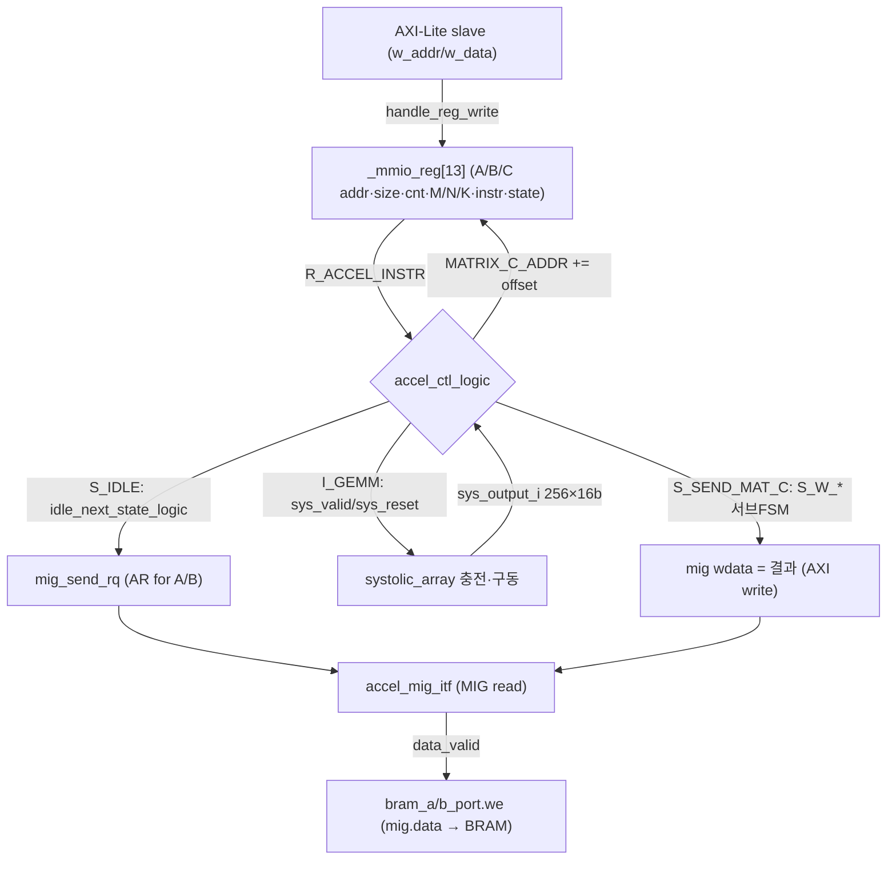
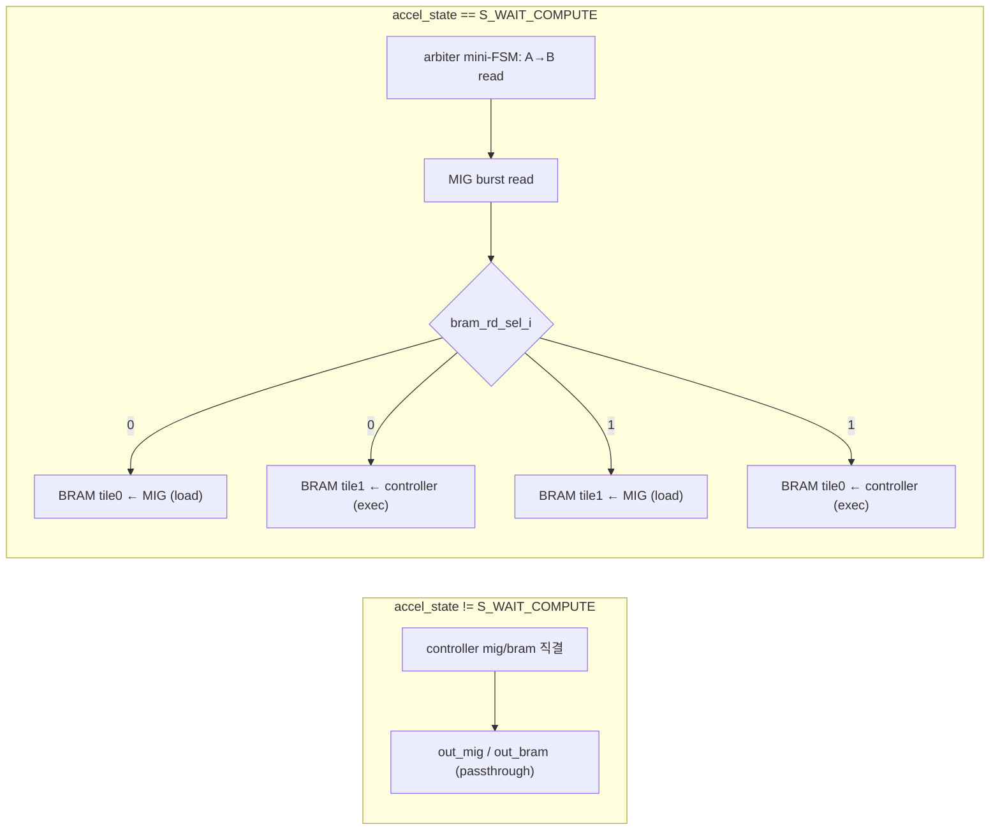
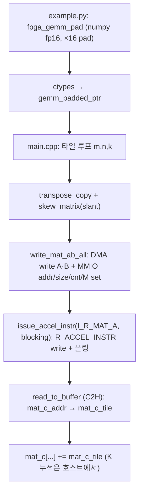

# ViT-FPGA-TPU 모듈 통합 가이드 (H-RTL 변형)

> 1차 요약(맥락): [`../ViT-FPGA-TPU.md`](../ViT-FPGA-TPU.md)
> 소스 루트: `REF/Transformer-Accel/ViT-FPGA-TPU` (동일 프로젝트 사본 `REF/ViT-Accelerator/ViT-FPGA-TPU`). 본 가이드는 **이 Transformer-Accel 사본을 정본**으로 삼는다. 이 사본은 1차 요약에서 "확인 불가"로 남았던 **컨트롤러 RTL 전체**(`code/fpga/pci_mig_accelerator_1.0_16_auto/src/`: `accelerator_ctl.sv` FSM, `spad_arbiter.sv` 더블버퍼, AXI-Lite slave MMIO, AXI master→MIG, `accelerator_types.sv` 인터페이스/enum, 통합 top `pci_mig_accelerator_sv.sv`)를 핸드라이트 SystemVerilog 소스로 포함해 가장 완전하다.
> 표기 규약: 라인으로 직접 확인한 사실은 단정, 코드 정황 기반은 "추정", 코드/문서에 없으면 "확인 불가".
> 제외물(이름만, 미분석): Vivado 블록디자인/프로젝트 생성물(`test_accel/*.xpr`·`*.cache`·`*.gen`·`*.srcs` IP 생성물·`*.runs`·`*.hw`·`.ip_user_files`), Xilinx Floating-Point IP 내부 RTL(`pipeline_mac_floating_point_{0,1}_0.xci`로만 취급), BD-넷리스트 `pipeline_mac_2`(코드 트리에 소스 없음 — `.gen` 생성물 추정), 시스템 IP(`xdma`/`smartconnect`/`axi_bram_ctrl`+`blk_mem_gen`/`mig`/`util_ds_buf`), 벤더 드라이버 `dma_utils.h`(Xilinx dma_ip_drivers 유래, 기능만 언급), 비트스트림(리포에 없음).

---

## 0. 문서 머리말

### 0.1 대표 케이스 선정 + 근거
ViT-FPGA-TPU는 PCIe/XDMA로 호스트에 붙는 Virtex-7 FPGA 위의 **16×16 FP16 output-stationary systolic GEMM 엔진**이다. 대표 케이스는 **단일 16×16 FP16 GEMM 타일 1회 실행**으로 잡는다.

선정 근거(코드 직접):
- 호스트 ABI가 16을 박아둠: `accelerator.h:6` `#define MATRIX_SIZE 16`, 그리고 통합 top이 `SYS_ARR_SIZE=16`으로 어레이를 인스턴스화(`pci_mig_accelerator_sv.sv:37, 473-479`).
- 호스트 GEMM 본체가 임의 (M,K,N)을 16의 배수로 패딩 후 **16×16 타일 3중 루프**로 분해(`main.cpp:264-266`, `example.py:26-28`). 따라서 "한 타일 = 한 번의 어레이 충전→배출"이 시스템의 최소 실행 단위.
- 컨트롤러 FSM이 타일 단위로 동작: `I_R_MAT_A → I_R_MAT_B → I_GEMM`을 거쳐 16×16 결과를 한 번 산출(`accelerator_ctl.sv:208-256`).

이 한 케이스로 (a) systolic 데이터플로우(skew 주입·OS 누산), (b) 컨트롤러 FSM(DMA read→compute→write-back), (c) 호스트 타일링/패딩/skew 어댑터를 모두 커버한다.

### 0.2 수치 표기 규약
- **MAC lanes**: 동시 곱셈기 수 = 물리 PE 수 = `NUM_ROWS × NUM_COLS = 16 × 16 = 256` (FP16 곱 1개/PE). 근거: `pci_mig_accelerator_sv.sv:477-478`(`NUM_ROWS=NUM_COLS=SYS_ARR_SIZE=16`).
- **scalar MACs**: 대표 GEMM의 M·K·N 곱. 16×16×16 타일 = 4096 MAC/타일. 전체 GEMM은 타일 수 × 4096.
- **loop trips**: 호스트 타일 루프 `t_M·t_N·t_K`(`main.cpp:264-266`) 및 컨트롤러 compute 카운터 한계 `SYS_COMP_COUNTER_LIMIT`(`accelerator_ctl.sv:24`).
- **memory size (payload bit)**: PE/MAC 레지스터, BRAM 스크래치패드 폭×깊이(bit). 어레이 폭은 `INPUT_WIDTH`/`OUTPUT_WIDTH`로 표기(상위 인스턴스는 16비트).
- **PCIe 전송 비용**: H2C/C2H DMA 바이트 = `MATRIX_SIZE·MATRIX_SIZE·sizeof(fp16)` 계열(`main.cpp:35-37, 46`).

### 0.3 운영 경로 (호스트 ↔ PCIe/XDMA ↔ RTL)
```
[host SW]   example.py(numpy fp16, ×16 pad) ─ctypes→ libfpga_gemm.so
                │  gemm_padded_ptr: 타일 루프 + transpose + skew_matrix(slant)
                ▼
[XDMA]      /dev/xdma0_h2c_0 (write) · /dev/xdma0_c2h_0 (read)  ← dma_utils.h
                │  ① 행렬 A·B를 FPGA DRAM에 DMA write
                │  ② MMIO 레지스터 set (A/B/C addr·size·cnt·M)  → AXI-Lite
                │  ③ R_ACCEL_INSTR ← I_R_MAT_A, 그 후 폴링 동기화
                ▼
[RTL slave] pci_mig_accelerator_v1_0_S00_AXI.sv : AXI-Lite → r/w_addr·w_data (64B 정렬 디코드)
                ▼
[RTL ctrl]  accelerator_ctl.sv (5-state FSM) : MMIO 레지스터 보유 + MIG read/write 발행
                │  spad_arbiter.sv : MIG burst → 더블버퍼 BRAM 스크래치패드(A0/B0, A1/B1)
                ▼
[RTL array] systolic_array.sv → 256× PE.sv → pipeline_mac_2 (FP16 곱4 + 누산4)
                │  output_o[16][16] OS 누산
                ▼
[RTL ctrl]  accelerator_ctl.sv S_SEND_MAT_C : 결과를 MIG(=DRAM)에 AXI write back
                ▲
            C2H DMA read → mat_c (main.cpp) → numpy 반환(example.py)
```
근거: `main.cpp:40-41,78-97,243-327`, `pci_mig_accelerator_sv.sv:213-489`, `accelerator_ctl.sv:194-426`, `spad_arbiter.sv:106-262`.

### 0.4 타깃 / 데이터타입
- **타깃**: Xilinx **Virtex-7 `xc7vx485t-ffg1761-2`** / 보드 **VC707**. 근거(이 사본): `code/fpga/test_accel/test_accel.xpr:10`(`Part="xc7vx485tffg1761-2"`), `:50`(`BoardPart="xilinx.com:vc707:part0:1.4"`), `:63`(`DSABoardId="vc707"`). 호스트 인터페이스: PCIe + Xilinx **XDMA**(`main.cpp:40-41` `/dev/xdma0_{h2c,c2h}_0`).
- **데이터타입**: **연산 FP16(Half)**. 근거: FP IP가 곱셈 `Operation_Type=Multiply, A_Precision_Type=Half, Result_Precision_Type=Half, C_Latency=4`(`pipeline_mac_floating_point_0_0.xci:211,171,213,189`), 누산 `Operation_Type=Accumulator, Add_Sub_Value=Add, A_Precision_Type=Half, C_Latency=4`(`pipeline_mac_floating_point_1_0.xci:222,184,182,200`). 호스트도 `float16_t`/`torch::kFloat16` 전 구간(`main.cpp:249-251`, `matrix_utils.h:10`).
- **어레이 데이터 폭**: 통합 top은 `SYS_ARR_IN_PRECISION=16`로 인스턴스화(`pci_mig_accelerator_sv.sv:35,474-476`). 단 `systolic_array.sv:4-6`/`PE.sv:23-25`의 모듈 디폴트는 `*_WIDTH=32`(상위에서 16으로 오버라이드). 32비트는 검증 TB(`systolic_array_tb.sv`, FP32 shortreal)와 BD AXIS 바이트 정렬에 쓰이는 폭으로 보이며 실 합성 데이터는 16비트("추정").
- **클럭**: 단일 도메인 `s00_axi_aclk`(컨트롤·어레이·BRAM 공통, `pci_mig_accelerator_sv.sv:480, 425-453`), `m00_axi_aclk`는 MIG 측. MAC IP는 100 MHz로 패키징(1차 요약 근거), `example.py:58`은 환산에 200 MHz 사용 → 실제 합성 Fmax는 **확인 불가**(합성 리포트 미동봉).

### 0.5 1차 요약 대비 이 사본의 추가 분석분 (가장 중요)
1차 요약(`../ViT-FPGA-TPU.md`)은 v2.0 트리만 분석해 컨트롤러를 "확인 불가"로 남겼다. 본 가이드는 그 공백을 채운다:

| 1차 요약 상태 | 이 사본에서 확정 | 근거 파일 |
|---|---|---|
| `pci_mig_accelerator` 컨트롤러 RTL "v2.0 트리에서 확인 불가" | 5-state FSM 핸드라이트 RTL 확보 | `accelerator_ctl.sv:258-426` |
| DMA↔BRAM↔어레이 조율 로직 "검증 불가" | spad_arbiter 더블버퍼 + MIG 중재 확보 | `spad_arbiter.sv:106-262` |
| MMIO 레지스터가 어떻게 RTL에 닿는지 미확인 | AXI-Lite slave가 64B 정렬로 디코드 확인 | `S00_AXI.sv:607-630` |
| 결과 write-back 경로 미확인 | `S_SEND_MAT_C` AXI write FSM(`S_W_*`) 확인 | `accelerator_ctl.sv:293-401` |
| PE의 MAC IP 충돌 가능성 의심 | PE가 `pipeline_mac_2`(DSP/LUT 선택형)로 진화 확인 | `PE.sv:57-68` |

---

## 1. Repo / Layer 개요

### 1.1 디렉토리 맵 (자체 작성 소스만)
```
ViT-FPGA-TPU/
├─ README.md                                  # CS205 개요, libTorch ViT 실행법, FPGA TB 안내(L35)
├─ code/                                       # ★ 구버전+컨트롤러 RTL (이 사본의 핵심)
│  ├─ code_cpu/                                # libTorch ViT(CPU) — ViT 전체 그래프(분석 범위 밖, §11)
│  ├─ code_fpga/fpga/pci_mig_accelerator_1.0{,_32}/src/  # 컨트롤러 RTL 구버전(16/32 변형)
│  └─ fpga/
│     ├─ test_accel/                           # Vivado 프로젝트(생성물 — 제외, 타깃근거 xpr만)
│     └─ pci_mig_accelerator_1.0_16_auto/      # ★ 정본 컨트롤러 IP (핸드라이트 RTL)
│        ├─ hdl/pci_mig_accelerator_v1_0.v     #   IP 최상위 Verilog 래퍼(BD 노출용)
│        └─ src/
│           ├─ accelerator_types.sv            # ★ enum(instr/state/wstate) + 인터페이스(mig/bram)
│           ├─ pci_mig_accelerator_sv.sv       # ★ 통합 top: AXI slave/master + arbiter + ctl + 4×BRAM + array
│           ├─ accelerator_ctl.sv              # ★ 5-state 컨트롤러 FSM + MMIO 레지스터 + MIG R/W
│           ├─ spad_arbiter.sv                 # ★ MIG↔더블버퍼 BRAM 스크래치패드 중재
│           ├─ pci_mig_accelerator_v1_0_S00_AXI.sv  # AXI-Lite slave(MMIO 디코드)
│           ├─ pci_mig_accelerator_v1_0_M00_AXI.sv  # AXI master(→MIG/DRAM)
│           ├─ systolic_array.sv               # 16×16 PE 어레이(generate)
│           ├─ PE.sv                           # 단일 PE(pipeline_mac_2 래핑 + skew 패스스루)
│           ├─ top.sv                          # 시뮬레이션 top(clk gen + TB)
│           └─ accelerator_ctl_tb.sv           # 컨트롤러 FSM 검증 TB(MMIO write→instr→mig 핸드셰이크)
└─ v2.0/                                       # 최신 어레이 IP + 호스트 SW (1차 요약의 정본)
   ├─ hw/tpu_16/ip_repo/fp_sys_array/src/
   │  ├─ systolic_array.sv / PE.sv / systolic_array_wrapper.sv
   │  ├─ pipeline_mac.v / pipeline_mac_wrapper.v   # FP IP 2개 결선(BD 넷리스트)
   │  ├─ pipeline_mac_floating_point_{0,1}_0.xci   # FP16 곱/누산 IP 설정(.xci)
   │  └─ top.sv / systolic_array_tb.sv             # OS 검증 TB
   └─ sw/
      ├─ src/main.cpp        # ★ XDMA GEMM 드라이버(타일/skew/레지스터)
      ├─ src/example.py      # ★ ctypes 벤치마크 프런트엔드
      ├─ include/{accelerator.h, dma_utils.h, matrix_utils.h}
      └─ CMakeLists.txt
```

### 1.2 모듈 인스턴스 계층 (top → leaf, 컨트롤러 IP)
```
pci_mig_accelerator_v1_0.v            (IP top, BD 노출 Verilog 래퍼)
└─ pci_mig_accelerator_sv             (통합 SystemVerilog top)
   ├─ pci_mig_accelerator_v1_0_S00_AXI   (AXI-Lite slave: MMIO 디코드 → r/w_addr·w_data)
   ├─ pci_mig_accelerator_v1_0_M00_AXI   (AXI master 골격 → MIG; 데이터 경로는 top에서 결선)
   ├─ accelerator_ctl                    (5-state FSM + MMIO 레지스터 13개 + MIG R/W 발행)
   ├─ spad_arbiter                       (MIG burst → 더블버퍼 BRAM, accel_state 기반 중재)
   ├─ blk_mem_gen_0 ×4                   (bram_{a,b}_{0,1}: A/B × tile0/tile1 = 더블버퍼 스크래치패드)
   └─ systolic_array  #(NUM_ROWS=NUM_COLS=16, *_PRECISION=16)
      └─ PE ×256 (generate i×j)
         └─ pipeline_mac_2  #(MAC_ID, USE_1_DSP_ID)   (FP16 곱4 + 누산4, DSP/LUT 선택형)
```
근거: `pci_mig_accelerator_sv.sv:214-489`, `systolic_array.sv:39-85`, `PE.sv:57-68`.

### 1.3 제외 목록 (이름만)
- 생성물/프로젝트: `code/fpga/test_accel/{*.xpr,*.cache,*.gen,*.srcs,*.runs,*.hw,*.ip_user_files}`, BD 넷리스트 `pipeline_mac_2`(소스 부재 → `.gen` 생성물 추정).
- Xilinx IP: Floating-Point(`*.xci`), XDMA, SmartConnect, AXI BRAM Ctrl, blk_mem_gen, MIG, util_ds_buf, `ila_0`(디버그 코어, `accelerator_ctl.sv:116-133`).
- 벤더 SW: `dma_utils.h`(Xilinx dma_ip_drivers BSD 원본).
- 구버전 중복: `code/code_fpga/.../pci_mig_accelerator_1.0{,_32}` (정본 `_16_auto`의 이전/32변형 — 본문은 `_16_auto`만 분석).

---

## 2. 컨트롤러 FSM — `accelerator_ctl.sv` (시스템 두뇌)

### 2.1 역할 + 상위/하위
가속기의 핵심 제어기. **13개 MMIO 레지스터를 보유**하고, AXI-Lite로 받은 명령(`R_ACCEL_INSTR`)을 5-state FSM으로 풀어 (1) MIG에서 행렬 A/B를 burst read, (2) systolic 어레이를 충전·구동, (3) 결과를 MIG에 write-back 한다. 상위: `pci_mig_accelerator_sv`. 하위: `accel_mig_itf`(MIG), `bram_itf`(스크래치패드), systolic 어레이 출력 수신.

### 2.2 데이터플로우


### 2.3 인스턴스 계층 / 호출경로
`accel_ctl_logic()`(`:258`)이 `accel_state`로 분기 → `S_IDLE`에서 `accel_mig_instr_logic()`(`:194`, AR 발행) + `idle_next_state_logic()`(`:208`, 다음 명령/상태 전이) 호출. 매 clk `always_ff`(`:447-455`)가 `misc()`+`handle_reg_write()`+`accel_ctl_logic()` 순서 실행.

### 2.4 대표 코드 위치
`code/fpga/pci_mig_accelerator_1.0_16_auto/src/accelerator_ctl.sv`.

### 2.5 대표 코드 블록

(1) **MMIO 레지스터 맵 — 호스트 ABI와 1:1** (`accelerator_ctl.sv:100-114`)
```systemverilog
typedef enum logic [$clog2(NUM_REG)-1:0] {
    MATRIX_A_ADDR='d0, MATRIX_B_ADDR='d1, MATRIX_C_ADDR='d2,
    MATRIX_A_SIZE='d3, MATRIX_B_SIZE='d4, MATRIX_RD_CNT='d5,
    MATRIX_M_SIZE='d6, MATRIX_N_SIZE='d7, MATRIX_K_SIZE='d8,
    ACCEL_INSTR='d9, ACCEL_STATE='d10, ACCEL_DATA='d11, SYS_ARR_OUTPUT='d12
} accel_mmio_reg_e;
```
→ `accelerator.h:19-33`의 호스트 레지스터 enum과 **인덱스·의미가 정확히 일치**(SW↔HW 계약점). 호스트는 `ACCEL_ADDR + (idx << REG_SHIFT_AMT=6)` = 64B 간격으로 접근(`accelerator.h:10,20-32`).

(2) **명령→상태 전이 FSM 코어** (`accelerator_ctl.sv:208-256`)
```systemverilog
task idle_next_state_logic();
    _saved_instruction <= accel_instr_e'(_mmio_reg[ACCEL_INSTR]);
    unique case (_mmio_reg[ACCEL_INSTR])
        I_R_MAT_A: begin _mmio_reg[ACCEL_STATE]<=S_WAIT_ARW_READY; _mmio_reg[ACCEL_INSTR]<=I_R_MAT_B; ... end
        I_R_MAT_B: begin _mmio_reg[ACCEL_STATE]<=S_WAIT_ARW_READY; _mmio_reg[ACCEL_INSTR]<=I_GEMM; _mat_mul_m_counter<='0; end
        I_GEMM:    begin _mmio_reg[ACCEL_STATE]<=S_WAIT_COMPUTE;
                         _mmio_reg[ACCEL_INSTR]<=(_mat_mul_count+1)>=_mmio_reg[MATRIX_RD_CNT] ? I_IDLE : I_GEMM;
                         _mmio_reg[MATRIX_A_ADDR]<=_mmio_reg[MATRIX_A_ADDR]+MAT_AB_ADDR_OFFSET;
                         _sys_valid<=1'b1; sys_reset_o<=1'b1; end
        I_RESET:   ... accel_reset_o 토글 ...
```
→ 호스트가 단 한 번 `I_R_MAT_A`만 써도 컨트롤러가 **자동으로 `I_R_MAT_A→I_R_MAT_B→I_GEMM` 체인**을 진행(A read→B read→compute). `MATRIX_RD_CNT`만큼 GEMM을 반복하며 A/B 주소를 `MAT_AB_ADDR_OFFSET`씩 자동 증가 → 여러 타일을 한 instr로 연속 처리.

(3) **5-state 메인 FSM** (`accelerator_ctl.sv:258-426`)
```systemverilog
S_IDLE          : accel_mig_instr_logic(); idle_next_state_logic();   // AR 발행 + 전이
S_WAIT_ARW_READY: if (mig.arready) {state<=S_WAIT_RW; reset_arwvalid();}
S_WAIT_RW       : if (mig.data_valid) { if(rw_last) state<=S_IDLE; bram_addr++ (A 또는 B) }
S_WAIT_COMPUTE  : // 2cyc마다 bram 주소 += SYS_BRAM_R_STRIDE(어레이에 행/열 공급), compute 카운터 진행
S_SEND_MAT_C    : // S_W_* 서브 FSM (아래 (5))
```
→ DMA-read(`S_WAIT_*`) → compute(`S_WAIT_COMPUTE`) → write-back(`S_SEND_MAT_C`)의 3단 매크로 파이프라인. `S_WAIT_COMPUTE`는 BRAM 읽기 레이턴시 2를 고려해 **2사이클마다** 주소를 전진(`:404` `_sys_compute_counter[0]`).

(4) **compute 사이클 한계 = skew + MAC latency + drain** (`accelerator_ctl.sv:24, 409-421`)
```systemverilog
parameter SYS_COMP_COUNTER_LIMIT = (SYS_ARR_SIZE<<1) - 1 + SYS_MAC_LATENCY + SYS_ARR_SIZE;
...
if (_sys_compute_counter == (SYS_SKEW_LEN-1)) _sys_valid <= '0;             // skew 주입 종료
if ((_sys_compute_counter >= (SYS_COMP_COUNTER_LIMIT-1)) && spad_mat_ab_rd_done_i)
    _mmio_reg[ACCEL_STATE] <= _mat_mul_m_counter==_mmio_reg[MATRIX_M_SIZE]-1 ? S_SEND_MAT_C : S_IDLE;
```
→ 한 타일 compute 사이클 = `(2·16−1) + SYS_MAC_LATENCY + 16`. 통합 top이 `SYS_MAC_LATENCY=20`(`pci_mig_accelerator_sv.sv:38`) → **31 + 20 + 16 = 67 사이클/타일**(추정; `accelerator_ctl.sv` 디폴트 `SYS_MAC_LATENCY=18`은 top에서 20으로 오버라이드). M 타일을 다 돌면(`_mat_mul_m_counter==M-1`) 결과를 write-back.

(5) **결과 write-back 서브 FSM (`S_W_*`)** (`accelerator_ctl.sv:293-361`)
```systemverilog
S_W_SEND_WVALID: mig_send_rq(MATRIX_C_ADDR, SYS_MIG_LEN, WRITE);
S_W_SEND_DATA  : mig.wvalid <= _sys_read_counter+1 < SYS_RD_COUNTER_LIMIT;
                 mig.wdata 경로: _sys_read_data_rev <= sys_output_i[ ... -: DATA_WIDTH ];  // 어레이 출력을 워드 단위로 직렬화
S_W_DONE       : _mmio_reg[MATRIX_C_ADDR] <= _mmio_reg[MATRIX_C_ADDR] + MAT_C_ADDR_OFFSET;  // 다음 타일 위치로
```
→ 256개 PE 출력(`sys_output_i`)을 `DATA_WIDTH(=MIG_DATA_WIDTH)` 폭 워드로 잘라 MIG에 burst write. `rev_sys_read_data`(`:461-467`)가 16비트 단위로 워드 내 순서를 뒤집어 호스트 레이아웃에 맞춤.

### 2.6 마이크로아키텍처 + 정량
- **레지스터 파일**: `_mmio_reg[13] × 32b = 416 bit`(`:65, NUM_REG=13, REG_WIDTH=32`).
- **명령/상태 enum**: instr 6종(`I_IDLE/R_MAT_A/R_MAT_B/R_MAT_C/GEMM/RESET`, `accelerator_types.sv:9-16`), state 6종(`S_IDLE/WAIT_ARW_READY/WAIT_RW/WAIT_COMPUTE/SEND_MAT_C/DONE`, `:18-25`), write 서브 6종(`S_W_*`, `:27-34`).
- **주소 오프셋 산식**: `MAT_AB_ADDR_OFFSET = SYS_ARR_SIZE·(SYS_ARR_SIZE<<1)·SYS_ARR_IN_PRECISION/8`(`:30`) = 16·32·16/8 = **1024 byte/타일**(A,B 각각, skew된 16×32 fp16 타일). `MAT_C_ADDR_OFFSET = 16·16·16/8 = 512 byte`(`:31`).
- **MIG burst 길이**: A/B read = `mat_a/b_len` = `MATRIX_A/B_SIZE >> MIG_BYTE_SHIFT (+올림)`(`:95-96`), write = `SYS_MIG_LEN = SYS_ARR_OUT_WIDTH/8/MIG_BYTE_WIDTH`(`:28`).
- **동기화**: 인터럽트 없음. 호스트가 `R_ACCEL_INSTR`를 폴링해 idle 복귀 대기(`main.cpp:85-88`). FSM은 명령 완료 시 `_mmio_reg[ACCEL_INSTR]<=I_IDLE`(`:228,233,249`)로 폴링 종료 신호.
- **병목**: (a) **순차 A→B→compute**(중첩 없음): A read 끝→B read 끝→compute 시작이라 read와 compute가 직렬. (b) **폴링 동기화**가 호스트 CPU 점유. (c) compute 67사이클 중 skew/drain 47사이클이 오버헤드(K=16 누적엔 유효일 16 + 비유효 31).
- **확인 불가/특이**: `output_o`를 MAC IP 출력에 직접 결선하면서 PE.reset에서 0 클리어(구 PE 충돌 의심)는 이 사본 PE에선 `pipeline_mac_2`로 대체돼 완화(§5). compute 카운터의 정확한 유효 데이터 주입 타이밍은 TB로만 부분 검증(`accelerator_ctl_tb.sv`는 SYS_ARR_SIZE=2 소형).

---

## 3. 스크래치패드 중재기 — `spad_arbiter.sv` (DMA 더블버퍼)

### 3.1 역할 + 상위/하위
MIG(DRAM)와 BRAM 스크래치패드 사이의 **데이터 무브 + 더블버퍼 중재**. compute(`S_WAIT_COMPUTE`) 중에는 자체 mini-FSM으로 다음 타일 A/B를 MIG에서 읽어 한 BRAM 뱅크에 적재하고, 컨트롤러는 다른 뱅크로 어레이를 구동 → **load/compute 더블버퍼링**. 상위: `pci_mig_accelerator_sv`. 하위: 4개 `blk_mem_gen_0`(A/B × tile0/tile1), MIG 포트.

### 3.2 데이터플로우


### 3.3 인스턴스 계층
`pci_mig_accelerator_sv`가 `spad_arbiter_0`을 1개 인스턴스화(`:351-377`), 4개 `blk_mem_gen_0`(`:424-454`)과 컨트롤러 사이에 끼움. arbiter는 `ctl_mig_port`/`ctl_bram_*`(컨트롤러측)과 `out_mig_port`/`out_bram_*_{0,1}`(BRAM측)을 중재.

### 3.4 대표 코드 위치
`code/fpga/pci_mig_accelerator_1.0_16_auto/src/spad_arbiter.sv`.

### 3.5 대표 코드 블록

(1) **compute 중 A→B 자동 prefetch FSM** (`spad_arbiter.sv:106-152`)
```systemverilog
end else if (accel_state == S_WAIT_COMPUTE) begin
    unique case (_arbiter_state)
        S_IDLE: unique case({_bram_a_done,_bram_b_done})
            2'b00: { mig_send_rq(mat_a_addr_i, mat_a_len, READ); state<=S_WAIT_ARW_READY; }  // A 먼저
            2'b10: { mig_send_rq(mat_b_addr_i, mat_b_len, READ); state<=S_WAIT_ARW_READY; }  // 그다음 B
        S_WAIT_RW: if (data_valid) { if(rw_last){state<=S_IDLE; _bram_a_done<='1; _bram_b_done<=_bram_a_done;} bram_addr++; }
end else reset();
```
→ 현재 타일을 어레이가 계산하는 동안 **다음 타일 A·B를 미리 BRAM에 적재**. `_bram_a_done & _bram_b_done` → `spad_mat_ab_rd_done_o`로 컨트롤러에 prefetch 완료 통지(`:71`).

(2) **버스 중재: compute 여부로 controller vs arbiter 전환** (`spad_arbiter.sv:166-210`)
```systemverilog
unique case(accel_state == S_WAIT_COMPUTE)
    1'b0: out_mig_port <= ctl_mig_port;      // 비-compute: 컨트롤러가 MIG 직접 제어 (A/B 초기 read, C write)
    1'b1: out_mig_port <= _mig_port_*;       // compute: arbiter가 MIG 제어 (prefetch)
```

(3) **BRAM 더블버퍼 라우팅** (`spad_arbiter.sv:214-262`)
```systemverilog
unique case(bram_rd_sel_i)
    1'b0: { bram_*_port_0 <= arbiter(load);  bram_*_port_1 <= controller(exec); }  // tile0 적재 / tile1 실행
    1'b1: { bram_*_port_1 <= arbiter(load);  bram_*_port_0 <= controller(exec); }  // tile1 적재 / tile0 실행
```
→ `bram_rd_sel_o = ~_mat_mul_count[0]`(`accelerator_ctl.sv:97`) → 타일 짝/홀에 따라 load/exec 뱅크를 교차. 전형적 **ping-pong 더블버퍼**.

### 3.6 마이크로아키텍처 + 정량
- **BRAM 뱅크**: 4개(`bram_a_0/b_0/a_1/b_1`), 각 폭 `BRAM_DOUT_WIDTH = SYS_ARR_IN_PRECISION·SYS_ARR_SIZE·2 = 16·16·2 = 512 bit`(`pci_mig_accelerator_sv.sv:44`), 깊이 `BRAM_DEPTH = SYS_ARR_ROW_WIDTH·SYS_ARR_SIZE·2/BRAM_DOUT_WIDTH = (16·16)·16·2/512 = 16 라인`(`:45`). → 한 뱅크 ≈ 512b × 16 = **8 Kb**, 4뱅크 = **32 Kb** 스크래치패드(추정, addr 폭 `$clog2(16)=4b`).
- **더블버퍼 효과**: prefetch(arbiter)와 exec(controller)가 다른 뱅크를 동시 접근 → DRAM read 레이턴시를 compute로 은닉(단 §2.6의 A→B 직렬성은 타일 내부엔 남음).
- **병목**: arbiter는 compute 중에만 동작(`:109` `else reset()`)하므로 첫 타일 prefetch는 은닉 불가(cold start). MIG 단일 read 채널을 A/B가 직렬 공유.

---

## 4. 통합 Top + AXI 인터페이스 — `pci_mig_accelerator_sv.sv`, `S00_AXI.sv`, `M00_AXI.sv`

### 4.1 역할 + 상위/하위
`pci_mig_accelerator_sv`는 모든 서브모듈을 묶는 통합 top: AXI-Lite slave(MMIO) + AXI master(MIG) + arbiter + ctl + 4×BRAM + 16×16 어레이를 인스턴스화하고, BRAM dout을 어레이 입력으로 패킹/언패킹한다. 상위: BD 노출 래퍼 `pci_mig_accelerator_v1_0.v`. 하위: §2/§3/§5 모듈.

### 4.2 데이터플로우
```mermaid
flowchart TD
  HOST["XDMA host (BAR MMIO)"] -->|AXI-Lite| S00[S00_AXI slave]
  S00 -->|r/w_addr(>>6), w_data| CTL[accelerator_ctl]
  CTL <-->|mig_itf| ARB[spad_arbiter]
  ARB <-->|mig_itf| M00[M00_AXI master]
  M00 <-->|AXI4| MIG[(MIG / DDR)]
  ARB <-->|bram_itf ×4| BRAM["blk_mem_gen ×4 (A/B×tile0/1)"]
  BRAM -->|dout 512b| PK["unpack: pk_bram_a/b_dout[32] (16b씩)"]
  PK -->|sys_data_sel로 상/하 16개 선택| ARR["systolic_array 16×16"]
  ARR -->|output_o[16][16]| CTL
```

### 4.3 인스턴스 계층 / 호출경로
`pci_mig_accelerator_sv` 내부: `pci_mig_accelerator_v1_0_S00_AXI_inst`(`:214`), `..._M00_AXI_inst`(`:280`), `spad_arbiter_0`(`:351`), `acc_ctl_0`(`:379`), `bram_{a,b}_{0,1}`(`:424-454`), `sys_array_0`(`:473`).

### 4.4 대표 코드 위치
`pci_mig_accelerator_sv.sv`(통합), `pci_mig_accelerator_v1_0_S00_AXI.sv`(MMIO 디코드), `..._M00_AXI.sv`(MIG 마스터).

### 4.5 대표 코드 블록

(1) **AXI-Lite → MMIO 인덱스 디코드 (64B 정렬 핵)** (`S00_AXI.sv:607-617`)
```systemverilog
// "we are going to access the registers in 4B aligned ... fix in software layer"
assign mem_address = (axi_arv_arr_flag? S_AXI_ARADDR : (axi_awv_awr_flag? S_AXI_AWADDR:0)) >> ADDR_SHIFT_AMT;
assign r_addr_i = mem_address;  assign w_addr_i = mem_address;
assign w_data_i = S_AXI_WDATA;  assign w_valid_i = axi_wready & S_AXI_WVALID;
```
→ AXI 주소를 `ADDR_SHIFT_AMT=$clog2(32/8)=2`로 시프트해 레지스터 인덱스화. 호스트는 `REG_SHIFT_AMT=6`(64B 간격)로 쓰지만 BAR/AXI 변환을 거쳐 슬레이브에선 워드 인덱스로 정렬("추정": BAR aperture가 64B→4B 매핑). `C_S_AXI_ADDR_WIDTH=6` → 16개 레지스터 주소 공간(`:17`).

(2) **BRAM dout 512b → 어레이 16개 입력 언패킹** (`pci_mig_accelerator_sv.sv:535-550`)
```systemverilog
for (int i=1; i<(SYS_ARR_SIZE<<1)+1; i++) begin
    pk_bram_a_dout[i-1] = bram_a_dout_muxout[i*SYS_ARR_IN_PRECISION-1 -: SYS_ARR_IN_PRECISION];  // 512b→32×16b
    pk_bram_b_dout[i-1] = bram_b_dout_muxout[...];
end
...
sys_input_i[i]  = sys_data_sel_o ? pk_bram_a_dout[SYS_ARR_SIZE+i] : pk_bram_a_dout[i];  // 상/하 16개 중 택
sys_weight_i[i] = sys_data_sel_o ? pk_bram_b_dout[SYS_ARR_SIZE+i] : pk_bram_b_dout[i];
```
→ 한 BRAM 라인(512b)에 16×16 타일의 한 "skew 행"(32개 fp16)이 담기고, `sys_data_sel_o`(compute 카운터 LSB, `accelerator_ctl.sv:436`)로 상위 16/하위 16을 골라 어레이 좌·상에 주입.

(3) **어레이 출력 256×16b 평탄화 + reset 결합** (`pci_mig_accelerator_sv.sv:521-524, 481`)
```systemverilog
assign combined_reset_n = s00_axi_aresetn & accel_reset_o;          // SW reset + I_RESET 명령 결합
assign _sys_valid = sys_valid_o ? {default:'1} : {default:'0};       // 16행 valid 일괄
assign upk_sys_output_o = { >> { sys_output_o }};                    // [16][16] → 평탄 비트벡터
```
→ `sys_array_0.rst_n = combined_reset_n & sys_reset_o`(`:481`): 시스템 리셋·`I_RESET`·타일별 `sys_reset_o`(누산 클리어)를 AND. 즉 **타일마다 어레이 누산을 리셋**해 OS 부분합을 새 타일에 재사용하지 않음.

(4) **MIG master 데이터 경로 결선** (`pci_mig_accelerator_sv.sv:552-582`)
```systemverilog
always_comb { arb_mig_port.wready=m00_axi_wready; m00_axi_wdata=arb_mig_port.wdata; m00_axi_wvalid=arb_mig_port.wvalid; }
always_ff @(s00_axi_aclk) { arb_mig_port.data<=m00_axi_rdata; arb_mig_port.data_valid<=m00_axi_rvalid&...; }
always_ff @(m00_axi_aclk) { m00_axi_araddr<=arb_mig_port.addr; m00_axi_arvalid<=arb_mig_port.arvalid; ... }
```
→ M00_AXI IP는 골격(주소/제어 핸드셰이크)만 쓰고, 실제 read/write 데이터·주소는 top에서 `arb_mig_port`(arbiter 출력)와 직접 결선. 두 클럭 도메인(`s00_axi_aclk`/`m00_axi_aclk`) 경계.

### 4.6 마이크로아키텍처 + 정량
- **AXI 폭**: slave `C_S00_AXI_DATA_WIDTH=32`, `ADDR_WIDTH=6`(`:15-16`); master `C_M00_AXI_DATA_WIDTH=32`, `BURST_LEN=16`(`:25,28`). MIG 인터페이스 `accel_mig_itf` 디폴트 `DATA_WIDTH=512`이나 top에선 `C_M00_AXI_DATA_WIDTH=32`로 인스턴스(`:169,174`) → 데이터 폭 정합은 BD 측 데이터 무버에 의존("추정").
- **BRAM 스크래치패드**: §3.6과 동일(512b×16×4 = 32 Kb).
- **어레이 입력 폭**: `SYS_ARR_ROW_WIDTH = 16·16 = 256 bit`(한 행/열 16개 fp16, `:39`).
- **병목**: AXI-Lite 단일 레지스터 R/W가 64B 정렬이라 13개 레지스터 set에 13× DMA 트랜잭션(`main.cpp:140-153`) → set-up 오버헤드. 두 클럭 도메인 CDC는 단순 레지스터 동기화로만 처리(메타스테이빌리티 핸들링 미흡 가능성, "추정").

---

## 5. PE & 16×16 어레이 — `PE.sv`, `systolic_array.sv` (+ `pipeline_mac_2`)

### 5.1 역할 + 상위/하위
- `systolic_array`(`:3-85`): 16×16 = 256 PE를 2중 generate로 배치한 **Output-Stationary 어레이**. input 좌→우, weight 상→하 systolic 전파, 각 PE에 부분합 고정.
- `PE`(`:22-104`): 단일 처리요소. `pipeline_mac_2`(FP16 곱+누산)를 래핑하고 systolic 1-cycle 패스스루 레지스터를 둠.
상위: `pci_mig_accelerator_sv`(어레이). 하위: `pipeline_mac_2`(BD 넷리스트 = Xilinx FP IP 2단).

### 5.2 데이터플로우
```mermaid
flowchart LR
  IN["input_i[16] (좌, 행별)"] --> P00[PE 0,0]
  W["weight_i[16] (상, 열별)"] --> P00
  P00 -->|input_o →| P01[PE 0,1]
  P00 -->|weight_o ↓| P10[PE 1,0]
  P01 -->|...| PEN[PE i,j]
  PEN -->|output_o[i][j] 고정| OUT["output_o[16][16] (OS 누산)"]
  subgraph PEinner["PE 내부"]
    MAC["pipeline_mac_2: C ← C + A·B (곱4+누산4)"]
    REG["1-cyc 패스스루: input_o/weight_o"]
  end
```

### 5.3 인스턴스 계층
`systolic_array` generate(`:40-84`) → `PE #(.MAC_ID(i*NUM_ROWS+j), .USE_1_DSP_ID(250))`(`:42-48`) → `pipeline_mac_2 #(.MAC_ID, .USE_1_DSP_ID)`(`PE.sv:57`).

### 5.4 대표 코드 위치
`code/fpga/pci_mig_accelerator_1.0_16_auto/src/{PE.sv, systolic_array.sv}`. (v2.0 사본: `v2.0/hw/.../{PE.sv, systolic_array.sv}` — 동형이나 PE가 `pipeline_mac_wrapper` 사용.)

### 5.5 대표 코드 블록

(1) **systolic 전파 결선 (OS)** (`systolic_array.sv:64-82`)
```systemverilog
if (i==0) { _weight_i[i][j]=weight_i[j]; ... }          // 상단 weight 주입
if (j==0) { _input_i[i][j] =input_i[i];  ... }          // 좌측 input 주입
if (i<NUM_ROWS-1) _weight_i[i+1][j]=_weight_o[i][j];    // weight 아래로
if (j<NUM_COLS-1) _input_i[i][j+1] =_input_o[i][j];     // input 오른쪽으로
```
→ input 좌→우, weight 상→하 1-PE/cycle 전파. output은 각 PE에 머무름(`output_o[i][j]`, `:61`) = OS.

(2) **PE: DSP/LUT 선택형 MAC + valid 게이팅** (`PE.sv:57-68, 84`)
```systemverilog
pipeline_mac_2 #(.MAC_ID(MAC_ID), .USE_1_DSP_ID(USE_1_DSP_ID)) _mac(
    .S_AXIS_A_0_tdata(input_i),  .S_AXIS_A_0_tvalid(_mac_operands_ready),
    .S_AXIS_B_0_tdata(weight_i), .S_AXIS_B_0_tvalid(_mac_operands_ready),
    .mac_result(output_o),       .M_AXIS_RESULT_0_tvalid(output_valid_o));
...
_mac_operands_ready = input_valid_i & weight_valid_i;   // 두 피연산자 동시 유효 시에만 MAC
```
→ 1차 요약 대비 **진화점**: v2.0 PE는 `pipeline_mac_wrapper`(고정 IP)였으나, 이 사본은 `pipeline_mac_2 #(MAC_ID, USE_1_DSP_ID)`로 **PE별 MAC 구현을 선택**. `systolic_array.sv:9,46-47`에서 `MAC_ID = i·NUM_ROWS+j`, `USE_1_DSP_ID=250` → 256개 PE 중 일부(ID 기준)는 DSP, 일부는 LUT 기반 MAC을 쓰도록 분기하는 **DSP 자원 배분 메커니즘**("추정": `USE_1_DSP_ID`가 임계 ID로 DSP/LUT 사용을 가르는 파라미터; `pipeline_mac_2` 본체는 BD 생성물이라 미확인). 16×16 어레이엔 `USE_1_DSP_ID=250`이 디폴트(`systolic_array.sv:9`).

(3) **systolic 1-cycle 패스스루** (`PE.sv:93-101`)
```systemverilog
always_ff @(posedge clk_i) if(~rst_n) reset(); else begin
    input_o<=input_i; weight_o<=weight_i; input_valid_o<=input_valid_i; weight_valid_o<=weight_valid_i; end
```
→ 어레이 전파의 1-cycle 레지스터 단(skew 정렬용).

### 5.6 마이크로아키텍처 + 정량
- **물리 PE/MAC lanes**: `16×16 = 256`(FP16 곱 1개/PE). 근거 `systolic_array.sv:40-41` 이중 generate × top `SYS_ARR_SIZE=16`.
- **MAC 파이프라인 깊이**: FP16 곱 latency 4 + 누산 latency 4 = **≈8 사이클**(`.xci C_Latency=4`×2). 단 컨트롤러는 `SYS_MAC_LATENCY=20`을 가정(`pci_mig_accelerator_sv.sv:38`) → IP 내부 추가 파이프(handshake/register slice) 포함 실측 latency ≈20으로 보정("추정", 8 vs 20 불일치는 BD 내 추가 레지스터 단).
- **이론 처리량**: `(sys_size²)·2 = 16·16·2 = 512 FLOP/cycle`(`example.py:68`). 200 MHz 가정 시 ≈102.4 GFLOPS(fp16), 100 MHz면 ≈51.2 GFLOPS. 실측 Fmax **확인 불가**.
- **scalar MAC/타일**: 16×16×16 = 4096 MAC/타일. 한 타일 67사이클 중 유효 누산 16사이클 → **유효 활용률 ≈ 16/67 ≈ 24%**(추정; skew/drain 오버헤드 포함, 깊은 K 누적이나 타일 파이프라인 없이 타일당 충전·배출).
- **데이터 폭**: 상위 인스턴스 16비트(fp16), 모듈 디폴트 32비트(`systolic_array.sv:4-6`).
- **병목**: (a) 타일마다 어레이를 비우고 다시 채움(`sys_reset_o`로 누산 클리어, §4.5(3)) → K>16 누적도 호스트 측 `+=`로 합산(`main.cpp:313`)해 어레이 OS 재사용 안 함. (b) `USE_1_DSP_ID`로 일부 PE가 LUT-MAC이면 그 PE의 Fmax/정밀도가 다를 수 있음("추정").

---

## 6. 시뮬레이션/검증 — `top.sv`, `accelerator_ctl_tb.sv`, (v2.0) `systolic_array_tb.sv`

### 6.1 역할 + 상위/하위
- `top.sv`(`:1-35`): sim top. 10ns 클럭(`:9` `always #5`), `accelerator_ctl_tb` 인스턴스, VCD 덤프, 10000 사이클 타임아웃 트랩.
- `accelerator_ctl_tb.sv`: **컨트롤러 FSM 검증** TB. MMIO write로 명령을 넣고 MIG 핸드셰이크를 모사(`SYS_ARR_SIZE=2` 소형 어레이로).
- (v2.0) `systolic_array_tb.sv`: 어레이 단독 OS 검증(FP32 shortreal, skew/eye/ones). 1차 요약 §3.5 참조.

### 6.2 데이터플로우 (컨트롤러 TB)
```mermaid
flowchart TD
  RESET[reset(): reset_n 펄스] --> WRITE["test(): MMIO write MATRIX_A_ADDR=0xdeadbeef, A_SIZE=128, ACCEL_INSTR=I_R_MAT_A"]
  WRITE --> WAIT["@(mig_addr_o.arvalid): AR 발행 대기"]
  WAIT --> ACK["mig_data_i.arwready / data_valid / rw_last 모사"]
  ACK --> DUT["accelerator_ctl FSM 진행 확인"]
```

### 6.3 인스턴스 계층
`top` → `accelerator_ctl_tb tb_i` → { `acc_ctl_0`(DUT, `SYS_ARR_SIZE`는 ctl 디폴트), `sys_array_0`(`SYS_ARR_SIZE=2`) }.

### 6.4 대표 코드 위치
`code/fpga/pci_mig_accelerator_1.0_16_auto/src/{top.sv, accelerator_ctl_tb.sv}`.

### 6.5 대표 코드 블록

(1) **MMIO write → 명령 주입 → MIG 핸드셰이크 모사** (`accelerator_ctl_tb.sv:141-175`)
```systemverilog
w_addr_i<=MATRIX_A_ADDR; w_data_i<=33'hdeadbeef; w_valid_i<=1'b1; ##1;
w_addr_i<=MATRIX_A_SIZE; w_data_i<=33'd128;       ##1;
w_addr_i<=ACCEL_INSTR;   w_data_i<=I_R_MAT_A;     ##1; w_valid_i<=1'b0;
@(mig_addr_o.arvalid); ##1; mig_data_i.arwready<=1'b1; ##1; ...
mig_data_i.data_valid<=1'b1; mig_data_i.rw_last<=1'b1; mig_data_i.data<=32'hb0ba600d;
```
→ FSM이 `I_R_MAT_A`를 받아 AR을 발행하고, TB가 mig 응답을 모사해 `S_WAIT_ARW_READY→S_WAIT_RW` 전이를 검증.

### 6.6 마이크로아키텍처 + 정량
- **검증 규모**: TB는 `SYS_ARR_SIZE=2`(`:12`)로 축소 — 풀 16×16 어레이 + 실 GEMM 수치 검증은 이 TB 범위 밖(FSM 핸드셰이크만). 어레이 OS 수치 검증은 v2.0 `systolic_array_tb.sv`(FP32 shortreal)에서 별도 수행.
- **한계**: 컨트롤러 TB는 결과 write-back(`S_SEND_MAT_C`)·더블버퍼(`spad_arbiter`)까지 종단 검증하지 않음(부분 검증). 실 GEMM 정합은 호스트 `main.cpp:437`/`example.py`의 골든 비교에 의존.
- **데이터타입 불일치 리스크(상속)**: TB는 32비트, 합성 IP는 FP16 — 1차 요약 §4.5와 동일하게 정밀도 정합 "확인 필요".

---

## 7. 호스트 SW — `main.cpp`, `accelerator.h`, `matrix_utils.h`, `example.py`

### 7.1 역할 + 상위/하위
XDMA 기반 GEMM 드라이버. 임의 (M,K,N)을 16-타일로 분해, transpose+skew 전처리, FPGA DRAM에 DMA write, MMIO로 명령 발행·폴링, 결과 회수. `extern "C"`로 `libfpga_gemm.so` 노출 → `example.py`가 ctypes로 호출.

### 7.2 데이터플로우 / SW 호출경로


### 7.3 인스턴스/호출 계층
`example.py:fpga_gemm_pad` → `lib.gemm_padded_ptr`(`main.cpp:243`) → 타일 루프 → `fpga_gemm`(`:158`) → {`write_mat_ab_all`(`:123`), `issue_accel_instr`(`:78`), `read_to_buffer`}; 저수준은 `dma_utils.h:write_from_buffer/read_to_buffer`.

### 7.4 대표 코드 위치
`v2.0/sw/src/{main.cpp, example.py}`, `v2.0/sw/include/{accelerator.h, matrix_utils.h, dma_utils.h}`.

### 7.5 대표 코드 블록

(1) **타일 3중 루프 + transpose + skew** (`main.cpp:264-298`)
```cpp
for (m..t_M) for (n..t_N) for (k..t_K) {
    mat_a_tile = transpose_copy(transpose_copy(mat_a.index({m·16..,(k)·16..}),0,1),0,1);
    mat_b_tile = transpose_copy(mat_b.index({k·16..,n·16..}),0,1);
    skew_matrix(temp_skew_a, mat_a_tile, 16,16, sizeof(fp16), 1);   // slant 주입
    skew_matrix(temp_skew_b, mat_b_tile, 16,16, sizeof(fp16), 1);
    ... transpose 후 tensor_*_skew_T 버퍼에 적재 ...
}
```
→ 각 16×16 타일을 systolic 주입 형식(slant)으로 변환. `skew_matrix`(`matrix_utils.h:90-118`)는 각 행 i를 i칸 우측 시프트해 대각 적재(skew 폭 = `(N<<1)` when flag=1).

(2) **명령 발행 + 폴링 동기화** (`main.cpp:78-89, 194`)
```cpp
void issue_accel_instr(accel_instr_e instr, int block) {
    fpga_reg_write((uint32_t)instr, R_ACCEL_INSTR);
    while (state && block) fpga_reg_read(&state, R_ACCEL_INSTR);  // idle 복귀까지 폴링
}
...
issue_accel_instr(I_R_MAT_A, blocking);   // 단일 I_R_MAT_A → FSM이 A→B→GEMM 자동 진행 (§2.5(2))
```

(3) **MMIO 레지스터 일괄 set + 주소 자동 배치** (`main.cpp:123-154`)
```cpp
mat_b_addr = mat_a_addr + total_mat_ab_size;  mat_c_addr = mat_b_addr + total_mat_ab_size;
write_from_buffer(...A·B 합본..., mat_a_addr);
fpga_reg_write(mat_a_addr,R_MATRIX_A_ADDR); ... fpga_reg_write(mat_c_addr,R_MATRIX_C_ADDR);
fpga_reg_write(MATRIX_SIZE*SKEW_MAT_SIZE*sizeof(fp16), R_MATRIX_A_SIZE);  // = 16·31·2 = 992 byte
fpga_reg_write(fpga_num_mm, R_MATRIX_RD_CNT);  fpga_reg_write(mat_m_size, R_MATRIX_M_SIZE);
```
→ `SKEW_MAT_SIZE = (16<<1)-1 = 31`(`main.cpp:34`). A/B 각 992 byte를 DMA write.

(4) **벤치마크 이론 처리량** (`example.py:63-69`)
```python
fpga_max_throughput_per_cycle = (sys_size ** 2) * 2          # 16²·2 = 512 FLOP/cycle
fpga_max_throughput_per_second = ... * fpga_freq(200e6) / 1e9 # ≈102.4 GFLOPS
```

### 7.6 마이크로아키텍처 + 정량
- **PCIe 전송 비용/타일**: A,B 각 `16·31·fp16 = 992 byte` write + C `16·16·fp16 = 512 byte` read. 타일당 H2C ≈1984 B, C2H 512 B. 전체 = 타일 수 ×(1984+512).
- **데이터타입**: 전 구간 `float16_t`(`matrix_utils.h:10`), libTorch `kFloat16`(`main.cpp:249`). 골든 비교만 FP32 승격(`main.cpp:437` 영역).
- **동기화**: 인터럽트 없는 MMIO 폴링(`main.cpp:85-96`) → CPU busy-wait.
- **K 누적**: 어레이가 타일당 누산을 리셋(§5.6)하므로 K>16의 누적은 **호스트 `mat_c += mat_c_tile`**(`main.cpp:313,399`)로 합산 → DMA 왕복 ×t_K 배 증가(병목).
- **하드코딩 리스크(상속)**: `CMakeLists.txt:5` libtorch 경로(1차 요약), `mat_*_addr` 디폴트(`main.cpp:47-50`).

---

## 8. 한눈 요약 표

| # | 모듈(파일) | 역할 | 핵심 파라미터/수치 | 대표 라인 |
|---|---|---|---|---|
| 2 | `accelerator_ctl.sv` | 5-state 컨트롤러 FSM + MMIO 13레지스터 + MIG R/W | state 6종; AB offset 1024B/C 512B; compute ≈67cyc/타일 | :100, :208, :258, :409 |
| 3 | `spad_arbiter.sv` | MIG↔더블버퍼 BRAM 중재(prefetch) | 4 BRAM(512b×16); ping-pong `~mat_mul_count[0]` | :106, :166, :214 |
| 4 | `pci_mig_accelerator_sv.sv` | 통합 top(slave/master/arbiter/ctl/BRAM/array) | SYS_ARR_SIZE=16; MAC_LAT=20; BRAM 512b | :213, :473, :535 |
| 4 | `S00_AXI.sv` | AXI-Lite slave MMIO 디코드 | addr>>2 인덱스; DATA_WIDTH=32 | :607-617 |
| 5 | `systolic_array.sv`/`PE.sv` | 16×16 OS 어레이 + DSP/LUT 선택 MAC | 256 PE; `pipeline_mac_2(MAC_ID,USE_1_DSP_ID=250)` | sa:40, PE:57 |
| 5 | `pipeline_mac_*.xci` | FP16 곱(lat4)+누산(lat4) | Half; Multiply+Accumulator | xci0:211, xci1:222 |
| 6 | `accelerator_ctl_tb.sv` | 컨트롤러 FSM 검증(소형) | SYS_ARR_SIZE=2; MMIO→instr→mig 모사 | :141-175 |
| 7 | `main.cpp`/`accelerator.h` | XDMA GEMM 드라이버 + ABI | MATRIX_SIZE=16; skew=31; 폴링 동기 | mc:264, ah:6 |
| 7 | `example.py` | ctypes 벤치마크 | 512 FLOP/cyc; 200 MHz 가정 | :63-69 |

---

## 9. 읽기 순서 / 코드 추적 순서

1. **ABI 앵커(가장 먼저)**: `accelerator.h`(레지스터/명령/상태 enum) ↔ `accelerator_ctl.sv:100-114`(동일 enum) — SW/HW 계약점을 양방향 대조.
2. **컨트롤러 FSM**: `accelerator_ctl.sv` `idle_next_state_logic`(:208, 명령 체인) → `accel_ctl_logic`(:258, 5-state) → `S_SEND_MAT_C`(:293, write-back). §2.
3. **데이터 무브/더블버퍼**: `spad_arbiter.sv`(:106 prefetch FSM, :214 ping-pong). §3.
4. **통합 결선**: `pci_mig_accelerator_sv.sv`(:214 인스턴스, :535 BRAM→array 언패킹, :552 MIG 결선) + `S00_AXI.sv:607`(MMIO 디코드). §4.
5. **연산 코어**: `systolic_array.sv`(:64 OS 전파) → `PE.sv`(:57 `pipeline_mac_2`) → `.xci`(FP16 lat4×2). §5.
6. **검증**: `top.sv` → `accelerator_ctl_tb.sv`(:141 FSM 핸드셰이크). v2.0 `systolic_array_tb.sv`(OS 수치). §6.
7. **호스트 매핑**: `example.py`(:19 pad) → `main.cpp`(:264 타일/skew, :78 폴링). §7.

추적 팁: `R_ACCEL_INSTR`(=레지스터 9)를 앵커로 `main.cpp:80`(write) → `S00_AXI.sv:615`(w_addr 디코드) → `accelerator_ctl.sv:210`(case 분기)를 따라가면 SW→HW 명령 경로가 한 줄로 풀린다.

---

## 10. 병목 후보 & 병렬도 노브

| 항목 | 위치 | 병목/리스크 | 병렬도 노브 |
|---|---|---|---|
| 타일당 어레이 재충전 | `pci_mig_accelerator_sv.sv:481` (`sys_reset_o`) | OS 누산 미재사용, K>16은 호스트 합산 | 어레이를 K방향 누산 유지(컨트롤러 개조) |
| compute 활용률 ≈24% | `accelerator_ctl.sv:24,409` | skew31+drain이 유효16 대비 큼 | 타일 파이프라인(연속 타일 충전), K 깊이↑ |
| A→B→compute 직렬 | `accelerator_ctl.sv:208-240` | read·compute 미중첩(타일 내부) | 첫 타일 외엔 arbiter prefetch로 일부 은닉(이미) |
| 폴링 동기화 | `main.cpp:85-96` | 호스트 CPU busy-wait | 인터럽트/AXI4-Stream 연속 스트리밍 |
| 64B MMIO 13× set | `main.cpp:140-153` | 타일마다 set-up DMA 13회 | 레지스터 일괄 write(단일 burst) |
| FP16 누산 정밀도 | `.xci`(Accumulator Half) | 큰 K 누적 손실 | 누산기 FP32 승격(IP 재설정) |
| DSP/LUT 혼합 PE | `systolic_array.sv:9,46` (`USE_1_DSP_ID`) | LUT-MAC PE의 Fmax/정밀도 비대칭 가능 | `USE_1_DSP_ID` 튜닝으로 DSP 예산 배분 |
| 핵심 병렬도(PE) | `pci_mig_accelerator_sv.sv:37,477` | 단일 16×16 어레이 1개 | `SYS_ARR_SIZE`↑ 또는 어레이 복제(32 변형 존재) |

### 정량 요약 (대표 케이스 = 16×16 fp16 GEMM 타일)
- **물리 MAC lanes**: 256 (16×16, FP16 곱 1/PE). 근거 `systolic_array.sv:40-41`, top `SYS_ARR_SIZE=16`.
- **scalar MAC/타일**: 4096 (16³). 전체 GEMM = t_M·t_N·t_K × 4096.
- **한 타일 compute 사이클**: `(2·16−1)+SYS_MAC_LATENCY(20)+16 = 67`(`accelerator_ctl.sv:24`, top L38) — 유효 누산 16, 오버헤드 51.
- **이론 처리량**: 512 FLOP/cycle(`example.py:68`); 200 MHz면 ≈102.4 GFLOPS, 100 MHz면 ≈51.2 GFLOPS(fp16). 실측 Fmax **확인 불가**.
- **on-chip 메모리(payload)**: BRAM 스크래치패드 4뱅크 × 512b × 16라인 = **32 Kb**(`pci_mig_accelerator_sv.sv:44-45`, 추정); MMIO 레지스터 13×32b = 416b.
- **PCIe/타일**: H2C ≈1984 B(A,B 각 992) + C2H 512 B.
- **합성 PPA(LUT/FF/DSP/BRAM/Fmax)**: 리포트 미동봉 → **확인 불가**.

---

## 11. ViT 전체 그래프 통합 여부 판정 (코드 근거)

**판정: 본 가속기는 "순수 GEMM 타일 엔진"이며, ViT 전체 그래프(어텐션/softmax/LayerNorm/GELU)를 FPGA로 통합하지는 않는다.** (1차 요약과 동일 결론, 이 사본 코드로 재확인.)

근거:
- FPGA RTL은 행렬곱만 수행: 컨트롤러 명령 enum이 `I_R_MAT_A/B/C, I_GEMM, I_RESET`뿐(`accelerator_types.sv:9-16`) — softmax/LN/GELU/exp/비선형 명령·데이터패스 없음. 어레이도 FP16 MAC만(`PE.sv`, `.xci`).
- ViT 모델 자체는 **CPU(libTorch)** 에 존재: 루트 README가 "Run ViT in libTorch ... `code/code_cpu`"로 안내(`README.md:6-31`), 기여표도 "ViT on Pytorch C++"(`:41-42`). FPGA는 GEMM 오프로딩 데모(`README.md:34-35` "controller working in parallel with the DMA engine").
- 호스트 SW는 임의 GEMM 벤치마크/드라이버까지만 구현: `example.py`는 150×150 랜덤 행렬 GEMM 벤치(`example.py:45-95`), `main.cpp`는 (M,K,N) 타일 GEMM. 어텐션 그래프를 FPGA에 매핑하는 통합 코드는 **확인 불가**.
- 즉 "ViT = 타일 GEMM 시퀀스로 환원"하는 호스트 어댑터는 있으나(§7), 비선형(softmax/LN/GELU)은 CPU 잔류 → **GEMM 가속기 + 호스트 통합**까지가 검증 가능 범위.

---

## 12. 확인 불가 / 추정 / 특이사항

- **확인 불가**:
  - 합성 PPA(LUT/FF/DSP/BRAM/실측 Fmax) — 리포트 미동봉.
  - `pipeline_mac_2` 본체 RTL(`MAC_ID`/`USE_1_DSP_ID`로 DSP/LUT를 실제로 어떻게 가르는지) — BD 생성물 추정, 소스 부재.
  - 실제 합성 클럭(MAC IP 100 MHz 패키징 vs `example.py` 200 MHz 가정).
  - ViT 어텐션/softmax/LN/GELU의 FPGA 통합(GEMM 오프로딩만 확인, §11).
  - `SYS_MAC_LATENCY=20`(top)과 `.xci` latency 4+4=8의 차이를 메우는 BD 내부 추가 레지스터 단의 정확한 깊이.
  - AXI-Lite 64B(host `REG_SHIFT_AMT=6`) ↔ slave 4B(addr>>2) 정렬 변환을 수행하는 BAR aperture 매핑 세부.
- **추정(코드 정황)**:
  - `USE_1_DSP_ID`가 PE별 DSP/LUT MAC 선택 임계 ID라는 해석(`systolic_array.sv:9,46-47`).
  - BRAM 스크래치패드 32 Kb(addr 폭/`BRAM_DEPTH` 산식 기반).
  - 한 타일 67사이클 중 유효 16(활용률 ≈24%).
  - 32비트 모듈 디폴트 폭에 fp16 데이터가 실린다는 해석(상위 인스턴스 16비트 오버라이드 + `.xci` Half 근거).
  - 두 클럭 도메인 CDC가 단순 레지스터 동기화(`pci_mig_accelerator_sv.sv:558,569`)로만 처리됨.
- **특이사항**:
  - 연산·컨트롤러 모두 **HLS가 아닌 핸드라이트 SystemVerilog**(인터페이스/모드포트/태스크 기반 FSM). FP MAC만 Xilinx IP.
  - 이 사본은 1차 요약이 "확인 불가"로 남긴 컨트롤러 RTL을 모두 포함(§0.5) — ViT-FPGA-TPU 분석의 정본.
  - 구버전(`code/code_fpga/.../1.0`·`1.0_32`)·정본(`1.0_16_auto`)·v2.0 어레이가 공존, 32 변형은 `SYS_ARR_SIZE=32`(`accelerator_ctl.sv:20` 디폴트) 흔적.
  - 컨트롤러 코드에 대량 주석처리 블록(`accelerator_ctl.sv:365-400`)·`ila_0` 디버그 코어·TODO(`:171` "timing issues") — 학생 프로젝트 수준의 거칠음.
