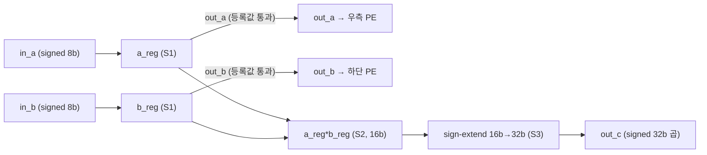
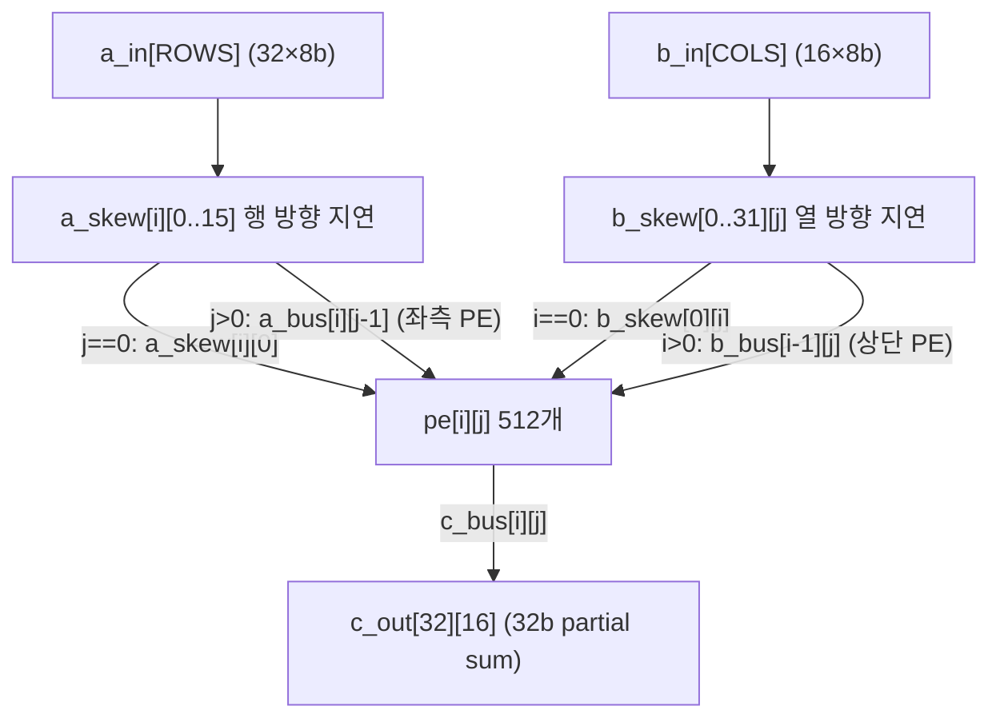
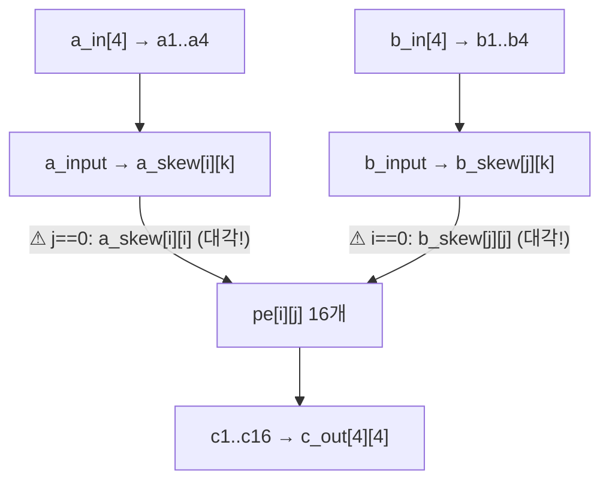
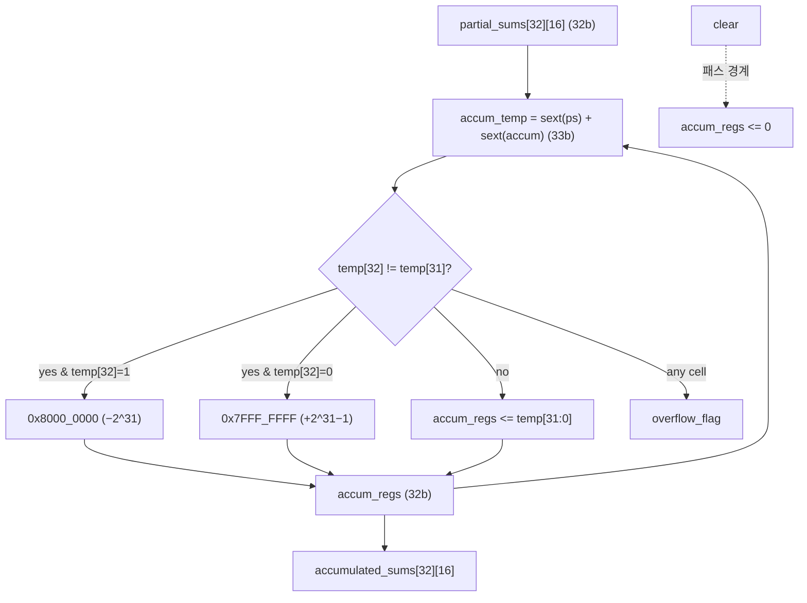
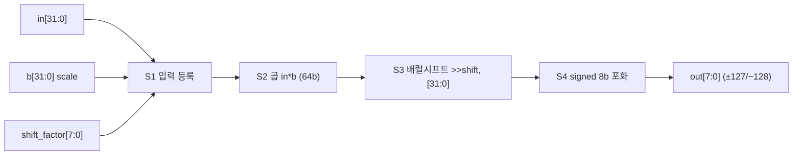
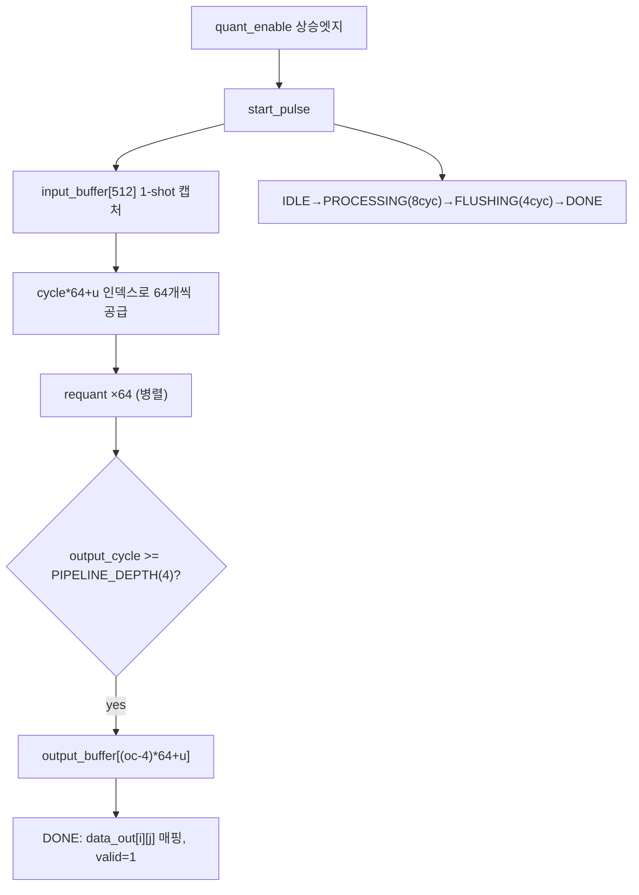
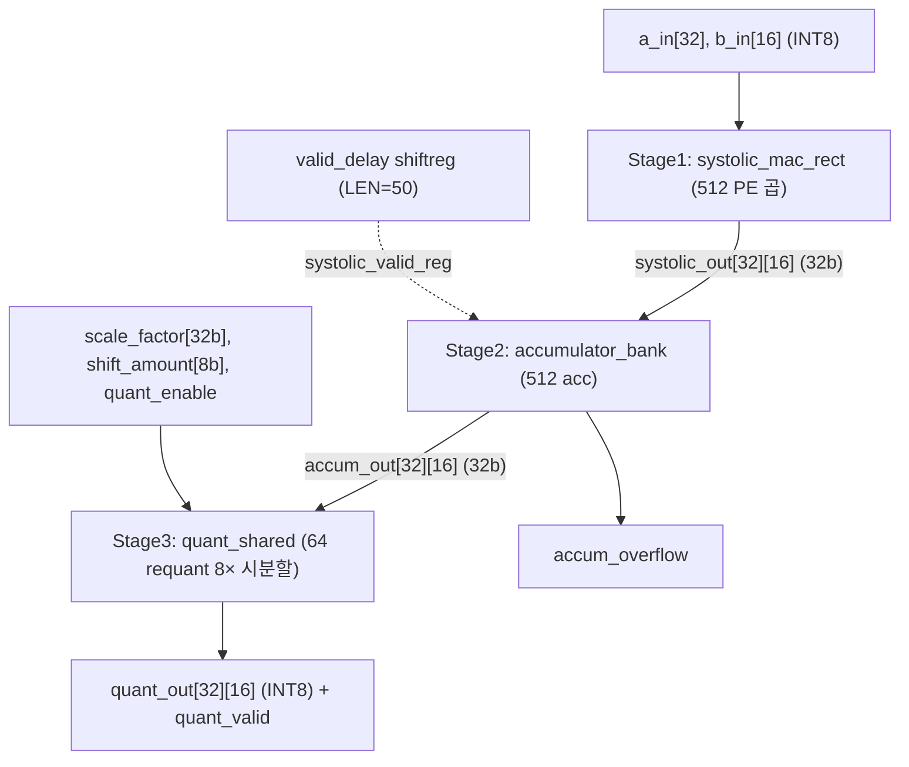
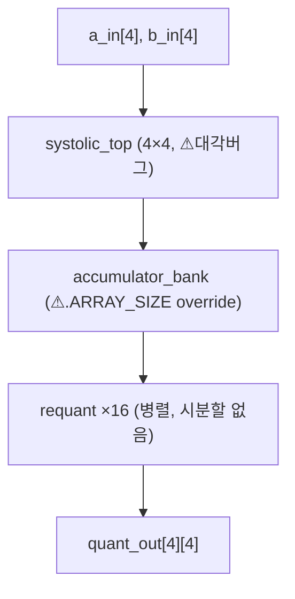

# efficient-transformer-accelerator (Glide Accelerator) 모듈 통합 가이드

> 1차 요약(맥락): [`../efficient-transformer-accelerator.md`](../efficient-transformer-accelerator.md)
> 소스 루트: `REF/ViT-Accelerator/efficient-transformer-accelerator`. 본 가이드는 **`hw/src/`** 의 핸드라이트 SystemVerilog RTL을 정본으로 삼고, `hw/src/systolic_quant_32x16.sv`(신세대 32×16 통합 top)를 주력 데이터패스로 분석한다. 구세대 4×4 경로(`systolic_mac.sv`·`systolic_top.sv`·`systolic_quant_integrated.sv`)는 차이점/버그 중심으로만 다룬다.
> 표기 규약: 라인으로 직접 확인한 사실은 단정, 코드 정황 기반은 "추정", 코드/문서에 없으면 "확인 불가". 시뮬레이션·합성 미실행(정적 코드 리딩).
> 제외물(이름만): `ViTALiTy/**`(GaTech-EIC HPCA'23 원본 vendoring — ViT-Quantization 카테고리 별도 분석), `models/degree_{1,2}_train/*.pth`·`*.log`(학습 산출물), `ViTALiTy/logs/*.log`·`.github/*.png`·`figures/*.png`(이미지), `.git`·`.gitignore`·`.gitattributes`. 합성 리포트(`utilization.rpt`/`timing_summary.rpt`/`power.rpt`/`drc.rpt`)는 스크립트가 생성하나 **리포에 미동봉** → PPA 실측은 확인 불가.

---

## 0. 문서 머리말

### 0.1 대표 케이스 선정

본 RTL은 **일반 INT8 MatMul + requant 엔진**이며 "Taylor degree-2 linear attention"은 SW(별도 ViTALiTy/models) 개념이다. RTL이 실제로 검증·실행하는 단위와 알고리즘 정합 단위를 함께 잡는다.

- **대표 GEMM 타일(확인됨)**: **32×16 외적(outer-product) 1패스 → 누산 1회 → 64유닛 시분할 requant**. TB가 실제로 돌린 단위가 이것이다. `systolic_32x16_tb.sv` L119~L136(Test1: `a_in`/`b_in` 전부 1 → 모든 출력 1×1=1), L173~L213(Test2: 2×3=6), L218~L268(Test3: 멀티패스 6+2=8). 즉 리포가 검증한 최소 실행 단위는 **1개 외적(rank-1 update) + 멀티패스 누적**이다. 일반 32×16×K MatMul은 이 외적을 K번 누적해 구성(`systolic_quant_32x16.sv` L14 주석 "32×16×K MatMul in K+~40 cycles").
- **linear-attention 1단계(추정·매핑)**: Taylor 선형 어텐션의 핵심 연산은 결국 **행렬곱**(Q·Kᵀ projection, K·V context, FFN, projection)이므로 → `systolic_mac_rect`의 INT8 MatMul 1타일로 대응. 단 **Taylor 특유의 global context matrix(KᵀV) 누적·정규화 단은 RTL에 부재**(확인 결과 없음). 모델 per-tensor scale/shift → RTL `scale_factor`/`shift_amount` 포트(`systolic_quant_32x16.sv` L37-38)로 주입되는 것이 SW↔HW 접점의 전부다.

선정 근거: (1) 리포에 박혀 있는 실제 실행/검증 단위(외적 타일, TB 3종), (2) HW↔SW 정합이 가능한 유일 단위(scale/shift 양자화 파라미터). TATAA의 `isqrt 0x5f37`처럼 비트정합 앵커가 없으므로(본 RTL엔 비선형 SFU 없음), 대표 케이스는 GEMM 타일에 집중한다.

### 0.2 수치 표기 규약

- **MAC lanes**: PE 어레이 동시 곱셈기 수 = **512 = 32행(ROWS) × 16열(COLS)**(`systolic_mac_rect.sv` L8-9, `systolic_quant_32x16.sv` L18-19). PE 1개 = 곱셈 1개(`pe.sv` L68); 누산은 PE 밖(`accumulator_bank`). 따라서 `512 MAC lanes` = `512 곱/cyc` = peak 102.4 GOPS@200MHz(곱+가산 2-op 환산, `readme.md` L10,18).
- **scalar MACs**: 대표 GEMM의 M·N·K 곱. 32×16×K 타일 = 512·K MAC.
- **loop trips / cycle**: FSM 반복. systolic 전파 `SYSTOLIC_LATENCY=ROWS+COLS+2=50`(`systolic_quant_32x16.sv` L76), 양자화 `CYCLES_PER_BATCH=ceil(512/64)=8` + `PIPELINE_DEPTH=4`(`quant_shared.sv` L31-33).
- **memory size (payload bit)**: 버퍼 배열 깊이×폭(bit). `quant_shared`의 `input_buffer`/`output_buffer`가 유일한 대형 on-chip 배열(BRAM/FIFO 없음 — 전부 분산 레지스터).

### 0.3 운영 경로 (RTL ↔ quantization ↔ synthesis)

```
[quantization (SW, 별도)]  ViTALiTy degree-1/2 Taylor 어텐션 ViT 학습 → INT8 PTQ → per-tensor scale/shift
        │  (.npz 활성값 → test.py 인스펙터; HW 골든 연결 코드는 부재)
[RTL 입력 포맷]  a_in[32]/b_in[16] INT8 벡터 + scale_factor[32b]/shift_amount[8b]
        │
[데이터패스]  systolic_mac_rect(512 PE 곱) → accumulator_bank(512 acc 누적+포화) → quant_shared(64 requant, 8× 시분할)
        │
[FPGA 합성]  vivado_synth.tcl (top=systolic_quant_32x16, part=xczu7ev) + timing.xdc(200MHz)
[ASIC 합성]  synthesis_asic.sdc (top=systolic_top, 500MHz 예시, PDK 플레이스홀더) → DC/Genus
[requant 단독]  vivado_flow.tcl (top=quant_top, 500MHz target) — requant만 독립 합성/freq 산출
```
근거: `systolic_quant_32x16.sv` L48~L135, `vivado_synth.tcl` L10,18,48-58, `timing.xdc` L12, `synthesis_asic.sdc` L11,71, `vivado_flow.tcl` L8,13,133.

### 0.4 타깃 / 데이터타입 / 정책

- **타깃**: **FPGA·ASIC 듀얼**. FPGA 주 타깃 ZCU104 `xczu7ev-ffvc1156-2-e`(`vivado_synth.tcl` L18, `vivado_flow.tcl` L13), 자원 수치는 ZU9EG 병기(`PRODUCTION_RELEASE_NOTES.md` L107). ASIC은 `synthesis_asic.sdc`로 골격 제공(500MHz=2.0ns 예시, `set_driving_cell`/라이브러리가 `<BUFFER_CELL>`,`<LIB_NAME>` **플레이스홀더** L71 → 실 PDK 미연결).
- **데이터타입**: 입력 signed INT8(`pe.sv` L35-36), 곱 16b→32b sign-ext(`pe.sv` L68,71), 누산 signed 32b(검출 33b, `accumulator_bank.sv` L20-21), requant 중간곱 64b(`quant.sv` L19), 출력 signed INT8(±127/−128 포화, `quant.sv` L91,99). 단일 정밀도 INT8, per-tensor 단일 scale/shift(BF16/FP16·per-channel 없음, `PRODUCTION_RELEASE_NOTES.md` L183-185).
- **제어 정책**: `enable`(clock-gating 겸용, `pe.sv` L34) / `accum_clear`(패스 경계 0초기화, `accumulator_bank.sv` L29) / `accum_enable & systolic_valid_reg`(누적 게이트, `systolic_quant_32x16.sv` L102) / `quant_enable` 상승엣지(`start_pulse`로 양자화 FSM 기동, `quant_shared.sv` L64). valid는 shift-register 지연으로 생성(`systolic_quant_32x16.sv` L84).
- **상태**: 문서상 "Production Ready v0.02, 3 테스트 통과·200MHz timing met"(`PRODUCTION_RELEASE_NOTES.md` L3-5,15-19). 단 시뮬/합성 로그·리포트가 리포에 없어 **재현 확인 불가**.

---

## 1. Repo / Layer 개요

| 레이어 | 경로 | 역할 |
|---|---|---|
| **hw/src** | `hw/src/*.sv` | 핸드라이트 SystemVerilog RTL. PE·systolic 코어·누산기·requant·시분할 양자화기·통합 top. **HLS 아님.** 신·구 두 세대 공존. |
| **hw/tb** | `hw/tb/*.sv` | 테스트벤치. 주력 `systolic_32x16_tb.sv`(3 테스트). 구세대 TB 2종(`systolic_tb.sv`/`systolic_quant_tb.sv`). |
| **hw/scripts** | `hw/scripts/*.tcl` | Vivado sim/synth/impl + requant 단독 풀플로우(`vivado_flow.tcl`). |
| **hw/constraints** | `timing.xdc`(FPGA 200MHz) + `synthesis_asic.sdc`(ASIC 500MHz 예시) | 듀얼 타깃 제약 분리. |
| **models** | `models/degree_2_quant/test.py`(7줄 npz 인스펙터) + `degree_{1,2}_train/`(학습 산출물, 제외) | SW 측 실체는 인스펙터 1개뿐. 모델 정의 소스는 부재. |
| **ViTALiTy** (제외) | `ViTALiTy/**` | GaTech-EIC HPCA'23 Linear Taylor Attention 원본. degree 개념 출처로만 참조. |

- 자체 RTL 모듈 수(hw/src): **11개 .sv**(아래 §1 계층 참조). Verilog(.v) 없음(`Glob *.v` → 0건).
- README 3개(`readme.md` 루트, `hw/README_VIVADO.md`, `hw/IMPLEMENTATION_GUIDE.md`)는 본문 충실(빈 제목 없음).

### 모듈 인스턴스 계층 (top → leaf)

```
■ 신세대(주력, 빌드 top):
systolic_quant_32x16.sv   (32×16 통합 top, vivado_synth.tcl top)
├─ systolic_mac_rect.sv   (32×16 직사각 systolic 코어, 512 PE)
│  └─ pe.sv ×512          (곱셈 전용 3-stage PE)
├─ accumulator_bank.sv    (512 누산기 + 포화/오버플로 검출)
└─ quant_shared.sv        (64 requant 시분할 + FSM)
   └─ requant (quant.sv) ×64   (4-stage 재양자화 유닛)

■ requant 단독 합성:
quant_top.sv → requant(quant.sv) ×1   (vivado_flow.tcl top)

■ 구세대(레거시, 빌드엔 포함되나 top 미사용):
systolic_quant_integrated.sv (4×4 통합 top)
├─ systolic_top.sv        (4×4 벡터 래퍼)
│  └─ Systolic (systolic_mac.sv)  → pe ×16   [⚠ a_skew[i][i] 버그 잔존]
├─ accumulator_bank.sv    [⚠ .ARRAY_SIZE override 불일치]
└─ requant(quant.sv) ×16  (시분할 없이 셀당 1개)
```
근거: `systolic_quant_32x16.sv` L61-135, `systolic_mac_rect.sv` L120, `quant_shared.sv` L156, `vivado_synth.tcl` L10,48-58, `systolic_quant_integrated.sv` L41-108.

---

## 2. Processing Element (`pe.sv`) — 곱셈 전용 systolic 셀

### 2.1 역할 + 상위/하위 관계
systolic 배열의 1개 셀. **곱셈만 수행**하고 누산은 외부 `accumulator_bank`에 위임(`pe.sv` L43 주석 명시). 누적 레지스터가 없는 "multiply + 데이터 통과" 셀이다. 상위: `systolic_mac_rect`(generate ×512, L120) 및 구세대 `Systolic`(×16). 하위: 없음(leaf, 합성기가 곱셈을 DSP로 추론).

### 2.2 데이터플로우


### 2.3 모듈 인스턴스 계층 / call stack
`systolic_quant_32x16` → `systolic_mac_rect` → `pe`(generate `ROW[i].COL[j]`, 512개) → (DSP 프리미티브 추론). 구세대: `systolic_quant_integrated` → `systolic_top` → `Systolic` → `pe`(16개).

### 2.4 대표 코드 위치
`hw/src/pe.sv`(전체 76줄, 단일 always_ff 3-stage 파이프).

### 2.5 대표 코드 블록

(1) **포트: signed INT8 입력, 통과 출력 2개 + 32b 곱 출력 1개** (`pe.sv` L28~L40)
```systemverilog
module pe #(parameter DATA_WIDTH=8, parameter ACC_WIDTH=32)(
    input  logic clk, reset, enable,                     // enable=clock gating
    input  logic signed [DATA_WIDTH-1:0] in_a, in_b,
    output logic signed [DATA_WIDTH-1:0] out_a, out_b,   // systolic 통과
    output logic signed [ACC_WIDTH-1:0]  out_c           // 곱 결과(누산은 외부)
);
```
→ `out_c`만 곱이고 누적 레지스터가 없다. PE 1개 = 1 곱/cyc.

(2) **3-stage 파이프 + 등록값 통과(버그픽스 반영)** (`pe.sv` L58~L72)
```systemverilog
end else if (enable) begin
    a_reg <= in_a; b_reg <= in_b;                 // S1: 입력 등록
    out_a <= a_reg; out_b <= b_reg;               // 등록값 통과(systolic 타이밍 유지)
    mult_result <= a_reg * b_reg;                 // S2: 16b 곱
    mult_extended <= {{(ACC_WIDTH-2*DATA_WIDTH){mult_result[2*DATA_WIDTH-1]}}, mult_result};
    out_c <= mult_extended;                       // S3: 32b sign-extend
end
```
→ 릴리스 노트가 기록한 버그픽스 #3 "현재 입력 대신 등록값(a_reg) 통과"가 L64-65에 반영(`PRODUCTION_RELEASE_NOTES.md` L81-86). 부호확장은 `mult_result[15]` 복제로 32b 채움(L71).

### 2.6 마이크로아키텍처: Stage 분해 + 정량
- **S1(L60-61)**: `in_a/in_b` → `a_reg/b_reg` 등록. 동시에 `out_a/out_b`로 *직전* 등록값 통과(L64-65) → systolic 동기.
- **S2(L68)**: `a_reg*b_reg`, signed 16b(=2×DATA_WIDTH).
- **S3(L71-72)**: 16b→32b sign-extend 후 `out_c`.
- **레이턴시**: 곱 결과까지 3 사이클(입력 등록 → 곱 → sign-ext).
- **정량(1 PE)**: 1 곱/cyc. 512 PE 어레이 = **512 곱/cyc**.
- **특이점/불일치**: 모듈 헤더 주석은 "saturation/overflow protection"(L21)을 표방하나 본문엔 곱셈만 있고 포화 로직 없음 → 포화는 `accumulator_bank`(§5)로 이전됨. 설계 의도가 모듈 분리되며 남은 주석 잔재(추정).

---

## 3. 32×16 직사각 systolic 코어 (`systolic_mac_rect.sv`) — 주력

### 3.1 역할 + 상위/하위
M×N(=ROWS×COLS) 직사각 PE 배열. transformer의 비대칭 차원(32 출력 feature × 16 reduction)을 겨냥(`systolic_mac_rect.sv` L3-9). 상위: `systolic_quant_32x16`(L61, `u_systolic`). 하위: `pe` 512개 + skew 레지스터.

### 3.2 데이터플로우


### 3.3 모듈 인스턴스 계층
`systolic_quant_32x16` → `systolic_mac_rect` → generate `ROW[0..31].COL[0..15].pe_inst`(512). A는 행 따라 우측, B는 열 따라 아래로 흐르는 weight/data-flowing systolic.

### 3.4 대표 코드 위치
`hw/src/systolic_mac_rect.sv`(전체 138줄). 핵심: skew(L45-72), PE 입력 선택(L99-117), 출력 등록(L78-84).

### 3.5 대표 코드 블록

(1) **삼각형 입력 skew — systolic 동기화** (`systolic_mac_rect.sv` L56~L70)
```systemverilog
for (int i=0;i<ROWS;i++) begin            // A 수평 전파(좌→우)
    a_skew[i][0] <= a_in[i];
    for (int j=1;j<COLS;j++) a_skew[i][j] <= a_skew[i][j-1];
end
for (int j=0;j<COLS;j++) begin            // B 수직 전파(상→하)
    b_skew[0][j] <= b_in[j];
    for (int i=1;i<ROWS;i++) b_skew[i][j] <= b_skew[i-1][j];
end
```
→ 행마다 j방향, 열마다 i방향 지연을 넣어 데이터 도착 시각을 어긋나게(skew) 만든다.

(2) **PE 입력 선택(버그픽스 반영) — a_skew[i][0] 사용** (`systolic_mac_rect.sv` L99~L116)
```systemverilog
if (j==0) pe_in_a = a_skew[i][0];         // ★ 첫 열은 skew 첫 컬럼 (구버전 [i][i] 버그 → [i][0]로 교정)
else      pe_in_a = a_bus[i][j-1];        // 이후 열은 좌측 PE
if (i==0) pe_in_b = b_skew[0][j];         // ★ 첫 행은 skew 첫 로우
else      pe_in_b = b_bus[i-1][j];        // 이후 행은 상단 PE
```
→ 릴리스 노트 버그픽스 #2 "PE가 대각 원소를 읽던 버그"의 수정본(`PRODUCTION_RELEASE_NOTES.md` L75-79; 신버전 L103·L112). 구세대 `systolic_mac.sv` L100,107은 미수정(§4 참조).

(3) **2-FF reset 동기화 + 출력 1단 등록** (`systolic_mac_rect.sv` L40~L43, L78~L84)
```systemverilog
always_ff @(posedge clk) begin reset_sync1<=reset; reset_sync2<=reset_sync1; end
...
else if (enable) c_out <= c_bus;          // PE 곱 결과 1단 등록
```

### 3.6 마이크로아키텍처 + 정량
- **PE 격자**: 32×16 = **512 PE = 512 곱/cyc**. dataflow는 누산이 PE 밖이라 순수 output-stationary가 아닌 **매 패스 외적(rank-1) 방출형**(partial-sum-streaming) — 1 패스 = 1 외적, K 외적을 외부 누산기에 누적(추정; TB가 단일 외적 검증, `systolic_32x16_tb.sv` L119-136).
- **skew 깊이**: A 최대 COLS−1=15, B 최대 ROWS−1=31 사이클 지연. systolic 충진 = ROWS+COLS 수준.
- **메모리(payload)**: `a_skew`/`b_skew` 각 32×16×8b = **4096 b ×2 = 8192 b**(분산 FF). `c_out` 32×16×32b = 16384 b.
- **병목**: 512 PE × (입력등록+곱+sign-ext) 파이프, critical path는 PE 곱셈 체인(`PRODUCTION_RELEASE_NOTES.md` L63). 차원 32×16 하드코딩(파라미터지만 top 고정), 다른 크기는 RTL 수정 필요.

---

## 4. 구세대 4×4 경로 (`systolic_mac.sv`/`systolic_top.sv`) — 레거시·버그 잔존

### 4.1 역할 + 상위/하위
4×4 정방 systolic 코어(`module Systolic`)와 벡터 래퍼(`systolic_top`). `systolic_top`이 4-원소 벡터를 `Systolic`의 스칼라 포트 a1..a4/b1..b4 ↔ 16 스칼라 출력 c1..c16에 수동 매핑(`systolic_top.sv` L45-58). 상위: `systolic_quant_integrated`(레거시 top). v0.01 프로토타입(`PRODUCTION_RELEASE_NOTES.md` L242-245).

### 4.2 데이터플로우


### 4.3 모듈 인스턴스 계층
`systolic_quant_integrated` → `systolic_top` → `Systolic`(`systolic_mac.sv`) → `pe`(generate ×16). 포트가 스칼라 16개로 평탄화되어 확장성 없음(`systolic_mac.sv` L12-18).

### 4.4 대표 코드 위치
`hw/src/systolic_mac.sv`(전체 130줄), `hw/src/systolic_top.sv`(61줄).

### 4.5 대표 코드 블록

(1) **⚠ 잔존 버그 — PE가 대각 인덱스를 읽음(미수정)** (`systolic_mac.sv` L98~L109)
```systemverilog
always_comb begin
    if (j==0) pe_in_a = a_skew[i][i];     // ⚠ rect는 [i][0]로 고쳤으나 여기는 [i][i] 그대로
    else      pe_in_a = a_bus[i][j-1];
    if (i==0) pe_in_b = b_skew[j][j];     // ⚠ 대각 인덱스 잔존
    else      pe_in_b = b_bus[i-1][j];
end
```
→ 릴리스 노트는 버그픽스 #2를 **rect 버전에서만** 적용(`PRODUCTION_RELEASE_NOTES.md` L75-79는 `systolic_mac_rect.sv:103,112`만 언급). 구세대 4×4 경로는 미수정으로 남아 **기능 오류 가능성 높음**(정적 분석 기준 추정, 시뮬 미실행으로 확정 불가).

(2) **skew 인덱싱도 rect와 상이** (`systolic_mac.sv` L57~L69)
```systemverilog
for (int i=0;i<ARRAY_SIZE;i++) begin
    a_skew[i][0] <= a_input[i];
    for (int k=1;k<ARRAY_SIZE;k++) a_skew[i][k] <= a_skew[i][k-1];   // 행 방향
end
for (int j=0;j<ARRAY_SIZE;j++) begin
    b_skew[j][0] <= b_input[j];                                       // ⚠ b_skew[j][..] (rect는 b_skew[..][j])
    for (int k=1;k<ARRAY_SIZE;k++) b_skew[j][k] <= b_skew[j][k-1];
end
```
→ rect(`systolic_mac_rect.sv` L65-69)는 `b_skew[i][j]` 열 방향, 구세대는 `b_skew[j][k]` 행 방향 — 인덱스 의미가 다르고 PE 입력 선택의 대각 버그와 맞물려 동작 불일치(추정).

### 4.6 마이크로아키텍처 + 정량
- **PE 격자**: 4×4 = 16 PE. 입력에 1단 추가 레지(`a_input`/`b_input`, L26-27) → rect보다 파이프 1단 깊음.
- **현황**: `vivado_synth.tcl` L48-58이 9개 src를 모두 컴파일 목록에 넣되 **top은 신세대 `systolic_quant_32x16`로 고정**(L10). 구세대 파일은 빌드 포함되나 최상위 미사용 → 레거시/프로토타입 잔재.
- **리스크**: 만약 `systolic_quant_integrated`나 `systolic_top`을 top으로 쓰면 대각 버그로 오동작. 정리(삭제/격리) 권장.

---

## 5. 누산기 뱅크 (`accumulator_bank.sv`) — 멀티패스 누적 + 포화

### 5.1 역할 + 상위/하위
PE가 매 패스 방출하는 partial sum을 셀별로 누적(타일드 MatMul의 K-차원 누적). 누적 시 signed 오버플로 검출 + 포화 클램프. 상위: `systolic_quant_32x16`(L95, `u_accumulator`) 및 레거시 통합 top. 하위: 없음(분산 레지스터 배열).

### 5.2 데이터플로우


### 5.3 모듈 인스턴스 계층
`systolic_quant_32x16` → `accumulator_bank`(`.ROWS(32).COLS(16)` override, L95-99). 레거시: `systolic_quant_integrated` → `accumulator_bank`(`.ARRAY_SIZE` override — **불일치**, §11 버그).

### 5.4 대표 코드 위치
`hw/src/accumulator_bank.sv`(전체 66줄). 핵심: 누적+포화(L33-49), overflow 집계(L53-60).

### 5.5 대표 코드 블록

(1) **33b 확장 가산으로 signed 오버플로 검출** (`accumulator_bank.sv` L35~L36)
```systemverilog
accum_temp[i][j] = {partial_sums[i][j][ACC_WIDTH-1], partial_sums[i][j]} +   // sign-ext 33b
                   {accum_regs[i][j][ACC_WIDTH-1],   accum_regs[i][j]};
```
→ 1bit 확장(33b)으로 부호비트와 MSB 불일치를 오버플로 신호로 사용.

(2) **부호비트 불일치 → 포화 클램프** (`accumulator_bank.sv` L38~L47)
```systemverilog
if (accum_temp[i][j][ACC_WIDTH] != accum_temp[i][j][ACC_WIDTH-1]) begin
    overflow_detected[i][j] <= 1'b1;
    if (accum_temp[i][j][ACC_WIDTH]) accum_regs[i][j] <= {1'b1,{(ACC_WIDTH-1){1'b0}}};  // −2^31
    else                              accum_regs[i][j] <= {1'b0,{(ACC_WIDTH-1){1'b1}}};  // +2^31−1
end else accum_regs[i][j] <= accum_temp[i][j][ACC_WIDTH-1:0];
```
→ INT8×INT8 누적의 정수 안전성 확보 표준 기법. PE에서 누산을 분리해 여기 집중 → PE 면적 절감 + 멀티패스 타일링 유연성.

(3) **파라미터 기본값 4×4 — 32×16은 인스턴스 override 필수** (`accumulator_bank.sv` L4~L7)
```systemverilog
module accumulator_bank #(parameter ROWS=4, parameter COLS=4, parameter ACC_WIDTH=32)(...)
```
→ 기본값이 4×4라 32×16 사용 시 `systolic_quant_32x16.sv` L96-97에서 `.ROWS(32).COLS(16)` 명시 전달.

### 5.6 마이크로아키텍처 + 정량
- **격자**: 512 누산기(32×16), 각 32b. `accum_regs` = 512×32b = **16384 b**(분산 FF). `accum_temp` 33b는 always_ff 내 blocking assign 임시값(L35).
- **제어**: `clear`(패스 시작 0초기화, L29) / `enable=accum_enable & systolic_valid_reg`(systolic 유효 시에만 누적, `systolic_quant_32x16.sv` L102).
- **overflow**: 임의 셀 발생 시 `overflow_flag` OR-reduce(L53-60). 한번 set되면 `clear/reset` 전까지 유지(sticky, L39).
- **병목**: 512셀 병렬 가산기 → 면적 큼. 포화는 매 누적마다 비교 → critical path 후보(하지만 32b 가산이라 PE 곱 체인보다는 짧을 것으로 추정).

---

## 6. 단일 재양자화 유닛 (`quant.sv` module `requant`) — 4-stage requant

### 6.1 역할 + 상위/하위
32b 누적값을 INT8로 재양자화: `round(acc × scale >> shift)` 후 포화. transformer requantization을 4-stage 파이프로 구현. 상위: `quant_shared`(64 인스턴스, L156) / `quant_top`(단독 1개) / 레거시 통합 top(16개 병렬). 하위: 없음(곱셈은 DSP 추론).

### 6.2 데이터플로우


### 6.3 모듈 인스턴스 계층
`quant_shared` → `requant`(generate `QUANT_UNIT[0..63]`, L155-166). `quant_top` → `requant`(×1). `systolic_quant_integrated` → `requant`(generate ×16, L93-108).

### 6.4 대표 코드 위치
`hw/src/quant.sv`(전체 110줄). S2 곱(L53-58), S3 시프트(L70-76), S4 포화(L85-104).

### 6.5 대표 코드 블록

(1) **S2 곱셈 — DSP 추론 의도** (`quant.sv` L52~L58)
```systemverilog
if (en_s1) begin
    mult_result <= in_s1 * b_s1;   // 32b*32b → 64b (주석: "Synthesis tools can infer DSP")
    shift_s2 <= shift_s1;
end
```

(2) **S3 배럴시프트 — 64b 시프트 후 하위 32b** (`quant.sv` L70~L76)
```systemverilog
if (en_s2) begin
    shift_temp = mult_result >> shift_s2;   // ⚠ 논리(unsigned) 시프트
    shifted <= shift_temp[31:0];
end
```

(3) **S4 signed 8b 포화** (`quant.sv` L87~L103)
```systemverilog
if (shifted[31]) begin                       // 음수
    if (~(&shifted[31:7])) clamped <= 8'h80;  // 음수 오버플로 → −128
    else                   clamped <= shifted[7:0];
end else begin                                // 양수
    if (|shifted[31:7])    clamped <= 8'h7F;  // 양수 오버플로 → +127
    else                   clamped <= shifted[7:0];
end
```

### 6.6 마이크로아키텍처 + 정량
- **4 stage**: S1 등록(L31-43) → S2 곱 64b(L47-59) → S3 배럴시프트(L65-77) → S4 포화(L81-106). 레이턴시 4 사이클. `en`이 stage별로 전파(`en_s1/2/3`).
- **비트폭 주의(잠재 이슈)**: 포트 `in[31:0]`/`b[31:0]`/`out[7:0]`이 **unsigned 선언**(L2-6)이나 S4는 `shifted[31]`을 부호비트로 다루는 **signed 의미**(L87,97). 곱셈도 unsigned `*`(L54), 시프트는 **논리 `>>`**(L72). 음수 누적값(accum 32b는 signed)을 unsigned로 받아 처리하면 부호 처리가 선언과 어긋날 소지 → **음수 양자화 정확도 검증 필요**(정적 분석 추정, 실측 미확인). 권장: signed 명시 + 산술시프트(`>>>`).
- **정량**: 1 requant = 1 출력/4cyc(파이프 충진 후 throughput 1/cyc). 64 인스턴스 = 64 출력/cyc(시분할, §7).

---

## 7. 시분할 공유 양자화기 (`quant_shared.sv`) — 자원효율 핵심

### 7.1 역할 + 상위/하위
512개(32×16) 누적값을 **64개 requant로 8배 시분할** 양자화. 512 전용 유닛 대비 448 DSP(87.5%) 절감(`PRODUCTION_RELEASE_NOTES.md` L121). FSM(IDLE→PROCESSING→FLUSHING→DONE)으로 입력 캡처→8배치 공급→파이프 비움→출력 매핑. 상위: `systolic_quant_32x16`(L120, `u_quant_shared`). 하위: `requant` ×64.

### 7.2 데이터플로우


### 7.3 모듈 인스턴스 계층
`systolic_quant_32x16` → `quant_shared` → `requant`(generate `QUANT_UNIT[0..63]`, L155). FSM·input_buffer·output_buffer는 내부 분산 레지스터.

### 7.4 대표 코드 위치
`hw/src/quant_shared.sv`(전체 217줄). 상수(L31-33), FSM(L70-114), 입력 캡처(L122-130), 유닛 공급/생성(L141-166), 출력 수집(L175-194), 매핑(L200-214).

### 7.5 대표 코드 블록

(1) **시분할 상수 도출** (`quant_shared.sv` L31~L33)
```systemverilog
localparam TOTAL_ELEMENTS   = ROWS * COLS;                              // 512
localparam CYCLES_PER_BATCH = (TOTAL_ELEMENTS + QUANT_UNITS-1)/QUANT_UNITS;  // ceil(512/64)=8
localparam PIPELINE_DEPTH   = 4;                                        // requant 4-stage
```

(2) **start_pulse(상승엣지) + 입력 1-shot 캡처** (`quant_shared.sv` L64, L122~L130)
```systemverilog
assign start_pulse = enable_reg & ~enable_prev;
...
if (start_pulse)
    for (int i=0;i<ROWS;i++) for (int j=0;j<COLS;j++)
        input_buffer[i*COLS + j] <= data_in[i][j];   // 512개 누적값 통째 캡처
```

(3) **사이클별 64개 선택 + 64 유닛 병렬 생성** (`quant_shared.sv` L141~L164)
```systemverilog
for (int u=0;u<QUANT_UNITS;u++) begin
    int element_idx = cycle_count*QUANT_UNITS + u;
    quant_in[u] = (element_idx<TOTAL_ELEMENTS && state==PROCESSING) ? input_buffer[element_idx] : 0;
end
...
requant quant_inst (.clk(clk),.rst(reset),.en(state==PROCESSING||state==FLUSHING),
                    .in(quant_in[u]),.b(scale_factor),.shift_factor(shift_amount),.out(quant_out[u]));
```

(4) **출력 수집(버그픽스 반영) — output_cycle 연속 증가** (`quant_shared.sv` L181~L192)
```systemverilog
end else if (state==PROCESSING || state==FLUSHING) begin
    if (output_cycle>=PIPELINE_DEPTH && output_cycle<CYCLES_PER_BATCH+PIPELINE_DEPTH) begin
        int base_idx = (output_cycle - PIPELINE_DEPTH)*QUANT_UNITS;
        for (int u=0;u<QUANT_UNITS;u++) begin
            int element_idx = base_idx + u;
            if (element_idx<TOTAL_ELEMENTS) output_buffer[element_idx] <= quant_out[u];
        end
    end
    output_cycle <= output_cycle + 1;
end
```
→ 릴리스 노트 버그픽스 #1 "출력버퍼가 0만 나오던 버그"의 수정본(`write_cycle`→연속 `output_cycle`, `PRODUCTION_RELEASE_NOTES.md` L69-74).

### 7.6 마이크로아키텍처 + 정량
- **메모리(payload)**: `input_buffer` 512×32b = **16384 b**, `output_buffer` 512×8b = **4096 b**(분산 FF; BRAM 추론 아님 — 1-shot 병렬 캡처/매핑 때문).
- **레이턴시**: PROCESSING 8 + FLUSHING 4 + DONE 1 = **~13 cyc**(`PRODUCTION_RELEASE_NOTES.md` L54). throughput 39.4 elem/cyc(=512/13, L55).
- **정량**: 64 requant × (512/64=8 배치) = 512 출력. 512:64 = 8× 시분할이 양자화기 면적-지연 trade-off의 핵심 노브(`QUANT_UNITS` 파라미터).
- **⚠ 잠재 버그(신규 발견, 재확인 필요)**: `output_cycle`은 `reset`(L176)과 `state==IDLE && start_pulse`(L179) 외엔 0으로 리셋되지 않는다. start_pulse가 뜨는 사이클의 state는 보통 IDLE이므로 첫 양자화는 정상이나, **연속 양자화 호출 사이에 IDLE 경유가 보장되지 않거나 start_pulse 시점 state가 IDLE이 아니면 output_cycle이 리셋 안 됨**. FSM은 DONE→IDLE(L111)을 거치므로 단발 호출은 OK로 보이나(추정), 백투백 트리거 시 정렬 어긋날 소지 → 동적 검증 권장. (정적 분석 기준 추정, TB는 단발 호출만 검증 `systolic_32x16_tb.sv` L153,199,254.)

---

## 8. 신세대 통합 Top (`systolic_quant_32x16.sv`) — 주력 데이터패스

### 8.1 역할 + 상위/하위
3-stage 통합: **systolic(곱) → accumulator(누적) → quant_shared(재양자화)** 직렬 연결. 빌드 top(`vivado_synth.tcl` L10). 상위: 없음(top). 하위: `systolic_mac_rect`/`accumulator_bank`/`quant_shared`.

### 8.2 데이터플로우


### 8.3 모듈 인스턴스 계층
`systolic_quant_32x16` → {`u_systolic`(systolic_mac_rect), `u_accumulator`(accumulator_bank), `u_quant_shared`(quant_shared)}. 데이터타입 전구간: INT8 입력 → 32b partial sum → 32b 누적 → INT8 출력.

### 8.4 대표 코드 위치
`hw/src/systolic_quant_32x16.sv`(전체 138줄). 3 스테이지 인스턴스(L61-135), valid 지연(L75-89).

### 8.5 대표 코드 블록

(1) **Stage1 systolic + valid shift-register 지연** (`systolic_quant_32x16.sv` L75~L89)
```systemverilog
localparam SYSTOLIC_LATENCY = ROWS + COLS + 2;   // 32+16+2 = 50
logic [SYSTOLIC_LATENCY-1:0] valid_delay;
always_ff @(posedge clk) begin
    valid_delay <= {valid_delay[SYSTOLIC_LATENCY-2:0], enable};
    systolic_valid_reg <= valid_delay[SYSTOLIC_LATENCY-1];   // enable을 50cyc 지연 → systolic 유효
end
```

(2) **Stage2 누적 게이트 — systolic 유효 시에만** (`systolic_quant_32x16.sv` L95~L107)
```systemverilog
accumulator_bank #(.ROWS(ROWS),.COLS(COLS),.ACC_WIDTH(ACC_WIDTH)) u_accumulator (
    .enable(accum_enable & systolic_valid_reg),  // ★ 누적은 systolic 데이터 도착 후에만
    .clear(accum_clear), .partial_sums(systolic_out), .accumulated_sums(accum_out),
    .overflow_flag(accum_overflow) );
```

(3) **Stage3 양자화 — quant_enable 트리거** (`systolic_quant_32x16.sv` L120~L135)
```systemverilog
quant_shared #(.ROWS(ROWS),.COLS(COLS),.OUT_WIDTH(DATA_WIDTH),.QUANT_UNITS(QUANT_UNITS)) u_quant_shared (
    .enable(quant_enable), .scale_factor(scale_factor), .shift_amount(shift_amount),
    .data_in(accum_out), .data_out(quant_out), .valid(quant_valid) );
```

### 8.6 마이크로아키텍처 + 정량
- **end-to-end 레이턴시**: systolic 48 + quant 13 ≈ **61 cyc**(`PRODUCTION_RELEASE_NOTES.md` L53-56; `SYSTOLIC_LATENCY`는 코드상 50, 문서는 48로 약간 상이 — 둘 다 ROWS+COLS 부근).
- **peak**: 512 곱/cyc @ 200MHz = 102.4 GOPS(곱+가산 환산, `readme.md` L18).
- **정량(대표 32×16×K MatMul)**: scalar MAC = 512·K. 실행 ≈ K(외적 패스) + ~50(systolic 충진) + ~13(양자화). K=512 가정 시 ≈ 575 cyc/타일.
- **병목**: systolic 충진(~50cyc)이 작은 K에선 오버헤드 지배(K≪50이면 utilization 낮음). 양자화 13cyc는 K가 클수록 amortize. AXI/DMA 없음 → 시스템 통합 시 별도 래퍼 필요(`PRODUCTION_RELEASE_NOTES.md` L174,186).

---

## 9. 구세대 통합 Top (`systolic_quant_integrated.sv`) — 레거시·불일치

### 9.1 역할 + 상위/하위
4×4(`ARRAY_SIZE=4`) 통합. systolic_top → accumulator_bank → **requant 16개 병렬**(시분할 없이 셀당 1개). v0.01 프로토타입. 상위: 없음(미사용 top). 하위: `systolic_top`/`accumulator_bank`/`requant`×16.

### 9.2 데이터플로우


### 9.3 모듈 인스턴스 계층
`systolic_quant_integrated` → {`u_systolic`(systolic_top), `u_accumulator`(accumulator_bank), generate `QUANT_ROW.QUANT_COL.u_requant` ×16}.

### 9.4 대표 코드 위치
`hw/src/systolic_quant_integrated.sv`(전체 118줄). 누산기 인스턴스(L67-78), requant 16 병렬(L91-108).

### 9.5 대표 코드 블록

(1) **⚠ 파라미터 불일치 — .ARRAY_SIZE override** (`systolic_quant_integrated.sv` L67~L69)
```systemverilog
accumulator_bank #(.ARRAY_SIZE(ARRAY_SIZE), .ACC_WIDTH(ACC_WIDTH)) u_accumulator (...)
```
→ `accumulator_bank.sv` L4-7은 `ROWS/COLS`만 선언, `ARRAY_SIZE` 없음 → **존재하지 않는 파라미터 override**. 기본값 4×4가 우연히 맞아 동작은 할 수 있으나(ARRAY_SIZE override 무시 + ROWS/COLS=4 default), 엄격한 합성기에선 경고/오류 가능(정적 분석 추정).

(2) **requant 16 병렬(시분할 없음)** (`systolic_quant_integrated.sv` L96~L104)
```systemverilog
requant u_requant (.clk(clk),.rst(reset),.en(quant_enable),
                   .in(accum_out[i][j]),.b(scale_factor),.shift_factor(shift_amount),.out(quant_out[i][j]));
```
→ 16셀 = 16 requant 전용. 신세대의 시분할(`quant_shared`)과 대조 — 작은 4×4에선 전용이 단순.

### 9.6 마이크로아키텍처 + 정량
- **격자**: 16 PE + 16 requant. 양자화 레이턴시 = requant 4-stage(`quant_valid_delay[3]`, L113-116).
- **리스크**: 하위 `systolic_top`이 대각 버그 코어(`Systolic`)를 물고 있어 기능 오류 + 파라미터 불일치 → 실사용 금지 권장. 신세대 top이 주력이라 실무 영향은 제한적.

---

## 10. 모듈 한눈 요약 표

| # | 모듈(파일) | 역할 | 핵심 파라미터/수치 | 대표 라인 |
|---|---|---|---|---|
| 2 | `pe.sv` | 곱셈 전용 3-stage PE | DATA_WIDTH=8, ACC_WIDTH=32; 1곱/cyc | L28, L58-72 |
| 3 | `systolic_mac_rect.sv` | 32×16 직사각 systolic(주력) | 512 PE; a_skew[i][0] 픽스 | L8, L103/L112 |
| 4 | `systolic_mac.sv`/`systolic_top.sv` | 구세대 4×4(레거시) | 16 PE; ⚠ a_skew[i][i] 버그 | mac L100/L107 |
| 5 | `accumulator_bank.sv` | 512 누산 + 포화/오버플로 | 33b 검출, ±2^31 클램프; default 4×4 | L35, L38-47 |
| 6 | `quant.sv`(requant) | 4-stage 재양자화 | 곱 64b, 논리시프트, signed 포화 | L54, L72, L87 |
| 7 | `quant_shared.sv` | 64유닛 8× 시분할 양자화 | 512:64=8배치, ~13cyc; ⚠ output_cycle | L31, L181 |
| 8 | `systolic_quant_32x16.sv` | 신세대 통합 top(빌드 top) | 3-stage; ~61cyc, 102.4 GOPS | L75, L102, L120 |
| 9 | `systolic_quant_integrated.sv` | 구세대 통합 top(레거시) | ⚠ .ARRAY_SIZE 불일치 | L67-69 |
| — | `quant_top.sv` | requant 단독 합성 래퍼 | vivado_flow.tcl top, 500MHz | L14-22 |

---

## 11. 읽기 순서 / 코드 추적 순서

1. **개념 잡기**: 루트 `readme.md`(Glide, 102.4 GOPS) → `PRODUCTION_RELEASE_NOTES.md`(버그픽스 3건·PPA) → 본 §0.
2. **연산 단위(가장 먼저)**: `pe.sv`(곱셈 전용 3-stage). §2.
3. **systolic 데이터플로우**: `systolic_mac_rect.sv`(skew + PE 입력 선택, 픽스 라인 L103/L112). §3. (구세대 `systolic_mac.sv`는 대조용, 대각 버그 확인 §4.)
4. **누적/양자화**: `accumulator_bank.sv`(포화) → `quant.sv`(4-stage requant) → `quant_shared.sv`(시분할 FSM). §5·§6·§7.
5. **통합**: `systolic_quant_32x16.sv`(3-stage 직렬, valid 지연). §8. (레거시 `systolic_quant_integrated.sv`는 §9.)
6. **빌드/검증**: `systolic_32x16_tb.sv`(외적 3종) → `vivado_synth.tcl`(top/part) → `timing.xdc`/`synthesis_asic.sdc`(듀얼 타깃).
7. **SW 정황**: `models/degree_2_quant/test.py`(npz 인스펙터) — RTL과 느슨 연결, 모델 소스는 ViTALiTy(별도).

추적 팁: 버그픽스 3건을 앵커로 신·구 세대를 양방향 대조하면 데이터플로우 전체가 풀린다. `a_skew[i][0]`(rect, 픽스) ↔ `a_skew[i][i]`(mac, 미픽스) 대조가 가장 또렷.

---

## 12. 병목 후보 & 병렬도 노브

| 항목 | 위치 | 병목/리스크 | 병렬도 노브 |
|---|---|---|---|
| systolic 충진 ~50cyc | `systolic_quant_32x16.sv` L76 | 작은 K에서 오버헤드 지배 | K↑(큰 타일) / 충진 amortize |
| 양자화 시분할 8× | `quant_shared.sv` L32 | 13cyc 직렬 양자화 | `QUANT_UNITS`↑(128→4×, 256→2×, 512→1×) |
| 512셀 누산기 면적 | `accumulator_bank.sv` L33 | 512 병렬 가산기+포화 | ACC_WIDTH 축소(16b) / 셀 공유 |
| requant 음수처리 | `quant.sv` L72,87 | unsigned 선언+논리시프트 | signed 명시 + `>>>` 산술시프트 |
| 고정 32×16 | `systolic_mac_rect.sv` L8 | 다른 크기 RTL 수정 | ROWS/COLS 파라미터화(top 가변화) |
| AXI/DMA 부재 | — | 시스템 통합 시 수동 | AXI4-Stream 래퍼 추가 |
| 핵심 병렬도(PE) | `systolic_quant_32x16.sv` L18-19 | 512 곱/cyc 상한 | ROWS×COLS; XR 경량 ViT는 ROWS≫COLS 납작형 검토 |

### 정량 요약(대표 케이스 환원)
- **물리 MAC lanes**: **512 = 32행 × 16열**(`systolic_mac_rect.sv` L8-9). peak 102.4 GOPS@200MHz(곱+가산 2-op, `readme.md` L18).
- **scalar MACs(대표 32×16×K 타일)**: 512·K MAC. TB 검증 단위는 K=1~2 외적(`systolic_32x16_tb.sv` L135,234).
- **loop trips/cycle**: systolic `ROWS+COLS+2=50`(L76), 양자화 `8 배치 + 4 파이프 + 1 done = 13`(`quant_shared.sv` L31-33).
- **on-chip 메모리(payload)**: `input_buffer` 16384 b + `output_buffer` 4096 b(`quant_shared`) + `accum_regs` 16384 b + skew 8192 b + c_out 16384 b. 전부 **분산 FF**(BRAM/URAM 인스턴스 없음). 레지스터 추정 ~40k(`PRODUCTION_RELEASE_NOTES.md` L114).
- **PPA(문서 주장, ZU9EG)**: LUT ~36k(36%), DSP ~576(512 systolic + 64 quant, 15%), BRAM <1%, FF ~40k(20%)(`PRODUCTION_RELEASE_NOTES.md` L107-119). **합성 리포트 미동봉 → 실측 확인 불가.**
- **주파수**: FPGA 200MHz(`timing.xdc` L12), ASIC 500MHz 예시(`synthesis_asic.sdc` L11), requant 단독 500MHz target(`vivado_flow.tcl` L133). 실측 Fmax 확인 불가.

---

## 13. 발견된 RTL 버그·리스크 (재확인 기록)

> 1차 분석(`../efficient-transformer-accelerator.md` §3.3, §3.8, §8)이 지목한 **잔존 버그 2건을 라인 단위로 재확인**하고, 본 정밀 리딩에서 **신규 버그 후보 1건**을 추가 기록한다. 모두 정적 분석 기준이며 시뮬레이션 미실행으로 실동작은 확정 불가.

### 13.1 ⚠ [재확인됨] 구세대 4×4 코어의 대각 인덱스 버그 (미수정)
- **위치**: `systolic_mac.sv` L100 `pe_in_a = a_skew[i][i];`, L107 `pe_in_b = b_skew[j][j];`
- **내용**: PE가 행/열 입력 대신 **대각 원소**를 읽음. 릴리스 노트 버그픽스 #2는 **rect 버전(`systolic_mac_rect.sv` L103/L112)만** 고쳤다고 명시(`PRODUCTION_RELEASE_NOTES.md` L75-79). 구세대 경로는 미수정으로 남음.
- **영향**: `systolic_top`/`systolic_quant_integrated`를 top으로 쓰면 기능 오류 가능. 신세대(`systolic_quant_32x16`)가 빌드 top이라 실무 영향은 제한적이나 레거시 파일이 합성 목록에 포함(`vivado_synth.tcl` L50-51).
- **신세대 정상 대조**: `systolic_mac_rect.sv` L103 `a_skew[i][0]`, L112 `b_skew[0][j]` — 픽스 확인됨.

### 13.2 ⚠ [재확인됨] 레거시 통합 top의 파라미터 불일치
- **위치**: `systolic_quant_integrated.sv` L67-69 `accumulator_bank #(.ARRAY_SIZE(ARRAY_SIZE), ...)`
- **내용**: `accumulator_bank.sv` L4-7은 `ROWS/COLS`만 선언하고 `ARRAY_SIZE`가 없음 → **존재하지 않는 파라미터 override**. 기본값 4×4가 ARRAY_SIZE=4와 우연히 일치해 동작은 가능하나, 엄격한 도구에선 경고/오류.
- **영향**: 레거시 경로 한정. 신세대 top은 `.ROWS(32).COLS(16)`로 정상 override(`systolic_quant_32x16.sv` L96-97).

### 13.3 ⚠ [신규 후보] requant unsigned 선언 + 논리시프트 ↔ signed 포화 혼용
- **위치**: `quant.sv` L2-6(unsigned 포트), L54(unsigned `*`), L72(논리 `>>`), L87/L97(signed 포화)
- **내용**: 누적값(`accum_out`은 signed 32b)을 unsigned `in[31:0]`로 받아 unsigned 곱·논리시프트한 뒤, S4에서만 `shifted[31]`을 부호비트로 해석. 음수 누적값의 곱·시프트가 산술적으로 부정확할 소지 → **음수 양자화 정확도 검증 필요**(TB는 양수 외적만 검증, `systolic_32x16_tb.sv` L135,187,234).
- **권장**: `signed` 명시 + 산술시프트(`>>>`).

### 13.4 ⚠ [신규 후보] quant_shared의 output_cycle 미리셋
- **위치**: `quant_shared.sv` L173-194 (`output_cycle`은 `reset` 또는 `state==IDLE && start_pulse`에서만 0)
- **내용**: 백투백 양자화 트리거 시 start_pulse 시점 state가 IDLE이 아니면 `output_cycle`이 리셋되지 않아 출력 정렬이 어긋날 소지. FSM이 DONE→IDLE(L111)을 거치므로 단발 호출은 정상으로 보이나(추정), 연속 호출 동적 검증 권장.

### 13.5 기타 리스크(1차 분석 계승)
- ASIC SDC의 `set_driving_cell <BUFFER_CELL>`/라이브러리 플레이스홀더 → 실 PDK 미연결(`synthesis_asic.sdc` L71).
- HW↔SW 단절: Taylor degree-2 모델 소스·HW 매퍼·골든값 연결 코드 부재(`models/`엔 npz 인스펙터 1개뿐, `test.py`).
- 검증 빈약: TB가 외적/상수 3종뿐(랜덤·실제 어텐션 행렬·음수 커버리지 없음). 합성/시뮬 로그·리포트 미동봉 → "200MHz·테스트 통과" 재현 확인 불가.
- 헤더 주석 불일치: `pe.sv` L21 "saturation/overflow protection" 표방하나 본문엔 곱셈만(포화는 accumulator_bank로 이전).

---

## 14. 확인 불가 / 추정 / 특이사항

- **확인 불가**: 합성 PPA 실측(LUT/DSP/BRAM/Fmax — 리포트 미동봉, 스크립트만 존재 `vivado_synth.tcl` L107-119), 200MHz timing met·3 테스트 통과(시뮬/합성 로그 부재), degree-2 Taylor 어텐션 모델 실제 소스 위치(models/ 내 부재), HW 구동 SW 드라이버/컴파일러/매퍼 존재 여부, ASIC SDC 실 PDK 연결 결과.
- **추정(코드 정황)**: dataflow를 "partial-sum-streaming(non-stationary 외적 방출형)"으로 분류(TB가 단일 외적 검증), 구세대 대각 버그·레거시 파라미터 불일치의 실제 오동작 여부, requant 음수처리·output_cycle 정렬 이슈, `.npz`가 HW 골든값 용도, 원논문 계보 ViTALiTy(참조 링크 기반).
- **특이사항**: 연산 커널은 **HLS 아닌 핸드라이트 SystemVerilog**(DSP는 합성기 추론, 명시 인스턴스 없음 — TATAA의 DSP48E2 직접 인스턴스와 대조). BRAM/URAM 인스턴스 없음(전부 분산 FF). **신·구 두 세대 데이터패스 공존**(레거시 미정리). AXI/DMA 인터페이스 없음(포트 직결). 비선형 SFU(softmax/isqrt 등) RTL 없음 → 일반 MatMul+requant 엔진. README 3개 모두 본문 충실.
- **TATAA 대비 차이(참고)**: TATAA는 DSP48E2 변형 산술(INT8↔bf16)·HBM·XRT 호스트·64b ISA·HLS-free 풀스택인 반면, 본 리포는 **단일 INT8 systolic+requant 데이터패스 RTL**만 제공(호스트/ISA/메모리IO/비선형 부재). 양자화 면적 절감 기법(시분할 N:1)은 공통 교훈.
