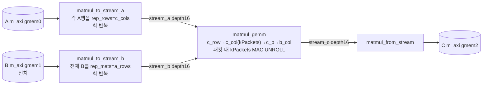
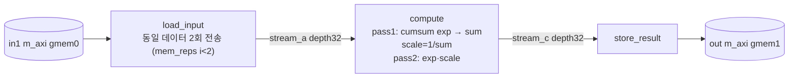
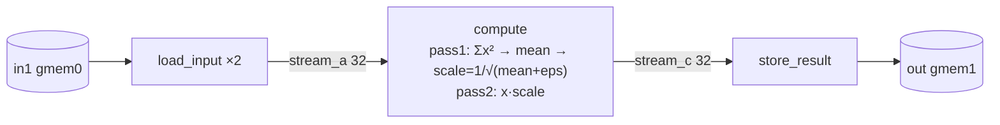
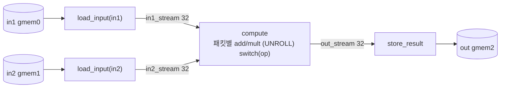
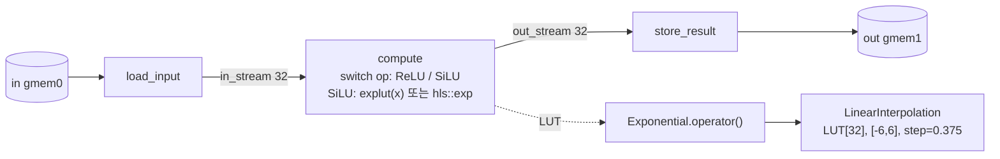

# hls-fpga-accelerators 모듈 통합 가이드 (H-HLS)

> 1차 요약(맥락): [`../hls-fpga-accelerators.md`](../hls-fpga-accelerators.md)
> 소스 루트: `REF/ViT-Accelerator/hls-fpga-accelerators`. 저장소 전체가 자체 작성 Vitis HLS 소스이며 third-party/vendor/생성물이 **없다**(합성 산출물 `.xo`·리포트도 미동봉).
> 표기 규약: 라인으로 직접 확인한 사실은 단정, 코드 정황 기반은 "추정", 코드/문서에 없으면 "확인 불가".
> 대상: GEMM(matmul) / softmax / rmsnorm / elementwise / unary(+LUT exp) 5개 연산자 모듈 + 공통 인프라(`common/config.h`).

---

## 0. 문서 머리말

### 0.1 대표 케이스 선정 (연산자별 대표 구성)

본 저장소는 "한 알고리즘을 데이터타입·버스폭·행렬크기로 전면 파라미터화한 **재사용 HLS 연산자 라이브러리**"다. 따라서 대표 케이스 = **각 연산자의 디폴트 빌드 구성**(`.tcl`의 else 분기 기본값)으로 잡는다. 디폴트가 곧 "리포가 합성하도록 의도한 기준 인스턴스"이기 때문이다.

| 모듈 | 대표 구성(디폴트) | 근거(파일:라인) |
|---|---|---|
| **matmul** | `FIXED16`, BUS=512, A_ROWS=2, B_COLS=C_COLS=4096 | `matmul.tcl:12,18,26,34,42,48` / `matmul.h:11,13,18` |
| **softmax** | `FLOAT16`, BUS=512, M_COLS=M_ROWS=4096 | `softmax.tcl:13,18,34,42` / `softmax.h:13,18` |
| **rmsnorm** | `FIXED16`, BUS=512, 4096×4096 (README는 FLOAT 권장) | `rmsnorm.h:13,18` / `README.md:115,123` |
| **elementwise** | `FIXED16`, BUS=512, 4096×4096, op=add/mult | `elementwise.h:13,18` / `elementwise.cpp:8` |
| **unary** | `FIXED16`, BUS=512, 4096×4096, IMPLEXP=`LUT`, op=ReLU/SiLU | `unary.tcl:13,34,48` / `unary.cpp:10~17,35~43` |

- 단, **matmul.h:11 `kARows=2`는 환경변수로 못 바꾸는 하드코딩**이다(tcl이 `-DA_ROWS`를 넘기지만 `matmul.h`는 이를 읽지 않고 `kARows=2` 고정 — `matmul.h:11`엔 `#ifndef` 가드 없음). 즉 대표 GEMM은 **2행짜리 GEMM**으로 고정. (확인됨)
- common 인프라의 무옵션 디폴트는 **FIXED8(Q4.4)** 이지만(`config.h:35~38`), 모든 `.tcl`이 명시적으로 `FIXED16`/`FLOAT16`을 넘기므로 **합성 디폴트는 FIXED16/FLOAT16**이다. (확인됨)

### 0.2 수치 표기 규약 (정적 분석)

이 저장소엔 systolic PE 어레이가 없다. 병렬도의 단위는 **"버스워드 1개를 SIMD 패킷으로 쪼갠 lane 수"** 다.

- **MAC lanes / SIMD lanes** = `kPackets = kBusWidth / kDataWidth` (`config.h:41`). 패킷 내 `for(p) #pragma HLS UNROLL` 가 이 lane을 물리 병렬화한다.
  - BUS=512 기준: FIXED16/FLOAT16 → **32 lanes**, FIXED8/FLOAT8 → **64 lanes**, FLOAT32 → 16 lanes, FLOAT4 → 128 lanes.
- **scalar MACs (matmul)** = 대표 GEMM의 M·N·K = `a_rows × c_cols × b_cols`. 대표값(2×4096×4096) = **33,554,432 MAC**.
- **loop trips** = 루프 bound. 패킷화 루프는 `차원/kPackets`. 대표 `kTotalMaxSize = kCols*kRows/kPackets` (softmax/rmsnorm/unary/elementwise `*.h:23`).
- **memory (payload bit)** = on-chip 버퍼 깊이×폭. 본 라이브러리는 **타일 버퍼·가중치 캐시가 없고**, on-chip 메모리는 단계 간 `hls::stream` FIFO(`depth=16` 또는 `32`)와 LUT 배열뿐. LUT payload = `S × T::width`.
- **합성 PPA(LUT/FF/DSP/BRAM/주파수)**: 리포지토리에 csynth 리포트·`.xo`가 **미동봉** → **확인 불가**. 타깃 클럭은 tcl `create_clock -period 300MHz`(표기상 300 MHz 의도, 단 `-period`에 주파수 문자열을 넣은 비정상 표기 — Vitis가 이를 어떻게 해석하는지는 확인 불가) (`matmul.tcl:57` 등).

### 0.3 운영 경로 (파라미터화 헤더 ↔ 테스트벤치 ↔ 합성)

```
[파라미터 결정]  환경변수 DATATYPE/BUS/(B_COLS,C_COLS|M_COLS,M_ROWS)/PART/IMPLEXP
        │            (없으면 *.tcl else 분기 디폴트)
[헤더 주입]    *.tcl → add_files -cflags "-DUSE_$datatype -DBUS=$bus -DM_COLS=.. -DUSE_$implexp"
        │            → common/config.h 가 매크로로 DataT/AccT/kPackets 확정
[C 시뮬]      add_files -tb "*_tb.cc"  (matmul.tcl 은 tb 미등록; softmax/unary 등은 등록, csim_design 은 주석처리됨)
        │
[합성]        open_solution -flow_target vitis → set_part $part → create_clock
        │            → config_dataflow/config_rtl/config_interface → csynth_design → config_export -format xo
[패키징]      .xo (IP) — 호스트(XRT) 연동은 본 리포 밖(추정: 동일그룹 llama_xrt)
```
근거: `matmul.tcl:51~68`, `unary.tcl:51~70`, `softmax.tcl:44~63`, `config.h:14~70`.

### 0.4 타깃 / 데이터타입 / 파라미터화 정책

- **타깃**: 기본 `xcu250-figd2104-2L-e`(**Alveo U250**), 대안 `xck26-sfvc784-2LV-c`(**Kria K26**). `PART` 환경변수로 선택, 디폴트 U250 (`README.md:22~24`, `matmul.tcl:23~27`).
- **데이터타입 정책**: 전송폭(`DataT`)과 누산폭(`AccT`)이 **동일**(별도 누산 승격 없음, `config.h:46~62`). 부동소수는 `union{uint;half/float}`(비트 재해석용), 고정소수는 `ap_fixed`. 접근은 `GET_NUMBER`/`GET_RAW` 매크로로 단일화 → float/fixed 단일 소스 (`config.h:64~70`).
  - FIXED16 = `ap_fixed<16,6>` (Q10.6, 정수 6비트) (`config.h:30~33`).
  - FIXED8 = `ap_fixed<8,4>` (Q4.4) (`config.h:35~38`).
  - FLOAT16 = `half` union, FLOAT32 = `float` union (`config.h:46~59`).
- **mode/op 정책**: PE 변형은 없고 연산자별 op 코드만 존재. elementwise `0=add,1=mult`(`elementwise.cpp:8`), unary `0=none,1=ReLU,2=SiLU`(`unary.cpp:10~17`), unary IMPLEXP `LUT|STD`(`unary.tcl:45~49`).
- **권장 정밀도 주의**: softmax/rmsnorm는 README가 "정규화 특성상 FLOAT 권장"을 명시(`README.md:123,154`). softmax tcl 디폴트는 이미 FLOAT16이나, **rmsnorm tcl/헤더 디폴트는 FIXED16** 이라 권장과 불일치(저정밀 누산 위험). (확인됨)

---

## 1. Repo / Layer 개요

### 1.1 연산자 디렉토리 맵

| 모듈(연산자) | 디렉토리 | 커널 시그니처(extern "C") | 비고 |
|---|---|---|---|
| **공통 인프라** | `common/` | — (`config.h` only) | 데이터타입·버스워드 패킷화·AccT/매크로 |
| **matmul** | `matmul/` | `matmul(RawDataT*a, *b, *c, int a_rows,b_cols,c_cols)` | 4단 dataflow GEMM, B 전치 가정 |
| **elementwise** | `elementwise/` | `elementwise(*in1,*in2,*out, uint64_t size,int op)` | 2입력 패킷 병렬 add/mult |
| **unary** | `unary/` (+`axc-math/`) | `unary(*in,*out, uint64_t size,int op)` | ReLU/SiLU + LUT/STD exp |
| **rmsnorm** | `rmsnorm/` | `rmsnorm(*in1,*out, uint64_t size)` | 2-pass RMS 스케일(γ 곱 없음) |
| **softmax** | `softmax/` | `softmax(*in1,*out, uint64_t size)` | 2-pass exp/정규화(max-sub 없음) |

각 디렉토리는 `<op>.cpp`(커널) + `<op>.h`(크기 상수) + `<op>.tcl`(합성 스크립트) + `<op>_tb.cc`(테스트벤치) 4종으로 구성(matmul만 4종 모두, 그 외 동일 패턴). `unary/`만 `axc-math/`(LUT 라이브러리) 하위 2파일 추가.

### 1.2 공통 타입 / 유틸 (`common/config.h`)

| 심볼 | 정의 | 라인 |
|---|---|---|
| `kBusWidth` | `BUS` 매크로 또는 512 | `config.h:14~18` |
| `kDataWidth` | 데이터타입별 비트폭(4/8/16/32) | `config.h:21~39` |
| `kPackets` | `kBusWidth / kDataWidth` = SIMD lane 수 | `config.h:41` |
| `RawDataT` | `ap_uint<kBusWidth>` = 메모리/스트림 워드 | `config.h:43` |
| `StreamT` | `hls::stream<RawDataT>` | `config.h:44` |
| `DataT` | `ap_fixed<…>` (고정소수일 때만 정의) | `config.h:33,38` |
| `AccT` | union(부동) 또는 `DataT`(고정) — 누산기 | `config.h:46~62` |
| `GET_NUMBER(n)` / `GET_RAW(n)` | 값/비트 접근 추상화(union이면 `.f`/`.i`, 아니면 `(n)`/`.V`) | `config.h:64~70` |

핵심 관용구: **메모리는 항상 `RawDataT` 1워드로 주고받고, 그 안에 `kPackets`개 실데이터를 비트슬라이스 `(offhigh,offlow)`로 패킹/언패킹**한다(예: `matmul.cpp:37~38`, `elementwise.cpp:37~39`). 이것이 본 라이브러리 전체를 관통하는 "버스워드 SIMD" 패턴이다.

### 1.3 제외 목록
- third-party/vendor: **없음**(저장소 전체 자체 소스).
- 생성물(`.xo`/`.xclbin`/합성 리포트/`*_files`): **리포에 미존재** → 정량 PPA "확인 불가".
- 테스트벤치 `*_tb.cc`(matmul/unary/rmsnorm/softmax): 분석 보조로만 언급, 마이크로아키텍처 본문 대상에서 제외.

### 1.4 함수 인스턴스 계층 (공통 골격, top → leaf)
```
<op> (extern "C" top, m_axi + s_axilite, #pragma HLS dataflow)
├─ load_input / matmul_to_stream_{a,b}   (HBM/DDR → hls::stream FIFO)
├─ compute / matmul_gemm                 (패킷 언팩 → kPackets-way UNROLL 연산 → 패킷 리팩)
│     └─ (unary) axc::...::lut::Exponential::operator()  → LinearInterpolation  → LUT[S]
└─ store_result / matmul_from_stream     (FIFO → HBM/DDR)
```
3단(load→compute→store)이 elementwise/unary/rmsnorm/softmax 공통, matmul만 4단(A·B 별도 공급 + gemm + writeback).

---

## 2. matmul — 스트리밍 GEMM (대표: FIXED16 / 2×4096×4096)

### 2.1 역할 + 상위/하위
- **역할**: C(samples×outputs) = A(samples×inputs) · Bᵀ(outputs×inputs). B는 **전치 저장 가정**이라 A행·B행이 같은 reduction축(k)으로 정렬되어 내적이 연속 메모리 접근이 된다 (`matmul.cpp:140~145` 주석, `README.md:33`).
- **상위**: 호스트(XRT, 리포 밖). **하위**: 4개 정적 서브함수(`matmul_to_stream_a/b`, `matmul_gemm`, `matmul_from_stream`)가 `#pragma HLS dataflow`로 동시 실행 (`matmul.cpp:163~167`).

### 2.2 데이터플로우

근거: `matmul.cpp:156~167`(스트림/뱅크/단계), `:68~96`(A 반복), `:98~126`(B 반복), `:13~66`(gemm), `:128~136`(writeback).

### 2.3 function call stack
```
matmul()                       matmul.cpp:146  (m_axi gmem0/1/2 + s_axilite, dataflow)
├─ matmul_to_stream_a()        matmul.cpp:68   (rep_rows=c_cols, rep_mats=1)
├─ matmul_to_stream_b()        matmul.cpp:98   (rep_rows=1,      rep_mats=a_rows)
├─ matmul_gemm()               matmul.cpp:13   (실제 곱셈누산)
└─ matmul_from_stream()        matmul.cpp:128  (length=c_cols*a_rows)
```

### 2.4 대표 코드 위치
- 커널 top: `matmul.cpp:146~168`
- GEMM 코어: `matmul.cpp:13~66`
- 크기 상수: `matmul.h:11~21`, 파생 상수 `matmul.cpp:9~11`

### 2.5 대표 코드 블록

**(a) GEMM 4중 루프 + 패킷 내 MAC 완전 병렬화** (`matmul.cpp:17~52`)
```cpp
for (int c_row = 0; c_row < a_rows; ++c_row)            // m: 대표 2
  for (int c_col = 0; c_col < c_cols; c_col += kPackets) // n: 4096/32 = 128 step
    for (int c_p = 0; c_p < kPackets; ++c_p) {           // 패킷 내 출력 32개
      AccT c_val{0};
      for (int b_col = 0; b_col < b_cols; b_col += kPackets) { // k: 128 step
        RawDataT a_packet = a.read();  RawDataT b_packet = b.read();
        AccT res{0};
        for (int p = 0; p < kPackets; ++p) {            // 32-way SIMD
#pragma HLS UNROLL
          a_val.i = a_packet(high, low);  b_val.i = b_packet(high, low);
          res.f += a_val.f * b_val.f;                    // (union/FP 경로)
        }
        c_val.f += res.f;
      } ... }
```
해설: 가장 안쪽 `p` 루프가 `#pragma HLS UNROLL`(`:36`)로 펼쳐져 **kPackets(=32)개 곱셈이 1 트립에 병렬** 수행된다. 이것이 본 커널의 유일한 물리 병렬 축(MAC lanes=32). 누산축 `b_col`은 직렬, 출력축 `c_p`/`c_col`도 직렬이라 **출력당 reduction은 시간 분할**된다. `USE_UNION`(부동) vs 비-union(고정) 두 경로를 매크로로 분기(`:40~52`).

**(b) A행을 c_cols회 반복 전송 — 가중치 재사용을 "재전송"으로 대체** (`matmul.cpp:80~92`)
```cpp
for (int rep_row = 0; rep_row < rep_rows; ++rep_row)  // rep_rows = c_cols
  for (int col = 0; col < tcols; ++col) {             // tcols = b_cols/kPackets
#pragma HLS PIPELINE
    RawDataT packet = a[shift];
    sa.write(packet);
  }
```
해설: A의 한 행을 **c_cols번 다시 메모리에서 읽어** 스트림으로 흘린다(`matmul.cpp:164`에서 `rep_rows=c_cols` 전달). on-chip에 A를 상주시키는 대신 매 출력열마다 재전송 → 코드는 단순하지만 **A에 대한 DRAM 트래픽이 c_cols배 증폭**된다(병목 §2.6). B도 대칭으로 `rep_mats=a_rows`회 전체 재전송(`:98~126`).

**(c) 인터페이스 + dataflow 배선** (`matmul.cpp:148~167`)
```cpp
#pragma HLS INTERFACE m_axi offset=slave port=a bundle=gmem0   // A/B/C 3뱅크 분리
#pragma HLS INTERFACE m_axi ... port=b bundle=gmem1
#pragma HLS INTERFACE m_axi ... port=c bundle=gmem2
  static StreamT stream_a, stream_b, stream_c;
#pragma HLS stream variable=stream_a depth=16  // FIFO 깊이 16
#pragma HLS dataflow
  matmul_to_stream_a(a, stream_a, a_rows, b_cols, c_cols, 1);
  matmul_to_stream_b(b, stream_b, b_cols, c_cols, 1, a_rows);
  matmul_gemm(stream_a, stream_b, stream_c, a_rows, b_cols, c_cols);
  matmul_from_stream(c, stream_c, c_cols * a_rows);
```
해설: A/B/C를 별도 AXI 뱅크(gmem0/1/2)로 분리해 동시 read/write 대역폭 확보. 3 FIFO(depth 16)로 4단 파이프 연결.

### 2.6 마이크로아키텍처 + 정량/병목
- **Stage 분해**: ①A 공급(반복) ②B 공급(반복) ③gemm(언팩→32-way MAC→리팩) ④writeback. 모두 `#pragma HLS PIPELINE`(공급/회수)·`UNROLL`(gemm 내부) 적용.
- **MAC lanes** = kPackets = **32**(FIXED16/BUS512). FIXED8이면 64, FLOAT4면 128.
- **scalar MACs(대표)** = 2 × 4096 × 4096 = **33,554,432**.
- **gemm 내부 루프 트립(대표)**: c_row 2 × c_col(4096/32=128) × c_p(32) × b_col(4096/32=128) = **약 1.34M 트립**, 각 트립당 32 MAC → 위 scalar MAC와 일치.
- **메모리(on-chip)**: 타일/가중치 버퍼 **없음**. stream_a/b/c FIFO 각 `depth=16 × kBusWidth(512b)` = 16×512 = **8 Kbit/FIFO**(추정: HLS가 SRL/BRAM 중 선택, 확인 불가).
- **DRAM 트래픽 증폭(핵심 병목)**: A는 c_cols배(대표 4096×), B는 a_rows배(대표 2×) **재전송**. 즉 reuse를 on-chip이 아니라 메모리 재read로 구현 → 대형 GEMM에서 대역폭 바운드. 출력 스테이셔너리/타일링/가중치 상주가 없음.
- **`kARows=2` 하드코딩**(`matmul.h:11`): 대표 GEMM이 사실상 토큰 2개 분량 → PoC/벤치 성격. 큰 M으로 못 키움(환경변수 무시). (확인됨)

---

## 3. softmax — 2-pass 스트리밍 softmax (대표: FLOAT16 / 4096×4096)

### 3.1 역할 + 상위/하위
- **역할**: 입력 벡터에 exp 후 전역 합으로 정규화. **max-subtraction(수치안정화) 없음** → 큰 입력 overflow 위험, 그래서 FLOAT 권장 (`README.md:154`).
- **상위**: 호스트. **하위**: `load_input`/`compute`/`store_result` 3단 dataflow (`softmax.cpp:125~128`).

### 3.2 데이터플로우

근거: `softmax.cpp:80~93`(2회 로드), `:15~47`(pass1), `:49~77`(pass2), `:120~128`(배선).

### 3.3 function call stack
```
softmax()           softmax.cpp:114  (m_axi gmem0/1 + s_axilite, dataflow)
├─ load_input()     softmax.cpp:80   (size_raw회 × mem_reps 2)
├─ compute()        softmax.cpp:9    (cumsum_out / norm_out 2-pass)
└─ store_result()   softmax.cpp:95
```

### 3.4 대표 코드 위치
- 커널 top: `softmax.cpp:114~129`, compute 2-pass: `:9~78`, 2회 로드: `:80~93`.

### 3.5 대표 코드 블록

**(a) pass1 — 패킷별 exp 후 전역 합 누적** (`softmax.cpp:25~47`)
```cpp
for (int p = 0; p < kPackets; ++p) {
#pragma HLS UNROLL
  GET_RAW(num) = raw_in1(offhigh, offlow);
  GET_NUMBER(local_exps[p]) = hls::exp(GET_NUMBER(num));   // 패킷 32개 exp 병렬
}
for (int p = 0; p < kPackets; ++p) {
#pragma HLS UNROLL
  GET_NUMBER(local_cum) += GET_NUMBER(local_exps[p]);      // 패킷 내 합
}
GET_NUMBER(sum) += GET_NUMBER(local_cum);                  // 전역 합 누적
```
해설: `hls::exp`를 패킷 lane(32개)에 UNROLL 병렬 적용 후 트리합. 전역 `sum`은 외부 루프 캐리(직렬 누산) → reduction 의존성이 II에 영향(추정).

**(b) pass2 — 1/sum 스케일** (`softmax.cpp:49~71`)
```cpp
GET_NUMBER(scale) = 1.f / GET_NUMBER(sum);
...
GET_NUMBER(num) = hls::exp(GET_NUMBER(num)) * GET_NUMBER(scale);  // exp 재계산!
```
해설: pass2에서 **exp를 다시 계산**한다(저장 안 함). 즉 exp가 입력당 2회 평가 → 연산량 2배. 대신 N개 exp 버퍼를 안 둬서 on-chip 메모리는 절약.

**(c) 입력 2회 전송 구조** (`softmax.cpp:83~92`)
```cpp
for (int i = 0; i < 2; ++i)            // mem_reps: 같은 입력을 두 번
  for (uint64_t i = 0; i < size_raw; ++i) {
#pragma HLS PIPELINE
    inStream << in[i];
  }
```
해설: compute가 스트림을 두 번 소비(pass1·pass2)하므로 loader가 **동일 데이터를 2회 DRAM read**. → 입력 DRAM 트래픽 2배(병목).

### 3.6 마이크로아키텍처 + 정량/병목
- **Stage**: load(×2 reps) → compute(pass1 cumsum + pass2 norm) → store.
- **SIMD lanes** = kPackets = **32**(FLOAT16/BUS512). exp 유닛 32개 병렬(`hls::exp`).
- **loop trips(대표)**: kTotalMaxSize = 4096×4096/32 = **524,288** (pass1·pass2 각각), load는 ×2.
- **메모리**: stream FIFO `depth=32 × 512b` = 16 Kbit ×2. `local_exps[kPackets]` = 32 × AccT(16b) = 512b 레지스터.
- **병목/리스크**: (1) max-sub 부재 → 저정밀 overflow(README 경고). (2) exp 2회 평가 + 입력 2회 read(재계산형 2-pass) → 연산·대역폭 모두 2배. 개선: online-softmax(running max/sum, single-pass)로 둘 다 제거 가능.

---

## 4. rmsnorm — 2-pass RMS 정규화 (대표: FIXED16 권장은 FLOAT / 4096×4096)

### 4.1 역할 + 상위/하위
- **역할**: x / sqrt(mean(x²)+eps) 스케일. **learnable weight(γ) 곱 없음** → 순수 RMS 스케일만(LLaMA RMSNorm의 γ는 별도 elementwise mult로 처리해야 함). eps=0.01 하드코딩 (`rmsnorm.cpp:15`).
- **상위/하위**: softmax와 **동일 3단 골격**(load 2회/compute 2-pass/store).

### 4.2 데이터플로우

근거: `rmsnorm.cpp:18~55`(pass1), `:57~82`(pass2), `:85~98`(2회 로드), `:130~133`(배선).

### 4.3 function call stack
```
rmsnorm()           rmsnorm.cpp:119
├─ load_input()     rmsnorm.cpp:85   (mem_reps 2)
├─ compute()        rmsnorm.cpp:9    (cumsum_out → scale_out)
└─ store_result()   rmsnorm.cpp:100
```

### 4.4 대표 코드 위치
- compute: `rmsnorm.cpp:9~83`, scale 계산: `:52~55`.

### 4.5 대표 코드 블록

**(a) pass1 — 제곱합 → mean → 역제곱근 스케일** (`rmsnorm.cpp:40~55`)
```cpp
GET_NUMBER(local_prods[p]) = GET_NUMBER(num) * GET_NUMBER(num);   // x²  (UNROLL)
...
GET_NUMBER(mean)  = GET_NUMBER(sum) / GET_NUMBER(nelems);         // 평균제곱
GET_NUMBER(scale) = 1.f / hls::sqrtf(GET_NUMBER(mean) + GET_NUMBER(eps)); // 1/√(·)
```
해설: eps=0.01(`:15`)는 통상 1e-5/1e-6보다 큼 → 저정밀 안정화 의도로 추정. `nelems=size`(전체 원소수)로 나눔 → **행 단위가 아니라 전체 텐서 단위 RMS**(per-row RMSNorm이 아님 — 호출 시 size를 행 길이로 주어야 의미상 맞음). (확인됨)

**(b) pass2 — 스케일 곱** (`rmsnorm.cpp:64~81`)
```cpp
for (int p = 0; p < kPackets; ++p) {
#pragma HLS UNROLL
  GET_RAW(num) = raw_in2(offhigh, offlow);
  GET_NUMBER(num) *= GET_NUMBER(scale);     // 32-way 병렬 스케일
  raw_out(offhigh, offlow) = GET_RAW(num);
}
```

### 4.6 마이크로아키텍처 + 정량/병목
- **Stage**: load(×2) → compute(Σx² pass1 / scale pass2) → store. `hls::sqrtf` 1회(스칼라).
- **SIMD lanes** = 32. **loop trips** = 524,288 ×2(pass).
- **메모리**: `local_prods[32]` 레지스터 + FIFO depth32×512b.
- **병목/리스크**: (1) FIXED16 디폴트인데 README는 FLOAT 권장(`README.md:123`) → 헤더/권장 불일치. (2) 입력 2회 read(softmax와 동일). (3) γ 곱·per-row 정규화는 미구현 → 통합 시 추가 필요.

---

## 5. elementwise — 2입력 패킷 병렬 add/mult (대표: FIXED16 / 4096×4096)

### 5.1 역할 + 상위/하위
- **역할**: out = in1 ⊕ in2, ⊕ ∈ {add, mult} (`elementwise.cpp:8,51~69`). residual add, RMSNorm γ 곱, gating 등에 사용.
- **하위**: `load_input`×2 + `compute` + `store_result` 4 호출(입력 2개라 loader 2개) (`elementwise.cpp:120~125`).

### 5.2 데이터플로우

근거: `elementwise.cpp:108~125`.

### 5.3 function call stack
```
elementwise()       elementwise.cpp:107
├─ load_input(in1)  elementwise.cpp:10
├─ load_input(in2)  elementwise.cpp:10
├─ compute()        elementwise.cpp:22   (switch op: OP_ADD/OP_MULT)
└─ store_result()   elementwise.cpp:82
```

### 5.4 대표 코드 위치
- compute: `elementwise.cpp:22~80`, op 분기: `:51~69`.

### 5.5 대표 코드 블록

**(a) 패킷 병렬 + op switch** (`elementwise.cpp:35~69`)
```cpp
for (int p = 0; p < kPackets; ++p) {
#pragma HLS UNROLL
  in1.i = raw_in1(offhigh, offlow);  in2.i = raw_in2(offhigh, offlow);
  switch (op) {
    case OP_ADD:  out.f = in1.f + in2.f; break;
    case OP_MULT: out.f = in1.f * in2.f; break;
    default:      out = in1; break;
  }
  raw_out(offhigh, offlow) = out.i;
}
```
해설: 단일 패스(softmax/rmsnorm과 달리 reduction 없음) → loader가 입력을 **1회만** read(`:13~19`, mem_reps 없음). op는 런타임 인자 → 한 커널이 add/mult 모두 처리(분기는 HLS가 mux로 합성, 추정).

### 5.6 마이크로아키텍처 + 정량/병목
- **Stage**: load1∥load2 → compute(32-way) → store. 전형적 memory-bound 벡터 커널.
- **SIMD lanes** = 32. **loop trips** = kTotalMaxSize = 524,288(단일 패스). II=1 목표(`#pragma HLS PIPELINE :31`).
- **메모리**: FIFO 3개 depth32×512b. 버퍼 없음.
- **병목**: 산술 강도 낮음(원소당 1 op) → AXI 대역폭 바운드. 3뱅크 분리(gmem0/1/2)로 동시 R/R/W 확보가 유일 최적화.
- **주석 불일치**: 코드 주석은 `op 0:add,1:add+relu,2:mult`(`:104`)라 적었으나 실제 enum은 `0:add,1:mult`만(`:8`) → 주석 오류(확인됨, 실제는 2-op).

---

## 6. unary — 활성화(ReLU/SiLU) + LUT exp (대표: FIXED16 / LUT / 4096×4096)

### 6.1 역할 + 상위/하위
- **역할**: op=1 ReLU, op=2 SiLU(=x·sigmoid(x)=x·exp(x)/(1+exp(x))) (`unary.cpp:67~104`). exp 구현은 **IMPLEXP=LUT(근사) | STD(`hls::exp`)** 선택.
- **하위**: load/compute/store 3단 + compute 내부에서 `axc::...::lut::Exponential` 호출 (`unary.cpp:154~158`).

### 6.2 데이터플로우

근거: `unary.cpp:35~43`(LUT 구성), `:75~104`(SiLU 분기), `exponential-lut.hpp:116~125`, `interpolation-wrapper.hpp:49~91`.

### 6.3 function call stack
```
unary()                              unary.cpp:145
├─ load_input()                      unary.cpp:19
├─ compute()                         unary.cpp:31   (op switch; LUT 객체 static)
│   └─ ExpOpLUT::operator()(x)       exponential-lut.hpp:116
│       └─ LinearInterpolation::operator()(x)  interpolation-wrapper.hpp:50
│           └─ generator::Exponential (LUT 채움, std::exp)  exponential-lut.hpp:65~71
└─ store_result()                    unary.cpp:121
```

### 6.4 대표 코드 위치
- compute/SiLU: `unary.cpp:31~119`, LUT 타입 파라미터: `unary.cpp:35~43`.
- LUT 생성기/래퍼: `exponential-lut.hpp:28~131`, 보간 수학: `interpolation-wrapper.hpp:49~92`.

### 6.5 대표 코드 블록

**(a) LUT exp 인스턴스화 — 컴파일타임 도메인 한정** (`unary.cpp:35~43`)
```cpp
constexpr int kNumPoints = 32;
using Start = std::ratio<-6>;  using End = std::ratio<6>;
using ExpDataType = ap_fixed<24, 12>;        // Q12.12
#ifdef USE_LUT
  using ExpOpLUT = Exponential<ExpDataType, Start, End, kNumPoints>;
  static ExpOpLUT explut{};
#endif
```
해설: 구간 [-6,6], **32포인트**, 데이터타입 ap_fixed<24,12>를 **템플릿 파라미터**로 고정. `std::ratio`로 구간을 컴파일타임 상수화 → step = (6-(-6))/32 = **0.375**(`exponential-lut.hpp:51~52`).

**(b) SiLU 경로 — LUT vs STD 분기** (`unary.cpp:91~101`, 비-union/고정 경로)
```cpp
#ifdef USE_LUT
  ExpDataType infx{in1};
  ExpDataType expx = explut(infx);                 // LUT 보간 exp
  ExpDataType denx = ExpDataType{1} + expx;
  ExpDataType invdenx = ExpDataType{1} / denx;
  out = in1 >= End::num ? in1 : AccT{infx*expx*invdenx};  // x≥6이면 포화(=x)
#else
  AccT expx = hls::exp(in1);                        // 표준 exp
  ... out = in1 * expx * invdenx;
#endif
```
해설: x≥End(=6)이면 sigmoid≈1로 보고 **SiLU≈x 포화 처리**(`:96`) — LUT 구간 밖 외삽 회피. 1/(1+exp) 역수는 `ap_fixed` 나눗셈으로 합성.

**(c) 선형보간 본체** (`interpolation-wrapper.hpp:69~91`)
```cpp
using InternalT = ap_fixed<2*T::width, T::width>;       // 폭 2배 내부 정밀
i_lower = (InternalT{x} - begin) * inv_step;            // 인덱스 = (x-min)/step
i_lower = clamp(0, kPoints-2);                          // 경계 클램프
const InternalT y_lower = lut[i_lower];  y_upper = lut[i_lower+1];
res  = (x - x_lower) * (y_upper - y_lower) * inv_step + y_lower;  // Newton 1차 보간
```
해설: 인덱스 계산은 `inv_step` 곱(나눗셈 회피), 내부는 `ap_fixed<48,24>`로 폭 2배 승격해 보간 정밀 확보(`:52`). **LUT는 `operator()` 안에서 매 호출 지역 배열로 재생성**(`:61~62 T lut[Points]; LUT generator{lut};`) — 즉 호출마다 std::exp로 32포인트 채움. HLS가 이를 상수 ROM으로 합성하는지(추정)는 csynth 리포트 없어 **확인 불가**(부정적이면 면적/지연 손해).

### 6.6 마이크로아키텍처 + 정량/병목
- **Stage**: load → compute(op switch; SiLU는 exp→add→recip→mul 체인) → store. SIMD lanes=32, 각 lane이 독립 exp/보간.
- **LUT payload**: 32 points × ExpDataType(24b) = **768 bit/LUT 인스턴스**. 보간 InternalT = 48b.
- **loop trips**: 524,288(단일 패스).
- **재사용 가치(핵심 자산)**: 컴파일타임 도메인 한정 LUT + 1차 선형보간 패턴은 **softmax exp·GELU·sigmoid 근사**에 그대로 재사용 가능. 포인트수(S)/구간(BEGIN,END)/정밀(T)이 전부 템플릿 → **면적↔정확도 트레이드오프 노브**.
- **병목/리스크**: (1) LUT 32포인트로 [-6,6] 보간 → 곡률 큰 구간(0 부근) 오차(추정, 정량평가 코드 없음→확인 불가). (2) `operator()` 내 LUT 지역 재생성이 ROM 추론에 실패하면 LUT 면적이 lane(32)×반복으로 폭증할 수 있음(추정). (3) `1/denx` ap_fixed 나눗셈이 SiLU 경로의 지연 핫스팟일 가능성(추정).

---

## 7. 연산자 한눈 요약 표

| 모듈 | 패스 | 입력 read 횟수 | SIMD lanes(512/dt) | 대표 loop trips | 비선형 유닛 | 알려진 약점 |
|---|---|---|---|---|---|---|
| matmul | 1(스트림) | A:×c_cols, B:×a_rows | 32(FIX16)/64(FIX8) | 2·128·32·128 | 없음 | A/B 재전송 증폭, kARows=2 고정 |
| softmax | 2-pass | ×2 | 32(FP16) | 524,288 ×2 | hls::exp ×2회 평가 | max-sub 없음, exp 재계산 |
| rmsnorm | 2-pass | ×2 | 32 | 524,288 ×2 | hls::sqrtf ×1 | γ 없음, 전체텐서 RMS, FIX16 디폴트 |
| elementwise | 1 | ×1 | 32 | 524,288 | 없음 | 산술강도 낮음(대역폭바운드) |
| unary | 1 | ×1 | 32 | 524,288 | exp(LUT 32pt 또는 STD) | LUT 정밀/ROM추론 미검증 |

- 공통: `#pragma HLS dataflow` 3~4단, 단계 간 FIFO(matmul depth16 / 그 외 32), 패킷 내 `UNROLL`, 외부 루프 `PIPELINE(II=1 목표)`. 타깃 U250/K26, 클럭표기 300MHz, FP=union/FIX=ap_fixed 단일소스.

---

## 8. 읽기 · 코드추적 순서

1. **`common/config.h`** 전체 — kPackets/RawDataT/AccT/GET_* 매크로 이해(모든 커널의 전제).
2. **`elementwise.cpp`** — 가장 단순한 단일패스 패킷 SIMD 골격(load/compute/store + 패킷 언팩/리팩)의 표준형.
3. **`matmul.cpp`** — `:13~66` gemm 4중 루프와 `:68~126` 재전송 공급기 → reuse를 메모리 재read로 구현하는 방식 파악.
4. **`softmax.cpp` → `rmsnorm.cpp`** — 2-pass(입력 ×2) reduction 패턴, 차이는 exp/sum vs x²/sqrt.
5. **`unary.cpp` → `axc-math/exponential-lut.hpp` → `interpolation-wrapper.hpp`** — 비선형 LUT 근사(템플릿 파라미터 + 1차 보간) 체인.
6. **`*.tcl`** — 환경변수→`-D`매크로→`config.h` 주입 흐름, PART/clock/dataflow 설정.

---

## 9. 병목 · 재사용 (파라미터 노브)

### 9.1 파라미터 노브 (DSE 축)
| 노브 | 매크로/상수 | 효과 | 근거 |
|---|---|---|---|
| 데이터타입 | `USE_FLOAT4/8/16/32`,`USE_FIXED8/16` | 정밀↔면적/대역폭. kDataWidth로 lane수 결정 | `config.h:21~39` |
| 버스폭 | `BUS`(64~2048) | kPackets=BUS/dt → SIMD 병렬도·AXI 폭 | `config.h:14~18,41` |
| 행렬크기 | `B_COLS/C_COLS`,`M_COLS/M_ROWS` | loop bound | `*.h:13~21` |
| exp 구현 | `IMPLEXP=LUT|STD` | 면적(LUT)↔정확도(STD) | `unary.tcl:45~49` |
| LUT 해상도 | `kNumPoints`/`Start`/`End`/`ExpDataType` | LUT 정밀↔면적 | `unary.cpp:35~38` |
| 디바이스 | `PART` | U250 ↔ K26 | `*.tcl:23~27` |

### 9.2 병목 정리
- **matmul**: on-chip reuse 부재 → A를 c_cols배·B를 a_rows배 DRAM 재read(§2.6). 대형 GEMM 대역폭 바운드. + `kARows=2` 하드코딩으로 M 확장 불가.
- **softmax/rmsnorm**: 입력 2회 read + (softmax) exp 2회 평가. 재계산형 2-pass.
- **elementwise/unary**: 산술강도 낮아 AXI 대역폭 바운드.
- **공통**: 레이어 융합(fusion) 없음 → 연산자 간 결과를 매번 DRAM 왕복. 누산 승격 없음(AccT=DataT)으로 저정밀 누산오차.

### 9.3 재사용 자산 (우리 ViT/Transformer 가속기 관점)
- **즉시 차용**: `config.h`의 버스워드 SIMD 패킷화 + `GET_NUMBER/GET_RAW` 단일소스 매크로(다정밀 데이터패스 추상화 템플릿). `exponential-lut.hpp`의 컴파일타임 도메인 한정 LUT+선형보간(Softmax exp·GELU 근사 유닛에 직접 응용). 3~4단 `dataflow load→compute→store` 골격.
- **개선해 가져갈 점**: softmax→online-softmax(running max/sum, single-pass)로 수치안정+입력 1회. matmul→출력 스테이셔너리+타일링+가중치 on-chip 상주로 reuse를 메모리 재read에서 분리. rmsnorm→per-row + γ 곱 + 적정 eps. 누산기 폭 승격(AccT > DataT).

---

## 10. 근거 / 한계 표기
- 코드 라인 근거: `config.h`, `matmul.cpp/.h/.tcl`, `softmax.cpp/.h/.tcl`, `rmsnorm.cpp/.h`, `elementwise.cpp/.h`, `unary.cpp/.h/.tcl`, `exponential-lut.hpp`, `interpolation-wrapper.hpp` 전수 직접 확인. README 전문 확인.
- **확인 불가**: 합성 PPA(LUT/FF/DSP/BRAM/달성주파수) — csynth 리포트·`.xo` 미동봉. `create_clock -period 300MHz` 의 Vitis 해석. LUT 근사 정확도 정량값(평가 코드 없음). `operator()` 내 LUT의 ROM 추론 여부. 호스트(XRT) 연동 코드(리포 밖, 동일그룹 llama_xrt 연계는 추정).
- **추정 표기**: FIFO의 BRAM/SRL 매핑, op 분기의 mux 합성, LUT 면적 거동은 합성 리포트 없이 코드 정황 기반 추정.
