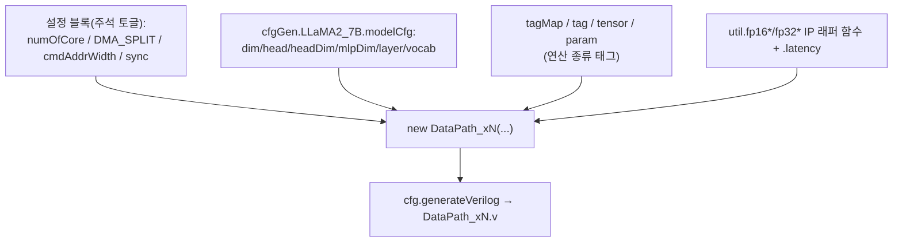
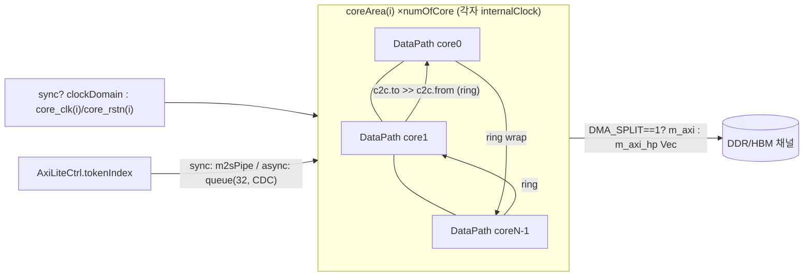
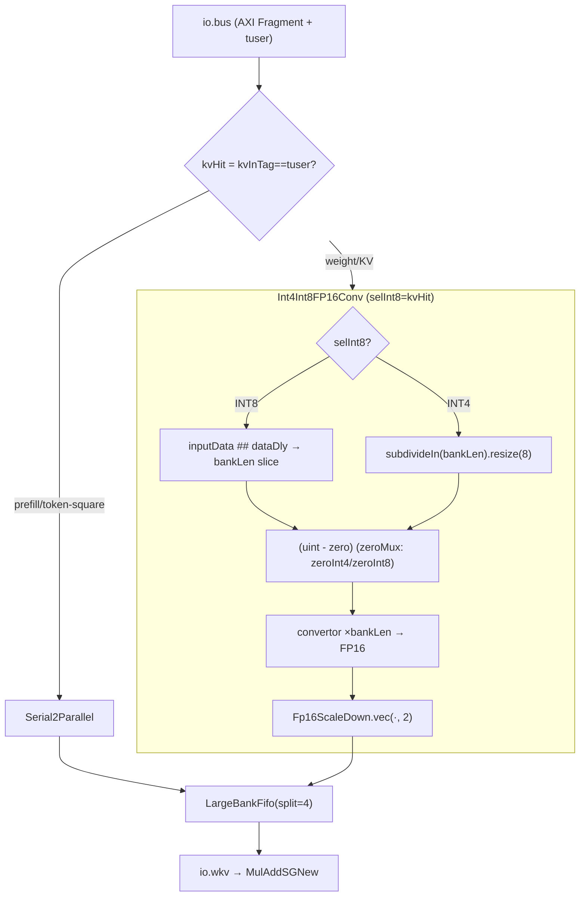
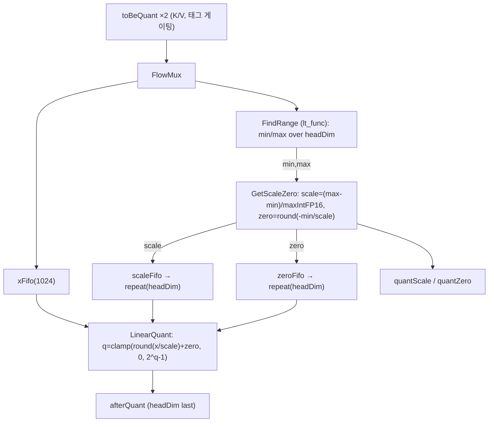
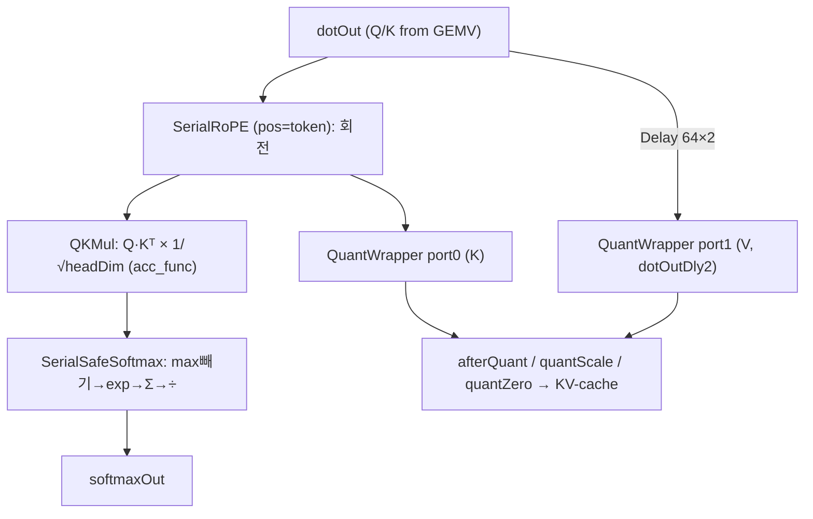
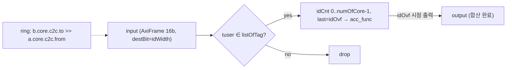
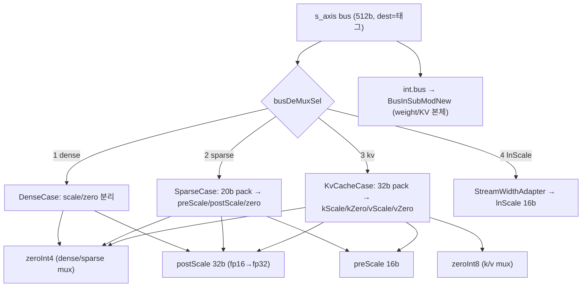
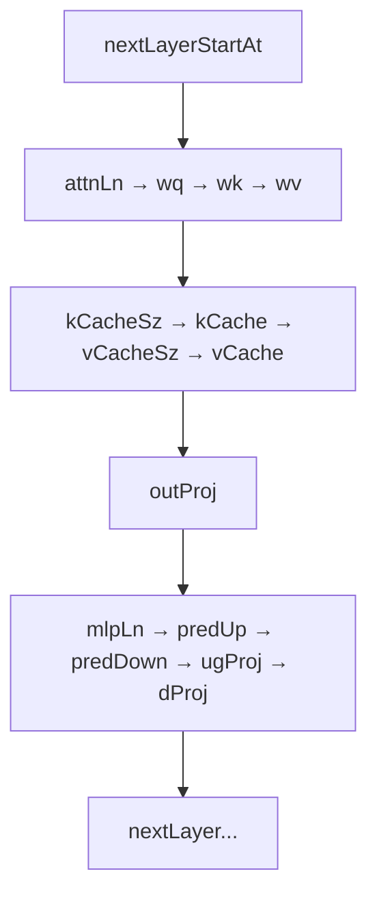

# llama-fpga (EdgeLLM) 모듈 통합 가이드

> 1차 요약(맥락): [`../llama-fpga.md`](../llama-fpga.md)
> 소스 루트: `REF/ViT-Accelerator/llama-fpga`. 본 가이드는 **`scala/src/main/scala/**`**(SpinalHDL 정본)를 분석 대상으로 삼는다. SDK C 호스트(`*_sdk.c`, `au250/host_*.c`)·`python/model2bin.py`는 HW/SW 매핑 근거로만 인용한다.
> 표기 규약: 라인으로 직접 확인한 사실은 단정, 코드 정황 기반은 "추정", 코드/문서에 없으면 "확인 불가".
> 제외물(이름만): 보드별 Vivado 배포 프로젝트(`kv260/`·`zcu104_pl/`·`zcu104_ps_pl/`·`alveo_u250/` 내 `*.gen/**`·`*.srcs/**`·`*.ip_user_files/**`), SpinalHDL이 토해낸 생성 RTL(`DataPath_xN.v`·`bd_*_wrapper.v` 등), 합성 산출물(`.xsa`·`.bit` — 리포에 비트스트림 미동봉), 데모 gif.

---

## 0. 문서 머리말

### 0.1 대표 케이스 선정
EdgeLLM은 한 GEMV 엔진(`MulAddSGNew`)을 `cfg` 워드로 **dot-product(행렬·벡터) ↔ axpy(스칼라·벡터 누적)** 로 변형하고, 그 위에 정규화·attention·양자화 서브모듈을 얹는다. 대표 케이스도 **두 개**를 함께 잡는다.

- **선형 대표(W4A16 GEMV)**: LLaMA2-7B 한 레이어의 **`o_proj`(attention output projection)** 또는 **`down_proj`(MLP)** 한 타일. 둘 다 `dim×dim`/`mlpDim×dim`을 `numOfCore`로 분할한 텐서병렬 GEMV이며, INT4 weight를 온칩에서 FP16으로 복원해 곱하고 FP32로 누산한 뒤(`MulAddSGNew.scala:115-133`) 코어 간 `AllReduce`로 합산(`AllReduce.scala:54-62`)한다. 즉 리포 데이터플로우의 중심 동작.
- **비선형 대표(safe-softmax + KV INT8 동적양자화)**: attention 한 head의 **Q·Kᵀ → safe-softmax → ·V** 경로. RoPE(`SerialRoPE`, `AttnSubMod.scala:75-85`)로 회전 → QKᵀ를 `1/√headDim`로 스케일(`QKMul`, `AttnSubMod.scala:112-119`) → max 차감 safe-softmax(`SerialSafeSoftmax`, `AttnSubMod.scala:121-132`)로 안정화, K/V는 런타임에 비대칭 INT8로 양자화(`QuantWrapper`, `AttnSubMod.scala:99-110`)되어 KV-cache에 적재된다.

선정 근거: (1) 디코딩이 weight-bound이므로 W4 GEMV가 실제 throughput을 결정, (2) attention의 비선형(softmax)·동적양자화(KV)가 정밀도/메모리 관점의 핵심. 두 케이스로 "스트리밍 GEMV(선형)/safe-softmax+동적양자화(비선형)" 양 데이터플로우를 커버한다.

### 0.2 수치 표기 규약
- **MAC lanes**: 한 코어의 동시 FP16 곱셈기 수. `bankLen = busWidth/4 = 512/4 = 128`(`EdgeLLMInst.scala:52,54`) → 한 사이클 FP16 **128 lane**(`Vec2to1`이 `length=bankLen`로 곱셈기 병렬화, `Vec2to1.scala:29`). 공간 병렬은 추가로 `sgSplit=4` 뱅크(`MulAddSGNew.scala:69`)이나, 뱅크는 `bankLen/split`로 *분할*되므로 lane 총합은 보존(128 lane = 4뱅크×32 lane). **systolic 아님** — distributed-RAM 스트리밍 SIMD.
- **scalar MACs**: 대표 GEMV의 M·N·K 곱. LLaMA2-7B 차원(`dim=4096, mlpDim=11008, head=32, headDim=128, layer=32`, `LLMCfg.scala:8-14`)으로 환산.
- **loop trips / cycle**: `LoopsCntGen.wireOvf(List(firstDim, secondDim), ...)`(`MulEngine.scala:80`)의 2중 루프 또는 토큰/타일 차원 곱.
- **memory size (payload bit)**: KV-cache·버퍼 배열 깊이×폭(bit). KV는 `LLMCfg.tfBTTPerCore`(`LLMCfg.scala:33-38`)로 산출.

### 0.3 운영 경로 (Scala → Verilog 생성 → 합성 → 호스트)
```
[Scala/SpinalHDL]  EdgeLLMInst.main → cfg.generateVerilog(new DataPath_xN(...))   (EdgeLLMInst.scala:62-197)
        │  보드 변형 = numOfCore / DMA_SPLIT / cmdAddrWidth / sync 주석 토글
[Verilog 생성]      DataPath_xN.v 등 (생성물 — 본 가이드 제외)
        │
[합성/통합]         보드별 Vivado 프로젝트(MIG/HBM/XDMA/AXI BD) → .xsa / .bit   (생성물 — 제외)
        │
[오프라인 양자화]   LLaMA2-7B → AWQ INT4 + KV INT8 패킹 → .bin  (python/model2bin.py)
        │  zero/scale/weight 인터리브 = LLMCfg.tfOsPerCore 오프셋과 정합
[온라인 호스트]     토큰 인덱스 AXI-Lite 주입 → 토큰 status 폴링  (*_sdk.c / au250/host_sdk.c)
```
근거: `EdgeLLMInst.scala:62`, `LLMCfg.scala:83-109`, 1차 요약 §4·§5.

### 0.4 타깃 / 데이터타입 / mode 정책
- **타깃**: Xilinx **KV260 / ZCU104(PL, PS+PL) / Alveo U250**. 보드 차이는 `EdgeLLMInst`의 설정 블록으로 흡수 — U250 4채널=`numOfCore=1, DMA_SPLIT=List(4), cmdAddrWidth=40`(`EdgeLLMInst.scala:11-17`), 듀얼코어=`numOfCore=2, DMA_SPLIT=List(1,1)`(현재 활성, `:44-50`), KV260 4코어=`numOfCore=4, sync=false`(`:35-41`). 합성 PPA 리포트는 리포에 미동봉 → **확인 불가**.
- **데이터타입**: 활성 = **FP16**(`width=16`, `DataPath.scala:151`); weight = **AWQ INT4**(`quant.w=4`, `LLMCfg.scala:17`); KV-cache = **INT8**(`quant.kv=8`, `:18`, `kvQuantWidth=8`, `DataPath.scala:154`); scale = **FP16**(`quant.s=16`, `:19`); 누산/Norm/Softmax = **FP32 승격**(`Fp32AccEngine`, `RMSNormFp32`).
- **연산 모드 정책(GEMV 엔진, `MulEngine` Config)**: `cfg.data[31:24].lsb = isAxpy`(`MulEngine.scala:31`) — 1이면 axpy(스칼라·벡터), 0이면 dot(GEMV). `firstDim=cfg[23:16]`, `secondDim=cfg[15:0]`(`:27-29`)가 2중 루프 한계. `StreamDemux(..., select=isAxpy)`로 분기(`MulEngine.scala:53-57`).
- **누산 정밀 정책(`AddEngineNew` Config)**: `isAxpy`(`AddEngineNew.scala:38`) 외에 `enResAdd = cfg[31:24](1)`(`:40`)로 residual add 합류, dot/fAxpy/pAxpy 세 컨트롤러로 `StreamDemuxOh`(`:79`) 분기.
- **양자화 모드(KV 경로)**: `BusInSubModNew`의 `conv.io.selInt8 := kvHit`(`BusInSubModNew.scala:112`) — KV 태그면 INT8 디퀀트, 아니면 INT4(weight) 디퀀트(`Int4Int8FP16Conv.scala:31-49`).

---

## 1. Repo / Package 개요

| 패키지 | 경로 | 역할 |
|---|---|---|
| **top** | `scala/.../top/*.scala` | 데이터패스 최상위·서브모듈. `EdgeLLMInst`(생성 진입), `DataPath_xN`(코어 복제+링), `DataPath`(단일 코어 결선), `MulAddSGNew`/`MulAddEngineNew`(GEMV), `AttnSubMod`/`NormSubModNew`/`BusInSubModNew`/`AllGatherSubModNew`. |
| **core** | `scala/.../core/*.scala` | 연산 엔진. `MulEngine`(dot/axpy 곱), `AddEngineNew`(누산/axpy 트리), `Fp32AccEngine`(FP32 누산), `Vec2to1`/`VecNto1`(SIMD 곱·리덕션). |
| **quant** | `scala/.../quant/*.scala` | 런타임 동적 양자화. `FindRange`(min/max), `GetScaleZero`(scale/zero 산출), `LinearQuant`(비대칭 q), `QuantWrapper`(파이프라인). |
| **convert** | `scala/.../convert/*.scala` | 온칩 역양자화. `Int4Int8FP16Conv`(INT4 weight/INT8 KV → FP16), `Int2FP16`. |
| **c2c** | `scala/.../c2c/*.scala` | 코어 간 통신. `AllReduce`(링 합산), `AllGatherNode`/`Node`/`LowLatencyNode`/`Reorder`/`ReduceFilter`. |
| **busdemux** | `scala/.../busdemux/*.scala` | AXI 버스 분배. `AxiBusDistributor`(태그→Dense/Sparse/KvCache 라우팅), `DenseCase`/`SparseCase`/`KvCacheCase`. |
| **schedule** | `scala/.../schedule/*.scala` | 모델 메모리맵·스케줄. `LLMCfg`(차원·BTT·오프셋 테이블), `MemCmd`. |
| **residual** | `scala/.../residual/*.scala` | `ResidualBuffer`, `SerialResAdd`. |
| **util** | `scala/.../util/*.scala` | 인프라. Xilinx FP IP 래퍼(`XilinxFloatIPCollection`), `ExpFunc`/`Fix48ToFp16`/`Fp16ToFix24`/`Fp16ScaleDown`/`LUT2~4`, FIFO/DMA/HBM 래퍼 다수. |

- 자체 SpinalHDL 모듈 수(중복·테스트 제외 대략): top 27개 + core 7개 + quant 5개 + convert 2개 + c2c 7개 + busdemux 4개 + schedule 2개 + residual 2개 + util 60+개. **본 가이드는 데이터패스 핵심 12 모듈을 §2~§13에서 6요소로 정밀 분석**한다.
- 구버전(`MulAddSG`/`NormSubMod`/`BusInSubMod`/`AllGatherSubMod`/`MulAddEngine`)은 `DataPath`가 *New 버전을 인스턴스화하므로 레거시(추정).

### 모듈 인스턴스 계층 (top → leaf)
```
EdgeLLMInst (object/App, 생성 진입점)            EdgeLLMInst.scala:7,62
└─ DataPath_xN  (코어 복제 + 클럭도메인 + ring c2c)   DataPath_xN.scala
   ├─ AxiLiteCtrl (cfg)  ── 토큰 입력/status 레지스터
   └─ coreArea(i) : ClockingArea ×numOfCore        DataPath_xN.scala:168
      └─ DataPath  (단일 코어 데이터패스 통합)        DataPath.scala
         ├─ GenMemCmdLenAlign (cmdGen)             DataPath.scala:163  주소/길이 명령 생성
         ├─ AxiBusDistributor                      busdemux/AxiBusDistributor.scala  태그→Dense/Sparse/Kv 분배
         │  ├─ DenseCase / SparseCase / KvCacheCase
         ├─ BusInSubModNew                          top/BusInSubModNew.scala  AXI→디퀀트→엔진 공급
         │  ├─ Serial2Parallel                      (prefill/token-square)
         │  ├─ Int4Int8FP16Conv                     convert/  INT4/INT8 → FP16
         │  └─ LargeBankFifo / StreamAxiFrameFifo / Parallel2Serial
         ├─ MulAddSGNew  (split-bank GEMV 래퍼)      top/MulAddSGNew.scala
         │  ├─ MulAddEngineNew ×sgSplit(=4)          top/MulAddEngineNew.scala
         │  │  ├─ MulEngine   (dot/axpy 곱)          core/MulEngine.scala
         │  │  │  └─ Vec2to1 (FP16 SIMD 곱 ×bankLen) core/Vec2to1.scala
         │  │  └─ AddEngineNew (누산/axpy 트리)       core/AddEngineNew.scala
         │  └─ Fp32AccEngine (FP16→FP32 누산 트리)    core/Fp32AccEngine.scala
         ├─ AttnSubMod                               top/AttnSubMod.scala
         │  ├─ SerialRoPE                            rope/
         │  ├─ QKMul                                 attn/
         │  ├─ SerialSafeSoftmax                     attn/
         │  └─ QuantWrapper                          quant/QuantWrapper.scala
         │     ├─ FindRange / GetScaleZero / LinearQuant
         ├─ NormSubModNew                            top/NormSubModNew.scala
         │  └─ RMSNormFp32                           norm/  (FP32 RMSNorm)
         ├─ AllGatherSubModNew                       top/AllGatherSubModNew.scala
         │  └─ AllGatherNode / LowLatencyNode        c2c/
         ├─ AllReduce                                c2c/AllReduce.scala  (ring 합산)
         ├─ ResidualBuffer / SerialResAdd            residual/
         ├─ ScalarOutSubMod / VecOutSubMod / VecOutBuf
         ├─ KvScaleZeroPacker / GreedySampler        attn/, cfgGen/
         └─ StateGen / GlobalStateGen / AddressRemap
```

---

## 2. 생성 진입점 & 파라미터 바인딩 (`EdgeLLMInst.scala`)

### 2.1 역할 + 상위/하위
SpinalVerilog 생성의 `main`. `DataPath_xN`을 단 한 번 인스턴스화하며 **보드 변형·모델 차원·모든 산술기(함수+latency)** 를 인자로 주입한다. 상위 없음(App). 하위: `DataPath_xN`.

### 2.2 데이터플로우 (생성 시점)


### 2.3 인스턴스 계층
`EdgeLLMInst`(object extends App) → `DataPath_xN`.

### 2.4 대표 코드 위치
`scala/src/main/scala/top/EdgeLLMInst.scala` 전체(199 lines).

### 2.5 대표 코드 블록

(1) **보드 변형 = 주석 토글** (`EdgeLLMInst.scala:44-53`)
```scala
val DMA_SPLIT = List(1, 1)        // 코어별 DMA 채널 분할 (U250 4채널은 List(4))
val numOfCore = 2                 // 텐서병렬 코어 수
val sync = false                  // 코어별 비동기 클럭도메인
val busWidth = 512; val sgSplit = 4; val bankLen = busWidth / 4  // = 128
```
→ 위 4줄(+위쪽 주석 블록)이 KV260/ZCU104/U250 변형을 결정. 단일 소스에서 보드별 RTL을 토글로 생성.

(2) **모델 차원 주입** (`EdgeLLMInst.scala:73-82`)
```scala
dim = modelCfg.dim, head = modelCfg.head, headDim = modelCfg.headDim,
mlpDim = modelCfg.mlpDim, layer = modelCfg.layer, maxToken = 1024,
ropePoint = 1 << 14,            // sin/cos LUT 해상도 = 16384
sqrtHeadDim = modelCfg.sqrtHeadDim, vocabSize = modelCfg.vocabSize,
```
→ `LLMCfg.scala:8-14`와 동일 값(dim=4096 등). 모델 강결합의 진원지.

(3) **산술기 함수 주입(FP16/FP32 IP + latency)** (`EdgeLLMInst.scala:141-188`)
```scala
mul_func = util.fp16mul6.mul,  add_func = util.fp16add6.add,
div_func = util.fp16div12.div, acc_func = util.fp16acc16.acc,
expo_func = util.fp16ex12.exp, rsqrt_func = util.fp16rsqrt4.rsqrt,
fp32acc_func = util.fp32acc22.acc, fp32rsqrt_func = util.fp32rsqrt32.rsqrt,
add_latency = util.fp16add6.latency, ...      // 각 IP의 latency 동반 주입
```
→ **연산기 교체/정밀도 변경이 인자 교체만으로** 가능. `.latency`는 다운스트림 `Delay(...)` 정렬에 쓰임(파이프라인 정적 정렬). FP16 IP 6종 + FP32 IP 10종 + 변환 IP(`fp16toint9d4`/`fp16int5d4`/`fp16int9d4` 등) 주입.

(4) **양자화 변환 IP** (`EdgeLLMInst.scala:152-154`)
```scala
quant_conv_func = util.fp16toint9d4.to,        // FP16 → INT (LinearQuant용)
deQuant_int4_conv_func = util.fp16int5d4.from, // INT4 → FP16
deQuant_int8_conv_func = util.fp16int9d4.from, // INT8 → FP16
```

### 2.6 마이크로아키텍처 + 정량
- **버스폭**: `busWidth=512`, `bankLen=128`, `parallelWidth = width*bankLen = 16*128 = 2048비트`(`DataPath.scala:153`) — 한 사이클 FP16 128개 병렬.
- **생성 파라미터 핵심**: `dotMaxFirstDim=32`, `axpyMaxFirstDim=32`(`EdgeLLMInst.scala:190-191`) = GEMV 온칩 작업버퍼 깊이; `vecOutFifoDepth = max(64, 128/numOfCore)`(`:194`) = 코어 수에 반비례하는 출력 버퍼.
- **노브(보드 스케일)**: `numOfCore`(텐서병렬 1/2/4), `DMA_SPLIT`(메모리채널 1/4), `cmdAddrWidth`(32/40b — U250는 40b 대용량 주소), `sync`(클럭도메인 통합/분리).
- **병목**: 모든 설정이 컴파일 타임 상수 → 보드 변경 시 재생성·재합성 필요(런타임 재구성 불가).

---

## 3. 코어 복제 & 링 통신 (`DataPath_xN.scala`)

### 3.1 역할 + 상위/하위
단일 코어 `DataPath`를 `numOfCore`개 **복제**하고, 코어별 **클럭도메인 분리**(비동기 옵션), 코어들을 **원형(ring) c2c**로 연결한다. 이것이 모델을 코어 수만큼 텐서병렬 분할하는 통신 백본. 상위: `EdgeLLMInst`. 하위: `DataPath`×numOfCore.

### 3.2 데이터플로우


### 3.3 인스턴스 계층
`DataPath_xN` → `coreArea(i)`(ClockingArea, `:168`) → `core = new DataPath(...)`(`:169`).

### 3.4 대표 코드 위치
`scala/src/main/scala/top/DataPath_xN.scala`(특히 `:155-248`).

### 3.5 대표 코드 블록

(1) **코어별 클럭도메인 — 비동기 멀티 SLR/멀티채널** (`DataPath_xN.scala:157-166`)
```scala
val internalClock = Range(0, numOfCore).map(i =>
  ClockDomain.internal("clk_" + i.toString, config = ClockDomainConfig(resetActiveLevel = LOW)))
for (i <- 0 until numOfCore) {
  if (sync) { internalClock(i).clock := clockDomain.readClockWire; ... }
  else      { internalClock(i).clock := core_clk(i); internalClock(i).reset := core_rstn(i) } // 코어별 clk/rstn
}
```

(2) **코어 복제** (`DataPath_xN.scala:168-182`)
```scala
val coreArea = for (i <- 0 until numOfCore) yield new ClockingArea(internalClock(i)) {
  val core = new DataPath(baseAddr(i), cmdAddrWidth(i), splitBaseAddr(i), i, numOfCore, busWidth, sgSplit, dim, head, ...)
}
```
→ 각 코어는 자신의 `baseAddr(i)`/`cmdAddrWidth(i)`/`DMA_SPLIT(i)`를 받아 **다른 메모리 영역을 담당**(텐서병렬 분할).

(3) **보드 채널 수에 맞춘 가변 마스터 AXI** (`DataPath_xN.scala:184-198`)
```scala
val m_axi    = for (i) yield if (DMA_SPLIT(i) == 1) coreArea(i).core.m_axi.toIo() else null
val m_axi_hp = for (i) yield if (DMA_SPLIT(i) != 1) coreArea(i).core.m_axi_hp.map(_.toIo()) else null
```
→ `DMA_SPLIT==1`이면 단일 마스터, 아니면 `m_axi_hp` Vec(분할 DMA, U250 4채널).

(4) **ring c2c 토폴로지(+비동기 CDC 큐)** (`DataPath_xN.scala:236-247`)
```scala
if (numOfCore != 1) {
  if (sync)  (coreArea, coreArea.drop(1) ++ List(coreArea.head)).zipped.foreach { (a, b) =>
               b.core.c2c.to.toStream >> a.core.c2c.from }
  else       ...foreach { (a, b) =>
               b.core.c2c.to.toStream.queue(size = 32, pushClock = b.clockDomain, popClock = a.clockDomain) >> a.core.c2c.from }
}
```
→ `coreArea`를 한 칸 회전(`drop(1) ++ head`)해 짝지으면 **원형 연결**. 비동기는 사이에 32-depth CDC 큐 삽입.

### 3.6 마이크로아키텍처 + 정량
- **토큰 주입 경로**: sync는 `m2sPipe`+`crossClockDomain` 태그(`:202-203`), async는 `queue(32, pushClock, popClock)`(`:206`) CDC. status(`tokenCnt/argMaxVld/argMaxIndex/prefill/layerCnt`)는 `numOfCore==4`이면 core1, 아니면 core0에서 추출(`:221-225`).
- **c2c 페이로드 폭**: `AxiFrame(Bits(16 bits), userBit=6, destBit=log2Up(numOfCore))`(`DataPath.scala:158-160`) — 16b FP16 + 6b 태그 + idWidth 목적지(멀티칩 확장 여지).
- **정량(텐서병렬 분할)**: GEMV는 `dim/core` 또는 `mlpDim/core`로 분할(예 `wOutProj = dim*dim/core*w/8`, `LLMCfg.scala:40`). numOfCore=2면 한 코어가 행렬 절반, AllReduce로 합산.
- **병목**: ring은 O(numOfCore) 홉 지연 → 큰 numOfCore에서 AllReduce 레이턴시 증가. 비동기 CDC 큐(32)가 작아 대역폭 불일치 시 backpressure. `require(isPow2(numOfCore))`(`AllReduce.scala:16`)로 코어 수 2의 거듭제곱 제약.

---

## 4. Split-bank GEMV 래퍼 (`MulAddSGNew.scala`)

### 4.1 역할 + 상위/하위
2048b 입력을 `split`(=`sgSplit=4`)개 뱅크로 나눠 4개 `MulAddEngineNew`가 부분합을 병렬 계산하고, 그 dot 결과를 `Fp32AccEngine`으로 모아 **FP16→FP32 승격 누산→FP16 강하**한다. 상위: `DataPath`. 하위: `MulAddEngineNew`×4 + `Fp32AccEngine`.

### 4.2 데이터플로우
```mermaid
flowchart TD
  WKV["wkvIn 2048b (디퀀트된 FP16 weight)"] -->|subdivideIn(4)| B0 & B1 & B2 & B3
  DOT["dotIn 2048b (활성)"] -->|subdivideIn(4)| B0 & B1 & B2 & B3
  CFG["cfg 32b (firstDim/secondDim/isAxpy)"] --> B0 & B1 & B2 & B3
  subgraph banks["banks = MulAddEngineNew ×4"]
    B0[bank0] & B1[bank1] & B2[bank2] & B3[bank3]
  end
  B0 & B1 & B2 & B3 -->|scalarOut FP16| ACC["Fp32AccEngine: toFp32 → reduceBalancedTree(fp32Add) → fp32Acc → toFp16"]
  ACC --> SOUT["scalarOut FP16 (dot 결과)"]
  B0 & B1 & B2 & B3 -->|vecOut| VOUT["vecOut 2048b (axpy/벡터 결과)"]
```

### 4.3 인스턴스 계층
`DataPath` → `MulAddSGNew` → `{MulAddEngineNew ×split, Fp32AccEngine}`.

### 4.4 대표 코드 위치
`scala/src/main/scala/top/MulAddSGNew.scala`.

### 4.5 대표 코드 블록

(1) **split 뱅크 = 공간 병렬** (`MulAddSGNew.scala:37,69-77`)
```scala
require(isPow2(split))
val banks = Array.fill(split)(new MulAddEngineNew(
  width, bankLen / split, dotMaxFirstDim, axpyMaxFirstDim, ...))   // 각 뱅크는 bankLen/split lane
val wkvInSplit = io.wkvIn.payload.subdivideIn(split slices)        // 2048b → 4×512b
val dotInSplit = io.dotIn.payload.subdivideIn(split slices)
```

(2) **FP32 누산 트리 연결** (`MulAddSGNew.scala:115-132`)
```scala
val fp32Acc = new Fp32AccEngine(banks = split, toFp32_func, ..., fp32Add_func, fp32Acc_func, ...)
(fp32Acc.io.inputs, banks).zipped.foreach(_ << _.io.scalarOut)   // 4 뱅크 dot → FP32 누산기
io.postScale >> fp32Acc.io.postScale
io.scalarOut << fp32Acc.io.output
```

(3) **태그를 누산 트리 지연만큼 정렬** (`MulAddSGNew.scala:133`)
```scala
io.postCfgTag := Delay(banks.head.io.postCfgTag, fp32Add_latency * log2Up(split) + toFp32_latency)
```
→ FP32 가산 트리는 `log2(split)=2` 단 + FP16→FP32 변환 1단 → 그만큼 태그 지연 보정(정적 파이프라인 정렬).

(4) **단일/멀티 코어 vecOut 패킹** (`MulAddSGNew.scala:168-194`)
```scala
val singleCore = (numOfCore == 1) generate new Area {
  io.vecOut.tdata := RegNext(Vec(banks.map(_.io.vecOut.tdata)).asBits) ... }
val multiCore = (numOfCore > 1) generate new Area {
  io.vecOut.tdata := RegNext(Vec(banks.map(_.io.vecOut.tdata)).asBits) ... }
```

### 4.6 마이크로아키텍처 + 정량
- **lane**: 입력 2048b = 4 뱅크 × (`bankLen/split`=32 lane × 16b) → 총 **FP16 128 lane/cyc/core**.
- **누산 정밀**: dot 부분합은 뱅크 내 FP16 곱→FP16 가산이지만, 4뱅크 합산은 `Fp32AccEngine`에서 **FP32**(`Fp32AccEngine.scala:30-31`). 즉 *뱅크 간* 합산에서 정밀도 승격.
- **scalar MACs(예: o_proj, numOfCore=2)**: M=N=dim=4096, K=dim/core=2048 → 4096×2048 ≈ **8.4M MAC/토큰/레이어**(코어당, 추정). 128 lane이면 ≈ 65,536 사이클/레이어(이상적, FIFO·태그 오버헤드 제외).
- **병목**: `Fp32AccEngine`의 `reduceBalancedTree`는 split=4에서 2단 트리 → 작지만, FP32 변환·곱(`fp32Mul`)·acc latency 합산이 dot 출력 레이턴시를 지배. scalarOut은 직렬 16b 1개/완료라 dot이 빈번하면 출력 병목 가능.

---

## 5. dot/axpy 시분할 곱 엔진 (`MulEngine.scala`, `Vec2to1.scala`)

### 5.1 역할 + 상위/하위
하나의 엔진이 `cfg.isAxpy`로 **dot-product(GEMV)와 axpy(스칼라·벡터)** 두 모드를 시분할한다. dot은 distributed-RAM 작업버퍼에 활성을 적재하며 2중 루프로 순회, axpy는 스칼라를 반복(`StreamRepeat`)해 벡터곱. 실제 곱은 `Vec2to1`(FP16 SIMD). 상위: `MulAddEngineNew`. 하위: `Vec2to1`.

### 5.2 데이터플로우
```mermaid
flowchart TD
  CFG["cfg 32b"] -->|StreamDemux(select=isAxpy)| D{isAxpy?}
  D -->|0 dot| DOT["dotLogic: Mem(distributed) 적재 + LoopsCntGen 2중루프"]
  D -->|1 axpy| AXPY["axpyLogic: StreamRepeat(firstDim) × scale → mul_func_block"]
  DOT --> MUX["StreamMux(select=axpyOut.valid)"]
  AXPY --> MUX
  WKV["wkvIn 2048b"] --> JOIN["StreamJoin(wkv, mux.out)"]
  MUX --> JOIN
  JOIN --> V21["Vec2to1: func(act_i, wkv_i) ×bankLen (FP16 SIMD 곱)"]
  V21 --> FIFO["StreamFifoVldProbe(2048b, 32)"] --> OUT["output 2048b → AddEngineNew"]
```

### 5.3 인스턴스 계층
`MulAddEngineNew` → `MulEngine` → `Vec2to1`(곱) + `StreamFifoVldProbe`(util).

### 5.4 대표 코드 위치
`scala/src/main/scala/core/MulEngine.scala`, `scala/src/main/scala/core/Vec2to1.scala`.

### 5.5 대표 코드 블록

(1) **cfg 디코드 + dot/axpy 분기** (`MulEngine.scala:27-31,53-57`)
```scala
def firstDim  = data.drop(16).take(8).asUInt     // cfg[23:16]
def secondDim = data.take(16).asUInt             // cfg[15:0]
def isAxpy    = data.takeHigh(8).lsb             // cfg[24]
val cfgDeMux = new StreamDemux(Config(), 2); cfgDeMux.io.select := io.cfg.payload.isAxpy.asUInt
```

(2) **distributed-RAM 작업버퍼 + 2중 루프** (`MulEngine.scala:64-68,80`)
```scala
val mem = if (inLineRam) Mem(Bits(parallelBit bits), maxFirstDim) else null
mem.addAttribute("ram_style", "distributed")     // LUTRAM
val (cnt, cntOvf) = util.LoopsCntGen.wireOvf(List(cfgPayload.firstDim, cfgPayload.secondDim), enInc)
```
→ 활성을 maxFirstDim(=32) 깊이 LUTRAM에 적재 후 `secondDim`회 재사용 — GEMV 타일 순회.

(3) **axpy = 스칼라 반복 × 스케일** (`MulEngine.scala:138-147`)
```scala
val inpRepeat = util.StreamRepeat(inpHalt, toAxpyCfg.firstDim)   // 스칼라를 firstDim회 반복
val scaledRes = mul_func_block(inpRepeat, scaleHalt)
axpyOut.payload := Repeat(res.payload, bankLen)                  // 벡터로 broadcast
```

(4) **FP16 SIMD 곱(`Vec2to1`)** (`MulEngine.scala:174-176`, `Vec2to1.scala:29,32`)
```scala
// MulEngine
val mul = new core.Vec2to1(serialBit, bankLen, mul_latency, mul_func_nonblock)
mul.io.in0 << act; mul.io.in1 << wkv
// Vec2to1
val res = (flowVec0, flowVec1).zipped.map(func(_, _))           // bankLen개 곱셈기 병렬
io.res.valid := Delay(io.in0.valid && io.in1.valid, delay, init = False)
```

### 5.6 마이크로아키텍처 + 정량
- **lane**: `Vec2to1`의 `length = bankLen`(`MulEngine.scala:174`) → 뱅크당 `bankLen/split=32` lane(MulAddSGNew가 bankLen/split 전달, §4.5).
- **작업버퍼**: `Mem(parallelBit=2048b? 실제 bankLen/split×16, maxFirstDim=32)`, `ram_style="distributed"`(LUTRAM). dot 활성 재사용 버퍼.
- **출력 FIFO**: `StreamFifoVldProbe(parallelBit, 32, forFMax=true)`(`MulEngine.scala:178`), `join.ready := availability >= 8`(`:187`) — 8 여유 기반 backpressure.
- **루프 trips**: dot = firstDim×secondDim(`LoopsCntGen`), 토큰당 타일 = (K/firstDim)×(N/secondDim).
- **병목**: distributed-RAM은 작아(maxFirstDim=32) 큰 K는 다중 타일 필요 → cfg 재발행 오버헤드. systolic이 아니므로 weight 재사용 없이 매 곱마다 weight 스트리밍(weight-bound 디코딩엔 적합).

---

## 6. 누산/axpy 트리 (`AddEngineNew.scala`, `Fp32AccEngine.scala`)

### 6.1 역할 + 상위/하위
`MulEngine` 곱 결과를 받아 (a) dot은 트리 가산으로 부분합 누적, (b) fAxpy/pAxpy는 psum FIFO와 함께 누적·residual add를 수행한다. `Fp32AccEngine`은 split 뱅크의 scalar dot을 FP32로 합산. 상위: `MulAddEngineNew`(`AddEngineNew`), `MulAddSGNew`(`Fp32AccEngine`). 하위: 가산기 어레이(`add_func` 주입).

### 6.2 데이터플로우
```mermaid
flowchart TD
  MR["mulRes 2048b"] -->|subdivideIn(bankLen)| ADD["addLogic: a/b Vec → c = add_func(a,b) (트리)"]
  CFG["cfg → StreamDemuxOh(dot/fAxpy/pAxpy)"] --> ADD
  RES["resAdd (residual)"] --> ADD
  PSUM["fifoCtrl(distributed) psum"] <--> ADD
  ADD --> SO["scalarOut 16b (dot)"]
  ADD --> VO["vecOut 2048b (axpy)"]
  subgraph FP32["Fp32AccEngine (MulAddSGNew용)"]
    IN["inputs ×split (16b)"] --> F32["toFp32 → reduceBalancedTree(fp32Add) → ×postScale → fp32Acc → toFp16"]
  end
```

### 6.3 인스턴스 계층
`MulAddEngineNew` → `AddEngineNew`; `MulAddSGNew` → `Fp32AccEngine`.

### 6.4 대표 코드 위치
`scala/src/main/scala/core/AddEngineNew.scala`, `scala/src/main/scala/core/Fp32AccEngine.scala`.

### 6.5 대표 코드 블록

(1) **가산기 트리 + a/b 셀렉트(dot/axpy/res 공유)** (`AddEngineNew.scala:115-136`)
```scala
val a = Vec(Flow(Bits(width bits)), bankLen); val b = Vec(...)
(c, a, b).zipped.foreach((c, a, b) => c := add_func(a, b))       // bankLen개 가산기
for (i <- 0 until bankLen / 2 - 1) {
  a(i).payload := Vec(mul(i), c(2*i+1).payload, psumDly(i), zero)(aSel)   // aSel로 입력 다중화
  b(i).payload := Vec(psum(i), c(2*i+2).payload, res(i),    zero)(bSel) }
```
→ 같은 가산기 어레이가 `aSel/bSel`에 따라 (dot 부분합)·(axpy psum)·(residual add)를 시분할.

(2) **세 컨트롤러 분기** (`AddEngineNew.scala:76-79`)
```scala
val dotCond   = ~io.cfg.isAxpy
val fAxpyCond =  io.cfg.isAxpy & io.cfg.firstDim =/= 0
val pAxpyCond =  io.cfg.isAxpy & io.cfg.firstDim === 0
val ret = StreamDemuxOh(io.cfg, Seq(dotCond, fAxpyCond, pAxpyCond))
```

(3) **residual add 합류** (`AddEngineNew.scala:40,327-330`)
```scala
def enResAdd = data.takeHigh(8)(1)                               // cfg[25]
val resAddReadyNext = enMulResCntNext & mulResCntLastZeroNext & cfgPayloadNext.enResAdd
io.resAdd.ready := resAddReady
```

(4) **Fp32AccEngine — FP32 승격 누산 트리** (`Fp32AccEngine.scala:29-31,40,55-61`)
```scala
val inputsFp32 = inputs.map(toFp32_func)                         // 각 뱅크 FP16 → FP32
val reduce = inputsFp32.reduceBalancedTree(fp32Add_func)         // 균형 트리 합산
val resFlow = fp32Mul_func(scaleFlow, reduceFlow)               // × postScale
accOut << fp32Acc_func(accIn)                                   // FP32 누산(K 방향)
val fp16Out = toFp16_func(fp32Out)                             // FP16 강하
```

### 6.6 마이크로아키텍처 + 정량
- **가산기 수**: `bankLen`개 `add_func`(`AddEngineNew.scala:122`). reduce latency = `log2Up(bankLen)*add_latency`(`:25`).
- **psum 버퍼**: `StreamFifoCtrl(parallelBit, maxFirstDim=32)` distributed RAM(`:81,88-89`).
- **FP32 트리 깊이**: `reduceLatency = fp32Add_latency * log2Up(banks=split=4) = 2단`(`Fp32AccEngine.scala:47`).
- **lastDly 정렬**: `Delay(io.inputs(0).last, toFp32 + reduce + fp32Mul)`(`Fp32AccEngine.scala:48`), tuserDly는 추가로 `+fp32Acc+toFp16`(`:63`) — 전 경로 latency 정적 정렬.
- **병목**: `AddEngineNew`는 dot/fAxpy/pAxpy 3개 FSM이 `aSel/bSel/fifo push·pop`을 공유 — `selFifoPushUInt`/`selFifoPopUInt`(`:488-496`) 전환 시 1~2사이클 버블 가능(추정). FP32 누산은 정확도엔 좋으나 FP32 IP latency가 dot 완료 지연을 키움.

---

## 7. 온칩 역양자화 (`Int4Int8FP16Conv.scala`, `BusInSubModNew.scala`)

### 7.1 역할 + 상위/하위
weight(INT4)·KV(INT8) 압축 데이터를 엔진 직전에 **온칩에서 FP16으로 복원**한다. `selInt8`로 두 경로를 선택하고 `(uint - zero)` 비대칭 복원 후 변환 IP로 FP16화. 상위: `BusInSubModNew`(→`DataPath`). 하위: 변환 IP(`fp16int9d4.from` 등 주입).

### 7.2 데이터플로우


### 7.3 인스턴스 계층
`DataPath` → `BusInSubModNew` → `{Serial2Parallel, Int4Int8FP16Conv, LargeBankFifo, StreamAxiFrameFifo, Parallel2Serial}`.

### 7.4 대표 코드 위치
`scala/src/main/scala/convert/Int4Int8FP16Conv.scala`, `scala/src/main/scala/top/BusInSubModNew.scala`.

### 7.5 대표 코드 블록

(1) **INT4/INT8 경로 선택** (`Int4Int8FP16Conv.scala:31-47`)
```scala
val int8InVld = io.inputData.valid &  io.selInt8
val int4InVld = io.inputData.valid & ~io.selInt8
val int8Data = (io.inputData.payload ## dataDly).subdivideIn(bankLen slices)  // 2비트입력 누적
val int4Data = io.inputData.payload.subdivideIn(bankLen slices).map(_.resize(8))
```

(2) **zero-point 빼기(비대칭 복원)** (`Int4Int8FP16Conv.scala:57-62`)
```scala
val zero = SInt(9 bits).setAsReg()
zero := zeroConv.payload.resize(8).asUInt.expand.asSInt
val subDiv = RegNext(dataConv)
val dSub = subDiv.map(ds => (ds.asUInt.expand.asSInt - zero).asBits)            // uint - zero
```

(3) **변환 IP 병렬 + 스케일 보정** (`Int4Int8FP16Conv.scala:68-73`)
```scala
val w = d.map(convertor)                                         // bankLen개 정수→FP16 IP
io.output.payload := util.Fp16ScaleDown.vec(wPy, 2)             // model2bin scale_up과 짝
```

(4) **BusInSubModNew: KV 판정 → selInt8 결선** (`BusInSubModNew.scala:57,111-116,147-150`)
```scala
val kvHit = kvInTag.map(_ === io.bus.tuser).reduce(_ || _)
val conv = new convert.Int4Int8FP16Conv(bankLen, convert_latency, int8_conv)
conv.io.selInt8 := kvHit
val ready = RegNext(fifo.io.availability >= convert_latency + 3, False)         // FIFO 여유 기반 backpressure
io.bus.ready := ready
```

### 7.6 마이크로아키텍처 + 정량
- **복원 폭**: 입력 `4*bankLen` bits(INT4 압축) → 출력 `16*bankLen` bits(FP16)(`Int4Int8FP16Conv.scala:16,19`). bankLen=128이면 512b→2048b.
- **INT8 누적**: KV는 2비트입력을 `## dataDly`로 두 비트 모아 디코드(`:42,46`) — INT8이 INT4 대비 2배 폭이므로 2-beat 누적, `int8VldFlip`로 짝수 beat 표시(`:40-44`).
- **변환 IP**: `convertLatency = deQuant_latency = 4+1 = 5`(`EdgeLLMInst.scala:157`). bankLen개 IP 병렬.
- **weight는 스트리밍(저장 안 함)**: `BusInSubModNew`가 `LargeBankFifo(wkvOutFifoDepth=32, split=4)`(`:118`)에 적재 후 즉시 엔진 공급 → 온칩 weight 상주 없음(메모리대역폭 지향).
- **병목**: 비대칭 복원은 `(uint-zero)` 뺄셈 + 정수→FP16 IP 2단계. group=128(`LLMCfg.scala:14`) 단위로 zero/scale 공유라 group 경계마다 zero 갱신. INT8 2-beat 누적은 KV 처리량을 weight 대비 절반으로(추정).

---

## 8. 동적 양자화 (`QuantWrapper.scala`, `GetScaleZero.scala`, `LinearQuant.scala`)

### 8.1 역할 + 상위/하위
KV-cache(K,V)를 **런타임에 비대칭 INT8로 동적 양자화**한다. headDim 벡터의 min/max를 찾아 scale/zero를 산출하고, `q = clamp(round(x/scale)+zero)`를 적용. 상위: `AttnSubMod`. 하위: `FindRange`/`GetScaleZero`/`LinearQuant`.

### 8.2 데이터플로우


### 8.3 인스턴스 계층
`AttnSubMod` → `QuantWrapper` → `{FindRange, GetScaleZero, LinearQuant}` + 3 FIFO.

### 8.4 대표 코드 위치
`scala/src/main/scala/quant/{QuantWrapper,GetScaleZero,LinearQuant,FindRange}.scala`.

### 8.5 대표 코드 블록

(1) **K/V 태그 게이팅 + scale/zero 브로드캐스트** (`QuantWrapper.scala:33-35,54,59`)
```scala
val kToBeQuant = TagMap.gate(io.toBeQuant(0), tagMap.take(2)).m2sPipe   // K 포트
val vToBeQuant = TagMap.gate(io.toBeQuant(1), tagMap.drop(2)).m2sPipe   // V 포트
val scaleRep = scaleFifo.io.pop.repeat(headDim)._1.m2sPipe()           // 한 그룹 전체에 scale 반복
val zeroRep  = zeroFifo.io.pop.repeat(headDim)._1.m2sPipe()
```

(2) **scale = (max-min)/maxIntFP16, zero 산출** (`GetScaleZero.scala:39-48`)
```scala
val diff = sub_func(io.max, io.min)
scale << div_func(diff, maxIntFlow)                                    // maxIntFP16Init = 0x5bf8
val divRes = div_func(minFlowDly, scale)
val divRev = ~divRes.payload.takeHigh(1) ## divRes.payload.dropHigh(1) // 부호 반전 = -min/scale
val convRes = convert_func(divRev)                                    // FP16 → INT
```

(3) **zero 클램프** (`GetScaleZero.scala:54-62`)
```scala
val maxInt = U((1 << quantWidth) - 1, quantWidth bits)               // 2^8-1 = 255
when(convRes.payload.asUInt > maxInt) { zero := maxInt.asBits }
```

(4) **LinearQuant — 비대칭 양자화 + 포화** (`LinearQuant.scala:30-46`)
```scala
val divRes  = div_func(io.x.m2sPipe, io.scale.m2sPipe)               // x / scale
val convRes = convert_func(divRes.m2sPipe)                           // round → INT
val add = convRes.payload.asSInt.resize(extQuantWidth) + io.zero.payload...asSInt  // + zero
when(add < 0)              { q := 0 }                                // 하한 포화
when(add >= (1<<quantWidth)){ q := (1<<quantWidth) - 1 }            // 상한 포화
```

### 8.6 마이크로아키텍처 + 정량
- **양자화 폭**: `quantWidth = kvQuantWidth = 8`(`DataPath.scala:154`), `extQuantWidth = quantWidth+2 = 10`(`LinearQuant.scala:15`, 포화 검사용 여유 비트).
- **maxIntFP16Init**: `0x5bf8`(FP16 상수, `DataPath.scala:155`, `GetScaleZero.scala:75` 디폴트) = INT8 최대 정수의 FP16 표현. scale 분모.
- **버퍼**: `xFifo(1024)`(`QuantWrapper.scala:49`) = headDim×head 활성 임시; `scaleFifo/zeroFifo(32)`(`:53,58`).
- **그룹**: K/V는 head 단위(headDim=128)로 scale/zero 1쌍 — `repeat(headDim)`로 그룹 브로드캐스트.
- **병목**: `FindRange`가 headDim 전체를 1-pass min/max 스캔(`find.cfg.length := headDim-1`, `QuantWrapper.scala:43`) → scale/zero 산출이 양자화 시작을 막는 직렬 의존. div_func(나눗셈) latency가 경로를 지배.

---

## 9. RMSNorm (FP32) (`NormSubModNew.scala`, `RMSNormFp32`)

### 9.1 역할 + 상위/하위
LLaMA의 **RMSNorm**을 FP32 정밀도로 계산한다(제곱합 누산→rsqrt→스케일 곱). attention 직전 norm과 lm_head 직전 norm을 **같은 하드웨어로 시분할**한다. 상위: `DataPath`. 하위: `RMSNormFp32`(norm 패키지).

### 9.2 데이터플로우
```mermaid
flowchart TD
  AG["allGatherOut"] -->|FlowGate.keepTag| FM["FlowMux"]
  AR["allReduceOut"] -->|FlowGate.keepTag(last tag)| FM
  FM --> TAG{"toLogitsGen & tuser==attnLn?"}
  TAG -->|yes| LH["tag := logitsLnTag"]
  TAG -->|no| KEEP["tag := tuser"]
  FM --> RMS["RMSNormFp32: fp16toFp32 → Σx² (fp32acc) → fp32rsqrt → × scale → fp32toFp16"]
  RMS --> OUT["lnOut (m2sPipe)"]
```

### 9.3 인스턴스 계층
`DataPath` → `NormSubModNew` → `RMSNormFp32`.

### 9.4 대표 코드 위치
`scala/src/main/scala/top/NormSubModNew.scala`, `RMSNormFp32`(import: `NormSubModNew.scala:4` — norm 패키지, 내부 미정독).

### 9.5 대표 코드 블록

(1) **AllGather/AllReduce 머지 + 태그 필터** (`NormSubModNew.scala:38-45`)
```scala
val allReduceOut = FlowGate.keepTag(io.allReduceOut, List(lnInTagMap.last._1))
val allGatherOut = FlowGate.keepTag(io.allGatherOut, lnInTagMap.dropRight(1).map(_._1))
val (inputTagMap, _) = FlowMux(Vec(allReduceOut, allGatherOut))
```

(2) **attn-norm/lm_head-norm 시분할(태그 전환)** (`NormSubModNew.scala:51-54`)
```scala
val tag = if (numOfCore == 4) Mux(toLogitsGenDly & inputTagMap.tuser === attnLnTag, B(logitsLnTag), inputTagMap.tuser)
          else                Mux(status.toLogitsGen & inputTagMap.tuser === attnLnTag, B(logitsLnTag), inputTagMap.tuser)
```

(3) **RMSNormFp32 인스턴스(FP32 함수 주입)** (`NormSubModNew.scala:70-79`)
```scala
val rmsNorm = new RMSNormFp32(dim, id, numOfCore,
  fp16toFp32_func, fp16toFp32_func_block, fp32toFp16_func,
  fp32mul_func, fp32mul_func_block, fp32acc_func, fp32rsqrt_func)
rmsNorm.isAttnLn  := isAttnLn
rmsNorm.isLmHeadLn := isLmHeadLn
```

(4) **dim 경계 카운터(벡터 경계 검출)** (`NormSubModNew.scala:56-63,84-91`)
```scala
val inCnt = UInt(log2Up(dim) bits).setAsReg().init(0)              // dim=4096 카운터
val inCntOvf = inCnt === dim - 1
val outCntOvf = outCnt === Mux(isAttnLn, U(dim - 1), U(dim / numOfCore - 1))  // attn은 full, lm_head는 분할
```

### 9.6 마이크로아키텍처 + 정량
- **정밀**: FP16 입력 → `fp16toFp32`로 승격 → `fp32acc22`(누산)·`fp32rsqrt32`(역제곱근)·`fp32mul8`(스케일) → `fp32toFp16` 강하(IP는 `EdgeLLMInst.scala:167-173` 주입).
- **벡터 길이**: attn-norm = dim=4096, lm_head-norm = dim/numOfCore(`NormSubModNew.scala:85`) — attn은 full reduction(텐서병렬 입력이 AllReduce로 이미 합산됨), lm_head는 코어별 분할.
- **시분할 키**: `attnLnTag`/`logitsLnTag`, `toLogitsGen`(numOfCore==4면 dim만큼 지연, `:37`).
- **병목**: RMSNorm은 제곱합 reduction(dim=4096) → rsqrt 의존이 본질적 직렬. rsqrt IP latency가 norm 완료를 지배. FP32 경로라 FP16 대비 자원·latency 증가하나 정확도 확보(긴 reduction에 중요).

---

## 10. Attention: RoPE / QK / Safe-Softmax (`AttnSubMod.scala`)

### 10.1 역할 + 상위/하위
attention 한 head의 비선형 경로. RoPE 위치회전 → QKᵀ(`1/√d` 스케일) → max 차감 safe-softmax → K/V 동적양자화를 묶는다. 상위: `DataPath`. 하위: `SerialRoPE`/`QKMul`/`SerialSafeSoftmax`/`QuantWrapper`.

### 10.2 데이터플로우


### 10.3 인스턴스 계층
`DataPath` → `AttnSubMod` → `{SerialRoPE, QKMul, SerialSafeSoftmax, QuantWrapper}`.

### 10.4 대표 코드 위치
`scala/src/main/scala/top/AttnSubMod.scala`(rope/attn/quant 서브모듈 정의는 각 패키지, 본 모듈에서 인자·결선 확인).

### 10.5 대표 코드 블록

(1) **RoPE — 위치회전(token 주입)** (`AttnSubMod.scala:75-85,175`)
```scala
val rope = new SerialRoPE(dim = headDim, points = ropePoint, numOfPort = 1, tagMap = ropeTagMap,
  lowPcs_mul_func = mul_func, highPcs_mul_func = highPcs_mul_func, add_func = add_func,
  toInt_func = toInt_func, fromInt_func = fromInt_func)
rope.io.pos := status.token.resize(16).asBits                  // 현재 토큰 위치
```

(2) **QKMul — 1/√headDim 스케일 도트** (`AttnSubMod.scala:112-119`)
```scala
val qk = new QKMul(width = width, dim = headDim, qkTag = qkMulTag,
  mul_func = mul_func, acc_func = acc_func, sqrtHeadDim = sqrtHeadDim)  // sqrtHeadDim = √128
```

(3) **Safe-Softmax(수치안정)** (`AttnSubMod.scala:121-132`)
```scala
val softmax = new SerialSafeSoftmax(width = width, maxSeqLen = maxToken, numOfPort = 2,
  softmaxTag = softmaxTag, lt_func = lt_func,          // lt = max 탐색
  sub_func = sub_func, acc_func = acc_func,            // sub = x-max, acc = Σexp
  div_func = div_func, exp_func = exp_func)            // exp, ÷denom
```
→ FP32판 `SerialSoftmaxFp32`(`:134-146`)는 주석 처리 — 현재 FP16 safe-softmax 활성.

(4) **KV 양자화 결선(RoPE→K, dotOut지연→V)** (`AttnSubMod.scala:148-156`)
```scala
val dotOutVldDly = Delay(io.dotOut.valid, 64, init = False)    // 파이프라인 정렬
quant.io.toBeQuant(0) << rope.io.output                       // K (RoPE 후)
quant.io.toBeQuant(1).valid := dotOutVldDly                   // V
```

### 10.6 마이크로아키텍처 + 정량
- **RoPE LUT**: `ropePoint = 1<<14 = 16384`(`EdgeLLMInst.scala:80`) — sin/cos LUT 해상도. headDim=128 차원에 회전 적용.
- **softmax 포트**: `numOfPort=2`(`AttnSubMod.scala:124`) — prefill(dotOut지연)과 QK 두 입력 시분할. `seqLen = status.token`(`:167`) 가변 시퀀스.
- **정렬 지연**: dotOut을 `Delay(·, 64)` 2단(총 128)으로 정렬(`:148-152`) — RoPE/quant latency 흡수.
- **scalar MACs(QKᵀ, head당)**: headDim×token = 128×(≤1024) ≈ 최대 131K MAC/head(token=1024 시), ·V도 동일 규모.
- **병목**: safe-softmax는 max 탐색(1-pass) → exp → Σ → ÷ 의 4단 직렬 의존, exp IP·div IP latency가 지배. 시퀀스 길이(token)에 비례하는 직렬 누산. RoPE→quant 정렬에 128 사이클 고정 지연.

---

## 11. 코어 간 통신 (`AllReduce.scala`, `AllGatherSubModNew.scala`)

### 11.1 역할 + 상위/하위
링을 한 바퀴 돌며 텐서병렬 분할 출력(o_proj·down_proj·logits)을 **코어 간 합산(AllReduce)** 하거나, 분산된 활성을 **모은다(AllGather)**. 상위: `DataPath`. 하위: ring 누산기(`acc_func` 주입), `AllGatherNode`/`LowLatencyNode`.

### 11.2 데이터플로우


### 11.3 인스턴스 계층
`DataPath` → `AllReduce`; `DataPath` → `AllGatherSubModNew` → `AllGatherNode`(numOfCore≠4) / `LowLatencyNode`(numOfCore==4).

### 11.4 대표 코드 위치
`scala/src/main/scala/c2c/AllReduce.scala`, `scala/src/main/scala/top/AllGatherSubModNew.scala`.

### 11.5 대표 코드 블록

(1) **2의 거듭제곱 코어 + 태그 게이팅** (`AllReduce.scala:16,28-31`)
```scala
require(isPow2(numOfCore))
val cond = listOfTag.map(t => io.input.tuser === B(t)).reduce(_ || _)   // AllReduce 대상만
input.valid := io.input.valid & cond
```

(2) **링 1바퀴 누산** (`AllReduce.scala:44-62`)
```scala
val idCnt = UInt(idWidth bits).setAsReg().init(0)
val idOvf = idCnt === numOfCore - 1
when(input.valid) { idCnt := idCnt + 1 }
accIn.last := idOvf                                            // numOfCore 도달 시 누산 완료
val accOut = acc_func(accIn)
io.output.valid := accOut.valid & accOut.last                 // 마지막 코어 합산만 출력
```

(3) **단일 코어 패스스루** (`AllReduce.scala:33-37`)
```scala
val singleCore = numOfCore == 1 generate new Area {
  io.output.valid := input.valid; io.output.tdata := io.input.tdata; ... }
```

(4) **노드 선택(저지연 vs 일반)** — `AllGatherSubModNew.scala:58-60`(1차 요약 §3.9 근거)
```scala
// numOfCore == 4 → LowLatencyNode, else → AllGatherNode (태그 게이팅 후 FlowMux 머지)
```

### 11.6 마이크로아키텍처 + 정량
- **페이로드**: 16b FP16 + 6b 태그 + idWidth 목적지(`AllReduce.scala:21`). tuser는 32-depth 큐로 정렬(`:42`).
- **합산 깊이**: numOfCore-1 홉(링 1바퀴) → AllReduce latency ∝ numOfCore × acc_latency(추정).
- **대상**: `listOfTag`로 o_proj·down_proj·logits 등 텐서병렬 출력만 게이팅(나머지 drop).
- **병목**: 링은 직렬 O(numOfCore) — 코어가 많을수록 합산 지연 증가. AllReduce는 마지막 코어에서만 결과가 나오므로 그 시점까지 다운스트림 stall. 비동기 시 ring CDC 큐(32, `DataPath_xN.scala:244`)가 대역폭 한계.

---

## 12. AXI 버스 분배 (`AxiBusDistributor.scala`)

### 12.1 역할 + 상위/하위
DRAM/HBM에서 들어온 단일 AXI-Stream을 `dest`(태그)별로 **Dense / Sparse / KvCache / lnScale** 케이스로 분배하고, 각 케이스의 scale/zero를 분리·정렬해 엔진 입력(`zeroInt4/zeroInt8/preScale/postScale/lnScale`)으로 공급한다. 상위: `DataPath`. 하위: `DenseCase`/`SparseCase`/`KvCacheCase` + 다수 FIFO.

### 12.2 데이터플로우


### 12.3 인스턴스 계층
`DataPath` → `AxiBusDistributor` → `{DenseCase, SparseCase, KvCacheCase}` + LargeBankFifo/StreamFifo 다수.

### 12.4 대표 코드 위치
`scala/src/main/scala/busdemux/AxiBusDistributor.scala`.

### 12.5 대표 코드 블록

(1) **태그 → 케이스 셀렉트** (`AxiBusDistributor.scala:92-111`)
```scala
val busTag = io.bus.dest
val denseHit  = denseBusTag.map(_ === busTag).reduce(_ || _) || mlpGBusHitNotSparse
val sparseHit = sparseBusTagMap.map(_._1 === busTag).reduce(_ || _) & ~mlpGBusHitNotSparse
val kvHit     = kvCacheBusTag.map(_ === busTag).reduce(_ || _)
busDeMuxSel := 0; when(denseHit){busDeMuxSel := 1}.elsewhen(sparseHit){:= 2}.elsewhen(kvHit){:= 3}.elsewhen(lnScaleHit){:= 4}
```

(2) **Sparse scale/zero 언패킹(20b pack)** (`AxiBusDistributor.scala:244-293`)
```scala
val scaleZeroPackWidth = 20; val scaleZeroPerPack = busWidth / scaleZeroPackWidth   // 512/20 = 25
packOut.payload := busPayloadSubDiv(cntLv1...)
preScaleFifo.io.push.payload  := packOut.payload.drop(4)    // [19:4] = scale
postScaleFifo.io.push.payload := packOut.payload.drop(4)
zeroFifo.io.push.payload      := packOut.payload.take(4)    // [3:0] = zero(INT4)
```

(3) **KV scale/zero 언패킹(32b pack) + 첫 V scale=1.0** (`AxiBusDistributor.scala:423-454`)
```scala
kScale.payload := kPack.payload.take(16)                    // [15:0] = scale FP16
kZero.payload  := kPack.payload.drop(16).take(8)            // [23:16] = zero INT8
vScaleOne.payload := 0x3c00                                 // FP16 1.0 (첫 토큰 V scale)
```

(4) **dense vs sparse zero mux** (`AxiBusDistributor.scala:490-494`)
```scala
val zeroInt4Mux = new StreamMux(Bits(8 bits), 2)
zeroInt4Mux.io.inputs(0) << dense.zeroAlign; zeroInt4Mux.io.inputs(1) << sparse.zeroQueue
zeroInt4Mux.io.select := postSparseHit.asUInt
```

### 12.6 마이크로아키텍처 + 정량
- **케이스 수**: 5-way demux(dense/sparse/kv/lnScale/기타, `:87`), 4-way bus mux(`:88`), 3-way misc mux(`:89`).
- **pack 폭**: dense(미지정 분리), sparse=20b(scale16+zero4), kv=32b(scale16+zero8+여유). `numOfKvSzPerPack = axiBus/kv = 512/8 = 64`(`LLMCfg.scala:36`).
- **FIFO**: 메인 데이터 `LargeBankFifo(32, split=4, shallow)`(`:131`), misc `LargeBankFifo(64, split=4)`(`:151`), scale 정렬 FIFO 512-depth 다수(`:496-499,525-527`).
- **scale 승격**: postScale은 `fp16ToFp32`로 32b 승격해 `Fp32AccEngine.postScale`로 공급(`:528-530`).
- **병목**: sparse 20b unpack은 `cntLv1/cntLv2` 2중 카운터로 25-slot 순회(`:262-279`) → 비트 정렬 복잡. KV는 토큰 위치(`io.token`)에 따라 local/external scale을 mux(`:387-417`)하므로 디코드 단계마다 KV-cache hit 판정 오버헤드.

---

## 13. 메모리맵 & 스케줄 (`LLMCfg.scala`)

### 13.1 역할 + 상위/하위
모델 차원·양자화 폭·레이어별 BTT(bytes-to-transfer)·코어별 오프셋 테이블을 정의한다. **model2bin(SW 패킹) ↔ cmdGen(HW 주소생성)** 이 공유하는 메모리맵 계약. 상위 없음(object). 사용처: `GenMemCmdLenAlign`(cmdGen).

### 13.2 데이터플로우 (메모리 레이아웃)


### 13.3 인스턴스 계층
`LLMCfg`(object) — 컴파일 타임 상수 테이블. `DataPath.cmdGen = GenMemCmdLenAlign(...)`(`DataPath.scala:163`)이 동일 차원 사용.

### 13.4 대표 코드 위치
`scala/src/main/scala/schedule/LLMCfg.scala`.

### 13.5 대표 코드 블록

(1) **모델 차원 + 양자화 폭** (`LLMCfg.scala:5-20`)
```scala
val core = 2; val axiBus = 512
val dim = 4096; val head = 32; val layer = 32; val mlpDim = 11008
val predDim = 1024; val maxToken = 1024; val group = 128
object quant { val w = 4; val kv = 8; val s = 16 }              // INT4 weight, INT8 KV, FP16 scale
```

(2) **레이어 BTT(텐서병렬 분할 반영)** (`LLMCfg.scala:28-43`)
```scala
val wAttnPerHead = dim * dim / head * quant.w / 8              // head별 weight bytes
val kvPerToken   = dim / head * quant.kv / 8                   // 토큰당 KV bytes
val kvCachePerHead = kvPerToken * maxToken
val wOutProj = dim * dim / core * quant.w / 8                  // o_proj는 core로 분할
```

(3) **오프셋 테이블(직렬 레이아웃)** (`LLMCfg.scala:87-108`)
```scala
val wqStartAt = attnLnStartAt + attnLn
val kCacheStartAt = kCacheSzStartAt + szKvCachePerHead * headPerCore
val outProjStartAt = vCacheStartAt + kvCachePerHead * headPerCore
val nextLayerStartAt = dProjStartAt + byteDProj                // 한 레이어 총 크기
```

(4) **상태 인덱스(14 state FSM)** (`LLMCfg.scala:111-128`)
```scala
object state { val num = 14
  val attnLn=0; val wq=1; val wk=2; val kCacheSz=3; val kCache=4; val wv=5
  val vCacheSz=6; val vCache=7; val wo=8; val mlpLn=9; val wPredU=10; val wPredD=11; val wug=12; val wd=13 }
```

### 13.6 마이크로아키텍처 + 정량
- **차원**: dim=4096, mlpDim=11008, head=32, headDim=dim/head=128, layer=32, vocab(modelCfg).
- **KV-cache 크기(head당)**: `kvCachePerHead = dim/head × kv/8 × maxToken = 128 × 1 × 1024 = 131,072 bytes/head`(K), V 동일 → head당 256KB, head=32·core=2면 코어당 16개 head × 256KB ≈ **4MB KV-cache/core**(추정, scale/zero 별도).
- **레이어 weight(코어당, o_proj 예)**: `wOutProj = 4096×4096/2 × 4/8 = 4MB`(INT4). 전체 weight는 weight-streaming이라 온칩 미상주.
- **state FSM**: 14 상태(`:111`)가 한 레이어 디코딩 시퀀스(attnLn→qkv→kv→o→mlp). `cmdGen`이 이 순서로 주소 생성.
- **병목(계약 위험)**: model2bin 직렬 순서 ↔ `tfOsPerCore` 오프셋 ↔ cmdGen 주소가 **세 곳에서 일치**해야 동작. 어긋나면 침묵하는 오동작(1차 요약: KV260 바이너리 "buggy" 명시). `core=2` 하드코딩(`:5`)이라 numOfCore 변경 시 LLMCfg도 동기 수정 필요.

---

## 14. 한눈에 보기 표

| # | 모듈 | 핵심 역할 | 데이터타입 | 정량(대표) | 파일:라인 |
|---|---|---|---|---|---|
| 2 | EdgeLLMInst | 생성 진입·파라미터 주입 | — | busWidth=512, bankLen=128 | EdgeLLMInst.scala:44-197 |
| 3 | DataPath_xN | 코어 복제+ring c2c | FP16 c2c | numOfCore 1/2/4, CDC큐32 | DataPath_xN.scala:168-247 |
| 4 | MulAddSGNew | split-bank GEMV | FP16곱/FP32누산 | sgSplit=4, 128 lane | MulAddSGNew.scala:69-133 |
| 5 | MulEngine/Vec2to1 | dot/axpy 곱(SIMD) | FP16 | bankLen lane, distRAM 32 | MulEngine.scala:53-187 |
| 6 | AddEngineNew/Fp32Acc | 누산·axpy·res 트리 | FP16/FP32 | bankLen 가산기, FP32 2단트리 | AddEngineNew.scala:115-136; Fp32AccEngine.scala:29-61 |
| 7 | Int4Int8FP16Conv | 온칩 역양자화 | INT4/INT8→FP16 | 4·bankLen→16·bankLen, lat5 | Int4Int8FP16Conv.scala:31-73 |
| 8 | QuantWrapper | KV 동적 INT8 양자화 | FP16→INT8 | quantWidth=8, 0x5bf8 | QuantWrapper.scala:33-91; LinearQuant.scala:30-46 |
| 9 | NormSubModNew | RMSNorm(FP32) | FP16→FP32→FP16 | dim=4096, attn/lm시분할 | NormSubModNew.scala:38-91 |
| 10 | AttnSubMod | RoPE/QK/safe-softmax | FP16 | ropePoint=16384, √128 | AttnSubMod.scala:75-156 |
| 11 | AllReduce | ring 코어간 합산 | FP16 16b | isPow2(core), numOfCore-1홉 | AllReduce.scala:16-62 |
| 12 | AxiBusDistributor | 태그→Dense/Sparse/Kv | 512b | 5-way demux, sparse20b/kv32b | AxiBusDistributor.scala:92-509 |
| 13 | LLMCfg | 메모리맵·스케줄 계약 | — | dim4096/mlp11008/layer32, KV~4MB/core | LLMCfg.scala:5-128 |

---

## 15. 추천 읽기 순서

1. **§13 LLMCfg** — 모델 차원·메모리맵 계약을 먼저 잡아야 나머지 수치가 해석됨.
2. **§2 EdgeLLMInst** — 보드 변형·산술기 주입의 전모. 모든 latency·함수의 출처.
3. **§3 DataPath_xN** — 코어 복제·클럭도메인·ring 통신(아키텍처 골격).
4. **§4→§5→§6 GEMV 체인** — MulAddSGNew(split) → MulEngine(dot/axpy) → AddEngineNew/Fp32Acc(누산). 선형 대표 케이스.
5. **§7 Int4Int8FP16Conv + §12 AxiBusDistributor** — weight/KV가 엔진에 어떻게 도달하는가(디퀀트+버스 분배).
6. **§8 QuantWrapper → §10 AttnSubMod → §9 NormSubModNew** — 비선형 대표 케이스(KV양자화·attention·정규화).
7. **§11 AllReduce** — 텐서병렬 마무리(코어간 합산).

> 코드 직접 추적 시: `EdgeLLMInst.scala`(인자) → `DataPath_xN.scala`(복제/ring) → `DataPath.scala`(단일코어 결선, 본 가이드 미정독 부분 다수) → 각 서브모듈.

---

## 16. 병목 · 튜닝 노브

### 16.1 주요 노브 (정적, 재생성 필요)
| 노브 | 위치 | 효과 | 트레이드오프 |
|---|---|---|---|
| **numOfCore** (1/2/4) | EdgeLLMInst.scala:48 | 텐서병렬 분할 → 코어당 weight/KV 절반·1/4 | ring AllReduce 홉↑, isPow2 제약, LLMCfg.core 동기 필요 |
| **DMA_SPLIT** (1/4) | EdgeLLMInst.scala:44 | 메모리채널 병렬(U250 4채널) | 마스터 AXI 포트↑, BD 복잡도↑ |
| **sgSplit** (=4) | EdgeLLMInst.scala:53 | GEMV 공간병렬 뱅크 | FP32 누산 트리 깊이 log2(split)↑ |
| **cmdAddrWidth** (32/40) | EdgeLLMInst.scala:46 | 대용량 주소(U250 40b) | 주소 경로 폭↑ |
| **sync** (T/F) | EdgeLLMInst.scala:49 | 클럭도메인 통합/분리 | 비동기는 CDC큐(32) 삽입·대역폭 한계 |
| **maxToken** (=1024) | EdgeLLMInst.scala:79 | 컨텍스트 상한 → KV-cache 크기 | 1024 초과 불가, KV메모리 ∝ maxToken |
| **bankLen** (=128) | EdgeLLMInst.scala:54 | SIMD lane 수 | busWidth/4 종속, weight 대역폭 요구↑ |

### 16.2 병목 분석
- **weight 대역폭 (1차 병목)**: 디코딩은 weight-bound. weight를 INT4로 스트리밍(`BusInSubModNew` 저장 안 함)하지만 한 토큰마다 전 weight를 읽음 → DMA 대역폭이 throughput 상한. DMA_SPLIT/numOfCore로 채널·코어 병렬화가 유일한 스케일 수단.
- **FP32 누산 latency**: `Fp32AccEngine`(§6)·`RMSNormFp32`(§9)의 FP32 IP latency가 dot/norm 완료 지연을 키움 — 정확도와 latency의 트레이드오프. throughput 우선이면 FP16 누산·LUT 근사로 대체 검토(util에 LUT2/3/4·fp16 IP 존재).
- **safe-softmax 직렬성**: max→exp→Σ→÷ 4단 직렬(§10), exp/div IP latency 지배. 시퀀스(token)에 비례.
- **ring AllReduce 직렬성(§11)**: numOfCore-1 홉, 마지막 코어에서만 결과 → 다운스트림 stall. 큰 numOfCore에서 통신이 연산을 압도할 수 있음.
- **3중 메모리맵 동기화 위험(§13)**: model2bin ↔ LLMCfg ↔ cmdGen이 어긋나면 침묵 오동작. 검증 자동화 부재가 리스크(KV260 "buggy" 사례).

### 16.3 ViT/Transformer(HG-PIPE) 가속기 관점 차용 우선순위
- **(높음)** §7 Int4Int8FP16Conv·§8 QuantWrapper — ViT weight INT4/INT8 압축·온칩복원, group-wise 비대칭 양자화. 거의 그대로 이식 가능.
- **(높음)** §2 파라미터 주입 패턴 — 연산기/정밀도/latency를 함수·정수 인자로 주입 → DSE(정밀도/타일/병렬도 스윕) 용이.
- **(높음)** §3 멀티보드 토글 워크플로 — 단일 SpinalHDL 소스 → numOfCore/DMA_SPLIT 토글 → 보드별 생성. ZCU104/KV260/Alveo 멀티타깃 청사진.
- **(중간)** §9 RMSNorm(FP32) → LayerNorm(2-pass 평균/분산)로 변형, §10 safe-softmax(max차감) — ViT attention에 직접 적용. exp는 throughput 우선 시 LUT 대체 검토.
- **(중간)** §6 FP16곱→FP32누산 캡슐화 — ViT 긴 reduction(D=768/1024) 정확도에 유효.
- **(낮음, 워크로드 상이)** §5 MulEngine 시분할 GEMV — llama는 weight-streaming(저배치), HG-PIPE는 완전 파이프라인(layer 상주) 선호. 부품(양자화/변환/Norm/Softmax)만 떼어 쓰는 것이 현실적.

---

## 17. 근거 / 미확인 표기

**직접 Read하여 라인 근거로 분석한 파일(본 가이드):**
- `top/`: EdgeLLMInst.scala(전체), DataPath_xN.scala(:155-248), DataPath.scala(:140-199 헤더/IO), MulAddSGNew.scala(전체), AttnSubMod.scala(전체), NormSubModNew.scala(전체), BusInSubModNew.scala(전체)
- `core/`: MulEngine.scala(전체), AddEngineNew.scala(전체), Fp32AccEngine.scala(전체), Vec2to1.scala(전체)
- `quant/`: QuantWrapper.scala(전체), GetScaleZero.scala(전체), LinearQuant.scala(전체)
- `convert/`: Int4Int8FP16Conv.scala(전체)
- `c2c/`: AllReduce.scala(전체)
- `busdemux/`: AxiBusDistributor.scala(전체)
- `schedule/`: LLMCfg.scala(전체)
- 사이드: 형제 가이드 `TATAA/MODULE_GUIDE.md`(구조 동형 확인), 1차 요약 `../llama-fpga.md`(맥락)

**파일목록(Glob)만 확인, 본문 미정독(역할은 import/네이밍/사용처 근거):**
- `MulAddEngineNew.scala`(MulAddSGNew가 인스턴스화, MulEngine+AddEngineNew 묶음 — 결선으로 역할 확인, 내부 미정독)
- `RMSNormFp32`(norm 패키지, NormSubModNew.scala:70 인자로 역할 확인, 정의 미정독)
- `SerialRoPE`/`QKMul`/`SerialSafeSoftmax`/`KvScaleZeroPacker`(rope/attn 패키지, AttnSubMod 결선으로 역할 확인, 정의 미정독)
- `FindRange.scala`(QuantWrapper.scala:39 사용처로 역할 확인, 내부 미정독)
- `AllGatherNode`/`LowLatencyNode`/`Node`/`Reorder`/`ReduceFilter`(c2c, AllGatherSubModNew import로 추정)
- `DenseCase`/`SparseCase`/`KvCacheCase`(busdemux, AxiBusDistributor 결선으로 역할 확인, 내부 미정독)
- `GenMemCmdLenAlign`/`cfgGen.LLaMA2_7B`/`GreedySampler`(DataPath.scala 사용처로 역할 확인, 정의 미정독)
- `util/` FP IP 래퍼·FIFO·DMA·HBM·LUT — 인프라로 분류, 개별 미정독
- `Int2FP16.scala`(Int4Int8FP16Conv의 단순화 버전 — 1차 요약 §3.5 근거, 본 가이드 미재정독)

**미완/불확실 영역:**
- **DataPath.scala 본문(:200~)**: 전 서브모듈 결선·AXI-Lite 매핑·KvScaleZeroPacker·GreedySampler 세부는 헤더(:140-199)만 정독, 본문 결선은 1차 요약(§4.2) 의존.
- **합성 PPA(LUT/FF/DSP/BRAM/Fmax)**: 리포에 리포트 미동봉 → **확인 불가**.
- **MulAddEngineNew 내부 mul/add 직결 세부**: MulEngine·AddEngineNew는 개별 정독했으나 둘을 묶는 New 래퍼(StreamFork2 분배 등)는 1차 요약(§3.3) 근거.
- **scalar MAC/사이클 수치**: shape 곱은 LLMCfg 차원 기반 계산이나 실제 사이클은 FIFO·태그·CDC 오버헤드 미반영 → "추정".
- **RMSNorm 2-pass 여부**: RMSNorm은 LayerNorm과 달리 1-pass(제곱합만)이나 RMSNormFp32 내부 미정독 → reduction 구조는 NormSubModNew 카운터 근거 추정.
- **systolic 부정**: MulEngine distributed-RAM·dot/axpy 시분할·Vec2to1 SIMD 근거로 "systolic 아님" 단정. 1차 요약과 일치.
