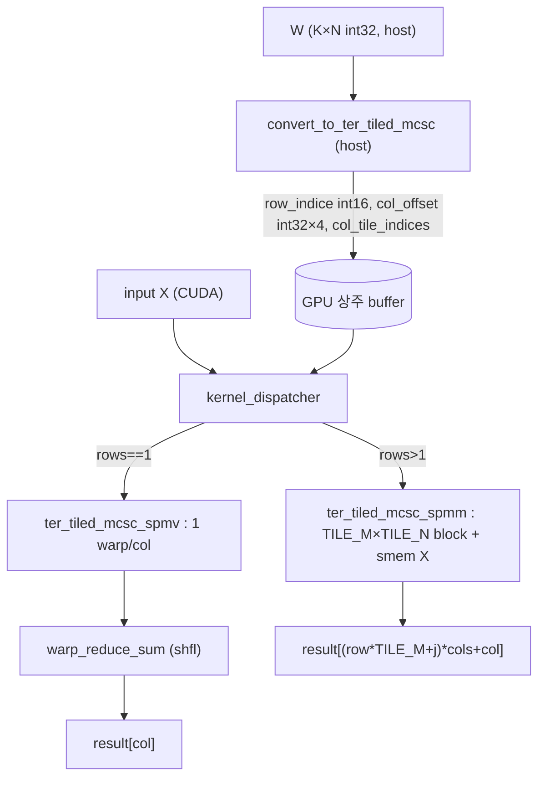

# ternaryLLM 모듈 통합 가이드

> 1차 요약(맥락): [`../ternaryLLM.md`](../ternaryLLM.md)
> 소스 루트: `REF/ViT-Accelerator/ternaryLLM`. 4개 서브프로젝트 — `ternaryLLM_CPU`(C++/AVX), `ternaryLLM_GPU`(PyTorch+CUDA), `ternaryLLM_FPGA`(SpinalHDL/Coyote U55C), `SSR`(README만).
> 표기 규약: 라인으로 직접 확인한 사실은 단정, 코드 정황 기반은 "추정", 코드/문서에 없으면 "확인 불가".
> 형제 동형: `REF/Analysis/ViT-Accelerator/TATAA/MODULE_GUIDE.md`. 단, TATAA는 단일 RTL 가속기라 **모듈 단위**, 본 가이드는 한 알고리즘(addition-based ternary SpMM)의 **타깃 단위(CPU/GPU/FPGA/SSR)** 3중 구현이므로 §2..§5를 타깃 단위로 구성한다.
> 제외물(이름만): `ternaryLLM_FPGA/coyote_files/`(Coyote shell 통합·`cyt_top.bit` 비트스트림), `hw/spinal/gemmacc/src/old/`(Base/AXI_version/coyote_v2 구버전), `hw/spinal/MatrixAdd/`(테스트 로직), `*.ipynb`(SIMD_Generator/Benchmark), `*.odt/.ods`(벤치결과 문서), 외부 라이브러리(libtorch/Eigen/transformers/pybind11/Coyote).

---

## 0. 문서 머리말

### 0.1 대표 케이스 선정

대표 케이스는 **삼진 GEMM 한 타일** — `Y[m,n] = Σ_{k∈pos(n)} X[m,k] − Σ_{k∈neg(n)} X[m,k]`. 가중치 W∈{−1,0,+1}이므로 곱셈이 사라지고 **인덱싱(row_index) + 가감산 누산**만 남는다. 이 단일 커널이 4개 타깃에서 동일하게 재현되며, 각 타깃이 실제로 돌리는 단위:

- **CPU 대표**: LLM 디코드 단계의 **M=1 GEMV** (단일 토큰), K∈{1024,2048,4096}, N=4×K, sparsity 0.5~0.9. `main.cpp` L99-113의 활성 `Config_MKNSV` 전부 `M=1`. (확인됨 — 주석 처리된 L84-98이 M>1, 활성 L99-113이 M=1)
- **GPU 대표**: HuggingFace Llama의 `nn.Linear` → `TernaryLinear` 치환. `ter_spmm` 한 호출이 한 선형투영 GEMM. `TernaryLinear.forward` L170-181. rows=1이면 spmv, rows>1이면 spmm 커널 분기(`kernel_dispatcher` L461). (확인됨)
- **FPGA 대표**: `TopLevelSim.scala` L17의 활성 테스트 `(M=4, N=32=S/2, K=256)` — UNROLL_M=4행, S/2=32컬럼, K=256(2×K_slice) 한 GEMM 타일. (확인됨; 나머지 테스트는 주석 처리)
- **SSR**: 코드 부재(README만, §5). DATE 2026 핵심 논문이나 구현 미동봉. (확인됨)

선정 근거: 4 타깃 모두 동일 수식을 구현하나 데이터타입(INT8/FP32)·병렬 단위(AVX lane / CUDA warp / PE acc)·균일화 정책이 다르므로, 같은 수식을 4 변주로 대조한다.

### 0.2 수치 표기 규약 (곱셈치환 연산수)

곱셈이 없으므로 전통적 MAC 대신 **add/sub 연산수**와 **MAC-equiv**(=add/sub 수)로 센다.

- **add/sub ops**: 비제로(nnz) 1개당 누산 1회. 한 컬럼 nnz개면 add/sub `nnz`회. dense 대비 MAC을 `nnz/K` 비율로 치환 — sparsity 0.8이면 K 곱셈 → 0.2K add/sub.
- **인터리브 쌍 연산**: pos/neg를 묶은 `+a−b`는 add+sub 2연산(또는 SIMD `sub(pos,neg)` 후 `add` 누산 = 2연산).
- **병렬도**: CPU=AVX 레지스터 폭(int8 32/64-wide) × OpenMP 스레드, GPU=warp 32 × block, FPGA=PE 수(UNROLL_M) × acc 수(S).
- **TCSC 메모리(payload bit)**: 값 배열 미저장. 컬럼 오프셋(col_ptr) + 행 인덱스(int16) + 메타데이터(int32). 표준 CSC 대비 `값 배열(nnz×bit)`을 절약.

### 0.3 운영 경로 (공통 양자화 ↔ CPU/GPU/FPGA)

```
[삼진 가중치 W ∈ {−1,0,+1}]  (실제 학습은 repo 범위 밖 → 본 repo는 랜덤 삼진 생성)
        │
[포맷 변환]  W → TCSC: 컬럼별 (+1 행인덱스 리스트, −1 행인덱스 리스트), 값 미저장
        │        ├─ CPU:  TCSC.hpp SparseFormat → MergedTCSC → MergedTCSC_Group(min/mid/max)
        │        ├─ GPU:  ter_spmm_wrapper.cu convert_to_ter_csc → tiled_csc → tiled_mcsc(+padding+swizzle)
        │        └─ FPGA: (host) uniform 가정 — 컬럼당 nnz 고정, 인덱스 스트림만 전달
        │
[실행]  X 인덱싱 + 가감산 누산
         ├─ CPU:  AVX2/512 add/sub, OpenMP 컬럼병렬 (GEMM_CPU_INT8.cpp)
         ├─ GPU:  ter_spmm 커널 (spmv: 1 warp/col, spmm: TILE_M×TILE_N block)
         └─ FPGA: PE 어레이 indexed-accumulate → pos/neg 차분 (PE.scala)
```
근거: `TCSC.hpp` L6-409, `ter_spmm_wrapper.cu` L39-315, `DataFSM.scala` L390-410, `PE.scala` L30-40.

### 0.4 타깃 / 데이터타입 / 균일화 정책

| 타깃 | 디바이스 | X/Y dtype | W 표현 | 균일화 정책 |
|---|---|---|---|---|
| CPU | AMD Ryzen 7 8845HS / Intel i9-11900H (AVX2+AVX512), Win11/10, MSVC2022 (`CPU/README.md` L15-17) | INT8 또는 FP32 | int16 row_index, 부호=배열소속 | "min"/"mid"/"max"/uniform 그룹 정책 (`TCSC.hpp` L146-243) |
| GPU | NVIDIA CUDA 12.9, PyTorch CUDAExtension (`setup.py` L6,L19-26) | FP32 (`ter_spmm` L334 `kFloat`) | int16 row_indice, int32 col_offset | UNIFORMED / PADDED 템플릿 bool (`ter_spmm_kernel.cuh` L85) |
| FPGA | Xilinx Alveo U55C + ETH Coyote, HACC (`FPGA/README.md` L5) | X 8bit 입력, 누산/출력 16bit (`Config.scala` L31-35) | 8bit 인덱스 스트림 | uniform 강제: `Non_zero_per_K_slice` 고정 (`DataFSM.scala` L391) |
| SSR | — | — | — | 코드 부재 |

---

## 1. Repo / Layer 개요

| 서브프로젝트 | 경로 | 역할 | 핵심 파일 |
|---|---|---|---|
| **CPU** | `ternaryLLM_CPU/src/` | C++ INT8/FP32 GEMM + TCSC 포맷 변환 + libtorch Llama 벤치 | `TCSC.hpp`, `GEMM_CPU_INT8.cpp`, `GEMM_CPU_FP32.cpp`, `main.cpp` |
| **GPU** | `ternaryLLM_GPU/` | PyTorch CUDA 확장 `ter_spmm` + HF Llama 레이어 치환 | `csrc/ter_spmm_kernel.cuh`, `csrc/ter_spmm_wrapper.cu`, `csrc/utils.cuh`, `TernaryLLM/TernaryLinear.py` |
| **FPGA** | `ternaryLLM_FPGA/hw/spinal/gemmacc/` | SpinalHDL 삼진 GEMM 가속기 + Coyote 통합 + 호스트 SW | `src/Config.scala`, `src/design/{PE,DataFSM,TopLevel,WrapGEMM}.scala`, `src/Generator.scala`, `sw/gemmacc/main.cpp` |
| **SSR** | `SSR/` | DATE 2026 논문 — **README만, 소스 없음** | `README.md` (12줄) |

### 모듈 인스턴스 / 호출 계층

```
CPU:   main.cpp (벤치) → SparseFormat/MergedTCSC_Group (TCSC.hpp) → GEMM_CPU_INT8_*_AVX2/512_OpenMP
GPU:   TernaryLlama/MLP/Attn → TernaryLinear.forward → ter_spmm(pybind) → kernel_dispatcher → ter_tiled_mcsc_{spmv|spmm}
FPGA:  Generator.TernaryGEMM → WrapGEMM (AxiLite4) → TopLevel (PE×UNROLL_M + DataFSM) → ternaryGEMM.v → Coyote vFPGA
       (host) sw/gemmacc/main.cpp → cThread CSR 레지스터 set → start/done 폴링
```

- README 5개: 루트 + CPU/GPU/FPGA/SSR 각 1개. GPU README는 5줄(빌드 절차만), SSR README는 인용만.
- 자체 RTL: SpinalHDL design 4개(`PE/DataFSM/TopLevel/WrapGEMM`) + Config + Generator. CUDA 자체: 커널 2개(spmv/spmm) + 변환 3개(csc/tiled_csc/tiled_mcsc). CPU 자체: TCSC 4클래스/함수 + INT8 커널 17개 시그니처(`GEMM_CPU_INT8.hpp` L11-29, 본문은 3개만 구현).

---

## 2. 타깃 CPU — TCSC 포맷 + AVX 가감산 커널 (`TCSC.hpp`, `GEMM_CPU_INT8.cpp`)

### 2.1 역할 + 상위/하위 관계
전체 repo의 **알고리즘적 원천**. `TCSC.hpp`가 삼진 행렬을 "부호별 비제로 행 인덱스"로 변환하는 4단계 포맷을 정의하고(GPU/FPGA가 이를 동치로 재구현), `GEMM_CPU_INT8.cpp`가 그 포맷을 AVX2/AVX-512로 소비한다. 상위: `main.cpp` 벤치 드라이버. 하위: `immintrin.h` intrinsic + OpenMP.

### 2.2 데이터플로우
```
W(K×N, int8, row-major)
  └─ SparseFormat: 컬럼별 col_start_pos/neg(col_ptr) + row_index_pos/neg(int16)  [값 미저장]
       └─ MergedTCSC: pos/neg 인터리브 "+a−b" 쌍 + 잔여(remain) + remain_val 메타
            └─ MergedTCSC_Group(min/mid/max): 그룹 단위 정렬 → 잔여 분기 최소화
                 └─ GEMM_CPU_INT8_*_AVX2/512: X(col-major) 256/512bit load → add(res, sub(pos,neg)) → store
```

### 2.3 인스턴스 계층
`main.cpp` → `SparseFormat(W,K,N)` → `MergedTCSC_Group(naiveTCSC, K, N, group_size, method, interleaved[, SIMD_SIZE])` → 커널 함수(`metadata`+`row_index` 인자).

### 2.4 대표 코드 위치
`ternaryLLM_CPU/src/TCSC.hpp`(포맷 4종 + 참조 sparseGEMM), `ternaryLLM_CPU/src/GEMM_CPU_INT8.cpp`(AVX 커널 3종 구현), `ternaryLLM_CPU/src/GEMM_CPU_INT8.hpp`(17 시그니처 카탈로그).

### 2.5 대표 코드 블록

(1) **TCSC 핵심 — 값 미저장, 부호=배열소속** (`TCSC.hpp` L20-29)
```cpp
for (int k = 0; k < K; k++) {
    if (matrix[k * N + n] >= 1)      { column_start_pos++; this->row_index_pos.push_back(k); }
    else if (matrix[k * N + n] <= -1){ column_start_neg++; this->row_index_neg.push_back(k); }
}
```
→ +1은 pos 배열, −1은 neg 배열로 행 번호만 push. ±1 값 자체는 저장 안 함. **표준 CSC 대비 값 배열(nnz×bit) 절약**.

(2) **참조 sparseGEMM — 곱셈 0개** (`TCSC.hpp` L420-426)
```cpp
#pragma omp simd
for (int k = W.col_start_pos[n]; k < W.col_start_pos[n + 1]; k++)
    y += X[m * K + W.row_index_pos[k]];
#pragma omp simd
for (int k = W.col_start_neg[n]; k < W.col_start_neg[n + 1]; k++)
    y -= X[m * K + W.row_index_neg[k]];
```
→ pos 인덱스는 `+`, neg 인덱스는 `−`. "Addition-Based Sparse GEMM"의 정의 그 자체. `#pragma omp parallel for`(L417) 컬럼 병렬.

(3) **MergedTCSC_Group "mid" — 더미 0 삽입으로 정렬** (`TCSC.hpp` L183-187)
```cpp
else {
    int same_as_longest_align = naiveTCSC.row_index_pos[naiveTCSC.col_start_pos[n + mid_longest_align] + k];
    row_index.push_back(same_as_longest_align); // two same values produces 0: a-a=0
    row_index.push_back(same_as_longest_align);
}
```
→ 같은 인덱스를 두 번 push → `+a−a=0`. 짧은 컬럼을 그룹 길이에 맞춰 잔여 루프를 컬럼당 1개로 줄임. "더미 0 메모리 vs 분기 수" 트레이드오프.

(4) **AVX2 INT8 융합 누산 — pos는 add, neg는 sub** (`GEMM_CPU_INT8.cpp` L33-40)
```cpp
res00 = _mm256_add_epi8(res00, _mm256_sub_epi8(pos00, neg00));
...
res31 = _mm256_add_epi8(res31, _mm256_sub_epi8(pos31, neg31));
```
→ 인터리브 구간에서 한 번에 (pos−neg) 차분 후 누산. 8개 `__m256i`(4컬럼 × 상위32/하위32) 동시 누산. X는 `row_index[k]*M_ROW + i`로 column-major 연속 256bit load(L17-32).

(5) **Uniform 커널 — 잔여 루프 자체 제거** (`GEMM_CPU_INT8.cpp` L98)
```cpp
for (int k = j * 4 * NonZeroPerCol; k < (j + 1) * 4 * NonZeroPerCol; k += 8) {
```
→ 컬럼당 nnz가 `NonZeroPerCol`로 균일하다고 가정 → metadata 불필요, 단일 루프. 가장 단순/빠른 경로(FPGA의 uniform 가정과 동일 사상).

### 2.6 마이크로아키텍처 + 정량

- **TCSC 4단계 포맷**:
  - `SparseFormat`(L6-34): naive. col_ptr(int) × 2 + row_index(int16) × 2.
  - `MergedTCSC`(L36-90): 컬럼당 메타 4개(align_start, align_end, remain_end, remain_value).
  - `MergedTCSC_Group`(L92-409): 그룹 정렬도 3종 측정 — `align_min`=그룹 내 min(pos,neg)의 최솟값(L116), `align_mid`=min(pos,neg)의 최댓값(L117), `align_max`=max(pos,neg)의 최댓값(L118). 정책별 metadata: min=컬럼당 `(remain_end_pos, remain_end_neg)`(L162,172), mid=`(remain_end, remain_val)`(L204-205), max=잔여 없음(L235-237).
  - SIMD 버전(L248-408): `SIMD_SIZE` 보폭으로 컬럼 인덱스 묶음 배치(L280-307) → AVX 레지스터 폭 정합.
- **병렬도**: AVX2 = int8 32-wide × 8 누산기(L8-15) = 한 타일 256개 int8 동시. AVX512 = int8 64-wide × 4 누산기(L140-143) = 256개 동시(폭 2배, 누산기 절반). OpenMP = 컬럼 그룹 `N/4` 병렬(L4-5,87-88). 행 타일 = 64 또는 128(`M_ROW i+=64`, L7).
- **곱셈치환 연산수**: 인터리브 구간 nnz쌍당 `sub_epi8` 1 + `add_epi8` 1 = 2연산. 잔여 구간 nnz당 add 또는 sub 1연산(L42-72). 곱셈 0.
- **TCSC 메모리**: row_index `int16`(K≤32767 가정), col_ptr/metadata `int32`. uniform 커널은 metadata 미사용(NonZeroPerCol 스칼라 1개).
- **dtype**: INT8 누산도 `epi8`(8bit) — **누산 오버플로 가능**(K 크고 sparsity 낮으면). 검증 코드 미동봉 → 정확도 영향 **확인 불가**. FP32 버전(`GEMM_CPU_FP32.cpp`)은 baseline/Eigen 비교용(곱셈 포함 Direct + TCSC Naive).
- **병목**: `row_index`로 X를 gather하나 X가 column-major(`*M_ROW`)라 컬럼 내 연속 load 가능 — gather가 아닌 인덱스-스케일 base load. 비균일 잔여 분기가 min 정책에서 컬럼당 2루프(pos/neg) 발생.

---

## 3. 타깃 GPU — CUDA tiled-MCSC SpMM/SpMV (`ter_spmm_kernel.cuh`, `ter_spmm_wrapper.cu`, `TernaryLinear.py`)

### 3.1 역할 + 상위/하위 관계
PyTorch CUDA 확장 `ter_spmm`. host에서 W를 tiled-MCSC로 변환(`ter_spmm_wrapper.cu`)하고, device 커널이 X를 smem 타일에 적재 후 레지스터 인덱스 프래그먼트로 가감산 누산(`ter_spmm_kernel.cuh`). 상위: HF Llama 레이어(`TernaryLinear`→`TernaryMLP`/`TernaryAttn`). 하위: CUDA 프리미티브(`__ldca`, `__shfl_down_sync`), pybind11.

### 3.2 데이터플로우


### 3.3 인스턴스 계층
`TernaryLinear.forward` → `ter_spmm.ter_spmm`(pybind, `wrapper.cu` L318) → `ter_spmm_wrapper<float>`(L511) → `kernel_dispatcher`(L454) → `ter_spmm_kernel_caller` 또는 `ter_spmv_kernel_caller` → `ter_tiled_mcsc_spmm`/`spmv` 템플릿 커널. `DISPATCH_M/K/BOOL` 매크로(utils.cuh L12-80)로 TILE 크기·VEC 타입·uniformed/padded를 컴파일타임 상수화.

### 3.4 대표 코드 위치
`ternaryLLM_GPU/csrc/ter_spmm_kernel.cuh`(커널 2종 + caller + dispatcher), `ternaryLLM_GPU/csrc/ter_spmm_wrapper.cu`(변환 3종 + pybind), `ternaryLLM_GPU/csrc/utils.cuh`(매크로/벡터/warp_reduce), `ternaryLLM_GPU/TernaryLLM/TernaryLinear.py`(nn.Module).

### 3.5 대표 코드 블록

(1) **spmv: 1 warp/컬럼, lane 보폭 인터리브** (`ter_spmm_kernel.cuh` L53-57)
```cpp
for (int i = col_offset_interleaved_start + lane_id*2; i < col_offset_remain_start; i+=2*32) {
    int pos_id = __ldca(w_tiled_merged_row_indice + i);
    int neg_id = __ldca(w_tiled_merged_row_indice + i + 1);
    sum += __ldca(X + x_offset + pos_id) - __ldca(X + x_offset + neg_id);
}
```
→ warp_id=col(L39), lane가 `lane*2` 보폭으로 (pos,neg) 쌍을 읽어 `X[pos]−X[neg]`. read-only 캐시 `__ldca`. 잔여(common) 구간은 `!UNIFORMED`일 때 같은 부호 partial 후 `sign×partial`(L59-67).

(2) **spmm: smem X 타일 + 레지스터 누산** (`ter_spmm_kernel.cuh` L207-210)
```cpp
for (int i = 0; i < FRAGMENT_SIZE; i+=2) {
    res[j] += tile_X[tile_offset + fragment_row_indices[i]];
    res[j] -= tile_X[tile_offset + fragment_row_indices[i+1]];
}
```
→ smem `tile_X[TILE_M*TILE_K]`(L142)에서 인덱스로 게더, `res[TILE_M]` 레지스터에 가감산. 인덱스는 16바이트 정렬 벡터로 로드(`fragment_row_indices`, L145-146,199-201). PADDED면 4-원소 단위 잔여 처리(L237-245).

(3) **column-major X를 smem에 전치 적재** (`ter_spmm_kernel.cuh` L173,180)
```cpp
DataVecM x_data_vec = __ldca(X_vec + rows/vectorSizeM*(actual_k_offset + i) + actual_row_id);
StoreFPVectorToArray(x_data_vec, tile_X_base + i, TILE_K);  // 벡터(float4)로 smem 기록
```

(4) **tiled-MCSC 변환 + 4-오프셋 메타** (`ter_spmm_wrapper.cu` L294-297)
```cpp
w1_merged_col_offset_tiled[tile_start_id + 0] = prev_cnt;                              // interleave_start
w1_merged_col_offset_tiled[tile_start_id + 1] = ... prev_cnt + cnt_interleave...;      // remain_start
w1_merged_col_offset_tiled[tile_start_id + 2] = ... + cnt_remain;                      // common_end
w1_merged_col_offset_tiled[tile_start_id + 3] = flag_min_neg ? 1 : -1;                 // sign
```
→ 타일당 [interleave_start, remain_start, common_end, sign] 4-오프셋. 타일-로컬 인덱스(`row_indice -= offset`, L139,142, in tiled_csc).

(5) **padding + inter_tile_swizzle (워프 부하 균형)** (`ter_spmm_wrapper.cu` L259-261, L14-23)
```cpp
for (int k = cnt_interleave; k < cnt_interleave_padded; k++)
    w1_merged_row_indice_tiled[prev_nnz + k] = w1_pos_row_indice[tile_pos_start]; // 여분 슬롯에 pos[start] 채움
...
std::sort(swizzle_staging.begin(), ..., [&](int a, int b){ return (len_a) < (len_b); }); // nnz 오름차순 정렬
```
→ padding은 interleave/remain을 `padding_size` 배수로 정렬(분기 제거, 메모리↑). swizzle은 타일을 nnz 오름차순 정렬해 워프 간 로드 밸런싱.

(6) **2-stream 배치 핑퐁** (`ter_spmm_kernel.cuh` L348-371)
```cpp
for (int b = 0; b < batch_size; b += 2) {
    ter_tiled_mcsc_spmm<...><<<gridSize, blkSize, 0, stream_0>>>(...);  X += rows*inners; result += rows*columns;
    ter_tiled_mcsc_spmm<...><<<gridSize, blkSize, 0, stream_1>>>(...);  X += rows*inners; result += rows*columns;
}
```
→ 배치를 2 stream으로 핑퐁 오버랩. 홀수 배치는 먼저 1개 처리(L330).

### 3.6 마이크로아키텍처 + 정량

- **병렬도(spmv)**: 1 warp(32 lane) = 1 출력 컬럼(L39). block=256 thread(L392) = 8 warp = 8 컬럼. grid=`ceil(32*columns/256)`(L393). warp 내 `warp_reduce_sum` = `__shfl_down_sync` 트리(utils.cuh L237-241, log2(32)=5단).
- **병렬도(spmm)**: block=(TILE_N, 1)(L327). grid=(`ceil(columns/TILE_N)`, `ceil(rows/TILE_M)`)(L328). 스레드당 `res[TILE_M]` 결과(L149).
- **타일 크기 디스패치**(utils.cuh L59-80): K≤512 → TILE_K=64, FRAGMENT=32; K≤2048 → TILE_K=256; else → TILE_K=512, FRAGMENT=64. TILE_M(L29-56): rows%8==0 → 8(float4), %4 → 4, %2 → 2(float2), else 1. `TernaryLinear`의 `MapKSizeToTileSize`(L9-16)도 동일 매핑(8192/4096→512, 2048/1024→256, 512→64).
- **곱셈치환 연산수**: 인터리브 nnz쌍당 `+ −` 2연산(L208-209). common nnz당 `+` 1연산 후 `sign×partial` 1곱(L297) — **유일하게 sign 곱셈이 잔여항에만 1회**(부호 처리). 인터리브는 곱셈 0.
- **smem**: `tile_X[TILE_M*TILE_K]` float = 최대 8×512×4B = 16 KB/block(추정, TILE_M=8/TILE_K=512). 레지스터: `fragment_row_indices[FRAGMENT_SIZE]` 16바이트 정렬(L145).
- **제약(dispatcher assert)**: `inners%256==0`(K), `columns%8==0`(N) (L459-460).
- **dtype**: 활성/출력 **FP32**(`result` kFloat, L334). row_indice는 **int16**(`TernaryLinear` L143 dtype=int16, kernel IDX_TYPE int16, L317). col_offset int32.
- **빌드**: nvcc `-use_fast_math -Xptxas -O3`(setup.py L24), cxx `-O3 -std=c++17`(L23). **합성/실측 throughput·점유율 리포트 미동봉 → 확인 불가** (`*.ipynb` 벤치는 제외).
- **상위 통합**: `TernaryMLP.py` L19-30 gate/up/down_proj를 `TernaryLinear`로 구성, `down(act(gate(x))*up(x))`(L34) SwiGLU. `TernaryConfig`(configuration_ternary.py L28-34): `ternary_attn_linear=True`, `ternary_mlp=True`, `sparsity=0.8`, `uniform_sparsity=False`, `uniform_sparsity_block_size=512`, `padding=False`, `padding_size=4`. **추론 시 weight는 TCSC 압축 상태로 GPU buffer 상주**(register_buffer, `TernaryLinear` L144-146), X만 흐름.

---

## 4. 타깃 FPGA — SpinalHDL 삼진 PE 어레이 (`Config.scala`, `PE.scala`, `DataFSM.scala`, `TopLevel.scala`, `WrapGEMM.scala`)

### 4.1 역할 + 상위/하위 관계
Alveo U55C + Coyote vFPGA 삼진 GEMM 가속기. `Config.scala`(trait ConfigSys)가 모든 파라미터의 원천, `PE.scala`가 곱셈기 없는 indexed-accumulate 코어, `DataFSM.scala`가 데이터무브 컨트롤러, `TopLevel`이 PE 어레이+FSM 결선, `WrapGEMM`이 AxiLite4 제어 래퍼. 상위: `Generator.TernaryGEMM` → `ternaryGEMM.v` → Coyote shell. 하위: SpinalHDL 프리미티브(Mem, Stream, StateMachine), Coyote 인터페이스(AXI4SR/ReqT/ack_t).

### 4.2 데이터플로우
```mermaid
flowchart TD
  HOST["XRT host (sw/main.cpp)"] -->|AxiLite4 CSR| WG[WrapGEMM]
  WG --> TL[TopLevel]
  HBM[(HBM U55C)] -->|4K burst, sq_rd| FSM[DataFSM]
  FSM -->|512b| BUFX["Buffer_X (BRAM)"]
  BUFX -->|io.x async read| PE["PE × UNROLL_M=4"]
  FSM -->|io.w 8bit 인덱스 스트림| PE
  PE -->|acc(i-1)-acc(i) 차분| YOUT["io.y 512b"]
  YOUT -->|select_Y, sq_wr| HBM
```

### 4.3 인스턴스 계층
`WrapGEMM`(AxiLite4, `WrapGEMM.scala` L28) → `TopLevel`(`TopLevel.scala` L12) → `DataFSM`(1개, L58) + `PE_Array = Array.fill(UNROLL_M)(new PE)`(L85). 모든 PE에 `io.x`/`io.w` broadcast(L89-95), `enable_X(i)`로 행별 x_reg 분리, `select_Y`로 출력 PE 선택(L100).

### 4.4 대표 코드 위치
`ternaryLLM_FPGA/hw/spinal/gemmacc/src/Config.scala`(파라미터), `src/design/PE.scala`(연산코어), `src/design/DataFSM.scala`(11-state FSM), `src/design/TopLevel.scala`(결선), `src/design/WrapGEMM.scala`(CSR), `src/Generator.scala`(Verilog 생성), `sim/ternaryGEMM/TopLevelSim.scala`(testbench), `sw/gemmacc/main.cpp`(호스트).

### 4.5 대표 코드 블록

(1) **PE indexed-accumulate — weight 인덱스로 x_reg 게더 누산** (`PE.scala` L30-34)
```scala
for(i <- 0 until conf.S){          // S=64 accumulators
  when(io.w.fire){
    acc(i) := acc(i) + x_reg(w_subdivided(i).asUInt.resized)  // 8bit weight = x_reg 인덱스
  }
```
→ `io.w`(512bit)를 8bit×64로 subdivide(L23), 각 8bit를 x_reg(K_slice=128 활성값) 인덱스로 사용해 게더·누산. **곱셈 없음** — 순수 indexed-accumulate.

(2) **pos/neg 차분 출력 — 짝(pos)−홀(neg)** (`PE.scala` L36-38)
```scala
if (i % 2 == 1) {
  io.y.subdivideIn(conf.S_2 slices)(i/2) := (acc(i - 1) - acc(i)).asBits
}
```
→ S=64 누산기를 짝수(pos)·홀수(neg) 쌍으로 보고 `acc(짝)−acc(홀)` 차분 → S/2=32개 출력. **TCSC의 pos/neg 인터리브가 HW에 그대로 매핑**.

(3) **x_reg 512bit beat 적재 (one-hot enable_X)** (`PE.scala` L43-47)
```scala
for(i <- 0 until conf.TOTAL_BEATS_KSLICE) {   // 2 beats
  when(io.enable_X(i)) {
    for(j <- 0 until conf.ENTRIES_PER_BEAT_X){ // 64 entries/beat
      x_reg(i * conf.ENTRIES_PER_BEAT_X + j) := x_subdivided(j).asSInt
```

(4) **uniform 가정 — 컬럼당 nnz 고정 반복** (`DataFSM.scala` L391-394)
```scala
when(cnt_entries.value < io.Non_zero_per_K_slice - 1) { // read Non_zero_per_K_slice times S indexes
  cnt_entries.increment()
  goto(READ_W_AR)
}
```
→ K_slice당 비제로 수를 `Non_zero_per_K_slice` 런타임 상수로 고정 → 비균일 희소성 미지원(제어 단순화). **uniform TCSC 강제**.

(5) **PE 어레이 + 출력 선택** (`TopLevel.scala` L85,89-100)
```scala
val PE_Array = Array.fill(conf.UNROLL_M)(new PE(conf))  // 4 PE
for(i <- 0 until conf.UNROLL_M){
  PE_Array(i).io.x <> FSM.io.x; PE_Array(i).io.w.payload := FSM.io.w.payload   // broadcast
  PE_Array(i).io.enable_X <> FSM.io.enable_X(i)   // 행별 분리
}
io.axis_card_send.tdata := yVec(FSM.io.select_Y)   // 출력 PE 선택
```

(6) **AxiLite4 CSR 레지스터 맵** (`WrapGEMM.scala` L43-53)
```scala
val input_M = ctrlR.createReadAndWrite(UInt(16 bits), 0x00, ...)  // M/N/K/Nz_Kslice/start/addr_X/W/Y/expected_beats
val finished = ctrlR.createReadOnly(Bool(), 0x40, ...)            // done
val cnt_cyles = ctrlR.createReadOnly(Bits(40 bits), 0x50, ...)    // 사이클 카운터
```

### 4.6 마이크로아키텍처 + 정량

- **언롤/병렬 파라미터**(`Config.scala` L51-59): `S=64`(컬럼 누산기, 출력 S/2=32), `K_slice=128`(K 타일), `UNROLL_M=4`(행 병렬). → 공간 병렬도 = **PE 4개(행) × acc 64개(컬럼) = 256 누산기**. 단 출력은 PE당 32(pos/neg 차분 후) → 4×32=128 출력/타일.
- **비트폭**(`Config.scala` L31-35): `BIT_WIDTH_X=8`(X 입력), `BIT_WIDTH_INDEX=8`(W 인덱스), `BIT_WIDTH_X_Y=16`(누산/출력), `DATA_WIDTH=512`. → 16bit 누산 → **K 크고 sparsity 낮으면 오버플로 리스크**(검증 미독 → 확인 불가).
- **비트당 엔트리**(`Config.scala` L46-48): `ENTRIES_PER_BEAT_X_Y=512/16=32`, `ENTRIES_PER_BEAT_W=512/8=64`(=S), `ENTRIES_PER_BEAT_X=512/8=64`.
- **AXI4**(`Config.scala` L9-22): addressWidth=64, dataWidth=512, idWidth=6, burst/len 사용. Coyote v2(L25-29): VADDR_BITS=48.
- **버퍼**(`Config.scala` L65-75): `TOTAL_ENTRIES_BUFFER=16384`, `BUFFERSIZE=(UNROLL_M×16384)/ENTRIES_PER_BEAT_X = 4×16384/64 = 1024` 라인 × 512bit(`Buffer_X = Mem(512bit, BUFFERSIZE)`, `DataFSM.scala` L93). `TOTAL_BEATS_KSLICE=(128×8)/512=2`(K_slice 1개를 2 beat로). `four_K=4096`(X burst 단위).
- **곱셈치환 연산수**: `io.w.fire`당 S=64 acc에 add 64회(L30-34). 출력당 sub 1회(차분, L37). 곱셈 0(차분이 부호 처리). DSP 거의 불필요 — adder만(합성 리포트 미동봉 → 정확한 DSP/LUT **확인 불가**).
- **FSM 11-state**(`DataFSM.scala` L182-183): IDLE → LOAD_X_4K → LOAD_X_DATA → SET_ADDR → LOAD_SLICE → READ_W_AR → LOAD_W_DATA → WAIT_ACC → WAIT → MEM_ADDR_Y → MEM_WRITE_Y → NEXT_4ROWS. X는 4K(4096B) burst로 BRAM 적재(L252-323), W는 비제로 인덱스만 `Row_Data_W=S×1=64`B 단위 스트림(L360-388), Y는 UNROLL_M개 행의 S/2=32값 sq_wr(L422-469).
- **사이클 측정**: `cnt_time` 40bit 카운터(`DataFSM.scala` L118,148-149) → CSR `cnt_cyles`(0x50)로 host 읽기. **실측 latency/주파수 리포트 미동봉 → 확인 불가**.
- **시뮬 검증**: `TopLevelSim.scala` L82-108이 `AxiMemorySim` + `InputAndCheck.naiveGEMM`으로 bit-exact 비교(L108 assert). 테스트 entries=`0.5×K/2`(50% 희소 가정, L44). 활성 케이스 (M=4,N=32,K=256)만.
- **빌드/생성**: `Generator.scala` L21-30 `TernaryGEMM` → `WrapGEMM` → `hw/gen/ternaryGEMM.v`. `MySpinalConfig`(L12-18): 동기 리셋, active-LOW. 생성 후 AXI ctrl 주소 마스크 수동 수정(`FPGA/README.md` L47-56). Mill 0.11.13 / Scala 2.13.14 / SpinalHDL 1.12.0 / Verilator 5.034.
- **호스트**(`sw/gemmacc/main.cpp` L27-48): `#define S_SLICE 64`, `N_Slice 32`, `K_SLICE 128`, `UNROLL_M 4` — Config와 동일. CSR 레지스터 인덱스 0~10. cThread로 X/W/Y getMem → setCSR → start → done 폴링(L1-9 절차 주석). uniform weight 생성(L75-98).
- **병목**: uniform 가정으로 비균일 가중치엔 pre-balancing/padding 필요(정확도 영향 가능). FSM이 명시적 단계형이라 X적재/W스트림/Y기록이 K_slice 단위로 순차(파이프라인 오버랩은 제한적, double-region BRAM은 있으나 명시적 더블버퍼 토글 미관찰).

---

## 5. 타깃 SSR — Sparse Segment Reduction (코드 부재)

### 5.1 역할 + 상위/하위 관계
DATE 2026 논문 "SSR: Sparse Segment Reduction for Ternary GEMM Acceleration"(Pittet/Zhu/Verdan/Alonso) — 루트 README가 인용하는 **세 프로젝트 중 하나이자 repo 명명의 근원**. 한계 3("기존 sparse 포맷이 삼진 비최적")을 겨냥(루트 `README.md` L9).

### 5.2~5.6 (결손)
`SSR/` 디렉토리에는 `README.md`(12줄, 논문 인용 BibTeX만, L1-11)만 존재하고 **소스 코드·데이터플로우·정량 근거가 전무**하다. 부분 체크아웃이 아니라 repo 자체에 미동봉(루트 README L19 "refer to the README inside each folder"이나 SSR 폴더엔 절차 문서도 없음). 따라서 §5의 6요소(데이터플로우/인스턴스/코드블록/마이크로아키텍처/정량)는 모두 **확인 불가**. 기여자: Adeline Pittet, Valerie Verdan, Shien Zhu(루트 README L14).

---

## 6. 타깃 비교 한눈표

| 항목 | CPU (C++/AVX) | GPU (CUDA) | FPGA (SpinalHDL) | SSR |
|---|---|---|---|---|
| 포맷 변환 | `SparseFormat`→`MergedTCSC_Group` (TCSC.hpp) | `convert_to_ter_tiled_mcsc` (wrapper.cu) | (host) uniform 가정 인덱스 스트림 | 확인 불가 |
| 비제로 분리 | pos/neg row_index (int16) | pos/neg row_indice (int16) | 8bit 인덱스 스트림 io.w | — |
| 인터리브 +a−b | `add(res, sub(pos,neg))` (INT8.cpp L33) | `res+=X[pos]; res-=X[neg]` (kernel L208-209) | `acc(i-1)-acc(i)` 차분 (PE.scala L37) | — |
| 타일/그룹 단위 | group_size, M_ROW=64/128 | TILE_M(1~8)/TILE_K(64~512)/FRAGMENT(32~64) | K_slice=128, S=64, UNROLL_M=4 | — |
| 병렬도 | AVX int8 32/64-wide × 8/4 acc × OpenMP 컬럼 | warp 32/컬럼(spmv), TILE_M×TILE_N block(spmm) | PE×4(행) × acc×64(컬럼) | — |
| 균일화/잔여제거 | "uniform" 커널 (INT8.cpp L98) | UNIFORMED/PADDED 템플릿 + swizzle | Non_zero_per_K_slice 고정 (필수) | — |
| dtype (X/Y, 누산) | INT8(8bit 누산) / FP32 | FP32 | X 8bit / 누산·출력 16bit | — |
| 부호 처리 | 배열소속(pos/neg) | 인터리브=배열, 잔여=`sign×partial` 곱 | 차분 `pos−neg` (곱셈 0) | — |
| 상위 통합 | main.cpp 벤치 + libtorch Llama | TernaryLinear→MLP/Attn/Llama (HF) | WrapGEMM AxiLite4 + Coyote sw | — |
| 대표 단위 | M=1 GEMV (디코드) | 1 선형투영 GEMM | (M=4,N=32,K=256) 타일 | — |
| 합성/실측 리포트 | 확인 불가(*.odt 제외) | 확인 불가(*.ipynb 제외) | 확인 불가(비트스트림만, 리포트 미동봉) | 확인 불가 |

- **공통 추상**: "컬럼별 pos/neg 인덱스 → 인터리브 누산(+a−b) + 잔여(부호 한 개)" 구조가 SIMD lane / warp lane / PE acc로 각각 사상. 균일화(잔여 분기 제거)는 CPU=uniform 커널, GPU=PADDED/swizzle, FPGA=Non_zero 고정으로 동일 사상.
- **곱셈 위치**: CPU/FPGA는 완전 곱셈 0. GPU만 **잔여항 부호 처리에 `sign×partial` 1곱**(kernel L297) — 인터리브는 곱셈 0.

---

## 7. 권장 읽기 순서

1. **`ternaryLLM_CPU/src/TCSC.hpp` L6-34, L413-429** — 포맷의 정의와 곱셈치환 누산의 원형. 전체 repo의 알고리즘 출발점.
2. **`ternaryLLM_CPU/src/GEMM_CPU_INT8.cpp` L33-40, L98** — AVX 가감산 + uniform 커널. SIMD 사상.
3. **`ternaryLLM_GPU/csrc/ter_spmm_kernel.cuh` L53-57(spmv), L207-210(spmm)** — CUDA warp/tile 사상. `utils.cuh` L29-80(디스패치)로 타일 크기 결정 로직.
4. **`ternaryLLM_GPU/csrc/ter_spmm_wrapper.cu` L156-315** — tiled-MCSC 변환 + padding/swizzle. CPU TCSC와 동치 확인.
5. **`ternaryLLM_FPGA/.../design/PE.scala` L30-40** — indexed-accumulate + pos/neg 차분. HW 핵심.
6. **`ternaryLLM_FPGA/.../design/DataFSM.scala` L181-410** — 11-state 데이터무브. uniform 가정의 출처(L391).
7. **`ternaryLLM_FPGA/.../src/Config.scala`** — 모든 HW 파라미터(S/K_slice/UNROLL_M/비트폭).
8. **`TernaryLinear.py` + `configuration_ternary.py`** — GPU 상위 통합(nn.Module 치환, sparsity/uniform/padding 설정).

---

## 8. 우리 프로젝트(HG-PIPE 계열 고처리량 ViT/Transformer FPGA + XR 시선추적) 시사점

- **(A) PE 코어 직접 차용**: `PE.scala` L30-40의 indexed-accumulate + `acc(i-1)-acc(i)` 차분은 HG-PIPE MAC PE를 삼진 모드로 확장하는 청사진. ViT FFN(fc1/fc2)·QKV proj를 삼진 SpMM으로 치환하면 곱셈기→가산기로 대체, 동일 LUT/DSP 예산에서 PE 수↑ → 처리량↑. XR 시선추적의 저지연·저전력에 부합.
- **(B) TCSC 균일화 정책 = N:M 희소성 강제**: `MergedTCSC_Group` min/mid/max(TCSC.hpp L146-243)의 "더미 0 삽입 vs 분기" 트레이드오프는 FPGA 고정길이 inner-loop(II=1) 확보에 직결. GPU `padding+swizzle`(wrapper.cu L259-261, L14-23)은 비균일 가중치를 컴파일타임 정렬하는 toolflow 아이디어.
- **(C) M=1 경로**: 시선추적 ViT(작은 입력·프레임당 1회)에 CPU M=1(main.cpp L99) / GPU spmv(1 warp/col) 최적화 경로가 직접 참조. 삼진화로 weight 메모리↓ → HG-PIPE식 all-on-chip 가능성↑ → 외부 메모리 제거로 결정론적 저지연.
- **(D) 주의**: FPGA 설계는 Coyote/U55C(데이터센터)·uniform 가정 → HG-PIPE 임베디드 스트리밍에 그대로 쓰기보다 **PE 연산코어 + TCSC 개념만 추출**, 데이터무브/제어는 재설계 권장. 16bit 누산 오버플로·삼진 ViT 정확도는 별도 검증 필요(repo 미제공).

---

## 9. 근거 / 한계 표기

- **라인 근거**: 본 가이드의 모든 코드 주장은 직접 Read한 파일의 라인 번호로 표기(예: PE.scala L37, TCSC.hpp L420-426, ter_spmm_kernel.cuh L208-209, DataFSM.scala L391, Config.scala L51-59, wrapper.cu L294-297).
- **추정 항목**: smem 크기(16 KB, TILE 최대치 환산), DSP 불필요(adder-only 연산구조 근거이나 합성 미확인), FPGA 더블버퍼 오버랩 제한(FSM 단계형 관찰 기반).
- **확인 불가**:
  - 합성/실측 PPA — CPU(`*.odt/.ods` 벤치문서 제외), GPU(`*.ipynb`/`benchmark_*.py` 제외), FPGA(비트스트림만 동봉, util/Vivado 리포트 미동봉). 주파수·throughput·LUT/DSP/BRAM 수치 일체.
  - FPGA 16bit 누산 오버플로 / 플랫폼 간 bit-exact 일치(CPU↔GPU↔FPGA) — 검증 코드 미정독(`util/InputAndCheck.scala`, GPU benchmark).
  - INT8(CPU) 8bit 누산 오버플로 영향.
- **미존재/결손**:
  - **`SSR/`는 README(12줄)만, 소스 코드 전무** — DATE 2026 핵심 논문 구현 부재(부분 체크아웃 아닌 repo 미동봉, §5).
  - 실제 ternary-trained LLM 가중치/정확도 — repo는 랜덤 삼진 생성만(`TernaryLinear.random_ternary_weights` L23-85, CPU `initData`, FPGA `generateWUniformal`).
- **미정독(보조/생성/통합 코드)**: `initData.cpp`, `LlamaModel.hpp`(libtorch Llama, 정확도 비교용), `GEMM_CPU_FP32.cpp`(baseline), GPU `TernaryAttn.py`/`TernaryLlama.py`(HF 레이어 치환 래퍼, configuration로 대체 확인), `benchmark_*.py`, `util/{AxiMemorySim,InputAndCheck}.scala`, `coyote/{Types,AxiCoyote}.scala`, `*.ipynb`. 필요 시 추가 분석 권장.
- 외부 라이브러리(libtorch/Eigen/transformers/pybind11/Coyote) 내부는 분석하지 않음.
