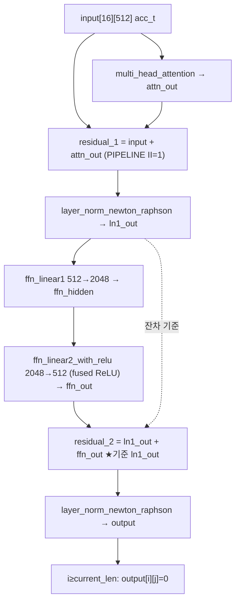
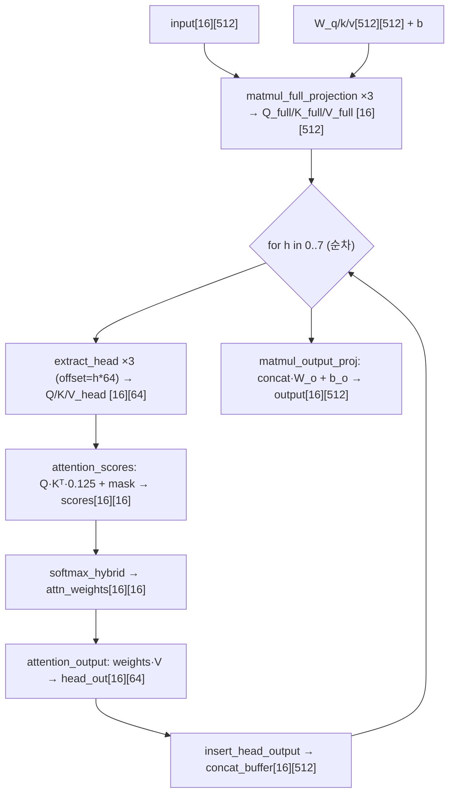
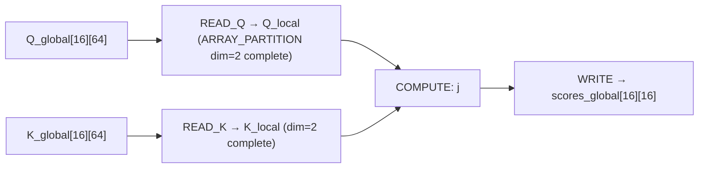
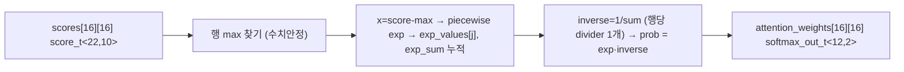
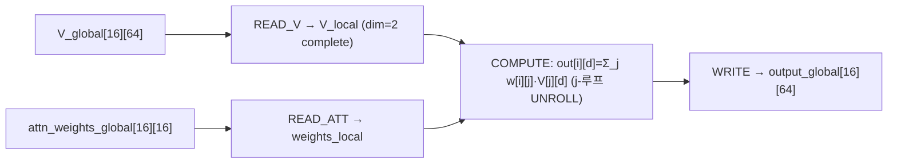
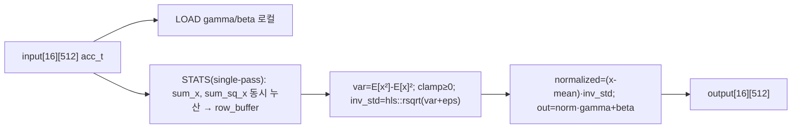
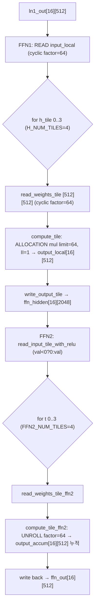
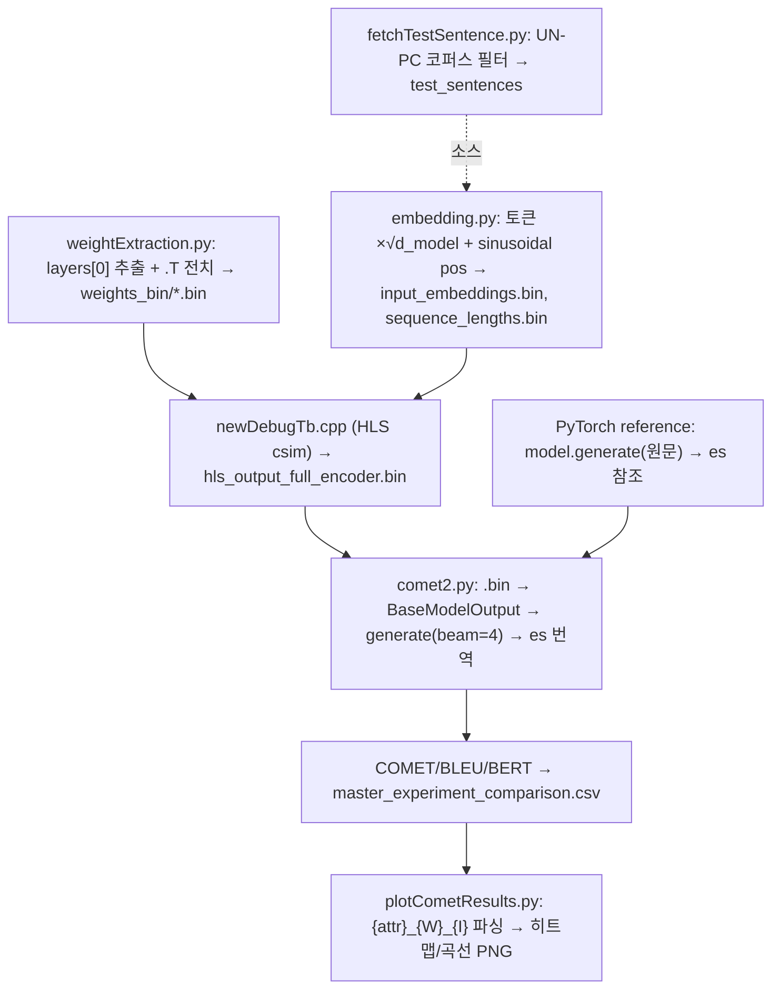

# transformer-hls-thesis 모듈 통합 가이드

> 1차 요약(맥락): [`../transformer-hls-thesis.md`](../transformer-hls-thesis.md)
> 소스 루트: `REF/ViT-Accelerator/transformer-hls-thesis`. 구현 전체가 **Vitis/Vivado HLS C++** (Top 함수 1개 `transformer_encoder_layer` + 인라인 호출되는 일반 C++ 커널들). RTL 자체 소스 없음, 비트스트림 산출물 없음.
> 표기 규약: 라인으로 직접 확인한 사실은 단정, 코드 정황 기반은 "추정", 코드/문서에 없으면 "확인 불가".
> 제외물(이름만): `opus_mt_weights.h`(사전학습 가중치 C 배열, 생성물), `opus_mt_embeddings.h`(임베딩 C 배열, 생성물), `lut_values.h`(rsqrt LUT 256엔트리, 생성물·현 코드 미사용), `exp_lut_values.h`(exp LUT 256엔트리, 생성물·현 코드 미사용). 런타임 데이터 `weights_bin/*.bin`(가중치/임베딩/출력 바이너리, 리포 미동봉).

---

## 0. 문서 머리말

### 0.1 대표 케이스 선정

본 프로젝트는 **인코더 레이어 1개**(`transformer_encoder_layer`)가 Top이며, 테스트벤치가 이를 6번 호출해 6-layer 인코더를 모사한다(`newDebugTb.cpp` L340 `for(l=0; l<NUM_LAYERS; l++)`, `NUM_LAYERS=6` L12). 따라서 대표 케이스는 **인코더 1레이어 전 경로**다.

- **대표 케이스: 인코더 1레이어 (post-norm)**. `transformer_layer.cpp` L95~L132 — MHA → Add(residual) → LayerNorm1 → FFN1(512→2048) → ReLU → FFN2(2048→512) → Add(residual) → LayerNorm2 → 패딩 행 마스킹. 이 한 레이어가 모든 빌딩블록(GEMM/attention/softmax/LayerNorm/activation)을 한 번씩 통과한다.
- **GEMM 하위 대표: QKV full projection**. `multi_head_attention.cpp` L30~L51 `matmul_full_projection` — `[16×512]@[512×512]+bias`. 가장 큰 단일 행렬곱이자(`D_MODEL=512`) attention·FFN·output proj 모두 같은 `sum += in*w` 패턴을 공유한다.

선정 근거: (1) Top이 단일 레이어이므로 1레이어 = 전체 데이터플로우 = 검증 단위가 일치, (2) Edge-MoE의 "단일 엔진 시분할"과 달리 본 설계는 **모듈별 별도 함수**(공유 GEMM 엔진 없음)이므로, 대표 케이스 안에서 모든 모듈 인스턴스를 한 번씩 짚을 수 있다.

### 0.2 수치 표기 규약
- **MAC lanes**: 한 사이클(II=1) 동시 곱셈기 수 = unroll 차원의 곱. 본 설계의 MAC 병렬도는 모듈마다 다르다(아래 §1 표·§N+1 한눈표). 합성 II는 리포트 부재로 모두 **목표 II=1** 기준이며 실제 달성 II는 **확인 불가**.
- **scalar MACs**: 대표 GEMM의 (SEQ_LEN)×(out_dim)×(in_dim) 곱. attention·FFN을 구분 표기. 모든 shape는 Opus-MT 인코더 레이어 상수(`attention_types.h` L19-27): `D_MODEL=512`, `NUM_HEADS=8`, `HEAD_DIM=64`, `FFN_HIDDEN_DIM=2048`, `SEQ_LEN=16`.
- **loop trips / cycle**: 타일·차원 루프 반복(FFN 타일 `H_NUM_TILES=4` 등).
- **memory size (payload bit)**: 온칩 버퍼 깊이×폭(bit). 주요 버퍼 = Q/K/V full 버퍼, FFN 타일 버퍼, LayerNorm row 버퍼.
- **ap_fixed 비트폭 스윕**: `attention_types.h`의 typedef를 수동 토글해 비트폭을 바꾸고, 출력 파일명(`hls_output_full_encoder_{attr}_{W}_{I}.bin`)으로 구분, Python COMET로 평가한다(§10).

### 0.3 운영 경로 (소스 ↔ case/top ↔ 생성 ↔ 평가)
```
[학습/추출]   PyTorch Opus-MT(MarianMT en-es) encoder.layers[0]
        │     → q/k/v/out_proj·fc1/fc2·LN 가중치 추출 + .T 전치 → weights_bin/*.bin (weightExtraction.py L26-99)
[임베딩]      embedding.py: 토큰화(MarianTokenizer) → embed_tokens ×√d_model(embed_scale) + sinusoidal pos
        │     → input_embeddings.bin, sequence_lengths.bin (embedding.py L104-134)
[양자화]      로드 시 float32 → ap_fixed 캐스팅 (newDebugTb.cpp L170-172, load_bin: buffer[i]=(T)temp_buf[i])
        │     활성 프로파일 SWEEP: w=ap_fixed<16,8>, act=ap_fixed<16,8>, acc=ap_fixed<32,20> (attention_types.h L32-44)
[case/csim]   newDebugTb.cpp main(): 50문장 × 6레이어 ping-pong 호출 → all_results
        │     → hls_output_full_encoder.bin 저장 (newDebugTb.cpp L340-452)
[HLS 합성]    config/hls_config.cfg: part=xczu7ev-ffvc1156-2-e (ZCU104), flow_target=vivado,
        │     top=transformer_layer, package=ip_catalog, syn=false (csim/csynth만; impl 없음)
[평가]        comet2.py: HLS .bin → BaseModelOutput로 디코더 주입 → generate(beam=4) → 스페인어 번역
        │     → COMET(wmt22-comet-da)/BLEU/BERTScore vs PyTorch reference → master_experiment_comparison.csv
[시각화]      plotCometResults.py: {attr}_{W}_{I} 파싱 → 비트폭 vs COMET 히트맵/곡선 PNG
```
근거: `weightExtraction.py` L1-101, `embedding.py` L1-138, `newDebugTb.cpp` L156-456, `config/hls_config.cfg` L1-32, `comet2.py` L45-345, `plotCometResults.py` L1-379.

### 0.4 타깃 / 데이터타입 / 양자화 정책
- **타깃**: AMD/Xilinx **Zynq UltraScale+ MPSoC `xczu7ev-ffvc1156-2-e`** (ZCU104 보드), `flow_target=vivado`, `package.output.format=ip_catalog`(`config/hls_config.cfg` L1-5). 클럭/제약은 cfg에 명시 없음 → **확인 불가**. `package.output.syn=false`(L6) → Vivado synthesis/impl 비활성, HLS csim+csynth+IP export까지만. 합성 PPA(LUT/FF/DSP/BRAM/지연/주파수) 리포트는 리포에 미동봉 → **확인 불가**(repo 내 `.rpt/.csv/.log` 합성 결과 0건, Glob 확인).
- **활성 데이터타입 프로파일 = `SWEEP`**(`attention_types.h` L10 `#define SWEEP`, 다른 `PROFILE_*` 6종은 주석). SWEEP 타입(L32-44):
  - weight: `w_attn_t = w_ffn1_t = w_ffn2_t = ap_fixed<16,8>` (16b, 정수 8b)
  - activation/bias: `a_attn_t = a_ffn_t = ap_fixed<16,8>`
  - accumulator: `acc_t = ap_fixed<32,20>` (32b, 정수 20b). **Top 입출력 텐서도 `acc_t`**(`transformer_layer.h` L52,74).
  - softmax 전용(독립 고정밀, L101-124): `score_t = ap_fixed<22,10,AP_RND,AP_SAT>`(pre-softmax), `softmax_out_t = ap_fixed<12,2,AP_RND,AP_SAT>`(post-softmax 확률 0~1이라 정수 2b로 충분), `safe_sum_t = ap_fixed<32,16,AP_RND,AP_SAT>`(exp 합), `inv_t = ap_fixed<32,4>`(1/합).
- **비트폭 스윕 흔적**: `attention_types.h` L85-119에 `ss1_1`~`ss6_10` 등 score/softmax 비트폭 조합 다수가 주석 토글로 보존(현 활성은 `ss1_6`, L100-102). `AP_RND`(반올림)/`AP_SAT`(포화)는 오버플로 안전성 선택.
- **양자화 정책**: 사전학습 가중치를 그대로 `ap_fixed`로 잘라 넣는 **PTQ(post-training quantization)**. 양자화는 (1) C++ 로드 시점 `(T)temp_buf[i]` 캐스팅(`newDebugTb.cpp` L171), (2) 연산 중간 결과의 ap_fixed 잘림에서 발생.

---

## 1. Repo / 모듈 개요

| 레이어 | 경로 | 역할 |
|---|---|---|
| **hls/src/ (top·커널)** | `*.cpp` | HLS C++ 구현(핵심). top·MHA·attention·softmax·LayerNorm·FFN. |
| **hls/src/ (헤더)** | `*.h` | 선언 + 양자화 타입(`attention_types.h`)·타일 상수(`ffn_linear*.h`). |
| **hls/src/ (생성 데이터)** | `opus_mt_*.h`, `*_lut_values.h` | 가중치/임베딩/LUT C 배열(제외물, 이름만). |
| **hls/src/ (testbench)** | `newDebugTb.cpp` | 50문장×6레이어 csim + 통계/NaN/패딩 점검. |
| **python/** | `*.py` | 가중치 추출·임베딩 생성·COMET/BLEU 평가·시각화·코퍼스 채집. |
| **config/** | `hls_config.cfg` | Vitis HLS 프로젝트(part/top/file list). |

- 자체 HLS 소스 모듈 수: `*.cpp` **10개**(transformer_layer, multi_head_attention, attention_scores2, attn_output, matmul_qkv[죽은코드], softmax2, layer_norm_cl, ffn_linear1, ffn_linear2, newDebugTb[tb]). 합성 대상은 **8개**(matmul_qkv 제외 + tb 제외, `config/hls_config.cfg` L11-31).
- Python 스크립트 **5개**.
- 본 가이드 6요소 분석 대상 **모듈 8개**(§2~§9): Top / MHA / Attention Scores / Softmax / Attention Output / LayerNorm / FFN(FFN1+FFN2) / Python 평가. 추가로 §10 빌드·검증, 부록 죽은코드.

### 제외 / 죽은 코드
- **`matmul_qkv.cpp`**: `qkv_weight_t`/`qkv_bias_t` 타입을 쓰지만 이 typedef는 **repo 어디에도 정의 없음**(Grep: 해당 토큰이 `matmul_qkv.cpp`에서만 출현, 다른 파일 0건). + `config/hls_config.cfg` syn.file 목록에 부재(L11-31) → **현 빌드에서 컴파일/합성 안 됨**. 설계 가치(DATAFLOW 패턴)는 §부록에서만 언급.
- **`opus_mt_weights.h`/`opus_mt_embeddings.h`**: syn.file에는 들어있으나(L25-26) 실제 테스트벤치는 이 헤더 대신 `weights_bin/*.bin`을 런타임 로드(`newDebugTb.cpp` L156-229). 헤더의 실사용 여부는 미확정(추정: 합성 시 빈/미참조).
- **`lut_values.h`/`exp_lut_values.h`**: 생성된 LUT지만 현 활성 코드(LayerNorm은 `hls::rsqrt`, softmax는 piecewise)는 **둘 다 미사용**(§5·§4 근거). 이름·크기·용도만 기술.

### 모듈 인스턴스 계층 (top → leaf)
```
transformer_encoder_layer  (Top, m_axi gmem0~gmem8 9번들 + 가변 current_len)  [transformer_layer.cpp L48]
├─ multi_head_attention                                                       [multi_head_attention.cpp L116]
│  ├─ matmul_full_projection ×3 (Q,K,V: [16×512]@[512×512]+bias)              [L30]
│  ├─ for h in 0..7 (NUM_HEADS, 순차):
│  │  ├─ extract_head_from_projection ×3 (offset=h*64로 64-dim 슬라이스)       [L82]
│  │  ├─ attention_scores  (Q·Kᵀ·0.125 + 패딩 마스킹 -1000)                   [attention_scores2.cpp L4]
│  │  ├─ softmax_hybrid    (max-sub → piecewise exp → 나눗셈 1회 + 곱)        [softmax2.cpp L12]
│  │  ├─ attention_output  (weights·V, 내부 j-루프 UNROLL)                    [attn_output.cpp L10]
│  │  └─ insert_head_output (concat 버퍼에 복원)                              [L99]
│  └─ matmul_output_proj  (concat·W_o + b_o)                                  [L57]
├─ (residual_1 = input + attn_out)  PIPELINE II=1                             [L99-104]
├─ layer_norm_newton_raphson  (single-pass 통계 + hls::rsqrt)  [LN1]          [layer_norm_cl.cpp L11]
├─ ffn_linear1  (512→2048, H_TILE=512 ×4 타일, ALLOCATION mul limit=64)       [ffn_linear1.cpp L88]
│  └─ read_weights_tile / read_bias_tile / compute_tile / write_output_tile
├─ ffn_linear2_with_relu  (2048→512, fused ReLU, FFN2_INPUT_TILE=512 ×4)      [ffn_linear2.cpp L73]
│  └─ read_input_tile_with_relu / read_weights_tile_ffn2 / compute_tile_ffn2
├─ (residual_2 = ln1_out + ffn_out)  PIPELINE II=1  ★기준=ln1_out             [L116-121]
├─ layer_norm_newton_raphson  [LN2]                                           [layer_norm_cl.cpp L11]
└─ (패딩 행 마스킹: i≥current_len → output[i][j]=0)                            [L127-132]
```
> ⚠ 본 설계는 Edge-MoE식 단일 공유 GEMM 엔진이 **아니다**. MHA의 projection, FFN1, FFN2가 각각 별도 함수·별도 pragma로 구현되어 자원 공유 강제(`allocation limit=1`)가 없다. head 루프(L167)와 6-layer 루프(tb)는 **순차**.

---

## 2. Top: transformer_encoder_layer — `hls/src/transformer_layer.cpp`

### 2.1 역할 + 상위/하위
Opus-MT 인코더 1레이어 전 경로. **Post-norm(Add&Norm)** 구조. 상위: 테스트벤치(SW)가 6회 호출. 하위: MHA → LN1 → FFN1 → FFN2 → LN2. 모든 중간 텐서는 `static` 온칩 배열(BRAM 재사용).

### 2.2 데이터플로우 (1 레이어)


### 2.3 function call stack
`transformer_encoder_layer` → `multi_head_attention` → (residual_1 루프) → `layer_norm_newton_raphson`(LN1) → `ffn_linear1` → `ffn_linear2_with_relu` → (residual_2 루프) → `layer_norm_newton_raphson`(LN2) → (패딩 마스킹 루프). MHA/LN/FFN은 `extern` 선언으로 별도 .cpp에서 링크(`transformer_layer.cpp` L10-43).

### 2.4 대표 코드 위치
`transformer_layer.cpp` L95-132(레이어 본체), L69-86(m_axi 9번들 인터페이스), L88-93(static 중간버퍼), L134-135(6-layer 카운터).

### 2.5 대표 코드 블록

(1) **레이어 본체 — 7단계 + 패딩 마스킹** (`transformer_layer.cpp` L96~L132)
```cpp
multi_head_attention(input, W_q, ..., attn_out, current_len);            // 1. MHA
for(i,j){ #pragma HLS PIPELINE II=1
    residual_1[i][j] = input[i][j] + attn_out[i][j]; }                   // 2. residual (기준=input)
layer_norm_newton_raphson(residual_1, ln1_out, ln1_gamma, ln1_beta);    // 3. LN1
ffn_linear1(ln1_out, ffn_w1, ffn_b1, ffn_hidden);                       // 4. FFN1
ffn_linear2_with_relu(ffn_hidden, ffn_w2, ffn_b2, ffn_out);            // 5. FFN2 + ReLU
for(i,j){ #pragma HLS PIPELINE II=1
    residual_2[i][j] = ln1_out[i][j] + ffn_out[i][j]; }                 // 6. residual ★기준=ln1_out
layer_norm_newton_raphson(residual_2, output, ln2_gamma, ln2_beta);    // 7. LN2
for(i=current_len; i<SEQ_LEN; i++) for(j) output[i][j]=0;               // 패딩 행 0
```
→ **post-norm**: residual 후 norm. ⚠ 6단계 잔차 기준이 `input`이 아니라 `ln1_out`(L119) — 표준 BART/Marian 인코더(`residual = x; x = x + ffn(...)` where x is post-LN1)와의 일치는 별도 검증 필요(추정: Marian의 post-norm에서 LN1 출력이 FFN 입력이자 잔차이므로 의도적일 가능성).

(2) **m_axi 9번들 분산 — 다채널 DDR 동시 버스트** (`transformer_layer.cpp` L69~L86)
```cpp
#pragma HLS INTERFACE mode=m_axi port=input  bundle=gmem0
#pragma HLS INTERFACE mode=m_axi port=W_q    bundle=gmem1   // W_q + b_q
...
#pragma HLS INTERFACE mode=m_axi port=ffn_w1 bundle=gmem5   // ffn_w1 + ffn_b1
#pragma HLS INTERFACE mode=m_axi port=ln1_gamma bundle=gmem7 // 4 LN 파라미터 한 번들
#pragma HLS INTERFACE mode=m_axi port=output bundle=gmem8
```
→ gmem0~gmem8(9번들). W/b를 head별로 묶어 포트 분산. LN 4종은 gmem7에 합침.

(3) **6-layer 카운터 (weight-streaming 모사)** (`transformer_layer.cpp` L46, L134~L135)
```cpp
static int g_layer_counter = 0;
...
g_layer_counter++;
if(g_layer_counter >= 6) g_layer_counter = 0;  // 6레이어 후 리셋
```
→ Top은 IP 1개. SW가 레이어별 가중치를 바꿔 6번 호출. 카운터는 디버그/추적용(연산에 미사용).

### 2.6 마이크로아키텍처 + 정량
- **MAC lanes**: Top 자체엔 MAC 없음(하위 모듈에 위임). residual/마스킹 루프만 `PIPELINE II=1`(L101,118,129).
- **scalar MACs(1레이어 합)**: MHA QKV+Wo = 4×(16×512×512) ≈ **16.8 M** + per-head attn(scores+·V) 8×2×(16×16×64) ≈ **0.52 M** + FFN1(16×2048×512)+FFN2(16×512×2048) ≈ **33.6 M**. **레이어당 약 50.9 M scalar MAC**. (6레이어 = ~306 M).
- **메모리(payload bit, static 온칩)**: `attn_out[16][512]`·`residual_1`·`ln1_out`·`ffn_out`·`residual_2` 각 16×512×(16 or 32)b, `ffn_hidden[16][2048]` ×16b ≈ **0.52 Mb**(가장 큼). 합 ≈ 1.3~1.5 Mb 추정(L88-93).
- **병목**: 7단계가 순차 호출(dataflow 없음) → 레이어 내 단계 직렬. MHA의 head 루프와 6-layer 루프도 직렬 → 처리량은 직렬 호출 + DDR weight 재로드에 묶임.

> Top 함수명/cfg 불일치: 함수는 `transformer_encoder_layer`(L48), cfg는 `syn.top=transformer_layer`(`config/hls_config.cfg` L32). 파일명은 `transformer_layer.cpp`. cfg의 top 이름이 실제 함수명과 다름 → 합성 시 top 인식 실패 가능(추정; 또는 Vitis가 파일 기준 매칭). **불일치로 기록**.

---

## 3. Multi-Head Attention — `hls/src/multi_head_attention.cpp`

### 3.1 역할 + 상위/하위
표준 MHA(8 head). QKV full projection(512×512) → head 슬라이스 → head별 attention → concat → output proj Wo. 상위: `transformer_encoder_layer`(L96). 하위: `matmul_full_projection`, `extract/insert_head`, `attention_scores`, `softmax_hybrid`, `attention_output`, `matmul_output_proj`.

### 3.2 데이터플로우


### 3.3 function call stack
`multi_head_attention` → `matmul_full_projection`(Q/K/V) → { for h: `extract_head_from_projection`×3 → `attention_scores` → `softmax_hybrid` → `attention_output` → `insert_head_output` } → `matmul_output_proj`.

### 3.4 대표 코드 위치
`multi_head_attention.cpp` L30-51(full projection MAC), L82-111(head 슬라이스 extract/insert), L140-194(3-스텝 본체), L57-76(output proj).

### 3.5 대표 코드 블록

(1) **Full projection — 표준 [in][out] 레이아웃 GEMM** (`multi_head_attention.cpp` L36~L48)
```cpp
for(i=0..16) for(j=0..512){
    #pragma HLS PIPELINE II=1
    sum_t sum = bias[j];                          // bias로 초기화
    for(k=0..512) sum += input[i][k]*weights[k][j]; // weights[in][out] 규약
    output[i][j] = sum;
}
```
→ `sum_t = acc_t = ap_fixed<32,20>`. weight 레이아웃 `[in_dim][out_dim]`(L45 주석) ↔ Python `.T` 전치(`weightExtraction.py` L57). reduction(k=512) unroll 없음 → II=1이라도 내부 512 누산 직렬(추정).

(2) **head 슬라이스 — offset=h*64** (`multi_head_attention.cpp` L86~L92, L167~L185)
```cpp
int offset = head_idx * HEAD_DIM;                  // h*64
for(i,j) head_output[i][j] = full_projection[i][offset+j];
...
for(int h=0; h<NUM_HEADS; h++){                    // 8 head 순차
    extract_head_from_projection(Q_full, Q_head, h);  // ×3
    attention_scores(Q_head, K_head, scores, current_len);
    softmax_hybrid(scores, attn_weights);
    attention_output(attn_weights, V_head, head_out);
    insert_head_output(head_out, concat_buffer, h);
}
```
→ **head 루프 unroll/dataflow 없음** → 8 head 직렬. 가장 명백한 병렬화 여지(§N+3).

### 3.6 마이크로아키텍처 + 정량
- **MAC lanes**: full projection은 `PIPELINE II=1`만(unroll 없음) → 목표 1 MAC issue/cyc/곱(reduction 직렬, 합성 II는 확인 불가). 명시적 MAC 병렬도 노브 없음.
- **scalar MACs**: Q/K/V proj 각 16×512×512 ≈ **4.19 M** (×3 = 12.6 M), output proj 동일 4.19 M. per-head attn은 §4·§6.
- **메모리(payload bit)**: `Q_full/K_full/V_full[16][512]` ×qkv_output_t(16b) 각 ≈ **131 Kb**(L143-145), `concat_buffer[16][512]` ×16b ≈ 131 Kb(L156). per-head 버퍼 Q/K/V_head[16][64], scores[16][16], attn_weights[16][16](L159-164).
- **병목**: (1) head 8개 직렬(L167), (2) projection reduction 직렬, (3) m_axi gmem0~5 6번들이나 head 루프가 직렬이라 대역폭 활용 낮음. Edge-MoE의 4-way q-patch 병렬·dataflow 같은 구조 부재.

---

## 4. Attention Scores — `hls/src/attention_scores2.cpp`

### 4.1 역할 + 상위/하위
head별 [16×64] Q,K → [16×16] 점수 행렬 = Q·Kᵀ/√d_k + 패딩 마스킹. 상위: `multi_head_attention`(L175). 하위: 없음. "Read-Compute-Write" 패턴.

### 4.2 데이터플로우


### 4.3 function call stack
`attention_scores`(단일 함수, 내부 READ_Q/READ_K → COMPUTE(masking) → WRITE 루프).

### 4.4 대표 코드 위치
`attention_scores2.cpp` L18-19(dim=2 complete 분할), L22-38(Q/K 로컬 복사), L44-65(masking + dot + scale), L68-75(write).

### 4.5 대표 코드 블록

(1) **마스킹 + dot product + scale** (`attention_scores2.cpp` L41~L63)
```cpp
const acc_t   scale_factor = 0.125;     // = 1/8 = 1/sqrt(64), HEAD_DIM=64
const score_t mask_val     = -1000.0;   // softmax exp(-1000)≈0
for(i,j){ #pragma HLS PIPELINE II=1
    if (j >= seq_len) scores_local[i][j] = mask_val;       // 패딩 키 마스킹
    else {
        sum_t dot_product = 0;
        for(k=0..64) dot_product += Q_local[i][k]*K_local[j][k];
        scores_local[i][j] = (acc_t)(dot_product * scale_factor);
    }
}
```
→ `1/√d_k`를 상수 `0.125`로 박아 divider 제거(DSP 절약). mask는 `-1000`으로 softmax에서 0 수렴.

(2) **dim=2 complete 분할 — dot-product 1사이클 읽기** (`attention_scores2.cpp` L18~L19)
```cpp
#pragma HLS ARRAY_PARTITION variable=Q_local dim=2 complete  // 64-dim 완전 분할
#pragma HLS ARRAY_PARTITION variable=K_local dim=2 complete
```
→ HEAD_DIM=64(dim2)을 완전 분할해 한 행을 한 사이클에 읽음(내적 병렬 reads 확보). 단 내부 k-루프(L57-60)에 명시 UNROLL은 없음(추정: 분할로 reads는 병렬, 누산은 트리/직렬은 합성 결정).

### 4.6 마이크로아키텍처 + 정량
- **MAC lanes**: 내적 k=64. UNROLL 미명시 → 목표 II=1 파이프라인(병렬 곱셈도는 합성 의존, 확인 불가).
- **scalar MACs**: head당 16×16×64 = **16,384** (8 head = 131 K, ×scores+ pass).
- **데이터타입**: 입력 `qkv_output_t<16,8>`, 누산 `sum_t=acc_t<32,20>`, 출력 `score_t<22,10>`.
- **메모리**: `Q_local/K_local[16][64]`(dim2 분할)·`scores_local[16][16]` 온칩.
- **병목**: head 외부 직렬(§3). 마스킹 분기(L51)가 파이프라인에 들어가 II 영향 가능(추정).

---

## 5. Softmax (piecewise exp) — `hls/src/softmax2.cpp`

### 5.1 역할 + 상위/하위
[16×16] scores → [16×16] 확률. 함수 `softmax_hybrid`. **LUT 미사용 — piecewise 다항/선형 근사**(`exp_lut_values.h` 존재하지만 미참조). 상위: `multi_head_attention`(L178). 하위: 없음.

### 5.2 데이터플로우


### 5.3 function call stack
`softmax_hybrid`(단일 함수, 행 루프 내 FIND_MAX → EXP+ACCUMULATE → NORMALIZE 3단계). `softmax_lut/softmax_piecewise/softmax_taylor_improved`는 빈 스텁(L97-99, 링커 만족용).

### 5.4 대표 코드 위치
`softmax2.cpp` L27-33(max), L41-67(piecewise exp + 누산), L74-89(역수 1회 + 곱 정규화), L97-99(스텁).

### 5.5 대표 코드 블록

(1) **piecewise exp 근사** (`softmax2.cpp` L47~L60)
```cpp
score_t x = scores[i][j] - row_max;
if (x <= (score_t)-8.0)        exp_val = 0.0;                          // 꼬리 절단
else if (x < (score_t)-2.3)    exp_val = 0.1 + (x+2.3)*0.08;          // 선형 램프
else                           exp_val = 1.0 + x + (x*x)*0.5;         // 2차 테일러
if (exp_val < 0.0) exp_val = 0.0;                                      // 음수 클램프
```
→ exp를 3구간 근사: x∈(-2.3,0] 2차 테일러, x∈(-8,-2.3) 선형, x≤-8 절단. DSP/LUT 최소화하나 정확도 손실 가능(§N+3 리스크).

(2) **나눗셈→역수 곱셈 치환 (행당 divider 1개)** (`softmax2.cpp` L74~L88)
```cpp
safe_sum_t final_sum = exp_sum_hybrid;
if (final_sum == 0) final_sum = 1.0;                  // 0-합 방어
inv_t inverse_val = (inv_t)1.0 / final_sum;           // 행당 나눗셈 1회
for(j){ #pragma HLS PIPELINE II=1
    inv_t prob = (inv_t)exp_values_hybrid[j] * inverse_val;   // 곱으로 치환
    attention_weights[i][j] = (softmax_out_t)prob;
}
```
→ 나눗셈을 행당 1개 divider IP로 한정, 나머지는 곱셈(`#pragma HLS PIPELINE II=1`).

### 5.6 마이크로아키텍처 + 정량
- **MAC lanes**: 행렬곱 아님(elementwise exp + 정규화). 행당 divider 1개 + 곱셈 16개.
- **loop trips**: 16행 × (max 16 + exp 16 + norm 16).
- **데이터타입**: `score_t<22,10>` 입력, `safe_sum_t<32,16>` 누산, `inv_t<32,4>` 역수, `softmax_out_t<12,2>` 출력(비대칭 — 확률은 정수폭 2b로 좁게).
- **메모리**: `exp_values_hybrid[16]`(행 임시, L38).
- **병목**: piecewise exp의 분기(L49-60)가 파이프라인 II에 영향 가능. 정확도-자원 트레이드오프가 `softmax_out_t<12,2>` 좁은 정수폭과 결합 시 분포 왜곡 리스크.

> ⚠ `exp_lut_values.h`(256엔트리, x=-idx/32, x∈[-7.96875,0])는 softmax용 생성물이지만 `softmax_hybrid`는 **참조하지 않음**(LUT 기반은 `softmax_lut` 빈 스텁만). 즉 LUT는 과거/대체 구현 흔적.

---

## 6. Attention Output (weights·V) — `hls/src/attn_output.cpp`

### 6.1 역할 + 상위/하위
[16×16] attn_weights × [16×64] V → [16×64] head 출력. 상위: `multi_head_attention`(L182). 하위: 없음. "Read-Compute-Write".

### 6.2 데이터플로우


### 6.3 function call stack
`attention_output`(단일 함수, READ_V → READ_ATT → COMPUTE → WRITE).

### 6.4 대표 코드 위치
`attn_output.cpp` L30(V dim=2 complete), L33-50(로컬 복사), L54-71(compute + 내부 UNROLL), L74-81(write).

### 6.5 대표 코드 블록

(1) **weights·V — 내부 j-reduction UNROLL** (`attn_output.cpp` L54~L70)
```cpp
for(i=0..16) for(d=0..64){
    #pragma HLS PIPELINE II=1
    sum_t sum = 0;
    for(j=0..16){
        #pragma HLS UNROLL                       // SEQ_LEN=16 누산 완전 언롤
        sum += attention_weights_local[i][j] * V_local[j][d];
    }
    output_local[i][d] = sum;
}
```
→ 내부 j-루프(16) 완전 UNROLL → **16-way 곱셈/사이클**(II=1 목표). V `dim=2 complete`(L30)로 V[j][d] 병렬 read.

### 6.6 마이크로아키텍처 + 정량
- **MAC lanes**: 내부 j UNROLL=16 → **16 MAC/cyc**(head당, 목표 II=1). MHA 모듈 중 유일하게 명시적 MAC 병렬도.
- **scalar MACs**: head당 16×64×16 = **16,384** (8 head = 131 K).
- **데이터타입**: `softmax_out_t<12,2>` × `qkv_output_t<16,8>` → `sum_t=acc_t<32,20>` → `head_output_t<16,8>`.
- **메모리**: `V_local[16][64]`(dim2 분할)·`attn_weights_local[16][16]`·`output_local[16][64]` 온칩.
- **병목**: head 외부 직렬(§3). 단 모듈 내부는 16-way 병렬로 잘 짜임.

---

## 7. Layer Normalization — `hls/src/layer_norm_cl.cpp` + `layer_norm.h`

### 7.1 역할 + 상위/하위
행(토큰)별 LayerNorm. 함수명 `layer_norm_newton_raphson`(이름은 N-R이나 실제 `hls::rsqrt` IP 사용). LN1·LN2 두 인스턴스. 상위: `transformer_encoder_layer`(L107,124). 하위: 없음.

### 7.2 데이터플로우


### 7.3 function call stack
`layer_norm_newton_raphson`(단일 함수, LOAD_PARAMS → SEQ_LOOP{ STATS_LOOP → 통계 → NORM_LOOP }).

### 7.4 대표 코드 위치
`layer_norm_cl.cpp` L24-25(row_buffer BIND_STORAGE bram), L47-66(single-pass 통계), L72-81(variance + rsqrt), L86-101(affine).

### 7.5 대표 코드 블록

(1) **single-pass 통계 (E[x], E[x²] 동시)** (`layer_norm_cl.cpp` L53~L66)
```cpp
for(j=0..512){ #pragma HLS PIPELINE II=1
    acc_t val = input[i][j];
    row_buffer[j] = val;                 // 행을 한 번만 읽어 로컬 저장
    sum_x    += val;
    sum_sq_x += val * val;               // E[x²]도 같은 패스
}
```

(2) **variance → hls::rsqrt → affine** (`layer_norm_cl.cpp` L72~L97)
```cpp
acc_t mean     = sum_x   / (acc_t)D_MODEL;
acc_t mean_sq  = sum_sq_x/ (acc_t)D_MODEL;
acc_t variance = mean_sq - (mean*mean);
if (variance < 0) variance = 0;                       // 음수 클램프
acc_t inv_std  = hls::rsqrt(variance + epsilon);      // epsilon=1e-5 (L41)
...
acc_t normalized = (x - mean) * inv_std;
acc_t result = normalized * (acc_t)gamma_local[j] + (acc_t)beta_local[j];
```
→ `#include "hls_math.h"`(L2). 표준 2-pass를 1-pass로 압축(`Var=E[x²]-E[x]²`).

### 7.6 마이크로아키텍처 + 정량
- **MAC lanes**: 통계 누산 + affine, 행당 rsqrt 1회·div 2회(mean). 명시 UNROLL 없음.
- **loop trips**: 16행 × (512 통계 + 512 affine) + gamma/beta 512 로드.
- **데이터타입**: 전부 `acc_t<32,20>` 도메인 + `ln_gamma/beta<16,8>`.
- **메모리**: `row_buffer[512]` `BIND_STORAGE ram_2p impl=bram`(L25), `gamma_local/beta_local[512]`(L30-31). ≈ 512×32b ×3 ≈ **49 Kb**.
- **병목**: 행 간 순차(파이프라인 펼침 없음). div/rsqrt 비선형은 행당 소수.

> ⚠ `lut_values.h`(rsqrt LUT 256엔트리, x∈[0.01,10])는 LayerNorm용 생성물이나 현 코드는 `hls::rsqrt` IP 직접 호출 → **LUT 미사용**(과거/대체 구현 흔적). LUT를 살리면 rsqrt IP 대신 BRAM-LUT로 자원 트레이드오프 카드가 됨.

---

## 8. FFN (FFN1 512→2048 + FFN2 2048→512) — `hls/src/ffn_linear1.cpp` / `ffn_linear2.cpp`

### 8.1 역할 + 상위/하위
2단 MLP. FFN1: 512→2048 확장(타일링). FFN2: 2048→512 투영(타일링) + **fused ReLU**(GELU 아님). 상위: `transformer_encoder_layer`(L110,113). 하위: read/compute/write 헬퍼.

### 8.2 데이터플로우


### 8.3 function call stack
- FFN1: `ffn_linear1` → READ input → for h_tile{ `read_weights_tile` → `read_bias_tile` → `compute_tile` → `write_output_tile` }.
- FFN2: `ffn_linear2_with_relu`(또는 `ffn_linear2` 래퍼 L121) → READ bias → INIT accum=bias → for t{ `read_input_tile_with_relu` → `read_weights_tile_ffn2` → `compute_tile_ffn2`(누적) } → WRITE.

### 8.4 대표 코드 위치
- FFN1: `ffn_linear1.cpp` L39-65(compute_tile + ALLOCATION mul limit=64), L100-104(input/weights cyclic factor=64), L120-135(타일 루프). 상수 `ffn_linear1.h` L9-15(H_TILE_SIZE=512, D_UNROLL_FACTOR=64, H_NUM_TILES=4).
- FFN2: `ffn_linear2.cpp` L8-26(fused ReLU), L47-68(compute_tile_ffn2 + UNROLL factor=64), L86(output_accum cyclic factor=64), L94-100(accum=bias 초기화). 상수 `ffn_linear2.h` L13-19.

### 8.5 대표 코드 블록

(1) **FFN1 compute_tile — DSP 캡 + 1D 평탄화 파이프라인** (`ffn_linear1.cpp` L46~L64)
```cpp
#pragma HLS ALLOCATION operation instances=mul limit=64    // 곱셈기 64개로 제한
for(int iter=0; iter < SEQ_LEN*H_TILE_SIZE; iter++){        // 16×512 평탄화
    #pragma HLS PIPELINE II=1
    int i = iter / H_TILE_SIZE; int h = iter % H_TILE_SIZE;
    sum_t accumulator = bias_local[h];                      // bias 초기화
    for(d=0..512) accumulator += input_local[i][d]*weights_local[d][h];
    output_local[i][h] = accumulator;
}
```
→ reduction 차원(d=512)은 `input_local`/`weights_local`에 `cyclic factor=64` 분할(L101,104)로 64-way 병렬 read. `mul limit=64`로 DSP 통제.

(2) **FFN2 fused ReLU (별도 활성 패스 제거)** (`ffn_linear2.cpp` L18~L24)
```cpp
ffn1_output_t val = input_global[i][h + tile_offset];
if (val < 0) val = 0;                          // ★ ReLU (README는 GELU라 함)
input_local[i][h] = val;
```

(3) **FFN2 누산기 기반 타일 누적** (`ffn_linear2.cpp` L58~L65, L94~L100)
```cpp
output_accum[i][d] = bias_local[d];            // bias로 초기화(STEP2)
...
sum_t tile_acc = 0;
for(h=0..512){ #pragma HLS UNROLL factor=FFN2_UNROLL_FACTOR    // 64-way
    tile_acc += input_local[i][h]*weights_local[h][d]; }
output_accum[i][d] += tile_acc;                // 타일마다 부분합 누적
```
→ `output_accum[16][512]`에 `ARRAY_PARTITION dim=2 cyclic factor=64`(L86). 4타일(t=0..3) 누적으로 2048-dim reduction 완성.

### 8.6 마이크로아키텍처 + 정량
- **MAC lanes**: FFN1 = reduction 64-way(cyclic factor=64) + `mul limit=64` → **목표 64 MAC/cyc**. FFN2 = `UNROLL factor=64` → **64 MAC/cyc**.
- **scalar MACs**: FFN1 = 16×2048×512 ≈ **16.8 M**, FFN2 = 16×512×2048 ≈ **16.8 M**. (레이어 FFN 합 ≈ 33.6 M, MHA보다 큼).
- **loop trips**: FFN1 4타일 × (16×512 평탄화), FFN2 4타일 × (16×512, 내부 512 UNROLL/64).
- **메모리(payload bit)**: FFN1 `weights_local[512][512]` ×16b ≈ **4.2 Mb**(타일당, 가장 큰 온칩 버퍼), `input_local[16][512]` ≈131 Kb. FFN2 `weights_local[512][512]` ≈4.2 Mb, `output_accum[16][512]` ×32b ≈262 Kb. `ffn_hidden[16][2048]`(Top static) ×16b ≈ **524 Kb**.
- **병목**: 4타일 순차(타일 간 dataflow 없음). weight 타일을 매번 DRAM에서 로드(ping/pong 없음) → load↔compute 중첩 안 됨(Edge-MoE 대비 미흡). DSP는 `mul limit=64`/`UNROLL=64`로 통제.

---

## 9. Python 평가 파이프라인 — `python/*.py`

### 9.1 역할 + 상위/하위
HW(HLS) 인코더 출력을 PyTorch 디코더에 주입해 **end-to-end 번역 품질(COMET/BLEU/BERT)**로 양자화 영향을 정량 평가하는 hybrid SW 루프. HW는 인코더만, 디코더·토크나이저·빔서치는 PyTorch가 담당.

### 9.2 데이터플로우 (SW↔HW↔SW)


### 9.3 대표 코드 위치
- `weightExtraction.py` L14-15(layers[0]만), L55-62(.T 전치), L81-99(저장, prefix 없음).
- `embedding.py` L87(embed_scale=√d_model), L104-114(token×scale + pos), L130-134(저장).
- `comet2.py` L51-70(EXPERIMENT_NAMES 18종), L225-235(BaseModelOutput 주입 + generate), L256-271(BLEU/BERT/COMET).
- `plotCometResults.py` L29-35(BASELINE_CONFIG), L44-75(파일명 파싱), L187-266(히트맵).
- `fetchTestSentence.py` L5(un_pc), L7-55(클린 필터), L79(8~14 토큰).

### 9.4 대표 코드 블록

(1) **HLS 출력을 디코더에 주입 — encoder_outputs 후킹** (`comet2.py` L225~L235)
```python
encoder_hidden_states = torch.tensor(hls_data)                 # HLS .bin → 텐서
encoder_outputs = BaseModelOutput(last_hidden_state=encoder_hidden_states)
hls_generated_ids = model.generate(
    encoder_outputs=encoder_outputs, attention_mask=attention_mask,
    max_length=64, num_beams=4, early_stopping=True)            # PyTorch 디코더가 번역
```
→ HW 인코더 결과를 PyTorch 디코더의 `encoder_outputs`로 끼워 end-to-end 번역. COMET/BLEU vs PyTorch reference.

(2) **가중치 전치 — HLS [in][out] 합의** (`weightExtraction.py` L55~L62)
```python
# HLS expects [In_Dim][Out_Dim], PyTorch gives [Out][In]
W_q_T = W_q.T; W_k_T = W_k.T; W_v_T = W_v.T; W_o_T = W_o.T
ffn_w1_T = ffn_w1.T; ffn_w2_T = ffn_w2.T
```
→ MHA `matmul_full_projection`의 `weights[in][out]` 규약과 일치(§3). 레이아웃 불일치가 가장 흔한 버그(테스트벤치 L267 주석도 경고).

(3) **파일명 규약 파싱 → ap_fixed<W,I>** (`plotCometResults.py` L64~L74)
```python
match = re.match(r"(\d+)sent_(\w+)_(\d+)_(\d+)", name)   # {count}sent_{attr}_{W}_{I}
bitwidth = int(match.group(3)); int_bits = int(match.group(4))
return {"attribute": match.group(2), "bitwidth": bitwidth,
        "int_bits": int_bits, "frac_bits": bitwidth - int_bits}
```

### 9.5 정량 / 평가 구성
- **테스트셋**: 50 영문장(UN 코퍼스 유래, `embedding.py` L19-70 = `comet2.py` L73-124 동일).
- **스윕 차원**: `EXPERIMENT_NAMES` 18종(`comet2.py` L51-70) — attn(3), ffn1(4), ffn2(2), bias(5), acc(3), baseline(1). 카테고리: baseline/bias/attn/ffn(`comet2.py` L297-304).
- **지표**: COMET(Unbabel/wmt22-comet-da, L141), BLEU(sacrebleu corpus_bleu, L256), BERTScore(es, L261), Exact Match%(L273).
- **시각화**: attribute별 int_bits/frac_bits vs COMET 곡선 + W×I 히트맵(`plotCometResults.py` L99-266).
- **병목/한계**: 비트폭 변경이 `attention_types.h` 주석 수동 토글 + 수동 파일명 규약(자동화 없음). 자원/지연 축 부재 → **품질 vs 자원 Pareto 불가**(품질 vs 비트폭만).

> ⚠ **BASELINE_CONFIG 불일치**: `plotCometResults.py` L29-35의 baseline은 `attn:<10,2>, ffn:<8,2>, bias:<10,8>, acc:<31,20>` — 현 활성 SWEEP 프로파일(`<16,8>`/`<32,20>`)과 다름. baseline은 README L52-56 값과 일치 → README/plot의 baseline은 "스윕의 옛 기준점"이고, 현 합성값은 `attention_types.h`임.

---

## 10. 빌드·검증 흐름 — `config/hls_config.cfg`, `newDebugTb.cpp`

### 10.1 역할
- **csim/csynth**(`hls_config.cfg`): `part=xczu7ev-ffvc1156-2-e`, `flow_target=vivado`, `package.output.format=ip_catalog`, `package.output.syn=false`(L1-6). syn.file 8종(matmul_qkv 제외), tb=newDebugTb.cpp, `syn.top=transformer_layer`(L9,L11-32).
- **검증**(`newDebugTb.cpp`): 50문장 로드 → 문장별 6레이어 ping-pong 호출 → 레이어별 mean/std/min/max + NaN/Inf + 패딩 누수 + explode/vanish 경고 → `hls_output_full_encoder.bin` 저장(L189-452).

### 10.2 대표 코드 블록 (`newDebugTb.cpp` L340~L363, L374~L411)
```cpp
for (int l = 0; l < NUM_LAYERS; l++){                        // 6 레이어
    acc_t (*in_ptr)[D_MODEL]  = (l%2==0) ? buf_A : buf_B;    // ping-pong
    acc_t (*out_ptr)[D_MODEL] = (l%2==0) ? buf_B : buf_A;
    transformer_encoder_layer(in_ptr, opus_W_q[l], ..., out_ptr, current_len);
    // 패딩 누수 / explode(mean>50,std>50) / vanish(|mean|<0.01) / NaN/Inf 검사
}
```
→ 레이어 입출력을 buf_A/buf_B로 교대(L345-346). 양자화 디버깅용 가드가 풍부(L374-411).

### 10.3 정량
- 입력: `input_embeddings.bin`(50×16×512 float32), `sequence_lengths.bin`(50×int32). 가중치 `weights_bin/layerN_*.bin` 16종×6레이어. float32 → ap_fixed 캐스팅(L171).
- 가중치 shape: W_q/k/v/o `[512][512]`, b `[512]`, ffn_w1 `[512][2048]`, ffn_w2 `[2048][512]`, ffn_b1 `[2048]`, ffn_b2/ln `[512]`(`newDebugTb.cpp` L17-36).
- 합성 PPA(LUT/FF/DSP/BRAM/지연/주파수): 리포트 미동봉 → **확인 불가**.

> ⚠ **6레이어 가중치 출처 불일치(미해소)**: 테스트벤치는 `layer0_*` ~ `layer5_*` .bin을 로드(L196-213)하나, `weightExtraction.py`는 `encoder.layers[0]`만 추출하고 prefix 없이 `W_q.bin` 등으로 저장(L15,L81-88). 6레이어용 prefixed .bin 생성 스크립트는 repo에 없음 → 별도 추출/수동 작업 추정. embedding.py도 50문장만 생성하나 두 파일은 sentence 리스트가 동일.

---

## 11. 모듈 한눈 요약 표

| # | 모듈 | 파일 | 핵심 역할 | MAC lanes(목표 II=1) | 대표 scalar MACs(1레이어) | 주 메모리(추정) | 핵심 병목 |
|---|---|---|---|---|---|---|---|
| 2 | Top 레이어 | `transformer_layer.cpp` | post-norm 7단계 직렬 | — | ~50.9M(전체) | static 중간버퍼 ~1.5Mb | 단계/head/layer 직렬 |
| 3 | MHA | `multi_head_attention.cpp` | QKV proj→head→concat→Wo | proj II=1(unroll 없음) | QKV+Wo 16.8M | Q/K/V_full ×3 ~131Kb | head 8개 직렬 |
| 4 | Attn Scores | `attention_scores2.cpp` | Q·Kᵀ·0.125 + mask | k=64(분할), UNROLL 미명시 | 8×16K=131K | Q/K_local(dim2 분할) | head 외부 직렬 |
| 5 | Softmax | `softmax2.cpp` | piecewise exp + 역수 곱 | div 1/행 + 곱 16 | — | exp_values[16] | piecewise 분기·LUT 미사용 |
| 6 | Attn Output | `attn_output.cpp` | weights·V (j UNROLL) | 16(j UNROLL) | 8×16K=131K | V_local(dim2 분할) | head 외부 직렬 |
| 7 | LayerNorm | `layer_norm_cl.cpp` | single-pass + hls::rsqrt | div2/rsqrt1 per 행 | 16×512×2(통계) | row_buffer ~49Kb(bram) | 행 직렬, LUT 미사용 |
| 8 | FFN | `ffn_linear1/2.cpp` | 512→2048→512 + fused ReLU | 64(cyclic/UNROLL) | FFN1+FFN2 33.6M | weights_local ~4.2Mb/타일 | 4타일 직렬, ping/pong 없음 |
| 9 | Python 평가 | `comet2.py` 외 | 비트폭 vs COMET 품질검증 | — | 50문장×18스윕 | — | 수동 토글, 자원축 부재 |

---

## 12. 읽기·코드추적 순서 (권장)

1. **타입/상수**: `attention_types.h`(D_MODEL/HEAD_DIM/FFN_HIDDEN_DIM/SEQ_LEN + SWEEP 프로파일 ap_fixed + softmax 전용 타입). 모든 비트폭 토글의 전제.
2. **Top 골격**: `transformer_layer.cpp` L95-132(7단계 + 마스킹) → L69-86(m_axi 9번들).
3. **MHA**: `multi_head_attention.cpp` L140-194(3-스텝) → L30-51(projection MAC) → L82-111(head 슬라이스).
4. **per-head 3종**: `attention_scores2.cpp`(Q·Kᵀ+mask) → `softmax2.cpp`(piecewise exp) → `attn_output.cpp`(weights·V).
5. **정규화/FFN**: `layer_norm_cl.cpp`(single-pass+rsqrt) → `ffn_linear1.cpp`/`ffn_linear2.cpp`(타일+fused ReLU).
6. **검증/빌드**: `newDebugTb.cpp`(6레이어 ping-pong + 통계 가드) → `config/hls_config.cfg`(타깃/top/file list).
7. **SW 평가**: `weightExtraction.py` → `embedding.py` → `comet2.py` → `plotCometResults.py`.

---

## 13. 병목 후보 & 병렬도 노브

| 노브 | 위치 | 현재값 | 효과 | 리스크 |
|---|---|---|---|---|
| head 루프 병렬화 | `multi_head_attention.cpp` L167 | 순차(unroll/dataflow 없음) | 펼치면 attn throughput↑ | DSP/면적·BRAM 포트↑ |
| projection reduction unroll | `multi_head_attention.cpp` L44 | 없음(II=1만) | unroll면 GEMM 병렬↑ | DSP↑, 가중치 포트↑ |
| `attn_output` j-UNROLL | `attn_output.cpp` L66 | UNROLL(16) | (이미 적용) | — |
| FFN `D_UNROLL_FACTOR` | `ffn_linear1.h` L12 | 64 | ↑면 FFN 병렬↑ | DSP↑, 분할 포트↑ |
| FFN `mul limit` | `ffn_linear1.cpp` L46 | 64 | ↑면 처리량↑ | DSP 급증 |
| FFN weight ping/pong | `ffn_linear1/2.cpp` 타일 루프 | 없음(매 타일 재로드) | 추가하면 load↔compute 중첩 | 온칩 weight 버퍼 2벌 |
| softmax exp 정밀도 | `softmax2.cpp` L47-60 | piecewise(테일러+선형) | LUT/고차로 정밀↑ | BRAM/DSP↑, II 영향 |
| LayerNorm rsqrt | `layer_norm_cl.cpp` L81 | `hls::rsqrt` IP | `lut_values.h`로 교체 시 BRAM-LUT | 정밀도-면적 트레이드오프 |
| ap_fixed 비트폭 | `attention_types.h` L32-44,L101-124 | SWEEP <16,8>/<32,20> | ↓면 자원/대역폭↓ | 번역 품질(COMET)↓ |
| 6-layer 파이프라인 | `transformer_layer.cpp` + tb | SW 6회 호출(직렬) | 펼치면 throughput↑ | 면적 대폭↑, 재설계 |

**핵심 병목 진단**: 본 설계는 **번역 품질(COMET)로 양자화 민감도를 검증**하는 것이 목적이라 **처리량을 양보**한다. (1) MHA의 head 8개가 순차(`L167`, dataflow/unroll 없음) — 가장 큰 미흡점, (2) Top 7단계가 순차 호출(레이어 내 dataflow 없음), (3) 단일 레이어 IP를 SW가 6번 호출해 6-layer를 모사(weight-streaming) → 레이어 직렬 + DDR weight 재로드, (4) FFN 4타일이 순차이며 ping/pong 없어 load↔compute 미중첩. 잘 짜인 부분은 `attn_output`의 16-way j-UNROLL, FFN의 64-way reduction + `mul limit`, softmax의 나눗셈→역수 곱셈 치환, LayerNorm single-pass다. 합성 PPA(DSP/BRAM/주파수/지연)는 리포트 미동봉 + `package.output.syn=false`로 impl 미수행 → **확인 불가**.

---

## 14. README vs 코드 불일치 재확인 (★ 1차 지적 검증)

| # | README/문서 주장 | 실제 코드 | 근거 | 판정 |
|---|---|---|---|---|
| 1 | **GELU 활성** ("Two-layer MLP with GELU activation") | **ReLU** (`if(val<0) val=0`) | README.md L45 ↔ `ffn_linear2.cpp` L18-24 | **불일치 확정** (1차 지적 재확인) |
| 2 | `ap_fixed<10,2> w_attn_t`, `<8,2> w_ffn_t`, `<10,8> a_t`, `<31,20> acc_t` | `<16,8>`(w/act), `<32,20>`(acc) | README.md L52-56 ↔ `attention_types.h` L32-44 | **불일치 확정** (README는 옛 baseline 값) |
| 3 | **"Pre-norm architecture"** | **Post-norm** (residual 후 LN) | README.md L46 ↔ `transformer_layer.cpp` L99-124 | **불일치 확정** (신규 발견) |
| 4 | "Softmax with fixed-point **LUT**" / "Exponential LUT for softmax" | **piecewise 근사**(exp LUT 미참조) | README.md L22-23 ↔ `softmax2.cpp` L47-60 (`exp_lut_values.h` 미사용) | **불일치** (LUT 생성됐으나 미사용) |
| 5 | "Layer norm" (rsqrt LUT `lut_values.h`) | **`hls::rsqrt` IP** 직접 호출 | `lut_values.h` ↔ `layer_norm_cl.cpp` L81 | **불일치** (rsqrt LUT 미사용) |
| 6 | (cfg) `syn.top=transformer_layer` | 실제 함수명 `transformer_encoder_layer` | `config/hls_config.cfg` L32 ↔ `transformer_layer.cpp` L48 | **불일치(신규)** — top 이름≠함수명 |
| 7 | (워크플로) weightExtraction.py로 6레이어 가중치 생성 | `layers[0]`만 추출, prefix 없이 저장; tb는 `layer0~5_` 로드 | `weightExtraction.py` L15,L81 ↔ `newDebugTb.cpp` L196-213 | **불일치(미해소)** — 6레이어 .bin 출처 불명 |

**결론**: 1차 요약의 핵심 지적(README ap_fixed/GELU vs 실제 ReLU)은 **모두 코드로 재확인됨**. 추가로 (3) pre-norm 주장 vs post-norm 구현, (6) cfg top 이름≠함수명, (7) 6레이어 가중치 출처 불명을 새로 확정. **실코드 기준은 항상 `attention_types.h`(타입) + `transformer_layer.cpp`(구조) + `ffn_linear2.cpp`(활성)** 이며 README의 ap_fixed/GELU/pre-norm 서술은 옛 스윕 시점 또는 의도 서술로 보아야 한다.

---

## 15. 근거 / 한계 표기

**분석 근거(직접 Read)**: HLS `transformer_layer.cpp/.h`, `multi_head_attention.cpp/.h`, `attention_scores2.cpp`, `attn_output.cpp`, `matmul_qkv.cpp`, `softmax2.cpp/.h`, `layer_norm_cl.cpp`+`layer_norm.h`, `ffn_linear1.cpp/.h`, `ffn_linear2.cpp/.h`, `attention_types.h`, `newDebugTb.cpp`, `lut_values.h`/`exp_lut_values.h`(상단). 설정 `config/hls_config.cfg`(전체). Python `weightExtraction.py`/`embedding.py`/`comet2.py`/`plotCometResults.py`/`fetchTestSentence.py`(전체). `README.md`(전체).

**확인 불가 / 미완**:
1. **합성 PPA**: repo에 `.rpt/.csv/.log` 합성 결과 0건(Glob 확인) + `package.output.syn=false` → LUT/FF/DSP/BRAM/지연/주파수 **확인 불가**. 코드/pragma 기반 정성 추정만.
2. **실제 II/클럭**: 클럭 제약 cfg 미명시, csynth 리포트 부재 → 목표 II=1만 기술, 달성 II **확인 불가**.
3. **생성 데이터 내부**(`opus_mt_*.h`, `*_lut_values.h`): 제약에 따라 이름·크기·용도만. LUT 2종은 현 활성 코드 미사용 정황만 확인(빌드 그래프 전체 추적 미수행).
4. **`matmul_qkv.cpp`**: 현 SWEEP에서 타입 미정의·syn.file 제외로 죽은 코드 확정(Grep 0건). 단 주석 처리된 `PROFILE_*` 6종 활성화 시 별도 typedef 존재 가능성은 배제 못 함(주석 본문 미추적).
5. **6레이어 가중치 출처**: §10·§14 #7 미해소.
6. **잔차 기준**(transformer_layer.cpp L119 residual_2=ln1_out+ffn_out): Marian post-norm 정의와의 정확한 일치는 모델 정의 대조 필요(추정).
