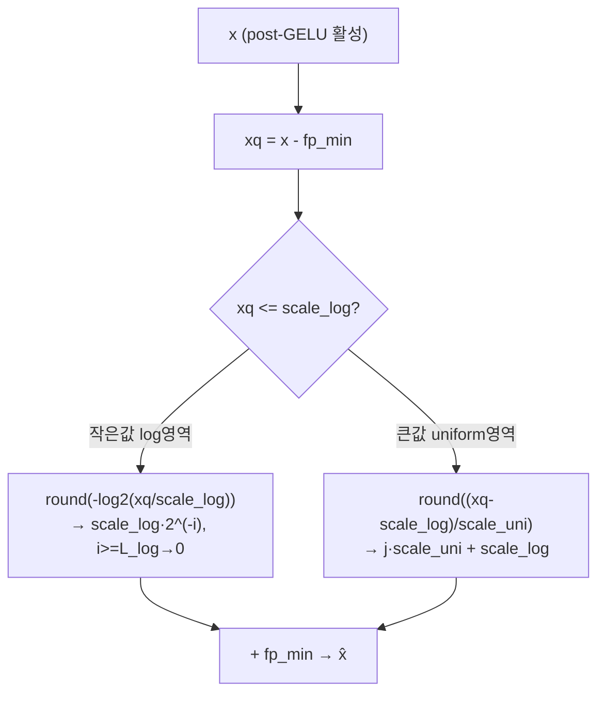
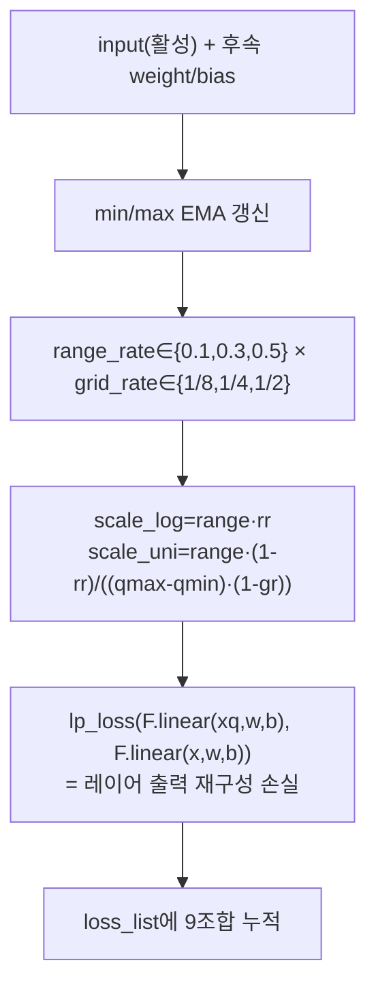
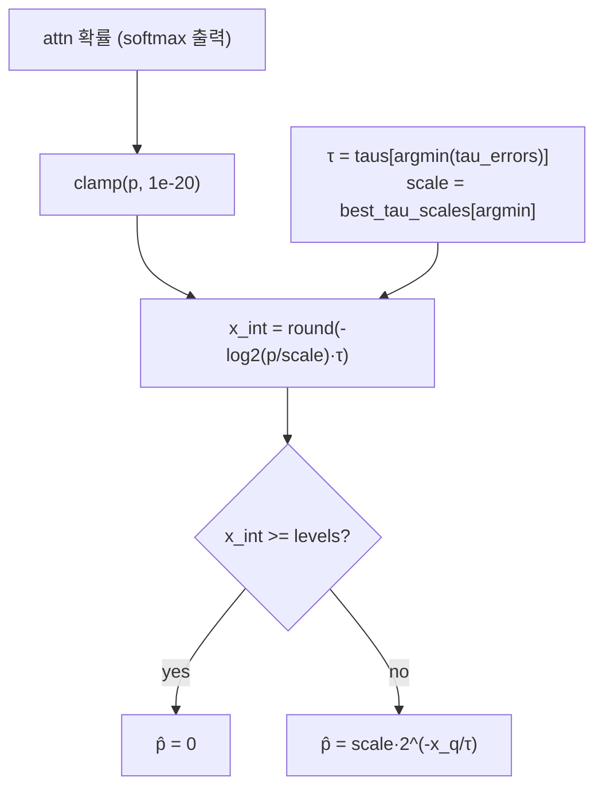
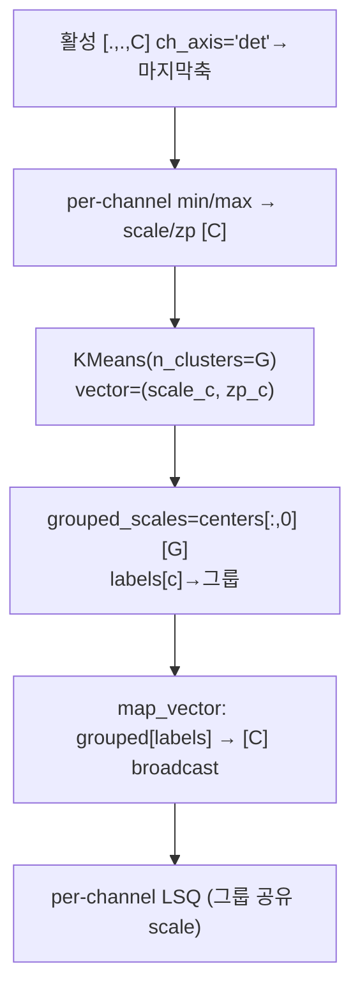
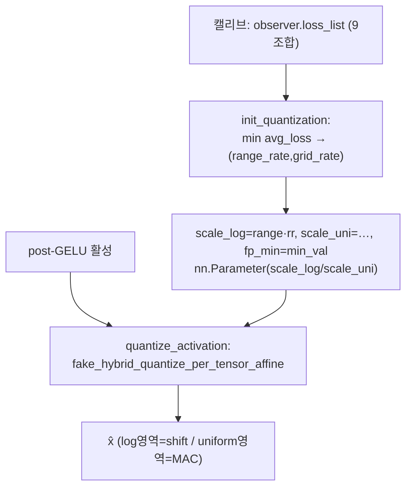
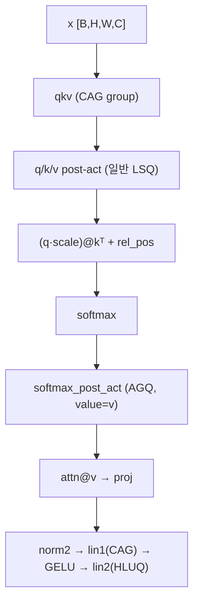
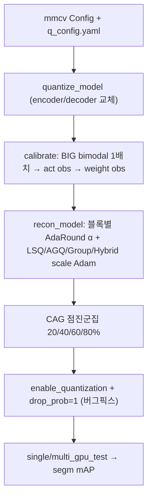

# AHCPTQ 모듈 통합 가이드 (S-PyTorch)

> 1차 요약: [`../AHCPTQ.md`](../AHCPTQ.md) — 본 문서는 그 요약을 모듈 단위로 심화한 통합 가이드다.
> 분석 대상: `\\wsl.localhost\ubuntu-24.04\home\user\project\PRJXR-HBTXR\REF\ViT-Quantization\AHCPTQ`
> 작성 원칙: 실제 소스 Read 후 `파일:라인` 근거 표기. 라인 근거 없는 추론은 "추정", 코드로 확인 불가는 "확인 불가"로 명시.
> 형제 가이드(`REF/Analysis/ViT-Quantization/I-ViT/MODULE_GUIDE.md`)의 6요소 구조(역할+상위/하위 · 데이터플로우 · forward call stack · 대표 코드 위치 · 대표 코드 블록 · 연산·수치표현 분해+정량)를 따르되, I-ViT가 **integer-only QAT(DeiT/ViT)** 인 데 비해 AHCPTQ는 **hardware-compatible PTQ(SAM)** 라는 점에서 동형(homomorphic) 변형이다.

---

## 0. 문서 머리말

### 0.1 AHCPTQ 의미·대상 코드 확정 (README + 코드 검증)

- **정식 명칭**: **AHCPTQ — Accurate and Hardware-Compatible Post-Training Quantization for Segment Anything Model** (`README.md:1,97`). ICCV 2025, pp. 22383–22392 (`README.md:123-129`). 저자 Zhang/Zhong/Ando/Yoshioka (`README.md:125`).
- **"hardware-friendly PTQ"의 정확한 의미 (코드 확정)**: AHCPTQ는 **PTQ(post-training quantization)** 이지 QAT가 아니다. 학습은 ImageNet 재학습이 아니라 **블록 단위 재구성(AdaRound+QDrop, 20000 iters)** 만 수행한다(`config44.yaml:23`, `recon.py:136-359`). "hardware-compatible/friendly"는 두 고유 기법이 datapath 비용을 직접 고려함을 뜻한다:
  - **log2 영역 = shift 복원**(`util_quant.py:23,93`, `fake_quant.py:592`): dequant가 `scale·2^(-i)`라 곱셈기 없이 barrel shifter로 환산.
  - **채널 그룹 공유 scale**: per-channel을 G개 그룹으로 축약(`fake_quant.py:616-634`)해 dequant LUT·scale 메모리 절감.
  - README가 FPGA 구현에서 FP 대비 **7.89× 속도 / 8.64× 에너지효율**을 주장(`README.md:97`). 단 **HDL/HLS 코드는 본 repo에 미포함** → FPGA 수치는 확인 불가(논문 별도 구현 추정).
- **대상 모델 (코드 확정)**: **SAM (Segment Anything Model)** 의 image encoder(ViT)와 mask decoder. SAM-B/L/H 가중치(`README.md:59-61`)를 detector(YOLOX/Faster-RCNN/HDETR/DINO)의 box prompt와 결합해 COCO instance segmentation 수행(`README.md:42-65`). 본 분석 지시의 "SAM/ViT용 hybrid quant 가능성"은 **확정**: image encoder가 ViT이므로 어텐션 양자화 기법은 ViT 일반에 전이 가능하나, 본 repo의 직접 대상은 SAM이다.
- **기반(포크)**: **PTQ4SAM** (chengtao-lv/PTQ4SAM). README 명시(`README.md:7,133`), config에 `ptq4sam:` 섹션 존재(`config44.yaml:28-33`), `quant_model.py`가 `ptq4sam_config.BIG/AGQ`를 그대로 수용(`quant_model.py:271-287`).
- **"Adaptive Hybrid"의 정체 (코드 확정)** — 단일 quantizer 전환이 아니라 **한 텐서 안에서 영역별로 다른 격자를 쓰는 hybrid + 그 파라미터를 손실 기반으로 적응 선택(adaptive)**:
  - Hybrid(HLUQ): threshold `scale_log` 기준 log2/uniform 분기(`util_quant.py:86`).
  - Adaptive(1): `(range_rate, grid_rate)` 9조합 grid search 최소손실 선택(`observer.py:691-697`, `fake_quant.py:685-696`).
  - Adaptive(2): post-softmax log 밑 `τ∈{1,2,4}` value-aware 선택(`observer.py:490,541-555`, `fake_quant.py:576-583`).
  - Adaptive(3): CAG 그룹 수 `group×8→×4→×2→group` 점진 감축(`recon.py:336-347`).

### 0.2 대표 케이스 선정

- **대표 모델**: **SAM-L image encoder (ViT-L)** + W4A4 — README가 SAM-L W4A4에서 DINO 36.6% mAP·FPGA 7.89×를 대표 수치로 제시(`README.md:97`). 단 ViT-L 정확한 차원(embed/depth/heads)은 본 repo 코드에 하드코딩되지 않고 원본 SAM 정의(`projects/.../image_encoder.py`, import 대상)에서 옴 → **차원은 확인 불가**(원본 SAM-L 공칭 embed=1024/depth=24/heads=16은 외부 지식, 코드 미확인).
- **대표 분석 단위**: encoder ViT **1 attention block + 1 MLP block** = `qkv(CAG) → q/k/v post-act → (q·scale)@kᵀ → (+rel_pos) → softmax → softmax_post_act(AGQ) → attn@v → proj` (`quant_model.py:427-448`) + `lin1(CAG) → GELU → lin2(HLUQ)` (`quant_model.py:117-118`).
- **대표 고유 기법 3종**: **HLUQ**(`util_quant.py:80-101`), **CAG**(`fake_quant.py:598-671`), **AGQ**(`fake_quant.py:541-595`) + 보조 **BIG**(`fake_quant.py:201-272`).

### 0.3 S-PyTorch 수치 규약 (I-ViT의 MAC lanes/scalar MACs 대체)

- **params**: AHCPTQ 양자화기는 FP weight를 그대로 두고 fake-quant하므로(`quantized_module.py:104,89`) **모델 params 개수는 FP 원본과 동일**. 단 양자화기 자체가 **학습 파라미터를 추가**한다: LSQ scale `[1]` 또는 `[C]`(`fake_quant.py:156`), GroupLSQ `grouped_scales`(군집 후 [G], `fake_quant.py:601,630`), Hybrid `scale_log`/`scale_uni` 각 `[1]`(`fake_quant.py:682-683`), AdaRound `alpha`(weight와 동형, `fake_quant.py:477`), AGQ `scale` `[1]`(`fake_quant.py:549`). 이들은 재구성(recon)에서 Adam으로 최적화(`recon.py:158-169`).
- **FLOPs/MACs**: SAM 모델 차원이 코드에 없어 절대 MAC 산출 **불가**. 대신 **양자화기 자체의 원소연산 오버헤드**를 정량: log2(`-log2(x/s)·τ`)=원소당 log+mul+round, hybrid=마스크 비교+두 경로, k-means=캘리브레이션 시 CPU 군집(`fake_quant.py:623-624`).
- **activation memory**: 텐서 shape × 비트폭. PTQ라 fake-quant이므로 실메모리는 FP32, **HW 환산 비트**는 W/A bit(config). 기본 **W4A4**(`config44.yaml:4,10`), W5A5/W6A6 변형(`config55.yaml`/`config66.yaml`).
- **비트폭/observer**: 코드 직접. 활성 `LSQFakeQuantize + AvgMinMaxObserver, bit=4, asymmetric, per-tensor(ch_axis=-1)`(`config44.yaml:1-6`); weight `AdaRoundFakeQuantize + MSEObserver, bit=4, asymmetric, per-channel(ch_axis=0)`(`config44.yaml:7-12`). 기법별 observer 치환: group→AvgMinMaxGroupObserver, hybrid→HybridParamObserver(`quantized_module.py:36-41`), softmax→LogAvgMSEFastObserver, bimodal→SignAvgMSEFastObserver(`quant_model.py:22-27`).
- **정확도/속도**: README/논문 인용. 본 세션 미실행 → 측정 불가 항목은 "확인 불가".

### 0.4 운영 경로 (PTQ 캘리브레이션 ↔ 재구성 ↔ COCO 평가)

```
[FP SAM + detector 로드] mmcv Config → build_detector            (test_quant.py:main)
   │  SAM-B/L/H + YOLOX/Faster-RCNN/HDETR/DINO  (README.md:55-65)
   ▼
[양자화 래핑] quantize_model(): image_encoder→QuantImageEncoderOurViT,
   │  mask_decoder→replace_module(재귀). patch_embed/output_upscaling/
   │  iou_prediction_head/output_hypernetworks_mlps 제외  (test_quant.py:430-454)
   ▼
[캘리브레이션] calibrate(): BIG면 1배치로 bimodal 탐지·부호정렬 →
   │  활성 observer ON → 가중치 observer ON  (test_quant.py:467-493, state.py:6-17)
   │  calibrate=32 샘플 (config44.yaml:17)
   ▼
[블록 재구성] recon_model(): 블록별 AdaRound(weight alpha)+LSQ/AGQ/Group/Hybrid(act scale)
   │  Adam 20000 iters, drop_prob 0.5, CAG 점진 군집(20/40/60/80%)  (recon.py:136-359)
   ▼
[양자화 활성화] enable_quantization() → drop_prob=1 강제(PTQ4SAM 버그픽스)  (test_quant.py:358-362)
   ▼
[COCO 평가] single/multi_gpu_test → segm mAP  (test_quant.py:380-425)
```
- 타깃 디바이스: **CUDA GPU 전제** — `judge_bimodal`의 `.cuda()`(`fake_quant.py:227`), `LogAvgMSEFastObserver` scale `.cuda()`(`observer.py:495,555`), `HybridQuantize` scale `device='cuda'`(`fake_quant.py:682-683,703-704`). A6000 48G에서도 HDETR/DINO는 메모리 부족 → CPU offload 안내(`README.md:89-91`). CPU 단독 실행 불가(코드 근거 확인, 실행 실패는 미검증).

### 0.5 모델 / 데이터셋 / 정확도 (README 인용)

| 항목 | 값 | 근거 |
|---|---|---|
| 태스크 | COCO instance segmentation (segm mAP) | `README.md:42-65`, `test_quant.py:413-425` |
| 데이터셋 | COCO val2017(평가) / train2017(캘리브 32샘플) | `README.md:43-52`, `config44.yaml:17` |
| 대표 정확도 | SAM-L W4A4 + DINO **36.6% mAP** | `README.md:97` |
| FPGA(별도구현) | FP 대비 **7.89× 속도 / 8.64× 에너지** | `README.md:97` (HDL 코드 부재 → 확인 불가) |
| 비트 설정 | W4A4 / W5A5 / W6A6 | `config44/55/66.yaml` |
- 그 외 모델(SAM-B/H)×detector 조합 정확도 표는 본 repo README에 없음 → **확인 불가**(논문 본문 추정).

---

## 1. Repo / Layer 개요

AHCPTQ = **SAM(image encoder ViT + mask decoder)을 W4A4 등 저비트로 PTQ** 하는 프레임워크. PTQ4SAM 포크 위에 **HLUQ(post-GELU 하이브리드 log+uniform) + CAG(채널 그룹화)** 두 고유 기법을 추가(`README.md:97`). 양자화 핵심(`ahcptq/`)이 자체 소스이고, SAM 모델 정의·detector·CUDA ops·mmdet은 외부 import만 한다.

### 1.1 자체 소스 vs 외부 프레임워크 vs 제외

| 구분 | 파일(자체 소스) | 역할 |
|---|---|---|
| **양자화 수치 커널** | `ahcptq/quantization/util_quant.py` | uniform/log/hybrid fake-quant + round_ste |
| **Observer** | `ahcptq/quantization/observer.py` | MinMax/AvgMSE/Log/Sign/Hybrid/Group observer |
| **FakeQuantize** | `ahcptq/quantization/fake_quant.py` ★핵심 | Fixed/LSQ/AdaRound + AGQ/GroupLSQ/Hybrid/Sign |
| **팩토리·라우팅** | `ahcptq/quantization/quantized_module.py` | QLinear/QConv + Quantizer factory + PreQuantizedLayer + config 치환 |
| **상태 토글** | `ahcptq/quantization/state.py` | observer/fake_quant enable/disable |
| **SAM 양자화 배선** | `ahcptq/model/quant_model.py` ★핵심 | encoder/decoder attention·MLP에 HLUQ/CAG/AGQ/BIG 배선 |
| **평가 엔트리** | `ahcptq/solver/test_quant.py` | quantize→calibrate→recon→eval, dropout 버그픽스 |
| **블록 재구성** | `ahcptq/solver/recon.py` | AdaRound+QDrop 재구성, CAG 점진 군집 |
| **보조** | `ahcptq/solver/utils.py` | config 파싱, 캘리브 로더, hook |
| **설정** | `exp/config44.yaml`(W4A4)/`config55`/`config66` | 비트·observer·기법 on/off·recon 하이퍼 |

### 1.2 forward / 평가 진입점
`test_quant.py:main` → `quantize_model`(`:430-464`) → `calibrate`(`:467-493`) → `recon_model`(`:496-513`) → `enable_quantization` + drop_prob=1(`:358-362`) → `single/multi_gpu_test`(`:386-403`) → COCO `dataset.evaluate(metric=segm)`(`:413-425`).

### 1.3 제외 (지시에 따라 이름만 표기, 미분석)
- **외부 프레임워크**: `mmdetection/`(detection 프레임워크), `projects/instance_segment_anything/ops`(CUDA 커널), `projects/.../segment_anything/modeling/`(원본 SAM 모델 정의 — `quant_model.py:8-15`에서 import 대상으로만 참조), detector configs(`projects/configs/`), `ckpt/`(체크포인트).
- **레거시(SAM 경로 미사용 추정)**: `quantized_module_matmul.py`(`from tools.modifier import MatMul` 미해결 import — `MatMul` 정의 repo 내 부재, grep 0건), `quant_coco.py`(`qdrop.*` import — detector backbone용, `test_quant.py` 경로 무관). → 1차 요약과 동일 판단.

---

## 2. 모듈: 양자화 수치 커널 — `util_quant.py` (HLUQ 핵심)

### 2.1 역할 + 상위/하위
- **역할**: STE 라운딩과 세 종류 fake-quant 커널(uniform / log2 / hybrid log+uniform). dequant까지 포함한 미분가능 양자화 함수.
- **상위**: 모든 FakeQuantize 모듈이 호출(`fake_quant.py:5-13` import). **하위**: 순수 텐서 연산(`round_ste`, `torch.clamp`, `log2`).

### 2.2 데이터플로우 (HLUQ 텐서 흐름)


### 2.3 forward call stack
`HybridQuantize.quantize_activation`(`fake_quant.py:706`) → `fake_hybrid_quantize_per_tensor_affine`(`util_quant.py:80`) → `round_ste`(`:90,96`) + `log2`(`:90`) + `clamp`(`:92,97`).

### 2.4 대표 코드 위치
`util_quant.py`: `round_ste` `:4-8`, uniform `:11-15`, log2 `:17-26`, **hybrid `:80-101`**, per-channel `:28-36`, learnable(LSQ) `:39-77`.

### 2.5 대표 코드 블록
```python
# util_quant.py:80-100  HLUQ: 한 텐서를 threshold(scale_log)로 log2/uniform 분기
levels = quant_max - quant_min + 1
levels_log = levels * grid_rate          # 전체 레벨을 두 격자로 분배
levels_uni = levels - levels_log
xq = x - fp_min
mask_log = (xq <= scale_log)             # 작은 값 영역
xq[mask_log] = round_ste(-1 * (xq[mask_log] / scale_log).log2())
xq[mask_log] = scale_log * 2 ** (-1 * xq[mask_log])      # log2 복원 = shift
xq[mask_uni] = round_ste((xq[mask_uni] - scale_log) / scale_uni)
xq[mask_uni] = xq[mask_uni] * scale_uni + scale_log      # uniform 복원
xq = xq + fp_min
```
→ **log 영역 복원 `2^(-i)`는 시프트** — FPGA 곱셈기-free. uniform 영역은 표준 정수 MAC. dense small / sparse large 분리로 저비트 해상도 확보.

```python
# util_quant.py:17-26  log2 양자화(AGQ post-softmax 공용 커널)
x_int = round_ste(-1 * (x/scale).log2() * tau)    # tau가 밑 세분도 2^(1/tau)
softmax_mask = (x_int >= levels)
X = scale * 2 ** (-1 * x_q / tau)
X[softmax_mask] = torch.Tensor([0.0])             # 매우 작은 확률은 0 매핑
```

### 2.6 연산·수치표현 분해 + 정량
- **양자화 방식**: hybrid는 per-tensor 전용(상위 observer `assert ch_axis==-1`, `observer.py:657`). log2는 양수 한정(`clamp(x,1e-20,None)`, `util_quant.py:19,89`).
- **scale/zp**: hybrid는 `scale_log`/`scale_uni` 2종, zp 없음(fp_min 시프트로 대체). uniform은 affine(scale+zp).
- **비트폭**: levels=`qmax-qmin+1`(W4A4면 활성 16레벨, `config44.yaml:4`). grid_rate가 log 격자 비율.
- **params**: 커널 자체 0 (순수 함수). scale은 상위 HybridQuantize가 보유.
- **FLOPs**: 원소당 hybrid = 마스크 비교 1 + (log 경로: log2+mul+round 3 / uniform 경로: sub+div+round 3) + 복원. 마스크 분기로 **두 경로 모두 계산 후 선택** — HW에서 병렬 datapath + mux.
- **시사**: 1차 요약 §3.1·§4.1과 라인 일치 확인. log 복원=shift가 hardware-compatible의 직접 근거.

---

## 3. 모듈: Observer 계층 — `observer.py` (HLUQ/AGQ 파라미터 탐색)

### 3.1 역할 + 상위/하위
- **역할**: 캘리브레이션 통계로 scale/zp 산출. 기본 min/max부터 MSE grid search, log τ value-aware 탐색, hybrid 9조합 탐색까지.
- **상위**: 각 FakeQuantize의 `self.observer`(`fake_quant.py:26`). **하위**: `util_quant`의 fake-quant 커널(손실 측정용), scipy `minimize_scalar`/`find_peaks`.

### 3.2 데이터플로우 (HybridParamObserver)


### 3.3 forward call stack
`HybridQuantize.forward`(`fake_quant.py:713`) → `HybridParamObserver.forward`(`observer.py:663`) → `calc_config_loss`(`:691`) → `solve_range_loss`(`:699`) → `loss_fx`(`:685`) → `fake_hybrid_quantize_per_tensor_affine`(`util_quant.py:80`).

### 3.4 대표 코드 위치
`observer.py`: `ObserverBase.calculate_qparams`(sym/asym scale/zp) `:51-70`, 비트별 quant_min/max `:30-35`, **LogAvgMSEFastObserver(AGQ)** `:483-561`, SignAvgMSEFastObserver(BIG) `:563-584`, PCTObserver `:586-651`, **HybridParamObserver(HLUQ)** `:654-704`.

### 3.5 대표 코드 블록
```python
# observer.py:61-69  sym/asym scale·zp (asymmetric이 기본, config44.yaml:5,11)
if self.symmetric:
    scale = max_val_pos / (float(quant_max - quant_min) / 2); zero_point=0
else:
    scale = (max_val_pos - min_val_neg) / float(quant_max - quant_min)
    zero_point = quant_min - torch.round(min_val_neg / scale)   # clamp
```

```python
# observer.py:490,494-505  AGQ: τ∈{1,2,4}, value-aware 손실 (단순 MSE 아님)
self.taus = [2**i for i in range(3)]                  # [1,2,4]
x_q = fake_logquantize_per_tensor_affine(x, scale.item(), qmin, qmax, alpha)
score = self.lp_loss(x_q @ self.value, x @ self.value, p=self.p)   # attn@v 출력 기준
```
→ post-softmax 양자화가 **`attn @ v` 출력에 미치는 영향**으로 τ 선택. value=v 주입(`quant_model.py:320,443`)이 task-aligned 캘리브의 핵심.

```python
# observer.py:657-703  HLUQ: per-tensor 강제 + 9조합 출력손실 탐색
assert self.ch_axis == -1                              # hybrid는 per-tensor 전용
self.range_rate_space = [0.1, 0.3, 0.5]; self.grid_rate_space = [1/8, 1/4, 1/2]
scale_log = range * range_rate
scale_uni = range * (1 - range_rate) / ((quant_max - quant_min) * (1 - grid_rate))
loss = self.lp_loss(F.linear(xq, weight, bias), F.linear(x, weight, bias))  # 출력 재구성
```

### 3.6 연산·수치표현 분해 + 정량
- **양자화 방식**: AGQ는 golden-section(`minimize_scalar`)로 각 τ별 최적 log scale 탐색(`observer.py:541-555`); HLUQ는 9조합 완전탐색(`:691-697`). lp_loss p=2.4(MSE 계열, AvgMSEFastObserver 상속).
- **observer 종류**: 활성 기본 AvgMinMaxObserver(`config44.yaml:3`), weight 기본 MSEObserver(`:9`).
- **params**: observer 자체 0 (buffer만: min_val/max_val/best_tau_scales/tau_errors).
- **FLOPs**: AGQ는 캘리브 시 τ 3개 × golden-section 반복; HLUQ는 9조합 × F.linear 2회(출력손실). **캘리브 시간 비용**(추론 무관).
- **주의**: 일부 미사용 observer에 코드 결함 존재(1차 요약 §7.3, `observer.py:190` 부모 init 오호출) — 사용 경로 외로 추정.

---

## 4. 모듈: AGQ (Adaptive Granularity Quantize) — `fake_quant.py` ★정수 비선형(post-softmax)

### 4.1 역할 + 상위/하위
- **역할**: post-softmax 확률을 **적응적 log2 밑(τ)** 으로 양자화. observer가 value-aware로 선택한 τ/scale을 받아 `round(-log2(p/s)·τ)` 양자화, 매우 작은 확률은 0.
- **상위**: encoder/decoder attention의 `softmax_post_act_fake_quantize`(`quant_model.py:421,279`, AGQ면 config 치환). **하위**: `round_ste`, observer의 `tau_errors`/`best_tau_scales`.

### 4.2 데이터플로우


### 4.3 forward call stack
`AdaptiveGranularityQuantize.forward`(`fake_quant.py:560`) → `ori_forward`(`:551`) → 초기화 `init_quantization_scale`(`:576`, τ 선택) → `quantize`(`:585`) → `round_ste`(`:588`).

### 4.4 대표 코드 위치
`fake_quant.py`: 클래스 `:541-595`, τ/scale 적응 선택 `:576-583`, log 양자화 `:585-595`. observer 측 τ 탐색 `observer.py:541-555`.

### 4.5 대표 코드 블록
```python
# fake_quant.py:576-583  적응적 granularity: 최소 오차 τ/scale 선택
tau_errors = self.observer.tau_errors
_, min_error_idx = torch.min(tau_errors, dim=0)
scale = self.observer.best_tau_scales[min_error_idx]
self.tau = self.observer.taus[min_error_idx]          # τ ∈ {1,2,4}
```
```python
# fake_quant.py:585-595  post-softmax log2 양자화 + 작은값 0 매핑
x_int = round_ste(-1 * (x/scale).log2() * self.tau)
softmax_mask = x_int >= levels
X = scale * 2 ** (-1 * x_q / self.tau)                 # 복원 = shift
X[softmax_mask] = torch.Tensor([0.0])
```

### 4.6 연산·수치표현 분해 + 정량
- **양자화 방식**: log2 base-τ, 양수(확률) 전용. levels=`qmax-qmin+1`(W4A4 활성 16). τ 클수록 격자 조밀(`2^(1/τ)`).
- **비트폭**: 활성 bit(W4A4면 4, `config44.yaml:4`). scale은 학습 파라미터(`fake_quant.py:549`, recon에서 미세조정 `recon.py:163-164`).
- **params**: `scale [1]` + `tau`(정수, buffer 성격).
- **FLOPs**: 원소당 log2+mul+round+(복원)pow. 복원 `2^(-x_q/τ)`는 HW에서 shift(정수부)+소형 LUT(분수부) 환산 가능.
- **시사**: 1차 요약 §4.2와 일치. value-aware τ는 오프라인 캘리브이므로 **HW 비용 없음** — attention 재정규화 datapath를 곱셈기-free화하는 직접 청사진.

---

## 5. 모듈: CAG (GroupLSQ Channel-Aware Grouping) — `fake_quant.py` ★채널 그룹화

### 5.1 역할 + 상위/하위
- **역할**: per-channel (scale, zp) 벡터를 **k-means로 G개 그룹**으로 묶어 그룹 공유 scale로 LSQ 양자화. inter-channel variation 완화 + dequant 비용 절감.
- **상위**: linear proj 활성(`PreQuantizedLayer(type='group')`: qkv/q/k/v proj·MLP lin1, `quant_model.py:404-408,261-267,105-113`). **하위**: `sklearn KMeans`, `fake_quantize_learnable_per_channel_affine_training`.

### 5.2 데이터플로우


### 5.3 forward call stack
`GroupLSQFakeQuantize.forward`(`fake_quant.py:636`) → ch_axis='det' 해석(`:637-638`) → observer per-channel(`:640`) → (recon 중) `group_channel(G)`(`:616`) → `KMeans.fit`(`:624`) → `map_vector`(`:610`) → `fake_quantize_learnable_per_channel_affine_training`(`:666`).

### 5.4 대표 코드 위치
`fake_quant.py`: 클래스 `:598-671`, `group_channel`(k-means) `:616-634`, `map_vector` `:610-614`, forward `:636-671`. 점진 군집 `recon.py:336-347`, `group_channel` 헬퍼 `recon.py:361-372`.

### 5.5 대표 코드 블록
```python
# fake_quant.py:623-634  채널 (scale,zp) 벡터를 k-means로 그룹화
vector_params = torch.cat([scale.unsqueeze(1), zero_point.unsqueeze(1)], dim=1).cpu().numpy()
kmeans = KMeans(n_clusters=num_groups, random_state=0).fit(vector_params)
cluster_centers = torch.tensor(kmeans.cluster_centers_, ...)
self.grouped_scales = nn.Parameter(cluster_centers[:, 0])     # [G] 그룹 공유 scale
self.labels = torch.tensor(kmeans.labels_, ...)               # 채널→그룹 매핑
```
```python
# recon.py:336-347  점진적 그룹 감축 (학습 진행 20/40/60/80%)
if i == int(config.iters*0.2): group_channel(..., num_channel=ahcptq_config.group*8)
if i == int(config.iters*0.4): group_channel(..., num_channel=ahcptq_config.group*4)
if i == int(config.iters*0.6): group_channel(..., num_channel=ahcptq_config.group*2)
if i == int(config.iters*0.8): group_channel(..., num_channel=ahcptq_config.group)  # 최종 4
```
→ `group×8 → ×4 → ×2 → group(=4)`로 단계적 재군집 — README "progressively clustering" 직접 구현(`config44.yaml:15` group=4).

### 5.6 연산·수치표현 분해 + 정량
- **양자화 방식**: per-channel LSQ를 G개 그룹 scale로 공유. ch_axis='det'로 마지막 축 동적 지정(`fake_quant.py:637-638`, observer는 `AvgMinMaxGroupObserver`).
- **비트폭**: 활성 bit(W4A4=4). zp 그룹 중심 round(`:629`).
- **params**: `grouped_scales [G]` + `grouped_zero_points [G]` + `labels [C]`(매핑 테이블, buffer). per-channel 대비 scale 메모리 C→G 절감.
- **FLOPs**: 캘리브/recon 시 KMeans(CPU, `:623-624`) — **학습 시간 비용**. 추론은 labels로 broadcast만(O(C)).
- **시사**: 1차 요약 §4.3과 일치. per-channel(고비용)과 per-tensor(저정확도) 절충. G를 PE 배열 폭에 정렬 시 HW 효율적(추정).

---

## 6. 모듈: HybridQuantize (HLUQ quantizer) — `fake_quant.py` ★FPGA 1순위(post-GELU)

### 6.1 역할 + 상위/하위
- **역할**: HybridParamObserver의 9조합 손실에서 최소 (range_rate, grid_rate)를 골라 `scale_log`/`scale_uni`/`grid_rate`/`fp_min` 확정 후 hybrid 커널 호출. scale은 학습 파라미터(recon 미세조정).
- **상위**: `PreQuantizedLayer(type='hybrid')` = MLP lin2 입력(post-GELU 활성)(`quant_model.py:109-114,128-133`). **하위**: `HybridParamObserver`(`observer.py:654`), `fake_hybrid_quantize_per_tensor_affine`(`util_quant.py:80`).

### 6.2 데이터플로우


### 6.3 forward call stack
`HybridQuantize.forward`(`fake_quant.py:711`) → 캘리브 시 `observer(x, weight, bias)`(`:713`) → fake-quant 시 `init_quantization`(`:685`, 1회) → `quantize_activation`(`:706`) → `fake_hybrid_quantize_per_tensor_affine`(`util_quant.py:80`).

### 6.4 대표 코드 위치
`fake_quant.py`: 클래스 `:674-724`, `init_quantization`(최소손실 선택) `:685-704`, `quantize_activation` `:706-709`, forward `:711-724`. weight/bias 주입 `quantized_module.py:240-242`.

### 6.5 대표 코드 블록
```python
# fake_quant.py:685-704  9조합 평균손실 최소 (range_rate, grid_rate) 선택 → scale 확정
loss_list = self.observer.loss_list
avg_loss_list = {(rr,gr): mean(losses) ...}              # 9조합 집계
best_range_rate, best_grid_rate = min(avg_loss_list, key=avg_loss_list.get)
range = self.observer.max_val - self.observer.min_val
self.fp_min = self.observer.min_val
scale_log = range * best_range_rate
scale_uni = range * (1 - best_range_rate) / ((qmax - qmin) * (1 - best_grid_rate))
self.scale_log = nn.Parameter(...); self.scale_uni = nn.Parameter(...)   # recon 학습
```

### 6.6 연산·수치표현 분해 + 정량
- **양자화 방식**: per-tensor hybrid log+uniform(observer assert per-tensor). post-GELU 전용(heavy-tailed/skewed 대응, `README.md:97`).
- **비트폭**: 활성 bit(W4A4=4, 16레벨). grid_rate∈{1/8,1/4,1/2}가 log 레벨 비율.
- **params**: `scale_log [1]` + `scale_uni [1]` + `grid_rate`(스칼라) + `fp_min`(스칼라). recon에서 scale_log/scale_uni Adam 최적화(`recon.py:167-169`).
- **FLOPs**: 추론 시 §2.6 hybrid 커널 비용(마스크 비교 + 두 경로). 캘리브 시 9조합 × F.linear 2회.
- **시사**: 1차 요약 §3.5·§4.1과 일치. **post-GELU=lin2 입력에 HLUQ** 배선이 논문 주장(heavy-tailed post-GELU)과 정확히 일치(`quant_model.py:109-114`). FPGA에서 log경로(shift)+uniform경로(MAC) 병렬 + threshold mux로 합성 — 본 프로젝트 비선형 양자화 1순위.

---

## 7. 모듈: BIG (LSQSign bimodal) — `fake_quant.py` (decoder k 활성)

### 7.1 역할 + 상위/하위
- **역할**: bimodal(쌍봉) 분포 활성을 KDE+find_peaks로 탐지, 채널 평균 부호로 정렬해 단봉화 후 LSQ. PTQ4SAM BIG의 부호 정렬.
- **상위**: decoder attention `k_post_act_fake_quantize`(`quant_model.py:281`, BIG면 sign config). **하위**: scipy `gaussian_kde`/`find_peaks`.

### 7.2 forward call stack
`LSQSignFakeQuantize.forward`(`fake_quant.py:229`) → 첫 호출 `judge_bimodal`(`:215`) → KDE(`:218`)+`find_peaks`(`:221`) → peak 2개면 채널 부호 저장(`:226-227`) → 부호 정렬 후 LSQ(`:266`). reparametrization은 `bimodal_adjust`(`quant_model.py:329-337`)에서 q/k proj weight·bias에 부호 융합.

### 7.3 대표 코드 위치
`fake_quant.py`: 클래스 `:201-272`, `judge_bimodal` `:215-227`. 2-peak 변형 `LSQPlusSignFakeQuantize._judge_two_peak` `:352-378`(비대칭율 γ=0.8). decoder 배선 `quant_model.py:275-287,329-337`.

### 7.4 대표 코드 블록
```python
# fake_quant.py:215-227  KDE peak 2개면 bimodal, 채널 부호 저장
kde = gaussian_kde(data)
peaks, _ = find_peaks(y, height=self.peak_height*sum(y), distance=self.peak_distance)
self.is_bimodal = len(peaks) == 2
if self.is_bimodal:
    self.sign = torch.tensor([torch.sign(chan_data.mean()) for chan_data in data_inp]).cuda()
```
```python
# quant_model.py:329-337  bimodal 부호를 q/k proj에 융합 (reparametrization)
def addjust_linear(linear, sign):
    linear.weight.mul_(sign.unsqueeze(1)); linear.bias.mul_(sign)
addjust_linear(self.k_proj.module, sign); addjust_linear(self.q_proj.module, sign)
```

### 7.5 연산·수치표현 분해 + 정량
- **양자화 방식**: 부호 정렬(reparam) 후 단봉 LSQ. `global_num=128, peak_distance=32, peak_height=0.01`(`config44.yaml:31-33`).
- **params**: LSQ scale + `sign [C]`(buffer). reparam은 weight에 흡수되어 **추론 시 추가 연산 0**.
- **시사**: bimodal→단봉 정렬은 캘리브/reparam 단계 완료 → HW 추론은 일반 LSQ와 동일. decoder 전용(encoder는 미적용, `quant_model.py:424` k는 일반 config).

---

## 8. 모듈: 팩토리 / 설정 라우팅 — `quantized_module.py`

### 8.1 역할 + 상위/하위
- **역할**: 이름→클래스 매핑(ObserverDict/FakeQuantizeDict), `'group'`/`'hybrid'` config 치환, QLinear/QConv weight fake-quant, PreQuantizedLayer(입력측 활성 양자화 + type 분기).
- **상위**: `quant_model.py`가 PreQuantizedLayer/Quantizer 호출. **하위**: fake_quant/observer 모듈.

### 8.2 forward call stack
`PreQuantizedLayer.forward`(`quantized_module.py:244`) → `layer_pre_act_fake_quantize`(활성 양자화, `:246`) → `module`(QLinear, `:247`) → (gamma 있으면 부호 융합, `:106-108`).

### 8.3 대표 코드 위치
`quantized_module.py`: ObserverDict/FakeQuantizeDict `:6-30`, **`update_specialized_quantizer_config`(group/hybrid 치환)** `:32-43`, QLinear(gamma 부호융합) `:92-108`, `Quantizer` 팩토리 `:180-196`, **`PreQuantizedLayer`(type 분기)** `:222-250`, QuantizedMatMul `:252-266`.

### 8.4 대표 코드 블록
```python
# quantized_module.py:36-41  CAG/HLUQ 라우팅 분기점
update_keys = {
    'group':  {'quantizer':'GroupLSQFakeQuantize', 'observer':'AvgMinMaxGroupObserver'},
    'hybrid': {'quantizer':'HybridQuantize',       'observer':'HybridParamObserver'}
}[quantizer_name]
```
```python
# quantized_module.py:229-242  PreQuantizedLayer type 분기 (group/hybrid)
if type == 'group':
    a_qconfig = update_specialized_quantizer_config(a_qconfig, 'group'); detect_ch_axis = True
elif type == 'hybrid':
    a_qconfig = update_specialized_quantizer_config(a_qconfig, 'hybrid')
if type == 'hybrid':
    self.layer_pre_act_fake_quantize.weight = module.weight   # 후속 weight/bias 주입
    self.layer_pre_act_fake_quantize.bias = module.bias       # (출력손실 계산용)
```
→ `'hybrid'`는 후속 linear의 weight/bias를 observer에 주입해 **출력 재구성 손실** 계산을 가능케 함(§3.5 loss_fx와 연결).

### 8.5 연산·수치표현 분해 + 정량
- **양자화 방식**: weight QLinear는 `weight_fake_quant(weight)` 후 `F.linear`(`:104`). per-channel(ch_axis=0, `config44.yaml:12`).
- **params**: QLinear는 원본 weight/bias 그대로(개수 불변, `:192-194`).
- **시사**: 1차 요약 §3.4와 일치. `softmax`/`bimodal` 치환은 `quant_model.py:18-29`에 별도 정의(decoder/encoder 측).

---

## 9. 모듈: SAM 양자화 배선 — `quant_model.py` ★어떤 텐서에 무엇이 걸리나

### 9.1 역할 + 상위/하위
- **역할**: SAM image encoder ViT·mask decoder를 양자화 블록으로 교체. **각 텐서에 HLUQ/CAG/AGQ/BIG 배선**.
- **상위**: `test_quant.py:quantize_model`(`:451-454`). **하위**: PreQuantizedLayer, Quantizer, 원본 SAM 모듈(import).

### 9.2 데이터플로우 (encoder attention + MLP block)


### 9.3 forward call stack
encoder: `QunatEncoderOurBlock.forward`(`quant_model.py:378`) → `QuantEncoderOurAttentionBlock.forward`(`:427`) → softmax_post_act(value=v)(`:443`) → `QuantEncoderMLPBlock.forward`(`:117`, lin1 CAG → GELU → lin2 HLUQ). decoder: `QuantDecoderOurAttentionBlock.forward`(`:300`) → k BIG + softmax AGQ(`:306,320`).

### 9.4 대표 코드 위치
`quant_model.py`: config 치환(softmax/bimodal) `:18-29`, QuantEncoderMLPBlock(HLUQ lin2) `:102-118`, QuantDecoderMLPBlock `:121-137`, QuantDecoderOurAttentionBlock(BIG k + AGQ) `:253-337`, QuantImageEncoderOurViT `:340-365`, QuantEncoderOurAttentionBlock(CAG qkv + AGQ) `:396-448`, specials/bimodal_adjust `:450-464`.

### 9.5 대표 코드 블록 — 기법 배선 요약표
| 위치 | 기법 | 근거 |
|---|---|---|
| encoder/decoder linear proj 활성 (qkv·q/k/v proj·MLP lin1) | **CAG (group LSQ)** | `quant_model.py:404-408,261-267,105-113` |
| MLP lin2 입력 (post-GELU 활성) | **HLUQ (log+uniform)** | `quant_model.py:109-114,128-133` |
| post-softmax 확률 (value=v 주입) | **AGQ (적응 log2)** | `quant_model.py:416-421,279,320,443` |
| decoder k 활성 (bimodal) | **BIG (sign LSQ + reparam)** | `quant_model.py:281,329-337` |
| 일반 weight / 활성 | AdaRound(W) / LSQ(A) | `config44.yaml:2-12` |

```python
# quant_model.py:109-118  post-GELU=lin2에 HLUQ, lin1에 CAG (논문 주장과 일치)
lin1_type = 'group'  if ahcptq_config.cag  else 'normal'    # CAG
lin2_type = 'hybrid' if ahcptq_config.hluq else 'normal'    # HLUQ (post-GELU)
self.lin1 = PreQuantizedLayer(org_module.lin1, None, w_qconfig, a_qconfig, lin1_type)
self.lin2 = PreQuantizedLayer(org_module.lin2, None, w_qconfig, a_qconfig, lin2_type)
return self.lin2(self.act(self.lin1(x)))     # lin1 → GELU → lin2(HLUQ)
```
```python
# quant_model.py:443,320  softmax 후 AGQ에 value=v 주입 (value-aware τ)
attn = self.softmax_post_act_fake_quantize(attn.softmax(dim=-1), value=v)  # encoder
attn = self.softmax_post_act_fake_quantize(attn, value=v)                  # decoder
```

### 9.6 연산·수치표현 분해 + 정량
- **양자화 제외 레이어**: patch_embed/output_upscaling/iou_prediction_head/output_hypernetworks_mlps(`test_quant.py:434`). pos_embed 비양자화(`quant_model.py:346-347`).
- **params/MACs**: SAM 모델 차원 코드 부재 → 절대값 **확인 불가**(원본 image_encoder.py import). ViT-L 공칭 ~300M은 외부 지식(미확인).
- **시사**: 1차 요약 §3.5 배선표와 라인 일치 확인. 어떤 분포(post-GELU/post-softmax/bimodal/inter-channel)에 어떤 기법을 거는지가 hardware-friendly 설계의 본질.

---

## 10. 모듈: 캘리브레이션 / 재구성 / 평가 — `test_quant.py` + `recon.py` + `state.py`

### 10.1 역할 + 상위/하위
- **역할**: PTQ 전체 흐름 — 양자화 래핑 → 캘리브(BIG 탐지+observer) → 블록 재구성(AdaRound+QDrop, CAG 점진군집) → dropout 버그픽스 → COCO 평가.
- **상위**: CLI(`README.md:69-87`). **하위**: 모든 양자화 모듈 + mmdet/COCO 평가(외부).

### 10.2 데이터플로우


### 10.3 forward call stack
`test_quant.py:main` → `quantize_model`(`:430`) → `calibrate`(`:467`) → `recon_model`→`reconstruction`(`recon.py:136`) → 재구성 루프(`:320-347`) → `enable_quantization`(`state.py:20`) + drop_prob=1(`test_quant.py:360-362`) → 평가(`:386-403`).

### 10.4 대표 코드 위치
`test_quant.py`: `quantize_model`(제외 레이어) `:430-464`, `calibrate` `:467-493`, **dropout 버그픽스** `:358-362`. `recon.py`: `reconstruction` `:136-359`, 학습 파라미터 수집(Hybrid/Group/AGQ) `:163-169`, CAG 점진군집 `:336-347`. `state.py`: enable_calibration/quantization/disable.

### 10.5 대표 코드 블록
```python
# test_quant.py:360-362  PTQ4SAM dropout 버그픽스 (평가 시 모든 drop_prob=1 강제)
for n, m in model.named_modules():
    if hasattr(m, 'drop_prob'):
        m.drop_prob = 1
```
→ README 지적(`README.md:99-116`): PTQ4SAM은 평가 시 drop_prob가 1로 복원 안 돼 활성 절반이 FP로 남아 mAP 과대평가. **PTQ4SAM/QDrop 보고 수치 직접 비교 시 주의**.

```python
# recon.py:158-169  재구성 학습 대상 파라미터 (기법별)
if isinstance(layer, LSQFakeQuantize):           a_para += [layer.scale]
if isinstance(layer, AdaptiveGranularityQuantize): a_para += [layer.scale]        # AGQ
if isinstance(layer, GroupLSQFakeQuantize):      a_para += [layer.grouped_scales] # CAG
if isinstance(layer, HybridQuantize):            a_para += [layer.scale_log, layer.scale_uni]  # HLUQ
# weight: AdaRound alpha (recon.py:152-154)
```

### 10.6 연산·수치표현 분해 + 정량 / 재현 명령
- **양자화 방식**: PTQ. 캘리브 32샘플(`config44.yaml:17`), 블록 재구성 20000 iters, drop_prob 0.5(`:23,27`), scale_lr 4e-5(`:20`), AdaRound learned_hard_sigmoid(`:26`).
- **하이퍼**: warm_up 0.2(`:21`), weight 0.01(`:22`), b_range [20,2] AdaRound β annealing(`:24`), keep_gpu True(`:25`).
- **재현 명령** (`README.md:83-87`):
  ```bash
  python ahcptq/solver/test_quant.py \
    --config ./projects/configs/yolox/yolo_l-sam-vit-b.py \
    --q_config ./exp/config44.yaml --quant-encoder
  ```
- **정확도**: SAM-L W4A4 + DINO 36.6% mAP(`README.md:97`). **속도/실측 본 세션 미실행 → 확인 불가.**
- **주의**: A6000 48G도 HDETR/DINO 메모리 부족 → CPU offload(`README.md:89-91`).

---

## N+1. 모듈 한눈 요약 표

| 모듈 | 파일:라인 | 역할 | 양자화 방식 | 대표 정량 |
|---|---|---|---|---|
| util_quant 커널 | util_quant.py:80-101 | hybrid log+uniform fake-quant | log영역 shift / uniform MAC, per-tensor | params 0, 원소당 2경로+mask |
| Observer 계층 | observer.py:51-704 | scale/zp 산출 + τ/9조합 탐색 | sym/asym, AGQ value-aware, HLUQ 9조합 | params 0, 캘리브 시간비용 |
| AGQ | fake_quant.py:541-595 | post-softmax 적응 log2 | log2 base-τ∈{1,2,4}, 작은값 0 | scale[1]+τ, 복원=shift |
| CAG (GroupLSQ) | fake_quant.py:598-671 | 채널 k-means 그룹 공유 scale | per-ch LSQ G그룹, group×8→4→2→4 | grouped_scales[G]+labels[C] |
| HLUQ (Hybrid) | fake_quant.py:674-724 | post-GELU log+uniform | per-tensor, 9조합 최소손실 | scale_log[1]+scale_uni[1] |
| BIG (LSQSign) | fake_quant.py:201-272 | bimodal 부호정렬 LSQ | KDE peak 2개→단봉, reparam | sign[C], 추론 추가연산 0 |
| 팩토리/라우팅 | quantized_module.py:32-266 | group/hybrid 치환 + QLinear + PreQuantizedLayer | weight per-ch fake-quant | params 불변 |
| SAM 배선 | quant_model.py:18-464 | encoder/decoder에 HLUQ/CAG/AGQ/BIG 배선 | 텐서별 기법 분리 | 차원 확인 불가 |
| 캘리브/recon/eval | test_quant.py + recon.py | PTQ 흐름 + dropout 버그픽스 + CAG점진 | AdaRound+QDrop+LSQ/AGQ/Group/Hybrid | 32샘플, 20000 iters, SAM-L 36.6% |

---

## N+2. 학습·평가 파이프라인 + 재현 명령

- **태스크/데이터셋**: COCO instance segmentation (segm mAP), val2017 평가 / train2017 32샘플 캘리브 (`README.md:42-65`, `config44.yaml:17`, `test_quant.py:413-425`).
- **모델**: SAM-B/L/H image encoder(ViT) + mask decoder, detector(YOLOX/Faster-RCNN/HDETR/DINO) prompt (`README.md:55-65`). 차원은 원본 SAM 정의(import) → **확인 불가**.
- **PTQ 흐름**: quantize_model → calibrate(BIG+observer) → recon_model(AdaRound+QDrop 20000 iters + CAG 점진군집) → drop_prob=1 → COCO evaluate (`test_quant.py:main`, `recon.py:136-359`).
- **비트 설정**: `config44.yaml`=W4A4(기본), `config55`=W5A5, `config66`=W6A6. 활성 LSQ+AvgMinMax+asym+per-tensor, weight AdaRound+MSE+asym+per-channel (`config44.yaml:1-12`).
- **기법 on/off**: `ahcptq: {cag:True, group:4, hluq:True}`(`config44.yaml:13-16`), `ptq4sam: {BIG:True, AGQ:True}`(`:28-33`).
- **재현 명령** (`README.md:83-87`):
  ```bash
  python ahcptq/solver/test_quant.py \
    --config ./projects/configs/<DETECTOR>/<MODEL.py> \
    --q_config ./exp/config44.yaml --quant-encoder
  ```
- **의존성**: PyTorch+torchvision(`environment.sh`/`README.md:8-12`), mmcv-full<2.0.0 + mmdet(소스빌드), scipy(minimize_scalar/find_peaks), scikit-learn(KMeans), CUDA ops(빌드). Python 3.7(`README.md:10`). **CUDA 필수**(0.4절 cuda 하드코딩).
- **정확도**: SAM-L W4A4+DINO 36.6% mAP(`README.md:97`). 그 외 조합·속도 실측 **확인 불가**(미실행/HDL 부재).

---

## N+3. 우리 프로젝트(FPGA ViT 가속 + XR 시선추적) 시사점 + FPGA 친화도

> 전제: 우리 프로젝트는 "ViT/Transformer FPGA 가속기(HG-PIPE 계열) + XR 시선추적"으로 추정. SAM image encoder가 ViT이므로 어텐션·FFN 양자화 기법 전이 가능. SAM 자체 무게/태스크(COCO/detector prompt)는 우리와 직접 연관성 낮음.

### N+3.1 log2 양자화(AGQ/HLUQ log영역) = shift 복원 (최우선 전이)
- **AGQ post-softmax log2**(`fake_quant.py:585-595`, `util_quant.py:17-26`): attention 확률 [0,1] heavy-tail에 log2 양자화, 복원이 **`2^(-i/τ)`=shift**라 곱셈기 없이 attention 재정규화 datapath 구성. value-aware τ 선택(`observer.py:504`)은 오프라인 캘리브 → **HW 비용 0**. HG-PIPE류 파이프라인 어텐션에 저비트 적용 시 곱셈 자원 절감.
- **HLUQ log영역**(`util_quant.py:90-93`): post-GELU/FFN 작은 값을 shift 복원. 단 **텐서 내 영역 분기(`mask_log`)는 런타임 비교+분기 datapath** 요구 → log/uniform 두 경로 병렬 + threshold 비교기 + mux 추가. **제어 복잡도 증가는 trade-off**로 명시 검토.

### N+3.2 CAG = 채널 그룹 공유 scale (부분 전이)
- per-channel scale을 G개로 축약(`fake_quant.py:616-634`)해 **dequant LUT/곱셈 자원·scale 메모리 절감**. 우리 가속기에서 그룹 수 G를 타일 폭/PE 배열에 맞추면 효율적. 단 labels 매핑 테이블 저장·인덱싱 오버헤드 고려. KMeans는 캘리브 시 CPU(`:623-624`)라 추론 무관.

### N+3.3 분포 인지 양자화의 필요성 (저비트 핵심)
- W4A4 정확도 유지의 핵심이 outlier 분리(HLUQ)·채널 편차(CAG)·bimodal(BIG)임을 코드가 입증. 우리 가속기가 저비트(≤W4A4)를 노린다면 **단순 per-tensor uniform은 ViT FFN/attention에서 큰 손실** → 유사한 분포 인지 양자화 필수.

### N+3.4 FPGA 친화도 평가 (hardware-compatible 관점)
| 항목 | 평가 | 근거 |
|---|---|---|
| log2 복원=shift | ★★★ AGQ/HLUQ 모두 곱셈기-free 복원 | `util_quant.py:23,93`, `fake_quant.py:592` |
| 채널 scale 절감 | ★★★ per-ch→G그룹 공유 | `fake_quant.py:616-634` |
| 저비트 검증 | ★★★ W4A4 직접 보고 36.6% mAP | `README.md:97`, `config44.yaml` |
| hybrid 분기 HW비용 | ★★ 런타임 mask 비교+2경로 mux 필요 | `util_quant.py:86` |
| PTQ(재학습 불요) | ★★★ 블록 재구성만(QAT 대비 경량) | `recon.py:136-359` |
| 캘리브 비용 | ★★ k-means/9조합/golden-section CPU | `fake_quant.py:623`, `observer.py:541,691` |
| HDL 코드 | ✕ 본 repo 미포함 (FPGA 수치 확인불가) | `README.md:97` |
| I-ViT 대비 | I-ViT는 integer-only QAT(비선형까지 정수), AHCPTQ는 PTQ+분포인지(비선형 양자화 중심) | 두 repo 비교 |

### N+3.5 XR 시선추적 적용 (프로젝트 성격은 추정)
- 시선추적은 저지연·저전력이 관건 → AHCPTQ의 **PTQ(재학습 불요) + log2 shift 비선형**은 경량 ViT 백본을 FPGA 실시간 구동에 적합. I-ViT(QAT) 대비 **재학습 비용 없음**이 장점, 단 SAM 무게/COCO 태스크는 비전이 → **기법(HLUQ/AGQ/CAG)만 추출**. hybrid 분기·9조합 탐색의 HW 비용은 백본/태스크별 재검증 필요.

---

## 부록. 근거 / 확인 불가

- **직접 코드 확인**: §2~§10 전 라인 인용 — `util_quant.py`(전체), `observer.py`(ObserverBase/Log/Sign/Hybrid), `fake_quant.py`(전체 quantizer), `quantized_module.py`(팩토리/라우팅/PreQuantizedLayer), `quant_model.py`(encoder/decoder 배선), `recon.py`(재구성/CAG점진), `test_quant.py`(quantize/calibrate/버그픽스), `config44.yaml`(W4A4), `README.md`(명칭/기법/명령/버그/정확도).
- **확정 사실**: 명칭/학회/저자(`README.md:1,123-129`), PTQ(QAT 아님, `recon.py`), 대상=SAM(`quant_model.py`), 기법 배선(HLUQ→lin2/CAG→proj/AGQ→softmax/BIG→k, `quant_model.py:109-114,404-408,443,281`), 비트 W4A4(`config44.yaml`), 정확도 36.6%(`README.md:97`), dropout 버그픽스(`test_quant.py:360-362`).
- **추정**: 레거시 파일(`quantized_module_matmul.py`/`quant_coco.py`) SAM 미사용(import 부재 근거 강한 추정), 프로젝트 성격(HG-PIPE+XR), N+3 전이 시사점(분석자 해석), HW 환산 비트/datapath.
- **확인 불가(미확인/미실행/부재)**: SAM 모델 차원·params·절대 MAC(원본 image_encoder.py import 대상, 본 repo 코드 부재), FPGA 7.89×/8.64×(HDL/HLS 코드 미포함, 논문 별도구현 추정), SAM-B/H×detector 정확도 표(README 부재), latency 실측(미실행), CPU 실행 가능 여부(cuda 하드코딩 근거 확인, 실행 실패 미검증).
