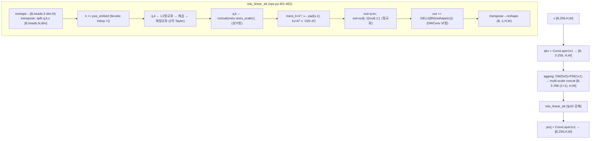
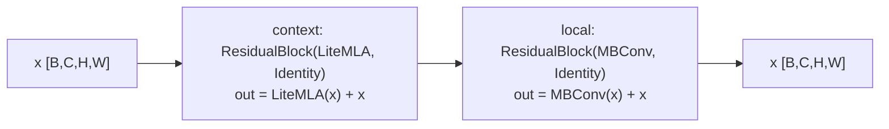
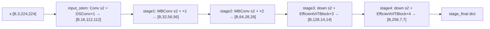
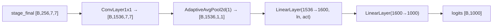
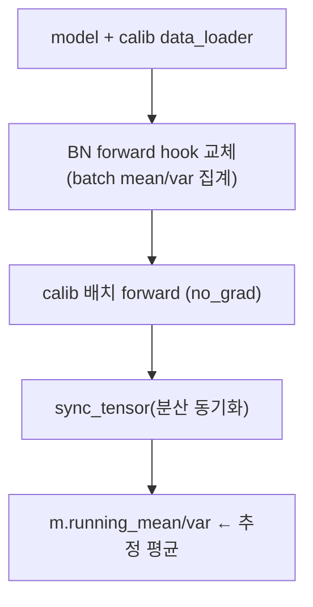
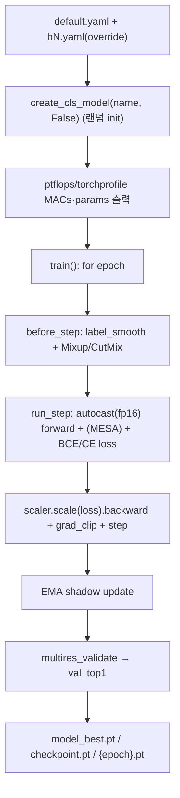

# AMD_QTViT (QT-ViT) 모듈 통합 가이드 (S-PyTorch)

> 1차 요약: [`../AMD_QTViT.md`](../AMD_QTViT.md) — 본 문서는 그 요약을 모듈 단위로 심화·검증한 통합 가이드다.
> 분석 대상: `\\wsl.localhost\ubuntu-24.04\home\user\project\PRJXR-HBTXR\REF\ViT-Quantization\AMD_QTViT`
> 작성 원칙: 실제 소스 Read 후 `파일:라인` 근거 표기. 라인 근거 없는 추론은 "추정", 코드로 확인 불가는 "확인 불가"로 명시.
> 형제 가이드(`REF/Analysis/ViT-Quantization/I-ViT/MODULE_GUIDE.md`)의 6요소 구조(역할/데이터플로우/call stack/코드위치/코드블록/정량)를 따르되, I-ViT의 정수양자화 지표 자리에 **S-PyTorch 수치 규약**(params/FLOPs·MACs/activation memory/연산 정밀도)을 둔다.

---

## 0. 문서 머리말 (기법·프레임워크 코드 확정)

### 0.0 핵심 결론 — 먼저 읽기 (양자화 여부 코드 확정)
- **이 repo의 "QT"는 양자화(Quantization)가 아니라 "Quadratic Taylor"(2차 테일러 전개)다.** 부모 디렉토리명이 `ViT-Quantization`이라 양자화로 오해하기 쉬우나, `README.md:1` 제목 "QT-ViT: Improving Linear Attention in ViT with **Quadratic Taylor Expansion**"과 BibTeX `README.md:62-66`(NeurIPS 2024, AMD: Xu, Li, Li, Sheng, Jiang, Tian, Barsoum)이 이를 확정한다.
- **양자화 프레임워크·기법: 없음 (코드로 확인 완료).** Grep `quant|int8|fake_quant|qconfig|observer|brevitas|quark|finn|bitwidth|fp8|per_channel`(대소문자 무시)를 repo 전수 검색한 결과 **자체 소스 유일 매치는 `efficientvit/models/efficientvit/sam.py:81`의 주석 "numpy array ... in uint8 format"**(SAM 이미지 전처리 dtype 설명, 분류 범위 밖)뿐이다. → **Brevitas QAT / AMD Quark / FINN / INT8 / PTQ·QAT 코드 일절 없음.** (1차 요약 가설 중 "Brevitas/Quark/FINN" 모두 부정.)
- 본 repo는 **MIT EfficientViT(Han Cai 등)를 AMD가 fork·수정한 FP(부동소수점) 분류 학습 코드**다. 모든 자체 파일 헤더에 `# Modifications Copyright © 2025 Advanced Micro Devices, Inc.`(예: `ops.py:1`, `backbone.py:1`, `cls.py:1`).
- QT-ViT의 본질 기여 = **LiteMLA 선형 어텐션 커널을 ReLU 기반에서 "L2정규화→제곱(2차 Taylor)→재정규화 + 상수항(ones) augmentation + DWConv 로컬 보정"으로 교체**(`ops.py:402-462`). 학습은 fp16 AMP를 쓰되 선형 어텐션 본체는 **수치 안정성 위해 `@autocast(enabled=False)`로 fp32 강제**(`ops.py:401, 405-406`).

### 0.1 대표 케이스 선정
- **대표 모델: `efficientvit_cls_b1`** (`cls.py:77-88`) — width `[16,32,64,128,256]`, depth `[1,2,3,3,4]`, dim 16 (`backbone.py:173-180`). 근거:
  1. README 학습 예제 명령이 `configs/cls/imagenet/b1.yaml`(`README.md:50-54`)로 b1을 공식 대표로 사용.
  2. b1 단독 config 존재(`configs/cls/imagenet/b1.yaml`), eval 기본값도 `--model b1`(`eval_cls_model.py:38`).
  3. EfficientViTBlock(QT 선형 어텐션)이 stage3·4에서 비자명한 크기로 작동(b1: stage3 depth3, stage4 depth4 → EfficientViTBlock 다수).
- **대표 분석 단위: `EfficientViTBlock` 1개**(`ops.py:487-523`) = `[ResidualBlock(LiteMLA, Identity)]`(QT 선형 어텐션 + skip) → `[ResidualBlock(MBConv, Identity)]`(지역 conv + skip). 즉 **[선형 어텐션] → [MBConv]** 하이브리드.
- **대표 핵심 모듈: `LiteMLA.relu_linear_att`**(`ops.py:401-462`) — QT 2차 Taylor 선형 어텐션의 알고리즘적 심장. FPGA 비선형/행렬곱 매핑의 직접 청사진.

### 0.2 S-PyTorch 수치 규약 (I-ViT의 정수양자화 지표 대체)
- **params**: 모듈 차원에서 분석적 계산. Conv `Cout·Cin·Kh·Kw (+Cout bias)`, Linear `in·out (+out)`, BN/LN `2·C`. 본 repo는 **양자화 파라미터 없음** → params = FP 원본 그대로(README 공칭값: b1 9.4M~b6 246.8M, `README.md:38-43`).
- **FLOPs/MACs**: 표준식×config. Conv MAC = `Cout·Hout·Wout·Cin·Kh·Kw`, Linear MAC = `N·in·out`. 선형 어텐션은 `kᵀv`(O(N·d²)) + `q·kv`(O(N·d²)) → **softmax의 O(N²) 대비 O(N) 토큰 복잡도**. **실측 도구 내장**: `train_cls_model.py:62-69`가 `ptflops.get_model_complexity_info` + `torchprofile.profile_macs`로 MACs/params 출력(README MACs는 이 경로 산출로 추정).
- **activation memory**: 텐서 shape × 정밀도. 본 repo는 **fp16 AMP 학습 + 선형 어텐션 fp32 강제**(`ops.py:405-406`, `cls_trainer.py:124`)라 정밀도가 경로별로 다름. "HW 환산 비트"는 미정(양자화 없음) → 분석은 **shape·dtype(fp16/fp32)** 기준.
- **연산 정밀도/프레임워크**: 코드 직접. 양자화 프레임워크 **없음**. 학습 정밀도 = fp16 AMP(`torch.autocast(...,dtype=torch.float16, enabled=self.fp16)`, `cls_trainer.py:124`), 선형 어텐션만 fp32(`ops.py:401`). 비선형: gelu=tanh 근사(`act.py:19`), hswish/relu6(`act.py:14-20`).
- **정확도/속도**: README 인용. 본 세션 미실행 → 측정 불가 항목은 "확인 불가".

### 0.3 운영 경로 (FP 학습 ↔ 체크포인트 ↔ ImageNet 평가) — QAT 아님
```
[모델 생성(랜덤 초기화)] create_cls_model(name, False)  (train_cls_model.py:58)
   │  init_model(trunc_normal@0.02)  (train_cls_model.py:79-83)
   ▼
[FP 학습] ClsTrainer.train(): AdamW + cosine(warmup) + fp16 AMP(NativeScaler) + EMA
   │  Mixup/CutMix + RandAug + label_smooth + (옵션)MESA self-distill  (cls_trainer.py:80-142)
   │  base_lr 0.00025, n_epochs 300, warmup 20, wd 0.1, grad_clip 2.0  (default.yaml:23-39)
   │  multi-resolution image_size [128,160,192,224]  (default.yaml:15-19)
   ▼
[reset_bn] calibration 데이터로 BN running stat 재추정  (run_config reset_bn:true, default.yaml:40-42; norm.py:43-130)
   ▼
[체크포인트 저장] save_model(model_best.pt / checkpoint.pt / {epoch}.pt)  (cls_trainer.py:238-245)
   ▼
[ImageNet 평가] eval_cls_model.py: ImageFolder + bicubic resize/centercrop → DataParallel → top1/top5
   │  create_cls_model(model, False) → checkpoint['state_dict'] 로드  (eval_cls_model.py:72-102)
   ▼
[(없음) 양자화·FPGA export] PTQ/QAT/ONNX-int8/TensorRT 배포 스크립트 부재(확인 완료)
```
- 타깃 디바이스: **CUDA GPU 전제** — eval `model.cuda()`(`eval_cls_model.py:77`), trainer `images.cuda()`(`cls_trainer.py:51,81`), reset_bn `get_device`/`sync_tensor`(`norm.py:115,72`). 학습은 **torchpack 분산 런처** 필수(`README.md:14,50`).

### 0.4 모델 / 데이터셋 / 정확도 (README 인용)
| Model | Top1 | Top5 | Params | MACs | 근거 |
|---|---|---|---|---|---|
| QT-ViT-1 | 79.6 | 94.7 | 9.4M | 0.52G | `README.md:38` |
| QT-ViT-2 | 82.5 | 95.9 | 24.9M | 1.60G | `README.md:39` |
| QT-ViT-3 | 83.9 | 96.7 | 49.7M | 3.97G | `README.md:40` |
| QT-ViT-4 | 84.7 | 96.7 | 53.0M | 5.26G | `README.md:41` |
| QT-ViT-5 | 85.2 | 97.0 | 64.1M | 6.96G | `README.md:42` |
| QT-ViT-6 | 86.0 | 97.3 | 246.8M | 27.60G | `README.md:43` |
- 데이터셋: **ImageNet-1K** `imagenet/{train,val}` (`README.md:24-29`, `default.yaml:1-3`), 224×224(학습은 multi-res `[128,160,192,224]`, `default.yaml:15-19`), 1000 클래스.
- 평가 전처리: bicubic Resize(crop_ratio 0.95) → CenterCrop → Normalize(mean .485/.456/.406, std .229/.224/.225) (`eval_cls_model.py:54-62`).
- 모델명 매핑 주의: README의 "QT-ViT-1~6"과 코드 팩토리 `b0~b3/l1~l3`(`cls.py`)의 1:1 대응은 **코드/README에 명시 없음 → 확인 불가**(README 표에 코드명 미기재). 본 가이드는 코드 팩토리(b1) 기준으로 정량화.
- 속도(latency): 본 repo에 측정 스크립트 없음 → **확인 불가**.

---

## 1. Repo / Layer 개요

QT-ViT = EfficientViT 백본의 **선형 어텐션(LiteMLA)을 2차 Taylor 근사로 교체**한 경량 ViT 분류기. softmax·exp가 전혀 없고 핵심 연산이 1×1 conv + 행렬곱 2개(`kᵀv`, `q·kv`) + L2정규화 + 제곱 + DWConv로 환원된다. 본 repo는 **timm 일부(드롭패스 등)·torchpack(분산 런처)·ptflops/torchprofile(프로파일)·einops를 임포트**하되, 모델 정의·선형 어텐션·trainer는 모두 자체 소스다.

### 1.1 자체 소스 vs 외부 프레임워크 vs 제외
| 구분 | 파일(자체 소스) | 역할 |
|---|---|---|
| **모델 연산 핵심** | `efficientvit/models/nn/ops.py` ★핵심 | LiteMLA(QT 선형 어텐션), Conv/DSConv/MBConv/FusedMBConv/ResBlock, EfficientViTBlock, ResidualBlock, DAGBlock |
| **백본** | `efficientvit/models/efficientvit/backbone.py` ★ | EfficientViTBackbone(b0~b3) / EfficientViTLargeBackbone(l0~l3) |
| **분류 헤드/모델** | `efficientvit/models/efficientvit/cls.py` ★ | EfficientViTCls, ClsHead, cls_b0~b3/l1~l3 팩토리 |
| **정규화/활성** | `efficientvit/models/nn/norm.py`, `act.py` | LayerNorm2d, build_norm, reset_bn, set_norm_eps / build_act(gelu-tanh 등) |
| **모델 레지스트리** | `efficientvit/cls_model_zoo.py` | create_cls_model + 체크포인트 경로 레지스트리 |
| **유틸** | `efficientvit/models/utils/network.py` | load_state_dict_from_file, build_kwargs_from_config, resize |
| **학습 엔트리** | `train_cls_model.py` | torchpack dist 학습 진입점 + ptflops MACs 출력 |
| **평가 엔트리** | `eval_cls_model.py` | 단독 ImageNet 평가(DataParallel) |
| **trainer** | `efficientvit/clscore/trainer/cls_trainer.py` ★ | FP 학습 루프(fp16 AMP, Mixup, MESA, EMA) |
| | `cls_run_config.py` / `apps/trainer/run_config.py` | label_smooth/mixup/bce/mesa, AdamW+cosine 빌더 |
| **데이터** | `efficientvit/clscore/data_provider/imagenet.py` | ImageNet DataProvider(미열람 세부) |

### 1.2 forward 진입점
`EfficientViTCls.forward`(`cls.py:57-60`) → `backbone(x)`(dict 출력) → `head(feed_dict)`.
- 백본 `forward`(`backbone.py:154-160`): input_stem → stage1~4를 순차, 각 stage 출력을 `output_dict["stageN"]`에 저장, 최종 `output_dict["stage_final"]`.
- 헤드 `ClsHead.forward`(`cls.py:46-48`): `feed_dict["stage_final"]` 선택 → `ConvLayer(1×1) → AdaptiveAvgPool2d(1) → LinearLayer(ln+act) → LinearLayer(n_classes)`(`cls.py:36-41`).

### 1.3 제외 (지시에 따라 이름만 표기, 미분석)
- **외부 프레임워크(커스텀 아님)**: `torchpack`(분산 런처, `README.md:14`, `train_cls_model.py:36`), `timm`(0.6.13 권장, drop_path 등), `ptflops`/`torchprofile`(MACs 프로파일, `train_cls_model.py:62-68`), `einops`(rearrange, `ops.py:10`), `transformers`/`onnx`(설치만, 코드 사용 미확인). DeiT/ViT **사전학습 체크포인트** = Google Drive 외부 링크(`README.md:38-43`) → 코드는 본 repo 정의 사용.
- **제외 디렉토리/파일**: `efficientvit/models/efficientvit/seg.py`·`sam.py`, `seg_model_zoo.py`·`sam_model_zoo.py`(분류 외 태스크 — 존재만 기록), `.git/`·`__pycache__/`.
- **미열람(확인 불가)**: `clscore/data_provider/imagenet.py` 데이터 파이프라인 세부, `apps/utils/*`(lr/ema/dist/opt 구현 세부), `apps/utils/export.py`(ONNX 보조 추정, 양자화 무관).

### 1.4 대표 모델 레이어 구성 (b1)
`EfficientViTBackbone`(b1, `backbone.py:34-160`):
- **input_stem**(`:48-69`): `ConvLayer(3→16, stride2)` + `ResidualBlock(DSConv expand=1) ×1`(depth[0]=1).
- **stage1**(width32, depth2) / **stage2**(width64, depth3): 첫 block stride2 MBConv(expand4), 이후 residual MBConv (`:72-90`).
- **stage3**(width128, depth3) / **stage4**(width256, depth4): 첫 block = stride2 down(MBConv, fewer_norm) + 이후 `EfficientViTBlock ×depth`(`:93-120`). **여기서 QT 선형 어텐션이 작동**. `downsample`(8→16→32) 값을 EfficientViTBlock에 넘겨 위치임베딩 해상도 결정(`:92,107,116`).
- **ClsHead**(b1, `cls.py:82-87`): in 256 → width_list `[1536,1600]` → 1000 classes.

---

## 2. 모듈: LiteMLA — QT 2차 Taylor 선형 어텐션 (`ops.py:333-484`) ★최핵심

### 2.1 역할 + 상위/하위
- **역할**: EfficientViT의 "Lightweight Multi-Scale Linear Attention"을 QT 방식(2차 Taylor feature map + 상수항 + DWConv 보정)으로 개조. softmax 없이 O(N) 토큰 복잡도로 어텐션 수행.
- **상위**: `EfficientViTBlock.context_module = ResidualBlock(LiteMLA, IdentityLayer)`(`ops.py:499-509`). **하위**: `ConvLayer`(qkv/proj, `ops.py:362,387`), `nn.Conv2d`(multi-scale aggreg, `:373-381`), `nn.BatchNorm2d`/`nn.GELU`(DWConv 보정, `:396-397`), `F.interpolate`/`F.pad`/`torch.matmul`.

### 2.2 데이터플로우 (텐서 shape 흐름, b1 stage4: C=256, dim=16, heads=16)


### 2.3 forward call stack
`EfficientViTBlock.forward`(`ops.py:521`) → `context_module`(ResidualBlock) → `LiteMLA.forward`(`ops.py:464`) → `self.qkv`(`:466`) → multi-scale `self.aggreg`(`:468-470`) → `self.relu_linear_att`(`:472`) → `self.proj`(`:473`).

### 2.4 대표 코드 위치
`ops.py`: 생성자 `:336-399`(qkv `:362-369`, aggreg `:370-385`, proj `:387-394`, QT 전용 파라미터 `:396-399`), `relu_linear_att` `:401-462`, `forward` `:464-475`.

### 2.5 대표 코드 블록

```python
# ops.py:401, 405-406  선형 어텐션 본체 fp32 강제 (수치 안정성)
@autocast(enabled=False)
def relu_linear_att(self, qkv):
    ...
    if qkv.dtype == torch.float16:
        qkv = qkv.float()
```
→ fp16 AMP 학습 중에도 L2정규화/제곱/나눗셈에서 inf/nan 방지. **FPGA 매핑 시 이 구간이 정밀도 가장 민감(고정소수점화 1순위 리스크).**

```python
# ops.py:432-437  2차 Taylor feature map (L2정규화 → 제곱 → 재정규화)
q = q / (q.norm(dim=-1, keepdim=True) + self.eps)   # 1차 L2 정규화
k = k / (k.norm(dim=-1, keepdim=True) + self.eps)
q = q ** 2; k = k ** 2                                # 제곱 = 2차항
q = q / (q.norm(dim=-1, keepdim=True) + self.eps)    # 재정규화
k = k / (k.norm(dim=-1, keepdim=True) + self.eps)
```
→ 주석(`:432-433`): "추론 시 출력 변화 없이 삭제 가능, 학습 중 inf/nan 방지용". exp(qᵀk)의 1차+2차 항을 모사하는 feature map φ.

```python
# ops.py:439-450  상수항 concat + 선형 matmul (O(N·d²)) + 정규화
ones1 = torch.ones(Bq,Headq,Nq,1).to(q.device) * self.ones_scale1   # 학습형 상수항 스케일
q = torch.cat((q, ones1), dim=-1); k = torch.cat((k, ones1), dim=-1)
trans_k = k.transpose(-1, -2)
v = F.pad(v, (0, 1), mode="constant", value=1)        # 정규화 분모 채널
kv = torch.matmul(trans_k, v)                          # kᵀ·v  (먼저 계산 → O(N·d²))
out = torch.matmul(q, kv)                              # q·kv
out = out[..., :-1] / (out[..., -1:] + self.eps)       # 분자/분모 분리 정규화
```
→ `kv` 먼저 계산하여 **선형 복잡도** 달성. v에 1 패딩으로 정규화 상수를 같은 matmul에서 동시 계산.

```python
# ops.py:452-457  DWConv 로컬 보정 (지역성 보강)
feature_map = rearrange(v, "b e (w h) c -> (b e) c w h", w=num, h=num)
feature_map = rearrange(self.act(self.bn(feature_map[:,:-1,:,:])), "(b e) c w h -> b e (w h) c", e=e)
out = out + feature_map        # GELU(BN(reshape(v)))를 가산
```

### 2.6 연산·수치표현 분해 + 정량 (b1 stage4 1개 EfficientViTBlock, C=256, dim=16, heads=16, scales=(5,))
- **연산 정밀도**: 선형 어텐션 본체 **fp32 강제**(`:401,405`), 나머지(qkv/aggreg/proj conv)는 fp16 AMP. 양자화 없음.
- **params** (분석적):
  - qkv ConvLayer(1×1): 256×768 = **196,608**(bias 기본 off, `use_bias[0]=False`).
  - aggreg(scales=(5,)): DW 5×5 conv(768채널 groups=768): 768×25=19,200 + PW 1×1(768→768, groups=3·heads=48): 768×(768/48)=12,288 → **31,488**.
  - proj ConvLayer(1×1): total_dim·(1+len(scales))=256·2=512 → 256: 512×256 = **131,072** (+ BN 2×256).
  - QT 전용: `ones_scale1` **1**, `positional_encoding` `[1, heads·dim·2, 224//ds, 224//ds]` = `[1,512, 7,7]`(ds=32) = **25,088**, BN(dim=16) 32.
  - **LiteMLA params ≈ 0.384M/block**(pos_embed 해상도에 따라 변동).
- **MACs/block** (입력 7×7=49 토큰 기준, b1 stage4 H=W=7):
  - qkv conv: 49×256×768 ≈ **9.6M**
  - aggreg DW+PW: 49×(768×25 + 768×16) ≈ **1.5M**
  - 선형 어텐션: kᵀv = heads·N·dim·(dim+1)≈16·49·16·17 ≈ 213K; q·kv ≈ 16·49·17·17 ≈ 227K → ≈ **0.44M** (softmax-free O(N))
  - proj conv: 49×512×256 ≈ **6.4M**
  - **LiteMLA MAC/block ≈ 18M** (해상도 7×7 기준; 저해상도 stage일수록 선형 어텐션 비중 작음).
- **activation memory**(fp16, [B,768,7,7] qkv) ≈ B·768·49·2 byte. 선형 어텐션 중간 kv 텐서는 `[B,heads,dim+1,dim+1]`로 **N²이 아닌 d² 크기**(softmax 어텐션의 N² 대비 메모리 이점).
- **HW 메모**: softmax/exp 없음. 핵심 = 1×1 conv + DW/PW conv + 행렬곱 2개(kᵀv, q·kv) + **L2 정규화(1/sqrt)** + **제곱** + **나눗셈(정규화 분모)** + DWConv. 1/sqrt·나눗셈·fp32 강제가 FPGA 고정소수점화의 주 리스크.

---

## 3. 모듈: EfficientViTBlock — 하이브리드 [선형어텐션]→[MBConv] (`ops.py:487-523`)

### 3.1 역할 + 상위/하위
- **역할**: ViT 트랜스포머 블록의 EfficientViT판. context(전역, LiteMLA) → local(지역, MBConv) 직렬, 각각 residual skip.
- **상위**: `EfficientViTBackbone`/`LargeBackbone` stage3·4(`backbone.py:108-118, 279-289`). **하위**: `LiteMLA`, `MBConv`, `ResidualBlock`, `IdentityLayer`.

### 3.2 데이터플로우


### 3.3 forward call stack
`EfficientViTBlock.forward`(`ops.py:520-523`) → `self.context_module(x)`(`:521`, ResidualBlock→LiteMLA) → `self.local_module(x)`(`:522`, ResidualBlock→MBConv).

### 3.4 대표 코드 위치
`ops.py`: 생성자 `:488-518`(context `:499-509`, local `:510-518`), forward `:520-523`.

### 3.5 대표 코드 블록
```python
# ops.py:499-518  context(선형어텐션)+local(MBConv) 모두 residual
self.context_module = ResidualBlock(
    LiteMLA(in_channels, in_channels, heads_ratio, dim, norm=(None,norm), downsample=downsample),
    IdentityLayer())
local_module = MBConv(in_channels, in_channels, expand_ratio=expand_ratio,
    use_bias=(True,True,False), norm=(None,None,norm), act_func=(act_func,act_func,None))
self.local_module = ResidualBlock(local_module, IdentityLayer())
```
→ ResidualBlock(`ops.py:531-561`)은 `main(x)+shortcut(x)` 또는 shortcut None이면 단순 forward(`:552-561`). 여기선 shortcut=Identity → `out = main(x) + x`.

### 3.6 연산·수치표현 분해 + 정량 (b1 stage4 1 block, C=256, expand=4)
- **params**: LiteMLA(§2, ≈0.384M) + MBConv(inverted 1×1: 256×1024 + DW 3×3: 1024×9 + point 1×1: 1024×256 ≈ 0.53M) ≈ **0.91M/block**.
- **MACs**(7×7): LiteMLA ≈18M + MBConv(49×(256·1024 + 1024·9 + 1024·256)) ≈ 49×0.534M ≈ **26M** → block 합 ≈ **44M**.
- **연산 정밀도**: 전부 fp16 AMP, LiteMLA 내부 어텐션만 fp32. 양자화 없음.

---

## 4. 모듈: 기본 빌딩 블록 — Conv/DSConv/MBConv/FusedMBConv/ResBlock (`ops.py:38-330`)

### 4.1 역할 + 상위/하위
- **역할**: 백본 stem·stage의 지역 conv 연산 단위. EfficientViT/MobileNet 계열 표준.
- **상위**: `backbone.py`의 `build_local_block`(`backbone.py:123-152, 294-334`), input_stem, ClsHead. **하위**: `nn.Conv2d`, `build_norm`, `build_act`.

### 4.2 구성 요약 (파일:라인 / 구조)
| 블록 | 라인 | 구조 | 비고 |
|---|---|---|---|
| `ConvLayer` | `:38-79` | Conv2d + (Norm) + (Act) | padding=`get_same_padding`(`network.py:29-34`) |
| `LinearLayer` | `:101-132` | (flatten) + Linear + (Norm) + (Act) | 2D 초과 입력 flatten(`:118-121`) |
| `DSConv` | `:145-184` | depthwise(k×k) + pointwise(1×1) | act=(relu6, None) 기본 |
| `MBConv` | `:187-239` | 1×1↑(expand) → DW(k×k) → 1×1↓ | expand_ratio=6 기본 |
| `FusedMBConv` | `:242-285` | spatial conv(k×k) + point(1×1) | large 백본 초기 stage |
| `ResBlock` | `:288-330` | conv1(k×k) + conv2(k×k) | expand_ratio=1 |
| `ResidualBlock` | `:531-561` | main + shortcut(+post_act) | QT/MBConv 잔차 |
| `DAGBlock`/`OpSequential` | `:563-612` | DAG 합성 / 순차 컨테이너 | seg 등 |

### 4.3 forward call stack (대표 MBConv)
`build_local_block`(`backbone.py:143`) → `MBConv.forward`(`ops.py:235-239`): `inverted_conv` → `depth_conv` → `point_conv`.

### 4.4 대표 코드 위치
`ops.py`: ConvLayer `:71-79`, MBConv `:207-239`, ResidualBlock.forward `:552-561`.

### 4.5 대표 코드 블록
```python
# ops.py:235-239  MBConv: inverted(1×1↑) → depthwise(k×k) → point(1×1↓)
def forward(self, x):
    x = self.inverted_conv(x)   # 1×1 expand (expand_ratio×)
    x = self.depth_conv(x)      # depthwise k×k
    x = self.point_conv(x)      # 1×1 project (last act=None)
    return x
```

### 4.6 연산·수치표현 분해 + 정량
- **연산 정밀도**: fp16 AMP, 양자화 없음. norm 기본 bn2d, act 기본 relu6(MBConv)/hswish(백본 기본 `backbone.py:43`).
- **params/MACs**: §3.6 MBConv 산출 참조(블록당 ≈0.53M params, 7×7에서 ≈26M MAC). stem/stage1·2는 해상도 큼 → MAC 비중 큼(정량은 해상도 의존, b1 전체 MACs는 README 미기재 코드명 → **확인 불가**, ptflops 실행 필요).

---

## 5. 모듈: 백본 조립 — EfficientViTBackbone / LargeBackbone (`backbone.py`)

### 5.1 역할 + 상위/하위
- **역할**: input_stem → stage1~4를 조립, stage 출력을 dict로 반환. stage3·4에서 EfficientViTBlock(QT 어텐션) 사용.
- **상위**: `efficientvit_cls_b0~b3`/`l1~l3`(`cls.py:63-161`). **하위**: ConvLayer, DSConv, MBConv, FusedMBConv, ResBlock, EfficientViTBlock.

### 5.2 데이터플로우 (b1)


### 5.3 forward call stack
`EfficientViTCls.forward`(`cls.py:58`) → `EfficientViTBackbone.forward`(`backbone.py:154-160`) → `input_stem`(`:156`) → `for stage in stages`(`:157-158`).

### 5.4 대표 코드 위치
`backbone.py`: 생성자 `:34-121`(input_stem `:48-69`, stage1-2 `:72-90`, stage3-4 `:92-120`), `build_local_block` `:123-152`, b0~b3 `:163-200`, LargeBackbone `:203-341`, l0~l3 `:344-377`.

### 5.5 대표 코드 블록
```python
# backbone.py:92-118  stage3·4: down(MBConv fewer_norm) + EfficientViTBlock 반복
downsample = 8
for w, d in zip(width_list[3:], depth_list[3:]):
    block = self.build_local_block(in_channels, w, stride=2, expand_ratio=expand_ratio, fewer_norm=True)
    stage.append(ResidualBlock(block, None))   # down: shortcut None
    in_channels = w; downsample *= 2
    for _ in range(d):
        stage.append(EfficientViTBlock(in_channels, dim=dim, expand_ratio=expand_ratio, downsample=downsample))
```
→ `downsample`(stage3=16, stage4=32)이 LiteMLA 위치임베딩 해상도 `224//downsample`(=14, 7)를 결정(`ops.py:399`).

### 5.6 연산·수치표현 분해 + 정량
- **변형별 차이**(`backbone.py:163-200`): b0 width[8,16,32,64,128]/depth[1,2,2,2,2]/dim16, b1 [16,32,64,128,256]/[1,2,3,3,4]/dim16, b2 [24,48,96,192,384]/[1,3,4,4,6]/dim32, b3 [32,64,128,256,512]/[1,4,6,6,9]/dim32.
- **Large(l0~l3, `:203-377`)**: act 기본 **gelu**(`:211`), stage0~3은 ResBlock/FusedMBConv/MBConv, stage4~ EfficientViTBlock(qkv_dim 32, expand6), downsample 16부터(`:262`). l 계열은 norm eps=1e-7(`cls_model_zoo.py:68-69`).
- **연산 정밀도**: fp16 AMP, 양자화 없음.

---

## 6. 모듈: 분류 헤드/모델 — EfficientViTCls / ClsHead (`cls.py`)

### 6.1 역할 + 상위/하위
- **역할**: 백본 dict 출력에서 `stage_final` 선택 → 1×1 conv 확장 → GAP → LN-Linear → 분류 Linear.
- **상위**: `create_cls_model`(`cls_model_zoo.py:51-78`). **하위**: ConvLayer, LinearLayer, AdaptiveAvgPool2d.

### 6.2 데이터플로우 (b1)


### 6.3 forward call stack
`EfficientViTCls.forward`(`cls.py:57-60`) → `ClsHead.forward`(`cls.py:46-48`) → `OpSequential.forward`(`ops.py:609-612`).

### 6.4 대표 코드 위치
`cls.py`: ClsHead `:25-48`, EfficientViTCls `:51-60`, 팩토리 b0~b3 `:63-116`, l1~l3 `:119-161`.

### 6.5 대표 코드 블록
```python
# cls.py:36-41  헤드 = 1×1 conv 확장 → GAP → LN-Linear → 분류 Linear
ops = [
    ConvLayer(in_channels, width_list[0], 1, norm=norm, act_func=act_func),
    nn.AdaptiveAvgPool2d(output_size=1),
    LinearLayer(width_list[0], width_list[1], False, norm="ln", act_func=act_func),
    LinearLayer(width_list[1], n_classes, True, dropout, None, None),
]
```

### 6.6 연산·수치표현 분해 + 정량 (b1 head, in=256, width=[1536,1600])
- **params**: conv 256×1536 + ln 2×1600 + Linear 1536×1600 + Linear 1600×1000+1000 ≈ 393K + 2.46M + 1.6M ≈ **4.45M**.
- **MACs**: conv 49×256×1536 ≈19.3M, Linear 1×(1536×1600 + 1600×1000) ≈ 4.06M → ≈ **23.4M**(1 이미지).
- **연산 정밀도**: fp16 AMP. l 계열은 act_func="gelu"(`cls.py:127,142,158`).

---

## 7. 모듈: 정규화 / 활성 — norm.py / act.py

### 7.1 역할 + 상위/하위
- **역할**: norm 레지스트리(bn2d/ln/ln2d) + BN 통계 재추정(reset_bn) + eps 설정. act 레지스트리(relu/relu6/hswish/silu/gelu-tanh).
- **상위**: 모든 ConvLayer/LinearLayer/MBConv. **하위**: nn.BatchNorm2d/LayerNorm, nn.ReLU/Hardswish/GELU.

### 7.2 데이터플로우 (reset_bn)


### 7.3 forward call stack
`build_norm`(`norm.py:30-40`) / `build_act`(`act.py:23-29`); `reset_bn`(`norm.py:43-130`)는 trainer가 호출(run_config `reset_bn:true`, `default.yaml:40-42`).

### 7.4 대표 코드 위치
`norm.py`: LayerNorm2d `:13-19`, build_norm `:30-40`, reset_bn `:43-130`, set_norm_eps `:133-137`. `act.py`: REGISTERED_ACT_DICT `:14-20`, build_act `:23-29`.

### 7.5 대표 코드 블록
```python
# act.py:14-20  활성 레지스트리 — gelu는 tanh 근사 (HW LUT 친화)
REGISTERED_ACT_DICT = {
    "relu": nn.ReLU, "relu6": nn.ReLU6, "hswish": nn.Hardswish,
    "silu": nn.SiLU, "gelu": partial(nn.GELU, approximate="tanh"),
}
```
```python
# norm.py:13-19  LayerNorm2d: 채널축(dim=1) 평균/분산 정규화
out = x - torch.mean(x, dim=1, keepdim=True)
out = out / torch.sqrt(torch.square(out).mean(dim=1, keepdim=True) + self.eps)
```

### 7.6 연산·수치표현 분해 + 정량
- **연산 정밀도**: fp16 AMP, 양자화 없음. gelu=tanh 근사(`act.py:19`) → FPGA에서 LUT/다항식 근사 친화.
- **params**: BN/LN = 2·C(weight+bias). reset_bn은 추론 최적화용(running stat 재추정), 학습 파라미터 추가 없음.
- **set_norm_eps**: l 계열 eps=1e-7(`cls_model_zoo.py:68-69`).

---

## 8. 모듈: 학습 파이프라인 — ClsTrainer + RunConfig (`cls_trainer.py`, `run_config.py`) — FP, 양자화 아님

### 8.1 역할 + 상위/하위
- **역할**: FP 분류 학습 루프. fp16 AMP + AdamW + cosine(warmup) + EMA + Mixup/CutMix + label_smooth + (옵션)MESA self-distill + BCE/CE loss + grad_clip + reset_bn.
- **상위**: `train_cls_model.py:72-96`. **하위**: `apps.trainer.Trainer`(미열람 base), timm drop, torchpack dist.

### 8.2 데이터플로우


### 8.3 forward call stack
`ClsTrainer.train`(`cls_trainer.py:195`) → `train_one_epoch`(`:144-193`) → `before_step`(`:80-108`) → `run_step`(`:110-142`, autocast fp16 `:124`) → `after_step`(`:168`, optimizer/lr) → `multires_validate`(`:204`).

### 8.4 대표 코드 위치
`cls_trainer.py`: _validate `:38-78`, before_step(Mixup) `:80-108`, run_step(autocast+MESA) `:110-142`, train `:195-246`. `run_config.py`: build_optimizer(AdamW+cosine) `:58-91`. `default.yaml`: 전체 하이퍼.

### 8.5 대표 코드 블록
```python
# cls_trainer.py:124-131  fp16 AMP forward + (옵션)MESA self-distill + scaler backward
with torch.autocast(device_type="cuda", dtype=torch.float16, enabled=self.fp16):
    output = self.model(images)
    loss = self.train_criterion(output, labels)        # BCE or CE
    if ema_output is not None:                          # MESA: EMA 출력을 soft target
        loss = loss + self.run_config.mesa["ratio"] * self.train_criterion(output, ema_output)
self.scaler.scale(loss).backward()
```
```python
# cls_trainer.py:196-199  BCE vs CE loss 선택 (default.yaml bce:true → BCEWithLogits)
if self.run_config.bce: self.train_criterion = nn.BCEWithLogitsLoss()
else:                   self.train_criterion = nn.CrossEntropyLoss()
```

### 8.6 연산·수치표현 분해 + 정량 / 재현 명령
- **연산 정밀도**: fp16 AMP(`:124`). **양자화 일절 없음**(QAT observer/fake-quant 부재 — I-ViT의 unfreeze/freeze 토글 같은 코드 없음).
- **하이퍼파라미터**(`default.yaml`): n_epochs **300**(`:23`), base_lr **0.00025**(`:24`), warmup_epochs **20**(`:25`), cosine(`:27`), optimizer **adamw**(eps 1e-8, betas 0.9/0.999, `:29-34`), weight_decay **0.1**(`:35`, norm/bias 제외 `:36-38`), grad_clip **2.0**(`:39`), reset_bn true(size 16000, `:40-42`), label_smooth **0.1**(`:45`), Mixup/CutMix alpha 0.1 weight 1.0(`:46-53`), **bce: true**(`:54`), mesa null(`:55`), droppath 0.05(`:57-59`), ema_decay **0.9998**(`:62`), base_batch_size 128(`default.yaml:12`).
- **재현 명령**(`README.md:50-54`):
  ```bash
  torchpack dist-run -np 8 python train_cls_model.py configs/cls/imagenet/b1.yaml \
    --data_provider.image_size "[128,160,192,224]" --run_config.eval_image_size "[224]" \
    --path ./exp/cls/imagenet/b1_224/
  ```
- **정확도**: README 표(b1≈QT-ViT-1? 매핑 미명시 → 확인 불가). 속도 **확인 불가**(측정 스크립트 없음).

---

## N+1. 모듈 한눈 요약 표

| 모듈 | 파일:라인 | 역할 | 연산 정밀도/특징 | 대표 정량(b1) |
|---|---|---|---|---|
| **LiteMLA** ★ | ops.py:333-484 | QT 2차 Taylor 선형 어텐션 | fp32 강제, softmax-free O(N) | block ≈0.38M params, ≈18M MAC(7×7) |
| EfficientViTBlock | ops.py:487-523 | [선형어텐션]→[MBConv] 하이브리드 | fp16, 2× residual | block ≈0.91M params, ≈44M MAC |
| Conv/DSConv/MBConv | ops.py:38-330 | 지역 conv 단위 | fp16, relu6/hswish | MBConv ≈0.53M params/block |
| EfficientViTBackbone | backbone.py:34-377 | stem+stage1~4 조립(b0~b3/l0~l3) | fp16, stage3·4 어텐션 | b1 width[16..256] depth[1,2,3,3,4] |
| EfficientViTCls/ClsHead | cls.py:25-161 | conv→GAP→LN-Linear→cls | fp16, l계열 gelu | head ≈4.45M params, ≈23M MAC |
| norm.py / act.py | norm.py:13-137 / act.py:14-29 | bn/ln + reset_bn / gelu-tanh | fp16, gelu tanh 근사 | BN/LN 2·C params |
| ClsTrainer/RunConfig | cls_trainer.py:22-246 | FP 학습(AMP/AdamW/EMA/Mixup/MESA) | fp16 AMP, **양자화 없음** | 300ep, lr 2.5e-4, wd 0.1, BCE |
| create_cls_model | cls_model_zoo.py:51-78 | 팩토리+체크포인트 레지스트리 | — | b0~b3/l1~l3 |
| train/eval 엔트리 | train_cls_model.py / eval_cls_model.py | torchpack 학습 / DataParallel 평가 | ptflops MACs 출력 | ImageNet top1/5 |

---

## N+2. 학습·평가 파이프라인 + 재현 명령

- **데이터셋**: ImageNet-1K `imagenet/{train,val}`(`README.md:24-29`), 학습 multi-res `[128,160,192,224]`(`default.yaml:15-19`), RandAug(n1,m3 `default.yaml:8-10`).
- **모델 생성**: `create_cls_model(name, pretrained=False)`(학습 시 랜덤 init `train_cls_model.py:58`; 평가 시 체크포인트 로드 `eval_cls_model.py:72-75`).
- **학습**(torchpack 분산, `README.md:50-54`):
  ```bash
  torchpack dist-run -np 8 python train_cls_model.py configs/cls/imagenet/b1.yaml \
    --data_provider.image_size "[128,160,192,224]" --run_config.eval_image_size "[224]" --path <RUN_DIR>
  ```
  - config 계층: `bN.yaml`(net_config name/dropout + test_crop_ratio만, 예 `b1.yaml:1-7`) → `default.yaml`(실제 하이퍼 전부) 병합. → **하이퍼는 default.yaml에 집중**(I-ViT의 argparse 분산과 대비).
- **평가**(단독, `eval_cls_model.py:30-102`):
  ```bash
  python eval_cls_model.py --model b1 --weight_url <CKPT> --image_size 224
  ```
- **체크포인트**: `model_best.pt`/`checkpoint.pt`/`{epoch}.pt`(`cls_trainer.py:238-245`), 로드는 `state_dict` 키(`network.py:67-72`, `eval_cls_model.py:74`).
- **(없음) 양자화·배포**: PTQ/QAT/ONNX-int8/TensorRT/CoreML 파이프라인 **부재**(확인 완료). `apps/utils/export.py`는 ONNX 보조 추정(양자화 무관, 미열람).
- **의존성**(`README.md:9-15`): python 3.10, torch, einops, opencv, **timm==0.6.13**, tqdm, **torchprofile**, matplotlib, transformers, onnx/onnxsim/onnxruntime, **torchpack(특정 커밋)**, mpi4py/openmpi. **CUDA 필수**(0.3절 cuda 하드코딩 근거).

---

## N+3. 우리 프로젝트(FPGA ViT 가속 + XR 시선추적) 시사점 + AMD 흐름 연계

> 본 repo 자체에는 FPGA/시선추적/AMD-Quark/FINN 언급 **없음**(확인 완료). 아래는 부모 경로(`PRJXR-HBTXR`, HGTXR/HGPIPE)로부터의 **추정**.

### N+3.1 선형 어텐션 = softmax-free 데이터패스 (최대 강점)
- LiteMLA(`ops.py:401-462`)는 **exp/softmax가 전혀 없음**. 핵심이 1×1 conv + 행렬곱 2개(`kᵀv`, `q·kv`) + L2정규화 + 제곱 + DWConv로 환원. HG-PIPE류 파이프라인 ViT 가속기에서 softmax의 전역 reduction/exp가 stall·LUT 비용 주범인데, QT-ViT는 이를 제거 → **프레임당 latency 안정화**에 유리(추정). XR 시선추적의 저지연·스트리밍 요구에 O(N) 토큰 복잡도가 적합.

### N+3.2 conv-heavy 구조 = CNN 가속기 인프라 재사용
- QKV가 1×1 conv(`ops.py:362`), multi-scale aggreg가 DW/PW conv(`:373-381`), 보정항도 DWConv(`:455-456`). 기존 CNN systolic array/conv 엔진으로 어텐션을 conv로 흡수 가능(추정). EfficientViTBlock=[선형어텐션]→[MBConv]는 conv 파이프라인과 자연 직렬.

### N+3.3 양자화는 우리가 직접 구현해야 함 (AMD Quark/FINN 연계 시 핵심 작업)
- 본 repo는 **양자화 코드가 전혀 없음**(I-ViT의 SymmetricQuantFunction/IntGELU/IntSoftmax 같은 정수 모듈 부재). AMD 계열 FPGA 흐름(예: **Quark PTQ/QAT → FINN/ONNX**)에 올리려면 직접:
  1. `relu_linear_att`의 **fp32 강제 구간**(L2 norm, 제곱, 나눗셈; `ops.py:432-450`)을 고정소수점/INT로 재설계 — 가장 큰 리스크.
  2. `kᵀv`/`q·kv` 누산기 비트폭 결정 및 dyadic 재양자화 PE 설계(I-ViT `fixedpoint_mul` 패턴 차용 가능).
  3. **정규화 분모 나눗셈**(`out[:-1]/out[-1:]`, `:450`)을 reciprocal LUT/Newton 반복으로 치환.
  4. **1/sqrt(L2 norm)** → rsqrt LUT.

### N+3.4 FPGA 친화도 평가
| 항목 | 평가 | 근거 |
|---|---|---|
| softmax-free | ★★★ exp 전무, 행렬곱 2개로 환원 | `ops.py:445-450` |
| conv 중심 매핑 | ★★★ QKV/aggreg/보정 모두 conv | `ops.py:362-381,455` |
| 비선형(gelu) | ★★ tanh 근사라 LUT 친화 | `act.py:19` |
| L2정규화/나눗셈/1/sqrt | ★ fp32 강제, rsqrt·reciprocal 필요 | `ops.py:401,432-450` |
| 양자화 준비도 | ☆ 정수화 코드 전무, 직접 구현 필요 | Grep 전수(0.0절) |
| 위치임베딩 | ★ 학습형 절대 PE + bicubic interp | `ops.py:399,425-430` |

### N+3.5 XR 시선추적 적용 (프로젝트 성격은 추정)
- 고정 해상도(눈 ROI 패치)라면 `ops.py:425-430`의 bicubic 위치임베딩 interpolation을 컴파일타임 제거해 데이터패스 단순화 가능(추정). 선형 어텐션의 O(N)·conv 중심성은 경량 ViT 백본의 실시간 FPGA 구동에 적합하나, **양자화·고정소수점화는 직접 작업**이 전제.
- **참고 위상**: QT-ViT는 "선형 어텐션 알고리즘" 레퍼런스로 가치가 크고, "양자화 레퍼런스"로는 부적합(코드 없음). 양자화는 형제 repo(I-ViT의 integer-only 경로 등) 참조 권장.

---

## 부록. 근거 / 추정 / 확인 불가

- **확인 완료(직접 코드)**:
  - 양자화 프레임워크·기법 부재: Grep `quant|int8|brevitas|quark|finn|...` 전수 → 자체 소스 매치 `sam.py:81`(uint8 주석)뿐.
  - QT = Quadratic Taylor: `README.md:1, 62-66`.
  - 선형 어텐션 fp32 강제: `ops.py:401, 405-406`. 2차 Taylor/상수항/DWConv: `ops.py:432-457`.
  - FP 학습(fp16 AMP, AdamW, BCE, Mixup/MESA, EMA): `cls_trainer.py:124,196-199`, `default.yaml:23-62`.
  - gelu tanh 근사: `act.py:19`. EfficientViTBlock=[어텐션]→[MBConv]: `ops.py:520-523`.
  - 배포/양자화 스크립트 부재: 디렉토리 Glob 결과(deployment/quantization 폴더 없음).
- **분석적 산출(검증 가능)**: §2~§6 params/MACs는 b1 config(`backbone.py:173-180`, `cls.py:82-87`)와 표준식으로 계산. 해상도 의존(7×7 등) 명시.
- **추정**: N+3 FPGA/XR/AMD-Quark·FINN 연계 전부(부모 경로명 기반, 본 repo 무관). MACs 비중·누산 비트폭.
- **확인 불가**: README "QT-ViT-1~6" ↔ 코드 `b0~l3` 1:1 매핑(미명시), 실제 latency(측정 스크립트 없음 + 미실행), b1 전체 MACs 실측(ptflops 미실행), `clscore/data_provider/imagenet.py`·`apps/utils/*`·`apps/trainer/base.py` 세부(미열람), 사전학습 가중치 동작(외부 Google Drive 링크).
