# APHQ-ViT 모듈 통합 가이드 (S-PyTorch)

> 1차 요약: [`../APHQ-ViT.md`](../APHQ-ViT.md) — 본 문서는 그 요약을 모듈 단위로 심화한 통합 가이드다.
> 분석 대상: `\\wsl.localhost\ubuntu-24.04\home\user\project\PRJXR-HBTXR\REF\ViT-Quantization\APHQ-ViT`
> 작성 원칙: 실제 소스 Read 후 `파일:라인` 근거 표기. 라인 근거 없는 추론은 "추정", 코드로 확인 불가는 "확인 불가"로 명시.
> 형제 가이드(`REF/Analysis/ViT-Quantization/I-ViT/MODULE_GUIDE.md`)의 6요소 구조를 동형으로 따르되, HW 지표(MAC lanes/scalar MACs)는 **S-PyTorch 수치 규약**(params/FLOPs/activation memory/비트폭/observer)으로 치환한다.
> 제약: 본 세션 bash 미사용(UNC), Glob/Grep/Read/Write만. timm 원본·third_party·체크포인트·`Object-Detection/`(mmdetection) 제외 — 커스텀 소스만 분석.

---

## 0. 문서 머리말

### 0.1 대표 케이스 선정
- **대표 모델: `vit_small_patch16_224` (ViT-S)** — `embed_dim=384, depth=12, num_heads=6, mlp_ratio=4, patch16, img224`(timm 정의, 본 repo는 weight만 로드, `test_quant.py:182,200-202`). 근거:
  1. README 결과표가 **ViT-S를 최상단**에 배치(FP32 81.39 → W4/A4 76.07 → W3/A3 63.17), README의 모든 실행 예시 명령이 `--model vit_small`을 사용(`README.md:59,65,71,80`)이라 공식 대표 케이스.
  2. 토큰 수 N=197(=14×14 패치 + cls), C=384는 reconstruction·Hessian 계산이 비자명한 크기로 일어나 분석 가치가 높음(추정 근거: `(224/16)²=196`+cls).
- **대표 분석 단위**: ViT 한 블록(`timm.models.vision_transformer.Block`)을 양자화로 래핑한 것 = `norm1 → Attention(qkv=QuantLinear, matmul1/2=QuantMatMul, proj=QuantLinear) → residual → norm2 → Mlp(fc1=QuantLinear, act, fc2=QuantLinear) → residual`(forward 교체 `wrap_net.py:19-32`). ViT-S는 이 Block을 12개 적층.
- **대표 알고리즘 3종(본 repo 고유)**:
  1. **APH (Average Perturbation Hessian)**: 블록 출력에 `±1e-6` 섭동을 주고 KL-div 그래디언트 차분으로 곡률 근사(`block_recon.py:228-248`).
  2. **MLP Reconstruction (MRECON)**: GELU를 ReLU로 교체(`test_quant.py:215-218`)하고 fc1/fc2/norm2 가중치를 재학습, ReLU 출력을 `[0,ub]` clamp로 양자화 모사(`mlp_recon.py:130-157`).
  3. **블록 재구성 + AdaRound + QDrop**: 블록별 weight 반올림(AdaRound `alpha`)과 activation scale을 APH-가중 손실로 최적화(`block_recon.py:271-350`).

### 0.2 S-PyTorch 수치 규약 (HW의 MAC lanes/scalar MACs 대체)
- **params**: 모듈 차원에서 분석적 계산. Linear `in·out (+out bias)`, LayerNorm `2·C`, Conv `Cout·Cin·Kh·Kw (+Cout)`. APHQ-ViT는 **fake-quant 시뮬레이션**(가중치 FP 유지, forward마다 `w_quantizer(weight)`로 dequant, `linear.py:40,50`)이므로 **params 개수는 FP 원본과 동일**, 비트폭만 W4/A4(또는 W3/A3)로 표기.
- **FLOPs/MACs**: 표준식×config. Linear MAC = `B·N·in·out`, Attention QKᵀ/AV = `B·H·N²·dh`. 대표 레이어 1개를 ViT-S(B=1, N=197, C=384, H=6, dh=64)로 산출 후 12 block 환원.
- **activation memory**: 텐서 shape × 비트폭. fake-quant라 실제 텐서는 FP32(`x_dequant = x_quant·scale`, `uniform.py:33,36`)지만, **양자화 도메인 비트폭**(W/A bits)을 "HW 환산 activation bit"로 표기 — `shape × A_bit`.
- **비트폭/observer**: 코드 직접. 4bit best는 **W4/A4**(`4bit/best.py:9-10`), conv 입력 A8(`qconv_a_bit=8`, `:11`), head 입력 A4(`qhead_a_bit=4`, `:12`). weight = **대칭(symmetric) per-channel**, activation = **비대칭(asymmetric) per-tensor**(`linear.py:277-278`). observer = **percentile 후보 격자 + MSE 유사도 탐색**(quantile 0.99~0.99999, `matmul.py:202`; weight 0.99~0.9999, `conv.py:273`), AdaRound 재구성 단계에서 추가 학습.
- **APH/reconstruction 비용**: 블록당 기본 20000 iters AdaRound 최적화(`block_recon.py:272`), MLP 재구성도 20000 iters(`mlp_recon.py:131`), 캘리브 셋 1024(`4bit/best.py:5`). PTQ지만 GPU 시간이 큼.
- **정확도/속도**: README/논문 인용. 본 세션 미실행 → 측정 불가 항목은 "확인 불가".

### 0.3 운영 경로 (PTQ 3단계: MLP재구성 → 캘리브 → 블록최적화 ↔ 평가)
```
[FP 사전학습 가중치 로드] timm.create_model(model_zoo[model], checkpoint/pretrained)  (test_quant.py:200-202)
   │  full_model = deepcopy(model)  (FP 기준 보존, :203)
   ▼
[① MLP Reconstruction] (--reconstruct-mlp)  mlp.act = nn.ReLU()  (:215-218)
   │  MLPReconstructor.reconstruct_model(pct): GELU→ReLU 후 fc1/fc2/norm2 재학습  (mlp_recon.py:159-174)
   │  APH(±1e-6 KL-div grad 차분) 가중, clamp([0,ub]) 양자화 모사  (mlp_recon.py:110-157)
   ▼
[양자화 모듈 래핑] wrap_modules_in_net(model, cfg, reparam, recon)  (test_quant.py:245, wrap_net.py:55)
   │  Linear→Asym..QuantLinear, MatMul→Asym..QuantMatMul, Conv→Asym..QuantConv2d
   ▼
[② 캘리브레이션] (--calibrate)  QuantCalibrator.batching_quant_calib()  (test_quant.py:258-259)
   │  모듈별 raw I/O 수집 → hyperparameter_searching() → reparam()  (calibrator.py:35-83)
   │  wrap_reparamed_modules_in_net (channel-wise scale 흡수 후 재래핑)  (test_quant.py:260)
   ▼
[③ 블록 재구성] (--optimize)  BlockReconstructor.reconstruct_model(quant_act=True, qdrop)  (test_quant.py:271-272)
   │  블록별: APH 계산 → AdaRound(weight alpha)+activation scale 최적화 (20000 it)  (block_recon.py:352-372)
   ▼
[ImageNet 평가] validate(): top-1/5  (test_quant.py:280-283, test_utils.py:10-54)
```
- 타깃 디바이스: **CUDA GPU 전제** — `_initialize_calib_parameters`가 `torch.cuda.is_available()` 아니면 `EnvironmentError`(`linear.py:131-135`, `matmul.py:97-101`, `conv.py:157-161`), 후보 격자·search가 `.cuda()` 다수. → CPU 단독 실행 불가(코드 근거 확인, 실행 실패는 미검증).

### 0.4 모델 / 데이터셋 / 정확도 (README 인용)
| Model | Full Prec. | MLP Recon. | W4/A4 | W3/A3 | 근거 |
|---|---|---|---|---|---|
| **ViT-S(대표)** | **81.39** | **80.90** | **76.07** | **63.17** | `README.md:80` |
| ViT-B | 84.54 | 84.84 | 82.41 | 76.31 | `README.md:81` |
| DeiT-T | 72.21 | 71.07 | 66.66 | 55.42 | `README.md:82` |
| DeiT-S | 79.85 | 79.38 | 76.40 | 68.76 | `README.md:83` |
| DeiT-B | 81.80 | 81.43 | 80.21 | 76.30 | `README.md:84` |
| Swin-S | 83.23 | 83.12 | 81.81 | 76.10 | `README.md:85` |
| Swin-B | 85.27 | 84.97 | 83.42 | 78.14 | `README.md:86` |
- 데이터셋: **ImageNet (ILSVRC)** `--dataset <DIR>`, 224×224, 1000 클래스(`test_quant.py:54,208-209`, `README.md:46`).
- "MLP Recon." 컬럼(GELU→ReLU 재구성만 적용한 FP)이 Full Prec.에 근접(ViT-B는 오히려 +0.30)함이 본 repo의 핵심 기여 정량(`README.md:78-86`).
- 속도(latency): 본 repo는 fake-quant 시뮬레이션이라 정수 실연산 latency **확인 불가**(I-ViT의 TVM 배포 같은 별도 커널 없음).

---

## 1. Repo / Layer 개요

APHQ-ViT = ViT/DeiT/Swin에 대한 **PTQ(Post-Training Quantization) + Hessian-가중 reconstruction** 프레임워크(`README.md:1-3`). **AdaLog 기반으로 수정**("modified based on AdaLog", `README.md:3`)이라 양자화기/양자화 레이어/캘리브레이터 골격은 AdaLog와 공유하고, 본 repo 고유 기여는 **APH(Average Perturbation Hessian)** 와 **MLP Reconstruction(GELU→ReLU)** 에 집중된다. 모델 정의 자체는 timm을 그대로 쓰고(`test_quant.py:200-202`), forward만 양자화용으로 교체한다(`wrap_net.py:19-64`).

### 1.1 자체 소스 vs 외부 프레임워크 vs 제외

| 구분 | 파일(자체 소스) | 역할 |
|---|---|---|
| **APH + 블록 재구성** | `utils/block_recon.py` ★핵심 | APH(±섭동 grad 차분) + BlockReconstructor(AdaRound+QDrop) + LossFunction(Hessian-가중) |
| **MLP 재구성** | `utils/mlp_recon.py` ★핵심 | GELU→ReLU 후 fc1/fc2/norm2 재학습, clamp([0,ub]) 양자화 모사 |
| **캘리브레이터** | `utils/calibrator.py` | raw I/O 수집 hook + grad_hook + hyperparameter_searching 구동 |
| **양자화기** | `quantizers/uniform.py` | UniformQuantizer(대칭/비대칭, QDrop drop_prob) |
| | `quantizers/adaround.py` | AdaRoundQuantizer(학습형 반올림 alpha, soft sigmoid → hard) |
| | `quantizers/_ste.py` | round_ste / floor_ste / ceil_ste |
| **양자화 레이어** | `quant_layers/linear.py` ★ | MinMax/PTQSL/Asymmetric..QuantLinear + reparam(채널→레이어 scale 흡수) |
| | `quant_layers/matmul.py` ★ | QKᵀ/AV용 Asymmetric..QuantMatMul(head-wise scale) |
| | `quant_layers/conv.py` | PatchEmbed용 Asymmetric..QuantConv2d |
| **네트워크 래핑** | `utils/wrap_net.py` | timm Attention forward 교체 + nn.{Linear,Conv2d,MatMul} → 양자화 모듈 치환 |
| **엔트리/평가** | `test_quant.py` | PTQ 3단계 오케스트레이션 + argparse |
| | `utils/test_utils.py` | validate(top-1/5), AverageMeter, accuracy |
| | `utils/datasets.py` | ImageNet DataLoader(미열람 세부) |
| **설정** | `configs/{2,3,4}bit/*.py` | best/brecq/qdrop/ablation Config(비트폭·metric·QDrop) |

### 1.2 forward 진입점 (양자화 후)
`wrap_modules_in_net`이 timm `Attention.forward`를 `vit_attn_forward`로 교체(`wrap_net.py:57-60`): `qkv → reshape(q,k,v) → matmul1(q,kᵀ)·scale → softmax(FP) → attn_drop → matmul2(attn,v) → proj`(`wrap_net.py:19-32`). 블록 forward는 재구성 단계에서 `vit_block_forward`로 교체되어 출력 끝에 섭동 플래그 삽입(`block_recon.py:32-39`). **softmax/GELU(또는 ReLU)는 양자화 모듈이 아님** — APHQ는 Linear/MatMul/Conv만 양자화하고 비선형은 FP로 둔다(I-ViT와 핵심 대조점).

### 1.3 제외 (지시에 따라 이름만 표기, 미분석)
- **외부 프레임워크(커스텀 아님)**: `timm.create_model`, `timm.models.vision_transformer.{Attention,Block}`, `timm.models.swin_transformer.{SwinTransformerBlock, PatchMerging, WindowAttention, window_partition, window_reverse}`, `timm.layers.patch_embed.PatchEmbed`(`block_recon.py:6-7,93-98`, `wrap_net.py:7-9`). ViT/DeiT/Swin **원본 사전학습 체크포인트**(`.bin`/timm pretrained) — 가중치만 로드.
- **제외 디렉토리**: `Object-Detection/`(mmdetection 기반 검출 적용 — `configs/{dcn,fcos,retinanet,mask_rcnn,...}` 다수, `Object-Detection/configs/**/*.py`) — 지시상 제외, 이름만.
- **미열람(확인 불가)**: `utils/datasets.py`(ImageNet 로더 세부), `configs/2bit/*` 세부 일부, `assets/`.

### 1.4 대표 모델 레이어 구성 (ViT-S)
PatchEmbed(Conv 16×16 s16 → Asym..QuantConv2d) → +cls/pos(FP) → Block×12 → norm(FP LayerNorm) → head(QuantLinear, A4). 1 Block당 QuantLinear 4개(qkv, proj, fc1, fc2) + QuantMatMul 2개(QKᵀ, AV), LayerNorm 2개(FP, 단 reconstruct-mlp 시 norm2 재학습), GELU(또는 ReLU) 1개, softmax 1개(FP). **양자화 대상은 Linear/MatMul/Conv뿐**.

---

## 2. 모듈: 균일 양자화기 — `quantizers/uniform.py` (UniformQuantizer)

### 2.1 역할 + 상위/하위
- **역할**: weight/activation을 균일(uniform) 양자화하는 기반 모듈. 대칭(zp=0)/비대칭(zp 학습) 양쪽 지원, scale을 `nn.Parameter`로 보유, 학습 모드일 때 round_ste + **QDrop**(확률적 FP/양자값 혼합) 적용.
- **상위**: `MinMaxQuantLinear/Conv2d/MatMul`이 `w_quantizer`/`a_quantizer`로 생성(`linear.py:18-19`, `matmul.py:17-18`, `conv.py:30-31`). **하위**: `round_ste`(`_ste.py:5`).

### 2.2 데이터플로우 (텐서 shape 흐름)
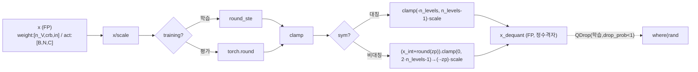

### 2.3 forward call stack
`MinMaxQuantLinear.quant_forward`(`linear.py:46`) → `quant_weight_bias`(`:39`)/`quant_input`(`:43`) → `UniformQuantizer.forward`(`uniform.py:24`) → round_ste/round(`:30`) → clamp + dequant(`:31-40`).

### 2.4 대표 코드 위치
`uniform.py`: 클래스 `:7-43`, `n_levels=2^(n_bits-1)`(`:12`), forward 대칭/비대칭 분기 `:30-40`, QDrop `:28-39`, init_training/end_training `:18-22`.

### 2.5 대표 코드 블록
```python
# uniform.py:12  n_levels는 부호있는 절반 (대칭이면 [-n_levels, n_levels-1])
self.n_levels = 2 ** (self.n_bits - 1)
```
→ W4면 `n_levels=8`, 대칭 정수범위 `[-8,7]`; 비대칭 정수범위 `[0, 2·n_levels-1]=[0,15]`(`:32,35`).

```python
# uniform.py:30-40  대칭(zp=0) vs 비대칭(zp 학습), 학습시 round_ste
x_int = round_ste(x / self.scale) if self.training_mode else torch.round(x / self.scale)
if self.sym:
    x_quant = x_int.clamp(-self.n_levels, self.n_levels - 1)
    x_dequant = x_quant * self.scale
else:
    x_quant = (x_int + torch.round(self.zero_point)).clamp(0, 2 * self.n_levels - 1)
    x_dequant = (x_quant - torch.round(self.zero_point)) * self.scale
```
→ **weight=대칭, activation=비대칭**이 본 repo 기본 조합(`linear.py:277-278`). 비대칭 act는 ReLU/GELU 후 비음수 분포에 유리(zero-point로 [0,max] 정렬).

```python
# uniform.py:28-39  QDrop: 학습 중 양자값/FP값을 확률적으로 섞음
if self.training_mode and self.drop_prob < 1.0:
    x_orig = x
    ...
    x_prob = torch.where(torch.rand_like(x) < self.drop_prob, x_dequant, x_orig)
    return x_prob
```
→ 블록 재구성 시 `set_qdrop`(`block_recon.py:153-163`)이 `drop_prob`를 0.5로 세팅(`4bit/best.py:28`) → 양자화 노이즈에 robust한 reconstruction.

### 2.6 연산·수치표현 분해 + 정량
- **양자화 방식**: 균일(linear) 양자화. weight 대칭 channel-wise(scale shape `[n_V,crb,1]`), activation 비대칭 per-tensor(scale `[1]`).
- **scale/zp**: `nn.Parameter`(`adaround.py`에서 재구성시 학습; calib시 percentile+MSE 탐색). 대칭 zp=0, 비대칭 zp 학습.
- **비트폭**: W4/A4(best), conv 입력 A8, head 입력 A4(`4bit/best.py:9-12`). n_bits=32면 passthrough(`uniform.py:25`).
- **params**: scale `[n_V·crb]` 또는 `[1]`, (비대칭이면) zero_point 동수. 학습 파라미터로 잡히나 가중치 대비 미미.
- **FLOPs**: 원소당 div+round+clamp = O(N). ViT-S qkv weight(384×1152=442K 원소) 양자화 = 442K div+round (forward마다 재계산, fake-quant 비용).
- **activation bit**: 출력은 정수격자 FP. HW 환산 비트는 n_bits.

---

## 3. 모듈: 학습형 반올림 — `quantizers/adaround.py` (AdaRoundQuantizer) ★재구성 핵심

### 3.1 역할 + 상위/하위
- **역할**: weight 반올림을 **학습 가능 변수 `alpha`** 로 만들어(올림/내림 선택), 블록 출력 재구성 손실로 최적화(AdaRound, arXiv:2004.10568). soft 단계는 sigmoid 보간, 종료시 hard `(alpha≥0)`로 확정.
- **상위**: `wrap_quantizers_in_net`이 재구성 진입 시 `MinMaxQuantLinear/Conv2d`의 `w_quantizer`를 AdaRound로 교체(`block_recon.py:139-151`). **하위**: `UniformQuantizer`(scale/zp 복사), `round_ste`.

### 3.2 데이터플로우 (텐서 shape 흐름)
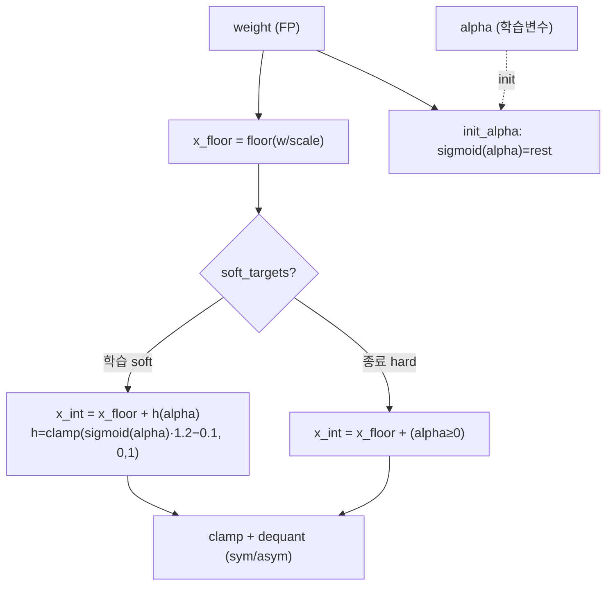

### 3.3 forward call stack
`reconstruct_single_block`(`block_recon.py:329`) → `block(cur_inp)` → `QuantLinear.quant_forward`(`linear.py:46`) → `quant_weight_bias` → `AdaRoundQuantizer.forward`(`adaround.py:38`) → `get_soft_targets`(`:59`) 또는 `(alpha≥0)`(`:48`).

### 3.4 대표 코드 위치
`adaround.py`: 클래스 `:7-76`, forward `:38-57`, `get_soft_targets`(rectified sigmoid) `:59-60`, `init_alpha` `:62-69`, `get_hard_value` `:71-73`.

### 3.5 대표 코드 블록
```python
# adaround.py:43-48  학습형 반올림: floor + (soft sigmoid | hard 임계)
elif self.round_mode == 'learned_hard_sigmoid':
    x_floor = torch.floor(x / self.scale)
    if self.soft_targets:
        x_int = x_floor + self.get_soft_targets()   # soft: 미분가능
    else:
        x_int = x_floor + (self.alpha >= 0).float()  # hard: 최종 확정
```

```python
# adaround.py:59-60  rectified sigmoid (gamma=-0.1, zeta=1.1) → [0,1]로 squash
def get_soft_targets(self):
    return torch.clamp(torch.sigmoid(self.alpha) * (self.zeta - self.gamma) + self.gamma, 0, 1)
```
→ `(zeta-gamma)=1.2`, `+gamma=-0.1` 후 `[0,1]` clamp → 0/1 양끝으로 밀어내는 정규화(`LossFunction`의 round_loss와 결합).

```python
# adaround.py:62-67  alpha 초기화: sigmoid(alpha)=rest 가 되도록 역산
x_floor = torch.floor(x / self.scale)
rest = (x / self.scale) - x_floor                    # [0,1) 반올림 잔차
alpha = -torch.log((self.zeta - self.gamma) / (rest - self.gamma) - 1)  # => sigmoid(alpha)=rest
```
→ 초기엔 nearest 반올림과 동일하게 시작, 학습으로 올림/내림을 출력손실 최소 방향으로 조정.

### 3.6 연산·수치표현 분해 + 정량
- **양자화 방식**: AdaRound. soft = `floor + rectified_sigmoid(alpha)`, hard = `floor + 1[alpha≥0]`. scale/zp는 UniformQuantizer에서 복사된 `nn.Parameter`(`:26-27`).
- **params(학습 변수)**: `alpha`가 weight와 동일 shape — **ViT-S qkv면 384×1152≈442K 학습변수/레이어**. 재구성 종료시 `del alpha`(`block_recon.py:370`)로 hard value를 weight에 굽고 제거.
- **FLOPs**: forward당 floor + sigmoid + clamp = O(W원소). 20000 iters × block 수만큼 반복 → 재구성 비용 지배(추정).
- **시사**: alpha의 학습/굽기는 SW PTQ 단계 — **HW는 굳혀진 정수 weight만 받음**(get_hard_value, `:71-73`). FPGA 관점에서 AdaRound는 오프라인 weight 결정 단계로 추론 회로에 영향 없음.

---

## 4. 모듈: 정수 Linear (PTQSL/비대칭) — `quant_layers/linear.py` ★

### 4.1 역할 + 상위/하위
- **역할**: nn.Linear를 양자화 레이어로. weight 대칭 channel-wise, activation 비대칭 per-tensor. 캘리브 단계에 percentile 후보 격자에서 MSE 유사도로 scale/zp 탐색(PTQSL = PTQ Sequential Layer-wise search). qkv는 `n_V=3`으로 Q/K/V 채널 그룹 분리(`wrap_net.py:124`).
- **상위**: `wrap_net.py`가 timm `nn.Linear`를 치환(`:111-151`). **하위**: `UniformQuantizer`, (재구성시) `AdaRoundQuantizer`.

### 4.2 데이터플로우 (텐서 shape 흐름, ViT-S qkv 예)
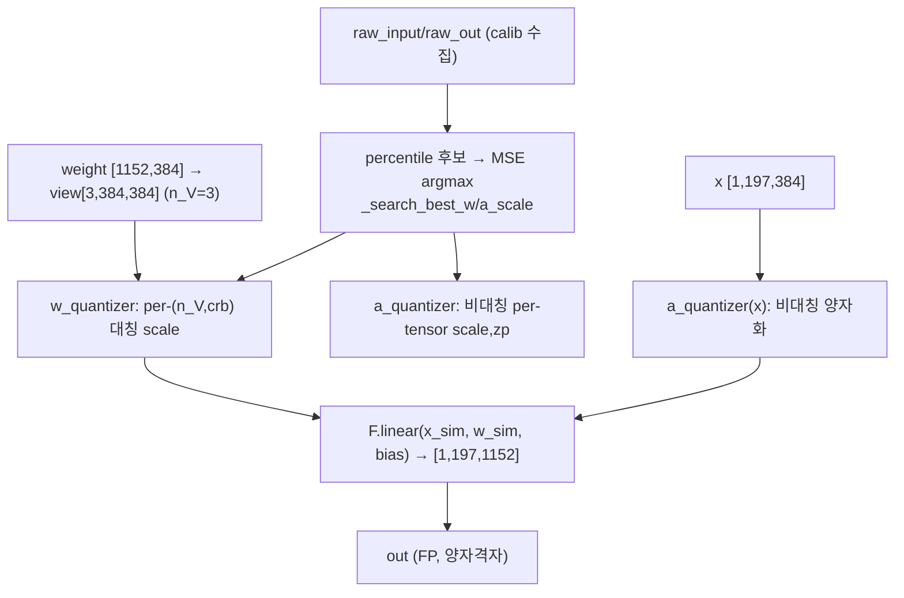

### 4.3 forward call stack
- 캘리브: `batching_quant_calib`(`calibrator.py:73`) → `hyperparameter_searching`(`linear.py:511`) → `_search_best_w_scale`/`_search_best_a_scale`(`:374,413`).
- 추론: `forward`(`linear.py:26`) → `quant_forward`(`:46`) → `quant_weight_bias`(`:103`) + `quant_input`(`:43`) → `F.linear`(`:50`).

### 4.4 대표 코드 위치
`linear.py`: `MinMaxQuantLinear` `:8-61`(forward `:26-37`, quant_forward `:46-51`), `PTQSLQuantLinear` `:64-105`(weight per-channel `:81`, n_V/crb `:87-88`), `AsymmetricallyBatchingQuantLinear` `:256-331`(비대칭 weight/act `:277-282`, search `:374-449`), `hyperparameter_searching` `:511-530`, `reparam` `:578-606`.

### 4.5 대표 코드 블록
```python
# linear.py:277-282  weight=비대칭 채널별, activation=비대칭 per-tensor (Asymmetric 변형)
self.w_quantizer = UniformQuantizer(n_bits = w_bit, symmetric = False, channel_wise = True)
self.a_quantizer = UniformQuantizer(n_bits = a_bit, symmetric = False, channel_wise = False)
self.a_quantizer.scale = nn.Parameter(torch.zeros((1)))
self.a_quantizer.zero_point = nn.Parameter(torch.zeros((1)))
self.w_quantizer.scale = nn.Parameter(torch.zeros((n_V, self.crb_rows, 1)))
self.w_quantizer.zero_point = nn.Parameter(torch.zeros((n_V, self.crb_rows, 1)))
```
→ qkv는 `n_V=3`(`wrap_net.py:124`)이라 weight를 `[3, crb_rows=out/3, in]`으로 보고 그룹별 scale. (대칭 PTQSL 변형 `:81-82`도 존재하나 best config는 Asymmetric 경로 사용 — `wrap_net.py:144`.)

```python
# linear.py:159-191  weight scale을 후보 격자에서 MSE argmax로 탐색 (search)
cur_w_scale = weight_scale_candidates[p_st:p_ed]
w_sim = (w_sim / cur_w_scale).round_().clamp_(-n_levels, n_levels-1).mul_(cur_w_scale)
out_sim = F.linear(x_sim, w_sim, bias_sim)
similarity = self._get_similarity(raw_out_expanded, out_sim, self.metric)  # -MSE
...
best_index = batch_similarities.argmax(dim=0)   # 최소 MSE scale 선택
```
→ MSE(`metric='mse'`, `4bit/best.py:13`) 기준 최적 scale 격자점 선택. `eq_n=128` 후보(`:16`), `search_round=3` 반복(`:17`).

```python
# linear.py:50  추론 forward = (비대칭)양자화 입력 @ (대칭/비대칭)양자화 weight
out = F.linear(x_sim, w_sim, bias_sim)   # fake-quant: 둘 다 dequant된 FP
```

### 4.6 연산·수치표현 분해 + 정량 (ViT-S, B=1, N=197)
- **양자화 방식**: weight 비대칭 channel-wise(qkv n_V=3), activation 비대칭 per-tensor. fake-quant(정수 실연산 아님).
- **scale/zp**: weight `[n_V,crb,1]`, act `[1]`+zp. percentile+MSE로 calib, AdaRound로 재구성.
- **비트폭**: W4 / A4(head A4, conv A8). bias는 FP 유지(`quant_weight_bias`가 bias 양자화 안 함, `:105`).
- **params** (ViT-S 1 block, C=384, mlp_ratio=4 → fc dim 1536):
  - qkv: 384×1152 + 1152 = **443,520**
  - proj: 384×384 + 384 = **147,840**
  - fc1: 384×1536 + 1536 = **591,360**
  - fc2: 1536×384 + 384 = **590,208**
  - Linear params/block ≈ **1.773M**, ×12 ≈ **21.27M** (PatchEmbed/head 별도).
- **MACs/block** (B=1, N=197):
  - qkv: 197×384×1152 ≈ **87.1M**
  - proj: 197×384×384 ≈ **29.0M**
  - fc1: 197×384×1536 ≈ **116.2M**
  - fc2: 197×1536×384 ≈ **116.2M**
  - Linear MAC/block ≈ **348.5M**, ×12 ≈ **4.18G** (Attention matmul 제외).
- **activation bit**: 입력 A4 → 정수 MAC 누산 INT(추정, fake-quant라 실제 FP) → 다음 레이어 A4.

---

## 5. 모듈: 정수 행렬곱 (Attention) — `quant_layers/matmul.py`

### 5.1 역할 + 상위/하위
- **역할**: Attention의 QKᵀ(matmul1), attn·V(matmul2)를 양자화. A/B 두 입력을 각각 **비대칭 head-wise** 양자화. softmax는 양자화 안 함(matmul1 출력→FP softmax→matmul2 입력).
- **상위**: `wrap_net.py`가 `MatMul()` placeholder를 `Asymmetric..QuantMatMul`로 치환(`:96-110`), `num_heads` 전달(`:108`). **하위**: `UniformQuantizer`(A_quantizer, B_quantizer).

### 5.2 데이터플로우 (텐서 shape 흐름, ViT-S matmul1)
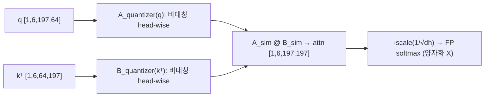

### 5.3 forward call stack
- 캘리브: `hyperparameter_searching`(`matmul.py:226`) → `_search_best_A_scale`/`_search_best_B_scale`(`:130,166`) → `calculate_percentile_candidates`(`:202`).
- 추론: `vit_attn_forward`(`wrap_net.py:25,28`) → `MinMaxQuantMatMul.forward`(`matmul.py:25`) → `quant_forward`(`:40`) → `A_quantizer(A) @ B_quantizer(B)`(`:42`).

### 5.4 대표 코드 위치
`matmul.py`: `MinMaxQuantMatMul` `:12-42`(forward `:25-32`, quant_forward `:40-42`), `PTQSLQuantMatMul` head-wise scale `:67-74`, `AsymmetricallyBatchingQuantMatMul` `:109-279`(비대칭 `:114-128`, search `:130-200`, percentile `:202-224`, token_channel_wise `:267-275`).

### 5.5 대표 코드 블록
```python
# matmul.py:40-42  추론: 두 입력 각각 비대칭 양자화 후 행렬곱
def quant_forward(self, A, B):
    assert self.calibrated, ...
    return self.quant_input_A(A) @ self.quant_input_B(B)
```

```python
# matmul.py:71-74  head-wise scale (head 차원 dim-1 별 독립 scale)
target_shape = [1, self.num_heads, 1, 1]
self.A_quantizer.scale = nn.Parameter(torch.zeros(*target_shape))
self.B_quantizer.scale = nn.Parameter(torch.zeros(*target_shape))
```
→ `matmul_head_channel_wise=True`(`4bit/best.py:14`)면 head별 scale. attention의 head별 동적범위 차이 흡수.

```python
# matmul.py:202,228-229  percentile 후보 (0.99~0.99999) 로 outlier-robust scale
def calculate_percentile_candidates(self, x, l=0.99, r=0.99999):
    ...
A_uppers, A_lowers = self.calculate_percentile_candidates(self.raw_input[0].cuda(), l=0.99, r=0.99999)
```
→ attention 입력의 긴 꼬리(outlier)를 99~99.999 percentile로 clip → 저비트 양자화 안정화.

### 5.6 연산·수치표현 분해 + 정량 (ViT-S, B=1, H=6, N=197, dh=64)
- **양자화 방식**: A/B 모두 비대칭 head-wise. softmax는 FP(양자화 대상 아님).
- **비트폭**: A4/B4(`a_bit=4`, `wrap_net.py:99-100`). bias 없음.
- **params**: A/B scale+zp `[1,6,1,1]`씩 — 미미.
- **MACs/block** (Attention 행렬곱):
  - QKᵀ(matmul1): H·N²·dh = 6×197²×64 ≈ **14.9M**
  - attn·V(matmul2): 6×197²×64 ≈ **14.9M**
  - Attention matmul MAC/block ≈ **29.8M**, ×12 ≈ **358M**.
- **activation memory**: attn 행렬 `[1,6,197,197]` A4 = 6×197²×0.5byte ≈ **116 KB**(softmax 입출력은 FP라 실제 더 큼).
- **시사**: N² 텐서가 최대 중간 활성. softmax가 FP라 I-ViT 같은 정수 softmax 없음 → FPGA화엔 별도 softmax 처리 필요(추정).

---

## 6. 모듈: 정수 Conv (PatchEmbed) — `quant_layers/conv.py`

### 6.1 역할 + 상위/하위
- **역할**: 입력 이미지 패치 투영(16×16 stride16 conv). weight 비대칭 channel-wise, 입력은 A8(`qconv_a_bit=8`)이라 `quant_input`이 8bit 이상이면 양자화 생략(`conv.py:56-58`).
- **상위**: `wrap_net.py`가 `nn.Conv2d`를 `Asymmetric..QuantConv2d`로 치환(`:78-95`). **하위**: `UniformQuantizer`, `F.conv2d`.

### 6.2 데이터플로우 (텐서 shape 흐름, ViT-S)
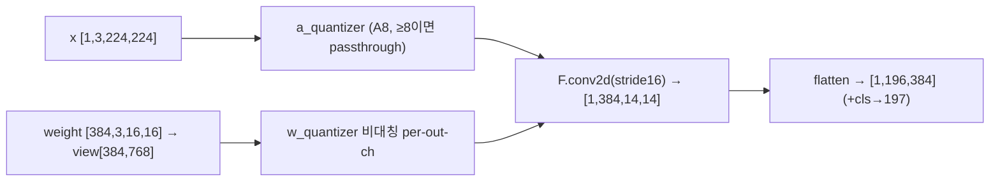

### 6.3 forward call stack
- 캘리브: `hyperparameter_searching`(`conv.py:283`) → `_search_best_w_scale`(`:236`)/`_search_best_a_scale`(`:178`).
- 추론: `forward`(`conv.py:38`) → `quant_forward`(`:60`) → `quant_weight_bias`(`:123`) + `quant_input`(`:55`) → `F.conv2d`(`:64`).

### 6.4 대표 코드 위치
`conv.py`: `MinMaxQuantConv2d` `:11-75`(quant_input ≥8 생략 `:55-58`), weight view `:127`, `AsymmetricallyBatchingQuantConv2d` `:211-314`(비대칭 weight `:232-234`, weight search `:236-271`, percentile `:273-281`).

### 6.5 대표 코드 블록
```python
# conv.py:55-58  입력 비트폭 ≥8이면 활성 양자화 생략 (PatchEmbed은 A8)
def quant_input(self, x):
    if self.a_quantizer.n_bits >= 8:
        return x
    return self.a_quantizer(x)
```
→ `qconv_a_bit=8`(`4bit/best.py:11`)이라 PatchEmbed 입력은 사실상 FP passthrough(weight만 양자화). 입력 이미지 동적범위 보존.

```python
# conv.py:123-128  weight을 (oc, ic·kw·kh)로 펴서 per-out-channel 양자화
oc, ic, kw, kh = self.weight.data.shape
w_sim = self.w_quantizer(self.weight.view(oc, ic * kw * kh)).view(oc, ic, kw, kh)
```

### 6.6 연산·수치표현 분해 + 정량 (ViT-S PatchEmbed)
- **양자화 방식**: weight 비대칭 per-out-channel(384), 입력 A8(실질 passthrough).
- **비트폭**: W4 / 입력 A8.
- **params**: 384×3×16×16 + 384 = **295,296**.
- **MACs**: out 14×14=196 위치 × 384 × (3×16×16=768) ≈ **57.8M**(전 모델 1회, block당 아님).
- **activation memory**: 출력 [1,384,14,14] → flatten [1,196,384].
- **시사**: 입력 conv는 W4지만 입력 A8 보존 → HW에서 1층만 정밀도 높게 가져가는 일반적 패턴.

---

## 7. 모듈: 채널→레이어 scale 재파라미터화 — `quant_layers/linear.py` (reparam) ★AdaLog 공유

### 7.1 역할 + 상위/하위
- **역할**: channel-wise activation scale을 layer-wise(per-tensor)로 흡수. 채널별 scale/zp를 이전 LayerNorm 가중치·다음 Linear 가중치로 수학적으로 이전(`r,b` 변환)해, 추론은 단일 scale로 단순화하면서 정확도는 channel-wise 수준 유지.
- **상위**: `batching_quant_calib`이 `prev_layer`가 있으면 호출(`calibrator.py:75-77`). `wrap_net.py`가 qkv/fc1/reduction에 `prev_layer`(직전 norm) 연결(`:128-142`). **하위**: `AsymmetricallyChannelWiseBatchingQuantLinear`(`linear.py:533-606`).

### 7.2 데이터플로우 (텐서 shape 흐름)
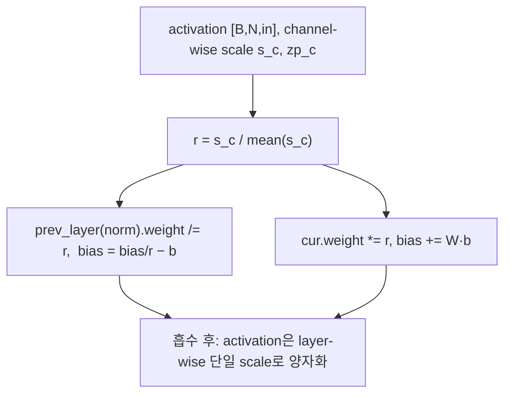

### 7.3 forward call stack
`batching_quant_calib`(`calibrator.py:75`) → `module.reparam()`(`linear.py:599`) → `reparam_step1`(`:578`) → 이후 `wrap_reparamed_modules_in_net`(`wrap_net.py:155`)이 channel-wise 레이어를 일반 비대칭 레이어로 재래핑.

### 7.4 대표 코드 위치
`linear.py`: `AsymmetricallyChannelWiseBatchingQuantLinear` `:533-606`, `prev_layer` property `:557-569`, `reparam_step1` `:578-597`, `reparam` `:599-606`. `wrap_net.py`: prev_layer 연결 `:128-142`, 재래핑 `:155-192`.

### 7.5 대표 코드 블록
```python
# linear.py:584-593  채널 scale 비율 r을 prev/cur 가중치로 흡수 (수학적 등가)
r = (self.a_quantizer.scale / target_channel_scale)
b = channel_min / r - target_channel_min
self.prev_layer.weight.data = self.prev_layer.weight.data / r          # 직전 LayerNorm
self.prev_layer.bias.data = self.prev_layer.bias.data / r.view(-1) - b
self.weight.data = self.weight.data * r.view(1, -1)                    # 현재 Linear
if self.bias is not None:
    self.bias.data = self.bias.data + torch.mm(self.weight.data, b.reshape(-1, 1)).reshape(-1)
```
→ activation 채널별 동적범위 차이를 가중치로 옮겨 **추론은 layer-wise 단일 scale**로. (AdaLog 계열 LN-Linear smoothing.)

### 7.6 연산·수치표현 분해 + 정량
- **양자화 방식**: channel-wise scale → layer-wise 흡수. 비대칭.
- **params**: 변환 후 activation scale `[1]`로 축소(채널 scale 제거). 가중치는 r/b로 수정(개수 불변).
- **시사**: HW 관점에서 **per-tensor 단일 scale 추론**을 가능케 함 → I-ViT의 dyadic requant와 달리 채널별 scale 버스 불필요. FPGA에서 activation requant 회로 단순화 근거(추정). 단 변환은 SW calib 단계 1회.

---

## 8. 모듈: 캘리브레이터 + 그래디언트 수집 — `utils/calibrator.py`

### 8.1 역할 + 상위/하위
- **역할**: 각 양자화 모듈의 raw I/O를 forward hook으로 수집하고 `hyperparameter_searching()`을 구동, `prev_layer`가 있으면 `reparam()`. **grad_hook**으로 블록 출력 그래디언트를 캐싱(Hessian용).
- **상위**: `test_quant.py`가 `QuantCalibrator(...).batching_quant_calib()`(`:258-259`). `BlockReconstructor`/`MLPReconstructor`가 상속(`block_recon.py:82`, `mlp_recon.py:52`). **하위**: 양자화 모듈의 `hyperparameter_searching`/`reparam`.

### 8.2 데이터플로우 (텐서 shape 흐름)
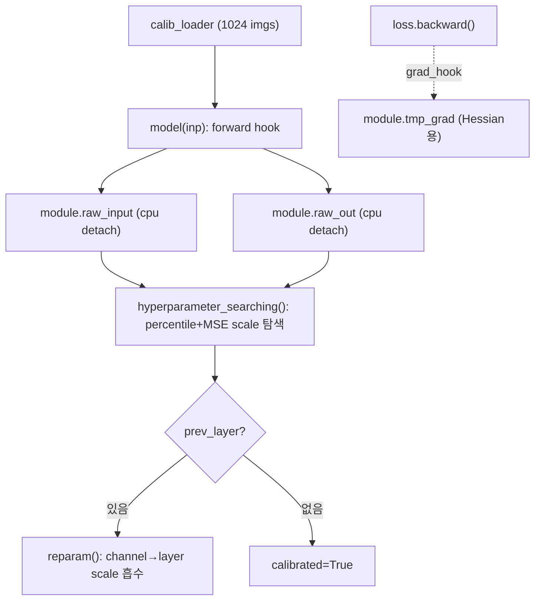

### 8.3 forward call stack
`batching_quant_calib`(`calibrator.py:35`) → forward hook 등록(`:53-57`) → `model(inp)` loop(`:58-61`) → `hyperparameter_searching`(`:74`) → `reparam`(`:77`) → 끝나면 전 모듈 `mode='quant_forward'`(`:81-83`).

### 8.4 대표 코드 위치
`calibrator.py`: hooks `:14-33`(single/double input, output, **grad** `:30-33`), `batching_quant_calib` `:35-83`, raw 수집 `:64-68`, search/reparam `:73-78`.

### 8.5 대표 코드 블록
```python
# calibrator.py:30-33  grad_hook: backward의 grad_output[0]을 캐싱 (Perturbation Hessian 재료)
def grad_hook(self, module, grad_input, grad_output):
    if module.tmp_grad is None:
        module.tmp_grad = []
    module.tmp_grad.append(grad_output[0].clone().cpu().detach())
```
→ `register_full_backward_hook`(`block_recon.py:234`)과 결합해 블록 출력 그래디언트 수집 → APH 차분의 입력.

```python
# calibrator.py:73-77  레이어별 scale 탐색 후, 직전층 연결되면 reparam
with torch.no_grad():
    module.hyperparameter_searching()
    if hasattr(module, 'prev_layer') and module.prev_layer is not None:
        module.reparam()
```

### 8.6 연산·수치표현 분해 + 정량
- **양자화 방식**: 캘리브 = raw I/O 수집 + percentile/MSE scale 탐색. observer 역할.
- **params**: 0(탐색 로직). 수집 텐서는 CPU 캐시(`.cpu().detach()`, `:17,28,33`) → GPU 메모리 절약, CPU↔GPU 왕복 비용.
- **비용**: calib_size=128 이미지(`4bit/best.py:6`)로 모듈별 1 pass. raw 텐서 메모리가 큰 레이어는 `calib_batch_size`로 분할(`:54`).
- **시사**: grad_hook이 APH의 핵심 수집 장치. SW 단계 — HW 무관.

---

## 9. 모듈: Average Perturbation Hessian + 블록 재구성 — `utils/block_recon.py` ★★최중요(본 repo 고유)

### 9.1 역할 + 상위/하위
- **역할**: (a) 블록 출력에 `±1e-6` 섭동을 주고 KL-div 그래디언트 차분으로 **APH(곡률) 근사**, (b) 블록 weight를 AdaRound `alpha`로, activation scale을 함께 **APH-가중 출력 재구성 손실**로 최적화(QDrop 동반).
- **상위**: `test_quant.py`가 `--optimize`에서 `BlockReconstructor(...).reconstruct_model()`(`:271-272`). **하위**: `AdaRoundQuantizer`, `LossFunction`(동 파일), `calibrator.grad_hook`.

### 9.2 데이터플로우 (텐서 shape 흐름)
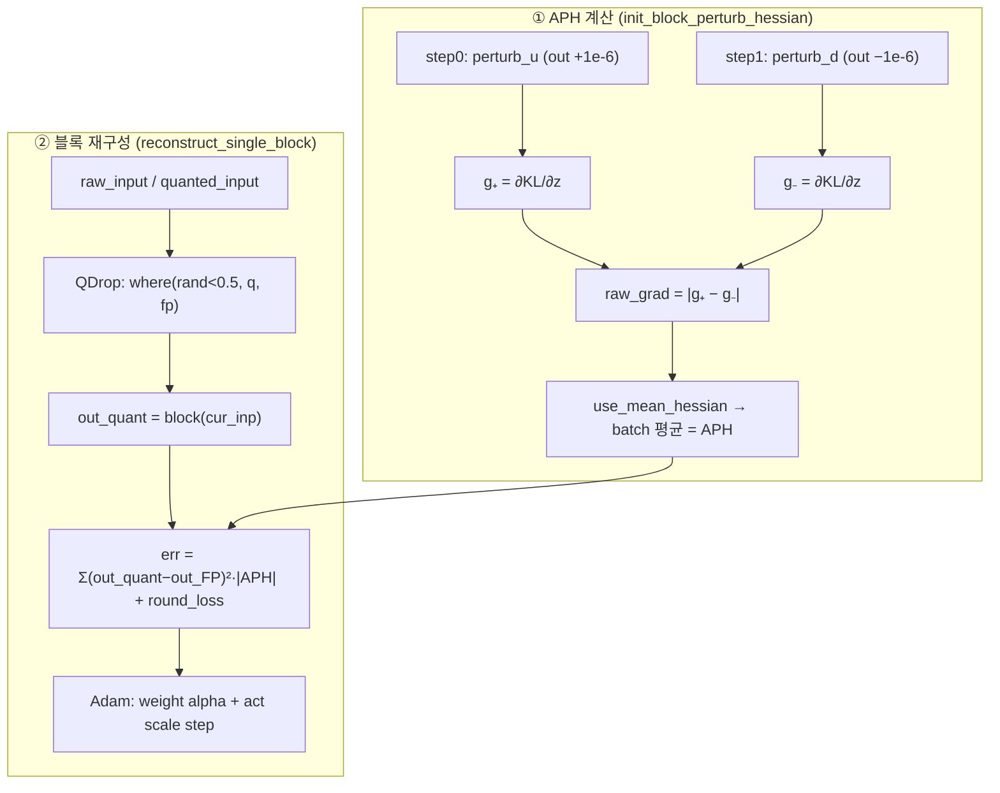

### 9.3 forward call stack
`reconstruct_model`(`block_recon.py:352`) → 블록별 `init_block_raw_data`(`:360`) → `init_block_perturb_hessian`(`:228`, step0/1 backward) → `reconstruct_single_block`(`:362`) → loop: QDrop(`:308-311`) → `block(cur_inp)`(`:329`) → `LossFunction.__call__`(`:331`) → `err.backward()`+step(`:334-338`).

### 9.4 대표 코드 위치
`block_recon.py`: 섭동 forward `:25-79`(vit_block `:32-39`), `BlockReconstructor` `:82-372`, **APH** `init_block_perturb_hessian` `:228-248`, BRECQ 비교군 `:250-267`, `reconstruct_single_block` `:271-350`, QDrop `:153-163,308-311`, `reconstruct_model` `:352-372`, `LossFunction` `:374-451`, `LinearTempDecay` `:454-471`.

### 9.5 대표 코드 블록
```python
# block_recon.py:35-38  블록 출력 끝에 ±1e-6 섭동 주입 (곡률 수치근사용)
if self.perturb_u:
    x = x + torch.ones_like(x) * 1e-6
elif self.perturb_d:
    x = x - torch.ones_like(x) * 1e-6
```

```python
# block_recon.py:235-248  APH: ±섭동 각각 KL-div backward → grad 차분 절댓값 → 배치 평균
for step in range(2):
    hook = full_block.register_full_backward_hook(self.grad_hook)
    full_block.perturb_u, full_block.perturb_d = (step == 0, step == 1)
    for i, (inp, target) in enumerate(self.calib_loader):
        pred = self.full_model(inp) / self.temperature                       # T=20
        loss = F.kl_div(F.log_softmax(pred, dim=-1), self.raw_pred_softmaxs[i], reduction="batchmean")
        loss.backward()
    raw_grads.append(torch.cat(full_block.tmp_grad, dim=0))
block.raw_grad = (raw_grads[0] - raw_grads[1]).abs()                          # |g₊ − g₋| = Perturbation Hessian
block.raw_grad = block.raw_grad.mean(dim=0, keepdim=True) if self.use_mean_hessian else block.raw_grad  # Average
```
→ 출력 변화 `2·δ`(δ=1e-6)에 대한 KL-loss 그래디언트 변화율 = 2차 곡률(Hessian) 대각 근사. **BRECQ는 단일 backward의 `grad.abs().pow(2)`**(`:265`)인 데 비해, APHQ는 ±차분이라 부호·곡률 방향성을 더 정확히 포착.

```python
# block_recon.py:308-311  QDrop: 양자화 입력과 FP 입력을 확률적으로 혼합
cur_quant_inp = block.quanted_input[idx]... ; cur_fp_inp = block.raw_input[idx]...
cur_inp = torch.where(torch.rand_like(cur_quant_inp) < drop_prob, cur_quant_inp, cur_fp_inp)
```

```python
# block_recon.py:425-426  Hessian-가중 reconstruction loss
elif self.rec_loss in ['hessian_brecq', 'hessian_perturb']:
    rec_loss = ((pred - tgt).pow(2) * grad.abs()).mean()    # 출력오차² × |APH|
```
→ 출력 차원별로 APH 큰(=양자화 민감) 위치에 더 큰 가중. round_loss(`:436-441`)는 AdaRound alpha를 0/1로 미는 정규화, b는 `LinearTempDecay`로 20→2 감쇠(`:393,433`).

### 9.6 연산·수치표현 분해 + 정량 (ViT-S)
- **알고리즘**: APH = `mean_batch(|g₊ − g₋|)`, loss = `mean((out_q−out_FP)²·|APH|) ·2/init_loss + round_loss`. T=20(`4bit/best.py:22`), δ=1e-6.
- **비트폭**: 재구성은 활성 양자화 ON(`quant_act=True`, `test_quant.py:272`), W4/A4 격자에서 최적화.
- **params(학습)**: weight당 AdaRound `alpha`(레이어별 weight shape) + activation scale(레이어별 소수). 블록 단위로 Adam 최적화.
- **비용(정량)**: 블록당 `iters=20000`(`:272`) × batch_size=32(`:272`) forward+backward. ViT-S는 블록 12 + head 1 + patch_embed 1 ≈ 14개 재구성 단위 × 20000 it. APH 계산은 블록당 2 step × calib_loader(1024/32=32 batch) backward. → **PTQ지만 GPU 시간 큼**(0.1절).
- **activation memory**: raw_input/raw_out/quanted_input/raw_grad를 GPU 캐시(`keep_gpu=True`, `:178-183`). raw_grad는 use_mean_hessian이면 `[1,N,C]`로 축약(`:248`)되어 메모리 절약.
- **시사(HW)**: APH는 **블록/출력차원별 양자화 민감도 맵**을 산출 → 혼합정밀 비트할당의 정량 근거로 재사용 가능(추정). 재구성 자체는 SW 오프라인.

---

## 10. 모듈: MLP Reconstruction (GELU→ReLU) — `utils/mlp_recon.py` ★★본 repo 고유, "MLP Recon." 정량의 출처

### 10.1 역할 + 상위/하위
- **역할**: MLP의 GELU를 **ReLU로 교체**한 뒤(`test_quant.py:218`) fc1/fc2/norm2 가중치를 재학습해, FP 정확도를 유지하면서 **post-activation 분포를 양자화 친화적(비음수·꼬리 짧음)** 으로 만든다. 재학습 시 fc2 입력을 `[0, ub]`로 clamp해 저비트 양자화를 모사.
- **상위**: `test_quant.py`가 `--reconstruct-mlp`에서 `MLPReconstructor(...).reconstruct_model(pct)`(`:233-234`). **하위**: APH(동일 ±섭동 KL-div), `positive_percentile`(`:33-49`).

### 10.2 데이터플로우 (텐서 shape 흐름)
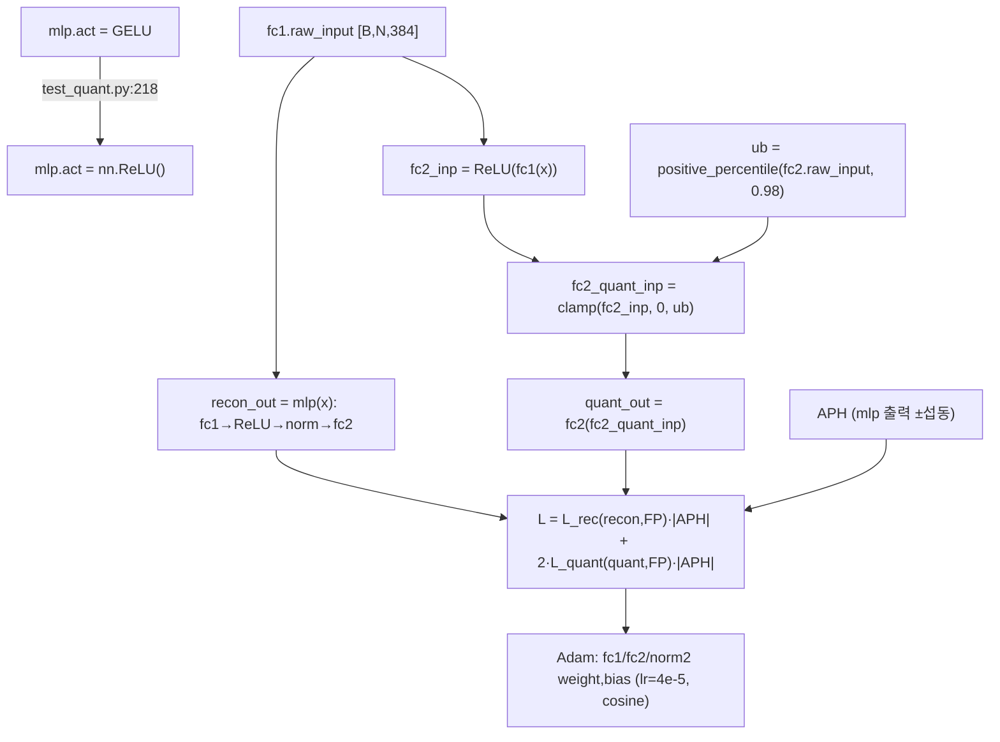

### 10.3 forward call stack
`reconstruct_model`(`mlp_recon.py:159`) → `init_block_raw_data`(`:164`) → `init_block_perturb_hessian`(`:110`, ±섭동 APH) → `positive_percentile`(`:170`) → `reconstruct_single_block`(`:173`) → loop: `mlp(cur_inp)`(`:148`) + clamp 양자화(`:149-151`) → `LossFunction.__call__`(`:152`) → step(`:154-155`).

### 10.4 대표 코드 위치
`mlp_recon.py`: `mlp_forward`(섭동) `:19-30`, `positive_percentile` `:33-49`, `MLPReconstructor` `:52-174`, APH `:110-128`(정규화 `:128`), `reconstruct_single_block` `:130-157`(clamp `:149-151`), `reconstruct_model` `:159-174`, `LossFunction`(rec+quant) `:177-221`. ReLU 교체 `test_quant.py:215-218`.

### 10.5 대표 코드 블록
```python
# test_quant.py:215-218  --reconstruct-mlp: GELU를 ReLU로 교체
if args.reconstruct_mlp:
    for name, module in model.named_modules():
        if name.split('.')[-1] == 'mlp':
            module.act = nn.ReLU()
```
→ **핵심**: GELU(음수 꼬리 있음, 양자화 어려움)를 ReLU(비음수)로 바꿔 fc2 입력을 양자화 친화적으로. 정확도 손실은 fc1/fc2/norm2 재학습으로 보상(README "MLP Recon." 컬럼).

```python
# mlp_recon.py:148-152  recon 출력과 clamp-양자화 모사 출력을 동시에 FP 타깃에 맞춤
recon_out = block.mlp(cur_inp)                          # ReLU MLP 정상 출력
fc2_inp = block.mlp.act(block.mlp.fc1(cur_inp))          # ReLU(fc1(x))
fc2_quant_inp = torch.clamp(fc2_inp, 0, ub)              # [0,ub] clamp = 저비트 양자화 모사
quant_out = block.mlp.fc2(fc2_quant_inp)
err = loss_func(recon_out, cur_out, cur_grad, quant_out)
```
→ `ub`는 fc2 입력의 positive 98 percentile(`:170`, `pct=0.98` `4bit/best.py:25`). ReLU 출력 꼬리를 ub로 잘라도 출력이 FP와 같도록 가중치 학습.

```python
# mlp_recon.py:211-213,217  rec_loss + 2·quant_loss, 둘 다 |APH| 가중
rec_loss   = ((pred - tgt).pow(2) * grad.abs()).sum(1).mean() / 10
quant_loss = ((quant_out - tgt).pow(2) * grad.abs()).sum(1).mean() / 10
total_loss = rec_loss + quant_loss * self.weight          # weight=2.0
```
→ `quant_loss`에 2배 가중(`weight=2.0`, `:138`)해 clamp 후에도 출력 보존을 강하게 유도.

```python
# mlp_recon.py:128  APH 정규화: numel/Σgrad² 의 sqrt로 스케일 정규화
block.mlp.raw_grad = block.mlp.raw_grad * torch.sqrt(block.mlp.raw_grad.numel() / block.mlp.raw_grad.pow(2).sum())
```

### 10.6 연산·수치표현 분해 + 정량 (ViT-S MLP, fc dim=1536)
- **알고리즘**: GELU→ReLU 교체 + fc1/fc2/norm2 재학습. clamp([0,ub]) 양자화 모사. APH 가중. lr=4e-5 cosine(`:136-137`), iters=20000(`:131`).
- **params(학습)**: fc1(591K)+fc2(590K)+norm2(768) weight·bias = **약 1.18M/블록** 직접 학습(AdaRound 아닌 직접 가중치 미세조정).
- **비트폭**: 재구성은 FP에서 진행(clamp로 양자화 효과만 모사). 실제 양자화는 이후 calib/optimize에서.
- **비용**: 블록당 20000 it × batch 32, 12 블록.
- **정량 효과**: README "MLP Recon." 컬럼 — ViT-S 81.39→80.90, ViT-B 84.54→**84.84(향상)**(`README.md:80-81`). GELU→ReLU 교체에도 FP 근접/향상 = 본 repo 핵심 기여.
- **시사(HW)**: **ReLU는 GELU 대비 회로가 훨씬 단순**(비교기 1개 vs 지수/erf). APHQ의 GELU→ReLU 교체는 FPGA에서 MLP 비선형을 ReLU+clamp로 대체할 수 있게 함 → I-ViT의 IntGELU(시프트 지수)보다 더 단순한 후단 데이터패스 가능(추정). `ub` clamp는 활성 동적범위/비트폭 축소에 직접 기여.

---

## 11. 모듈: 네트워크 래핑 + Attention forward — `utils/wrap_net.py`

### 11.1 역할 + 상위/하위
- **역할**: timm 모델의 `Attention.forward`를 양자화 가능한 `vit_attn_forward`(MatMul 노출)로 교체하고, 모든 `nn.{Linear, Conv2d}`와 placeholder `MatMul`을 대응 양자화 레이어로 치환. config에 따라 비트폭·channel-wise·reparam·post_relu 결정.
- **상위**: `test_quant.py`가 calib 전 호출(`:245`). **하위**: `quant_layers/*`의 Asymmetric.. 클래스들.

### 11.2 데이터플로우 (텐서 shape 흐름, 1 Attention)
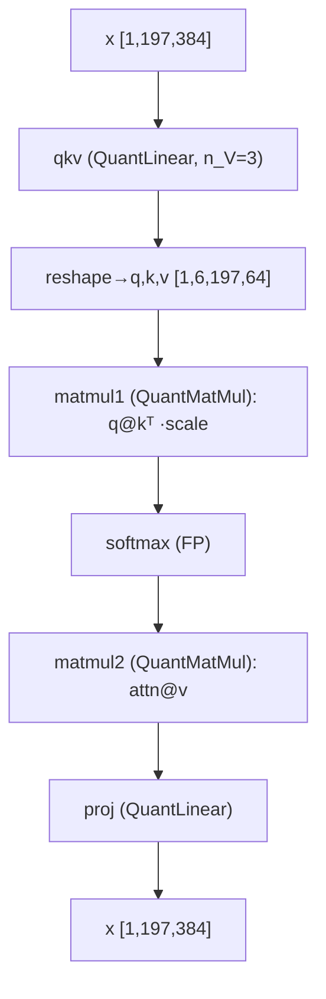

### 11.3 forward call stack
`wrap_modules_in_net`(`wrap_net.py:55`) → Attention forward 교체(`:57-60`) → 모듈 순회 치환: Conv2d(`:78-95`)/MatMul(`:96-110`)/Linear(`:111-151`). 추론시 `vit_attn_forward`(`:19-32`)가 matmul1/2·proj/qkv 호출.

### 11.4 대표 코드 위치
`wrap_net.py`: `vit_attn_forward` `:19-32`, `swin_attn_forward` `:35-52`, `wrap_modules_in_net` `:55-152`(Conv `:78`, MatMul `:96`, Linear `:111`, reparam 분기 `:128-142`, post_relu `:146`), `wrap_reparamed_modules_in_net` `:155-192`.

### 11.5 대표 코드 블록
```python
# wrap_net.py:111-124  Linear 치환: head는 qhead_a_bit, qkv는 n_V=3
if isinstance(module, nn.Linear):
    cur_a_bit = cfg.qhead_a_bit if 'head' in name else cfg.a_bit
    linear_kwargs = {..., 'w_bit': cfg.w_bit, 'a_bit': cur_a_bit,
                     'n_V': 3 if 'qkv' in name else 1, ...}
```

```python
# wrap_net.py:128-146  reparam 대상(qkv/fc1/reduction)은 channel-wise + prev_layer 연결, fc2는 post_relu
if cur_a_bit == cfg.w_bit and reparam and ('qkv' in name or 'reduction' in name or 'fc1' in name):
    new_module = AsymmetricallyChannelWiseBatchingQuantLinear(**linear_kwargs)
    if 'qkv' in name: new_module.prev_layer = grandfather_module.norm1
    if 'fc1' in name: new_module.prev_layer = grandfather_module.norm2
else:
    new_module = AsymmetricallyBatchingQuantLinear(**linear_kwargs, post_relu=('fc2' in name and recon))
```
→ `post_relu=True`(fc2 + recon)면 `fix_zp_zero`(`linear.py:274`)로 ReLU 출력 비음수 → zero-point 0 고정. MLP recon과 양자화의 정합.

### 11.6 연산·수치표현 분해 + 정량
- **양자화 방식**: timm 토폴로지를 양자화 레이어로 구성. softmax/act는 FP 유지.
- **params**: 0(래핑 로직). 가중치는 원본 복사(`:148-150`).
- **시사**: qkv `n_V=3`, head A4, conv A8, fc2 post_relu 등 **레이어별 비트폭·구조 정책**이 여기 집약 → FPGA 비트할당 정책 참조 테이블.

---

## 12. 모듈: 엔트리·평가 — `test_quant.py` + `utils/test_utils.py`

### 12.1 역할 + 상위/하위
- **역할**: PTQ 3단계(MLP재구성→캘리브→블록최적화) 오케스트레이션, config import, 체크포인트 save/load, ImageNet 평가.
- **상위**: CLI(`README.md:38-71`). **하위**: `MLPReconstructor`, `QuantCalibrator`, `BlockReconstructor`, `wrap_*`, `validate`.

### 12.2 데이터플로우
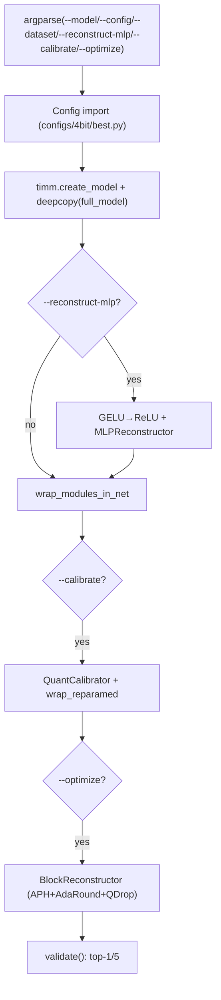

### 12.3 forward call stack
`main`(`test_quant.py:148`) → Config(`:155-159`) → model 빌드(`:200-203`) → (MLP recon `:233-234`) → `wrap_modules_in_net`(`:245`) → (calib `:258-260`) → (optimize `:271-272`) → `validate`(`:281-283`).

### 12.4 대표 코드 위치
`test_quant.py`: argparse `:45-96`, Config 로드+override `:151-172`, model_zoo `:180-194`, MLP recon `:215-241`, 래핑 `:243-247`, calib `:249-265`, optimize `:267-274`, eval `:279-283`. `test_utils.py`: `validate` `:10-54`, `accuracy` `:76-89`.

### 12.5 대표 코드 블록
```python
# test_quant.py:200-203  timm 모델 로드 + FP 기준(full_model) 보존
try:
    model = timm.create_model(model_zoo[args.model], checkpoint_path='./checkpoint/vit_raw/{}.bin'.format(...))
except:
    model = timm.create_model(model_zoo[args.model], pretrained=True)
full_model = copy.deepcopy(model)     # APH/recon의 FP 타깃 기준
```

```python
# test_quant.py:271-272  블록 최적화: APH metric + QDrop drop_prob
block_reconstructor = BlockReconstructor(model, full_model, calib_loader,
                                         metric=cfg.optim_metric, temp=cfg.temp, use_mean_hessian=cfg.use_mean_hessian)
block_reconstructor.reconstruct_model(quant_act=True, mode=cfg.optim_mode, drop_prob=cfg.drop_prob, keep_gpu=cfg.keep_gpu)
```

### 12.6 연산·수치표현 분해 + 정량 / 재현 명령
- **양자화 방식**: PTQ 3단계. 각 단계 독립 체크포인트 save/load(`:110-145`).
- **재현 명령** (`README.md:59`):
  ```bash
  python test_quant.py --model vit_small --config ./configs/3bit/best.py \
      --dataset ~/data/ILSVRC/Data/CLS-LOC --val-batchsize 500 \
      --reconstruct-mlp --calibrate --optimize
  ```
- **정확도**: ViT-S W4/A4 76.07, W3/A3 63.17(`README.md:80`). **속도/실측은 fake-quant + 본 세션 미실행 → 확인 불가.**
- **하이퍼파라미터(4bit best)**: optim_size=1024, calib_size=128, batch=32, eq_n=128, search_round=3, T=20, pct=0.98, drop_prob=0.5(`4bit/best.py:5-28`).

---

## N+1. 모듈 한눈 요약 표

| 모듈 | 파일:라인 | 역할 | 양자화 방식 | 대표 정량(ViT-S) |
|---|---|---|---|---|
| UniformQuantizer | uniform.py:7-43 | 균일 양자화 + QDrop | 대칭(W)/비대칭(A), round_ste | params≈scale수, O(N) div+round |
| AdaRoundQuantizer | adaround.py:7-76 | 학습형 weight 반올림 | floor + sigmoid(alpha) → hard | alpha=weight shape(442K/qkv), 종료시 del |
| QuantLinear(Asym) | linear.py:256-331 | 정수 Linear + percentile/MSE search | W4 ch-wise / A4 비대칭 per-tensor | block Linear 1.77M params, 348.5M MAC |
| QuantMatMul(Asym) | matmul.py:109-279 | QKᵀ/AV 양자화 행렬곱 | A4/B4 head-wise 비대칭 | block 29.8M MAC, attn A4 116KB |
| QuantConv2d(Asym) | conv.py:211-314 | PatchEmbed 양자화 conv | W4 ch-wise / 입력 A8 passthrough | 295K params, 57.8M MAC |
| reparam | linear.py:533-606 | channel→layer scale 흡수 | r/b를 prev/cur 가중치로 이전 | params 불변, act scale [1]로 축소 |
| QuantCalibrator | calibrator.py:9-83 | raw I/O 수집 + grad_hook + search | percentile+MSE observer | calib 128 img, CPU 캐시 |
| **APH+BlockRecon** | block_recon.py:228-372 | ±섭동 Hessian + AdaRound+QDrop | APH-가중 출력 재구성 손실 | 블록당 20000 it, T=20, δ=1e-6 |
| **MLPReconstructor** | mlp_recon.py:52-221 | GELU→ReLU + fc 재학습 + clamp | APH-가중 rec+quant loss | 1.18M/블록 직접 학습, pct=0.98 |
| wrap_net | wrap_net.py:55-192 | timm→양자화 모듈 치환 | 레이어별 비트폭·구조 정책 | qkv n_V=3, head A4, conv A8 |
| test_quant/eval | test_quant.py:148-289 | PTQ 3단계 + ImageNet 평가 | calib/optimize/recon 오케스트레이션 | ViT-S W4 76.07 |

---

## N+2. 학습·평가 파이프라인 + 재현 명령

- **데이터셋**: ImageNet (ILSVRC), 224×224, 1000 클래스(`test_quant.py:54,208-209`).
- **사전학습**: timm `vit_*/deit_*/swin_*` pretrained 또는 `checkpoint/vit_raw/*.bin`(`test_quant.py:200-202`, `README.md:24-30`).
- **PTQ 3단계 명령**(`README.md:59`):
  ```bash
  python test_quant.py --model vit_small --config ./configs/3bit/best.py \
      --dataset <DIR> --val-batchsize 500 --reconstruct-mlp --calibrate --optimize
  ```
  - `--reconstruct-mlp`: GELU→ReLU MLP 재구성(§10).
  - `--calibrate`: percentile+MSE scale 탐색 + reparam(§8).
  - `--optimize`: APH + AdaRound 블록 재구성(§9).
  - 단계별 체크포인트 load로 부분 재개 가능(`--load-{reconstruct,calibrate,optimize}-checkpoint`, `:67,72,77`).
- **config 종류**: `configs/{2,3,4}bit/{best, brecq_baseline, qdrop_baseline, brecq_qinp, ablation_brecq_hessian, ablation_avg, ...}.py` — APH vs BRECQ vs avg-Hessian, QDrop on/off 어블레이션(4bit best `4bit/best.py`, 3bit best `3bit/best.py` 확인).
- **평가**: `validate`가 calib set + test set 양쪽 top-1/5(`test_quant.py:280-283`, `test_utils.py:10-54`).
- **의존성**: PyTorch **1.10.0 권장**, **timm 0.9.2**(`README.md:17-22`), numpy, tqdm. **CUDA 필수**(0.3절 `EnvironmentError` 근거).
- **정확도**: §0.4 README 표. **latency는 fake-quant + 미실행 → 확인 불가.**

---

## N+3. 우리 프로젝트(FPGA ViT 가속) 시사점 + FPGA 친화도

### N+3.1 GELU→ReLU 교체 = MLP 비선형 회로 단순화의 직접 근거 (최우선)
- **MLP Reconstruction**(`test_quant.py:215-218`, `mlp_recon.py`): GELU(지수/erf, 회로 큼)를 **ReLU(비교기 1개)** 로 교체하고도 FP 정확도 유지(README "MLP Recon." 컬럼, ViT-B는 +0.30). → FPGA에서 MLP 후단 비선형을 **ReLU + `[0,ub]` clamp**로 구현 가능 → I-ViT의 IntGELU(시프트 지수 데이터패스)보다 단순. `ub`(98 percentile) clamp는 **활성 동적범위·비트폭 축소**에 직접 기여(추정). 본 repo의 FPGA 1순위 시사점.

### N+3.2 APH 민감도 맵 = 혼합정밀 비트할당 정책의 정량 근거
- `init_block_perturb_hessian`(`block_recon.py:228-248`)의 `raw_grad = mean|g₊−g₋|`는 **블록/출력차원별 양자화 민감도(곡률)** 를 산출. → 어느 블록/채널이 저비트에 취약한지를 정량화 → FPGA에서 민감 레이어만 고정밀(W4 vs W8), 둔감 레이어는 공격적 저비트로 자원 배분하는 mixed-precision 정책의 근거로 재사용 가능(추정).

### N+3.3 reparam = per-tensor 단일 scale 추론 (스케일 버스 단순화)
- `reparam`(`linear.py:578-606`)이 channel-wise activation scale을 가중치로 흡수 → 추론은 **layer-wise 단일 scale**. I-ViT의 dyadic per-channel requant와 달리 채널별 scale 버스가 불필요 → FPGA requant 회로/메타데이터 단순화(추정). 단 흡수는 SW calib 1회.

### N+3.4 FPGA 친화도 평가 (정수전용/곱셈기-free 관점)
| 항목 | 평가 | 근거 |
|---|---|---|
| 저비트 weight(W4/W3) | ★★★ SOTA 정확도 | README W4/A4 76.07(ViT-S), W3/A3 63.17 |
| MLP 비선형 단순화 | ★★★ GELU→ReLU+clamp | `test_quant.py:218`, `mlp_recon.py:149-150` |
| 혼합정밀 근거 | ★★★ APH 민감도 맵 | `block_recon.py:247-248` |
| requant 단순화 | ★★ reparam로 layer-wise scale | `linear.py:584-593` |
| **정수전용 실연산** | ✗ **fake-quant 시뮬레이션** | `uniform.py:33,36`(×scale=FP), softmax/act FP |
| 정수 비선형 커널 | ✗ softmax·LayerNorm FP 유지 | `wrap_net.py:26`(FP softmax), LN 미양자화 |
| PTQ 비용 | △ 블록당 20000 it 재구성 | `block_recon.py:272`, `mlp_recon.py:131` |

### N+3.5 I-ViT와의 상보성 + 권장 결합 (프로젝트 성격은 추정)
- **APHQ-ViT = "어떤 비트·분포로 양자화할지"(SW PTQ 정확도 회복)**, **I-ViT = "정수로 어떻게 연산할지"(integer-only 실연산·dyadic requant)**. 둘은 직교 — APHQ는 정수 실연산 커널이 없고(fake-quant), I-ViT는 W4A4 저비트 PTQ 검증이 없다.
- **권장 조합(추정)**: ① APHQ-ViT로 저비트(W4A4) 분포 적합·정확도 회복(특히 GELU→ReLU 교체) → ② 그 양자화 모델을 I-ViT식 정수 연산기(IntSoftmax/IntLayerNorm/dyadic requant)에 매핑 → FPGA 실시간 구동. APHQ의 ReLU 교체는 I-ViT의 IntGELU를 ReLU로 더 단순화할 여지를 줌.
- **XR 시선추적 적용(추정)**: APH 민감도로 시선추적 백본의 민감 레이어를 보호하면서 나머지를 공격적 저비트화 → 정확도-지연-자원 절충. 단 PTQ 재구성은 오프라인 1회, 추론 회로엔 영향 없음.

---

## 부록. 근거 / 확인 불가

- **직접 코드 확인**: §2~§12 전 라인 인용 — `quantizers/{uniform,adaround,_ste}.py`(전체), `quant_layers/{linear,matmul,conv}.py`(전체), `utils/{calibrator,block_recon,mlp_recon,wrap_net,test_utils}.py`(전체), `test_quant.py`(전체), `configs/{4,3}bit/best.py`. README(명령/결과 표).
- **분석적 산출(검증 가능)**: params/MACs는 ViT-S config(C=384, depth=12, H=6, dh=64, N=197, mlp_ratio=4)와 표준식으로 계산. activation memory는 shape×비트폭(fake-quant라 실제 텐서는 FP32, "HW 환산 비트" 표기).
- **추정**: 프로젝트 성격(FPGA+XR), GELU→ReLU의 HW 단순화 효과, APH 민감도의 혼합정밀 활용, reparam의 requant 단순화, I-ViT 결합 경로, 재구성 비용이 PTQ 시간 지배.
- **확인 불가(미열람/미실행/부재)**:
  - **정수 실연산 latency**: 본 repo는 fake-quant 시뮬레이션(`uniform.py:33,36`), 정수 커널·배포 코드 없음 → 속도/HW 실측 확인 불가.
  - `utils/datasets.py`(ImageNet 로더 세부) — 미열람.
  - `configs/2bit/*` 및 ablation config 세부 — best 외 일부 미열람(이름·용도만, §N+2).
  - **로그(log) 양자화 부재**: AdaLog 기반이나 본 repo의 `quantizers/`에는 logarithm 양자화기가 import되지 않음(`uniform.py`+`adaround.py`만 사용, `block_recon.py:9-10`, `mlp_recon.py:9-12` 근거) → APHQ-ViT는 **uniform 양자화 중심**(1차 요약의 "log 양자화 사용 여부 미확정"을 정정: 본 분석 범위 코드에서 log 양자화기 미존재 확인).
  - `Object-Detection/` 전체 — 외부 mmdetection으로 제외(이름만).
