# AdaLog 모듈 통합 가이드 (S-PyTorch)

> 1차 요약: [`../AdaLog.md`](../AdaLog.md) — 본 문서는 그 요약을 모듈 단위로 심화한 통합 가이드다.
> 분석 대상: `\\wsl.localhost\ubuntu-24.04\home\user\project\PRJXR-HBTXR\REF\ViT-Quantization\AdaLog`
> 작성 원칙: 실제 소스 Read 후 `파일:라인` 근거 표기. 라인 근거 없는 추론은 "추정", 코드로 확인 불가는 "확인 불가"로 명시.
> 형제 가이드(`REF/Analysis/ViT-Quantization/I-ViT/MODULE_GUIDE.md`)의 6요소 구조를 따르되, HW 지표는 **S-PyTorch 수치 규약**(params/FLOPs/activation memory/비트폭/observer + log base 수식)으로 치환한다.
> I-ViT(QAT, integer-only) ↔ AdaLog(PTQ, fake-quant) 동형 비교: I-ViT가 "정수 실행(dyadic)"을 다룬다면 AdaLog는 "분포 적합 + 시프트 친화 dequant(log base)"를 다룬다.

---

## 0. 문서 머리말

### 0.1 대표 케이스 선정
- **대표 모델: `deit_small_patch16_224` (DeiT-S)** — model_zoo 매핑 `'deit_small': 'deit_small_patch16_224'`(`test_quant.py:169`), argparse `--model` 기본값도 `deit_small`(`test_quant.py:47`). `embed_dim=384, depth=12, num_heads=6, mlp_ratio=4, patch16, img224`(timm 정의, 본 repo는 timm 모델을 래핑하므로 차원은 timm augreg/DeiT 표준 — 추정 근거: timm `deit_small_patch16_224`). 근거:
  1. argparse 기본 모델이 `deit_small`(`test_quant.py:47`)이고 README 예시·결과표에 DeiT-S가 포함(`README.md:39,82`)되어 공식 대표 케이스.
  2. 토큰 수 N=197(=14×14 패치+cls), C=384, H=6, dh=64는 post-Softmax(N² attn)·post-GELU(4C MLP) 활성이 모두 비자명한 크기로 활성화돼 log 양자화 분석 가치가 높음(추정 근거: patch16/img224).
- **대표 분석 단위: timm ViT 1개 Block** = `norm1 → Attention(qkv QuantLinear + matmul1 QuantMatMul(Q@Kᵀ) + softmax + matmul2 PostSoftmaxLog QuantMatMul(attn@V) + proj QuantLinear) → residual → norm2 → Mlp(fc1 QuantLinear + GELU + fc2 PostGeluLog QuantLinear) → residual`. forward는 timm 원본을 `vit_attn_forward`로 교체(`wrap_net.py:19-32`). DeiT-S는 이 Block을 12개 적층(timm depth=12).
- **대표 적응형 비선형 3종**: `AdaLogQuantizer`(적응형 log base, `logarithm.py:68-102`), `PostSoftmaxAsymmetricallyBatchingQuantMatMul`(attn@V의 A=softmax출력에 AdaLog + q 탐색, `matmul.py:286-378`), `PostGeluLogBasedBatchingQuantLinear`(fc2의 입력=GELU출력에 ShiftAdaLog + shift reparam, `linear.py:724-1007`) — FPGA 시프트/LUT 비선형 dequant의 직접 청사진.

### 0.2 S-PyTorch 수치 규약 (HW의 MAC lanes/scalar MACs 대체)
- **params**: 모듈 차원에서 분석적 계산. Linear `in·out (+out bias)`, Conv `Cout·Cin·Kh·Kw (+Cout)`. AdaLog 양자화 모듈은 `nn.Linear`/`nn.Conv2d`를 상속해 FP 가중치를 그대로 보존하고 forward마다 fake-quant(`linear.py:46-51`, `conv.py:60-65`)하므로 **추론 params 개수는 FP 원본과 동일**. 단 양자화기마다 소수의 **학습/버퍼 파라미터**(scale/zero_point/shift/q/table)가 추가됨(아래 모듈별 표기).
- **FLOPs/MACs**: 표준식×config. Linear MAC = `B·N·in·out`. Attention QKᵀ = `B·H·N²·dh`, AV = `B·H·N²·dh`(`wrap_net.py:22-28`). 대표 레이어 1개를 DeiT-S(B=1,N=197,C=384,H=6,dh=64)로 산출 후 12 block 환원. **캘리브레이션 비용**은 별도(scale/q 후보 탐색의 추가 FLOPs — 각 모듈 6장에서 정량).
- **activation memory**: 텐서 shape × 비트폭. AdaLog는 fake-quant라 실제 메모리는 FP32지만(`uniform.py:35`, `logarithm.py:97` 출력이 `(x_quant-zp)·scale` / `2^(-...)·scale`=float), **양자화 도메인 비트폭**(W/A/S bits)을 "HW 환산 activation bit"로 표기 — `shape × bit`.
- **비트폭/observer**: 코드 직접. 기본 W4/A4/S4(`configs/4bit.py:9-11`), conv 입력 A8(`qconv_a_bit=8`, `:12`), head 입력 A4(`qhead_a_bit=4`, `:13`). **n_levels = 2^(n_bits-1)** 공통(`uniform.py:12`, `logarithm.py:13`). per-channel(weight·matmul head)·per-tensor(activation) 비대칭(uniform)/log(post-softmax/GELU). observer = **percentile(0.9~1.0) 후보 + 유사도(-MSE) 탐색**(min/max EMA 아님 — PTQ).
- **정확도/속도**: README 결과표 인용(`README.md:77-85`). 본 세션 미실행 → 측정 불가 항목은 "확인 불가".

### 0.3 운영 경로 (PTQ 캘리브레이션 ↔ (선택) BRECQ 최적화 ↔ ImageNet 평가)
```
[timm FP 사전학습 모델 로드] timm.create_model(model_zoo[model], pretrained/checkpoint)   (test_quant.py:182-189)
   │  ./checkpoints/vit_raw/*.bin 우선, 실패 시 pretrained=True
   ▼
[양자화 모듈 치환] wrap_modules_in_net(model, cfg, reparam)   (test_quant.py:199, wrap_net.py:55-172)
   │  Attention forward 교체 + MatMul 주입 (wrap_net.py:19-64)
   │  Conv2d→Asym..Conv2d / Linear→Asym/ChannelWise/PostGeluLog / MatMul(matmul2)→PostSoftmaxLog
   ▼
[캘리브레이션] QuantCalibrator.batching_quant_calib()   (test_quant.py:212-213, calibrator.py:30-67)
   │  모듈별 forward hook으로 raw_input/raw_out 수집 → hyperparameter_searching() → (있으면) reparam()
   │  calib_size=32 (configs/4bit.py:5), 끝나면 전 모듈 mode='quant_forward' (calibrator.py:65-67)
   ▼
[reparam 모듈 환원] wrap_reparamed_modules_in_net(model)   (test_quant.py:214, wrap_net.py:175-210)
   │  ChannelWise(reparam 끝남) → 일반 Asymmetric 모듈로 교체 (state_dict 이전)
   ▼
[(선택) BRECQ 최적화] --optimize: BlockReconstructor.reconstruct_model()   (test_quant.py:223-231)
   │  block_recon.py (AdaRound + 블록 재구성, 미열람) ; finish_training→reparam_bias
   ▼
[shift bias 흡수] finish_training(model): reparam_bias()   (test_quant.py:130-133, 218/229, linear.py:999-1006)
   ▼
[ImageNet 평가] validate(val_loader, model, ...) → Top-1/5   (test_quant.py:208/221/238-240, utils/test_utils.py 미열람)
```
- 타깃 디바이스: **CUDA GPU 전제** — `_initialize_calib_parameters`가 `torch.cuda.get_device_properties`로 GPU 메모리 기반 `parallel_eq_n` 산정, CPU면 `raise EnvironmentError("CUDA is not available")`(`linear.py:113-117`, `matmul.py:97-101`, `conv.py:145-149`). 다수 `.cuda()`(`matmul.py:139-142`, `logarithm.py` LUT 등). → CPU 단독 실행 불가(코드 근거 확인, 실행 실패는 미검증).

### 0.4 모델 / 데이터셋 / 정확도 (README 인용, Top-1 %)
| Model | Full Prec. | W3A3(Calib) | W3A3(Retrain) | W4A4(Calib) | W4A4(Retrain) | W6A6(Calib) | 근거 |
|---|---|---|---|---|---|---|---|
| ViT-S | 81.39 | 13.88 | 62.50 | 72.75 | 77.25 | 80.91 | `README.md:79` |
| ViT-B | 84.54 | 37.91 | 76.73 | 79.68 | 83.13 | 84.80 | `README.md:80` |
| DeiT-T | 72.21 | 31.56 | 48.78 | 63.52 | 67.14 | 71.38 | `README.md:81` |
| **DeiT-S(대표)** | **79.85** | **24.47** | **63.24** | **72.06** | **76.36** | **79.39** | `README.md:82` |
| DeiT-B | 81.80 | 57.45 | 74.99 | 78.03 | 80.20 | 81.55 | `README.md:83` |
| Swin-S | 83.23 | 64.41 | 76.01 | 80.77 | 81.99 | 83.19 | `README.md:84` |
| Swin-B | 85.27 | 69.75 | 78.82 | 82.47 | 83.82 | 85.09 | `README.md:85` |
- "Calibrate" = PTQ 캘리브레이션만, "Retrain" = BRECQ 최적화(`--optimize`) 추가(`README.md:47,77`). 대표 W4A4: DeiT-S Calib 72.06 → BRECQ 76.36(FP 79.85). 저비트 W3A3는 BRECQ로 큰 회복(24.47→63.24).
- 데이터셋: **ImageNet (ILSVRC)** `--dataset <DATA_DIR>`(`README.md:43`, `test_quant.py:54,190-191`), 224×224(swin_base_384는 384).
- 속도(latency)/실제 정수커널: 본 repo는 **fake-quant 시뮬레이션**만 — 추론 latency·정수 커널은 **확인 불가**(I-ViT의 TVM 배포 같은 별도 경로 없음).

---

## 1. Repo / Layer 개요

AdaLog = ViT/DeiT/Swin을 **재학습 없이(PTQ) 저비트(W3/W4/W6) 양자화**하는 프레임워크(`README.md:1-3`). 핵심은 **adaptive logarithm base**: post-Softmax·post-GELU의 멱법칙(power-law)·long-tail 분포에 로그 양자화의 밑을 적응적으로 맞추되, dequant를 **시프트(2의 거듭제곱) + 소형 LUT**로 환원해 하드웨어 친화적으로 만든다(`README.md:3`). 본 repo는 **timm 모델 위에 얹은 커스텀 양자화 레이어/양자화기**가 자체 소스이고, 모델 정의·DataLoader·timm `Attention`/`WindowAttention`은 timm을 그대로 사용한다(`wrap_net.py:7-9`, `test_quant.py:182`).

### 1.1 자체 소스 vs 외부 프레임워크 vs 제외

| 구분 | 파일(자체 소스) | 역할 |
|---|---|---|
| **양자화기 기반** | `quantizers/_ste.py` | round_ste/floor_ste/ceil_ste (STE) |
| **로그 양자화기** | `quantizers/logarithm.py` ★핵심 | Log2/LogSqrt2/**AdaLog** + Shift(bias-reparam) 변형 |
| **균등 양자화기** | `quantizers/uniform.py` | Uniform/ShiftUniform/**TwinUniform** |
| **AdaRound** | `quantizers/adaround.py` | 학습형 반올림(BRECQ용, 미열람 — 확인 불가) |
| **양자화 Linear** | `quant_layers/linear.py` ★핵심 | MinMax→PTQSL→Asym→{ChannelWise(reparam), PostGeluTwin, **PostGeluLog**} |
| **양자화 MatMul** | `quant_layers/matmul.py` ★핵심 | MinMax→PTQSL→Asym→**PostSoftmaxLog** |
| **양자화 Conv** | `quant_layers/conv.py` | PatchEmbed용 Asym Conv2d |
| **모델 결선** | `utils/wrap_net.py` ★ | timm 모델→양자화 모듈 치환·Attention forward 교체 |
| **캘리브레이션** | `utils/calibrator.py` ★ | hook raw I/O 수집 + hyperparameter_searching 구동 + reparam |
| **블록 재구성** | `utils/block_recon.py` | BRECQ 블록 단위 최적화(미열람 — 확인 불가) |
| **엔트리** | `test_quant.py` | PTQ 캘리브/최적화/평가 전체 흐름, argparse |
| **설정** | `configs/4bit.py`(3bit/6bit 동형) | Config: 비트폭·탐색·최적화 |
| **보조** | `utils/test_utils.py`, `utils/datasets.py` | validate, ImageNet 로더(미열람 세부) |

### 1.2 forward 진입점
양자화 후 추론은 timm `VisionTransformer.forward` → 각 Block의 교체된 `vit_attn_forward`(`wrap_net.py:19-32`)를 탄다:
`qkv(QuantLinear)` → reshape → `matmul1(q, kᵀ)·scale`(QuantMatMul) → `softmax` → `matmul2(attn, v)`(PostSoftmaxLog QuantMatMul) → reshape → `proj(QuantLinear)`. MLP는 timm `Mlp`: `fc1(QuantLinear)` → GELU → `fc2(PostGeluLog QuantLinear)`. 각 양자화 모듈은 `mode`에 따라 raw(FP)/quant_forward 분기(`linear.py:26-37`, `matmul.py:28-35`). **I-ViT와 달리 scale을 명시 전파하지 않고** 각 모듈이 자기 입력을 독립적으로 fake-quant→dequant(float)해 다음 FP 연산에 넘김.

### 1.3 제외 (지시에 따라 이름만 표기, 미분석)
- **외부 프레임워크(커스텀 아님)**: `timm.create_model`, `timm.models.vision_transformer.Attention`, `timm.models.swin_transformer.WindowAttention`(`wrap_net.py:7-9`), timm `Mlp`/`VisionTransformer`/DataLoader 일부. ViT/DeiT/Swin **원본 사전학습 가중치**(timm `.bin`/`pretrained`) — 가중치만 로드.
- **미열람(확인 불가)**: `quantizers/adaround.py`, `utils/block_recon.py`(BRECQ 블록 재구성), `utils/test_utils.py`/`datasets.py`(validate/로더 세부), `configs/3bit.py`/`6bit.py`(4bit과 동형 추정 — w/a/s_bit만 다름). `swin_attn_forward`(`wrap_net.py:35-52`)는 ViT와 동일 양자화 모듈 재사용 확인.
- **비소스**: `.git/`, `__pycache__/`, `assets/framework.png`, `LICENSE`.

### 1.4 대표 모델 레이어 구성 (DeiT-S, 1 Block)
Linear 6개(qkv·proj·fc1·fc2 = QuantLinear 4) + MatMul 2(matmul1 Asym, matmul2 PostSoftmaxLog) + (PatchEmbed Conv 1, 전역 1회). 양자화기 배정(`wrap_net.py:122-171`): `qkv/fc1`→`AsymmetricallyChannelWise`(reparam, prev=norm1/norm2), `proj`→`Asymmetric`, `fc2`→`PostGeluLogBased`(adalog), `matmul2`→`PostSoftmaxLog`(adalog), `matmul1`→`Asymmetric`, `head`→`Asymmetric`(a_bit=qhead_a_bit).

---

## 2. 모듈: STE + 균등 양자화기 — `quantizers/uniform.py` (UniformQuantizer)

### 2.1 역할 + 상위/하위
- **역할**: FP 텐서를 **균등(선형) 양자화**. 대칭(zero-point 없음)/비대칭(zero-point 포함) 모두. weight·일반 activation·Q/K/V matmul 입력의 기본 양자화기. STE(`_ste.py`)로 round 미분 우회.
- **상위**: `MinMaxQuantLinear.w_quantizer/a_quantizer`(`linear.py:18-19`), `MinMaxQuantMatMul.A/B_quantizer`(`matmul.py:20-21`), `MinMaxQuantConv2d`(`conv.py:30-31`). **하위**: `round_ste`(`_ste.py:5-6`).

### 2.2 데이터플로우 (텐서 shape 흐름)
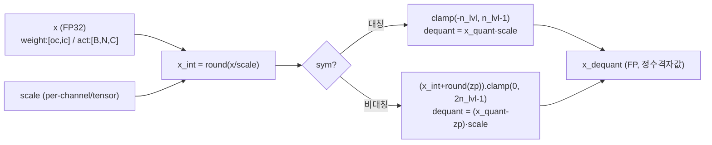

### 2.3 forward call stack
`MinMaxQuantLinear.quant_forward`(`linear.py:46`) → `quant_weight_bias`(`:48`)/`quant_input`(`:49`) → `UniformQuantizer.forward`(`uniform.py:25`) → `round_ste`(`_ste.py:5`) or `torch.round`(`uniform.py:29`).

### 2.4 대표 코드 위치
`uniform.py`: `UniformQuantizer.forward` `:25-36`, `n_levels` `:12`, `ShiftUniformQuantizer` `:42-50`, `TwinUniformQuantizer` `:53-68`. `_ste.py`: `round_ste` `:5-6`.

### 2.5 대표 코드 블록

```python
# uniform.py:25-36  대칭/비대칭 균등 양자화 (n_levels=2^(n_bits-1))
x_int = round_ste(x / self.scale) if self.training_mode else torch.round(x / self.scale)
if self.sym:
    x_quant = x_int.clamp(-self.n_levels, self.n_levels - 1)          # [-2^(b-1), 2^(b-1)-1]
    x_dequant = x_quant * self.scale
else:
    x_quant = (x_int + round_ste(self.zero_point)).clamp(0, 2 * self.n_levels - 1)  # [0, 2^b-1]
    x_dequant = (x_quant - round_ste(self.zero_point)) * self.scale
```
→ INT4(b=4)면 `n_levels=8`, 대칭 `[-8,7]` / 비대칭 `[0,15]`. **I-ViT는 항상 대칭(zp=0)**이었으나 AdaLog는 weight/act에 **비대칭(zero-point 포함)**을 기본으로 써 분포 비대칭을 흡수(`linear.py:258-263`).

```python
# uniform.py:42-50  ShiftUniform: shift로 분포 이동 후 양자화, reparam되면 shift 흡수
self.shift = nn.Parameter(torch.zeros((1)))
def forward(self, x):
    result = UniformQuantizer.forward(self, x + self.shift)
    return result if self.bias_reparamed else result - self.shift
```

```python
# uniform.py:57-67  TwinUniform: 양/음 두 스케일 분리 (PTQ4ViT식 post-GELU)
assert self.inited and self.scale.shape[0] == 2
x_pos = torch.round(x / self.scale[0]).clamp(0, self.n_levels-1).mul(self.scale[0])    # 양
x_neg = torch.round(x / self.scale[1]).clamp(-self.n_levels, 0).mul(self.scale[1])     # 음
x_dequant = (x_pos + x_neg).reshape_as(x)
```
→ post-GELU의 음수 꼬리(약 -0.17)와 양수 본체를 **독립 스케일**로 양자화 후 합산. AdaLog의 log 양자화 대안(`post_gelu_quantizer='ptq4vit'`).

### 2.6 연산·수치표현 분해 + 정량
- **양자화 방식**: 균등 선형. 대칭(zp 없음) 또는 비대칭(zp 포함). per-channel(weight, `channel_wise=True` `:18`) 또는 per-tensor(act).
- **scale/zp**: scale은 `nn.Parameter`(탐색 대상), zp는 `nn.Parameter`(비대칭) 또는 미존재(대칭).
- **비트폭**: weight W4, act A4, conv 입력 A8, head A4(`configs/4bit.py:9-13`). n_bits=32면 양자화 우회(`uniform.py:26`).
- **params(양자화기 부가)**: UniformQuantizer 자체는 scale/zp buffer/parameter만(weight 행수 또는 1). ShiftUniform은 shift `[1]` 추가. 추론 weight/bias params는 FP 원본 동일.
- **FLOPs**: 원소수 N에 대해 div+round+clamp+mul = O(N) 원소연산(forward마다 재계산).
- **activation bit**: 출력은 정수격자값이나 float dtype(`uniform.py:35`) → 실제 메모리 FP32, HW 환산 비트는 n_bits.

---

## 3. 모듈: 로그 양자화기 (Log2/LogSqrt2) — `quantizers/logarithm.py` (Log2Quantizer)

### 3.1 역할 + 상위/하위
- **역할**: 양수 활성을 **로그 도메인**에서 양자화. 양자화 인덱스가 곧 **2의 거듭제곱 지수 = 우측 시프트량**이라 dequant이 시프트로 환원. post-Softmax 확률(0~1), post-GELU 양수부 같은 long-tail 분포에 적합.
- **상위**: `PostSoftmaxAsymmetricallyBatchingQuantMatMul`(quantizer='log2'/'logsqrt2', `matmul.py:307-310`), `PostGeluLogBasedBatchingQuantLinear`(tmp_quantizer로 log2/logsqrt2 대안, `linear.py:754-761`). **하위**: `round_ste`.

### 3.2 데이터플로우 (텐서 shape 흐름)
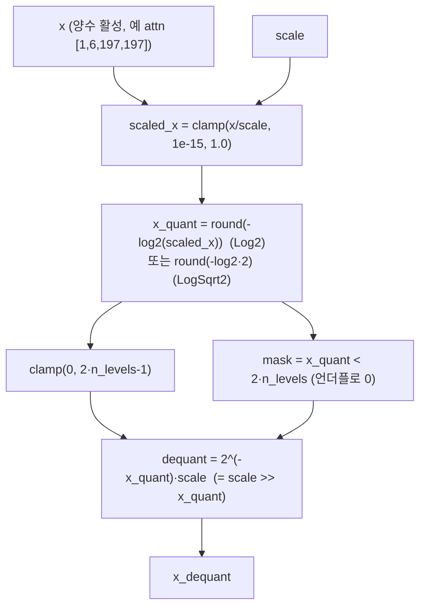

### 3.3 forward call stack
`AsymmetricallyBatching...quant_forward` → quantizer `forward` → `Log2Quantizer.forward`(`logarithm.py:25`) → `scaled_x.log2()`(`:30`) → `torch.round`/`round_ste`(`:30`).

### 3.4 대표 코드 위치
`logarithm.py`: `Log2Quantizer.forward` `:25-35`, `n_levels` `:13`, `LogSqrt2Quantizer.forward` `:45-62`, 홀짝 마스크 보정 `:59-60`.

### 3.5 대표 코드 블록

```python
# logarithm.py:29-34  Log2: 인덱스 = 지수, dequant = 시프트
scaled_x = (x / self.scale).clamp(min=1e-15, max=1.0)            # (0,1] 영역으로 정규화
x_quant = torch.round(-scaled_x.log2())                          # q = round(-log2(x/scale)) ≥ 0
mask = x_quant < 2 * self.n_levels                               # 표현 범위 초과는 언더플로
x_quant = torch.clamp(x_quant, 0, 2 * self.n_levels - 1)
x_dequant = 2 ** (-1 * x_quant) * self.scale                     # = scale · 2^(-q) = scale >> q
x_dequant = x_dequant * mask                                     # 범위 밖 → 0
```
→ INT4면 인덱스 `q∈[0,15]`(2·n_levels-1=15). dequant `scale·2^(-q)`는 **순수 우측 시프트**. 인덱스 q가 곧 시프트량이라 곱셈기-free. I-ViT의 IntSoftmax가 정수 지수+reciprocal로 softmax를 만든다면, AdaLog는 softmax **출력 확률**을 로그 양자화한다(역할이 상보적).

```python
# logarithm.py:56-60  LogSqrt2: 밑 √2 → 더 촘촘한 로그 그리드, 홀짝 보정
x_quant = torch.round(-scaled_x.log2() * 2)                      # 밑 √2 = 두 배 해상도
odd_mask = (x_quant % 2) * (math.sqrt(2) - 1) + 1                # 홀수 인덱스에 √2 보정
x_dequant = 2 ** (-1 * torch.ceil(x_quant / 2)) * odd_mask * self.scale
```
→ 밑 √2는 정수 시프트(`2^(-⌈q/2⌉)`) + 홀수일 때 √2 곱(소형 상수 1개)로 분해. AdaLog의 일반화(임의 밑) 직전 단계.

### 3.6 연산·수치표현 분해 + 정량
- **양자화 방식**: 로그 비균등. 인덱스 = `round(-log2(x/scale))`, dequant = `2^(-q)·scale`. 입력은 양수 가정(`clamp(1e-15,1)`).
- **scale/zp**: scale 1개(per-tensor), zp 없음(로그는 단방향). 음수는 Shift 변형이 처리(5장).
- **비트폭**: 인덱스 범위 `[0, 2·n_levels-1]` = `[0, 2^b-1]`(post-softmax s_bit=4면 [0,15]).
- **params**: scale buffer만(`logarithm.py` scale은 상위에서 Parameter 지정).
- **FLOPs**: 원소당 div + log2 + round + clamp + 시프트(2^-q) = O(N). attn [1,6,197,197]=233K 원소.
- **activation bit**: 출력 FP(정수격자값), HW 환산 s_bit. **시사**: dequant이 시프트라 후단 활성 dequant 회로가 배럴 시프터.

---

## 4. 모듈: AdaLog 적응형 로그 양자화기 — `quantizers/logarithm.py` (AdaLogQuantizer) ★핵심

### 4.1 역할 + 상위/하위
- **역할**: 로그 양자화의 **밑을 적응적으로 변경**. `r=37` 고정, `q`(버퍼, 캘리브레이션으로 탐색)로 밑 `= 2^(q/r)`(주석 표기 `log2 base = 1/k, k=r/q`). 비정수 밑을 **정수 시프트(table1) + 소형 LUT(table2)**로 분해해 임의 밑을 하드웨어 친화적으로 근사. AdaLog의 핵심 발명.
- **상위**: `PostSoftmaxAsymmetricallyBatchingQuantMatMul`(adalog, `matmul.py:311-315`), `ShiftAdaLogQuantizer`(`logarithm.py:127-135`)를 통해 `PostGeluLogBasedBatchingQuantLinear`(`linear.py:747`). **하위**: `round_ste`, `math.floor`, `np`/`torch` 거듭제곱.

### 4.2 데이터플로우 (텐서 shape 흐름, 평가모드)
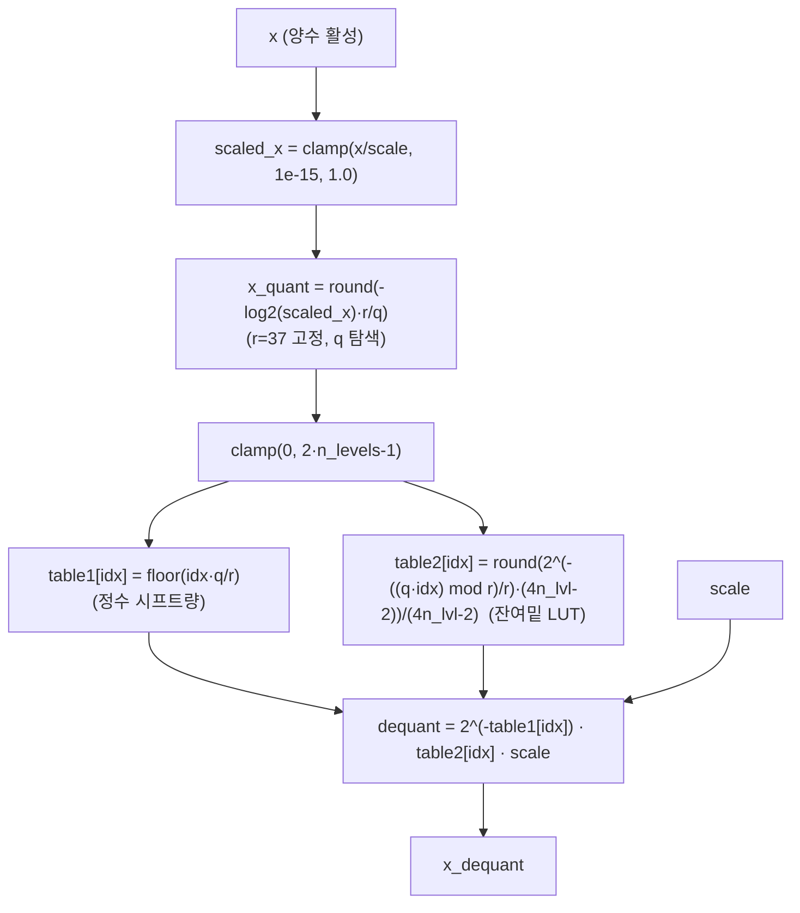

### 4.3 forward call stack
`update_table()`(캘리브레이션 시, `logarithm.py:77-81`) → `AdaLogQuantizer.forward`(`:83`) → `scaled_x.log2()·r/q`(`:94`) → `table1[idx]`·`table2[idx]` 조회(`:97`). q 갱신은 상위 `_search_best_A_log_base`(`matmul.py:321-358`)/`_search_best_log_base`(`linear.py:856-896`).

### 4.4 대표 코드 위치
`logarithm.py`: 클래스 `:68-102`, `r=37`/`q` 버퍼 `:71-72`, `table1/table2` `:73-74`, `update_table` `:77-81`, 평가 forward `:93-97`.

### 4.5 대표 코드 블록

```python
# logarithm.py:71-81  적응형 밑 = 2^(q/r), LUT 사전계산
self.r = 37.0
self.register_buffer('q', torch.tensor([int(self.r)]))           # 초기 q=37 → 밑 2^(37/37)=2 (=Log2)
self.register_buffer('table1', torch.zeros((self.n_levels * 2))) # 정수 시프트량 LUT
self.register_buffer('table2', torch.zeros((self.n_levels * 2))) # 잔여(비정수) 밑 LUT
def update_table(self):
    for i in range(0, self.n_levels * 2):
        val = round((2 ** (-((self.q.item()*i) % self.r) / self.r)) * (4*self.n_levels-2)) / (4*self.n_levels-2)
        self.table1[i].data.copy_(torch.tensor(math.floor(i * self.q.item() / self.r)))  # ⌊i·q/r⌋
        self.table2[i].data.copy_(torch.tensor(val))             # 2^(-((q·i) mod r)/r) 를 (4n_lvl-2)격자로 양자화
```
→ `i·q/r = ⌊i·q/r⌋ + ((i·q) mod r)/r`로 분해. 정수부 `⌊i·q/r⌋`=시프트량(table1), 소수부 `2^(-(...)/r)`=잔여 밑(table2). table 크기 `2·n_levels`(W4면 16 엔트리).

```python
# logarithm.py:94-97  평가 forward: 시프트 + 작은 LUT 곱으로 dequant
x_quant = torch.round(-scaled_x.log2() * self.r / self.q)        # 적응형 밑 인덱스
x_quant = torch.clamp(x_quant, 0, 2 * self.n_levels - 1)
x_dequant = (2 ** (-self.table1[x_quant.long()])) * self.table2[x_quant.long()] * self.scale
#            └ 정수 시프트(table1) ┘   └ 소형 LUT 곱(table2) ┘
```
→ **비정수 log 밑을 "정수 우측 시프트 + 16엔트리 LUT 곱"으로 환원**. 이것이 AdaLog가 임의 밑을 하드웨어에 올리는 메커니즘. q=37이면 밑=2(Log2와 동일), q≠37이면 적응형.

```python
# logarithm.py:88-92  학습모드(BRECQ): round_ste + 직접 거듭제곱(LUT 미사용, 미분가능)
x_quant = round_ste(-scaled_x.log2() * self.r / self.q)
x_dequant = 2 ** (-1 * x_quant * self.q / self.r) * self.scale   # 연속 밑 2^(q/r)
```
→ 학습(최적화)에서는 LUT 대신 연속식으로 그래디언트 흐름 유지, 평가에서 LUT로 전환.

### 4.6 연산·수치표현 분해 + 정량
- **양자화 방식**: 적응형 로그. 밑 `2^(q/r)`, `r=37` 고정(`logarithm.py:71`), q 탐색. dequant = `2^(-table1)·table2·scale`.
- **scale/zp**: scale 1개(per-tensor), q 버퍼 1개. zp 없음(로그). Shift 변형이 음수 처리(5장).
- **비트폭**: 인덱스 `[0, 2^b-1]`. LUT 2개 각 `2·n_levels` 엔트리(W4=16, W6=64).
- **params(부가)**: q `[1]`, table1 `[2n_lvl]`, table2 `[2n_lvl]`, scale `[1]`. 추론용 학습 파라미터는 사실상 q + scale.
- **FLOPs**: 평가 forward 원소당 div+log2+round+clamp + LUT 2회 조회 + 시프트 + 곱 ≈ O(N). `update_table`은 캘리브레이션 시 `2·n_levels`회 Python 루프(W4=16, 무시 가능).
- **시사**: I-ViT의 dyadic(`m/2^e`, 정수곱+시프트)과 동형으로, AdaLog는 **`2^(-table1)`(시프트) × `table2`(LUT 상수)**로 dequant → FPGA에서 배럴 시프터 + 16엔트리 ROM. r=37은 경험적 상수(`:71`).

---

## 5. 모듈: Shift 변형 (Bias Reparameterization) — `quantizers/logarithm.py` (ShiftAdaLogQuantizer)

### 5.1 역할 + 상위/하위
- **역할**: 로그 양자화는 양수만 다루는데, post-GELU 활성은 음수 꼬리(약 -0.17)를 가짐. `shift`(학습 파라미터)로 분포를 양수 영역으로 이동 → 로그 양자화 적용 → 추론 시 shift를 **이전 레이어 bias로 흡수(reparam)**해 런타임 가산 제거.
- **상위**: `PostGeluLogBasedBatchingQuantLinear.a_quantizer = ShiftAdaLogQuantizer`(`linear.py:747`). `reparam_bias`(`linear.py:999-1006`)가 shift를 흡수. ShiftLog2/ShiftLogSqrt2도 동형(`logarithm.py:105-124`). **하위**: `AdaLogQuantizer.forward`.

### 5.2 데이터플로우 (텐서 shape 흐름)
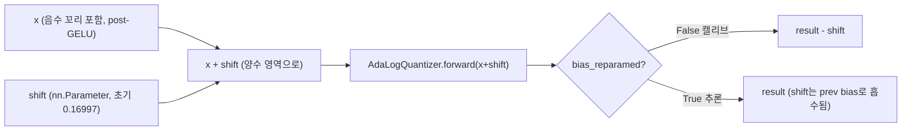

### 5.3 forward call stack
`PostGeluLog..quant_forward`(`linear.py:46`→`quant_input`) → `ShiftAdaLogQuantizer.forward`(`logarithm.py:133`) → `AdaLogQuantizer.forward(x+shift)`(`:134`) → reparam 여부 분기(`:135`). 흡수는 `reparam_bias`(`linear.py:999-1006`).

### 5.4 대표 코드 위치
`logarithm.py`: `ShiftAdaLogQuantizer` `:127-135`, shift/bias_reparamed `:130-131`. `linear.py`: shift 초기값 `:749`, `reparam_bias` `:999-1006`.

### 5.5 대표 코드 블록

```python
# logarithm.py:127-135  ShiftAdaLog: shift로 이동 후 로그 양자화, reparam되면 shift 미감산
self.shift = nn.Parameter(torch.zeros((1)))
self.register_buffer('bias_reparamed', torch.tensor(False))
def forward(self, x):
    result = AdaLogQuantizer.forward(self, x + self.shift)        # 양수 영역에서 로그 양자화
    return result if self.bias_reparamed else result - self.shift # reparam 전엔 shift 되돌림
```

```python
# linear.py:749  shift 초기값 = GELU 음수 하한 근사 (post-GELU 최소값 ≈ -0.17)
self.a_quantizer.shift.data.copy_(torch.tensor(0.16997124254703522))
```
→ GELU(x)=x·Φ(x)의 전역 최솟값 ≈ -0.16997. shift를 이 값으로 두면 입력이 거의 ≥0이 되어 로그 양자화 가능.

```python
# linear.py:999-1006  reparam_bias: shift를 이전 레이어(=fc2 자신)의 bias로 흡수
def reparam_bias(self):
    if self.a_quantizer.bias_reparamed: return
    x_ = torch.full((1, self.in_features), -self.a_quantizer.shift.item()).cuda()
    w_sim, bias_sim = self.quant_weight_bias()
    x_ = (x_ @ w_sim.transpose(0, 1)).squeeze()                  # (-shift)·W : shift 제거항 사전계산
    self.bias.data.copy_(bias_sim + x_)                         # bias에 흡수
    self.a_quantizer.bias_reparamed.data.copy_(torch.tensor(True))
```
→ `Linear((x+shift)_quant·... - shift)` 대신 `-shift`를 weight에 통과시킨 항 `(-shift)·Wᵀ`를 bias에 더해 런타임 shift 감산을 제거. `finish_training`(`test_quant.py:130-133`)이 전 모듈에 호출. **하드웨어에서 추가 가산기 없이 균일 파이프라인 유지**의 핵심.

### 5.6 연산·수치표현 분해 + 정량
- **양자화 방식**: shift(상수 가산) + AdaLog 로그 양자화. reparam으로 shift를 정적 bias에 융합.
- **scale/zp**: AdaLog와 동일 + shift `[1]`(Parameter).
- **비트폭**: AdaLog와 동일(post-GELU a_bit=4).
- **params(부가)**: shift `[1]`, bias_reparamed `[1]`. reparam 후 추가 런타임 연산 0(bias에 흡수).
- **FLOPs**: 캘리브레이션 시 원소당 가산 1(+shift) + 감산 1(-shift). 추론(reparam 후) 부가 가산 0.
- **시사**: I-ViT가 residual을 dyadic으로 정수 정렬했다면, AdaLog는 **비대칭 분포를 static bias로 흡수**해 zero-point 보정 로직을 제거. FPGA에서 post-GELU 경로를 "시프트 dequant only"로 유지.

---

## 6. 모듈: 양자화 Linear (Asymmetric) — `quant_layers/linear.py` (AsymmetricallyBatchingQuantLinear)

### 6.1 역할 + 상위/하위
- **역할**: `nn.Linear`를 상속, weight를 per-channel(행 그룹 n_V) **비대칭** 양자화, activation을 per-tensor 비대칭 양자화. 캘리브레이션에서 percentile 후보 → 유사도(-MSE) 탐색(또는 FPCS)으로 scale/zp 선정. `proj/matmul1 입력/head` 등 일반 Linear 담당.
- **상위 계층**: `MinMaxQuantLinear`(`:8`)→`PTQSLQuantLinear`(`:64`)→`PTQSLBatchingQuantLinear`(`:95`)→`AsymmetricallyBatchingQuantLinear`(`:238`). `wrap_net.py:165`가 일반 Linear에 배정. **하위**: `UniformQuantizer`, `calculate_percentile_*_candidates`, `_search_best_*_scale`.

### 6.2 데이터플로우 (텐서 shape 흐름, DeiT-S proj 예 [*,384]→[*,384])
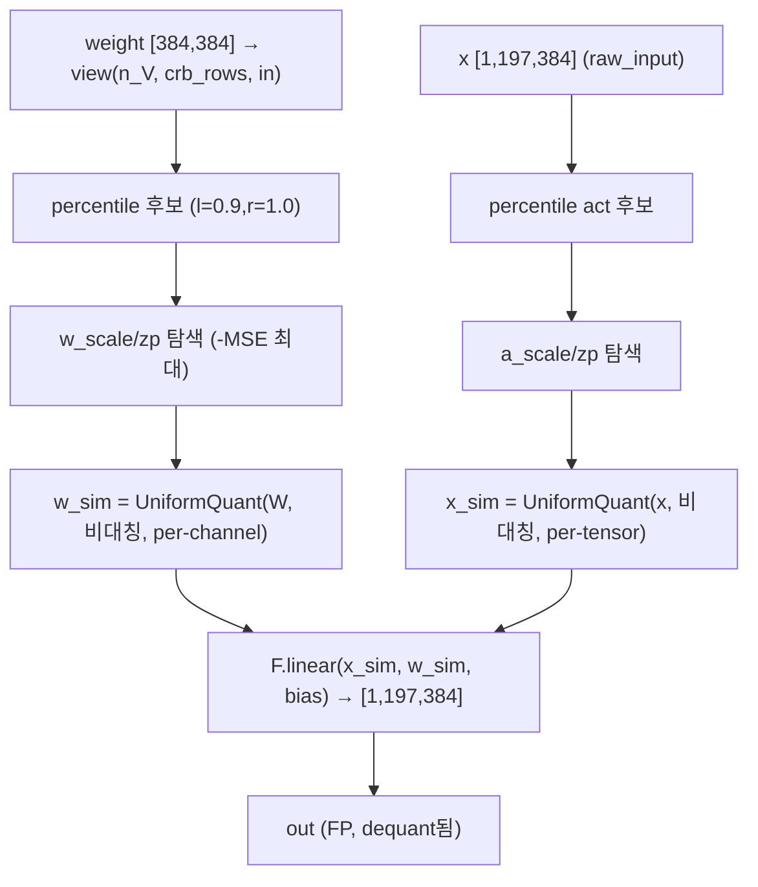

### 6.3 forward call stack
추론: `MinMaxQuantLinear.forward`(`linear.py:26`) → `quant_forward`(`:46`) → `quant_weight_bias`(`:48`, per-channel w_quant) + `quant_input`(`:49`, a_quant) → `F.linear`(`:50`). 캘리브레이션: `hyperparameter_searching`(`:525`) → `weight_fpcs`/`activation_fpcs`(`:483/504`) → `_search_best_w_scale`/`_search_best_a_scale`(`:355/394`).

### 6.4 대표 코드 위치
`linear.py`: 클래스 `:238-621`, 비대칭 quantizer 셋업 `:257-263`, weight/act scale 초기화 `:265-294`, percentile 후보 `:432-481`, FPCS `:483-523`, `hyperparameter_searching` `:525-545`, 추론 `quant_forward` `:46-51`.

### 6.5 대표 코드 블록

```python
# linear.py:257-263  weight per-channel 비대칭 + activation per-tensor 비대칭
self.w_quantizer = UniformQuantizer(n_bits=w_bit, symmetric=False, channel_wise=True)
self.a_quantizer = UniformQuantizer(n_bits=a_bit, symmetric=False, channel_wise=False)
self.w_quantizer.scale = nn.Parameter(torch.zeros((n_V, self.crb_rows, 1)))   # 행 그룹별
self.w_quantizer.zero_point = nn.Parameter(torch.zeros((n_V, self.crb_rows, 1)))
```
→ `n_V`=weight 행 그룹 수(qkv는 3, 그 외 1, `wrap_net.py:134`), `crb_rows = out_features//n_V`(`linear.py:82`). I-ViT의 per-out-channel과 유사하나 **그룹 단위 + 비대칭(zp)**.

```python
# linear.py:432-449  weight scale 후보: percentile(0.9~1.0) + zero-point 격자
num_zp = min(16, self.w_quantizer.n_levels)
num_scale = int(self.eq_n / num_zp)                              # eq_n=128 → scale·zp 곱 격자
w_uppers_candidates = torch.quantile(self.weight.view(self.n_V, self.crb_rows, self.in_features),
                                     torch.tensor([l, r]).to(...), dim=-1)   # 0.9/1.0 분위
# ... delta_min/delta_max 사이를 num_scale 등분, zp는 [n_lvl-num_zp/2, n_lvl+num_zp/2)
```
→ min/max 대신 **percentile(0.9~1.0)**로 이상치 견고. scale×zp 후보를 격자로 만들어 동시 탐색.

```python
# linear.py:46-51  추론: weight·activation 모두 fake-quant 후 표준 F.linear
def quant_forward(self, x):
    w_sim, bias_sim = self.quant_weight_bias()                  # per-channel 비대칭 W
    x_sim = self.quant_input(x)                                 # per-tensor 비대칭 A
    out = F.linear(x_sim, w_sim, bias_sim)                      # FP 행렬곱 (정수격자값 입력)
    return out
```
→ **I-ViT와 결정적 차이**: I-ViT는 `F.linear(x_int, weight_integer)·bias_scale`로 정수 MAC + 명시 dequant. AdaLog는 dequant된 float을 `F.linear`에 넣음(fake-quant). 정수 실행 커널 없음.

### 6.6 연산·수치표현 분해 + 정량 (DeiT-S, B=1, N=197)
- **양자화 방식**: weight per-channel(n_V 그룹) 비대칭 W4, activation per-tensor 비대칭 A4(또는 head A4, conv A8).
- **scale/zp**: w_scale/zp `[n_V, crb_rows, 1]`, a_scale/zp `[1]`. percentile+탐색으로 결정.
- **비트폭**: W4 / A4(`configs/4bit.py:9-10`).
- **params** (DeiT-S 1 block, C=384 — FP 가중치, 추론 기준):
  - qkv: 384×1152 + 1152 = **443,520** (ChannelWise로 처리, 7장)
  - proj: 384×384 + 384 = **147,840**
  - fc1: 384×1536 + 1536 = **591,360** (ChannelWise)
  - fc2: 1536×384 + 384 = **590,208** (PostGeluLog, 8장)
  - Linear params/block ≈ **1.773M**, ×12 ≈ **21.27M**.
  - 양자화기 부가 params: 모듈당 w_scale/zp `[n_V·crb_rows·2]` + a_scale/zp `[2]` (kB 미만).
- **MACs/block** (B=1, N=197): qkv 87.1M, proj 29.0M, fc1 116.2M, fc2 116.2M → Linear MAC/block ≈ **348.5M**, ×12 ≈ **4.18G**(Attention matmul 제외, I-ViT와 동일 구조라 동수치).
- **캘리브레이션 비용**: scale 후보 `eq_n=128`(`configs/4bit.py:18`), search_round=3, FPCS steps=6 → 모듈당 `O(eq_n·search_round)` fake-forward(GPU 메모리로 `parallel_eq_n` 병렬, `linear.py:118-121`).
- **activation bit**: 출력 FP, HW 환산 A4.

---

## 7. 모듈: 채널별 활성 + LayerNorm reparam — `quant_layers/linear.py` (AsymmetricallyChannelWiseBatchingQuantLinear)

### 7.1 역할 + 상위/하위
- **역할**: 입력 활성을 **per-channel(in_features축) 비대칭** 양자화. 채널별 scale을 평균 scale로 통일하고 그 비율 `r`을 **이전 LayerNorm의 weight/bias로 흡수**(LayerNorm-Linear fusion식 reparam) → 채널별 분산을 정적 융합으로 제거. `qkv/fc1/reduction`(LayerNorm 직후 Linear)에 배정.
- **상위 계층**: `AsymmetricallyBatchingQuantLinear`(`:238`)→`AsymmetricallyChannelWiseBatchingQuantLinear`(`:548`). `wrap_net.py:139-153`가 prev_layer(norm1/norm2/norm)를 연결. **하위**: `UniformQuantizer(channel_wise)`, `reparam_step1`.

### 7.2 데이터플로우 (텐서 shape 흐름)
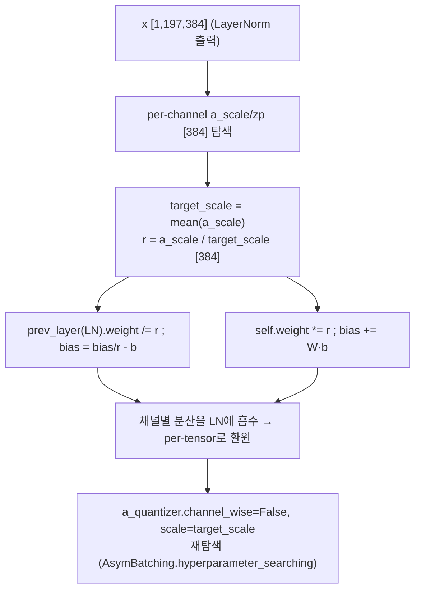

### 7.3 forward call stack
캘리브레이션: `hyperparameter_searching`(`linear.py:585`) → `activation_fpcs`/`_search_best_a_scale_self`(채널별, `:590-593`) → `calibrator.py:60-62`가 `reparam()` 호출 → `reparam_step1`(`:596`) → `AsymmetricallyBatchingQuantLinear.hyperparameter_searching`(`:621`, 환원 후 재탐색). 추론은 6장과 동일(`wrap_reparamed_modules_in_net`가 일반 Asym으로 교체, `wrap_net.py:188-209`).

### 7.4 대표 코드 위치
`linear.py`: 클래스 `:548-621`, 채널별 a_quantizer `:565-568`, prev_layer property `:571-583`, `reparam_step1` `:596-612`, `reparam` `:614-621`.

### 7.5 대표 코드 블록

```python
# linear.py:565-568  입력 활성을 채널별(in_features) 비대칭 양자화
self.a_quantizer = UniformQuantizer(n_bits=a_bit, symmetric=False, channel_wise=True)
self.a_quantizer.scale = nn.Parameter(torch.zeros((in_features)))      # 채널마다 scale
self.a_quantizer.zero_point = nn.Parameter(torch.zeros((in_features)))
```

```python
# linear.py:596-611  채널별 scale 비율 r을 이전 LayerNorm으로 흡수
channel_min = -self.a_quantizer.zero_point * self.a_quantizer.scale
target_channel_scale = torch.mean(self.a_quantizer.scale).view(1)     # 평균 scale로 통일
r = (self.a_quantizer.scale / target_channel_scale)                   # 채널별 비율
b = channel_min / r - target_channel_min
self.prev_layer.weight.data = self.prev_layer.weight.data / r         # LN weight 보정
self.prev_layer.bias.data = self.prev_layer.bias.data / r.view(-1) - b # LN bias 보정
self.weight.data = self.weight.data * r.view(1, -1)                   # Linear weight 역보정
if self.bias is not None:
    self.bias.data = self.bias.data + torch.mm(self.weight.data, b.reshape(-1,1)).reshape(-1)
```
→ `LN(x)·γ → Linear(W)` 를 `LN(x)·(γ/r) → Linear(W·r)`로 재배치(수학적 등가). 채널별 동적범위를 LN affine에 흡수해 Linear 입력을 **per-tensor**로 환원 가능 → 양자화 단순화.

```python
# linear.py:614-621  reparam 후 per-tensor로 환원하고 재탐색
def reparam(self):
    r, b, target_channel_scale, target_channel_zero_point = self.reparam_step1()
    self.raw_input = (self.raw_input.cuda() / r - b).cpu()           # raw_input도 동일 변환
    self.a_quantizer.channel_wise = False                            # per-tensor로 전환
    self.a_quantizer.scale = nn.Parameter(target_channel_scale)
    AsymmetricallyBatchingQuantLinear.hyperparameter_searching(self) # 환원 분포로 재탐색
```

### 7.6 연산·수치표현 분해 + 정량
- **양자화 방식**: 채널별 비대칭 → LN 융합 → per-tensor 비대칭으로 환원. 추론 시엔 일반 Asym Linear와 동일(`wrap_net.py:204`).
- **scale/zp**: 캘리브레이션 중 a_scale/zp `[in_features]`, reparam 후 `[1]`.
- **비트폭**: W4/A4(reparam 대상은 `cur_a_bit == w_bit` 조건, `wrap_net.py:139`).
- **params(부가)**: 캘리브 중 채널별 scale/zp `[in_features×2]`, reparam 후 `[2]`. **prev_layer(LN) weight/bias가 정적 수정**됨(추론 params 개수 불변, 값만 변경).
- **FLOPs**: 추론 부가 0(reparam은 캘리브 시 1회). 캘리브 시 채널별 탐색이 per-tensor보다 비싸나 1회성.
- **시사**: I-ViT가 IntLayerNorm으로 LN을 정수화했다면, AdaLog는 **LN affine을 양자화 reparam의 자유도로 활용**(채널 분산 흡수). FPGA에서 LN+Linear 결합 데이터패스 시 채널별 보정 불요.

---

## 8. 모듈: Post-GELU 로그 Linear — `quant_layers/linear.py` (PostGeluLogBasedBatchingQuantLinear) ★FPGA 1순위

### 8.1 역할 + 상위/하위
- **역할**: `fc2`의 입력(=GELU 출력)을 **ShiftAdaLog**로 양자화. shift(0.16997)로 음수 꼬리 이동 → AdaLog 로그 양자화 → q(log base) + scale 동시 탐색 → 추론 시 shift는 bias로 흡수. post-GELU의 멱법칙 분포에 시프트+LUT dequant 적용. **본 프로젝트 비선형 가속 1순위**(log dequant이 시프트라 곱셈기-free).
- **상위 계층**: `AsymmetricallyBatchingQuantLinear`(`:238`)→`PostGeluLogBasedBatchingQuantLinear`(`:724`). `wrap_net.py:154-159`가 `fc2`+post_gelu_quantizer∈{adalog,log2,logsqrt2}에 배정. **하위**: `ShiftAdaLogQuantizer`, `positive_percentile`, `_search_best_log_base`, `activation_fpcs`.

### 8.2 데이터플로우 (텐서 shape 흐름, DeiT-S fc2 [*,1536]→[*,384])
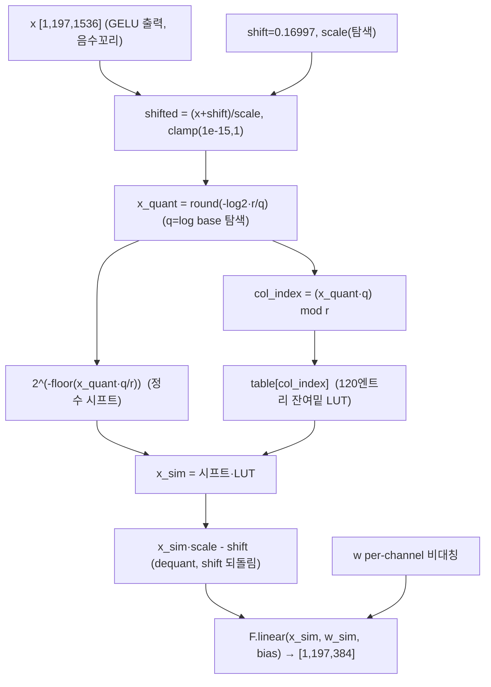

### 8.3 forward call stack
캘리브레이션: `hyperparameter_searching`(`linear.py:969`) → `_search_best_w_scale_self`(`:972/975`) → `calculate_percentile_activation_candidates`(`:976`, positive_percentile) → 루프: `activation_fpcs`(`:982`) 또는 `_search_best_log_base`(`:985`)+`_search_best_a_scale`(`:986`). 추론: `quant_input` → `ShiftAdaLogQuantizer.forward`(`logarithm.py:133`). shift 흡수 `reparam_bias`(`:999`).

### 8.4 대표 코드 위치
`linear.py`: 클래스 `:724-1007`, ShiftAdaLog + table 셋업 `:746-752`, `positive_percentile` `:763-798`, percentile 후보 `:800-814`, `_search_best_a_scale` `:816-854`, `_search_best_log_base` `:856-896`, `_search_best_scale_logbase` `:898-939`, `activation_fpcs` `:941-967`, `hyperparameter_searching` `:969-997`, `reparam_bias` `:999-1006`.

### 8.5 대표 코드 블록

```python
# linear.py:746-752  ShiftAdaLog + post-GELU shift 초기값 + 잔여밑 LUT(120엔트리)
self.a_quantizer = ShiftAdaLogQuantizer(n_bits=a_bit, symmetric=False, channel_wise=False)
self.a_quantizer.shift.data.copy_(torch.tensor(0.16997124254703522))   # GELU 최소값 근사
self.table = torch.tensor([2 ** (-j/self.a_quantizer.r) for j in range(120)])  # 2^(-j/37)
self.table_scale = 1. / (4 * self.a_quantizer.n_levels - 2)
self.table = torch.round(self.table / self.table_scale) * self.table_scale     # LUT 격자 양자화
```
→ table[j] = `2^(-j/37)`를 `(4n_lvl-2)` 격자로 양자화 → 잔여 밑 LUT(`col_index`로 조회). AdaLogQuantizer.table2와 동일 원리, 탐색용 미리 펼친 형태.

```python
# linear.py:830-837  log base 적용: 시프트 + LUT (forward 시뮬레이션과 동일)
shifted_x_sim = ((x_sim + self.a_quantizer.shift) / cur_a_scale).clamp(min=1e-15, max=1.0)
x_sim_quant = torch.round(-shifted_x_sim.log2() * self.a_quantizer.r / self.a_quantizer.q)
index = torch.remainder(x_sim_quant * self.a_quantizer.q, self.a_quantizer.r).round_().long()
x_sim = (2 ** (-1 * torch.floor(x_sim_quant * self.a_quantizer.q / self.a_quantizer.r))) * self.table.to(x.device)[index]
x_sim[mask] = 0
x_sim = (x_sim * cur_a_scale - self.a_quantizer.shift)...        # dequant 후 shift 되돌림
```
→ `2^(-⌊x_quant·q/r⌋)`(시프트) × `table[(x_quant·q) mod r]`(LUT). **AdaLog dequant의 탐색 중 시뮬레이션** — 4장 평가 forward와 수식 일치.

```python
# linear.py:969-986  캘리브레이션: weight scale → act log_base + scale → weight scale 순차
self._search_best_w_scale_self(...)                              # weight 초기 scale
ud_candidates, input_scale_candidates = self.calculate_percentile_activation_candidates()
for e in range(self.search_round):                              # search_round=3
    self._search_best_log_base()                               # q(log base) 탐색
    self._search_best_a_scale(input_scale_candidates)          # act scale 탐색
    self._search_best_w_scale(...)                             # weight scale 재탐색
```
→ q와 scale을 번갈아 최적화(coordinate descent). FPCS면 `activation_fpcs`로 q·scale 결합 탐색(`:941-967`, base_num=8·scale_num=16 격자 → 점진 축소).

### 8.6 연산·수치표현 분해 + 정량 (DeiT-S fc2, [1,197,1536]→[*,384])
- **양자화 방식**: ShiftAdaLog(shift + 적응형 로그). dequant = `2^(-시프트)·LUT·scale - shift`. weight per-channel 비대칭.
- **scale/zp**: a_scale `[1]`, q `[1]`, shift `[1]`, table `[120]`. weight scale/zp `[n_V,crb_rows,1]`.
- **비트폭**: a_bit=A4(post-GELU), W4. 인덱스 `[0, 2^4-1]=[0,15]`.
- **params**: fc2 weight 1536×384+384 = **590,208**(FP). 양자화기 부가: shift/q/scale `[1]×3` + table `[120]`(≈480B).
- **MACs/block**: fc2 = 197×1536×384 ≈ **116.2M**, ×12 ≈ **1.39G**.
- **activation memory**: fc2 입력 [1,197,1536] A4 = 197×1536×0.5 byte ≈ **151.3 KB**(HW 환산).
- **캘리브 비용**: q 후보 `range(10, 11+eq_n)`(`:858`, eq_n=128 → ~128개) × scale 후보 × search_round=3. FPCS면 fpcs_width=32, steps=6 점진(`:941`).
- **시사**: post-GELU 전체가 **shift(static) + 로그인덱스 + 시프트 dequant + 120엔트리 LUT**로 환원. FPGA에서 GELU 후단 = 배럴 시프터 + ROM, 곱셈기 최소. shift는 bias 흡수로 런타임 가산 0. **AdaLog HW화 1순위 청사진**.

---

## 9. 모듈: Post-GELU Twin Linear (대안) — `quant_layers/linear.py` (PostGeluTwinUniformBatchingQuantLinear)

### 9.1 역할 + 상위/하위
- **역할**: post-GELU 활성을 로그 대신 **TwinUniform(양/음 두 스케일)**로 양자화하는 PTQ4ViT식 대안(`post_gelu_quantizer='ptq4vit'`). 음수 꼬리를 별도 음 스케일로 처리.
- **상위 계층**: `AsymmetricallyBatchingQuantLinear`(`:238`)→`PostGeluTwinUniformBatchingQuantLinear`(`:624`). `wrap_net.py:160-163`. **하위**: `TwinUniformQuantizer`.

### 9.2 데이터플로우 (텐서 shape 흐름)
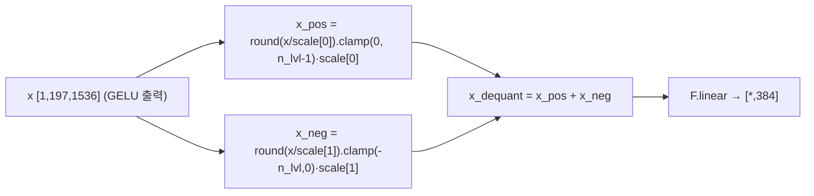

### 9.3 forward call stack
캘리브레이션: `hyperparameter_searching`(`:697`) → `_initialize_activation_scale`(`:644`, 양 scale=max, 음 scale=0.16997/n_lvl) → `_search_best_a_scale`(`:660`, 양 scale만 탐색) + weight 탐색. 추론: `TwinUniformQuantizer.forward`(`uniform.py:57`).

### 9.4 대표 코드 위치
`linear.py`: 클래스 `:624-721`, twin quantizer `:641-642`, 음 scale 초기값 `:653-657`, `_search_best_a_scale` `:660-695`, input_scale 후보 `2^i` 격자 `:707-709`.

### 9.5 대표 코드 블록

```python
# linear.py:641-657  TwinUniform: 양 scale=|x|max, 음 scale=GELU 최소값/n_levels
self.a_quantizer = TwinUniformQuantizer(n_bits=a_bit, symmetric=False, channel_wise=False)
self.a_quantizer.scale = nn.Parameter(torch.zeros((2, 1)))      # [양, 음] 두 스케일
a_neg = torch.tensor(0.16997124254703522/self.a_quantizer.n_levels, ...)  # 음수부 고정 스케일
self.a_quantizer.scale[0].data.copy_(tmp_a_scale)              # 양: |x|.max/(n_lvl-0.5)
self.a_quantizer.scale[1].data.copy_(a_neg)                    # 음: 0.16997/n_lvl
```

```python
# linear.py:707-709  PTQ4ViT식 음/양 스케일 비 = 2^m 격자 탐색
input_scale_candidates = torch.tensor([(2**i) for i in range(-5, 25)]).cuda().view(1,-1) \
                         * self.a_quantizer.scale[1].unsqueeze(-1)   # 음 scale의 2^m 배
```
→ 양 스케일을 음 스케일의 `2^m`배 격자에서 탐색 → 두 스케일 비를 2의 거듭제곱으로 묶어 하드웨어 친화(시프트로 변환 가능).

### 9.6 연산·수치표현 분해 + 정량
- **양자화 방식**: 양/음 분리 균등 양자화 후 합산. 음 스케일 고정(0.16997/n_lvl), 양 스케일 탐색.
- **scale/zp**: scale `[2,1]`(양/음), zp 없음(twin은 0 기준 분리).
- **비트폭**: A4(양 [0,n_lvl-1], 음 [-n_lvl,0]). 합쳐 b비트 표현.
- **params(부가)**: scale `[2,1]`.
- **MACs**: fc2와 동일(116.2M/block). dequant은 곱 2회 + 가산 1회/원소(8장 로그 대비 LUT 불요, 곱셈기 사용).
- **시사**: AdaLog(로그·시프트) vs Twin(균등·두 스케일)의 트레이드오프 — Twin은 LUT 없이 곱 2회, AdaLog는 시프트+LUT. FPGA에서 **곱셈기 vs 시프터+ROM** 자원 선택지(추정).

---

## 10. 모듈: Post-Softmax 로그 MatMul — `quant_layers/matmul.py` (PostSoftmaxAsymmetricallyBatchingQuantMatMul) ★정수 비선형

### 10.1 역할 + 상위/하위
- **역할**: Attention의 `matmul2`(=attn@V)에서 **A=softmax 출력**(0~1 확률, long-tail)에 AdaLog/Log2/LogSqrt2 로그 양자화. B(=V)는 일반 비대칭. log base q를 유사도로 탐색(`_search_best_A_log_base`) → AdaLog 적응형 밑의 실체. `matmul1`(Q@Kᵀ)은 일반 Asym MatMul(11장).
- **상위 계층**: `MinMaxQuantMatMul`(`:13`)→`PTQSLQuantMatMul`(`:48`)→`PTQSLBatchingQuantMatMul`(`:82`)→`AsymmetricallyBatchingQuantMatMul`(`:109`)→`PostSoftmaxAsymmetricallyBatchingQuantMatMul`(`:286`). `wrap_net.py:110-115`가 `matmul2`에 배정. **하위**: `AdaLogQuantizer`, `UniformQuantizer`(B).

### 10.2 데이터플로우 (텐서 shape 흐름, DeiT-S matmul2)
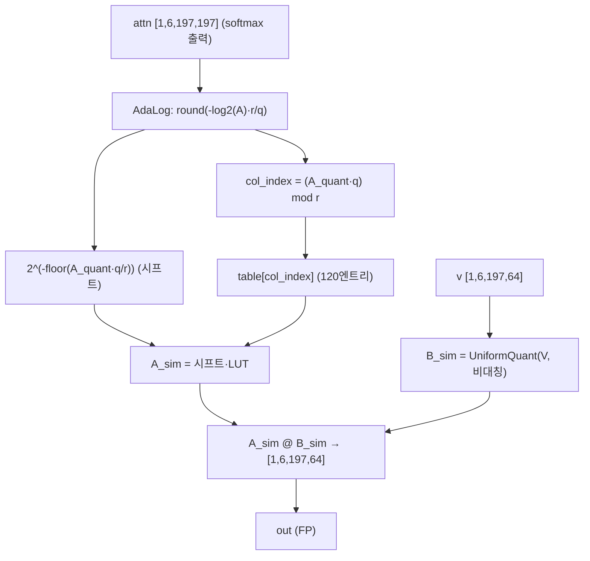

### 10.3 forward call stack
캘리브레이션: `hyperparameter_searching`(`matmul.py:360`) → `_search_best_A_log_base`(`:369`, q 탐색) + `_search_best_B_scale`/`_fpcs`(`:371-373`). 추론: `quant_forward`(`matmul.py:43`) → `quant_input_A`(AdaLog) `@` `quant_input_B`(uniform). Attention forward는 `vit_attn_forward`(`wrap_net.py:28`).

### 10.4 대표 코드 위치
`matmul.py`: 클래스 `:286-378`, AdaLog/log2/logsqrt2 분기 `:307-317`, table `:313-315`, `_search_best_A_log_base` `:321-358`, `hyperparameter_searching` `:360-378`.

### 10.5 대표 코드 블록

```python
# matmul.py:311-315  A(softmax 출력)에 AdaLog + 잔여밑 LUT(120엔트리)
self.A_quantizer = AdaLogQuantizer(n_bits=A_bit, symmetric=False, channel_wise=False)
self.table = torch.tensor([2 ** (-j/self.A_quantizer.r) for j in range(120)])  # 2^(-j/37)
self.table_scale = 1. / (4 * self.A_quantizer.n_levels - 2)
self.table = torch.round(self.table / self.table_scale) * self.table_scale
```

```python
# matmul.py:337-342  log base q 탐색: 시프트+LUT 시뮬레이션으로 유사도 평가
A_sim_quant = torch.round(-A_sim.log2() * self.A_quantizer.r / cur_q)   # q 후보별 인덱스
mask = A_sim_quant >= 2 * self.A_quantizer.n_levels
A_sim_quant = A_sim_quant.clamp_(0, 2 * self.A_quantizer.n_levels - 1)
col_index = torch.remainder(A_sim_quant * cur_q, self.A_quantizer.r).round_().long()
A_sim = (2 ** (-1 * torch.floor(A_sim_quant * cur_q / self.A_quantizer.r))) * self.table.to(A.device)[col_index]
A_sim[mask] = 0
```
→ q 후보 `range(10, 11+eq_n)`(`:323`)별로 attn@V 출력 유사도 비교 → 최적 q 선정 → `update_table()`(`:357`). **"적응적 log base 탐색"의 실체** — 시프트량 `⌊A_quant·q/r⌋`과 LUT 인덱스 `(A_quant·q) mod r`로 분해해 평가.

```python
# matmul.py:354-357  최적 q 확정 후 AdaLog table 재생성
tmp_q = torch.gather(q_candidates, dim=0, index=best_index)
self.A_quantizer.q.data.copy_(tmp_q.view(*self.A_quantizer.q.shape))
self.A_quantizer.update_table()                                # table1/table2 갱신
```

### 10.6 연산·수치표현 분해 + 정량 (DeiT-S, B=1, H=6, N=197, dh=64)
- **양자화 방식**: A=AdaLog 로그(시프트+LUT), B=uniform 비대칭. 출력은 FP 행렬곱(fake-quant).
- **scale/zp**: A는 scale `[1]`+q `[1]`(zp 없음, 로그), B는 scale/zp `[1,H,1,1]`(head별, `:129-133`).
- **비트폭**: A=s_bit=4(post-softmax, `wrap_net.py:112`), B=a_bit=4.
- **params**: 0(가중치 없는 연산), 양자화기 부가 A_scale/q `[1]×2` + table `[120]`, B_scale/zp `[H×2]`.
- **MACs/block**: attn@V = H·N²·dh = 6×197²×64 ≈ **14.9M**, ×12 ≈ **179M**. (Q@Kᵀ은 11장 matmul1.)
- **activation memory**: attn 행렬 [1,6,197,197] s_bit=4 = 6×197²×0.5 ≈ **116 KB**(block 내 최대 단일 활성).
- **캘리브 비용**: q 후보 ~128개(`:323`) × search_round. AdaLog면 매 round q 재탐색(`:368-369`), 비AdaLog면 1회 후 break(`:374-375`).
- **시사**: I-ViT의 IntSoftmax(정수 지수+reciprocal로 softmax 생성)와 **상보적** — AdaLog는 softmax **출력 확률**을 로그 양자화. N² 활성이 메모리 지배 → FPGA에서 attn 타일링 + 로그 인덱스(시프트) dequant. q는 레이어별 탐색되므로 HW는 레이어별 table1/table2(또는 q) 구성.

---

## 11. 모듈: 양자화 MatMul (Q@Kᵀ, 일반) — `quant_layers/matmul.py` (AsymmetricallyBatchingQuantMatMul)

### 11.1 역할 + 상위/하위
- **역할**: `matmul1`(=Q@Kᵀ)에서 A(=Q), B(=Kᵀ) 모두 **head별 비대칭 균등** 양자화. FPCS로 scale/zp 탐색. softmax 입력 점수를 생성(로그 아님).
- **상위 계층**: `PTQSLBatchingQuantMatMul`(`:82`)→`AsymmetricallyBatchingQuantMatMul`(`:109`). `wrap_net.py:117-120`가 matmul1에 배정. **하위**: `UniformQuantizer(head_channel_wise)`, `calculate_percentile_candidates`, `_fpcs`.

### 11.2 데이터플로우 (텐서 shape 흐름, DeiT-S matmul1)
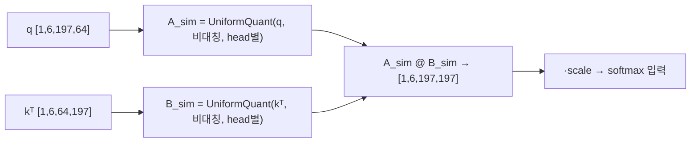

### 11.3 forward call stack
캘리브레이션: `hyperparameter_searching`(`matmul.py:264`) → `_fpcs`(A, B 각각, `:276-277`) 또는 `_search_best_A/B_scale`(`:279-280`). 추론: `quant_forward`(`:43`) → `quant_input_A @ quant_input_B`(`:45`). Attention `vit_attn_forward`(`wrap_net.py:25`).

### 11.4 대표 코드 위치
`matmul.py`: 클래스 `:109-283`, head별 비대칭 셋업 `:126-133`, `_search_best_A/B_scale` `:135-209`, percentile 후보 `:211-240`, `_fpcs` `:243-262`, `hyperparameter_searching` `:264-283`.

### 11.5 대표 코드 블록

```python
# matmul.py:126-133  A/B 모두 head별(channel_wise) 비대칭
self.A_quantizer = UniformQuantizer(n_bits=A_bit, symmetric=False, channel_wise=head_channel_wise)
self.B_quantizer = UniformQuantizer(n_bits=B_bit, symmetric=False, channel_wise=head_channel_wise)
target_shape = [1, self.num_heads, 1, 1] if self.head_channel_wise else [1,1,1,1]
self.A_quantizer.scale = nn.Parameter(torch.zeros(*target_shape))    # head마다 scale/zp
self.A_quantizer.zero_point = nn.Parameter(torch.zeros(*target_shape))
```

```python
# matmul.py:243-262  FPCS: percentile 후보 → topk → 주변 재샘플 (steps회)
def _fpcs(self, x, fpcs_width=16, steps=6, search_strategy=None):
    scale_candidates, zero_point_candidates = self.calculate_percentile_candidates(x)
    topk_index = search_strategy(self, scale_candidates, zero_point_candidates, topk=fpcs_width)  # 상위 16
    while remain_steps > 0:
        delta_scale_candidates = (linspace(0,1,fpcs_new_cnt) - 0.5) * delta_scale  # 선택 주변 미세
        delta_scale = delta_scale / (fpcs_new_cnt - 0.5)                           # 점진 축소
        scale_candidates = topk_scale + delta_scale_candidates                     # 재샘플
        topk_index = search_strategy(..., topk=1 if remain_steps==1 else fpcs_width)
```
→ FPCS(Fast Progressive Combining Search): 넓은 percentile 격자 → 상위 후보 주변을 점점 촘촘히 재탐색(coarse-to-fine). scale·zp를 함께 탐색. eq_n=128, steps=6(`configs/4bit.py:18,21`).

### 11.6 연산·수치표현 분해 + 정량 (DeiT-S, B=1, H=6, N=197, dh=64)
- **양자화 방식**: A/B head별 비대칭 균등. 출력 FP 행렬곱(fake-quant).
- **scale/zp**: A/B 각 scale/zp `[1,H,1,1]`.
- **비트폭**: A=a_bit=4(`wrap_net.py:118`), B=a_bit=4(`wrap_net.py:100`).
- **params**: 0, 부가 A/B scale·zp `[H×2]×2`.
- **MACs/block**: Q@Kᵀ = H·N²·dh = 6×197²×64 ≈ **14.9M**, ×12 ≈ **179M**. (matmul1+matmul2 합 ≈ 358M/12block.)
- **activation memory**: 출력 attn 점수 [1,6,197,197], softmax 전 FP.
- **시사**: I-ViT의 QuantMatMul(대칭, scale 곱 전파)과 달리 **비대칭 head별 + FPCS 탐색**. N² 출력이 큼 → FPGA에서 head 병렬 + 타일링.

---

## 12. 모듈: 양자화 Conv (PatchEmbed) — `quant_layers/conv.py` (AsymmetricallyBatchingQuantConv2d)

### 12.1 역할 + 상위/하위
- **역할**: 입력 이미지 패치 투영(16×16 stride16 conv). weight per-channel(out) 비대칭, **입력은 a_bit≥8이면 양자화 우회**(`quant_input` `:55-58`). conv 입력은 qconv_a_bit=8이라 사실상 weight-only 양자화.
- **상위 계층**: `MinMaxQuantConv2d`(`:11`)→`PTQSLQuantConv2d`(`:78`)→`PTQSLBatchingQuantConv2d`(`:123`)→`AsymmetricallyBatchingQuantConv2d`(`:199`). `wrap_net.py:78-96`가 nn.Conv2d에 배정. **하위**: `UniformQuantizer`, `F.conv2d`.

### 12.2 데이터플로우 (텐서 shape 흐름, DeiT-S)
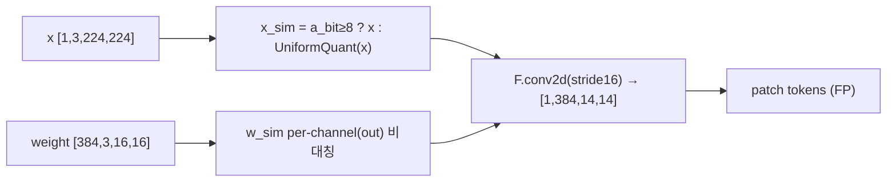

### 12.3 forward call stack
캘리브레이션: `hyperparameter_searching`(`conv.py:313`) → `weight_fpcs`/`_search_best_w_scale`(`:325/327`), a_bit<8이면 act scale도(`:328-329`). 추론: `quant_forward`(`:60`) → `quant_weight_bias`(`:51`) + `quant_input`(`:55`) → `F.conv2d`(`:64`).

### 12.4 대표 코드 위치
`conv.py`: 클래스 `:199-334`, weight per-channel 비대칭 `:222-224`, `quant_input`(a≥8 우회) `:55-58`, `_search_best_w_scale` `:226-263`, percentile 후보 `:271-290`, `hyperparameter_searching` `:313-334`.

### 12.5 대표 코드 블록

```python
# conv.py:55-58  conv 입력은 8bit 이상이면 양자화 생략 (qconv_a_bit=8)
def quant_input(self, x):
    if self.a_quantizer.n_bits >= 8:
        return x                                                # weight-only
    return self.a_quantizer(x)
```
→ PatchEmbed 입력(이미지)은 A8이라 양자화 우회 → conv는 사실상 **weight-only 양자화**. 첫 레이어 정확도 보호.

```python
# conv.py:222-224 + 60-65  weight per-channel(out) 비대칭, 정수격자 conv
self.w_quantizer = UniformQuantizer(n_bits=w_bit, symmetric=False, channel_wise=True)
self.w_quantizer.scale = nn.Parameter(torch.zeros((self.out_channels, 1)))
self.w_quantizer.zero_point = nn.Parameter(torch.zeros((self.out_channels, 1)))
# quant_forward: w_sim(per-channel) , x_sim(우회) → F.conv2d
```

### 12.6 연산·수치표현 분해 + 정량 (DeiT-S, patch16/img224)
- **양자화 방식**: weight per-out-channel 비대칭 W4, 입력 A8(우회).
- **scale/zp**: w_scale/zp `[out_channels,1]`, a_scale `[1,1,1,1]`(a<8 시).
- **비트폭**: W4 / 입력 A8(우회, `configs/4bit.py:12`).
- **params**: proj weight 384×3×16×16 + 384 = **295,296**.
- **MACs**: 출력 [1,384,14,14], 커널 3×16×16 → 384×196×(3×16×16) ≈ **57.8M**(전역 1회).
- **activation memory**: 출력 patch tokens [1,384,14,14] = [1,196,384] 상당.
- **시사**: I-ViT는 PatchEmbed도 정수 conv + scale 전파. AdaLog는 weight-only(입력 A8 우회) → 첫 레이어 양자화 오차 최소화. FPGA에서 PatchEmbed는 W4 conv + FP/A8 입력.

---

## 13. 한눈에 보는 모듈 표

| # | 모듈 (파일:클래스) | 양자화 방식 | 비트폭 | 대표 정량 (DeiT-S, B=1,N=197) | 부가 params/버퍼 |
|---|---|---|---|---|---|
| 2 | uniform.py:UniformQuantizer | 균등 대칭/비대칭 | W4/A4 | 원소 O(N) div+round | scale(+zp) |
| 3 | logarithm.py:Log2/LogSqrt2 | 로그(밑 2/√2), 시프트 dequant | s_bit=4 | attn 233K 원소 log | scale |
| 4 | logarithm.py:**AdaLog** ★ | 적응형 로그(밑 2^(q/r)), 시프트+LUT | s/a=4 | dequant=2^(-table1)·table2·scale | q[1], table1/2[2n_lvl], scale |
| 5 | logarithm.py:**ShiftAdaLog** | shift + AdaLog, bias 흡수 | a=4 | 추론 부가 가산 0 | shift[1], bias_reparamed |
| 6 | linear.py:AsymmetricallyBatching | weight per-ch + act per-tensor 비대칭 | W4/A4 | proj 29.0M MAC | w_scale/zp, a_scale/zp |
| 7 | linear.py:ChannelWise(reparam) | 채널별 act → LN 흡수 | W4/A4 | qkv 87.1M MAC, 추론 부가 0 | a_scale/zp[in_features]→[1] |
| 8 | linear.py:**PostGeluLog** ★ | ShiftAdaLog post-GELU | W4/A4 | fc2 116.2M MAC, 입력 151KB | shift/q/scale, table[120] |
| 9 | linear.py:PostGeluTwin(대안) | TwinUniform(양/음) | W4/A4 | fc2 116.2M MAC | scale[2,1] |
| 10 | matmul.py:**PostSoftmaxLog** ★ | A=AdaLog, B=uniform | s=4/a=4 | attn@V 14.9M MAC, attn 116KB | A_scale/q, table[120], B_scale/zp |
| 11 | matmul.py:AsymmetricBatching | A/B head별 비대칭 | a=4 | Q@Kᵀ 14.9M MAC | A/B scale/zp[H] |
| 12 | conv.py:AsymmetricBatchingConv2d | weight per-ch 비대칭, 입력 우회 | W4/A8 | PatchEmbed 57.8M MAC | w_scale/zp[oc] |

**Block 합산(DeiT-S, 12 block)**: Linear MAC ≈ 4.18G, Attention matmul ≈ 358M(matmul1+2)/12 → 합 ≈ 4.54G MAC. params ≈ 21.27M(Linear) + 0.30M(PatchEmbed). 캘리브: calib_size=32, eq_n=128, search_round=3, FPCS steps=6.

---

## 14. 평가 (강점 / 한계 / 리스크)

**강점**
- **PTQ만으로 저비트(W4/W3)** — I-ViT(QAT) 대비 재학습 불요, turnaround 짧음. BRECQ(`--optimize`)는 선택적 추가 회복.
- **adaptive log base = 시프트+소형 LUT dequant** — post-Softmax/GELU long-tail에 적합하면서 dequant이 `2^(-table1)·table2`로 하드웨어 친화(`logarithm.py:97`).
- **bias reparameterization + channel-wise reparam** — shift/채널 분산을 이전 레이어(bias/LN)로 정적 흡수해 런타임 보정 로직 제거(`linear.py:596-611,999-1006`).
- **FPCS** — percentile coarse-to-fine 탐색으로 scale/zp/q를 효율적으로 동시 최적화(`matmul.py:243-262`).

**한계 / 리스크**
- **핵심은 fake-quant(시뮬레이션)** — 실제 정수 추론 커널/배포 없음(I-ViT의 dyadic 정수 연산·TVM 배포 같은 경로 부재). `F.linear(x_sim, w_sim)`는 dequant된 float 곱(`linear.py:50`). HW 실연산 매핑은 별도 필요.
- **AdaLog dequant은 순수 시프트가 아님** — `table2`(잔여 밑) 곱이 동반(`logarithm.py:97`). 소형 LUT(2·n_levels~120 엔트리) 곱 필요.
- **CUDA 강제** — `parallel_eq_n` 산정이 GPU 메모리 의존, CPU면 `EnvironmentError`(`linear.py:113-117`). 환경 의존.
- **경험적 상수** — `r=37`(`logarithm.py:71`), shift 초기 0.16997(`linear.py:749`), q 탐색 범위 `[10, 11+eq_n]`(`linear.py:858`) 등이 하드코딩. 재튜닝 필요.
- **확인 불가**: `block_recon.py`(BRECQ)·`adaround.py`·`test_utils.py` 미열람으로 최적화/평가 세부, latency는 측정 불가.

---

## 15. FPGA 시사점 (log base가 HW 시프트/LUT에 주는 함의)

- **AdaLog dequant = 배럴 시프터 + 소형 ROM**: 평가 forward `dequant = 2^(-table1[idx])·table2[idx]·scale`(`logarithm.py:97`)에서 `2^(-table1)`은 **우측 산술 시프트**(시프트량 = LUT 정수값), `table2`는 `2·n_levels`엔트리(W4=16, post-softmax/GELU 탐색용 120엔트리 `linear.py:750`) **ROM 곱**. → post-Softmax/GELU 후단 dequant를 곱셈기 대신 barrel shifter + 작은 LUT로 합성. **I-ViT의 dyadic `(z_int·m)>>e`와 동형**(둘 다 정수곱/LUT + 시프트)이나, AdaLog는 분포 적합(log)을, I-ViT는 정수 실행을 강조 → **하이브리드(AdaLog 분포 + I-ViT 정수 dyadic)**가 본 프로젝트 HW화의 현실적 경로(추정).
- **레이어별 적응 밑 → 레이어별 LUT 구성**: q가 레이어별로 탐색되므로(`matmul.py:355-357`, `linear.py:894-895`), HW는 레이어마다 table1/table2(또는 q) 파라미터를 로드. r=37 고정이라 시프트 분모는 상수 → table1=⌊i·q/37⌋ 사전계산 ROM. q만 레이어별 레지스터로 두면 동적 재구성 최소.
- **shift bias 흡수 → 추가 가산기 0**: `reparam_bias`(`linear.py:999-1006`)가 shift를 정적 bias에 융합 → post-GELU 경로 런타임에 가산기 불요, "시프트 dequant only" 파이프라인 유지. channel-wise reparam(`:596-611`)도 LN affine으로 채널 분산 흡수 → 채널별 보정 로직 제거. **둘 다 균일 파이프라인 친화**.
- **N² attn 활성이 메모리 지배**: matmul2 입력 attn [1,6,197,197]이 block 내 최대 활성(s_bit=4 ≈ 116KB, `§10.6`). FPGA에서 head 병렬 + attn 타일링 + 로그 인덱스(시프트) dequant 스트리밍이 핵심. softmax 자체는 timm FP softmax(본 repo는 출력만 로그 양자화) → I-ViT의 IntSoftmax(정수 지수)와 결합하면 softmax 전체 정수화 가능(추정).
- **PTQ + 시프트 친화 = XR 시선추적 신속 배포(추정)**: 재학습 불요 PTQ로 다모델 빠른 양자화, log 양자화의 long-tail 대응이 뾰족한 attention 분포(시선추적류)에 유리. W4A4 PTQ로 메모리/대역폭 절감하되 BRECQ로 정확도 보강. 단 정수 커널 부재로 HG-PIPE류 파이프라인엔 AdaLog 인덱스/LUT를 정수 데이터패스로 재구현 필요.
- **Twin vs Log 자원 선택지**: post-GELU에 AdaLog(시프트+ROM) 또는 TwinUniform(곱 2회)(`§9`) 선택 가능 → FPGA에서 **시프터+LUT vs 곱셈기** 자원 트레이드오프를 config로 전환(`post_gelu_quantizer`). DSP 여유에 따라 선택(추정).
