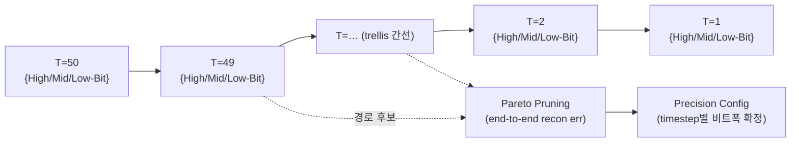
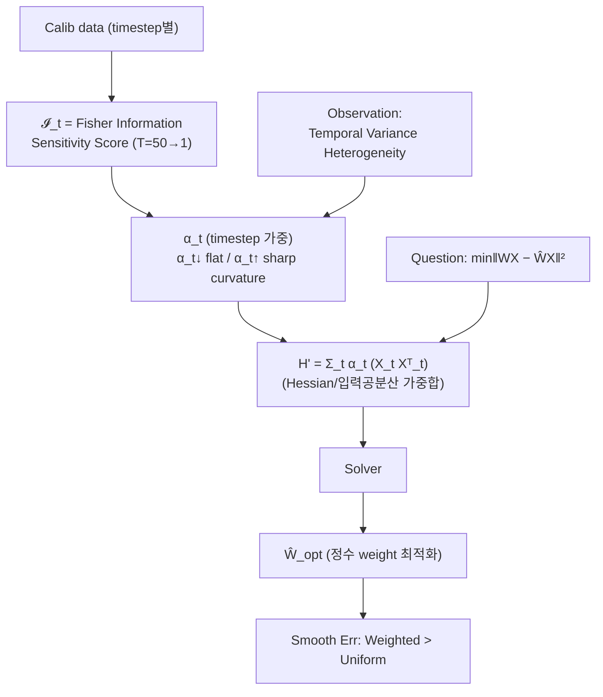

# AdaTSQ 모듈 통합 가이드 (S-PyTorch)

> 1차 요약: [`../AdaTSQ.md`](../AdaTSQ.md) — 본 문서는 그 요약을 모듈 단위로 심화·검증한 통합 가이드다.
> 분석 대상: `\\wsl.localhost\ubuntu-24.04\home\user\project\PRJXR-HBTXR\REF\ViT-Quantization\AdaTSQ`
> 형제 가이드: [`../I-ViT/MODULE_GUIDE.md`](../I-ViT/MODULE_GUIDE.md) — 동일한 6요소·N+3 구조를 따른다.
> 작성 원칙: 실제 소스 Read 후 `파일:라인` 근거 표기. 라인 근거 없는 추론은 "추정", 코드/figure로 확인 불가는 "확인 불가"로 명시.
> **[figure 근거]** = `figs/*.png` 픽셀 직접 판독, **[README 근거]** = `README.md` 본문, **[추정]** = 분석자 추론, **[확인 불가]** = 코드 부재로 검증 불가.

---

## 0. 문서 머리말

### 0.0 ★최우선 결론 — 양자화 소스코드 부재 (I-ViT와의 결정적 차이)

본 repo는 형제 I-ViT와 달리 **양자화 실행 소스코드(`.py`)가 단 한 개도 없다.** 멱등 재검증 결과:

| 검증 | 결과 | 근거 |
|---|---|---|
| `**/*.py` Glob | **No files found** | 본 세션 Glob 실측 |
| `**/*.{py,txt,yml,yaml,cfg,toml,json,sh,ipynb,c,cpp,h,cu}` Glob | **No files found** | 본 세션 Glob 실측 |
| 존재 파일 전체 | `README.md` 1개 + `figs/` 내 PNG 5개 (`method/table/fig1/fig6/fig7.png`) | Glob `**/*.md`, `**/*.png` |
| 코드 공개 여부 | "**Our code will be released soon.**" | `README.md:15` |
| repo 릴리스일 | 2026-02-10 (코드 미동반) | `README.md:11` |

→ 따라서 I-ViT 가이드처럼 quantizer/observer·matmul·비선형의 `파일:라인` 6요소 분석은 **물리적으로 불가능**하다. 본 가이드는 I-ViT 동형 골격을 유지하되, **모듈 슬롯은 README abstract + figure 픽셀 판독으로 확정 가능한 알고리즘 의미만** 채우고, 구현 디테일(루프/shape/granularity/하이퍼파라미터)은 일관되게 **확인 불가(코드 미공개)**로 표기한다.

> 1차 요약 대비 본 가이드의 실질 확장은 **figure 5종을 픽셀 단위로 판독**해 abstract만으로는 알 수 없던 ① 비트폭(W4A4·W3A3), ② 비교 baseline 7종, ③ method.png의 파이프라인 단계(trellis + Pareto Pruning + Fisher 민감도 곡선 + Hessian solver), ④ Table 1·2의 실제 정량 수치를 근거화한 점이다. 1차 요약은 figure를 "미열람"으로 남겼다(`../AdaTSQ.md:55,177-180`).

### 0.1 AdaTSQ 의미 코드(=figure) 확정

**AdaTSQ = Ada(ptive) T(emporal-)S(ensitivity) Q(uantization)** — "확산 트랜스포머(DiT)의 **타임스텝별 민감도**에 적응적으로 비트폭을 배분하는 PTQ" **[README 근거: 제목 `README.md:1,5` + abstract `:15`]**. 1차 요약의 약어 풀이("Ada=Adaptive, 명시적 풀이는 없음", `../AdaTSQ.md:23`)를 figure가 다음과 같이 **간접 확정**한다:

- **"Temporal" = 확산 sampling 타임스텝(T=50…T=1)** — method.png 상단축이 `T=50, T=49, …, T=2, T=1`로 라벨링되고, 각 timestep마다 양자화 정책이 갱신됨. **[figure 근거: method.png 상단]** → 1차 요약 8.4절 "temporal은 video frame이 아니라 diffusion step"(`../AdaTSQ.md:222`) 경고를 figure가 확증.
- **"Sensitivity" = Fisher Information 기반 timestep 민감도 점수 `I_t`** — method.png 중단 띠가 `𝓘_t : Sensitivity Score Across Timesteps from Fisher Information (T=50 → T=1)`로 명시. **[figure 근거: method.png 중단]**
- **"Adaptive/dynamic" = timestep마다 High-Bit/Mid-Bit/Low-Bit 후보 중 경로 선택** — method.png 상단 각 timestep 노드가 `High-Bit / Mid-Bit / Low-Bit` 3행으로 그려지고 trellis(격자) 간선으로 연결, 중앙 `Pareto Pruning` 박스를 거쳐 우측 `Precision Config`로 확정. **[figure 근거: method.png 상단]** → 1차 요약의 "constrained pathfinding + beam search"(`../AdaTSQ.md:31,72`)가 **trellis 경로탐색 그림**으로 시각 확정.

### 0.2 S-PyTorch 수치 규약 (적용 가능성)

I-ViT 가이드의 수치 규약(params·FLOPs/MACs·activation memory·비트폭/observer)은 **코드가 있어야 산출 가능**하다. 본 repo는 코드가 없으므로:

| 규약 항목 | AdaTSQ 적용 | 비고 |
|---|---|---|
| **params** | **확인 불가** | 모델 정의 코드 부재. 대상은 외부 DiT(Flux/Z-Image/Wan2.1)지만 그 코드는 본 repo에 없음(제외 대상이기도 함) |
| **FLOPs/MACs** | **확인 불가** | 동일 |
| **activation memory** | **확인 불가** | 텐서 shape 정의 부재 |
| **비트폭** | **W4A4 / W3A3 / FP16(16/16)** | **[figure 근거: table.png "Bits(W/A)" 열]** — abstract엔 비트폭 수치 없음. figure가 유일 근거 |
| **observer/granularity** | **확인 불가** | per-channel/per-tensor, scale/zero-point 방식 코드 부재 |
| **양자화 기법(핵심)** | timestep-dynamic mixed-precision + Fisher calibration + Hessian weight opt | **[README 근거 + figure 근거]** — 의미는 확정, 구현은 확인 불가 |

→ I-ViT의 "정량 3요소(params/MAC/act-mem)"는 AdaTSQ에서 **전부 확인 불가**이며, 본 가이드의 정량 근거는 **figure가 제공하는 비트폭·정확도 표(Table 1·2)로 대체**한다.

### 0.3 운영 경로 (PTQ 파이프라인 — figure 재구성)

코드는 없으나 method.png가 PTQ 파이프라인을 시각화한다. **[figure 근거: method.png 전체]**

```
[Calib Prompt] ──► DiT denoising (T=50 → T=1)                          (method.png 상단 좌)
   │  각 timestep t 에서:
   │   ① 후보 비트폭 {High-Bit, Mid-Bit, Low-Bit} 노드 생성        (method.png 상단 trellis)
   │   ② Fisher 민감도 𝓘_t 로 timestep 가중                          (method.png 중단 띠)
   ▼
[Hessian-aware weight 보정]  min‖WX − ŴX‖²,  H' = Σ_t α_t (X_t Xᵀ_t)   (method.png 하단)
   │   α_t = loss-curvature/temporal-variance 기반 가중 (α_t↓ flat / α_t↑ sharp)
   │   → Solver → Ŵ_opt   (정수 weight 최적화)                        (method.png 하단 우)
   ▼
[Pareto Pruning]  end-to-end recon error로 trellis 경로 가지치기      (method.png 상단 중앙)
   │   "Smooth Err": Uniform 배분 vs Weighted 배분 비교 (Weighted 우위) (method.png 하단 우)
   ▼
[Precision Config]  timestep별 최종 비트폭 정책 확정                   (method.png 상단 우)
   ▼
[양자화 추론]  FP16(Left) vs Ours(Right) 시각 비교                     (method.png 상단 중)
```

- 타깃 디바이스: "edge devices" 배포가 동기(`README.md:15`)이나 구체 HW·런타임은 **확인 불가(코드 미공개)**.
- I-ViT는 QAT(수십 epoch fine-tune), AdaTSQ는 **PTQ**(calibration 기반, 재학습 없음)로 패러다임이 다름 **[README 근거: "post-training quantization (PTQ)" `:15`]**.

### 0.4 모델 / 데이터셋 / 정확도 (figure 인용)

**대상 모델 4종 (advanced DiTs)** **[README 근거 `:15` + figure 근거]**:

| 모델 | sampling steps | 벤치마크 | 근거 |
|---|---|---|---|
| **FLUX-dev** | 50 steps | GenEval (Table 1) | table.png |
| **FLUX-schnell** | 4 steps | GenEval (Table 1) | table.png |
| **Z-Image** | 10 steps | GenEval (Table 1) | table.png |
| **Wan2.1-1.3B** (video DiT) | 25 steps | VBench (Table 2) | table.png |

**평가 벤치마크/지표** **[figure 근거: table.png 헤더]**:
- **Table 1 = GenEval** (이미지 생성): Single Object / Position / Counting / Two Object / Colors / Color Attribute / **Total**.
- **Table 2 = VBench** (비디오 생성, Wan2.1): Imaging Quality / Aesthetic Quality / Motion Smoothness / Dynamic Degree / BG. Consist. / Scene Consist. / Overall Consist. / Subject Consist.

**비트폭 & 대표 정량 (table.png 판독)** — 값은 클수록 우수, best=빨강/2nd=파랑 마킹:

| 모델 | Bits(W/A) | 지표 | FP 기준 | **AdaTSQ(ours)** | 최강 baseline | 근거 |
|---|---|---|---|---|---|---|
| FLUX-dev (50) | 16/16 | Total | **0.6667** | — | — | table.png |
| FLUX-dev (50) | **4/4** | Total | — | **0.5732 (best)** | SVDQuant 0.5572 | table.png |
| FLUX-dev (50) | **3/3** | Total | — | **0.5270 (best)** | SVDQuant 0.3768 | table.png |
| FLUX-schnell (4) | 4/4 | Total | 0.6642 | **0.6801 (best)** | SVDQuant 0.6237 | table.png |
| Z-Image (10) | 4/4 | Total | 0.7542 | **0.7619 (best)** | SVDQuant 0.7179 | table.png |
| Wan2.1-1.3B (25) | 4/4 | Subject Consist. | 0.9222 | **0.9078 (best)** | SVDQuant 0.9041 | table.png |

> 주의: 위 수치는 600px급 PNG의 육안 판독이므로 **소수 끝자리 ±오차 가능**(추정). 정밀값은 논문 본문 필요 → **확인 불가(원논문 미열람)**.

**비교 baseline (SOTA)** **[README 근거 `:15` + figure 근거]**: SVDQuant, ViDiT-Q (abstract 명시) + table.png/fig6에서 추가 확인 **Q-DiT, SmoothQuant, Quarot, SmoothQ** (총 6~7종). AdaTSQ가 "significantly outperforms" 주장(`README.md:15`).

- **데이터셋**: GenEval/VBench 프롬프트 기반 생성 평가(별도 학습 데이터셋 아님). calibration 데이터 구성은 **확인 불가(코드 미공개)**.

---

## 1. Repo / 알고리즘 개요

AdaTSQ = **DiT(Diffusion Transformer)** 전용 **PTQ** 프레임워크. 핵심은 ① **Pareto-aware timestep-dynamic 비트폭 배분**(constrained pathfinding + beam search, end-to-end recon error 가이드), ② **Fisher-guided temporal calibration**(temporal Fisher로 민감 timestep 우선 + Hessian weight 최적화 통합) **[README 근거 `:15`]**. I-ViT(integer-only QAT ViT)와는 **태스크(생성 vs 분류)·패러다임(PTQ vs QAT)·축(temporal timestep vs 토큰)** 모두 다르다.

### 1.1 자체 소스 vs 외부 프레임워크 vs 제외

| 구분 | 파일 | 역할 |
|---|---|---|
| **문서** | `README.md` | 제목/저자/abstract/결과 figure 링크/BibTeX (`:1-72`) |
| **그림(자체 결과)** | `figs/method.png` | 제안 파이프라인 개요도 (trellis + Fisher + Hessian solver) |
| | `figs/table.png` | Table 1(GenEval)·2(VBench) 정량 비교 |
| | `figs/fig1.png` | 4모델 W3A3/W4A4 정성 비교 (FP16 / SVDQuant / AdaTSQ) |
| | `figs/fig6.png` | Flux-dev/schnell/Z-Image 정성 비교 (baseline 7종 그리드) |
| | `figs/fig7.png` | Wan2.1 video 프레임 정성 비교 (W4A4) |
| **라이선스** | `LICENSE` | (1차 요약 `../AdaTSQ.md:44` 언급, 본 세션 Glob엔 `.md`/`.png`만 잡힘 — `LICENSE`는 확장자 없어 별도) |
| **양자화 구현** | **(없음)** | `.py`/소스 0개 — "released soon"(`README.md:15`) |
| **외부 프레임워크(제외)** | — | 대상 DiT(Flux/Z-Image/Wan2.1) 원본, diffusers, baseline(SVDQuant/ViDiT-Q 등) — 본 repo에 코드 미포함 |

### 1.2 forward 진입점

**확인 불가 (코드 미공개).** 양자화 클래스·forward 정의 파일이 존재하지 않음. method.png가 보여주는 추론 흐름(denoising T=50→1, timestep별 precision config 적용)이 개념적 진입점이나 **실행 코드 라인 근거 없음**.

### 1.3 제외 (지시에 따라)

- **외부 프레임워크/체크포인트**: 대상 DiT 원본 가중치·diffusers·baseline 코드 — 본 repo에 부재(애초에 제외 대상).
- **figure 픽셀 정밀 수치**: table.png 소수 끝자리는 판독 한계로 ±오차(추정 표기).
- **원논문(arXiv 2602.09883)**: 본 세션 미열람 → 수식·하이퍼파라미터·ablation 정밀값 **확인 불가**.

---

## 2. 모듈: Timestep-dynamic 비트폭 배분 — (코드 부재, method.png 근거) ★핵심 축 1

### 2.1 역할 + 상위/하위
- **역할**: 확산 sampling의 각 timestep(T=50…1)·각 layer에 **비트폭을 적응적으로 배분**. 균일 비트 대신 (timestep × layer) 격자 위 mixed-precision으로 동일 평균 비트 예산에서 품질 최대화. **[README 근거 `:15` + figure 근거: method.png 상단]**
- **상위**: 전체 PTQ 파이프라인의 정책 결정 단계. **하위**: end-to-end reconstruction error 평가, Pareto Pruning.
- **구현 파일:라인**: **확인 불가 (코드 미공개)**.

### 2.2 데이터플로우 (method.png trellis 재구성)

**[figure 근거: method.png 상단 — High/Mid/Low-Bit 3행 노드 + trellis 간선 + Pareto Pruning 박스 + Precision Config]**

### 2.3 forward call stack
**확인 불가 (코드 미공개).** abstract의 "beam search guided by end-to-end reconstruction error"(`README.md:15`)가 알고리즘 골격이나 함수 호출 라인 없음.

### 2.4 대표 코드 위치
**확인 불가 (코드 미공개).** 시각 근거: method.png 상단 trellis 영역.

### 2.5 대표 코드 블록
**확인 불가 (코드 미공개).** 1차 요약(`../AdaTSQ.md:117-130`)의 beam search 의사코드는 **추정**이며 실제 코드 아님. 본 가이드는 이를 **figure가 trellis로 확증**한다는 점만 추가:
- High/Mid/Low-Bit 3단계 후보 = 이산 비트폭 집합(예: {8,4,3} 또는 {High,Mid,Low}) — 구체 비트값은 table.png가 **W4A4·W3A3** 동작점을 보여줌(`table.png` "Bits" 열). **[figure 근거]**

### 2.6 연산·수치표현 분해 + 정량
- **양자화 방식**: timestep-dynamic mixed-precision (3-level: High/Mid/Low). **[figure 근거: method.png]**
- **비트폭**: 보고된 동작점 **W4A4, W3A3** (FP16 기준 대비). **[figure 근거: table.png]**
- **scale/zero-point**: **확인 불가**.
- **params/FLOPs/activation memory**: **확인 불가 (모델 코드 부재)**.
- **탐색 비용**: beam 폭·후보 수·timestep 수(50/25/10/4)에 따른 탐색 시간 — **확인 불가**(1차 요약 7.2절 리스크와 일치, `../AdaTSQ.md:201-202`).

---

## 3. 모듈: Fisher-guided Temporal Calibration — (코드 부재, method.png 근거) ★핵심 축 2

### 3.1 역할 + 상위/하위
- **역할**: 어느 timestep의 calibration 샘플이 더 중요한지 **temporal Fisher information `𝓘_t`**로 판단해 우선 사용. 민감 timestep 통계를 비중 있게 반영. **[README 근거 `:15` + figure 근거: method.png 중단]**
- **상위**: PTQ calibration 단계. **하위**: Hessian-based weight 최적화와 통합.
- **구현 파일:라인**: **확인 불가 (코드 미공개)**.

### 3.2 데이터플로우 (method.png 중·하단 재구성)

**[figure 근거: method.png 중단 띠(𝓘_t) + 하단(Question/Observation/H'/Solver/Smooth Err 라벨)]**

### 3.3 forward call stack
**확인 불가 (코드 미공개).**

### 3.4 대표 코드 위치
**확인 불가 (코드 미공개).** 시각 근거: method.png 하단 좌(Question `min‖WX−ŴX‖²`), 중(`H' = Σ α_t(X_t Xᵀ_t)` + Loss Curvature), 우(Solver → `Ŵ_opt`, Smooth Err 막대그래프).

### 3.5 대표 코드 블록
**확인 불가 (코드 미공개).** figure가 확정하는 **수식 골격**(코드 아님, 화면 라벨 그대로):
- 목적함수: `min ‖WX − ŴX‖²` ("How to decide X?") — layer-wise 양자화 재구성 오차. **[figure 근거: method.png 하단 좌]**
- 가중 Hessian: `H' = Σ_t α_t (X_t Xᵀ_t)` — timestep t별 입력공분산을 `α_t`로 가중 합산. **[figure 근거: method.png 하단 중]**
- `α_t`는 loss curvature(평탄 α_t↓ / 첨예 α_t↑)와 "Temporal Variance Heterogeneity"에서 도출. **[figure 근거]**
→ 1차 요약 4.3절의 `H ≈ E[xxᵀ]`, `ΔL ≈ ½ Δwᵀ H Δw`(`../AdaTSQ.md:148-149`)가 **추정**이었으나, figure가 `H' = Σ α_t(X_t Xᵀ_t)` 형태를 **명시 확정**. (1차 요약보다 정밀한 근거)

### 3.6 연산·수치표현 분해 + 정량
- **양자화 방식**: Fisher 가중 calibration + Hessian-aware weight rounding (GPTQ/BRECQ 계열 통합). **[README 근거 + figure 근거]**
- **민감도 척도**: temporal Fisher information `𝓘_t`, T=50→1 스칼라 곡선. **[figure 근거: method.png 중단]**
- **params/FLOPs**: **확인 불가**.
- **calibration 비용**: Fisher 추정 + Hessian solver 연산량 — **확인 불가**(1차 요약 7.2절 "각 후보마다 전체 sampling" 비용 우려와 일치, `../AdaTSQ.md:202`).

---

## 4. 모듈: 양자화 연산자 (quantizer/observer/matmul/비선형) — (전부 코드 부재)

I-ViT 가이드의 핵심 6모듈(SymmetricQuantFunction, dyadic requant, QuantLinear, QuantAct/observer, QuantMatMul, IntLayerNorm/IntGELU/IntSoftmax)에 대응하는 AdaTSQ 구현은 **전부 부재**:

| I-ViT 대응 모듈 | AdaTSQ 상태 | 근거 |
|---|---|---|
| quantizer (SymmetricQuantFunction) | **확인 불가** | `.py` 0개 |
| observer (running min/max) | **확인 불가** | 동일 |
| dyadic requant (fixedpoint_mul) | **확인 불가** | 동일 |
| QuantLinear / QuantConv | **확인 불가** | 동일 |
| QuantMatMul (QKᵀ/AV) | **확인 불가** | 동일 |
| 정수 비선형 (GELU/Softmax/LayerNorm) | **확인 불가** | 동일 |

- per-channel/per-tensor, symmetric/asymmetric, integer-only 여부, scale 표현(dyadic 등) **모두 확인 불가**. 단 AdaTSQ는 **PTQ + Hessian weight rounding**이므로 I-ViT식 integer-only 비선형(시프트 GELU/Softmax)과는 **다른 계열**(weight rounding 중심)일 가능성이 큼(추정). figure에 정수 비선형 시프트 흔적은 없음.

---

## N+1. 모듈 한눈 요약 표

| 모듈 | 구현 근거 | 역할 | 양자화 방식 | 대표 정량 |
|---|---|---|---|---|
| Timestep-dynamic 비트배분 | method.png(코드 부재) | (timestep×layer) mixed-precision | 3-level High/Mid/Low-Bit, trellis+Pareto Pruning | W4A4·W3A3 동작점 [figure: table.png] |
| Fisher temporal calibration | method.png(코드 부재) | 민감 timestep 우선 calibration | temporal Fisher 𝓘_t 가중 | 확인 불가 |
| Hessian weight opt | method.png(코드 부재) | min‖WX−ŴX‖² weight rounding | H'=Σ α_t(X_t Xᵀ_t) → Solver → Ŵ_opt | 확인 불가 |
| Pareto pruning | method.png(코드 부재) | end-to-end recon err 경로 가지치기 | Smooth Err: Weighted>Uniform | 확인 불가 |
| quantizer/observer/matmul/비선형 | **부재** | (I-ViT 대응 없음) | 확인 불가 | 확인 불가 |
| **결과(검증 가능)** | table.png/fig1/6/7 | 4 DiT, baseline 6~7종 대비 best | — | FLUX-dev W4A4 Total 0.5732 [figure] |

---

## N+2. 학습·평가 파이프라인 + 재현

- **패러다임**: PTQ (재학습 없음, calibration 기반). **[README 근거 `:15`]**
- **대상/벤치/steps**: FLUX-dev(50)/FLUX-schnell(4)/Z-Image(10) → GenEval; Wan2.1-1.3B(25) → VBench. **[figure 근거: table.png]**
- **재현 명령/스크립트**: **확인 불가 (코드 미공개)**. `requirements.txt`/`environment.yml`/엔트리 스크립트 부재(1차 요약 6절과 일치, `../AdaTSQ.md:186`).
- **체크포인트/calibration set**: **확인 불가**.
- **정확도(figure 인용)**: AdaTSQ가 W4A4·W3A3 거의 전 항목에서 SVDQuant·ViDiT-Q·Q-DiT·SmoothQuant·Quarot 대비 best/2nd. 정성(fig1/6/7): W3A3에서 baseline은 노이즈 붕괴(특히 Z-Image SVDQuant·fig7 ViDiT-Q), AdaTSQ는 FP16 근접 유지. **[figure 근거: fig1.png/fig6.png/fig7.png]**
- **의존성**: **확인 불가** (PyTorch+diffusers 추정, `../AdaTSQ.md:187`).

---

## N+3. 우리 프로젝트(FPGA ViT 가속) 시사점 + FPGA 친화도

### N+3.1 즉시 활용 가능 = 알고리즘 아이디어 (코드 아님)
- **Timestep-dynamic 비트배분 → 가속기 단계별 mixed-precision DSE**: (timestep×layer) 격자 mixed-precision은 우리 가속기에서 "(파이프라인 stage × layer) 또는 (프레임/시점 × layer) 비트배분"으로 환산 가능. constrained pathfinding(trellis 탐색)은 **HW 자원예산(DSP/BRAM/LUT) 제약 하 mixed-precision 배분**과 동형. **[추정 — 1차 요약 8.1·8.2절과 일치, `../AdaTSQ.md:213-216`]**
- **Fisher 민감도 → 어느 layer/head를 고비트로 둘지 HW 가이드**: 민감 layer만 고비트(또는 별도 PE), 둔감 layer는 저비트로 두는 비균일 PE 설계 근거. 시선추적 latency 예산이 빡빡할 때 "민감한 곳에만 비트 투자"는 유효. **[추정]**
- **Pareto-aware 목적함수 → HLS/RTL DSE의 목적함수 차용**: end-to-end 품질 가이드를 (latency vs accuracy, area vs accuracy) Pareto 탐색 목적함수로 직접 차용. **[추정]**

### N+3.2 직접 재사용 불가 = 구현
- **코드 미공개("released soon")로 양자화 커널·비선형 데이터패스를 가져올 수 없음.** I-ViT처럼 `int_exp_shift`·`fixedpoint_mul`을 RTL로 이식하는 직접 청사진이 **AdaTSQ에는 전무**. 공개 시점까지 **SVDQuant/ViDiT-Q 등 공개 baseline 코드로 대체 검토**가 현실적. **[README 근거 + 추정, `../AdaTSQ.md:227`]**

### N+3.3 도메인 매핑 주의 (1차 요약 재확인 + figure 확증)
- AdaTSQ "temporal" = **확산 sampling timestep**(method.png T=50→1 확정), 우리 의미의 "video frame/시점"이 **아님**. 차용 시 개념 매핑(diffusion step ↔ frame/시점) 명시 필수. **[figure 근거 + 추정 — 1차 요약 8.4절 확증, `../AdaTSQ.md:222`]**
- AdaTSQ는 **생성(DiT) PTQ**로 recon error를 가이드 신호로 씀. **discriminative ViT(시선추적 백본)**는 손실/지표가 달라 가이드 신호를 시선좌표 회귀오차/검출 정확도로 치환 필요. **[추정, `../AdaTSQ.md:223`]**

### N+3.4 FPGA 친화도 평가 (코드 부재 반영)
| 항목 | 평가 | 근거 |
|---|---|---|
| 알고리즘 아이디어(mixed-precision DSE) | ★★★ 차용 가치 큼 | method.png trellis+Pareto |
| 비선형 HW 청사진 | — 확인 불가 | 코드 부재 |
| 재양자화 PE 청사진 | — 확인 불가 | 코드 부재 |
| 저비트 실증(W4A4/W3A3) | ★★★ 4-bit/3-bit 품질 입증 | table.png/fig1/6/7 |
| 직접 이식성 | ✗ 코드 미공개 | `README.md:15` |
| 우리 태스크 적합성 | △ 생성↔판별 매핑 필요 | abstract+figure |

→ I-ViT는 "구현 청사진(★★★)", AdaTSQ는 "**아이디어 청사진(★★★) + 구현 불가(✗)**"로 상보적. mixed-precision **탐색 전략**은 AdaTSQ, 정수 비선형 **데이터패스**는 I-ViT에서 가져오는 조합이 합리적. **[추정]**

---

## 부록. 근거 / 확인 불가

- **직접 확인(사실)**:
  - `.py`/소스 0개 — Glob `**/*.py`, `**/*.{py,txt,yml,yaml,cfg,toml,json,sh,ipynb,c,cpp,h,cu}` 모두 "No files found"(본 세션 실측).
  - 존재 파일 = `README.md`(`:1-72`) + `figs/{method,table,fig1,fig6,fig7}.png`.
  - "Our code will be released soon."(`README.md:15`), repo 릴리스 2026-02-10(`:11`).
- **figure 픽셀 판독(사실, 단 ±오차)**:
  - 비트폭 W4A4·W3A3·FP16, 대상 4모델 + steps, GenEval/VBench 지표명, baseline 6~7종, Table 1·2 대표 수치 — `table.png`.
  - 파이프라인 단계(trellis High/Mid/Low-Bit, Pareto Pruning, Precision Config, 𝓘_t Fisher, `min‖WX−ŴX‖²`, `H'=Σ α_t(X_t Xᵀ_t)`, Solver, Ŵ_opt, Smooth Err Weighted>Uniform) — `method.png`.
  - 정성 붕괴 패턴(W3A3 baseline 노이즈 vs AdaTSQ FP16 근접) — `fig1/6/7.png`.
- **README 텍스트(사실)**: AdaTSQ 의미, 2축 알고리즘, 대상/baseline, PTQ 패러다임 — `README.md:15`.
- **추정**: 약어 풀이(Ada=Adaptive), 비트 후보 구체값, FPGA 매핑 시사점, I-ViT 대비 계열 차이(weight-rounding 중심).
- **확인 불가(코드/원논문 부재)**: 모듈별 구현(quantizer/observer/matmul/비선형 전부), params/FLOPs/MACs/activation memory(모델 코드 부재), forward 진입점·call stack·코드 블록, scale/zero-point/granularity, 하이퍼파라미터(beam 폭/후보수/Fisher 추정식/Hessian solver), 재현 명령·의존성, table.png 소수 정밀값, 의존성·하드웨어 실측.

> **요약**: 본 가이드는 I-ViT 동형 골격을 유지하나, AdaTSQ repo의 **양자화 소스 전면 부재**로 6요소 코드 분석은 불가능하다. 실질 기여는 **figure 5종 픽셀 판독**으로 1차 요약(abstract 의존)을 ① 비트폭(W4A4/W3A3), ② baseline 7종, ③ method.png 파이프라인 단계(trellis·Fisher 𝓘_t·`H'=Σ α_t(X_tXᵀ_t)` solver), ④ Table 1·2 정량까지 **figure 근거로 확장·확정**한 점이다.
